# **Gender Equity, Social Inclusion and Intersectionality (GESI+) in Sustainable and Deforestation-free Agriculture**

Lessons from Palu, Central Sulawesi, Indonesia

## **Key messages**

⊲ **Women smallholders and Indigenous Peoples and Local Communities (IPLCs) play a vital role in cocoa production, yet face exclusion** due to a lack of land tenure security, limited access to resources, credit, and training, and underrepresentation in decision-making. Addressing these barriers to intersectional groups is essential for a fair and just transition to sustainable and deforestation-free agriculture. ⊲ **The dominance of intermediaries** (aggregators and traders) **in Central Sulawesi hinders traceability to the farm-level in cocoa value chains**, especially for resource-poor farmers with low bargaining power and smallholders with informal tenure. ⊲ **Smallholder farmers face seven key risks**, including limited resources, uncertain land ownership, supply chain vulnerabilities, certification challenges, climate change impacts, legality issues, and weak negotiating power, which can be mitigated through capacity building around social agroforestry, land certification, climate-smart farming, and collective action and data management, leveraging legal frameworks and digital platforms to access global markets. ⊲ **Global market regulation for sustainable agriculture can have both positive and negative impacts on vulnerable smallholders**, and their implementation requires careful consideration to ensure inclusion, benefits, and protection of rights, ultimately contributing to

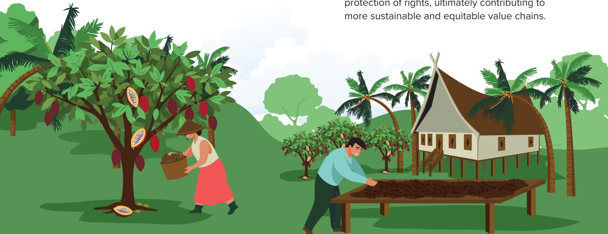

### **COUNTRY CASE STUDY**

# **Introduction**

As a major producer and exporter of these products, Indonesia faces both opportunities and challenges in promoting sustainable and deforestation-free agriculture. Smallholders who form the backbone of these sectors are central to the transition, but often require targeted support to meet sustainability requirements. The government, development partners, and market actors are working together to prepare stakeholders, strengthen local capacities, and align agricultural production with forest conservation goals. This brief is based on a global literature review and country review of Indonesia's sustainable agriculture for the cocoa commodity in Central Sulawesi, available project documents, and other relevant reports, and findings from a Training-of-Trainers (ToT) workshop in Central Sulawesi.

Sustainable agriculture in forest landscapes aims to reduce deforestation and associated emissions by ensuring that the production and trade of commodities (such as cocoa, coee, palm oil, rubber and wood) are carried out in ways that protect forests and comply with national laws while enhancing agricultural livelihoods. This involves full farm-level traceability, verification that supply chains are free from deforestation, and the adoption of practices that prevent forest loss, improve yields, and benefit rural communities in all their diversity.

### **Central Sulawesi (Lore Lindu) landscape and deforestation challenges**

The Lore Lindu Biosphere Reserve in Central Sulawesi is a biodiversity hotspot and cultural heritage site, featuring endemic wildlife and ancient megaliths (SASCI+, 2022). This area known as Lore Lindu National Park (TNLL), is a UNESCO Biosphere Reserve. TNLL is surrounded by villages with diverse tribes and cultural traditions, where gender norms impact labour, asset access, and decision-making. The SAFE project works in the Biosphere Reserve area located at districts of Sigi, Poso, and Donggala, promoting sustainable agriculture that balances conservation with economic development. Central Sulawesi lost over 425,000 ha of forest between 2015 and 2024 due to mining activity and land clearing for agriculture.

Although forest loss dropped in 2024, communities' reliance on wood for livelihoods keeps pressure on forests. Balancing conservation and livelihoods faced complex challenges, especially in the cocoa sector, which is key to local economies but depends on healthy ecosystems.

### **Sustainable Agriculture for Forest Ecosystems (SAFE) project**

The SAFE project promotes sustainable value chains and forest conservation. In collaboration with CIFOR-ICRAF, SAFE focuses on supporting smallholders, especially women, IPLCs and other marginalized groups, ensuring that sustainability requirements create fair opportunities in the transition to deforestation-free agriculture. In Indonesia, Deutsche Gesellschaft für Internationale Zusammenarbeit (GIZ) and the Ministry of National Development Planning (BAPPENAS) implement SAFE to empower smallholders through practices like Good Agricultural Practices (GAP) and conservation of High Conservation Value (HCV) and High Carbon Stock (HCS) areas. The project also promotes scalable, sustainable practices through the 'SAFE Challenge' and prioritizes gender equity, knowledge sharing, and policy integration.

### **ToT SAFE project on GESI+**

A three-day ToT on sustainable and deforestation-free agriculture, focusing on GESI+ was conducted in September 2025 through collaboration between GIZ, CIFOR-ICRAF, and the Regional Development Planning Agency (BAPPEDA) Central Sulawesi Province. The training brought together approximately 35 participants from diverse stakeholder groups, including government, small-scale farmer representatives, civil society organizations (CSOs), and private sector. The objective was to enhance the capacity of these stakeholders in Central Sulawesi to promote sustainable and deforestation-free agriculture in cocoa farming systems in a way that is fair, inclusive, and gender responsive. The training introduced critical concepts around intersectional inclusion, recognizing that gender intersects with complex social identities such as age, ability, ethnicity, religion, class and others, that create unique experiences of privilege or marginalization that aect cocoa value chain participation. In so doing, this training moves beyond environmental sustainability to also advance equitable and just transitions to deforestationfree agriculture.

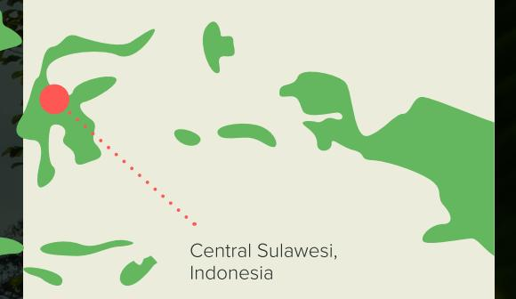

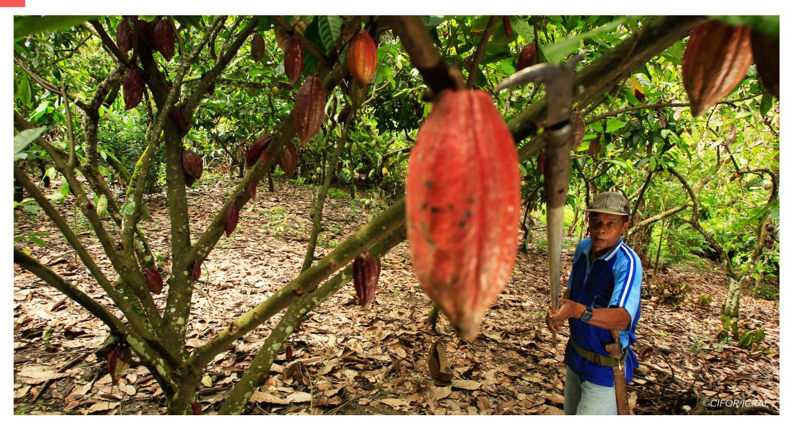

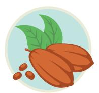

## **Cocoa value chain dynamics**

Cocoa production in Indonesia is a cornerstone of the rural economy, providing livelihoods for hundreds of thousands of farming households. In Central Sulawesi, it is both a primary source of income and a cultural staple, producing nearly one-quarter of national output. Over 95% of cocoa comes from small farms under two hectares, typically family-managed within mixed farming systems and insecure tenure claims (Potts et al., 2014). Cocoa remains the main cash crop for many households in the Biosphere Reserve Lore Lindu landscape.

### **Structure of the cocoa value chain**

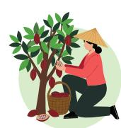

In Central Sulawesi, the cocoa value chain operates through a hierarchy of actors (SASCI+, 2022). Results from the workshop confirmed that the cocoa value chain in Central Sulawesi follows a typical pattern, from input to production and several post-harvest processing steps, though the sequence can vary as some value chain actors play multiple roles.

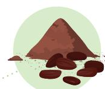

**Smallholder farmers**  cultivate, harvest and process cocoa

**Village-level collectors**  aggregate beans from many farms

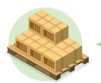

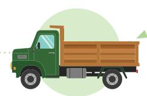

**District traders or warehouses** deliver to processors or exporters

**Processors or exporters**  (companies like PT Olam and PT Cargill)

While this structure eciently consolidates supply, it mixes beans from dierent sources early in the upstream part of the value chain, complicating recent eorts to track and trace agricultural practices to the farm-level. The dominance of intermediaries (aggregators and traders) further hinders traceability, especially for farmers lacking formal land tenure.

**Pricing** in the cocoa value chain is shaped by global commodity markets, but locally, aggregators hold significant bargaining power. Smallholders are quite exposed to value-chain disruptions and vulnerable to impending debt. Farmers needing quick cash often sell raw or minimally processed products at reduced prices with little negotiation (Kelley, 2020). Few belong to cooperatives or producer organizations.

**Participants highlighted the need for more smallholder support and more ecient value chains**. They pointed to the example of cooperatives that have successfully pursued vertical integration to combine roles, shorten the value chain by removing intermediaries, and improve value capture and inclusivity at the producer level. However, they acknowledged that challenges like climate change and other shocks (e.g., COVID-19 pandemic) have exacerbated existing inequalities and disproportionately aected women, tenure-insecure and resourcepoor farmers, emphasizing the importance of responding to these complexities for more equitable and resilient value chains. SAFE supports sustainability through training, organization strengthening, replanting, gender and intersectional inclusion, and aordable digital traceability tools.

### **Gender roles and division of labour**

### **Gender norms in Central Sulawesi influence all stages of cocoa**

**production.** Men typically handle land clearing, pruning, and transporting beans, while women manage seedling preparation, pod breaking, fermentation, drying, and farm finances. Women in rural areas, however, face significant barriers to rights and resources (European Forest Institute, 2024):

⊲ Women's roles are often undercounted and undervalued, with limited access to land titles, credit, and training (Arwida et al., 2016). ⊲ Sales are usually handled by men, reducing women's direct control over the producer price and on-farm investment decisions, autonomy to participate in training, or join collective marketing. ⊲ Without formal land documentation, women farmers may not be recognized as eligible suppliers in certified sustainable or deforestation-free value chains, reducing their participation in programmes that support market access and livelihood improvement.

**Despite their major contribution to production and post-harvest processing, these barriers risk excluding women from potential benefits of transitioning to sustainable and deforestationfree agriculture.** Women producers lack the tools to build resilience, having neither control over land nor access to resources, rendering them more vulnerable to poverty and inequality.

*Mapping barriers and constraints to gender equity during ToT*

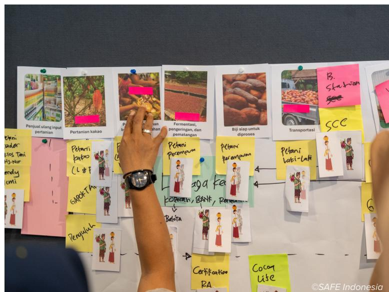

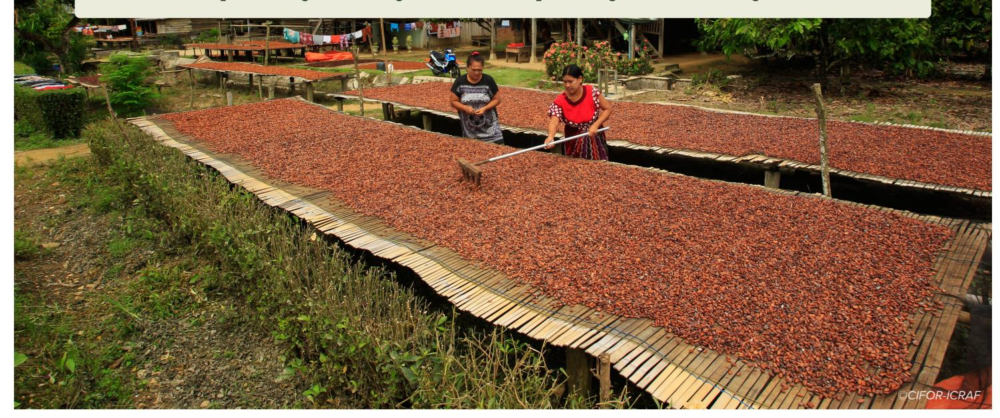

Sustainable cocoa farming in Central Sulawesi faces challenges such as women having limited access to land, Indigenous communities lacking formal support, and smallholder farmers generally being vulnerable to middlemen. Women and less inƃuential groups are excluded from decision-making, hindering their ability to beneƂt from sustainable agriculture programmes that may be more resource intensive. Addressing these issues requires a comprehensive approach that includes recognizing women's land rights and those of informal rights holders, collecting gendersensitive data, promoting inclusive governance, and providing tailored training to farmers.

### **Intersectionality**

The ToT workshop participants emphasized that **gender roles and intersectional division of labour may vary across the regions**. For example, in South Kulawi Sigi district, men and women share roles in cocoa farming and harvesting, but men dominate transportation. Women are involved in processing, and some female farmers, especially widows, take on multiple roles, showcasing their resilience. In North Lore Poso district, women are involved in postharvest activities like fermentation, but men often dominate cultivation.

In South Sulawesi, land ownership is open to multi-ethnic groups but certain ethnic groups like the Bugis dominate financial institutions and land ownership due to stronger financial resources. Similarly, in Lembah Nafsu, land ownership and access to financial institutions are open to various ethnic groups, and landowners have more opportunities. Many IPLCs maintain customary tenure systems that are recognized under the constitution, as long as they do not conflict with higher state principles. However, these systems are formalized only through government programmes.

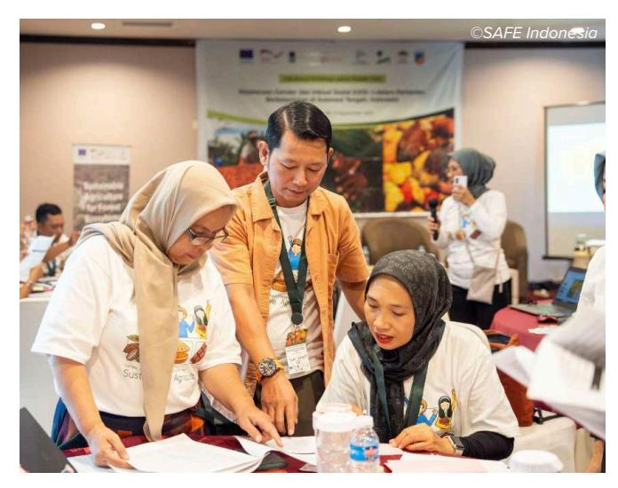

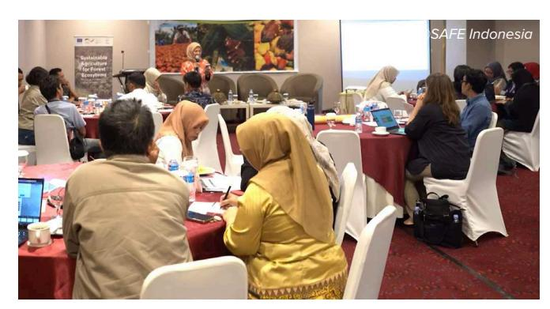

### **Production challenges**

The workshop participants in Palu identified several production challenges for smallholder cocoa farmers, including labour shortages, poor infrastructure, quality issues, unfavourable weather, limited access to loans, knowledge gaps, regulatory hurdles, and declining production. To address these, they proposed forming labour groups, improving infrastructure, implementing

good agricultural practices, educating farmers, enhancing financial access, providing training and equipment, promoting sustainable practices, and utilizing technology. Additionally, strengthening partnerships along the supply chain and providing insurance to farmers would improve production and market access.

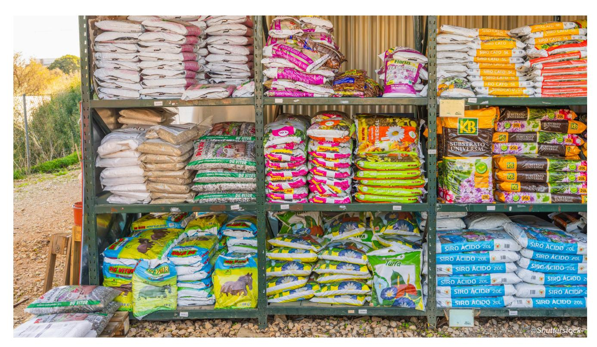

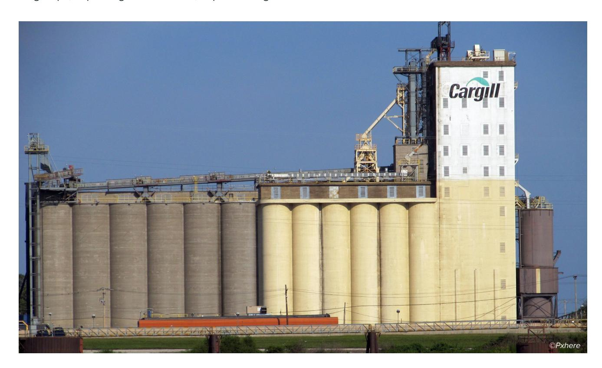

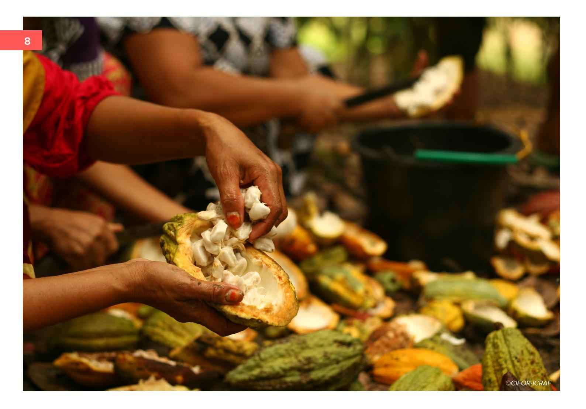

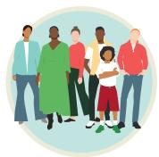

## **Stakeholder landscape**

Sustainable agriculture in Indonesia involves diverse stakeholders, from national government and provincial authorities to private companies, farmer cooperatives, certification bodies, and CSOs, each with distinct roles and priorities.

In Central Sulawesi's Lore Lindu landscape, smallholders dominate cocoa production, while multinational corporations control export channels, making collaboration vital (Muslimin et al., 2017). The government aims to protect livelihoods and market access, companies seek compliant supplies, smallholders want fair compensation and resources, and CSOs push for equity. Risks include shifting compliance costs to farmers or disrupting trade.

By addressing both governance and technical challenges, SAFE ensures that sustainable agriculture practices benefit all actors in the cocoa value chain, including marginalized groups, while maintaining Indonesia's market competitiveness:

⊲ SAFE convenes all actors to co-design traceability, legality verification, and sociallyinclusive governance, aligning interests toward sustainability without excluding smallholders. ⊲ SAFE supports farmers by facilitating Surat Tanda Daftar Budidaya (STDB) registration to formalize tenure and improve participatory mapping, training on land rights, and cooperation with government agencies to integrate traceability and environmental monitoring.

### *Role of national government in sustainable agriculture and forest ecosystems*

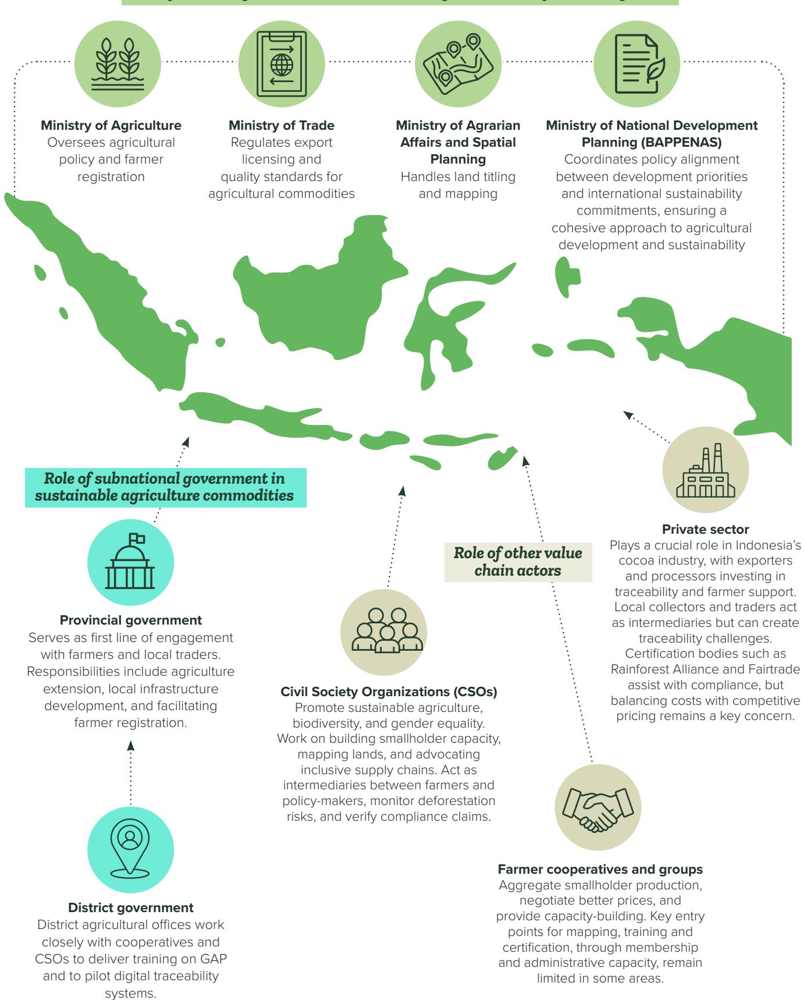

## **Traceability for sustainable and deforestation-free commodities**

Sustainable and deforestation-free agriculture principles require accurate geolocation of all production plots and evidence that farming practices maintain forest cover and comply with relevant environmental and social standards and national laws. Meeting these requirements for verifiable data on product origin, geolocation, and regulatory compliance can be particularly challenging for smallholder farmers (Table 1), who often lack adequate financial resources and technological capacity (Regional Community Forestry Training Center, 2024).

### **Indonesia's traceability framework is underpinned by key laws and regulations:**

⊲ The Basic Agrarian Law (Law No. 5/1960) establishes the principles for land rights and tenure. ⊲ Government Regulation No. 23/2021 sets provisions for the recognition and management of customary forests. ⊲ The Indonesian Sustainable Palm Oil (ISPO) certification framework, though developed for palm oil, provides an important precedent for sustainability and traceability standards that can be adapted to cocoa.

⊲ **Key institutions:** Ministry of Agriculture, Ministry of Agrarian Aairs and Spatial Planning/National Land Agency (ATR/ BPN), Ministry of Environment and Forestry, Geospatial Information Agency.

**Current cocoa traceability relies on voluntary certification** (Rainforest Alliance, UTZ, Fairtrade) and company-led systems, which vary in coverage and standards. A transparent system is required to connect farm-level data with national platforms and meet buyer requirements.

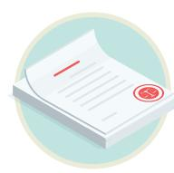

*Table 1. Key challenges, innovations and opportunities for advancing traceability systems for cocoa in Indonesia*

|               |                                       | Land legality: Many smallholders      |
|---------------|---------------------------------------|---------------------------------------|
|               |                                       | Equity gaps: Women and                |
|               | ⊲ SAFE project (West Kalimantan,      |                                       |
|               | ⊲ Promotion of STDB farmer            |                                       |
|               | registration to improve transparency. |                                       |
|               |                                       | ⊲ Village-owned enterprises serve     |
|               |                                       | ⊲ Certification bodies and companies  |
|               |                                       | conduct farm audits , while women’s   |
|               |                                       | ⊲ Multi-stakeholder platforms work to |
| Opportunities | ⊲ Integrate existing systems          |                                       |
|               | databases) into a unified national    |                                       |
|               | ⊲ Expand GPS and satellite mapping    |                                       |
|               | ⊲ Provide inclusive training and      |                                       |
|               | financial incentives to ensure        |                                       |
|               |                                       | ⊲ Align land, forestry, and           |
|               |                                       | agriculture regulations to eliminate  |
|               |                                       | ⊲ Leverage verified traceability as a |
|               |                                       | market advantage for sustainably      |

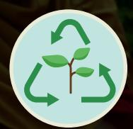

## **Social and environmental sustainability**

Sustainability in Indonesia's agriculture requires balancing economic productivity, environmental protection, and social equity (Table 2). It involves preserving ecosystem health, supporting fair labour conditions, and promoting inclusive market participation, while aligning national policies, local practices, and international market expectations.

*Table 2. Environmental and social sustainability in Indonesia's agriculture*

### *Environmental sustainability Social sustainability*

⊲ **Prevent deforestation, forest degradation, and biodiversity loss**, while reducing greenhouse gas emissions. ⊲ **Address land-use change pressures** from plantation expansion, mining, infrastructure, and shifting cultivation. ⊲ **Conserve biodiversity-rich habitats**, especially in Central Sulawesi, West Kalimantan, and Lampung. ⊲ **Strengthen environmental governance** via multi-stakeholder partnerships, jurisdictional sustainability initiatives, and collaborative landscape management. ⊲ **Integrate sustainability** into spatial planning, land tenure reform, and commodity governance. ⊲ **Promote agroforestry, integrated pest management, and intercropping** to boost productivity while maintaining ecological health. ⊲ **Use modern technology** (GPS, satellite monitoring) for transparency and compliance tracking. ⊲ **Partner with international organizations** for technical assistance, market access, and capacitybuilding.

⊲ **Gender equity and social inclusion are integral** programmes should actively include women, youth, and marginalized groups in training, leadership, and decision-making. ⊲ **Ensure equitable distribution of benefits and opportunities** within agricultural systems for smallholders, women, and Indigenous Peoples. ⊲ **Tackle barriers** to land ownership, credit, training, and market access—only 24.2% of registered land is under female ownership. ⊲ **Recognize and value women's roles** in production, post-harvest processing, and farm financial management, ensuring they are part of formal decision-making. ⊲ **Support women-led cooperatives, Village Savings and Loan Associations (VSLA), and communitybased enterprises** to boost resilience and market access. ⊲ **Provide stable markets, fair pricing, and technical capacity** for GAP and Good Environmental Practices (GEP). ⊲ **Diversify income** through agro-tourism, valueadded processing, and sustainable enterprises. ⊲ **Collect and apply gender-disaggregated data** to monitor inclusion, identify gaps, and track progress in reducing inequalities.

**Examples:** SAFE Project, Cocoa Sustainability Partnership—linking productivity gains with environmental safeguards

**Examples:** SAFE Project, Cocoa Sustainability Partnership, VSLA initiatives, women-led cooperatives

## **Relevant national legislation for deforestation-free agriculture**

Non-deforestation is central to Indonesia's sustainable agriculture agenda, ensuring palm oil, cocoa, coee, and rubber production avoids forest loss. Vast rainforests, peatlands, and mangroves sustain biodiversity, climate stability, and rural livelihoods, yet expansion drives deforestation.

Laws exist but face weak enforcement, overlapping claims, and planning gaps, especially for smallholders lacking secure titles (European Forest Institute, 2025). Women and IPLCs are key forest stewards, yet are underrepresented in decision-making spaces. Gender equity and social inclusion priorities must also be aligned with fiscal incentives, restoration investment,

and agroforestry with conservation initiatives to boost resilience. Meeting EU and other market standards requires strong legislation (Table 3), inclusive governance, and economic incentives, turning deforestation-free transitions into a national and competitive advantage (Van Noordwijk et al., 2025).

### *Land use rights*

#### **Key legal instruments & governance frameworks**

⊲ Land governance combines statutory and customary (adat) rights under the Basic Agrarian Law No. 5/1960. ⊲ Key laws: Law No. 6/2023 (spatial planning and equitable land use); Government Regulation (GR) No. 18/2021 (cultivation/building rights); GR No. 23/2021 (tenure in state forest areas); Presidential Regulation (Pres. Reg.) No. 62/2023 (agrarian reform). ⊲ Sectoral rules: Pres. Reg. No. 16/2025; Ministry of Agriculture Regulations No. 38/2020 and No. 49/2014 (Indonesian Sustainable Palm Oil – ISPO, sustainable coee); Ministry of Agrarian Aairs/Spatial Planning–National Land Agency (ATR/BPN) Decree No. 18/2021; Ministry of Environment and Forestry (KLHK) Decree No. 9/2021 (planning, social forestry). ⊲ Constitutional Court rulings strengthen Indigenous community stewardship.

#### **Challenges**

⊲ Overlapping statutory and customary laws and weak implementation. ⊲ Only ~25% of registered land is held by women, limiting compliance and documentation.

#### **Opportunities**

⊲ Gender-sensitive reforms can improve tenure security, compliance processes, and community stewardship.

### *Environmental protection*

### **Key legal instruments & governance frameworks**

⊲ Environmental governance evolved from the Environmental Impact Assessment (EIA) Law (1982) to Law No. 32/2009 (Environmental Protection and Management), updated by Law No. 11/2020 (Job Creation) and GR No. 22/2021 (approvals, waste, pollution control). ⊲ Other laws: Basic Agrarian Law; Law No. 6/2023; GR No. 18/2021; GR No. 23/2021; ATR/BPN Decree No. 18/2021; KLHK Decree No. 9/2021; Ministry of Agriculture Regulations No. 38/2020, 49/2014, 132/2013; Ministry of Energy and Mineral Resources (ESDM) Regulation No. 4/2025. ⊲ Framework applies to ISPO, rubber, and coee sustainability schemes.

#### **Challenges**

⊲ Rapid deforestation near Lake Poso, where women act as environmental defenders despite limited inclusion in governance. ⊲ Weak and uneven enforcement; limited participation by rural and Indigenous women. ⊲ Compliance barriers for smallholders; gaps in gender indicators and disaggregated environmental data.

*Table 3. Relevant national legislation to regulate and incentivize sustainable agriculture in forest ecosystems in Indonesia*

#### *Forest use & management*

| Forest use & management Key legal instruments & governance frameworks                                                                                                                                                        |
|------------------------------------------------------------------------------------------------------------------------------------------------------------------------------------------------------------------------------|
| ⊲ Based on the Basic Agrarian Law; Law No. 6/2023; GR No. 18/2021; GR No. 23/2021; KLHK Decree No. 9/2021; Pres. Reg. No.                                                                                                    |
| ⊲ Instruments: ISPO, Social Forestry schemes, and the Timber Legality Verification System (SVLK), which define forest-use categories,                                                                                        |
| ⊲ Traceability systems: SVLK; Forest Product Administration Information System (SIPPH/SIPKH); Plantation Product Traceability Challenges                                                                                     |
| ⊲ Women’s contributions to forest management remain undervalued due to literacy gaps and entrenched norms.                                                                                                                   |
| ⊲ Persistent gender barriers in forestry roles and access to information.                                                                                                                                                    |
| ⊲ Limited uptake of digital traceability among smallholders. Opportunities                                                                                                                                                   |
| ⊲ Integrating gender indicators into monitoring; strengthening KLHK–Ministry of Women’s Empowerment and Child Protection (MOWECP) coordination. Labour rights Key legal instruments & governance frameworks                  |
| ⊲ Legal basis includes Law No. 6/2023 (Job Creation) and Law No. 5/1960 (anti-exploitation), which establish protections, fair wages, and non-discrimination.                                                                |
| ⊲ Supporting regulations: GR No. 23/2021; Pres. Reg. No. 16/2025; Ministry of Agriculture Regulations No. 38/2020, 49/2014, 132/2013; ESDM Regulation No. 4/2025.                                                            |
| ⊲ ISPO labour standards address safety, union rights, and good human practices but lack gender indicators. Challenges                                                                                                        |
| ⊲ Cocoa production relies heavily on informal family labour, aecting documentation and compliance.                                                                                                                          |
| ⊲ Women in rural and Indigenous contexts remain under-represented in cooperatives, contracts, and formal labour structures.                                                                                                  |
| ⊲ Informal and unpaid labour roles remain unrecognized. Opportunities                                                                                                                                                        |
| ⊲ Gender-responsive audits, simplified documentation, and greater visibility and recognition of women’s informal contributions. Human rights under international law Key legal instruments & governance frameworks           |
| ⊲ National: Law No. 39/1999 (Human Rights), Basic Agrarian Law; Law No. 6/2023; GR No. 18/2021; GR No. 23/2021; KLHK Decree No. 9/2021.                                                                                      |
| ⊲ International: Convention on the Elimination of All Forms of Discrimination against Women (CEDAW, 1984); International Challenges                                                                                          |
| ⊲ Smallholders often lack land titles, and women’s contributions are undocumented; Social Forestry programmes oer potential but gender monitoring is weak.                                                                  |
| ⊲ Gaps between formal rights and implementation; limited gender-disaggregated monitoring. Opportunities                                                                                                                      |
| ⊲ Harmonizing national and customary law, strengthening gender mandates, and aligning traceability with rights protections. FPIC regulation (Free, Prior and Informed Consent) Key legal instruments & governance frameworks |
| ⊲ International frameworks: VPA (2013); CEPA talks; CEDAW; ILO Conventions 105 and 111; ICCPR; ICESCR; UNFCCC; REDD+ 2014); Yogyakarta Principles (2006).                                                                    |
| ⊲ FPIC obligations include upholding Indigenous Peoples and Local Communities (IPLCs) rights, ensuring non-discrimination, decent work, and securing consent prior to land-use change. Challenges                            |
| ⊲ Cocoa farmers, Indigenous groups, and women face significant structural barriers (titles, timeframes for consultation, access to recourse).                                                                                |
| ⊲ FPIC remains procedural rather than substantive; facilitation rarely includes gender-sensitive or local-language approaches. Opportunities                                                                                 |
| ⊲ Rights-based traceability; joint gender-responsive monitoring; operationalizing FPIC as a substantive safeguard.                                                                                                           |

## **Risk factors for sustainable and deforestation-free cocoa**

The shift to sustainable and deforestation-free agriculture in Indonesia's cocoa sector brings significant opportunities but also multiple risks (technical, legal, financial, and social) that could disproportionately impact smallholders, women, IPLCs, and other marginalized groups such as landless youth, migrants, or other groups..

⊲ **Many farmers in Central Sulawesi, especially women and Indigenous producers, lack formal land certificates** due to cultural norms, inheritance rules, and bureaucratic barriers, leading to land tenure insecurity (SASCI+, 2022). Customary tenure systems are not formalized, and accessing permits or reclassification for plots in forest estate zones is often impossible without resources or connections (Gregory and Ozinga, 2025). ⊲ **Traceability gaps exist** due to reliance on local aggregators, incomplete and non-genderdisaggregated farmer registries, and lack of linkage to deforestation monitoring, rendering women farmers invisible and excluded from incentives (SASCI+, 2022). ⊲ **Historical deforestation and weak records hinder verification**, particularly for older cocoa plots. Shifting cultivation systems, used by resource-poor farmers, may be misclassified as deforestation under sustainability frameworks (Van Noordwijk et al., 2025). ⊲ **Many smallholders lack knowledge of sustainability requirements and traceability systems** due to limited access to training, leading to exclusion from sustainable practices. ⊲ **The cost of compliance, including farm mapping and upgrades, is unaordable for most smallholders** (Wibowo et al., 2023), with women, tenure-insecure and resourcepoor farmers facing higher exclusion risks due to limited access to credit and collateral (European Forest Institute, 2024). ⊲ **Women's crucial roles in cocoa production are undervalued**, and their underrepresentation in decision-making perpetuates exclusion from benefits and leadership opportunities. ⊲ **Institutional gaps**, including fragmented databases and poor coordination, hinder verification and disproportionately aect farmers lacking bureaucratic connections (Nagara et al., 2024). ⊲ **Market volatility and delayed payments in sustainable supply chains** push farmers to prioritize short-term needs, often forcing them to sell to quick-sale buyers, with women farmers particularly aected due to household financial responsibilities.

### *Sub-national legislation*

#### **Key legal instruments & governance frameworks**

⊲ Central Sulawesi: People's Consultative Assembly (MPR) Decree No. IX/MPR/2001 (Indigenous tenure); Provincial Regulation No. 3/2019 (women/child protection); No. 9/2014 (gender mainstreaming); Sigi District Regulation No. 6/2023 (gender-just governance). ⊲ Spatial planning: Provincial Regulation No. 8/2013 (forest re-designation) and No. 1/2023 (provincial spatial plan) may conflict with deforestation criteria; Provincial Regulation No. 8/2019 (forest management); Governor's Circular No. 16/2025 (gender mainstreaming) supporting community forestry and participatory decision-making.

#### **Challenges**

⊲ Limited enforcement of gender-specific provisions; weak alignment between local and national frameworks.

#### **Opportunities**

⊲ Stronger harmonization with national laws and inclusion of gender-responsive safeguards to support community forestry.

The multi-stakeholder workshop participants identified **seven key risk factors that may hinder smallholder farmers** from transitioning to deforestation-free production, including:

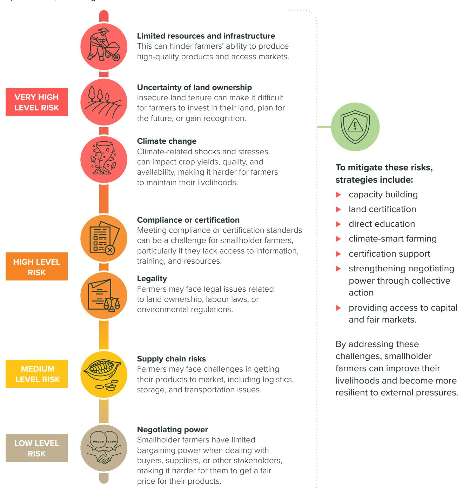

**The SAFE project tackles these risks with a strong GESI+ focus, integrating gender and social inclusion into all interventions,** including participatory land mapping that records women's and customary rights, low-cost mobile mapping tools, locallanguage awareness campaigns, women's leadership in cooperatives, gendersensitive monitoring, and cost-sharing models that protect small producers.

## **Opportunities for social inclusion and equity in sustainable agriculture**

**Stakeholder engagement opportunities include promoting gender- and equityresponsive governance in cooperatives** and leveraging public-private partnerships to cofinance infrastructure and integrate gender and social inclusion targets. **1**

> Findings from the workshop highlighted additional stakeholder engagement opportunities: in Sigi and Poso, they include collaborating with government agencies like the Department of Agriculture and Forestry, private sector partners like PT JB Cocoa, and local institutions such as farmer groups, cooperatives, and customary institutions focused on forest conservation. Potential partnerships also involve TNLL, BAPPEDA, and agencies supporting agriculture, conservation, and community empowerment. **Key areas of collaboration include agroforestry, land certification, data management, and establishing complaint mechanisms and referral systems.**

**Legal opportunities by strengthening land rights for marginalized groups** (women, IPLCs and other tenure-insecure groups) through targeted land registration programmes and participatory mapping to secure legal recognition for customary and jointly owned lands. **2**

> The workshop's participants suggested leveraging frameworks like the Village Law, Local Regulation No. 4/2019 on sustainable agriculture, and the Regional Medium-Term Development Plan (RPJMD) to support farmers' interests in land use, worker rights, and agricultural development. Customary laws, such as traditional pesticide prohibitions, and a new regulation on Indigenous communities in Central Sulawesi, can also be utilized. Minister of Agriculture Regulation No. 67/2016 provides guidance on agricultural institutional development.

**Market opportunities include embedding gender inclusion in traceability systems** and delivering dual environmental and social benefits to strengthen compliance, protect forests, and generate social gains for cocoaproducing communities. **3**

> Workshop findings suggested leveraging cooperatives, certification schemes like Rainforest Alliance and organic certification, and digital platforms to access global markets, particularly in Europe, which values sustainability and human rights. Promoting organic farming practices, storytelling, and social media strategies can also enhance product appeal. Collaborations with national parks and highlighting sustainable practices can support product promotion. Additionally, targeting niche markets like specialty cocoa and utilizing exhibitions can increase global presence.

A **data opportunity is expanding access to capacity building** by delivering training in flexible and localized formats to improve farm productivity and competitiveness, targeting women, youth, IPLCs and marginalized groups. **4**

> Results from the workshop suggested leveraging data sharing, jurisdictional approaches, and technology to support smallholders. Standardized village profiles and data synchronization can enhance datadriven decision-making. Regulations or policies can ensure data consistency, and online marketplaces can be optimized. Gathering sensitive data on issues like deforestation and women's conditions, and using GPS/polygon data, can meet global market standards. Certification schemes require tracing product origins, verifying farm locations, and involving marginalized groups in training programmes, highlighting the importance of integrating gender perspectives.

The shift toward sustainable agriculture introduces new compliance challenges but also opens important opportunities to address long-standing gender and social equity gaps in the cocoa value chain. With deliberate planning, these initiatives can strengthen smallholder resilience, enhance women's participation, and promote more inclusive governance in agricultural and forest landscapes. Key opportunities include:

# **Recommendations**

To maximize the benefits of sustainable and deforestation-free agriculture for all stakeholders in Central Sulawesi's cocoa sector, equity-focused measures must be embedded in every stage of planning and implementation.

⊲ **Land tenure programmes** should prioritize joint titling for spouses and formal recognition of customary lands, enabling women and Indigenous communities to meet legality requirements and access credit. ⊲ **Traceability systems** must capture gender-disaggregated data so women are formally recognized as supply chain actors (Siscawati and Mahaningtyas, 2012) and eligible for training, technical assistance, and market incentives. ⊲ **Capacity building** should address participation barriers through flexible schedules, childcare support, and local-language materials, targeting women, IPLCs, youth, and other marginalized groups (Arwida et al., 2016). ⊲ **Farmer cooperatives** should adopt inclusive governance to ensure equitable representation (e.g., gender quotas in leadership and transparent benefit-sharing). ⊲ **Public–private partnerships** should embed gender and inclusion targets, co-financing mapping tools, fermentation facilities, and legal document processing to ease compliance burdens and ensure equal access.

These actions can align environmental stewardship with social equity for cocoa-producing communities.

### **References**

- Arwida SD, Maharani CD, Basnet BS, Yang AL, Resosudarmo DP, Wong GY, Brockhaus M, Madhavan P. 2016. Gender in forestry and REDD+ in Indonesia. Info brief. Bogor (Indonesia): Center for International Forestry Research (CIFOR). European Forest Institute. 2025. Inclusion of Indonesian smallholders in European Union supply chains under the EU Deforestation Regulation: challenges and potential mitigation measures. Available from: https://efi.int/news/ reviews-smallholder-challenges-and-indigenous-oil-palmproduction-indonesia-2025-01-20 European Forest Institute. 2024 Aug 28. EUDR relevant gender-related provisions in Indonesian and Malaysian legal frameworks for palm oil production. Available from: https:// efi.int/news/paper-gender-dimensions-indonesian-andmalaysian-legal-frameworks-palm-oil-relevant-eu Gregory M, Ozinga S. 2025. Indonesian palm oil smallholders and the EUDR: impacts and ways forward. Brussels (Belgium): Fern. Available from: https://www.fern.org/ publications-insight/indonesian-palm-oil-smallholders-andthe-eudr-impacts-and-ways-forward/ Kelley LC. 2020. Explaining the limitations of agricultural intensification initiatives in Sulawesi, Indonesia. Front Sustain Food Syst. 4:529074. https://doi.org/10.3389/ fsufs.2020.529074 Muslimin, Nersiwad, Tallesang M. 2017. The potential and supply chain of cocoa in Central Sulawesi, Indonesia. Russian Journal of Agricultural and Socio-Economic Sciences. 67(7):62–68. https://doi.org/10.18551/ rjoas.2017-07.06 Nagara G, Muttaqien A, Richwanudin SA, Dewi RC, Afra
- S. 2024. Manis pahit nasib petani kakao Indonesia: menangkap peluang penguatan petani melalui EUDR. Jakarta (Indonesia): Satya Bumi. Potts J, Huppé GA, Voora V, Wilkings A, editors. 2014. The state of sustainability initiatives review 2014: standards and the green economy. Winnipeg (Canada): International Institute for Sustainable Development. Regional Community Forestry Training Center. 2024. Potential impacts of the EU Regulation on deforestation-free products (EUDR) on smallholders in Thailand and Indonesia: case studies on rubber, timber and coee. Bangkok (Thailand): RECOFTC. SASCI+. 2022. Gender and social gap assessment and advisory. [Report]. Siscawati M, Mahaningtyas A. 2012. Gender justice: forest tenure and forest governance in Indonesia. Washington (USA): Rights and Resources Initiative. Van Noordwijk M, Dewi S, Minang PA, Harrison RD, Leimona B, Ekadinata A, Burgers P, Slingerland M, Sassen M, Watson C, Sayer J. 2025. Beyond imperfect maps: evidence for EUDRcompliant agroforestry. People Nat. 7(7):1713–1723. https:// doi.org/10.1002/pan3.70088 Wibowo LR, Erdi E, Hutabarat S, Nurfatriani FN, Utomo M, Nawireja IK, Pramudya EP, Kurniasari DR, Cahyono E, Kurniadi R, Santosa A, Fuad Z, Satwiko AA. 2023. Accelerating certification of oil palm smallholders through institutionalization of various incentives. For Soc. 7(2):263–
  - 294. https://doi.org/10.24259/fs.v7i2.24679

### **Acknowledgements**

This research is based on collaboration between CIFOR-ICRAF and the Sustainable Agriculture for the Environment (SAFE) project of the Deutsche Gesellschaft für Internationale Zusammenarbeit (GIZ) GmbH, funded by the European Union (EU) and the German Federal Ministry for Economic Cooperation and Development (BMZ). We would like to thank the GIZ Indonesia Country, the GIZ SAFE project in Palu, Central Sulawesi, and LIBU Perempuan for all their support to the CIFOR team during the implementation of ToT in Palu, Central Sulawesi, and for their valuable comments and feedback for this brief.

© 2026 Centre for International Forestry Research and World Agroforestry (CIFOR-ICRAF), Deutsche Gesellschaft für Internationale Zusammenarbeit (GIZ)

### **Citation:**

Liswanti N, Gallagher EJ, Ramadhan H. 2026. *Gender Equity, Social Inclusion and Intersectionality (GESI+) in Sustainable and Deforestation-free Agriculture: Lessons from Central Sulawesi, Indonesia.* KANDS Collective, Editor. CIFOR: Bogor, Indonesia; ICRAF: Nairobi, Kenya; and GIZ: Bonn (Germany).

This product is a partnership between the CIFOR-ICRAF and the SAFE project, financed by the European Union (EU), the German Federal Ministry for Economic Cooperation and Development (BMZ) and the Dutch Ministry of Foreign Aairs (BZ). SAFE is part of the Fund for the Promotion of Innovation in Agriculture (i4Ag) and implemented by Deutsche Gesellschaft für Internationale Zusammenarbeit (GIZ). Its contents are the sole responsibility of CIFOR-ICRAF and do not necessarily reflect the views of the EU, BMZ, and the BZ.

#### **Produced by:**

KANDS Collective | hello@kandscollective.com

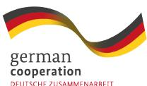

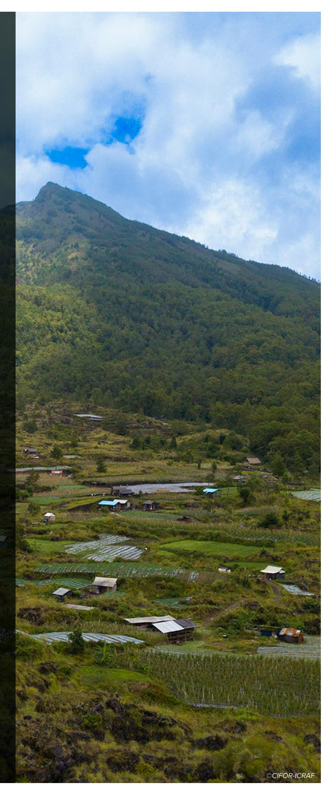