# *Gender Equity and Social Inclusion + Intersectionality (GESI+)*

for Deforestation-free Value Chains

**FACILITATION TOOLKIT**

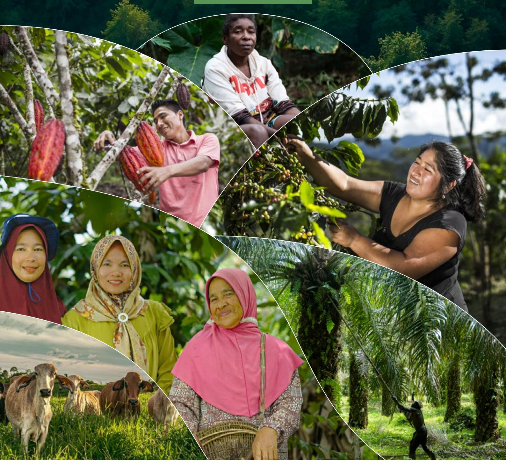

© 2026 Centre for International Forestry Research and World Agroforestry (CIFOR-ICRAF), Deutsche Gesellschaft für Internationale Zusammenarbeit (GIZ)

Gallagher E, Liswanti N, Mello D, Vallejo E. 2026. Gender Equity and Social Inclusion + Intersectionality (GESI+) for Deforestation-free Value Chains: Training of Trainers (TOT) Facilitation Toolkit. KANDS Collective, Editor. CIFOR: Bogor, Indonesia; ICRAF: Nairobi, Kenya; and GIZ: Bonn, Germany.

**Authors:** Emily J. Gallagher, Nining Liswanti, Denyse Mello, Elizabeth Vallejo

**Contributing authors:** Luciana Rocha, Cecilia Novarina, Diana Armendariz Abril, Rusbel Chapalbay, Laura Rondholz, Anna-Sally Westermann

#### **Design and layout:**

KANDS Collective | [hello@kandscollective.com](mailto:hello@kandscollective.com)

**Graphics:** Based on authors work and visuals created by KANDS Collective

**Photo credits:** © GIZ, CIFOR-ICRAF, Erick Rodriguez and workshop participants

**Front and Back Cover images:** © GIZ and K Trautman/ CIFOR-ICRAF

This product is a partnership between the CIFOR-ICRAF and the SAFE (Sustainable Agriculture for Forest Ecosystems) project, financed by the European Union (EU), the German Federal Ministry for Economic Cooperation and Development (BMZ) and the Dutch Ministry of Foreign Aairs (BZ). SAFE is part of the Fund for the Promotion of Innovation in Agriculture (i4Ag) and implemented by Deutsche Gesellschaft für Internationale Zusammenarbeit (GIZ).

This facilitation guide contains no ocial opinion or assessment of the EU Regulation on Deforestationfree Products, EUDR, nor does it reflect the views of the European Union or the Federal Government of Germany and the Dutch Foreign Ministry. It is compiled based on an assessment by GIZ and CIFOR-ICRAF to facilitate discussion and shall not be used as legal advice on the regulation.

The contents are the sole responsibility of CIFOR-ICRAF and do not necessarily reflect the views of the EU, BMZ, and the BZ.

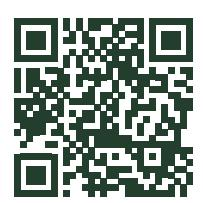

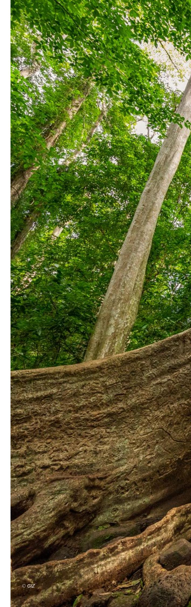

| About the Training-of-Trainers (ToT) | iv |
|--------------------------------------|----|
| Introduction                         | 1  |
| How to use this toolkit              | 2  |

*[Getting started](#page-13-0) 6*

**ICEBREAKER 1. SPEED NETWORKING 8 ICEBREAKER 2. CAPACITY SHARING 9 ICEBREAKER 3. BUILDING NETWORKS 9 ICEBREAKER 4. CHANGING PLACES 10 ICEBREAKER 5. BALL TOSS LEARNING OUTCOMES 10 ICEBREAKER 6. THREE THINGS LEARNING OUTCOMES 11**

## *[GESI+ learning units](#page-19-0) 12*

| Unit 1: Gender Equity and Social Inclusion (GESI) concepts |                                 | 13 |
|------------------------------------------------------------|---------------------------------|----|
| Module 1: Gender and Intersectionality                     |                                 | 14 |
| TOOL 1:                                                    | NORMS, VALUES AND BELIEFS       | 15 |
| TOOL 2:                                                    | UNDERSTANDING GENDER            | 17 |
| TOOL 3:                                                    | UNDERSTANDING INTERSECTIONALITY | 20 |
| Module 2: Gender Equity and Social Inclusion               |                                 | 23 |
| TOOL 4:                                                    | UNDERSTANDING EQUITY            | 24 |
| TOOL 5:                                                    | PROMOTING EQUITY                | 30 |

*[Unit 2: GESI+ in value chains](#page-40-0) 33*

[Module 3: Value chain mapping](#page-41-0) 34

**[TOOL 6:](#page-42-0) [LIVING VALUE CHAINS](#page-42-0) 35 [TOOL 7:](#page-45-0) [VALUE CHAIN MAPPING](#page-45-0) 38 TOOL 8: [GENDERED LABOUR ROLES](#page-47-0) 40 [TOOL 9:](#page-50-0) [INTERSECTIONAL VALUE CHAIN MAPPING](#page-50-0) 43**

[Module 4: Equity-responsive value chain development](#page-52-0) 45

**[TOOL 10:](#page-53-0) [MAPPING BARRIERS AND CONSTRAINTS](#page-53-0) 46 TOOL 11: [EQUITY-RESPONSIVE APPROACHES](#page-55-0) 48**

## *Contents*

| Unit 3: Enabling environment for equity-responsive EUDR  |                                        | 51  |
|----------------------------------------------------------|----------------------------------------|-----|
| Module 5: European Union Deforestation Regulation (EUDR) |                                        | 52  |
| TOOL 12:                                                 | VALUES AND VALUE-BASED PROBLEM SOLVING | 53  |
| TOOL 13:                                                 | EUDR LECTURE                           |     |
| TOOL 14:                                                 | EUDR PANEL                             | 67  |
| TOOL 15:                                                 | EUDR DIALOGUE                          | 69  |
| Module                                                   | 6: Relevant national legislation       | 71  |
| TOOL 16:                                                 | RELEVANT NATIONAL LEGISLATION          | 72  |
| TOOL 17:                                                 | ROUNDTABLES ON NATIONAL LEGISLATION    | 76  |
| Module 7                                                 | : Commodity-specific regulations       | 77  |
| TOOL 18:                                                 | COMMODITY SECTOR READINESS             | 78  |
| TOOL 19:                                                 | SMALLHOLDER READINESS                  | 79  |
| Unit 4: GESI+ action planning                            |                                        | 81  |
| Module                                                   | 8: Risk management                     | 82  |
| TOOL 20:                                                 | RISK ASSESSMENT                        | 83  |
| TOOL 21:                                                 | RISK LEVELS                            | 87  |
| TOOL 22:                                                 | RISK MITIGATION                        | 90  |
| Module                                                   | 9: Opportunities and benefit-sharing   | 94  |
| TOOL 23:                                                 | OPPORTUNITIES FOR CHANGE               | 95  |
| Module 10:                                               | GESI+ action planning for EUDR         | 101 |
| TOOL 24:                                                 | INTERSECTIONAL ACTION PLANNING         | 102 |
| Building a GESI+ learning plan                           |                                        | 106 |
| OUTPUT 1:                                                | LEARNING DESIGN                        | 107 |
| OUTPUT 2:                                                | LEARNING PLAN                          | 110 |
| Evaluation and learning                                  |                                        | 114 |
| EVALUATION 1: TRAINING CHECK OUT                         |                                        | 115 |
| EVALUATION 2: TRAINING SURVEY                            |                                        | 117 |
| EVALUATION 3: POST-TRAINING SURVEY                       |                                        | 121 |
| References                                               |                                        | 123 |

## *List of abbreviations*

| CIFOR-ICRAF | Center for International Forestry and World Agroforestry |
|-------------|----------------------------------------------------------|
| DDS         | Due Diligence Statement                                  |
| EC          | European Commission                                      |
| EU          | European Union                                           |
| EUDR        | European Union Deforestation Regulation                  |
| FAO         | Food and Agriculture Organization of the United Nations  |
| FPIC        | Free, Prior and Informed Consent                         |
| GESI        | Gender Equity and Social Inclusion                       |
| GESI+       | Gender Equity, Social Inclusion and Intersectionality    |
| GIZ         | Deutsche Gesellschaft für Internationale Zusammenarbeit  |
| IPLC        | Indigenous Peoples and local communities                 |
| PWD         | Persons with Disabilities                                |
| SAFE        | Sustainable Agriculture in Forest Ecosystems             |
| SDG         | Sustainable Development Goals                            |
| TEI         | Team Europe Initiative                                   |
| ToT         | Training of Trainers                                     |

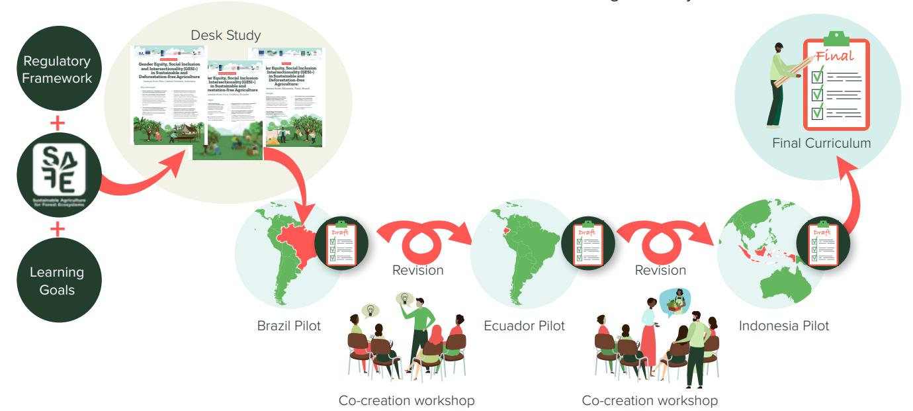

In 2024, the Sustainable Agriculture for Forest Ecosystems (SAFE) project partnered with CIFOR-ICRAF to develop a ToT on Gender Equity and Social Inclusion + Intersectionality (GESI+) within deforestation-free value chains. The initiative addresses a critical gap in the European Union Deforestation Regulation (EUDR) which overlooks how gender intersects with other dimensions of social dierence or marginalization. The ToT introduces the GESI+ framework to move beyond simple regulatory compliance and reimagine a just transition that protects the livelihoods and resource rights of the most vulnerable smallholders while actively creating new opportunities.

⊲ The **target audience** for the ToTs are practitioners, boundary actors or bridging organizations such as local government, nongovernmental organizations (NGOs), farmer associations, or private sector extension workers, who bridge the divide between smallholder commodity producers and local and global market operators and traders.

⊲ The **target end-users** are smallholder commodity producers in all their diversity, including women, youth, Indigenous Peoples and local communities (IPLCs), persons with disabilities (PWDs), migrants or ethnic minorities, or other groups at risk of marginalization.

The objectives of the ToT on Gender Equity and Social Inclusion (GESI) + Intersectionality (GESI+) are twofold:

- 1. to promote equitable and just transitions to deforestation-free value chains
- 2. to promote intersectional inclusion in value chain development.

To move beyond theory into practice, the partners implemented a rigorous, iterative co-creation process to develop a set of learning materials and action planning tools. The outputs of this collaboration include information briefs, videos, and a facilitation guide which are available in the CIFOR-ICRAF digital library:

## *About the Training-of-Trainers (ToT)*

CIFOR-ICRAF is a global leader in research and action on nature-based solutions, centring landscape approaches and using trees, forests and agroforestry to address the world's greatest challenges. We operate at the intersection of science, policy and practice to codevelop solutions which ensure that climate action is socially just, gender transformative, ecologically sound and sustainable.

- 1. **Global desk study.** Policy review of the EUDR and existing SAFE initiatives. Download the project brief [here.](https://www.cifor-icraf.org/knowledge/publication/46420/)
- 2. **Country-level assessments.** Deep-dive country reviews (Brazil, Ecuador, and Indonesia) to analyse value chain dynamics for specific commodities in the target landscapes (cocoa, coee, cattle) and policy map of national legislation which provides social safeguards for dierent social identity groups.
- 3. **Co-creation workshops.** Online workshops with SAFE country teams reflecting and iterating on learning curriculum, workshop activities, planning tools and participant evaluations (unpublished).
- 4. **Pilot-Feedback-Revision.** ToT pilots conducted in Brazil, Ecuador, and Indonesia (April, August and September 2025), training over 80 representatives from government, civil society, and the private sector.
- 5. **Global webinar.** Team Europe Initiative on [Deforestation-Free Value Chains Learning Series](https://vimeo.com/1162471649/106263e158?share=copy&fl=sv&fe=ci)  [webinar.](https://vimeo.com/1162471649/106263e158?share=copy&fl=sv&fe=ci)
- 6. **ToT Facilitation Toolkit:** GESI+ for Deforestationfree value chains. Final toolkit designed through the co-creation process in partnership between the SAFE project, CIFOR-ICRAF, and local government partners in each of the three pilot countries. The toolkit is designed for flexible delivery with four Learning Units encompassing 10 Learning Modules and 24 practical tools. It includes a Learning Plan template for trainers to select and design their own training curricula, and three participant evaluations for real-time and post-hoc feedback. We invite trainers to review these materials as they prepare to facilitate their own GESI+ workshops with smallholder producers in their commodity

The piloting grounded the toolkit is real-world application.

⊲ **Brazil:** In the state of Pará, the ToT focused on cocoa and livestock chains to examine how gender intersects with the vulnerabilities of IPLCs and landless youth to ensure fair participation in forest and rangeland landscapes. ⊲ **Ecuador:** In Orellana Province, the ToT tested didactic tools to map risks and opportunities within cocoa and coee value chains, collecting vital inputs from producer cooperatives and local NGOs on inclusion mechanisms. Download Ecuador case study [here.](https://www.cifor-icraf.org/knowledge/publication/46417/) ⊲ **Indonesia**: In Central Sulawesi Province, the ToT enhanced the capacity of stakeholders to promote gender-responsive cocoa farming. It utilized intersectional analysis to address how ethnicity, class, and ability create unique barriers to value chain inclusion. Download Indonesia case study [here.](https://www.cifor-icraf.org/knowledge/publication/46418/)

landscapes. The GESI+ Toolkit provides practical, intersectional tools to bridge the training gap between global regulations and local empowerment. By empowering the practitioners who support smallholder producers, the GESI+ approach equips trainers, producers, operators and traders to lead a socially just deforestation-free transition.

#### **Acknowledgements**

The authors are grateful to the donors who supported the CIFOR-ICRAF collaboration with GIZ and the dedicated SAFE project teams in Brazil, Ecuador, and Indonesia for their critical feedback and creative contributions to the learning materials. We extend our sincere thanks also to local government in Altamira, El Coca and Palu for hosting the pilot ToT workshops. Most importantly, we thank the workshop participants and practitioners whose insights were instrumental in helping us adapt EUDR requirements to the specific social and cultural realities of their localized value chains. Their feedback provided a deep understanding of how intersectionality will influence deforestation-free transitions locally and globally.

This is a world map with a green background. It shows the Europe and Africa areas in green, with some countries in the United States and Australia highlighted in red. The map includes various commodities and their values:

- **Europe (EUROPE):**
  - **Cocon** (Cocon beans) - labeled "COCON" in the USA and Africa.
  - **Coffee** (Coffee brands) - labeled "COFFEE" in the USA and Africa.
  - **Rubber** (Rubber) - labeled "RUBBER" in the USA and Africa.
  - **Oil petroleum** (Oil and gas) - labeled "OIL PETROLEUM" in the USA and Africa.
  - **Cattle** (Cattle) - labeled "CATTLE" in the USA and Africa.
  - **Soy** (Soybeans) - labeled "SOY" in the USA and Africa.
  - **Wood** (Wood) - labeled "WOOD" in the USA and Africa.
- **Africa (AFRICA):**
  - **Equatorial Cocon** (Cocon beans) - labeled "EQUATORIAL COCON" in the USA and Africa.
  - **Brazil** (Brazil beans) - labeled "BRAZIL" in the USA and Africa.

The map also shows the Australian and Australian countries in red.

Source: Visual by KANDS Collective

### *About Sustainable Agriculture for Forest Ecosystems (SAFE)*

The Team Europe Initiative (TEI) on Deforestation-Free Value Chains aims to support partner countries in their commitment to sustainable, deforestation-free and legal value chains, in compliance with the EUDR. The TEI, supported by the European Union (EU) and several member states, is part of the Global Gateway strategy and pursues the overarching goal of building inclusive partnerships to reduce global commodity-driven deforestation and support the transition to sustainable, regenerative and climate-smart agriculture in over 37 countries to date.

As one of the key flagship projects of the TEI, the Sustainable Agriculture for Forest Ecosystems (SAFE) project, implemented by GIZ, is dedicated to the preservation of forests through the promotion of sustainable agri-food systems. It supports the transition to deforestation-free, sustainable, and legal value chains.

SAFE aligns with the EUDR by empowering smallholders, incentivizing forest preservation, and strengthening local capabilities for sustainable land use and agriculture. It also promotes international knowledge exchange, transparency in value chains, and private and civil society engagement to support forest preservation, green financing, digital public infrastructure, and gender-transformative approaches.

The project is co-funded by the EU, the German Federal Ministry for Economic Cooperation and Development (BMZ), and the Dutch Ministry of Foreign Aairs (BZ).

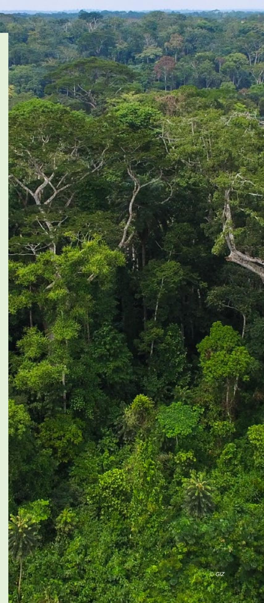

## *Introduction*

### *The European Union Deforestation Regulation (EUDR)1*

The conversion of forests to agricultural land is a major driver of biodiversity loss and climate change, accounting for as much as 6-9 percent of worldwide greenhouse gas emissions (IPCC 2022; Pendrill et al. 2019). The EUDR marks a significant step towards reducing the consumption and trade of deforestation-risk commodities by EU member states to meet climate commitments under the Paris Agreement and the EU Green Deal. The EUDR regulates the import and trade of seven commodities on EU markets (cocoa, coee, oil palm, natural rubber, soy, cattle and wood products), as other regional blocs and producing countries are also innovating their own strategies and market-driven solutions to reduce deforestation and forest degradation through more sustainable and climate-smart agriculture.

While the EUDR reinforces these eorts to improve transparency and regulatory compliance in global supply chains, the regulation itself provides limited guidance on how to ensure transitions to deforestation-free agriculture are fair and just for the diversity of producers embedded in these value chains and aected communities in the sourcing areas. Specific social protections are found in accompanying EU strategies and cooperation measures which stress the need to protect human rights, land use rights and labour rights in compliance with local and international laws, and to support measures to mitigate risk of exclusion and ease compliance burdens.

## *Training of Trainers*

This ToT supports cooperating partners in government, civil society, and the private sector as they work toward fair and just transitions to deforestation-free value chains. The facilitation toolkit is designed to build the capacities of trainers working closest with smallholder producers, small-scale value-chain actors, and communities who may be impacted by EUDR operationalization. These trainers often act as bridges between operators and traders and the smallholders in their sourcing areas.

The ToT equips trainees with the necessary knowledge and skills to mitigate potential risks of exclusion while actively promoting equitable transitions to deforestation-free commodities.

### *Gender Equity and Social Inclusion + Intersectionality (GESI+)*

Women, Indigenous Peoples, smallholders, and forest-dependent communities often carry the highest risks of exclusion from regulatory change yet have limited voice in how these changes are implemented. This toolkit is intentional about integrating GESI with an intersectional approach (GESI+). A GESI+ approach recognizes that people's experiences in value chains are shaped not only by gender but also by age, ability, class, ethnicity, indigeneity, religion, and other social identities as well as power structures and dynamics. An intersectional approach examines how these identities can create specific vulnerabilities or opportunities for supply chain governance, due diligence processes, and benefit-sharing. By strategically leveraging a GESI+ approach, trainers and trainees can move beyond avoiding harm to actively promoting equity, inclusion, and transformation.

### *GESI+ deforestationfree value chains*

This toolkit combines foundational GESI concepts with gendered and intersectional value chain analysis, legal literacy on EUDR and relevant national legislation, and applied tools for risk assessment, opportunity mapping, and benefitsharing. The result is a modular package that trainers can adapt to context and commodity, tailoring the trainings to the specific value-chain and social dynamics in the sourcing area. As regulations evolve and contexts shift, the GESI+ approach provides a practical foundation for codeveloping solutions that advance intersectional inclusion and equity. Trainers are encouraged to adapt these materials and continue building collective capacity for fair and just transitions to deforestation-free value chains.

1. On 17 December 2025, the European Parliament has adopted the trilogue deal on the EUDR. The EUDR will now enter into application on 30 December 2026 (30 June 2027 for natural persons and small and micro operators).

## *How to use this toolkit*

## *Learning environment*

The tools in this toolkit are interactive and highly participatory, combining plenary activities with groupwork. A conference room or classroom environment with round tables for small groups and open space (in the same room or outdoors) for plenary activities is ideal. The workshop format accommodates 18-24 participants comfortably (six to eight people per table). Larger groups require some adjustments to the activities to limit the time spent sharing learnings between the groups (i.e., reducing time for reporting back). As much as possible, the participants should be facilitated to move around the room, interact within small groups and with the whole group to build the foundation for a learning community that can network beyond the workshops.

This toolkit is designed to support facilitators in delivering a ToT on GESI+ within deforestation-free value chains. It provides structured guidance, detailed facilitation steps, and adaptable tools that bridge conceptual learning with applied practice in an intensive workshop format. The learning materials and activities may be used as a stand-alone training or integrated into other workshops, trainings, or longer courses. The aim is to provide trainers with approaches that are context-sensitive, participatory, and capable of generating actionable strategies.

## *Getting started*

The toolkit opens with a GETTING STARTED section that prepares facilitators to create the conditions for an eective and inclusive learning environment. This section provides guidance on facilitation practices that model gender equity, social inclusion, and intersectionality; introduces ground rules that support respectful and participatory dialogue; and oers icebreakers that help establish trust, comfort, and engagement from the outset. Facilitators should use these elements to set the tone for the training, create a safe and collaborative space, and ensure that participants are ready to engage actively with the more complex concepts and activities that follow.

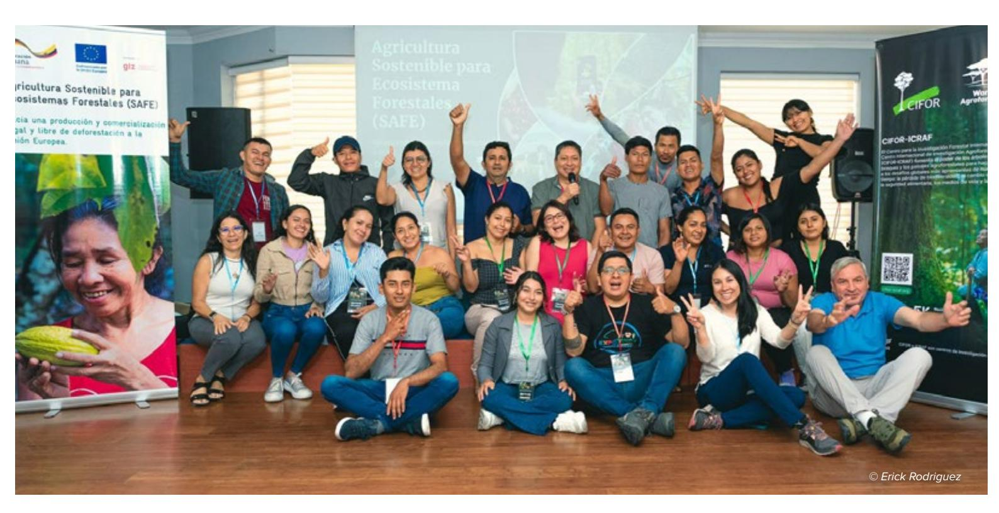

## *GESI + learning units*

The toolkit is organized into four learning units, comprising 10 modules and 24 tools. We invite trainers to review the full toolkit and then select the learning units and modules which are most relevant to their training needs.

| <b>Unit 1</b> | introduces core concepts in gender equity, social inclusion, and intersectionality.                      |
|---------------|----------------------------------------------------------------------------------------------------------|
| <b>Unit 2</b> | applies these concepts to value chain structures, roles, and dynamics.                                   |
| <b>Unit 3</b> | focuses on the enabling conditions required for equity-responsive approaches to EUDR operationalization. |
| <b>Unit 4</b> | guides participants through structured GESI+ action planning.                                            |

⊲ **Structure of the GESI+ learning modules**. Each module follows a consistent structure to support clear facilitation, eective learning, and adaptation for smallholder training. ⊲ **Materials Needed.** A brief list of the tools and supplies required for the session (e.g., flip charts, markers, printed cards, templates). Preparing these in advance enhances flow and supports interactive learning. ⊲ **Preparation Required.** Facilitators receive guidance on how to set up the space, assemble materials, and review concepts in advance. This ensures activities run smoothly and supports a participatory learning environment.

- ⊲ **Learning Objectives.** Modules include specific, measurable learning objectives aligned with Bloom's taxonomy. These describe what participants should know or be able to do by the end of the module. ⊲ **Key Messages.** Key messages distil the essential concepts and insights of the module. They help trainers reinforce accurate understanding and maintain consistency across groups. ⊲ **Step-by-Step Facilitation Guide**
  - 1. **Introduce concept(s).** Interactive Lecture or mini-lesson. Modules may include a multi-part interactive lecture for complex concepts or mini-lessons for introducing short, focused key concepts. Mini-lessons follow a simple structure (connect, teach, engage, and link) to provide clarity before moving into activities (Calkins 1994).
  - 2. **Facilitate tool to apply concepts.**  Participatory activities allow learners to explore and apply concepts through critical dialogues, role plays, mapping, gallery walks, and other movement-based methods. These activities energize the group and support diverse learning styles.
  - 3. **Debriefing and discussion.** Each module concludes with structured debriefing and discussion prompts. These help participants reflect on learning, draw connections to their work, and consider how to adapt the activity for smallholder training beyond the ToT.

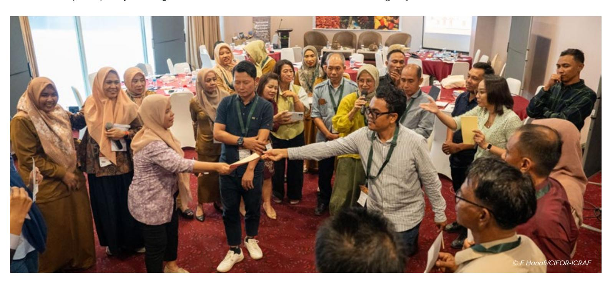

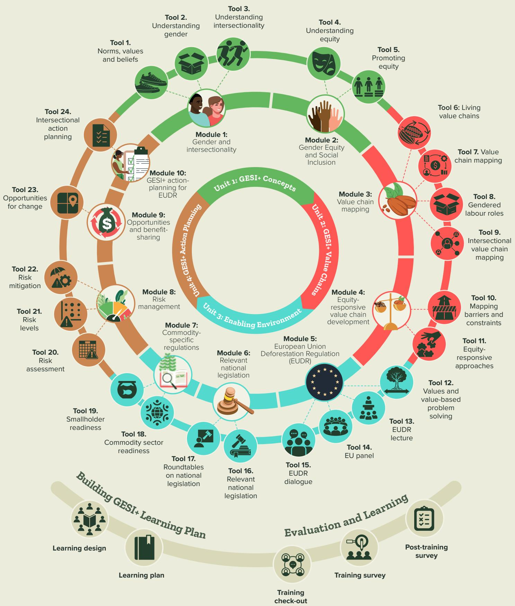

#### **GESI + LEARNING UNITS**

## *Building a GESI+ learning plan*

This section helps trainers turn GESI+ learning units and modules into a practical learning plan for smallholder training. Using a collaborative planning approach, the participants will build upon their shared foundation established during the ToT to define their own training goals and practices. ToT participants will select the learning modules and units which best meet their training agendas, focused on building and strengthening the capacities of smallholders to understand and prepare for EUDR, promote GESI+ principles in deforestation-free agriculture and value chains.

Participants will use a Learning Plan template to agree on logistics, participants, modules, and activities, taking into account their training context and calendars (e.g., for a stand alone workshop, the full toolkit can be delivered in four to five intensive days, adjusting the timing for selected activities to fit within the schedule. Alternatively, the learning modules can be integrated into other trainings, breaking the learning units over multiple sessions or extending modules for deeper engagement). A final peer exchange and gallery walk will support participants to refine their learning plans for real-world implementation.

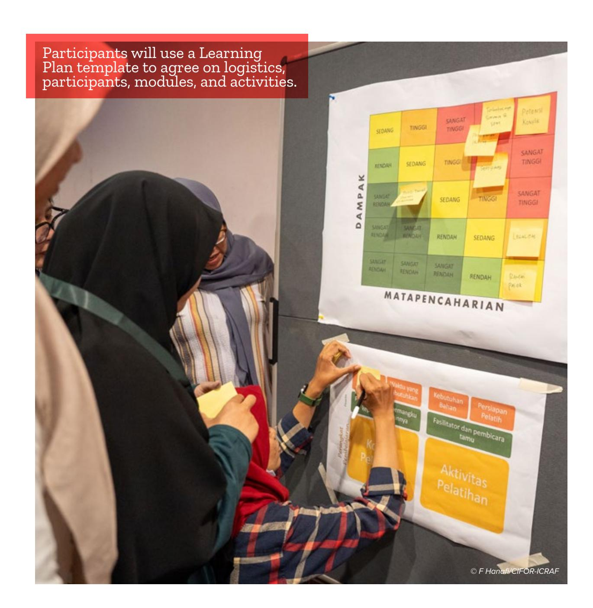

# Getting started

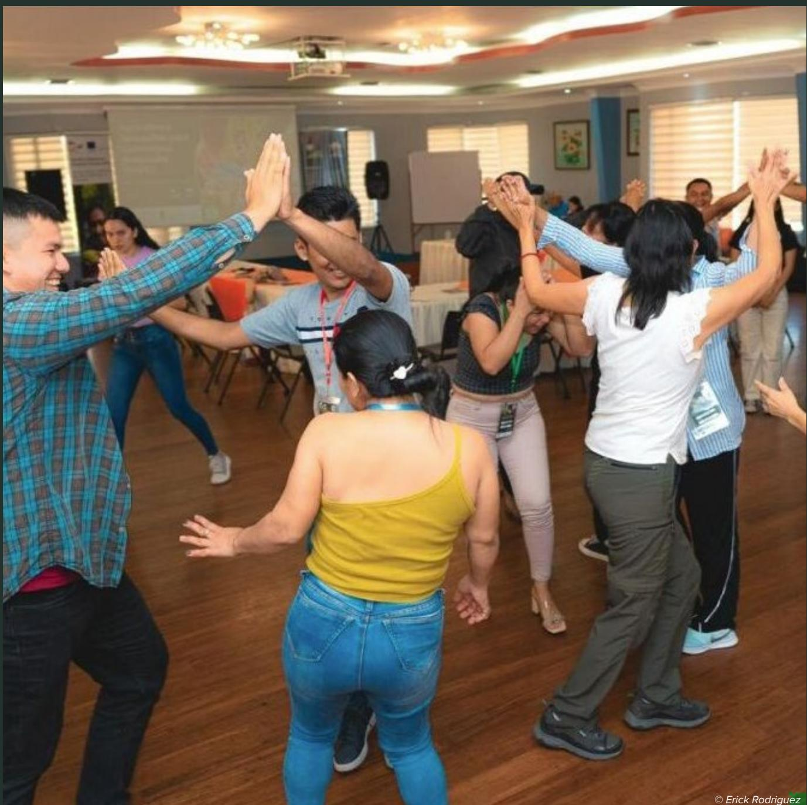

## *Facilitation tips2, 3*

⊲ **Establish ground rules.** Agree on simple rules on respect, confidentiality, curiosity and listening, and keep them visible. Refer to these rules as needed to maintain a constructive group dynamic. ⊲ **Manage the time.** Follow the agenda closely and keep activities focused and well-paced. Use energizers or brief transitions to restore attention and maintain engagement. ⊲ **Know your role.** Facilitate dialogue rather than teach or correct, staying neutral and aware of your own influence. Support reflection without steering participants' views. ⊲ **Use icebreakers and check-ins.** Open with light activities that help people connect and feel ready to participate. Use check-ins to sense the group's mood, expectations, or priorities. ⊲ **Create a safe, friendly, and fun environment.**  Focus on the community of learners and a learning environment that supports their needs. Mix plenaries and small group activities to alternate between teaching concepts and sharing information and applying these in context. Incorporate movement or energizers to keep energy high, friendly and comfortable. Vary interactive tools and visuals to meet dierent learning styles. ⊲ **Foster collaborative and adaptive learning.**  Empower participants to be co-creators in their own learning and to ensure that the training is applicable to their context. Use open questions to deepen analysis. Remind participants that knowledge is always built together. ⊲ **Promote equity and inclusion.** Pay attention to who speaks and who remains silent, and create opportunities for all voices to enter the conversation. Gently manage dominant speakers so others feel welcome to contribute. Use inclusive and gender-sensitive language. ⊲ **Balance participation and power dynamics.**  Observe group dynamics. Recognize that gender, age, class, ethnicity, and other identities shape how people participate and relate to one another. Be attentive to how identity and power shape participation and introduce tools to balance participation and voice so that all participants can speak and be heard. ⊲ **Check-out sessions.** End with a brief checkout to gather feedback on what worked and what needs adjustment. Use this input to finetune pacing and methods while keeping core content intact.

Eective facilitation for a workshop on gender equity, social inclusion, intersectionality should model these principles. The role of the facilitator is to create a collaborative learning environment which balances concept learning with participatory and action learning approaches.

## *Introducing the ground rules*

Every participant will bring their own experience to the workshop. Ground rules set the tone for a respectful, participatory workshop. Introduce some basic ground rules for a positive and productive meeting, and invite the participants to add their own, agree on them together, and keep them visible throughout the workshop. Invite participants to oer their own ground rules that they use when they host meetings. Remember, many of our participants are experts at facilitating meetings with NGOs, farmers, private sector and government. Lean on their expertise throughout the meeting.

#### **Ground rules can include:**

⊲ Listen to understand ⊲ Let people finish their thoughts ⊲ One conversation at a time (avoid side conversations) ⊲ Assume positive intent ⊲ Be succinct; share the air ⊲ Encourage everyone to participate ⊲ Stay on topic ⊲ Silence cell phones, take calls outside ⊲ Limit screen time; keep texting to a minimum ⊲ Start and end on time

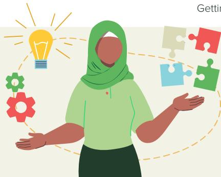

## *Icebreakers4*

Icebreakers are short activities that help people feel comfortable and ready to participate at the start of a session. Icebreakers reduce tension, encourage interaction, and create more open group dynamics. They can be simple introductions, fun questions, small games, or any quick activity that helps people connect. They can be related to the main content or focused on socialization.

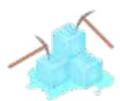

#### ICEBREAKER 1: SPEED NETWORKING

This icebreaker works best on the **first day** of a workshop.

⊲ **Upon arrival and registration**, give each participant two index cards. Ask them to complete these two cards while they await the other participants. Explain that you will be using these cards when the meeting starts. You can display the slide in the box below while participants are arriving, or post an example of the cards on a flip chart at the front of the room.

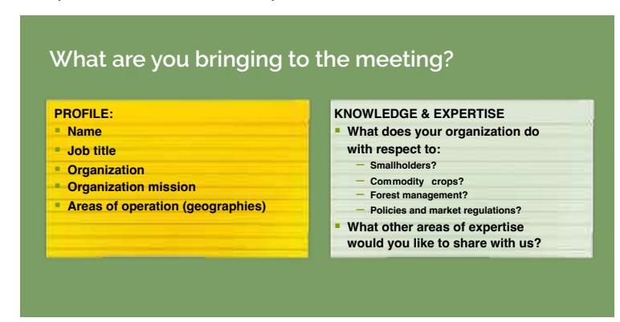

⊲ **When the meeting starts**, ask everyone to stand up. Each person should identify one to three other people in the room whom they have never met. ⊲ Explain that you will have three rounds (if you start late, you can reduce this to two rounds). When the bell rings, each person must find a stranger and introduce themselves using the index cards that they completed during registration. They can carry their cards with them. ⊲ Each person will have 2-3 minutes to introduce themselves, allowing the other person to do the same (5 minutes total). ⊲ **After 5 minutes,** ring the bell and ask the participants to find a new person to share introductions. ⊲ If there is time for one more round, ring the bell again and repeat. ⊲ **When finished**, invite everyone to post their cards on a flip chart paper on the wall labeled: WHO'S WHO? ⊲ If participants want more time to edit their cards, this is okay, but make sure that all cards are posted on the wall by the first tea/coee break.

4. Sources for additional icebreakers: SessionLab. 67 engaging icebreakers that your team won't find cheesy. [https://www.sessionlab.com/](https://www.sessionlab.com/blog/icebreaker-games/) [blog/icebreaker-games/;](https://www.sessionlab.com/blog/icebreaker-games/) [teambuilding.com](http://teambuilding.com). Icebreaker questions list + random generator. 2026 Jan 21. [https://teambuilding.com/blog/](https://teambuilding.com/blog/icebreaker-questions) [icebreaker-questions](https://teambuilding.com/blog/icebreaker-questions)

#### ICEBREAKER 2: CAPACITY SHARING

**This icebreaker builds on Icebreaker 1.** You can return to these cards to break the ice later in the day, or the following morning.

⊲ **Ask participants to choose a card from the expertise wall**, find the person in the room, and ask about their area of expertise. ⊲ How might you learn from each other or potentially work together?

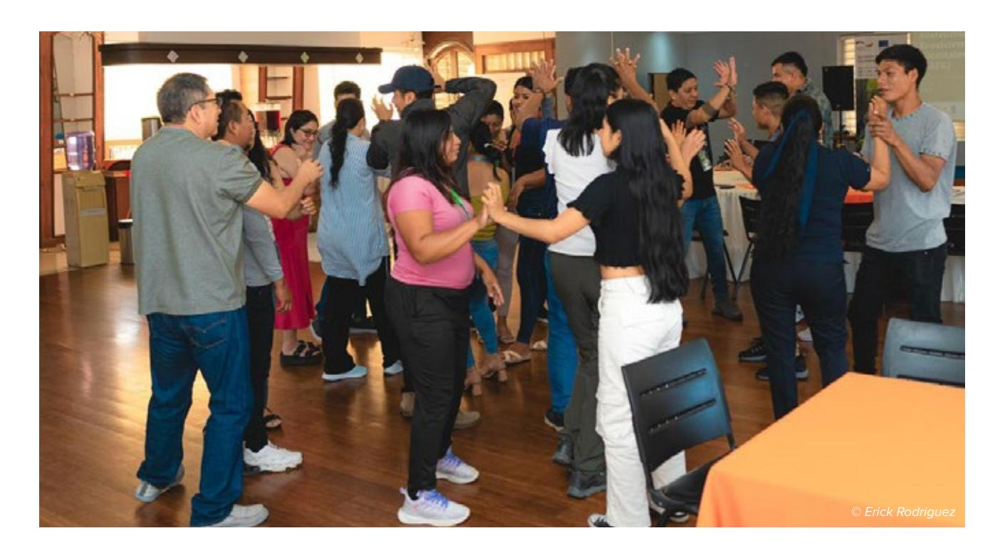

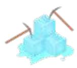

#### ICEBREAKER 3: BUILDING NETWORKS

This icebreaker works well with a group of participants who are somehow networked through their projects, sector, or value chains. It is a great way to start teambuilding.

⊲ Holding a ball of string, ask participants to provide their name, location, and their role or organization (i.e., farmer, trainer, coordinator). ⊲ You will start, and then, holding tightly onto the end of the string or yarn, toss the ball to another person in the circle. ⊲ This person will provide their name, home, and their role, and then, holding the string tightly, toss the ball to another member of the group. ⊲ This will continue until everyone has spoken. ⊲ Once everyone has had a turn, a spider web or network will have formed. Explain that this string represents how everyone is linked and networked through their work. ⊲ Each person in this network depends on the other people for the success of the whole. We will learn from each other today and build our connections.

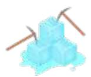

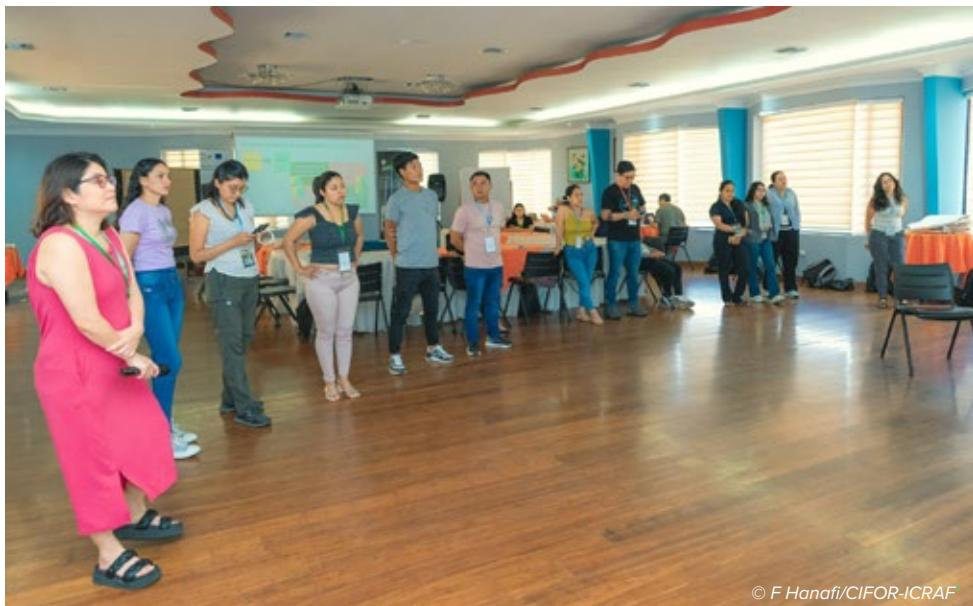

#### ICEBREAKER 5: BALL TOSS LEARNING OUTCOMES

This icebreaker works well to start the **last day** of a workshop or training event.

⊲ Use a soft ball, rolled up socks, or similar soft object. Explain that we all learned something new in these workshops. Ask everyone to take a few seconds to think about what they learned that they did not previously know. Show the soft ball and explain the rules. ⊲ The person holding the ball first speaks first. Each person must say something about what they learned. Each person must say something dierent! ⊲ The person holding the ball calls out the name of the next person to whom they are tossing the ball. Toss the ball! Each person catches the ball; repeat until everyone has had a turn.

#### ICEBREAKER 4: CHANGING PLACES

This icebreaker works well to collectively learn key characteristics about the participants in the room.

⊲ Have participants sit or stand in a circle or around the room. The lead facilitator will start in the middle as the 'leader.' ⊲ The leader calls out a statement (e.g., "Change places if you are a cocoa producer"; "Change places if you prefer coee to tea". Try to mix project-specific statements with fun statements). ⊲ Anyone who relates to the statement must quickly swap places. ⊲ The last person to find a place becomes the new leader and calls out the next statement.

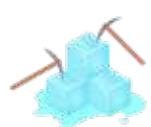

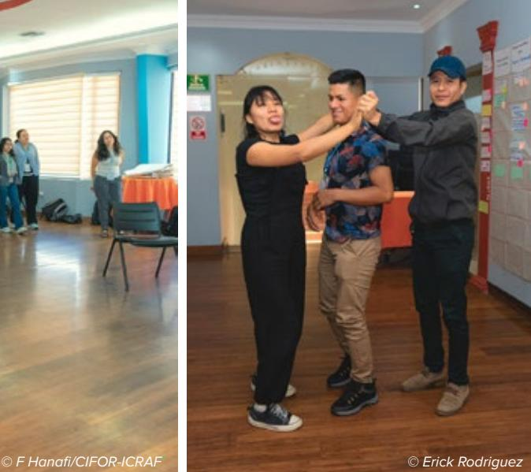

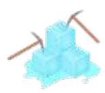

#### ICEBREAKER 6: THREE THINGS

This icebreaker works well on the **final morning** of a multi-day workshop or training event.

⊲ Give participants each a notecard to jot down three things: » one thing from the workshop that you would like to remember » one thing that you learned that was new to you » one thing you would like to teach someone else after the workshop ⊲ Depending on time, you may ask them to read these aloud in plenary, or turn to their neighbors and discuss these in pairs. ⊲ Collect the cards at the end for your workshop reports.

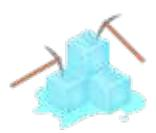

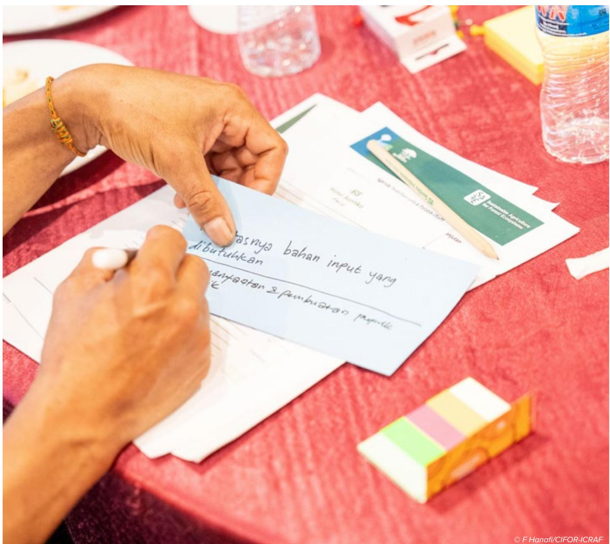

# GESI+ learning units

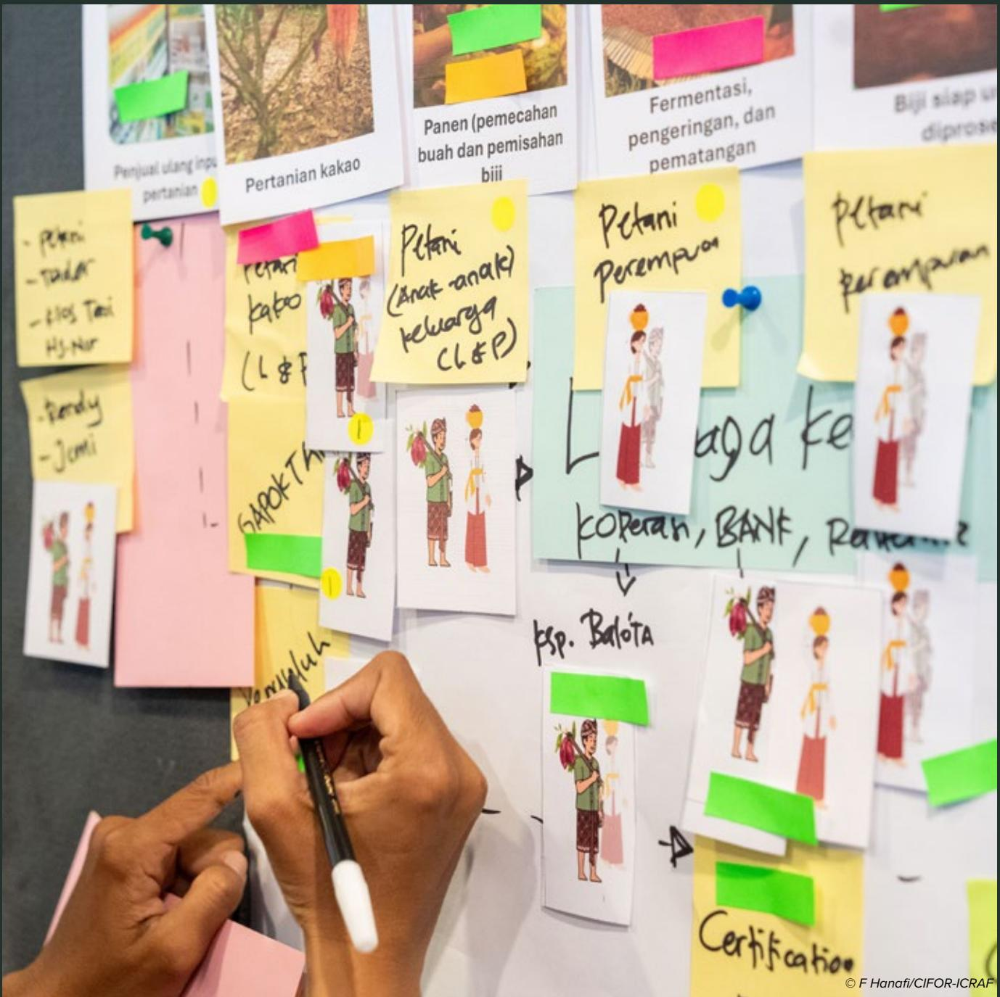

# Unit 1 Gender Equity and Social Inclusion (GESI) concepts

**GESI+ refers to the fair and meaningful participation of all people in social, economic, and political life, regardless of gender, age, ability, socio-economic status, ethnicity, indigeneity or other intersecting social identities. GESI+ recognizes that dierent groups face dierent social and material conditions and seeks to address inequality by ensuring fair and equal access to resources, opportunities, and decision-making power. GESI+ approaches emphasize the importance of understanding gender norms, intersecting identities, and power dynamics so that interventions are inclusive and equitable. In the context of deforestationfree agriculture, applying GESI+ ensures that smallholders, laborers, and all value chain actors have fair access to training, markets, and resources, can participate in decisionmaking, and benefit from sustainable practices. By removing structural barriers, promoting inclusive participation, and tailoring support to dierent needs, GESI+ approaches can contribute to fair and just transitions that strengthen deforestation-free value chains, empower communities, and support long-term environmental and social sustainability.**

#### **THIS UNIT COVERS:**

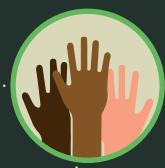

Module 1 *Gender and Intersectionality* Module 2 *Gender Equity and Social Inclusion (GESI)* 

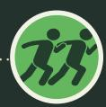

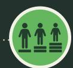

**Tool 1.** Norms, values and beliefs

**Tool 2.** Understanding gender

**Tool 3.** Understanding intersectionality

**Tool 4.** Understanding equity

**Tool 5.** Promoting equity:

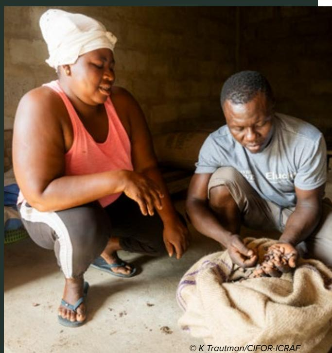

**1** To understand participants' own gender values, attitudes and beliefs in the local context. **2** To understand basic gender concepts and distinguish between gender and sex, gender norms and gender roles, and intersectionality. **3** To analyze how gender norms and intersecting identities shape power, privilege, and opportunities in dierent contexts.

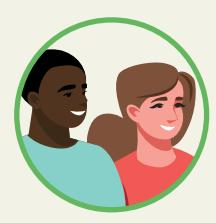

## MODULE 1 *Gender and Intersectionality*

Module 1 introduces foundational gender concepts through tools examining gender norms and values, and how these intersect with other parts of our social identity. Interactive activities in these tools prompt participants to examine how gender norms, expectations, and intersecting identities shape behaviour, opportunities, and power. The module prepares trainers to recognize these dynamics and apply them in inclusive programme design.

#### **TOOLS**

**Tool 1**  Norms, values and beliefs: Vote with your feet

**Tool 2**  Understanding gender: Man box | Woman box

**Tool 3**  Understanding intersectionality: Power & privilege walk

#### **LEARNING OBJECTIVES**

#### **KEY MESSAGES**

⊲ Gender is socially constructed, varies across cultures, and shapes the norms and expectations that influence people's roles and behaviours. ⊲ Power and privilege are unevenly distributed across social groups, and intersectionality helps us understand who is most advantaged or disadvantaged. ⊲ Eective programming requires awareness of these norms and inequalities so we can design safe, inclusive interventions that reach diverse groups.

#### **SOURCES**

- 1. Kimonyo A, Vess J, Gallagher EJ. 2024. Engaging men for gender equality in rural transformation projects. Nairobi, Kenya: CIFOR-ICRAF. [https://www.cifor-icraf.org/](https://www.cifor-icraf.org/knowledge/publication/9246/ ) [knowledge/publication/9246/](https://www.cifor-icraf.org/knowledge/publication/9246/ )
- 2. Promundo and CARE International in Rwanda. 2012. Journeys of transformation: A training manual for engaging men as allies in women's economic empowerment (Guatemala Adaptation). Washington, DC: Promundo and CARE. [https://www.](https://www.equimundo.org/resources/journeys-of-transformation-a-training-manual-for-engaging-men-as-allies-in-womens-economic-empowerment/) [equimundo.org/resources/journeys-of](https://www.equimundo.org/resources/journeys-of-transformation-a-training-manual-for-engaging-men-as-allies-in-womens-economic-empowerment/)[transformation-a-training-manual-for](https://www.equimundo.org/resources/journeys-of-transformation-a-training-manual-for-engaging-men-as-allies-in-womens-economic-empowerment/)[engaging-men-as-allies-in-womens](https://www.equimundo.org/resources/journeys-of-transformation-a-training-manual-for-engaging-men-as-allies-in-womens-economic-empowerment/)[economic-empowerment/](https://www.equimundo.org/resources/journeys-of-transformation-a-training-manual-for-engaging-men-as-allies-in-womens-economic-empowerment/)

### **TOOL 1:** NORMS, VALUES AND BELIEFS *Vote with your feet*

#### **MATERIALS**

Four coloured cards each printed with Strongly agree; Agree; Disagree; Strongly disagree

#### **PREPARATION**

⊲ Print cards ⊲ Prepare questions ⊲ Hang signs on wall or signboards before the meeting begins. Give enough space between the signs to allow the participants to stand under the signs that they choose.

*Step 1*

#### *Ask the participants to stand and congregate to one side of the signs*

You may hang the signs on a wall in the meeting room, on an outside wall, or place on the floor, if necessary. Ask the participants to stand up and congregate in the area where you will facilitate the activity. Explain the signs.

#### *Explain the activity*

You will read a statement. Each person must decide how strongly they agree or disagree with this statement and stand under (or on, in front of) the sign that matches their opinion. They should not try to influence others' decisions and should freely choose where to stand.

### *Read the first statement*

Allow time for each person to choose where they will stand.

### *Facilitate discussion and debate*

After the participants have settled, ask one person who strongly agrees with the statement to explain their position. Then ask one person who strongly disagrees to explain their position. Finally, ask those in the middle to explain. Allow people to freely express their opinions which will be very revealing about the gender stereotypes they might hold and gender norms for the people living and working in this area.

*Step 2*

*Step 3*

*Step 4*

### *Statements:*

- 1. Women are better caregivers than men (children, elderly, family).
- 2. Women are naturally/ biologically better at taking care of the environment.
- 3. Men are naturally/ biologically better farmers than women.
- 4. Real men don't cry.
- 5. Men are better leaders than women.
- 6. Women are better at managing money than men.
- 7. Good women are humble and quiet.
- 8. A man should feel ashamed if he cannot earn enough money to support his family.
- 9. At home, it is the man who has the last word.
- 10. A woman should always support her husband's or partner's decisions.

**STRONGLY** 

**AGREE AGREE DISAGREE STRONGLY** 

**DISAGREE**

Explain that our gender stereotypes and social norms about men and women are shaped by our culture and our experiences. They reflect our values; the beliefs and principles that guide how we think, act, and make decisions. Emphasize that sharing and listening to others' explanations of their deeply-held beliefs facilitates understanding about the range of gender values represented in the group and their broader community.

This activity is a useful tool for facilitators to spark active dialogue at the outset of the workshop. The statements can be tailored to dierent projects or value chains to probe gender norms and values before introducing projects or interventions into a community.

When you have worked through all the statements, ask everyone to return to their seats. Engage the participants about how to facilitate this activity and invite discussion about how the participants might use this in their own work.

#### **DEBRIEFING**

#### **Example questions for discussion:**

- 1. What are some gender norms in the areas where you work?
- 2. How could you use or adapt this activity to learn more about the gender norms which might aect your programme planning? What statements would you add? What might you change?

#### *Instruct the participants to step back from the signs*

Before reading the next statement, ask the participants to step away from the signs. This ensures that they must move again for each statement.

*Repeat until all statements are read and discussed.*

*Step 5*

*Step 6*

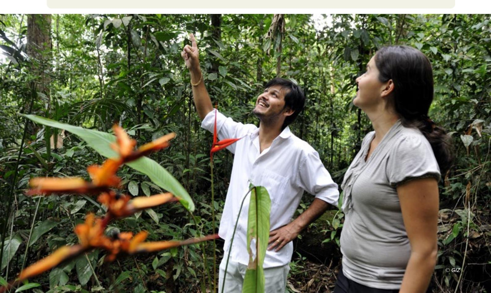

Use this image (or similar) to explain the dierence between **GENDER** and **SEX** as concepts that we use in our work.

Explain that when we collect data, oftentimes we are collecting data on **SEX**. These are biological traits expressed by male and female chromosomes, hormones, reproductive organs, etc.

**GENDER** is defined socially and culturally, including characteristics we associate with being masculine or feminine, roles and responsibilities of men and boys versus women and girls, rights to land, resources, assets, etc.

What may be considered a masculine characteristic or role in one place, may be dierent from another place. This can dier even between dierent communities or places within the same country or region.

For example, in some places or cultures women don't leave the house or go to the market. In other places or cultures, it is the women's responsibility to go to the market and do the household shopping. In some places/cultures, women are quiet, shy and do not speak out in public. In other places/ cultures, women are animated and talkative and have leadership positions where they often speak in public.

### **TOOL 2:** UNDERSTANDING GENDER *Man Box | Woman Box*

#### **MATERIALS**

Coloured cards, flip chart paper, markers

#### **PREPARATION**

⊲ Ax two flip chart papers on easel or tape to wall

#### *Mini-lesson*

⊲ Discuss the concepts of gender and sex, gender and sociocultural norms ⊲ In plenary, ask the participants to define gender. Ask what the word 'gender' means ⊲ Allow a few people to respond before showing the image5 below

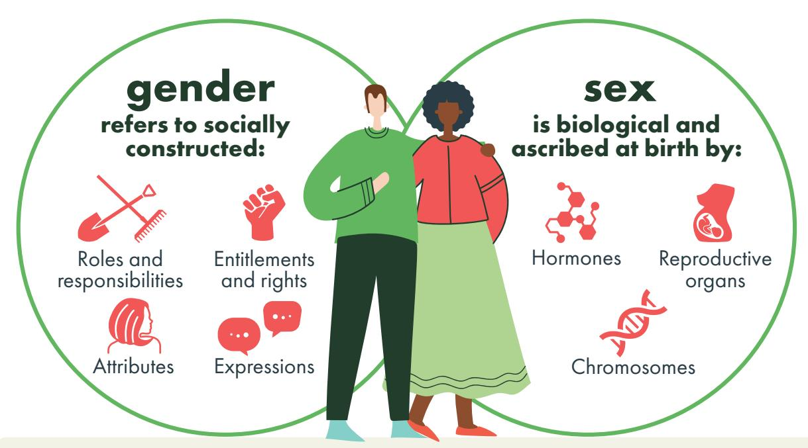

5. Image adapted from Darmstadt et al. 2019; Image originally designed for CGIAR Research Program on Forests, Trees and Agroforestry 2021.<https://doi.org/10.17528/cifor/008351>

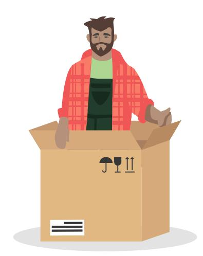

*Step 2*

*Step 3*

*Step 4*

#### *Introduce activity*

Explain the Man Box | Woman Box concept.

Show the group the 'Man in the Box' illustration. Explain that from the time we are young, we are placed into boxes. Men and boys are put into a MAN BOX - and told to "Be a Man". Everything they do must fit inside this MAN BOX. But what does this mean to BE A MAN in this place? In this culture? In this context?

### *Brainstorm in small groups*

⊲ Ask participants to sit in pairs or groups of four people ⊲ Ask the group to brainstorm a list of what society expects from this man when they tell him, "Act like a man!" Examples include, "Be strong," "Act tough," and "Don't cry." ⊲ Give each group a large index card for writing words or characteristics associated with men, boys, and masculinity. ⊲ Allow 3-5 minutes for brainstorming and recording ideas.

#### *Facilitate the 'Man Box' activity in plenary*

⊲ Draw a big square on their flipchart paper. Label the square 'MAN BOX' ⊲ After brainstorming, invite the pairs or groups participants to call out words or characteristics that represent 'acting like a man' from their brainstorming cards. ⊲ Write these words inside the MAN BOX. These are typically masculine characteristics.

#### *Step 5 Optional activity (time permitting): Facilitate 'Outside the Man Box' in plenary*

⊲ Continuing in plenary, facilitate participants to think about what falls outside of gender norms for men and boys. What words or characteristics are considered unmanly? ⊲ Invite each of the groups to call out one to two words that are contrary to gender norms. Write these words in a dierent colour outside the MAN BOX square (on the margins of the flip chart). These are

characteristics that are not considered masculine by this society.

⊲ Explain that the MAN BOX and the words inside the box represent the gender norms associated with men and the boundaries around masculinity. The words outside the box represent a break from gender norms. ⊲ Collect the cards for the workshop report.

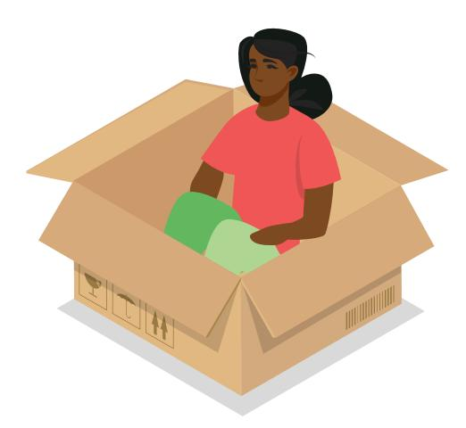

*Step 6*

#### *Repeat steps 2-5 for the 'Woman Box'*

Explain that women and girls are also put into boxes – and told to "Be a good girl," "Be a good wife," "Mind your place." What does it mean to be a normal woman in this place, culture, or context?

⊲ In small groups, ask participants to brainstorm words or characteristics that this society associates with women, girls, and femininity. Give each group brainstorm cards to record their words. Allow 3-5 minutes . ⊲ Draw box on flip chart paper labeled WOMAN BOX. ⊲ In plenary, invite the groups to call out their words as you write them inside the box. ⊲ Still in plenary, ask the participants to call out words that fall outside of normative women characteristics. ⊲ Collect the cards for the workshop report.

#### **DEBRIEFING AND DISCUSSION**

#### **In plenary, ask the participants: Where do these ideas come from?**

Invite participants to speak aloud and share their responses. Be sure to hear from men and women alike. After hearing from a few people, discuss how gender norms and cultural norms come from people of all dierent positions in our society and may change by circumstance or over time. We are products of our own culture. Sometimes, we may have dierent norms for dierent groups (i.e., we may want our daughters to be economically successful, but our daughtersin-law to stay home and take care of our grandchildren), etc.

#### **In plenary, ask: What does this mean for our work?**

Whenever we enter a community or project area, we need to be aware of the gender and cultural norms of that place. We need to know where the boundaries are between normative or NORMAL societal characteristics and roles and what falls outside of normal. That does not mean that some of our project interventions might not push these boundaries (i.e., working on gender equity), but we need to be aware of what those boundaries are, the social risks of disrupting gender norms and be mindful about how we design our project interventions.

#### **Example questions for discussion:**

- 1. What are some of the clear boundaries around masculinity and femininity in the places where you work? What are some boundaries that you will not cross in your project interventions?
- 2. How could you use or adapt this activity to the communities/places/value chains where you work?

### **TOOL 3:** UNDERSTANDING INTERSECTIONALITY *Power and Privilege Walk*

#### **MATERIALS**

Role cards, statements, large area for 10-20+ people to participate

#### **PREPARATION**

⊲ Prepare a set of role cards and statements that allow you to demonstrate the concepts of power, privilege and intersectional equality/inequality. Make sure that these examples allow you to probe dierences that are salient in the project or landscape where you work. ⊲ For the roles, you may print these on a piece of paper and cut them into cards or strips to give to participants during the activity. For the statements, you may print this for the facilitator to read. ⊲ Some examples are provided below:

#### **Example roles**

**1** An 20-year-old woman who dropped out of school due to illness; her parents were poor cocoa farmers on customary land **2** A man working as an accountant for a regional cocoa trader **3** A politician from the ruling party **4** Head of an influential cocoa association **5** An elementary school principal **6** An NGO worker **7** A grandmother and cocoa farmer caring for her four grandchildren because their parents have migrated for work **8** A 20-year-old youth with Down syndrome; the son of a hotel owner and large land holder **9** A divorced mother of four children works at a cocoa company **10** Widowed cocoa farmer (man) on customary land with three sons **11** Head of Plantation and Livestock Services Agency **12** Female lecturer at a private university, and is absentee cocoa farmer **13** 25-year-old woman victim of sexual harassment from a cocoa farmer for whom she provides labour **14** Young man who is a university graduate waiting to inherit his father's cocoa farm **15** 59-year-old widow whose late husband was cocoa farmer but did not have proper land certificate **16** Son of the Village Head

#### **Example statements**

**1** I have access to money and other financial resources if I need them. **2** I can choose how to spend the money I earn. **3** I have access to transportation and can move freely within my community. **4** I own land or the house I live in. **5** If my father or my spouse or partner passes away (or has passed away), I will inherit all or most of their land or property. **6** I can decide whom to marry and when. **7** I can walk down any street without fear of harassment or violence. **8** I feel safe on public transportation. **9** I can work at most jobs without fear of harassment or violence. **10** I can work outside the home if I want to. **11** I have family who can help me if I need help. **12** I have enough food every day. **13** I can leave my spouse or partner if I want. **14** I know my rights, including criminal laws on domestic violence, or I can access legal information. **15** I have input into decisions about where to sell the cocoa that I produce. **16** I have input into decisions how to use the income from the cocoa that I harvest.

*Step 1*

### *Mini-lesson: Intersectionality*

Discuss the concept of **intersectionality**. Explain that social inclusion is not just about gender, but that our gender is just one part of our identities. We all have many other **intersecting identities** including our age, religion, ethnicity, social class, ability, education, migration status, etc.

⊲ Explain that we want to make sure that our interventions are reaching the diversity of people in the landscape and working to reduce inequalities between groups. ⊲ In plenary, ask the participants to also mention social identities which deserve attention in the communities where they work. ⊲ **Important:** Explain that intersectionality is not a math problem of summing up

parts of our identities. Each person is unique where dierent aspects of their social identities intersect. Point out the place in this image where all of the circles intersect.

#### *Step 2 Line-up participants horizontally*

Participants should stand side-by-side with plenty of space to move several steps forward or backwards in parallel.

⊲ Ask the group: What does 'power' mean to you? What is the dierence between power and privilege?

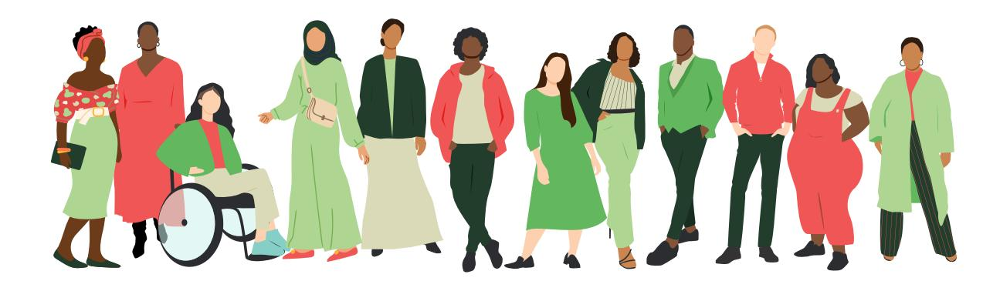

⊲ Invite a few participants to respond. ⊲ Explain to the group that in this activity they are going to explore power, privilege, and how these intersect with identity: men, women, and other social categories.

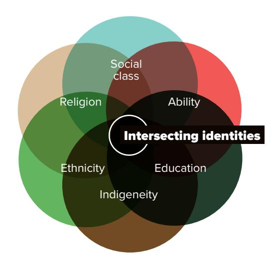

*Step 3*

#### *Give participants role cards (prepared in advance) and explain activity*

Explain that you will read a statement and instruct the participants to take a step forward if their character would say YES to this statement or remain in place if their character would say NO. The participants should take steps based on the role that they are playing (not from their own experience).

*Step 4*

#### *Read the first statement for practice*

Read the first statement and instruct the participants to either take a step forward if their character would say YES to this statement. Make sure that everyone understands the activity before moving on. Start over if necessary. No running, no cheating!

*Step 5*

#### *Continue reading the statements until all statements are complete*

#### **DEBRIEFING AND DISCUSSION**

**After the final statement, ask the participants to remain standing while they observe the outcomes of the Power and Privilege Walk.**  Probe them to discuss the following questions from where they are standing:

- 1. Look around the room at the location of your fellow group members. What stands out for you?
- 2. Who has been able to step the farthest forward?
- 3. How did it feel to step forward while others fell back?
- 4. For those who remained in place, how did it feel to be left behind?
- 5. What did a person's gender identity whether they were a man or woman – have to do with this?
- 6. What did a person's age have to do with where they stood?

- 7. How valued is your character in society? How is this reflected in where you are standing?
- 8. Which characters were more powerful? Why? What made dierent characters more or less powerful?
- 9. How does intersectionality aect your characters' power and privilege?

Discuss how everyone starts at the same place in life. But some are born into privilege and some come into privilege through circumstance and are able to move ahead. When we introduce project interventions, we meet people in dierent circumstances. A onesize-fits-all approach will not reach everyone. **We need to adjust our interventions to meet people where they are.**

**1** To define the concepts of equality and equity and explain the dierences between them. **2** To analyze barriers and structural inequalities that limit access, participation, and fair outcomes in projects and value chains. **3** To apply strategies from the gender integration continuum to propose interventions that promote equal access, social inclusion, and equity and benefit sharing in businesses and value chains.

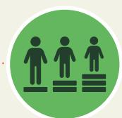

## MODULE 2 *Gender Equity and Social Inclusion*

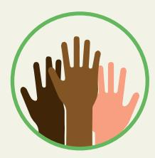

This module explores gender equity and social inclusion through two tools that move from understanding equity to promoting equity. Participants examine the dierence between equality and equity, learn how to identify and address barriers that create unequal opportunities, and explore practical strategies to ensure fair access, inclusion, and benefit-sharing across intersectional groups. Through interactive examples and exercises, the module shows how these concepts can be applied in projects and value chain development.

#### **TOOLS**

#### **Tool 4**

Understanding equity: Equity plays

**Tool 5**  Promoting equity: Equity steps

#### **LEARNING OBJECTIVES**

#### **KEY MESSAGES**

⊲ Reducing inequality requires more than providing equal resources; it means addressing barriers and providing tailored support so everyone can reach fair outcomes. ⊲ The gender continuum highlights dierent approaches to addressing inequality, from gender-blind to gender-transformative, helping practitioners choose strategies that match their goals and context. ⊲ Promoting equity in deforestation-free agriculture means improving access, strengthening inclusion, and ensuring fair treatment, so that all actors can participate, benefit, and succeed on equal terms.

#### **SOURCES**

- 1. Gallagher EJ, Monterroso I and Sanjaya IM. 2020. Women's access, equity and empowerment: Progress and uptake of the Fairtrade gender strategy. Bonn, Germany: Fairtrade International. [https://www.fairtrade.net/](https://www.fairtrade.net/en/get-involved/library/women-s-access--equity-and-empowerment--progress-and-uptake-of-t.html) [en/get-involved/library/women-s-access--equity](https://www.fairtrade.net/en/get-involved/library/women-s-access--equity-and-empowerment--progress-and-uptake-of-t.html)[and-empowerment--progress-and-uptake-of-t.](https://www.fairtrade.net/en/get-involved/library/women-s-access--equity-and-empowerment--progress-and-uptake-of-t.html) [html](https://www.fairtrade.net/en/get-involved/library/women-s-access--equity-and-empowerment--progress-and-uptake-of-t.html)
- 2. Elias M, Paez Valencia AM, Ihalainen M, Monterroso I. Advancing Gender Equality and Social Inclusion. FTA Highlights of a Decade 2011–2021. Highlight No.15. Bogor, Indonesia: CGIAR Research Program on Forests, Trees and Agroforestry (FTA). [https://www.cifor-icraf.org/](https://www.cifor-icraf.org/publications/pdf_files/FTA/FTA-Highlights-15.pdf) [publications/pdf\\_files/FTA/FTA-Highlights-15.pdf](https://www.cifor-icraf.org/publications/pdf_files/FTA/FTA-Highlights-15.pdf)

### **TOOL 4:** UNDERSTANDING EQUITY *Equity Plays*

#### **MATERIALS**

PowerPoint slides, sheet or large piece of paper

#### **PREPARATION**

⊲ Prepare lecture and discussion questions

⊲ Invite the participants to consider the following question: **What is gender equality?** ⊲ **Show the SDG 5 icon6 that has become so ubiquitous in project documents.** Explain that Gender Equality is UN Sustainable Development Goal Number 5: Achieve gender equality and empower all women and girls. Many of the organizations and government agencies in this training likely report on their contributions to SDG 5. ⊲ Ask the participants to raise their hands if they are familiar with SDG 5 in their work.

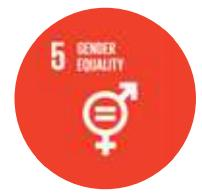

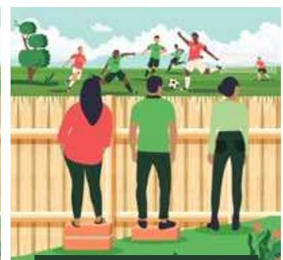

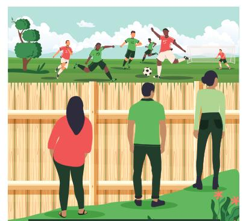

*Step 1*

*Mini-lesson: Equality and equity* ⊲ In plenary, ask one of the participants who raised their hand to **define gender equality**: What does 'gender equality' mean? ⊲ Allow a few people to respond, but don't correct them. ⊲ Very likely some of them may confuse gender equality with gender equity. ⊲ Now ask the participants: **What is the dierence between equality and equity**? ⊲ Allow a few people to respond before sharing the pictures 7, 8, 9 below:

**INEQUALITY:**  Unequal opportunities, advantages or resources

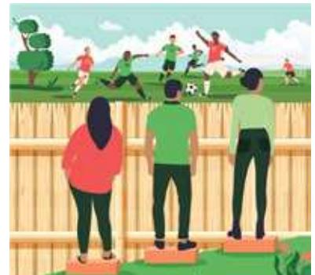

**EQUALITY:**  Equal access to and enjoyment of rights, opportunities, resources and rewards

**EQUITY:**  Fair or just access to rights, opportunities, resources and rewards

In the first image we see three people standing on hill behind a wooden fence trying to watch a football match: a man, a shorter woman and a taller woman. The taller woman can see very well and enjoy the game. The shorter woman and the man cannot see, cannot participate, and cannot enjoy the opportunity to see the game. It is not fair.

In the second image, they are each given three boxes of the same size. They have the same resources and opportunities: now the man and the taller woman can both see the game, but the box is not the right size to help the shorter woman to see. Even with equal opportunity, it is not fun or fair for the shorter woman.

In the third image, the taller woman gives her box to the shorter woman. Now they can all see and enjoy watching the game over the wooden fence.

Through this example, we can see that while equality provides the same resources and opportunities; equity provides the resources and opportunities needed to achieve the equal outcomes. **Equity is often necessary to achieve true equality.**

- 6. UNDESA (United Nations Department of Economic and Social Aairs), n.d., Goal 5: Achieve gender equality and empower all women and girls . Available from:<https://sdgs.un.org/goals> (Accessed 2025 Dec 1).
- 7. Panel image adapted from Leong R. 2020.
- 8. Panel image adapted from Aparna. 2019.
- 9. Panel image adapted from Leong R. 2020.

*Step 2*

#### *Mini-lesson: Reducing inequality10*

⊲ Now ask for a few **examples from the participants** about how they are addressing gender inequality in their own work. Take two to three examples which demonstrate equality and equity principles well.

⊲ **Remind the participants of the Power and Privilege Walk.** Some characters were able to move far ahead of the others while some participants could barely get o the starting line. Explain that inequality describes a situation of unequal access, opportunities, advantages, or unequal resources.

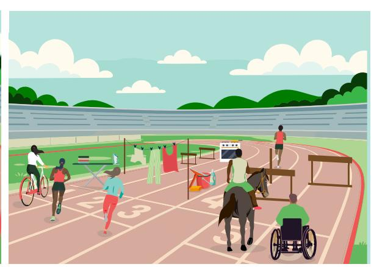

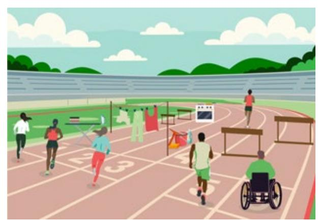

#### **UNEQUAL ACCESS, OPPORTUNITIES, BARRIERS AND CONSTRAINTS**

In this image, we see a race track with three men and three women. The three women have many additional barriers to face: they must stop and take down the laundry, iron, cook, wash more laundry, etc. One of the men has quite a few hurdles in front of him, and one man is in a wheelchair with the hurdles blocking his way. But the third man is started ahead of the rest without any barriers or constraints blocking his track.

**UNEQUAL TOOLS, RESOURCES AND SUPPORT**

The second image represents a dierent type of inequality. Each person is racing with dierent equipment, resources and support.

⊲ Ask the participants how they would address dierent types of inequality to make the situation fairer and more equitable for all the competitors? Facilitate **an active discussion about the inequalities that they observe in their sector** and what they do in their work to address inequalities. ⊲ Explain that **to achieve equity, we need to address inequality.**  » Sometimes we need to remove barriers and constraints to open access and opportunities. » Sometimes we need to provide additional tools, resources and support.

*Step 3*

### *Equity plays*

#### **Unequal opportunities – Removing barriers and constraints**

⊲ To demonstrate the concept of barriers and constraints, ask two men and two women to come to the front of the room. Explain that our goal is to ensure that every coee producer can transport their beans to market. They will have to reach the doorway to access the market. ⊲ Give one man a load to carry, while the other can leave his arms free. Clear the pathway to the door for the men. The men can move independently of one another. ⊲ For the women, place several tables and chairs in their path. Next, tie the women's ankles together like a three-legged race. They must work together to reach the door. ⊲ Start a timer and say GO! See who reaches the door first. ⊲ What was the problem for the women to reach the door? ⊲ What could we have done to even the chances of everyone reaching the door at the same time? Ask the participants to explain the analogy between this race to the door and market access for men and women.

#### **Unequal resources – Providing additional tools, resources and support**

⊲ To demonstrate the concept of unequal tools, resources or support, invite three participants to come to the front of room. Try to select three participants of dierent heights. Now invite one person to stand in front of the three volunteers of dierent heights to act as their trainer. ⊲ Explain that our goal is that every smallholder farmer in the cocoa sourcing area can equally participate in our training. ⊲ We will perform this as a play in three acts.

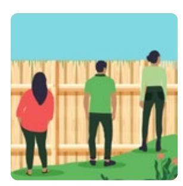

#### **ACT 1:**

Place a sheet in front of the three volunteers so that only the tallest person can see. Ask the trainer to begin a cocoa training on how to reach cocoa markets. Ask the participants to interact with the trainer, but do not move the sheet. The facilitator will say "CUT!"

#### **SCENARIO 1**

#### **SCENARIO 2**

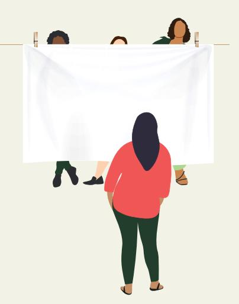

⊲ **Debrief.** Explain that the sheet represents a structural barrier that cannot be removed easily. If we can't remove the barrier, then we need another solution.

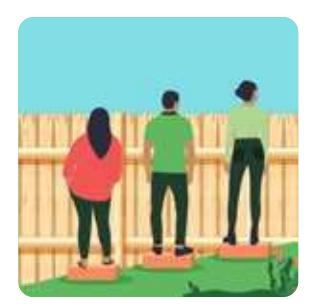

#### **ACT 2:**

We want to provide equal opportunities to all of our three volunteers. Give each of the three volunteers something to stand on (preferably a short block or chair). Now place the sheet in front of the three volunteers so that only the tallest and mediumheight persons can see. Ask the trainer to try and continue the training and the three volunteers to try and participate equally and have their voices heard. The facilitator will say "CUT!"

⊲ **Debrief.** We have given the participants equal opportunity, but they cannot equally participate. Ask the audience for another solution.

#### **ACT 3:**

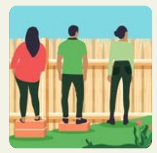

Remove the extra support for the tallest person. Provide a little support for the mediumheight person. And provide additional support for the shortest person. Now place the sheet in front of the volunteers so that all three can see equally. Ask the trainer to continue the training. But now ask the tallest person to begin complaining that this situation is unfair. The shortest person has been given extra support that s/he did not receive. The tallest person thinks that each farmer should participate according to their natural abilities. The facilitator will say "CUT!"

⊲ **Debrief.** Explain that this scene is what often happens when we use armative action approaches (like quotas, or dierent requirements for participation, or special funds for dierent groups). Those who previously had the advantage now feel that the minority group gets an unfair advantage. ⊲ **Ask the audience for another solution.** ⊲ **The only solution now is remove the structural barrier.**  ⊲ This may take time and work to create social change. Remove the sheet. ⊲ Ask the participants to step o of their supports. Explain that sometimes it takes transformation to reach equality and equity, so that everyone can participate equally without any extra support. ⊲ **To address this inequality, we must bring in extra tools or dierent tools for support.**  When we are doing projects or value chain interventions, we sometimes need to use dierent approaches for dierent types of people or dierent circumstances.

Return to picture11 of the three spectators watching the football match. In the first panel at the top, the three spectators face two challenges: the hill upon which they are standing and a wooden fence blocking their view. One is a natural constraint and one is a structural constraint made by humans.

In the second panel, they try to compensate for the natural constraint (the hill) by adding support, but the slope is too steep and the fence too high for this support to help everyone.

In the third panel, they redistribute the support in favor of the spectator with the biggest disadvantage.

But wouldn't it be nice if there were no barriers at all? In the last panel at the bottom, the structural barrier - the fence - has been removed. This is transformation. None of the spectators need extra support even while standing on a hill. We can't always remove natural constraints, but we can transform structural barriers. We have addressed inequality and inequity at the same time.

#### **DEBRIEFING AND DISCUSSION**

This module illustrates the dierence between gender equality and gender equity and shows why both are essential to reducing inequality. Providing extra support or tools can help achieve equity, but lasting change often requires addressing the root causes of inequality. In projects or value chain interventions, understanding these distinctions allows practitioners to design actions that are fair, inclusive, and eective, whether by removing barriers, providing additional support, or transforming systems to ensure everyone can participate fully.

#### **Example questions for discussion:**

- 1. How could you adapt the activities from this module to explore gender equality, inequality, and equity in your own context?
- 2. What changes would you make to make the discussion practical and actionable?

*Step 4*

### *Mini-lesson: Equality + equity*

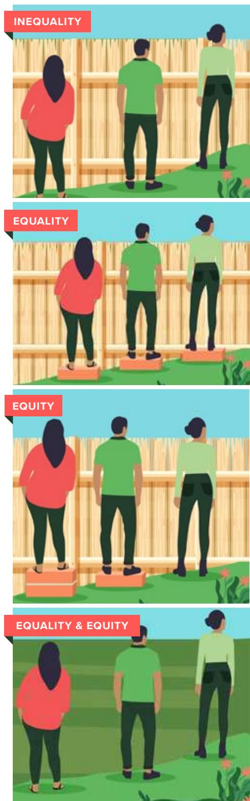

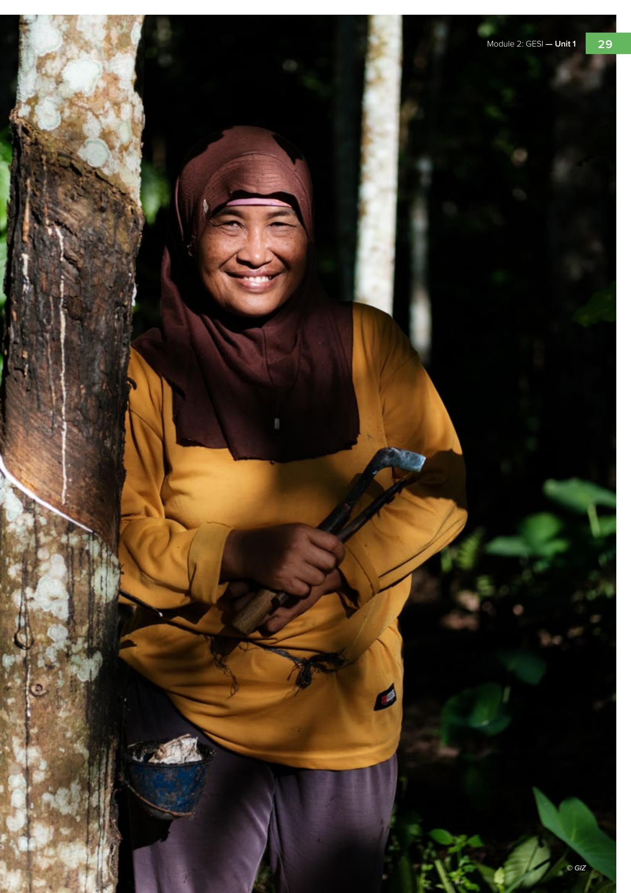

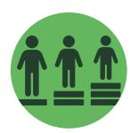

### **TOOL 5:** PROMOTING EQUITY *Equity Steps*

#### **MATERIALS**

PowerPoint slides, flip chart, index cards

#### **PREPARATION**

⊲ Prepare lecture and discussion questions

⊲ Explain that **there are many approaches for advancing gender equity and social inclusion** in projects, programmes, business models and value chains. The specific approach used by project designers and implementers depends on their own frameworks and ways of working, programme objectives, capacities of sta and partners, and available resources. ⊲ As a result, **projects may engage with gender and inclusion in dierent ways**,

ranging from simply acknowledging gender dynamics to actively challenging the root causes of inequality.

⊲ **Understanding these approaches** helps ensure that interventions are intentional, appropriate, and aligned with the project's overall goals and context. ⊲ Explain **the continuum of gender integration approaches** in project management using the image12, 13, 14 below.

#### *Step 1*

### *Mini-lesson: Gender integration continuum*

**Gender discriminatory approaches**  are not typically framed as such, but these are programming or actions that reinforce harmful gender norms, exclude or disadvantage women, girls, or gender minorities, and actively worsen gender inequalities.

**Gender neutral approaches** do not address gender as a construct, and as such, ignore gender dierences, roles, power relations, and gender-based discrimination. By overlooking gender dynamics, gender neutral approaches risk unintentionally

reinforcing existing inequalities.

**Gender sensitive approaches** recognize gender dierences, power dynamics, and the gender-specific needs of women, men, girls, and boys, and integrate this understanding into design and decisions. However, gender awareness alone does not create change or reduce inequality.

**Gender responsive approaches** are designed to take deliberate actions to reduce gender inequalities by addressing specific barriers and constraints that women, men, and gender-diverse people face. These approaches implement targeted interventions based on identified gender gaps.

**Gender responsive**

**Gender aware / sensitive**

**Gender transformative**

**Gender neutral**

**Gender discriminatory**

12. Intergovernmental Working Group (IGWG). 2017.

13. World Health Organization (WHO). 2011.

14. FAO, IFAD, WFP, CGIAR GENDER Impact Platform. 2023.

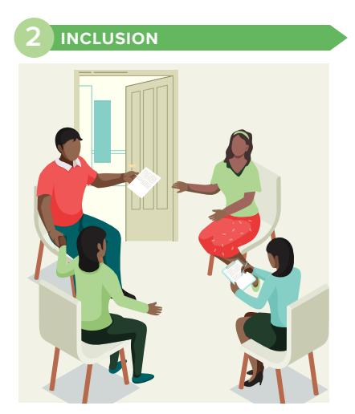

**Gender transformative approaches** seek to actively shift harmful gender norms and power structures by addressing the root causes of inequality, strengthening women's agency, and promoting more equitable distribution of resources, roles, and decision-making. These approaches work at the levels of systems and institutions (structural and cultural) to advance durable change.

⊲ Explain that while much of this language emerges from work on gender and women's empowerment, approaches are diversifying and expanding to address intersectional inequalities, masculinities, and social equity and inclusion more broadly. In this training, we begin with the basic gender concepts and then take a more expansive view of intersectional inclusion.

*Step 2*

### *Mini-lesson: Access, inclusion and equity*

⊲ Explain that in order to move from project management language to value chains, business, trade and investments, we need to **simplify these concepts for easy application by the private sector** (large, medium and small-scale operators and

traders). Equity goals should be clear, relevant, and easy for dierent value chain actors to apply in their own work.

⊲ **Discuss** the concepts of ACCESS, INCLUSION, AND EQUITY in value chains and business.

To promote equity in value chains, **the first step is accessibility**.

⊲ ACCESS = **equal access to, use and benefit** from material, financial, political and social resources. ⊲ ACCESS is about getting a foot in the door. Equal access to decision-making spaces, resources, technologies, extension and information.

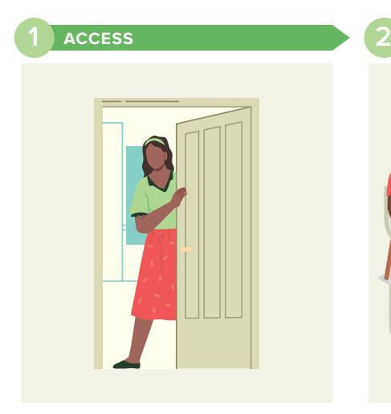

The next step advances **social and material inclusion**.

⊲ INCLUSION = **equal opportunities** to actively participate, feel valued and accepted without fear of discrimination or harassment. ⊲ INCLUSION is about the quality of participation at every level so that men, women and other intersectional groups are able to fully and actively participate without fear of discrimination or harassment. Being heard and being able to genuinely participate.

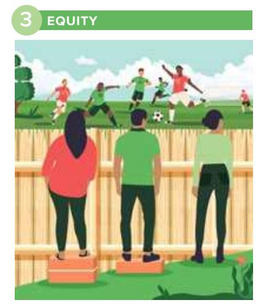

The final step advances **equitability in social and business relations**.

⊲ EQUITY is about fairness and benefit sharing. Men, women and intersectional groups are treated fairly according to their respective (but sometimes dierent!) needs. As a practice, equity is about providing fair treatment, access, and opportunities for all value chain actors by addressing individual needs and removing systemic barriers. Unlike equality, which gives everyone the same resources, equity provides dierent resources as needed so that everyone has an equal chance to succeed and contribute.

Provide several concrete examples of how private sector (large, medium and smallscale operators and traders) can promote equity at dierent levels in their value chains from producers to labourers and sta, to management.

#### **Access**

⊲ Inclusive and flexible policies ⊲ Recruitment practices ⊲ Opportunities for leadership roles ⊲ Promotion potential ⊲ Armative action

#### **Inclusion**

⊲ Freedom from discrimination ⊲ Freedom from harassment ⊲ Business culture respecting diversity ⊲ Training and capacity development opportunities

#### **Equity**

⊲ Fair remuneration ⊲ Employee benefit packages ⊲ Flexible working arrangements ⊲ Bargaining power ⊲ Supply chain due diligence

*Step 3*

#### *Share concrete examples*

Give each participant three cards to brainstorm some examples of how private sector actors (large, medium and smallscale operators and traders) can promote equity in their value chains.

⊲ CARD 1: ACCESS ⊲ CARD 2: INCLUSION ⊲ CARD 3: EQUITY

Invite participants to read their examples aloud while you write on a flip chart. Facilitate discussion about the dierences and overlaps between these three steps from the level of producers in the sourcing area, to labourers and other roles in the value chain.

#### *Step 4*

### *Collecting concrete examples* **DEBRIEFING AND DISCUSSION**

Explain that this activity shows how dierent approaches shape the way projects and businesses address inequality. In project management, these approaches help teams choose strategies that match their goals, resources, and ways of working. When we translate these ideas into value chains and private-sector settings, the emphasis shifts to clear, practical actions that improve access, inclusion, and equity for dierent actors. By linking the continuum of gender approaches with concrete steps businesses can take, participants can see how equity is not only a development principle but also a set of actionable practices that strengthen performance, reduce risk, and create fairer value chains.

#### **Example questions for discussion:**

- 1. How could you use or adapt this activity to discuss ACCESS, INCLUSION, AND EQUITY in value chains in which you work?
- 2. How might these concepts guide everyday decisions from project design to sourcing, hiring, workplace culture, or engagement with producers and traders?

# Unit 2 GESI+ in value chains

**GESI+ is critical for strengthening value chains for compliance with the EUDR by ensuring that all value chain actors have equitable access to rights, information, resources, and decisionmaking. Inclusive and intersectional value chain analysis helps identify structural inequalities, unlock opportunities for marginalized groups, and guide the design of equity-responsive interventions. GESI+ is important for transparency in value chains because it ensures that all actors, including women, youth, IPLCs, and others, can access information, participate in decision-making, and report on practices at each stage of the chain. When these groups are empowered and included, it reduces information asymmetries and hidden activities, making it harder for unethical practices such as illegal deforestation, forced labour, or unfair trade to go unnoticed. Inclusive participation also strengthens monitoring and accountability mechanisms by allowing more people with diverse perspectives to observe, verify, and flag issues. GESI+ approaches address structural inequalities that contribute to unsustainable land use, leading to improved environmental stewardship, reduced deforestation risks, and shared socio-economic benefits. Integrating equity-responsive strategies ensures that value chains are traceable, sustainable, and socially transformative.**

#### **THIS UNIT COVERS:**

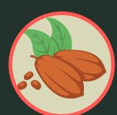

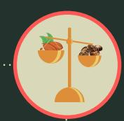

Module 3 *Value chains* Module 4 *Equity-responsive value chain development*

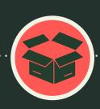

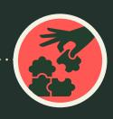

**Tool 10.** Mapping barriers and

**Tool 9.** Intersectional value chain mapping

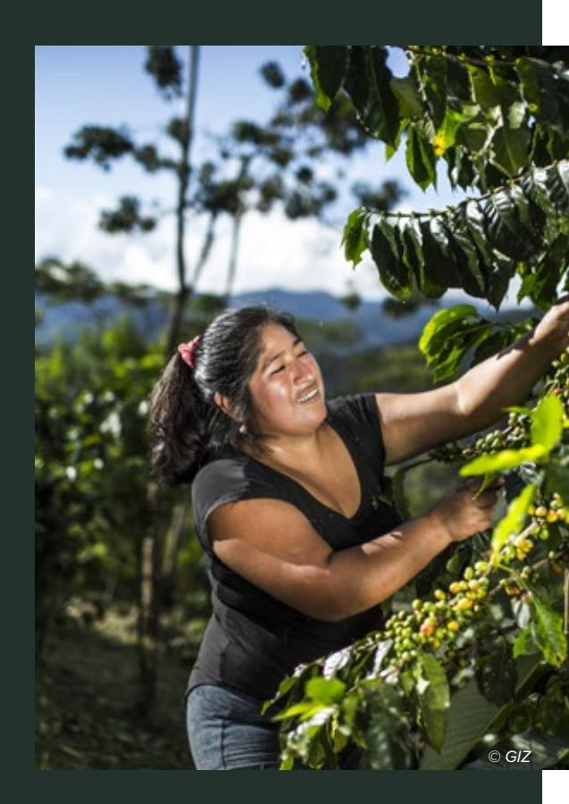

**1** To understand the structure of a value chain by identifying key nodes, actors, and be able to explain the flows of goods, services, and money within the chain. **2** To analyze how gender norms and social identities shape roles, responsibilities, and opportunities within value chains. **3** To apply the value chain concept with gender equity and social inclusion, and intersectionality to map specific commodity value chains for the sourcing landscape.

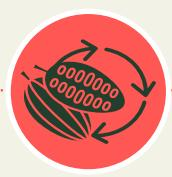

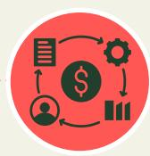

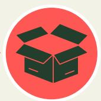

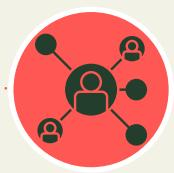

## MODULE 3 *Value chain mapping*

This module introduces participants to the structure and dynamics of value chains through four tools to enact and map value chains, adding gendered and intersectional value chain roles to enhance the value chain analysis in preparation for planning.

#### **TOOLS**

#### **LEARNING OBJECTIVES**

#### **KEY MESSAGES SOURCES**

⊲ Value chains link production, post-harvest activities, and markets connected through a sequence of nodes and actors. Value chain maps show how goods and services move, where value is created, gaps and barriers, and where relationships need strengthening. ⊲ Gender norms shape who performs specific roles within value chains. Gendered value chain mapping reveals inequalities and opportunities for more equitable participation. ⊲ Intersectional mapping helps identify where excluded groups face barriers and where inclusion is possible, enabling practitioners to design context-specific interventions that strengthen value chains while improving equity.

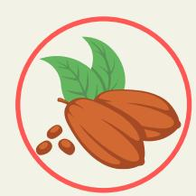

**Tool 6**  Living value chains

**Tool 7** Value chain mapping

**Tool 8**  Gendered labour roles: Man box | Woman box in value chains

**Tool 9**  Intersectional value chain mapping

- 1. Reemer T and Makanza M. 2014. Gender Action Learning System: Practical Guide for Transforming Gender and Unequal Power Relations in Value Chains. The Netherlands: Oxfam Novib. [https://](https://assets.oxfamnovib.nl/downloads/150115_Practical-guide-GALS-summary-Phase-1-2-lr.pdf) [assets.oxfamnovib.nl/downloads/150115\\_Practical](https://assets.oxfamnovib.nl/downloads/150115_Practical-guide-GALS-summary-Phase-1-2-lr.pdf)[guide-GALS-summary-Phase-1-2-lr.pdf](https://assets.oxfamnovib.nl/downloads/150115_Practical-guide-GALS-summary-Phase-1-2-lr.pdf)
- 2. KIT, Agri-ProFocus and IIRR. 2012. Challenging chains to change: Gender equity in agricultural value chain development. Amsterdam: Royal Tropical Institute, KIT Publishers. [https://www.kit.nl/wp-content/](https://www.kit.nl/wp-content/uploads/2018/08/2008_chachacha.pdf) [uploads/2018/08/2008\\_chachacha.pdf](https://www.kit.nl/wp-content/uploads/2018/08/2008_chachacha.pdf)
- 3. Leder S, Das D, Reckers A, Karki E. 2016. Participatory Gender Training for Community Groups: A Manual for Critical Discussions on Gender Norms, Roles and Relations. Colombus, Sri Lanka: International Water Management Institute (IWMI). [https://cgspace.cgiar.org/server/](https://cgspace.cgiar.org/server/api/core/bitstreams/31b964ea-cf81-4b67-81d5-8052684ca4a2/content) [api/core/bitstreams/31b964ea-cf81-4b67-81d5-](https://cgspace.cgiar.org/server/api/core/bitstreams/31b964ea-cf81-4b67-81d5-8052684ca4a2/content) [8052684ca4a2/content](https://cgspace.cgiar.org/server/api/core/bitstreams/31b964ea-cf81-4b67-81d5-8052684ca4a2/content)

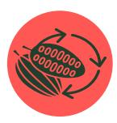

### **TOOL 6:** *Living value chains*

#### **MATERIALS**

Value chain node cards, blank index cards, markers

#### **PREPARATION**

⊲ Study value chain nodes for the target crops. ⊲ Prepare a set of scenarios or examples to demonstrate dierent value chain configurations or value chain dynamics. ⊲ Find an image and print value chain note cards for each target value chain.

#### *Ask for volunteers to come to the front of the room*

You will need one volunteer for each node of the value chain. Line the volunteers up horizontally facing the audience. Next ask the audience to stand and gather at the front of the room to help coach the volunteers. The non-volunteers will directly face the volunteers and get involved in the activity.

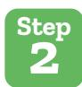

#### *Define 'value chain node'*

Explain the dierence between a value chain node and a value chain role or actor.

⊲ **Value chain node:** Specific stage or activity within a value chain, such as such as 'production' or 'marketing' node. ⊲ **Value chain actor:** Individual, organization, or business that performs the activities at that node, such as a 'farmer' or a 'retailer'.

#### **EXAMPLES OF VALUE CHAIN NODES**

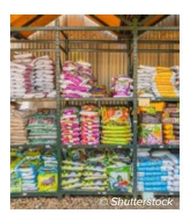

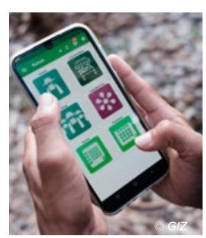

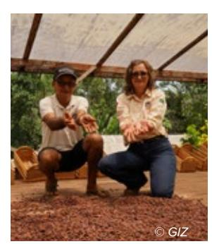

Input Technical services Production Post-harvest processing

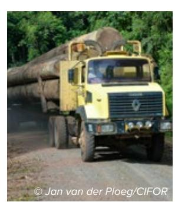

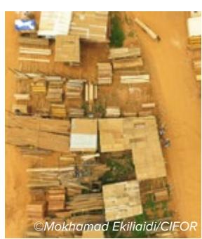

Transport Processing/value addition Packaging Market

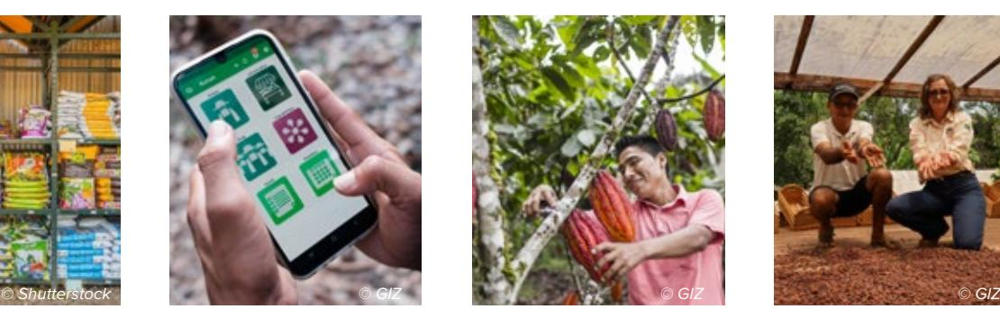

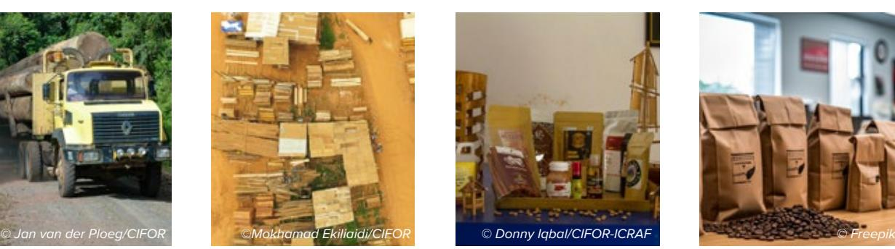

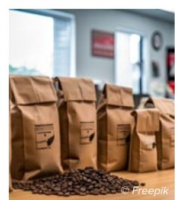

## *Step*

*4* **Ask volunteers to rearrange themselves linearly in the general order in which the goods and services flow from one actor to the next.** Explain that we know that value chains are not linear but that this is the simplest way to explain how goods, services, money flow from one actor to the next.

> ⊲ Allow a few minutes for the volunteers to move around while the non-volunteers direct and coach them.

⊲ If there are any nodes missing, participants may write the word or draw a picture on an index card and add a volunteer to the value chain to hold the card. ⊲ Keep the focus at value chain node level (don't label every actor in the value chain!). ⊲ The activity can be very lively for a few minutes while the participants debate the structure of the value chain.

*Step 3*

#### *Give each volunteer a node card*

Mix the order of the value chain node cards and give each volunteer one card to hold. Participants can add cards if a key node is missing.

#### *Explain the activity*

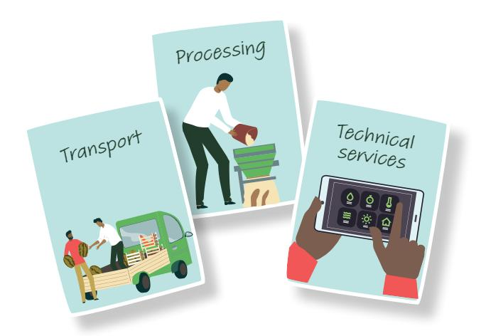

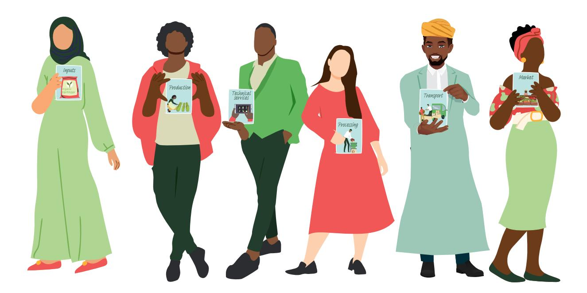

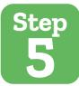

#### *Discuss value chain flows*

After the volunteers have settled, ask questions about the value chain flows:

- 1. **Flow of goods:** raw materials and processed product.
- 2. **Flow of services:** inputs, information, training.
- 3. **Flow of money:** payments for goods, inputs or services, loans or financial services.

*Step 6*

#### *Discuss value chain demographics and intersectionalities*

- 1. Identify dierent social groups who are included or excluded at each value chain node.
- 2. Discuss barriers and constraints to these groups.

#### **DEBRIEFING AND DISCUSSION**

Explain that this activity helps participants visualize how goods, services, and money flow through a value chain, and highlights where relationships are strong or where gaps and disruptions occur.

⊲ Emphasize that the exercise also reveals how dierent social groups may be concentrated at certain nodes and face unequal barriers or opportunities. ⊲ Encourage participants to think about how this simple demonstration could be extended or scaled for wider training or stakeholder engagement.

*Step 7*

### *Discuss value chain demographics and intersectionalities*

- 1. Discuss **intersectional social groups** identified at particular nodes.
- 2. Discuss **barriers and constraints** to these groups.
- 3. Identify **dierent social groups** who are included or excluded at each value chain node.

#### **Example questions for discussion:**

- 1. How might you adapt this activity to explore issues of access, inclusion, and equity in the specific value chains in which you work?
- 2. What changes would you make (such as adding context-specific nodes, scenarios, or social profiles) to make the activity more relevant?

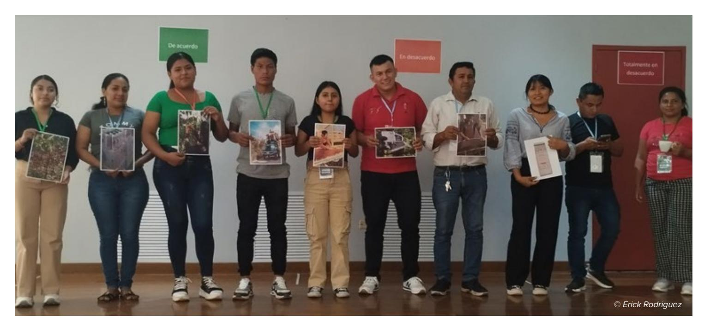

### **TOOL 7:** *Value chain mapping*

#### **MATERIALS**

Value chain node pictures, sticky notes, flip chart paper, pens

#### **PREPARATION**

⊲ Study value chain nodes for the target crops ⊲ Find an image and print value chain node cards for each target value chain

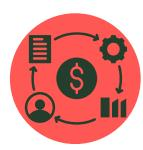

#### *Reinforce the difference between value chain node and value chain actor*

Explain the dierence between a value chain node and a value chain role or actor.

⊲ **Value chain node:** Specific stage or activity within a value chain, such as 'production'or 'marketing' ⊲ **Value chain actor:** individual, organization, business that performs the activities at that node, such as a 'farmer' or a 'retailer'

Explain that participants will now create their own value chain maps using both value chain nodes and value chain actors.

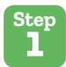

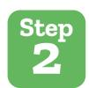

#### *Break into small groups by commodity and geography*

For this activity, the value chain maps should be as specific as possible to be very useful. Create table groups (6-8 persons maximum) based on common commodities (cocoa, coee, oil palm, natural rubber, soy, cattle and wood products). If there are many groups working on the same commodity, try to organize the groups by geographic proximity of their primary sourcing areas. This allows the participants to map localized value chains, moving beyond generalizations to enhance their usefulness of this exercise for their day-to-day activities.

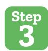

#### *Lay out the value chain nodes at the top of the flip chart paper*

Give each group a flip chart paper, a set of value chain node cards and sticky notes. Instruct the groups to place the value chain node cards across the long side of the flip chart paper. The groups can follow the plenary example (TOOL 6) OR they can organize dierently, but the cards should be generally linear for adding information in the following steps.

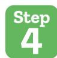

#### *Add sticky note for each of the actors in the value chain*

Now instruct each table group to add the value chain actors at each node. They will use sticky notes to write the name or type of the value chain actor. Each sticky note should be very specific to the value chain actors in their locality or sourcing area. Provide specific actor names where possible to learn more about how the value chain functions in each location.

Input Production Technical Processing Packaging Transport Market

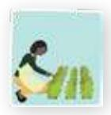

#### *Discuss flows of goods, services, money, etc across the chain*

With the actors on the map, you can begin discussing the flows of goods, services, money and other flows between nodes and actors from the farm to the final consumer. As these flows are discussed, note the areas where the value chain is functioning well and where improvements could be made. Note the gaps. Add additional actors if they are missing.

#### **DEBRIEFING AND DISCUSSION**

#### **Example questions for discussion:**

- 1. How could you use or adapt this activity to map out more complex, non-linear value chain dynamics?
- 2. How would you add context about the enabling environment to your value chain maps?

Reflect on how the process of contextspecific value mapping for building a shared understanding of how value is created through the chain. Encourage groups to share insights on what surprised them, what confirmed their experience, where they see opportunities for improvement.

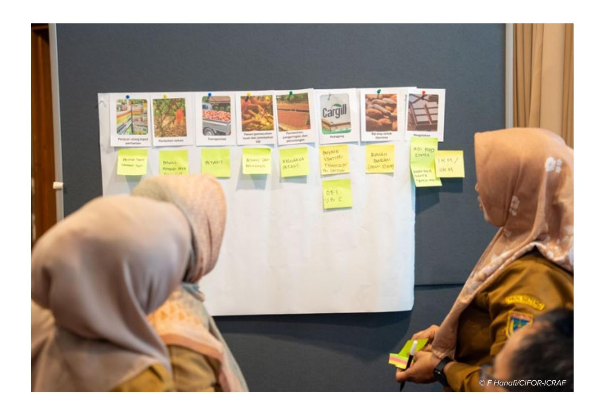

### **TOOL 8:** GENDERED LABOUR ROLES *Man box | Woman box in value chains*

#### **MATERIALS**

Flip chart paper, markers

#### **PREPARATION**

⊲ Read instructions for Tool 2 to become familiar with gender norms and the Man box | Woman box activity ⊲ Study gender roles in the target value chains

#### *Introduce the man box | woman box activity*

In plenary, explain the Man Box | Woman Box activity (See TOOL 2 for details).

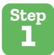

#### *Hang two flip chart papers*

Write 'Man Box' on one paper and 'Woman Box' on the second paper. Explain that in this activity, we are extending the Man Box | Woman Box activity beyond characteristics and norms to discuss how these norms shape gender roles in production systems and value chains.

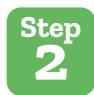

#### *Identify roles that men and women play in the value chains*

⊲ In plenary, ask the participants to say aloud the specific gender roles that men play in the target value chains (cocoa, coee, oil palm, natural rubber, soy, cattle or wood products). ⊲ Next, ask the audience to call out roles that women play in the value chain. This can be roles that women do alone or jointly with men. ⊲ Encourage everyone to participate. ⊲ If people are not speaking, call on men and women to give their ideas. ⊲ Create a list of roles that men perform in the value chain, and a list of roles that women perform.

*Step 3*

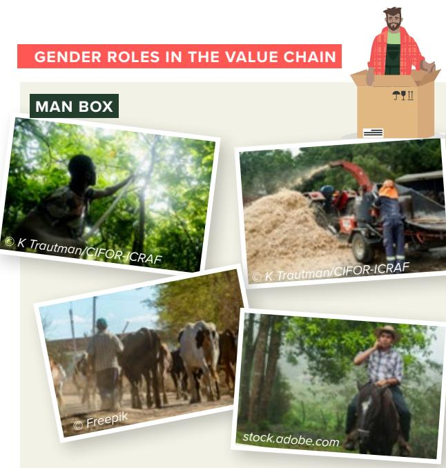

#### **WOMAN BOX**

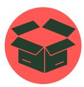

© GIZ

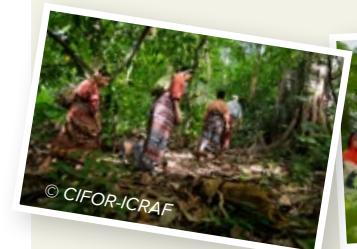

#### *Probe whether these gender roles can be reversed*

Now ask whether any of these roles could be reversed? Are there roles that women are currently performing that could be shared with or done by men? Why or why not?

Show an image of a man performing a role typically done by a woman in the value chain, and a woman performing a role typically done by men. Allow the audience to laugh and have fun with the idea of men and women taking on roles that are contrary to gender norms.

*Step 4*

#### **Ask the question: Can WOMEN do any of the roles in the MAN BOX?**

⊲ Look at list of gender roles. Ask whether there are any roles on the MEN's list that women can also do? Make a star (\*) next to these roles. ⊲ What would other women say about a woman taking on men's roles? What would men say about her? ⊲ Ask whether there are any roles on the MEN's list that this society would NOT WANT a woman to do? (i.e., they don't want the gender norms to change around this role). Make an X next to these roles. Who would object to transforming these gender roles?

#### **Ask the question: Can MEN do any of the roles in the WOMAN BOX?**

⊲ Now ask whether there are any roles on the WOMEN's list that men can also do? Make a star (\*) next to these roles. ⊲ What would other men say about a man taking on women's roles? What would women say about him? ⊲ Now make an X next to the roles that they would NOT WANT a man to do. ⊲ Who would object to transforming these gender roles?

#### **Ask the question:**

⊲ What would it take to transform these roles?

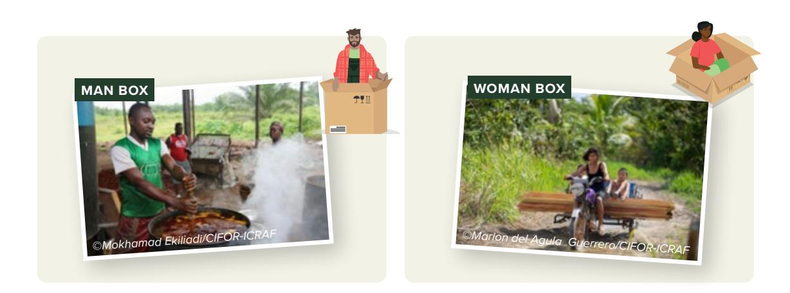

#### **DEBRIEFING AND DISCUSSION**

#### **Example questions for discussion:**

- 1. How could you use or adapt this activity to discuss gender roles and intersectionality in value chains in which you work?
- 2. What is one concrete change in gender or social norms within this value chain that you believe is both possible and meaningful; and what would it take for the community to accept it?

Explain that every very society has its gender norms about the roles that men and women perform in the household and in productive activities, as well as which social groups should be included or excluded from participation in economic activities. They dier from place to place, culture to culture, and over generation to generation. It is important to understand locally and culturally embedded gender norms when we plan our work.

Sometimes in our project activities, we push the boundaries of social norms so that both men and women of dierent intersectional groups can participate, share the workload, and benefit from their participation. Sometimes they are already performing these reverse gender roles, but this work may be invisible, unrecognized, or uncompensated.

#### *Probe the roles of intersectional groups*

Hang a third flip chart paper on the wall and label 'INTERSECTIONALITY'.

⊲ Ask whether there are demographic or social groups that perform specific roles in the value chain? ⊲ Probe dierent types of intersectional groups one-by-one to facilitate brainstorming and discussion. » Generation (for example, are there roles that are particular to one age class? Youth? Elders?) » Indigenous Peoples? » Migrants? » Religious, ethnic, or culturally significant groups? » Persons with disabilities? » Other groups or categories of social dierence? ⊲ As the participants respond, list the groups by name or category. After each group name, write the role that each performs in the value chain. ⊲ Ask whether there are demographic or social groups that are excluded from specific roles in the value chain? Again probe dierent types of intersectional groups one-by-one to facilitate brainstorming and discussion. As the participants respond, list the groups by name or category. After each group name, invite the participants to explain how and why they are excluded.

#### **INTERSECTIONALITY**

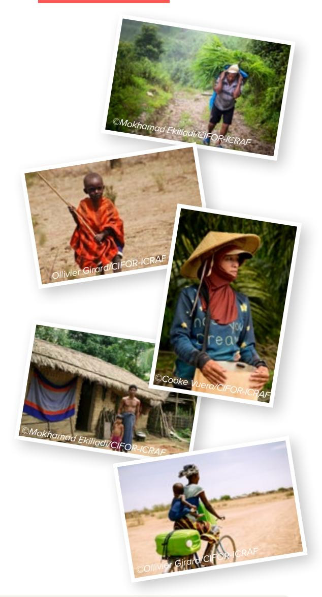

### **TOOL 9:**

## *Intersectional value chain mapping*

#### **MATERIALS**

Value chain maps (TOOL 7), flip chart paper, markers, gender role cards, and sticky notes

#### **PREPARATION**

⊲ Study value chain nodes for the target crops ⊲ Create gender role cards as drawings or photographs (see below), print, and cut to fit on the gender value chain maps

#### *Explain gender role cards*

Give each table group several sets of gender role cards for adding gender roles to their value chain maps. If it is not practical to prepare these cards in advance for printing, you can facilitate a quick activity to agree on how to draw these symbols on the value chain maps. Explain the meaning of each picture.

#### *Map gender roles to value chain actors*

Explain that gender roles should be mapped to the value chain actors. For each value chain actor, ask the table groups to discuss whether this role is primarily performed by men, by women, or jointly. For each role that is jointly performed, they should select whether this is mostly done by men with some support from women, mostly done by women with some support from men, or the role is shared equally between men and women. Allow just a few minutes for table groups to ax a gender role to each value chain actor card. There should be a gender role card for each value chain actor.

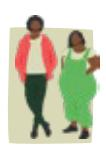

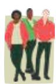

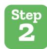

mostly WOMEN

MEN only

WOMEN only

mostly MEN MEN and

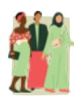

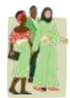

WOMEN equally

Input Production Technical Processing Packaging

services

Transport Market

#### **VALUE CHAIN ACTORS**

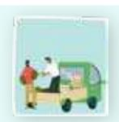

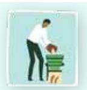

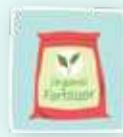

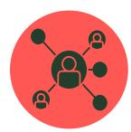

#### **DEBRIEFING AND DISCUSSION**

### *Map intersectional roles to value chain actors*

Give each table a set of small stickers to add other social identities to the value chain actor map. If stickers are not available, this can simply be written directly on the value chain actor cards. Instruct them to create a key identifying the names of the intersectional groups represented (i.e., youth, migrants, IPLCs, Persons With Disabilities (PWDs), etc.). Allow just a few minutes for table groups to ax intersectional identities to relevant value chain actor cards. Note that it is not necessary to have an intersectional label on every actor if the role is generally performed by anyone of any social category.

Youth IPLC

Migrants PWD

This activity highlights how norms around gender and other social identities shape who participates in each node of the value chain, and whose contributions may be overlooked or undervalued. By visually mapping roles, participants can better recognize where inequalities emerge and where opportunities for inclusion already exist. Emphasize that these patterns are not fixed; they vary by community and can shift over time with the right support and planning. Encourage participants to consider how they can use this understanding to design interventions that are context-specific, respectful, and inclusive.

#### **Example questions for discussion:**

- 1. How might you simplify or adjust this mapping activity so that farmers can easily identify and discuss the gender and social identities involved in their own value chains?
- 2. How would you modify the materials or approach to make the activity more participatory, culturally appropriate, or visually accessible?

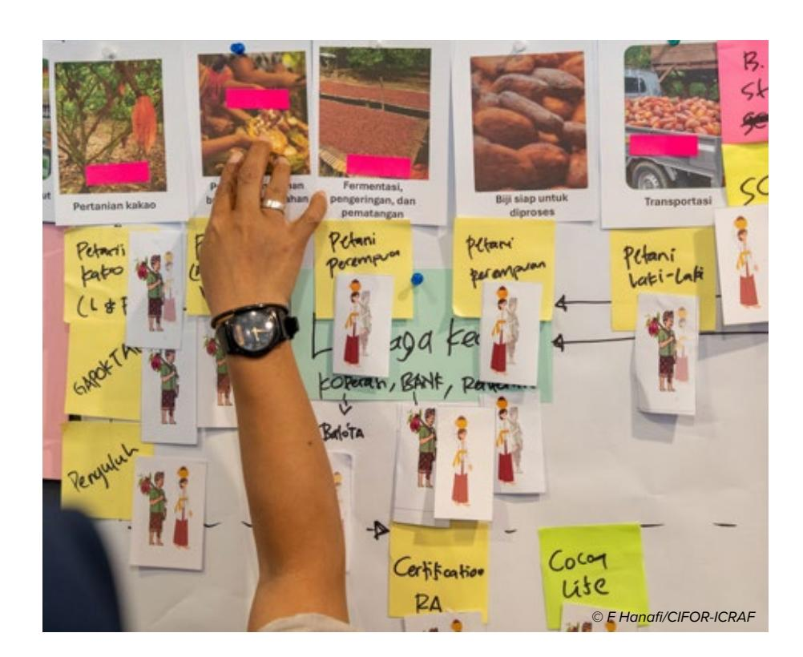

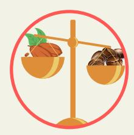

**1** To understand and explain the concepts of barriers, constraints, and inequities in value chains, and why dierent actors experience unequal access and benefits. **2** To analyze how gender norms and social identities interact to shape participation, roles, and opportunities within value chains, identifying where structural barriers exist. **3** To apply GESI+ informed approaches to propose context-specific solutions that resolve or overcome barriers and constraints.

## MODULE 4

## *Equity-responsive value chain development*

This module examines how barriers and social dynamics aect participation and benefits in value chains through two tools to map barriers and constraints, then map solutions. Through hands-on mapping, participants identify obstacles and propose solutions to promote equity in value chains.

#### **TOOLS**

**Tool 10**  Mapping barriers and constraints

**Tool 11**  Equity-responsive approaches: Mapping solutions

#### **LEARNING OBJECTIVES**

#### **KEY MESSAGES**

⊲ Barriers and constraints are obstacles and limitations that prevent full participation or fair benefits in value chains, revealing why some actors face greater challenges than others. ⊲ Gender- and equity-responsive approaches actively address structural inequalities and provide targeted support, ensuring all actors can participate fully and benefit fairly.

#### **SOURCES**

- 1. Reemer T and Makanza M. 2014. Gender Action Learning System: Practical Guide for Transforming Gender and Unequal Power Relations in Value Chains. The Netherlands: Oxfam Novib. [https://assets.oxfamnovib.nl/](https://assets.oxfamnovib.nl/downloads/150115_Practical-guide-GALS-summary-Phase-1-2-lr.pdf) [downloads/150115\\_Practical-guide-GALS](https://assets.oxfamnovib.nl/downloads/150115_Practical-guide-GALS-summary-Phase-1-2-lr.pdf)[summary-Phase-1-2-lr.pdf](https://assets.oxfamnovib.nl/downloads/150115_Practical-guide-GALS-summary-Phase-1-2-lr.pdf)
- 2. KIT, Agri-ProFocus and IIRR. 2012. Challenging chains to change: Gender equity in agricultural value chain development. Amsterdam: KIT Publishers, Royal Tropical Institute. [https://](https://www.kit.nl/wp-content/uploads/2018/08/2008_chachacha.pdf) [www.kit.nl/wp-content/uploads/2018/08/2008\\_](https://www.kit.nl/wp-content/uploads/2018/08/2008_chachacha.pdf) [chachacha.pdf](https://www.kit.nl/wp-content/uploads/2018/08/2008_chachacha.pdf)

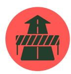

### **TOOL 10:**

## *Mapping barriers and constraints*

#### **MATERIALS**

Intersectional value chain maps (TOOL 9), markers, stickers, index cards, tape or adhesive putty

#### **PREPARATION**

⊲ Study value chain dynamics for the target crops

This illustration15 shows two people preparing to run what appears to be the same race. The farmer on the right has a smooth, clear path with only a small hurdle. The farmer on the left faces a path filled with major obstacles (rocks, debris, puddles, and barriers), making her route far more dicult even though the distance of the track is the same. The man says, "What's the matter? It is the same distance!" People with fewer barriers often do not recognize the hidden challenges that others face. This is a metaphor for inequity—opportunities may appear equal, but structural barriers make access and outcomes very dierent for dierent groups. *1* Explain barriers and constraints:

*Step*

⊲ **Barriers:** things that block full and equal participation ⊲ **Constraints:** things that limit how much a person can benefit

Explain that barriers and constraints shape who can participate, who can advance, and who gets stuck. Have fun with the image, identifying barriers and constraints (baby, razor wire, crocodile pit), but then connect it to real challenges smallholder farmers face (lack of land, credit, tools, mobility, voice, etc.) and how this diers across intersectional groups.

### *Mini-lesson: Value chain barriers and constraints*

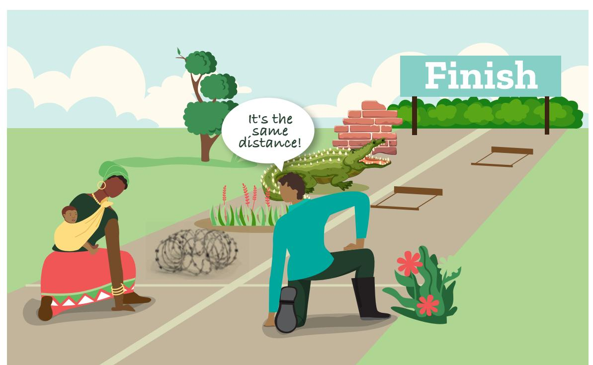

Source: Authors' work, visual by KANDS Collective

#### **DEBRIEFING AND DISCUSSION**

Explain that this activity helps participants see that value chain participation is shaped not only by opportunities but also by barriers and constraints that aect groups dierently. By mapping where these obstacles occur and who is most aected, participants gain a clearer picture of inequities across dierent nodes of the chain. Mapping these uneven starting points and challenges is an essential step toward understanding why some actors advance more easily while others are left behind.

#### **Example questions for discussion:**

- 1. How would you adapt this barriers mapping activity so it fits the realities, literacy levels, and cultural norms of the smallholder communities you work with?
- 2. How might you change the activity to better probe barriers and constraints to dierent social groups?

#### *Label barriers or constraints*

Ask the group to identify real barriers and constraints to access, inclusion in equity in their value chains for women or specific social groups.

⊲ **Access:** Who is excluded from the entering the value chain and why? ⊲ **Inclusion:** Who is not welcomed or supported in the value chain and why? ⊲ **Equity:** Who is unable to succeed or benefit fairly and why?

Input Production Technical

services

Youth

Migrants

*Step 2*

*1*

Mark the barrier or constraint on the value chain map at the value chain actor, node, or links between nodes

Barrier/constraint at a specific node (place on the node name) *1*

Barrier/constraint aecting only one actor (place on the actor sticky note) *2*

Barrier/constraint at links between nodes (place between value chain nodes)

Number each barrier or constraint on the map with a sticker or marker.

*3*

*3*

*2*

#### *Explain each barrier or constraint on a separate index card*

Number index cards with the numbers of barriers or constraints marked on the value chain map. Use a separate note card for each barrier or constraint. Include the number, specific information about the barrier or constraint and who is most aected.

*Step 3*

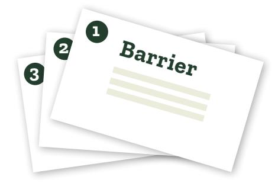

### **TOOL 11:** EQUITY-RESPONSIVE APPROACHES *Mapping solutions*

#### **MATERIALS**

Intersectional value chain map (Tool 9) and Barriers and Constraints cards (Tool 10), markers, index cards, tape or adhesive putty.

#### **PREPARATION**

⊲ Study value chain dynamics of target crops

#### *Mini-lesson*

Discuss the concepts of gender-responsive and equity-responsive approaches to value chain development.

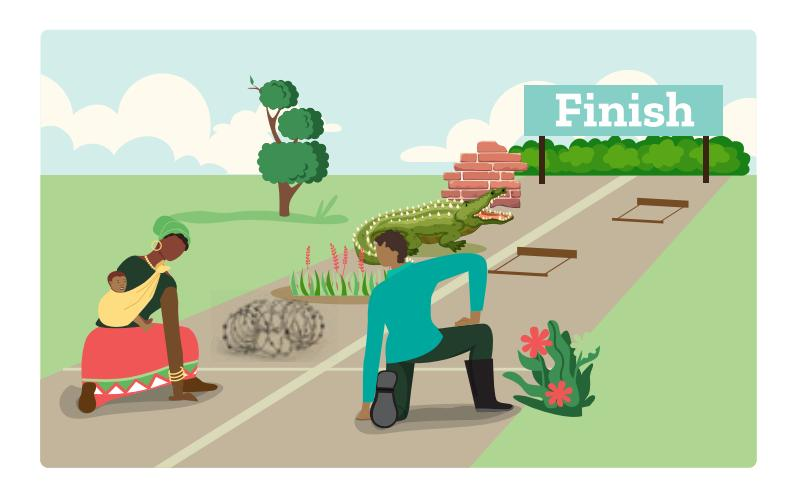

⊲ **Equity-responsive value chain development** is a socially inclusive approach that identifies and addresses the unequal conditions, barriers, and power imbalances that aect dierent actors' ability to participate in and benefit from a value chain. Equity-responsive approaches design actions to ensure that individuals and groups, regardless of gender, age, ethnicity, disability, socioeconomic status, or other identities, receive the specific support, resources, and opportunities they need to achieve fair outcomes. ⊲ **Gender-responsive value chain development** examines the gender dynamics of value chains, how women and men participate dierently, and their gender-specific barriers and constraints. Gender-responsive approaches design actions to ensure that men and women can participate fully, benefit fairly, and exercise agency by removing structural barriers, promoting gender- equitable access to resources and services, and supporting inclusive decision-making.

#### **Ask participants to consider:**

⊲ What would need to change so that the woman farmer's path looks like the male farmer's? ⊲ What would it take to remove, reduce, or redesign these barriers? ⊲ Who has the power to implement these changes?

These considerations shift the conversation from simply describing inequalities (awareness) to designing for equity (responsiveness).

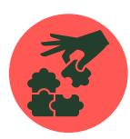

*Step 3*

#### *Propose solutions to value chain barriers and constraints*

Revisit the concept of promoting equity in value chain through

» Removing barriers and constraints » Providing supporting tools, resources or support

For each barrier/constraint (TOOL 10), ask the table groups to propose one or more solutions to resolve these barriers by either removing the barrier or providing a tool to overcome it.

#### *Gallery walk*

⊲ Hang the value chain maps, barriers solutions pages on a wall to create an art gallery. ⊲ Invite the groups to present their maps and the most challenging barrier to the plenary. ⊲ Each group should present only their greatest challenge, barrier or constraint and their proposed solution.

**Barrier:** Women cannot join the cooperative without a land title.

**Solution:** Relax cooperative rules for women – allow women to register coee bushes in their name.

**Barrier:** Forced child labour – children lack protection **Solution:** Internal audits and enforcement of cooperative rules in alignment with labour laws. Remove and report noncompliant members

#### **HERE'S WHAT IT LOOKS LIKE WHEN FINISHED**

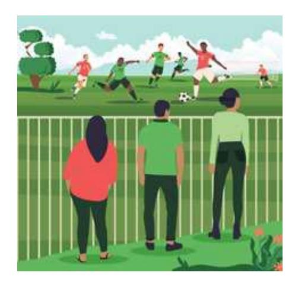

*1* **Barrier: Solution:** *2* **Barrier: Solution:** *3* **Barrier: Solution:** *4* **Barrier: Solution:**

Input PackagingProduction Technical services

MarketTransport

*1*

*2*

*3*

*4*

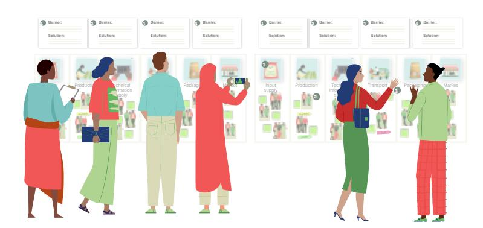

#### **DEBRIEFING AND DISCUSSION**

Guide participants to reflect on how the activity shifted the focus from identifying inequalities to designing actionable solutions that promote equity in value chains. Highlight how participants proposed practical ways to remove barriers and provide targeted support for dierent groups, emphasizing inclusion beyond gender alone. Encourage them to think about how these approaches could be applied to other crops, regions, or social groups in their work.

#### **Example questions for discussion:**

- 1. How could the proposed solutions be adapted for smallholder farmers in a dierent region or value chain?
- 2. What additional barriers might exist for certain groups in other contexts, and how could we address them?

#### **Each group select one barrier to**

#### **participation in the value chain**

⊲ Preparation (10 minutes). Give each group 10 minutes to prepare, select roles and plan their skit ⊲ **Act 1** (5 minutes). Allow each group 5 minutes to act out a challenge. ⊲ **Freeze.** Yell "freeze". The actors should stop and freeze their positions. ⊲ **Act 2** (5 minutes): Allow each group 5 minutes to act out a possible solution. ⊲ **Debrief** (5 minutes): Take 5 minutes to debrief after each skit.

#### **DEBRIEFING AND DISCUSSION**

Describe the scene: What is the challenge the actors were showing us?

#### **Example questions for discussion:**

- 1. What was their solution?
- 2. Does this solution allow Access, Inclusion, Equity?
- 3. What else would you suggest for this situation?

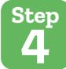

#### *Optional activity (time permitting): Role play*

Invite teams to choose one barrier and solution and act out skits in two acts.

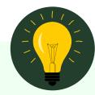

**Act 1:** Perform the barrier or constraint **Act 2:** Resolve the barrier or constraint

#### **Role play instructions**

Divide table groups into dierent intersectional groups from their value chain maps. Each group must select a dierent social group to represent in their skit. If time is limited, invite only one to two volunteer groups to prepare skits (the other participants can take a short break while the groups prepare).

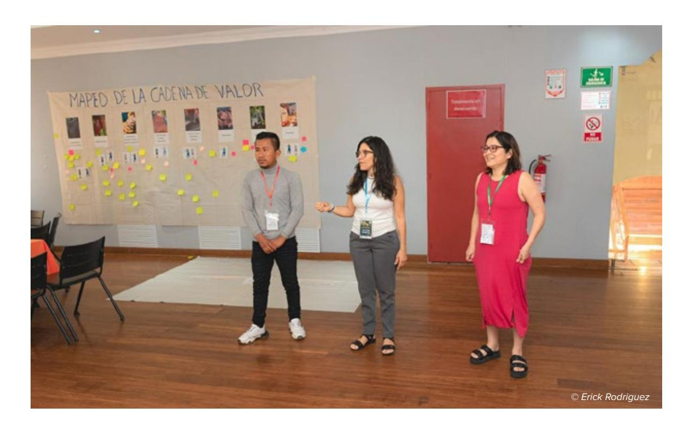

# Unit 3

# Enabling environment for equity-responsive EUDR

**Creating an enabling environment for equity-responsive EUDR involves designing policies, systems, and institutional arrangements that actively remove barriers faced by smallholder women, youth, IPLCs, and other intersectional actors in deforestation-risk value chains. This includes ensuring fair access to land tenure documentation, finance, technology, and market information; strengthening community participation in decisionmaking; and integrating gender and intersectional inclusion safeguards into traceability and due diligence processes. Legal literacy is critical in this context because it enables smallholders and actors along the value chain to understand the rules and obligations required to prevent deforestation, trace commodities, and ensure sustainable practices, while at the same time, empowering them to understand, exercise, and protect their rights under relevant national and international laws. Capacity building for producers, cooperatives, civil society organizations and local authorities, combined with supportive legal frameworks and inclusive data systems, helps ensure that all actors can meet EUDR requirements and support socially just transitions to deforestation-free value chains.**

#### **THIS UNIT COVERS:**

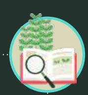

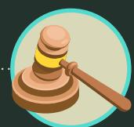

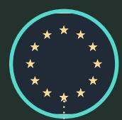

Module 5 *European Union Deforestation Regulation (EUDR)* Module 6 *National legislation*

**Tool 16.** Relevant national legislation Module 7 *Commodity***specific**  *regulations*

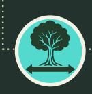

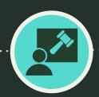

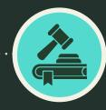

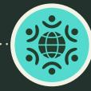

**Tool 17.** Roundtables legislation

**Tool 18.** Commodity sector readiness

**Tool 17.** Smallholder readiness

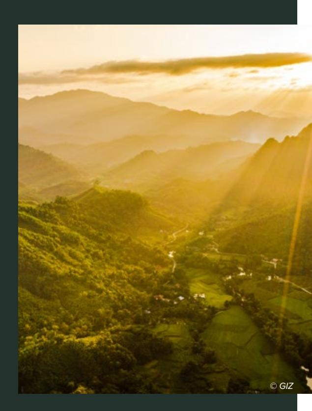

**Tool 12.** Values and valuebased problem solving

**Tool 13.**  EUDR lecture

**Tool 14.**  EUDR panel

**Tool 15.**  EUDR dialogue

## MODULE 5

# *European Union Deforestation Regulation (EUDR)*

This module introduces the EUDR and places it within a wider context of global eorts to reduce deforestation and forest degradation through market incentives, traceability, and commodity governance. The module first begins with an inventory of personal and organizational values and an assessment of how these align with global agendas, gaps, and what this means for willingness to transition deforestation-free value chains. Through interactive lectures, panel discussions, and community conversations, the module provides trainers with tools to communicate complex regulatory shifts in accessible ways and deliberate local and market-based solutions to promote more inclusive and sustainable value chains.

#### **TOOLS**

**1** Explain the key requirements and scope of the EUDR, including relevant commodities, legal conditions, and due diligence steps for smallholder compliance. **2** Analyze the implications of EUDR for gender equity, social inclusion, and smallholder livelihoods by evaluating how dierent groups are aected across value chains. **3** Apply facilitation skills to train smallholders and peers by designing and delivering interactive, contextappropriate activities that explain EUDR compliance, traceability, and equity considerations.

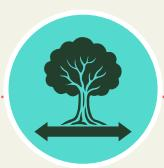

#### **LEARNING OBJECTIVES**

#### **KEY MESSAGES**

#### **SOURCES**

⊲ Personal and organizational values guide how individuals and institutions approach environmental and social sustainability and their trade-os. This module assesses value alignment with the underlying principles of deforestation-free agricultural value chains. ⊲ The EUDR aims to reduce EU-driven consumption driving deforestation and actions EU's commitment to global agreements such as SDGs, Paris Agreement, Glasgow Leaders' Declaration on Forests and Land Use, Global Biodiversity Framework, etc. ⊲ The EUDR is not protectionist as it is non-discriminatory: It applies to relevant products that are produced in the EU, imported to the EU or exported from the EU market. Products grown and processed inside and outside the EU are treated equally. It applies to those commodities with the biggest impact on deforestation as shown by scientific evidence. ⊲ The EUDR is largely gender-neutral and does not specifically mandate social safeguards. This means that women, youth, IPLCs, and other marginalized groups who often face unequal access are not actively addressed in the EUDR. Nevertheless national legislation or voluntary initiatives can address these gaps. ⊲ Article 30 of the EUDR and due diligence processes provide pathways for engagement, allowing marginalized groups to be included in consultations, data collection, and capacity-building, which can help promote gender- and equity-responsive outcomes in value chains.

**Tool 12**  Values and valuebased problem solving: Values continuum

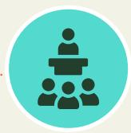

**Tool 13** EUDR lecture: Interactive lecture

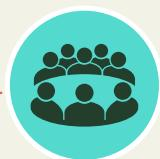

**Tool 14** EUDR panel: Panel-in-theround

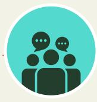

**Tool 15**  EUDR dialogue: Community Conversations

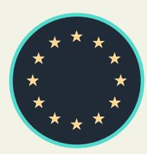

- 1. European Parliament and Council of the European Union. 2023. Regulation (EU) 2023/1115 of the European Parliament and of the Council of 31 May 2023 on the making available on the Union market and the export from the Union of certain commodities and products associated with deforestation and forest degradation and repealing Regulation (EU) No 995/2010 (Consolidated text: 26/12/2024). Ocial Journal of the European Union, L 150, 206–247. ELI: [http://data.europa.eu/eli/](http://data.europa.eu/eli/reg/2023/1115/2024-12-26) [reg/2023/1115/2024-12-26](http://data.europa.eu/eli/reg/2023/1115/2024-12-26)
- 2. EC (European Commission). 2019. Communication from the Commission to the European Parliament, the European Council, the Council, the European Economic and Social Committee and the Committee of the Regions: The European Green Deal (COM(2019) 640 final). EUR-Lex. [https://eur-lex.europa.eu/legal](https://eur-lex.europa.eu/legal-content/EN/TXT/?uri=CELEX)[content/EN/TXT/?uri=CELEX:](https://eur-lex.europa.eu/legal-content/EN/TXT/?uri=CELEX)52019DC0640
- 3. Arnold K. n.d. Panels in the Round. Powerful Panels. Accessed 1 December 2025. <https://www.powerfulpanels.com/panels-round/>
- 4. Lipmanowicz H and McCandless K. n.d.. 17. Conversation Café. Liberating Structures. Accessed 1 December 2025. [https://www.](https://www.liberatingstructures.com/17-conversation-cafe/) [liberatingstructures.com/17-conversation-cafe/](https://www.liberatingstructures.com/17-conversation-cafe/)

### **TOOL 12:** VALUES AND VALUE-BASED PROBLEM SOLVING *Values continuum*

#### **MATERIALS**

Graphics, PowerPoint slides or signage

#### **PREPARATION**

⊲ Review the proposed values continuums in the activity below ⊲ Adapt to context or prepare your own examples

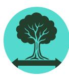

Explain the meaning of values and valuebased problem solving.

⊲ **Values** are deeply held personal beliefs, priorities, and guiding principles that individuals or groups consider intrinsically desirable, right, or important. Values tend to be stable and unwavering over time, reflecting core convictions tied to identity and ethics. ⊲ **Value-based problem-solving** seeks to identify and align solutions with core ethical principles, beliefs, and ideologies that are considered important by the people involved.

In resource management, value-based problem-solving focuses on the deeper principles and ethical commitments that guide how land, forests, and agricultural resources should be managed. These values might include stewardship, equity, intergenerational responsibility, cultural preservation, ecological integrity, or the rights of IPLCs.

Because these values reflect what communities or institutions see as moral imperatives, they tend to be stable and nonnegotiable. Decisions are evaluated by how well they align with core values, grounded in shared principles such as fairness, sustainability, and responsibility.

In Units 1-2, we have explored gender values and their social and material eects on value chain dynamics. In this activity, we reflect on environmental sustainability and economic development values and how these aect resource management decisions.

We will reflect on the participants' personal and organizational values as we discuss market transitions to sustainable agriculture and deforestation-free value chains. How well do these transitions align with the core values of the ToT participants or the smallholders whom they serve?

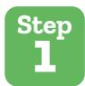

#### *Mini-lesson: Values and value-based problem solving*

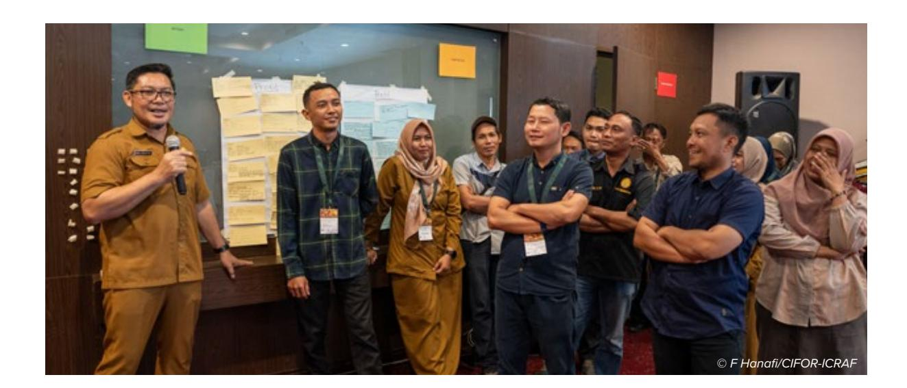

#### *Explain the values continuum activity*

Invite the participants to the front of the room to stand in a horizontal line.

Explain that one end of the line will represent one extreme on a continuum and the other end will represent an alternative extreme. You may show graphics or PowerPoint slides, hang signs on the walls, or simply explain orally using clear instructions.

You will read a statement and ask the participants to select a place on the line between the two endpoints which best represents their personal values.

Remind the participants that there is NO RIGHT OR WRONG position on their personal values. Participants may respectfully disagree, but each of the options presented in these examples are likely present in the landscapes and communities where they work. They are all viable options, but represent our dierent values about what constitutes sustainable landscape management.

*Step 2*

*Step 3*

*Step 4*

#### *Topic 1: Rural economic development models*

In this example, we are comparing dierent models of rural economic development.

⊲ On the left end, we have small, subsistence family farms. ⊲ On the right end, we have large-scale commercial estate farms. ⊲ In the middle, we have a mix of subsistence farming, cash crops at dierent scales and some commercially-operated estate farms.

Ask the participants to stand on the continuum between the two extremes, on a place that most aligns with their values. Once positioned, ask a few participants to explain why they have selected this position and their value alignment. Ask them to focus on their personally-held beliefs about what they consider to be intrinsically the right approach.

#### *Topic 2: Agricultural practices* The next example is about agricultural practices.

⊲ On the left end, we have low-input, passive farming systems. ⊲ On the right end, we have inorganic high-tech, high input, maximum yield agriculture. ⊲ In the middle, we have integrated management that may borrow from low-input, passive systems or high-input, high-tech practices as needed.

Encourage participants to take a position that aligns with their values. Ask them to vote from their own conviction and not just stand in the middle ground. Once positioned, ask a few participants to explain why they have selected this position and how it aligns with their values.

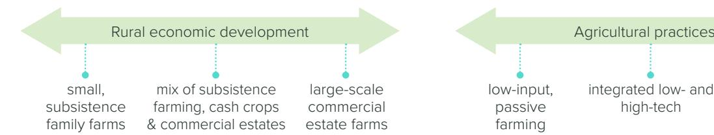

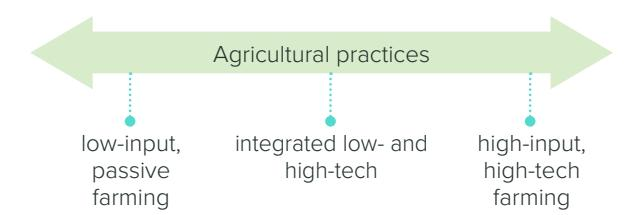

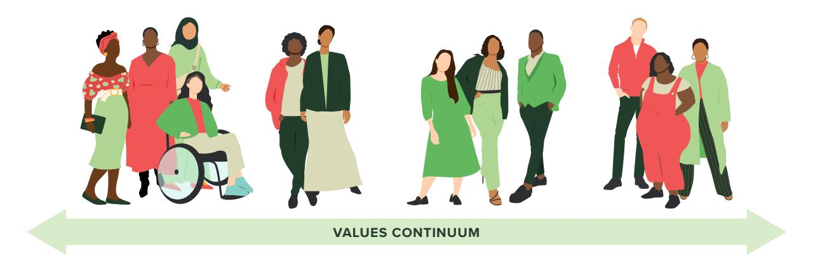

*Step 5*

*Step 6*

#### *Topic 3: Forest management*

The third topic focuses on dierent approaches to forest management.

⊲ On the left end, we have pure forest preservation which is zero-cut with minimal human disturbance. ⊲ On the right end, we have extractive forestry industries, including medium and large-scale commercial timber operations. ⊲ In the middle, we have forest conservation allowing for multiple uses including conservation activities, recreation and managed timber and natural resource extraction.

Repeat the line-up and select participants to explain why they have chosen their position on the line and how this aligns with their **personal values.** 

#### *Topic 4: Deforestation-free agriculture*

The final topic is related to sustainable agriculture in forest landscapes and deforestation-free agriculture.

⊲ On the left end, we have deforestationfree agriculture with tracking and traceability down to the farm level to ensure compliance. ⊲ On the right end, we have agriculture expansion into forested patches and landscapes with appropriate land use permissions from the relevant authorities. ⊲ In the middle, we have selective logging and land clearing, and mixed agroforestry systems with tracking and traceability to the farm or sourcing area.

Repeat the line-up and select participants to explain why they have chosen their position on the line and how this aligns with their personal values.

Repeat this line-up activity except this time ask participants to stand in the position that best aligns with their **organizational values** (referring to the organization which they are representing in the workshop).

 Ask selected participants whether their position on the line changed? How well do their personal values on this topic align with the organizational values which they represent in workshops and to farmers? How do they reconcile these two positions?

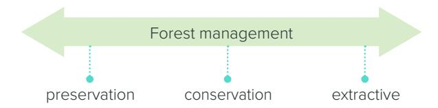

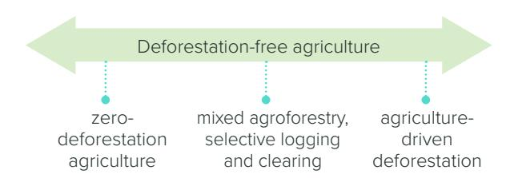

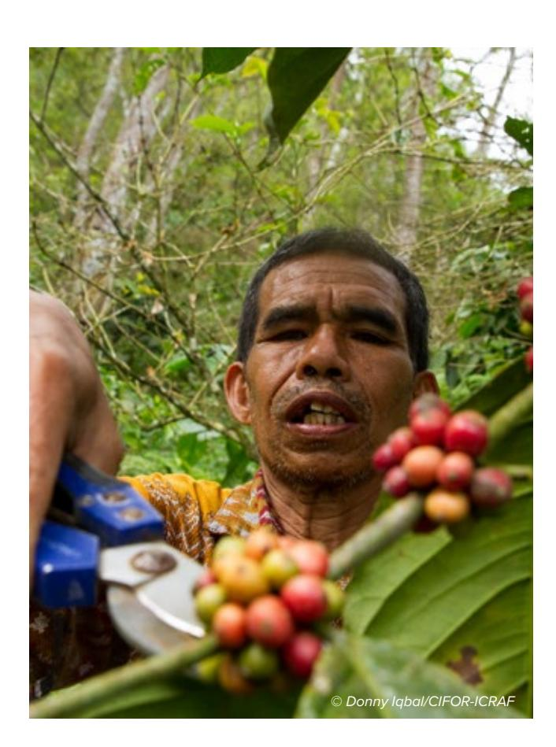

#### **DEBRIEFING AND DISCUSSION**

Close by reflecting on the purpose of the values continuum exercise to surface the deeply held beliefs that influence how individuals and organizations approach agriculture, forestry, and sustainable development. Emphasize that these values are not 'right' or 'wrong,' but they do shape how people evaluate trade-os, interpret sustainability, and make decisions in complex landscapes.

Comparing personal values with organizational missions can help participants recognize where alignment is strong and where tensions may arise in their day-to-day work. Encourage them to carry these reflections forward as they engage in discussions on sustainable agriculture and deforestation-free value chains, ensuring that future problemsolving eorts are grounded in core ethical principles and transparent value choices.

#### *Personal values and organization mission*

In the final step ask participants to revisit their profile cards hanging on the profile wall (see ICEBREAKER 1). Invite them to read their organizational mission statement and reflect on how closely their organization's mission aligns with their personal values discussed in this exercise.

Values describe how we act and what we believe in, while the mission explains why we exist and what we aim to achieve.

Explain the dierence between organizational values and organizational mission.

⊲ **Values** are the core beliefs or guiding principles that shape how an organization or team behaves and makes decisions; they describe what matters most and how people choose to act, such as through transparency, stewardship, equity, or collaboration. ⊲ **The Mission** is a statement of purpose that defines why the organization exists and what it seeks to accomplish, outlining the central work or contribution it aims to make in the world.

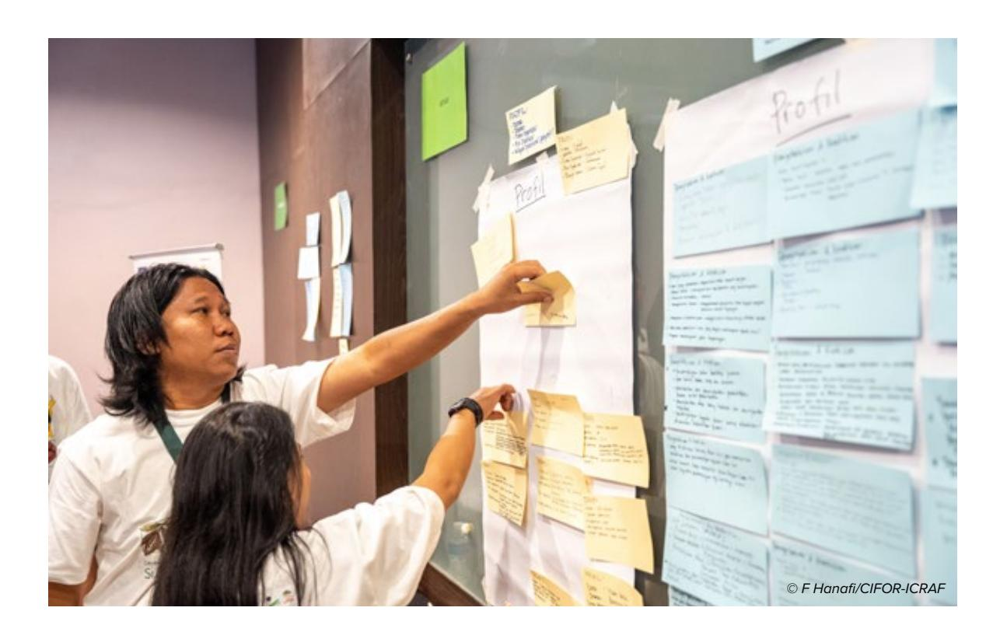

### **TOOL 13:** EUDR LECTURE *Interactive lecture*

#### **MATERIALS**

PowerPoint slides, EUDR videos, PDFs, and links for more information

#### **PREPARATION**

⊲ Familiarize yourself with the EU regulations relevant to deforestation-free agriculture, and the most up-to-date information about the status of these regulations for dierent types of actors in the supply chains and how they interact with gender and intersectionality. ⊲ There have been many recent changes and it is important to provide the most current information or direct participants to information sources. ⊲ The trainers of this session do not need to be experts in EU regulations, but should rather focus on where to find the information and how to support smallholders' readiness steps.

#### *Introduce EU market regulations*

The European Union maintains significant market influence over globally traded commodities, including deforestation-risk commodities like cocoa, coee, oil palm, natural rubber, soy, cattle or wood products which are mostly produced outside the European Union.

While this training focuses on the EUDR, it is important to recognize that other regions are developing their own rules, and producer countries themselves are strengthening national systems like traceability, legality assurance, and sustainability certification. By learning about EUDR in this workshop, participants will gain a broader understanding of how global markets are moving toward deforestation-free agriculture and what this means for smallholder farms, farmer livelihoods, and their future access to domestic and international markets. The tools and activities can be adapted to other voluntary and non-voluntary market regulations.

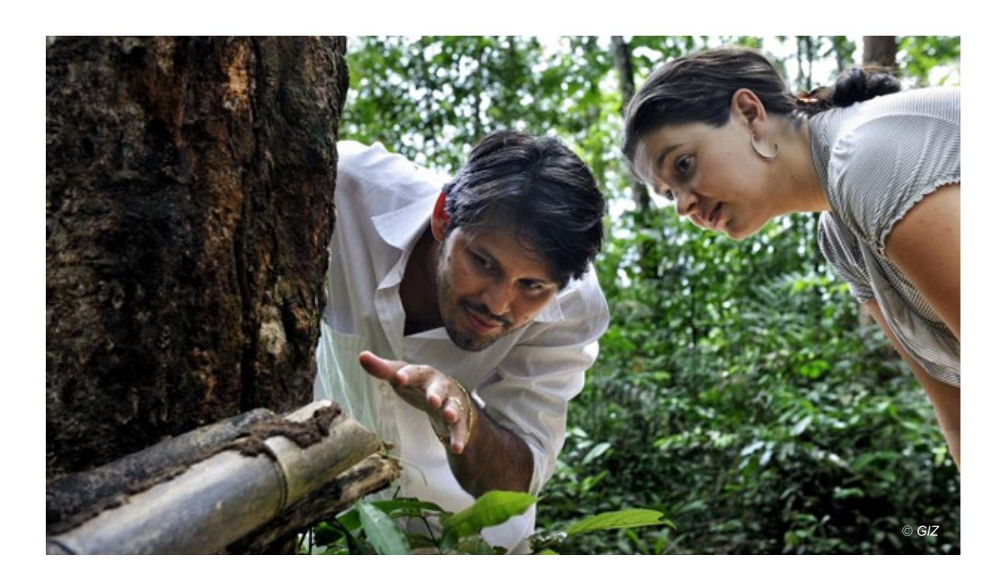

#### *Introduction to EUDR*

This ToT focuses on the EUDR to support smallholder transitions to climate-smart and deforestationfree agriculture.16

Introduce participants to the respective legal text, as well as the Zero Deforestation Hub where they can learn more about the EU market regulation.

#### *Background and justification for EUDR*

The EUDR is a legislative milestone binding EU Member States to minimize deforestation and forest degradation worldwide and thereby reduce the Union's contribution to global greenhouse gas emissions. It marks a major turning point in how the EU aligns its global market power with internationally agreed climate and biodiversity goals.

This lesson explains the background and justification for the EUDR, drawing directly from the **Regulation (EU) 2023/1115 on deforestation-free products.** 

*Step 1*

#### *Step 2*

#### **Legal Text**

⊲ European Union Deforestation Regulation (EUDR): ELI: [http://data.europa.eu/eli/](http://data.europa.eu/eli/reg/2023/1115/2024-12-26) [reg/2023/1115/2024-12-26](http://data.europa.eu/eli/reg/2023/1115/2024-12-26)

#### **Online resources**

⊲ European Commission Regulation on Deforestation-free Products: [https://environment.](https://environment.ec.europa.eu/topics/forests/deforestation/regulation-deforestation-free-products_en#objectives) [ec.europa.eu/topics/forests/deforestation/regulation-deforestation-free-products\\_](https://environment.ec.europa.eu/topics/forests/deforestation/regulation-deforestation-free-products_en#objectives) [en#objectives](https://environment.ec.europa.eu/topics/forests/deforestation/regulation-deforestation-free-products_en#objectives) ⊲ Zero-Deforestation Hub:<https://zerodeforestationhub.eu/> ⊲ EUDR Training Module: Towards deforestation free supply chains – Guidebook for trainers - Team Europe Initiative on Deforestation-free Value Chains [https://zerodeforestationhub.eu/](https://zerodeforestationhub.eu/towards-deforestation-free-supply-chains-guidebook-for-trainers/) [towards-deforestation-free-supply-chains-guidebook-for-trainers/](https://zerodeforestationhub.eu/towards-deforestation-free-supply-chains-guidebook-for-trainers/)

#### **Videos**

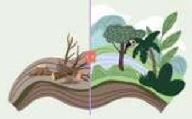

What policymakers need to know about the EUDR in 5 minutes

What smallholders need to know about the EUDR in 5 minutes

<https://zerodeforestationhub.eu/>

⊲ In simplest terms, the goal of the EUDR is to reduce the forest footprint of EU Member States by: » minimizing the EU's contribution to deforestation and forest degradation worldwide, and thereby contributing to a reduction in global deforestation; » reducing the EU's contribution to greenhouse gas emissions and global biodiversity loss.

#### **ARTICLE 1: SCOPE AND BACKGROUND**

16. This training of trainers contains no ocial opinion or assessment of the EUDR, nor does it reflect the views of the European Union. It is compiled based on an assessment by GIZ to facilitate discussion and shall not be used as legal advice on the regulation.

**Cocoa Coee Natural rubber Oil palm Cattle Soy Wood**

The commodities relevant for the EUDR include cocoa, palm oil, coee, natural rubber, cattle, soy and wood products. This applies to all products placed on the EU-market:

⊲ imported or produced in the EU and then traded on the EU internal market ⊲ exported from the EU-market

These seven commodities represent the largest contributors to EU-driven deforestation based on scientific evidence (deforestation driven by EU consumption and trade).

Remind the participants that the EUDR aims to reduce the EU's forest footprint.

These seven commodities may not be the most significant agricultural drivers of deforestation in every country where they are produced, but still represent the biggest proportion of deforestation driven by EU consumers.

#### **THE SEVEN MAJOR COMMODITIES**

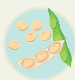

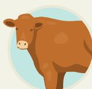

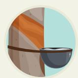

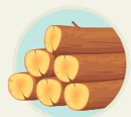

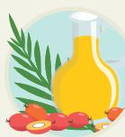

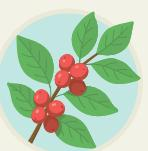

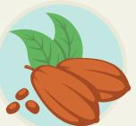

#### ⊲ **Scope of the problem:**

» Agricultural expansion drives almost 90 percent of global deforestation, with more than half of forest loss being due to conversion of forest into cropland, whereas livestock grazing is responsible for almost 40 percent of forest loss. » Production of feed for livestock can contribute to deforestation and forest degradation. » Promoting alternative, sustainable agricultural practices can address environmental and climate challenges, and prevent deforestation and forest degradation worldwide.

#### ⊲ **Explain that the EU is a major consumer and driver of global deforestation and forest degradation:**

» EU consumption is a considerable driver of deforestation and forest degradation on a global scale. » The EU imported and consumed one third of the globally traded agricultural products associated with deforestation between 1990 and 2008. » Over that period, EU consumption was responsible for 10 percent of worldwide deforestation associated with the production of goods or the provision of services. » Even if the relative share of EU consumption is decreasing, EU consumption is a disproportionally large driver of deforestation.

#### ⊲ **List the seven major commodities and explain why these seven commodities were targeted.**

#### *EUDR definitions*

⊲ Explain that definitions matter when it comes to the EUDR and how it will be operationalized. ⊲ There are many definitions outlined in the legislative instrument. ⊲ In this training, we will focus on those that smallholder farmers need to understand if they want to participate in these seven target value chains.

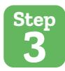

#### AGRICULTURAL LAND

⊲ For the purposes of this Regulation, agricultural use should be defined as the use of land for the purpose of agriculture, including for agricultural plantations and set-aside agricultural areas and for rearing livestock. ⊲ 'Agricultural plantation' means land with tree stands in agricultural production systems, such as fruit tree plantations, oil palm plantations, olive orchards and agroforestry systems where crops are grown under tree cover. It includes all plantations of relevant commodities other than wood. Agricultural plantations are excluded from the definition of 'forest'. ⊲ In line with FAO definitions, agroforestry systems, including where crops are grown under tree cover, as well as agrisilvicultural, silvopastoral and agrosilvopastoral systems, should not be considered forests, but as constituting agricultural use.

#### FOREST

⊲ 'Forest' means land spanning more than 0,5 hectares with trees higher than 5 metres and a canopy cover of more than 10 percent, or trees able to reach those thresholds in situ, excluding land that is predominantly under agricultural or urban land use. ⊲ The definition is derived from FAO definition. Raise awareness among participants that national definitions may vary, however, the EUDR relies on the forest definition of the FAO. ⊲ Primary forests means naturally regenerated forest of native tree species, where there are no clearly visible indications of human activities and the ecological processes are not significantly disturbed. ⊲ Plantation forests and planted forests have a dierent biodiversity composition and provide dierent ecosystem services compared to primary and naturally regenerating forests.

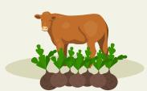

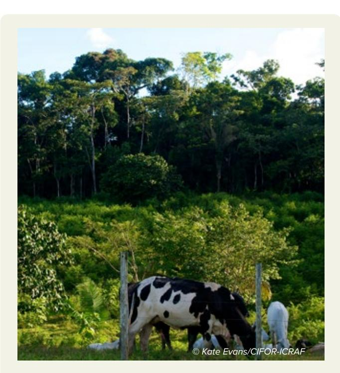

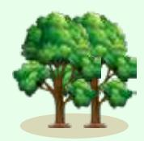

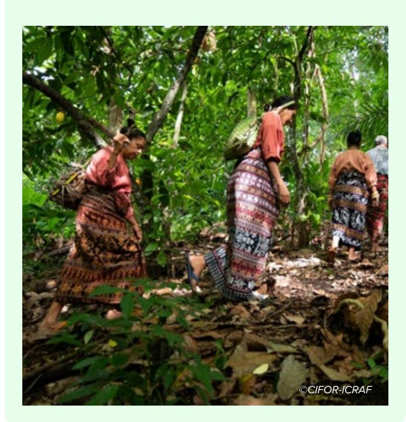

#### DEFORESTATION AND FOREST DEGRADATION

⊲ 'Deforestation' means the conversion of forest to agricultural use, whether humaninduced or not. ⊲ 'Forest degradation' means structural changes to forest cover, taking the form of the conversion of: » primary forests or naturally regenerating forests into plantation forests, or into other wooded land; or » primary forests into planted forests. ⊲ The definition of 'deforestation-free ' should be suciently broad to cover deforestation and forest degradation, should provide legal clarity, and should be measurable based on quantitative, objective and internationally recognized data.

#### OPERATOR AND TRADER

Under the EUDR, operators and traders are responsible for compliance. Producers are only responsible for compliance if they themselves are also operators or traders.

⊲ 'Operator' means any natural or legal person who, in the course of a commercial activity, places relevant products on the market or exports them. ⊲ 'Trader' means any person in the supply chain other than the operator who, in the course of a commercial activity, makes relevant products available on the market. ⊲ 'Authorized representative' means any natural or legal person established in the EU who, in accordance with Article 6, has received a written mandate from an operator or from a trader to act on its behalf in relation to specified tasks with regard to the operator's or the trader's obligations under this Regulation.

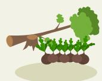

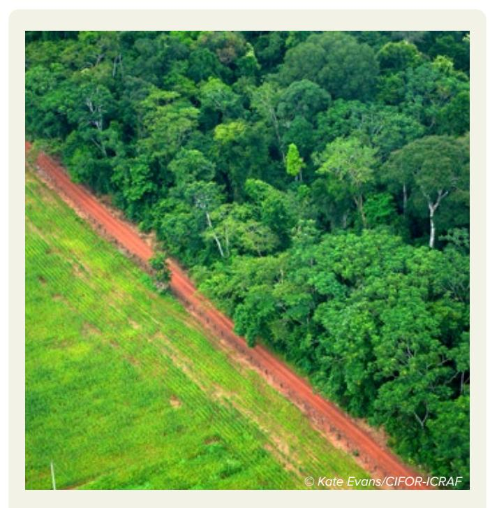

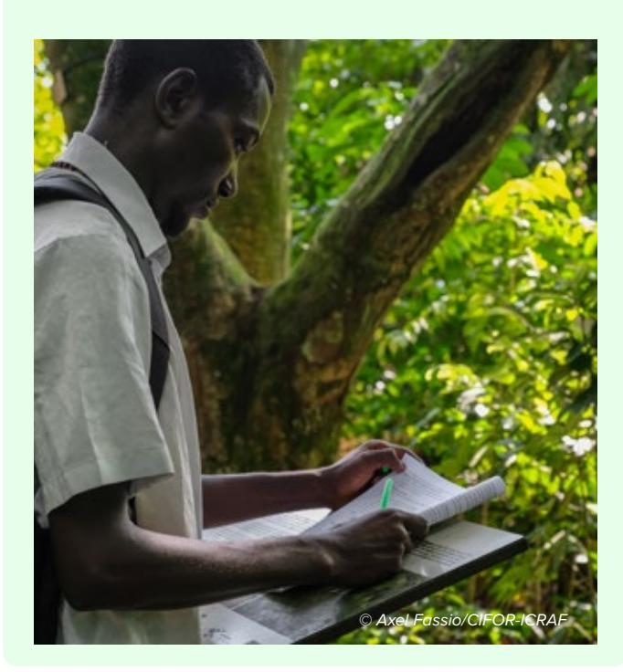

#### CONDITION 1:

#### **Deforestation free**

Condition 1 is extremely important for smallholders to understand because it applies retroactively to any deforestation or forest degradation event dating to the last day of December 2020.

It is critical that smallholders understand the implications of their land management practices on access to EU markets and that sensitization is active and ongoing in the sourcing areas for the seven EUDR aected commodities.

#### **No deforestation after 31st Dec 2020**

What this means:

⊲ No conversion of forest according to FAO definition into agricultural land ⊲ Oil palm and natural rubber plantations + agroforestry = agricultural land ⊲ No conversion of forest into oil palm, natural rubber or agroforestry

#### **No degradation after 31st Dec 2020**

What this means:

⊲ No conversion of primary forest or naturally regenerating forest into plantation forest or 'other wooded land' and ⊲ No conversion of primary forest into planted forest

#### CONDITION 2:

#### **Produced in accordance with the relevant legislation of the country of production**

The EUDR marks a major shift in the way that it balances EU rules on its own consumption and trade of deforestation-risk commodities and recognition of the relevant legislation in producer countries to govern their own resources in accordance with international commitments. This places the responsibility for social safeguarding

and social impact incentives on the producing countries themselves, and at the same time brings the action closer to the smallholders for engaging with their own representatives to guarantee social benefits.

The EUDR requires compliance with relevant national legislation, specifically laws, policies and commitments addressing:

⊲ Land use rights ⊲ Environmental protection ⊲ Forest-related rules ⊲ Third parties' rights ⊲ Labour rights ⊲ Human rights protected under international law ⊲ Free, Prior and Informed Consent (FPIC) under UN Declaration of Rights of Indigenous Peoples ⊲ Tax, anti-corruption, trade and customs regulations

#### CONDITION 3:

#### **Covered by DDS**

Explain that much of the attention around EUDR has focused on due diligence and DDS. For those working on equity and social inclusion, the due diligence process provides the clearest opportunities for ensuring social safeguarding for at-risk women and at-risk groups, as well as opportunities to participate in consultations and data collection that visibilize all of the producers in the sourcing area.

#### **Due diligence requirements include:**

- 1. Geolocation verification and other information
- 2. Risk assessment
- 3. Risk mitigation (based on risk assessment)
- 4. Proof of legality and proof that the raw materials and products are deforestation-free.

### *EUDR legal framework*

#### ARTICLE 3 PROHIBITIONS:

The EUDR has three major conditions for placing products on the EU market. These obligations apply to operators, traders, and any authorized representatives of the operators or traders. Producers are only responsible for due diligence if they themselves are also operators or traders, however they may be requested to provide information as part of their business relationship with operators and traders.

Relevant raw materials and products must be:

- 1. deforestation-free,
- 2. produced in accordance with the relevant legislation of the country of production, and
- 3. covered by a DDS.

Take time to explain each of these conditions in turn.

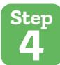

#### **Article 9 Information Required** *1 3*

⊲ Name ⊲ Quantity ⊲ Country of production ⊲ Geolocation to source ⊲ Date & time of production ⊲ Supplier of product ⊲ Buyer of product ⊲ Information on deforestation-free production ⊲ Information on legal production

#### **Article 10 Risk Assessment** *2*

⊲ Risk status in benchmarking ⊲ Presence of forests in country & area ⊲ Presence of Indigenous groups ⊲ Consultations and cooperation with Indigenous groups ⊲ Credible claims of Indigenous groups ⊲ Deforestation rate & degradation ⊲ Credibility of documents ⊲ Situation in the country ⊲ Supply chain complexity ⊲ Risk of circumvention ⊲ Conclusions of EU Expert Group ⊲ Substantiated concerns ⊲ Any relevant information ⊲ Certification

### **Article 11 Risk Mitigation**

⊲ Requesting additional documents ⊲ Additional verification through surveys or audits ⊲ Support for producers, in particular smallholders, through capacity building & investments

Risk mitigation provides the clearest opportunity to engage more substantively with the operators and traders on to provide support for social safeguarding and gender equity and social inclusion initiatives.

#### **Annex II: Due Diligence Statement (DDS)** *4*

⊲ Company name ⊲ Harmonized system code: Scientific name, quantity of product ⊲ Country of production ⊲ Geolocation of all plots of production ⊲ Statement on the assumption of responsibility ⊲ Signature

Diligence Statements (DDS) are uploaded to the Information System which is a Registry of Due Diligence Statements, a specialized online tool provided by the EU.

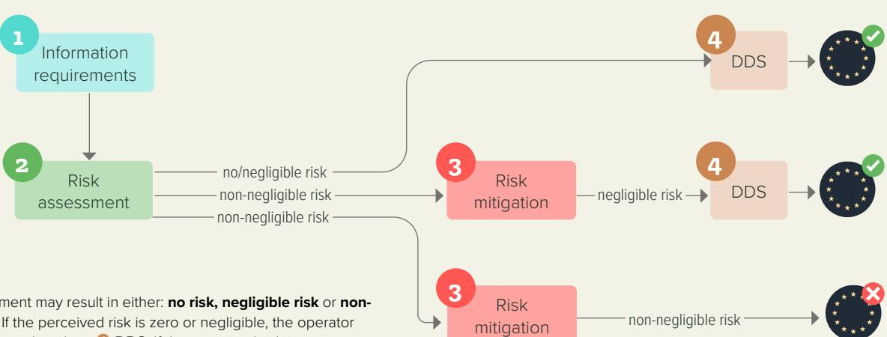

The risk assessment may result in either: **no risk, negligible risk** or **nonnegligible risk**. If the perceived risk is zero or negligible, the operator or trader can move directly to **DDS**. If the perceived risk is nonnegligible, the operator or trader must complete  **Risk mitigation**

Take some time to explain how due diligence is assured. Walk the participants through the due diligence steps for operators and traders in the figure below17 and how these align with EUDR requirements.

Under **Article 8 Due Diligence** it explains that due diligence shall include:

 The collection of information, data and documents needed to fulfil the requirements set out in Article 9; Risk assessment measures as referred to in Article 10; Risk mitigation measures as referred to in Article 11. This information is reported in Due Diligence Statement (Anex II).

### *Tracking and traceability18*

As part of the due diligence process and information requirements, operators and traders must collect geographically-explicit information e.g., GPS data for their entire sourcing area. Products must be traceable to the farm level.

⊲ Plots greater than four hectares are mapped as polygons representing plot boundaries. ⊲ Plots less than four hectares can be mapped by a single GPS point. ⊲ the information must be inserted in the DDS.

This requirement has been one of the major sticking points for EUDR operationalization, as operators, traders, and producing countries have raised concerns about the costs of traceability systems. For smallholder farmer advocates, there are concerns about data ownership and risks of smallholder exclusion as operators and traders seek to reduce their transaction costs. For advocates of data empowerment, they see opportunities for visibilizing marginalized and otherwise invisible producers, participating in data collection to ensure data autonomy, and for the potential of tracking and traceability systems to improve forest and supply chain governance.

### *Country benchmarking19, 20, 21*

The benchmarking system classifies countries according to the level of risk of producing commodities that are not deforestation-free:

The benchmarking methodology is grounded in EU's commitment to fairness, objectivity and transparency. All countries have been assessed on the basis of the quantitative criteria set out in the EUDR (Article 29(3)) against the latest available data from the Global Forest Resources Assessment dataset by the Food and Agriculture Organization of the United Nations (FAO 2025).

Sourcing from low-risk countries simplifies due diligence obligations for operators and traders; they must still collect required information and submit DDS, but are not obligated to assess and mitigate risks. In standard to high-risk countries, operators and traders must conduct risk assessments and undertake mitigation plans wherever nonnegligible risks are identified.

*Step 7*

*Step 6*

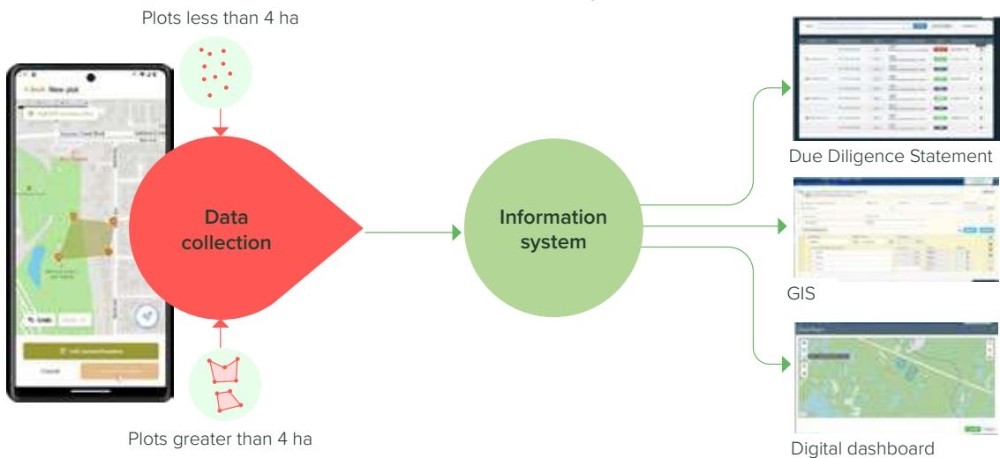

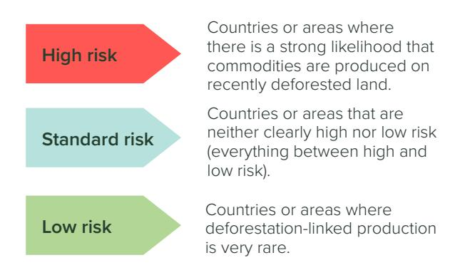

18. Figure adapted from GIZ SV NA+. 2024.

19. ibid. 20. European Commission. n.d.

21. European Union. 2025.

### *Step Impacts on smallholders*

## *8*

Potential benefits to smallholders

⊲ Owning geolocation data gives smallholders a stronger, more independent position in the value chain which can lead to fairer prices for smallholders as it allows for more direct supply chains. ⊲ A more transparent and traceable value chain can help smallholders to reach new markets and to focus on the sustainability of their products. ⊲ Focusing on sustainable production can also lead to fairer prices for smallholders. ⊲ Smallholders can benefit from technical support or capacity building from business partners who depend on information exchange. ⊲ The EU is strengthening the cooperation with partner countries, involving smallholders and promoting their interests. producers?22 ⊲ Smallholders producing cattle, cocoa, coee, palm oil, natural rubber, soya and wood products for the EU market should produce on deforestation-free land and follow national laws. ⊲ **Smallholders who do not place these products on the EU market themselves are under no direct legal obligations.**  ⊲ **However, they might be asked by their business partners, for example buyers, to provide information on their production, especially on the land of production.**  ⊲ Business partners need this information to fulfil their own obligations under the regulation.

What does this mean for smallholder

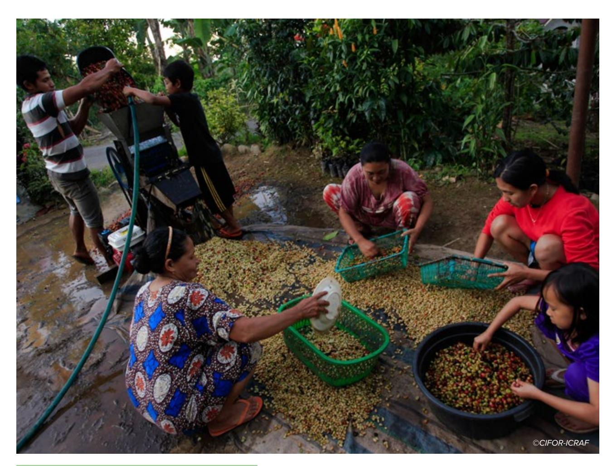

#### **DEBRIEFING AND DISCUSSION**

#### **Example question for discussion:**

How does this set of laws and market regulations align with your values on rural economic development, sustainable agriculture, or forest management?

#### *EUDR and social inclusion*

The EUDR is a gender neutral legal instrument with the exception of Article 30.

Article 30 outlines the pathways for EU cooperation with producer countries in the form of partnerships, stakeholder engagement and resources to support full participation of all stakeholders, including civil society, IPLCs, women, the private sector including microenterprises and other SMEs, and smallholders.

Article 30 emphasizes international commitments to FPIC, human rights protections, and the rights of IPLCs. Become familiar with the content of Article 30 to facilitate discussion amongst training participants about the limitations of EUDR for social safeguarding and for promoting gender- and equity-responsive approaches.

Remember to emphasize the primacy of relevant national legislation and the requirements of EUDR for operators and traders to comply with national laws. The strength of the EUDR on equity and social inclusion is only as strong as the national enabling environment with the exception of some recognition of international conventions.

We will dedicate the rest of the training modules to exploring the limitations, risks and opportunities provided by the EUDR and global market regulations on deforestationfree agriculture more generally.

Facilitators can help participants connect the EUDR to their own contexts by highlighting that these regulations are evolving and that smallholders, especially women, youth, IPLCs, and other marginalized groups may experience the impacts dierently.

Emphasize practical readiness steps such as understanding land-use rules, gathering accurate plot information, and identifying sources of reliable, up-to-date guidance. The facilitator's role is not to provide legal interpretation, but to create space for inclusive dialogue, share accessible resources, and support actions that strengthen both compliance and equity.

Facilitation tips for presenting market regulations to smallholder farmers:

⊲ Use simple, relatable examples and local analogies to explain abstract concepts like deforestation-free production and due diligence. ⊲ Break the content into short, interactive steps with visuals, maps, and infographics to illustrate supply chains, commodities, and risk categories. ⊲ Highlight practical benefits for smallholders, including access to new markets, fairer prices, and support for sustainable practices. ⊲ Encourage discussion about gender, social inclusion, and local community impacts to ensure participants see how the regulation relates to their families and communities. ⊲ If practical, incorporate hands-on activities, such as mapping plots, tracing products, or reviewing sample due diligence forms, to connect regulations to participants' daily practices.

### **TOOL 14:** EUDR PANEL *Panel-in-the-round*

#### **MATERIALS**

Chairs, time cards, microphone if necessary

#### **PREPARATION**

⊲ In advance, identify four to five people to sit on the panel.

⊲ **The panelists can be** 

**participants to the workshop or external speakers** who are available to join the panel session of the workshop (local to area). Importantly, panelists should be selected to speak to their discrete area of experience or expertise. You may adjust the topic of any of the panel seats to ensure that all panelists are knowledgeable about their topic

area.

⊲ Ask each panelist to share a short bio for the moderator to introduce them one-by-one.

⊲ **Share questions to the panelists in advance for preparation (maximum two questions per person)** or meet with them to agree on their discussion points prior to the

panel session.

⊲ Agree on the questions with the

panelists.

⊲ **Question 1** should reflect on the EUDR mini-lesson and how it relates to the panelists topic of

focus (3 minutes).

⊲ **Question 2** should be a followup question to probe more deeply or allow for more time for a two-part question (2-3

minutes).

⊲ Ask each panelist to prepare their responses in advance. They can have notes, but no presentation, no reading. ⊲ Arrange chairs in a circle with four chairs reserved for the

panelists.

⊲ Prepare time cards to help the speakers keep time (2 minutes remaining; 1 minute remaining;

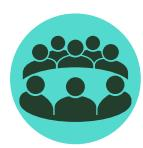

STOP).

**A Panel-in-the-round** is simply a panel discussion with the panelists sitting in a circle with the participants. The moderator will sit or stand in the middle of the circle. The tone should be conversational.

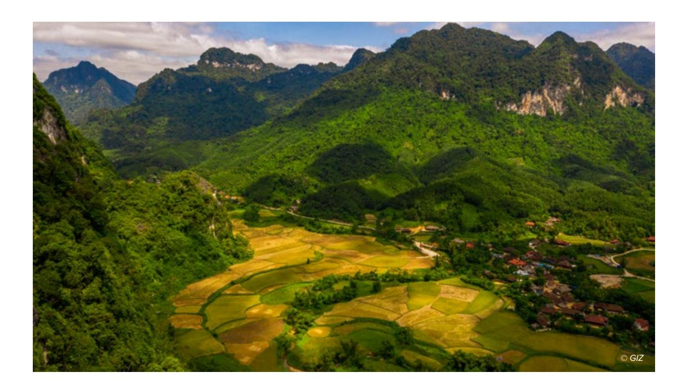

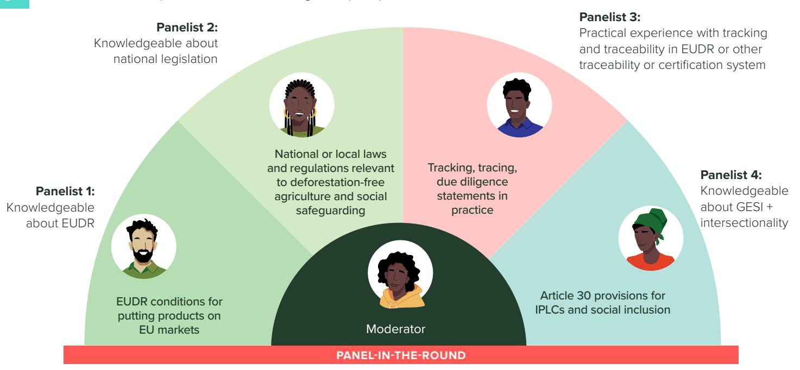

### *Introduce the panelists*

⊲ Introduce each of the panelists. ⊲ Invite them to sit in their designated seats. ⊲ Designate a moderator and a timekeeper who will sit within view of the panelist.

### *Panel discussion*

⊲ Pose the first question to the first panelist. ⊲ Allow them to respond and use the timecards to keep them on track. ⊲ Ask the second question immediately after, or hold for later in the discussion. ⊲ Continue asking questions to each panelist before opening the floor to questions from the audience.

#### *Audience questions and discussion*

After all panelists have spoken, facilitate the audience to ask questions. Continue to keep time and keep responses to 2-3 minutes each.

#### **DEBRIEFING AND DISCUSSION**

Panels are often organized for experts to speak to non-experts and answer questions. They can also be used for farmers, companies, or other value chain actors to share their experiences for open discussion. Feel free to adjust the topics for the Panel-in-the-round to accommodate the expertise available for the workshop session.

#### **Example questions for discussion:**

- 1. How might you use a Panel-in-theround to facilitate discussions about EUDR in the area where you work?
- 2. What would be the lead topic for each of the panelist seats?

*Step 1*

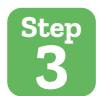

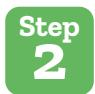

#### *Divide the participants into groups of 6 people at tables*

⊲ Participants for this activity should be organized by value chain. ⊲ Designate a moderator and notetaker for each table. ⊲ Give the moderator a talking object.

#### *Explain the rules othe community conversation*

⊲ There will be two rounds of dialogue. ⊲ Each round will last 10 minutes only. ⊲ There will be a talking object for each table. Only the person holding the talking object may speak. NO SPEAKING without the talking object. ⊲ The moderator will read the question and ensure that everyone understands. ⊲ The moderator will then hand the talking object to the person on their right.

⊲ The person holding the talking object will give their response to the question, then pass the talking object to the right. ⊲ Each person will respond to the question and pass the talking object to the person on their right. ⊲ Once everyone has spoken, the talking object can be placed in the middle of the table and participants can speak freely until the timer runs out (popcorn dialogue). ⊲ If participants begin speaking over one another or one person is dominating, the moderator can reintroduce the talking object to allow everyone to speak and be heard. ⊲ Encourage participants to listen and dialogue without writing. Only the moderator should take notes for reporting back in plenary. The focus is on listening to the viewpoints of each person at each table for active dialogue.

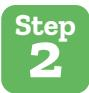

### **TOOL 15:** EUDR DIALOGUE *Community Conversation*

#### **MATERIALS**

Talking object, bell, index cards, markers

#### **PREPARATION**

⊲ Prepare dialogue questions in advance

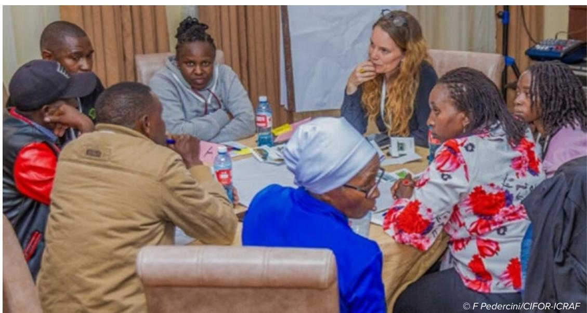

#### **DEBRIEFING AND DISCUSSION**

Community conversations are a great way to open discussion to everyone and allow them to be heard. This activity demonstrates how structured dialogue can promote knowledge sharing and deliberative dialogue to discuss questions and concerns about EUDR, and explore locally appropriate solutions. Facilitators can emphasize the value of listening, co-learning, and linking participants' experiences to broader market or policy contexts.

#### **Example questions for discussion:**

- 1. How might you use a COMMUNITY CONVERSATION to gather questions and input from smallholders about their expectations for EUDR and other market regulations?
- 2. What questions would you add to the roundtables to ensure that women, youth, and marginalized groups are actively engaged in these community conversations?

#### *Round 2*

Display the questions or write on an index card. Allow 10 minutes for discussion. The notetaker continues taking notes. After 10 minutes, ring the bell and bring the discussions to a stop.

- 1. Do you think that farmers will benefit from digital data?
- 2. What can be done to ensure that farmers have data autonomy (own their data) and data empowerment (can use their data to their own benefit)?

*Step 4*

### *Report back: One Big Idea*

Give each group 3 minutes to decide on the One Big Idea they would like to share with the plenary. They may use their note cards to discuss. After 3 minutes , invite each group to report back on only One Big Idea (not a list of ideas!) that came out of their table conversations.

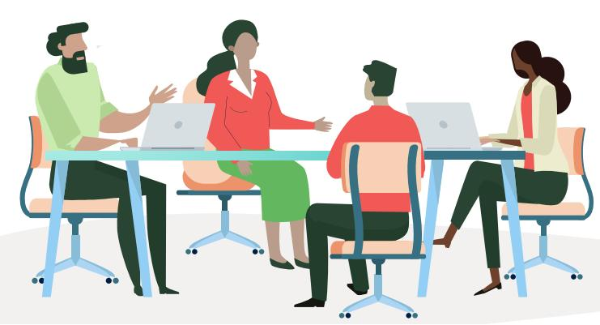

*Step 5*

*Step 3*

#### *Round 1*

Display the questions on a PowerPoint slide or write on an index card for the moderator to read. Allow 10 minutes for discussion.

- 1. What are the potential risks of EUDR to women, IPLCs and other marginalized groups?
- 2. What can organizations like yours do to mitigate these social risks?

The lead facilitator should circulate and make sure that the tables understand the rules of the game and are following them. The notetaker should take notes on the index cards while the participants are speaking. Each point should be captured on a dierent card. After 10 minutes, ring a bell and bring the discussions to a stop.

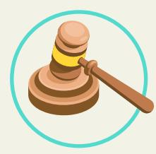

**1** To analyze the alignment between EUDR requirements and relevant national legislation, identifying how laws on land use, forest management, labour, and human rights aect smallholder compliance and value chain participation. **2** To evaluate the opportunities and gaps in national legal frameworks for safeguarding the rights and inclusion of women, youth, IPLCs, and other marginalized groups, and determine strategies to promote equitable participation in deforestation-free value chains. **3** To apply interactive methods, including legal literacy clinics and roundtable discussions, to guide smallholders in understanding and operationalizing national legislation in compliance with EUDR and in alignment with their values.

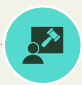

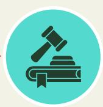

## MODULE 6 *Relevant national legislation*

The EUDR requires compliance with relevant national legislation as one of the three conditions for placing products on EU markets. This module provides guidance for conducting a rapid policy review, and tools for exploring national legislation relevant to value chain governance, highlighting laws on land use, forest management, labour, and human rights. Participants will examine how these laws safeguard women, youth, IPLCs, and other marginalized groups, and identify opportunities for equitable participation. Through interactive legal literacy clinics and discussions, trainers will learn to guide smallholders in understanding and applying these regulations in practice.

#### **TOOLS**

**Tool 16**  Relevant national legislation: Interactive lecture

**Tool 17**  Roundtables on national legislation: Legal literacy clinics

#### **LEARNING OBJECTIVES**

#### **KEY MESSAGES**

- ⊲ Compliance with EUDR requires adherence to relevant national legislation on land use, environmental protection, forest management, labour, and human rights, ensuring that smallholders' practices meet both EU and domestic legal standards. ⊲ National laws can provide social protections and opportunities for women, youth, IPLCs, PWDs, and other marginalized groups, shaping who can participate and benefit from deforestation-free value chains.
- 1. EUDR Consolidated text (26/12/2024), [http://data.europa.](http://data.europa.eu/eli/reg/2023/1115/2024-12-26) [eu/eli/reg/2023/1115/2024-12-26](http://data.europa.eu/eli/reg/2023/1115/2024-12-26)
- 2. LANDnet Uganda and Gallagher EJ, 2024, Facilitation Guide: Legal Empowerment Clinics for Women's Resource Rights in Uganda. Nairobi, Kenya: CIFOR-ICRAF, [https://www.cifor-icraf.org/](https://www.cifor-icraf.org/knowledge/publication/9301/) [knowledge/publication/9301/](https://www.cifor-icraf.org/knowledge/publication/9301/)

#### **SOURCES**

### **TOOL 16:** RELEVANT NATIONAL LEGISLATION *Interactive lecture*

#### **MATERIALS**

Desk review of relevant national legislation, index cards, markers

#### **PREPARATION**

⊲ Consult existing materials or experts, or conduct an independent desk review, if necessary, to prepare a presentation about the relevant national legislation with respect to deforestation-free value chains ⊲ Map the relevant national legislation to GESI+ ⊲ Share the summary brief with the participants in advance OR prepare a very clear presentation with sucient information to facilitate discussion

**Relevant EUDR guidance:** Recall that the EUDR requires compliance with relevant national legislation as one of the three conditions for placing products on EU markets.

**Article 3** prohibits commodities or products to be place on the EU market or exported until they have fulfilled three conditions: (a) they are deforestation-free; (b) they have been produced in accordance with the relevant legislation of the country of production; and (c) they are covered by a due diligence statement.

**Article 2(40)** defines 'relevant legislation of the country of production' means the laws applicable in the country of production concerning the legal status of the area of production in terms of: (a) land use rights; (b) environmental protection; (c) forest-related rules, including forest management and biodiversity conservation, where directly related to wood harvesting; (d) third parties' rights; (e) labour rights; (f) human rights protected under international law; (g) the principle of FPIC, including as set out in the UN Declaration on the Rights of Indigenous Peoples; and (h) tax, anti-corruption, trade and customs regulations.

#### RAPID DESK REVIEW OF RELEVANT NATIONAL LEGISLATION

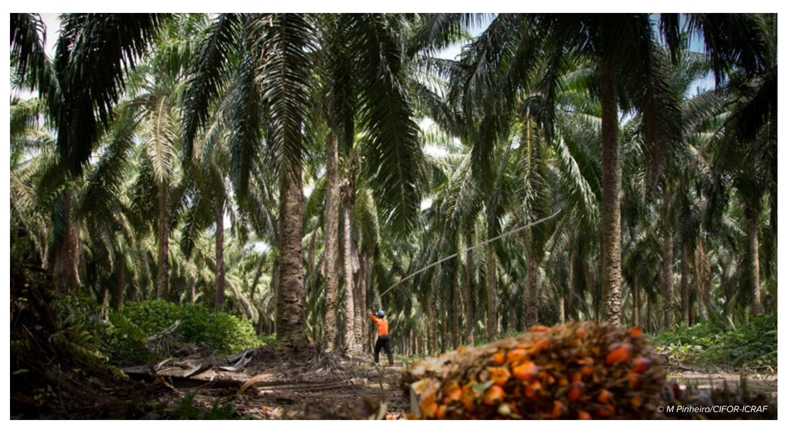

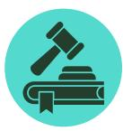

#### **GUIDANCE FOR GENDER-SENSITIVE AND INTERSECTIONAL REVIEW**

⊲ **Guiding research question:** What are the relevant national laws for governing deforestation in relevant commodity sectors (cocoa, coee, natural rubber, oil palm, soy, cattle and wood products) AND what are the positive or negative eects of these laws on dierent types of producers, operators and traders? ⊲ **Design and logistics.** Take time at the outset to check existing repositories and actively recruit experts and peer reviewers to guide the process. Ensure the review team is transparent about any methodological shortcuts or limitations (Breckon, 2023). If you choose to use Artificial Intelligence (AI) to guide your rapid review, develop clear protocols and ethics standards for documenting use of AI and fact-checking the results. ⊲ **Environmental sustainability.** Review the the national laws and policies, and international commitments and international commitments related to environmental protections and forest-related rules. ⊲ **Social sustainability.** Review the laws,

policies and international commitments related to land use rights, third party rights, labour rights, human rights and especially the rights of women, children and IPLCs.

⊲ **Identify intersectionalities.** Review whether the laws mention or recognize intersectionalities such as gender, generation (child, youth, elder), ability (mention PWDs), IPLCs, or other identity groups. ⊲ **Identify policy eects on intersectional groups.** Assess whether each law or policy excludes or causes harm to dierent identity groups or generates opportunities or benefits. ⊲ **Quality assessment.** Share the review with knowledgeable experts for validation. ⊲ **Participant presentation**. Use narrative or visuals to communicate the results to the participants in a workshop format. If you decide to use PowerPoint, you may use text, visuals and oral communication to present the results of the rapid review and seek audience validation.

#### *Social sustainability*

- (a) Land use rights
- (d) Third parties' rights
- (e) Labour rights
- (f) Human rights protected under international law
- (g) FPIC under UN Declaration of Rights of IPs

#### *Identify intersectionalities*

⊲ Gender ⊲ Generation ⊲ PWDs ⊲ IPLCs ⊲ other groups

#### *Guiding question:*

⊲ What are the relevant national laws for governing deforestation in relevant commodity sectors? ⊲ How do these laws eect women and intersectional groups?

#### *Design and logistics*

#### *Environmental sustainability*

(b) Environmental protection (c) Forest-related rules

#### *Identfy policy effects on intersectional groups*

⊲ Risks of exclusion or harm ⊲ Opportunities for inclusion or benefits

#### *Mini-lesson about relevant national legislation Step 1*

Explain that the EUDR requires compliance with relevant national legislation, specifically laws, policies, and commitments addressing land tenure, environmental protection, forest management, third-party and community rights, labour and human rights, FPIC, and financial or trade regulations.

Present a lecture about the national legislation relevant to deforestation-free agriculture or value chains. Highlight the national laws which provide social protections or safeguarding for women, youth, IPLCs, and other marginalized groups; mention armative actions or otherwise open opportunities and pathways for equity and social inclusion of diverse and intersectional groups.

#### *Present national framework for environmental sustainability Step 2*

*B* Environmental protection *CB* Forest-related rules

#### *Present national framework for social sustainability*

*AB* Land use rights *DB* Third parties' rights *BE* Labour rights *BF* Human rights protected under international law *GB* FPIC under UN Declaration of Rights of IPs

#### *Subnational or local laws (if relevant)*

⊲ Environmental protections and sustainability ⊲ Social protections and sustainability

#### *Tracking and Traceability Systems (if relevant)*

Some countries have developed their own traceability systems for sustainability standards or compliance with third-party regulations.

*Step 5*

*Step 4*

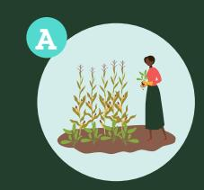

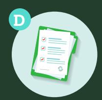

Land use rights Environmental protection Forest-related rules Third parties' rights

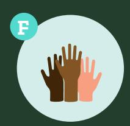

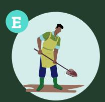

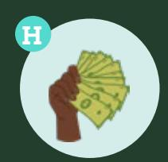

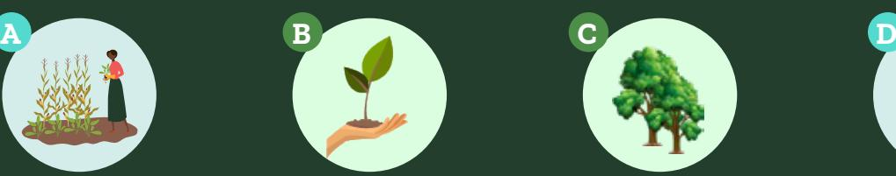

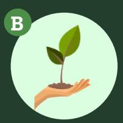

#### **NATIONAL FRAMEWORKS FOR ENVIRONMENTAL AND ENVIRONMENTAL SOCIAL SOCIAL SUSTAINABILITY – ARTICLE 2(40)**

#### **Legal Accuracy and Interpretation.**

These questions check if the review correctly identified the laws and understood their implications.

⊲ Did we accurately identify the most relevant national laws, policies, or agreements that govern land use, forest management, or the specific commodities (e.g., cocoa, coee) in your region? ⊲ Do you have any additions? ⊲ Based on your practical experience, is the interpretation of these laws correct, or does local enforcement dier from the legal text? Do you have any corrections or diering points of view? ⊲ Are there any recently enacted laws or regulations (within the last one to two years) that were not included in the review but significantly impact these value chains?

**Social Equity and Impact (GESI+).** These questions validate the review's findings on how laws aect dierent groups, which is critical for the EUDR's legality condition.

⊲ The review suggests [name specific laws, if relevant] provides a safeguard for women's land rights. In practice, do women in your community feel this law is eective and accessible for them to use? ⊲ When it comes to the rights of IPLCs and FPIC, has the legal framework led

- to meaningful consultations, or is it often chain actors? ⊲ For youth or migrant workers (or others), are there gaps in the labour laws (points
- (e) and (f) in the EUDR) that our review missed, which put these groups at greater risk of exploitation? ⊲ Did the review identify specific references to PWDs in the relevant laws? How does legal recognition create specific barriers (or opportunities) for PWDs?

sidestepped by operators or other value

**Traceability and Implementation.** These questions validate the practical application and enforcement of the law.

⊲ For a smallholder to prove 'legal production' for the EUDR, the law requires them to possess documentation. Are these documents easy or dicult for marginalized groups to obtain, and why? ⊲ Are the government agencies responsible for enforcing environmental and labour laws adequately resourced and actively monitoring compliance at the sub-national or district level? ⊲ What are the biggest practical obstacles (e.g., cost, complexity, corruption) that smallholders face when trying to comply with the national legality requirements?

#### **DEBRIEFING AND DISCUSSION**

Understanding national legislation helps farmers and trainers interpret what EUDR means in their own legal context. Specifically, the EUDR requires that products comply with national laws covering land rights, human rights, labour rights, and FPIC, giving primacy to national legal frameworks for social protections, armative action policies, or other instruments to advance gender equity and intersectional inclusion.

#### *Audience validation and questions*

To eectively validate the results of a rapid policy review on national legislation relevant to the EUDR, especially focusing on equity and social inclusion, ask questions that leverage the audience's on-the-ground expertise and lived experiences.

> ⊲ Discuss how the national enabling environment aects men, women, youth, IPLCs, PWDs, and other intersectional groups dierently to highlight the opportunities and the gaps that shape equitable participation in deforestation-free value chains. Use practical case examples (e.g., a woman securing a land certificate, an Indigenous community asserting FPIC rights) to demonstrate how these national laws directly aect farmers' abilities to participate in deforestation-free value chains. ⊲ Discuss how the national enabling environment either supports or creates barriers for diverse and intersectional groups to highlight opportunities and gaps for equitable participation.

### **TOOL 17:** ROUNDTABLES ON NATIONAL LEGISLATION *Legal literacy clinics*

#### **MATERIALS**

Desk review of relevant national legislation, index cards, markers

#### **PREPARATION**

⊲ Share the summary review of national legislation with the participants in advance OR prepare a very clear presentation with sucient information to facilitate discussion

#### **DEBRIEFING AND DISCUSSION**

Legal clinics can be facilitated by group members or by knowledgeable experts. To deepen the conversation, facilitators can invite participants to reflect on which laws most aect their livelihoods and what changes could make compliance easier or more beneficial for dierent types of smallholders across social categories. Note specific challenges for intersectional groups to achieve legal literacy and how this might aect outcomes under EUDR.

#### **Example question for discussion:**

- 1. How could you adapt this activity in the areas where you work so that smallholders can learn about their national laws and discuss their application to EUDR and their own lives?
- 2. How could you use roundtables to facilitate farmer engagement with their national laws (even where literacy levels are uneven)?

#### *Label tables and divide groups*

Place a sign card on each table corresponding to the categories of national legislation recognized under EUDR. You may combine categories of legislation to accommodate the categories addressed in the desk review and the number of participants. Six to eight people per table is ideal.

Explain that they will have informal legal literacy clinics to explore national enabling environment of laws and regulations. Participants may choose to join the table topic where they are most knowledgeable, but do try to balance the numbers evenly across the tables before commencing.

#### *Small group discussions*

Give each group a summary of the relevant national legislation. Explain that there will be three rounds. Give each group three cards to explore three things. Allow 10 minutes for each card. Use a timer and a bell to pace the group discussions between each card.

#### *Round 1*

On the first card, they will discuss and record the national laws that are most relevant to their table topic and why these laws matter for deforestation-free value chains. *3* **THREE THINGS**

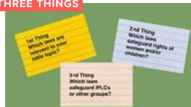

#### *Round 2*

On the second card, they will note which of these national laws safeguard the rights of women and/or children specifically (if any) and how; AND/OR which laws provide opportunities or pathways for women to advance in dierent spheres.

#### *Round 3*

On the third card, they will note which of these national laws safeguard IPLCs, PWDs, and other groups specifically (if any) and how; AND which laws provide opportunities for IPLCs, PWDs, or other groups to advance in dierent spheres.

#### *Plenary discussion*

After the groups have finished with their table clinics, all the participants back together for plenary. In plenary, ask each group to report back on their three things. Give each group 3-5 minutes to keep time. After groups have presented, collect all the cards and post them on the wall if space allows.

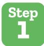

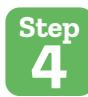

*Step 2*

**1** To compare factors shaping EUDR readiness across dierent commodity sectors, and discuss how EUDR requirements are being interpreted and applied in each. **2** To facilitate structured dialogues with smallholders to elicit their concerns and expectations across intersectional groups, and their overall readiness for EUDR operationalization. **3** To reflect critically on how gender and social dynamics in dierent commodity sectors and sourcing areas influence smallholder readiness.

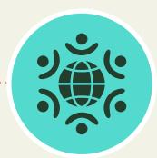

## MODULE 7 **Commodity-specific regulations**

This module explores commodity-specific regulations through two tools that promote participant knowledge exchange about commodity-sector readiness and the readiness of smallholders at the level of the sourcing areas. These tools are largely participant-driven with structured facilitation and dialogue formats such as the marketplace or World Café and gender fishbowl.

#### **TOOLS**

**Tool 18**  Commodity sector readiness: Marketplace (World Café)

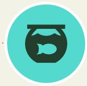

**Tool 19**  Smallholder readiness: Gender Fishbowl

#### **LEARNING OBJECTIVES**

#### **KEY MESSAGES**

⊲ EUDR requirements are experienced dierently across commodities. There is value in stakeholder learning exchanges within commodity sectors and cross-commodity exchanges to compare strategies, ask practical questions, and share experiences and challenges to better prepare for the eventual operationalization of the regulation. ⊲ EUDR readiness varies widely by commodity, sourcing area, and the structure of localized value chains, shaped by factors like traceability capacity, farmer sensitization, FPIC processes, and collaboration with traders. ⊲ Activities like role plays and the Gender Fishbowl can prompt smallholder questions and concerns, surface and correct misinformation, and anticipate potential risks and opportunities to intersectional groups.

#### **SOURCES**

- 1. EUDR Consolidated text (26/12/2024), [http://data.](http://data.europa.eu/eli/reg/2023/1115/2024-12-26) [europa.eu/eli/reg/2023/1115/2024-12-26](http://data.europa.eu/eli/reg/2023/1115/2024-12-26)
- 2. LANDnet Uganda and Gallagher EJ, 2024, Facilitation Guide: Legal Empowerment Clinics for Women's Resource Rights in Uganda. Nairobi: CIFOR-ICRAF, [https://www.cifor-icraf.org/](https://www.cifor-icraf.org/knowledge/publication/9301/) [knowledge/publication/9301/](https://www.cifor-icraf.org/knowledge/publication/9301/)

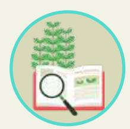

#### *Divide participants into market groups*

Divide the participants in groups of six to eight people to walk together through the marketplace.

#### *Explain the marketplace*

Each group will visit each market stand for just a taster. Each round will last 10 minutes. The presenter will speak for 5 minutes, and then the group will have an opportunity to ask questions for 5 minutes. The facilitator will ring a bell, and the groups will rotate to the next market stand. Repeat until every group has visited every market stand.

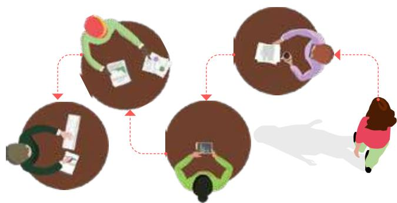

#### *Facilitate four rounds to the market stalls*

Allow 5 minutes for presentation and 5 minutes for Q&A for each round. Circulate among the groups to make sure that everyone is understanding the marketplace and that the speakers are allowing enough time for the participants to ask questions.

### **TOOL 18:** COMMODITY SECTOR READINESS *Marketplace (World Café)*

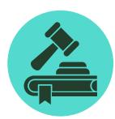

#### **MATERIALS**

Four to five stations (tall cocktail tables, bulletin boards or chairs), slide template (optional)

#### **PREPARATION**

⊲ Invite an intersection of commodity producers or value chain actors to present short talks about how they are preparing for EUDR in their value chain, including: » sensitizing farmers » meeting with operators and traders » facilitating FPIC » promoting equity and social inclusion » piloting traceability tools, etc.

⊲ Each talk should be maximum of 5 minutes. You may give them one to three PowerPoint slides as a template, or they can speak orally if it is not practical to have a computer at each station. ⊲ Set up stations as 'marketplace stands' (tall tables, around a bulletin board or a circle of chairs). ⊲ The market stands should be spaced so that the presenters can speak without disrupting the other market stands.

#### **DEBRIEFING AND DISCUSSION**

The marketplace approach creates an energizing way for participants to hear directly from producers and value chain actors about how they are preparing for the EUDR, while keeping learning grounded in real practices such as farmer sensitization, traceability pilots, and collaboration with traders. By moving in small groups, participants can ask practical questions, compare experiences

across commodities, and understand how the regulation is being interpreted and applied at dierent points in the value chain.

The format can be used to spotlight intersectional voices or marginalized producers, to make space for perspectives that are often missing in plenary presentations.

**Adaptation**: If there are not enough presenters to create a marketplace (less than three), the activity can be adjusted to give flash talks (7 minutes of presentation in plenary).

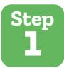

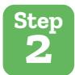

### **TOOL 19:** SMALLHOLDER READINESS *Gender Fishbowl*

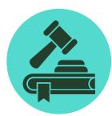

#### **MATERIALS**

Chairs, role cards

#### **PREPARATION**

⊲ In advance, prepare a set of roles that capture the diversity of the men and women in the training/sourcing area.

⊲ Organize the room with an inner circle and outer circle of chairs. If there are not enough chairs, the outer circle can stand around the inner circle.

### *Explain the fishbowl*

Invite the women to sit in the chairs in the inner circle. Explain the circle of chairs represents a fishbowl.

The women are the fish swimming and chatting inside the bowl. Only the fish inside the bowl can talk and be heard. The men on the outside of the fishbowl are just observers looking in and listening, but they cannot speak or be heard.

### *Distribute role cards*

Give each woman a role card to play: a wealthy farmer with her own land, a landless farmer or sharecropper, a widow, a young newlywed mother, a migrant, etc. Ask each person to read their role card and embody this role. They should approach this exercise as that character and have fun with the role play.

#### *Explain the scenario*

Imagine that an NGO or a government programme has just come and delivered a farmer training about EUDR for your main commodity crop (cocoa, coee, oil palm, natural rubber, soy, cattle or wood products).

After the trainers leave, a group of women are sitting around discussing the training and this new regulation. How will the EUDR aect these smallholder women? How will it aect dierent women dierently?

#### *Facilitate discussion*

Ask the women the first question and allow them to discuss (they will act as the women in the community). The men should quietly listen until it is their turn. Allow 3-5 minutes of role play for each question.

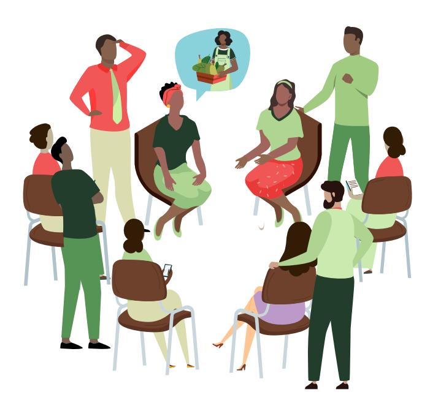

*Step 1*

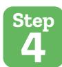

#### **Fishbowl questions:**

⊲ How do the women think these export market regulations will aect them as farming families? ⊲ What are the risks to them as women? ⊲ How could these risks be mitigated? ⊲ What are some of the positives (how might they benefit?)

#### **DEBRIEFING AND DISCUSSION**

Gender fishbowl dialogues oer a powerful way to surface gendered experiences within value chains and to reflect on how roles, responsibilities, and decision-making opportunities dier for women, men, and other groups through the role play. By listening closely to the inner circle, this activity helps the group identify potential risks and opportunities for greater equity in the transition from business-asusual to deforestation-free agriculture, and builds a shared foundation for thinking about how gender dynamics shape EUDR readiness, market access, and the adoption of deforestation-free practices.

#### **Example questions for discussion:**

- 1. What insights from the inner circle surprised or challenged the group, and how might these influence the design of more equitable interventions?
- 2. How do the gendered experiences described in the fishbowl connect to specific barriers or opportunities within your value chain?

#### *Swap places*

Allow the women to finish and then switch places. Ask the men to sit inside the circle and the women to stand on the outside. Repeat the same activity for men, adjusting the roles and questions accordingly for men's roles.

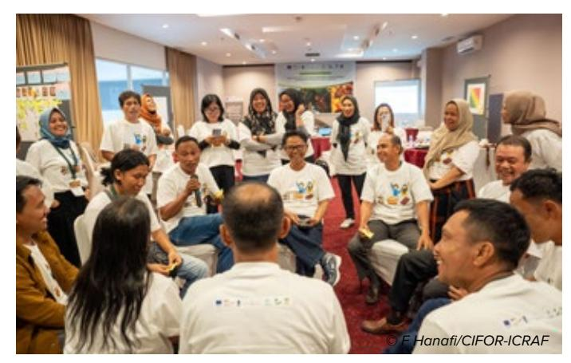

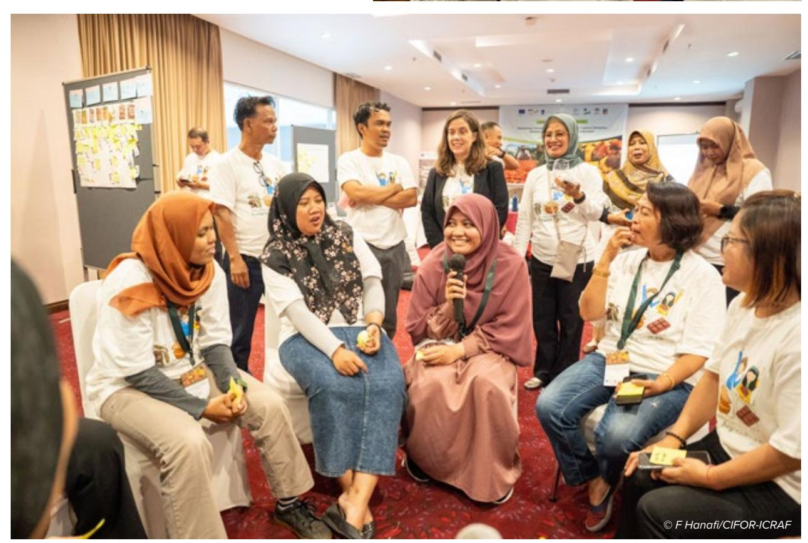

# Unit 4 GESI+ Action Planning

**GESI+ action planning involves systematically identifying and addressing gender and social inequalities that may aect the design, implementation, and outcomes of a programme or value chain. It begins with a GESI-focused risk assessment that examines how women, youth, PWDs, IPLCs, and marginalized groups may face exclusion, unequal access to resources, or heightened vulnerability within specific interventions. This step identifies both social and structural risks such as unequal land rights, limited decision-making power, or discriminatory norms that could undermine participation or compliance eorts. Based on these findings, a risk mitigation plan is developed, outlining concrete actions such as capacity building, inclusive decision-making mechanisms, targeted support services, equitable benefit-sharing arrangements, and policies to prevent exploitation or discrimination. Together, GESI+ action planning, risk assessment, and mitigation ensure that interventions are not only eective but also fair, inclusive, and responsive to the needs of all stakeholders.**

#### **THIS UNIT COVERS:**

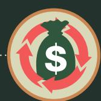

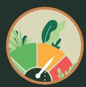

Module 8 *Risk management* Module 9 *Opportunities*  **and benefit***sharing*

**Tool 21.** Risk levels

**Tool 22.** Risk mitigation: Module 10 *GESI+ actionplanning for EUDR*

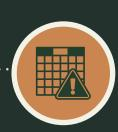

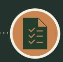

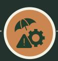

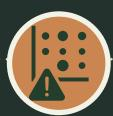

**Tool 24.** Intersectional action planning

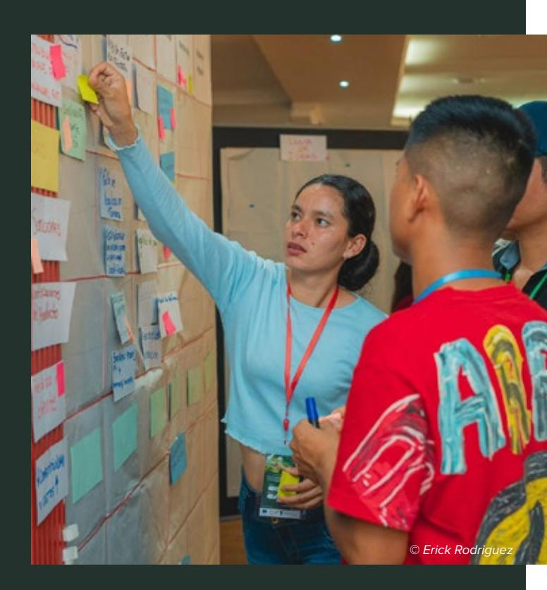

**1** To identify potential risks in deforestation-free value chains, cluster them into categories, and mark risks specific to women and other intersectional groups using a risk register. **2** To evaluate the likelihood and severity of identified risks using a risk matrix and determine which risks are non-negligible and should be prioritized for action. **3** To design targeted mitigation actions for each risk category, ensuring strategies address genderspecific and intersectional risks.

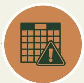

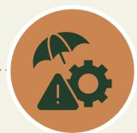

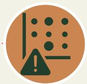

## MODULE 8 *Risk management*

This module explores risk management in deforestation-free value chains through three practical tools: the risk assessment register, risk matrix, and the risk mitigation plan. The module aims to prepare communities for more meaningful consultations with operators and traders to anticipate potential harms in deforestation-free transitions and advocate for safeguards that ensure inclusive and equitable participation of smallholders, women, IPLCs, and other intersectional groups.

#### **TOOLS LEARNING OBJECTIVES**

#### **KEY MESSAGES**

#### **SOURCES**

⊲ Risk assessments under the EUDR identify, evaluate, and prioritize potential environmental and social risks in supply chains to ensure deforestation-free compliance while protecting vulnerable and intersectional groups in compliance with national and international laws. ⊲ Understanding risk factors, at-risk groups, and tools like risk registers and risk matrices helps communities anticipate potential harms, engage meaningfully with operators and traders, and advocate for safeguards in due diligence processes. ⊲ Risk mitigation transforms identified risks into practical action. The mitigation of non-negligible risks creates opportunities for genderresponsive, socially inclusive solutions to at-risk groups and promotes equitable value chain participation.

- 1. EUDR Consolidated text (26/12/2024), [http://data.europa.eu/eli/](http://data.europa.eu/eli/reg/2023/1115/2024-12-26) [reg/2023/1115/2024-12-26](http://data.europa.eu/eli/reg/2023/1115/2024-12-26)
- 2. Watt A, Wiley D et al. 2012. Chapter 16. Risk Management Planning In Project Management Open Resources; and TAP-a-PM. BCcampus Open Education. British Columbia: CC BY 4.0. [https://opentextbc.ca/projectmanagement/](https://opentextbc.ca/projectmanagement/chapter/chapter-16-risk-management-planning-project-management/) [chapter/chapter-16-risk-management-planning-project-management/](https://opentextbc.ca/projectmanagement/chapter/chapter-16-risk-management-planning-project-management/)
- 3. Mello, D. 2025. Gender Equity, Social Inclusion and Intersectionality (GESI+) in Sustainable and Deforestation-free Agriculture: Lessons from Altamira, Pará, Brazil. KANDS Collective, Editor. Unpublished.
- 4. Chapalbay, R., Vallejo, E., & Gallagher, E. 2025. Gender Equity, Social Inclusion and Intersectionality (GESI+) in Sustainable and Deforestation-free Agriculture: Lessons from Coca, Orellana, Ecuador. KANDS Collective, Editor. CIFOR: Bogor, Indonesia; ICRAF: Nairobi, Kenya; and GIZ: Bonn, Germany. <https://www.cifor-icraf.org/knowledge/publication/46417/>
- 5. Liswanti, N., Gallagher, EJ., and Ramadhan, H. 2025. Gender Equity, Social Inclusion and Intersectionality (GESI+) in Sustainable and Deforestationfree Agriculture: Lessons from Palu, Central Sulawesi, Indonesia. KANDS Collective, Editor. CIFOR: Bogor, Indonesia; ICRAF: Nairobi, Kenya; and GIZ: Bonn, Germany. <https://www.cifor-icraf.org/knowledge/publication/46418/>

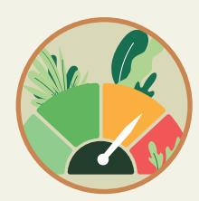

**Tool 20** Risk assessment: intersectional risk register

**Tool 21** Risk levels: risk matrix

**Tool 22** Risk mitigation: mitigation plan

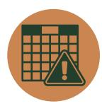

#### *Mini-lesson: Risk assessments*

A risk assessment is a process for identifying potential risks of implementation, determining how serious their impact could be, and reasonable control measures to remove or reduce risks. It helps guide decisions to prevent or reduce these risks before they happen.

Recall that the EUDR requires all operators and traders placing products on the EU market to complete a risk assessment. This risk assessment examines the likelihood of non-compliance with the due diligence requirements of the EUDR, including an assessment of (1) deforestation risks; (2) legal risks with respect to relevant national legislation and international law; and (3) traceability risk with respect to data availability, data quality and veracity.

Social risks to smallholder producers fall under legal risks, but the EUDR requirements do not require that risk assessments consider all potential risks of exclusion or harm to farmers or their intersections with other social identities. The participants to the ToT are in a position as bridging organizations to mediate risk assessments and FPIC between smallholders and operators and traders and adjust their approach to context.

## **TOOL 20:** RISK ASSESSMENT *Intersectional risk register*

#### **MATERIALS**

Sticky notes, flip chart paper, markers

#### **PREPARATION**

⊲ Prepare a brainstorming board and risk register template in advance. ⊲ Generate some preliminary risks identified from experience, EUDR media, or from examples in the EUDR legal act (Article 10) with respect to smallholders, women, IPLCs and other at-risk groups.

#### **Risk matrix:**

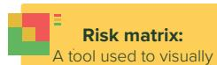

represent the relationship between the likelihood and severity of a risk. This is dierent from a risk register which is a recordkeeping tool for managing the risk assessment.

**Risk**: The potential for loss, harm or undesirable outcomes or negative impact

> **Risk factor:**  Increases the likelihood of the risk occurring.

#### **CONCEPTS AND DEFINITIONS IN RISK ASSESSMENT**

### **Example Environmental risk**

For example, the **RISK** that cocoa production in one or more sourcing areas will not be deforestation-free by 2026.

#### **POTENTIAL RISK FACTORS** that

might increase the likelihood of non-compliance include high concentration of cocoa producers, high forest cover, high deforestation rates, low cocoa yields, poor soil health, lack of land tenure security, low legal literacy, and prevalence of traditional cultivation practices.

### **Example Social risk**

There is a **RISK** that compliance with zero-deforestation regulations will alienate women cocoa producers from EU markets.

#### **POTENTIAL RISK FACTORS**

that might increase the risk of market exclusion include lack of tenure security, poor supply chain integration, poor knowledge about laws and regulations, low decisionmaking power over production, low bargaining power with operators and traders, high transaction costs for operators and traders, low rates of certification.

The EUDR identifies several risk factors that should be taken into account when evaluating risks during the risk assessment.

#### *Mini-lesson: Obligations and responsibilities of value chain actors Step 2*

In plenary, ask the question: What is the role of smallholders in risk assessments?

Call on a few participants to respond and then explain and provide clarification:

⊲ It is the responsibility of the operators and traders who put products on the EU market to conduct risk assessments. ⊲ **Smallholders are not responsible for conducting risk assessments but may be asked to participate in consultations and provide data (e.g., on their farm, products, time of harvest) as part of the risk assessments.**  ⊲ If any non-negligible risks are identified, operators and traders are required to develop mitigation plans to remove or minimize the risks. ⊲ This requirement provides an opportunity to address social safeguarding concerns appropriately.

#### **However,**

⊲ Smallholders may not be fully informed or aware when these risk assessments are undertaken. ⊲ The operator or trader may not be able to assess all the potential risks to smallholders, women, IPLCs or other intersectional groups. ⊲ Under the principles of FPIC, smallholders have an opportunity to participate in consultations, but this may not be an inclusive process.

This exercise aims to prepare smallholders for the risk assessments conducted in the sourcing area and ensure the process is inclusive of women, IPLCs, and other intersectional groups, while building participants' capacities to engage proactively in FPIC processes, risk assessments, and the development of mitigation strategies.

- 1. **Country risk level [Deforestation risk]:** Whether the production area is ocially classified as low, standard, or high risk.
- 2. **Forest presence [Deforestation risk]:** Whether the area contains forests.
- 3. **Indigenous peoples [Legal risk]:** Whether Indigenous Peoples live in or use the area.
- 4. **FPIC practices [Legal risk]:** Whether Indigenous Peoples have been properly consulted and involved.
- 5. **Land or resource claims [Legal risk]:** Whether there are credible IP claims over land used for production.
- 6. **Deforestation trends [Deforestation risk]:** Whether deforestation or forest degradation is happening in the area.
- 7. **Information quality [Traceability risk]:** Whether the data provided is reliable, valid, and consistent with other sources.
- 8. **Governance risks [Traceability risk]:** Issues such as corruption, weak law enforcement, data falsification, human rights violations, conflict, or sanctions.
  - 9. **Supply-chain complexity [Traceability risk]:** How dicult it is to trace products back to the actual plot of land.
  - 10. **Circumvention risk [Traceability risk]:** The chance that products are mixed, laundered, or routed to hide their origin.
  - 11. **Commission expert guidance [Traceability risk]:** Relevant conclusions from EU expert groups.
  - 12. **Substantiated concerns [Traceability risk]:** Any complaints or history of non-compliance by actors in the supply chain.
  - 13. **Any sign of non-compliance [Traceability risk]:** Any other information suggesting the product might not meet EUDR requirements.
  - 14. **Supporting certification or audits [Traceability risk]:** Verification from credible third-party schemes, if they meet EUDR information requirements.

#### **RISK FACTORS IDENTIFIED IN EUDR ARTICLE 10 [2]**

Ask the question: What can we identify as the potential risks to smallholder farmers or local communities when EUDR comes into eect?

⊲ Give each table a set of sticky notes and ask them to brainstorm risks at their tables. ⊲ Participants should write each risk on a separate sticky note. ⊲ After a few minutes, invite each table to read their ideas aloud and then stick their notes on the brainstorming board at the front of the room. ⊲ In plenary, review the relevant risk factors from the EUDR (Article 10) facilitate discussion about whether additional risks should be added to the brainstorming board. ⊲ Once the participants are satisfied with the potential risks identified on the board, invite two to three volunteers to the brainstorming board to organize the sticky notes. Invite the audience to stand around them to support and coach. ⊲ Facilitate 'clustering and pruning' of similar or overlapping risks on the board.

⊲ For each cluster of sticky notes, draw a circle around the sticky notes on the flip chart paper to organize into categories of risk. Write a name for each cluster of risks inside the circle (i.e., give each risk category a name). ⊲ Take a photo of the brainstorming board before moving to the next steps.

*Step 3*

*Step 4*

#### *Mini-lesson: Steps in a risk assessment*

### *Identify potential risks*

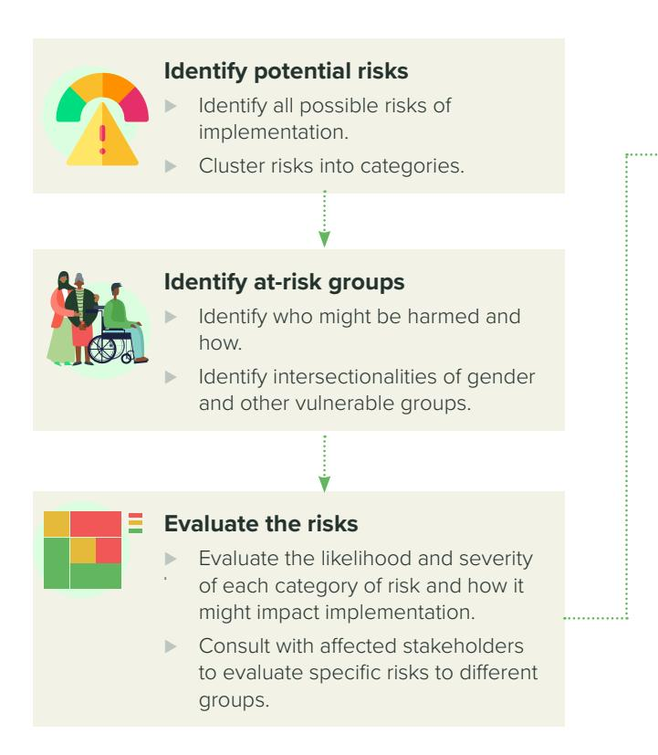

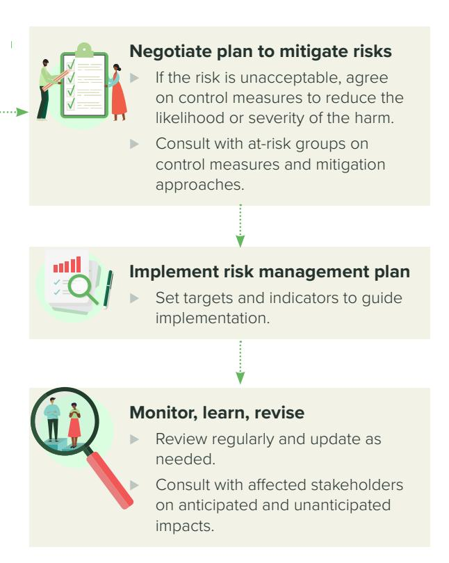

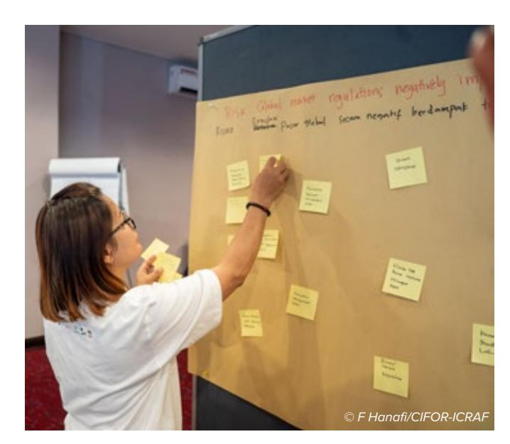

#### *Identify at-risk groups*

In plenary, ask the question: Who is at risk? Make a flip chart paper with big circle in the centre for SMALLHOLDER. Probe the participants to consider the following questions:

⊲ What are the intersectionalities (intersecting with smallholder)? ⊲ Who are the vulnerable groups who may be active in these value chains and at risk of losing their value chain roles when operators and traders begin complying with the EUDR? ⊲ Who are the vulnerable groups who may be at risk of being exploited, displaced, or otherwise harmed by compliance with the EUDR?

As the participants are brainstorming aloud, write the name of each potential at-risk identity group on a sticky note and attach to the SMALLHOLDER circle. Facilitate clustering and pruning to create a discrete list of potentially at-risk identify groups.

#### **DEBRIEFING AND DISCUSSION**

#### **Example questions for discussion:**

⊲ How many participants in the ToT have experience with conducting risk assessments and creating risk registries or risk matrixes? ⊲ Have they ever done risk assessments with farmers? What can smallholder farmers learn from doing their own assessment of intersectional risks?

This module demonstrates that risk assessments are not only technical exercises but also social processes that shape who is included or excluded when EUDR compliance is enforced. Participants should now recognize how risk factors interact with gender, social identity, and structural inequalities, and why smallholders, women, and IPLCs must be meaningfully included for assessments to be fair and accurate.

#### *Create a risk register*

A risk register is a risk management tool for recording all identified risks (a chart, spreadsheet, or notebook), including a detailed description of the risks, potential impact, and what actions will be taken to manage them. The risk register keeps everything organized in one place and helps meet risk-management and compliance requirements. In this tool, we will add columns to our risk register to map specific risks to each of the at-risk identity groups.

⊲ Hang a template of a simplified risk register with columns for at-risk groups. ⊲ Label the columns with the potentially atrisk groups identified in STEP 5. ⊲ Collect the risk clusters (sticky notes) from the Brainstorming Board and transfer them to the risk register. Label each row of clusters with the category name. ⊲ In plenary, invite two to four participants to the board while the others gather around them to read the sticky notes and identify which groups might be at risk. Check the relevant columns in the risk register. Remember, the rows represent all of the sticky notes in the cluster. ⊲ When the risk register is completed, the potential risks and at-risk groups are clear and ready for the next tool in the risk assessment.

*Step 6*

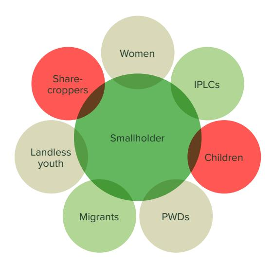

| AT-RISK GROUPS |                                                                                                                                                |                                                                                                                                                |                                                                                                                                                                                                |                                                                                                                                                                                                |       |   |
|----------------|------------------------------------------------------------------------------------------------------------------------------------------------|------------------------------------------------------------------------------------------------------------------------------------------------|------------------------------------------------------------------------------------------------------------------------------------------------------------------------------------------------|------------------------------------------------------------------------------------------------------------------------------------------------------------------------------------------------|-------|---|
|                |                                                                                                                                                |                                                                                                                                                |   |                                                                                                                                                                                                |       |   |
|                |                                                                                                                                                |                                                                                                                                                |                                                                                                                                                                                                |   |       |   |
| Risks          | Clusters                                                                                                                                       | Women                                                                                                                                          | IPLCs                                                                                                                                                                                          |                                                                                                                                                                                                | Other |   |
| <b>1</b>       |   |                                                                                                                                                | ✓                                                                                                                                                                                              | ✓                                                                                                                                                                                              |       |   |
|                | <b>2</b>                                                                                                                                       |   |                                                                                                                                                                                                |                                                                                                                                                                                                |       | ✓ |
| <b>3</b>       |                                                                                                                                                |   | ✓                                                                                                                                                                                              |                                                                                                                                                                                                |       |   |
|                | <b>4</b>                                                                                                                                       |   |                                                                                                                                                                                                |                                                                                                                                                                                                |       | ✓ |

### **TOOL 21:** RISK LEVELS *Risk matrix*

#### **MATERIALS**

Risk matrix template, risk register, sticky notes, markers

#### **PREPARATION**

⊲ Draw or print a risk matrix in advance with all the cells of the matrix labeled clearly by risk levels to facilitate full understanding

### *Explain the risk matrix*

A risk assessment matrix is a visual tool used ranking risks. It is organized by qualitative categories from ranging from very low to very high on two axes. We evaluate risks by assessing how likely they are to happen and how severe their impact could be.

The risk heat map adds colours to the risk matrix. The colours make it easier to see which risks need the most attention when developing risk management plans.

|   | Likelihood (horizontal axis) |   | Impact (vertical axis) |
|---|------------------------------|---|------------------------|
| 5 | Very high                    | 5 | Very high              |
| 4 | High                         | 4 | High                   |
| 3 | Medium                       | 3 | Medium                 |
| 2 | Low                          | 2 | Low                    |
| 1 | Very low                     | 1 | Very low               |

We can assign numbers to these categories from 1 (Very low) to 5 (Very high) to calculate a risk rating, but this is not very necessary for this workshop. The risk rating is a product of the likelihood and the impact (Likelihood x Impact = Risk rating).

The risk matrix mapping exercise is best facilitated in plenary. Explain that when operators and traders conduct their risk assessments, they will be assessing the risk of non-compliance or impact on their investment.

For our purposes, we will be assessing the social impact on smallholders and local communities when EUDR comes into eect. It is important to note that impact is measured by severity. The risk assessment measures negative impacts.

#### *Evaluate the risks*

| Impact     | Risk matrix |          |           |           |   |
|------------|-------------|----------|-----------|-----------|---|
|            | Medium      | High     | Very high | Very high |   |
| 1          | Medium      | High     | Very high | Very high |   |
| 2          | Low         | Medium   | High      | Very high |   |
| 3          | Very low    | Low      | Medium    | High      |   |
| 4          | Very low    | Very low | Low       | Medium    |   |
| 5          | Very low    | Very low | Very low  | Low       |   |
| 1          |             | 2        | 3         | 4         | 5 |
| Likelihood |             |          |           |           |   |

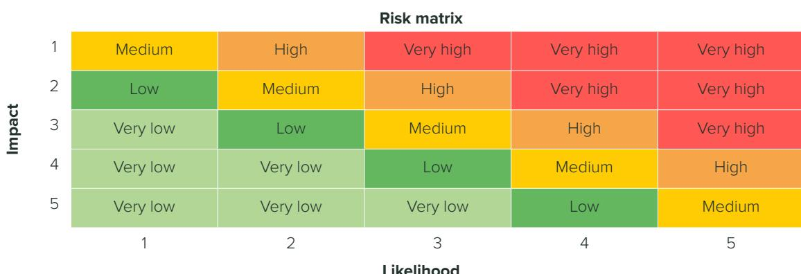

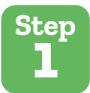

#### *Step 2*

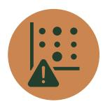

5 Very high

4 High

3 Medium

2 Low

1 Very low

**Impact**

Very high

High

4

Medium

3

Low

2

Very low

1

**Likelihood**

Next ask the participants: **What would be the severity of the impact?** 

#### **Impact (vertical axis)**

⊲ Hold the sticky note over the Impact axis (vertical) and move it across the options (vertically) without changing the likelihood level. ⊲ Once the participants have agreed on the likelihood x impact levels, stick the sticky note to the risk matrix. ⊲ For the second risk category, invite two participants to come to the front and facilitate the mapping. ⊲ Continue with each of the risk categories until they are all mapped to the risk matrix. Rotate roles to ensure that everyone is involved and understanding how to map risks to the risk matrix and how to assess the likelihood and impact of the risk.

Begin with the first category of risk from the risk register. Write the name of the risk category on a sticky note. Read the category name aloud.

Ask the participants: **How likely is this risk to occur?** 

#### **Likelihood (horizontal axis)**

⊲ Hold the sticky note over the Likelihood axis (horizontal) and move it across the dierent options (horizontally) to demonstrate where it might be placed at each likelihood level. ⊲ Allow the participants to debate the options and what each would mean for this risk category. ⊲ Once they have decided on the likelihood level, hold the sticky note over the likelihood level but don't stick it to the risk matrix yet.

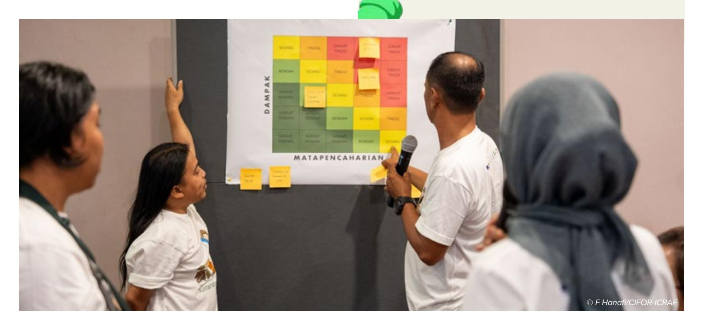

#### **Example questions for discussion:**

- 1. How can understanding risk assessment tools like the matrix help smallholders engage more proactively in the due diligence process to safeguard at-risk groups?
- 2. Which risks identified today feel most important for smallholders to raise with companies, and what kinds of support or shared solutions should be requested?

This activity is designed to give participants a clear understanding of how risks are analyzed and prioritized, using the similar tools and reasoning that companies rely on. By practising how to identify, discuss, and rank potential social risks and map these to intersectional social groups, participants will be better equipped to engage strategically with companies and safeguard their interests. Creating a shared language strengthens their ability to participate confidently in negotiations and advocate for fairer, more balanced arrangements.

⊲ Which of these risks fall within the sphere of influence of people in this room (i.e., which of these might some participants in the room have influence over?) ⊲ Which of these risks fall within the operator or traders' sphere of influence? ⊲ Which of these risks fall within the smallholder farmers' area of influence? ⊲ How might this aect their EUDR compliance risks (must be deforestationfree, follow national legislation and demonstrate due diligence)?

#### *Record risk levels in the risk register*

The final step is to record the risk level in the risk register. Still in plenary, engage the participants in using the matrix results to update the risk register by recording the appropriate level on each row.

Once the risk register is updated, facilitate a discussion about what these risk levels mean for each of the impacted groups in the risk register.

|                                   | AT-RISK GROUPS ?                 |
|-----------------------------------|----------------------------------|
| Risks Clusters Women Name of risk | IPLCs PWD Other Risk Level       |
| category Name of risk             | Very high                        |
| category Name of risk             | Medium DEBRIEFING AND DISCUSSION |
| category Name of risk             | Very low                         |
| category                          | Low                              |

#### **DEBRIEFING AND DISCUSSION**

#### **Article 9 Information Required**

⊲ Name ⊲ Quantity ⊲ Country of production ⊲ Geolocation to source ⊲ Date & time of production ⊲ Supplier of product ⊲ Buyer of product ⊲ Information on deforestation-free production ⊲ Information on legal production

#### **Article 10 Risk Assessment**

⊲ Risk status in benchmarking ⊲ Presence of forests in country & area ⊲ Presence of Indigenous groups ⊲ Consultations and cooperation with Indigenous groups ⊲ Credible claims of Indigenous groups ⊲ Deforestation rate & degradation ⊲ Credibility of documents ⊲ Situation in the country ⊲ Supply chain complexity ⊲ Risk of circumvention ⊲ Conclusions of EU Expert Group ⊲ Substantiated concerns ⊲ Any relevant information ⊲ Certification

#### **Article 11 Risk Mitigation**

⊲ Requesting additional documents ⊲ Additional verification through surveys or audits ⊲ Support for producers, in particular smallholders, through capacity building & investments

#### **Annex II: Due Diligence Statement (DDS)**

⊲ Company name ⊲ Harmonized system code: Scientific name, quantity of product ⊲ Country of production ⊲ Geolocation of all plots of production ⊲ Statement on the assumption of responsibility ⊲ Signature

### **TOOL 22:** RISK MITIGATION *Mitigation plan*

#### **MATERIALS**

Risk register, sticky notes, markers

#### **PREPARATION**

⊲ Be prepared with some examples of mitigation actions to share

*1* This tool will introduce participants to risk management with some very basic steps for building the capacities of smallholders to engage with operators, traders, and to address any potential risks to women, IPLCs,

*2*

*4*

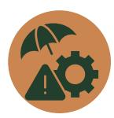

Risk mitigation and risk-management approaches can help women, IPLCs, and other intersectional groups benefit from EUDR by making their specific risks visible and ensuring they are addressed early in the due diligence process.

> and intersectional groups early in the due diligence process and agree on mitigation approaches.

Revisit the due diligence process under EUDR. Explain that EUDR follows a very standard due diligence procedure from risk assessment to risk mitigation.23

#### *Mini-lesson: Risk mitigation*

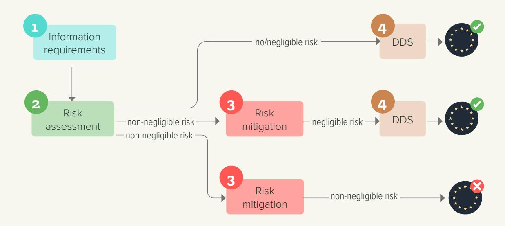

⊲ If the risk assessment confirms that there is **no risk** or only **negligible risk**, then the operator or trader can complete the DDS for placing products on the EU market. ⊲ If the risk assessment reveals that there are **non-negligible risks**, the operator or trader must develop a plan to mitigate these risks.

**Risk mitigation** is a strategic process to reduce the likelihood and severity of risks. The goal of mitigation is to transform high or medium risks into a lower risk by putting strategies in place to prevent harm or minimize impact. It involves identifying practical actions to make the situation safer or more manageable. **Mitigation** refers to those sustained actions to reduce or minimize the negative impact or severity of risks.

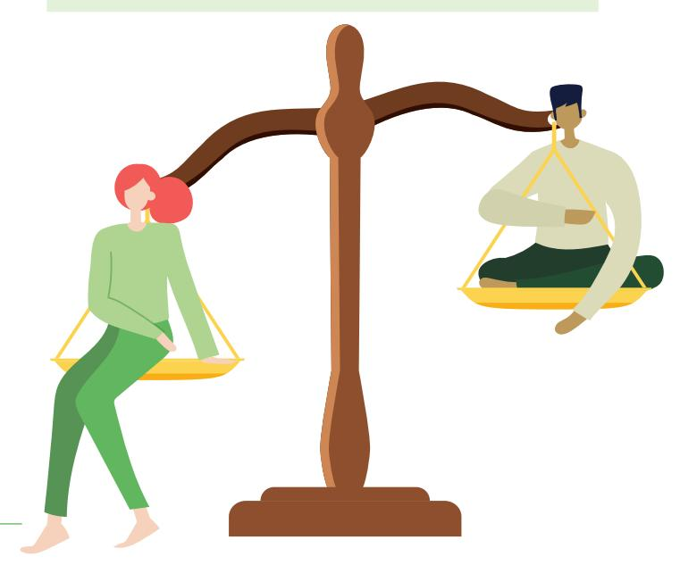

**Mitigation strategies** may not be able to eliminate risk entirely. When developing a mitigation plan, risk managers must be very realistic in assessing how to minimize negative impacts. In this tool, we will apply a few simple mitigation strategies to develop a risk management plan.

| Mitigation strategies | Action                           |
|-----------------------|----------------------------------|
| Reduce                | Implementing strategies          |
| Accept                | Tolerate the risk as acceptable; |

#### **RISK ASSESSMENT24**

#### *Table groups: Designing mitigation actions*

⊲ Divide the participants into small table groups of six to eight people. ⊲ Assign each group one category of risk from the risk register (TOOL 20). ⊲ Nominate a table facilitator and a notetaker. ⊲ Give each table 10 minutes to discuss and design a mitigation action for this risk category.

Using the information in the **risk register,** the facilitator will:

- 1. read the risk category
- 2. read the sticky notes of risks which were clustered together under this category
- 3. identify the at-risk groups, and
- 4. note the risk level

In groups, design an **intersectional mitigation action** for the risk category:

- 1. What, specifically, is the risk to each of the at-risk groups identified?
- 2. Which mitigation strategy is most practical for this risk?

- 3. What are the **action steps** for implementing this strategy? ⊲ Mitigation actions ⊲ Who will take the action (operator/ trader, smallholder, other)? ⊲ What will they do? ⊲ What will be the eect? ⊲ Who will benefit?
- 4. Once the group agrees to the mitigation approach, the facilitator should write the short plan on a sticky note or index card. The actions should be feasible for an operator, trader or other value chain actors to implement and should address any potential harm to the at-risk group.

Avoid/ prevent

Reduce Transfer/ share

Accept

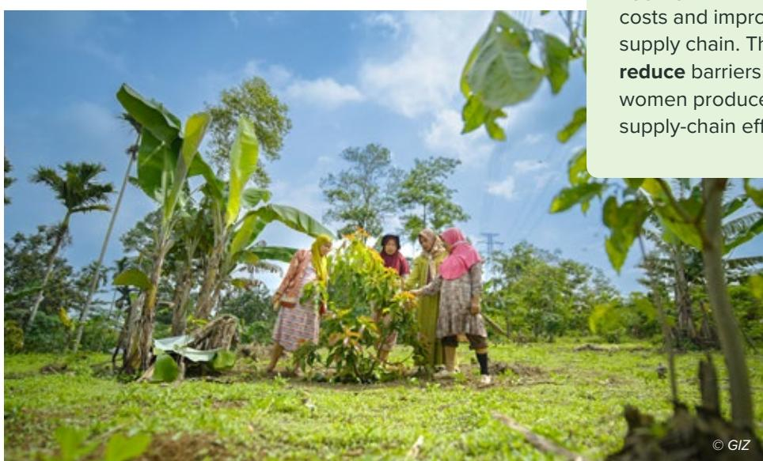

**Risk:** Risk of value chain exclusion of women due to small plot size and high aggregation costs

**Mitigation activity:** the operator/ trader will strengthen FPIC, safeguarding and stakeholder consultation procedures to ensure meaningful participation of women and other marginalized groups. In parallel, the operator/trader will support the development of bulking clusters to facilitate product aggregation, reduce coordination costs and improve access to the supply chain. This strategy aims to **reduce** barriers to participation of women producers while improving supply-chain eciency.

#### **EXAMPLE:**

#### **EXAMPLE:**

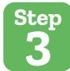

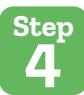

#### *Plenary discussion*

⊲ Invite each group to stand and share their proposed mitigation actions. ⊲ Each group must share something new; not repeating what another group has said. ⊲ Invite the groups to add their unique mitigation actions to the risk register (do not post duplicates). ⊲ Facilitate discussion as groups are reporting back.

### *Risk register including mitigation plan*

This activity is designed to equip smallholders with a practical understanding of how mitigation plans are developed and how operators and traders might respond when risks are identified. Risk mitigation and risk-management approaches can help women, IPLCs, and other intersectional groups benefit from EUDR by making their specific risks visible and ensuring they are addressed early in the due diligence process. EUDR requirements to mitigate non-negligible risks opens opportunities for more gender- and equity- responsive approaches.

Strong mitigation plans help companies provide targeted support, adjust how they work with communities, and put safeguards in place to protect vulnerable groups. They can do more than prevent harm. They can also promote inclusion, participation, and fair sharing of benefits. When done well, risk management turns EUDR from just a compliance requirement into a chance to build fair, accountable, and socially responsible supply chains.

#### **Example questions for discussion:**

Facilitate a discussion about the level of complexity of the risk matrix, adding risk levels, and mitigation actions.

- 1. Is this a useful activity to prepare smallholders for what will happen under EUDR?
- 2. How would you adapt or simplify this activity to the areas and value chains where you work?

#### **DEBRIEFING AND DISCUSSION**

|                      | AT-RISK GROUPS ?                              |
|----------------------|-----------------------------------------------|
| Risks Clusters Women | IPLCs PWD Other Risk Level Mitigation Actions |
| Name of cluster      | Very high                                     |
| Name of cluster      | Medium                                        |
| Name of cluster      | Very low                                      |
| Name of cluster      | Low                                           |

**1** To identify existing and created opportunities in deforestation-free value chains and categorize them into stakeholder engagement, legal, technical, and market quadrants to recognize potential benefits for women, IPLCs, and other intersectional groups. **2** To evaluate opportunities by assessing feasibility, beneficiaries, and potential social impact, and prioritize those with the greatest potential for equitable inclusion and positive change. **3** To plan actionable steps for smallholders to seize prioritized opportunities, specifying who, what, where and in what context the action will be implemented.

## MODULE 9 *Opportunities and* **benefit-sharing**

#### **TOOLS**

#### **Tool 23:**

Opportunities for change: Opportunity Mapping

#### **LEARNING OBJECTIVES**

#### **KEY MESSAGES**

⊲ While conventional risk assessments focus on threats and harm, opportunity mapping identifies chances for positive change either by leveraging existing conditions or by creating new possibilities to generate benefits. ⊲ Opportunity mapping identifies potential beneficiaries and how benefits may dier across groups to integrate planning for equity and intersectional inclusion, giving women, IPLCs, and other intersectional groups a voice in shaping and accessing opportunities. ⊲ Four types of opportunities have been identified in the EUDR text and initiatives to support fair and just transitions: stakeholder engagement, legal, technical, and market opportunities.

#### **SOURCES**

- 1. Hillson D. 2020. Capturing the Upside of Risk: Finding and managing opportunities in projects. London: Routlege. [https://risk](https://risk-doctor.com/risk-doctor-books/)[doctor.com/risk-doctor-books/](https://risk-doctor.com/risk-doctor-books/)
- 2. Mello, D. 2025. Gender Equity, Social Inclusion and Intersectionality (GESI+) in Sustainable and Deforestation-free Agriculture: Lessons from Altamira, Pará, Brazil. KANDS Collective, Editor. Unpublished.
- 3. Chapalbay, R., Vallejo, E., & Gallagher, E. 2025. Gender Equity, Social Inclusion and Intersectionality (GESI+) in Sustainable and Deforestation-free Agriculture: Lessons from Coca, Orellana, Ecuador. KANDS Collective, Editor. CIFOR: Bogor, Indonesia; ICRAF: Nairobi, Kenya; and GIZ: Bonn, Germany. [https://www.cifor-icraf.org/](https://www.cifor-icraf.org/knowledge/publication/46417/) [knowledge/publication/46417/](https://www.cifor-icraf.org/knowledge/publication/46417/)
- 4. Liswanti, N., Gallagher, EJ., and Ramadhan, H. 2025. Gender Equity, Social Inclusion and Intersectionality (GESI+) in Sustainable and Deforestation-free Agriculture: Lessons from Palu, Central Sulawesi, Indonesia. KANDS Collective, Editor. CIFOR: Bogor, Indonesia; ICRAF: Nairobi, Kenya; and GIZ: Bonn, Germany. [https://www.cifor](https://www.cifor-icraf.org/knowledge/publication/46418/)[icraf.org/knowledge/publication/46418/](https://www.cifor-icraf.org/knowledge/publication/46418/)

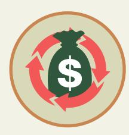

This module on opportunity mapping helps participants move beyond identifying risks to recognizing positive changes and benefits that the EUDR can create. It categorizes opportunities for advancing gender equity, social inclusion, and intersectional participation in deforestation-free value chains into four types of opportunities: stakeholder engagement, legal, technical, and market opportunities. .

Most standard risk assessments are designed to address negative risks, or threats, that cause adversity, harm or loss. Opportunity mapping aims to identify uncertainties that may also be risky, but could potentially lead to positive changes, benefits or prospects.

**An opportunity presents a specific type of risk with a positive or beneficial outcome.**

Opportunity mapping is a practical way to identify where positive change is both possible and achievable. It helps us look at current conditions, understand gaps, and then pinpoint concrete entry points where new actions or investments can create real benefits. In the context of the EUDR, this means not only assessing and reducing risks, but also recognizing where the regulation can open doors for stronger inclusion, better engagement, and fairer outcomes for women, IPLCs, and other marginalized groups. The goal is to move from simply preventing harm to actively

planning and acting on opportunities that make EUDR implementation more equitable and empowering.

> **Existing opportunities** are those that already exist in the environment, and can be recognized and acted upon using what is already known. They arise by avoiding, reducing, or reversing threats; removing or overcoming barriers or constraints; responding to unmet needs; or taking advantage of a situation to provide solutions.

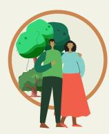

**Created (or pure) opportunities** are those that emerge by shaping something that was not there before. They arise through proactive action, innovation, or new interactions or cocreation.

### **TOOL 23:** OPPORTUNITIES FOR CHANGE *Opportunity mapping*

#### **MATERIALS**

Flip chart paper, sticky notes (or colour paper and tape), markers

#### **PREPARATION**

⊲ Divide the flip chart paper into four quadrants ⊲ Label each quadrant

### *Mini-lesson: Risk assessments v. opportunity mapping*

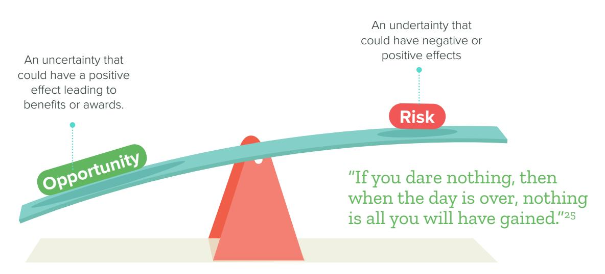

*Step 1*

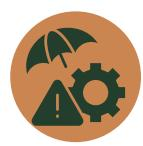

#### **OPPORTUNITIES EMERGE IN TWO WAYS:**

#### *Steps in opportunity mapping*

The steps in opportunity mapping parallel risk assessments. They begin with recognizing and evaluating opportunities and then move through planning actions to seize the opportunity.

*Step 2*

#### **Identify potential opportunities (recognize opportunities)** *1*

⊲ Identify all existing opportunities and created opportunities ⊲ Cluster opportunities into categories or themes

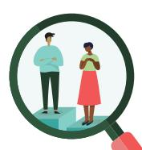

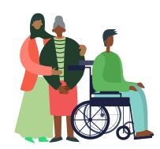

#### **Identify potential beneficiaries** *2*

⊲ Identify who might benefit and how ⊲ Assess how the benefits may dier across smallholders, with specific attention to women, IPLCs, and other intersecting social groups

#### **Evaluate the opportunities** *3*

⊲ Assess the costs, benefits, and risks (threats) of each opportunity ⊲ Consult with diverse stakeholders to select the most reasonable and practable entry points ⊲ Prioritize opportunities based on feasibility and their potential to open access for marginalized groups, and advance gender equity and social inclusion

#### **Plan actions** *4*

⊲ Agree on clear pathways for change and translate opportunities into concrete steps, roles, timelines, and resources ⊲ Consult with prospective beneficiaries to ensure that action plans are gender- and equityresponsive

#### **Implement the opportunity plan** *5*

⊲ Set targets and indicators and validate approaches with aected groups ⊲ Implement activities in ways that respond to the needs and priorities of women, IPLCs, and marginalized groups

#### **Act, learn, and adapt** *6*

⊲ Monitor implementation, review results regularly, and adjust actions as new insights or opportunities emerge ⊲ Consult with aected stakeholders on anticipated and unanticipated impacts

*Step 3*

> **3. Technical opportunities.** Geolocation, farm mapping, and digital due diligence tools give smallholders practical ways to become more visible in supply chains. These tools have the potential to empower women, IPLCs and tenure-insecure producers to document their farms, track practices, and demonstrate compliance, strengthening their position with buyers and service providers. Digital systems also create pathways for youth to gain skills in digital agriculture, access training and technical assistance, and participate meaningfully in supply chains. Although data is usually collected and reported by operators or traders, organizations can help smallholders understand and use it to claim benefits, access programmes, or negotiate better terms. *3*

**4. Market opportunities.** Access to the EU market can connect producers with buyers and social impact investors who value environmental and social sustainability and locally produced commodities generating social impact. Compliance with the EUDR can open opportunities to premium and specialty markets, such as organic, fair trade, women-grown or other dierentiated niches, potentially oering more stable relationships for women and IPLC producers. These opportunities increase when producers can demonstrate traceability, and align with environmental and social sustainability standards to strengthen their position in the value chains. *4*

#### *Opportunities for inclusion*

Post a large opportunity map on the wall with four quadrants.

Explain that we have identified four categories of opportunities in the EUDR to advance gender equity, social inclusion and intersectionality in deforestation-free value chains.

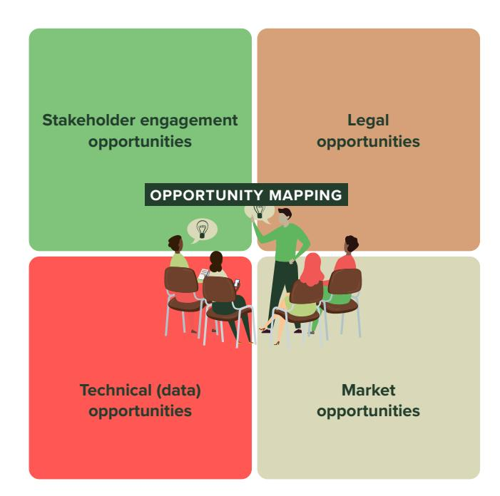

#### **1. Stakeholder engagement**

**opportunities.** The EUDR opens opportunities for engagement with producers, communities, and civil society. Socially inclusive approaches assure that women, IPLCs, and other marginalized groups are able to participate and be heard. When these groups take part in dialogues, workshops, or consultations, they can influence how compliance is implemented, ensure local priorities are recognized, and claim a role in decision-making.

- **2. Legal opportunities.** The EUDR defers to national laws and international commitments to protect human rights and the rights of IPLCs, grounding legal opportunities in national institutions and local authorities to clarify rules, strengthen safeguards or improve transparency and accountability. Civil society can use these legal frameworks to act on land and resource decisions and ensure consent processes, such as FPIC. While the EUDR is largely gender neutral, genderarmative national laws can create opportunities for women, youth, and marginalized groups to participate in decision-making, consultations, and due diligence. *2*

*1*

Facilitate the participants to identify specific opportunities, or ways to leverage EUDR to benefit women producers, IPLCs, or other intersectional groups who might otherwise be marginalized from deforestation-free value chains. In this step, encourage creative idea generation with no boundaries and no judgement. The goal is to generate as many ideas as possible before evaluating the ideas.

⊲ Divide the participants into small table groups of six to eight people ⊲ Give each group a flip chart paper and set of sticky notes

Instruct the groups to divide the flip chart into four quadrants to create an opportunity map:

- 1. Stakeholder engagement opportunities
- 2. Legal opportunities
- 3. Technical/data opportunities
- 4. Market opportunities

Explain that there will be four rounds to populate the four quadrants of the opportunity map. Allow 8-10 minutes for each round.

For each round, brainstorm for ideas which seize this opportunity (stakeholder engagement, legal, technical/data, or market) to advance gender equity, inclusion and intersectionality in the target value chain. Follow the mini-prompt to record the ideas on large sticky notes or cards

#### **Mini-prompt**

⊲ What is the idea? ⊲ Is this an existing opportunity or created opportunity? ⊲ Who benefits (women, youth, IPLCs)?

After each round, ring the bell and facilitate the participants to move to the next round.

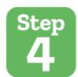

*Step 5*

#### *Idea generation: Identify potential opportunities and beneficiaries*

#### *Cluster opportunities into themes*

Note that participants often struggle to move from identifying negative risks (threats) to identifying positive opportunities. If the groups are finishing early with few ideas, it is sometimes better to have shorter brainstorming rounds and spend more time in plenary for collective idea generation and knowledge exchange.

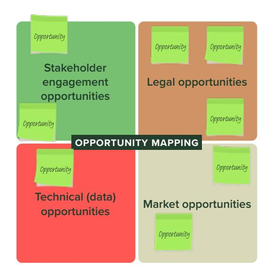

When the four rounds are completed, allow five minutes for the table groups to 'cluster and prune' their opportunity maps. They should cluster ideas that are so similar that they overlap or could be combined into one idea. They should prune out ideas that no longer seem relevant and put them at the bottom of the quadrant.

Ask the groups to select up to three opportunity ideas for each quadrant. Select one person to report back in plenary.

Invite the groups to bring their sticky notes to the main Opportunity Map posted at the front of the room (only three clustered or un-clustered opportunity ideas per quadrant).

#### *Step 6 Opportunity pitches: Evaluate the opportunities*

In plenary, invite one person from each group to come to the main Opportunity Map and report back on their idea generation. Invite the audience to gather around the Opportunity Map.

Explain that each group will present three opportunity pitches for each quadrant. They will have 1 minute for each opportunity pitch (or 3 minutes total to present 3 pitches for each quadrant). If time is limited to the groups are many, the number of pitches or time per pitch can be reduced.

#### **Each opportunity pitch is guided by the miniprompt:**

⊲ What is the idea? ⊲ Is this an existing opportunity or created opportunity? ⊲ Who benefits (women, youth, IPLCs)?

Begin with the Stakeholder Engagement Opportunity. After each group has presented, open the floor for plenary discussion and evaluation. Ask questions one-by-one and facilitate the audience (and presenters) to deliberate the options presented to them.

#### **Questions for discussion and evaluation of opportunity pitches:**

⊲ Which opportunities can smallholders seize directly with the tools, knowledge, and resources they already have?

⊲ Which opportunities require collaboration with other value chain actors to take action? ⊲ How could this opportunity be both practical and inclusive, ensuring women, IPLCs, and marginalized groups benefit?

#### **Prioritization**

⊲ To close the evaluation for each quadrant, facilitate a simple vote. ⊲ Give each participant a coloured index card. ⊲ Ask everyone to close their eyes. Read the opportunity pitch names one-by-one. Ask participants to vote by raising their cards. Count the number of votes and record on the Opportunity Map. ⊲ When the voting is completed, invite everyone to open their eyes and announce the results.

#### **Repeat this process for each quadrant:**

⊲ Each group shares one to three opportunity pitches ⊲ Facilitate evaluation discussion ⊲ Vote for the most promising opportunity

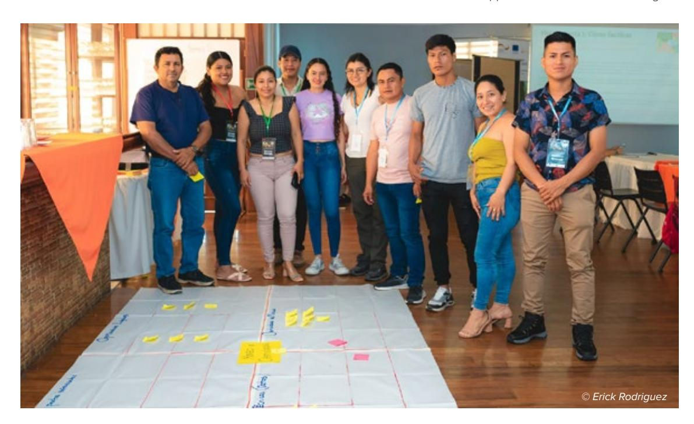

#### *Report back*

Ask each group to post their sticky note directly on the opportunity pitch.

Following the mini-prompt, invite each group to report back on their proposed action.

⊲ Who can do it? ⊲ What exactly can they do? ⊲ Where or in what context would it happen?

After all four groups have reported back, facilitate questions and comments about the proposed actions. Does this action allow the beneficiaries to leverage EUDR to take advantage of the opportunity? What are the risks (threats)? What most excites them about this opportunity /action?

#### *Plan actions*

After the most promising opportunity is selected for each quadrant, the participants will brainstorm concrete actions or activities for smallholders to seize these opportunities.

Divide the participants into four groups. Each group will select one of the four opportunity pitches to develop. Give each group a large sticky note or index card. Instruct them to capture one concrete action for smallholders to seize the opportunity. The action should be feasible within existing rules, resources, or processes. The actions should be specific but concise.

| Who can do it?              | What exactly can they do?                          | Where on in what context would it happen? |
|-----------------------------|----------------------------------------------------|-------------------------------------------|
| Women’s cooperative leaders | hold a short training on forest-friendly practices | at the local cooperative oce             |
| Smallholder women farmers   | report supply chain risks                          | during existing producer meetings         |
| Local council               | include IPLC representatives                       | in routine land-use planning discussions  |

#### **EXAMPLES:**

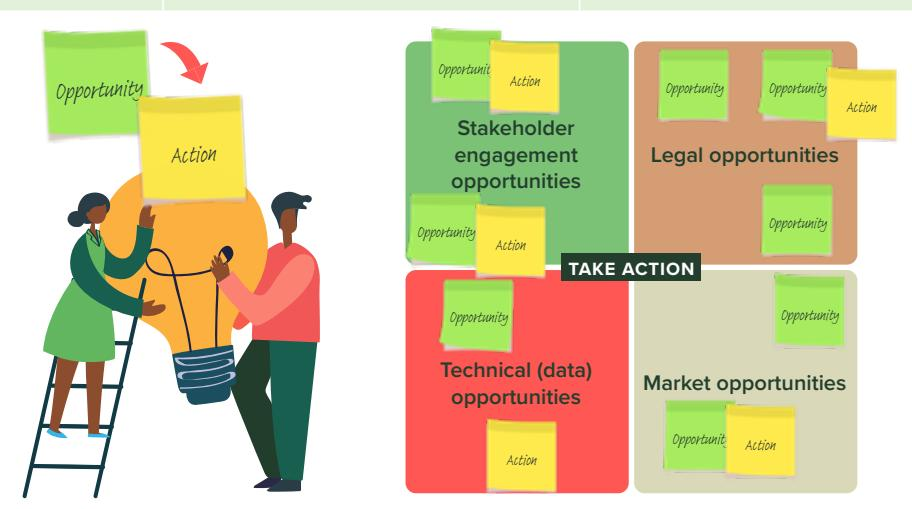

#### **DEBRIEFING AND DISCUSSION**

Opportunity mapping helps smallholders and their support providers to see where positive change is possible under EUDR and entry points for actions. By mapping across opportunity areas designed into the EUDR, this activity shifts attention from threats to possibilities. It balances opportunities that smallholders can pursue themselves with opportunities that require partnerships with operators and traders, other value chain actors, or government and civil society. By focusing on gender, social inclusion, and intersectionality, this exercise ensures that women, IPLCs, youth, and other marginalized groups are considered in planning and decision-making, and can gain influence, visibility, or support when these opportunities are recognized and acted on.

#### **Example questions for discussion:**

What is one concrete action you can take in your own work to ensure that women, IPLCs, or youth benefit from the opportunities created by the EUDR?

**1** To analyze workshop outputs from previous modules (value chain analysis, risk assessments, opportunity mapping) to identify inputs for a GESI+ Action Plan. **2** To organize these inputs into 'Do No Harm' and 'Do Better' categories and translate them into specific, actionable steps for smallholders and other value chain actors. **3** To facilitate smallholders in assigning responsibilities, developing equityresponsive actions, and creating a practical roadmap to implement and monitor GESI+ objectives in deforestationfree value chains.

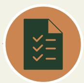

## MODULE 10 *GESI+ action planning for EUDR*

#### **TOOLS**

**Tool 24**  Intersectional action planning

#### **LEARNING OBJECTIVES**

#### **KEY MESSAGES**

#### **SOURCES**

⊲ Much of the analysis for the action plan (risks, opportunities, barriers, and solutions) has already been completed through prior modules and tools. The GESI+ Action Planning module organizes the workshop outputs into a coherent, actionable plan. ⊲ GESI+ Action Planning integrates both safeguarding measures to prevent harm (risk management, mitigation, social protection) and proactive strategies to advance equity, inclusion, and transformative change. ⊲ Eective action plans link responsibilities for risks, opportunities, and solutions to specific actors (operators, traders, smallholders, other value chain participants), creating a practical roadmap for implementation, monitoring, and accountability.

This final learning module brings together all the tools and insights from the workshop to help smallholders and value chain actors create a practical GESI+ Action Plan. It balances 'Do No Harm' social protections with proactive 'Do Better' actions to advance gender equity and intersectional inclusion in deforestation-free value chains.

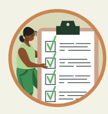

- 1. EIGE (European Institute for Gender Equality). 2024. Gender Mainstreaming: Gender Equality Action Plans: Method and Tool Brief, Luxembourg: Publications Oce of the European Union. [https://](https://eige.europa.eu/sites/default/files/documents/gender-equality-actions-plans-brief-eige.pdf) [eige.europa.eu/sites/default/files/documents/gender](https://eige.europa.eu/sites/default/files/documents/gender-equality-actions-plans-brief-eige.pdf)[equality-actions-plans-brief-eige.pdf](https://eige.europa.eu/sites/default/files/documents/gender-equality-actions-plans-brief-eige.pdf)
- 2. GCF (Green Climate Fund). 2023. Sexual Exploitation, Abuse and Harassment (SEAH) Risk Assessment Guideline: A Toolkit for Green Climate Fund (GCF) Financed Activities. Songdo, Incheon City, Republic of Korea: Green Climate Fund. [https://](https://www.greenclimate.fund/sites/default/files/document/gcf-seah-risk-assessment-tool.pdf) [www.greenclimate.fund/sites/default/files/document/](https://www.greenclimate.fund/sites/default/files/document/gcf-seah-risk-assessment-tool.pdf) [gcf-seah-risk-assessment-tool.pdf](https://www.greenclimate.fund/sites/default/files/document/gcf-seah-risk-assessment-tool.pdf)
- 3. GCF (Green Climate Fund). 2019. Gender assessment and action plan: Annex 8 to Funding Proposals. Songdo, Incheon City, Republic of Korea: Green Climate Fund. [https://www.greenclimate.fund/](https://www.greenclimate.fund/document/gender-assessment-and-action-plan-annex-8-funding-proposals) [document/gender-assessment-and-action-plan](https://www.greenclimate.fund/document/gender-assessment-and-action-plan-annex-8-funding-proposals)[annex-8-funding-proposals](https://www.greenclimate.fund/document/gender-assessment-and-action-plan-annex-8-funding-proposals)

### **TOOL 24:**

## *Intersectional action planning*

#### **MATERIALS**

Flip chart paper, sticky notes (or colour paper and tape), markers

#### **PREPARATION**

⊲ GESI+ Action Plan template

### *Mini-lesson: GESI+ action plans*

In the final learning module, we bring the pieces of the workshop together to develop a Gender Equity and Social Inclusion + Intersectionality (GESI+) action plan.

Explain that there are two underlying objectives to every GESI+ action plan. The first objective is to DO NO HARM by providing social protections and safeguarding to manage risks; the second objective is to DO BETTER than no harm principles by facilitating positive change through genderresponsive or gender transformative approaches.

In this workshop, we have learned about intersectionality and how to analyze social dimensions and dierences that intersect with gender (age, class, ability, indigeneity, ethnicity, religion, orientation, and others). We introduced concepts of equality, equity, and equity-responsive approaches to advance intersectional inclusion. We will continue to apply an intersectional lens across the GESI+ action planning steps.

Social protection and safeguarding plan. A good social safeguarding plan identifies risks (threats) of any planned intervention and puts measures in place to avoid, prevent or reduce harm from the intervention. It includes policies, risk assessment, mitigation measures which might include gender- or equityresponsive approaches, and monitoring and adaptive learning. The GESI+ safeguarding plan should go beyond to safeguard intersectional groups identified during the training activities.

Equity, inclusion and transformation plan. A proactive GESI+ action plan aims to address the root causes of inequity and social exclusion and use interventions to do better. The elements for the transformative part of GESI+ action plans is usually less prescriptive than for social protection and safeguarding plans, reflecting the industry emphasis on risks as threats over seizing positive opportunities for transformative change. It is more vision oriented, creating roadmaps and frameworks for change that are grounded in responsive and transformative approaches, adaptive and collaborative learning, and monitoring and evaluation on gender-specific and intersectional indicators.

#### **DO NO HARM DO BETTER**

**Risk management and safeguarding**

**Equity, inclusion and transformation**

#### **DO NO HARM**

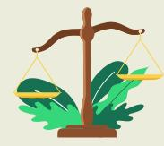

#### **DO BETTER**

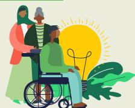

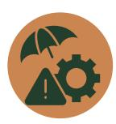

#### *Categorize workshop outputs into do no harm | do better*

Explain that we have already completed the inputs towards making a GESI+ Action Plan through the learning modules and toolkit activities. The outputs from these tools (flip charts, sticky notes, index cards) can populate the first draft of a GESI+ Action Plan Template, addressing the risk management requirements of the EUDR, as well as the next steps for more proactive GESI+ planning.

Divide the participants into groups of 6-8 people with common value chains or geographies to align learning plans. Give each group two pieces of flip chart paper.

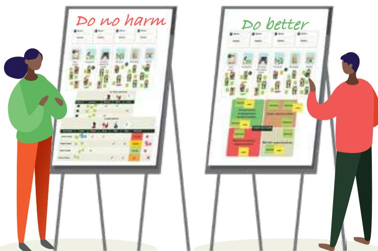

Gather previous workshop outputs for the action plans:

⊲ intersectional value chain map (TOOL 9); ⊲ value chain barriers and constraints (TOOL 10) and equity-responsive solutions (TOOL 11); ⊲ risk assessment (TOOL 20, 21) and mitigation plan (TOOL 22); ⊲ opportunity maps and opportunity actions (TOOL 23).

Advise the participants to take photos of all workshop materials for record-keeping Instruct them to organize the workshop outputs into two categories:

- 1. Do no harm
- 2. Do better

They will need to remove sticky notes and clusters and transfer them to the new flip charts. These can be organized on the table or action planning boards. Help the group to organize, cluster and prune the action planning boards as necessary to combine similar ideas and avoid redundancies.

**Value chain maps barriers and constraints solutions Value chain maps barriers and constraints solutions\***

**Risk assessment and mitigation plan Opportunity mapping and actions**

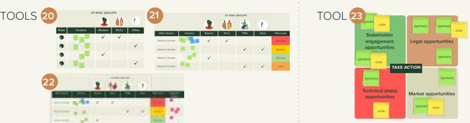

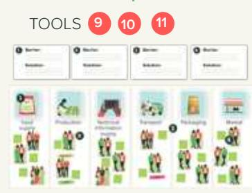

#### **DO NO HARM DO BETTER**

Risks Clusters Women IPLCs Other

**20**

Risks Factors Clusters Women IPLCs PWD Other Risk Level Name of cluster Very high Name of cluster Medium Name of cluster Very low Name of cluster Low

**21**

**22**

TOOLS **9 10 11**

#### *Build the GESI+ action plan*

This step can be done in table groups for small group planning, or in plenary to consolidate a common GESI+ action plan for all participants in the training workshop.

Instruct the groups to begin with the DO NO HARM action planning board. They will transfer everything from the DO NO HARM category to the first row of the GESI+ action planning template. Then repeat the same by transferring everything from the DO BETTER board to the second row of the planning template.

If the goal is to create a common GESI+ action plan for all participants in the training workshop, it is necessary to add a step to organize and cluster the sticky notes to group common themes and avoid redundancy.

Before continuing to the final step, instruct the groups to number each of the sticky notes or clusters.

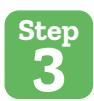

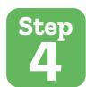

|  <b>DO NO HARM</b>          | <b>Barriers and constraints Risks</b>                    | <b>Equity-responsive solutions Mitigation actions</b>      |
|------------------------------------------------------------------------|----------------------------------------------------------|------------------------------------------------------------|
| Risk management and social safeguarding                                |   |   |
|                                                                        |   |   |
|  <b>DO BETTER</b> | <b>Opportunities</b>                                     | <b>Equity-responsive solutions Opportunity actions</b>     |
| Equity, inclusion and transformation plan                              |   |   |
|                                                                        |  |  |

### *Responsibility mapping*

The final step for the training workshop is to assign responsibilities in this plan to the parties obligated to deliver on the proposed actions under the guidance of the EUDR or national legislation.

In small groups or plenary, create an index card for each of the responsibility parties:

⊲ Operators and traders ⊲ Producers, or ⊲ Other value chain actors. Begin with the operators and traders. Facilitate the groups to identify which actions are the obligation of the operators and traders. Write the numbers for these actions or clusters on the operators and traders card.

Next discuss the obligations of smallholder producer who are not themselves operators or traders. Facilitate the groups to identify which actions would be the responsibility of the producers to carry forward. Write the numbers for these actions or clusters on the producers card. Repeat for each of the other relevant value chain actors or stakeholders. Create a card for each, and record the numbers for the actions or clusters on the actor card.

#### **SYNTHESIZING SIMPLE ACTION PLANS**

As an extension, explain that the next step in action planning is to add columns for Specific, Measurable, Achievable, Relevant, and Time-bound (SMART) indicators or additional information as needed. This simple plan is the first input towards a more detailed stepwise workplan. The results can be transcribed to a document or spreadsheet to continue planning.

#### **DEBRIEFING AND DISCUSSION**

The final learning GESI+ learning module brings the planning tools and outputs together to feed directly into a practical GESI+ action plan. Participants should have a clearer sense of how to balance social safeguarding with more ambitious equity and transformation goals, and how the EUDR can anchor both. The real value of this process is learning to turn GESI+ analysis from the tools into concrete actions that protect smallholders, promote intersectional inclusion and equity, while expanding their opportunities. The GESI+ action plan is a starting foundation for continued planning, collaboration, and accountability to support just transitions to deforestationfree value chains.

#### **Example questions for discussion**

- 1. How feasible is it to do this level of action planning to support GESI+ goals with smallholders in the areas where you work?
- 2. How would you adapt this activity to ensure social safeguarding and enhance social inclusion, equitable benefit sharing, empowerment or transformative change?

| <b>X</b> <b>DO NO HARM</b>                                             | <b>Barriers and constraints Risks</b>                   | <b>Equity-responsive solutions Mitigation actions</b>                                                                                                                       | <b>Responsibilities: operator, trader, producer</b>                                                                                                                  |
|---------------------------------------------------------------------------|---------------------------------------------------------|-----------------------------------------------------------------------------------------------------------------------------------------------------------------------------|----------------------------------------------------------------------------------------------------------------------------------------------------------------------|
| Risk management and social safeguarding                                   |  |    |                                                          |
|                                                                           |  |                                                             |                                                          |
|  <b>DO BETTER</b> | <b>Opportunities</b>                                    | <b>Equity-responsive solutions</b> <b>Opportunity actions</b>                                                                                                            | <b>Responsibilities: operator, trader, producer</b>                                                                                                                  |
| Equity, inclusion and transformation plan                                 |  |                                                                                                                     |                                                          |
|                                                                           |  |                                                             |    |

#### **GESI+ ACTION PLAN**

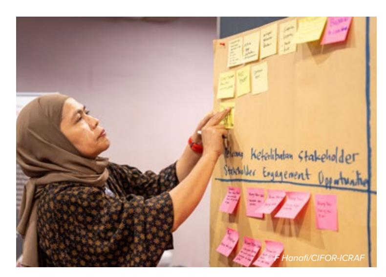

# Building a GESI+ learning plan

#### **THIS SECTION COVERS: SOURCE**

Output 1 *Learning design: planning circle*

Output 2 *Learning plan*

**After exploring the modules, tools, and activities in the toolkit, trainers are now ready to turn this knowledge into action. This section guides trainers in designing their own learning plans, building the plan module-by-module, and preparing to facilitate workshops with smallholders in a way that is practical, inclusive, and aligned with GESI+ and intersectional principles.**

#### **KEY MESSAGES**

- **1. Purpose-to-Practice (P2P) is a co-creation strategy for collaboratively defining the foundational elements of a training workshop (purpose, principles, participants, structures, and practices) and ensuring alignment with GESI+ and intersectional inclusion from the start.**
- **2. The Learning Plan template guides trainers in building a grounded learning plan; translating the P2P foundations into a concrete roadmap, detailing logistics, participants, modules, tools, and activities tailored to the commodity, sourcing area and value chain dynamics.**
- **3. Through gallery walks and peer feedback, trainers can refine and strengthen their learning plans, fostering collaboration, cross-learning, and ensuring that the design is feasible, inclusive, and ready for implementation with smallholders.**

1. Lipmanowicz, H and McCandless K., n.d., 33. Purpose-to-Practice (P2P). Liberating Structures. Accessed 1 December 2025. [https://www.](https://www.liberatingstructures.com/33-purpose-to-practice-p2p/)

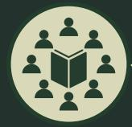

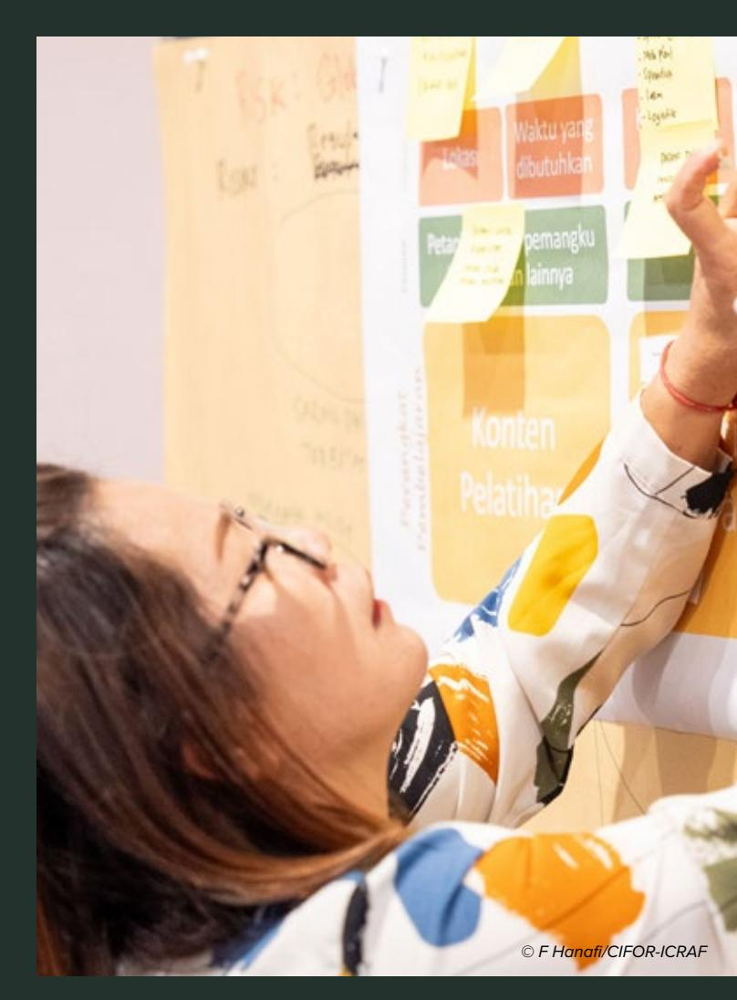

### **OUTPUT 1:** LEARNING DESIGN *Planning circle*

**MATERIALS** Index cards

#### **PREPARATION**

⊲ P2P reading

### *Explain the peer-to-peer (***P2P)** *approach*

Introduce the P2P approach as a tool for co-creation. In this ToT, we use the P2P approach to design the foundational elements of a learning plan for smallholder training on GESI+ for Deforestation-free Value Chains.

The P2P approach begins with generating a shared sense of purpose. The other foundational elements are added, in turn, to shape the learning principles, identify learning participants, negotiate structures and responsibilities, and agree on a set of practices for delivery of the training. Each of these elements are designed to achieve the purpose.

The five elements of the P2P approach:

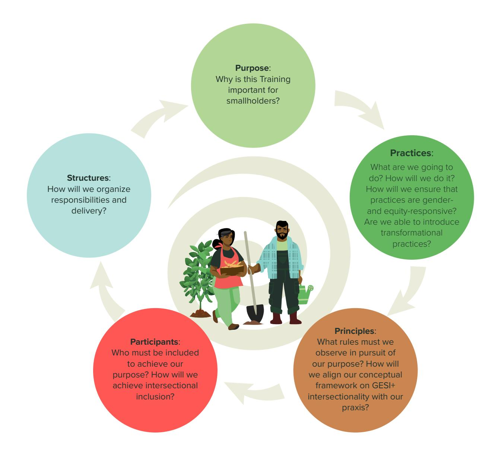

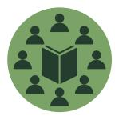

### *Table group discussions*

⊲ Divide the participants into table groups of no more than six to eight people ⊲ Give each table 5 large index cards ⊲ Select one person to be a facilitator and one person to be a notetaker. ⊲ Ask each table to discuss the P2P questions as a roundtable ⊲ Once they have agreed, the notetaker will record their response on the index card.

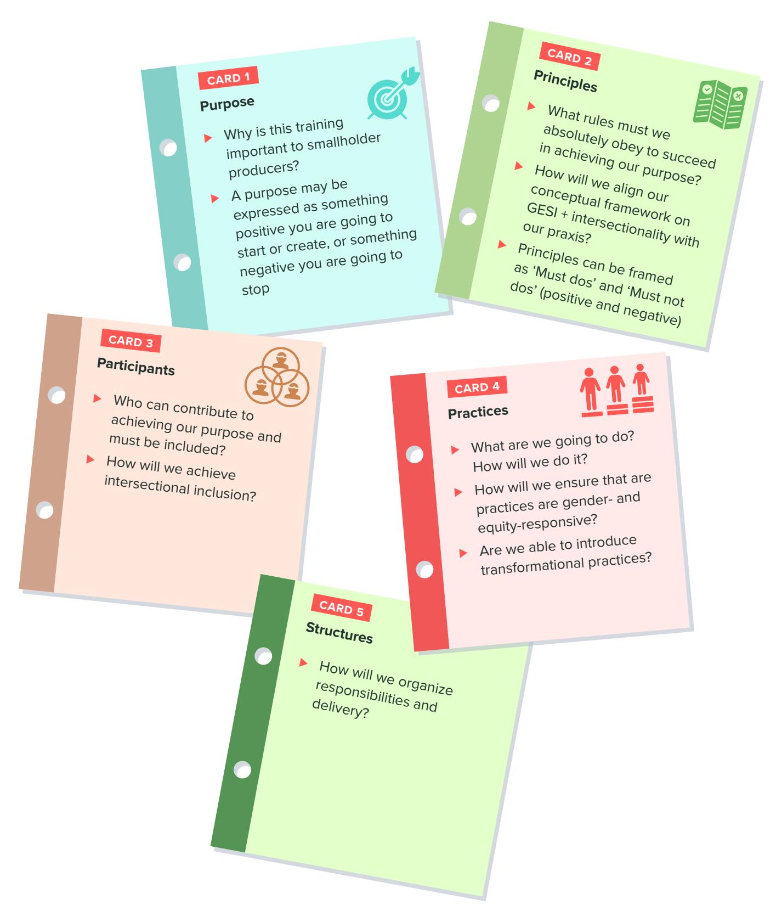

*Step 2*

### *Clustering and amplifying ideas*

⊲ Hang five pieces of flip chart paper and label each by one of the P2P categories: **Purpose, Principles, Participants, Structures, Practices**  ⊲ Invite each group to post their five cards to the five labelled papers. ⊲ Divide the participants into five groups and ask each group to select one category. ⊲ Give each group 5 minutes to compare, organize, and amplify the top ideas. ⊲ Prepare each group to present their final results.

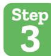

Congratulate the participants on co-creating the foundations of a learning plan with a shared purpose. Explain that in the next step, they will develop concrete learning plans building on this foundation.

### *Planning circle (or plenary)*

If space allows, invite all the participants to sit in a planning circle.

⊲ Begin with the **Purpose**. Ask the group who clustered the purpose cards to describe the responses on the cards, how ideas were clustered and which ides were amplified. Facilitate the plenary group to discuss, deliberate, and revise if necessary. Ensure that all the participants agree with the **Purpose** of the training on GESI+ for Deforestation-free Value Chains for smallholders, as all of the other learning elements must align with the PURPOSE. ⊲ Next discuss the **Principles**. Ask the group who clustered the principles cards to describe the responses on the cards, how ideas were clustered and which ideas were amplified. ⊲ Facilitate the plenary group to discuss and deliberate the principles and how well they align with and support the **Purpose**. If necessary, revise the **Principles** to reinforce the **Purpose**. ⊲ Repeat this process for each of the other three cards: Report back, facilitate plenary discussion, assess alignment with the purpose, revise and finalize. ⊲ Collect all the cards. Read them in order from **Purpose** to **Principles**, **Participants, Structures** and **Practices**. Facilitate a discussion about the training design. Does the flow from one learning element to the next makes sense? Is there anything missing? What would they change? Make any changes to the cards to finalize and close the learning circle.

*Step 4*

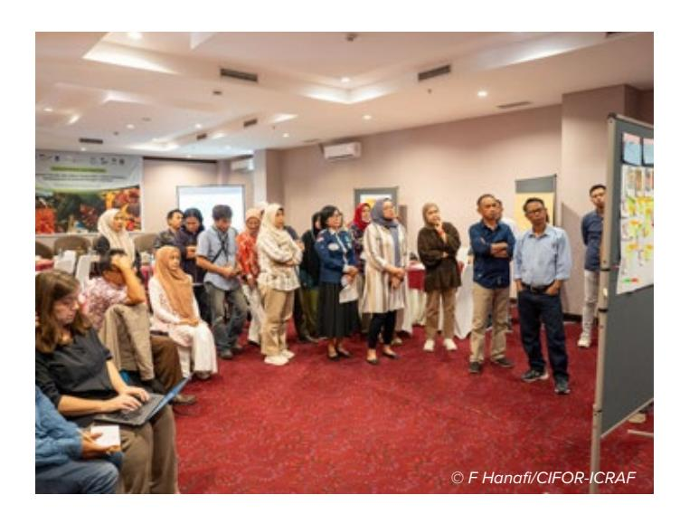

### **OUTPUT 2:** LEARNING PLAN *Learning plan template*

#### **MATERIALS**

⊲ Flip chart paper, sticky notes, learning plan template (optional), Toolkit cards (optional)

#### **PREPARATION**

⊲ Pre-reading, printing, preparing flip charts in advance

Divide the participants into small groups of no more than six to eight people.

The table groups members should share a common value chain and/or geography for common learning objectives.

Give each group a learning plan template (if possible print in advance) or flip chart paper, sticky notes and a set of Toolkit cards.

Explain that each group will create their own learning plan for an actual training with smallholder farmers.

While they may need to make some comprises working in a group, they should join a group with other organizations with common missions, value chains, or geographies so that the learning plan resembles a training they could implement with planning.

The participants should build upon the purpose, principles, participants, structures and practices agreed during the P2P planning (OUTPUT 2). This output is more involves more concrete inputs:

⊲ **Logistics:** Location, time, materials, preparation in advance ⊲ **Participants:** Training participants, facilitators ⊲ **Toolkit:** Learning modules, tools and activities

### *Explain the learning plan template*

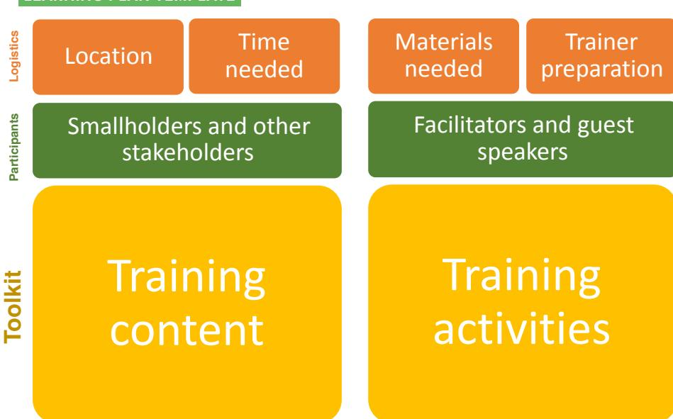

#### **LEARNING PLAN TEMPLATE**

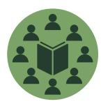

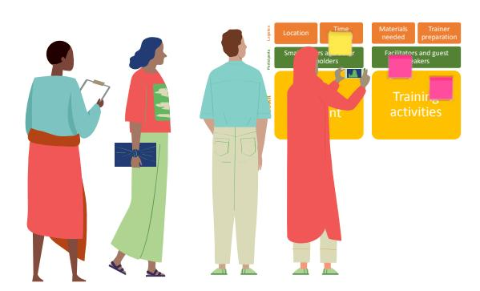

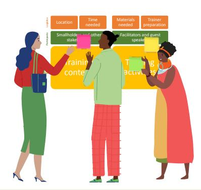

In closing the final session of the ToT, reflect on the learning plans and the next steps beyond the ToT. The learning plans brings the concepts, practical modules, and tools in the toolkit together into a concrete roadmap for participants to carry forward and into their own trainings with smallholder producers. By outlining logistics, roles, and learning activities, each group leaves with a practical, ready-to-implement design that strengthens coordination and makes it more likely that the work started here will continue in the field.

#### **DEBRIEFING AND DISCUSSION**

#### *Logistics planning*

Instruct the groups to use one or more sticky note for each of the bulleted points below. Complete the sticky note and attach to the learning plan template.

⊲ **Location:** What is the best location and facility to host your training(s) (in communities, at a company, in town at a conference hall, etc.)? ⊲ **Time needed:** How long (duration) and how often will your training take place (over several consecutive days or divided over dierent workshops over several visits/months)? ⊲ Materials needed? ⊲ Trainer preparation needed?

#### *Participants list*

Use one or more sticky note for each of the bulleted points below. Complete the sticky note and attach to the Learning Plan template.

⊲ **Smallholders/other stakeholders:** Who is the target audience? How many people can attend? What will the selection criteria be? How will you ensure social inclusion? ⊲ **Facilitators/guest speakers:** Who will lead the trainings? Who will support?

*Step 2*

*Step 4*

*Step 5*

*Step 3*

#### *Toolkit cards*

Toolkit cards are included in the Toolkit for printing, or these can be displayed on a PowerPoint for the participants to copy onto sticky notes. Note that the Learning Module (learning topic) and Tool do not need to be taken together. Groups may decide to integrate a learning module by topic but change the tools or activities used to deliver the learning topic. They may also add their own learning modules or tools.

⊲ **Training content:** Which learning modules will you include in your trainings? ⊲ **Training activities:** Which tools or activities will you incorporate? ⊲ Do you have other learning modules or activities that you would add?

#### *Gallery walk*

When all of the groups have finished their learning plans, hang them on the wall like an art gallery. Invite participants to walk around to view the learning plans developed by their peers. Time permitting, lead a gallery tour. Stop at each learning plan and ask the groups to present the key elements of their plans. Invite the audience to ask questions, and make plans to collaborate on real-world training events if possible.

## *Toolkit cards*

## *Learning modules*

|                                   |                      |  |
|------------------------------------------------|-----------------------------------|---------------|
| <b>MODULE 1</b>                                | <b>MODULE 6</b>                   |               |
| GENDER AND INTERSECTIONALITY                   | RELEVANT NATIONAL LEGISLATION     |               |
|                                                |                                   |               |
| <b>MODULE 2</b>                                | <b>MODULE 7</b>                   |               |
| GENDER EQUITY AND SOCIAL INCLUSION (GESI)      | COMMODITY-SPECIFIC REGULATIONS    |               |
|                                                |                                   |               |
| <b>MODULE 3</b>                                | <b>MODULE 8</b>                   |               |
| VALUE CHAIN MAPPING                            | RISK MANAGEMENT                   |               |
|                                                |                                   |               |
| <b>MODULE 4</b>                                | <b>MODULE 9</b>                   |               |
| EQUITY-RESPONSIVE VALUE CHAIN DEVELOPMENT      | OPPORTUNITIES AND BENEFIT-SHARING |               |
|                                                |                                   |               |
| <b>MODULE 5</b>                                | <b>MODULE 10</b>                  |               |
| EUROPEAN UNION DEFORESTATION REGULATION (EUDR) | GESI+ ACTION PLAN                 |               |

## *Tools*

| TOOL 1.  | NORMS, VALUES AND BELIEFS:                                       |
|----------|------------------------------------------------------------------|
|          | VOTE WITH YOUR FEET TOOL 13. EUDR LECTURE: INTERACTIVE LECTURE   |
| TOOL 2:  | UNDERSTANDING GENDER:                                            |
|          | TOOL 14. EUDR PANEL:                                             |
| TOOL 3:  | UNDERSTANDING INTERSECTIONALITY:                                 |
|          | TOOL 15. EUDR DIALOGUE:                                          |
| TOOL 4.  | UNDERSTANDING EQUITY:                                            |
|          | TOOL 16. RELEVANT NATIONAL LEGISLATION:                          |
|          | TOOL 5. PROMOTING EQUITY:                                        |
|          | TOOL 17. ROUNDTABLES ON NATIONAL                                 |
|          | TOOL 6. LIVING VALUE CHAINS TOOL 18. COMMODITY SECTOR READINESS: |
| TOOL 7.  | VALUE CHAIN MAPPING TOOL 19. SMALLHOLDER READINESS:              |
| TOOL 8.  | GENDERED LABOUR ROLES:                                           |
|          | TOOL 20: RISK ASSESSMENT:                                        |
| TOOL 9.  | INTERSECTIONAL VALUE CHAIN MAPPING TOOL 21: RISK LEVELS:         |
| TOOL 10. | MAPPING BARRIERS AND CONSTRAINTS TOOL 22: RISK MITIGATION:       |
| TOOL 11. | EQUITY-RESPONSIVE APPROACHES:                                    |
|          | TOOL 23: OPPORTUNITIES FOR CHANGE:                               |
| TOOL 12: | VALUES AND VALUE-BASED PROBLEM                                   |
|          | SOLVING: VALUE CONTINUUM TOOL 24. INTERSECTIONAL ACTION PLANNING |

The toolkit cards can be printed on regular size A4 paper.

content

Training

Smallholders and other stakeholders

Location

Time needed

activitiesTraining

Facilitators and guest speakers

Materials needed

Trainer

preparation

**Toolkit Participants Logistics**

The learning plan template dimensions should be flip chart paper size or larger.

## *Learning plan template*

# Evaluation and learning

#### **THIS SECTION COVERS:**

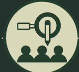

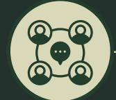

Evaluation 1 *Training checkout* Evaluation 2 *Training survey* Evaluation 3 *Post-training survey*

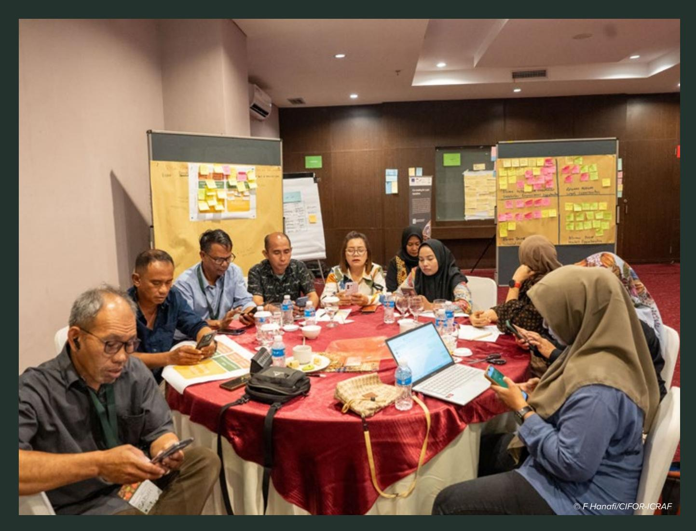

### EVALUATION 1.

## *Training check out*

A check-out evaluation is facilitated collectively and visually in a plenary session and serves multiple purposes beyond just collecting data. It transforms the final minutes of a meeting or training into a powerful moment of shared reflection, immediate learning, and eective closure.

Explain to the participants that they may also use this or similar survey tools to facilitate check-ins or check-outs during and after training sessions

### *Set up the Meeting Check-Out*

Using a digital tool (such as Mentimeter, Slido, or Google Forms), set up the three evaluation questions. Ensure the display format for each question is configured as specified below. Activate the tool and display the unique access code or link prominently on the screen.

#### *Explain how to access the digital survey (how to join) and circulate to support participants to navigate each step as needed.*

Encourage participation and emphasize that this is a fun, anonymous exercise to visualize the group's collective opinion.

#### **Instructions:**

⊲ Use your phone or laptop. ⊲ Navigate to the website displayed on the screen (e.g., [www.menti.com\)](http://www.menti.com). ⊲ Enter the code displayed. ⊲ Answer the questions as they appear on the screen, following the specific instructions for each section.

*Allow participants 3 minutes for each question. Display the results in real time or after completing all of the questions.*

*Step 1*

*Step 2*

*Step 3*

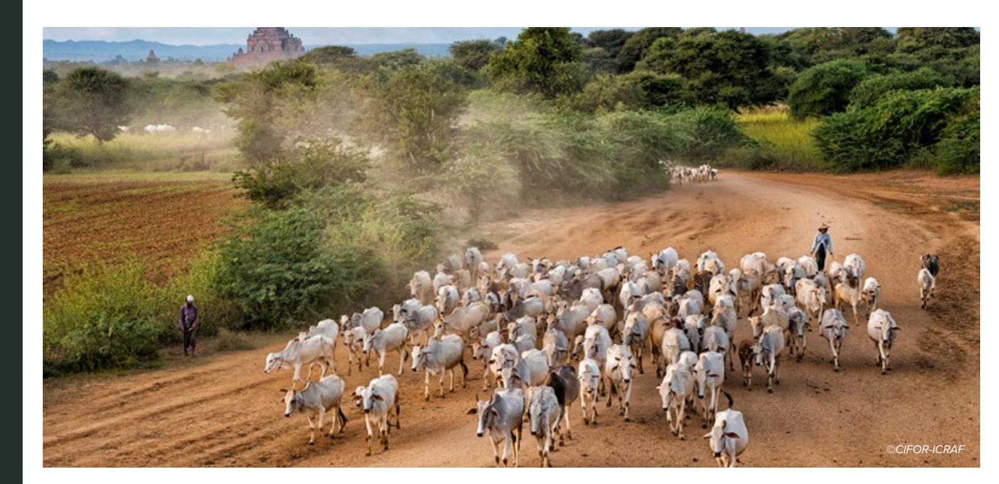

#### Question 1:

#### **Rating Your Level of Agreement (The Barometer)**

Rate your level of agreement with the following statements:

⊲ Gender Equality and Social Inclusion training is relevant for me and my work. ⊲ The training on legislation and global market regulations was relevant to me and my work. ⊲ The tools and activities were useful for teaching producers about GESI and EUDR. ⊲ The training was enjoyable and fun. ⊲ I will apply this ToT in trainings with farmers. **Visual Format:** Sliding Scales or Bar Charts. For each statement, move the slider from 'Strongly Disagree' to 'Strongly Agree.' **Facilitation Tip:** Review the results and note the highest and lowest average scores. Briefly ask the group for context on the lowest-rated statement, if time permits.

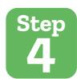

#### Question 2:

**Most Useful Part (The Open Answer Display)** What was the most useful part of this training for your work?

**Visual format:** Open-ended responses (a short sentence or key phrase). Multiple answers allowed. **Facilitation Tip:** Scan the displayed answers to quickly identify common themes (e.g., specific modules.

#### Question 3:

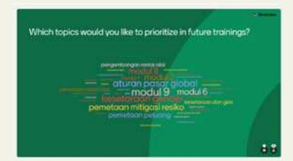

**Prioritizing Future Topics (The Word Cloud)** Which topics would you like to prioritize in future trainings?

**Visual Format:** Word Cloud. Allow up to three separate entries for three top priorities. **Facilitation Tip**: Explain that topics submitted by more people will appear larger and bolder in the Word Cloud. Use the visual size to instantly identify the top three to five priority areas.

### EVALUATION 2.

## *Training survey*

The training evaluation survey is used to capture individual, detailed feedback using a digital form (Google forms, etc.). Individual input is valuable for improving future training programmes.

This digital survey can also be adapted for paper forms or individual interviews conducted during future farmer workshops.

#### *Set up the survey.*

Using a digital tool (such as Mentimeter, Slido, or Google Forms), set up the evaluation questions. Ensure the display format for each question is configured as specified below. Activate the tool and display the unique access code or link prominently on the screen.

*Explain how to access the digital survey (how to join) and circulate to support participants to navigate each step as needed without hovering.*

### *Allow 30 minutes or more to complete the survey.*

Kindly encourage the participants to stay until the survey is completed and allow those who are finished to socialize or take a break while everyone finishes. It is important to capture as many responses as possible.

*Step 1*

> *Step 2*

> *Step 3*

⊲ Access the survey using your preferred device (phone, computer, or tablet). ⊲ Go to the link or scan the QR code displayed on the screen. ⊲ Complete all questions on the digital form honestly and thoroughly. ⊲ Click 'Submit' when finished.

#### **INSTRUCTIONS**

#### 1.0 PERSONAL DATA

#### **1. Which sector are you from?**

Producer Cooperative NGO/Civil Society Consultant Other (Please specify)

#### **2. What is your gender?**

Woman Man

#### **3. With which commodities do you work?**

Cocoa Coee Oil palm Natural rubber

Soy Cattle products Wood products Other (Please specify)

#### 2.0 KNOWLEDGE BEFORE THE WORKSHOP (RATE 1-5)

#### **4. Gender Equity and Social Inclusion**

1 (Low/Disagree) 2 3 4 5 (High/Agree)

#### **5. Gender analysis in the value chain**

1 (Low/Disagree) 2 3 4 5 (High/Agree)

#### **6. EUDR**

1 (Low/Disagree) 2 3 4 5 (High/Agree)

#### **7. Risk management**

1 (Low/Disagree) 2 3 4 5 (High/Agree)

#### **8. Opportunity mapping**

1 (Low/Disagree) 2 3 4 5 (High/Agree)

#### 3.0 - PARTICIPATION IN WORKSHOP

#### **9. On which days of the workshop did you attend?**

 Day 1 Day 2 Day 3 All days

### 4.0 - WORKSHOP EVALUATION

#### **4.1 Workshop Objectives & Content**

#### **10.Were the objectives of the workshop clearly communicated?**

 Yes, it is quite clear Just normal Unclear Not at all

#### **4.2 Workshop Content**

#### **11. Is the training content relevant to your work?**

 Yes, very relevant Yes, it is quite relevant Little relevant Not at all

#### **4.3 Workshop Facilitation (Rate 1-5)**

#### **12. What was the level of knowledge of the facilitators on the topic?**

1 (Low/Disagree) 2 3 4 5 (High/Agree)

- **13. How did the facilitators respond to questions and concerns?**

1 (Low/Disagree) 2 3 4 5 (High/Agree)

**14. Was the pace of the training adequate?** 

1 (Low/Disagree) 2 3 4 5 (High/Agree)

#### **15. How do you rate the quality of the facilitator's teaching?**

1 (Low/Disagree) 2 3 4 5 (High/Agree)

#### **4.4 Activities and Tools (Rate 1-5)**

**16. Were the training activities and tools useful** 

**and easy to follow?**

1 (Low/Disagree) 2 3 4 5 (High/Agree)

**17. Are the workshop media (PowerPoints,** 

**photos, images) useful?** 

1 (Low/Disagree) 2 3 4 5 (High/Agree)

#### **18. Do you feel you can apply these activities and tools when you have to lead a workshop/ training?**

1 (Low/Disagree) 2 3 4 5 (High/Agree)

#### **4.5 Learning and Application (Rate 1-5, unless specified)**

- **19. Do you think you'll be able to apply what you've learned about Gender Equity and Social Inclusion (GESI+) to your work?**

1 (Low/Disagree) 2 3 4 5 (High/Agree)

- **20. Do you think you will be able to apply what you've learned about GESI+ and value chains? Or about GESI+ and Sustainable Agriculture (EUDR)?**

1 (Low/Disagree) 2 3 4 5 (High/Agree)

**21. Do you think you will be able to apply what you have learned about EUDR?** 

1 (Low/Disagree) 2 3 4 5 (High/Agree)

**22. What is your overall level of satisfaction with the learning experience?**

1 (Low/Disagree) 2 3 4 5 (High/Agree)

**23. Did you learn anything new in this training** 

**that will be useful for your work?** 

**24. What was the most valuable aspect of this ToT workshop for you?**

#### **24. Suggestions for improving the workshop**

**25. Do you have any final messages or feedback that you would like to convey to the workshop facilitators?** 

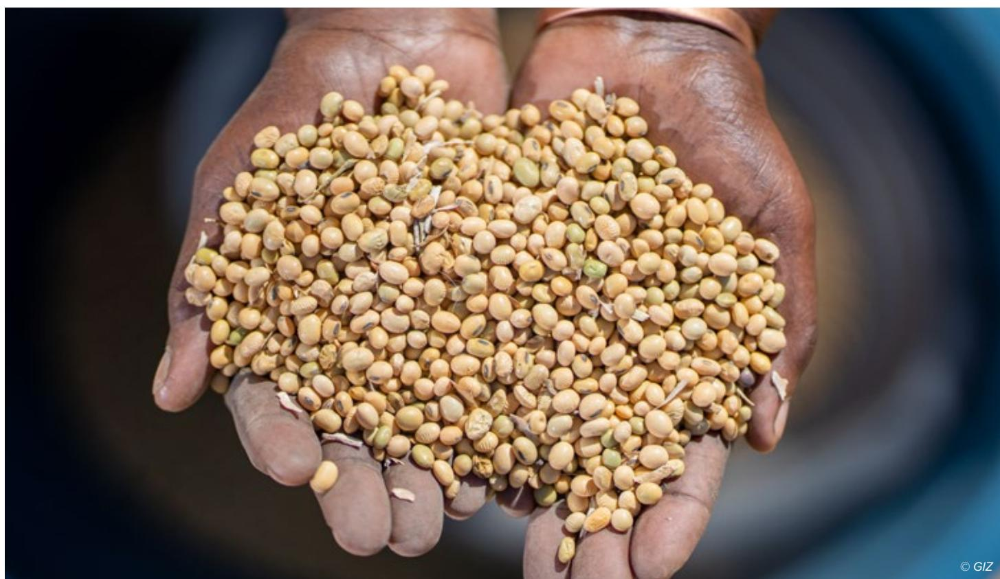

### EVALUATION 3.

## *Post-training survey*

This evaluation is designed to be administered approximately six months after the Training of Trainers (ToT) workshop. Its primary goal is to assess the application of learned knowledge and tools, document success stories, and identify challenges encountered by the trainers in their field work. This survey transitions from evaluating the training content (Individual Survey) to evaluating the training's impact.

#### *Questions*

#### SECTION 1: TRAINER PROFILE AND REACH

#### **Date of Survey:**

- 1. Since the ToT, how many farmer workshops/ trainings have you conducted using the new materials?

- 2. Approximately how many total farmers (producers) have you trained using this material?

- 3. Training participants

|                 | Men | Women |
|-----------------|-----|-------|
| Youth           |     |       |
| Elders          |     |       |
| PWD             |     |       |
| IPLCs           |     |       |
| Other (specify) |     |       |
|                 |     |       |
|                 |     |       |
|                 |     |       |

**Objective:** To gather qualitative and quantitative data on the practical use, success, and challenges of applying ToT materials (especially GESI+, EUDR, and tools) in the field.

**Format:** Digital survey (online form) or conducted via phone interview.

#### **INSTRUCTIONS**

- 4. How frequently do you refer back to the materials/tools provided during the ToT? (Mark only one checkbox) Daily Weekly Monthly Rarely (less than once a month) Never

#### SECTION 2: APPLICATION AND SUCCESS STORIES

This section focuses on the practical application of the main thematic areas:

#### **2.1 Applying GESI+ and Value Chain Analysis**

- 5. Please rate your confidence in applying the Gender Equity and Social Inclusion and Intersectionality (GESI+) concepts and tools in your farmer trainings now. (Mark only one checkbox).

1 (Not at all confident) 2 3 4 5 (Highly confident)

- 6. Please describe one successful outcome you achieved or observed after integrating GESI+ concepts (e.g., gender roles, inclusion, value chain analysis) into your work or farmer training.

- 7. What was the most eective specific tool or activity from the ToT that you used to discuss GESI+ with farmers?

#### **2.2 Applying EUDR**

- 8. Please rate your confidence in training farmers on EUDR. (Mark only one checkbox).

1 (Not at all confident) 2 3 4 5 (Highly confident)

- 9. Please describe one successful outcome or key piece of information you successfully conveyed to farmers regarding EUDR.

- 10. Do you feel the tools and activities from the ToT were eective in teaching producers about GESI+ and EUDR market regulations? (Mark only one checkbox).

Yes, highly eective Somewhat eective Neutral Not very eective No, not eective at all

#### **2.3 Applying risk and opportunity mapping**

- 11. Please rate your confidence in training farmers to participate in risk and opportunity assessments (e.g., creating risk registers, risk heat mapping, identifying mitigation strategies, or opportunity mapping). (Mark only one checkbox)

1 (Not at all confident) 2 3 4 5 (Highly confident)

- 12. Please describe one successful outcome you achieved or change you observed in due diligence preparation after training farmers about risk and opportunity assessments.

- 13. What was the most eective specific tool or activity from the ToT that you used to discuss risk and opportunity assessments with farmers?

#### **2.4 Applying GESI+ Action Planning**

- 14. Please rate your confidence in training farmers develop GESI+ Action Plans using the outputs from the workshop or other materials. (Mark only one checkbox)

1 (Not at all confident) 2 3 4 5 (Highly confident)

#### SECTION 3: CHALLENGES AND SUPPORT NEEDS

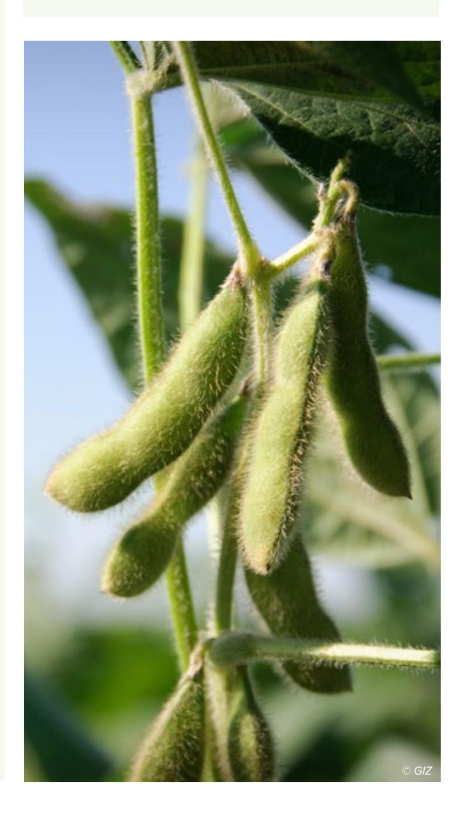

- 1. What was the biggest challenge you faced when trying to apply the ToT materials or tools in the field? (Mark only one checkbox).

Farmer resistance/lack of interest Lack of time/resources Diculty adapting materials to local context Materials were too complex (e.g., EUDR/ regulations) Lack of continuous support/coaching Other (Please specify)

- 2. Specifically, what type of additional support would best help you overcome these challenges and lead more successful trainings? **Example:** Refresher workshops, field coaching, simplified materials.

- 15. Please describe one successful outcome you achieved or change pathway successfully integrated into the GESI+ Action Plans developed during training workshops?

16. Do you feel that this is an eective way to integrate GESI+ Action Plans into farmer training programs on sustainable agriculture

and market compliance?

Yes, highly eective Somewhat eective Neutral Not very eective No, not eective at all

#### SECTION 4: OVERALL IMPACT

3. Do you feel that applying this ToT has positively impacted the way you conduct trainings with

farmers? (Mark only one checkbox).

Significantly improved Moderately improved Slightly improved No change

4. What was the most valuable aspect of the

original ToT workshop that continues to support

your current work?

# References

- Aparna. 2019. And … here's yet another equity v. equality (v. justice) image series [cartoon]. The Avarna Group. Published 2019 May 25. [https://theavarnagroup.com/and-heres-yet-](https://theavarnagroup.com/and-heres-yet-another-equity-v-equality-v-justice-image-series/)Arnold K. n.d. Panels in the round. Powerful Panels. Accessed 2025 Dec 1.<https://www.powerfulpanels.com/panelsround/> Breckon J. 2023. Ten top tips for rapid evidence assessments. IPPO (International Public Policy Observatory). Published 2023 Oct 24. [https://theippo.co.uk/ten-top-tips-for-rapid-evidence-](https://theippo.co.uk/ten-top-tips-for-rapid-evidence-assessments/)Calkins LM. 1994. The art of teaching writing. 2nd ed. Portsmouth (NH): Heinemann. CGIAR Research Program on Forests, Trees and Agroforestry. 2021. Module 1. The basics: Gender Equality. Gender and Inclusion in Forest Landscape Restoration. Center for International Forestry Research (CIFOR), Bogor, Indonesia. Council of Europe. n.d. Advice on facilitation of activities. Gender Matters. Accessed 2025 Dec 1. [https://www.coe.int/en/web/](https://www.coe.int/en/web/gender-matters/advice-on-facilitation-of-activities) Darmstadt GL, Heise L, Gupta GR, Henry S, Cislaghi B, Greene ME et al. 2019. Why now for a series on gender equality, norms, and health? Lancet. 393(10189):2374–2377. [https://doi.](https://doi.org/10.1016/S0140-6736(19)30985-7) Elias M, Paez Valencia AM, Ihalainen M, Monterroso I. 2021. Advancing gender equality and social inclusion. FTA highlights of a decade 2011–2021. Highlight no. 15. Bogor (Indonesia): CGIAR Research Program on Forests, Trees and Agroforestry (FTA). [https://www.cifor-icraf.org/publications/pdf\\_files/FTA/](https://www.cifor-icraf.org/publications/pdf_files/FTA/FTA-Highlights-15.pdf) Emanu. n.d. Equality hurdles [cartoon]. Accessed 2025 Dec 1. European Commission Directorate-General for Environment. 2023. EU deforestation regulation: An opportunity for smallholders. Luxembourg: Publications Oce of the European Union. [https://op.europa.eu/en/publication-detail/-/](https://op.europa.eu/en/publication-detail/-/publication/13116422-7869-11ee-99ba-01aa75ed71a1) European Commission. 2019. Communication from the Commission to the European Parliament, the European Council, the Council, the European Economic and Social Committee and the Committee of the Regions: The European Green Deal (COM(2019)640 final). EUR-Lex. [https://eur-lex.](https://eur-lex.europa.eu/legal-content/EN/TXT/?uri=CELEX) [europa.eu/legal-content/EN/TXT/?uri=CELEX](https://eur-lex.europa.eu/legal-content/EN/TXT/?uri=CELEX):52019DC0640 European Commission. n.d. EUDR benchmarking, cooperation and partnerships. Green Forum. Accessed 2026 Jan 13. European Institute for Gender Equality (EIGE). 2024. Gender mainstreaming: Gender equality action plans – method and tool brief. Luxembourg: Publications Oce of the European Union. [https://eige.europa.eu/sites/default/files/documents/](https://eige.europa.eu/sites/default/files/documents/gender-equality-actions-plans-brief-eige.pdf) European Parliament and Council of the European Union. 2023. Regulation (EU) 2023/1115 of the European Parliament and of the Council of 31 May 2023 on the making available on the Union market and the export from the Union of certain commodities and products associated with deforestation and forest degradation and repealing Regulation (EU) No 995/2010. Ocial Journal of the European Union. L150:206–247. [http://](http://data.europa.eu/eli/reg/2023/1115/2024-12-26) European Union. 2025. On the methodology used for the benchmarking system accompanying the document Commission implementing regulation (EU) …/... laying down rules for the application of Regulation (EU) 2023/1115 of the European Parliament and of the Council as regards a list of countries that present a low or high risk of producing relevant commodities for which the relevant products do not comply with Article 3(a). Commission sta working document SWD(2025)129. Accessed 2026 Jan
  - 13. [https://ec.europa.eu/transparency/documents-register/](https://ec.europa.eu/transparency/documents-register/detail?ref=SWD(2025)129&lang=en) FAO, IFAD, WFP, CGIAR Gender Impact Platform. 2023. Guidelines for measuring gender transformative change in the context of food security, nutrition and sustainable agriculture. Rome: FAO.<https://doi.org/10.4060/cc7940en> Forest Stewardship Council (FSC). n.d. FSC risk assessment: Purpose-built framework to assess risk at the forest level. Accessed 2025 Dec 1. [https://www.fsc-eudr-journey.org/fsc-](https://www.fsc-eudr-journey.org/fsc-aligned-eudr-risk-assessment)Froehle C. 2016. The evolution of an accidental meme: How one little graphic became shared and adapted by millions [cartoon]. Medium. Published 2016 Apr 14. <https://medium.com/>@CRA1G/ the-evolution-of-an-accidental-meme-ddc4e139e0e4 Gallagher EJ, Monterroso I, Sanjaya IM. 2020. Women's access, equity and empowerment: Progress and uptake of the Fairtrade gender strategy. Bonn (Germany): Fairtrade International. [https://www.fairtrade.net/en/get-involved/library/](https://www.fairtrade.net/en/get-involved/library/women-s-access--equity-and-empowerment--progress-and-uptake-of-t.html) Green Climate Fund (GCF). 2019. Gender assessment and action plan: Annex 8 to funding proposals. Songdo (Incheon City, Republic of Korea): Green Climate Fund. [https://www.](https://www.greenclimate.fund/document/gender-assessment-and-action-plan-annex-8-funding-proposals) Food and Agriculture Organization of the United Nations (FAO). 2025. Global forest resources assessment 2025. Rome: FAO.

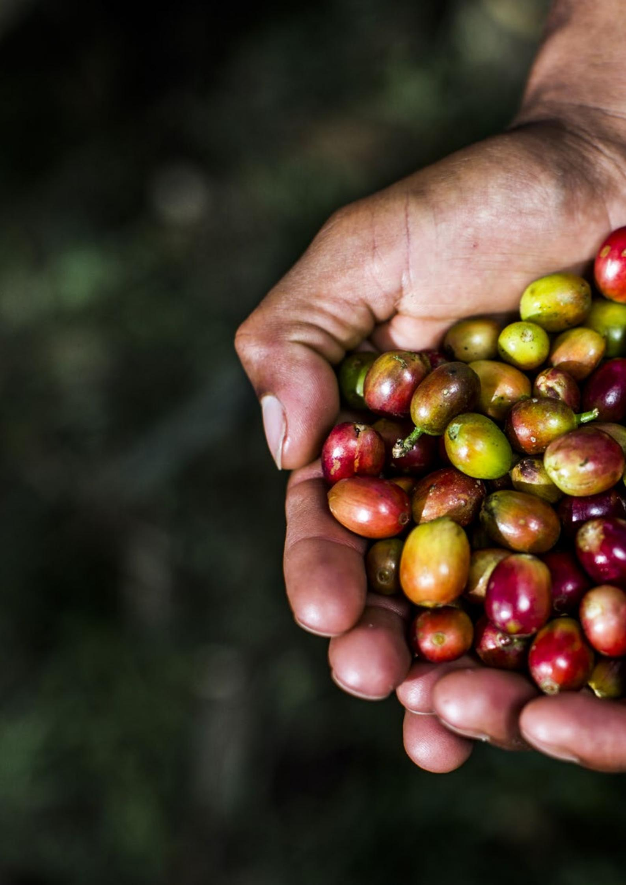

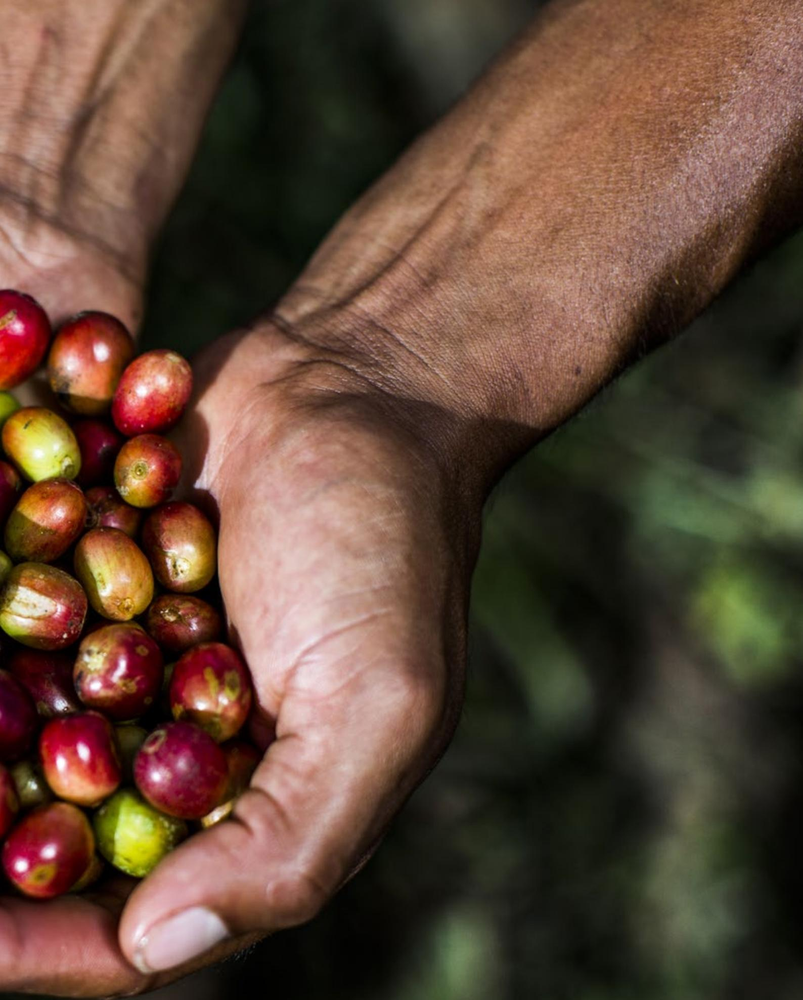

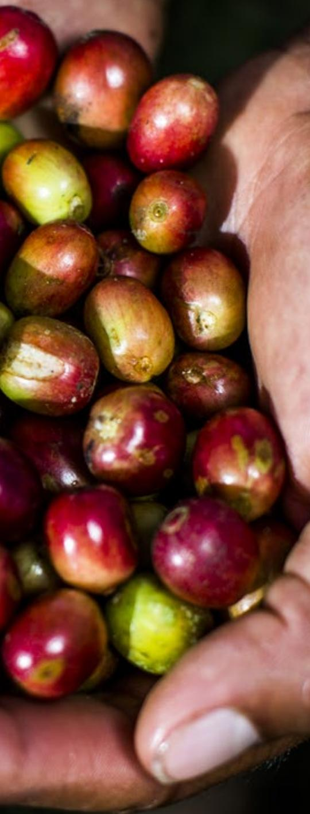

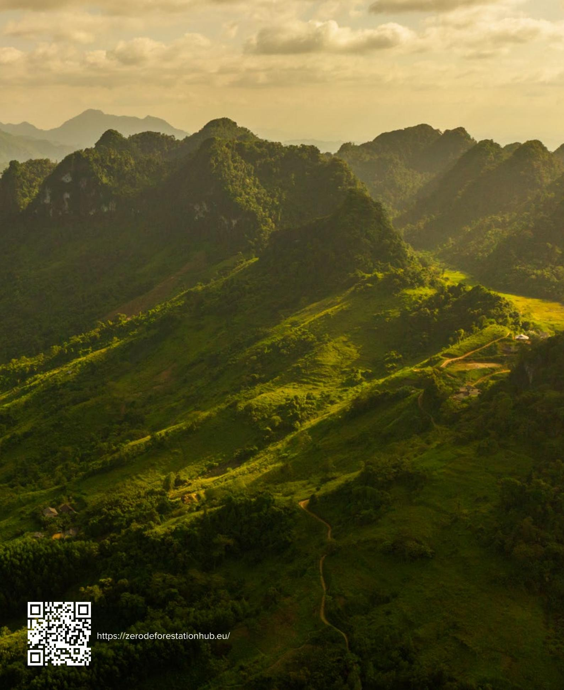

<https://zerodeforestationhub.eu/>

\*\*\*  
**Global**  
\*\*Gateway

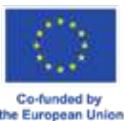

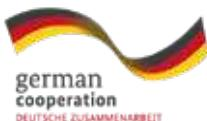

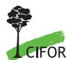

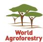