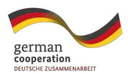

# **Discussion Paper on the links between EUDR and Land Rights**

**By Dr. Heidi Feldt, on behalf of the project Sustainable Agriculture for Forest Ecosystems (SAFE), GIZ. December 2024**

## **Table of Contents**

| Introduction                                                     | 3  |
|------------------------------------------------------------------|----|
| What does the EUDR require in terms of legality?                 | 4  |
| Land rights                                                      | 6  |
| Why are land rights so important to combat deforestation?        | 7  |
| What are the main risks related to land tenure?                  | 8  |
| Main aspects of legality regarding land rights according to EUDR | 10 |
| Risk assessment regarding land rights                            | 11 |
| Legality of land use rights :                                    | 12 |
| Indigenous Peoples’ Rights                                       | 15 |
| Land, Gender and Intersectionality                               | 18 |
| Land Disputes and Conflict                                       | 19 |
| Human Rights situation of land right defenders                   | 21 |
| Conclusions and Final Remarks                                    | 23 |

# Introduction

The European Union's Regulation on Deforestation Free Products (EUDR) allows cocoa, coffee, palm oil, rubber, soy and timber, and some of their byproducts, to be sold in the European Union (EU) only if they were not produced on land that was deforested after 31 December 2020. Through this regulation, the EU aims to reduce its deforestation footprint. **The EUDR requires traceability of products to prove they weren't produced on previously deforested land, and requires legality of production** - including land rights, indigenous peoples' rights and human rights, in accordance with the legal frameworks of the country of production. As well as reducing the EU's carbon footprint, the regulation also addresses the social impacts of deforestation, such as the displacement of communities and the violation of indigenous peoples' rights.

Understanding land rights is essential for grasping the broader implications of the EUDR. The regulation's focus on combating deforestation and promoting sustainable value chains intersects with issues of land tenure and land use. **In many regions, efforts to comply with the EUDR can have significant impacts on local communities and their land rights.** For instance, measures to ensure deforestation-free commodities may involve changes in land use practices, land acquisitions, or restrictions on land access, all of which can affect the land rights of indigenous peoples and local communities. Therefore, a thorough comprehension of both topics is critical for fostering a more equitable and sustainable global economy.

This discussion paper on EUDR and Land Rights aims to subsidize the understanding of the relationship between land rights and EUDR compliance, with emphasis how the EUDR presents opportunities in advancing the land rights agenda in producing countries. It is based on interviews with stakeholders from Vietnam, Ecuador, Ethiopia, Ivory Coast and Brazil and on the experiences from German Development Cooperation.

## What does the EUDR require in terms of legality?

The intersection of the EUDR and land rights presents a multifaceted landscape, where regulatory objectives meet the realities of local land use and tenure systems. **Understanding how these two domains interact is crucial for creating policies and practices that are both effective in combating deforestation and respectful of the rights and needs of local communities and indigenous peoples.**

The regulation places significant emphasis on the traceability and transparency of supply chains, requiring businesses as part of their due diligence systems, to demonstrate that their products are deforestation-free and legally produced. The process involves, among others, gathering information about the risks associated with land tenure and land use in the regions where commodities are produced. **Land tenure regimes in these regions are often complex and may include a mix of legal, customary, and informal arrangements.** Ensuring compliance with the EUDR requires understanding these regimes and associated situations, for example possible presence of land conflicts or ambiguities in how local population has access to specific land use rights.

**Moreover, the requirement for deforestation-free supply chains could lead to significant changes in land use practices and on how land rights are allocated.** For example, producers may shift their activities to comply with EUDR standards, potentially affecting local communities or altering traditional land management systems. Such shifts can exacerbate existing land rights issues, particularly in areas where land tenure regimes are not clearly defined or where customary land rights are not formally recognized or documented. These changes can lead to conflicts between different land users, including local communities, indigenous peoples, and commercial entities.

According to EUDR, operators must be aware of the legislation in producing countries and take into consideration:

*'relevant legislation of the country of production' means the laws applicable in the country of production concerning the legal status of the area of production in terms of:* 

*(a) land use rights;* 

*(b) environmental protection;* 

*(c) forest-related rules, including forest management and biodiversity conservation, where directly related to wood harvesting;* 

*(d) third parties' rights;* 

*(e) labour rights;* 

*(f) human rights protected under international law;* 

*(g) the principle of free, prior and informed consent (FPIC), including as set out in the UN Declaration on the Rights of Indigenous Peoples;* 

*(h) tax, anti-corruption, trade and customs regulations.['](#page-4-0)*1

Although Human Rights provisions are not as strongly integrated into the regulation as demanded by Indigenous Peoples and Human Rights Organisation2 [,](#page-4-1) they are part of a broader set of international regulations and standards. These regulations and standards include the [United Nations Guiding Principles on Business and Human Rights,](https://www.business-humanrights.org/en/big-issues/un-guiding-principles-on-business-human-rights/) the [OECD](https://mneguidelines.oecd.org/mneguidelines/)  [Guidelines for Multinational Enterprises,](https://mneguidelines.oecd.org/mneguidelines/) the [EU Directive on Corporate Sustainability Due](https://eur-lex.europa.eu/eli/dir/2024/1760/oj)  [Diligence](https://eur-lex.europa.eu/eli/dir/2024/1760/oj) (CSDDD), [the Directive on Corporate Sustainability Reporting](https://eur-lex.europa.eu/legal-content/EN/TXT/PDF/?uri=CELEX:32022L2464) (CSRD) - **all of them require human rights due diligence along the value chain from companies including operators and traders as defined in EUDR.** [3](#page-4-2)

1 REGULATION (EU) 2023/1115 OF THE EUROPEAN PARLIAMENT AND OF THE COUNCIL of 31 May 2023 on the making available on the Union market and the export from the Union of certain commodities and products associated with deforestation and forest degradation and repealing Regulation (EU) No 995/2010, Art. 2, (40)

2 See, for example[, https://www.earthsight.org.uk/news/analysis-EU-CSDDD-due-diligence-law-indigenous-rights](https://www.earthsight.org.uk/news/analysis-EU-CSDDD-due-diligence-law-indigenous-rights)

3 Art. 2 (15) 'operator' means any natural or legal person who, in the course of a commercial activity, places relevant products on the market or exports them - (17) 'trader' means any person in the supply chain other than the operator who, in the course of a commercial activity, makes relevant products available on the market.

## Land rights

Land rights refer to the relationships individuals or communities have to land. These rights can include the ability to use, control, and transfer land. They encompass a variety of legal, customary, and cultural dimensions, reflecting the diverse ways in which land is held and managed. **Secure land rights are critical for the well-being and development of societies, as they provide a foundation for economic stability, food security, and social identity.**

The different types of land rights have unique characteristics and implications. **Customary land rights** are often based on traditional practices and norms that have been established over generations. These rights are typically recognized and respected within local communities, although they may not always be formally documented or acknowledged by national legal systems.

**Statutory land tenure**, on the other hand, refers to land rights that are formally recognized and protected by national laws and regulations. These rights are usually officially documented through for example land certificates, titles or deeds, providing landowners with a clear and enforceable claim to their property. However, the process of obtaining legal land tenure can be cumbersome, may take long, and may exclude marginalized groups who lack the resources or knowledge to navigate bureaucratic systems.

**International frameworks and conventions play a crucial role in promoting and protecting land rights globally.** An important framework is the [Voluntary Guidelines on the Responsible Governance of Tenure \(VGGT\)](#), which were endorsed by the Committee on World Food Security in 2012. The VGGT provides comprehensive guidance on improving land tenure governance, addressing issues such as land tenure security, equitable access to land, and the protection of land rights for vulnerable and marginalized groups. These guidelines encourage states to adopt policies and practices that promote responsible land governance and support the realization of land rights for all.

With respect to Indigenous Peoples, the [ILO Convention 169 on Indigenous and Tribal Peoples](#) acknowledges the rights of indigenous peoples to their territory.4 Another important provision is the [United Nations Declaration on the Rights of Indigenous Peoples \(UNDRIP\)](#), which was adopted in 2007. This declaration underscores the need to respect and protect the land rights of indigenous peoples, who often face significant threats from infrastructure projects, resource extraction, and land grabbing. UNDRIP recognizes the rights of indigenous peoples to their lands, territories, and resources, and emphasizes the importance of obtaining their free, prior, and informed consent (FPIC) for any activities that may affect their lands.

The lack of consideration for the intersectional characteristics of smallholders and indigenous communities in international frameworks often results in women being marginalized in terms of access to land rights and participation in decision-making processes. **An intersectional approach5 is essential to address these challenges and ensure more equitable solutions.**

## Why are land rights so important to combat deforestation?

The importance of land rights extends beyond individual ownership and usage. Secure land rights are integral to achieving sustainable development goals, as they underpin various aspects of economic, and social development, as well as environmental protection.

**Economically**, land rights provide a basis for investment and development, for long-term planning and for improving agricultural productivity. **Socially**, land rights contribute to the empowerment and resilience of individuals and communities, especially women. And **environmentally**, secure land tenure encourages responsible land management practices that can help conserve ecosystems and biodiversity. Landowners can have

---

4 ILO Convention 169 Art. 14 81) “The rights of ownership and possession of the peoples concerned over the lands which they traditionally occupy shall be recognized. In addition, measures shall be taken in appropriate cases to safeguard the right of the peoples concerned to use lands not exclusively occupied by them, but to which they have traditionally had access for their subsistence and traditional activities. Particular attention shall be paid to the situation of nomadic peoples and shifting cultivators in this respect.”

5 Intersectionality refers to ways in which different and overlapping aspects of a person’s identify reinforce each other mutually and lead to greater marginalization and discrimination of a person. Such inequality can be based on gender, race, ethnicity, sexual orientation, disability, class, age which together create a unique dynamic.

access to long-term incentives to invest in agroforestry, reforestation and soil conservation, which help reduce deforestation. Furthermore, **land rights are crucial for combating deforestation as they help communities to resist encroachment by external actors, who may have interests in clearing forests for commercial purposes.**

From a **policy** perspective, clear land rights can lead to better enforcement of laws and policies against illegal deforestation. **When land boundaries are well defined and recognised by the authorities, it becomes easier to monitor and penalise activities such as illegal logging or land clearing for agriculture.** Clear land rights also help resolve and prevent conflicts over land that might otherwise lead to destructive practices, including deforestation. When land disputes are minimised, land and ecosystems are less likely to be degraded in the process.

## What are the main risks related to land tenure?

The risks associated with land tenure are diverse and significant, impacting producers, local communities, indigenous populations, and the environment. **Without clear land rights, forests are more vulnerable to land grabbing,** where powerful actors unlawfully seize land for activities that often lead to deforestation, such as illegal logging and agricultural production as well as land speculation. This often occurs at the expense of local families, communities and indigenous peoples, leading to displacement, loss of livelihoods, and social conflicts. In Brazil, for example, land grabbing is particularly prevalent in the Amazon region, where land users and agribusinesses encroach on public and indigenous lands, causing conflicts and undermining efforts to formalize land tenure. The strategies of the Brazilian government for securing land rights helps prevent these practices by providing legal protection to rightful land users or owners.

Another prevalent risk is **superposition or overlapping land rights and land use interests.** This occurs when multiple claims are made on the same piece of land, leading to conflicts and legal uncertainties. Factors contributing to this issue include inaccurate or poorly managed land registries, conflicts between traditional and formal land ownership systems, and overlapping land concessions. These situations can result in legal disputes, disruption of community land use, and heightened tensions between different stakeholders.

A further legal and ethical concern is the **granting of land concessions without Free, Prior, and Informed Consent (FPIC)**. FPIC is a specific right that pertains to indigenous peoples, ensuring they are given adequate information and the opportunity to give or withhold consent before any project affecting their territories is approved. Disregarding FPIC violates the rights of indigenous peoples, leading to cultural erosion and potential conflicts between project developers and local communities.

**In the coming years, it will be important to observe and monitor the land market dynamics in the regions affected by the EUDR**, as this could lead to a reduced availability of land that was deforested before 2020 and is suitable for agricultural or commercial use. This scarcity could drive up the price of existing deforested land, especially if demand for agricultural expansion remains strong. If forested land becomes more protected as a result of the EUDR, its value could stabilise or even increase in cases where conservation or carbon offset markets play a role. This would depend on the development of such markets and policy incentives. **The risk that the EUDR will increase land prices for deforested land and decrease prices for forested land needs to be analysed on the basis of actual transaction data.** The dynamics are likely to be influenced by several factors, such as market reactions, regional policy interventions and the development of alternative land use incentives. Despite its importance, this issue remains underexplored and requires further research.

Finally, **human rights violations** are a critical concern in the context of land tenure. Land is a highly contested issue, and those defending the land rights of marginalized groups often face scrutiny and threats. These defenders are crucial in protecting the rights of communities against unlawful interests, making the protection of their rights and safety a top priority.

## Main aspects of legality regarding land rights according to EUDR

According to EUDR operators must provide the following information:

*“Art.9 (1). **Operators shall collect information, documents and data** which demonstrate that the relevant products comply with Article 3. For this purpose, the operator shall collect, organise and keep for five years from the date of the placing on the market or of the export of the relevant products the following information, accompanied by evidence, relating to each relevant product:*

*[...]*

*(h) adequately conclusive and verifiable information that the relevant commodities have been produced in accordance with the relevant legislation of the country of production, including any arrangement conferring the right to use the respective area for the purposes of the production of the relevant commodity.”*

Art. 10 requires a **risk assessment** which should in particular analyse if indigenous peoples are affected (Art.10, (c), if they have been consulted (d) and if “duly reasoned claims by indigenous peoples based on objective and verifiable information regarding the use or ownership of the area used for the purpose of producing the relevant commodity” exist (e).

Furthermore, the risk assessment should include whether there are “concerns in relation to the country of production and origin or parts thereof, such as level of corruption, prevalence of document and data falsification, lack of law enforcement, violations of international human rights, armed conflict or presence of sanctions imposed by the UN Security Council or the Council of the European Union” (h). Although this does not require a full risk analysis, it makes sense for companies to carry one out for two main reasons: a) to meet the requirements of EUDR, CSDDD and CSRD and b) to contribute to sustainable commodity production.

If third parties consider that operators are not complying with the regulation, EUDR contemplates “substantiated concerns” referring to credible and well-founded claims or allegations that a particular product, or a part of the supply chain associated with that

product, may not be following EUDR's requirements. These concerns might be for example:

- A credible NGO report alleging that a palm oil plantation, which supplies oil to a European company, was established on illegally deforested land, or
- Documented evidence that indigenous communities' rights were violated during the acquisition of land used for cocoa production, without Free, Prior, and Informed Consent (FPIC), or
- Satellite imagery showing recent deforestation in areas that are supposed to be protected under the EUDR, indicating non-compliance with the regulation's requirements.

In case concerns are submitted, competent authorities shall, "*diligently and impartially assess the substantiated concerns, including whether the claims are well-founded, and take the necessary steps, including carrying out checks and conducting hearings of operators and traders, with a view to detecting potential non-compliance with this Regulation and, where appropriate, taking interim measures under Article 23 to prevent the placing or making available on the market and export of relevant products under investigation*" (Art.31 (2)).

# Risk assessment regarding land rights

**This chapter discusses how various risks may be related to land tenure and indigenous rights in the context of the EUDR.** It is divided into several sub-sections, each addressing specific considerations related to land and human rights.

Each section begins with key questions to explore examples from different countries that illustrate the challenges related to the risk factors, followed by possible mitigation measures.

None of these sections is intended to be exhaustive, but rather to present possible pathways and to stimulate further reflection and discussion.

## Legality of land use rights**:**

### **Key questions to explore:**

- What are the relevant **legal frameworks** governing land tenure and land use rights in the sourcing regions and which ones fall under the scope of EUDR?
- Are there **legally recognized land rights**, and how are they enforced?
- Are there **customary land tenure regimes** and how are they recognized and documented?
- What **documentation** exists or is required to prove and verify legitimate land tenure or use rights in the areas where the commodities are sourced?
- Are there any **international norms or agreements** to consider?
- Are there any **third-party rights** to be considered, for example those held by local communities and indigenous populations?
- Are there any **land use restrictions** for example those associated to protected areas?
- Is there any evidence related to **land grabbing**?
- Is there evidence of **corruption** occurring in the process of land allocation and in land transactions?

### **Examples:**

Land tenure systems are very diverse. In **Vietnam and Ethiopia** land belongs to the state. In Vietnam, the Land Law of 2013 and subsequent amendments have facilitated the issuance of land use certificates (LURCs) to small-scale farmers. By 2022, over 85% of coffee farmers in Dak Lak province had received LURCs, providing them with legal recognition of their land. However, land tenure of tribal peoples in the highlands is not completely determined.

In **Ethiopia**, the situation is much more complex as the main coffee producers are very smallholder farmers who are not formally recognized.

The complexity of land rights is especially evident in the case of **Ivory Coast**. The historical context of land rights is deeply intertwined with the country's colonial history, post-independence policies and the civil war. During colonial times, the French introduced a formal land tenure system stooled on French law that often disregarded customary land use rights but focused on inalienable land titles. The colonial

administration expropriated large tracts of land for plantation agriculture displacing local communities.

After independence, the government declared all unregistered land as state property and created very complex and expensive procedures to officially register land titles, which according to the constitution are only for Ivorians. Many farmers operate on land under customary systems that are not formally recognized by the state. Large-scale internal and international migration, especially into the forested southern regions, led to tensions between local communities and migrants over land ownership and use. Civil war (2002-2007 and 2010/11) connected to ethnic tension and conflict over whether land can also be owned by non-Ivorians exacerbated existing land disputes.

**Today, Ivory Coast is the largest cocoa producer in the world, however, only 4% of the agricultural land has a certificate. Land use contracts often remain unclear.** Land reforms since 1998 have improved the position of non-Ivorians with a focus on land certificates instead of titles in the rural domain. Although the current land law of 2015 and 2019 forest code recognize that landowners are also owners of the trees planted on that plot of land (and this right can be transferred under a land use agreement), conflicts often persist on who is entitled to which form of land use or ownership documentation since historic sales, lease or rent agreements made generations ago were unclear, unwritten and witnesses are no longer alive. This kind of land and tree tenure insecurity might hamper EUDR compliance.

In Ivory Coast rural production (and deforestation) is legal, unless it takes place in a national park, reserve or classified forest. The process of confirming the boundaries of classified forests is ongoing, but **the industry has been excluding (legal) farmers from their supply chains if there is a risk they may be sourcing in or too close to classified forests. This has a massive impact on already fragile livelihoods and drives them into the arms of less scrupulous traders** who do not export to the EU and therefore care less about deforestation, possibly acerbating the problem as farmers will want to produce more if they can't sell their cocoa at premium prices to premium markets, such as the EU.

The Ivorian government aims to accelerate the formalization process aiming at 1.000.000 land tenure documents over the next 5 years. The goal, described in the national strategy, to cover the entire territory is ambitious and would take too long to serve as a proof for EUDR compliance. Alternative solutions must be explored, for instance, cocoa farmers in Ivory Coast could benefit from a connection between land tenure registration by the rural land rights agency (AFOR) and their registration as an official producer with

the marketing board. The **Conseil du Café-Cacao** is issuing official ID-cards, providing a fast-track approach to secure land rights, achieve social peace and improve economic stability, on top of the aim of improving traceability of sustainable production.

In **Brazil** the distribution of land is very unequal by international standards. While 1.38% of landowners own 61% of the arable land, 78% own only 9% of the land. In addition, small farmers and traditional communities often live on less fertile and insecure land. Land grabbing is widespread, facilitated by unclear ownership structures and corruption. **Despite the current government's efforts to distribute public land to smallholder farmers and revitalize agrarian reform, land encroachment, particularly of public lands, is a prevalent issue.** The profitability of agribusiness has intensified competition for land, making it difficult for small farmers to maintain control over the plots they were granted under the agrarian reform policy. As a result, distinguishing between legally owned land and illegal encroachments has become increasingly difficult.

### **Mitigation measures and the role of key stakeholders:**

It is the responsibility of the state to strengthen and enforce the legal framework for land tenure by addressing individual and collective rights, restrictions and responsibilities. **Governments** can improve legal security through documentation and registration of land rights, as well as through clear adjudication approaches, for example through long-term leases and user agreements, titles, deeds or any kind of certificate which may be appropriate in a given context. Digitising land records through modern surveying and land information management methods, ensuring regular updates, and integrating traditional/customary land tenure systems with formal registries will help improve the transparency and quality of land administration and ultimately land governance as a whole.

**Private and financial sector** should apply international guidelines such as the [Principles for responsible investment in agriculture and food systems](#) and promote sustainable agricultural value chains that respect legitimate land rights of producers and indigenous and local communities.

**Civil Society Organisations** perform an important role in monitoring conflicts and facilitating multi-stakeholder dialogue processes and may play a crucial role in the dissemination of information, facilitating knowledge exchange, and in supporting producers and local communities with technical advice and training.

**Development cooperation** contributes to securing land rights for the rural population through collaboration with partner countries leading to improved procedures, institutional and technical development as well as supporting producer countries to accelerate digitization and the construction of public data infrastructure. In addition, development cooperation can promote the participation of civil society and the implementation of multi-stakeholder processes regarding responsible land policy and support improvement of framework conditions for responsible private agricultural investment through awareness-raising and dialogue activities. For some specific examples please refer to the publications related to the [Global Programme Responsible](https://landportal.org/community/programmes/global-programme-responsible-land-policy)  [Land Policy.](https://landportal.org/community/programmes/global-programme-responsible-land-policy)

## Indigenous Peoples' Rights

**EUDR emphasizes the importance of respecting the rights of indigenous peoples and local communities**. Before any land-related projects are initiated, it is essential that the principles of Free Prior Informed Consent (FPIC) are applied. This means providing communities with all necessary information about the project, allowing them to participate in decision-making, and securing their consent. This practice not only upholds human rights but also helps preventing conflicts.

## **Key questions to explore:**

- Are there **indigenous or local communities** present in the area of interest and how are their rights recognized by statutory and/or customary systems?
- Is there a **clear demarcation** of their territories?
- Are there any overlapping interests or **potential land conflicts**?
- Is **FPIC a legal requirement** in the producing country and how is it applied? Are there any experiences in the implementation of FPIC in the country?
- Are there any **indigenous peoples' organizations** with which the private sector could collaborate? What are the ofocial procedures or approaches for dialogue and collaboration?

**FPIC** is a principle that is particularly significant in the context of Indigenous peoples' rights, as well as in international law, human rights, and environmental policy. **FPIC is based on the idea that Indigenous peoples have the right to give or withhold consent to projects that may affect their lands, territories, or resources.**

**Free**: The consent must be given voluntarily, without coercion, intimidation, or manipulation.

**Prior**: The consent should be sought sufociently in advance of any authorization or commencement of activities, with time for the community to consider and deliberate on the project.

**Informed**: The people involved must have all the necessary information regarding the nature, scope, duration, and impacts of the proposed project, as well as the potential risks and benefits.

**Consent**: The community has the right to say yes or no to a project, and their decision must be respected. This includes the possibility of setting conditions or requiring changes to the proposal.

FPIC is recognized in various international instruments, such as the United Nations Declaration on the Rights of Indigenous Peoples (UNDRIP) and is increasingly being integrated into the policies and practices of governments, corporations, and international organizations. It is important to note that FPIC is not a single consultation effort but an ongoing process including the implementation and monitoring of agreed decisions. Numerous guidelines exist supporting the implementation of FPIC[.](#page-15-0)6

## **Example:**

**Ecuador** is a significant producer of cocoa and coffee, both of which are crucial to the livelihoods of many small-scale farmers and indigenous peoples and local communities. Approx. 360.00 ha of Cocoa cultivated by approx. 90.000 farmers. Cocoa production generally occurs in areas with relatively better-defined land tenure compared to coffee.

- [UNDP \(2022\) SES Supplement Guidance: FAQ on Applying FPIC](https://ses-toolkit.info.undp.org/sites/g/files/zskgke446/files/SES%20Document%20Library/Uploaded%20October%202016/FINAL%20FPIC%20FAQ%20Guidance%20-%20June%2015%202022.pdf)
- [FAO Technical Guide Respecting FPIC](https://openknowledge.fao.org/server/api/core/bitstreams/d56dd997-62f2-4f5f-bf47-f28b5da6ac35/content)
- [UN-REDD Programme Guidelines on FPIC](https://www.uncclearn.org/wp-content/uploads/library/un-redd05.pdf)
- [Roundtable on Sustainable Palm Oil FPIC Guide](https://rspo.org/wp-content/uploads/RSPO-Free-Prior-and-Informed-Consent-FPIC-Guide-2022_RSPO-GUI-T08-002-V2-ENG.pdf)

For an example refer to:

Coffee is often grown in more remote and mountainous regions where land rights are more complex and less documented. Indigenous communities rely on agroforestry practices known as “chacra,” which are integral to their cultural identity and sustainable land management.

**Conflicts frequently arise when large-scale agricultural projects or extractive industries encroach on indigenous lands.** These conflicts are exacerbated by the lack of formal land titles for indigenous communities and the government's granting of land concessions without FPIC of the affected communities. EUDR's requirements could intensify these conflicts if cocoa producers, seeking to comply with the regulation, expand into indigenous territories without resolving land disputes.

### **Mitigation measures:**

**Governments** should ensure that FPIC is applied and documented before any land-related projects affecting indigenous territories, for example land concessions, take place. This should include providing all relevant information about the project, allowing sufficient time for communities to evaluate the implications, and respecting their decision to consent or withhold consent. Governments should also secure the rights of indigenous peoples to their ancestral territories.

**Private sector** should be aware of cultural practices, location, rights and legal status of indigenous peoples and their territories. If appropriate, personal in contact with indigenous peoples should be trained to conduct culturally sensible dialogue and collaboration. Private sector actors can also provide legal support to indigenous communities to help them navigate the complexities of both national and international legal frameworks that affect their land rights.

**Financial sector** should be aware and require the application of FPIC in the decision-making processes regarding investments.

**Civil Society Organisations** should advocate for the recognition of customary land rights and rights of indigenous peoples to their territories within national legal systems and facilitate dialogue between different stakeholders to prevent disputes or cases of non-compliance with EUDR. In the case of substantiated concerns regarding non-compliance with EUDR, civil society organisations can support the affected communities in bringing this to the attention of the relevant authorities for further investigation and triggering resolution mechanisms.

## Land, Gender and Intersectionality

### **Key questions to explore:**

- How do **existing legal and customary frameworks** in producer countries address the land rights of women and other disadvantaged groups? What are the underlying **social norms** which determine land rights of women and other disadvantaged groups such as youth and indigenous people?
- What are the **potential impacts of EUDR**-driven land use changes on women's access to land and natural resources, and how can these impacts be mitigated?
- What are the **social implications** of EUDR-driven changes in land use for women and other disadvantaged groups, particularly in terms of access to resources, social status, and community roles?
- How are women and other **disadvantaged groups** such as youth and indigenous peoples included in stakeholder consultations and decision-making processes?
- **What experience exists** to empower women?
- Do other **(overlapping) aspects of a person's identity** (e.g. gender, race, ethnicity, sexual orientation, disability, class, age) reinforce each other and therefore lead to greater marginalization and discrimination of certain people in terms of access to land rights?

## **Examples:**

In **Ivory Coast**, land ownership is predominantly controlled by men due to traditional customs and legal barriers, leaving women with limited formal rights to land. **Women often access land through their husbands or male relatives, and their land use rights are typically informal and insecure.** This lack of formal land tenure can make it challenging for women to benefit from agricultural development programs or comply with international regulations like the EUDR.

In **Ethiopia**, land is owned by the state, and women's access to land is often mediated through male relatives. Although recent reforms have aimed to improve women's land rights, many women still face significant barriers in obtaining land certificates. **Women's roles in agriculture, particularly in coffee production, are critical, yet their lack of formal land rights can marginalize them in the EUDR compliance process.**

In **Vietnam**, although the law recognizes equal land rights for men and women, in practice, women often face challenges in accessing and controlling land. **Many land use rights certificates (LURCs) are issued in the names of male household heads, leaving women with limited control over land and agricultural decision-making**. This inequality can impact their ability to comply with EUDR requirements, as women farmers may struggle to demonstrate the legal status of the land they cultivate.

## **Mitigation measures:**

**The Private Sector** can support programmes that aim at recognizing the land rights of women and other disadvantaged groups to ensure that they are not excluded from EUDR-compliant supply chains. In addition, they can support capacity building and training programs that empower women regarding their rights and the requirements of the EUDR could empower them to engage in legal processes and secure their livelihoods.

**Governments** should promote gender-sensitive land registration programs aimed at helping women obtain land certificates or titles, including for example offering subsidies or legal assistance to navigate the bureaucratic process.

**Civil Society Organisations** can advocate for legal reforms and changes in national and local laws to strengthen land rights for women and marginalized communities. They can also provide access to legal and technical assistance for women and other disadvantaged groups to help them navigate complex legal systems and secure their land rights. Additionally, they can promote the construction of alliances and coalitions with other organizations, such as women's groups, indigenous rights groups, and environmental organizations, to strengthen advocacy efforts.

## Land Disputes and Conflict

## **Key questions to explore:**

- Are there **overlapping interests or land rights' claims** in the area? If so, what are the available mechanisms to solve these?
- Are there **ongoing or historical land disputes** in the sourcing areas? What are the potential risks of these disputes impacting the supply chain?

- Are there land use disputes between **refugees and internally displaced people and local population?**
- Have communities **been forcibly removed** from their homes and lands to make way for plantations, logging operations, or other commercial enterprises?
- Did deforestation-induced environmental degradation forced people to migrate, becoming **environmental refugees** or internal displaced peoples?
- Does **corruption** or unequal **power relations** play a role in conflict resolution?

### **Examples:**

In **Ivory Coast**, land disputes between migrant farmers and local communities have been a source of tension for decades. The implementation of EUDR could exacerbate these conflicts if land tenure is not clearly defined and respected.

Land conflicts in **Vietnam** often arise from the unclear or overlapping land rights, particularly in areas where forest land has been converted into agricultural land. This is especially true in the Central Highlands, where ethnic minority groups have customary land rights that are not always recognized by the state

In **Ethiopia**, land disputes often stem from the lack of formal land titles, overlapping claims, and the encroachment of agricultural expansion into forested areas. These disputes are particularly acute in regions like Oromia, where coffee is a major crop, and where both local communities and commercial interests compete for control over land. Additionally, conflicts can arise between different ethnic groups over land use rights, further complicating the situation.

## **Mitigation measures**

**Companies, governments, and civil society can collaborate to establish multistakeholder initiatives** that enhance transparency, dialogue, traceability, responsible sourcing practices and ultimately also conflict resolution. These efforts can be supported by Development Cooperation and could address the root causes of land conflicts while ensuring that deforestation and human rights violations are minimized.

**Governments and private sector** can also implement transparent grievance mechanisms that allow communities and other stakeholders to voice concerns about land use, human rights abuses, or environmental harm. **Companies, with government**  **oversight**, **can establish fair processes** for addressing and resolving conflicts, while **Civil Society Organizations** can monitor land conflicts, facilitate resolution processes and provide advice on how land disputes can be resolved in a gender and intersectionality sensitive manner.

## Human Rights situation of land right defenders

According to the EUDR, EU member states shall "provide for measures to protect the identity of the natural or legal persons who submit substantiated concerns or who conduct investigations with the aim of verifying compliance by operators or traders with this Regulation." (Art.31, (4)) Furthermore, regional agreements like the [Regional](https://repositorio.cepal.org/server/api/core/bitstreams/7e888972-80c1-48ba-9d92-7712d6e6f1ab/content)  [Agreement on Access to Information, Public Participation and Justice in Environmental](https://repositorio.cepal.org/server/api/core/bitstreams/7e888972-80c1-48ba-9d92-7712d6e6f1ab/content)  [Matters in Latin America and the Caribbean](https://repositorio.cepal.org/server/api/core/bitstreams/7e888972-80c1-48ba-9d92-7712d6e6f1ab/content) (in short: Escazú Agreement) demand governments to protect the work of groups and individuals promoting environmental protection (Art.4, (6)). The EU adopted [guidelines on Human Rights Defenders](https://www.europarl.europa.eu/RegData/etudes/ATAG/2023/739386/EPRS_ATA(2023)739386_EN.pdf) (2004, revised 2008) to protect human rights activists in third countries.

## **Key questions to explore:**

- **Are people defending land rights at risk?**
- Do **corporate practices and governmental policies** in producer countries contribute to the threats faced by land rights defenders?
- What kind of **legal and political protection** are in place for land rights defenders, and how effective are they?
- What **international support and advocacy efforts** exist to protect land rights defenders, and how can they be strengthened?
- Are there any **experiences with human rights violations** in the sourcing areas and information on how these are handled?

## **Examples:**

In countries like **Brazil** or **Honduras**, land rights defenders have faced significant dangers, including assassinations, due to their engagement in the fight against land grabbing and deforestation. During first six months of 2023 in Brazil at least 11 people

were killed in land and resource conflicts in the Amazon.7 The government has taken steps to improve the situation, including removing policies that encouraged illegal mining in Indigenous territories. However, illegal mining and logging activities continue to threaten Indigenous lands and the defenders of those lands, leading to violent confrontations. **The application of the EUDR in these regions could support the protection of these individuals.**

## **Mitigation measures**

**Private sector companies** could actively engage with **civil society organizations** that have experience in working with land rights defenders to ensure that their concerns are heard and addressed. **Private sector companies** can also integrate considerations for the safety of land rights defenders into due diligence and risk assessment processes. This means identifying regions or supply chains where defenders are at risk and taking proactive steps to mitigate these risks. Additionally, they can establish and promote accessible grievance mechanisms to allow defenders and affected communities to report abuses anonymously and seek redress, allowing companies also to address potential issues before they escalate.

**Governments** should strengthen national autonomous human rights institutions and protect human and land rights defenders and create independent bodies to investigate incidents, ensuring accountability and justice. This would create a safer environment for defenders and align with broader international human rights commitments. This can also be supported by **Development Cooperation**, for example, through capacity development measures and institutional support of national human rights institutes.

**Civil Society Organizations** can maintain contact to and establish alliances with human rights or land rights organisations in the concerned countries. Following a thorough analysis of the situation, they can publicly report on human rights violations through coordinated use of diplomatic, legal, and media channels. CSOs can establish or support networks of local community members and provide training on how to monitor and report substantiated concerns about human rights violations. Furthermore, CSOs can

---

7 [Rights of Indigenous People, Afro-Descendant People, and Environmental Defenders](#)

organise and coordinate national and international campaigns that mobilise public engagement at the appropriate levels.

## Conclusions and Final Remarks

**By focusing on inclusive approaches, the EUDR can foster sustainable and just development for farmers, indigenous peoples and local communities.** The regulation's success will depend not only on its ability to reduce deforestation but also on its capacity to safeguard the rights and livelihoods of those most affected by land use changes.

**The EUDR highlights the need for robust land use systems that protect land rights.** This is a tremendous opportunity. Governments in producer countries, supported by international development cooperation, could prioritize the recognition of land tenure, particularly in regions where customary land rights are prevalent. **Digitization of land records and integration of traditional land ownership systems with formal registries can play a pivotal role in this effort.**

**The principle of Free, Prior, and Informed Consent (FPIC) should be applied** to ensure that indigenous peoples and local communities are actively involved in decision-making processes that affect their lands. At the same time, as the regulation is implemented, **it is essential to identify and address potential risks related to land disputes, forced evictions, and human rights violations.** Companies must conduct thorough risk assessments and engage in transparent, responsible practices that respect the rights of all stakeholders involved in the supply chain.

**Building capacities and multistakeholder collaboration and dialogue among local communities, civil society, governments, and businesses will be critical to the successful implementation of the EUDR** and will help aligning efforts towards common goals. The dynamic nature of land rights and deforestation issues requires continuous monitoring and the flexibility to adapt strategies as needed. Feedback mechanisms and regular assessments will be key to identifying and addressing unintended consequences early in the process.

**To support partner countries in the inclusive transition towards legal and deforestation-free value chains the EU and Member States launched the Team Europe Initiative (TEI) on deforestation-free value chains.** Through flagship projects and the knowledge platform "Zero Deforestation Hub" the TEI aims to enhance partnership and cooperation mechanisms among a variety of stakeholders. The **Zero Deforestation Hub** provides information for different stakeholders, including producer countries, companies, and civil society organisations on legal requirements and good practices of the operationalisation of the EUDR. Furthermore, it has the potential of deepening knowledge and approaches on cross-cutting topics, such as land tenure and strengthening human rights including indigenous peoples' and women rights and map, develop and disseminate knowledge around these topics through its library.

## Disclaimer

This publication was produced with the financial support of the European Union, the German Federal Ministry for Economic Cooperation and Development (BMZ) and the Ministry of Foreign Affairs of the Netherlands. SAFE is part of the Fund for the Promotion of Innovation in Agriculture (i4Ag) and implemented by Deutsche Gesellschaft für Internationale Zusammenarbeit (GIZ). The content of this publication is the sole responsibility of the author and does not necessarily reflect the views of the EU, the BMZ or the Ministry of Foreign Affairs of the Netherlands. The information in this publication, or upon which this paper is based, has been obtained from sources the authors believe to be reliable and accurate. While reasonable efforts have been made to ensure that the contents of this publication are factually correct, GIZ GmbH does not accept responsibility for the accuracy or completeness of the contents of this publication. The views expressed in this information product are those of the author(s) and do not necessarily reflect the views or policies of GIZ GmbH.