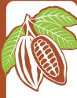
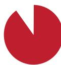
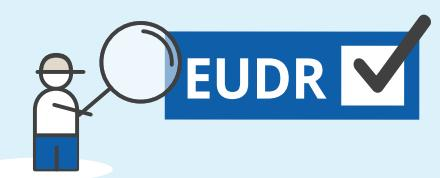
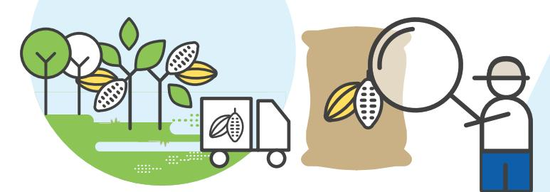
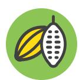

**90%of deforestation is driven by the expansion of agricultural land,** contributing to climate change, biodiversity loss, soil erosion and desertification, and hindering sustainable development

**Beans Shells**

**Butter, fat, oil**

**PowderChocolate**

**Paste**

CATTLE

The **EU Deforestation Regulation (EUDR)**  requires companies to ensure that the products they place on the EU market or export from it are **legal and not associated with deforestation** 

## **Unpacking the EU Deforestation Regulation for the cocoa sector**

COFFEE PALM OIL RUBBER SOYA WOOD Derived

products

Cocoa represents **7,5% of** 

**EU-driven deforestation EU**

**COCOA**

The majority of this cocoa comes from **West and Central Africa** (**72%**) but also from **Latin America and the Caribbean**  (**7%**) and **South East Asia** (**<1%**)

The EU is taking action to **minimise the risk that products associated with deforestation enter the EU market** and to increase the demand for deforestation-free products

**The EU imports 58%**

**of cocoa produced globally**

## **The EUDR does not create a country or product ban**

It is non-discriminatory and will apply to selected products, either those produced in, imported into or exported from the EU

**Operators** will have to **comply** with the **EUDR**  from **30 December 2024** (mid-2025 for micro and small entreprises)

The EUDR can accelerate progress towards **cocoa traceability and sustainability**

| To enter the EU, cocoa must be:                                                                                                                                                                          | Companies placing relevant products on the EU market must collect information showing:                                                                                                                                          |                                                                                                                                                                               |
|----------------------------------------------------------------------------------------------------------------------------------------------------------------------------------------------------------|---------------------------------------------------------------------------------------------------------------------------------------------------------------------------------------------------------------------------------|-------------------------------------------------------------------------------------------------------------------------------------------------------------------------------|
|  <b>TRACEABLE</b> <i>*GPS polygons for plots &gt; 4 ha</i>                                                                                    | 
The cocoa's origin (GPS information on plot*), suppliers and buyers
 
<i>*GPS polygons for plots &gt; 4 ha</i>
                                                                                                      | 
To be submitted in a due diligence statement
                                                                                                                           |
|  <b>DEFORESTATION-FREE</b> <i>Deforestation = conversion of forests into agricultural land, including cocoa-agroforestry systems</i> | 
That cocoa does not come from land deforested after <b>31 December 2020</b>
 
<i>Deforestation = conversion of forests into agricultural land, including cocoa-agroforestry systems</i>
                             | 
<i><b>What's a forest?</b></i>  <i>The regulation uses an internationally-agreed definition from the FAO</i>
  |
|  <b>LEGAL</b>                                                                                                                                        | 
Compliance with the relevant legislation of the country of production, including on land, environment, human rights, third parties' rights, the principle of free, prior and informed consent, labour, trade and customs
 |                                                                                                                                                                               |

| <b>Due diligence</b> for companies consists of <b>3 steps</b> : |                                                                              |                                     |
|-----------------------------------------------------------------|------------------------------------------------------------------------------|-------------------------------------|
| <b>1</b>                                                        | Collect evidence that the product is traceable, deforestation-free and legal | <input checked="" type="checkbox"/> |
| <b>2</b>                                                        | Assess risks of non-compliance                                               | <input checked="" type="checkbox"/> |
| <b>3</b>                                                        | If risks have been identified, take action to mitigate them                  | <input checked="" type="checkbox"/> |

**Disclaimer.** This factsheet has been produced by the European Forest Institute with the financial assistance of the European Union. The contents of this factsheet are the sole responsibility of the author and can under no circumstances be regarded as reflecting the position of funding organisations. The information presented in this factsheet comes from the EUDR published in the EU Official Journal on 9 June 2023.

Frequency of checks:

**1%**

**3%**

**9%**

Obligations:

**simplified**  due diligence**\***

full **3-step** due diligence process

full **3-step** due diligence process **EU**

Products from:

**STANDARD** risk areas

**HIGH** risk areas

**LOW** risk areas

**1.** Map GPS locations of deforestation-free cocoa plots

**2.** Deforestation-free cocoa delivered to first buyers, where it is kept segregated

**3.** Possible processing of deforestation-free cocoa into derived products

**4.** Deforestation-free cocoa or derived products segregated during export

**5.** Importer or manufacturer in the EU processes or packages deforestation-free cocoa or cocoa products

**6.** EU retailer sells deforestation-free chocolate to consumers

## **EU**

If companies buy cocoa from a **low-risk area,** they only need to carry out the **first step** (except if there are any doubts ñ then all 3 steps need to be undertaken) **\***

A **benchmarking system** will categorise countries or regions according to **deforestation risk.** The frequency of EU Member States' **checks will vary consequently:**

