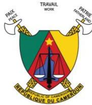
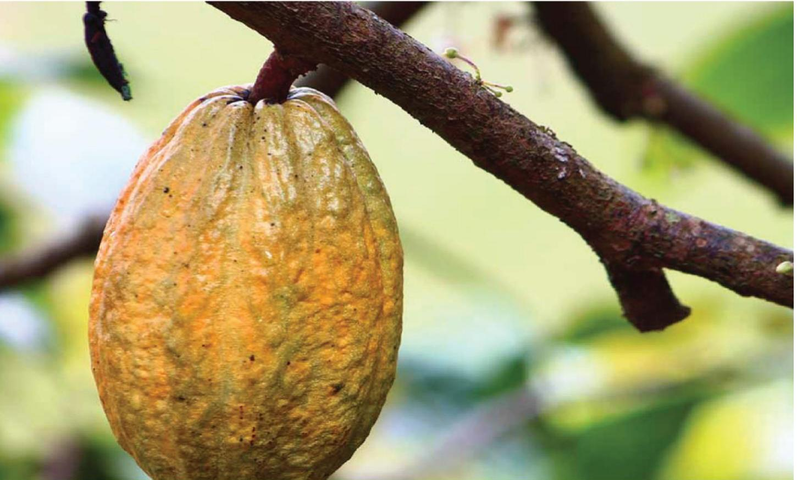
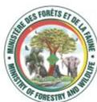
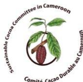
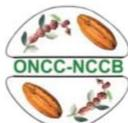
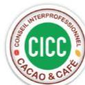
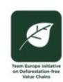
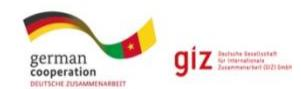
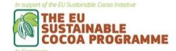

Support tool for due diligence on the legality of cocoa under the EUDR framework

# Module 1: Legal requirements relevant to cocoa in Cameroon

Version: July 2025

# **About this document**

Cameroon, under the aegis of the Sustainable Cocoa Committee and in partnership with the European Union Cocoa Programme, is implementing a series of actions ("Cocoa actions") aimed at supporting the achievement of national objectives for the sustainability of the sector and access to the European market. In 2024, Cameroon began developing tools to facilitate due diligence by operators within the framework of the EUDR.

The tool to support due diligence on the legality of cocoa meets operators' needs in terms of compliance with the legal framework of the country of production (see more detailed explanations in the introduction). It consists of two modules:

- 1. Cameroonian legal requirements relevant to cocoa production and trade in Cameroon in the context of the EUDR;
- 2. Recommendations for cocoa compliance verification and risk management, including through private certification, to support operators' due diligence.

This document (module 1) was developed by the European Forest Institute (EFI), with funding from the European Union's Sustainable Cocoa Programme (SCP), and under the aegis of Cameroon's Sustainable Cocoa Committee. It was produced with the technical support of a consortium of legal and due diligence experts, including TAMI International Consulting and Preferred by Nature, and with input from stakeholders in the cocoa supply chain in Cameroon.

This document may be updated as the Cameroonian legal framework evolves.

**Disclaimer.** This document has been produced with the financial assistance of the European Union. The views expressed herein can in no way be taken to reflect the official opinion of the European Union. This document is intended to support the efforts of the cocoa industry to comply with the requirements of the EUDR. Its content is indicative, not legally binding and does not constitute legal advice. No guarantee is given as to the accuracy, completeness or timeliness of the content. The authors of this report accept no liability for any damage or loss arising from the use of this document. The authors welcome all comments and suggestions for improvement.

# **Foreword by MINADER and MINCOMMERCE**

The cocoa sector holds a strategic place within the Cameroonian economy, owing to its substantial contribution to key macroeconomic aggregates. In 2024, the sector generated close to 1 trillion CFA francs in export revenues, thereby contributing to the reduction of the national trade deficit, the strengthening of foreign exchange reserves, and the enhanced integration of Cameroon into global value chains. Its favourable impact on rural employment generation and income growth for producers is equally evident.

The structural importance of the sector within the national economy deserves particular attention, especially in light of the growing challenges it encounters in export markets, notably those relating to sustainability, traceability, and compliance with international standards.

In this context, Cameroon has chosen to act both proactively and responsibly.

For example, Cameroon has undertaken the requisite measures, in partnership with the European Union, to bring the sector into compliance with the European Union's Deforestation Regulation (EUDR).

The development of this manual, dedicated *to due diligence on the legality of cocoa under the EUDR*, is part of this dynamic. It represents a concerted and rigorous effort led by sectoral administrations, stakeholders within the sector, civil society and technical and financial partners, notably the European Union. The manual identifies the legal and regulatory framweorks applicable to cocoa production and marketing in Cameroon and formulates recommendations for the implementation of due diligence with regard to the legality requirement for cocoa exported to the European market.

Beyond regulatory compliance, this work contributes to strengthening governance within the sector, safeguarding producers' livelihoods in a sustainable manner and consolidating Cameroon's strategic position in European markets, where sustainability requirements have become decisive.

We acknowledge with appreciation the commitment of all stakeholders who have contributed to this work.

Operators in the cocoa sector, as well as the competent authorities of the European Union, will find this manual a valuable tool to support the implementation of the EUDR.

Let us join efforts to ensure that Cameroonian cocoa is recognised a sustainable, legal and competitive product that fosters rural development and contribute to the economic prosperity of our country.

### **Gabriel MBAIROBE**

Minister of Agriculture and Rural Development

#### **Luc Magloire MBARGA ATANGANA**

Minister of Trade

# **Foreword by the Ambassador of the European Union to Cameroon**

Since the end of 2021, Cameroon and the European Union have been engaged in dialogue to make the cocoa sector more sustainable — economically, socially, and environmentally — and to facilitate access to the European market for Cameroonian cocoa.

This dialogue has given rise to a number of concrete initiatives, known as Cocoa Actions, which support Cameroon's efforts to produce more responsible cocoa. One key initiative is the identification of national regulations to help stakeholders in the cocoa value chain comply with European requirements.

It is in this context that I welcome the publication of this mapping of legal requirements relating to cocoa production and trade in Cameroon. This document is a valuable reference tool: it will enable actors across the sector to better understand the applicable rules, particularly those related to the new European regulation on deforestation (EUDR).

This work has been carried out with rigour, openness, and collective engagement. It has brought together all relevant stakeholders: public institutions, producers, cooperatives, companies, civil society, and technical and financial partners. I wish to pay particular tribute to the commitment of the Cameroonian authorities, and in particular the Ministry of Trade and the Ministry of Agriculture, for their leading role in this process.

I also congratulate all those who, through the Sustainable Cocoa Programme, have contributed technically to this important achievement.

This document will be a valuable resource for all those seeking to place Cameroonian cocoa and its derived products on the European Union's market in compliance with the new sustainability requirements. It will help strengthen transparency, legality, and sustainability within Cameroon's cocoa sector.

This initiative is a clear reflection of our shared ambition: to build a strong cocoa sector that respects the environment and benefits all. The European Union is proud to support Cameroon in this vital transition towards a greener and fairer economy.

### **Jean-Marc CHATAIGNER**

Ambassador of the European Union to Cameroon

# **Table of contents**

| About this document...........................................................................................................         | 2  |
|----------------------------------------------------------------------------------------------------------------------------------------|----|
| Foreword by MINADER and MINCOMMERCE.................................................................                                   | 3  |
| Foreword by the Ambassador of the European Union to Cameroon................................                                           | 4  |
| Table of contents                                                                                                                      | 5  |
| 1. Context............................................................................................................................ | 6  |
| The European Union deforestation regulation...............................................................                             | 6  |
| 2. Objectives and methodology..........................................................................................                | 7  |
| General approach                                                                                                                       | 7  |
| Methodology to identify relevant national requirements                                                                                 | 7  |
| Relevant legal requirements under the EUDR...........................................................                                  | 8  |
| Relevant legal requirements in the national context of cocoa production.................                                               | 9  |
| 3. List of relevant legal requirements for cocoa produced in Cameroon                                                                  | 9  |
| Category 1: Land-use rights                                                                                                            | 10 |
| Category 2: Environmental protection..........................................................................                         | 12 |
| Category 3: Third parties’ rights                                                                                                      | 16 |
| Category 4: Free, informed and prior consent (FPIC)                                                                                    | 17 |
| Category 5: Tax, anti-corruption, trade and customs regulations                                                                        | 18 |
| Category 6: Labour rights*............................................................................................                 | 20 |
| Category 7: Human rights*...........................................................................................                   | 23 |
| 4. Consultations carried out                                                                                                           | 26 |

# **1. Context**

# **The European Union deforestation regulation**

On 31 May 2023, the European Union (EU) adopted Regulation 2023/1115 on the placing on the EU market and export from the EU of certain commodities and products associated with deforestation and forest-risk commodity (EUDR). This regulation requires operators and traders importing forest-risk commodities into the EU to demonstrate that these products are traceable, deforestation-free and legal. The scope of application covers seven commodities: coffee, cocoa, rubber, palm oil, soy, cattle and wood, as well as derived products such as chocolate and cocoa paste. Entry into application is scheduled for 31 December 2025 (and 30 June 2026 for micro and small undertakings established as such before 31 December 2020).

Companies affected by the regulation (operators and traders) will be required to carry out "due diligence" prior to exporting or placing their products on the market, in order to gather sufficient information to ensure that the product carries no or a negligible risk of non-compliance. Consequently, operators placing cocoa or derived products on the EU market will have to ensure that these have been produced in accordance with the relevant legislation of the country of production (article 3), which is defined as concerning the legal status of the area of production. The EUDR takes a flexible approach, listing several areas of law without specifying particular legal instruments, as these differ from country to country and may be subject to change. These areas are [for agricultural commodities]:

- a) land-use rights
- b) environmental protection
- d) third parties' rights
- e) labour rights
- f) human rights protected by international law
- g) the principle of free, prior and informed consent, including as set out in the UN Declaration on the Rights of Indigenous Peoples
- h) tax, anti-corruption, trade and customs regulations

In this context, understanding the legislative framework of the country of origin, identifying the legal requirements relevant to the commodity concerned, and determining the means of verifying compliance with these requirements are a challenge not only for the operators responsible for due diligence, but also for the competent authorities in the European Union responsible for controls, as well as for the various stakeholders involved.

# **2. Objectives and methodology**

The tool to support due diligence on cocoa legality aims to:

- Identify all the Cameroonian legal requirements applicable to cocoa production and trade in Cameroon and relevant to the EUDR;
- Provide recommendations for verifying cocoa compliance and risk management, including through private certification, to support operators' due diligence.

This report presents the results of step 1.

### **General approach**

The objective of this approach is to promote a national and consensual vision of the legal requirements that apply to Cameroonian cocoa, in order to: i) support the harmonisation of operators' due diligence approaches; ii) encourage the simplification of procedures for upstream players in the supply chain likely to have to provide data to their customers; and iii) facilitate a better understanding of national contexts by the Competent Authorities of EU Member States in charge of controls.

**It is important to note that the results provided are not legally binding, do not impose any obligation on the relevant parties, and do not constitute legal advice**. It is the responsibility of operators placing cocoa or its derived products on the EU market to identify the relevant legal requirements within the meaning of article 2(40) of the EUDR, and to adapt their due diligence to the risks identified. The results of this study provide guidance that can support operators and other industry stakeholders in this direction.

In addition, these results are likely to evolve over time and be updated due to many factors: potential legal reforms in the country, evolution of public or private certification schemes, lessons learnt from the practical implementation of national due diligence recommendations (step 3), additional guidance provided by the European Commission or competent authorities, integration of best practices and technological advances, etc.

The tool is based on the work of national and international experts in law and due diligence, and on technical consultation with all the national and international players in the cocoa sector: government departments and ministries, exporters, traders and chocolate makers, cooperatives and producer associations, certification bodies, civil society organisations and importing countries in the European Union.

# **Methodology to identify relevant national requirements**

The first step of the work consists in mapping the relevant national legal requirements applicable to cocoa production and trade in Cameroon in the context of the EUDR.

#### Relevant legal requirements under the EUDR

The EUDR defines the legality of commodities according to two criteria:

- National legal requirements must concern the legal status of the area of production.
- Seven areas of law [for agricultural commodities] are concerned: 1) land-use rights; 2) environmental protection; 3) third parties' rights; 4) labour rights; 5) human rights protected under international law; 6) the principle of free, prior and informed consent, including as set out in the UN Declaration on the Rights of Indigenous Peoples; and 7) tax, anti-corruption, trade and customs regulations.

On October 2, 2024, the European Commission published a guidance document on the implementation of the EUDR, which interprets the provisions of the regulation on the legality criteria. This document proposes to address the relevance of legal requirements through the following criteria:

- Requirements must specifically impact or influence the legal status of the area of production
- Requirements must be linked to the objectives of the EUDR, i.e., halting deforestation and forest degradation in the context of the EU's commitment to address climate change and biodiversity loss.

Since all labour requirements, as well as certain human rights and third parties' rights, are not directly linked to the objectives of the EUDR, the question of whether they fall within the scope of application of the EUDR is debated.

On the other hand, this guidance would extend the scope of tax and anti-corruption legislation to downstream steps of value chains if these regulations contribute to combating deforestation. Similarly, trade and customs regulations would be relevant where they apply to in scope products, beyond the area of production.

It should be noted that the Commission guidance is not legally binding. As stated in the document itself, it does not replace, add to or modify the provisions of the EUDR, which sets out the legal obligations. Each EU Member State will adopt its own approach to control operators' compliance with the EUDR. Ultimately, only judges in each EU Member States have the power to interpret the regulation in a binding manner and determine the scope of the legality criterion.

Against this background, **this tool adopts a precautionary approach**. It considers all the areas of law listed in Article 2.40 and includes all requirements deemed relevant in these seven areas. In addition, it also covers requirements relating to taxation, anti-corruption, trade and customs beyond the area of production.

The document indicates with an asterisk those requirements which are not directly linked to the objectives of the EUDR. This exhaustive approach will enable end users to choose the scope of application of their work according to their reading of the EUDR and the guidance provided. Under the EUDR, the operator is responsible for carrying out due diligence to ensure that the

products it places on the EU market present a negligible risk of illegality. It is therefore up to the operator to decide which legal requirements it wishes to include in its due diligence system.

### Relevant legal requirements in the national context of cocoa production

All existing legal texts and requirements in Cameroon falling within the scope of the seven areas of law specified above were listed. Stakeholders in the cocoa sector, brought together in consultation workshops (see section 4), then assessed the relevance of each legal requirement in order to determine compliance with the EUDR legality criterion.

All the legal requirements identified were considered a priori to be relevant for assessing the compliance of cocoa or its derived products with the legality criteria of the EUDR, unless it could be clearly identified that:

- The legal requirement does not relate to the cocoa plot or to the workers and third parties involved in the plot [except for trade and customs rules],
- The legal requirement is not relevant in the context of small-scale, predominantly family cocoa production,
- The legal requirement is general in scope, is not the subject of implementing text(s) that do not allow for its practical application or its implementation to be monitored, and/or is covered by other, more specific requirements.

Stakeholders also agreed by consensus that requirements which were neither complied with by producers nor sanctioned by public bodies were not relevant. However, EFI has reservations about this criterion. For instance, certain social security rights were considered not relevant.

Nevertheless, there may be situations of labour relations between employees and employers on certain cocoa plots, particularly on large farms, where the Labour Code would be applicable. Furthermore, considering these requirements as not relevant could run counter to the government's desire to encourage gradual formalisation of the sector.

# **3. List of relevant legal requirements for cocoa produced in Cameroon**

The following tables list the requirements considered as relevant and not relevant, and the justification when a requirement is deemed not relevant.

The requirements marked with an asterisk are not directly linked to the objectives of the EUDR.

### **Category 1: Land-use rights**

Land law in Cameroon is dual in nature, with customary law and civil law coexisting. The 1974 ordinance establishes the land title as the sole proof of land ownership, but recognises peaceful customary land use. It is therefore not **mandatory for small cocoa producers to have a land title in order to hold land rights and cultivate their land.** The vast majority of land in Cameroon, including cocoa-producing plots, is occupied and farmed without title deeds. Nevertheless, land rights, including rights to occupy and use the land, are generally clearly determined at the local level by customary law. Although the existence of land disputes in Cameroon cannot be denied, cocoa farming in itself generates few land conflicts, as indicated during consultations carried out during this work with the Ministry of State Property, Land Registry and Land Affairs in September 2024. At village level, when disagreements arise over the use of plots, they are generally resolved effectively within the communities by local or customary administrative and judicial bodies.

Cameroonian legislation prohibits agriculture in the permanent forest estate, unless it is permitted in the forest management plans, and only in the areas provided for in these documents. However, in practice, the establishment of cocoa plantations does not always respect the delimitation of areas and authorised uses, and cases of encroachment into areas not provided for in these plans are often observed. In addition, many forests in the permanent forest estate do not have management plans. According to the consultations, cocoa farming is not currently carried out in privately owned forests.

|                 | Legal requirements                    | Legal basis | Relevance                        |
|-----------------|---------------------------------------|-------------|----------------------------------|
| Land ownership  | Ownership of land is established by a |             |                                  |
| Land-use rights | The farmer must have either a formal  |             |                                  |
|                 |                                       |             | Not relevant: The State does not |

### **Category 2: Environmental protection**

On the legal requirements relating to environmental protection for cocoa cultivation, the main elements to note are as follows:

- **Pesticides and fertilisers** are commonly used in cocoa plantations. The use of pesticides in particular is a major issue and can pose a risk of contamination for local communities and the environment, especially when unauthorised products are used. The use of pesticides is closely linked to other environmental protection issues, such as the protection of soil and watercourses and waste management. This issue is also linked to certain labour rights requirements and third parties' rights of local communities that may be affected by non-compliant uses of these agrochemical products. The law stipulates that professional applicators of these products must be authorised in order to guarantee the proper use of pesticides. However, in practice, these professional applicators are not sought after in cocoa plantations.
- • There is also an issue around **the conversion of community forests, which must comply with simple management plans for these forests**, a requirement that is little known to local communities. It should be noted that the tool identified the legal framework applicable to land clearing, but does not prejudge compliance with the EUDR's deforestation-free criteria, which will have to be evaluated separately.
- As cocoa farming in Cameroon is mainly carried out in forest ecosystems, it is subject to the obligation to preserve protected animal and plant species. The banks of waterways are particularly fragile ecosystems in which cocoa is often produced (when the area is not subject to flooding), which leads to potentially high risks of degradation. In addition, certain protected species of fauna may be found on farms, and illegal hunting practices may occur on farms close to natural forests and protected areas.
- Moreover, cocoa plantations are on average less than 4 hectares in size. They are therefore exempt from the obligation to carry out an environmental assessment (impact statement or environmental and social impact assessment, as the case may be) which only applies to projects over 100 hectares. In Cameroon, a very small number of farms exceed 100 hectares, and these comply with this requirement.

| <b>Legal sub-categories</b>                                       | <b>Legal requirements</b>                                                                                              | <b>Legal basis</b>                                                                                                                                                                                                                                                                                                                   | <b>Relevance</b>       |
|-------------------------------------------------------------------|------------------------------------------------------------------------------------------------------------------------|--------------------------------------------------------------------------------------------------------------------------------------------------------------------------------------------------------------------------------------------------------------------------------------------------------------------------------------|------------------------|
| <b><i>Environmental requirements applicable to activities</i></b> |                                                                                                                        |                                                                                                                                                                                                                                                                                                                                      |                        |
| Use of pesticides                                                 | Only approved pesticides, insecticides and fungicides are used by farmers                                              | Law No. 2003/003 of 21 April 2003 on plant protection (Art. 3, 20, 21, 22, 24, 25, 27, 33); Decree No. 2005/0772/PM of 6 April 2005 laying down the conditions for approval and control of plant protection products (Art. 3); Decree No. 2011/2584/PM of 23 August 2011 laying down the soil protection regime (Art. 6, 9, 10, 12). | <b><i>Relevant</i></b> |
|                                                                   | Pesticide applicators have an authorisation                                                                            | Law No. 2003/003 of 21 April 2003 on plant protection (Art. 20); Decree No. 2005/0772/PM of 6 April 2005 laying down the conditions for approval and control of plant protection products (Art. 40).                                                                                                                                 | <b><i>Relevant</i></b> |
| Use of fertilisers                                                | Only approved fertilisers are used in the fields according to the technical itinerary.                                 | Law No. 2003/007 of 10 July 2003 governing activities in the fertiliser sub-sector (Art. 7, 8, 9 and 12)                                                                                                                                                                                                                             | <b><i>Relevant</i></b> |
| Protecting water resources                                        | All farmers must ensure that their water is of good quality                                                            | Law No. 98/005 of 14 April 1998 on the water regime (Art. 4 and 6)                                                                                                                                                                                                                                                                   | <b><i>Relevant</i></b> |
| Waste management                                                  | Waste must be treated to eliminate or reduce its harmful effects                                                       | Law No. 96/12 of 5 August 1996 on the framework for environmental management (Art. 42)                                                                                                                                                                                                                                               | <b><i>Relevant</i></b> |
| Soil protection                                                   | Any activity relating to land use is carried out in such a way as to avoid or reduce soil erosion and desertification. | Decree No. 2011/2584/PM of 23 August 2011 establishing the soil protection regime (Art. 3)                                                                                                                                                                                                                                           | <b><i>Relevant</i></b> |

| Legal requirements Legal basis Relevance            |                      |
|-----------------------------------------------------|----------------------|
| Air protection It is forbidden to negatively impact |                      |
| Not relevant:                                       | Cocoa growing does   |
| Not relevant:                                       | Cocoa is generally   |
| Forestry Decree 1995 (Art. 34.2) Not relevant:      | There are no reports |

| <b>Legal sub-categories</b>                | <b>Legal requirements</b>                                                                                                                                                                                                                                                    | <b>Legal basis</b>                                                                                                                                                                                                                                                                                                                                                                                                                                                                                                                                                                                                   | <b>Relevance</b>       |
|--------------------------------------------|------------------------------------------------------------------------------------------------------------------------------------------------------------------------------------------------------------------------------------------------------------------------------|----------------------------------------------------------------------------------------------------------------------------------------------------------------------------------------------------------------------------------------------------------------------------------------------------------------------------------------------------------------------------------------------------------------------------------------------------------------------------------------------------------------------------------------------------------------------------------------------------------------------|------------------------|
| Environmental and social impact assessment | Any project likely to have an impact on the environment must be the subject of a social and environmental impact assessment, an environmental impact assessment or an environmental impact statement, where the size of the project area is equal to or greater than 100 ha. | Law No. 96/12 of 5 August 1996 on the framework law for environmental management (Art. 17)  Decree No. 2013/0172/PM setting out the procedures for carrying out environmental and social audits  Decree n°00001/MINEPDED of 08 February 2016 setting out the different categories of operations subject to an environmental and social assessment (Art. 10)  Decree N°0002/MINEPDED of 09 February 2016 defining the standard outline of the terms of reference and content of the environmental impact notice  Law No. 2024/008 of 24 July 2024 governing forests and wildlife (Art. 17.2). | <i><b>Relevant</b></i> |

# **Category 3: Third parties' rights**

Because of the small size of cocoa farms, they are not generally likely to infringe on third parties' rights, especially as the villages are often largely populated by the farmers themselves. In addition, the study did not find any cases of cocoa farming in sites or habitats of cultural importance.

The requirements relating to environmental impact assessments, and the associated consultations, are only relevant above a certain surface area. They are thus relevant in a very limited number of cases in Cameroon. Certain requirements relevant to community rights are also covered in category 1, in relation to land access rights, and category 2, in relation to protection against pollution.

| Legal sub-categories                                                       | Legal requirements                                                                          | Legal basis                                                                           | Relevance                                                                                                                                                                                                                             |
|----------------------------------------------------------------------------|---------------------------------------------------------------------------------------------|---------------------------------------------------------------------------------------|---------------------------------------------------------------------------------------------------------------------------------------------------------------------------------------------------------------------------------------|
| <b>Substantive rights</b>                                                  |                                                                                             |                                                                                       |                                                                                                                                                                                                                                       |
| The right to a healthy environment                                         | Everyone has the right to a healthy environment                                             | Law No. 96/12 of 5 August 1996 on the framework for environmental management (Art. 5) | <b>Relevant</b>                                                                                                                                                                                                                       |
| Protecting sites, resources and habitats that are important to communities | Deforestation, even partial, of immovable cultural property is subject to declassification. | Law No. 2013/003 of 18 April 2013 governing cultural heritage (Art. 27(1))            | <b>Not relevant:</b> Cases of cocoa planting on sites or habitats of cultural, archaeological, historical or religious importance are not reported in the literature or following interviews. Requirement not relevant to the sector. |

| Legal sub-categories                                                   | Legal requirements                                                                                                                                                                                                                                            | Legal basis                                                                                                              | Relevance                                                                                                                 |
|------------------------------------------------------------------------|---------------------------------------------------------------------------------------------------------------------------------------------------------------------------------------------------------------------------------------------------------------|--------------------------------------------------------------------------------------------------------------------------|---------------------------------------------------------------------------------------------------------------------------|
| <b>Procedural rights</b>                                               |                                                                                                                                                                                                                                                               |                                                                                                                          |                                                                                                                           |
| Right to compensation                                                  | Any person who, by his or her action, creates conditions likely to harm human health or the environment is required to eliminate them or have them eliminated.                                                                                                | Law No. 96/12 of 5 August 1996 on the framework law for environmental management (Art. 9, 77 and 78)                     | <i>Not relevant:</i> Cocoa farming as practised does not have a significant negative impact on health or the environment. |
| Information on environmental and social impact assessments carried out | The environmental and social impact assessment or the strategic environmental assessment must be carried out with the participation of the populations concerned through public consultations and hearings, in order to gather their opinions on the project. | Decree No. 2013/0172/PM setting out the procedures for carrying out environmental and social audits (Art. 20, 21 and 22) | <i>Relevant</i>                                                                                                           |

# **Category 4: Free, informed and prior consent (FPIC)**

Cameroon **does not have a legally binding framework** for Free, Prior and Informed Consent (FPIC). A few initiatives exist, notably in the context of REDD+, but they are only non-binding directives.

|   | Legal sub-categories | Legal requirements | Legal basis   | Relevance                                                                       |
|----------------|----------------------|--------------------|---------------|---------------------------------------------------------------------------------|
| FPIC           |         |       |  | <i>Not relevant</i> : There is no binding legal framework for FPIC in Cameroon. |

### **Category 5: Tax, anti-corruption, trade and customs regulations**

*N.B. This category is the only one in the EUDR that potentially concerns entities in the entire supply chain in the country of production, and not just at the level of the area of production.* 

In Cameroon, it is difficult to collect taxes from cocoa producers because of the informal nature of the sector. There is also a degree of administrative tolerance, as illustrated by the lack of tax inspections of cocoa farmers. However, marketing and export formalities and the taxes paid by exporters are generally well respected and documented.

|                | Legal requirements                     | Legal basis                | Relevance                                 |
|----------------|----------------------------------------|----------------------------|-------------------------------------------|
| Taxes and fees | Cocoa production is subject to several |                            |                                           |
|                |                                        |                            | Not relevant: The State does not          |
|                |                                        | General Tax Code. Art. 122 | Not relevant: As cocoa farming is exempt, |

|                | Legal requirements                   | Legal basis | Relevance                                   |
|----------------|--------------------------------------|-------------|---------------------------------------------|
| Customs duties | The exporter must pay customs export |             |                                             |
|                |                                      |             | Not relevant: Requirement not complied with |

### **Category 6: Labour rights\***

*N.B. This category is specifically listed in Article 2(40) of the EUDR, but is not directly linked to the objectives of the Regulation.* 

In general, informal workers represent nearly 90% of the total number of workers in Cameroon (National Commission on Human Rights and Freedoms of Cameroon (CNDHL), 2020).1 The cocoa sector relies largely on **small family plantations**, often smaller than 4 ha, as well as on a network of *coxeurs* (known as individuals who engage in the illicit purchase of cocoa from producers) and cooperatives responsible for the initial stages of supplying, sorting, drying and selling cocoa to traders and exporters.

Labour on cocoa plantations is largely based on **family and village networks**, organised either by the owner or holder of customary land laws over the plot, or by the farmer who rents or receives the land free of charge (sharecropping agreements). The majority of people employed on the cocoa plantations are casual labourers. These farming methods, which mostly do not involve a relationship of subordination between owners, farmers and field workers, fall outside the scope of most of the labour law requirements (and therefore from most of the requirements listed below).

|                  | Legal requirements | Legal basis          | Relevance |
|------------------|--------------------|----------------------|-----------|
| Workers ’ rights |                    |                      |           |
|                  |                    | Labour Code, Art. 80 | Relevant  |
|                  |                    | Labour Code, Art. 61 | Relevant  |

1 CNDHL, Annual Report, 2020,<https://www.cdhc.cm/admin/fichiers/Rapports2024-01-3110-20-32.pdf>

|                  | Legal requirements                     | Legal basis                                  | Relevance                                   |
|------------------|----------------------------------------|----------------------------------------------|---------------------------------------------|
|                  |                                        | Labour Code, Art. 4                          | Relevant                                    |
| Social security* | Employers must register themselves,    |                                              |                                             |
|                  |                                        |                                              | Not relevant: Requirement not complied with |
| Remuneration*    | In the case of casual labourers, their |                                              |                                             |
|                  |                                        | Decree 2023 setting the minimum wage, Art. 1 | Relevant                                    |
|                  |                                        | Labour Code, Art. 69                         | Not relevant: Requirement not complied with |

| Legal sub-categories                      | Legal requirements                                                                                                                     | Legal basis                                                            | Relevance       |
|-------------------------------------------|----------------------------------------------------------------------------------------------------------------------------------------|------------------------------------------------------------------------|-----------------|
| <b>Securing operations and activities</b> |                                                                                                                                        |                                                                        |                 |
| Handling of machinery and products*       | Appropriate measures must be taken in all workplaces where dangerous substances are produced, handled, used, stored, transported, etc. | 1984 decree on health and safety measures at work, Art. 97, 100, 102.  | <b>Relevant</b> |
|                                           | The employer must ensure the health and safety of employees and ensure that the working environment and equipment are adequate.        | 1984 decree on health and safety measures at work, Art. 97, 100, 102.  | <b>Relevant</b> |
|                                           | Effective equipment must be provided for workers according to the specific nature of the work to be carried out.                       | 1984 decree on health and safety measures at work. Art. 4, 37, 32, 42. | <b>Relevant</b> |

### **Category 7: Human rights\***

*N.B. This category is specifically listed in Article 2(40) of the EUDR, but is not directly linked to the objectives of the Regulation.* 

Human rights requirements in the cocoa sector mainly concern the issues of child labour and the absence of forced labour.

**Child labour** on cocoa plantations in Cameroon is a major issue, although it is sometimes perceived and defined as a socialising activity. According to the International Labour Organization (ILO), child labour is defined as any activity that deprives children of their childhood and their potential, harming their physical and mental development (*references*: ILO conventions 138 and 182).

The Cameroonian legal framework regulates working hours and acceptable tasks for children. According to Cameroon's Labour Code, children are allowed to work from the age of 14, and those under 14 in cocoa farms may do so within a family framework marked by socialisation and learning. A study commissioned by the FAO and the Cameroonian government is underway to assess the extent of this phenomenon in the sector. The preliminary results of this study indicate that 16% of the children surveyed are involved in an activity related to cocoa production during the 2024 season, with involvement increasing with age. Despite their significant involvement in cocoa production activities, the children's schooling is only slightly threatened, as enrolment rates in the study areas remain very high (92% on average). In other words, whether or not children work on a cocoa plantation, school attendance remains high. In addition, a draft decree on hazardous work for children is in the process of being signed by the Ministry of Labour and Social Security.

With regard to human rights, the majority of the relevant requirements relate to labour rights. The tool did not find any cases of sexual harassment or forced labour in the sector. The protection of indigenous peoples is enshrined in the Constitution. Furthermore, the Labour Code prohibits any form of discrimination based on origin, age, sex, status or religious denomination. However, certain sources indicate that forms of discrimination persist against women [2](#page-22-1) and local communities[3](#page-22-2) in certain regions, particularly with regard to wages. Nevertheless, this requirement is also covered by the Labour Code and is dealt with in category 6.

2 Sabine Nadine Ekamena Ntsama*, Les Ècarts salariaux de genre au Cameroun*, 2016. "In Cameroon, women tend to be over-represented in low-wage jobs and especially in the informal farming sector where yields and farm incomes are lower." https://www.erudit.org/en/journals/remest/2014-v9-n2-remest02486/1036261ar/ 3 Lescuyer, G., Bassanaga, S., Boutinot, L., Goglio, P. 2019. Analysis of the

cocoa in Cameroon. Report for the European Union, DG-DEVCO. Value Chain Analysis for Development Project (VCA4D CTR 2016/375-804), p. 74 "situations of discrimination against the Baka peoples do exist."

|                | Legal requirements                      | Legal basis               | Relevance                                 |
|----------------|-----------------------------------------|---------------------------|-------------------------------------------|
| Human rights*  | Minorities must be protected and the    |                           |                                           |
| Legal age*     | Unless an exemption is granted by the   |                           |                                           |
|                |                                         | Labour Code. Art. 86      | Relevant                                  |
| Night work*    | Night work for women and children is    |                           |                                           |
|                |                                         | Labour Code. Art. 82      | Not relevant: Requirement not relevant to |
| Working hours* | The law requires a daily rest period if |                           |                                           |
|                |                                         | Labour Code. Art. 82      | Not relevant: Requirement not relevant to |
|                |                                         | Labour Code. Art. 82      | Relevant                                  |
|                |                                         | Labour Code. Art. 75, 77  | Relevant                                  |
|                |                                         | Labour Code. Art. 2 al. 3 | Relevant                                  |

|                  | Legal requirements                    | Legal basis                | Relevance |
|------------------|---------------------------------------|----------------------------|-----------|
| Women ’ s rights |                                       |                            |           |
| Gender*          | It is prohibited to exert pressure or |                            |           |
|                  |                                       | Criminal Code, Art. 300-1  | Relevant  |
|                  |                                       | Labour Code, Art. 61 al. 2 | Relevant  |

# **4. Consultations carried out**

The results presented in this report were the subject of the following discussions and consultations:

- Launch and discussion workshop on 11 June 2024 in Yaoundé
- ● Between June and September, 84 cocoa farmers, including seven women and 77 men, were consulted in the Centre, South and Littoral regions. Resource people were also consulted. These were o Public entities: Ministry of Trade (MINCOMERCE), Ministry of Lands, Cadastre and Land Affairs (MINDCAF), Ministry of Agriculture and Rural Development (MINADER), Ministry of Finance (MINFI), Ministry of Social Affairs (MINAS) and Ministry of Labour and Social Security (MINTSS) o Operational actors: National Cocoa and Coffee Board (ONCC), Interprofessional Cocoa and Coffee Council (CICC), Cocoa and Coffee Industry Development Fund (FODECC) and Cocoa and Coffee Exporters Group (GEX). o Producers and traders: producers/producer groups (CONAPROCAM, ANPC, CONAFAC), SIC CACAO, Telcar Cocoa, Olam Cam, AMS, SUCDEN o Certification bodies: Rainforest Alliance and Preferred by Nature. o International et national NGOs: World Wide Fund (WWF), CIFOR-ICRAF, Service d'Appui aux Initiatives locales de Développement (SAILD), Green Development Advocates (GDA), Écosystème et Développement (ECODEV), Forêt et Développement rural (FODER), Tropical Forest and Rural Développement (TFRD), Dynamique participative pour le Développement local (DYPADEL), APED, AAFEBEN o Technical and financial partners: IDH, WWF and FAO
- Consultations with stakeholders were organised by EFI with the support of TAMI on 11 and 12 September 2024 in Yaoundé. The purpose of these consultations was to inform stakeholders on the progress of the work and to gather their opinions on certain aspects of the due diligence process.

- The fourth meeting of the Cocoa Actions Traceability Technical Group (TWG) was held on 12 September 2024 in Yaoundé. The aim of this meeting was to inform the members of the TWG on the progress of the legal study of cocoa and to reach a consensus on the relevant legal requirements for cocoa produced in Cameroon, as well as on the due diligence approach relating to legality.
- A multi-stakeholder workshop to present the results held in Yaoundé on 26 February 2025. The workshop was organised under the leadership of the Ministries of Trade and Agriculture and Rural Development, the National Cocoa and Coffee Board, and the Interprofessional Cocoa and Coffee Council.