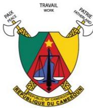

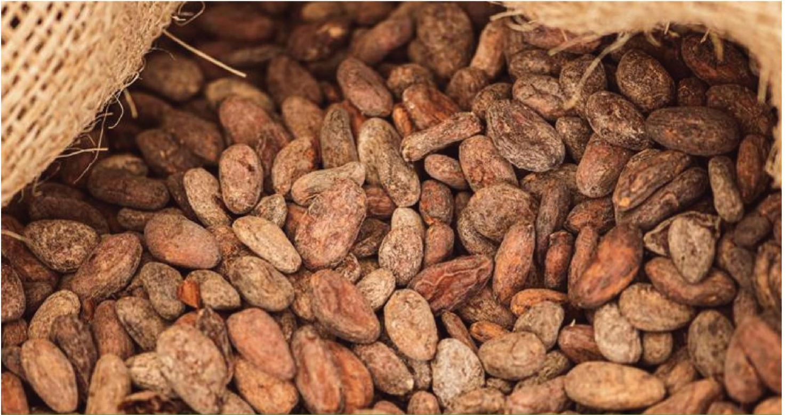

Support tool for due diligence on the legality of cocoa under the EUDR

## Module 2: Recommendations on due diligence regarding the legal requirements of cocoa produced in Cameroon

Version : juillet 2025

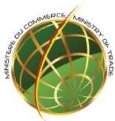

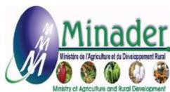

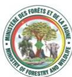

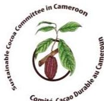

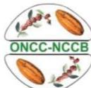

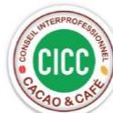

# **About this document**

Cameroon, under the aegis of the Sustainable Cocoa Committee and in partnership with the European Union's Cocoa Programme, is implementing a series of actions ("Cocoa actions") aimed at supporting the achievement of national objectives for the sustainability of the sector and access to the European market. In 2024, Cameroon began developing tools to facilitate due diligence by operators within the framework of the EUDR.

The support tool for due diligence on the legality of cocoa meets operators' needs in terms of compliance with the legal framework of the country of production (see more detailed explanations in the Introduction). It consists of two modules

- 1. Cameroonian legal requirements relevant to cocoa production and trade in Cameroon in the context of the EUDR;
- 2. Recommendations for cocoa compliance verification and risk management, including through private certification, to support operators' due diligence.

This document (module 2) was developed by the European Forest Institute (EFI), with funding from the European Union's Sustainable Cocoa Programme (SCP), and under the aegis of Cameroon's Sustainable Cocoa Committee. It was produced with the technical support of a consortium of legal and due diligence experts, including TAMI International Consulting and Preferred by Nature, and with input from stakeholders in the cocoa supply chain in Cameroon.

This document may be updated as the Cameroonian legal framework evolves.

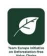

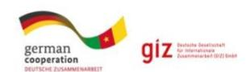

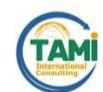

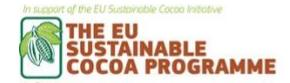

**Disclaimer. This document has been produced with the financial support of the European Union. The views expressed herein can in no way be taken to reflect the official opinion of the European Union. This document is intended to support the efforts of the cocoa industry to comply with the requirements of the European market. Its content is indicative, not legally binding and does not constitute legal advice. No guarantee is given as to the accuracy, completeness or timeliness of the content. The authors of this report accept no liability for any damage or loss arising from the use of this document without appropriate legal advice. The authors welcome all comments and suggestions for improvement.**

# **Foreword by MINADER and MINCOMMERCE**

The cocoa sector holds a strategic place within the Cameroonian economy, owing to its substantial contribution to key macroeconomic aggregates. In 2024, the sector generated close to 1 trillion CFA francs in export revenues, thereby contributing to the reduction of the national trade deficit, the strengthening of foreign exchange reserves, and the enhanced integration of Cameroon into global value chains. Its favourable impact on rural employment generation and income growth for producers is equally evident.

The structural importance of the sector within the national economy deserves particular attention, especially in light of the growing challenges it encounters in export markets, notably those relating to sustainability, traceability, and compliance with international standards.

In this context, Cameroon has chosen to act both proactively and responsibly.

For example, Cameroon has undertaken the requisite measures, in partnership with the European Union, to bring the sector into compliance with the European Union's Deforestation Regulation (EUDR).

The development of this manual, dedicated *to due diligence on the legality of cocoa under the EUDR*, is part of this dynamic. It represents a concerted and rigorous effort led by sectoral administrations, stakeholders within the sector, civil society and technical and financial partners, notably the European Union. The manual identifies the legal and regulatory framweorks applicable to cocoa production and marketing in Cameroon and formulates recommendations for the implementation of due diligence with regard to the legality requirement for cocoa exported to the European market.

Beyond regulatory compliance, this work contributes to strengthening governance within the sector, safeguarding producers' livelihoods in a sustainable manner and consolidating Cameroon's strategic position in European markets, where sustainability requirements have become decisive.

We acknowledge with appreciation the commitment of all stakeholders who have contributed to this work.

Operators in the cocoa sector, as well as the competent authorities of the European Union, will find this manual a valuable tool to support the implementation of the EUDR.

Let us join efforts to ensure that Cameroonian cocoa is recognised a sustainable, legal and competitive product that fosters rural development and contribute to the economic prosperity of our country.

**Gabriel MBAIROBE**

Minister of Agriculture and Rural Development

**Luc Magloire MBARGA ATANGANA**

# **Foreword by the Ambassador of the European Union to Cameroon**

Since the end of 2021, Cameroon and the European Union have been engaged in dialogue to make the cocoa sector more sustainable — economically, socially, and environmentally — and to facilitate access to the European market for Cameroonian cocoa.

This dialogue has given rise to a number of concrete initiatives, known as Cocoa Actions, which support Cameroon's efforts to produce more responsible cocoa. One key initiative is the identification of national regulations to help stakeholders in the cocoa value chain comply with European requirements.

It is in this context that I welcome the publication of this mapping of legal requirements relating to cocoa production and trade in Cameroon. This document is a valuable reference tool: it will enable actors across the sector to better understand the applicable rules, particularly those related to the new European regulation on deforestation (EUDR).

This work has been carried out with rigour, openness, and collective engagement. It has brought together all relevant stakeholders: public institutions, producers, cooperatives, companies, civil society, and technical and financial partners. I wish to pay particular tribute to the commitment of the Cameroonian authorities, and in particular the Ministry of Trade and the Ministry of Agriculture, for their leading role in this process.

I also congratulate all those who, through the Sustainable Cocoa Programme, have contributed technically to this important achievement.

This document will be a valuable resource for all those seeking to place Cameroonian cocoa and its derived products on the European Union's market in compliance with the new sustainability requirements. It will help strengthen transparency, legality, and sustainability within Cameroon's cocoa sector.

This initiative is a clear reflection of our shared ambition: to build a strong cocoa sector that respects the environment and benefits all. The European Union is proud to support Cameroon in this vital transition towards a greener and fairer economy.

Jean-Marc CHATAIGNER *Ambassador of the European Union to Cameroon*

# **Table of contents**

| About this document                                               | 2  |
|-------------------------------------------------------------------|----|
| Foreword MINADER and MINCOMMERCE                                  | 3  |
| Foreword by the Ambassador of the European Union to Cameroon      | 4  |
| Table of contents                                                 | 5  |
| 1. Context                                                        | 7  |
| The European Union Deforestation Regulation                       | 7  |
| 2. Objectives and methodology                                     | 8  |
| Methodology of the tool                                           | 8  |
| This report sets out the preliminary results of steps 2 and 3.    | 8  |
| General approach                                                  | 8  |
| How to use these due diligence recommendations?                   | 9  |
| What are these recommendations for?                               | 9  |
| Scope of recommendations                                          | 10 |
| Simplified or enhanced due diligence                              | 11 |
| Role of certification in due diligence                            | 11 |
| The EUDR and certification                                        | 12 |
| Description of the certification systems covered by the tool      | 12 |
| conventional cocoa                                                | 14 |
| Category 1: Land-use rights                                       | 14 |
| 1.1. Requirements calling for simplified due diligence actions    | 15 |
| 1.2. Requirements calling for enhanced due diligence actions      | 16 |
| Category 2: Environmental protection                              | 17 |
| 2.1. Requirements calling for simplified due diligence actions    | 18 |
| 2.2. Requirements calling for enhanced due diligence actions      | 19 |
| Category 3: Third parties’ rights                                 | 22 |
| 3.1 Requirements calling for simplified due diligence actions     | 22 |
| 3.2 Requirements calling for enhanced due diligence actions       | 22 |
| Category 5: Taxation, fight against corruption, trade and customs | 23 |
| 5.1. Requirements calling for simplified due diligence actions    | 23 |

| 5.2 Requirements calling for enhanced due diligence actions          | 24 |
|----------------------------------------------------------------------|----|
| Category 6: Labour rights*                                           | 25 |
| 6.1. Requirements calling for simplified due diligence actions       | 26 |
| 6.2. Requirements calling for enhanced due diligence actions         | 27 |
| Category 7: Human rights*                                            | 29 |
| 7.1. Requirements calling for simplified due diligence actions       | 30 |
| 7.2 Requirements calling for enhanced due diligence actions          | 31 |
| production of certified cocoa (voluntary systems) in Cameroon        | 32 |
| Category 1: Land-use rights                                          | 33 |
| Category 2: Environmental protection                                 | 35 |
| Category 3: Third parties’ rights                                    | 37 |
| Category 5: Tax, anti-corruption, trade and customs regulations      | 38 |
| Category 6: Labour rights*                                           | 40 |
| Category 7: Human rights*                                            | 43 |
| 5. Consultations carried out                                         | 45 |
| Annex 1— Detailed methodology                                        | 47 |
| Precautionary approach adopted for the tool                          | 47 |
| Definition of due diligence Definition of due diligence              | 48 |
| Annex 2—Information on the Rainforest Alliance and Fairtrade systems | 49 |
| Information on Rainforest Alliance                                   | 49 |
| Information on Fairtrade                                             | 49 |

# **1. Context**

## **The European Union Deforestaঞon Regulaঞon**

On 31 May 2023, the European Union (EU) adopted Regulation 2023/1115 on the placing on the EU market and export from the EU of certain commodities and products associated with deforestation and forest-risk commodity (EUDR). This regulation requires operators and traders importing forest-risk commodities into the EU to demonstrate that these products are traceable, deforestation-free and legal. The scope of application covers seven commodities: coffee, cocoa, rubber, palm oil, soya, cattle and wood, as well as derived products such as chocolate and cocoa paste. Entry into application is scheduled for 31 December 2025 (and 30 June 2026 for micro and small undertakings established as such before 31 December 2020).

Companies affected by the regulation (operators and traders) will be required to carry out "due diligence" prior to exporting or placing their products on the market, in order to gather sufficient information to ensure that the product carries no or a negligible risk of non-compliance. Consequently, operators placing cocoa or derived products on the EU market will have to ensure that these have been produced in accordance with the relevant legislation of the country of production (article 3), which is defined as concerning the legal status of the area of production. The EUDR takes a flexible approach, listing several areas of law without specifying particular legal instruments, as these differ from country to country and may be subject to change. These areas are [for agricultural commodities]:

- a) land-use rights
- b) environmental protection
- d) third parties' rights
- e) labour rights
- f) human rights protected by international law
- g) the principle of free, prior and informed consent, including as set out in the UN Declaration on the Rights of Indigenous Peoples
- h) tax, anti-corruption, trade and customs regulations

In this context, understanding the legislative framework of the country of origin, identifying the legal requirements relevant to the commodity concerned, and determining the means of verifying compliance with these requirements are a challenge not only for the operators responsible for due diligence, but also for the competent authorities in the European Union responsible for controls, as well as for the various stakeholders involved.

# **2. Objecঞves and methodology**

This tool for due diligence on cocoa legality aims to:

- Identify all the Cameroonian legal requirements applicable to cocoa production and trade and relevant to the EUDR;
- Provide recommendations for verifying cocoa compliance and risk management, including through private certification, to support operators' due diligence.

# **Methodology of the tool**

This tool is divided into three steps:

- Step 1: Mapping of relevant national legal requirements applicable to cocoa production and trade in Cameroon in the context of the EUDR
- Step 2: Development of due diligence recommendations for operators, based on an analysis of the level of implementation of the relevant legal requirements, existing means of verification and the role of private certification
- Step 3: Testing of due diligence recommendations by industry players and revision based on feedback

**This report sets out the preliminary results of steps 2 and 3.**

## **General approach**

The objective of this approach is to promote a national and consensual vision of the legal requirements that apply to Cameroonian cocoa, in order to: i) support the harmonisation of operators' due diligence approaches; ii) encourage the simplification of procedures for upstream players in the supply chain likely to have to provide data to their customers; and iii) facilitate a better understanding of national contexts by the Competent Authorities of EU Member States in charge of controls. **It is important to note that the results provided are not legally binding, do not impose any obligation on the relevant parties, and do not constitute legal advice**. It is the responsibility of operators placing cocoa or its derived products on the EU market to identify the relevant legal requirements within the meaning of article 2(40) of the EUDR, and to adapt their due diligence to the risks identified. The results of this work provide guidance that can support operators and other industry stakeholders in this direction.

In addition, these results are likely to evolve over time and be updated due to many factors: potential legal reforms in the country, evolution of public or private certification schemes, lessons learnt from the practical implementation of national due diligence recommendations (step 3), additional guidance provided by the European Commission or competent authorities, integration of best practices and technological advances, etc.

The tool is based on the work of national and international experts in law and due diligence, and on technical consultation with all the national and international players in the cocoa sector: government departments and ministries, exporters, traders and chocolate makers, cooperatives and producer associations, certification bodies, civil society organisations and importing countries in the European Union.

# **How to use these due diligence recommendaঞons?**

#### **Who are these recommendations aimed at?**

These recommendations are intended for various stakeholders concerned with verifying the compliance of cocoa and derived products with the EUDR. They may be useful to:

- **Operators within the meaning of the EUDR**: any natural or legal person who, in the course of a commercial activity, places cocoa or derived products on the EU market or exports them.
- **Traders within the meaning of the EUDR**: any natural or legal person in the supply chain, other than the operator, who makes the products concerned available on the EU market.
- **Competent authorities of the EU**: authorities designated by the Member States to ensure compliance with the obligations of the EUDR.
- **Actors in the supply chain in Cameroon**: producers, cooperatives, traders, exporters and other stakeholders involved in the production and marketing of cocoa, who must provide operators with the information, data and documents necessary for the implementation of due diligence.
- **Cameroonian public entities**: government administrations and bodies responsible for: regulating the cocoa sector (production and marketing); labour issues; land; forestry; the environment and sustainable development.
- **Civil society:** non-governmental organisations, associations and other actors playing a monitoring role, supporting producers and advocating to ensure the compliance of cocoa and its derived products with Cameroonian legislation and international commitments.

## **What are these recommendaঞons for?**

These recommendations can be used in different ways and at different times depending on the actors involved.

**Operators and traders** can rely on these recommendations to set up and document their due diligence system, ensuring that the cocoa they trade complies with the EUDR requirements on legality. They can use them to identify the documents and information to be collected or other actions to be carried out with their suppliers in Cameroon, and to assess the risks associated with their supply chain.

The **competent authorities of the EU** can use these recommendations as a standard for assessing the compliance of products placed on the market with the EUDR. They can also rely on these recommendations to harmonise their controls and interpret documents from Cameroon.

**Actors in the supply chain** in Cameroon can use these recommendations to understand the implications of the EUDR requirements for Cameroonian cocoa and the expectations of European operators and traders subject to it. These recommendations can be used to structure and document the information to be provided. They can also help them anticipate the risks of non-compliance and adapt their agricultural and commercial practices.

**Cameroonian public entities** can use these recommendations to strengthen compliance checks of producers and exporters with national legislation, in order to guarantee that the cocoa traded complies with the Cameroonian laws in force. They can also use them to support small producers in achieving compliance by providing them with better access to information on current regulations and buyer requirements. They can rely on these recommendations to make data more transparent and accessible, in particular by facilitating access to administrative documents, in order to help operators demonstrate the legality of cocoa.

**Civil society** can use these recommendations to monitor the application of Cameroonian legal requirements by companies and the authorities. It can use them to conduct analyses and produce reports on the risks of non-compliance of Cameroonian cocoa. It can also use them to raise awareness among producers, companies and consumers of the issues surrounding the legality of Cameroonian cocoa.

## **Scope of recommendaঞons**

Identification of the legal requirements relevant to the cocoa sector in Cameroon

The recommendations presented in this document aim to address all the relevant legal requirements identified by the stakeholders in the first module (see the report *Legal requirements relevant to cocoa in Cameroon*[\)](#page-9-1) 1 . These cover, in particular, all the legal areas listed in article 2.40 of the EUDR, in accordance with the precautionary approach adopted by the approach (see appendix 1). Nevertheless, a distinction is made between the requirements directly linked to the objectives of the EUDR and the others, which are marked with an asterisk. This flexible approach allows the user of the recommendations to adapt their due diligence actions according to their interpretation of the scope of the EUDR.

1 [hƩps://eĮ.int/sites/default/Įles/Įles/Ňegtredd/Sustainable-cocoa](https://efi.int/sites/default/files/files/flegtredd/Sustainable-cocoa-programme/Documents/20250318_LIVRABLE_1_CAM_ENG.pdf)[programme/Documents/20250318\\_LIVRABLE\\_1\\_CAM\\_ENG.pdf](https://efi.int/sites/default/files/files/flegtredd/Sustainable-cocoa-programme/Documents/20250318_LIVRABLE_1_CAM_ENG.pdf)

## **SimpliCed or enhanced due diligence**

This tool adopts a pragmatic approach, which aims to identify due diligence actions proportionate to the risks, in order to limit the burden on those involved in the sector. For each requirement deemed relevant to cocoa production and trade in Cameroon, a level of implementation has been assessed. The level of implementation adopted by the tool is based on: relevant literature, experts' knowledge of the sector, field surveys carried out as part of the work, and bilateral and multistakeholder consultations organised as part of this work.

Where the level of implementation assessed for a requirement is high, the risk of noncompliance is considered negligible. Consequently, simplified due diligence actions are recommended. On the other hand, when the level of implementation for a requirement is low, the risk of non-compliance is considered significant. Consequently, enhanced due diligence is recommended.

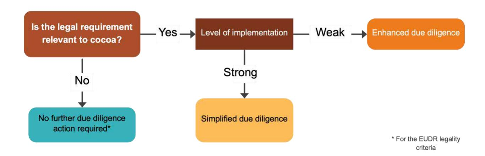

However, this analysis is only indicative and has only been carried out at the country level. **It is the responsibility of the operators to carry out a risk analysis of non-compliance of their products for each shipment.** It is within this framework that the present recommendations provide a range of due diligence options. **These actions are neither prescriptive nor presented in any particular order. It is up to the operators to choose from these options according to the context, their knowledge of their supply chains and the identified risks for cocoa and its derived products.**

## **Role of cerঞCcaঞon in due diligence**

Cocoa certification schemes are voluntary public or private mechanisms aimed at guaranteeing that the production and marketing of cocoa respect certain environmental, social and economic standards. They can be set up by governments, international organisations, NGOs or private companies. This tool differentiates between so-called "conventional" cocoa and cocoa certified according to certain standards (details below). Conventional is defined here as "non-certified".

# **The EUDR and cerঞCcaঞon**

Third-party certification and verification systems can play an important role in promoting sustainable agricultural and forestry practices and responsible sourcing. Different types of certifications exist, they can be implemented at the national level with a mandatory character or be private and voluntary (e.g. Fairtrade, Rainforest Alliance…).

According to the EUDR, for the purposes of risk assessment, operators can take into account "information from certification schemes or other third-party verified schemes…" However, the European Commission guidelines of 2 October 2024 indicate that "self-declaration schemes that do not rely on third party attestation procedures are outside of the scope of this guidance and are, by definition, less robust because of the lack of independence and impartiality".

The Commission also specifies that certification systems should not replace the operator's responsibility for due diligence. In other words, private certifications can be a tool to help European operators carry out their due diligence to meet the criteria of legality, deforestation and traceability.

Operators must be able to justify why and how the certification systems meet the requirements of the EUDR. To this end, three elements should be taken into account:

- The coverage of the legal requirements relevant to the EUDR by the certification system (**addressed by this tool**).
- The robustness of the certification system (not addressed by this tool): in particular the scope of the certification (applicable to which actors in the value chain? To which products?), the governance (management of internal procedures and updates, for example), the accreditation processes of the control bodies; the qualification of auditors and the frequency of audits; the management of non-compliance, impartiality and the management of conflicts of interest, etc. This information should be regularly reevaluated by the operator, particularly with regard to the requirements of the EUDR.
- Traceability and the absence of mixing with non-certified products (not addressed by this tool).

It should also be noted that the deforestation-free requirement is not covered by this tool, but can also be covered by certification systems. This tool focuses only on the legal requirements.

## **Descripঞon of the cerঞCcaঞon systems covered by the tool**

Two certification systems are covered:

- **Rainforest Alliance** is a private certification that focuses on the protection of land and forests in a way that advances the rights and prosperity of rural communities according to three main principles: social equity, environmental responsibility and economic viability of farming communities. It is aimed at small and large farms and organisations such as processors, importers or exporters, brands and distributors, particularly for

cocoa. The Rainforest Alliance certification programme is largely aligned with the EUDR, with a few minor but crucial differences between their requirements. Adjustments are being made to ensure that the certification fully meets the requirements of the EUDR. This tool is based on the coverage of legal requirements by the Rainforest Alliance standard including the voluntary EUDR module for farms.

- **Fairtrade** is a private fair-trade certification. Its specifications (particularly for cocoa) set out the requirements that actors in fair supply chains must meet, whether they are rural cooperatives, large farms or factories employing labour, or companies that buy and sell Fairtrade products. The Fairtrade specifications incorporate detailed social, economic and environmental criteria.

More information on these two standards is available in Appendix 2. Section 4 provides due diligence recommendations specific to Rainforest Alliance or Fairtrade certified cocoa.

# **3. Due diligence recommendaঞons regarding the legal requirements relevant to convenঞonal cocoa**

## **Category 1: Land-use rights**

Land law in Cameroon is dual in nature, with customary law and civil law coexisting. The 1974 ordinance establishes the land title as the sole proof of land ownership, but recognises peaceful customary land use. It is therefore not **strictly mandatory for small cocoa producers to have a land title in order to hold land rights and cultivate their land.** The vast majority of land in Cameroon, including cocoa-producing plots, is occupied and farmed without title deeds. Nevertheless, land rights, including rights of occupation and land-use rights, are generally clearly determined at the local level by customary law. Although the existence of land disputes in Cameroon cannot be denied, cocoa cultivation itself generates few land disputes, as indicated during consultations carried out during this work with the Ministry of Lands, Cadastre and Land Affairs in September 2024. At village level, when disagreements arise over the use of plots, they are generally resolved effectively within the communities by local or customary administrative and judicial bodies.

Cameroonian legislation prohibits agriculture in the permanent forest estate, unless it is permitted in the forest management plans, and only in the areas provided for in these documents. However, in practice, the establishment of cocoa plantations does not always respect the delimitation of areas and authorised uses, and cases of encroachment into areas not provided for in these plans are often observed. In addition, many forests in the permanent forest estate do not have management plans.

#### 1.1. Requirements calling for simpliCed due diligence acঞons

| Legal requirements                                                                      |                                                                                                                                                                          | Context and levels of implementation and risk                                                                                                                                                                                                                                                                                                                                                                                                                                                                                                                                                                                                                                                                                                                                                                                                                                                                                                                                                                                                                                                                                                                                                                                                                                                                                                                                                                                                                                                                                                                                                                                                                                                                                                                                                                                                                         | Recommended due diligence actions |
|-----------------------------------------------------------------------------------------|--------------------------------------------------------------------------------------------------------------------------------------------------------------------------|-----------------------------------------------------------------------------------------------------------------------------------------------------------------------------------------------------------------------------------------------------------------------------------------------------------------------------------------------------------------------------------------------------------------------------------------------------------------------------------------------------------------------------------------------------------------------------------------------------------------------------------------------------------------------------------------------------------------------------------------------------------------------------------------------------------------------------------------------------------------------------------------------------------------------------------------------------------------------------------------------------------------------------------------------------------------------------------------------------------------------------------------------------------------------------------------------------------------------------------------------------------------------------------------------------------------------------------------------------------------------------------------------------------------------------------------------------------------------------------------------------------------------------------------------------------------------------------------------------------------------------------------------------------------------------------------------------------------------------------------------------------------------------------------------------------------------------------------------------------------------|-----------------------------------|
|  Land owner-ship & Use rights |  Land ownership is demonstrated by a land title established in accordance with the laws and regulations in force. | 
Around 80% of cocoa production in Cameroon is carried out by small producers. These farmers, who are often family farmers, mainly cultivate small plots of land (Lescuyer et al. 2019, p. 14).
 
Access to land for cocoa cultivation in Cameroon is governed by a legal framework that combines aspects of formal land law and customary practices. The coexistence of customary law and modern law is recognised in the texts in Cameroon.
 
It is not strictly mandatory for small-scale cocoa producers to have a land title in order to hold land rights and cultivate their land.
 
Land registration is not widespread in rural areas and particularly in areas of cocoa production in Cameroon. The proportion of cocoa producers in Cameroon with a title deed is generally low. Only 10% of the national territory occupied by the population is registered and the largest portion is found in the cities. Several studies and reports indicate that a minority of cocoa producers have formal title deeds (5.4% of a population of 294 surveyed according to Nguiffo et al. 2023, p. 193; 1.19% of a population of 84 surveyed, according to producer surveys as part of this work). A large part of the agricultural land is held according to customary rules, which makes it difficult to obtain formal titles. On the other hand, the complexity and length of the procedure, as well as the associated costs, are significant barriers to obtaining formal land ownership titles for cocoa producers. Producers are not always informed of the procedures for obtaining a title deed.
 
In the case of community forests, the State is the guardian of the forest, the communities have no property rights over these forests. There are collective rights that bind heirs (management of undivided family lan
 |                                   |

2 E. Lescuyer, G., Boutinot, L., Goglio, P., Bassanaga, S., 2019. Analyse de la chaîne de valeur du cacao au Cameroun. Rapport pour l'Union européenne, DG-DEVCO. Value Chain Analysis for Development Project (VCA4D CTR 2016/375-804), https://www.researchgate.net/publication/339089858\_Analyse\_de\_la\_chaine\_de\_valeur\_du\_cacao\_au\_Cameroun

3 Nguiffo et al, La législation européenne contre la déforestation importée et la production de cacao au Cameroun : vers l'exclusion des petits producteurs ? CED, 2023, https://cedcameroun.org/bibliotheque/la-legislation-europeenne-contre-la-deforestation-importee-et-la-production-de-cacao-au-cameroun-vers-lexclusion-des-petits-producteurs/

#### 1.2. Requirements calling for enhanced due diligence acঞons

| Legal requirements |                                                   | Context and levels of implementation and risk                                                                                                                                                                                                              | Recommended due diligence actions                                                                                                                                                                                                                                                                                                                                                                                                                                                                                                                                                                                                                                                                                                                                                                                                                                                                                                                                                                                                                                             |                                                                                                                                                                                                                                                                                                                                                                                                        |
|--------------------|---------------------------------------------------|------------------------------------------------------------------------------------------------------------------------------------------------------------------------------------------------------------------------------------------------------------|-------------------------------------------------------------------------------------------------------------------------------------------------------------------------------------------------------------------------------------------------------------------------------------------------------------------------------------------------------------------------------------------------------------------------------------------------------------------------------------------------------------------------------------------------------------------------------------------------------------------------------------------------------------------------------------------------------------------------------------------------------------------------------------------------------------------------------------------------------------------------------------------------------------------------------------------------------------------------------------------------------------------------------------------------------------------------------|--------------------------------------------------------------------------------------------------------------------------------------------------------------------------------------------------------------------------------------------------------------------------------------------------------------------------------------------------------------------------------------------------------|
| Protected areas    |  | 
The practice of agriculture is strictly prohibited in permanent forest areas, unless this is provided for in the classification act and in accordance with the approved management plan or the approved simple management plan for the said forest.
 | 
The cocoa plantations located in the forests of the permanent domain must be taken into account in the management plans. Similarly, plantations in community forests must be provided for in the simple management plans for these forests. Nevertheless, cocoa production activities are very often present in communal forests, protected areas and UFAs (Forest Management Units, a type of forests within the permanent forest estate), without this being provided for in the approved management plans or simple management plans. Furthermore, when agricultural production activities are provided for in the management plan or simple management plan, it is common for plantations to extend beyond the areas permitted in the forest management documents.
 
Protected areas, including parks, form part of the permanent forest estate and are covered by this requirement. There are also cases of encroachment for cocoa cultivation in these protected areas.
 
The Santchou wildlife reserve is particularly affected by cocoa cultivation.
 | 
1. <i>Determine whether the cocoa comes from a forest in the permanent forest estate, and the type of forest, if applicable:</i>
 
<b>Map analyses</b> Overlay the geolocation data of the plots (data collected for the EUDR traceability requirement) with the boundaries of the <a href="#">Cameroon forest atlas</a>.
                                                              |
|                    |                                                   |                                                                                                                                                                                                                                                            |                                                                                                                                                                                                                                                                                                                                                                                                                                                                                                                                                                                                                                                                                                                                                                                                                                                                                                                                                                                                                                                                               | 
2. <i>Where applicable, if the area of production is in the permanent forest estate:</i>
 
<b>Document collection and verification</b> Collect the classification document and the development plan or simple management plan, as appropriate. Check that these documents authorise the agricultural activity, and the associated constraints (location of the area, surface area). If
 |

## Category 2: Environmental protection

the legal requirements relating to environmental protection for cocoa cultivation, the main elements to note are as follows:

- • **Pesticides and fertilisers** are commonly used in cocoa plantations. The use of pesticides in particular is a major issue and can pose a risk of contamination for local communities and the environment, especially when unauthorised products are used. The use of pesticides is closely linked to other environmental protection issues, such as the protection of soil and watercourses and waste management. This issue is also linked to certain labour rights requirements and third parties' rights of local communities that may be affected by non-compliant uses of these agrochemical products. The law stipulates that professional applicators of these products must be authorised in order to guarantee the proper use of pesticides. However, in practice, these professional applicators are not sought after in cocoa plantations.
- • There is also an issue around **the conversion of community forests, which must comply with simple management plans for these forests**, a requirement that is little known to local communities. It should be noted that the tool identified the legal framework applicable to land clearing, but does not prejudge compliance with the EUDR's deforestation-free criteria, which will have to be evaluated separately.
- • As cocoa farming in Cameroon is mainly carried out in forest ecosystems, it is subject to the obligation to preserve protected animal and plant species. The banks of waterways are particularly fragile ecosystems in which cocoa is often produced (when the area is not subject to flooding), which leads to potentially high risks of degradation. In addition, certain protected species of fauna may be found on farms, and illegal hunting practices may occur on farms close to natural forests and protected areas.
- • Moreover, cocoa plantations are on average less than 4 hectares in size. They are therefore exempt from the obligation to carry out an environmental assessment (impact statement or environmental and social impact assessment, as the case may be) which only applies to projects over 100 hectares. In Cameroon, a very small number of farms exceed 100 hectares, and these comply with this requirement.

#### 2.1. Requirements calling for simpliCed due diligence acঞons

| Legal requirements Context and levels of implementation and risk | Recommended due diligence actions                            |
|------------------------------------------------------------------|--------------------------------------------------------------|
| 100 ha.                                                          |                                                              |
| least 77% of cocoa plots in Cameroon are less than 100           | ha (65% are                                                  |
| less than 5                                                      | ha) and are therefore not subject to this requirement for an |
|                                                                  | Determine whether the plot is larger than 100 ha:            |
|                                                                  | If applicable (plot <100 ha):                                |

#### 2.2. Requirements calling for enhanced due diligence acঞons

| Legal requirements            |                                                                                                                                                                                       | Context and levels of implementation and risk                                                                                                                                                                                                                                                   | Recommended due diligence actions                                                                                                                                                                                                                                                                                                                                                                                                                                                                                                                                                                                                                                                                                                                                                                                                                                                                                                                                                                                                                                                                                                                                                                                                                                                                                                                                                                              |
|-------------------------------|---------------------------------------------------------------------------------------------------------------------------------------------------------------------------------------|-------------------------------------------------------------------------------------------------------------------------------------------------------------------------------------------------------------------------------------------------------------------------------------------------|----------------------------------------------------------------------------------------------------------------------------------------------------------------------------------------------------------------------------------------------------------------------------------------------------------------------------------------------------------------------------------------------------------------------------------------------------------------------------------------------------------------------------------------------------------------------------------------------------------------------------------------------------------------------------------------------------------------------------------------------------------------------------------------------------------------------------------------------------------------------------------------------------------------------------------------------------------------------------------------------------------------------------------------------------------------------------------------------------------------------------------------------------------------------------------------------------------------------------------------------------------------------------------------------------------------------------------------------------------------------------------------------------------------|
| Use of pesticides/fertilisers |  Only approved pesticides, insecticides and fungicides are used by farmers following the prescribed technical itinerary. | Pesticides and fertilisers are used extensively in cocoa production. The obligation applies in particular to those who use pesticides: the producer and his or her applicators.  The majority of producers or applicators obtain pesticides either from cooperatives or on local markets. |  Implementation of procedures/processes <ul style="list-style-type: none;"> <li>—Systematic collection of information from producers, if available, on: (1) the method of application of fertilisers and pesticides, insecticides and fungicides (direct or by subcontracting); (2) the type of fertilisers and pesticides, insecticides and fungicides used (in particular for fertilisers/pesticides purchased on markets, check that they are on the updated list of approved products); and (3) the method of packaging treatment. This information collection can be done, for example, by regularly filling in a fertiliser and pesticide application monitoring sheet and a packaging monitoring sheet, or by regularly filling in a questionnaire.</li> <li>—Provision to producers of the up-to-date list of authorised/non-authorised fertilisers and pesticides at the cooperative level as well as the list of approved applicators.</li> <li>—Provision to producers of tools for monitoring the application of fertilisers and pesticides and the treatment of packaging, for example monitoring sheets for collecting information.</li> <li>—Support for producers on authorised/unauthorised pesticides and fertilisers and on the treatment of packaging, for example through training, communication campaigns, etc.</li> </ul> |
|                               |  Only approved fertilisers are used in the fields, according to the planned technical itinerary.                         |                                                                                                                                                                                                                                                                                                 |                                                                                                                                                                                                                                                                                                                                                                                                                                                                                                                                                                                                                                                                                                                                                                                                                                                                                                                                                                                                                                                                                                                                                                                                                                                                                                                                                                                                                |

4 Mahop R. J. et al, (2014), UƟlisaƟon des pesƟcides dans le secteur du cacao au Cameroun : caractérisaƟon des moyens de fourniture, de la nature, de la manière et des raisons de leur uƟlisaƟon, CommunicaƟon à la 17e Conférence InternaƟonale sur la Recherche Cacaoyère, 2012. Int. J. Biol. Chem. Sci. 8(5) : 1976-1989, octobre 2014, ISSN 1997-342X.

| Legal requirements Context and levels of implementation and risk Recommended due diligence actions |                                                                     |
|----------------------------------------------------------------------------------------------------|---------------------------------------------------------------------|
| 90% of non-certified producers (Boete Bebe, 201 7) 5                                               |                                                                     |
| Management Plan. In                                                                                |                                                                     |
| 1. Determine whether the cocoa comes from community forests                                        | :                                                                   |
| Overlay the geolocation data of the plots with the data of th                                      | e Cameroon forest                                                   |
| atlas t                                                                                            | o determine the cases where cocoa is produced in community forests. |
| 2. Where applicable (the cocoa comes from a community forest):                                     |                                                                     |
| stakeholders.                                                                                      | Confirm the proper application of the provisions of the Simple      |

5 Boete Bebe Gue (C.), Le cacao durable au Cameroun : utopie ou réalité ? Cas du bassin de producƟon de Mbangassina, Mémoire de Master en sciences et gesƟon de l'environnement dans les pays en développement, Université de Liège, Université Catholique de Louvain, 2016-2017,

59 p. [hƩps://matheo.uliege.be/bitstream/2268.2/3288/7/TFE%20MS%20SGE%20PED%202016-2017%20BOETE%20BEBE%20GUE%20CYBILLE.pdf](https://matheo.uliege.be/bitstream/2268.2/3288/7/TFE%20MS%20SGE%20PED%202016-2017%20BOETE%20BEBE%20GUE%20CYBILLE.pdf)

| Legal requirements | Context and levels of implementation and risk | Recommended due diligence actions        |
|--------------------|-----------------------------------------------|------------------------------------------|
|                    | Forestry Posts, 2023 ) 6                      |                                          |
|                    | logger s 7                                    |                                          |
|                    |                                               | 2. At the level of the production plot : |

LeƩre circulaire n° 3398/L/MINFOF/SETAT/SG/DF/SDAFF/SDAF/SDFC, du 14 juin 2023

7 Kamath, V., Sassen, M., Arnell, A., Van Soesbergen, A., & Bunn, C. (2024). IdenƟfying areas where biodiversity is at risk from potenƟal cocoa expansion in the Congo Basin. Agriculture, Ecosystems & Environment, 376, 109216. doi:10.1016/j.agee.2024.109216 ; et Ndo, E., Akoutou Mvondo, E., Kaldjob, C., Mfoumou Eyi, C., Sonfo, A., Dongmo, M.,… Toda, M. (2024). Socioeconomic factors inŇuencing the gathering of major non-Ɵmber forest products around Nki and Boumba-Bek naƟonal parks, southeastern Cameroon. Forest Policy and Economics, 168, 103293. doi:10.1016/j.forpol.2024.103293

## **Category 3: Third parঞes' rights**

Due to the small size of cocoa farms, they are generally not likely to infringe the rights of third parties, especially since the villages are often largely populated by the producers themselves. Furthermore, this work did not identify any cases of cocoa farming in sites or habitats of cultural significance.

The requirements relating to environmental impact studies, and the related consultations, are only relevant above a certain surface area. They are thus relevant in a very limited number of cases in Cameroon.

Some requirements relevant to community rights are also addressed in category 1, in relation to land access rights, and in category 2, in relation to protection against pollution.

#### 3.1 Requirements calling for simpliCed due diligence acঞons

| Legal requirements | Context and levels of implementation and risk                          | Recommended due diligence actions  |
|--------------------|------------------------------------------------------------------------|------------------------------------|
|                    | 100 ha (65% are less than 5 hectares) and are therefore not subject to |                                    |
|                    | 100 ha (65% are less than 5 hectares) and are therefore not subject to |                                    |
|                    |                                                                        | 1. Determine the size of the plot: |
|                    |                                                                        | 2. Where applicable:               |

#### 3.2 Requirements calling for enhanced due diligence acঞons

No requirement calls for enhanced due diligence action in this category.

## **Category 5: Taxaঞon, Cght against corrupঞon, trade and customs8**

*NB: This is the only category of the EUDR that potentially concerns entities throu[gh](#page-22-2)out the supply chain of the country of production, and not only at the level of the area of production.*

In Cameroon, to date, the collection of taxes and duties from cocoa producers remains difficult due to the informal nature of the sector. In addition, a certain administrative tolerance can be observed, as in the case of the non-extension of tax controls to cocoa farmers. However, the marketing and export formalities and taxes paid by exporters are generally well respected and documented. 

#### 5.1. Requirements calling for simpliCed due diligence acঞons

| Legal requirements |                                                     | Context and levels of implementation and risk                                                                                                                                                 | Recommended due diligence actions                                                                                                                                                                                                                                                                                                                                                                                                                                                                                                                               |                                                                                                                                                                                                                                                                                                                                                                                                                                                                                                                                                                                                          |
|--------------------|-----------------------------------------------------|-----------------------------------------------------------------------------------------------------------------------------------------------------------------------------------------------|-----------------------------------------------------------------------------------------------------------------------------------------------------------------------------------------------------------------------------------------------------------------------------------------------------------------------------------------------------------------------------------------------------------------------------------------------------------------------------------------------------------------------------------------------------------------|----------------------------------------------------------------------------------------------------------------------------------------------------------------------------------------------------------------------------------------------------------------------------------------------------------------------------------------------------------------------------------------------------------------------------------------------------------------------------------------------------------------------------------------------------------------------------------------------------------|
| Taxes              |  % | 
The cocoa marketing business is subject to the payment of either the tax in full discharge of liabilities or the business tax and the corporate tax, depending on the type of company.
 | 
The collection of taxes and duties is easiest for the cocoa trade (interview with the DERF/DGI/MINFI of 21/06/24).
 
With the one-stop shop system, cocoa cannot be traded if the exporter or company has not fulfilled its tax obligations. Tax receipts/certificates of conformity are available, digitised and regularly issued by the tax authorities, with the certificate being the end-of-chain document.
                                                                                                                                    |  
Collect by sampling receipts/certificates of tax compliance from those in the value chain involved in the marketing of cocoa.
                                                                                                                                                                                                                                                                                                                                                                                                   |
| Customs duties     |  % | 
The exporter must pay the customs duties upon export.
                                                                                                                                  | 
When exporting cocoa, the exporter must pay customs duties. Cocoa cannot be exported if the exporter does not have a certificate of tax compliance.
 
This certificate shows that the cocoa exporter has fulfilled his obligations to the tax authorities. It shows the declared items and volumes, the amount paid and the date of issue.
 
There may be a minor risk of concealment of the import tax base (interview with the DGD's DAJ on 21/06/24). Nevertheless, the procedures are largely paperless, which greatly limits malpractice.
 |  
Possibly collect customs declarations and tax compliance receipts/certificates by sampling from those involved in the cocoa marketing value chain.
 
Check that the documents are signed and stamped by the Cameroonian administrative authorities and that the quantities declared are the same as the quantities actually purchased.
 
The authenticity of tax compliance certificates can be verified at this address: <a href="https://teledeclaration.dgi.cm/modules/Common/Account/Login.aspx">https://tele</a>
 |

NB. This document does not contain any informaƟon on Category 4 of the standard used (Free, Prior and Informed Consent—FPIC). This is because Cameroon does not have a legally binding framework for Free, Prior and Informed Consent (FPIC). See the report "*Legal requirements relevant to cocoa in Cameroon"*

## 5.2 Requirements calling for enhanced due diligence actions

## Category 6: Labour rights\*

*N.B. This category is specifically listed in Article 2(40) of the EUDR, but is not directly related to the objectives of the Regulation.*

In general, informal workers represent nearly 90% of the total number of workers in Cameroon (National Commission on Human Rights and Freedoms of Cameroon (CNDHL), 20209). The cocoa sector relies largely on **small family plantations**, often less than 4 ha, as well as on a network of *coxeurs* (known as individuals who engage in the illicit purchase of cocoa from producers) and cooperatives responsible for the initial stages of supplying, sorting, drying and selling cocoa to traders and exporters.

Labour on cocoa plantations is largely based on **family and village networks**, organised either by the owner or holder of customary land laws over the plot, or by the farmer who rents or receives the land free of charge (sharecropping agreements). The majority of people employed on the cocoa plantations is casual labourers. These farming methods, which mostly do not involve a relationship of subordination between owners, farmers and field workers, fall outside the scope of most of the labour law requirements (and therefore from most of the requirements listed below).

The legal requirements below apply only in the case of **paid labour**. They are not applicable in many cases in the cocoa production sector, which is dominated by family plantations. A first step in due diligence is to determine whether there is paid labour in the sourcing area. This can be done for all producers by collecting information on the type of employment of the plantation workers through a questionnaire. This questionnaire can be filled in during systematic surveys or when collecting geolocation data of the plots. Intermediaries can support this data collection relating to producers and their employees. This questionnaire will also make farmers aware of the issue of salaried employment. If this first stage shows that there is no salaried work in the sourcing area, no additional due diligence action is recommended.

---

9 CNDHL, Rapport Annuel, 2020, <https://www.cdhc.cm/admin/fichiers/Rapports2024-01-3110-20-32.pdf>

#### 6.1. Requirements calling for simpliCed due diligence acঞons

| Legal labour    |                                                                                                                                                                                                                                                                             | Context and levels of implementation and risk                                                                                                                                                                                                                                                                                                                                                                                                                                                                                                                                                                                                                                                                                                                                                                                                                                                                                                              | Recommended due diligence actions                                                                                                                                                                                                                                                                                                                                                                                                                                                                                                                                                                                                                                                                                                                                                                                                                                                                                  |
|-----------------|-----------------------------------------------------------------------------------------------------------------------------------------------------------------------------------------------------------------------------------------------------------------------------|------------------------------------------------------------------------------------------------------------------------------------------------------------------------------------------------------------------------------------------------------------------------------------------------------------------------------------------------------------------------------------------------------------------------------------------------------------------------------------------------------------------------------------------------------------------------------------------------------------------------------------------------------------------------------------------------------------------------------------------------------------------------------------------------------------------------------------------------------------------------------------------------------------------------------------------------------------|--------------------------------------------------------------------------------------------------------------------------------------------------------------------------------------------------------------------------------------------------------------------------------------------------------------------------------------------------------------------------------------------------------------------------------------------------------------------------------------------------------------------------------------------------------------------------------------------------------------------------------------------------------------------------------------------------------------------------------------------------------------------------------------------------------------------------------------------------------------------------------------------------------------------|
| Workers' rights |  In all agricultural or similar companies, working hours are limited to 2 400 hours per year, i.e. forty-eight (48) hours per week, subject to compliance with rest periods and the regular organisation of overtime. | 
Work in the cocoa plantations is mainly family-based (Nguiffo et al. 2023). The Labour Code does not specifically regulate task work or casual workers. The provisions relating to working hours do not apply to task work.
 
This requirement is generally well respected, as work in cocoa production does not take place at night and the 24-hour weekly rest day (Sunday or another day depending on religious observance) is well respected.
 
However, as cocoa culture is closely linked to the harvest seasons, producers and workers on the plantations are often forced to work longer during harvest periods.
 
Overtime is common for seasonal or day labourers employed during the cocoa harvest. These workers may be required to work long days, sometimes well beyond normal hours, to meet the demand for harvesting and other activities related to cocoa production (such as fermentation, drying, or transport).
 | 
<b>Collection of relevant data</b>
 
Possibly consult the public reports of organisations specialising in these issues, in particular the Cocoa Barometer (detailed analyses of the cocoa supply chain, including discussions on labour rights) and Human Rights Watch (reports on human rights in various sectors, including cocoa, highlighting working conditions), as well as potential reports produced by national and local NGOs.
 
Ensure that the sourcing area does not present a particularly high risk of non-compliance with working hours, hindrance of the freedom of association of workers, or remuneration below the legal minimum.
 
<b>Stakeholder consultation</b>
 
You may also wish to consult local organisations working for labour rights to obtain information on working conditions and any cases of non-compliance with working hours, obstruction of the
 |

#### 6.2. Requirements calling for enhanced due diligence acঞons

| Legal requirements                 |                                                                                                                                                                                                    | Context and levels of implementation and risk                                                                                                                                                                                                                                                                                                                                                                                                                                                                                                                                                                                                                                                                                            | Recommended due diligence actions                                                                                                                                                                                                                                                                                                                                                                                                                                                                                                                                                                                                                                                                                                                                                                                             |
|------------------------------------|----------------------------------------------------------------------------------------------------------------------------------------------------------------------------------------------------|------------------------------------------------------------------------------------------------------------------------------------------------------------------------------------------------------------------------------------------------------------------------------------------------------------------------------------------------------------------------------------------------------------------------------------------------------------------------------------------------------------------------------------------------------------------------------------------------------------------------------------------------------------------------------------------------------------------------------------------|-------------------------------------------------------------------------------------------------------------------------------------------------------------------------------------------------------------------------------------------------------------------------------------------------------------------------------------------------------------------------------------------------------------------------------------------------------------------------------------------------------------------------------------------------------------------------------------------------------------------------------------------------------------------------------------------------------------------------------------------------------------------------------------------------------------------------------|
| Workers' rights                    | 
All workers are entitled to equal pay, all other things being equal, in terms of work and professional aptitude, regardless of their origin, gender, age, status or religious denomination.
 | 
—In the context of cocoa cultivation, there are cases of discrimination based on gender and race and against migrant workers.
 
—In practice, internally displaced workers from crisis regions are in greater demand than others because of their knowledge of cocoa cultivation. The work did not find any cases of wage discrimination against them.
 
—On the other hand, there are cases of discrimination against certain indigenous peoples with regard to remuneration where they reside.
 
—Women, although often involved in cocoa farming, are often underpaid and have less access to resources, land and training. Their work is often considered secondary, even though it is crucial for production.
 | 
1. <i>At the level of the sourcing area:</i>
 
<b>Collection of relevant data</b>
 
Consult the public reports of specialised organisations on these issues, in particular the Cocoa Barometer (detailed analyses of the cocoa supply chain, including discussions on labour rights) and Human Rights Watch (reports on human rights in various sectors, including cocoa, highlighting working conditions), as well as potential reports produced by national and local NGOs. Ensure that the sourcing area does not present a particularly high risk of labour discrimination, harm to the health and safety of workers, lack of appropriate provisions for the handling of chemicals or failure of employers to provide appropriate equipment.
 
Collect reports from labour inspectors if available.
 |
| Operations/ activities are secured | 
Employers must look after the health and safety of their employees and ensure that the working environment and the working equipment are adequate.
                                          | 
—Although the activities in the cocoa sector in Cameroon are not mechanised and the activities are seasonal and, on a task-by-task basis, health and saf
                                                                                                                                                                                                                                                                                                                                                                                                                                                                                                                                                                          |                                                                                                                                                                                                                                                                                                                                                                                                                                                                                                                                                                                                                                                                                                                                                                                                                               |

| Legal requirements                                                                                 | Context and levels of implementation and risk                                                                                                                                                                                                                              | Recommended due diligence actions                                                                                                                                                                                                                                                                                                                                                                          |                                                                                                                                                                                                                                                                                                                                                                                                                                                                                                                                                                                                                                                                                                                                                                                            |
|----------------------------------------------------------------------------------------------------|----------------------------------------------------------------------------------------------------------------------------------------------------------------------------------------------------------------------------------------------------------------------------|------------------------------------------------------------------------------------------------------------------------------------------------------------------------------------------------------------------------------------------------------------------------------------------------------------------------------------------------------------------------------------------------------------|--------------------------------------------------------------------------------------------------------------------------------------------------------------------------------------------------------------------------------------------------------------------------------------------------------------------------------------------------------------------------------------------------------------------------------------------------------------------------------------------------------------------------------------------------------------------------------------------------------------------------------------------------------------------------------------------------------------------------------------------------------------------------------------------|
| 
 Δ 
 | 
Effective protective equipment must be provided to workers according to the specifics of the work to be performed.
 
<i>N.B. In view of the existing risks in the profession, boots, gloves and masks for the application of chemicals should be provided.</i>
 | 
In shelling and chemical application operations, there is a high risk of non-compliance with this requirement. The cost of securing employees is identified as one of the factors for non-compliance with this requirement (Lescuyer et al. 2019).
 
<i>N.B. In view of the existing risks in the profession, boots, gloves and masks for the application of chemicals should be provided.</i>
 | 
—Proof of payment of workers (verify the differences in salaries with employees who do not belong to the aforementioned groups)
 
<b>Field verifications</b>  <i>In the event that there is one or more employees on the plantation:</i>  —Ensure that working conditions and work equipment do not jeopardise the health and safety of workers.  —Ensure that appropriate arrangements are made for the handling of chemicals.  —Ensure that appropriate work equipment is provided.  —In the event that one or more permanent or long-term employees on the plantation are displaced workers, members of indigenous populations and/or women.  —Ensure that wages are equal for all workers with equal working conditions and professional aptitude.
 |

## **Category 7: Human rights\***

*N.B. This category is specifically listed in Article 2(40) of the EUDR, but is not directly related to the objectives of the Regulation.* 

Human rights requirements in the cocoa sector mainly concern the issues of child labour and the absence of forced labour.

**Child labour** on cocoa plantations in Cameroon is a major issue, although it is sometimes perceived and defined as a socialising activity. According to the International Labour Organisation (ILO), child labour is defined as any activity that deprives children of their childhood and their potential, harming their physical and mental development (*references*: ILO conventions 138 and 182).

The Cameroonian legal framework regulates working hours and acceptable tasks for children. According to Cameroon's Labour Code, children are allowed to work from the age of 14, and those under 14 in cocoa farms may do so within a family framework marked by socialisation and learning. A study commissioned by the FAO and the Cameroonian government is underway to assess the extent of this phenomenon in the sector. The preliminary results of this study indicate that 16% of the children surveyed are involved in an activity related to cocoa production during the 2024 season, with involvement increasing with age. Despite their significant involvement in cocoa production activities, the children's schooling is only slightly threatened, as enrolment rates in the study areas remain very high (92% on average). In other words, whether or not children work on a cocoa plantation, school attendance remains high. In addition, a draft decree on hazardous work for children is in the process of being signed by the Ministry of Labour and Social Security.

With regard to human rights, the majority of the relevant requirements relate to labour rights. This work did not find any cases of sexual harassment or forced labour in the sector. The protection of indigenous peoples is enshrined in the Constitution. Furthermore, the Labour Code prohibits any form of discrimination based on origin, age, sex, status or religious denomination. However, cases of discrimination persist in the regions where these peoples live, particularly with regard to remuneration. Nevertheless, this requirement is also covered by the Labour Code and is dealt with in category 6.

#### 7.1. Requirements calling for simpliCed due diligence acঞons

| Legal requirements                         |       | Context and levels of implementation and risk                                                                    | Recommended due diligence actions                                                                                                                                                                                                                                                           |
|--------------------------------------------|-------|------------------------------------------------------------------------------------------------------------------|---------------------------------------------------------------------------------------------------------------------------------------------------------------------------------------------------------------------------------------------------------------------------------------------|
| Absence of modern slavery Forced labour | Scale | Except in the cases provided for by law, no deductions may be made from wages.                                   | Deductions from bonuses are mentioned in an analysis of the cocoa value chain in Cameroon as being part of the bad practices observed within cooperatives. This work does not reveal any cases of deductions from the salaries of personnel employed in the sector (Lescuyer et al., 2019). |
|                                            | Scale | Forced or compulsory labour is prohibited.                                                                       | The workers employed in the cocoa plantations are mostly casual workers hired for short periods of time. The consultations carried out as part of this work showed that cases of forced labour in the sector were extremely rare.                                                        |
| Gender                                     | Scale | It is forbidden to put pressure on or coerce a worker of any kind in order to obtain favours of a sexual nature. | There have been no proven cases of sexual harassment in the cocoa sector.                                                                                                                                                                                                                   |
|                                            | Scale |                                                                                                                  |                                                                                                                                                                                                                                                                                             |

#### 7.2 Requirements calling for enhanced due diligence acঞons

| Legal requirements |                                                                    | Context and levels of implementation and risk                                                                                                                                                                                                                                                                                           | Recommended due diligence actions                                                                                                                                                                                                                                                                                                                |                                                                                                                                                                                                                                                                                                                                                                                                                                                                                                                                       |
|--------------------|--------------------------------------------------------------------|-----------------------------------------------------------------------------------------------------------------------------------------------------------------------------------------------------------------------------------------------------------------------------------------------------------------------------------------|--------------------------------------------------------------------------------------------------------------------------------------------------------------------------------------------------------------------------------------------------------------------------------------------------------------------------------------------------|---------------------------------------------------------------------------------------------------------------------------------------------------------------------------------------------------------------------------------------------------------------------------------------------------------------------------------------------------------------------------------------------------------------------------------------------------------------------------------------------------------------------------------------|
| Child labour       |  | Unless otherwise authorised by the Minister of Labour, children under the age of 14 may not be employed.                                                                                                                                                                                                                                | The issue of child labour on cocoa plantations remains ambiguous in Cameroon: sometimes considered an essential stage of socialisation, sometimes considered as compromising the future of children.                                                                                                                                             | <i>Determine whether it is part of the family work or a job.</i> <i>At the level of the sourcing area:</i>                                                                                                                                                                                                                                                                                                                                                                                                                         |
|                    |                                                                    |                                                                                                                                                                                                                                                                      | The employment of children under the age of 14 in the agricultural sector remains a matter of concern (UCW, Cameroon Report, 2012) 10 .                                                                                                                                                                                               | <b>Document collection and verification</b> —Consult the public reports of specialised organisations on these issues, in particular the Cocoa Barometer (detailed analyses of the cocoa supply chain, including discussions on workers' rights) and Human Rights Watch (reports on human rights in various sectors, including cocoa), as well as potential reports produced by national and local NGOs, for example: Atlantic Cocoa Cooperation (ACC), the International Cocoa Initiative (ICI) Foundation, the New Humanitarian). |
|                    |                                                                    | Interviews with the Ministry of Labour conducted as part of this work confirm that the issue of the employment of children under the age of 14 in the sector remains a challenge.                                                                                                                                                       | —Ensure that the sourcing area does not present a particularly high risk of child labour involving children under the age of 14 and posing risks to their health. —Collect school maps of primary schools in the districts of the sourcing area to assess whether there is good school coverage or a lack of schools that increases the risk. |                                                                                                                                                                                                                                                                                                                                                                                                                                                                                                                                       |
|                    |                                                                    | The preliminary results of the ongoing FAO study indicate that 16% of the children surveyed were involved in activities related to cocoa production during the 2024 season, with involvement increasing with age. The Centre and South regions are the areas where most children are involved in cocoa farming. Despite their significa |                                                                                                                                                                                                                                                                                                                                                  |                                                                                                                                                                                                                                                                                                                                                                                                                                                                                                                                       |

10 Understanding Children's Work, Comprendre le travail des enfants et l'emploi des jeunes, Rapport Cameroun, 2012.

[https://documents1.worldbank.org/curated/ar/959591541772749154/pdf/WP-FRENCH-PUBLIC-ADD-SERIES-See-73756-travailenfants-Cameroun20130111-](https://documents1.worldbank.org/curated/ar/959591541772749154/pdf/WP-FRENCH-PUBLIC-ADD-SERIES-See-73756-travailenfants-Cameroun20130111-151632.pdf) [151632.pdf](https://documents1.worldbank.org/curated/ar/959591541772749154/pdf/WP-FRENCH-PUBLIC-ADD-SERIES-See-73756-travailenfants-Cameroun20130111-151632.pdf) 

11 Piangouol Alihe M. P., Mise en place d'un Système de Suivi et de Remédiation du Travail des Enfants (SSRTE) au sein des groupes de producteurs certifiés Atlantic Cocoa Corporation (ACC) : cas du groupe ACC Farmers Group Bafia, Mémoire pour le Diplôme d'Ingénieur agronome, Université de Dschang, 2024.

# **4. Recommendaঞons for due diligence regarding the legal requirements relevant to the producঞon of cerঞCed cocoa (voluntary systems) in Cameroon**

This section applies to cocoa certified under voluntary certification systems. For more details, see Appendix 2, which provides details on the Rainforest Alliance and Fairtrade systems, explaining the use of these certifications in EUDR due diligence.

**For all the requirements covered, the due diligence to be carried out is as follows:** 

- Collect information on the certification system covering the supplier (producers, cooperatives, exporters), as well as the nature of their certificate (check the certification body's database). In addition, consult the information on the supplier's certificate (certificate number, date of issue, validity, status, etc.).
- • Check the certification details of the products sold on the sales documents (invoices, specifications, delivery notes, etc.)
- Consult any audit reports that may be available, and check that there is no non-compliance with the relevant legal requirements. If there has been non-compliance, check whether it has been resolved and the processing time. If the audit report is not accessible, obtain a confidentiality agreement with the supplier and the certification body to access the full report. Summaries of Rainforest Alliance audits can be consulted online, and Rainforest Alliance publishes on its website the list of certificate holders aligned with the EUDR: https://www.rainforest-alliance.org/business/certification/list-of-eudr-alignedcertificate-holders/

*NB: In addition, document the functioning of the system on the traceability of certified products and the robustness of the audit and certification system.*

➔ **For requirements that are partially covered:**  ➔ Find out about the actions implemented by the supplier to comply with the requirement and the status of compliance in the audit reports, and rely on **the due diligence actions proposed for conventional cocoa** (section 3 above). ➔ **For requirements not covered**

Rely on the due diligence **actions proposed for conventional cocoa (section 3 above).**

## **Category 1: Land-use rights**

Land law in Cameroon is dual in nature, with customary law and civil law coexisting. The 1974 ordinance establishes the land title as the sole proof of land ownership, but recognises peaceful customary land use. It is therefore **not mandatory for small cocoa producers to have a land title in order to hold land rights and to cultivate their land.** The vast majority of land in Cameroon, including cocoa-producing plots, is occupied and farmed without title deeds. Nevertheless, land rights, including occupation and landuse rights, are generally clearly determined at the local level by customary law. Although the existence of land disputes in Cameroon cannot be denied, cocoa cultivation itself generates few land disputes, as indicated during consultations carried out during this work with the Ministry of State Property, Land Registry and Land Affairs in September 2024. At the village level, when disagreements arise over the use of plots, they are generally resolved effectively within the communities by local or customary administrative and judicial bodies.

Cameroonian legislation prohibits agriculture in the permanent forest estate, unless it is permitted in the forest management plans, and only in the areas provided for in these documents. However, in practice, the establishment of cocoa plantations does not always respect the delimitation of areas and authorised uses, and encroachment into areas not provided for in these plans is often observed. In addition, many forests in the permanent forest estate do not have management plans.

| Legal requirements RAINFOREST ALLIANCE FAIRTRADE             |                          |
|--------------------------------------------------------------|--------------------------|
| Coverage References Coverage References                      |                          |
| Covered Criteria 1.2.1; 5.8.2 Standard SA-S                 |                          |
| SD-1 Farm requirements Version 1.3                           |                          |
| Criteria 1.1.3, 4.2.2 Standard Fairtrade for Small           |                          |
| Producers’ Organisations version                             | 03.04.2019_v2.           |
| Covered Criteria 1.2.1; 5.8.2 Standard SA-S                 |                          |
| SD-1 Farm requirements Version 1.3                           |                          |
| Criteria 1.1.3, 4.2.2 Standard Fairtrade for Small           |                          |
| Producers’ Organisations version                             | 03.04.2019_v2.           |
| Covered Criteria 6.1.2; Standard SA-S-SD-1                   |                          |
| Farm requirements Version 1.3                                |                          |
| Covered Criteria 3.2.30; 3.2.31 Standard Fairtrade for Small |                          |
| Producers’ Organisations version                             | 03.04.2019_v2.           |
| From January 2024:                                           | Criteria 3.4.1 Fairtrade |
| Standard for Cocoa version                                   | 27.09.2023_v.2.6         |
| Covered Criteria 5.8.2; 6.1.2 Standard SA-S                 |                          |
| SD-1 Farm requirements Version 1.3                           |                          |
| Covered Criteria 3.2.30; 3.2.31 Standard Fairtrade for Small |                          |
| Producers’ Organisations version                             | 03.04.2019_v2.           |
| From January 2024:                                           | Criteria 3.4.1 Fairtrade |
| Standard for Cocoa version                                   | 27.09.2023_v.2.6         |

## **Category 2: Environmental protecঞon**

On the legal requirements relating to environmental protection for cocoa cultivation, the main elements to note are as follows:

- **Pesticides and fertilisers** are commonly used in cocoa plantations. The use of pesticides in particular is a major issue and can pose a risk of contamination for local communities and the environment, especially when unauthorised products are used. The use of pesticides is closely linked to other environmental protection issues such as the protection of soil and waterways and waste management. This issue is also linked to certain labour rights requirements and the third parties' rights of local communities that may be affected by non-compliance in the use of these agrochemical products. The law stipulates that professional applicators of these products must be authorised in order to guarantee the proper use of pesticides. However, in practice, these professional applicators are not used in cocoa plantations.
- • There is also an issue around the **conversion of community forests, which must comply with simple management plans for these forests**, a requirement that is little known to the local communities. It should be noted that this work identified the legal framework applicable to land clearing, but does not prejudge compliance with the EUDR's deforestation-free criteria, which will have to be assessed separately.
- As cocoa farming in Cameroon takes place mainly in forest ecosystems, it is subject to the obligation to preserve protected animal and plant species. The edges of watercourses are particularly fragile ecosystems in which cocoa is often produced (when the area is not subject to flooding), which leads to potentially high risks of degradation. In addition, certain protected species of fauna can be found on farms, and illegal hunting may occur on farms close to natural forests and protected areas.
- Moreover, cocoa plantations are on average less than 4 hectares in size. They are therefore exempt from the obligation to carry out an environmental assessment (impact statement or environmental and social impact assessment, as the case may be) which only applies to projects of more than 100 hectares. In Cameroon, a very small number of farms exceed 100 hectares; and these comply with this requirement.

| Legal requirements RAINFOREST ALLIANCE       |                                              | FAIRTRADE                                                     |
|----------------------------------------------|----------------------------------------------|---------------------------------------------------------------|
| Coverage                                     | References                                   | Coverage References                                           |
| Covered                                      | Criteria 1.2.1, 4.6.1; 4.6.2, 4.6.3 Standard | SA                                                           |
|                                              | S-SD-1 Farm requirements Version             | 1.3                                                           |
| Annex                                        | SA-S-SD-22 Annex Chapter                     | 4 Farming                                                     |
|                                              |                                              | Covered Criteria 3.2.15; 3.2.16 Standard Fairtrade for Small  |
|                                              |                                              | Producers’ Organisations version 03.04.2019_v2.               |
| Pesticide applicators are certified. Covered | Criteria 1.2.1, 4.6.1; 4.6.2, 4.6.3 Standard | SA                                                           |
|                                              | S-SD-1 Farm requirements Version             | 1.3                                                           |
| Annex                                        | SA-S-SD-22 Annex Chapter                     | 4 Farming                                                     |
|                                              |                                              | Covered Criteria 1.1.6; 3.2.15; 3.2.16 Standard Fairtrade for |
|                                              |                                              | version 03.04.2019_v2.                                        |

| Legal requirements RAINFOREST ALLIANCE               | FAIRTRADE                                                    |
|------------------------------------------------------|--------------------------------------------------------------|
| Coverage References                                  | Coverage References                                          |
| Partly covered. The                                  |                                                              |
| Criteria 4.4.4; 4.4.6 N1; 4.4.7 Standard             | SA-S                                                        |
| SD-1 Farm requirements Version                       | 1.3                                                          |
|                                                      | Partly covered. The                                          |
|                                                      | Producers’ Organisations version 03.04.2019_v2.              |
| Covered Criteria 6.3.1; 6.3.2; 6.6.1; 6.6.2; 6.6.3   |                                                              |
| Standard SA-S-SD-1 Farm requirements                 |                                                              |
| Version 1.3                                          |                                                              |
|                                                      | Covered Criteria 3.2.28; 3.2.29 Standard Fairtrade for Small |
|                                                      | Producers’ Organisations version 03.04.2019_v2               |
| Covered Criteria 6.7.1; 6.7.2; 6.7.3 N1 Standard     | SA-S                                                        |
| SD-1 Farm requirements                               | 1.3                                                          |
|                                                      | Covered Criteria 3.2.38; 3.2.39 Standard Fairtrade for Small |
|                                                      | Producers’ Organisations version 03.04.2019_v2               |
| Covered Criteria 4.4.2; 4.4.3 Standard               | SA-S-SD-1 Farm                                               |
| requirements Version                                 | 1.3                                                          |
|                                                      | Covered Criteria 3.2.20; 3.2.21 Standard Fairtrade for Small |
|                                                      | Producers’ Organisations version 03.04.2019_v2               |
| Criteria 6.1.1; 6.1.2 Standard                       | SA-S-SD-1 Farm                                               |
| requirements Version                                 | 1.3                                                          |
| SA-S-SD-24 Annex Chapter                             | 6 Environment                                                |
|                                                      | Since January 2024: Criteria 3.4.1; 3.4.2; 3.4.3;            |
|                                                      | version 27.09.2023_v.2.6                                     |
| or greater than 100 ha.                              |                                                              |
| Criteria 6.1.2; 6.1.3 Standard                       | SA-S-SD-1 Farm                                               |
| requirements Version                                 | 1.3                                                          |
|                                                      | Covered Since January 2024: Criteria 3.4.2; 3.4.3 Fairtrade  |
|                                                      | Standard for Cocoa version 27.09.2023_v.2.6                  |
| Covered Criteria 4.2.1; 4.2.2; 6.2.1: 6.2.2 Standard | SA                                                          |
| S-SD-1 Farm requirements Version                     | 1.3                                                          |
|                                                      | Covered Criteria 3.2.33 Standard Fairtrade for Small         |
|                                                      | Producers’ Organisations version 03.04.2019_v2               |
|                                                      | Since January 2024: Criteria 3.4.3 Fairtrade                 |
|                                                      | Standard for Cocoa version 27.09.2023_v.2.6                  |

## **Category 3: Third parঞes' rights**

Due to the small size of the cocoa farms, they are generally not likely to infringe on third parties' rights, especially since the villages are often largely populated by the producers themselves. In addition, this work did not find any cases of cocoa farming in sites or habitats of cultural importance.

The requirements relating to environmental impact assessments, and the related consultations, are only relevant above a certain surface area. They are thus relevant in a very limited number of cases in Cameroon.

Some requirements relevant to community rights are also covered in category 1, in relation to land access rights, and in category 2, in relation to protection against pollution.

| Legal requirements RAINFOREST ALLIANCE | FAIRTRADE                                      |
|----------------------------------------|------------------------------------------------|
| Coverage References                    | Coverage References                            |
| Covered                                | Criteria 5.8.1 (large farms); 6.1.2 (large and |
|                                        | small farms) Standard SA-S-SD-1 Farm           |
| requirements Version                   | 1.3                                            |

## **Category 5: Tax, anঞ-corrupঞon, trade and customs regulaঞons**

*NB. This category is the only one in the RDUE that potentially concerns entities throughout the supply chain of the country of production, and not only at the level of the area of production.* 

In Cameroon, to date, the collection of taxes and duties from cocoa producers remains difficult due to the informal nature of the sector. In addition, a certain administrative tolerance can be observed, as in the case of the non-extension of tax controls to cocoa farms. However, the marketing and export formalities and taxes paid by exporters are generally well respected and documented. 

| Legal requirements RAINFOREST ALLIANCE | FAIRTRADE                                     |
|----------------------------------------|-----------------------------------------------|
| Coverage References                    | Coverage References                           |
| Covered (if EUDR                       |                                               |
| Criteria 1.2.1 Standard                | SA-S-SD-1 Farm requirements                   |
| Version                                | 1.3                                           |
| EUDR criteria                          | 4, Alignment with the European Union          |
| (EUDR), SA-P-SD-2-V1, version          | 1—valid from 15 January                       |
| farms).                                | Only applies to small farms in the context of |
| duties on export. The exporter must    |                                               |
| Criteria 1.2.1 Standard                | SA-S-SD-1 Farm requirements                   |
| Version                                | 1.3                                           |
| EUDR criteria                          | 4, Alignment with the European Union          |
| (EUDR), SA-P-SD-2-V1, version          | 1—valid from 15 January                       |
| farms).                                | Only applies to small farms in the context of |

| Legal requirements             | RAINFOREST ALLIANCE |                                       | FAIRTRADE      |                                     |
|--------------------------------|---------------------|---------------------------------------|----------------|-------------------------------------|
|                                | Coverage            | References                            | Coverage       | References                          |
|                                | Not covered         |                                       | Not covered    |                                     |
| units and producer groups. The |                     |                                       |                |                                     |
|                                | Not covered         |                                       | Not covered    |                                     |
| between producers and buyers.  | The                 |                                       |                |                                     |
|                                | Not covered         |                                       | Partly covered | Criteria 1.1.6; 2.3.1; Standard     |
|                                |                     |                                       |                | Organisations version 03.04.2019_v2 |
|                                |                     | Criteria 1.2.1; 2.1.5; 2.1.8 Standard | SA-S-SD-1 Farm |                                     |
|                                |                     | requirements Version 1.3              |                |                                     |
|                                |                     |                                       |                | Criteria 1.1.6; 2.1.3; 2.1.4; 2.1.5 |
|                                |                     |                                       |                | version 03.04.2019_v2               |

## **Category 6: Labour rights\***

*N.B. This category is specifically listed in Article 2 of the EUDR, but is not directly related to the objectives of the Regulation.* 

In general, informal workers represent nearly 90% of the total number of workers in Cameroon (National Commission on Human Rights and Freedoms of Cameroon (CNDHL), 2020[12](#page-39-1)). The cocoa sector relies largely on **small family plantations**, often less than 4 ha, as well as on a network of coxeurs (known as individuals who engage in the illicit purchase of cocoa from producers) and cooperatives responsible for the initial stages of supplying, sorting, drying and selling cocoa to traders and exporters.

Labour on cocoa plantations is largely based on **family and village networks**, organised either by the owner or holder of customary land laws over the plot, or by the farmer who rents or receives the land free of charge. The majority of people employed on the cocoa plantations is casual labourers. These farming methods, which mostly do not involve a relationship of subordination between owners, farmers and field workers, fall outside the scope of most of the labour law requirements (and therefore from most of the requirements listed below).

The legal requirements below apply only in the case of **paid labour**. They are not applicable in many cases in the cocoa production sector, which is dominated by family plantations. A first step in due diligence is to determine whether there is paid labour in the sourcing area. This can be done for all producers by collecting information on the type of employment of the plantation workers through a questionnaire. This questionnaire can be filled in during systematic surveys or when collecting geolocation data of the plots. Intermediaries can support this data collection relating to producers and their employees. This questionnaire will also make farmers aware of the issue of salaried employment. If this first stage shows that there is no salaried work in the sourcing area, no additional due diligence action is recommended.

12 CNDHL, Rapport Annuel, 2020[, https://www.cdhc.cm/admin/fichiers/Rapports2024-01-3110-20-32.pdf](https://www.cdhc.cm/admin/fichiers/Rapports2024-01-3110-20-32.pdf)

| Legal requirements RAINFOREST ALLIANCE         | FAIRTRADE                                                   |
|------------------------------------------------|-------------------------------------------------------------|
| Coverage References                            | Coverage References                                         |
| Covered Criteria 1.2.1; 5.5.1 Standard         | SA-S-SD-1                                                   |
| Farm requirements Version                      | 1.3                                                         |
|                                                | Covered Criteria 1.1.6; 3.3.24 Standard Fairtrade for Small |
|                                                | Producers’ Organisations version 03.04.2019_v2              |
| Covered Criteria 1.2.1; 5.3.8 Standard         | SA-S-SD-1                                                   |
| Farm requirements Version                      | 1.3                                                         |
|                                                | Covered Criteria 1.1.6; 3.3.1 Standard Fairtrade for Small  |
|                                                | Producers’ Organisations version 03.04.2019_v2              |
| sanctions for this reason. Workers are free to |                                                             |
| Covered Criteria 1.2.1; 5.5.2 Standard         | SA-S-SD-1                                                   |
| Farm requirements Version                      | 1.3                                                         |
|                                                | Covered Criteria 1.1.6; 3.3.13 Standard Fairtrade for Small |
|                                                | Producers’ Organisations version 03.04.2019_v2              |
| Covered Criteria 1.2.1; 5.3.3 Standard         | SA-S-SD-1                                                   |
| Farm requirements Version                      | 1.3                                                         |
|                                                | Covered Criteria 1.1.6; 3.3.19 Standard Fairtrade for Small |
|                                                | Producers’ Organisations version 03.04.2019_v2              |
| Covered Criteria 1.2.1: 5.3.3 Standard         | SA-S-SD-1                                                   |
| Farm requirements Version                      | 1.3                                                         |
|                                                | Covered Criteria 1.1.6; 3.3.19 Standard Fairtrade for Small |
|                                                | Producers’ Organisations version 03.04.2019_v2              |

| Legal requirements RAINFOREST ALLIANCE                     | FAIRTRADE                                               |
|------------------------------------------------------------|---------------------------------------------------------|
| Coverage References                                        | Coverage References                                     |
| Covered Criteria 1.2.1, 5.6.2; 5.6.3; 5.6.4; 5.6.6; 5.6.9; |                                                         |
| 5.6.10; 5.6.11; 5.6.12 Standard                            | SA-S-SD-1                                               |
| Farm requirements Version                                  | 1.3                                                     |
|                                                            | Covered Criteria 1.1.6; 3.3.29 - 3.3.36; 3.3.37-3.3.39  |
|                                                            | Organisations version 03.04.2019_v2                     |
| Covered Criteria 1.2.1, 5.6.2; 5.6.3; 5.6.4; 5.6.6; 5.6.9; |                                                         |
| 5.6.10; 5.6.11; 5.6.12 Standard                            | SA-S-SD-1                                               |
| Farm requirements Version                                  | 1.3                                                     |
|                                                            | Covered Criteria 1.1.6; 3.3.29 - 3.3.36; 3.3.37-3.3.39  |
|                                                            | Organisations version 03.04.2019_v2                     |
| Covered Criteria 1.2.1, 4.6.3; 5.6.9 Standard              | SA-S                                                   |
| SD-1 Farm requirements Version                             | 1.3                                                     |
|                                                            | Covered Criteria 1.1.6; 3.2.5; 3.3.29 - 3.3.36 Standard |
|                                                            | version 03.04.2019_v2                                   |

## **Category 7: Human rights\***

*N.B. This category is specifically listed in Article 2 of the EUDR, but is not directly related to the objectives of the Regulation.* 

The human rights requirements in the cocoa sector mainly concern the issues of child labour and the absence of forced labour.

**Child labour** on cocoa plantations in Cameroon is a major issue, although it is sometimes perceived and defined as a socialising activity. According to the International Labour Organization (ILO), child labour is defined as any activity that deprives children of their childhood and their potential, harming their physical and mental development. (*Reference: ILO Conventions 138 and 182*).

The Cameroonian legal framework regulates working hours and acceptable tasks for children. According to Cameroon's Labour Code, children are allowed to work from the age of 14, and those under 14 in cocoa farms may do so within a family framework marked by socialisation and learning. A study commissioned by the FAO and the Cameroonian government is underway to assess the extent of this phenomenon in the sector. The preliminary results of this study indicate that 16% of the children surveyed are involved in an activity related to cocoa production during the 2024 season, with involvement increasing with age. Despite their significant involvement in cocoa production activities, the children's schooling is only slightly threatened, as enrolment rates in the study areas remain very high (92% on average). In other words, whether or not children work on a cocoa plantation, school attendance remains high. In addition, a draft decree on work that is dangerous for children is in the process of being signed by the Ministry of Labour and Social Security.

With regard to human rights, the majority of the relevant requirements relate to labour rights. This work did not find any cases of sexual harassment or forced labour in the sector. The protection of indigenous peoples is enshrined in the Constitution. Furthermore, the Labour Code prohibits any form of discrimination based on origin, age, sex, status or religious denomination. However, cases of discrimination persist in the regions where these peoples live, particularly with regard to remuneration. Nevertheless, this requirement is also covered by the Labour Code and is dealt with in category 6.

| Legal requirements RAINFOREST ALLIANCE                                                   | FAIRTRADE                                                   |
|------------------------------------------------------------------------------------------|-------------------------------------------------------------|
| Coverage References                                                                      | Coverage References                                         |
| Covered Criteria 1.2.1, 5.1.1, 5.5.4 Standard SA-S                                      |                                                             |
| SD-1 Farm requirements Version                                                           | 1.3                                                         |
| Annex S01 Glossary version                                                               | 1.3                                                         |
|                                                                                          | Covered Criteria 1.1.6; 3.3.8 Standard Fairtrade for Small  |
|                                                                                          | Producers’ Organisations version 03.04.2019_v2              |
| Criteria 1.2.1, 5.1.1- 5.1.4 Standard                                                    | SA-S                                                       |
| SD-1 Farm requirements Version                                                           | 1.3                                                         |
| context of individual certification                                                      | (i.e. in                                                    |
|                                                                                          | Covered Criteria 1.1.6; 3.3.10 Standard Fairtrade for Small |
|                                                                                          | Producers’ Organisations version 03.04.2019_v2              |
| Covered Criteria 1.2.1, 5.3.2 Standard                                                   | SA-S-SD-1                                                   |
| Farm requirements Version                                                                | 1.3                                                         |
|                                                                                          | Covered Criteria 1.1.6; 3.3.5 Standard Fairtrade for Small  |
|                                                                                          | Producers’ Organisations version 03.04.2019_v2              |
| Forced or compulsory labour is prohibited. Covered Criteria 1.2.1, 5.1.1- 5.1.4 Standard | SA-S                                                       |
| SD-1 Farm requirements Version                                                           | 1.3                                                         |
|                                                                                          | Covered Criteria 1.1.6; 3.3.5 Standard Fairtrade for Small  |
|                                                                                          | Producers’ Organisations version 03.04.2019_v2              |
| Covered Criteria 1.2.1, 5.1.1- 5.1.4 Standard                                            | SA-S                                                       |
| SD-1 Farm requirements Version                                                           | 1.3                                                         |
|                                                                                          | Covered Criteria 1.1.6; 3.3.3; 3.3.4 Standard Fairtrade for |
|                                                                                          | version 03.04.2019_v2                                       |

## 5. Consultations carried out

The results presented in this report were the subject of the following exchanges and consultations:

- • Launch and brainstorming workshop on 11 June 2024 in Yaoundé.
- • Between June and September, 84 cocoa producers, including seven women and 77 men, were consulted in the Centre, South and Littoral Regions. In addition, resource persons were consulted. These were
  - ○ Public entities: Ministry of Trade (MINCOMERCE), Ministry of Lands, Cadastre and Land Affairs (MINDCAF), Ministry of Agriculture and Rural Development (MINADER), Ministry of Finance (MINFI), Ministry of Social Affairs (MINAS), Ministry of Labour and Social Security (MINTSS), Ministry of Environment, Nature Protection and Sustainable Development (MINEPDED), Ministry of Forestry and Wildlife (MINFOF)
  - ○ The industry's regulatory framework: National Cocoa and Coffee Board (ONCC), Interprofessional Cocoa and Coffee Council (CICC), Cocoa and Coffee Industry Development Fund (FODECC), the Cocoa and Coffee Exporters Group (GEX) and the Cocoa Development Support Project (PAD Cacao).
  - ○ Producers and traders: producers/producer groups (CONAPROCAM, ANPC, CONAFAC), SIC CACAO, Telcar Cocoa, Olam Food and Ingrédients (OFI), AMS, SUCDEN, MOI FOODS, SIC CACAO, CCQ, Achanyi & Sons holdings plc, S-Bet, Atlantic Cocoa Coorporation (ACC), Néo Industry,
  - ○ Certification bodies: Rainforest Alliance and Preferred by Nature.
  - ○ National and international NGOs: World Wide Fund (WWF), CIFOR-ICRAF, Service d'Appui aux Initiatives Locales de Développement (SAILD), Green Development Advocates (GDA), Ecosystème et Développement (ECODEV), Forêt et Développement Rural (FODER), Tropical Forest and Rural Développement (TFRD), Dynamique participative pour le Développement Local (DYPADEL), APED, AAFEBEN
  - ○ Technical and financial partners, and: IDH, GIZ, FAO, AFD.
- • Consultations with stakeholders were organised by EFI with the support of TAMI International on 11 and 12 September 2024 in Yaoundé. The aim of these consultations was to inform stakeholders about the progress of the work and to gather their views on certain aspects of the due diligence process.
- • The fourth meeting of the technical group monitoring Cocoa actions in relation to traceability (GTT) was held on 12 September 2024 in Yaoundé. The purpose of this consultation was to inform the members of the TMT about progress made in the legal study of cocoa and to reach a consensus on the legal requirements relevant to cocoa produced in Cameroon, as well as on the due diligence approach relating to legality.
- • Consultations on a representative sample of due diligence recommendations relating to legality were held on 18 November 2024, in Yaoundé. The aim of this consultation was

to present a first draft of the due diligence recommendations to stakeholders and gather their comments and opinions.

- Revision by the participants of the report of the 18 November 2024 workshop report containing the first draft of the due diligence recommendations, taking into account the feedback received during the consultation workshop.
- Multi-stakeholder workshop to present the results held in Yaoundé on 26 February 2025. The workshop was organised under the leadership of the Ministries of Trade and Agriculture and Rural Development, the National Cocoa and Coffee Board, and the Interprofessional Cocoa and Coffee Council.
- A test of due diligence recommendations with more than 15 private sector representatives took place from February to May 2025.

# **Annex 1— Detailed methodology**

## **Precauঞonary approach adopted for the tool**

On October 2, 2024, the European Commission (EC) published a guidance document on the implementation of the EUDR, which interprets the provisions of the regulation on the legality criteria. This document proposes to address the relevance of legal requirements through the following criteria:

- Requirements must specifically impact or influence the legal status of the area of production
- Requirements must be linked to the objectives of the EUDR, i.e. halting deforestation and forest degradation in the context of the EU's commitment to address climate change and biodiversity loss.

Since all labour requirements, as well as certain human rights and third parties' rights, are not directly linked to the objectives of the EUDR, there is debate as to whether they would fall within the scope of the EUDR.

On the other hand, this guidance would extend the scope of tax and anti-corruption legislation to downstream steps of value chains if these regulations contribute to combating deforestation. Similarly, trade and customs regulations would be relevant where they apply to in scope products, beyond the area of production.

It should be noted that the Commission guidance is not legally binding. It does not replace, add to or modify the provisions of the EUDR. Each EU Member State will adopt its own approach to control operators' compliance with the EUDR. Ultimately, only judges in each EU Member States have the power to interpret the regulation in a binding manner and determine the scope of the legality criterion.

Against this background, **this tool adopts a precautionary approach**. It considers all the areas of law listed in Article 2.40 of the EUDR and includes all requirements deemed relevant in these seven areas. In addition, it also covers requirements relating to taxation, anti-corruption, trade and customs beyond the area of production.

The document indicates with an asterisk those requirements which are not directly linked to the objectives of the EUDR. This exhaustive approach will enable end users to choose the scope of application of their work according to their reading of the EUDR and the guidance provided.

# **DeCniঞon of due diligence DeCniঞon of due diligence**

Due diligence is a continuous and dynamic process aimed at identifying, assessing and mitigating the risks associated with sourcing activities (art. 8). It is not a fixed tool (checklist), but a dynamic mechanism that evolves according to new information or changes in risk, for example substantiated concerns (art. 10 of the EUDR) and changes in the supply chain. Furthermore, due diligence is not a simple compilation of documents. When the operator collects documents, s/he must ensure the authenticity of these documents as well as the reliability and veracity of their content. Due diligence is also contextual, as it varies according to the specific characteristics of each operator, the nature of the product (beans, butter, etc.), its suppliers, the number of intermediaries, the sourcing area, etc. In addition, it must be carried out by the operator for each shipment within the framework of the EUDR.

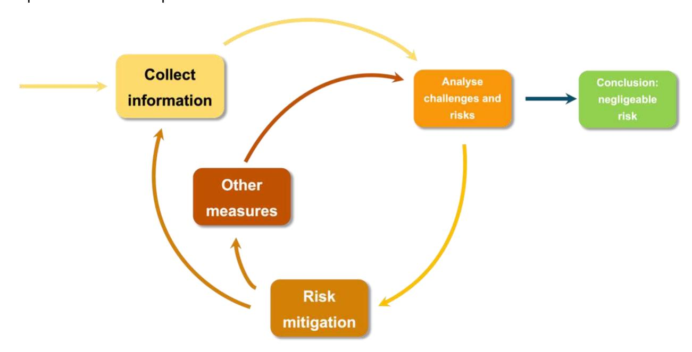

*Figure 1: the steps of due diligence*

Regarding the role of the various parties in due diligence, it should be remembered that the operator assumes all risks related to non-compliance with the EUDR of products imported into the EU. It is the operator who has the obligation to carry out due diligence (article 4.3.), who is liable, and who can be sanctioned in case of non-compliance (article 25).

Nevertheless, the European Union has recognised that producing countries can facilitate the work of operators and competent authorities, in particular by providing information that allows for a better understanding of the applicable national laws (this is the purpose of the module 1, which mapped the legal requirements relevant to cocoa).

# **Annex 2—Informaঞon on the Rainforest Alliance and Fairtrade systems**

## **Informaঞon on Rainforest Alliance**

Rainforest Alliance is a private certification that focuses on the protection of land and forests in a way that advances the rights and prosperity of rural communities according to three main principles: social equity, environmental responsibility and economic viability of farming communities. It is aimed at **small and large farmers[13](#page-48-3)**, and organisations such as processors, importers, exporters, brands and distributors, particularly for cocoa.

The audit cycle runs over **three years** with an **annual verification**. Rainforest Alliance has set up systems to help producers and supply chain actors comply with EUDR requirements. A **voluntary module[14](#page-48-4)** has been created with certain requirements aligned with the EUDR: *polygons/geolocation points; anti-corruption; proof of payment of fees, royalties and local taxes at the level of the production plot; conversion of forests after 31 December 2020*. These requirements **only apply to holders of a farm certificate in the cocoa and coffee sector**. Certified farms can choose to apply these additional requirements and include them in their audits in order to encourage stakeholders further down their supply chains to comply with the EUDR and continue to sell their products on the European market.

Summaries of the audit reports of the farms including alignment with the EUDR module are **published online**: [https://www.rainforest-alliance.org/business/certification/list-of-eudr-aligned](https://www.rainforest-alliance.org/business/certification/list-of-eudr-aligned-certificate-holders/)[certificate-holders/](https://www.rainforest-alliance.org/business/certification/list-of-eudr-aligned-certificate-holders/)

# **Informaঞon on Fairtrade**

**Fairtrade** is a private **fair trade certification**. Its specifications (particularly for small producers[15](#page-48-5) and for cocoa[16](#page-48-6)) establish the requirements that actors in fair supply chains must meet, whether they are rural cooperatives, large farms or factories employing labour, or companies that buy and sell Fairtrade products. The Fairtrade specifications incorporate detailed social, economic and environmental criteria.

13 [SA-S-SD-1-V1.3FR](https://www.rainforest-alliance.org/wp-content/uploads/2023/03/SA-S-SD-1-V1.3FR-Norme-2020-de-Rainforest-Alliance-Exigences-pour-les-Exploitations-Agricoles.pdf)

14 [Alignement sur le Règlement Européen contre la Déforestation et la Dégradation des Forêts \(RDUE\) | Rainforest](https://www.rainforest-alliance.org/fr/resource-item/alignment-with-the-european-union-deforestation-regulations-eudr/)  [Alliance | Pour les entreprises](https://www.rainforest-alliance.org/fr/resource-item/alignment-with-the-european-union-deforestation-regulations-eudr/)

15 [Standards for small-scale producer organisations](https://www.fairtrade.net/en/why-fairtrade/how-we-do-it/standards/who-we-have-standards-for/standards-for-small-scale-producer-organisations.html)

16 [Cocoa](https://www.fairtrade.net/en/why-fairtrade/how-we-do-it/standards/who-we-have-standards-for/standards-for-small-scale-producer-organisations/cocoa.html)

After the first certification, the producer organisations are inspected at **least twice every three years**. In addition to these periodic surveillance audits, Flocert (the certification body in charge of the audits) regularly carries out unannounced audits.

As part of the implementation of the EUDR, the Cocoa and Coffee standards have been adapted: collection of geolocation data, deadlines and deforestation, traceability, etc.[17](#page-49-0)

17 [PowerPoint-Presentation](https://www.fairtrademaxhavelaar.ch/fileadmin/user_upload/publikationen/2024_03_Fairtrades_role_and_offer_to_business_to_support_compliance_with_the_EU_DR.pdf)