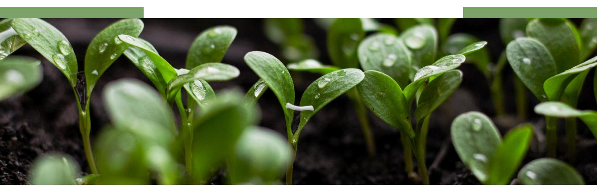
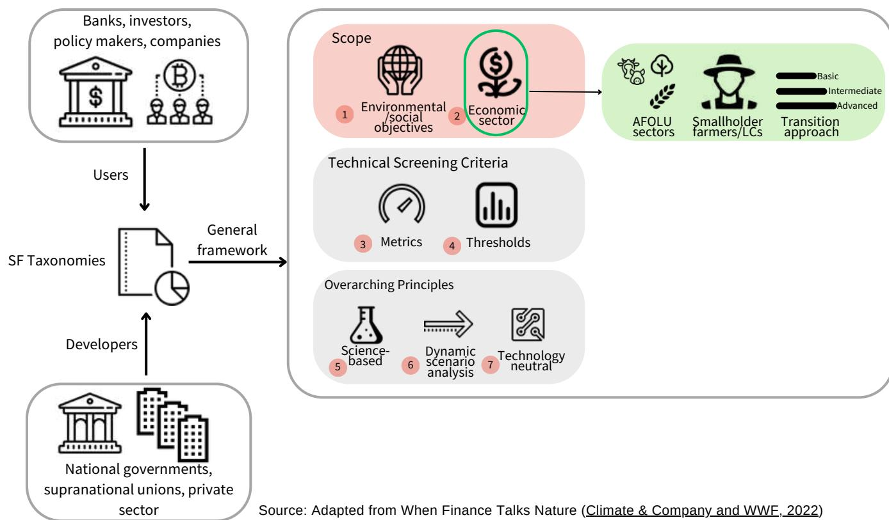
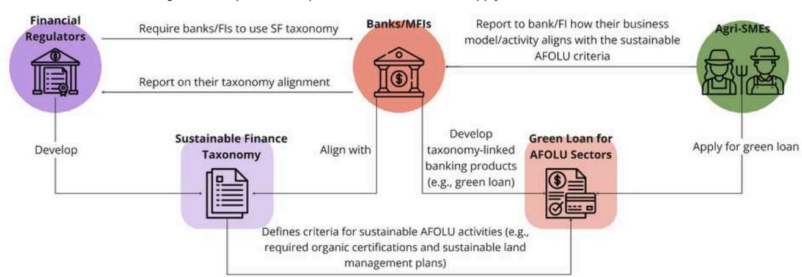

### **WHAT ARE SF TAXONOMIES?**

**1**

**SF Taxonomies** are **classification systems** that provide a clear and consistent framework and help **identify which economic activities make a substantial contribution and/or do no harm to climate-related, environmental and social objectives.**

Dear reader, in this edition of the Finance Briefing, we bring you insightful information on sustainable finance taxonomy (hereafter called **SF taxonomies**). Discover its core concepts, key users, applications for promoting deforestation-free supply chains, practical examples of how it can support smallholder farmers and vulnerable groups (LCs - Local Communities), and the latest developments in [SAFE countries](https://zerodeforestationhub.eu/projects/safe/).

# FINANCE BRIEFING SUSTAINABLE FINANCE UPDATES

**Keeping you up to date with the latest developments in the Sustainable Finance space**

### **SUSTAINABLE FINANCE TAXONOMIES**

[Through defining this common language of what is "sustainable," "green" or "social," the common purpose of SF](https://zerodeforestationhub.eu/projects/safe/) [taxonomies is to support ambitious sustainable development goals, reduce greenwashing and strengthen investors'](https://zerodeforestationhub.eu/projects/safe/) [confidence \(](https://zerodeforestationhub.eu/projects/safe/)[SBFN, 2024](https://www.sbfnetwork.org/wp-content/uploads/2024/05/SBFN-Toolkit_Sustainable-Finance-Taxonomies.pdf)[\)](https://zerodeforestationhub.eu/projects/safe/), thus incentivizing public and private capital mobilization for sustainable economic activities.

# WHO DEVELOPS AND USE SF TAXONOMIES?

[They are developed by national governments \(e.g.](https://zerodeforestationhub.eu/projects/safe/) [Vietnam](https://theinvestor.vn/finalization-of-green-taxonomy-a-matter-of-urgency-d9262.html)[\), by supranational unions at a regional level \(e.g.](https://zerodeforestationhub.eu/projects/safe/) [EU](https://finance.ec.europa.eu/sustainable-finance/tools-and-standards/eu-taxonomy-sustainable-activities_en)[,](https://zerodeforestationhub.eu/projects/safe/) [ASEAN](https://asean.org/book/asean-taxonomy-for-sustainable-finance/)[\) or sometimes by private sector entities \(e.g.](https://zerodeforestationhub.eu/projects/safe/) [FEBRABAN](https://www.sbfnetwork.org/wp-content/assets/policy-library/183_Brazil_Explanatory_Guide_to_FEBRABAN_Green_Taxonomy_2021_FEBRABAN_En.pdf%22%20%EF%B7%9FHYPERLINK%20%22https:/portal.febraban.org.br/paginas/1103/pt-br/), in Brazil). They can be [either mandatory or voluntary,](https://zerodeforestationhub.eu/projects/safe/) [focus on climate and/or beyond, and can include economic activities, such as Agriculture, Forestry, and Other Land Uses](https://zerodeforestationhub.eu/projects/safe/) [\(AFOLU\) sectors](https://zerodeforestationhub.eu/projects/safe/) (Figure 1).

SF taxonomies provide **transparency** and **key information** that can be used by different actors, such as **financial regulators, companies, policymakers, banks and financial institutions (FIs), and investors.** 

For example, **SF taxonomies** can be used by **banks** to easly identify lending opportunities to sustainable economic activities, which helps build **investors'** confidence in new sustainable instruments. **SF taxonomies** can also promote the inclusion of small and medium-sized enterprises (SMEs) in the green economy transition by especially including SME-focused economic activities [\(SBFN, 2024](https://www.sbfnetwork.org/wp-content/uploads/2024/05/SBFN-Toolkit_Sustainable-Finance-Taxonomies.pdf)).

[Source: Adapted from W](https://zerodeforestationhub.eu/projects/safe/)hen Finance Talks Nature [\(](https://zerodeforestationhub.eu/projects/safe/)[Climate & Company and WWF, 2022](https://climateandcompany.org/publications/report-when-finance-talks-nature/#flipbook-df_3130/1/)[\)](https://zerodeforestationhub.eu/projects/safe/)

[Until now only few taxonomies encompass economic activities in the AFOLU sectors \(see below\) and even less have](https://zerodeforestationhub.eu/projects/safe/) [included a specific focus on smallholder farmers and LCs. We recommend:](https://zerodeforestationhub.eu/projects/safe/) 

Include objectives beyond climate, related to biodiversity protection, water conservation, and social aspects, etc. Include economic activities that directly impact deforestation, especially AFOLU sectors, even if agreement on common criteria is challenging. Include specific criteria to allow for typical smallholder farming or forest extractive activities to become taxonomy compliant. Establish TSC grounded in scientific evidence (including locally generated data and indicators). Integrate a transition approach for AFOLU sectors, defining different levels of practice complexities (e.g., basic, intermediate, advanced farming practices), which enables the integration of smallholder farmers and LCs with limited access to resources and knowledge. Ensure that the TSC can be achieved without restricting the use of specific technologies. 1 2 3 5 6 7 Create simplified Technical Screening Criteria (TSC) and thresholds that are achievable for smallholder farmers and LCs. For example, these criteria could consider certifications that are locally available and accessible by these actors. 4 Systematically screen available taxonomies and those in the making for if and how they integrate smallholder systems in the AFOLU sectors and promote this further. 8

### WHY SHOULD SMALLHOLDER FARMERS AND LOCAL COMMUNITIES BE SUPPORTED BY SF TAXONOMIES IN TRANSITIONING TO DEFORESTATION-FREE SUPPLY CHAINS?

[Smallholder farmers and LCs generally face many barriers regarding the access to finance. Overall,](https://zerodeforestationhub.eu/projects/safe/) **[less than 5% of the](https://zerodeforestationhub.eu/projects/safe/) [annual](https://zerodeforestationhub.eu/projects/safe/) [climate-smart investment](https://blogs.worldbank.org/en/climatechange/how-financial-institutions-can-create-a-climate-smart-future-for?cid=ECR_TT_worldbank_EN_EXT&s=09)[s needed](https://zerodeforestationhub.eu/projects/safe/)** [to agri-food systems - estimated at](https://zerodeforestationhub.eu/projects/safe/) **[US\\$260 billion per year](https://zerodeforestationhub.eu/projects/safe/)** [- actually flow into](https://zerodeforestationhub.eu/projects/safe/) [AFOLU sectors \(](https://zerodeforestationhub.eu/projects/safe/)[World Bank Group, 2024](https://www.worldbank.org/en/topic/agriculture/publication/recipe-for-livable-planet)[;](https://zerodeforestationhub.eu/projects/safe/) [CPI, 2023](https://www.climatepolicyinitiative.org/wp-content/uploads/2023/11/Landscape-of-Climate-Finance-for-Agrifood-Systems.pdf)[\).](https://zerodeforestationhub.eu/projects/safe/) Integrating AFOLU-related economic activities into SF taxonomies is therefore necessary step to increase that number.

[Including specifically systems that are mostly carried out by smallholders, LCs and Agri-SMEs can help increase the flow of](https://zerodeforestationhub.eu/projects/safe/) [capital into climate-smart and deforestation-free agri-food systems implemented by these actor groups. Recalling that](https://zerodeforestationhub.eu/projects/safe/) [taxonomies clearly define sustainable AFOLU-related activities, which shall support its users in developing new regulations](https://zerodeforestationhub.eu/projects/safe/) [and financial mechanisms that can unlock public and private investments into the sectors. A practical application example of](https://zerodeforestationhub.eu/projects/safe/) [the use of](https://zerodeforestationhub.eu/projects/safe/) **[SF taxonomies](https://zerodeforestationhub.eu/projects/safe/)** [is provided below \(Figure 2\).](https://zerodeforestationhub.eu/projects/safe/)

| Sector      | EU | Colombia | Rwanda | Mexico | Mongolia | China | Sri Lanka | Costa Rica | Indonesia | Vietnam | Brazil* |
|-------------|----|----------|--------|--------|----------|-------|-----------|------------|-----------|---------|---------|
|             |    |          |        |        |          |       |           |            |           |         |         |
| Agriculture |    |          |        |        |          |       |           |            |           |         |         |
| Forestry    |    |          |        |        |          |       |           |            |           |         |         |
| Livestock   |    |          |        |        |          |       |           |            |           |         |         |

Smallholder and Agri-SME Finance and Investment Network (SAFIN). [Agri-SMEs Taxonomy](https://safinetwork.org/wp-content/uploads/2023/03/e03597_6cc65702918e4bdeae734f54b3585b32.pdf) (2021). Climate & Company and WWF[. When Finance Talks Nature](https://climateandcompany.org/publications/report-when-finance-talks-nature/) (2022). UNEP. [Common Framework of Sustainable Finance Taxonomies for Latin America and the Caribbean](https://www.unep.org/resources/report/common-framework-sustainable-finance-taxonomies-latin-america-and-caribbean) (2023). Climate Policy Initiative. [Brazilian Sustainable Taxonomy: Inputs for Classifying Land Use Activities \(](https://www.climatepolicyinitiative.org/wp-content/uploads/2024/05/Brazilian-Sustainable-Taxonomy.pdf)2024).

### **RECOMMENDED TRAININGS**

### **READING**

# FURTHER READING & TRAININGS

GIZ. [Introduction to Sustainable Finance Taxonomies](https://unccelearn.org/course/view.php?id=160&page=overview&lang=en). UN Climate Change Learning Partnership.

Disclaimer: This briefing is a partnership between Climate & Company and the SAFE (Sustainable Agriculture for Forest Ecosystems) project, financed by the European Union (EU) and the German Federal Ministry for Economic Cooperation and Development (BMZ). SAFE is part of the Fund for the Promotion of Innovation in Agriculture (i4Ag) and implemented by Deutsche Gesellschaft für Internationale Zusammenarbeit (GIZ). The aim of the collaboration is to identify and foster solutions to mobilise financial sources, especially for vulnerable groups, and enhance gender-transformative financial frameworks for investments in deforestation-free supply chains. Its contents are the sole responsibility of Climate & Company and do not necessarily reflect the views of the EU or the Federal Ministry for Economic Cooperation and Development (BMZ). To learn more visit: [SAFE - Team Europe Initiative on Deforestation-free Value Chains](https://zerodeforestationhub.eu/) and [Climate and Company's dedicated project page.](https://climateandcompany.org/projects/solutions-for-mobilising-financial-sources/)

\***Brazil** began developing a national sustainable finance taxonomy in 2023, with official publication expected in 2025.

[Given that most of the](https://zerodeforestationhub.eu/projects/safe/) **[SF taxonomies](https://zerodeforestationhub.eu/projects/safe/)** [currently adopted are in their early stages of implementation, concrete results](https://zerodeforestationhub.eu/projects/safe/) [regarding their effectiveness in improving financial access for these actors can be expected soon. Globally, around 18](https://zerodeforestationhub.eu/projects/safe/) [sustainable finance taxonomies have already been adopted, 9 are in the developing phase and 23 are in the initiation](https://zerodeforestationhub.eu/projects/safe/) [phase. Considering the first two groups, only a few taxonomies encompass economic activities in the AFOLU sectors](https://zerodeforestationhub.eu/projects/safe/) [\(Figure 3\).](https://zerodeforestationhub.eu/projects/safe/)

[Other countries are making progress in developing their sustainable finance mechanisms. Ecuador, for example, is](https://zerodeforestationhub.eu/projects/safe/) [developing its](https://zerodeforestationhub.eu/projects/safe/) **[SF taxonomy](https://zerodeforestationhub.eu/projects/safe/)**[, a process that began in 2023, while Zambia is expected to develop its national](https://zerodeforestationhub.eu/projects/safe/) **[SF](https://zerodeforestationhub.eu/projects/safe/) [taxonomy](https://zerodeforestationhub.eu/projects/safe/)** [within the 2024-2025 timeframe.](https://zerodeforestationhub.eu/projects/safe/)

# PRACTICAL EXAMPLES

**[Colombia](https://www.taxonomiaverde.gov.co/webcenter/ShowProperty?nodeId=/ConexionContent/WCC_CLUSTER-191401)**, **[Costa Rica](https://www.unepfi.org/wordpress/wp-content/uploads/2024/08/Taxonomia-de-Finanzas-Sostenibles-de-Costa-Rica.pdf)** and **[Rwanda](https://www.minecofin.gov.rw/rwandagreentaxonomy#:~:text=Rwanda) [Green Taxonomies](https://zerodeforestationhub.eu/projects/safe/)** [adopted a transition model towards more sustainable](https://zerodeforestationhub.eu/projects/safe/) [production conditions for the AFOLU sectors. They set three levels of practices allowing for the inclusion of smallholder](https://zerodeforestationhub.eu/projects/safe/) [farmers. Special reduced requirements were established by the Rwanda Taxonomy for smallholder farmers to align](https://zerodeforestationhub.eu/projects/safe/) [their projects with the taxonomy.](https://zerodeforestationhub.eu/projects/safe/)

[Figure 3: AFOLU-related taxonomy developments around the world](https://zerodeforestationhub.eu/projects/safe/)