# **REPORT**

STUDY ON TRACEABILITY TOOLS FOR COFFEE AND TIMBER PRODUCTS IN VIET NAM *With a special focus on access and application by smallholders and businesses*

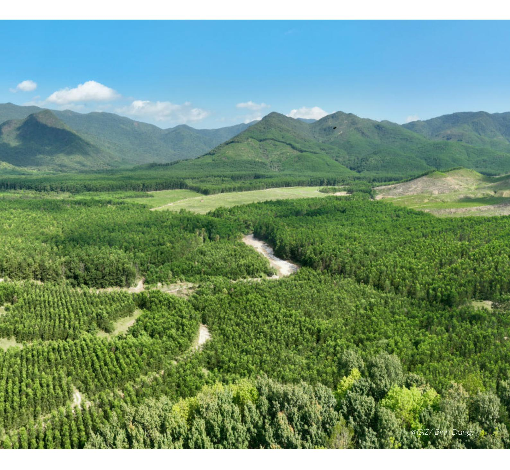

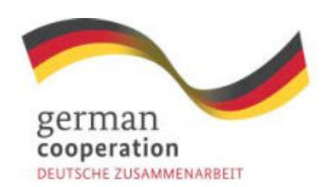

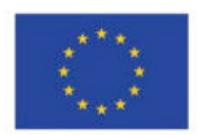

The "EUDR Engagement" project in Southeast Asia is co-funded by the European Union and the Federal Republic of Germany. Deutsche Gesellschaft für Internationale Zusammenarbeit (GIZ) GmbH has been commissioned to implement it as part of the BMZ-funded global programme "Sustainability and Value Added in Agricultural Supply Chains", which is part of the special initiative "Transformation of Agricultural and Food Systems" by the German Federal Ministry for Economic Cooperation and Development.

*Disclaimer: This publication was co-funded by the European Union and BMZ. The content of this publication is the sole responsibility of the authors and does not necessarily reflect the views of the EU or BMZ. The information in this study, or upon which this study is based, has been obtained from sources the authors believe to be reliable and accurate. While reasonable eorts have been made to ensure that the contents of this publication are factually correct, GIZ does not accept responsibility for the accuracy or completeness of the contents of this publication. The mention of specific companies or products of manufacturers, whether or not these have been patented, does not imply that they have been endorsed or recommended by GIZ in preference to others of a similar nature that are not mentioned. The views expressed in this information product are those of the author(s) and do not necessarily reflect the views or policies of GIZ.* 

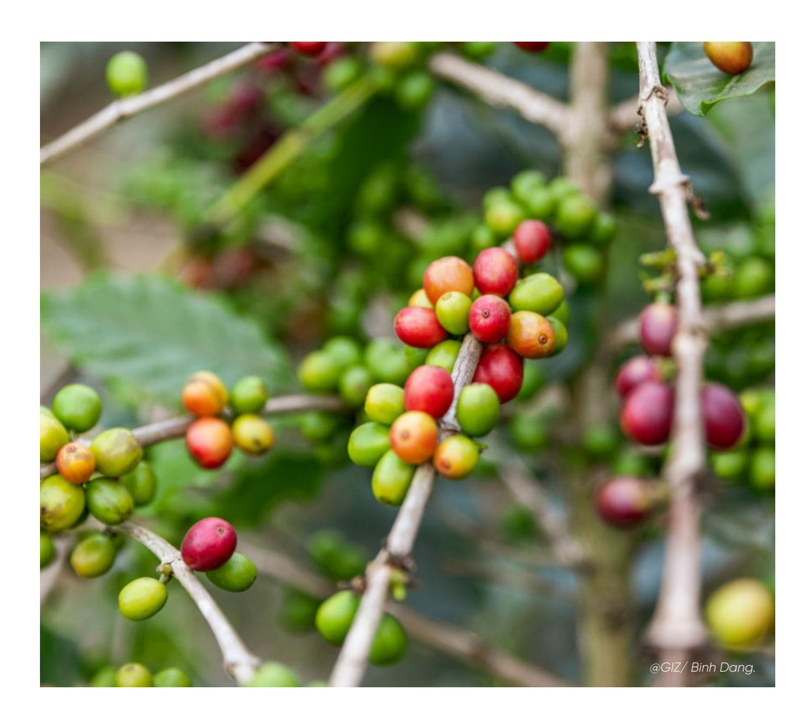

### **TABLE OF CONTENTS**

**[01. EXECUTIVE SUMMARY](#page-5-0)** 06

**[02. OBJECTIVE OF THE STUDY](#page-9-0)** 10

#### **[05. ANALYSIS OF TRACEABILITY](#page-26-0) SYSTEMS AND TOOLS** 27

|      | 28                                                                                                                                                                                                     |
|------|--------------------------------------------------------------------------------------------------------------------------------------------------------------------------------------------------------|
| 5.1. | Traceability systems in Viet Nam 5.1.1. Technical characteristics of traceability systems in Viet Nam 5.1.2. Institutional characteristics 5.1.3. Key dierences between coee and timber traceability |
| 5.2. | Deep dive: EUDR and VNTLAS                                                                                                                                                                             |
| 5.3. | Enabling factors and challenges for traceability in Viet Nam related to EUDR readiness 5.3.1. Enabling factors 5.3.2. Challenges                                                                       |
| 5.4. | Traceability tools for dierent agricultural commodities in Viet Nam                                                                                                                                   |

#### **[03. INTRODUCTION](#page-11-0)** 12

13

14 15

16

[3.1. Background of the EUDR and relevance](#page-12-0)

for Viet Nam

3.2. [EUDR requirements](#page-13-0)

[3.3. Sources and the production of coee](#page-14-0) 

and timber in Viet Nam

3.4. [Existing traceability systems for coee](#page-15-0) 

and timber in Viet Nam

#### **[04. METHODOLOGICAL FRAMEWORK](#page-17-0) OF THE STUDY**

18

|      | 19                                                                                      |
|------|-----------------------------------------------------------------------------------------|
| 4.1. | Data collection                                                                         |
| 4.2. | Findings from previous EUDR preparedness checks                                         |
| 4.3. | Analysis framework for traceability systems and tools                                   |
| 4.4. | Criteria for evaluating traceability systems and tools                                  |
| 4.5. | Approach for the readiness assessment                                                   |
| 4.6. | Selected certification and traceability systems for further analysis                    |
| 4.7. | Selected traceability tools in the agricultural sector in Viet Nam for further analysis |

#### **[06. TRACEABILITY PRACTICES ALONG](#page-36-0) COFFEE AND TIMBER VALUE CHAINS** 37

| 6.1. | Smallholders                            |
|------|-----------------------------------------|
| 6.2. | Enterprises and local traders           |
| 6.3. | Business development services           |
| 6.4. | Governmental bodies                     |
| 6.5. | Opportunities and challenges for        |
| 6.6. | Opportunities and challenges for the    |
| 6.7. | Lessons learnt from the VPA FLEGT,      |
| 6.8. | Evaluation of coee and timber sectors’ |

**07. DISCUSSION AN [RECOMMENDATIONS](#page-56-0)**

57

**[08. CONCLUSIONS](#page-62-0)** 63

# **LIST OF TABLES**

| Table 1 | Criteria for the analysis of traceability systems and tools                          | 21 |
|---------|--------------------------------------------------------------------------------------|----|
| Table 2 | Overview of selected certification and traceability systems                          | 24 |
| Table 3 | Overview of selected traceability tools                                              | 26 |
| Table 4 | Comparison of the requirements stipulated by VNTLAS and EUDR                         | 31 |
| Table 5 | Assessment of five selected traceability tools for agricultural products in Viet Nam | 36 |
| Table 6 | Opportunities and challenges of smallholders and business associations               | 49 |
| Table 7 | Opportunities and challenges for the application of traceability tools               | 51 |
| Table 8 | Status quo comparison on traceability between coffee and timber sectors              | 56 |

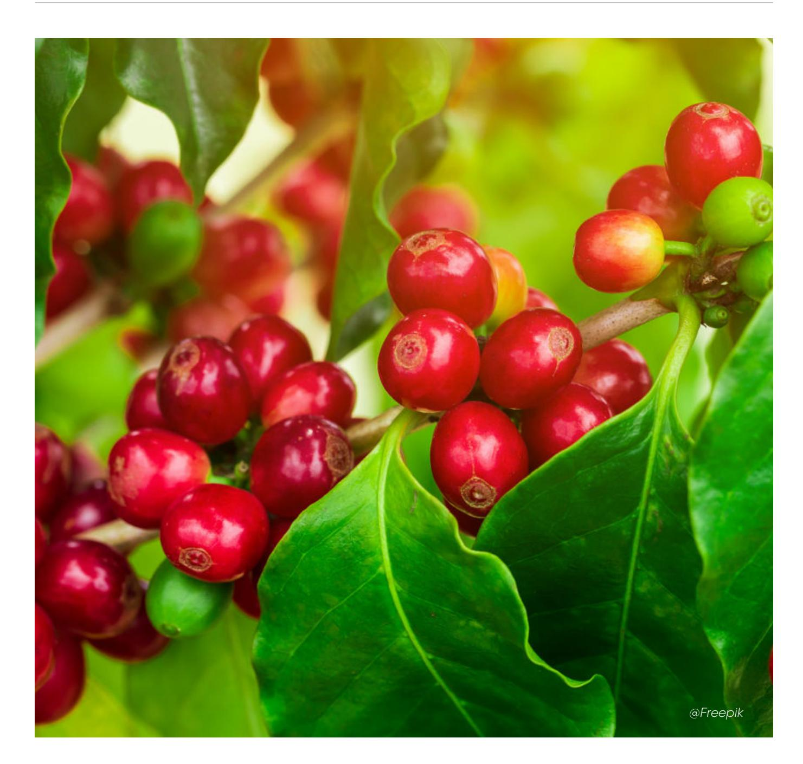

## **LIST OF ACRONYMS**

| 4C        | Common Code for the Coffee Community                                                                                                                                  |
|-----------|-----------------------------------------------------------------------------------------------------------------------------------------------------------------------|
| APIs      | Application Programming Interfaces                                                                                                                                    |
| Apps      | Applications                                                                                                                                                          |
| BDS       | Business Development Service                                                                                                                                          |
| CITES     | Convention on International Trade in Endangered Species                                                                                                               |
| CoC       | Chain of Custody                                                                                                                                                      |
| EFI/UNDP  | European Forest Institute/United Nations Development Programme                                                                                                        |
| EU        | European Union                                                                                                                                                        |
| EUDR      | European Union Deforestation Regulation                                                                                                                               |
| EUTR      | European Union Timber Regulation                                                                                                                                      |
| ERP       | Enterprise Resource Planning                                                                                                                                          |
| FDI       | Foreign Direct Investment                                                                                                                                             |
| FFB       | Farmer Field Book                                                                                                                                                     |
| FLEGT-VPA | Forest Law Enforcement, Governance and Trade Voluntary Partnership Agreement                                                                                          |
| FRMS      | Forest Resources Monitoring System                                                                                                                                    |
| FSC       | Forest Stewardship Council                                                                                                                                            |
| HS        | Harmonised System                                                                                                                                                     |
| ID        | Identity Document                                                                                                                                                     |
| IP        | Identity Preserved                                                                                                                                                    |
| IUU       | Illegal, Unreported and Unregulated                                                                                                                                   |
| LURC      | Land Use Right Certificate                                                                                                                                            |
| MAE       | Ministry of Agriculture and Environment                                                                                                                               |
| MB        | Mass Balance                                                                                                                                                          |
| MOIT      | Ministry of Industry and Trade                                                                                                                                        |
| NGO       | Non-governmental Organisation                                                                                                                                         |
| PEFC      | Programme for the Endorsement of Forest Certification                                                                                                                 |
| PFMB      | Protection Forest Management Board                                                                                                                                    |
| PUC       | Production Unit Code                                                                                                                                                  |
| QR        | Quick Response                                                                                                                                                        |
| RA        | Rainforest Alliance                                                                                                                                                   |
| SG        | Segregation                                                                                                                                                           |
| SME       | Small and Medium Enterprise                                                                                                                                           |
| TLAS      | Timber Legality Assurance System                                                                                                                                      |
| US        | United States                                                                                                                                                         |
| USDA      | United States Department of Agriculture                                                                                                                               |
| UTZ       | Programme and a label for sustainable farming. The UTZ certification program was born as "UTZ kapeh" meaning "good coffee" in the Guatemalan Mayan language of Quiché |
| VNTLAS    | Viet Nam Timber Legality Assurance System                                                                                                                             |
| VFCS      | Viet Nam Forest Certification Scheme                                                                                                                                  |

# **EXECUTIVE 01. SUMMARY**

#### **01. EXECUTIVE SUMMARY**

The European Union (EU) introduced the EU Deforestation Regulation (EUDR) to reduce its contribution to global deforestation by setting stricter criteria for commodities linked to deforestation. Under this regulation, supply chain operators must establish robust traceability systems that can track products from farms to end users, including providing plot-level geolocation data. To meet this requirement, eective traceability systems and tools are essential. This study aims to provide an overview and assessment of Vietnamese traceability tools and systems across agricultural commodities with an emphasis on coee and timber value chains.

#### **Key findings**

Viet Nam serves as a major processing hub in global coee and timber supply chains, and the EU is an important market for both coee and timber sectors. Smallholders are key suppliers of raw materials for both sectors. While coee is primarily sourced from domestic smallholders, timber originates from both domestic (approx. 75%) and imported (approx. 25%) sources.

**In Viet Nam multiple traceability systems and tools for agricultural commodities have been established, but scope, coverage and integration remain limited for meeting EUDR requirements.** Public systems such as the Production Unit Code (PUC) and the Viet Nam Timber Legality Assurance System (VNTLAS) provide a regulatory foundation. At the same time private certification systems are also used. In 2025 around 30% of coee and roughly 15% of plantation timber production are captured under recognised schemes that collect geolocation and/or legality data. The remaining smallholder coee and timber producers remain outside certification systems. Institutional overlap, limited digital interoperability, and inconsistent data governance continue to constrain national traceability coverage. Although the VNTLAS cannot fully meet the information requirements set by the EUDR, it provides useful lessons and highlights the fact that due diligence and a functional traceability system are not simply technical add-ons but a core element that underpins legality and sustainability commitments.

**Institutional and technical characteristics reflect critical technical constraints, including gaps in geolocation precision, legal documentation, and data ownership.** The EUDR requires six-digit coordinate accuracy, and among others, evidence of legal land use. Most existing systems used in Viet Nam store point coordinates but not polygons, and smallholder land-use documentation is often incomplete or outdated. Inter-agency coordination remains largely ad hoc, leaving unclear responsibilities for data verification and system maintenance. Despite these gaps, Viet Nam's legal

framework for the VNTLAS and Forest Resources Monitoring System (FRMS) oers an important platform for scaling traceability beyond timber to agricultural commodities.

**The assessment of traceability tools developed or used in Viet Nam for agricultural commodities and their relevance to EUDR traceability requirements shows that fragmentation and a lack of unified data standards limit information-sharing.** The PUC demonstrates high alignment with the regulatory system and legality verification. NextFarm and TE-FOOD excel in user-friendly mobile interfaces and VietGAP and Vietrade iTrace247 support quality certification and export documentation. However, interoperability across platforms is weak, and data standards for coordinates and meta data dier. The absence of unified Application Programming Interfaces (API) or a national database limits information-sharing between public and private solutions.

**Readiness levels for traceability, i.e. for providing information according to EUDR requirements in the timber and coee sectors, varies substantially between provinces.** In producing provinces such as Gia Lai, traceability systems such as PUCs and certification systems have been applied by stakeholders for around two decades. Nevertheless, smallholders still face challenges in mapping plots and adopting digital tools. Downstream provinces such as Binh Duong, Dong Nai, and Ho Chi Minh City depend heavily on data from sourcing provinces, but verification remains dicult for buyers.

**Mixing of products are key threats to meeting EUDR requirements.** Viet Nam imports large volumes of raw timber from multiple origins and often mixes lots during processing; similar challenges occur in coee blending.

**Interoperability oers the fastest path to EUDR readiness.** A national data exchange protocol to enable data transfer between government tools and systems and private actors could make it easier for operators to provide data for buyers according to EUDR requirements without rebuilding systems from scratch. Pilots could demonstrate proof of concept and inform national scaling.

**Integration of stakeholders:** Smallholders and their associations are central to traceability development, and their inclusion will be critical for buyers to achieve EUDR compliance at scale. This includes building inclusive systems that integrate existing provincial tools, leverage cooperative networks, and align government and private sector eorts.

#### **Recommendations**

The Vietnamese Government should provide institutional and technical support to establish coordination for relevant interventions at regional, national, and local levels. This will ensure the participation of government agencies, enterprises, local authorities, NGOs, smallholders, EU importers, and other key stakeholders. These interventions should:

- Hold regional, national and local dialogues and joint traceability initiatives to increase understanding of the need for cooperation in strengthening traceability and verification of legality for coee and timber products at dierent levels.
- Strengthen the VNTLAS: It is essential to upgrade the VNTLAS to meet EUDR requirements by including geolocation or updating forest/deforestation definitions.
- Adopt a unified national geolocation data framework defining coordinate formats according to international data standards and integrate existing coee and timber data layers into existing national portals or link them with open, interoperable platforms such as FAO's WHISP to enhance the enabling framework for EUDR application.
- Support cooperative-led smallholder mapping programmes that combine GPS polygon capture, simplified land-use verification, and cost-sharing mechanisms.

- Develop a national data gateway linking public systems with private platforms and focus on clarifying stakeholders' roles, aligning systems, and dedicating resources toward shared responsibility for traceability.
- Strengthen segregation of sources for compliant and non-compliant products and verification of legality for imported timber streams.
- Invest in provincial capacity-building on digital traceability for stakeholders in Viet Nam to enhance traceability and EUDR readiness, prioritising high-export provinces.

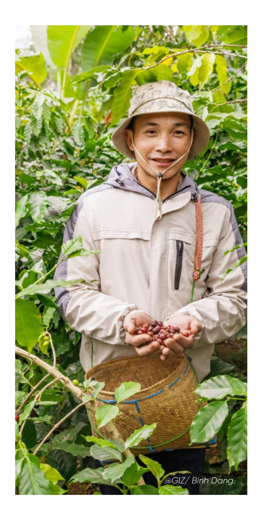

# **OBJECTIVE OF 02. THE STUDY**

# **2. OBJECTIVE OF THE STUDY**

The objective of this study is to provide an overview and assessment of Vietnamese traceability systems and tools for dierent agricultural commodities and the traceability situation for two value chains (timber and coee). Specifically, the study aims to provide insights for policymakers and stakeholders by:

- Assessing the current traceability situation for agricultural commodities in Viet Nam, including conducive and non-conducive factors influencing implementation and the relevance of traceability tools developed in Viet Nam to meet EUDR traceability requirements.
- Analysing the technical and institutional characteristics of traceability systems and tools for timber and coee, particularly their capacity to include geo-referencing and other EUDR-relevant information.
- Assessing the traceability of the timber and coee sectors among dierent provinces in Viet Nam for EUDR readiness.

# **03. INTRODUCTION**

### **3. INTRODUCTION**

#### **3.1. Background of the EUDR and relevance for Viet Nam**

Agriculture has significantly expanded and has a close link with deforestation worldwide. It is estimated that agriculture expansion causes 90% of deforestation globally (Pendrill et al., 2022). A significant share of agricultural commodities driving deforestation are traded internationally (Benhin, 2006; Bodo et al., 2021; Franco-Solís & Montanía, 2021; Pendrill et al., 2019). Therefore, the EU has adopted the EUDR to minimise the EU's contribution to deforestation and forest degradation. The EUDR is aligned with several international declarations and EU policy goals, the German Government, and partner countries in the (sub)tropics (Indrasto et al., 2024; Truong et al., 2025). The EUDR contributes to the implementation of various important global agreements such as the Sustainable Development Goals, the Paris Agreement, the Kunming Montreal Global Biodiversity Framework, and the Glasgow Leaders' Declaration on Forests and Land Use, all of which emphasise the critical need to protect the world's forests.

According to the regulation, companies placing relevant products on the EU market or exporting them from there must ensure through due diligence that they are produced in accordance with the relevant legislation of the country of production (Art. 3b) and without deforestation or forest degradation after 31 December 2020 (Art. 3a). The EUDR aects Southeast Asian countries because they export relevant commodities such as palm oil, rubber, coee, cocoa, and timber to the EU market (Indrasto et al., 2024; Nadras et al., 2024; Simonnet, 2023; Truong et al., 2025). The EU is an important market for Vietnamese coee, rubber, and timber.

To comply with EUDR requirements, traceability is essential for verifying the legality and deforestation-free status of Vietnamese coee, rubber and timber products exported to the EU. Geographic information linking products to plots of

land is already used by part of the industry in Viet Nam and several certification organisations. Similar requirements are also a core element of many corporate zero deforestation commitments (Bui, 2020; Iwanaga et al., 2024). Remote sensing data (air photos and satellite images) or other information (e.g., photographs in the field with linked geotags and time stamps) may be used for verification whether the geolocation of declared commodities and products is linked to deforestation or not.

This study provides insights into the development, application, and interoperability of traceability tools across dierent commodities, oering recommendations to guide government agencies, private companies, and producers to improve supply chain transparency. The findings can be linked with similar studies in other countries to inform regional and global discussions on sustainable commodity trade. Eventually, the findings can contribute to strengthening Viet Nam's policy and legal framework for traceability by identifying practical pathways for harmonising national and private traceability systems with EUDR requirements.

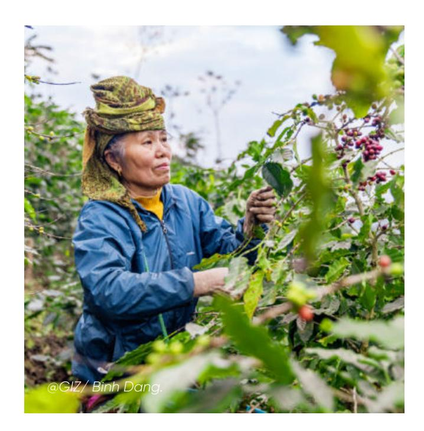

#### **3.2. EUDR requirements**

As stipulated by the EUDR, products must satisfy three key requirements. All products exported to the EU market must be proven to be deforestation-free, meaning they were not produced on land that was deforested or degraded after 31 December 2020. These products must comply with related legal documents from the producing countries. To demonstrate compliance, operators must exercise due diligence to ensure traceability and legality in the countries of production.

Companies, defined as "operators and traders" under the EUDR, must confirm compliance with a due diligence statement accompanying the respective product. Relevant legislation in this context means the national and sub-national laws relevant for the area of production such as land use rights, environmental protection, forest-related rules, third party rights, labour rights, human rights protected under international law, the principle of free, prior and informed consent (FPIC), tax, anti-corruption, trade and customs regulations (see Art. 2 (40) EUDR)*01* Under the EUDR, smallholders, private enterprises or government actors in producing countries do not have any direct obligations. Supply chain actors will however be asked by their business partners to provide EUDR-relevant information.

As stipulated by the EUDR, products must satisfy three key requirements. All products exported to the EU market must be proven to be deforestation-free, meaning they were not produced on land that was deforested or degraded after 31 December 2020. These products must comply with related legal documents from the producing countries. To demonstrate compliance, operators must exercise due diligence to ensure traceability and legality in the countries of production.

Companies, defined as "operators and traders" under the EUDR, must confirm compliance with a due diligence statement accompanying the respective product. Relevant legislation in this context means the national and sub-national laws relevant for the

area of production such as land use rights, environmental protection, forest-related rules, third party rights, labour rights, human rights protected under international law, the principle of free, prior and informed consent (FPIC), tax, anti-corruption, trade and customs regulations (see Art. 2 (40) EUDR)*01* Under the EUDR, smallholders, private enterprises or government actors in producing countries do not have any direct obligations. Supply chain actors will however be asked by their business partners to provide EUDR-relevant information.

Traceability to the plot of land (with the EUDR requirement to collect geographic coordinates of plots where the commodities were produced with an accuracy of data points of at least 6 digits, and polygons for plots with more than 4 ha) is necessary to demonstrate deforestation is not occurring at a specific location (Tô & Lương, 2023). The geolocation coordinates need to be provided in due diligence statements that operators are required to submit to the Information System ahead of exporting products to or from the EU market (Dueld & Christian, 2024). The traceability requirements apply to each batch of relevant commodities placed on the EU market or exported from there. In addition, according to Article 10 1) (i) and (j) on risk assessment, the operator must also assess the complexity of the supply chain and the risk of circumvention, in particular the risk that relevant products could have been mixed with products of unknown origin or non-compliant products.

The EUDR applies to seven agri-forestry products: cattle, cocoa, coee, natural rubber, palm oil, soy, and wood as well as certain derived products. All products covered by the EUDR are listed in Annex I. The EUDR entered into force on 29 June 2023 and will apply to larger companies from 30 December 2026.

*01More information on the legality criterion is available in the ocial EUDR Guidance:*

*https://green-forum.ec.europa.eu/deforestation-reg ulation-implementationold/subjects-obligations\_en* 

#### **3.3. Sources and the production of coee and timber in Viet Nam**

Viet Nam plays a dual role in the global agri-forestry commodity supply chain as both producer and processor, relying on the import of raw materials to sustain its processing industry. In 2024, the country imported 139,000 tons of coee worth USD 527 million from sources including Laos, Indonesia, Brazil, serving both production and consumption needs*02*. Similarly, Viet Nam imports significant volumes of timber to secure raw material supplies, sourcing wood from around 140 countries worldwide. In 2024, imports included 2.39 million m3 of sawn wood worth USD 923.05 million, 565,820 m3 of plywood worth USD 218.70 million, 268,520 m3 of veneer worth USD 328.45 million, and 837,900 m3 of fibreboard worth USD 201.30 million.*03* Imported wood accounted for roughly 40% of the total input materials for wood processors.

Domestic materials still account for the majority of raw inputs in the coee and timber sectors and mainly rely on smallholders. An estimated 88% of coee comes from domestic sources, while about 60% of timber is locally sourced. The raw material supply for Viet Nam's coee and plantation timber sectors primarily depends on smallholder households. The total area under coee cultivation nationwide is approximately 710,000 ha, with smallholders accounting for about 97%, involving around 700,000 farming households (General Statistics Oce, 2024; Tô & Lương, 2023). The total area of plantation forests in the country amounts to 4,730,557 hectares, of which

approximately 1,821,099 are managed by an estimated 1,100,000 households and individuals (Nguyen, 2024; Tô & Lương, 2023). Timber produced by smallholders is estimated to contribute around 60% of the total input supply for the national wood processing industry.

The cultivated land areas of smallholder farmers in the coee and timber sectors share the common characteristic of being small and fragmented. Most smallholders manage plots of about 1-2 hectares, although a few farmers have larger holdings ranging from several dozen to hundreds of hectares (Khuc et al., 2020; Truong et al., 2025). Each household often farms more than one plot of land, with some managing more than ten separate plots (Ha et al., 2025; Truong et al., 2025). On average, coee smallholders cultivate around 0.98 hectares, while smallholders in the forestry sector have an average cultivated area of about 1.3 hectares*04*

Given the complexity of both imported and domestic raw material sources, Viet Nam faces several risks. Many of the countries supplying raw materials have weak forest governance without plot-level geolocation, increasing the likelihood of high-risk wood entering the supply chain. The information flow for materials is unclear prior to importation, creating a risk of mixing compliant and non-compliant products.

*02https://giacaphe.com/89666/viet-nam-chi-hon-nua-ti-usd-nhap-khau-ca-phe/ 03https://vneconomy.vn/nganh-go-viet-nam-mong-muon-nhap-khau-go-nguyen-lieu-tu-hoa-ky. htm#:~:text=N%C4%83m%202024%2C%20Vi%E1%BB%87t%20Nam%20nh%E1%BA%ADp%20kh%E1%BA%A 9u%202%2C39%20tri%E1%BB%87u%20m3,tr%E1%BB%8B%20so%20v%E1%BB%9Bi%20n%C4%83m%202023. 04Calculated by the Consulting Group based on fieldwork and public information from government reports and other organizations.*

#### **3.4. Existing traceability systems for coee and timber in Viet Nam**

There is currently no legally binding national traceability system for the coee sector, and the Government does not yet require coee producers to comply with mandatory traceability regulations/national certification systems. At present, the Ministry of Agriculture and Environment (MAE) is piloting the use of PUCs under Decision 3156/QĐ-BNN-TT to strengthen farm registration and management. PUC is a coding and classification system that identifies farms, plantations, or production sites using standardised code formats. It enables traceability from farm to fork by linking geolocation data, certification databases, and quality control systems. This integration allows the Government to enforce, monitor, and implement policies across the commodity supply chain. However, this system is in the pilot phase, and has not yet been fully institutionalised or scaled nationwide.

It is estimated that voluntary certification systems are applied for around 30% of coee production nationwide. Currently, there are around ten certification systems for coee production in Viet Nam including: Fairtrade, Organic, RA/UTZ, Common Code for the Coee Community (4C) , ISO 9001:2015, HACCP, GMP, VietGAP, TCVN 4193:2014, Smithsonian Bird Friendly, and Chain of Custody (CoC) for Coee, Fruit & Vegetable industries. Four main coee certification systems in Viet Nam (Fairtrade, Organic, RA/UTZ, and 4C) were selected for analysis based on market relevance, adaptation rates in Viet Nam, data availability, and alignment with EUDR requirements.

Actors in certified coee supply chains often participate in more than one system (Đặng et al., 2025). Multi-certification helps actors reach dierent premium markets. A common feature of these certification systems is their strong emphasis on traceability to verify the origin of commodities and ensure compliance with social and environmental sustainability standards. For coee production within these systems, information can generally be traced from farm level to exporters (Đặng et al., 2025; Tô & Lương, 2023). Certified supply chains enable enterprises to maintain internal control

systems that include farm diaries, basic polygon mapping, and transaction records. However, non-certified coee still accounts for approximately 70% of total national production and is typically traded informally, relying on basic paper-based records that lack geolocation data and other key traceability information (Đặng et al., 2025).

In 2018, the Vietnamese Government signed the Voluntary Partnership Agreement on Forest Law Enforcement, Governance and Trade (VPA FLEGT) with the EU. In principle the VPA FLEGT sets out key aspects of the timber legality definition and the overall system to be put in place in Viet Nam to ensure legality along the entire value chain. After an overall system check jointly carried out by the EU and Viet Nam, FLEGT-licenced timber can be exported to the EU without further checks.

To implement the requirements of the VPA FLEGT, Viet Nam has developed the Vietnam Timber Legality Assurance System (VNTLAS). It was first mandated and stipulated by Decree 102/2020/ND-CP and other bylaws applicable to the timber value chain. Relevant bylaws require chain-of-custody (CoC) documentation and verification of legal origin for several articles. The VNTLAS is currently a paper-based system applying strict oversight with mandatory documentation at each stage of the supply chain. timber harvest, processing, and export. Decree 102 was amended on 30 September 2024 by Decree No. 120/2024/ND-CP, which revised and supplemented

The VPA FLEGT and the VNTLAS have significantly strengthened the legality of timber throughout the supply chain. It has enhanced coordination between government agencies and industry actors while raising awareness of legality standards. In line with these commitments, large exporters and certified processors have developed robust systems to maintain and present documentation for inspections and audits. Many enterprises have also adopted barcodes to track timber logs through harvesting,

transport, and processing stages (Dang & Nguyen, 2024; Seidel et al., 2012). While the VNTLAS mandates due diligence, it does not require geolocation data or evidence of deforestation-free status.

Two major global forest certification systems

operate in Viet Nam: the Forest Stewardship Council (FSC) and the Programme for the Endorsement of Forest Certification (PEFC). The Viet Nam Forest Certification Scheme (VFCS) serves as the national system endorsed by PEFC and is fully aligned with PEFC's international standards.

# **METHODOLOGICAL FRAMEWORK OF 04.THE STUDY**

# **4. METHODOLOGICAL FRAMEWORK OF THE STUDY**

#### **4.1. Data collection**

To complete this study, information from both secondary and primary sources was gathered. Secondary data was obtained from a range of materials, including ocial reports, websites, and academic journals. Primary data was collected through semi-structured interviews with 45 key informants from government agencies, NGOs, enterprises, traders, smallholders, and others. Interviewees were selected purposively based on their direct engagement in production, trade, or oversight of traceability initiatives.

Semi-structured interviews were conducted to assess the traceability systems and tools in the coee and timber sectors. These semi-structured questions allowed for consistency across interviews while enabling participants to elaborate on context-specific challenges and practices. The study explores how smallholders and companies record and manage information related to legality and traceability-related aspects (e.g., land use, farm diaries, and production dates). It also investigates the tools used by smallholders, companies, and other relevant stakeholders to maintain information flow along the supply chain.

Missing standardised plot-level geolocation and production dates: No unified system exists for smallholder plots, limiting traceability and verification.

Divergent forest/deforestation definitions: Dierences between national definitions and EUDR criteria create risks for verifying deforestation-free production.

Fragmented data systems and weak interoperability: Existing platforms are not fully linked.

Limited smallholder capacity and digital literacy: Many smallholders lack knowledge, tools, and training for geolocation, legal verification, and digital record-keeping.

Incomplete land tenure and local community rights complicates legality verification.

Insucient publicly available geospatial data for historic (pre-2020) verification: Pre-2020 forest maps and other historic layers are not readily available for risk assessment.

#### **4.2. Findings from previous EUDR preparedness checks**

Previous studies on EUDR preparedness of Viet Nam's coee and timber sectors (Aldinger et al., 2024; Le et al., 2024) identified key challenges, including missing information on geolocation and production dates, weak information flow along supply chains, and discrepancies between legal definitions in Viet Nam and the EU. These studies show:

Building on this foundation, the present study provides further insights into the readiness of traceability tools and systems in both sectors.

#### **4.3. Analysis framework for traceability systems and tools**

*Note: For this study, a traceability system is an organised framework of technologies, procedures, and governance mechanisms that enable the systematic identification, recording, tracking, and verification of products and their associated information throughout the supply chain to ensure transparency, accountability, and satisfaction of legal or market requirements. Whereas a traceability tool refers to a specific method, technology, or software such as barcoding, blockchain, or a digital platform used to collect, store, or share traceability data within that system.*

Available traceability systems were selected for analysis based on the following criteria:

Among numerous traceability tools existing in Viet Nam, five tools were selected for analysis based on the following criteria:

#### **GOVERNANCE (PUBLIC/PRIVATE):**

The system is managed by government agencies, private sectors or both.

#### **ACCESSIBILITY:**

The system can be restricted or open access for smallholders, traders, and companies, depending on user requirements and data sensitivity.

#### **REGULATORY CHARACTERISTICS:**

The use of the system may be either mandatory or voluntary.

#### **APPLICATION:**

The system can be applied to sustainability, health & safety, biodiversity or related issues.

#### **TRACEABILITY ECOSYSTEM (NATIONAL, SECTORAL, FIRM LEVELS):**

The tool should be currently used or piloted in Viet Nam for agricultural or related products, with demonstrated practical implementation and available information on its usability and performance.

#### **GOVERNANCE (PUBLIC/PRIVATE):**

The tool should be used by government agencies, private entities, or through public-private collaboration to reflect dierent traceability governance models.

#### **ACCESSIBILITY:**

The tool may oer open or restricted access for smallholders, traders, and companies, depending on user requirements and data sensitivity.

#### **REGULATORY CHARACTERISTICS:**

The tool's use may be either mandatory or voluntary, depending on its regulatory context.

#### **APPLICATION (MULTIPLE PRODUCTS):**

The tool should be applicable to multiple products relevant to the EUDR to support cross-sectoral learning and harmonisation.

#### **4.4. Criteria for evaluating traceability systems and tools**

Seven criteria were adapted from the established analyses frameworks for meeting EUDR requirements and previous studies (Dueld & Christian, 2024; Melo-Velasco et al., 2025; Rempel et al., 2012) to evaluate traceability tools and systems.

| No. Criteria 1 Data Ownership 2 Relevance to Forest definition: forest monitoring | Information required Who owns the data? Can farmers control how their data is used? hectares (ha), ≥10% canopy cover, trees ≥5 m)?           |
|-----------------------------------------------------------------------------------|----------------------------------------------------------------------------------------------------------------------------------------------|
| Verification system:                                                              | Does it integrate satellite imagery analysis tools for deforestation risk assessments?                                                       |
| Geospatial traceability: Geolocation data                                         | Does the tool link the product to a precise plot of land?                                                                                    |
| Geolocation: Production tracking                                                  | Does the tool capture geographical locations of the farm including polygons and points? volume, location, labour, environmental conditions)? |
| Frequency of data input:                                                          | Real-time, periodic, one-o.                                                                                                                 |
| Level of detail:                                                                  | Field-level, plot-level, or farm-level.                                                                                                      |
| Ease of use: Smallholder usability                                                | Is the tool easy to use for smallholders?                                                                                                    |
| Training and support:                                                             | Is technical support available?                                                                                                              |
| Language availability:                                                            | Is it available in Vietnamese?                                                                                                               |
| Commodity Traceability Solution multi-commodity?                                  | coverage: Is the tool specific to coee, timber, or                                                                                          |
| Geographic scope:                                                                 | Local, national, regional, or international application?                                                                                     |
| User group:                                                                       | Large enterprises, SMEs, or smallholders?                                                                                                    |
| Platform: Web-based, mobile app, paper-based inputs? Interoperability             |                                                                                                                                              |
| Oine functionality:                                                              | Can it be used in remote areas?                                                                                                              |
| Interoperability:                                                                 | Can data be integrated into government systems or other                                                                                      |

*Table 1 - Criteria for the analysis of traceability systems and tools*

#### **4.5. Approach for the readiness assessment**

The readiness assessment of actors at provincial level to align with EUDR requirements was based on two complementary dimensions: (1) the institutional and implementation readiness of provinces, and (2) the technical readiness of traceability tools. Based on these dimensions, the analysis considered six key aspects.

**1** The policy and institutional framework was examined to determine whether provincial authorities have strategies, regulations, or directives supporting legality verification, traceability, and deforestation-free production. **2** Infrastructure and digital capacity were assessed, including internet access, data systems, and technical facilities that enable digital traceability. **3** The level of stakeholder engagement was evaluated through the participation of local authorities, cooperatives, and smallholders in certification and traceability initiatives. **4** Certification and legality coverage measured the proportion of farms or production areas with verified legal land-use status or certification schemes. **5** Data availability captured the extent and accuracy of existing geolocation and production data. **6** Market orientation and export exposure reflected the degree of integration with EU requirements.

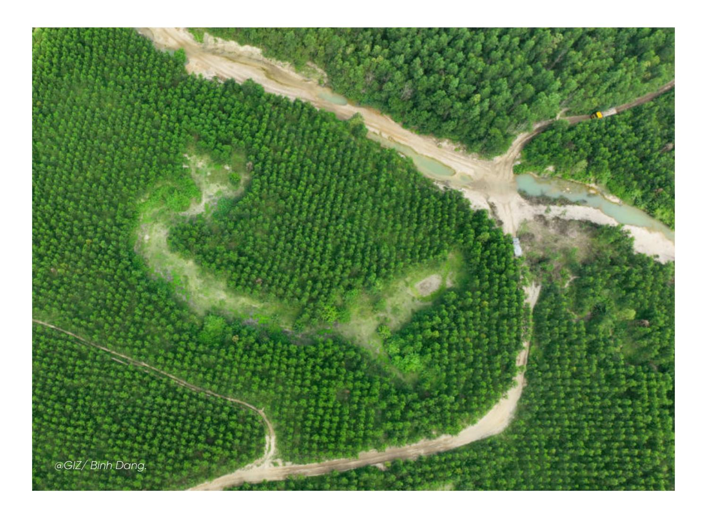

#### **4.6. Selected certification and traceability systems for further analysis**

Among the certification schemes and traceability systems*05*, UTZ/RA, 4C, Fairtrade, and Organic in the coee and FSC and PEFC in the timber sector were selected for further analysis based on governance, accessibility, regulatory characteristics, and application (Table 2).

These systems enable stakeholders to trace information back to the land parcels cultivated by smallholders. The systems include both public and private systems that support traceability in agricultural and forestry sectors. These systems dier in governance structures, accessibility levels, and regulatory requirements, ranging from mandatory

government-managed systems, such as VNTLAS, to voluntary private certification schemes like UTZ/RA, 4C, Fairtrade, FSC, and PEFC. Some systems, such as Organic, operate under both public and private frameworks depending on market regulations. While certification systems can support supply chain actors in gathering and providing relevant information for due diligence, they are no substitute for EU operators and traders regarding their obligations to fulfil EUDR due diligence requirements. It is estimated that 30% of coee smallholders have obtained certification (Đặng et al., 2025), while 15% of timber smallholders participate in certification programs (Thu, 2021).

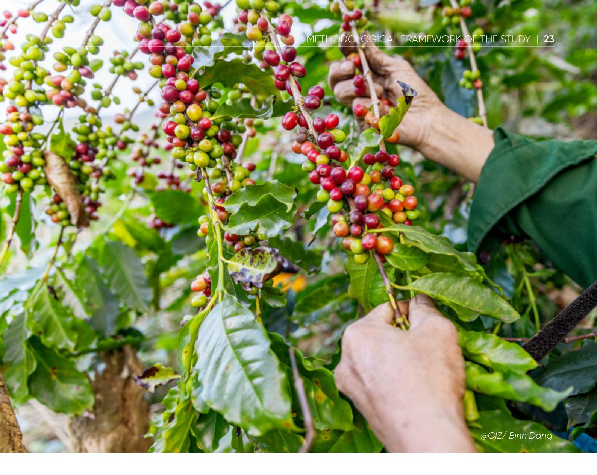

*05More information on the legality criterion is available in the ocial EUDR Guidance:*

*https://green-forum.ec.europa.eu/deforestation-regulation-implementationold/subjects-obligations\_en* 

| System Governance Accessibility Regulatory characteristics                                                                                                                                                                                                                                    | Application                                                                                                                                                                                                             |            |
|-----------------------------------------------------------------------------------------------------------------------------------------------------------------------------------------------------------------------------------------------------------------------------------------------|-------------------------------------------------------------------------------------------------------------------------------------------------------------------------------------------------------------------------|------------|
| Sustainable UTZ/RA Private Restricted / Voluntary                                                                                                                                                                                                                                             | farming                                                                                                                                                                                                                 | practices, |
| biodiversity Certified-mem ber access 4C Private Restricted / Voluntary                                                                                                                                                                                                                       | conservation, responsible business Good agricultural practices, supply                                                                                                                                                  | and        |
| chain Certified-mem ber access responsibility Fairtrade Private Partially open Voluntary Organic Public/ Private Partially open Mandatory: for (depending on labelled regulatory products in framework) regulated markets Voluntary: in others VNTLAS Public Restricted Mandatory value chain | transparency, Ensuring fair prices and social equity for farmers and workers Assuring environmental sustainability, soil health, and biodiversity National system for regulating and checking timber legality along the | and social |
| Global FSC Private Partially open Voluntary                                                                                                                                                                                                                                                   | certification sustainable forest products                                                                                                                                                                               | system for |
| International PEFC Private Partially open Voluntary                                                                                                                                                                                                                                           | non-profit                                                                                                                                                                                                              | system     |
| endorsing                                                                                                                                                                                                                                                                                     | national certification schemes                                                                                                                                                                                          | forest     |

*Table 2 - Overview of selected certification and traceability systems*

#### **4.7. Selected traceability tools in the agricultural sector in Viet Nam for further analysis**

Table 3 presents the selection of traceability tools analysed in this report to illustrate the diversity of tools currently applied in Viet Nam's agricultural sector. The selected tools represent dierent levels of the traceability ecosystem and include both public (e.g., PUC and Vietrade iTrace247) and private initiatives (e.g., NextFarm and TE-FOOD). Together, these tools reflect the evolving traceability landscape in Viet Nam, showcasing a mix of governance models, regulatory characteristics, and accessibility levels that collectively contribute to transparency in agricultural value chains.

The PUC system is a government-led digital registration platform assigning unique identifiers to registered farms, mainly used in pilot coee

programs. NextFarm, a private integrated platform, combines farm management with IoT (Internet of Things) sensors, GPS mapping, and multi-commodity production data collection. Vietrade iTrace247 operates as a hybrid government-industry export traceability system, enabling multi-commodity tracking with QR codes for buyers and partial integration with customs declarations. VietGAP Digital Traceability links certification compliance with detailed tracking of certified farms, including geolocation and documentation. Lastly, TE-FOOD leverages blockchain technology to provide farm-to-fork traceability focused on food safety, farm origin, and batch tracking for both domestic and export markets.

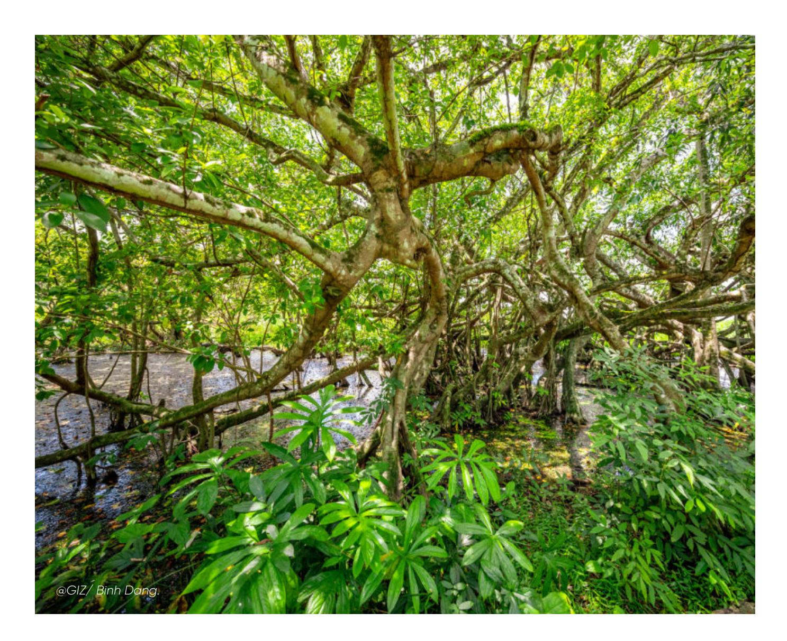

| Tool            | Traceability ecosystem                                                  | Governance                           | Accessibility                                      | Regulatory character                       | Application                                               |
|-----------------|-------------------------------------------------------------------------|--------------------------------------|----------------------------------------------------|--------------------------------------------|-----------------------------------------------------------|
| PUC             | National agricultural traceability system                               | Public (managed by MAE)              | Restricted                                         | Mandatory for export commodities           | Agriculture (coffee, pepper, cashew)                      |
| NextFarm        | Digital farm management and traceability platform                       | Private                              | Proprietary                                        | Voluntary                                  | Smart farming; production monitoring and traceability     |
| Vietrade        | National export traceability platform                                   | Public (developed by Vietrade /MOIT) | Partially open                                     | Voluntary                                  | Export supply chains across agricultural products         |
| iTrace247       | Certification and traceability standard for good agricultural practices | Public–Private partnership           | Open (certification info) / Restricted (farm data) | Voluntary/ mandatory for labelled products | Agricultural production (fruits, vegetables, aquaculture) |
| VietGAP TE-FOOD | Blockchain-based traceability system                                    | Private                              | Proprietary / permissioned blockchain              | Voluntary                                  | Food supply chains (meat, seafood, produce)               |

*Table 3 - Overview of selected traceability tools*

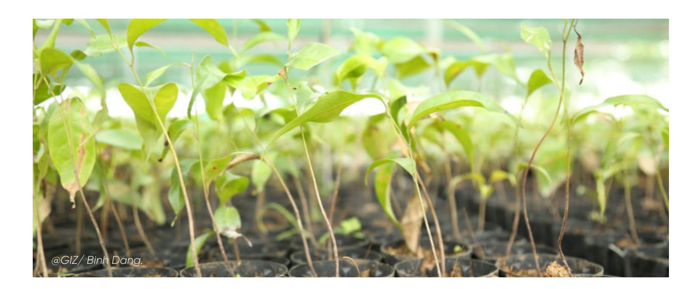

# **ANALYSIS OF TRACEABILITY SYSTEMS 05. AND TOOLS**

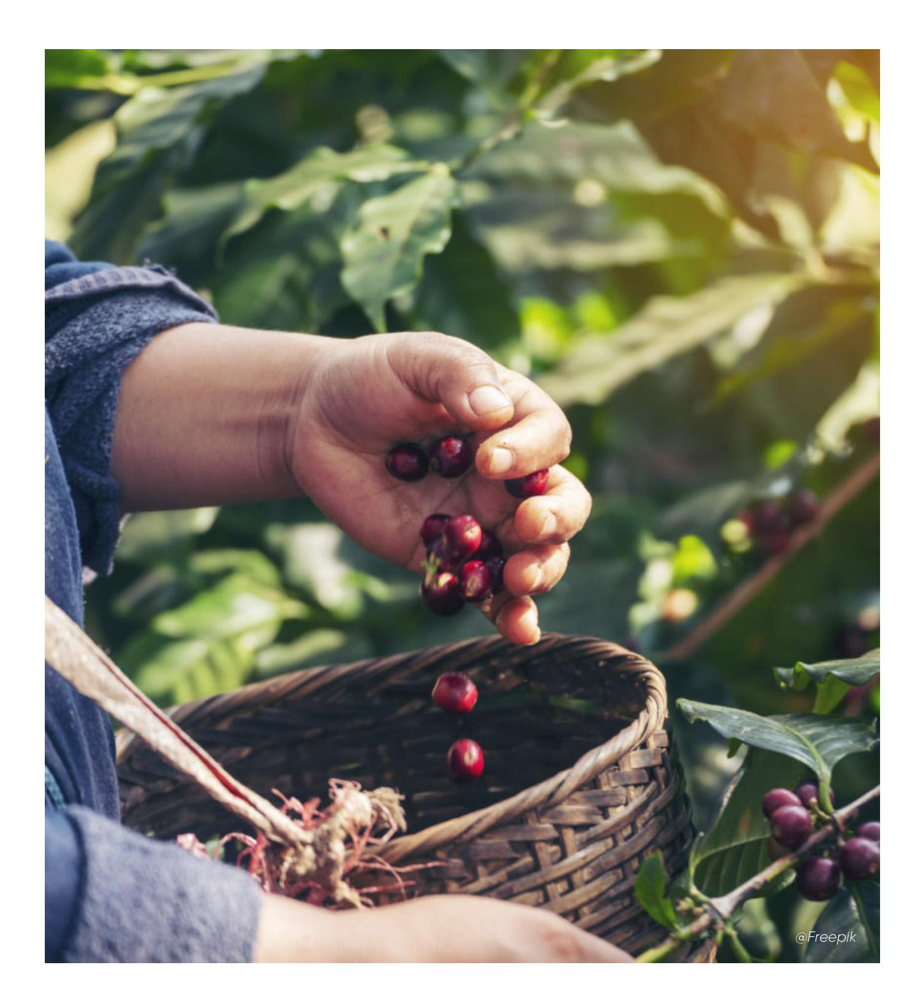

## **5. ANALYSIS OF TRACEABILITY SYSTEMS AND TOOLS**

#### **5.1. Traceability systems in Viet Nam**

Viet Nam has developed traceability systems across sectors and levels to monitor agricultural and forestry products. At the national level, the Ministry of Agriculture and Environment (MAE), in collaboration with Business Development Services (BDS) and international organisations, has created tools such as Production Unit Code (PUC), iTwood, and Forest Resources Monitoring System (FRMS) to collect geolocation data. At the local level, some provinces have partnered with companies to develop early-stage traceability tools. In the private sector, businesses are building their own traceability systems, which are mainly for internal controls. Across supply chains, paper-based systems are still widely used by operators, smallholders, and other stakeholders in Viet Nam.

#### **5.1.1. Technical characteristics of traceability systems in Viet Nam**

Most Vietnamese systems capture point coordinates rather than standardised polygons. Polygon capture is available in the FRMS, but polygon coverage across smallholder plots is limited. Among these systems, the FRMS integrates historical remote-sensing imagery and time-series change detection; agricultural tools rarely have historical, verifiable satellite layers embedded by default.

Both public and private sectors have dierent mechanisms to capture and link data from tools to the traceability system. These traceability systems apply both online and o ine information updates for traceability. While some systems integrate real-time information updates (e.g., NextFarm), others provide mobile apps with o ine capture and later synchronisation (e.g., FRMS). Remote sensing and automated change detection are more advanced in forestry than in agriculture.

Systems vary in their capacity to attach legal documents such as Land Use Right Certificates (LURCs). In the timber sector, VNTLAS requires specific legality documentation for timber supply chains. In the coee sector; however, many coee systems rely on certification documents rather than statutory proofs. Certification schemes (FSC, Common Code for the Coee Community - 4C, and Rainforest Alliance - RA) embed third-party audits, while public systems depend on government verification.

Private platforms oer APIs and export functions, while national public systems (PUC, FRMS, VNTLAS) are traditionally operated in silos with limited data exchange. Recent pilot initiatives aim to establish API gateways and a national interoperability framework, though full implementation is still in progress.

#### **5.1.2. Institutional characteristics**

Most traceability systems have no legal obligations except for the timber sector and some agricultural commodities covered by PUC. Timber traceability is anchored in the VNTLAS with clear legal obligations and ocial verification mandates. The government agency administers forest monitoring through the FRMS and coordinates legality checks. PUCs are mandatory for labelled agricultural commodities. Coee traceability, in contrast, is driven by voluntary certification (4C, RA, and Organic). Custodianship is therefore fragmented among cooperatives, certifiers, private platform providers, and provincial authorities.

Government agencies (e.g., Department of Forest and Forest protection, VNFOREST) hold sectoral responsibilities, but cross-ministerial data governance and a single authority for supporting

EUDR readiness are still maturing. Exporters and processors implement digital traceability systems, SMEs and traders lag due to cost and capacity constraints. NGOs, cooperatives, and private service providers support mapping and data collection on a project basis.

Most commodities lack legal frameworks for traceability systems except for the timber sector. VNTLAS provides a statutory chain-of-custody and legality framework integrated with customs and export controls, lowering friction for EUDR compliance. Agricultural traceability relies on the PUC system under Decision 3156/QĐ-BNN-TT, which is still being scaled up across provinces. It can be observed that the EUDR acts as a major driver of reforms in the agricultural sector.

#### **5.1.3. Key dierences between coee and timber traceability**

The timber sector has a robust statutory framework (VNTLAS) with enforcement mechanisms, while the coee sector relies on voluntary systems and is driven by markets. Timber data must link to legal permits, whereas coee data are fragmented across smallholders with limited polygon mapping. Transaction flows in timber are document-heavy and formal; coee transactions are more informal and

dispersed. The risk of mixing is significant in both sectors through timber imports and coee blending, but stronger chain-of-custody controls exist for timber. There is an incentive dierence between coee and timber because timber compliance is legally required, but coee traceability depends on certification premiums and market pressure.

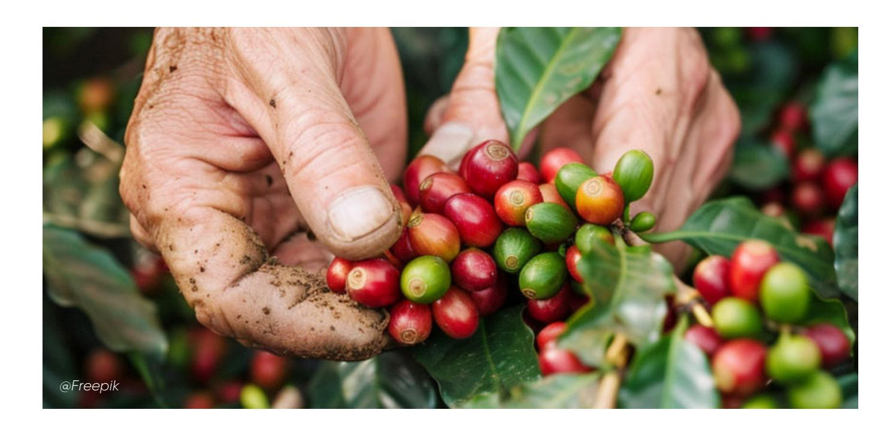

#### **5.2. Deep dive: EUDR and VNTLAS**

The VNTLAS provides a solid basis and can be built upon to create a legal framework for timber products to meet EUDR requirements. In addition, the VNTLAS supports traceability by requiring actors in the timber supply chain to provide information on the origin of timber production.

The VPA FLEGT establishes a comprehensive definition of "legal timber". This includes timber or timber products that are harvested, imported, transported, traded, processed, or exported in

accordance with Vietnamese law, relevant international treaties to which Viet Nam is a signatory, and relevant laws of the country or territory where the timber is harvested, transited, and exported to Viet Nam. This means that Vietnamese operators are already engaged in processes to ensure timber meets the "relevant legislation of the country of production" requirement of the EUDR, which includes aspects like land-use rights, environmental protection, and forest-related rules.

| Criteria Purpose and                         |                                                                         | VNTLAS        | EUDR                                                                                                          |
|----------------------------------------------|-------------------------------------------------------------------------|---------------|---------------------------------------------------------------------------------------------------------------|
| legally                                      | harvested,                                                              | transported   | and                                                                                                           |
| Domestic                                     | and                                                                     | international | operators                                                                                                     |
| (i.e., wood                                  | logs,                                                                   | sawn timber,  | veneer,                                                                                                       |
| Specifies                                    | products                                                                | according     | to the                                                                                                        |
| scope                                        | timber and export verification                                          |               | and illegal deforestation and forest degradation worldwide                                                    |
| Core compliance requirements Scope of actors |                                                                         |               | Mandates that relevant products meet three conditions: Deforestation-free of production exporting, or selling |
| Scope of commodities covered                 | timber trade in Viet Nam All timber and timber products classifications |               | Extends to non-EU based operators directly exporting to the EU coee, natural rubber, cattle commodities      |

| Criteria Deforestation and forest                       |                                     | VNTLAS    | EUDR                                                                         |
|---------------------------------------------------------|-------------------------------------|-----------|------------------------------------------------------------------------------|
| "forest degradation concepts Due diligence requirements | degradation" countries of harvest   | as        | standalone on FAO definitions chapter                                        |
| collecting                                              | information,                        | assessing | and only a negligible risk)                                                  |
| ocial                                                  | documentation                       | and       | field                                                                        |
| Name,                                                   | address,                            | business  | registration,                                                                |
| HS                                                      | code, type                          | of timber | product,                                                                     |
| significant                                             | administrative                      | penalties | for                                                                          |
|                                                         | for information provided            |           | Information requirements: Product                                            |
| inspections                                             |                                     |           | description, quantity, country of cultivation land                           |
| agencies Information systems and data                   | permit/license volume/weight, value |           | there is a negligible risk of non-compliance into Information System TRACES: |
| supplier Enforcement                                    | purchase contracts                  |           | HS code, commodity type, quantity,                                           |
| and penalties                                           |                                     |           | are responsible for checks and enforcement of the regulation                 |
|                                                         |                                     |           | Penalties apply only in cases of                                             |
|                                                         |                                     |           | non-compliance and only to actors                                            |
|                                                         | from Category I to Category II      |           | obligated to fulfil the due diligence                                        |
|                                                         |                                     |           | process specifically, operators and                                          |

*Table 4 - Comparison of the requirements stipulated by VNTLAS and EUDR*

The VNTLAS mandates the use of packing lists for imported and exported timber and timber origin declarations, and requires enterprises to maintain logbooks for purchases and sales and submit regular reports. The system also employs an "enterprise classification system" for managing and publishing enterprise information and an electronic FLEGT licensing system. While the EUDR requires plot-level geolocation data and a centralised information system, VNTLAS oers a limited set of traceability tools such as packing lists, origin declarations, logbooks, and enterprise classification systems. These mechanisms help track timber legality but do not capture spatial coordinates or integrate data into a single national system as required under the EUDR.

Although these legal frameworks are dierent, the analysis shows that there are alignments between the VNTLAS and the EUDR in terms of core requirements for traceability. Both frameworks require robust due diligence to ensure legal harvesting, transport, and supply chain traceability. Both systems emphasise the need for risk assessment and risk mitigation measures, particularly for timber imported from countries with higher deforestation rates.

#### **5.3. Enabling factors and challenges for traceability in Viet Nam related to EUDR readiness**

#### **5.3.1. Enabling factors**

Existing certification systems and legal frameworks provide a strong foundation for the coee and timber sectors to meet the requirements set out in the EUDR. They play a critical role in establishing systems for information-sharing and oer valuable lessons for strengthening traceability. Importantly, these systems and frameworks can be expanded and adapted to cover conventional coee and timber production.

**Export market incentives:** The EU is a highly valuable market for both Viet Nam's coee and timber sectors. In 2024, the export value of coee to the EU is estimated at around USD 2.5 billion, while timber exports to the EU are valued at approximately USD 1.1 billion.

**Existing certification systems:** In the coee sector, certifications cover about 30% of total coee production. Meanwhile, the timber sector relies on FSC and PEFC certifications, which account for approximately 15% of plantation forest areas. These certified supply chains already collect some geolocation data and maintain farm diaries for internal control systems, providing a solid basis for meeting sustainability and traceability requirements.

**Experiences on strict traceability:** Exporters and processors in certification systems must segregate certified and non-certified production to avoid mixing and ensure clear traceability. This practice provides positive examples on how to ensure strict traceability along the whole coee and timber supply chains.

**Government push for digitalisation:** The Vietnamese Government is encouraging all sectors to adopt digital applications for improved management and oversight, with agriculture being one of its key priorities. The Government has piloted PUCs and iTwood tools to track commodities, demonstrating both the technical capacity and the potential to scale up digital solutions across a wider range of supply chains.

**Strong legal framework for timber:** The Vietnamese Government has implemented the VNTLAS under the VPA FLEGT, and many operators already meet these requirements some of which align with EUDR criteria. Therefore, operators are already familiar with the processes for traceability, legality, and the necessary paperwork for compliance.

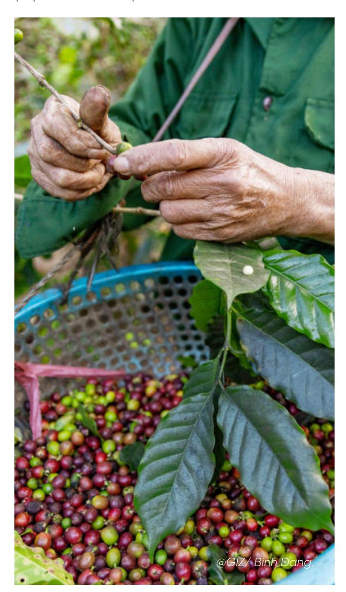

#### **5.3.2. Challenges**

The existing certification systems and the VNTLAS provide a strong foundation and help to meet EUDR requirements. However, there remain challenges related to traceability and legality at every node of the supply chain.

**Insucient geolocations:** Many conventional coee farms and timber plantations are highly fragmented and lack geolocation data, leading to disrupted information flows and, at times, mixing problems.

**Complicated land tenure:** Viet Nam has a complex land-use system (Aldinger et al., 2024; Le et al., 2024), and land plots often do not have geolocations. While geolocation can technically be identified using GPS or satellite data, the challenge lies in linking these coordinates to legally recognised land parcels and producers, especially where land use rights are undocumented or overlapping.

**Traditional paper-based records:** Many operators still rely on paper-based records, which increases the workload needed to manage and integrate data into digital traceability tools or to connect records with plot-level geolocation information.

**Fragmented traceability systems:** Viet Nam has various traceability systems developed by the Government and private sectors with no unified standards, leading to inconsistent information flows across sectors and regions.

**Imported timber mixing risk:** Uncertified imported timber poses a clear risk of being mixed with verified "low-risk" timber streams if there is not robust segregation and controls in processing facilities.

#### **5.4. Traceability tools for dierent agricultural commodities in Viet Nam**

The traceability tools currently deployed in Viet Nam dier not only in their technical design but also in how accessible they are to smallholders and cooperatives. Tools such as PUC and VietGAP are more inclusive, as they are government-backed and often supported by local authorities, while private tools like NextFarm or TE-FOOD typically require enterprise investment beyond the capacity of most smallholders.

Existing traceability tools applied in Viet Nam dier in their capacity to collect and exchange geolocation data and vary in scope and application. Table 5 illustrates how the available tools vary in their ability to provide information on dierent aspects of the EUDR.

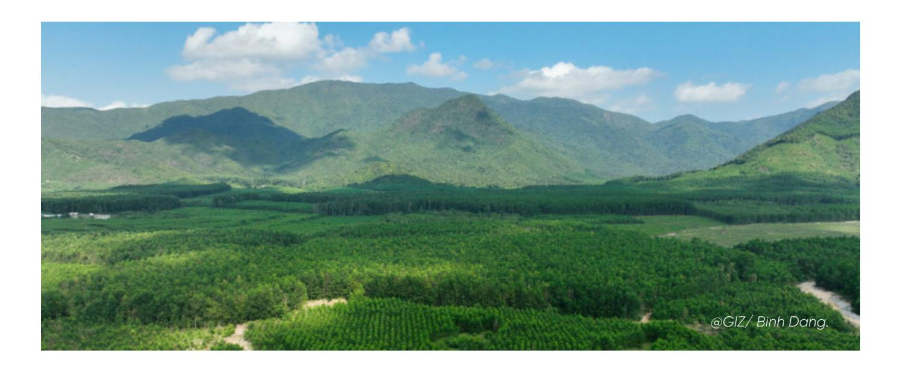

| Tool    | Owner ship | Alignment with EUDR forest definition                                                       | Geolocation                                                     | Production tracking                                        | Smallholder usability                                                        | Traceability Solution                        | Interoperability                                         |                                                    |                                      |
|---------|------------|---------------------------------------------------------------------------------------------|-----------------------------------------------------------------|------------------------------------------------------------|------------------------------------------------------------------------------|----------------------------------------------|----------------------------------------------------------|----------------------------------------------------|--------------------------------------|
| PUC     | Government | Partial: Includes planned forest land; needs integration with FRMS to apply EUDR thresholds | Basic (points; polygon support piloting in some areas)          | Limited (date fields not always required)                  | Not directly used by farmers                                                 | Government registry / foundational ID system | Intended as backbone (needs APIs)                        |                                                    |                                      |
|         |            | Next Farm                                                                                   | Private                                                         | None: No distinction between forest and non-forest land    | Likely supports GPS points; polygon support depends on deployment            | Good (farm diaries, harvest dates)           | Designed for smallholders; offline capabilities possible | Farm-level management app / data capture tool      | Typically offers integration options |
|         |            | Vietnade iTrace 247                                                                         | Government                                                      | Indirect alignment: Relies on linked systems (FSC, VNTLAS) | Variable (often records supplier metadata; polygon depends on upstream data) | Usually records of shipment dates            | Not aimed at smallholders                                | xport-oriented trade portal / documentation system | Designed for trade integration       |
|         |            | Viet GAP                                                                                    | Quasi-Government                                                | None: No land-use history or forest status check           | Good (designed for farm records; polygon possible in full deployments)       | Good (production records required)           | Designed for farmers (depends on rollout)                | Certification-linked farm traceability system      | Can be integrated if standardised    |
| TE-FOOD | Private    | Potential alignment: Could integrate with forest maps and definitions                       | Point / batch (geotags); polygon support depends on integration | Strong (timestamped batch records)                         | Interfaces vary; generally, enterprise-facing                                | Batch-level CoC and audit trail system       | Built for integration (APIs/enterprise connectors)       |                                                    |                                      |

*Table 5 - Assessment of five selected traceability tools for agricultural products in Viet Nam*

From a smallholder perspective, usability, aordability, and local government support are decisive factors for adoption. While private enterprise tools oer advanced digital functionality, their uptake among smallholders remains limited unless facilitated by cooperatives or buyers. In contrast, public tools, though technically simpler, have wider reach through local administrative channels.

# **TRACEABILITY PRACTICES ALONG COFFEE AND 06. TIMBER VALUE CHAINS**

## **6. TRACEABILITY PRACTICES ALONG COFFEE AND TIMBER VALUE CHAINS**

#### **6.1. Smallholders**

#### **6.1.1. Geolocation and production documentation**

In both sectors, the interviewed smallholders have limited capacity to identify and record the geolocations of their land parcels. Some smallholders can collect and store the geolocations of their plots on maps and share this information with others to locate their farms. However, many were unable to mark or record the locations of their land parcels using maps or apps. Even when shown how to identify their plots on maps or apps, they often could not save or document the geolocation information. In both sectors, most smallholders involved in conventional coee cultivation and plantation forestry rely mainly on traditional practices and personal experience. Surveyed households typically base their farming methods on habits and knowledge gained from previous years.

Only a small number of households keep records related to planting and maintenance, usually as part of certification programmes. Interviewed smallholders in both sectors participating in certification programmes use either paper-based or digital tools to maintain farm diaries. Some record information in notebooks such as fertilising, weeding, post-harvest processing, selling, economic returns, inputs costs, labours, labour wages, and other social and environmental aspects with clear start and end dates. This data is then shared with traders who link smallholders to enterprises involved in certification systems.

In Viet Nam's coee sector, some smallholder groups use mobile applications such as Nestlé's FFB (Digital Farmer Field Book) to manage farm diaries within certified supply chains. The app allows users to record detailed farming activities, calculate quantities and costs, and generate QR codes

containing personal and plot information. Farmers log in using registered phone numbers linked to Nestlé's database. While the system is user-friendly, the interview showed that nine out of ten did not record information for each separate land parcel, while the remaining household owned only one parcel. In addition to keeping farm diaries, smallholders in certification programmes are also required to share personal information, including national ID and land-use certificate details, with traders and enterprises.

In the coee sector, two out of six interviewed smallholders were hesitant to use online apps for various reasons. They expressed concerns about scams, which are common and can result in financial loss, especially because they have limited experience managing online tools. They worried that pressing the wrong button could expose personal or confidential information, putting them at risk of identity theft or other problems. As a result, they were reluctant to use apps for managing farming activities. In addition, many smallholders have low levels of formal education, and diculties with grammar and spelling make them uncomfortable. They fear that errors in their digital records could lead to embarrassment, further discouraging them from using such tools.

#### **6.1.2. Internet and smart equipment**

Good internet access and smartphone use in Viet Nam result in a high rate of internet access and smart devices. All interviewed smallholders had access to the internet through Wi-Fi or 4G networks, enabling them to use smart devices for farm management. According to the Ministry of Information and Communications, 88.7% of mobile subscribers use smartphones, 82.3% of households have fibre-optic broadband Internet access, and the 4G network covers 99.8% of the country's territory*06* . This high user rate could enable smallholders to regularly update farm management information.

In both sectors, three out of eight interviewed smallholders in certification programmes can handle smart equipment to collect information about land parcels in their farms. Smallholders make use of smart phones to access Apps for land measurement, geolocations, and farm dairies. However, interviewed companies stated that many smallholders require support from cooperative operators to update and keep records and information.

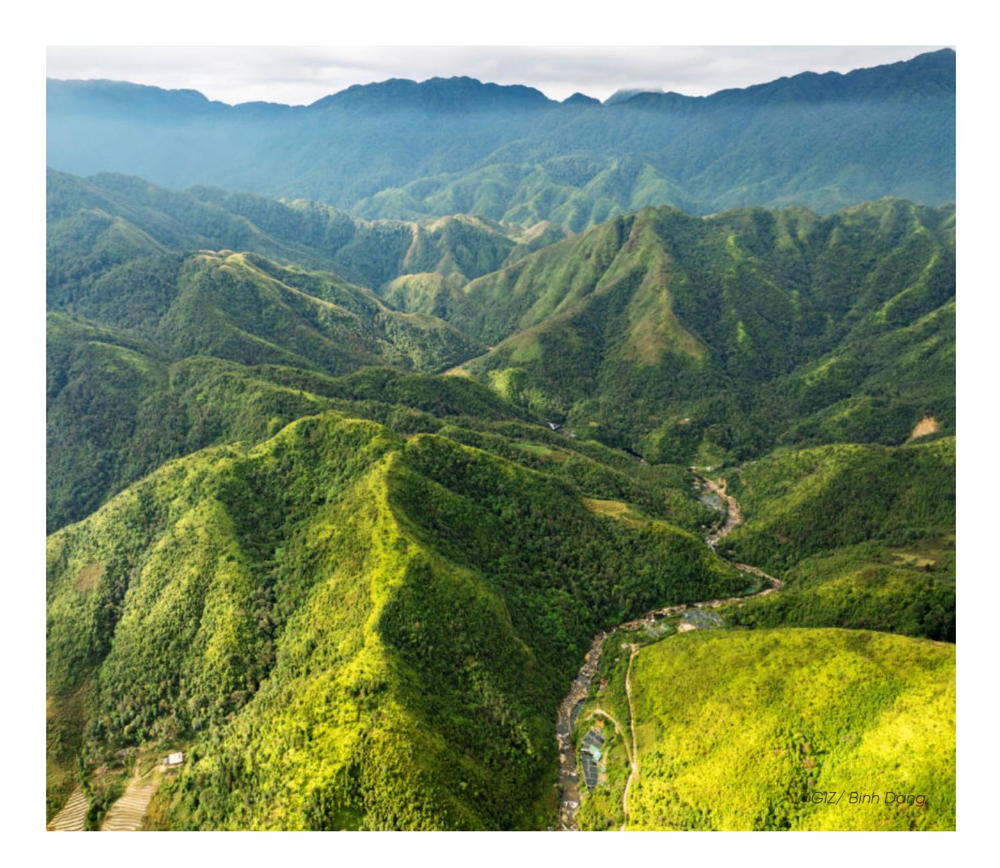

*06https://mst.gov.vn/internet-viet-nam-ba-muoi-nam-phat-trien-than-toc-197241227122858638.htm#:~:text*

*=Theo%20B%E1%BB%99%20Th%C3%B4ng%20tin%20v%C3%A0,99%2C8%25%20l%C3%A3nh%20th%E1%BB%95.* 

#### **6.1.3. Cooperation with companies/state management units**

In the coee sector, the long-standing implementation of certification systems has fostered strong institutional collaboration among stakeholders, particularly in data sharing and traceability reporting (Đặng et al., 2025; Đặng & Trần, 2022). Companies provide both technical assistance and financial support to smallholders to ensure compliance with certification and market requirements. In return, smallholders maintain contractual relationships and sell their coee to these companies and associated traders during the harvest season. This arrangement has strengthened vertical cooperation within the supply chain.

In the timber sector, smallholders are partially collaborating with Protection Forest Management Boards (PFMB) or forest companies to sign plantation agreements and pilot traceability tools for timber supply chains. This cooperation is a critical step toward improving traceability, as it enables resource mobilisation from all stakeholders to enhance tracking capabilities for timber from production forests. Thousands of smallholders have signed contracts with PFMBs and forest companies, which in turn helps to certify forest lease agreements to verify origin and legality.

The Government, in partnership with growers, is piloting the use of PUC and developing maps with VN2000 geographic coordinates to support traceability*07*. VN2000 needs to be converted to international standard geo-coordinate systems. The maps detail land parcels, forest sub-areas, and contract boundaries.

#### **6.1.4. Challenges for smallholders**

Currently, producers often learn about the EUDR through intermediaries and lack a clear understanding of its specific requirements. Fragmented information from various stakeholders adds to smallholders' confusion when procedures are requested under the umbrella of EUDR requirements. As mentioned above, there are significant challenges for smallholders in providing relevant information for buyers and operators for due diligence under the EUDR. Only one out of ten interviewed smallholders mentioned that they mapped their farms themselves with technical support from local companies. Future studies with larger samples are recommended to quantify the extent of these practices nationwide.

*07VN-2000 is Vietnam's ocial national geodetic coordinate reference system, established by the Ministry of Natural Resources and Environment. It is based on the WGS-84 ellipsoid and used for all national mapping and land-use databases. Using VN-2000 coordinates ensures spatial data consistency with ocial land records and allows traceability maps to be cross-checked with government datasets and forest monitoring systems (FRMS, VNTLAS).*

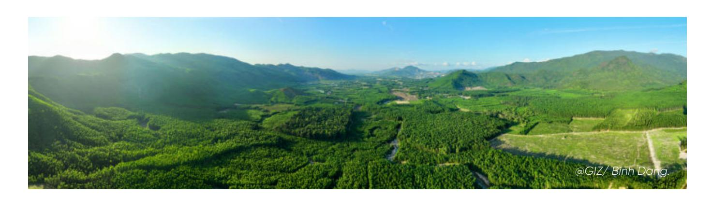

#### **6.2. Enterprises and local traders**

#### **6.2.1. Role of enterprises and local traders**

Vietnamese enterprises play a central role in connecting information between smallholders and overseas buyers, while also facilitating the movement of commodities to the EU market. Vietnamese enterprises have an interest to provide documentation to enable EU importers to fulfil their due diligence obligations. As a result, Vietnamese enterprises have been actively supporting smallholders and local traders by developing apps and collecting information to demonstrate the traceability and legality of commodities produced by smallholders. These practices are primarily observed among enterprises and traders engaged in certification systems (e.g., 4C, RA, FSC, VFCS) or

through VNTLAS requirements. Outside these frameworks, most enterprises continue to use conventional, paper-based documentation, and traceability remains limited to basic transaction records rather than plot-level verification.

Local traders play a key role in connecting smallholders with enterprises by facilitating both the flow of commodities and the exchange of information. They are often residents who have in-depth knowledge of the areas where they purchase coee and timber. Traders help enterprises gather farm locations and sizes from smallholders and provide guidance on how to supply the required information.

#### **6.2.2. Legal documentation**

Companies in both the coee and timber sectors actively collect documentation to verify the legality of their products. Coee enterprises primarily gather information related to land use right certificates, while timber companies must compile a broader and more complex set of legal documents to meet VNTLAS regulatory requirements. The Forest Protection Department at provincial level has sometimes even established a sustainability team responsible for providing guidance and coordinating with other departments and stakeholders to ensure operations meet VNTLAS and future EUDR requirements. This team carries out the assessment (enterprise classification system) and oversee compliance with the VNTLAS based on documentation provided by the companies. Verifying timber legality throughout the value chain is therefore critical for timber companies. The verification process mainly relies on scanned paper along the supply chain.

#### **6.2.3. Geolocations**

In the coee sector, local traders collaborate with Vietnamese enterprises to collect farm-level geolocation data, with active participation from smallholders in certified supply chains. Many enterprises have established dedicated sustainability teams responsible for verifying and mapping farm locations. Local traders compile lists of smallholders supplying raw materials, including identification numbers, addresses, and land parcel areas. Using these lists, the sustainability teams, assisted by traders, collect geolocation data directly from smallholders through mobile applications.

In the timber sector, many companies are currently able to provide geolocation information as required by the EUDR, but challenges remain. Some interviewed companies have submitted a set of documents to EU buyers for verification and are still awaiting feedback to confirm whether the data is sucient and acceptable. It also remains unclear whether there are any gaps in geolocation or legal information among dierent suppliers. The availability and accuracy of geolocation data depends largely on the capacity and knowledge of smallholders. Finally, sourcing compliant wood significantly increases material costs, which seems to

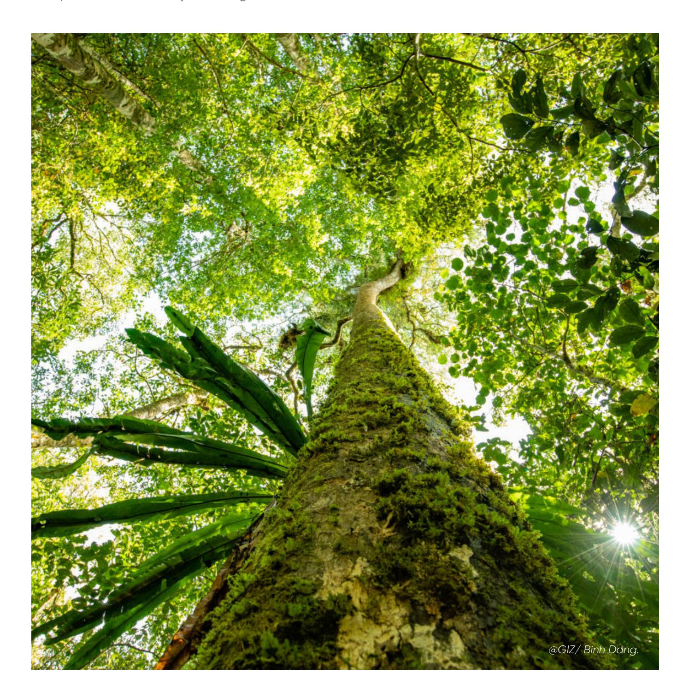

discourage some operators from participating in supply chains serving the EU market.

In both coee and timber sectors, while provincial forest planning maps exist, they rely on point-based locations rather than polygon mapping, which makes it dicult to assess overlaps between cultivation areas and forest land. As a result, companies are currently unable to fully confirm or resolve overlapping claims of suppliers, and identifying the exact geolocations of smallholder land parcels remains a major challenge.

To identify the location of land parcels, local companies use dierent software packages, apps (GPS Fields Area Measure Map, Measure Map, and Measure Map Pro), Google Maps and handheld GPS devices for remote areas. Each internal code is linked to geolocation data collected by companies' sustainability teams. However, the teams remain uncertain about which coordinate system customers use. The transfer to a dierent coordinate system can result in discrepancies between mapped locations and actual field positions.

#### **6.2.4. Production tracking for coee, timber and collaboration with smallholders**

Currently, enterprises in the coee sector use two traceability approaches to track the flow of commodities from smallholders to enterprises: paper-based and app-based tools. While paper-based tools are straightforward and easy to use, they create a significant workload for sta. Software and apps, on the other hand, are more ecient for managing large amounts of data quickly. However, limited digital skills of sta and smallholders for consistent data recording and flow make it dicult for enterprises to fully implement these tools across all stakeholders. Additionally, scattered internet access in remote areas can interrupt updates from farm level.

Traders typically use a combination of paper-based records and Microsoft Oce tools to track information for coee and timber. Each certification system has its own paper-based forms with specific fields designed to meet specific requirements. Traders usually purchase certified commodities according to quotas agreed upon with smallholders and enterprises before the harvest season. They only buy the agreed certified quantity; any excess is refused. When smallholders have multiple plots under the same certification system, traders generally do not separate (i.e. record/track) commodities by individual plots. After purchasing commodities from smallholders, traders manually enter the information into Excel files to maintain records and track data. In certified supply chains, enterprises may also receive information directly from smallholders through dedicated apps.

To ensure traceability in coee production, companies have also established a physical system for segregating coee. Certified and non-certified coee are stored in separate areas and distinguished by dierent bag colours and coverings. Within each category, coee from various smallholders is blended, with clear records indicating the proportion contributed by each smallholder. A list of contributing smallholders is attached to every coee shipment.

Companies also created a manual traceability system for the flow of information during transportation for export. Each coee shipment has a label/code and the list of involved stakeholders, which enables traceability. Local companies provide information through PDF files; i.e., they do not have QR or bar codes for traceability.

Companies in the timber sector procure their materials from domestic and international sources. They often implement a traceability system to monitor timber during transportation. Materials are transported in GPS-tracked trucks, with invoices and necessary paperwork for the transported logs maintained to prevent the mixing of dierent materials. Two marking methods are used to directly mark the logs: paint and tagging. Suppliers apply paint markings and attach the necessary documentation (such as invoices and timber declarations), while company uses tags to categorise and manage wood in storage. Some materials are sourced using business intelligence tools, enabling companies to manage and trace imported wood.

Interviewed companies participating in certification systems have invested considerable resources in upgrading their digital databases and documentation systems, which also strengthens their readiness for meeting EUDR requirements. Interviewed companies in the timber sector for this study rely on paper-based traceability systems to track information for wood products exported to the EU. However, documentation for input materials remains sketchy across suppliers. Codes for sub-areas and land parcels are often insucient to verify exact geolocations, making traceability unreliable. Although shipment documents list the stakeholders involved, they frequently lack geolocation data. Additionally, companies must prepare multiple sets of documents containing the same information in dierent formats to meet the requirements of various government agencies.

Although many companies participate in two certification systems and have invested in improving their traceability systems, they still face significant challenges in collecting the data needed to demonstrate deforestation-free timber. Certification systems provide a foundational platform for upgrading traceability and supporting satisfaction with the EUDR, but the current paper-based system cannot integrate all required information.

Regarding collaboration with smallholders, it can be noted that in the coee sector, interviewed enterprises working within certification systems have been actively supporting smallholders in using digital tools to collect geolocation and track production. These enterprises are developing user-friendly apps to help smallholders more easily record geolocation

data, land sizes, and other relevant farming information. Their dedicated teams play a key role in providing training or coordinating with trainers to build the capacity of stakeholders and traders, helping to ensure a smoother flow of information from smallholders.

In the timber sector, companies are also working closely with partners and smallholders to help them meet EUDR requirements. Many companies collaborate the business development services (see chapter below) to support suppliers and traders in identifying geolocations and obtaining relevant data. For suppliers who rent land or forest areas, companies provide training to ensure accurate information flows from smallholders.

#### **6.2.5. Traceability solutions of coee and timber companies/enterprises**

In the coee sector, FDI enterprises have established nationwide purchasing networks through partnerships with local companies and intermediaries (Đặng et al., 2025). These collaborations enable them to secure a stable supply of coee beans for processing. Consequently, FDI enterprises closely monitor and manage these partnerships to satisfy traceability and sustainability requirements.

To increase traceability, FDI enterprises use traceability tools and establish strong linkages throughout their supply chains, including close partnerships with smallholders. They build a network and supply chains in collaboration with local companies to expand certification systems. In Gia Lai Province, FDI enterprises collaborate with local companies to procure coee beans from smallholders across various communes. Local companies play a key role in connecting smallholders to FDI enterprises' traceability tools. Smallholders use the apps developed by FDI enterprises to ensure real-time information. These specialised traceability solutions increase the consistency of data from smallholders to exporters.

Local companies in the coee sector cooperate with FDI enterprises to support sourcing and certification processes. They do not conduct due diligence on their behalf. These companies assist in collecting farm-level information, verifying documentation, and managing certification records within their supply networks. Their role focuses on providing data required for traceability to buyers while ensuring compliance with certification standards.

Local companies developed their own approaches to manage procurement information, which is complemented by geolocation data collected through professional mapping applications. Since

the only procurement-related information is collected through apps, geolocation data is added from geographical professional apps or tools such as Land Measure Pro and GPS. Dedicated teams are responsible for collecting farm-level geolocation data and producing detailed maps for each area. Smallholders support this process by cooperating with companies, guiding sta to their coee orchards so that company employees can use GPS devices to record accurate geolocation information. Dedicated teams are responsible for farm mapping, while overall due diligence responsibility remains with the purchasing enterprise.

In addition, local companies have also developed QR codes to enhance the traceability of coee supply chains. These codes allow them to compile additional data fields for each coee shipment, providing more comprehensive information to buyers. Customers are required to pay a fee to access the detailed information embedded in the QR codes for each shipment.

Alongside their software and online systems, local companies continue to use manual traceability systems based on Microsoft Oce tools. Through these systems, they assign internal codes to smallholders based on administrative locations such as districts and communes and collects key information, including gender, address, national ID, phone number, cultivation area, and production volume. Each smallholder has purchasing sheets that detail the price, quantity, and total value of each transaction. Companies cannot fully monitor whether smallholders mix certified coee with production from non-certified sources. For smallholders with multiple parcels of land, the company issues unique and non-repeating codes for each parcel, ensuring consistency from the parcel level to the company level. These internal parcel codes serve only for

*08https://www.nestle.com.vn/vi/media/nestle-viet-nam-day-manh-xuat-khau-san-pham#:~:text=Thu%20mu a%20b%E1%BB%81n%20v%E1%BB%AFng%20v%C3%A0,B%E1%BB%99%20C%C3%B4ng%20Th%C6%B0%C6%A1ng%2 0x%C3%A9t%20ch%E1%BB%8Dn.* 

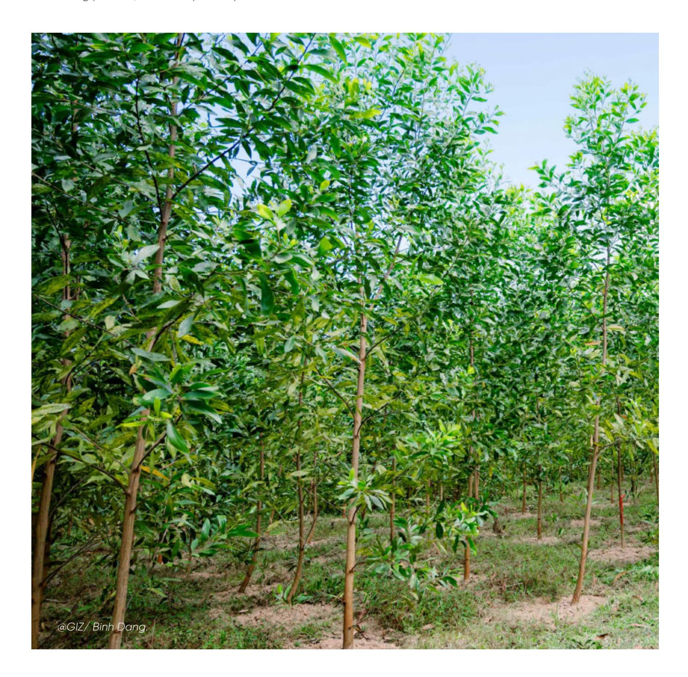

company-level traceability and are not equivalent to ocial Geo IDs used in national asset registries. However, smallholders combine information for all land parcels.

Companies in the timber sector currently rely on manual traceability systems to track raw wood materials. Participation in FSC systems oers an advantage, as these companies already maintain internal systems for storing FSC-related information. Existing documentation for rubber wood, whether FSC-certified or not, includes invoices, contracts, and harvesting permits, which helps companies in

certified supply chains prepare to upgrade traceability processes to align with EUDR requirements. Hard copy documents are scanned and uploaded for digital storage. At present, many interviewed companies purchase wood only from local traders who can provide complete documentation as required under the EUDR. Smallholders must provide land titles so that companies can obtain harvesting permits from the relevant government authorities. However, additional geolocation data is not systematically assessed.

#### **6.2.6. Concerns from enterprises in coee and timber sectors**

In both coee and timber sectors, interoperability across national and international traceability systems is limited, as dierent supply chain actors often demand dierent data fields and formats. Data flow between suppliers and processors is fragmented, and IT systems are not integrated. Thus, companies must generate multiple sets of documents with overlapping content in varying formats to satisfy dierent authorities and clients. Enterprises are concerned about how to align their internal systems (e.g., FSC codes) with EUDR requirements if suppliers use dierent codes or formats. Interviewed companies demonstrated that EUDR compliant wood sources, i.e., being able to provide the full set of information required, are much more expensive, raising the cost of production for exporters.

In coee and timber sectors, there is limited motivation and awareness of the EUDR and the requirements on the EU market. Smallholders often lack awareness of the concrete benefits for them or see it as irrelevant for domestic sales, leading to limited cooperation with companies to provide essential data for traceability. As mentioned earlier, smallholders might be hesitant to collect and share information digitally as the actual use remains unclear.

Additionally, for the timber sector, many smallholders see no price premium for certified or traceable wood, so they lack motivation to participate in certification systems or EUDR-compliant supply chains. In the timber sector, companies do not buy directly from smallholders but through layers of intermediaries, making it easy for certified and non-certified wood to be mixed. Documentation for domestic wood is more complete than for imports, but correct geolocation is often missing. Interviewees reported that many plots are missing verified GPS coordinates, hindering traceability to the plot level for wood products. In addition, land parcel codes do not match actual polygons, resulting in inaccurate traceability information. Interviewed companies did not know how to verify geolocations for land plots.

In the timber sector, inconsistency in terminology can cause problems for mutual understanding among operators and traceability along supply chains. There are inconsistent terminologies in domestic law such as "forest product," "wood product," and "agricultural product". This can lead to diculties for companies and stakeholders to complete required procedures to comply with regulations.

Therefore, in the timber sector, concerns remain about the reliability and accountability of supplier data. Companies fear being held responsible for false or incomplete data provided by upstream suppliers. In addition, actors must verify their own information and currently rely on trust. Interviewees demonstrated that although enterprises have made significant eorts to ensure smooth information flows, they still face several challenges in using traceability tools eectively. Some enterprises believe that smallholders should bear full responsibility for meeting the requirements of the EUDR.

From desk-based research and fieldwork, this study identified distinct challenges for both domestic and imported timber sources. Domestic timber, largely produced by smallholders, faces persistent diculties due to limited capacity and low awareness of legality and traceability requirements. These constraints hinder downstream operators from ensuring full traceability and integrity of timber production. In addition, incomplete legal documentation as required by the VNTLAS slows down verification.

Business development services (BDSs) play an important role in supporting enterprises and smallholders to participate in certification systems, build capacity, and develop traceability tools. BDSs are developing essential traceability tools to track information on agricultural commodities from individual land plots. BDSs also provide services to verify and assess the compliance of stakeholders with certification criteria. They often strengthen capacity for smallholders and operators and have a thorough understanding of the current situation regarding the capacity of smallholders and operators.

An interviewed BDS said that less than 25% of smallholders working in cooperative relationships with companies have the necessary traceability information or capacity to meet EUDR requirements. Overall, about 99% of smallholders lack the information and capacity needed to align with the EUDR and rely heavily on companies and consultants to fulfil procedural requirements*09* .

Preferred by Nature plays an important role as an international organisation providing capacity building, auditing, and digital traceability support to enterprises and smallholders in both the coee and

timber sectors. It supports implementation of FSC, PEFC, and other sustainability standards.

Consultancy firms are developing and refining app features to assist smallholders, traders, companies, and other stakeholders. These apps capture information at multiple levels, including geolocation, farm records, and other relevant data. Green Field developed a web-based app to manage farming activities from planting to selling, production and geolocation. Ecotech 2A is a consultancy firm specialising in system development and traceability solutions for agricultural commodities in Viet Nam, with a focus on the wood plantation sector. The company has piloted two digital systems in four districts across the Central Highlands. This includes the "Smallholder App" to help enterprises to collect EUDR relevant information. Its aim is to enable smallholders to independently map their land parcels, collect and upload geolocation data using smartphones, and access management information for each parcel. With the app, overlapping land-use issues can be identified. Key features include free access for smallholders (while downstream operators must pay fees), the ability to update land parcel information individually, automatic updates, and compatibility with smartphones or manual input options.

#### **6.3. Business development services**

Support from government stakeholders is an important factor for the application of traceability tools. The Government develops national policies to meet standards for legality and traceability. The Vietnamese Government issued Decision No. 749/QD-TTg, 2020 on the National Digital Transformation Programme and the Forestry Development Strategy 2021–2030. These policies indicate the Government's commitment to enhancing digital traceability and compliance with legal requirements.

Local authorities are key for implementing government policies and systems, such as establishing PUCs and completing natural forest maps. For example, to monitor forest changes, the Department of Forest and Rangers uses the Forest Resource Monitoring System (FRMS) to track forest dynamics. This system enables stakeholders to access and compare information relevant to both the coee and timber sectors. Local authorities also help enterprises and smallholders by issuing documents needed to verify the legal status of land use and production. In short, local authorities mainly perform administrative functions and have limited direct involvement in supply chain traceability.

#### **6.4. Governmental bodies**

Both Viet Nam's coee and timber sectors have significant opportunities to leverage readiness based on existing certification systems, emerging digital pilots, and the organisational capacity of business associations to strengthen traceability. However, smallholders who manage most of the production area face persistent challenges related to limited digital literacy and low incentives to record data.

Business associations, cooperatives, and farmer groups can play a pivotal role in overcoming these challenges by coordinating training, facilitating data collection, and representing member interests in the design and rollout of traceability systems. Table 5 illustrates opportunities, challenges, and unknown variables of both sectors.

#### **6.5. Opportunities and challenges for smallholders and companies**

| Coee                              |          |  |                              | Timber                                      |
|------------------------------------|----------|--|------------------------------|---------------------------------------------|
| (4C, Rainforest, Organic)          | require  |  |                              |                                             |
| Large processors/exporters         | have     |  |                              |                                             |
| Good cooperative models            | exist in |  |                              |                                             |
| to adopt apps/QR/barcodes          | for      |  |                              |                                             |
| Intermediaries (collectors,        | local    |  |                              |                                             |
| traders) connect small farms       | to       |  |                              |                                             |
| Approximately 95% of coee         | area     |  |                              |                                             |
| certified groups sometimes         | report   |  |                              |                                             |
| Opportunities                      |          |  | Strong VNTLAS                | legal framework with the                    |
|                                    |          |  | Clear                        | legal framework for wood                    |
| geo-coordinates                    |          |  | processors/exporters         | makes                                       |
| systems to build on                |          |  | enforcement coee            | easier compared to                          |
| niche buyers processors Challenges |          |  | results mapping tree harvest | in potential for collective third countries |

Both coee and timber supply chains have promising building blocks for advancing traceability but must overcome structural weaknesses in farm-level geo-data, intermediary practices, farmer organisation, and local digital capacity to align fully with EUDR traceability requirements, including recording of geolocation.

|            |                                          | Coee      |           | Timber                                                    |
|------------|------------------------------------------|------------|-----------|-----------------------------------------------------------|
| Challenges | Aggregation                              | at village |           | collection                                                |
| often      | not                                      | integrated | in        | digital                                                   |
| Patchy     | mobile                                   | coverage   | in        | some                                                      |
| Co-ops     | can                                      | help       | negotiate | price                                                     |
| code       | tools                                    | but        | mostly    | for                                                       |
|            |                                          |            |           | Many processors rely on multiple                          |
|            |                                          |            |           | smallholder plots — unless fully                          |
|            | traceability highland areas              |            |           | Limited capacity of local Forest coordinates demand it    |
|            | demonstration plots for extension ocers |            |           | transaction records, they create traceability blind spots |
|            |                                          |            |           | modern mapping/GIS skills or hardware                     |

*Table 6 - Opportunities and challenges of small holders and business associations*

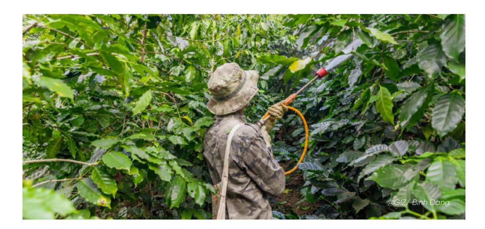

Interviews with smallholders, enterprises, local authorities, BDSs and related stakeholders highlighted opportunities and challenges tracking information in the coee and timber supply chains. Table 6 summarises the main opportunities and challenges identified through fieldwork and desk research.

#### **6.6. Opportunities and challenges for the application of traceability tools**

| Opportunities                                                                                                                                                                                                                                                                                                                          | Challenges                                                                                                                                                                                                                                                                                                                                                 |
|----------------------------------------------------------------------------------------------------------------------------------------------------------------------------------------------------------------------------------------------------------------------------------------------------------------------------------------|------------------------------------------------------------------------------------------------------------------------------------------------------------------------------------------------------------------------------------------------------------------------------------------------------------------------------------------------------------|
| Strong policy and economic motivation: - The Government shows clear commitment to digital transformation (Decision 749/QD-TTg, 2020; Forestry Development Strategy 2021–2030) and is actively supporting enterprises and smallholders - The EU is a high-value market for coffee (~USD 2.4 billion) and timber (USD 1.1 billion) | Limited awareness and incentives: - Many traders and smallholders have low understanding of EUDR requirements and little motivation to adopt traceability tools due to weak price incentives - Coffee and timber do not need to be sold immediately, and smallholders can choose to opt out of participating in activities to meet EUDR requirements |
| Government digitalisation drive: - Ongoing e-governance and data-integration initiatives support the digitisation of legality and traceability documentation                                                                                                                                                                        | Fragmented, paper-based systems: - Most enterprises and local authorities rely on paperwork, making it difficult to standardise and link data with geolocation information                                                                                                                                                                              |
| Established certification systems: - Existing certification systems can help collect geolocation data and verify legality with possible tangible benefits for those involved in certification systems                                                                                                                               | Smallholder capacity gaps: - Many smallholders lack land-use certificates, digital skills, and financial resources to adopt traceability apps or join certification schemes                                                                                                                                                                             |
| Support from NGOs and BDSs: - Provision of trainings and guidance on legal verification and due diligence - Developing digital tools                                                                                                                                                                                             | Financial and technical constraints: - Smallholders and SMEs lack resources to sustain digital traceability systems                                                                                                                                                                                                                                     |
| High digital readiness: - 88% of mobile subscribers use smartphones, and 4G coverage reaches nearly all rural areas, enabling app-based data collection, enabling near real-time information                                                                                                                                        | Limited interoperability: - Domestic IT systems are not yet aligned with international traceability requirements, and data-sharing protocols are not prioritised                                                                                                                                                                                        |
| Cross-sector learning: - Experience from fruit and vegetable exports (QR/barcode traceability) and VNTLAS                                                                                                                                                                                                                           |                                                                                                                                                                                                                                                                                                                                                            |

*Table 7 - Opportunities and challenges for the application of traceability tools*

The VNTLAS provides a solid legal framework for the import, export and supply chain control of timber in Viet Nam. Currently, VNTLAS does not require detailed plot-level geolocation for traceability and evidence of deforestation-free production. Overall, the lessons based on key expert interviews and literature from VNTLAS development and implementation can be summarised as follows:

#### **6.7. Lessons learnt from the VPA FLEGT, VNTLAS and traceability tools used for agricultural commodities**

#### **6.7.1. VPA FLEGT process and VNTLAS experience**

- The clear timber legality definition enabled all government agencies, operators and stakeholders to align their documentation for origin verification.
- As a result of the VPA FLEGT process, the VNTLAS encouraged the involvement – next to government agencies – of businesses, NGOs, local communities, and other relevant organisations to build trust and jointly address any gaps related to the implementation of the VNTLAS.
- Capacity building for all stakeholders, including customs, smallholders and SMEs as part of VPA FLEGT negotiation and implementation was crucial for their continued involvement in the process and overall supply chain control.
- Access to the EU market, and with this credibility for other markets, has been a strong motivation for improving domestic governance and aligning with international standards.
- The overall VPA FLEGT process in Viet Nam strengthened coordination between multiple government agencies.

Viet Nam's experience with traceability in various agricultural sectors oers valuable insights to meet EUDR demands. In the fisheries sector, for example, meeting regulations on Illegal, Unreported and Unregulated (IUU) fishing has driven investments in vessel monitoring, catch documentation, and export certification. Similarly, fruit exports have increasingly adopted international standards such as GlobalGAP, requiring farm registration, record-keeping, and plot-level traceability. Pilots in pork and aquaculture have tested QR code systems and digital platforms to track production and distribution from farm to fork.

Overall, the lessons based on key expert interviews and the literature review can be summarised as follows:

#### **6.7.2. Lessons learnt from agricultural commodities**

- Traceability tools must reflect conditions on the ground and be accessible to those with the lowest capacity. These groups often initiate data flow, meaning traceability accuracy depends on their ability to use digital tools. Building capacity, trust, and incentives is essential to ensure full participation and data integrity.
- In the fisheries sector, national leadership by the Directorate of Fisheries was essential for advancing traceability eorts. This included the support of fishers with training, monitoring of activities, and ensuring system-wide consistency.
  - Traceability systems work best when aligned from the beginning with market standards. This clarity on goal of application must be combined with capacity development and ownership of tools and information by producers and supply chain actors, especially smallholders.

#### **6.8. Valuation of coee and timber sectors' readiness for the EUDR**

#### **6.8.1. Readiness of the timber sector in dierent provinces**

**Institutional framework diers between localities:** In the Central Highlands, provinces have long-standing provincial programmes promoting sustainable coee, quality control, and certification (Đặng & Trần, 2022). These provinces work with enterprises and NGOs to increase traceability. However, relatively new coee-growing provinces, such as Son La and Dien Bien in northern Viet Nam, are in the early stage of adopting traceability tools*10* .

**Infrastructure and digital capacity:** Traceability tools dier in maturity and scope of application in provinces across Viet Nam (Dang & Nguyen, 2024; International Bank for Reconstruction and Development, 2022; Le et al., 2025). Provinces in the Central Highlands and the southeast, with strong export orientation and existing certification programmes, show higher readiness, while northern and lowland provinces lag behind in digitalisation and coordination for traceability.

**Stakeholder engagement:** In the Central Highlands, operators and smallholders in certification systems, use tools to capture production data and plot-level geolocation (Đặng et al., 2025; Le et al., 2024; Truong et al., 2025). However, smallholders in other provinces operate mostly outside organised structures. Weak coordination among cooperatives, traders, and local authorities limits collective action and information-sharing.

**Certification and legality coverage:** Certification rates are high in the Central Highlands, and many certified producers already record basic geolocation, production dates, and legality verification (Đặng et al., 2025). However, other provinces with a larger non-certified share of producers often lack geolocation and production data.

**Data availability:** In the Central Highlands, smallholders in certification systems have made use of smart phones and tablets to capture plot-level information for traceability, but coverage remains limited outside certified groups. In other provinces, geolocation data is generally limited to administrative boundaries.

**Market orientation and export exposure:** Provinces with strong export orientation, particularly Dak Lak, Lam Dong, and Gia Lai, show higher readiness due to active engagement with EU buyers and sustainability-certified value chains. Conversely, northern and north-central provinces primarily serve the domestic market or non-EU buyers and thus have weaker incentives to implement EUDR-compatible traceability systems.

*10https://ipvietnam.gov.vn/cac-bai-viet-ve-chi-dan-ia-ly/-/asset\_publisher/fNUbGw2ZxGKy/content/bao -ho-chi-dan-ia-ly-son-la-cho-san-pham-ca-phe?inheritRedirect=false* 

#### **6.8.2. Readiness of the coee sector in dierent provinces**

**Institutional framework:** Due to their processing and export hubs, Ho Chi Minh City, Binh Duong, and Dong Nai are aware of the VNTLAS and its underlying legal framework. However, geolocation data are not universally available.

**Infrastructure and digital capacity:** Export-oriented companies have begun integrating digital traceability platforms to meet buyer and customs requirements. However, the depth of traceability within their supply chains remains limited, as they rely on paper-based documentation from upstream suppliers. BDSs to address this gap are concentrated in a few major provinces.

**Stakeholder engagement:** In export-oriented provinces, MAE, industry associations, and cooperatives have supported traceability pilots and legality training. However, stakeholder engagement is limited in remote or smallholder-dominated provinces, where producer organisations and service providers are less active.

**Certification and legality coverage:** Certification and legality assurance remain concentrated in export-oriented enterprises. Provinces with large processors such as Binh Duong, Binh Dinh, and Dong Nai have higher shares of FSC- or VFCS-certified timber. Other provinces have some certified plantations, but overall coverage remains low.

**Data availability:** At the plot level, Yen Bai, Phu Tho, Tuyen Quang, Bac Giang, and Lang Son are initial pilots, and expanded pilots include Ca Mau, Dong Nai, Binh Dinh, Quang Nam, and Quang Tri*11*. These pilots have created registered production unit codes and represent pockets of stronger spatial data capture.

**Market orientation and export exposure:** Ho Chi Minh City, Binh Duong, and Dong Nai show higher readiness due to active engagement with EU buyers and sustainability-certified value chains. Other smallholder-dominated provinces have weaker incentives to implement EUDR-compatible traceability systems.

*11Nông nghiệp và Môi trường Newspaper*

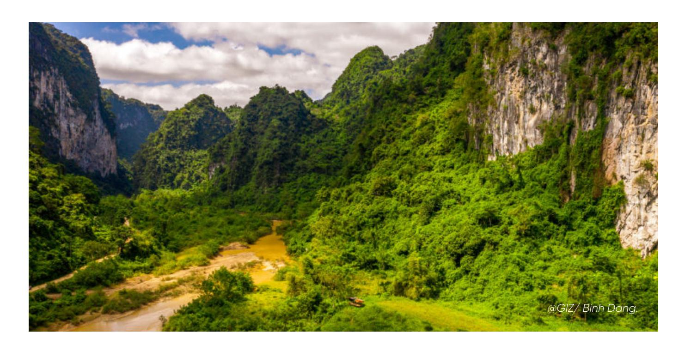

EUDR requirements will demand a major leap in data collection and reporting practices at the farm level. The coee sector already has a starting point with its system of voluntary certification systems, which provides a foundational platform that could be scaled up across coee-producing provinces. About 70% of Viet Nam's coee production is lacking systematic information flow and plot-level mapping. While the PUCs introduced by the MAE are a promising initiative, expanding and standardising this approach nationwide remains challenging. Lessons from the seafood and fruit sectors, particularly the use of QR codes and barcode systems, can help address these gaps. In any case, clearly any tools adopted must be easy to use, work oine, and be interoperable across dierent buyers and supply chain actors.

The timber sector can build on the existing legal framework, but gaps remain in fully aligning with EUDR requirements. The VNTLAS has established a strong foundation for ensuring the legality and

traceability of timber, with comprehensive documentation for inspection and audits. Actors are required to provide various documents, including harvesting, transport, and processing permits. However, the EUDR specifically requires plot-level geolocation data, information that is currently absent from VNTLAS procedures. Without this, operators cannot fully trace timber production to individual farms or plots. Furthermore, the risk of mixing compliant and non-compliant timber within the supply chain remains a concern. Stronger controls and full segregation throughout the supply chain will be needed to prevent mixing and to meet the EUDR's strict traceability requirements.

Viet Nam has made significant progress in developing digital traceability solutions, but the degree to which smallholders can access and use these systems remains uneven across sectors and provinces. Table 7 demonstrates the dierences between coee and timber sectors with regards to the status quo.

#### **6.8.3. Overall readiness of the coee and timber sectors**

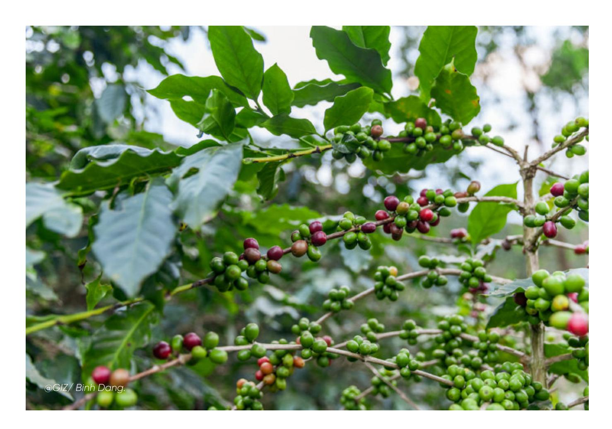

|                                               | Coffee sector                                                                                                                    | Timber sector                                                                                               | Remarks                                                                                                       |
|-----------------------------------------------|----------------------------------------------------------------------------------------------------------------------------------|-------------------------------------------------------------------------------------------------------------|---------------------------------------------------------------------------------------------------------------|
| <b>Policy and institutional framework</b>     | PUC pilots under Decision 3156/QD-BNN-TT                                                                                         | PUC under Decision 3156/QD-BNN-TT, Decree 102 and 120 + related bylaws form the VNTLAS                      | Coffee pilots promising but yet to be scaled; VNTLAS strong legality base but lacks geo-location requirements |
| <b>frastructure and digital capacity</b>      | Digital traceability exists in some provinces and enterprises but lacks nationwide integration                                   | Multiple fragmented systems with limited shared standards; data often paper-based and difficult to digitise | Both sectors suffer from fragmentation Tools are not fully interoperable                                   |
| <b>Certification and legality coverage</b>    | ~ 30% certified (4C, RA, Organic) No binding legal framework                                                                  | ~15% certified (FSC, PEFC, VFCS readiness) Strong legal framework                                        | Certified streams are better prepared for EUDR                                                                |
| <b>Data availability</b>                      | Limited. Piloted PUCs, some private enterprise reporting planning system for certified supply chains. Many plots unregistered | FSC-certified and PEFC areas better, but coverage limited High risk of mixing                            | Plot-level GPS is a major gap in both sectors                                                                 |
| <b>Market orientation and export exposure</b> | High EU export-oriented                                                                                                          | Moderate EU export-oriented                                                                                 | Alternative markets reduce incentives for meeting the requirements.                                           |
| <b>Overall EUDR readiness</b>                 | Medium - High for certified streams; Medium - Low for non-certified streams                                                      | Medium for certified plantation timber; Low for mixed or imported timber                                    | Certified systems show readiness, but smallholder and mixed streams are critical gap                          |

*Table 8 - Status quo comparison on traceability between coee and timber sectors*

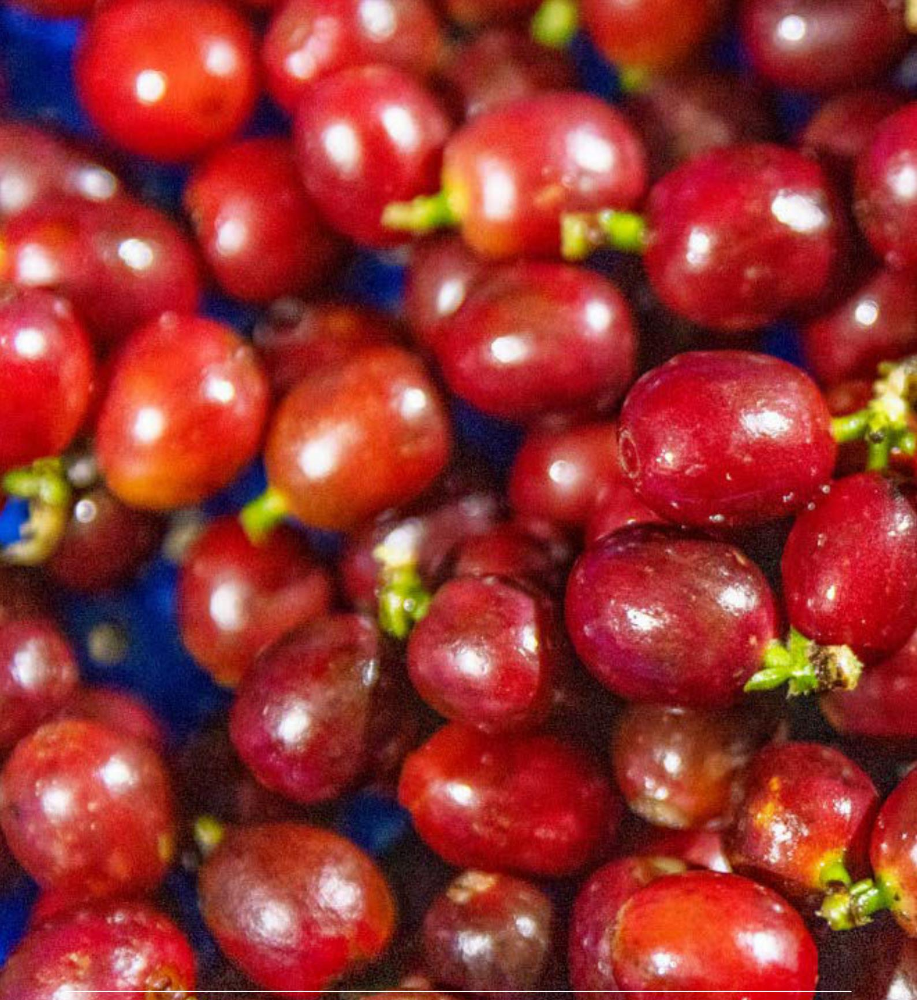

# **DISCUSSION AND 07. RECOMMENDATIONS**

## **07. DISCUSSION AND RECOMMENDATIONS**

This assessment highlights both the progress made and the challenges that remain for Viet Nam's coee and timber sectors in aligning with EUDR requirements. While enterprises, government agencies, and supporting organisations have taken concrete steps to build traceability systems and verification, significant gaps must still be addressed eectively.

A key strength lies in the strong export value of coee and timber, which provides clear economic incentives for stakeholders. The Government's active support, including its push for digital transformation, creates favourable conditions for modernising traceability systems. Existing certification systems also oer a practical starting point, as they already require basic traceability and legality standards. Many enterprises are leveraging these systems to build internal control systems and pilot digital tools that can be scaled to cover broader supply chains.

However, this assessment confirms that smallholders remain the most vulnerable link in the chain. Many smallholders still have limited awareness of traceability requirements under the EUDR, lack digital skills, and bear the cost of dierent activities such as geolocation mapping, record keeping, and paperwork without seeing direct benefits. This makes consistent traceability challenging, especially for non-certified production.

The flow of information through the supply chain remains insucient to guarantee traceability from smallholders to final markets. While certified supply chains have clearer internal control systems, conventional production, which still accounts for the majority, often lacks georeferenced plot data, complete land titles, or systematic record keeping. Smallholders often perceive that traceability is solely the responsibility of enterprises and traders, and many lack the capacity or incentive to maintain detailed records themselves.

Additionally, fragmented and sometimes incomplete geospatial data, the absence of a standardised national forest base map, and unclear guidelines for coordinate systems at national and local level, create technical barriers for both enterprises and auditors when verifying information in the field. The complex land tenure situation, where many plots lack formal titles or involve informal land use, further complicates legal verification. A fundamental concern is that current traceability tools are often fragmented and, in some cases, irrelevant or poorly suited to actual conditions on the ground. Many enterprises still rely heavily on paper-based systems or simple digital spreadsheets, which create administrative burdens and limit scalability. Although some apps and software tools have been developed, they are not always practical for smallholders with limited digital skills or reliable internet access. As a result, the existing tools do not fully address the real challenges of recording and verifying geolocations, production dates, or legal documentation in line with EUDR requirements.

The involvement of NGOs, service providers, and local authorities has helped to bridge some of these gaps by delivering capacity building, developing traceability tools, and supporting policy reforms. Nonetheless, local authorities mainly perform an administrative role and have limited direct engagement in supply chain operations, which constrains their ability to actively strengthen traceability on the ground.

Lessons from the VPA FLEGT process suggest that developing a robust traceability and legality assurance system requires strong coordination between government agencies, private actors, and smallholders. The experience from the timber sector with its VNTLAS shows that traceability is most eective when supported by clear legal frameworks, consistent data standards, and independent verification. Applying these lessons across sectors such as coee and other cultural commodities can promote cross-sectoral learning and harmonise approaches to

legality and sustainability. Building on existing tools could support the development of an interoperable traceability framework.

Strengthening traceability is not just about technology, it hinges on trust, legal clarity, and genuine collaboration among all stakeholders. Clear policy, robust local engagement, practical digital solutions, and fair cost-sharing models will be essential for Viet Nam's coee and timber supply chains.

To address the gaps identified in this assessment and increase participation in supply chains destined for the EU market, the following recommendations are proposed:

#### **Regional cooperation**

Regional Dialogues: Hold ASEAN-level dialogues and joint traceability initiatives to increase mutual understanding of the need for and cooperation in strengthening the traceability and legality of transboundary coee and timber products.

Interoperable systems: Adopt interoperable systems and leverage open-source initiatives, such as DIASCA, to trace the origin of coee and timber and improve interoperability.

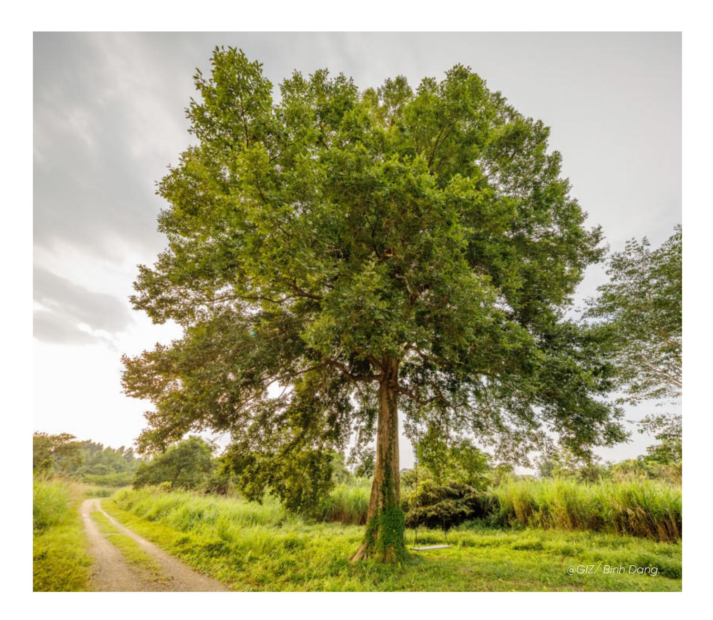

#### **At the national level**

It is essential to upgrade the VNTLAS to ensure that timber production aligns with the information requirements of the EUDR. The VNTLAS should enhance its due diligence procedures to include deforestation-free verification, strengthen supply chain traceability, and require geolocation data consistent with EUDR requirements. Digitalisation is critical to enable the real-time exchange of information among competent authorities, enterprises, and other stakeholders.

A national forest cover monitoring system could integrate risk assessment modules to evaluate deforestation and legality risks of agricultural commodities, while communicating clearly on the definitions of key terms used to avoid any misunderstandings in the EUDR context. The upgraded system should mandate the inclusion of verifiable evidence, such as satellite imagery, land-use certificates, and other supporting documentation.

Geolocation data should be systematically linked to production areas to provide a transparent and traceable record from source to export.

Agree on coordinate systems for dierent maps to ensure interoperability and strengthen commodity traceability support readiness with the EUDR.

Simplify land tenure verification: Streamline procedures for issuing, updating, and digitising LURCs and help smallholders legalise plots currently lacking formal titles in areas where they have cultivated without any conflicts.

Promote coordinates, pre-competitive collaboration among enterprises, traders, smallholders, and local authorities to develop interoperable traceability solutions at national and regional levels. Eorts should focus on clarifying stakeholders' roles, aligning systems, and dedicating resources toward shared traceability and verification objectives.

Integrate coee and timber data layers into existing national traceability portals or link them with open, interoperable platforms, such as FAO's WHISP, to enhance geospatial verification.

Strengthen border checks and require suppliers to provide EUDR-aligned due diligence information, including verified plot-level geolocation; e.g., for imported timber.

Create national coordination: Facilitate dialogue platforms to strengthen coordination among ministries and local authorities, ensuring the inclusion of all relevant agencies in preparations for EUDR readiness.

#### **Local authorities**

Go beyond administration: Proactively support smallholders to register land, verify LURCs with geolocation following the new form, and resolve land disputes.

Ensure legal and data accuracy: Issue clear, practical instructions for verifying farm and forest plot boundaries. Validate land classifications to prevent discrepancies that would undermine due diligence statements.

Act as connectors: Convene local multi-stakeholder working groups with the participation of dierent stakeholders to align traceability practices and solve local barriers collaboratively.

#### **Enterprises and exporters**

Invest in user-friendly digital tools: Develop or adapt mobile apps that allow smallholders to record plot geolocations, farm diaries, and legal documents. These tools should work oine, use simple interfaces, and support multiple local languages.

Align internal control systems with EUDR information requirements: Integrate farm-level geolocation into internal audit systems, ERPs, or blockchain pilots, ensuring certified and non-certified batches are physically and digitally segregated to prevent mixing. Support upstream actors: Cooperate with traders and cooperatives to help smallholders map plots and upload documents. Oer technical and financial support where needed, for example, by co-financing GPS mapping or paying premiums for EUDR-compliant timber or coee.

Cross-sector learning: Adapt good practices from fruit and seafood traceability (for example, using QR codes for batch tracking) and customise for coee and timber.

#### **For smallholders and cooperatives**

Organise for cost-sharing: Form or strengthen cooperatives and farmer groups to share costs of mapping, certification, and maintaining traceability records.

Adopt digital tools: Engage actively in capacity-building and digital literacy programs to use mobile apps or cooperative-managed digital platforms, keep plot-level records, update farming activities, and store legal documents to meet buyer requirements.

Benefit from incentives: Take advantage of certification systems, premiums, and partnership oers that support better market access and price dierentiation for traceable, deforestation-free commodities.

#### **Other related stakeholders (BDS providers, NGOs, and associations)**

Expand training and follow-up support: Deliver tailored capacity-building programmes for smallholders, local traders, and community leaders on plot mapping and digital traceability.

Facilitate knowledge transfer: Organise cross-sector workshops where lessons from the seafood and fruit sectors are shared with timber processors, coee exporters, and farmer cooperatives.

Promote interoperability: Engage with global buyers and invest in interoperable traceability tools to promote their adoption by suppliers and buyers.

#### **For operators**

Provide clear technical guidance: Issue user-friendly manuals that specify the acceptable formats for plot-level geolocation (e.g., shapefiles, GPS coordinates, standard projection).

Work with local partners to provide instructions on information needs in Vietnamese; clarify data required for due diligence statements and geolocation data sheets; and support risk mitigation plans.

Technical support: Support upstream supply chain actors with technical and financial support (e.g., trainings, capacity building, investments).

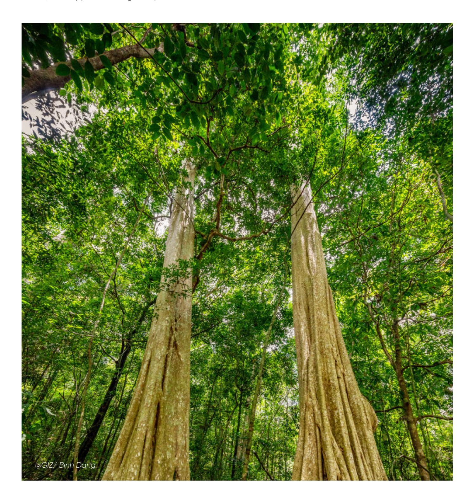

# **08.CONCLUSIONS**

### **08. CONCLUSIONS**

Dierent tools and approaches for traceability are currently applied in Viet Nam's coee and timber sectors. As a next step, pilots could be further scaled and targeted interventions strengthened in priority production areas. The immediate focus should be on expanding geolocation mapping and strengthening traceability in highly export-oriented provinces for coee and key plantation and processing hubs for timber and timber products. Provincial authorities, in partnership with MAE, exporters, certification bodies, and international partners, should mobilise blended financing to deliver practical training, digital literacy support, and basic tools to smallholders and cooperatives. Another element could be an interoperable national traceability gateway that integrates data from certification processes, provincial, and national data streams for production areas, and which aligns with EUDR data requirements.

Enhancing geolocation data collection and coverage is a critical priority. Practical solutions include deploying mobile-based GPS mapping applications that enable farmers to self-record plot boundaries, training local extension workers or youth to provide hands-on mapping services, and creating clear protocols for data validation and periodic updates.

Both coee and timber sectors should prioritise organising smallholders into cooperatives or producer groups to enable group certification systems, which reduce costs and make traceability requirements more manageable. Local governments should cooperate with operators to provide practical training, technical assistance, and guidance on digital mapping, record-keeping, and legality. Moreover, pilot programs should support tools with simple interfaces (e.g., smartphones) to help smallholders generate geolocation data.

Developing an open-source, national traceability gateway that can integrate data from various certification bodies, private supply chain

management tools, and government-run systems could oer one possible approach. This unified platform should adopt globally recognised data standards to ensure data sharing across supply chain actors and exporters. Interoperability will enable operators to directly demonstrate compliance more eciently by linking geolocation, legality, and other information/data required for due diligence.

MAE could issue detailed technical guidelines for operators, traders, certification bodies, and smallholders covering data formats, plot mapping methods, due diligence documentation, and timelines appropriate to the Vietnamese context. The existing legal framework, such as Decree 120/2024, should be updated to include EUDR-compatible data requirements for imported raw materials and ensure information flows transparently along the supply chain. At the provincial level, action plan implementation should include dedicated budget allocations for digital tools and training to ensure local stakeholders have sucient capacity to meet the new data and traceability requirements. Partnering with international experts and private actors could be the basis for scaling successful pilots.

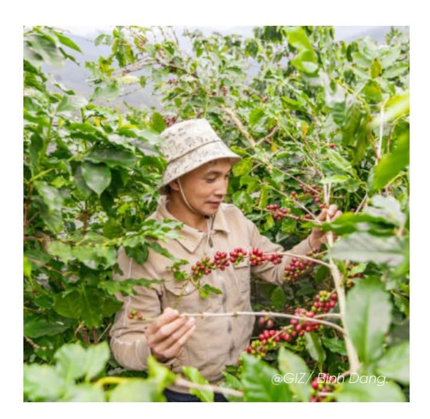

**09. ANNEX** 

### **09. ANNEX**

UTZ was the first certification system introduced in Viet Nam, adopted by enterprises and smallholders in 2001. This certification system requires coee cultivation to comply with sustainability standards to ensure high quality and integrity throughout processing. It is supported by regular inspections and monitoring. In Viet Nam, UTZ certification is issued by the independent certification body Café Control, with headquarters in Ho Chi Minh City. UTZ is now part of the RA, and for a period, the UTZ certification programme and the RA Certified programme operated in parallel. With the launch of the RA 2020 Certification Programme in July 2020 and the introduction of the new RA seal in September that year, the UTZ certification programme and its label are gradually being phased out.

The RA sets out comprehensive sustainability standards. The system requires the coee sector to meet strict criteria related to forest protection, sustainable farming practices, and livelihood improvement for smallholders. To achieve these goals, the system emphasises robust management practices, traceability, including geolocation, and other relevant measures. In addition, it requires near real-time updates of online traceability data. Stakeholders must also comply with social and environmental requirements to support broader sustainability objectives.

The RA defines multiple traceability levels including Identity Preserved (IP), Segregation (SG), and Mass Balance (MB), each with specific timelines and detailed guidance for traceability. The IP level allows consumers to trace a product back to a specific farm Certificate Holder. Mixed IP is a subtype of IP, in which the certified product can be traced back to more than one RA-certified farm Certificate Holder. If a product cannot be traced to a specific farm

Certificate Holder but its content is fully RA certified and kept segregated from non-certified products throughout the supply chain, it falls under the Segregation level. The MB level allows a Certificate Holder to sell a non-certified product as RA certified if an equivalent quantity was sourced as RA certified within the supply chain*12*. The RA has developed an online traceability system that allows various actors to update near real-time information on planting, processing, and sales activities.

#### **UTZ/RA**

*12https://knowledge.rainforest-alliance.org/docs/ multitrace-traceability-user-manual-guidance#21 traceability-levels*

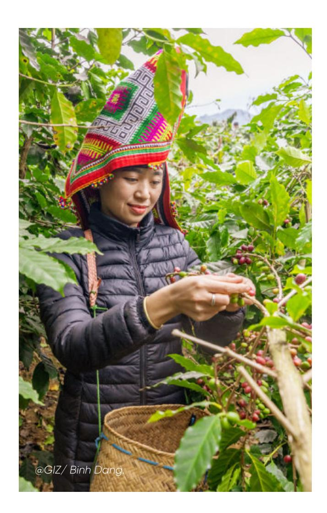

In 2010, the major Vietnamese coee exporter Simexco Dak Lak Ltd was the first enterprise joining the 4C programme and engaged 4,605 farmers, initially through 4C verification and, from 2018 onward, through the full certification system. This certification system is built on 12 principles covering economic, social, and environmental aspects, based on good agricultural and management practices as well as international conventions and recognised guidelines in the coee and cocoa sectors. In addition, the system defines three levels of compliance, allowing for a smooth transition to certification and supporting the continuous improvement of certified producers.

4C-certified coee is fully traceable through a supply chain supported by digital commercial reporting. Within the 4C system, standard operating procedures for traceability are clearly defined and implemented. The system requires that 4C-certified coee be physically segregated from non-certified coee. Records of 4C-certified coee produced on registered fields or plots, listed in the Business Partner Map of the 4C Unit, must be maintained, although this requirement does not apply to smallholders. All reports must include detailed information on sales, deliveries, and stock of 4C-certified coee, including the date, volume, and the name and address of recipients. These records must align with related documents such as invoices and delivery notes. Furthermore, the volume of 4C-certified coee sold by the Business Partner Producer must correspond to the size of the registered fields or plots in the Business Partner Map. The system strictly prohibits "multiple claiming" of certified coee; for example, the same batch cannot be sold or delivered more than once as certified.

#### **Fairtrade**

Fairtrade works with farming cooperatives, businesses, and governments to make trade fairer. In 2008, Fairtrade-certified coee was introduced in Viet Nam by an enterprise to support a group of farmers through a cooperative*13*. Fairtrade-certified coee is produced in accordance with strict standards that promote sustainable livelihoods, safe working conditions, environmental protection, and strong, transparent supply chains*14* .

Fairtrade coee is fully traceable and must be identifiable as Fairtrade at every stage of the supply chain and in all relevant documents and packaging*15* It must ensure that products sold as Fairtrade are sourced exclusively from Fairtrade producers, meaning they are kept separate from non-Fairtrade products from field to store shelf. The traceability system requires that all operators meet strict documentary traceability requirements. Additionally, physical traceability is mandatory for all operators except those handling cocoa, cane sugar, fruit juices, tea, and Farm Sustainability Platform cotton, which do not require physical traceability*16* .

#### **4C**

*13https://www.fairtrade.org.uk/farmers-and-workers/coee/cudliemnong-vietnam/*

*14https://www.fairtradecertified.org/what-we-do/what-we-certify/coee/*

*15https://www.fairtrade.net/en/why-fairtrade/how-we-do-it/how-does-the-label-work/traceability-in-fairtr ade-supply-chains.html#:~:text=The%20majority%20of%20Fairtrade%20products,actually%20be%20detriment al%20to%20farmers.* 

*16https://www.fairtrade.net/content/dam/fairtrade/fairtrade-international/standards/trader-standards/ 2015-09-04\_Explan\_Doc\_GTS\_EN.pdf* 

#### **Organic**

Viet Nam has developed a system of organic coee certification systems for both international and domestic markets. The three most common international organic certifications in Viet Nam are United States Department of Agriculture (USDA) Organic, Japanese agricultural standards, and EU Organic, which enable producers to export to the US, Japanese, and EU markets, respectively*17*. In addition, Viet Nam has established its own organic standards to meet the country's growing domestic demand for organic products. Cultivation practices must not use synthetic chemical fertilizers, herbicides, or pesticides and must protect soil health and ensure safety for the end consumer*18* .

Organic certification systems rely on third-party verification by independent organisations to confirm that producers meet and maintain certification requirements. Producers must manage all aspects of farming and handling, including activities such as tilling, grazing, harvesting, storage, and transportation. The standards also define which substances are permitted during production and handling, set requirements for monitoring practices and recordkeeping, and mandate measures to prevent mixing with non-organic products or exposure to prohibited substances.

A certifying agent conducts on-site inspections of every operation applying for organic certification. For coee, this involves checking fields, soil conditions, crop health, weed and pest management methods, water systems, storage facilities, and equipment. Inspectors also examine the receiving, processing, and storage areas for organic ingredients and finished products at handling or processing sites. After assessing practices and comparing them with the approved organic system plan, the inspector reports their findings to the certifying agent. Additional information may be requested before a final certification decision is made*19* .

#### **FSC**

The FSC is a forest certification system that sets standards for responsible forest management. Its criteria require that forests be managed in ways that are environmentally appropriate, socially beneficial, and economically viable. The FSC certification system is designed to be open and transparent, ensuring that stakeholders throughout the forest supply chain adhere to principles that protect healthy and resilient forests for generations. This certification recognises environmentally responsible, socially beneficial, and economically viable forest management. Over the past two decades, Vietnamese firms and smallholders have increasingly participated in the FSC certification system to promote sustainability in the timber sector.

*17https://sustainablevietnam.com/2020/07/20/organic-farming-certification-and-enabling-smallholders-invietnam/* 

*18https://www.helenacoee.vn/organic-certification-on-organic-coee-helena-coee-vietnam/?srsltid=Afm BOop2sifxuZyZUQzBNH\_fVf0AcAweSdMbQhE3JbVk0dC5eYZuND2i* 

*19https://www.ams.usda.gov/sites/default/files/media/ProcessorsGuide.pdf* 

#### **PEFC**

The PEFC aims to promote sustainable forest management through independent third-party certification. It does this by endorsing national certification systems developed by individual countries, ensuring they meet specific sustainability benchmarks. To receive PEFC endorsement, a country's national forest certification system must be reviewed by an expert panel and the PEFC board against international criteria. These national systems are developed through a multi-stakeholder process, allowing them to be tailored to local priorities and conditions. This approach provides forest managers,

both large and small, with the tools to demonstrate their commitment to sustainability and responsible forest management.

Both FSC and PEFC systems use Chain of Custody (CoC) to certify forest products. CoC certification verifies that timber used in production is sourced from responsibly managed forests and remains traceable throughout all stages of production and trade, from the forest manager to the final product manufacturer.

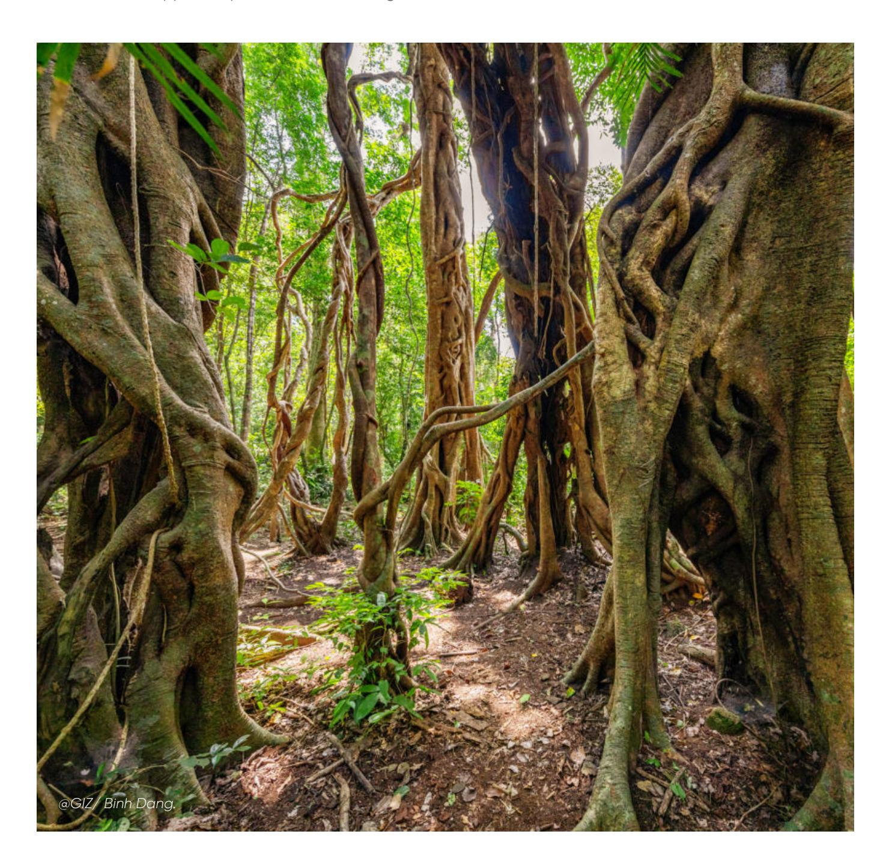

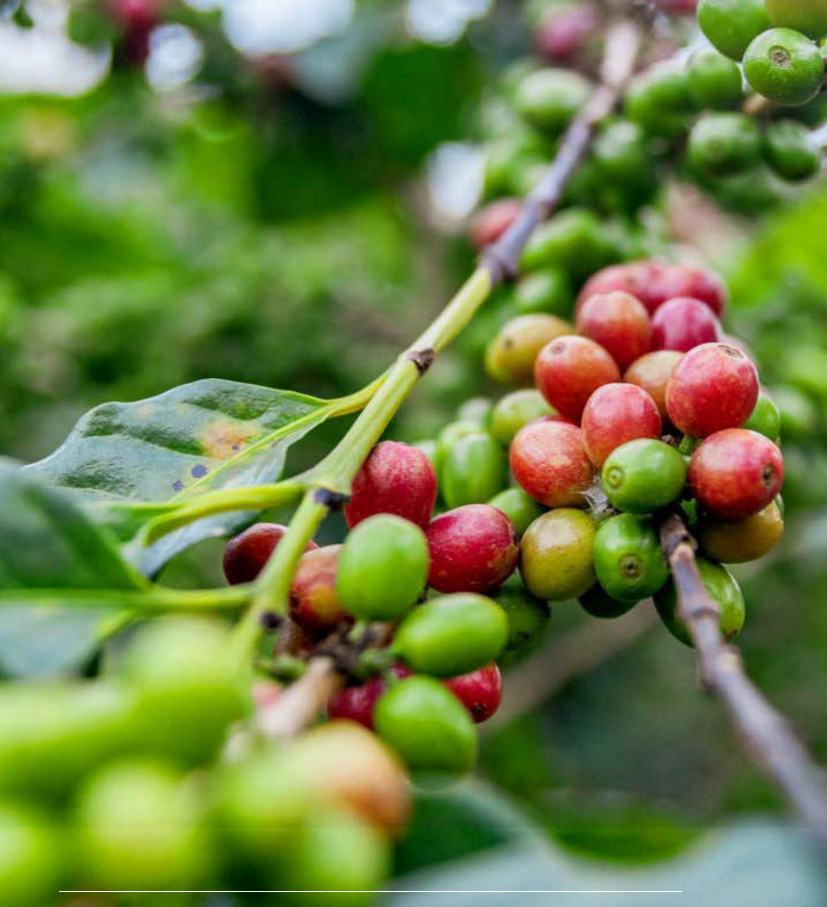

# **10.REFERENCES**

### **10. REFERENCES**

- Aldinger, P., Nguyen, T. V., Pham, D. T., & Nguyen, T. C. (2024). EUDR Preparedness Check for the Commercial Forestry Sector in Viet Nam. Retrieved from Ha Noi:
- Benhin, J. (2006). Agriculture and deforestation in the tropics: a critical theoretical and empirical review. Human Environment, 35(1), 9-16. doi:https://doi.org/10.1579/0044-7447-35.1.9
- Bodo, T., Gimah, B. G., & Seomoni, K. J. (2021). Deforestation and habitat loss: Human causes, consequences and possible solutions. Geographical Research, 4(2). doi:https://doi.org/10.30564/jgr.v4i2.3059
- Bui, C. (2020). Financial Sustainability of PEFC Group Certification for Smallholder Farmers in Central Viet Nam. (Master of Science), University of Helsinki, Retrieved from https://helda.helsinki.fi/server/api/ core/bitstreams/4e03baf9-de0a-4419-837c-487ab4239d05/content
- Đặng, Đ. C., Đỗ, X.H., & Tô, X.P. (2025). Ngành cà phê việt nam: Thực trạng và một số khía cạnh chính sách. Retrieved from Hà Nội: https://mkresourcesgovernance.org/wp-content/uploads/2025/04/20250410- Bao-cao-thuc-trang-va-chinh-sach-ho-tro-nganh-ca-phe-Viet-Nam-FINAL.pdf
- Đặng, T. A. T., & Trần, H. N. (2022). Đánh giá tác ộng của việc tham gia mô hình sản xuất cà phê theo chứng chỉ ến thu nhập của nông hộ tại tỉnh Lâm Đồng. Tạp chí KHoa học và Công nghệ lâm nghiệp(6), 149-159.
- Dang, T. P., & Nguyen, T. N. (2024). Enhancing transparency in the supply chain of Viet Nam's agricultural products for export in the context of digital transportation. Paper presented at the 2024 5th Education conference on business, economics and management.
- Dueld, L., & Christian, J. (2024). Transformative traceability: How robust traceability systems can help implement the EUDR and fight the drivers of deforestation. Retrieved from Belgium: https:// www.fern.org/fileadmin/uploads/fern/Documents/2024/Transformative\_traceability\_How\_robust\_traceabi lity\_systems\_can\_help\_implement\_the\_EUDR\_and\_fight\_the\_drivers\_of\_deforestation.pdf
- Franco-Solís, A., & Montanía, C. V. (2021). Dynamics of deforestation worldwide: A structural decomposition analysis of agricultural land use in South America. Land Use Policy, 109, 105619. doi:https: //doi.org/10.1016/j.landusepol.2021.105619
- General Statistics Oce (2024). Statistical Yearbook of Viet Nam 2023. Ha Noi: Statistical publishing house.
- Ha, T. V., Tran, D. B., & Le, V. H. (2025). Landscapes in transition: how land fragmentation reshapes livelihood choices in Viet Nam. Post-Communist Economies, 1-17. doi:https://doi.org/10.1080/14631377.2025.2517982
- Indrasto, H. B. B., Asyifa, H. N., & Kuncoro, T. G. (2024). Evaluation Impact of the European Union Anti-Deforestation Regulation (EUDR) Policy: Empirical Study of Indonesian Agricultural Product Exports.
- International Bank for Reconstruction and Development (2022). Digital Technology for Traceability in Viet Nam's Fruit and Vegetable Value Chains. Retrieved from Washington: https://www.wbgkggtf.org/sites/kggtf /files/publications/Digital%20Technology%20for%20Traceability\_0.pdf
- Iwanaga, S., Tran, V. L., Le, T. T. T., Nguyen, V. M., & Hoang, H. T. (2024). Incentives for forest certifications in Viet Nam: a case of the North Central region. Journal of Forest Research, 29(4), 270-278. doi:https: //doi.org/10.1080/13416979.2024.2324207

- Khuc, V. Q., Le, T.-A. T., Nguyen, T. H., Nong, D., Tran, B. Q., Meyfroidt, P., . . . Tran, T. (2020). Forest cover change, households' livelihoods, trade-os, and constraints associated with plantation forests in poor upland-rural landscapes: Evidence from north central Viet Nam. Forests, 11(5), 548. doi: https://www.mdpi.com /1999-4907/11/5/548#
- Le, M. T., Dang, P.-A. T., Le, C. Y., & Nguyen, T. T. T. (2025). Integrating local fine food traceability mapping in Viet Nam's fine dining sector. Applied Food Research, 5(2), 101069.
- Le, V. D., Huong, L., Pham, D. T., Nguyen, T. C., & Riano, C. (2024). EUDR Preparedness Check for the Coee Sector in Viet Nam. Retrieved from
- Melo-Velasco, J., Padilla-Quiñonez, C., Colindres, M., Ceballos-Sierra, F., & Wiegel, J. (2025). Linkages between EU Deforestation-Free Regulation and traceability tools: An exploration from the Honduran coee sector: Intl Food Policy Res Inst.
- Nadras, S., Mazlan, R., Hussain, H., & Shah, I. M. (2024). The European Union Deforestation-free Regulation (EUDR): assessing impacts and strategies for Malaysian and the global oil palm industry. Journal of Sustainability Science, 19(6), 54-74. doi:http://doi.org/10.46754/jssm.2024.06.005
- Nguyen, Q. T. (2024). Decision No. 816/QĐ-BNN-KL on the declaration of the current status of forests in 2023. Ha Noi: Ministry of Agricultue and Environment Retrieved from https://thuvienphapluat.vn/van-ban /Tai-nguyen-Moi-truong/Quyet-dinh-816-QD-BNN-KL-2024-cong-bo-hien-trang-rung-toan-quoc-6048 07.aspx
- Nguyen, T. V. N. (2025). Viet Nam's Coee Supply Activities to the EU Market. International Journal of Social Science Humanity and Management Research, 4(2), 8. doi:10.58806/ijsshmr.2025v4i02n01
- Pendrill, F., Gardner, T. A., Meyfroidt, P., Persson, U. M., Adams, J., Azevedo, T., . . . De Sy, V. (2022). Disentangling the numbers behind agriculture-driven tropical deforestation. Journal of Science, 377(6611), eabm9267. doi:https://doi.org/10.1126/science.abm9267
- Pendrill, F., Persson, U. M., Godar, J., Kastner, T., Moran, D., Schmidt, S., & Wood, R. (2019). Agricultural and forestry trade drives large share of tropical deforestation emissions. Global Environmental Change, 56, 1-10. doi:https://doi.org/10.1016/j.gloenvcha.2019.03.002
- Rempel, P., Lehnert, S., Kuschke, T., & Farooq, Q.-U.-A. (2012). A framework for traceability tool comparison. Softwaretechnik-Trends, 32(3), 6-11.
- Roda, J.-M., & Rath, S. (2006). Feeding China's Expanding Demand for Wood Pulp: A Diagnostic Assessment of Plantation Development, Fiber Supply, and Impacts on Natural Forests in China and in the South East Asia Region. Retrieved from Jakarta: https://hal.science/CIRAD/cirad-00193545/file/Viet Nam.pdf
- Seidel, F., Fripp, E., Adams, A., & Denty, I. (2012). Tracking sustainability: review of electronic and semi -electronic timber tracking technologies. Retrieved from
- Simonnet, A. (2023). The impact of the European Deforestation-Free Regulation on trade relations with Southeast Asia. Viet Namese Journal of Legal Sciences, 2023(1115). doi:10.2478/vjls-2024-0017
- Thu, H. (2021). Forestry sector projects in 2021 and eorts in the upcoming period. Figures and Events, 2022(1).

- To, X. P., Cao, T. C., & Tran, L. H. (2021). Viet Namese imports of high-risk timber: current status and control mechanisms. Retrieved from https://www.forest-trends.org/wp-content/uploads/2021/07/Viet Namese -imports-of-high-risk-timber-BRIEF.pdf
- Tô, X. P., & Lương, K. A. (2023). Chuẩn bị ể thích ứng với Quy ịnh chống phá rừng của EU: Đáp ứng yêu cầu về truy xuất nguồn gốc sản phẩm. Retrieved from Ha Noi: https://hawa.vn/wp-content/uploads/2023/11 /Dap-ung-yeu-cau-ve-truy-xuat-nguon-goc-nong-lam-san.pdf
- Tran, Q. (2018). Viet Nam Coee Annual. Retrieved from https://apps.fas.usda.gov/newgainapi /api/report/downloadreportbyfilename?filename=Coee%20Annual\_Hanoi\_Viet Nam\_6-4-2018.pdf
- Truong, Q. H., Nguyen, T. H., Vu, T. B. H., Ho, L. P. K., Dang, T. L. A., & Fumikazu, U. (2025). Navigating EU deforestation regulation compliance: challenges for coee smallholders in Viet Nam. Forests, Trees and Livelihoods, 1-23. doi:https://doi.org/10.1080/14728028.2025.2539196

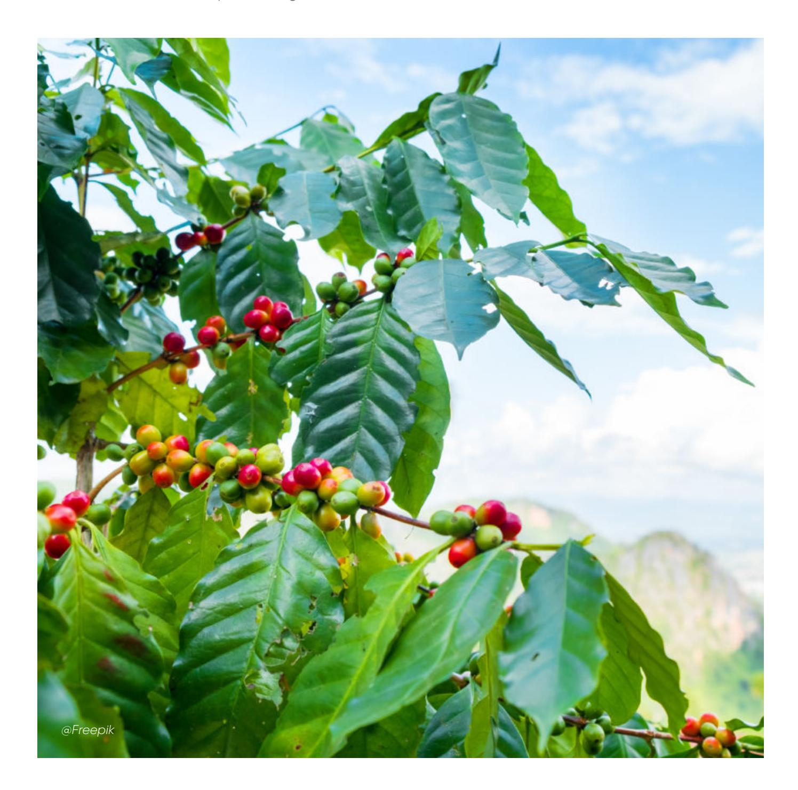

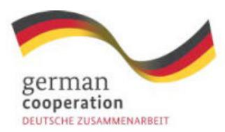

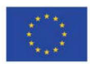

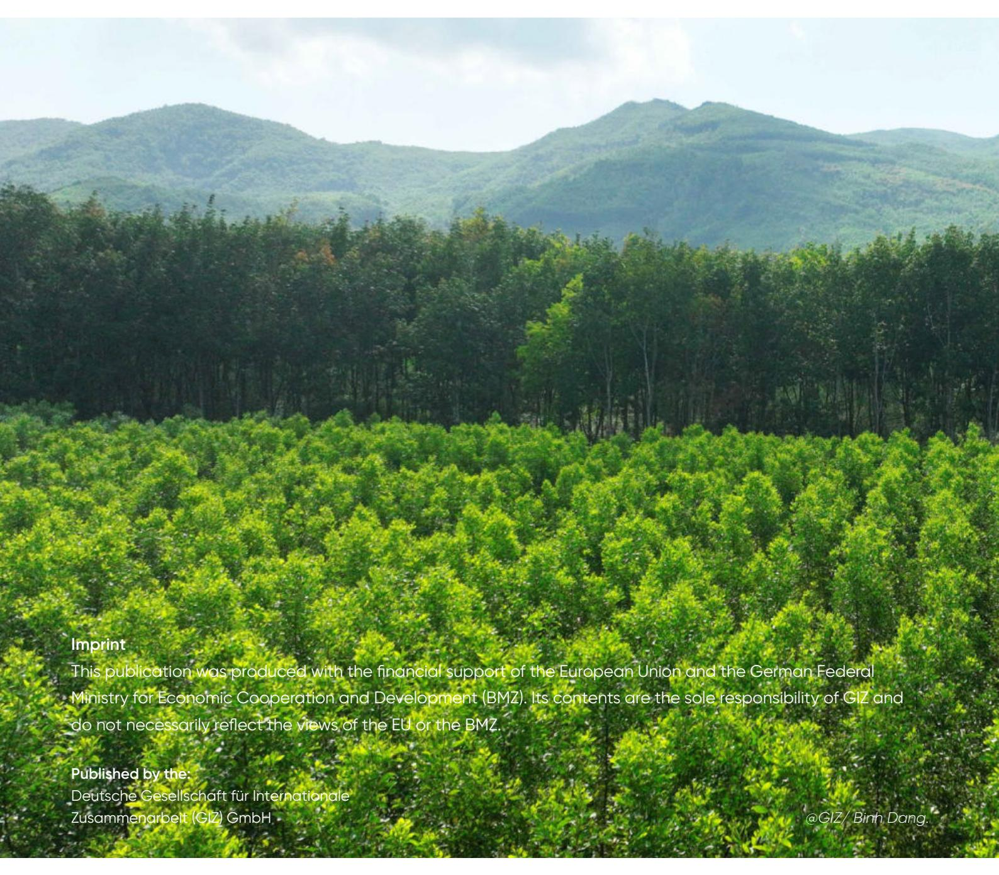

#### **Registered oces:**

BONN AND ESCHBORN, FEDERAL REPUBLIC OF GERMANY Friedrich-Ebert-Allee 36+40, 53113 Bonn, Germany EMAIL: info@giz.de | WEBSITE: www.giz.de/en

#### **Photo credits:**

@GIZ/ Binh Dang., @Freepik All rights reserved. Licensed to the European Union and the German Federal Ministry for Economic Cooperation and Development under conditions.