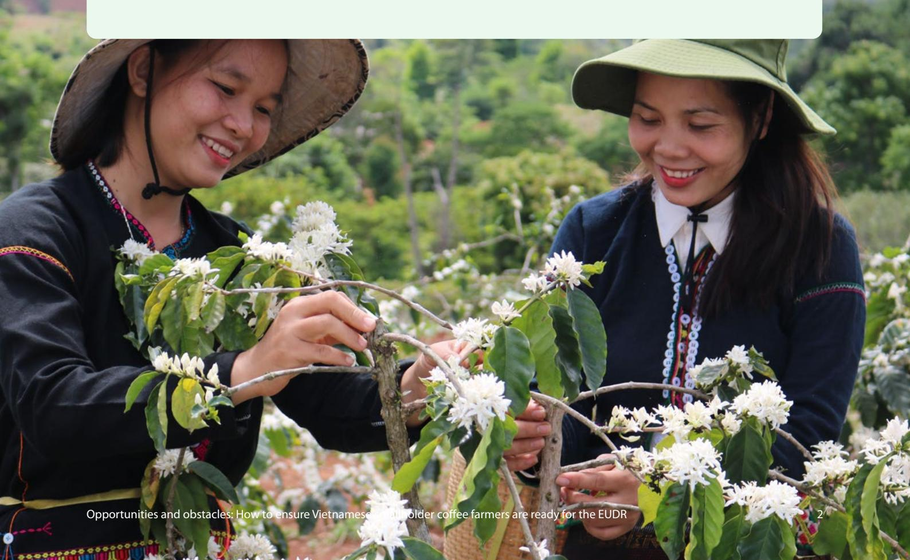
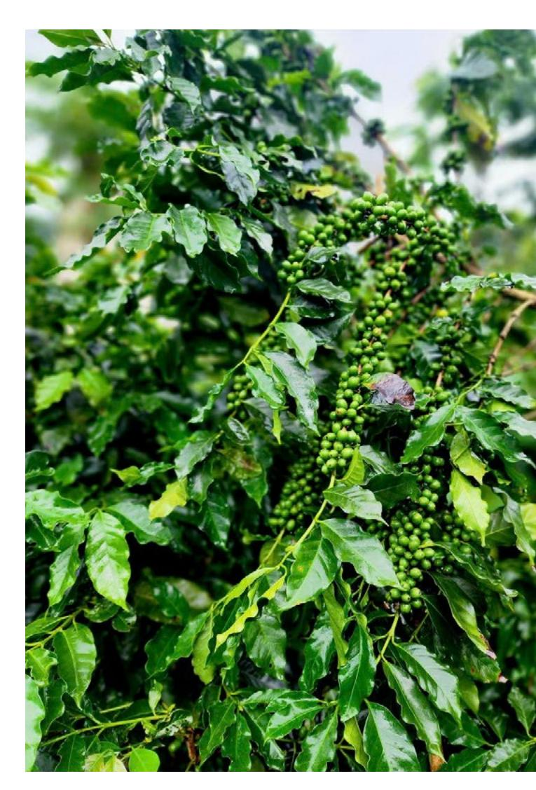
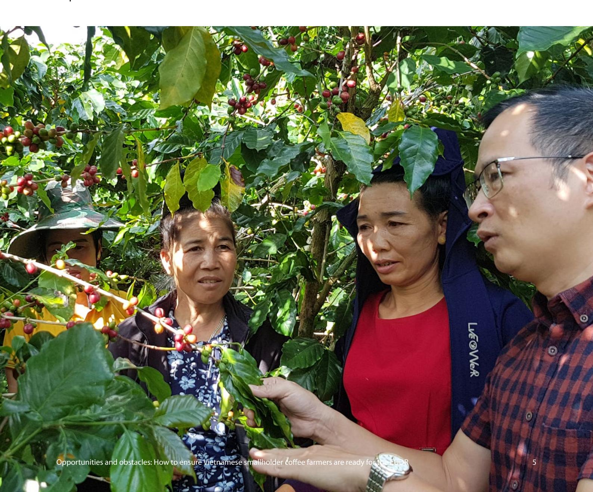

## **Opportunities and obstacles: How to ensure Vietnamese smallholder coee farmers are ready for the EUDR**

# **RESEARCH CONTEXT AND OBJECTIVES**

Vietnam is the world's second-largest coee producer, accounting for approximately 17% of global output and over half of the global Robusta trade. The coee sector contributes around 3% to national GDP and roughly 15% to agricultural export revenue, providing livelihoods for over two million rural households. **The European Union (EU) is one of Vietnam's most important export markets, accounting for over 40% of the country's total coee export.**

The introduction of the EU Deforestation Regulation (EUDR) in May 2023 brings both opportunities and new challenges to the coee supply chain. The EUDR requires products such as coee to be traceable to the plot level, proven to be deforestation-free after December 31,2020, and produced legally under national laws. While these obligations apply directly to EU importers and traders, the responsibility for compliance extends throughout the entire supply chain, including coee farmers, particularly smallholders who often have limited resources and access to information.

Vietnam's coee sector has made positive strides towards sustainable production, including reducing greenhouse gas emissions and adopting environmentally friendly farming and production practices in line with international green initiatives. In addition, certication programs such as Rainforest Alliance, Fairtrade, and 4C are available to promote sustainable practices and help meet international trade requirements. However, only about 30% of coee farmers in Vietnam currently participate in such programs. Furthermore, existing certication standards are not fully aligned with the EUDR's specic requirements, resulting in gaps in the capacity of smallholders to comply with the regulation.

Given this context, **this study aims to assess the readiness and capacity of smallholder coee farmers in Vietnam to comply with the EUDR requirements and to propose suitable support measures.** The research focuses on two major coee-producing regions, the Central Highlands and the Northwest, where smallholder farmers and ethnic diversity are prominent. The ndings are expected to provide valuable input for policymakers, regulatory agencies, and support organizations in developing appropriate solutions to ensure the sustainable development of Vietnam's coee sector in light of the new demands from international markets.

This work was conducted as part of a joint project with Fern under the Forest Governance Markets and Climate (FGMC) program. The views expressed can in no way be taken to reect the views of Fern or the donors. Images by Sustainable Rural Development.

# **RESEARCH METHODOLOGY**

This study assesses Vietnam's coee sector's readiness and capacity to comply with the EUDR, particularly focussing on two major production regions: the Central Highlands (Dak Lak, Gia Lai, Dak Nong, Lam Đong) and the Northwest (Son La, Dien Bien). Research sites were selected based on four criteria: large forest coverage, ethnic diversity, agricultural land comprising over 50% of natural land area, and coee cultivation accounting for more than 40% of agricultural land.

The study was conducted in two main phases:

- **• Phase 1:** A total of 1,724 coee farming households were surveyed using a structured questionnaire via the Kobo Toolbox platform. Trained local enumerators conducted the interviews. Data quality was closely monitored and regularly checked to ensure reliability and accuracy.
- **• Phase 2:** In-depth interviews and focus group discussions were carried out with 120 farmers, 50 local ocials, 10 coee sector experts, 18 enterprises, and 9 cooperatives. The multi-stakeholder approach enriched the data and provided a comprehensive view of the challenges related to EUDR compliance.

Two analytical approaches were employed:

- **• Quantitative analysis:** Using RStudio (2023), the research team conducted descriptive statistics, Chi-square tests, and Wilcoxon rank-sum tests.
- **• Qualitative analysis:** Content and thematic analysis techniques were applied using the TAGUETTEE platform to capture the depth of perceptions and perspectives among various stakeholders.

## **MAIN FINDINGS**

### **1. FROM AWARENESS TO UNDERSTANDING OF THE EUDR: REGIONAL AND ETHNIC DISPARITIES**

The level of awareness and understanding of the EUDR among coee-growing communities in Vietnam remains low, with statistically signicant disparities between regions and ethnic groups. In the Central Highlands, 29.8% of respondents reported having heard of the EUDR, compared to only 19.2% in the Northwest. Kinh people showed a much higher level of awareness (33.1%) than ethnic minority groups (20.1%), highlighting unequal access to information.

Levels of understanding also varied. In the Central Highlands, the majority of respondents (69.3%) rated their understanding as "moderate," whereas only 44.0% in the Northwest did so. Notably, nearly 30% of respondents in the Northwest rated their understanding as "poor" — almost twice the rate in the Central Highlands (14.2%). In both regions, the proportion of respondents who rated their understanding as "good" or "very good" was extremely low.

### **2. LAND TENURE AND BARRIERS TO EUDR COMPLIANCE IN COFFEE-GROWING REGIONS**

The EUDR requires that coee exported to the EU comply with the legal frameworks of the producing country. This makes land legality a critical element in meeting traceability and regulatory standards.

According to the survey, most coee plots (70.15%) hold an ocial land use rights certicate (LURC), while 22.22% are cadastrally recorded land—meaning recognized in local land records but not formally titled. Another 7.63% of plots are documented with other types of papers, which are neither formally titled nor recognized in the cadastral system. **These gures suggest that a signicant portion of farming households may already meet the land legality requirement set by the EUDR, although gaps remain.**

Still, notable regional dierences exist. On average, households in the Central Highlands reported fewer land plots than those in the Northwest (1.60 vs. 2.72 plots), but had a much higher proportion of cadastrally recorded land. In contrast, farmers in the Northwest were more likely to hold formal LURCs. This uneven distribution of land documents and plot numbers across regions may pose challenges for consistent compliance with land traceability and legal verication under the EUDR.

When comparing ethnic groups, the average number of plots with ocial LURCs did not dier signicantly between Kinh and ethnic minority households. This indicates relatively equal access to formal land rights across these groups, with no major legal gap in terms of land certicate ownership.

### **3. PLOT SIZE AND THE CAPACITY TO MEET GEOLOCATION REQUIREMENTS UNDER THE EUDR**

The study found that smartphone ownership among coee-farming households is very high in both the Central Highlands and the Northwest. On average, each household owns between 2.69 and 2.85 smartphones, with Kinh households having a higher rate of ownership than ethnic minority households.

However, the actual use of smartphones for digital applications in production and business remains limited. Only 25.4% of households in the Central Highlands and 19.8% in the Northwest reported using smartphones for production or business purposes. Notably, only 14.2% of ethnic minority households use smartphones to support production activities, compared to 32.2% among Kinh households, highlighting a signicant gap in the capacity to leverage technology for coee farming and trade.

In addition, the use of smartphones for geolocation, a key requirement for traceability under the EUDR, is extremely low, at just 2%. In contrast, smartphones are primarily used for entertainment, with usage rates reaching 96–100% across both regions and ethnic groups.

Despite widespread access to digital devices, **the ndings suggest that the capacity to apply digital technology in agricultural production remains limited, especially among ethnic minority groups. This presents a key barrier to providing geocoordinates and ensuring traceability as required under the EUDR.**

#### **4. DEFORESTATION RISK AND EUDR COMPLIANCE CAPACITY**

Under the EUDR, exporting countries have been classied into three risk levels: low, standard, and high, based on indicators such as deforestation rates, trends in agricultural land expansion for commodity production, and traceability capacity. Analysis of Global Forest Watch data from 2010 to 2023 indicates that deforestation in Vietnam related to commodity production has declined signicantly, while the expansion of land for coee cultivation has slowed substantially since its peak in 2016. These trends likely contributed to Vietnam's low-risk categorization.

Our survey data from six provinces conrms this. It shows that 47.2% of households in the Central Highlands and 46.9% in the Northwest reported planting new coee after this date. However, there were notable ethnic dierences: only 34.6% of ethnic minority households reported replanting, compared to 58.6% of Kinh households, indicating that Kinh farmers may have had better access to resources and support for coee replanting.

Although the rate of new planting appears relatively high, most of these activities were carried out on previously cultivated land and therefore do not contribute to an increased deforestation risk under EUDR rules. Specically, 93.4% of households in the Central Highlands and 84.2% in the Northwest reported replanting on existing farmland. Farmers in the Northwest were also more likely to use a mix of old and new land for replanting (7.7%) compared to those in the Central Highlands (2.7%).

#### **5. PLANT PROTECTION PRODUCTS AND ENVIRONMENTAL CONCERNS UNDER THE EUDR**

The use of plant protection products (PPPs) is widespread in coee production across both the Central Highlands and the Northwest, with 85.2% and 96.0% of households using them, respectively. However, signicant dierences exist by ethnicity: 96.6% of Kinh households reported using PPPs, compared to only 78.9% of ethnic minority households.

Understanding of banned chemicals remains limited and uneven. In the Central Highlands, 41.1% of households reported being aware of restricted or prohibited PPPs, while this gure was only 22.5% in the Northwest. Among ethnic minorities, just 14.0% of households had knowledge of banned products, compared to 51.5% of Kinh households. This highlights a critical gap in access to agricultural safety information—an essential component of meeting the EUDR's legal and environmental criteria.

Regarding distribution channels, agricultural input stores remain the primary source of PPPs in both regions (close to 100%). However, online purchasing has started to emerge in the Central Highlands, with 14.3% of households having used it. Kinh households were signicantly more likely to buy PPPs online compared to ethnic minority households (15.1% vs. 3.1%). This raises potential risks related to the purchase of unregulated or low-quality products, which may undermine compliance with EUDR safety requirements.

# **CONCLUSIONS**

The study reveals stark dierences in both access to and understanding of the EUDR among coeeproducing households. Many farmers still require additional access to information about the Regulation, with awareness levels notably higher in the Central Highlands than in the Northwest, and among Kinh households compared to ethnic minority groups. Among those who are aware of the EUDR, understanding also varies. Kinh farmers tend to have better comprehension, and households in the Central Highlands understand the regulation more clearly than their counterparts in the Northwest.

These disparities highlight a signicant gap in EUDR outreach and awareness eorts by government agencies and supporting organisations within farming communities, particularly among ethnic minority groups. There is an urgent need for tailored communication, training, and technical support programs that reect local conditions and prioritize groups with lower access levels, especially ethnic minority communities and under-resourced regions.

Unequal access to LURC across coee-growing regions continues to present a barrier to complying with the EUDR and similar regulations. Although most farmers possess some form of land documentation, unocial papers such as cadastral extracts and other non-LURC documents remain widespread, particularly in the Central Highlands and among ethnic minorities. This reects ongoing shortcomings in land governance and the legal recognition of land tenure.

To improve EUDR compliance among smallholder coee farmers, **land administration reforms must be accelerated, with the issuing of legal titles expanded**, particularly targeting vulnerable groups. This is not only a technical requirement for traceability but also a foundation for equitable access to other essential resources needed for sustainable agricultural development.

The research also shows that most coee-growing households in the Central Highlands and Northwest cultivate on less than 4 hectares of land, meaning they are exempt from polygon mapping and thus face fewer technical barriers in meeting EUDR geolocation requirements. **However, digital divides, especially between Kinh and ethnic minority farmers, pose signicant obstacles to achieving eective and equitable traceability.**

To ensure that smallholder farmers are not excluded from sustainable coee supply chains, specic support programs are needed. These should include **hands-on training in geolocation data collection, digital literacy initiatives for marginalized groups, and developing traceability tools adapted to local contexts**. Investments in local digital capacity will not only strengthen EUDR compliance but also promote more transparent and equitable market access for smallholder producers.

The analysis also points to encouraging signs in Vietnam's eorts to reduce commodity-driven deforestation. These include a steady decline in forest loss and a plateau in the expansion of land for commodity production since its 2016 peak. While the rate of coee replanting after the EUDR cut-o date of December 31, 2020, remains relatively high in both regions, most replanting has taken place on previously cultivated land—indicating that the risk of forest conversion remains low.

However, the study still identied some cases where forested land was converted to agricultural use. To build on positive trends and strengthen compliance across the sector, **Vietnam must continue to enforce deforestation controls, increase land use transparency, and develop a traceability system that ts the realities of smallholder farmers**.

The use of plant protection products (PPPs) in coee production also shows marked dierences across regions and ethnic groups, with Kinh households having higher usage rates than ethnic minority households. However, awareness of banned PPPs remains limited overall, and distribution channels still pose risks. In some areas, PPPs are still purchased through informal or poorly regulated outlets. This situation presents risks to production safety and public health, and directly undermines the ability to meet environmental requirements.

To improve readiness for compliance, integrated policy and technical interventions are needed. These include strengthening extension services, improving the quality of product guidance at retail points, enforcing stricter controls over agricultural inputs, and building farmers' awareness and capacity to use PPPs responsibly. These are critical steps to protect the environment and sustain Vietnam's competitiveness in the global coee market.

The study has not analysed in depth issues related to labour rights, FPIC (Free, Prior and Informed Consent), or corruption risks—these are additional requirements of the EUDR for products exported to the EU. These aspects should be considered for further research in the future. In addition, the data collected in this study is based on self-reported household interviews, which may result in subjective bias. These factors could distort the results and aect the research's results.

**To build on positive trends and strengthen compliance across the sector, Vietnam must continue to enforce deforestation controls, increase land use transparency, and develop a traceability system that ts the realities of smallholder farmers.** 

# **RECOMMENDATIONS**

Based on the ndings of the study, strengthening compliance and eective implementation of the EUDR will require coordinated, multi-stakeholder eorts. We propose the following recommendations:

#### **FOR THE EUROPEAN UNION**

- **•** Increase nancial and technical support to Vietnamese authorities to strengthen communication, monitoring, and enforcement capacity for EUDR compliance.
- **•** Collaborate with NGOs and local partners to **implement training programs tailored to local conditions, especially in remote areas and ethnic minority communities.** Ensure that smallholder producers, particularly women and ethnic minorities, are supported by targeted interventions to meet compliance requirements and maintain access to the EU market and benet from the EUDR.
- **• Provide user-friendly guidance tools for applying geolocation technologies** (GPS, polygon mapping), ensuring they are simple, accessible, and suitable for smallholder farmers.
- **•** Promote the establishment of equivalence mechanisms for international certication schemes (e.g., 4C, Fairtrade) that align closely with EUDR criteria, to reduce the compliance burden on smallholders.

#### **FOR LOCAL AUTHORITIES**

- **•** Expand outreach and training on the EUDR using accessible, inclusive formats that can reach vulnerable groups such as poor households and ethnic minorities.
- **• Support farmers**—particularly ethnic minority households—**who lack formal land documentation** in completing land registration to meet EUDR legal requirements.
- **•** Strengthen land-use monitoring and forest protection by combining the enforcement of sanctions for violations with support for transitioning to deforestation-free production models.
- **• Accelerate land degazetting and reclassication** processes for old-encroached agricultural land that has become part of stable agricultural landscapes.

#### **FOR COFFEE ENTERPRISES**

- **•** Collaborate in **deploying geolocation-based traceability systems and assist farmers in identifying coordinates** and classifying land plots in line with EUDR requirements (point vs. polygon).
- **•** Establish sustainable sourcing programs with **minimum price guarantees and incentive schemes for compliant households** to drive behavioural change.
- **•** Organize regular training sessions on deforestation-free production, safe use of plant protection products (PPPs), and digital tools for traceability and transparent supply chain management.

### **FOR COFFEE-FARMING HOUSEHOLDS (INCLUDING ETHNIC MINORITY FARMERS)**

- **•** Actively participate in EUDR training sessions and stay informed about land use rights, banned chemical lists, and traceability requirements.
- **•** Follow ocial guidelines on PPP use, avoid unregulated or unidentied chemicals, and prioritize biological solutions to ensure health and environmental safety.
- **•** Engage in local learning communities to share experiences and support one another in accessing information and adopting new techniques.
- **•** Make use of support from authorities, businesses, and development organizations especially in land registration, digital skills, and market access.
- **•** Preserve traditional farming practices while integrating modern technologies to adapt to EUDR requirements without losing the sustainable identity of the community's production methods.

#### **FOR RESEARCHERS**

- **•** Continue to study the impacts of the EUDR on livelihoods, gender, and the environment in coee-growing areas, especially in remote regions and among ethnic minority communities.
- **•** Participate in developing independent monitoring and evaluation systems to track progress and the level of EUDR compliance at the local level.
- **•** Collaborate with local authorities and development organizations to develop training materials and technical guidance documents.