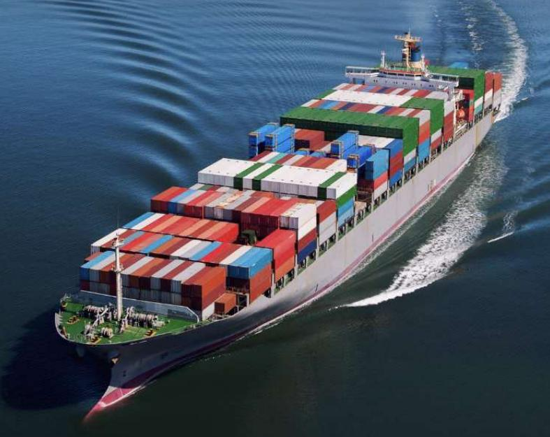
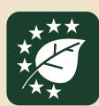
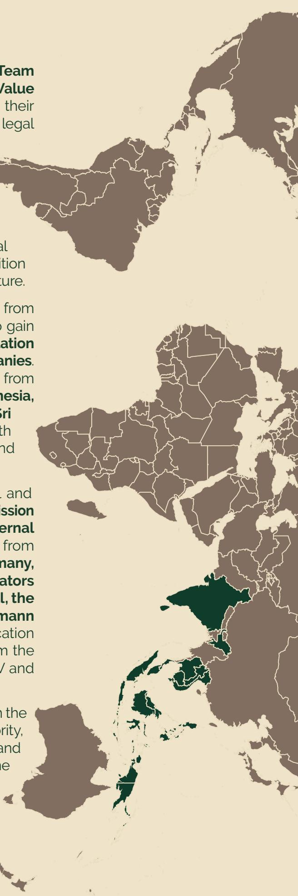

### Technical Summary Report TEI EUROTRIP – EUDR IN PRACTICE

**Bridging Continents Asia-Pacific – Europe for Deforestation-Free Supply Chains 20 – 23 April 2026, Brussels**

The TEI Eurotrip is an outreach activity of the **Team Europe Initiative (TEI) on Deforestation-Free Value Chains**, which aims to support partner countries in their commitment to sustainable, deforestation-free and legal value chains, in compliance with the European Union Deforestation-Free Products Regulation (EUDR). The Team Europe Initiative, supported by EU, Germany, Netherlands, France, Italy, Spain and Sweden, is part of the Global Gateway strategy and pursues the overarching goal of building **inclusive partnerships** to reduce global commodity-driven deforestation and support the transition to sustainable, regenerative and climate-smart agriculture.

From **20-23rd April 2026**, 14 delegates from 11 countries from Southeast Asia and the Pacific gathered in Brussels to gain **technical insight on how the EU Deforestation Regulation will be handled by European ofÏcials and companies**. Both government and public sector representatives from relevant sectors of **Cambodia, Laos, India, Indonesia, Thailand, Malaysia, Philippines, Papua New Guinea, Sri Lanka, Solomon Islands** and **Vietnam** exchanged with key European actors involved in trade, development and administration, relevant for the EUDR.

The programme of the 4-day trip included technical and multi-stakeholder exchanges with the **European Commission** (DG INTPA, DG ENV, DG TRADE, JRC) as well as the **External Action Service of the EU – EEAS**, with representatives from the **National Competent Authorities of Belgium, Germany, Netherlands, representatives from EU-based operators such as Wilmar Europe Holdings B.V., Corrie MacColl, the European Coffee Federation, Tyres Europe, and Neumann Kaffee Gruppe**, with third party verification and certification organisations, such as RSPO, and representatives from the European civil society, such as FERN, Solidaridad, SNV and Earthsight.

During a visit to the port of Antwerp and exchanges with the Belgian Custom Authority and Belgian Competent Authority, participants gained an understanding of the physical and desk-check procedures once the products enter the European market. Continuing, a recap and update on the regulatory framework on scope and key obligations of the EUDR provided by the European Commission and the National Competent Authorities allowed to address open questions, clarify misunderstandings, further deepened the understanding of practical implications of EUDR components and fostered cross-sector collaboration.

**The exchange formats with stakeholders from the European Commission, the competent authorities, the private sector, the civil society and international organisations during the Eurotrip provided clarification on certain topics for the delegations to take back to their countries:**

- **Traceability:** One of the most significant operational challenges for supply chain actors remains tracebility. Producers need to manage and supply data to different systems from European operators and government systems, which requires adapted capacity building on the ground. The challenge is particularly pronounced within the rubber sector where harvesting can occur every second day, making continuous traceability more complex and separation of goods within the value chain even more necessary.
- **Data ownership:** While geolocation data in the EU-TRACES system are anonymised, smallholder farmers and producer governments remain concerned about how their data is collected, stored and potentially used both by the government and the private operators. Decisions on data ownership, data sovereignty and data security still need to be sorted out.
- **Cross-border trade:** When raw materials are imported and processed goods subsequently exported, the required full traceability to the geolocation point can be a challenge. Supply chains across multiple jurisdictions add to the complexity of transfer of information and underscore the need for functioning interoperable information systems.
- **Legality:** Ensuring compliance with relevant national legislation remains complex, particularly in countries where legal frameworks are fragmented or inconsistently enforced. Operators are responsible for identifying and assessing applicable legislation, but this task is resource-intensive and often lacks clarity on what is considered relevant national legislation. The absence of consolidated, authoritative lists of relevant legislation at national level creates uncertainty for both operators and competent authorities. The EU commission is currently establishing a legality repository, where third partner producer countries are invited to suggest and list relevant legislation for EU-based operators to revise when sourcing in their country. Building this repository will also certainly need more time to have it available by December 2026. Similarly, the Commission intends to establish a web-based repository of certification schemes applicable to EUDR-relevant commodities, while these are means of positive indicators, but no scheme will be acknowledged as green lane for EUDR-compliance.
  - **Smallholder inclusion:** Smallholders could face a risk of being excluded from EU-bound supply chains due to the high costs potentially associated with the mapping of geolocations and the tracing to the plot of production, as well as registrations in national databases or national certification systems. Limited access to digital tools and instruments and financial resources further deepens the risk. Public-private and international support mechanisms are therefore essential to respond to the needs and particular situations of smallholder farmers, e.g. facilitate geolocation of products for smallholders and strengthen particularly vulnerable groups with capacity training and access to markets. Farmer cooperatives can provide an additional helpful role in aggregating data, disseminating information and formalising sectors. It must be noted that traceability remains particularly challenging in contexts where smallholders sell through intermediaries, possibly blurring the link between production plots, mills and the exported product.

# 1. Key challenges

### 2. Key take-aways from the discussions with the various stakeholders

**The producing countries from the Asia-Pacific region identified the following key challenges in the implementation of the EUDR in their context:**

- **Responsibility:** The operator who places EUDR compliant commodities on the EU market for the first time is responsible for market compliance, not the national producers. Thus, also possible sanctions of incompliance may apply to the operator. The operator needs to submit a Due Diligence Statement – DDS to the EU-Information System TRACES, verifying that the product declared for free-circulating is deforestation-free and legal. These DDS need to be supported with
  - a) geolocation data (GPS coordinate or polygon of plot of land) and b) documentation on risk assessments and risk mitigation measures. The reference number on the DDS must be linked to and match the shipment and container for aleatory Customs checks at the harbours. With the intention to avoid disruptions of supply chains and transits, according to the given benchmarking risk-category applicable for each operator´s products volume, Competent Authorities carry out desk checks on the quality and plausibility of their Due Diligence Statements provided. EU Competent Authorities will rely upon substantiated concerns, exchange and alignment among the MS and in-house risk analysis.
- **Due Diligence:** Contrary to common assumptions, Due Diligence is not a checklist, but a flexible risk-based approach with three steps: collecting information, conducting an evidence-based risk assessment and mitigating risks. Competent gence Navigator provides additional information.
  - **EUDR-Dry Runs:** guided by the European Forest Institute- EFI and Prefered by Nature-PbN with importers and EU Competent Authorities have included readiness checks and preparedness analyses to assess the practical implementation of EUDR requirements. Initial findings indicate that most operators are still not compliant, some being well advanced in aligning their systems and processes with the regulation. Encouragingly, obtaining geolocation data resulted in most cases to be less of a barrier than expected. Competent Authorities have actively engaged with operators to obtain additional information in cases where submitted data was incomplete or unclear. The Dry Run exercises have underscored that EU-operators need to follow a more structured process, particularly with regard to their responsibility in assessing potential risks of deforestation or illegality from their sourcing areas – and explaining consequently mitigation actions where needed.

Authorities focus on the robustness of the risk assessment methodology by operators. Descriptive and contextualised information as well as data is more useful than certifications: Operators are required to prove that they have mitigated risks and understood the information provided, especially where long-standing issues around legality are known. The EFI Legality Due Dili-

- **Role of producing countries:** It was essential to clarify that it is the responsibility of the operator to identify and provide proof of adherence to relevant legislation for due diligence. Although, it is helpful for both market actors and competent authorities when producing countries contribute to the EU-coordinated repositories and proactively contribute to compiling and providing lists of relevant national legislation. Similarly, the operator is responsible to prove traceability and provide geolocation data, but establishing or adapting national traceability systems or farmers registers will be helpful and data availability might make the essential difference from which countries EU-operators will source.
- **EU delegations in producer countries:** serving as a point of contact for accessing tailored support mechanisms the EU delegations meet country-specific needs. Through cooperation with partner governments, initiatives such as the Technical Facility under the TEI and the Global Gateway Investment Hub provide targeted assistance. Governments are encouraged to contact the EU Delegation in their country to access these opportunities.
  - **Open-source mapping tools:** Tools developed by FAO, ITC, EFI and DIASCA offer promising opportunities to improve data quality, harmonisation, and accessibility. These tools can support smallholder inclusion by lowering entry barriers and facilitating compliance with geolocation requirements.
  - **Impact:** Early evidence suggests that EUDR implementation is contributing to raising sustainability standards in producing countries. By incentivising deforestation-free and traceable production, the regulation is creating market conditions that reward sustainable practices on a broad scale and enhance the competitiveness of compliant products.

# 3. Important conclusions and findings

## 4. Conclusion

The TEI Eurotrip served as an important exchange platform for clarifying key questions from South East Asian and Pacific partner countries regarding the processes and requirements of the EUDR, and how they can best improve their sectors for market compliance.

The outreach event provided an opportunity for vis-a-vis exchange and enhancing trust between producing country representatives, EU ofÏcials and EU-operators in order to establish long-term channels for constructive information exchange. EU ofÏcials and operators have gained a more personal understanding on the specific situations

and sometimes complex challenges from producing sectors. The trip also offered important insights to the delegation into ongoing progress towards sustainable and deforestation-free production across other countries in their region, while helping to clarify misinterpretations, learn about technical and operational details of the regulation and experiencing solutions to existing doubts. The information, updates and learnings will be circulated to broader stakeholder audience in their countries and for their sectors, accelerating preparation for EUDR on production side and pushing for clearer guidance and stronger ties from demand side.

**Registered ofÏces**

**Address**

Friedrich-Ebert-Allee 32 + 36

T +49 228 44 60-0

### Imprit

#### **Registered at**

**VAT no.**

**Programme**  
Sustainable Agriculture for Forest Ecosystems (SAFE)  
Secretariat of the Team Europe Initiative on  
Deforestation-Free Value Chains (TEI)  
[www.deforestationhub.eu](http://www.deforestationhub.eu)

**Chairperson of the Supervisory Board**

**Management Board**

#### **Programme**

Dr. Elke Sümnick-Matthaei

**Design/Layout**

**Photo credits**

**On behalf of**

This publication was produced with the financial support of the European Union, the German Federal Ministry for Economic Cooperation and Development (BMZ), and the Dutch Ministry of Foreign Affairs (MINBUZA). Its content is a documentation of the spoken and written statements from participants at the TEI outreach event Altamira Summit. All interpretation of the content is the sole responsibility of GIZ and does not necessarily reflect the views of the EU, the German or the Dutch Government.