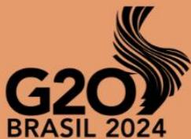
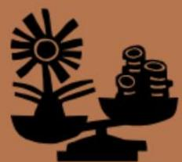
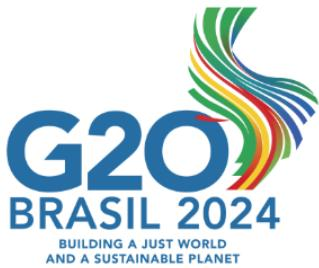
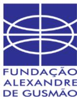
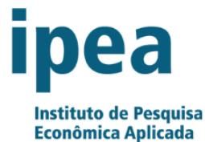

Task Force 04

**TRADE AND INVESTMENT FOR SUSTAINABLE AND  
INCLUSIVE GROWTH**

## **Fostering Inclusive and Successful Implementation of Sustainable Global Supply Chains: A Call for Collaborative Action Within the G20**

Paula Pinto Zambrano, Analyst, Climate & Company (Germany)

Sofia Helena Zanella Carra, Analyst, Climate & Company (Germany)

Camila Flores, Junior Analyst, Climate & Company (Germany)

Mauro Armelin, Executive Director, Amigos da Terra – Amazonia Brasileira (Brazil)

Pedro Burnier, Program Director, Amigos da Terra – Amazonia Brasileira (Brazil)

Cíntia Cavalcanti, Program Analyst, Amigos da Terra – Amazonia Brasileira (Brazil)

#### **Abstract**

In this policy brief, organizations from Civil Society in Europe and Brazil aim to put forth an analysis of recent developments and key recommendations for the inclusive and successful implementation of sustainable global supply chain regulations (for example the European Regulation on Deforestation-Free Products, EUDR). Three crucial recommendations are outlined to ensure inclusivity, especially for smallholders and Small and Medium Enterprises (SMEs) in developing countries. Firstly, we stress the importance of fostering joint leadership and cooperation between countries' upstream and downstream supply chains at a political, regulatory, financial, technical and Civil Society Organisation (CSO) level. Secondly, we advocate for facilitating easy-access and agile transition finance schemes for small farmers, indigenous and traditional communities as well as SMEs. Lastly, we highlight the importance of supporting the development of national traceability policies in producing countries to ensure deforestation-free supply chains for both upstream and downstream markets. These recommendations, when implemented collaboratively, will contribute to a more sustainable, equitable, and deforestation-free future. The G20 is uniquely positioned to act as key upstream and downstream countries that are most relevant for global trade flows are part of the Group.

## **Diagnosis of the issue**

As organisations from the Civil Society in Europe and in Brazil, we stress the vital importance of prioritising sustainable trade policies in today's complex global landscape. With protectionist measures on the rise and geopolitical tensions straining cooperation, sustainable trade policies are crucial for balancing economic growth, environmental protection, and social equity. Given that nearly 30% of global carbon dioxide emissions are tied to world exports[,](#page-2-0) 1 cooperative efforts on trade agreements and supply chains are essential for advancing shared climate and sustainable development goals. While specific initiatives like the European Union's Deforestation Regulation (EUDR[\)](#page-2-1)2 offer promising steps, broader trade policies must further prioritise environmental conservation, social justice, and ethical market practices. Inclusive engagement with producer countries and stakeholders from diverse backgrounds is key to the success of such policies. By championing sustainable trade policies, we can address global challenges while fostering economic resilience and social well-being for all.

The issue at hand revolves around the sustainability and inclusivity of supply chains, particularly concerning smallholders and SMEs in developing countries. Efforts to address global challenges like deforestation should prioritise marginalised actors such as

1 World Trade Organizations (WTO), 2022

Additional information: Moreover, while this report focuses on climate change mitigation, global trade and trade policies can also enhance countries' economic resilience and thus help bolster their climate-change adaptation strategies.

2 See here: [https://climateandcompany.org/publications/o-regulamento-da-uniao](https://climateandcompany.org/publications/o-regulamento-da-uniao-europeia/)[europeia/](https://climateandcompany.org/publications/o-regulamento-da-uniao-europeia/)

smallholders and SMEs[.](#page-3-0) 3 Limited cooperation and resources, along with inadequate regulatory frameworks, exacerbate challenges for small farmers, indigenous groups, and local communities. Moreover, the absence of robust national traceability policies undermines efforts for sustainable supply chains and hides environmentally harmful actions from public knowledge.

Frictions have arisen from national/multilateral measures like the Carbon Border Adjustment Mechanism (CBAM) and the EUDR that will have significant impacts on the global supply chains. Smallholders are particularly vulnerable to such measures, as they have limited means to comply with these measures or to adapt to them. For example, the EUDR is expected to affect 15 million smallholders worldwid[e](#page-3-1)4 , and CBAM might have severe impacts on the prices of gas and therefore fertilisers often used by smallholders[.](#page-3-2) 5 By anticipating and addressing potential risks that smallholders and SMEs might face because of these and other similar regulations in a timelt manner, their implementation may be eased and supported by more actors across the supply chain.

Finally, bringing the topic of sustainable supply chains to the agenda of big international fora (i.e. the G7, G20, UNFCCC, CBD, WTO) has historically been a challenge, as it involves navigating complex environmental and social factors alongside broad international politics, diplomacy, and agreements. However, a significant shift was

3 Food and Agriculture Organization FAO, 2016

4 E. Blot and N. Hiller, "Securing the position of smallholders in zero-deforestation supply chains," Policy Briefing, Institute for European Environmental Policy, 2022. 5 Elena Belletti, Nuomin Han, and Iván Pérez, Playing by New Rules: How the CBAM Will Change the World (September 2023), accessed March 12, 2024, https://www.woodmac.com/horizons/how-the-cbam-will-change-the-world/.

observed at COP28, where trade was finally given an important place on the agenda[.](#page-4-0) 6 This development was underscored by the formation of the Coalition of Trade Ministers for Climate, signalling not just a new momentum but a pressing need to take concrete steps in leveraging trade for global climate transformation. Despite this progress, the need to mainstream this topic at the relevant fora, including the G20, is more important than ever, especially under the Presidency of Brazil, a country leading the exports of multiple food commodities tied to big impacts on climate change[.](#page-4-1) 7

6 "COP 28: First- Ever 'Trade Day' Puts Focus on Trade in Climate Action." UNCTAD, 4 Dec. 2023, [https://unctad.org/news/cop28-first-ever-trade-day-puts-focus-trade](https://unctad.org/news/cop28-first-ever-trade-day-puts-focus-trade-climate-action)[climate-action](https://unctad.org/news/cop28-first-ever-trade-day-puts-focus-trade-climate-action)

7 Merco Press, 2024

### **Recommendations**

Our recommendations for fostering the inclusive and successful implementation of sustainable global supply chains are informed by the collaborative efforts of civil society organisations from Europe and Brazil, and they address 3 crucial aspects: 1. cooperation, 2. traceability and 3. finance. By prioritising these recommendations, stakeholders can work towards a more equitable and sustainable future, ensuring that no one is left behind in the transition towards sustainable and deforestation-free supply chains. The adoption of these recommendations aligns with the goals of the G20, concretely with the goals of the Sherpa Track working groups on Trade and Investment, Environment and Climate Sustainability and Agriculture, as well as the *Global Alliance against Hunger and Poverty*  and the Finance Track working groups on Sustainable Finance and Financial Inclusion, positioning member countries to lead the global effort towards sustainable development and responsible trade practices.

# **Effective collaboration between upstream and downstream countries on the topic of sustainable global supply chains**

The Sherpa Track working groups on Trade and Investment (TIWG) of the G20 have a key role in advancing sustainable global supply chains, as an excellent platform for including technical and science-based discussions into political decision-making. The TIWG should prioritize aligning efforts between importer and producer countries in adopting and implementing supply chain regulations to advance sustainable global supply chains. This alignment can be facilitated through the establishment of standardised disclosure frameworks, ensuring transparency and accountability across global supply chains. Such measures are essential not only for successful implementation but also for enhancing decision-making by financial market participants and bolstering the resilience and sustainability of supply chains worldwide.

Effective collaboration between importer and producer countries, exemplified by initiatives such as the Ad Hoc Joint Task Force Between Indonesia, Malaysia, and the European Unio[n](#page-6-0)8 and the EU Commission's Multi-Stakeholder Platform on Protecting and Restoring the World's Forests (discussed especially in the context of the EUDR[\)](#page-6-1) 9 is crucial. Therefore, we recommend fostering joint leadership and cooperation across political, regulatory, financial, technical, and civil society levels, with technical dialogues involving equal representation of key supply chain actors. These dialogues should be inclusive, allowing participation from traditional communities, indigenous groups, and other marginalised actors in supply chains.

## **Traceability policies and systems to track sustainability in global supply chains**

Sustainable supply chains rely heavily on the implementation of traceability policies, particularly at regional or national levels. These policies play a crucial role in integrating various stakeholders, including smallholders, SMEs, and less advanced participants, especially in developing countries where such integration is often lacking[10](#page-6-2). By actively

8 See more information here: https://www.eeas.europa.eu/delegations/indonesia/kickmeeting-ad-hoc-joint-task-force-between-indonesia-malaysia-and-eu\_en?s=168

9 Commission Expert Group/Multi-Stakeholder Platform on Protecting and Restoring the World's Forests, including the EU Timber Regulation and the FLEGT Regulation (E03282): [https://ec.europa.eu/transparency/expert-groups-register/screen/expert](https://ec.europa.eu/transparency/expert-groups-register/screen/expert-groups/consult?lang=en&groupId=3282&fromMeetings=true&meetingId=23741)[groups/consult?lang=en&groupId=3282&fromMeetings=true&meetingId=23741](https://ec.europa.eu/transparency/expert-groups-register/screen/expert-groups/consult?lang=en&groupId=3282&fromMeetings=true&meetingId=23741)

10 UNECE, 2016

supporting the establishment of national traceability policies, regulatory initiatives can significantly enhance transparency and accountability across global supply chains. This, in turn, fosters consumer confidence and stimulates demand for sustainable products.

The Global Alliance against Hunger and Poverty Task Force should include the implementation of traceability policies and systems in global supply chains in their agenda as a matter of priority. These policies are essential for fostering greater disclosure within supply chains, as they enable comprehensive tracking of product origin, production methods, and environmental impact. By promoting transparency and accountability, traceability empowers consumers to make informed choices, encourages responsible practices among producers and manufacturers- including agricultural smallholders (which are also relevant for the Agriculture Working Group), and provides support towards fairer compensation for workers and producers, therefore contributing to fighting poverty by giving access to fair and sustainable jobs. Moreover, The Task Force should address and ensure the inclusion of traceability initiatives within the Global Alliance against Hunger and Poverty aimed to be launched in November 2024. This presents a unique opportunity for the Task Force to put traceability systems as a topic with high priority in the Alliance's agenda as this will allow for a more inclusive and sustainable economy, contributing directly to fighting poverty.

**Current significance:** Encouraging the establishment of national traceability schemes is crucial to addressing market deviations and ensuring compliance with sustainability standards as well as with regulations from importing countries such as the EUDR or the EU Corporate Sustainability Due Diligence Directive (CSDDD). Traceability enables the availability of relevant data that will then also allow for lower risk-benchmarking of the respective producing countries. The growing trend of ambitious traceability requirements along a supply chain, showcases that traceability systems are necessary to supply domestic and international markets with sustainable and deforestation-free products. Therefore, providing technical assistance and capacity-building support to facilitate the implementation of such systems is essential.

## Transition finance to support smallholders in transitioning towards sustainable production

Transition finance schemes support small farmers, Indigenous communities, and SMEs in transitioning to sustainable supply chains. These schemes provide crucial financial support and the resources necessary for implementing sustainable practices facilitating this transition is financial products being designed (and eventually implemented) directly for and by smallholders[11](#page-8-0) . Another critical aspect of facilitating this transition is enabling the financing for the implementation of effective disclosure schemes throughout the supply chain. These disclosure schemes are integral to ensuring transparency and accountability, which are essential for attracting investment and fostering the transition to sustainable practices. By requiring financial institutions to disclose information about the environmental and social impacts of their investments,

11 See examples here: Sukanya Das. Elisabeth Hoch, Senior Advisor, Climate & Company, Gabriel Medina, Professor, University of Brasilia, Benno Pokorny, Professor, University of Freiburg, Dil Rahut, Vice Chair, Asian Development Bank Institute, and Maximiliaan Tetteroo, Analyst, Climate & Company, Enabling Local Governance to Mitigate the Climate and Biodiversity Crises (July 2023), link:

https://t20ind.org/research/enabling-local-governance-to-mitigate-the-climate-andbiodiversity-crises/

transition finance can be directed towards projects that promote sustainable and deforestation-free production only, ideally supporting the most vulnerable throughout the supply chains.

The Sherpa Track Task Force on Global Alliance against Hunger and Poverty and the Finance Track working groups on Sustainable Finance and Financial Inclusion are in unique positions to address the critical need for transition finance in supporting smallholders and SMEs towards sustainable production. The SFWG goals and mission can certainly be supported by implementing transition finance schemes with the support of G20 countries (ensuring a greener economy and society) and focusing financial efforts on those most vulnerable actors in the supply chains, so they don not lose access to global markets (creating resilient societies). This synergy can amplify efforts to direct finance towards projects that not only support sustainable and deforestation-free supply chains but also contribute to a more inclusive economy. By fostering transparency and accountability through effective disclosure schemes, as highlighted by the necessity for transition finance, both groups can enhance their impact on global sustainability goals.

### **Scenario of outcomes**

In embracing these recommendations, significant positive outcomes can be achieved across Sherpa groups within the G20. The need to elevate discussions on sustainable supply chains within the G20 stems from the multifaceted nature of this topic, which intersects with critical facets including environmental preservation, economic stability, trade agreements, human rights considerations, as well as national and international regulatory frameworks and therefore discussing these in the recommended groups shall have a huge global impact. Strengthened cooperation between upstream and downstream countries will lead to more effective deforestation mitigation efforts, while increased financial support for small farmers and Indigenous communities will enable their transition to sustainable practices and strengthen their crucial role as forest guardians. The G20 provides an ideal forum for discussing these topics and has a structure for engagement and Sherpa groups that can be leveraged as explained above. Expected scenarios include:

# **Effective collaboration between upstream and downstream countries on the topic of sustainable global supply chains**

In the positive scenario outcome, the TIWG plays a key role in reducing the tensions and improving global trade-related collaboration. By serving as an important discussion platform and with a strong focus on inclusive sustainable trade, it fosters greater cooperation among G20 member countries and facilitates sustainable trade and investment practices. Strengthened cooperation between upstream and downstream countries and aligning their efforts in adopting and implementing supply chain regulations help mitigate deforestation linked to agricultural commodity supply chains, thereby reducing trade-related environmental risks. Enhanced traceability and transparency across global supply chains will contribute to promoting fair trade practices and sustainable production.

Missing the opportunity to foster inclusive sustainable trade may worsen trade-related environmental challenges such as deforestation. Without collaboration between upstream and downstream countries, rejection of trade deals and environmental regulations may have negative economic, social, and environmental impacts. Without coordinated efforts, trade and investment activities may contribute to environmental degradation, undermining sustainable development goals and international agreements such as the Paris Agreement and the Global Biodiversity Framework. Rejecting these recommendations could impede progress on the goals of the Sherpa Track working groups on Environment and Climate Sustainability and other Working Groups within the G20.

# **Implementation of traceability policies and systems to track sustainability in global supply chains**

In the positive scenario outcome, the implementation of traceability policies enables concrete evidence that processes involved in global supply chains are sustainable and free from activities such as deforestation. This development is particularly crucial in developing countries, where the presence of such policies is minimal despite their significant contributions to the production of commonly used raw materials. Integrating these stakeholders becomes paramount for achieving sustainable and ethical trade practices.

In the negative scenario outcome, however, the lack of implementation of traceability policies exacerbates concerns about the sustainability of global supply chains. Without concrete evidence of sustainability practices, issues such as deforestation persist unchecked, leading to environmental degradation and ethical concerns. Developing countries, often lacking robust sustainability policies, face challenges in integrating into global trade practices. As argued by Clancy et al. (2024), well-established mechanisms of international trade and cooperation are on the brink of collapse, with calls for reshoring and "strategic autonomy" echoing across industrialized countries. The World Trade Organization (WTO) is struggling to maintain relevance, and geopolitical tensions are straining global cooperation and trade agreements. This further strain global cooperation, exacerbates trade imbalances, and undermines efforts to address environmental and ethical challenges in global supply chains.

## **Supporting smallholders with transition finance for sustainable production**

In the positive scenario outcome, increased financial support that is accessible for small farmers and indigenous communities will be available and will help improve their resilience to climate change and enhance their capacity to adopt sustainable farming practices. Rural credits, innovative financial mechanisms, and blended finance are some financial alternatives that can be offered to small farmers, promoting sustainable supply chains and ensuring that smallholders are not only supported in their transition to sustainable practices but also become competitive, securing a higher and more stable income for themselves and their communities. Implementing this recommendation will contribute to achieving the goals of multiple Sherpa and Working Groups within the G20 as mentioned in the recommendations section, showcasing the impact of this topic at an economic, social, and environmental level.

In the negative scenario outcome, if these recommendations are not implemented, not enough financing will be available to transition to sustainable production. On the contrary, financing of agricultural practices that degrade natural resources will continue to

perpetuate. This unsustainable production will exclude small actors from global markets, exacerbating poverty and hunger. Without investments in sustainable agriculture and rural development, the G20 may struggle to achieve its objectives of promoting food security and reducing rural poverty, as well as climate-related goals.

### **References**

Belletti, Elena, Nuomin Han, and Iván Pérez. Playing by New Rules: How the CBAM Will Change the World. September 2023. Accessed March 12, 2024. [https://www.woodmac.com/horizons/how-the-cbam-will-change-the-world/.](https://www.woodmac.com/horizons/how-the-cbam-will-change-the-world/) Blot, E. and Hiller, N. "Securing the position of smallholders in zero-deforestation supply chains." Policy Briefing. Institute for European Environmental Policy, 2022. [https://ieep.eu/wp-content/uploads/2022/11/Securing-the-position-of-smallholders-in](https://ieep.eu/wp-content/uploads/2022/11/Securing-the-position-of-smallholders-in-zero-deforestation-supply-chains-IEEP-2022-1.pdf)[zero-deforestation-supply-chains-IEEP-2022-1.pdf](https://ieep.eu/wp-content/uploads/2022/11/Securing-the-position-of-smallholders-in-zero-deforestation-supply-chains-IEEP-2022-1.pdf) Clancy, John, Willem van Dommelen, Elisabeth Hoch, Ingmar Juergens, Andreas Loeschel, Oliver Schenker, and Isabelle Wilhelm. 2024. Greening Trade - Making New Global Trade Agendas Work for a Just Climate and Sustainability Transition. Berlin - Brussels: Climate & Company for ClimateWorks Foundation. [https://issuu.com/climateandcompany/docs/2024\\_03\\_greening\\_trade\\_report\\_by\\_climate](https://issuu.com/climateandcompany/docs/2024_03_greening_trade_report_by_climate_and_compa) [\\_and\\_compa.](https://issuu.com/climateandcompany/docs/2024_03_greening_trade_report_by_climate_and_compa) "COP28: First-Ever 'Trade Day' Puts Focus on Trade in Climate Action." UNCTAD. December 4, 2023. Accessed March 20, 2024. [https://unctad.org/news/cop28-first-ever](https://unctad.org/news/cop28-first-ever-trade-day-puts-focus-trade-climate-action)[trade-day-puts-focus-trade-climate-action.](https://unctad.org/news/cop28-first-ever-trade-day-puts-focus-trade-climate-action) Das, Sukanya, Elisabeth Hoch, Gabriel Medina, Benno Pokorny, Dil Rahut, and Maximiliaan Tetteroo. Enabling Local Governance to Mitigate the Climate and Biodiversity Crises. July 2023. [https://t20ind.org/wp](https://t20ind.org/wp-content/uploads/2023/07/T20_PolicyBrief_TF6_LocalGovernance-ClimateBiodiversityCrises-1.pdf)[content/uploads/2023/07/T20\\_PolicyBrief\\_TF6\\_LocalGovernance-](https://t20ind.org/wp-content/uploads/2023/07/T20_PolicyBrief_TF6_LocalGovernance-ClimateBiodiversityCrises-1.pdf)[ClimateBiodiversityCrises-1.pdf](https://t20ind.org/wp-content/uploads/2023/07/T20_PolicyBrief_TF6_LocalGovernance-ClimateBiodiversityCrises-1.pdf) Food and Agriculture Organization. (2016). Reducing rural poverty through farmer-tofarmer exchange.<http://www.fao.org/3/a-i5862e.pdf>

Merco Press. "Brazil Leads the World in Exports of Seven Food Commodities." Merco Press, March 9, 2024, [https://en.mercopress.com/2024/03/09/brazil-leads-the-world-in](https://en.mercopress.com/2024/03/09/brazil-leads-the-world-in-exports-of-seven-food-commodities#:~:text=According%20to%20the%20bank%2C%20Brazil,other%20commodities%3A%20ethanol%20and%20cotton)[exports-of-seven-food](https://en.mercopress.com/2024/03/09/brazil-leads-the-world-in-exports-of-seven-food-commodities#:~:text=According%20to%20the%20bank%2C%20Brazil,other%20commodities%3A%20ethanol%20and%20cotton)[commodities#:~:text=According%20to%20the%20bank%2C%20Brazil,other%20comm](https://en.mercopress.com/2024/03/09/brazil-leads-the-world-in-exports-of-seven-food-commodities#:~:text=According%20to%20the%20bank%2C%20Brazil,other%20commodities%3A%20ethanol%20and%20cotton) [odities%3A%20ethanol%20and%20cotton.](https://en.mercopress.com/2024/03/09/brazil-leads-the-world-in-exports-of-seven-food-commodities#:~:text=According%20to%20the%20bank%2C%20Brazil,other%20commodities%3A%20ethanol%20and%20cotton) WTO. World Trade Report 2022: Climate Change and International Trade. 2022. Accessed from [www.wto.org.](http://www.wto.org/)

**T20** Brasil 2024  
Let's rethink the world

# Let's **rethink** the world

