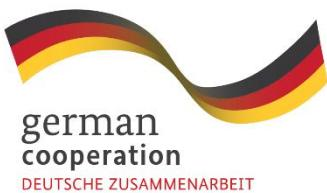
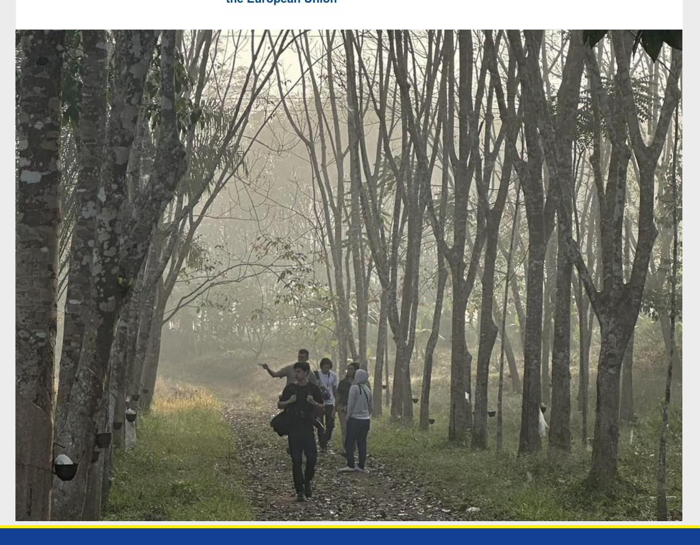
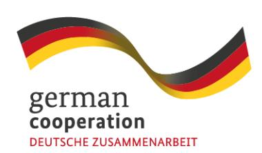
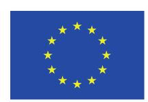

# **Assessment of Thailand's Existing Standards and Tools for EUDR Compliance**

# **Assessment of Thailand's Existing Standards and Tools for EUDR Compliance**

The "EUDR Engagement" project in Southeast Asia is co-funded by the European Union and the Federal Republic of Germany. GIZ has been commissioned to implement it as part of the BMZ funded global program "Sustainability and Value Added in Agricultural Supply Chains", which is part of the special initiative "Transformation of Agricultural and Food Systems" by the German Federal Ministry for Economic Cooperation and Development.

Disclaimer: This publication was co-funded by the European Union and BMZ. The content of this publication is the sole responsibility of the authors and does not necessarily reflect the views of the EU or the BMZ. The information in this study, or upon which this study is based, has been obtained from sources the authors believe to be reliable and accurate. While reasonable efforts have been made to ensure that the contents of this publication are factually correct, GIZ GmbH does not accept responsibility for the accuracy or completeness of the contents of this publication. The mention of specific companies or products of manufacturers, whether or not these have been patented, does not imply that these have been endorsed or recommended by GIZ GmbH in preference to others of a similar nature that are not mentioned. The views expressed in this information product are those of the author(s) and do not necessarily reflect the views or policies of GIZ GmbH.

#### **Table of Content**

# Inhalt

| 1. Introduction 1.1 Background 1.2 Objective of the Study 1.3 Scope of the Study 2.2 Limitations 2.3 Data Collection Methods 3.C ontext and main requirements of the EUDR 5.1 Land Use and Forestry Laws 5.4 Labor and Human Rights 6.1.3 Traceability & Geolocation | .....................................................................................13 4.2.Commercial Service Providers (Private IT Solutions) ...............................................................16 .........................................................18 .............................................................21 |
|----------------------------------------------------------------------------------------------------------------------------------------------------------------------------------------------------------------------------------------------------------------------|-----------------------------------------------------------------------------------------------------------------------------------------------------------------------------------------------------------------------------------------------------------------------------------------------------------------------------------------------|
| 6.2 General challenges for implementation                                                                                                                                                                                                                            | ........................................................................................37                                                                                                                                                                                                                                                    |
| 7. SWOT Analysis of Existing Tools and Standards                                                                                                                                                                                                                     | ..............................................................................39                                                                                                                                                                                                                                                              |
| 7.4. Threats .........................................................................................................................................42                                                                                                             |                                                                                                                                                                                                                                                                                                                                               |
| 8. Recommendations for EUDR Alignment and Implementation                                                                                                                                                                                                             | ...........................................................43                                                                                                                                                                                                                                                                                 |

| 9. Conclusion ..........................................................................................................................................47 |                                                                        |
|------------------------------------------------------------------------------------------------------------------------------------------------------------|------------------------------------------------------------------------|
| Annex 2 Aspects of relevant national legislative framework for Land use and ownership                                                                      | .................53                                                    |
| Annex 3 Aspects of relevant national legislative framework on Labor Rights & Protection                                                                    | ...............53                                                      |
| Annex 5 Relevant legislative aspects for Traceability along Supply Chain & Trade                                                                           | ..........................56                                           |
| Annex 7 List of Targeted Organizations & Stakeholders                                                                                                      | ....................................................................59 |
| References .............................................................................................................................................62 |                                                                        |

# **List of Abbreviation**

| ALRO      | Agricultural Land Reform Office (Thailand)               |
|-----------|----------------------------------------------------------|
| AMS       | ASEAN Member States                                      |
| ASEAN     | Association of Southeast Asian Nations                   |
| BMZ       | Federal Ministry of Economic Cooperation and Development |
| CSDDD     | The Corporate Sustainability Due Diligence Directive     |
| DD        | Due Diligence                                            |
| DDS       | Due Diligence System                                     |
| DOL       | Department of Land (Thailand)                            |
| DPI       | Digital Public Infrastructure                            |
| EIA       | Environmental Impact Assessment                          |
| ERP       | Enterprise Resource Planning                             |
| ESG       | Environmental, Social, and Governance                    |
| EU        | European Union                                           |
| EUDR      | European Union Deforestation-free Regulation             |
| EU's GDPR | EU's General Data Protection Regulation                  |
| FABS      | Field Agent Business Support                             |
| FAO       | Food and Agriculture Organization                        |
| FLEGT     | Forest Law Enforcement, Governance and Trade             |
| FPIC      | Free, Prior, and Informed Consent                        |
| FSC       | Forest Stewardship Council                               |
| GFW       | Global Forest Watch                                      |
| GIZ       | Deutsche Gesellschaft für Internationale Zusammenarbeit  |
| GPSNR     | Global Platform for Sustainable Natural Rubber           |
| MOAC      | Ministry of Agriculture and Cooperatives (Thailand)      |
| NLPC      | National Land Policy Committee (Thailand)                |
| NSTDA     | National Science and Technology Development Agency       |
| PDPA      | Thailand's Personal Data Protection Act                  |
| PEFC      | Programme for the Endorsement of Forest Certification    |
| RAOT      | Rubber Authority of Thailand                             |
| RFD       | Royal Forest Department (Thailand)                       |
| RSPO      | Roundtable on Sustainable Palm Oil                       |
| TFCC      | Thai Forest Certification Council                        |
| Thai GAP  | Thai Good Agricultural Practices                         |
| TLAS      | Thailand's Timber Legality Assurance System              |
| UNDP      | United Nations Development Programme                     |
| VPA       | Voluntary Partnership Agreement                          |
| WWF       | World Wildlife Fund                                      |

# **Executive Summary**

Thailand stands at a pivotal moment in its journey to align with the European Union Deforestation Regulation (EUDR). As a significant producer of natural rubber, palm oil, and timber-derived products, the country plays a critical role in global deforestation-free supply chains, either exporting directly to EU, or via downstream processing countries. This study has shown that while there has been important progress—such as the development of national traceability tools like the Rubber Authority of Thailand's GIS (RAOT GIS), the use of international certification schemes including Forest Stewardship Council (FSC), Programme for the Endorsement of Forest Certification (PEFC), and Roundtable on Sustainable Palm Oil (RSPO), and increasing public-private engagement—important structural gaps remain that could still limit Thailand's ability to fully meet EUDR requirements. While not required or sufficient on their own, international certification schemes may support EUDR alignment by reducing the risk level of relevant chains, especially when combined with geolocation and legal documentation.

Key challenges identified in this report include:

- 1. a lack of formal land tenure among a fraction of smallholder farmers,
- 2. non-standardized and non-interoperable traceability systems, inconsistent adoption of GeoJSON , other EU-preferred or international data formats, and
- 3. the absence of a nationally recognized platform to collect and consolidate data meant for EU Operators' due diligence system (DDS). While Thailand is not obliged to establish and the absence of a nationally recognized due diligence system (DDS) under EUDR, the absence of such supportive structures may increase the compliance burden on EU operator sourcing from Thailand.
- 4. Many smallholders also face obstacles in accessing digital tools, financial resources, or technical support, which risks hampering their inclusion in verified, deforestation-free supply chains. Conversely, there could be significant potential in paperless green trade facilitation, i.e. assigning digital identities (e.g. SIM linked) to farmers, producer organization and relevant nodes in the supply chain, as a digital public infrastructure (DPI) which could then be complemented by sustainability, financing, legality and/or traceability attributes, thus reducing the cost and burden on SMEs while ensuring better verification and data integrity.
- 5. Finally, current data privacy measures in exiting traceability platforms may not yet align with either Thailand's Personal Data Protection Act (PDPA) or the EU's General Data Protection Regulation (GDPR), leaving gaps in legal safeguards and trust.

To keep moving forward, in line with Thailand's recent EUDR low-risk classification, the role of government agencies is essential in (soft) harmonizing national sustainability and legality standards with (*inter alia*) EUDR criteria, including the development of clear geolocation and traceability guidelines. Agencies such as RAOT, the Royal Forest Department (กรมป่าไม้), and the Department of Land (กรมที่ดิน) could work together to promote digital traceability, expand satellite-based early/warning and enforcement, and further expedite land tenure reform and consolidation. The government's key role in facilitating EUDR compliance lies in providing accurate and verifiable national data sources that stakeholders can rely upon. While digital traceability systems and land tenure reforms are valuable enablers, foundational steps such as enhancing legal clarity and standardizing available data should be prioritized. These steps should be coordinated through a national platform (like EUDR Committee) while remaining mindful of due stakeholder consultation and information exchange.

The private sector plays its role by upgrading traceability systems to be more interoperable with relevant databases (in Thailand or trade partners involved in EUDR value chains) and ensuring their platforms can support standardized risk classification and deforestation alerts. Government agencies should take the lead in ensuring that forest-related land documentation is accurate, accessible, and aligned with EUDR definitions of legality. In addition, exporters and processors should strengthen their own due diligence procedures and actively support their smallholder suppliers through training/dissemination, digital on-boarding, and simplified compliance processes.

Smallholder farmers and cooperatives, while often constrained by cost and capacity, must remain at the center of Thailand's EUDR strategy. By participating in group exercises and through engagement with cooperatives, government programs, and NGOs, they could strengthen their access to both flanking/support measures for deforestation-free commodity production and premium markets, including but not limited to EU. Access to financial assistance, including grants and low-interest loans, could be necessary to help bridge current digital and legal gaps.

Thailand should also work proactively with ASEAN neighbors to strengthen regional data-sharing protocols, harmonize risk mitigation systems, and align traceability processes. This includes deeper collaboration with countries like Vietnam and Malaysia, which have already developed structured national traceability systems and legal frameworks. Engagement with EU operators to ensure the mutual understanding of key terms, support measures undertaken, and traceability platforms will be crucial to maintaining market access and trade competitiveness, taking full advantage of Thailand's relative EUDR advance.

Mindful of challenges identified above, a national strategy could focus on:

- standardizing traceability and geolocation tracking by mandating e.g. GeoJSON-based submissions across all commodity supply chains.
- Public and private systems must become interoperable and capable of sharing real-time data across platforms.
- Financial and technical support or incentives for EUDR smallholders and SMEs must be scaled, enabling broader participation in compliant supply chains.
- At the same time, Thailand must accelerate the development of its emerging national enabling framework and keep building institutional capacity for legal verification and risk monitoring, etc.
- Educational institutions and agricultural extension services could be leveraged to deliver training (or e-training using chatbots) on digital traceability, legal requirements, and sustainability practices on scale.

Finally, to ensure long-term credibility and legal alignment, Thailand could gradually implement a robust and dynamic data governance framework that complies with both PDPA and GDPR. This includes clear consent mechanisms, data minimization practices, and secure systems for managing traceability information without divulging any sensitive data.

In conclusion, while Thailand has already made important strides toward EUDR readiness, achieving full alignment will now require more strategic coordination, inclusive stakeholder engagement, and investment in digital and legal infrastructure. With the right measures in place, Thailand can position itself as a regional leader and model in sustainable, legally verified, and deforestation-free agricultural and forest product exports.

# **1. Introduction**

#### **1.1 Background**

The European Union Deforestation Regulation (EUDR) represents a significant policy shift aimed at eliminating products linked to deforestation from the EU market. Entered into force in June 2023, the regulation mandates that operators placing natural rubber, palm oil, wood, and other key commodities on the EU market or exporting from there must ensure their products are deforestation-free, produced legally in accordance with national legislation in the country of production, and traceable to their source.

For Thailand, as a major global producer of natural rubber, palm oil, and wood products, the regulation has significant implications. The country's role in the global supply chains mentioned above is substantial, with exports of these commodities contributing significantly to its economic growth, employment, and rural livelihoods. While measures to prepare for EUDR application are already happening, ensuring compliance with the EUDR also presents some challenges, particularly for some/all/the majority of smallholder farmers, SMEs, and businesses that still lack robust traceability systems or legal documentation.

This study examines existing "transversal" standards and tools already used by supply chain actors in Thailand to ensure traceability along the supply chain and also shed some light on their current alignment with EUDR requirements. Other EU/GIZ-sponsored studies look into more details in three specific sectors. By identifying gaps and opportunities for improvement, the studies aim to strengthen the capacity of supply chain actors based in Thailand to meet EU and global sustainability expectations, while maintaining cost-competitiveness in international markets

# **1.2 Objective of the Study**

The central objective of this study is to examine how current traceability systems and sustainability standards used in Thailand align with the requirements set forth by the European Union Deforestation Regulation (EUDR) and provides an overview on relevant national legislation in the context of the EUDR. Given the significant role Thailand plays as a producer and exporter of natural rubber, palm oil, and timber products globally—all of which fall under the scope of EUDR—this analysis aims to contribute to preparing supply chains actors in Thailand to ensure continued market access to the European Union.

The study assesses which tools and information is already available in the context of EU operators implementing their due diligence process under Article 9 of the EUDR through:

- Traceability platforms (public/private)
- Legal verification systems
- Certification schemes [though neither mandated nor sufficient to guarantee EUDR Due Diligence, their information and reporting could to an extent inform EUDR DDS data flows]
- Monitoring and risk assessment tools

# **1.3 Scope of the Study**

This 2025 study focuses on Thailand's current readiness to align with the EUDR in relation to three key commodities: natural rubber, palm oil, and wood-based products. It assesses selected supply chain actors, including government agencies, smallholders, cooperatives, processors, exporters, certification bodies, and technology providers, with particular attention to smallholders and SMEs who currently face challenges to prepare for the EUDR application such as limited financial access, weak digital infrastructure, and inadequate legal documentation.

The geographic focus is limited to Thailand. While regional examples from Vietnam and Malaysia are referenced, especially regarding their timber legality assurance and certification schemes, these are included only for context and comparative insights. Broader ASEAN interoperability, or the possible role of China are noted but not analyzed in depth.

The assessment draws on recent stakeholder workshops in Thailand's rubber, palm oil, and wood sectors, as well as insights from global traceability initiatives. However, it does not attempt a full evaluation of Thai nor international systems

Instead, the study evaluates whether currently used traceability systems in Thailand can provide adequate data and documentation to support EU operators' compliance.

Although **cocoa and coffee** are also included in this TOR, this study **does not conduct a full assessment** of these commodities in Thailand but **briefly references** their relevance in an **annexed discussion**.

# **2. Methodology**

This study employs a qualitative, multi-method approach to assess the alignment of Thailand's existing standards, traceability systems, and sustainability frameworks with the requirements of the European Union Deforestation Regulation (EUDR). The methodology is designed to capture both the technical and institutional dimensions of EUDR alignment, with particular attention to traceability, legal compliance, and support mechanisms for smallholders and supply chain actors.

This study takes a multi-stakeholder approach to assess Thailand's readiness for EUDR compliance across the rubber, palm oil, and wood sectors. It draws on perspectives from actors at various levels of the supply chain to reflect the complexity of traceability and legal assurance systems.

Key government bodies such as the Rubber Authority of Thailand (RAOT), Department of Forestry, and Ministry of Agriculture and Cooperatives were included for their roles in land regulation, legal documentation, and national traceability management.

Certification bodies like FSC, PEFC, and RSPO were considered for their contributions to third-party verification and sustainability benchmarking. Private-sector actors—particularly processors, exporters, and large agribusinesses—were also central to the study, given their operational influence and adoption of digital traceability tools.

Smallholder farmers and cooperatives, who represent the majority of producers in Thailand, were a critical focus due to their challenges with land tenure, digital access, and financing. Their inclusion ensures the study reflects equity and feasibility in EUDR alignment.

The analysis further engaged industry associations and producer groups to understand collective sectoral efforts, and NGOs and civil society organizations for their roles in field-level monitoring, training, and advocacy on legal rights and deforestation.

Finally, academic and research institutions contributed technical insights on traceability, governance, and legal systems. Together, these diverse inputs formed the basis for identifying strengths, challenges, and potential pathways for Thailand's alignment with the EUDR.

# **2.1 Conceptual Framework**

This study assesses current tools available and used by Thai supply chain actors to align with the European Union Deforestation Regulation (EUDR), focusing on three key requirements of the EUDR: deforestation-free production, legal production with relevant national legislation, and traceability systems capable of supporting due diligence, especially providing geolocation data on the plot of production. The conceptual framework is structured around the EUDR's core obligations and contextualized to reflect the current situation of supply chain actors active in Thailand, with Thailand's position as a producing and exporting country. Furthermore, this study distinguishes between **mandatory national systems** (e.g., Vietnam's Timber Legality Assurance System) and **voluntary traceability platforms** developed by private actors or certification schemes. This distinction is essential for understanding the nature of traceability obligations under the EUDR and how Thailand may best position its systems to support compliance without overextending national responsibilities.

In line with this, the conceptual framework of this study is built around the following three pillars.

#### **Deforestation-Free Production**

The study examines whether Thai commodity supply chains, particularly in rubber, palm oil, and timber, have mechanisms in place to verify that sourcing areas have not been subject to deforestation or forest degradation after the EUDR cut-off date. This includes assessing the role of satellite monitoring, land classification systems, and certification standards (e.g., FSC, PEFC, RSPO) in identifying and mitigating deforestation risks.

#### **Legal production**

Legal production under the EUDR requires that products are produced in accordance with relevant laws in the country of production. For Thailand, this includes a wide spectrum of legislation related to land tenure and ownership, environmental regulations, labour rights, and trade governance. The study assesses the relevant legislation to be followed and the extent to which smallholders and other supply chain actors can provide information through existing traceability systems, land titling frameworks, and cooperative mechanisms and where some challenges exist.

#### **Traceability and Information for Due Diligence**

Article 9 specifies that operators as defined by the EUDR must collect certain types of information in the context of their due diligence process before placing products on the EU market. The study therefore evaluates the capacity of existing tools used in Thailand (e.g., RAOT GIS, Department of Forestry Licensing System, and private IT platforms) to provide further data.

In this context, the focus is on assessing whether current systems used can reliably support EUDRaligned information provision.

#### **Integration with Global and Regional Insights**

The study also integrates insights from global traceability research and commodity-specific stakeholder workshops conducted under the EUDR engagement project. These inform the assessment of challenges such as smallholder inclusion, digital adoption, cost-sharing models, and the harmonization of national and voluntary systems. The study also pays attention to data governance and privacy concerns under Thailand's Personal Data Protection Act (PDPA) and the EU's General Data Protection Regulation (GDPR), given the increased reliance on digital traceability platforms.

#### **2.2 Limitations**

This study faced several limitations that should be taken into account when reading its findings. Data availability and consistency varied across commodities and regions. The Natural Rubber sector generally had more developed traceability systems, while other sectors and regions dominated by smallholders relied on fragmented, proprietary or informal data, hence complicating cross-sector comparisons. Some private-sector platforms operating on a commercial basis offer limited transparency.

The regulatory context added another layer of complexity: stakeholder understanding in Thailand remains uneven. This affected clarity on possible or optimal implementation pathways: some assume EUDR requires data or processes it doesn't, or over-interpreted certain provisions. Participation in interviews was voluntary, and the level of engagement varied across different sectors and regions. While limited references were made to national traceability frameworks in neighbouring countries (e.g., TLAS in Vietnam and MTCS in Malaysia), these were not explored in depth and are intended solely to offer comparative context.

#### **2.3 Data Collection Methods**

This study employed a multi-method approach to ensure a comprehensive understanding of supply chain actors' readiness for EUDR application. Data collection included a combination of literature review, stakeholder interviews, sector-specific workshops, and case study analysis. These methods were chosen to balance regulatory, technical, and practical insights across a wide range of stakeholder groups and commodity sectors in Thailand.

# **2.3.1 Literature Review**

A foundational component of the study was a thorough review of existing literature, including relevant laws, policy frameworks, technical standards, and analytical reports. The review encompassed key areas such as national legislation governing land use, environmental protection, labor rights, and trade. Certification systems, including Forest Stewardship Council (FSC), Programme for the Endorsement of Forest Certification (PEFC), Roundtable on Sustainable Palm Oil (RSPO), and Thai Good Agricultural Practices (Thai GAP), were examined to understand their current status of alignment with EUDR requirements.

Additionally, technical documentation on traceability tools such as RubberWay, TRAZTRU, Koltiva, SAP, and Farmforce was reviewed to assess their coverage, capabilities, and adoption in Thailand's export sectors. Global reference materials, including traceability guidance developed by the Deutsche Gesellschaft für Internationale Zusammenarbeit (GIZ), were also incorporated into the review.

# **2.3.2 Stakeholder Interviews and Dialogues**

To ground the study in real-world conditions, over 25 interviews and dialogues were conducted with stakeholders across various points in the supply chain. These consultations offered practical insights into ongoing efforts, challenges, and opportunities related to EUDR compliance.

Government agencies such as the Rubber Authority of Thailand (RAOT), the Department of Land, and the Ministry of Agriculture and Cooperatives shared views on policy enforcement, farm registration, and land documentation systems. Certification bodies including FSC Thailand, PEFC, and RSPO provided input on certification uptake, audit processes, and their role in supporting compliance.

Private-sector interviews included processors, exporters, and traceability technology providers such as TRAZTRU, SAP, and Farmforce. These discussions focused on how existing corporate systems support traceability and where gaps remain.

Smallholder farmers and cooperative leaders contributed perspectives on digital access, certification costs, and the usability of traceability tools, especially in relation to record-keeping and geolocation data.

NGOs and development partners shared insights on smallholder engagement, land rights, and policy trends. Academic institutions also participated, offering expertise in land governance, environmental monitoring, and sustainable agriculture.

# **2.3.3 Sector-Specific Workshops**

Three commodity-specific workshops—on natural rubber, palm oil, and wood—were held by GIZ and the EU Delegation to exchange with Thai stakeholders on their preparation for EUDR application. Participants included stakeholders from government, private sector, certification bodies, NGOs, and cooperatives. The workshops highlighted key gaps and opportunities with regards to EUDR implementation in these sectors in Thailand. These insights from the workshops were integrated directly into the gap analysis and recommendations chapters of the report. They provided an essential empirical foundation to assess the practical challenges and feasibility of EUDR compliance in Thailand, ensuring that the findings reflect the perspectives of those who will be most affected—especially smallholder farmers, cooperatives, and local processors.

#### **2.3.4 Case Study Review**

The study included case studies from Thai agribusinesses, certified cooperatives, and certification bodies to show how EUDR-related practices are being applied. These focused on traceability, land verification, supplier risk assessment, and the use of digital tools like TRAZTRU, RubberWay, and satellite data. The cases also reviewed record-keeping and audit systems, highlighting both areas of compliance and existing gaps.

The case studies reinforced key findings from the gap assessment. They also revealed common constraints in scaling up compliance efforts and helped inform practical, scalable recommendations

# **2.4 Data Analysis Tools**

The analytical framework used in this study was designed to evaluate the degree to which T existing systems used in Thailand—spanning government platforms, private-sector tools, and certification schemes—support alignment with the European Union Deforestation Regulation (EUDR). The following sub-methods were applied to ensure robust and multi-dimensional insights.

#### **2.4.1 Gap Analysis**

A central pillar of the analysis was a structured gap assessment. Thai standards, traceability tools, and regulatory frameworks were assessed with regards to EUDR requirements, including deforestationfree verification, legal compliance, traceability, risk assessment, and data available from recordkeeping. The objective was to identify where existing Thai systems align with or fall short of EUDR requirements. This process involved reviewing both the functionality of traceability platforms and the scope of relevant legal and certification systems.

# **2.4.2 SWOT Analysis**

The study applied a SWOT (Strengths, Weaknesses, Opportunities, Threats) analysis to assess the readiness of Thailand's tools and institutions for EUDR alignment. This assessment considered current traceability systems, the uptake and scope of certification programs such as FSC, PEFC, and RSPO, and the overall preparedness of stakeholder groups. The SWOT analysis provided a framework to identify strategic entry points for strengthening national alignment while also accounting for external market and policy threats.

#### **2.4.3 Traceability System Mapping**

To better understand the operational landscape, traceability platforms were categorized into four major groups based on their origin, mandate, and usage.

- Government-mandated systems
- Voluntary corporate systems,
- Certification-based systems,
- Open-source tools.

This categorization enabled a comparative analysis of how each system contributes to EUDR-aligned supply chain transparency.

### **2.4.5 Policy Harmonization Review**

After the gap analysis, a qualitative analysis was conducted to assess how Thai policy instruments, institutional responsibilities, and traceability mandates can be harmonized to support EUDR-aligned information provision. The focus of this review is on examining the roles and linkages between existing actors—such as RAOT, the Department of Forestry, certification bodies, and private IT providers—to strengthen coordination and reduce duplication of effort. Opportunities for regional alignment and cross-border interoperability were also considered in the context of ASEAN frameworks and bilateral trade facilitation.

# **3 Context and main requirements of the EUDR**

The EUDR's objective is to: (a) minimise the EU's contribution to global deforestation and forest degradation, thereby reducing global forest loss, and (b) reduce the EU's contribution to greenhouse gas emissions and global biodiversity loss (Article 1(1)). The EUDR requires that seven commodities, including livestock, cocoa, coffee, palm oil, rubber, soy, and timber (Article 2(1)) can only be placed on the EU market if they meet three conditions:

(a) they are deforestation-free; (=can be traced to a deforestation free polygon or plot)

(b) they have been produced in accordance with the relevant legislation of the country of production, and.

(c) they are covered by a due diligence statement (Article 3) from EU Operators (= companies that *first*  put the Commodity on the EU Market or export from EU).

Operators1 [,](#page-12-2) as defined under the EUDR, are obliged to fulfil their due diligence obligations if they want to place a product covered by the EUDR on the EU market for the first time or export them from there. Producers not directly putting their products on the EU market or producing countries do not have any direct legal obligations under the EUDR. However, they have an interest in providing the necessary information asked for by buyers to keep or enhance their access to the EU market.

1 'Operator' means any natural or legal person who, in the course of a commercial activity, places relevant products on the EU market or exports them; 'trader' means any person in the supply chain other than the operator who, in the course of a commercial activity, makes relevant products available on the EU market.

The three-step due diligence process is as follows:

- First, operators must collect relevant information, including the geolocation of all areas of production. The geolocation of each plot only needs to be collected once using widely available and free technology, then for producing Countries in standard or high-risk categories [i.e. currently not Thailand?]

- Secondly, they need to conduct a risk assessment based on the information collected.
- Thirdly, they must mitigate and manage risk when a non-negligible risk is identified. This should be confirmed by a due diligence statement and the geolocation of the plots of production submitted.

Due diligence statement (see Annex II of the EUDR): A due diligence statement must be submitted to European customs (= Member States') authorities before import. It contains the geolocation of the plot of production as well as the information stated in Annex II of the EUDR. Under the EUDR, only operators are obliged to fulfil their due diligence obligations. However, there are also implications for other actors along the supply chain. In particular, smallholders and SMEs in the producing countries may be asked by business partners to provide information for due diligence purposes, and this needs to be transferred along the value chain. The EUDR itself gives various measures of support for producers on the ground. For example, in Article 12, companies are asked to support suppliers, particularly smallholders, through investments and capacity building as part of their risk mitigation measures.

'Deforestation-free' means that the relevant products contain, have been fed with, or have been made using relevant commodities that were produced on land that have not been subject to deforestation after 31 December 2020. Forest, as defined under the EUDR, means land spanning more than 0.5 hectares with trees higher than 5 metres and a canopy cover of more than 10%, or trees able to reach those thresholds in situ, excluding land that is predominantly under agricultural or urban land use.

"Production in accordance with the relevant laws of the country of production" means the relevant commodities are produced in compliance with local laws on 'land use rights', 'environmental protection', 'third-party rights', 'labour rights', 'human rights under international law', 'Free, Prior, and Informed Consent (FPIC), including regulations under the United Nations Declaration on the Rights of Indigenous Peoples', and 'taxation, anti-corruption, trade, and customs regulations'. As stated in the official Guidance Document on the EUDR, only the applicable laws concerning the legal status of the area of production constitute relevant legislation pursuant to Article 2(40) of the EUDR. This means that, generally, the relevance of laws for the legality requirement in Article 3(b) of the EUDR is not determined by the fact that they may apply generally during the production process of commodities or apply to the supply chains of relevant products and commodities, but by the fact that these laws specifically impact or influence the legal status of the area in which the commodities were produced. Additionally, Article 2(40) of the EUDR must be read in the light of the objectives of the EUDR as laid down in Article 1(1)(a) and (b), meaning that legislation is also relevant if its contents can be linked to halting deforestation and forest degradation in the context of the Union's commitment to address climate change and biodiversity loss.

### **4. Overview of sectors and existing standards and tools used in Thailand**

Thailand banned commercial logging in natural forests in 1989, and the majority of commodity production now occurs on agricultural or plantation land. However, expansion into reserved or protected forests prior to formal mapping and land titling remains a concern, particularly among smallholders. The Royal Forest Department: RFD (กรมป่าไม้) and the Rubber Authority of Thailand: RAOT

(การยางแห่งประเทศไทย) use satellite imagery to monitor forest cover, but these systems are not yet systematically integrated with other traceability platforms or with international databases used for EUDR due diligence purposes. Government agencies such as the RAOT and the RFD manage land and plantation registration data. These systems have primarily been designed for domestic regulatory purposes and are not yet aligned with the documentation needs of EU operators under the EUDR.

Since the EUDR entered into force in June 2023, Thailand has made progress, especially in the rubber sector with regards to increasing traceability in the sector, where the RAOT operates a GIS-based registration system.

The Rubber Authority of Thailand Act, B.E. 2558 (2015) established the Rubber Authority of Thailand (RAOT) as the lead agency overseeing rubber cultivation, trade, quality control, and traceability. As Thailand is the world's top natural rubber producer—with over 80% of production from smallholders—effective implementation of RAOT's mandates is crucial for EUDR compliance, particularly in verifying land use and establishing robust traceability systems.

RAOT's legal responsibilities include maintaining a national registry of rubber plantations, documenting land rights, and managing a GIS-based traceability platform that records plantation geolocation data. This system is essential for tracking the origin and legality of rubber in line with the EUDR's 31 December 2020 deforestation cut-off date. RAOT also regulates trade licensing, quality standards, and purchasing center operations, all of which are integral to the chain of custody.

Further, RAOT supports group certification and cooperative development, promoting smallholder inclusion and risk-based monitoring. It is also authorized to collaborate with other agencies, such as the Department of Land and Royal Forest Department, to verify land tenure and align environmental compliance with traceability data.

Thailand's wood and timber sector is governed by a strong legal framework. Logging in natural forests has been banned since 1989, and commercial timber production is restricted to registered plantations.

Key laws include the Forest Plantation Act (1992), which regulates plantation registration for 58 species including rubberwood and eucalyptus, and the Timber Export Control Act (1923), which requires proof of legal origin for all exports. The Royal Forest Department (RFD) oversees harvesting, transport, and processing permits, even for timber from private land. Large processors must also comply with Environmental Impact Assessment (EIA) obligations. Additionally, the Community Forest Act (2019) enables legal, sustainable harvesting by community-managed forests.

Thailand's Timber Legality Assurance System (TLAS), developed under EU FLEGT VPA negotiations, serves as a foundation for future mutual recognition, but is not yet fully implemented. The palm oil sector in Thailand lacks a central regulatory authority, resulting in fragmented oversight of traceability, legality, and sustainability efforts. Unlike rubber, which is regulated by RAOT, palm oil governance is split across agencies, leading to weak enforcement and limited coordination.

Digital traceability systems are not widely used across the sector. While large producers and certified cooperatives may have internal tools, smallholders and independent mills are often excluded, leaving gaps in geolocation and record-keeping data essential for EUDR compliance.

Although some operators hold RSPO certification, it covers only plantation activities and does not include outsourced fruit collection labour.

#### **4.1. Government-Led Systems**

The RAOT GIS platform is Thailand's main government-led tool for registering rubber plantations with plot-level geolocation data, supporting alignment with EUDR requirements. The system allows data entry in formats like GeoJSON and is accessible via desktop and mobile apps. However, registration is not mandatory, leaving many smallholders unregistered, particularly those without formal land tenure. The Rubber Authority of Thailand (RAOT) has developed the RAOT Geographic Information System (GIS) application to enhance the traceability and management of rubber plantations across the country. This initiative aligns with the European Union Deforestation Regulation (EUDR) by aiming to ensure deforestation-free rubber production through precise geolocation data. The development process began as early as 2018–2019 and has since evolved to integrate geospatial, legal, and economic data to strengthen RAOT's regulatory and support role.

The RAOT GIS system was developed to support national land governance, smallholder inclusion, and international trade compliance. It helps implement Thailand's National Rubber Master Plan by mapping plantation boundaries and formalizing land use data. The platform enables smallholders to register plantations, upload tenure documents, and gain access to subsidies and extension services, increasing their visibility in traceable supply chains. It also generates digital geolocation evidence needed for EUDR compliance, supporting exporters with documentation on land legality and deforestation-free status. As part of Thailand's Smart Agriculture 4.0 strategy, the system advances digital transformation by integrating mobile tools and centralized databases for better monitoring and international competitiveness.

The **Royal Forest Department (RFD)** of Thailand, established in the late 19th century, is the primary government agency responsible for managing forest resources, regulating timber harvesting, and enforcing forest-related laws. In the context of legal timber production, the RFD has developed a timber licensing system to ensure that all wood harvested, transported, processed, and exported within or from Thailand complies with national laws and sustainable forest management standards.

The licensing system was originally designed to prevent illegal logging, particularly in natural forests, and to regulate timber harvesting from registered forest plantations, which are the only legal source of commercial timber in Thailand since the ban on natural forest logging in 1989. Under this system, all timber movements—from felling to processing and export—must be accompanied by official permits and documentation issued by the RFD. This includes.

- **Harvesting permits** (for approved tree felling on registered plantations)
- **Transport permits** (for moving timber between sites)
- **Factory stock records** (to ensure processed volumes match licensed inputs)
- **Export licenses** (for international shipments)

These procedures ensure a chain of custody from source to end-use and are based on plantation registration, species classification, and land tenure verification.

# **4.2. Commercial Service Providers (Private IT Solutions)**

In parallel with public systems, several private-sector platforms have emerged as key players in supporting traceability and sustainability reporting. These platforms are widely used by large agribusinesses, exporters, and processors to ensure that supply chains meet corporate due diligence standards and international market requirements. During stakeholder interviews, platforms such as **RubberWay**, **TRAZTRU**, **Koltiva**, and **Agridence's Harmuni** were cited as prominent examples currently supporting agribusinesses and exporters in assessing supply chain risks in alignment with the European Union Deforestation Regulation (EUDR).

- **RubberWay** is a mobile platform initially developed by tire companies to monitor smallholder sustainability risks. It enables basic geolocation tracking and questionnaire-based assessments for producers.
- **TrazTru** provides end-to-end traceability by integrating plot-level geolocation data, supply chain monitoring, and deforestation risk analysis, designed to align with EUDR reporting standards.
- **Koltiva** offers a comprehensive MIS (Management Information System) that enables polygon mapping, farmer profiling, satellite imagery integration, and risk alerts. It is widely used in rubber and palm oil supply chains.
- **Agridence (Harmuni)** supports traceability with a focus on risk mapping, smallholder monitoring, and sustainability compliance in supply chains.

Several private-sector platforms offer advanced features like polygon mapping and risk scoring.

#### **4.3. Certification Schemes (FSC, PEFC, RSPO)**

Thailand also benefits from internationally recognized certification schemes that offer independent verification of sustainability aspects and legal compliance with national legislation.

- The **Forest Stewardship Council (FSC)** is active in both the wood and natural rubber sectors. It requires geolocation mapping and prohibits sourcing from recently deforested areas.
- The **Programme for the Endorsement of Forest Certification (PEFC)** operates through the Thai Forest Certification Council (TFCC) and provides similar coverage for rubber and timber products.
- The **Roundtable on Sustainable Palm Oil (RSPO)** certifies sustainable palm oil production, ensuring legal sourcing and deforestation-free practices. However, its deforestation cut-off date (2018) differs from that required by the EUDR (31 December 2020), creating a partial misalignment.

Although these certification systems can in principle support EUDR-aligned practices, they remain voluntary in nature, do not grant any "EUDR green-lane" and are designed for and adopted mostly by larger operators.

#### **4.4. Corporate Traceability Systems (Company-Specific Tracking Programs)**

Several major agribusinesses in Thailand have developed internal traceability platforms to monitor their supply chains and manage sustainability risks. These systems often include geolocation data, sourcing records, and compliance documentation

- **SAP** and its sustainability modules are used by some processors to track product origins, supply chain movements, and ESG indicators.
- **Farmforce** is a first-mile digital traceability tool, commonly used to link smallholder production to processing centers. It captures data on plots, inputs, and sustainability risks.
- **Sritrang Friend** is an internal traceability system developed by Sri Trang Agro-Industry PCL to support transparent and responsible sourcing in the natural rubber sector.

These platforms offer advanced features but are not always open to third-party verification or integrated with public certification or traceability databases.

#### **4.5. Open-Source Solutions (Publicly Accessible Traceability Tools)**

In addition to proprietary systems, some stakeholders rely on open-access geospatial tools to assess land use and track deforestation risks.

- **Google Earth** is widely used by NGOs, researchers, and auditors for basic plot verification and to review historical land-use changes.

#### **4.6. Collaborative Approaches (Multi-Stakeholder Initiatives)**

Thailand has launched several initiatives to strengthen collaboration between government agencies, the private sector, and civil society actors.

- **Thailand's Smart Agriculture Programs**, coordinated by the Ministry of Agriculture and other stakeholders, promote digitization, sustainable production, and climate-smart practices. These programs encourage the use of geolocation tools and digital compliance systems across key commodity sectors.
- **Multi-Stakeholder Certification and Due Diligence Working Groups** bring together regulators, companies, and standard-setting organizations to explore harmonization with EUDR requirements. These platforms provide a venue for discussing technical alignment, datasharing, and legal recognition of traceability outputs.

# **5. Assessment of Laws Relevant to All Sectors (Wood, Rubber, and Palm Oil)**

This section outlines Thailand's legal framework related to land use, forest protection, labour, and trade—key areas for EUDR compliance. While laws are broad and well-established, enforcement and alignment with EUDR data requirements vary across sectors. Overlapping mandates and legal complexity also affect implementation, especially in land tenure, pesticide regulation, and labour protections. The List of Laws is available in the annex.

#### **5.1 Land Use and Forestry Laws**

Clarity on land tenure and forest classification are central to demonstrating legal compliance under EUDR. The following laws define legal ownership and use rights in agricultural and forested areas

- **Forest Act, B.E. 2484 (1941)** Provides the definition of "forest" under Thai law and authorizes the Royal Forest Department (RFD) to oversee logging activities. The legal definition includes any land not legally acquired, which can encompass farmland with no official title.
- **National Reserved Forest Act, B.E. 2507 (1964)** Protects designated forest areas from encroachment or unauthorized agricultural use. Expansion into such zones—regardless of current vegetation cover—is considered illegal.
- **Land Code, B.E. 2497 (1954)** Establishes different forms of land ownership and use rights (e.g., Chanote, Nor Sor 3 Kor, STK). Many smallholders operate without full title deeds, relying instead on informal documents, which creates ambiguity when verifying legality.
- **Land Reform for Agriculture Act, B.E. 2518 (1975)** Regulates the allocation of agricultural land to farmers through the Agricultural Land Reform Office (ALRO), including rules for land use and transfer.
- **Community Forest Act, B.E. 2562 (2019)** Empowers communities to manage forests sustainably while recognizing local land use and conservation practices.

- **National Land Policy Committee Act, B.E. 2562 (2019)** Establishes the National Land Policy Committee (NLPC), which oversees integrated land-use planning and coordinates land rights adjudication across agencies. This law is significant for harmonizing land tenure recognition, particularly in overlapping or contested areas.

Legal compliance under the EUDR requires that commodity production on the plot of production is realized in accordance with the applicable laws of the country of origin. In Thailand, land tenure and land-use legality are governed by a range of overlapping laws and implemented by multiple agencies. More detailed information is also available in Annex 1 and 2.

While these laws collectively define the legal basis for land use in Thailand, significant challenges remain in demonstrating legal compliance at the smallholder level. Many farmers continue to operate on land for which they do not hold formal documentation. In some cases, smallholders hold temporary or informal land-use documents—such as Por Bor Tor: PBT (ภาษีบ ารุงท้องที่ ภบท.) tax receipts—which are not recognized under Thai law as valid proof of tenure. This creates substantial difficulties in verifying compliance with EUDR's legal sourcing and deforestation-free requirements, particularly with respect to the December 31, 2020, land-use cutoff date.

Thailand's legal framework—particularly the National Land Policy Committee Act (2019)—offers a potential remedy. Under this law, the National Land Policy Committee: NLPC (คณะกรรมการนโยบายที่ดินแห่งชาติ) has the authority to adjudicate land rights and regularize informal tenure claims, including those supported by PBTs. If effectively implemented, this mechanism could help integrate these smallholders into traceable, legally compliant systems.

However, success depends on timely, transparent adjudication and the integration of NLPC outcomes with traceability tools like RAOT GIS. Bridging this legal gap is critical for enabling broader smallholder participation in EUDR-compliant supply chains.

Thailand has made efforts to strengthen its land registration systems, but these systems are fragmented across multiple government bodies and are inconsistently implemented. Three key systems currently manage land tenure and farm registration data relevant to EUDR compliance.

Thailand operates several land registration systems relevant to EUDR compliance, including:

- RAOT Farm Registration Records geolocation data for rubber plantations; not all smallholders are included.
- Department of Land Titling Issues legal land titles; many smallholders still lack formal documentation.
- Ministry of Agriculture Database Gathers land-use data; coverage remains limited.

These systems are fragmented and not interoperable, making it difficult to verify land legality and usage history. Many smallholders rely on informal documents (e.g., Por Bor Tor receipts) that are not valid under Thai law or EUDR. Historical land conversions—particularly in forest or reform areas further complicate legality verification, and analysis using official maps and satellite imagery is inconsistently applied. For more detailed information, see Annex 2.

Despite a legal framework for land governance existing, tenure insecurity, incomplete registration, and weak data integration remain major barriers to EUDR application.

#### **5.2 Environmental Protection and Deforestation Control**

Thailand has environmental laws, including the Enhancement and Conservation of National Environmental Quality Act, National Park Act, Wildlife Conservation Act, and Hazardous Substances Act. These laws cover pollution control, biodiversity conservation, protected area management, and chemical regulation.

Key laws include the Environmental Quality Act (1992), which mandates EIAs for large-scale projects, and the National Park Act (2019), which bans farming and settlements in protected areas. The Wildlife Conservation Act (2019) restricts activity near sensitive habitats, and the Hazardous Substances Act governs pesticide use, supporting sustainability and certification compliance. More information is available in Annex 4.

However, enforcement is limited in rural and remote areas. EIAs apply only to large-scale projects, leaving many smallholder operations outside formal oversight. Overlapping land claims between protected areas and smallholder farms complicate compliance under the EUDR. Environmental data is not integrated into traceability systems, weakening transparency. Awareness of chemical safety rules is low, especially in plantations using informal labour.

Despite a solid legal foundation, gaps in enforcement, land-use zoning, and data integration could exacerbate risks for EUDR alignment, or allow circumventing traceability efforts.

#### **5.3 Further Supply Chain and Trade Regulations**

Several Thai laws could support EUDR compliance by regulating trade, supply chain transparency, and cooperative operations. The Customs Act (2017) ensures documentation of legal product origin for exports, while the Trade Competition Act (2017) promotes fair pricing—important for smallholders. The Public Company Act (1992) mandates disclosure of environmental risks, and the Cooperatives Act (1999) underpins farmer group formation, which supports traceability and certification. The Anti-Money Laundering Act (1999) further helps prevent illegal proceeds from deforestation entering formal markets.

These laws form the backbone of legality assurance and chain-of-custody verification, especially for exporters and collecting centres.

# **5.4 Labor and Human Rights**

Thailand's labour laws broadly align with international standards and human rights and fair working conditions. The Labour Protection Act (1998) ensures minimum wages and working conditions, while the Occupational Safety Act (2011) mandates protective equipment and safety training—especially relevant for agrochemical use. The Anti-Trafficking Act (2008) addresses forced labour risks in sectors like rubber and palm oil, and the Employment Protection Act (1985) regulates job placement and recruitment.

Despite this framework, enforcement is weak among smallholders, where informal hiring is common, and safety standards are inconsistently applied.

Labor and environmental laws—covering safety, wages, pesticide use, and natural resources—exist but are unevenly enforced, especially in remote areas. Informal workers and smallholders often have limited awareness of compliance requirements,

A further issue is the fragmentation of legal documentation. Data on land tenure, environmental records, and tax compliance are stored across disconnected systems managed by DOL, ALRO, RAOT, and local authorities. The lack of interoperability leads to delays, duplication, and challenges in verifying legality for EU operators. More information is available in Annex 3. The EUDR requires that commodity production on the plot of production is realized in accordance with national labour laws, in addition to land and environmental regulations. Thailand has a comprehensive legal framework, including the Labour Protection Act, Occupational Safety Act, and Anti-Trafficking in Persons Act, which establish standards for wages, workplace safety, and protection against forced labour. For more details, see Annex 3.

In the palm oil sector, harvesting is frequently outsourced to unregistered laborers or brokers and collecting centers for some commodities operate without formal registration. These entities exist outside the legal oversight framework, creating blind spots for labour inspections and enforcement.

Migrant workers, widely employed in palm oil plantations, are especially vulnerable due to language barriers, documentation gaps, and limited access to grievance mechanisms.

Although Thailand has a clear legal framework for labour aspects, the absence of registration, combined with weak oversight of informal labour practices, presents a major compliance challenge in the EUDR context. The inability to demonstrate adherence to national labour protections may also be a risk for due diligence for operators.

# **6. Gap Analysis on Standards and Tools used in Thailand**

This section analyzes how Thailand's current legal frameworks, traceability systems, certification schemes, and institutional mechanisms align with the European Union Deforestation Regulation (EUDR). The analysis draws on literature reviews, stakeholder interviews, and system assessments to identify both strengths and critical gaps.

The analysis focuses on three pillars:

- 1. Deforestation-free production
- 2. Compliance with national laws
- 3. Information relevant for DD, traceability and geolocation data

Thailand's approach—spanning government-led platforms, voluntary certification, and private-sector tools—provides a partial foundation for meeting these requirements.

The following subsections assess the tools analyzed against each of the pillars mentioned above. Identified gaps are linked to regulatory limitations, fragmented system design, or implementation challenges. These findings inform us of the report's subsequent recommendations.

# **6.1 Assessment of Thailand's Existing Standards and Tools**

The analysis identifies areas of full, partial, or no alignment, using evidence from stakeholder consultations and traceability system reviews.

Both mandatory government frameworks and voluntary or market-based instruments are considered, as each contributes to Thailand's'supply chain actors' overall capacity to support EUDR-aligned supply chains.

The assessment begins with the first pillar of deforestation-free production, which is a central requirement for all regulated commodities.

Thailand has introduced a combination of laws, traceability platforms, and voluntary certification schemes to support deforestation-free production in line with EUDR requirements. These include forest conservation laws, satellite-based monitoring tools, and private-sector traceability systems. However, several challenges persist, such as fragmented monitoring, limited enforcement, and low certification uptake, especially among smallholders.

#### **Government-Led Systems**

The Royal Forest Department (RFD) enforces forest conservation through a licensing system but does not employ third-party verification or satellite-based deforestation alerts. The Rubber Authority of Thailand (RAOT) manages a GIS platform for rubber plantations, recording geospatial data based on national legal boundaries. The RAOT platform enables farmers to map plantation boundaries and submit location data. However, coverage is incomplete, and participation remains voluntary, leaving many smallholders—particularly those outside cooperatives—unregistered. The system also does not extend to palm oil or timber, and geolocation data formats like GeoJSON are not standardized.

#### **Private IT Solutions and Traceability Tools**

Platforms like RubberWay, TrazTru, and Koltiva offer polygon mapping and satellite monitoring for deforestation risk. However, these systems are not integrated with national government platforms, and first-mile traceability remains weak. Corporate tools like SAP, Farmforce, and Sritrang Friend focus on internal compliance but often do not extend to the smallholder level or connect with legality verification systems.

#### **Certification Schemes**

FSC and PEFC (TFCC) support deforestation-free claims in forestry and rubber, while RSPO applies similar standards for palm oil. However, RSPO currently uses a 2018 deforestation cutoff, which is earlier than the EUDR's 31 December 2020 requirement, potentially creating misalignment. Certification remains voluntary and cost-prohibitive for many smallholders, limiting sector-wide adoption.

#### **Traceability and Monitoring Limitations**

RAOT and RFD use GIS and remote sensing to track land use, but not all smallholders are registered, and aggregation by middlemen without traceability records makes it difficult to verify raw material origin. These gaps reduce transparency, especially where informal trade channels are involved.

#### **Certification Coverage and Participation**

While FSC, PEFC, and RSPO offer third-party verification for deforestation-free sourcing, adoption remains low due to high certification costs, limited land documentation, and administrative burdens. These schemes have not been systematically linked to Thailand's national monitoring systems, limiting their reach and consistency across supply chains

#### **Summary of Key Gaps**

- **Legacy Land Use and Conversion** Plantations may have been established in forest areas prior to regulatory enforcement. Verifying historical land use is complex due to overlapping legal designations.
- **Inconsistent Enforcement** While laws exist to prevent illegal deforestation, monitoring and enforcement are often weak, especially in areas with high deforestation risk.
- **Certification Gaps** Voluntary standards are not widely adopted, particularly among smallholders. Certification costs and administrative requirements pose significant barriers.

Thailand has established a foundational legal and institutional framework to support deforestationfree production, with contributions from both government systems and private-sector initiatives. However, implementation remains uneven, and a significant portion of smallholders are not yet included in formal traceability or certification mechanisms. The current fragmentation across monitoring tools, land documentation systems, and verification standards limits the consistency and completeness of data available as required under the EUDR.

#### **6.1.2 Legal Framework**

Thailand has multiple laws governing the legal production of rubber, palm oil, and timber, covering aspects of land tenure, labour rights, and environmental protection. Existing standards and tools refer to this legal framework, when recurring to these tools, operators should keep in mind the potential risks and challenges stated above, especially with regards to enforcement, land ownership verification, and supply chain monitoring.

A further challenge lies in the inconsistent interpretation of land legality across different certification schemes and certifying bodies. In some cases, documents such as the **Por Bor Tor (PBT)**—a tax receipt issued by local authorities that is not formally recognized as a land title under Thai law—have been accepted as evidence of land tenure. While such documents may be acknowledged under RSPO, PEFC, or even FSC in certain contexts, their legal validity remains disputed in Thailand.

The fact that certification audits assess legality based on the **scheme's internal standards**, and not necessarily in accordance with national legal frameworks, means there is room for **varying interpretations across certification bodies**. As a result, commodities certified under these schemes may not meet the requirement of the EUDR—particularly when sourced from land lacking formal titles or subject to ongoing adjudication under laws such as the **National Land Policy Committee Act B.E. 2562 (2019)**.

# **6.1.3 Traceability & Geolocation**

# **6.1.3.1. Government-led systems**

#### **RAOT GIS System**

The RAOT GIS platform incorporates a suite of digital tools designed to support plantation registration, traceability, and compliance monitoring. Its features are tailored to the needs of smallholder farmers, government agencies, and supply chain actors, with a focus on usability, transparency, and data integrity.

#### **Farm Registration**

The system enables users to register rubber plantations by digitally outlining plot boundaries. During registration, users can input detailed information, including total area, rubber species planted, number of trees, planting dates, and expected or actual yield data. This data forms the basis for individual farm profiles and national-level planning. Farmers can also provide key plantation data, including geospatial coordinates (WGS84, UTM, GeoJSON), land tenure documents, tree count, planting year, and yield information. They can also upload photographs and support documentation such as cooperative membership records

# **Geolocation Integration**

RAOT GIS supports mapping using both WGS84 and UTM coordinate systems, ensuring compatibility with international standards. Farmers and cooperative officers can also upload GeoJSON files generated by GPS devices, allowing for precise geolocation tracking at the plot level—an essential feature for verifying deforestation-free status under the EUDR.

The platform is accessible via both web and mobile applications (GIS Mobile), making it operable in rural field conditions. It facilitates real-time data entry and review by farmers, cooperatives, and RAOT staff. The centralized system allows for national and subnational aggregation of farm-level data, enabling strategic oversight, regional planning, and traceability verification. The RAOT GIS is part of Thailand's broader Smart Agriculture 4.0 initiative, which aims to digitize agricultural governance and reduce inefficiencies across the value chain.

#### **Document Uploads**

Users can attach relevant documentation to support legal land use claims, including land titles, tax receipts, Por Bor Tor (PBT) documents, and cooperative membership records. This functionality supports legal compliance assessments and helps integrate informal landholders into formal systems.

#### **Mobile Access**

To facilitate accessibility in rural and field environments, the RAOT GIS system is available as a mobile application on both Android and iOS platforms. The mobile interface is tailored for field conditions, enabling users to upload data, map plots, and submit updates in real-time or offline mode.

#### **Monitoring Dashboard**

RAOT officials have access to an integrated dashboard that allows real-time monitoring and oversight. Data can be visualized by individual plots, cooperatives, or aggregated at the regional or national level. This supports planning, rapid compliance verification, and policymaking aligned with sustainability and traceability goals.

#### **Photo Verification**

The system allows users to upload geotagged photographs of their plantations, which are stored in a centralized database. These photos serve as visual evidence of on-the-ground conditions and are linked to the farm profile to strengthen transparency and verification.

#### **Strengths**

The RAOT GIS platform shows **partial but meaningful alignment** with the European Union Deforestation Regulation (EUDR). It supports **traceability** by collecting geolocation data at the plot level and linking it with legal land documents, cooperative records, and production information, allowing operators to meet Article 9 requirements. For **deforestation monitoring**, the system relies on national forest maps and satellite layers to observe land-use change, but this function needs further development to meet the EUDR's cut-off date on production from land deforested after 31 December 2020. In terms of **data transparency**, the platform offers digital access to verified plantation data and documents, which enhances both national oversight and EU due diligence—especially when integration with third-party systems and certification bodies is improved.

Importantly, RAOT is not only a service provider but a **state regulatory body** under the **Rubber Authority of Thailand Act, B.E. 2558 (2015)**. This gives it a unique **governance mandate**—extending across plantation registration, rubber production oversight, quality control, traceability enforcement, and export facilitation. RAOT serves as the central institution responsible for implementing national rubber policy (วนวัตน์), guiding market regulation, and enforcing legal provisions tied to plantation legality and sustainable trade.

- Enforce rubber-related regulations and guidelines,
- Monitor compliance with land-use and production standards,
- Coordinate with other ministries and departments on land tenure and forest boundaries, and
- Support certification and legality verification for domestic and international trade.

Its operations are **publicly funded**, with government allocations allowing for extensive staffing, technical infrastructure, and farmer outreach programs. This institutional positioning enables RAOT to play a **"full-circle" role** in Thailand's rubber sector—from governance and registration to traceability oversight and legal enforcement.

This comprehensive mandate positions RAOT as a critical actor in supporting EUDR alignment capable not only of providing technical traceability tools but also of addressing legal compliance, data verification, and enforcement functions that private platforms cannot fulfil independently.

#### **Gaps and Challenges**

#### **Farmer Registration Gap**

A large number of rubber smallholders remain unregistered in the RAOT GIS database. Without comprehensive farmer registration and plot-level geolocation data, traceability remains incomplete, undermining the ability to demonstrate deforestation-free sourcing and legality of production. To bridge this gap, coordinated outreach campaigns, local-level facilitation, and group-based registration mechanisms (via cooperatives or associations) are recommended.

#### **Data Accuracy and Verification**

RAOT GIS relies heavily on self-declared data provided by farmers, including land parcel boundaries, tree counts, and supporting documentation. Without systematic validation mechanisms—such as field audits, satellite cross-checks, or integration with independent certification audits—the accuracy and reliability of this data remain variable. To build trust and align with EUDR requirements for traceability and legality, third-party verification protocols should be introduced.

#### **Technological Accessibility and Digital Literacy**

Despite efforts to make the platform accessible via mobile apps, many smallholders—especially in remote or lower-income areas—lack access to smartphones, internet connectivity, or the digital literacy required to use GIS tools effectively. This limits system adoption and risks the exclusion of vulnerable groups from EUDR-compliant supply chains. Tailored training programs, digital literacy support, and user-friendly design for low-tech environments are essential for inclusion.. Digital access and literacy barriers prevent many smallholders from using the system effectively.

#### **Interoperability with Private Traceability Systems**

Currently, the RAOT GIS operates as a standalone system, with limited or no data integration with private-sector traceability platforms such as TRAZTRU, RubberWay, or Koltiva. This fragmentation makes it difficult to consolidate supply chain data across actors, undermining the transparency needed to comply with EUDR Article 9 obligations. ASEAN

Establishing standardized APIs, mutual data-sharing agreements, and platform interoperability is critical to ensuring end-to-end traceability.

# **Data Privacy and PDPA**

As the RAOT GIS system expands its data collection—including geolocation, land ownership documents, and personal information—it must ensure compliance with Thailand's **Personal Data Protection Act (PDPA)**. Key PDPA-related risks include.

- **Lack of clear consent mechanisms** for data collection, especially in cases where farmers may not fully understand how their data will be used.
- **Unclear data governance responsibilities** between RAOT and downstream data users (e.g., exporters, processors).
- **Insufficient data security protections** to guard against misuse or unauthorized access, particularly for sensitive geolocation and land documentation.

There are also general data protection concerns, as RAOT's handling of sensitive geolocation and identity-linked data may not fully align with Thailand's PDPA or the EU's GDPR. Lastly, the absence of third-party audits or public verification mechanisms reduces transparency and trust for EU compliance.

#### **Royal Forest Department Timber Licensing System**

In recent years, this system has become increasingly relevant to international legality assurance schemes, such as the **EU Forest Law Enforcement, Governance and Trade (FLEGT)** initiative. As part of Thailand's preparation for a **Voluntary Partnership Agreement (VPA)** under FLEGT, the RFD's timber licensing system has been aligned with the **Thai Timber Legality Assurance System (TLAS)**, which aims to provide a transparent, verifiable mechanism to demonstrate legal sourcing.

While highly applicable to the timber and wood product sectors, the system currently does not fully accommodate rubberwood, which is produced from trees at the end of their latex-yielding lifecycle. Since rubber plantations fall under a separate regulatory regime overseen by the Rubber Authority of Thailand (RAOT), the RFD's licensing framework does not automatically cover rubberwood unless additional permits and documentation are obtained.

As such, while the RFD Timber Licensing System forms the backbone of legality verification for timber exports, its sectoral limitations, data fragmentation, and limited digital integration pose challenges for broader application under the European Union Deforestation Regulation (EUDR), especially where commodity supply chains intersect (e.g., rubber and timber).

#### **Strengths**

The RFD operates Thailand's official timber licensing system, providing legal documentation that verifies the origin and legality of wood products—supporting EUDR compliance. Permits for felling, transport, processing, and export ensure traceability from plantation to mill, helping confirm that timber is not sourced from protected forests after the 2020 cut-off. The system is backed by national forest laws and includes oversight mechanisms, with RFD authorized to investigate and penalize violations, strengthening its credibility in international timber trade.

#### **Gaps & Challenges**

The RFD licensing system, while strong for timber, does not cover rubberwood by default, requiring extra verification steps for rubber-derived products. It also lacks interoperability with rubber sector platforms like RAOT GIS or private tools, forcing exporters to manage separate traceability systems. Additionally, it is not linked to real-time deforestation monitoring or international digital standards like GeoJSON, limiting its alignment with EUDR traceability requirements. Closer integration between RFD, RAOT, and private traceability tools is needed to streamline verification and support cross-sector EUDR compliance.

Current government systems rely primarily on self-reported data and do not incorporate real-time or automated deforestation alerts. While geospatial data is collected, it is not actively linked to dynamic satellite monitoring tools that can detect recent land-use changes. This limits Thailand's ability to proactively identify and respond to deforestation risks, reducing the utility of these systems for timely risk mitigation and flagging non-compliance before shipment to EU markets.

#### **6.1.3.2 Private IT Solutions & Corporate Traceability**

In response to increasing demands for transparent and sustainable sourcing, several private-sector digital traceability platforms have been developed and adopted by agribusinesses operating in Thailand. These platforms play a significant role in helping exporters, processors, and farmer cooperatives comply with the European Union Deforestation Regulation (EUDR), particularly the requirements for traceability and deforestation-free production. Based on stakeholder interviews, this section presents an overview of key traceability systems currently in use, evaluating their alignment with EUDR compliance.

According to the interview with stakeholders in the context of private IT solutions and corporate traceability, several platforms have emerged to assist agribusinesses in ensuring deforestation-free supply chains, particularly in alignment with the European Union Deforestation Regulation (EUDR). Stakeholder interviews conducted as part of this study identified several private IT solutions currently in use across Thailand's rubber and palm oil supply chains. These include RubberWay, TRAZTRU, Koltiva, and Agridence (Harmuni), each offering tools for digital traceability and risk monitoring that aim to support compliance with the European Union Deforestation Regulation (EUDR). It is important to note that these platforms were identified through qualitative engagement and do not constitute an exhaustive list of traceability solutions in the Thai market. During stakeholder interviews conducted as part of this study, several large agribusinesses operating in Thailand also identified the use of in-house corporate traceability systems to monitor and manage their sustainability and sourcing practices. Notable examples mentioned include SAP, Farmforce, and SriTrang Friend, each representing proprietary digital tools developed to enhance transparency, efficiency, and accountability in supply chains. These systems are primarily used by exporters, processors, and vertically integrated businesses to track product flow, monitor supplier performance, and collect compliance-related data. For example, SriTrang Friend was developed by Sri Trang Agro-Industry as a digital interface for engaging directly with farmers, promoting sustainable rubber practices, and facilitating traceability. SAP and Farmforce are used by firms to digitize farm-level records, coordinate logistics, and integrate sustainability indicators into enterprise-wide operations.

#### **RubberWay**

Established in 2019 by Continental, Michelin, and Smag, RubberWay is a mobile application designed to map sustainability practices within the natural rubber industry. It enables rubber producers, processors, and buyers to monitor and assess sustainability risks throughout their supply chains. In collaboration with Farmforce, RubberWay offers a comprehensive solution for EUDR compliance, focusing on farmer registration, polygon mapping, legality verification, and deforestation monitoring. This partnership has expanded to include over 70 processing factories across at least eight countries, aiming to create a more transparent and responsible rubber industry. [european-rubber](https://www.european-rubber-journal.com/article/2095274/new-rubber-partnership-to-support-industry-compliance-with-eu-deforestation-reg?utm_source=chatgpt.com)[journal.com](https://www.european-rubber-journal.com/article/2095274/new-rubber-partnership-to-support-industry-compliance-with-eu-deforestation-reg?utm_source=chatgpt.com)

#### **TrazTru**

TrazTru is a traceability platform that provides end-to-end monitoring of agricultural commodities, ensuring products are sourced from deforestation-free areas. By integrating geolocation data and deforestation maps, TrazTru enables companies to verify the origins of their products and assess compliance with sustainability standards, including the EUDR[. www.TRAZTRU.com](http://www.traztru.com/)

#### **Koltiva**

Koltiva is a global AgriTech firm specializing in sustainable agriculture and supply chain traceability. Their platform, KoltiTrace Management Information System (MIS), offers comprehensive solutions for monitoring deforestation and ensuring EUDR compliance. Key features include

- **Land Use Tracker** Utilizes satellite imagery and geospatial data to monitor land cover changes, detect deforestation, and provide detailed analysis of tree cover loss. [koltiva.com](https://www.koltiva.com/post/deforestation-monitoring-solutions-tailored-for-eudr-compliance-koltiva-s-land-use-tracker-unveiled?utm_source=chatgpt.com)
- **Supply Chain Mapping and Risk Assessment** Combines bottom-up data from farmers and topdown geospatial datasets to offer a holistic view of agricultural operations, facilitating efficient Supporting information for EU Operators on due diligence documentation. [koltiva.com](https://www.koltiva.com/post/koltitrace-mis-featured-among-the-top-deforestation-monitoring-tools-for-business-compliance?utm_source=chatgpt.com)
- **Field Agent Business Support (FABS)** Provides training and monitoring at the dealer level to ensure proper implementation, compliance, risk mitigation, and transparency within the supply chain. [techedt.com](https://www.techedt.com/koltiva-launches-state-of-art-groundbreaking-eudr-solutions-to-enable-businesses-navigate-the-eu-regulation-on-deforestation?utm_source=chatgpt.com)

Koltiva's integrated approach assists businesses in navigating the complexities of EUDR compliance while promoting sustainable practices.

#### **Agridence**

Agridence is a platform dedicated to enhancing supply chain transparency and sustainability in the agricultural sector. By leveraging advanced technologies, Harmuni offers tools for real-time monitoring, geolocation tracking, and deforestation risk assessment. These features enable companies to ensure their sourcing practices align with deforestation-free commitments and comply with regulations such as the EUDR.

Collectively, these platforms provide robust solutions for agribusinesses aiming to achieve deforestation-free supply chains and adhere to international sustainability regulations.

#### **SAP**

**SAP** offers a suite of sustainability solutions designed to integrate seamlessly with business processes, enabling companies to monitor and manage their environmental impact effectively.

- **SAP Sustainability Footprint Management** This ERP-centric solution calculates both corporate and product carbon footprints, integrating the results into business processes to drive sustainable decision-making. It provides full transparency of carbon footprints at scale, leveraging existing master and transactional data for accurate assessments. [sap.com](https://www.sap.com/products/scm/sustainability-footprint-management.html?utm_source=chatgpt.com)
- **SAP Green Token** Utilizing blockchain technology, SAP Green Token enhances supply chain transparency by tracking and verifying the origin and environmental impact of raw materials. This application creates a transparent and immutable record of materials' journeys, ensuring ethical sourcing and compliance with environmental regulations. [suretysystems.com](https://www.suretysystems.com/insights/using-sap-green-token-to-improve-sustainability-and-traceability/?utm_source=chatgpt.com)

- **SAP Business Network Material Traceability** This solution captures events and attribute data for batch or serialized products from trading partners, enabling bidirectional tracing through a graphical visualization. It enhances efficiency, trust, and sustainability by extending supply chain transparency from raw materials to finished products. [community.sap.com](https://community.sap.com/t5/supply-chain-management-blogs-by-sap/what-is-material-traceability/ba-p/13556419?utm_source=chatgpt.com)

#### **Farmforce**

**Farmforce** specializes in first-mile agricultural supply chain traceability, providing digital solutions that connect smallholder farmers to global markets.

- **End-to-End Traceability** Farmforce's platform offers comprehensive tracking of crops from seed to harvest, capturing critical data on farming practices, deforestation risks, and labour conditions. This ensures compliance with international standards and supports sustainability efforts. [farmforce.com](https://farmforce.com/articles/sustainability-one-traceable-step-at-a-time/?utm_source=chatgpt.com)
- **Regulatory Compliance Support** In light of regulations like the EU Deforestation-Free Regulation (EUDR) and the Corporate Sustainability Due Diligence Directive (CSDDD), Farmforce provides tools for proactive risk management, real-time monitoring, and detailed reporting, aiding companies in meeting stringent compliance requirements. [farmforce.com](https://farmforce.com/articles/ensuring-cs3d-compliance-the-critical-role-of-traceability-in-the-agri-commodities-supply-chain/?utm_source=chatgpt.com)
- **Scalability and Flexibility** Designed to handle diverse supply chains, Farmforce's solutions are scalable, accommodating operations ranging from hundreds to tens of thousands of farmers. The platform adapts to various commodity types and regional needs, ensuring efficient data collection even in areas with limited digital infrastructure.

[farmforce.com](https://farmforce.com/articles/the-state-of-first-mile-traceability-a-defining-moment-for-agri-commodities/?utm_source=chatgpt.com)

#### **Sri Trang's "Sri Trang Friends"**

**Sri Trang Agro-Industry PCL**, a prominent player in the natural rubber industry, has developed the **"Sri Trang Friends"** platform to enhance traceability and sustainability within its supply chain.

- **Traceability Initiatives** The "Sri Trang Friends" platform, along with the "Friends Station," focuses on rubber traceability, ensuring that products are sourced responsibly and sustainably. These initiatives are part of the company's broader commitment to sustainable procurement and responsible operations.

[sustainabilityreports.com](https://sustainabilityreports.com/reports/sri-trang-agro-industry-pcl-2023-sustainability-report-pdf/?utm_source=chatgpt.com)

#### **Strengths**

Collectively, the digital traceability platforms currently operating in Thailand—demonstrate the critical role of technology in enhancing supply chain transparency and facilitating compliance with international sustainability regulations such as the European Union Deforestation Regulation (EUDR). These platforms vary in their focus, from first-mile data capture at the smallholder level to enterpriselevel sustainability integration, yet together they form an evolving ecosystem of digital solutions supporting legal sourcing and environmental responsibility.

Platforms such as **TRAZTRU**, **Koltiva**, and **RubberWay** employ geospatial technologies—including polygon mapping, GPS tracking, and satellite overlays—to monitor land use and assess deforestation risks. These systems are designed to support alignment with the European Union Deforestation Regulation (EUDR) by providing visual and digital evidence of plantation boundaries in relation to forest cover, particularly in assessing compliance with the post-2020 deforestation cutoff date.

#### **First-Mile Traceability for Smallholders**

**Koltiva** and **RubberWay** are specifically structured to operate within smallholder-dominated supply chains. They collect detailed, farm-level data such as farmer identification, geolocation coordinates, planting history, and production volume. This functionality enhances transparency and helps verify legality and traceability at the source, enabling EU importers to fulfill their due diligence obligations under EUDR.

#### **Supply Chain Risk Assessment**

These platforms integrate risk classification tools and self-assessment modules that help identify and monitor high-risk areas for non-compliance with the EUDR requirements. For example, **TRAZTRU** includes automated deforestation alerts and interactive dashboards that visualize supply chain risks, helping exporters and processors respond proactively to potential compliance threats.

#### **User Accessibility and Multilingual Design**

Recognizing infrastructure limitations in rural areas, these platforms are developed to function in lowconnectivity environments and often feature multilingual interfaces tailored to local contexts. This improves usability among farmers and field staff and supports broader inclusion of smallholders who might otherwise be excluded from digital compliance systems.

#### **Internal Compliance Monitoring**

Platforms like SAP and Farmforce allow companies to integrate sustainability indicators (e.g. environmental risk, supplier compliance, and labour practices) with real-time operational data. This integration enables firms to track performance across multiple supply chain stages—from smallholder procurement through processing and exports, supporting internal due diligence and supplier management.

#### **Supplier Auditing and Verification**

Corporate systems often include structured modules for supplier registration, geolocation mapping, sourcing declarations, and compliance checks. This supports systematic onboarding and the ability to flag non-compliance risks before they affect downstream supply chain performance.

#### **Integrated Risk Management and Chain-of-Custody Controls**

In vertically integrated operations, proprietary platforms can be adapted to include internal verification processes such as legality screening, land-use history validation, and traceability of raw materials through processing facilities. Chain-of-custody controls embedded in these systems help maintain product integrity and trace origin through company-controlled stages.

#### **Operational Efficiency and Data Centralization**

By consolidating supplier data, production metrics, and traceability records within a single enterprise system, companies gain real-time visibility into supply chain activities and can more easily prepare **Supporting** information for EU Operators due diligence documentation for regulatory or buyer requirements, including EUDR compliance.

#### **Gaps and Challenges**

#### **Proprietary and Non-Transparent Data**

Corporate platforms such as SAP or Farmforce operate as proprietary systems, with limited accessibility for third parties such as EU importers, auditors, or regulators. This restricts the ability of external stakeholders to verify claims related to legality, land-use compliance, or deforestation-free sourcing. The lack of public or third-party access undermines transparency—a key requirement under the EUDR.

#### **Lack of Standardization and Interoperability**

Company-developed systems often use custom-built data structures and geolocation formats that are not standardized or interoperable with public-sector platforms such as the Rubber Authority of Thailand's (RAOT) GIS or the Royal Forest Department's licensing database. This fragmentation impairs the integration of traceability data across the supply chain, creating added verification burdens for EU buyers seeking a single, consolidated view of compliance.

#### **Partial Supply Chain Coverage and Smallholder Exclusion**

While these platforms are typically robust within vertically integrated operations, they do not consistently extend to third-party suppliers or independent smallholders. In Thailand—where smallholders account for the majority of natural rubber and a significant share of palm oil production this exclusion presents a major gap. Products sourced from external suppliers may lack geolocation data or verified legal documentation, making them vulnerable to exclusion from EUDR-compliant supply chains.

# **Data Protection and Regulatory Gaps (PDPA & GDPR)**

As corporate systems increasingly collect and store personal and geolocation data from farmers and suppliers, they are subject to Thailand's **Personal Data Protection Act (PDPA)**. However, not all platforms provide transparent policies or technical safeguards aligned with PDPA or the EU's **General Data Protection Regulation (GDPR)**. Without clear consent mechanisms, data minimization practices, or secure data handling protocols, these platforms may inadvertently expose users to privacy risks or fail to meet EU data protection expectations—potentially compromising trust and compliance in international trade.

Despite their technological sophistication, private traceability platforms in Thailand face several key limitations in supporting full EUDR compliance. Many systems operate in silos and are not interoperable with national databases such as RAOT GIS or the Royal Forest Department's licensing system, hindering data integration and end-to-end verification. While platforms like Koltiva and Farmforce aim to include smallholders, many producers remain digitally excluded due to limited access to smartphones, low digital literacy, and lack of cooperative networks. Additionally, systems such as RubberWay rely on self-reported data from farmers, which can be difficult to verify and may not reflect actual field conditions. Most private tools focus on either farm-level or export-level traceability, but few cover the full supply chain journey, leaving critical gaps between production, transport, and export stages that weaken overall traceability and compliance reliability**.** Although these platforms are designed to support smallholders, their effective use often requires smartphones, stable internet, and occasionally subscription fees, making them less accessible to many small-scale farmers, particularly those outside cooperatives or without external support. Lack of third- party verification of data raises doubts about data accuracy and credibility, particularly under the scrutiny of operators selling to the EU market. Additionally, the lack of standardized formats across platforms—for geolocation, data fields, and risk assessment—complicates data harmonization and makes cross-platform comparison difficult. Finally, data privacy and protection are not always clearly addressed; some platforms do not transparently communicate their compliance with Thailand's PDPA or the EU's GDPR, leaving uncertainty around informed consent, secure data storage, and user rights. These shortcomings collectively undermine the reliability, inclusiveness, and legal robustness of private traceability systems in supporting EUDR-aligned supply chains**.**

#### **6.1.3.3 Certification Schemes**

Thailand participates in multiple international and national certification schemes that aim to support legal sourcing, sustainability, and traceability. These include the **Forest Stewardship Council (FSC)**, the **Programme for the Endorsement of Forest Certification (PEFC)**, and the **Roundtable on Sustainable Palm Oil (RSPO)**. While these schemes contribute significantly to traceability efforts, environmental protection, and ethical production practices, their effectiveness in directly fulfilling the traceability and geolocation requirements of the European Union Deforestation Regulation (EUDR) remains partial and context-dependent.

#### **Strengths**

Thailand's participation in internationally recognized certification schemes such as FSC, PEFC, and RSPO contributes to strengthening traceability and geolocation capabilities across commodity supply chains. These schemes incorporate several mechanisms that align with the traceability and deforestation-free requirements of the EUDR, particularly through their emphasis on spatial data collection, chain-of-custody systems, and ongoing forest monitoring.

#### **Geolocation Data Requirements**

Both the Forest Stewardship Council (FSC) and the Programme for the Endorsement of Forest Certification (PEFC) require certified plantations to delineate and submit geolocation data as part of the certification process. This requirement supports EUDR compliance by enabling traceability back to the specific location of raw material production. In the palm oil sector, the Roundtable on Sustainable Palm Oil (RSPO) also mandates geolocation data, but its implementation tends to focus more on larger plantations and estates. Smallholder inclusion in geolocation mapping under RSPO remains limited and inconsistent, which affects the comprehensiveness of traceability coverage in that segment.

#### **Chain of Custody (CoC) Tracking**

All three certification schemes mandate the use of a Chain of Custody (CoC) system that documents the movement of certified materials through the supply chain. These systems include documentation of product handling, storage, and processing steps from the point of origin to the end user. This audit trail helps verify that certified products remain segregated or identifiable, allowing buyers to trace rubber, timber, or palm oil back to certified sources. While the CoC processes are often paper-based, they provide a verifiable pathway to demonstrate legal sourcing and support traceability claims in line with EUDR requirements.

#### **Deforestation Monitoring**

Certification standards play a proactive role in monitoring and protecting forests associated with certified production. FSC and PEFC both require compliance with strict forest conservation standards, including measures to prevent land-use change in designated forest areas. RSPO similarly prohibits deforestation in certified palm oil operations and employs satellite imagery as part of its monitoring tools, particularly for detecting land conversion in high-risk regions. However, the application of satellite monitoring is more robust in large-scale operations than among smallholder rubber plantations, where monitoring remains more limited and fragmented.

#### **International Recognition and Credibility**

FSC and PEFC are globally recognized sustainability standards with well-established auditing systems, lending credibility to traceability and legality claims made by certified producers and exporters. These certifications are often accepted by international buyers and regulators, making them valuable tools for supporting EUDR compliance verification. RSPO also holds strong international recognition in the palm oil sector and offers credible traceability solutions through its PalmTrace platform.

In summary, certification schemes contribute important foundational elements for EUDR-aligned traceability, particularly through geolocation mapping, CoC tracking, and forest monitoring. Their widespread recognition also provides assurance to EU buyers.

#### **Challenges & Gaps**

Despite the important contributions of certification schemes such as FSC, PEFC, and RSPO in supporting supply chain traceability and sustainability verification, several structural and operational challenges continue to hinder their full alignment with the traceability and geolocation requirements set forth under the European Union Deforestation Regulation (EUDR).

#### **Limited Digital Traceability for Smallholders**

A substantial portion of Thailand's smallholder farmers operate outside the scope of certification frameworks. As a result, their production—particularly in the rubber sector—lacks inclusion in formal traceability systems governed by FSC, PEFC, or RSPO. Even where certification is in place, traceability mechanisms often rely on paper-based Chain of Custody (CoC) documentation. These manual processes introduce inefficiencies, delay verification timelines, and increase the risk of data entry errors, which complicates efforts by EU operators to meet the requirements under EUDR.

#### **Lack of Real-Time Geospatial Integration**

Certification schemes are not built to provide continuous or real-time geospatial monitoring. Geolocation data is generally collected only at the time of certification audits, which may be conducted every three to five years. Although some certifications, such as RSPO, incorporate satellite monitoring tools, there is no standardized integration with national GIS platforms (e.g., RAOT) or private traceability tools (e.g., TRAZTRU, RubberWay, Koltiva). As a result, recent land-use changes or deforestation risks may go undetected between audit cycles, reducing the system's effectiveness in meeting the deforestation-free criterion required by EUDR.

#### **Fragmentation Between Certification Data and National Traceability Systems**

A critical obstacle to comprehensive traceability is the lack of data interoperability between certification schemes and national or private-sector traceability platforms. Certification bodies maintain independent databases, and their data formats, mapping methodologies, and verification procedures vary significantly from those used by RAOT or other digital tools. This fragmentation limits supply chain transparency, hampers centralized monitoring efforts, and adds to the verification burden for EU buyers .

# **High Certification Costs and Risk of Smallholder Exclusion**

Obtaining and maintaining certification under FSC, PEFC, or RSPO involves significant financial and administrative burdens, particularly for smallholders. Costs include audit fees, consultant support, system upgrades, and recordkeeping—expenses that are often beyond the capacity of individual farmers or small cooperatives. Without subsidized or group certification models to ensure traceability, many smallholders may be left out of EUDR-compliant supply chains, risking market exclusion and deepening existing inequities in global trade systems. Certification schemes' effectiveness is constrained by limited smallholder inclusion, fragmented data integration, and varying degrees of digitalization—highlighting the need for systemic improvements and greater interoperability with national platforms such as RAOT GIS.

#### **Lack of Personal Data Protection Provisions**

Another area of concern is that current certification schemes do not comprehensively address data privacy or personal data protection—particularly in contexts involving farm-level data collection, geolocation tracking, and individual farmer records. As traceability becomes increasingly digitized to meet EUDR requirements, the lack of alignment with legal frameworks such as Thailand's Personal Data Protection Act (PDPA) and the EU's General Data Protection Regulation (GDPR) presents compliance risks. Farmers may be subject to data collection and disclosure without clear safeguards or informed consent, potentially violating privacy rights and eroding trust in traceability systems.

FSC, PEFC, and RSPO certifications support sustainable production in Thailand but are not sufficient alone to meet EUDR requirements. Gaps remain in real-time geolocation tracking, digital traceability, and legal land tenure verification. Certification schemes often exclude smallholders, rely on paper records, and are not integrated with national systems like RAOT GIS. Inconsistencies—such as the acceptance of Por Bor Tor (PBT) documents—highlight the need to further align with Thai law and the EUDR regulation. To ensure full compliance and protect smallholder access to EU markets, certification must be linked to national traceability systems and strengthened through digital integration and legal harmonization. Certified suppliers may still need to provide supplementary evidence, particularly for traceability and land legality. For uncertified producers, EU buyers must turn to government or private digital platforms like RAOT GIS or TRAZTRU to gather necessary due diligence documentation. Ultimately, certification should be viewed as a complementary tool within a broader system that integrates legal verification, digital traceability, and inclusive mechanisms for smallholders

# **6.1.3.4 Open-Source Solutions (Publicly Accessible Traceability Tools)**

# **Google Earth (Plot-Based Geolocation Tracking)**

Open-source tools such as Google Earth offer publicly accessible satellite imagery and basic mapping functionalities. These platforms are frequently used by smallholders, auditors, NGOs, and even exporters for initial assessments of land cover, plantation boundaries, and visible changes in land use. In Thailand, Google Earth has been used to complement official land mapping efforts in contexts where government or proprietary GIS systems are unavailable or difficult to access.

#### **Strengths**

### **Free and Widely Available**

Google Earth offers high-resolution satellite imagery that is freely accessible to the public. It enables users to review historical and current land cover, aiding in basic geolocation assessments without the need for specialized equipment or software.

#### **Initial Geolocation Verification**

The tool allows manual polygon drawing and visual verification of land plots. Stakeholders reported using it to determine whether their land falls within conservation zones or to demonstrate long-term land use as part of informal documentation.

#### **Gaps & Challenges**

Google Earth can be a useful supplementary tool for preliminary geolocation visualization and fieldlevel assessments, especially in contexts where formal mapping systems are unavailable. However, it cannot be used as a standalone verification mechanism under the EUDR. Its outputs are not linked to certified supply chains, official land records, or standardized traceability platforms .

#### **Manual and Non-Standardized Outputs**

Data generated through Google Earth—such as plot boundaries—is typically drawn manually by users and lacks standard metadata (e.g., timestamps, source references, or spatial accuracy validation). Outputs are not produced in harmonized formats like GeoJSON or WGS84-UTM that are expected by traceability systems. This non-standardized nature hinders integration with Thailand's official RAOT GIS system and private platforms like TRAZTRU, RubberWay, and Koltiva.

# **No Legal or Certification Linkage**

There is no institutional mechanism to link geospatial data from Google Earth to national land tenure records, farm registration systems, or certification databases (e.g., FSC, PEFC, RSPO). This limits its ability to confirm legal ownership, authorized land use, or the certification status of plots—critical elements for EUDR-aligned due diligence.

#### **Data Accuracy and Timeliness Limitations**

Satellite imagery on Google Earth is sourced from various providers and updated on irregular cycles. In many rural or forest-edge areas, the imagery may be outdated or of insufficient resolution to detect smallholder plots or recent deforestation. This poses a risk for operators relying on it to verify the cutoff date compliance required under the EUDR.

# **Data Privacy and PDPA Compliance Concerns**

Although Google Earth itself does not collect personal data directly from users, the application of the tool within traceability workflows can involve the overlay of personal or geolocation data collected elsewhere (e.g., farmer names, land boundaries). When users manually map land plots and associate them with individual smallholders, it may inadvertently lead to the handling of personally identifiable information (PII). Without proper consent, secure data storage, or adherence to Thailand's **Personal Data Protection Act (PDPA)** and the **EU's General Data Protection Regulation (GDPR)**, such practices risk violating data privacy obligations. Importantly, Google Earth does not provide data governance tools to help users manage these legal responsibilities.

# **6.1.3.5 Collaborative Approaches (Multi-Stakeholder Initiatives)**

# **Thailand's Smart Agriculture Programs**

Thailand's Smart Agriculture initiatives represent a strategic national effort to digitize agricultural production, enhance farmer capacity, and promote sustainable supply chains. These programs are led primarily by the Ministry of Agriculture and Cooperatives (MOAC), in collaboration with the Rubber Authority of Thailand (RAOT), the Ministry of Digital Economy and Society, and various private-sector actors. The goal is to modernize farm management through digital traceability, geospatial technologies, and precision agriculture—all of which are increasingly relevant in the context of EUDR compliance.

During stakeholder interviews, these collaborative initiatives were frequently cited as promising frameworks for enhancing traceability and data governance across the rubber, palm oil, and timber sectors. While still in early implementation stages, they reflect a growing national commitment to aligning agricultural practices with global sustainability and legality standards.

#### **Strengths**

#### **Digital Transformation & Policy Alignment**

Smart Agriculture 4.0 initiatives are designed to integrate digital tools—such as GIS, IoT sensors, and mobile data collection—into farm-level management. This strategic direction complements EUDR requirements by improving data availability and enhancing supply chain transparency.

#### **Public-Private Collaboration**

These programs promote active engagement between government agencies, cooperatives, tech developers, and agribusinesses. This shared ownership facilitates knowledge exchange and coinvestment in infrastructure, training, and compliance tools.

#### **Support for Smallholder Inclusion**

Several pilot projects under Smart Agriculture 4.0 focus on smallholder farmers, aiming to improve digital literacy, reduce traceability costs, and connect producers with market opportunities. If scaled effectively, these efforts could close inclusion gaps and help prevent smallholder exclusion from EUDRcompliant markets. If further developed and linked to national traceability infrastructure, these collaborative approaches could provide scalable solutions for EUDR compliance, particularly in smallholder-dominated sectors such as natural rubber and palm oil. Alignment with PDPA and GDPR standards will also be essential to ensure ethical and legal data use as digital traceability becomes central to cross-border trade requirements.

#### **Gaps & Challenges**

#### **Fragmented Implementation & Slow Adoption**

Despite their ambitious design, Smart Agriculture initiatives remain unevenly deployed across Thailand's agricultural sectors. Many provinces and cooperatives have yet to adopt these technologies due to resource constraints or limited technical capacity.

#### **Lack of Legal Enforcement Mandates**

The programs function as enabling frameworks rather than regulatory systems. As a result, participation is largely voluntary, and there are no formal requirements or penalties linked to EUDRaligned data submission, geolocation accuracy, or land legality verification.

#### **Insufficient Traceability Integration**

Smart Agriculture tools have not yet been fully integrated with core traceability platforms—such as RAOT GIS, Forest Department licensing systems, or private digital tools (e.g., TRAZTRU, Koltiva). This reduces their immediate utility for due diligence reporting and EUDR supply chain verification.

#### **Unclear Data Protection Protocols**

As these programs expand, they increasingly rely on the collection of sensitive data, including land coordinates, personal identifiers, and household-level economic information. At present, there is no comprehensive data governance framework ensuring Smart Agriculture platforms comply with Thailand's Personal Data Protection Act (PDPA) or the EU's General Data Protection Regulation (GDPR). This lack of clarity on consent, data sharing, and cross-border access may present future legal and reputational risks.

# **6.2. General challenges for implementation**

This section summarizes some core challenges for supply chain actors in Thailand to prepare for EUDR application in time. While there was notable progress in traceability and sustainability verification in Thailand over the last few years, the following missing components are a challenge for the country's ability to fully support EU operators in meeting EUDR due diligence obligations. Each area is analyzed with regard to current system limitations, cross-sectoral challenges, and pathways for improvement. Despite the availability of multiple traceability platforms, voluntary certification systems, and sectoral regulations, Thailand faces some structural and operational barriers in aligning commodity production with the European Union Deforestation Regulation (EUDR). requirements These challenges are grouped into five major categories: technical, financial, regulatory, stakeholder, and market infrastructure.

#### **Technical Challenges**

Existing traceability systems suffer from poor interoperability, with government platforms like RAOT GIS and the Royal Forest Department Licensing System operating separately from private tools. These systems lack standardized data exchange protocols and do not consistently use the EUDR-required GeoJSON format, complicating geolocation data consolidation. There is also no integration with satellite-based deforestation monitoring, limiting real-time risk detection and reducing the responsiveness of compliance oversight.

Smallholders face major technological access issues, including the absence of smartphones, GPS tools, and internet connectivity, along with low digital literacy, which hinders their participation in digital traceability systems. Paper-based documentation remains common, especially among uncertified producers, impeding the shift to real-time, digital data sharing.

Furthermore, data protection practices remain underdeveloped. Many traceability tools used do not fully comply with Thailand's PDPA or the EU's GDPR, raising concerns around consent, data ownership, and secure storage. Without strong data governance, smallholders and processors may unknowingly expose themselves and buyers to legal and reputational risks. Additionally, smallholders are fully not aware or cannot profit from of the added value of ownership of data and its value in the context of traceability along value chains.

#### **Financial Challenges**

Thailand's progress toward EUDR compliance is significantly constrained by the limited financial capacities of smallholders, small-to-medium-sized enterprises (SMEs), and even larger processors to adapt the production patterns to deforestation-free commodities. One of the primary barriers is the high cost of certification. Schemes such as FSC, PEFC, and RSPO require considerable financial investment, including initial audit fees, consultant support, staff training, and ongoing costs for monitoring and documentation. These expenses are often beyond the reach of independent smallholders or under-resourced cooperatives. For SMEs and larger exporters, the financial demands of generating and providing data relevant for risk-based Due Diligence Systems (DDS) under the EUDR they might be asked for by their business partners further increase operational costs and complexity.

In addition to certification costs, limited public funding for traceability infrastructure has slowed national implementation. Despite the emergence of digital platforms—such as RAOT's GIS system and private traceability tools—there has been insufficient government investment in essential components like cloud-based data systems, open-access databases, and user-friendly GIS applications. This lack of infrastructure support is particularly problematic in rural areas, where digital access and literacy are already limited.

Moreover, the absence of targeted financial incentives, such as subsidies or grants for traceability adoption, has left many smallholders with little motivation or means to upgrade their systems. Without assistance to bridge this digital divide, small producers risk exclusion from EUDR-compliant supply chains. This scenario not only threatens their market access but also undermines broader efforts to ensure inclusive and equitable compliance across Thailand's agricultural and forestry sectors.

#### **Regulatory and Legal Challenges**

Thailand's fragmented regulatory environment—where land use, labour, and environmental oversight are managed by separate agencies under overlapping legal mandates—creates inconsistencies and hinders effective compliance monitoring. With no cross-commodity national traceability system existing for non-certified producers many smallholders are left in regulatory blind spots, with no formal mechanism to support their efforts to produce in line with EUDR.

Legal land documentation remains a core issue, as many smallholders lack formal land titles and instead rely on informal records like Por Bor Tor tax receipts, which are not recognized under Thai law. This complicates verification of legal land use, especially in areas with historical land disputes or overlapping zoning with protected forests.

Labor law enforcement is similarly weak in informal and remote operations, where monitoring capacity is low and worker protections are poorly documented..

Lastly, Thailand's national traceability databases, such as those from RAOT and RFD, are not integrated with private certification systems or corporate traceability tools, leading to redundant data collection and fragmented supporting information for the due diligence efforts across the supply chain.

#### **Stakeholder Engagement Challenges**

EUDR alignment efforts in Thailand are limited in terms of direct engagement with smallholders and local processors, many of whom remain unaware of the regulation or perceive traceability systems as costly and exclusionary. In remote areas with weak extension services and minimal cooperative support, digital literacy is low and access to training is scarce, making participation in traceability systems difficult for many producers.

This resistance is less about unwillingness and more about the lack of accessible, user-friendly systems and tailored support. Without targeted outreach and capacity-building, smallholders' risk being excluded from EUDR-compliant supply chains.

Coordination between public and private stakeholders is also limited. Private platforms like Rubberway, TRAZTRU, and Koltiva operate independently from national systems, resulting in fragmented data, lack of cross-validation, and inefficiencies in verification. Meanwhile, certification bodies, corporate buyers, and regulators apply varied standards for traceability, data formats, and risk protocols, leading to confusion across the sector.

Collecting centers and intermediaries often operate without trade licenses or registration, making it difficult to verify the legal origin of commodities or prevent mixing of compliant and non-compliant materials. Informal trade networks, especially in the rubber and palm oil sectors, lack oversight and are outside formal audit systems.

Without a harmonized engagement strategy and collaborative planning across all stakeholder groups, Thailand risks building fragmented systems that exclude vulnerable actors and weaken its EUDR readiness.

Thailand continues to face structural challenges limiting its ability to fully align commodity production with international frameworks. One major gap lies in the country's limited access to global best practices. Unlike regional peers such as Vietnam and Malaysia—who have developed structured national compliance systems through initiatives like the **Timber Legality Assurance System (TLAS)** and the **Malaysian Sustainable Palm Oil (MSPO)** standard—Thailand lacks formal mechanisms for learning from these models. The absence of knowledge-sharing platforms or bilateral cooperation limits Thai government agencies' ability to adopt tried-and-tested approaches in areas such as risk assessment, traceability standardization, and coordinated national responses to deforestation-related trade requirements.

Compounding this challenge is the issue of market access. Producers and exporters who are not yet integrated into traceability or certification systems risk exclusion from EU markets. This threat is particularly acute for smallholder farmers, who often lack the resources, legal documentation, or digital tools to produce in line with EUDR requirements. Without targeted support or alternative compliance pathways, these producers may become marginalized, exacerbating existing inequalities in Thailand's rural economy.

At a broader trade level, Thailand has not yet articulated a clear national export strategy that distinguishes between EUDR-compliant and non-compliant supply chains. The absence of such a strategy creates confusion among exporters and buyers and may result in misaligned investments, delayed shipments, or rejected consignments in the future. A well-defined framework that identifies, supports, and incentivizes compliance-ready actors—while offering transitional support to those at risk of exclusion—is urgently needed to mitigate these market access risks and preserve Thailand's competitiveness in global commodity markets.

# **7. SWOT Analysis of Existing Tools and Standards**

Thailand has made substantial progress in developing traceability tools, sustainability certifications, and regulatory frameworks that support responsible sourcing. However, these efforts must now be assessed in light of the European Union Deforestation Regulation (EUDR), which introduces more stringent requirements for geolocation traceability, legality verification, and deforestation-free supply chains. This section provides a SWOT (Strengths, Weaknesses, Opportunities, and Threats) analysis of Thailand's current systems to evaluate their capacity to meet EUDR expectations.

# **7.1. Strengths**

Thailand's existing systems provide a strong starting point for EUDR compliance. Government-led platforms such as the RAOT GIS system enable plot-level geolocation mapping and rubber farm registration, offering a foundation for traceability. Certification schemes including FSC, PEFC, and RSPO require geolocation and legal verification processes, offering partial alignment with EUDR requirements. Additionally, private-sector platforms like TRAZTRU, Rubberway, and Koltiva contribute by offering digital traceability tools that incorporate deforestation monitoring and smallholder data collection. These tools have begun to establish a digital traceability ecosystem, particularly in the rubber and palm oil sectors.

On the regulatory side, Thailand has well-established laws concerning land use, environmental protection, and trade documentation, providing the legal backbone necessary for compliance verification. Moreover, large agribusinesses have developed proprietary systems that manage internal traceability and risk analysis, offering valuable models that could be scaled or integrated.

Thailand has laid a strong foundation for sustainable supply chain governance through a combination of certification systems, traceability technologies, and cross-sector collaboration. These frameworks form a critical starting point for aligning with the European Union Deforestation Regulation (EUDR).

Thailand benefits from internationally recognized sustainability certification schemes, including FSC, PEFC, and RSPO, which support EUDR-aligned deforestation-free sourcing. These standards incorporate third-party audits and Chain of Custody (CoC) protocols, offering traceability mechanisms that facilitate due diligence verification across rubber, palm oil, and wood-based supply chains.

On the public sector side, the Rubber Authority of Thailand (RAOT) operates a GIS-based system that enables the mapping of rubber plantations and the collection of geolocation data at the farm level. Similarly, the Royal Forest Department (RFD) manages a licensing system that helps verify legal compliance for timber harvesting and wood-derived rubber, ensuring sourcing from approved land and plantations.

Private-sector innovation has further expanded Thailand's traceability capabilities. Platforms such as Rubberway, TRAZTRU, Koltiva, and Harmuni offer digital tools for monitoring land-use change, collecting geospatial data, and conducting risk assessments. In addition, large agribusinesses such as Sritrang Friend, SAP, and Farmforce have developed internal compliance systems that track supplier performance, assess sourcing legality, and ensure responsible practices within vertically integrated supply chains.

Thailand's engagement in multi-stakeholder platforms—including certification working groups, policy forums, and traceability standardization committees—has enhanced coordination between government agencies, private sector actors, and civil society. At the same time, national initiatives like the Smart Agriculture Programs promote digital transformation, sustainability, and smallholder inclusion, creating broader opportunities for supply chain modernization.

Finally, emerging technologies such as blockchain-based traceability systems and satellite-integrated deforestation monitoring are being piloted in selected sectors. These tools promise to enhance transparency, improve data accuracy, and support real-time verification of compliance, particularly when combined with geolocation platforms and traceability software.

Together, these frameworks and initiatives position Thailand with a strong foundation to advance toward full EUDR alignment—though gaps in coverage, integration, and accessibility must still be addressed.

# **7.2. Weaknesses**

Despite these assets, key weaknesses limit the ability of existing tools and standards to deliver full EUDR compliance. One significant weakness is fragmentation. Government systems, certification schemes, and private IT solutions currently operate in silos, using different data formats and standards, which prevents seamless data exchange. Smallholder digital exclusion is another pressing issue—many farmers still rely on paper-based records and lack access to GIS tools, resulting in incomplete coverage of the supply chain.

Additionally, certification coverage remains limited. A large number of smallholders are uncertified due to cost or documentation barriers, meaning their production falls outside traceability systems. Even for certified operators, many schemes still use paper-based records or only collect geolocation data during periodic audits, rather than enabling continuous monitoring. Most platforms also lack interoperability with satellite-based deforestation monitoring tools or government risk classification systems.

#### **Limited Smallholder Adoption**

- Many smallholder farmers lack access to financial resources, digital infrastructure, and technical training, making it challenging for them to meet EUDR traceability and documentation requirements.
- The (anticipate) high costs of certification and compliance tools further restrict smallholder participation in regulated supply chains.

#### **Regulatory Gaps and Institutional Fragmentation**

- No unified national sustainability standard exists, making coordination between government agencies, certification bodies, and private sector initiatives difficult.
- Overlapping responsibilities among RAOT, the Ministry of Agriculture, and the Royal Forest Department create regulatory inconsistencies and inefficiencies.

#### **Data Standardization and Interoperability Issues**

- Different traceability platforms (e.g., Rubberway, Traztru, Koltiva, RAOT GIS) use incompatible data formats, making data-sharing and compliance verification complex.
- Lack of integration between government and private-sector systems leads to duplication of efforts and increased compliance costs.

# **7.3. Opportunities**

There are strong opportunities for improving alignment with EUDR. Thailand could leverage its existing platforms—especially RAOT GIS and the Royal Forest Department licensing system—by integrating them with private traceability tools to form a national-level digital traceability ecosystem. The standardization of geolocation formats (e.g., GeoJSON) and harmonization of methodologies would enable greater interoperability.

Digital transformation programs under Thailand's Smart Agriculture strategy present an opportunity to provide training, tools, and financial incentives to smallholders, improving their digital participation and reducing traceability gaps. Further collaboration with international donors and technical agencies can support the development of centralized platforms and early-warning systems for deforestation risks, while knowledge-sharing with countries like Vietnam and Malaysia can inform regulatory and technical reforms.

- **Advancement of Digital Traceability Systems**
  - Expanding the use of GeoJSON-compatible traceability tools and promoting opensource geolocation technologies can enhance supply chain transparency and compliance verification.
  - Investing in blockchain-based record-keeping and AI-driven monitoring systems can improve data integrity and real-time compliance tracking.
- **Harmonization of National Standards with EUDR Requirements**
  - Aligning Thailand's existing sustainability frameworks (TSPOS, FSC, PEFC, RAOT GIS) with EUDR traceability and legality requirements will help streamline compliance verification.
  - Establishing a unified national sustainability standard can reduce inconsistencies across supply chains and regulatory bodies.

- **Capacity Building and Smallholder Support**
  - Developing financial incentives, subsidies, and low-cost certification models will encourage smallholder farmers to adopt digital traceability tools.
  - Expanding training programs and mobile-friendly compliance solutions can help smallholders providing information and adapt production patterns without excessive financial burdens.
- **Regional Collaboration for Cross-Border Interoperability**
  - Engaging in regional knowledge exchange with Vietnam's TLAS and Malaysia's MSPO can support harmonization of traceability frameworks.
  - Strengthening ASEAN-wide interoperability efforts can facilitate cross-border trade compliance with EUDR requirements.

#### **7.4. Threats**

The main threat is that non-compliant supply chain actors may be excluded from EU markets, particularly if smallholders are unable to meet traceability and legality documentation standards. This poses a risk to livelihoods and national export volumes. Another threat lies in regulatory uncertainty with the delayed nomination of a national focal point for EUDR coordination and lack of verified traceability data available at national level, EU buyers may view Thai commodities as high-risk by default, even where compliance may be achievable.

There is also the risk of data privacy breaches, especially as traceability systems begin to collect more personal and geolocation data. Without strong alignment with the Personal Data Protection Act (PDPA) and the EU GDPR, trust in traceability platforms could erode. Finally, inconsistent implementation across provinces, agencies, and supply chains may create bottlenecks, especially where institutional capacity is low or where enforcement is weak.

- **High Costs of Compliance for SMEs and Smallholders**
  - The financial burden of certification, traceability software, and legal documentation requirements creates significant challenges for smallholder farmers and SMEs.
  - Limited access to funding and technical support may prevent smaller market participants from fully adopting EUDR-compliant practices, increasing the risk of exclusion from regulated supply chains.
- **Data Privacy and Security Concerns**
  - Compliance with Thai PDPA and EU GDPR regulations requires secure handling of supply chain data, raising concerns over supplier confidentiality and competitive risks.
  - Lack of a standardized, secure national data-sharing platform increases the potential for unauthorized data access, cyber threats, and regulatory non-compliance.
- **Market Access Risks for Non-Compliant Operators**
  - Failure to align with EUDR regulations could result in trade restrictions, loss of EU buyers, and reputational risks for Thai exporters.
  - Competitor countries with stronger EUDR compliance frameworks (e.g., Vietnam, Malaysia) may gain a market advantage, potentially diverting EU-bound trade away from Thailand.
- **Environmental and Climate-Related Risks**
  - Extreme weather events, droughts, and shifting land-use patterns pose long-term risks to deforestation-free production.

- Deforestation monitoring and compliance efforts may become more challenging if environmental conditions disrupt supply chains or alter land-use trends.

# **8. Recommendations for EUDR Alignment and Implementation**

This section outlines practical and actionable recommendations to support Thailand's stakeholder in their alignment with the European Union Deforestation Regulation (EUDR). The goal is to strengthen legal compliance, improve traceability infrastructure, and ensure that smallholders and industry stakeholders can effectively participate in deforestation-free supply chains.

# **8.1 Practical Steps for Stakeholders**

# **Government Agencies**

To ensure Thailand's full alignment with the European Union Deforestation Regulation (EUDR), government agencies—particularly the Rubber Authority of Thailand (RAOT), the Royal Forest Department (RFD), and associated ministries—should take a leading role in strengthening regulatory infrastructure, digital traceability systems, and stakeholder coordination.

A key priority is to enhance monitoring capabilities by expanding the use of satellite-based remote sensing and geospatial data analytics. These tools can enable proactive detection of deforestation and land-use changes, allowing for early intervention in high-risk areas. Integrating this functionality into national platforms will improve credibility and efficiency in compliance monitoring.

Agencies should work together to harmonize national sustainability standards with EUDR criteria. This includes establishing a centralized coordination body responsible for aligning Thailand's existing frameworks (including those supporting FSC, PEFC, and RSPO) with EUDR due diligence expectations. This body should also guide the development of national efforts to support and prepare supply chain actors for EUDR application, especially for non-certified operators who are not currently captured under voluntary schemes. With the creation of a national EUDR committee, Thailand has already made a very decisive step in this regard.

To support traceability, RAOT GIS, the RFD Licensing System, and private digital platforms must be upgraded to align with EUDR criteria. This requires issuing technical and legal guidance on data interoperability, especially for GeoJSON-compatible geolocation records. Ensuring compatibility between national systems and private tools like TRAZTRU, Koltiva, and Rubberway will be critical for streamlined due diligence verification.

To bridge gaps in the RAOT GIS system, it is recommended to prioritize the following

- Expand smallholder registration through incentives and outreach.
- Ensure PDPA compliance and publicly clarify data protection measures in the RAOT system.
- Improve interoperability with private platforms and introduce options for independent audits or third-party verification.
- Enhance system transparency and provide EU operators with accessible, secure, and consistent compliance data.

Without addressing these challenges, the RAOT system—though promising—will fall short of providing a fully EUDR-aligned traceability framework for Thailand's rubber exports.

As digital traceability becomes central to compliance, investment in national digital infrastructure is essential. All registered supply chain actors—including smallholders and cooperatives—should be required to maintain standardized digital records, including properly formatted geolocation data, linked to shared databases accessible to regulators and buyers.

Multi-stakeholder dialogue will play a vital role in operationalizing these measures. Government agencies should institutionalize platforms for public-private coordination, ensuring that traceability systems and compliance frameworks reflect the needs and realities of farmers, processors, NGOs, and international partners. These platforms will be critical for gathering feedback, refining tools, and building shared ownership of EUDR-aligned systems.

Given the significant role smallholders play in Thailand's agricultural exports, targeted support for inclusion and capacity building must also be a core strategy. This includes offering financial subsidies and technical assistance for land documentation, geolocation mapping, and certification costs. Extension services should be equipped to deliver regular trainings on EUDR requirements, legal compliance, and traceability practices.

Finally, as Thailand moves toward digital supply chain governance, data protection must be prioritized. A national data governance framework should be developed to align with both the Thai Personal Data Protection Act (PDPA) and the EU General Data Protection Regulation (GDPR). This framework should establish rules for informed consent, secure data sharing, and user rights, ensuring that traceability systems are not only effective but also ethical and legally sound.

#### **Private Sector**

For Thailand's private sector—including processors, exporters, corporate buyers, and traceability solution providers—strengthening internal systems and aligning operations with EUDR requirements will be essential to maintaining market access and reducing compliance risks. The following actions are recommended:

Private actors should prioritize upgrading their traceability systems to support GeoJSON-compatible geolocation data and incorporate automated deforestation monitoring tools. This functionality is essential for meeting the EUDR's requirements for spatially referenced data and verifying deforestation-free sourcing.

To improve interoperability and reduce duplication, companies should actively collaborate with government-led systems such as RAOT GIS and certification schemes like FSC, PEFC, and RSPO. Aligning data formats, definitions, and monitoring protocols will streamline compliance and facilitate easier data exchange with EU buyers and authorities.

More engagement is needed with smallholder cooperatives and independent farmers, especially in rubber and palm oil sectors. By supporting their inclusion in digital traceability systems, private actors can ensure supply chain continuity while also fulfilling social responsibility goals.

Stronger collaboration is needed across the value chain. Exporters, processors, and EU-based buyers should work closely to define shared compliance protocols, align documentation requirements, and create traceability pathways that support both upstream and downstream actors.

Capacity building will be essential. Private sector actors should implement EUDR-focused training programs for procurement officers, field agents, and compliance teams to ensure all staff understand their role and traceability practices required under the EUDR.

Information technology systems must also evolve. Companies should continue investing in IT infrastructure that supports geolocation mapping, deforestation alerts, and integration with satellite data providers, thereby enabling end-to-end digital information workflows.

Finally, in handling sensitive geolocation and personal data from farmers and suppliers, private sector actors must establish clear privacy policies and data-sharing protocols that comply with Thailand's Personal Data Protection Act (PDPA) and, where applicable, the EU General Data Protection Regulation (GDPR). This is essential not only for legal compliance but also for building trust among supply chain participants.

#### **Smallholders & SMEs**

Smallholders and small-to-medium enterprises (SMEs) are central to Thailand's agricultural sector and will play a critical role in aligning with the EUDR. However, many face resource constraints, lack digital literacy, and operate outside of formal certification systems. To address these challenges and facilitate compliance, smallholders and SMEs should engage actively with government programs, cooperative structures, and capacity-building initiatives.

Participation in financial and technical support programs offered by government agencies—such as the Rubber Authority of Thailand (RAOT), the Department of Land, and the Ministry of Agriculture as well as by international development partners (e.g., GIZ, FAO, WWF) is essential. These entities offer assistance for digital record-keeping, geolocation tracking, and legal documentation. Smallholders are encouraged to join structured programs that promote digital adoption and EUDR-aligned traceability tools.

Smallholders should participate in land tenure verification and registration programs organized by government institutions, local cooperatives, and development banks. Engagement in these initiatives can help formalize land ownership or usage rights, providing a legal basis for demonstrating sourcing legality.

Many EUDR compliance activities—including farmer training, risk assessment, and data collection require additional resources. While smallholders do not have any direct obligations under the EUDR, business partners will ask them for information relevant for their own due diligence obligations. Therefore, smallholders should seek financial and technical support through available subsidies, sustainability funds, and also their business partners or donor-supported programs. This financial support is critical for bridging gaps in capacity and ensuring that compliance efforts do not become cost-prohibitive. Importantly, insights from stakeholder interviews reveal that some operators are shifting responsibility for due diligence onto Thai suppliers. These operators expect Thai producers to prepare full due diligence documentation—including legality verification and geolocation data—and in some cases, absorb penalties or fines if non-compliance is found on the EU side. This places a disproportionate burden on Thai exporters, especially smallholders and SMEs, who often lack the technical capacity and resources to meet such expectations without adequate support

Active participation in training programs on EUDR and related topics will be essential. Farmers should also engage with vocational schools, agricultural universities, and extension services, which can serve as regional centers for disseminating knowledge and providing practical training on EUDR and aligned practices.

Improving digital literacy and IT capacity is also key. Cooperatives and farmer groups should prioritize building their internal capabilities to use geolocation mapping tools, mobile traceability applications, and remote sensing platforms. With this knowledge, they will be better equipped to strengthen their position in the value chain.

Lastly, as smallholders increasingly handle digital data, it is essential to implement responsible data governance practices. Farmers and cooperatives should be trained to understand consent-based data sharing, and adhere to personal data protection standards under Thailand's PDPA and the EU's GDPR. This will help build trust and safeguard the privacy of those participating in compliance systems.

#### **8.2. General considerations for cross-border Interoperability**

#### **Enhancing Regional Data-Sharing Mechanisms and Collaboration on Trade**

As strict traceability and due diligence are core pillars of the European Union Deforestation Regulation (EUDR), enhancing cross-border data interoperability is essential for Thailand and its regional trade partners. To support compliance across supply chains that extend beyond national borders, Thailand should take a proactive role in fostering regional traceability mechanisms. This includes aligning its systems with existing frameworks such as Vietnam's Timber Legality Assurance System (TLAS) and Malaysia's Malaysian Sustainable Palm Oil (MSPO) standard.

In the context of ASEAN, the development of a region-wide traceability framework would offer a unified approach to data exchange, enabling risk management, legality verification, and commodity tracking across borders. Such a framework should be supported by technical interoperability protocols and secure digital infrastructure that ensures data consistency, privacy, and auditability. Thailand can also explore the use of blockchain and cloud-based systems for tamper-proof, scalable record management. In parallel, any cross-border data-sharing platform must address the legal obligations under Thailand's Personal Data Protection Act (PDPA) and the EU General Data Protection Regulation (GDPR). Bilateral or multilateral arrangements should include clear protocols for consent, data handling, and oversight to build trust and maintain regulatory alignment.

Thailand could partner with organizations such as NASA, Global Forest Watch (GFW), and ASEAN-based research institutions to enhance its capabilities in real-time risk monitoring. Additionally, conducting joint monitoring exercises with neighboring countries—particularly in transboundary forest and agricultural zones—would support the identification of high-risk areas and foster coordinated mitigation strategies. These collaborative efforts would contribute to a more integrated regional approach to risk-based compliance and help position Thailand as a reliable partner in sustainable trade. Aligning key regulatory elements with neighboring countries such as Malaysia and Vietnam will facilitate mutual understanding and reduce the risk of discrepancies at border checkpoints. The establishment of a common understanding on due diligence and legality verification system across ASEAN would enable smoother customs clearance, reduce transaction bottlenecks, and support Thai exporters in demonstrating compliance with EU regulations.

Further engagement with EU stakeholders sourcing from various AMS is also critical.

Finally, public-private partnerships should be leveraged to promote industry-led solutions for crossborder data exchange, digital compliance tracking, and coordinated enforcement mechanisms. These actions will be critical to maintaining Thailand's export competitiveness while ensuring alignment with the evolving international regulatory landscape.

By investing in these cross-border mechanisms and exchanges, Thailand can improve supply chain transparency, facilitate trade, and position itself as a regional leader in sustainable, EUDR-aligned sourcing.

# **Strengthening Bilateral and Multilateral Cooperation**

To effectively navigate the evolving demands of cross-border trade under the EUDR, Thailand must deepen its engagement with both regional partners and international stakeholders. Strengthening bilateral and multilateral cooperation will be key to developing a synchronized compliance framework that facilitates traceability, legal verification, and risk mitigation across jurisdictions.

Establishing common understanding on key terms and definitions on forest and deforestation as well as options for legality verification would reduce perceived compliance burdens.. Simultaneously, engagement in formal policy dialogues with the European Commission and the ASEAN Economic Community would support the development of a shared roadmap for EUDR compliance, grounded in mutual recognition and regulatory convergence. Active participation in ASEAN-led EUDR task forces would support the development of a regionally harmonized approach to deforestation-free supply chains. These initiatives will be particularly important in fostering mutual recognition of traceability systems and streamlining compliance procedures.

In parallel, Thailand should help establish multi-stakeholder working groups that bring together Thai exporters, EU importers, and ASEAN policymakers. These platforms would enable knowledge-sharing, the alignment of operational protocols, and the resolution of regulatory discrepancies that could otherwise hinder trade flows.

Finally, Thailand can leverage international development funding from organizations such as GIZ, FAO, and United Nations Development Programme (UNDP) to strengthen national capacity for EUDRaligned trade. Investments in institutional readiness, digital infrastructure, and public-private collaboration will enhance Thailand's position in EU markets while reinforcing regional trade resilience through a shared framework of environmental and legal compliance.

# **9. Conclusion**

### **Strengthening Thailand's Readiness for EUDR**

Thailand has taken meaningful steps toward aligning its legal, traceability, and sustainability frameworks with the European Union Deforestation Regulation (EUDR). This assessment has highlighted both the progress made and some outstanding challenges that remain in operationalizing EUDR readiness across all supply chain actors—particularly smallholders and SMEs. Moving forward, a coordinated, multi-stakeholder approach will be essential to ensure that Thai supply chain actors remain a viable, inclusive, responsible suppliers of deforestation-free commodities to the EU market, and that the return on doing so are shared in proportion of efforts made to reach compliance

#### **Key Takeaways**

# **Existing Traceability & Sustainability Frameworks**

Thailand has established a strong baseline of tools and standards that support traceability, such as the Rubber Authority of Thailand (RAOT) GIS system and internationally recognized certification schemes like FSC, PEFC, and RSPO. In addition, private-sector platforms (e.g., TRAZTRU, Rubberway, Koltiva, Harmuni) provide farm-level traceability, risk assessments, and supply chain monitoring tools that, while promising, are not yet universally adopted.

However, these systems often operate in silos, lacking interoperability and standardization. Government-led platforms do not systematically integrate with private traceability tools or with realtime monitoring technologies, which limits Thailand's ability to provide seamless and verifiable geolocation data required under EUDR.

#### **Legal & Inclusion Gaps**

A major bottleneck lies in the absence of a national traceability system applicable to non-certified producers. While certification systems offer due diligence for a subset of the supply chain, the vast majority of smallholders remain unregistered or uncertified. These actors often lack formal land documentation, digital literacy, or access to risk-based monitoring tools.

In addition, the legal fragmentation across land tenure, environmental protection, and labor standards makes compliance verification complex and inconsistent. Without a national traceability system in place, EU operators are required to conduct additional verification steps, increasing cost and uncertainty.

#### **Financial & Market Risks**

The cost of certification and digital compliance tools remains prohibitive for many smallholders and SMEs. Limited access to government subsidies or support programs exacerbates this issue, putting compliant and non-compliant suppliers at risk of being excluded from EUDR-regulated markets. The lack of a differentiated export strategy for EUDR-compliant and non-compliant supply chains may further disadvantage rural producers and widen inequality. Thailand must act urgently to implement financial incentive schemes, and expand funding for digital transformation and land tenure verification.

#### **Cross-Border & International Trade Considerations**

Thailand's position in global supply chains necessitates the development of interoperable systems that align with international best practices. At present, the lack of harmonized risk mitigation measures, legal verification, and traceability protocols with regional neighbors such as Vietnam and Malaysia creates barriers to integrated compliance.

Opportunities exist to build on regional models like Vietnam's TLAS and Malaysia's MSPO, as well as to form bilateral agreements with EU trading partners to recognize legality verification processes and preparatory measures undertaken. Developing ASEAN-level solutions on traceability, risk monitoring, and data-sharing will be critical to avoiding trade disruption and improving regional coherence on sustainable supply chains.

#### **Emerging Governance & Privacy Concerns**

As traceability systems evolve, data governance will become increasingly critical. Ensuring compliance with the Thai Personal Data Protection Act (PDPA) and the EU's General Data Protection Regulation (GDPR) is not only a legal obligation but also a trust-building measure. Currently, most traceability platforms—both public and private—lack structured privacy protocols, consent mechanisms, or transparent user rights policies, raising concerns about ethical data use. A national data governance framework for traceability is urgently needed to address these risks and to promote secure, consentbased data sharing across platforms and jurisdictions.

#### **Capacity Building and Knowledge Transfer**

One of the most persistent gaps is the lack of structured training programs and knowledge dissemination on EUDR requirements and implications. Many smallholders, cooperatives, and even local enforcement officials remain unaware of EUDR requirements or how to fulfill them. Without tailored capacity-building programs—delivered through partnerships with universities, NGOs, and industry associations—Thailand risks slow uptake, fragmented compliance, and unintended market exclusion.

Thailand stands at a critical juncture in preparing for the application of the EUDR. While strong foundations exist, they must be scaled, harmonized, and supported through better governance, financial investment, and inclusive outreach. Priority actions include the establishment of a national traceability solution for non-certified producers, standardization of traceability data formats, integration of real-time geospatial monitoring tools, formal recognition of land tenure, and structured data privacy frameworks.

A whole-of-system approach—driven by public-private collaboration, regional partnerships, and inclusive stakeholder engagement—will be essential to position Thailand as a leader in sustainable and deforestation-free supply chains. With targeted reforms and strategic alignment, Thailand can transform this regulatory challenge into a competitive advantage in global commodity markets.

#### **Strategic Priorities for EUDR Compliance**

To accelerate Thailand's readiness for the European Union Deforestation Regulation (EUDR), a set of strategic priorities must guide national efforts. These priorities should focus on systemic digital transformation, regulatory harmonization, and inclusive support mechanisms that benefit all supply chain actors, particularly smallholders and SMEs.

#### **Strengthening Traceability and Digital Integration**

Thailand should prioritize the development of a unified, interoperable digital traceability platform that links the RAOT GIS system with private-sector platforms and certification bodies. This integrated system must support the mandatory use of GeoJSON-based geolocation data to ensure consistency with EUDR traceability requirements across all actors. In parallel, the country should expand its satellite monitoring infrastructure to enable real-time, verifiable deforestation-free assessments for farms and plantations, improving both compliance and national oversight.

#### **Enhancing law enforcement and Coordination**

Thailand must implement a robust national land tenure verification system that includes smallholder farms and informal operators. Additionally, the national EUDR committee should aim to streamline efforts to ensure traceability for both certified and non-certified exporters. Regulatory enforcement should be strengthened through improved coordination between government agencies, private sector actors, and third-party certification schemes, enabling more consistent and credible monitoring across supply chains.

### **Supporting Smallholders and SMEs**

Given the risk of disproportionate burden of EUDR compliance being shifted upon the shoulders of smallholders and SMEs, the government should introduce targeted financial subsidies, low-interest loans, and grant programs to reduce the cost of certification and digital compliance tools for these groups of actors. Expanding access to EUDR-aligned training programs—including modules on IT system usage, digital traceability, and deforestation risk assessment—will help increase awareness and technical readiness among rural producers. Leverage via group certification schemes and cooperative models should be actively used to reduce the cost and complexity of providing information and adaptation measures for individual farmers.

#### **Enhancing Cross-Border Cooperation**

To align with international trade expectations, Thailand should play an active role in shaping ASEANwide guidelines and solutions for EUDR application, fostering regulatory consistency across regional supply chains. Collaboration with organizations such as GIZ, FAO, WWF, and UNDP will be essential in securing the technical assistance and funding needed to implement advanced traceability and risk monitoring infrastructure. Finally, bilateral agreements between Thailand and EU regulatory bodies should be pursued to facilitate mutual understanding and alignment of support measures put in place and minimize trade disruptions as the EUDR enters into application in early 2026.

# **Annexes**

# **Annex 1 Aspects of relevant national legislative framework for Deforestation-Free Criteria**

| Deforestation                                                                                                                                                       |                                                                                                                                                                                                                       |
|---------------------------------------------------------------------------------------------------------------------------------------------------------------------|-----------------------------------------------------------------------------------------------------------------------------------------------------------------------------------------------------------------------|
| Relevant Thai Laws & Policies Alignment with EUDR -Free Criteria key terms Forest Act, B.E. 2484 (1941) Forest Protection                                           | Challenges & Gaps                                                                                                                                                                                                     |
| ✔ Prohibits illegal logging of                                                                                                                                      |                                                                                                                                                                                                                       |
| ✔ Leases national reserve                                                                                                                                           |                                                                                                                                                                                                                       |
| ✔ Register of land to be                                                                                                                                            |                                                                                                                                                                                                                       |
| ✔ Allocate land rights for                                                                                                                                          |                                                                                                                                                                                                                       |
| ⚠ & Land Use forest species in public (state                                                                                                                       | Lack of land tenure security for                                                                                                                                                                                      |
| smallholders National Reserved Forest Act, B.E. 2507 own) land and deforestation.                                                                                   | Many smallholders                                                                                                                                                                                                     |
| occupy land (1964)                                                                                                                                                  | without formal titles ,                                                                                                                                                                                               |
| making it difficult to prove Community Forest Act, B.E. 2562 (2019) forest land for commercial uses proposed (e.g. mining, Land Code, B.E. 2497 (1954) plantations) | legal ownership under EUDR requirements                                                                                                                                                                               |
| ⚠ Agricultural Land Reform, B.E. 2518                                                                                                                               | Historical land-use conversion                                                                                                                                                                                        |
| risks (1975)                                                                                                                                                        | Some rubber and palm oil                                                                                                                                                                                              |
| plantations were established community managed forests where timber for commercial Allotment of Land for Living Act B.E.                                            | before land-use regulations were strictly                                                                                                                                                                             |
| enforced purpose is prohibited. 2511 (1968) farmers cultivations and settlements, (SPK)                                                                             | , and areas classified as National Reserved Forests or SPK given over the degraded reserved forests where forest were degraded or converted for cultivation before                                                    |
| the                                                                                                                                                                 | EUDR ’ s 2020 cut-off date                                                                                                                                                                                            |
| ⚠                                                                                                                                                                   | Inconsistent land classification                                                                                                                                                                                      |
| There                                                                                                                                                               | are cases where legal land ownership documents (e.g., SPK, or agricultural land reform titles) are issued for lands categorized as                                                                                    |
| National Reserved Forests                                                                                                                                           | , creating ambiguities in legality verification                                                                                                                                                                       |
| ⚠                                                                                                                                                                   | Land-use discrepancies The definition of "forest" under Thai law includes land that may already be under agricultural use, leading to overlapping claims between forest conservation efforts and existing plantations |
| ⚠                                                                                                                                                                   | Limited enforcement                                                                                                                                                                                                   |
| effectiveness                                                                                                                                                       | While laws prohibit                                                                                                                                                                                                   |
| illegal deforestation,                                                                                                                                              | monitoring and enforcement mechanisms are not                                                                                                                                                                         |
| uniformly applied                                                                                                                                                   | , particularly in remote areas where plantations were expanded before stricter regulatory controls were implemented.                                                                                                  |

| Environmental & Wildlife Conservation and Protection                                                                   |                                                                                                 |
|------------------------------------------------------------------------------------------------------------------------|-------------------------------------------------------------------------------------------------|
| ✔ Protects biodiversity and                                                                                            |                                                                                                 |
| ✔ Requires Environmental                                                                                               |                                                                                                 |
| Impact Assessments (EIA) for                                                                                           |                                                                                                 |
| ✔ Designated protected areas.                                                                                          |                                                                                                 |
| ✔ Register of community                                                                                                |                                                                                                 |
| ⚠ Conflicts between agricultural Act, B.E. 2562 (2019) Biodiversity ecosystems                                         |                                                                                                 |
| expansion and protected areas Conservation National Park Act, B.E. 2562 (2019)                                         | Some rubber and palm oil plantations have                                                       |
| been established                                                                                                       | within or near                                                                                  |
| protected areas Enhancement and Conservation of land conversion National Environmental Quality Act, B.E. 2535 (1992)   | due to historical land use patterns, creating legal disputes.                                   |
| ⚠ Overlapping land claims and                                                                                          |                                                                                                 |
| unclear boundaries Community Forest Act, B.E. 2562 (2019)                                                              | Farmers with                                                                                    |
| temporary land-use permits Sor managed forests, no                                                                     | Por                                                                                             |
| Kor (SPK) documents commercial timber permitted.                                                                       | may                                                                                             |
| unknowingly operate in                                                                                                 | protected                                                                                       |
| forest areas                                                                                                           | , leading to conflicting claims between conservation authorities and local communities          |
| ⚠ Case of weak enforcement in                                                                                          |                                                                                                 |
| specific regions                                                                                                       | While the law prohibits land clearing in national                                               |
| parks and conservation areas,                                                                                          | land encroachment and illegal agricultural                                                      |
| expansion persist                                                                                                      | , particularly in                                                                               |
| rural and remote areas                                                                                                 | where enforcement capacity is limited.                                                          |
| ⚠ Example                                                                                                              | – Surat Thani &                                                                                 |
| Chumphon                                                                                                               | Reports indicate that some palm oil plantations were developed within or adjacent to            |
| national parks                                                                                                         | , with ongoing legal                                                                            |
| disputes regarding                                                                                                     | land ownership and reforestation mandates                                                       |
| ⚠ Lack of integration between                                                                                          | environmental monitoring and land                                                              |
| use regulation                                                                                                         | Environmental Impact Assessments (EIA) are required for certain land conversion activities, but |
| implementation is inconsistent                                                                                         | ,                                                                                               |
| particularly for Satellite GIS & Remote Sensing by Royal Forest                                                        | smallholder plantations that may not undergo formal assessments                                 |
| ✔ Tracks land-use changes                                                                                              |                                                                                                 |
| ✔ Registers smallholder farms                                                                                          |                                                                                                 |
| ✔ Licensing of wood                                                                                                    |                                                                                                 |
| ⚠ Incomplete farm registration Department (RFD) Monitoring &                                                           |                                                                                                 |
| database using satellite data Traceability                                                                             | Not all smallholders are                                                                        |
| registered with Rubber Authority of Thailand (RAOT) Farm Registration System processors and requirement of             | RAOT GIS , making it difficult to verify the origin of rubber and timber supplies.              |
| ⚠ Role of middlemen in rubber & timber stock balance sheets and documents for moving of timber products in and out the | timber trade obscures traceability Many smallholders sell their rubber                          |
| and timber to factory.                                                                                                 | middlemen (local traders or brokers) who aggregate supplies from multiple sources               |
| These intermediaries often                                                                                             | do not keep detailed records of the origin of                                                   |
| raw materials                                                                                                          | , making it difficult to                                                                        |
| trace products back to                                                                                                 | specific                                                                                        |

|                                                                                                                                                                                                   | plantations or verify compliance with deforestation-free criteria                                                              |
|---------------------------------------------------------------------------------------------------------------------------------------------------------------------------------------------------|--------------------------------------------------------------------------------------------------------------------------------|
| ⚠ Example                                                                                                                                                                                         | – Rubber Trade in                                                                                                              |
| Southern Thailand                                                                                                                                                                                 | In provinces like                                                                                                              |
| Narathiwat and Songkhla                                                                                                                                                                           | , some                                                                                                                         |
| middlemen operate                                                                                                                                                                                 | informally , purchasing rubber from both registered and unregistered farms,                                                    |
| which results in chain.                                                                                                                                                                           | traceability gaps when the product enters the supply                                                                           |
| ⚠ Timber Sourcing Complexity                                                                                                                                                                      | In the                                                                                                                         |
| timber sector, smallholders often                                                                                                                                                                 | sell                                                                                                                           |
| to multiple intermediaries                                                                                                                                                                        | , who then consolidate supplies before selling to                                                                              |
| processing mills. This                                                                                                                                                                            | weakens the                                                                                                                    |
| chain of custody documentation                                                                                                                                                                    | ,                                                                                                                              |
| making it                                                                                                                                                                                         | challenging to verify whether the wood originated from legally managed plantations or from unauthorized logging activities     |
| ⚠ Limited integration of private                                                                                                                                                                 |                                                                                                                                |
| sector traceability tools                                                                                                                                                                         | Although                                                                                                                       |
| private traceability platforms                                                                                                                                                                    | exist,                                                                                                                         |
| their data is not fully integrated with                                                                                                                                                           |                                                                                                                                |
| government registration systems                                                                                                                                                                   | ,                                                                                                                              |
| leading to Forest Stewardship Council (FSC) Voluntary                                                                                                                                             | inconsistencies in supply chain verification                                                                                   |
| ✔ Provides EUDR-aligned                                                                                                                                                                           |                                                                                                                                |
| ✔ Includes supporting                                                                                                                                                                             |                                                                                                                                |
| information for Operators ’ due                                                                                                                                                                   |                                                                                                                                |
| ⚠ Certification coverage is limited by Certification & deforestation-free certification Thai Forest Certification Council (TFCC) Deforestation Free Standards Roundtable on Sustainable Palm Oil | cost, administrative complexity, and voluntary adoption                                                                        |
| ⚠ Many smallholder plantations (RSPO) diligence & monitoring                                                                                                                                      | remain uncertified due to financial, technical, and accessibility barriers Certification fees, audit requirements, and ongoing |
| compliance costs                                                                                                                                                                                  | are prohibitive for                                                                                                            |
| smallholders                                                                                                                                                                                      | , particularly those                                                                                                           |
| operating                                                                                                                                                                                         | on informal or community held land without clear legal tenure                                                                 |
| ⚠ Example                                                                                                                                                                                         | – FSC in Thailand ’ s                                                                                                          |
| Rubber Sector                                                                                                                                                                                     | FSC certification adoption among rubber plantations                                                                            |
| remains                                                                                                                                                                                           | low , as many farmers lack the necessary land ownership                                                                        |
| documents                                                                                                                                                                                         | or cannot afford the administrative burden of compliance.                                                                      |
| ⚠ Limited integration of national                                                                                                                                                                 | and international certification                                                                                                |
| standards                                                                                                                                                                                         | Thailand's TFCC (PEFC endorsed) framework is not                                                                              |
| universally recognized                                                                                                                                                                            | by all                                                                                                                         |

|                                    | international buyers, leading to market access limitations for certified producers |
|------------------------------------|------------------------------------------------------------------------------------|
| ⚠ RSPO adoption remains low        | among independent palm oil                                                         |
| smallholders                       | While RSPO certification is required by many international                         |
| buyers,                            | most smallholders lack the organizational support or financial                     |
| resources to undergo certification | ,                                                                                  |
| resulting in a capability          | disconnect between market demand and producer                                      |

# **Annex 2 Aspects of relevant national legislative framework for Land use and ownership**

| Relevant Thai Laws | Alignment with EUDR key terms  | Challenges & Gaps                 |
|--------------------|--------------------------------|-----------------------------------|
|                    | ✔ Provides legal framework for |                                   |
|                    | ✔ Designates protected areas   |                                   |
|                    |                                | ⚠ Many smallholders lack formal   |
|                    |                                | ⚠ Illegal land conversion in some |
|                    |                                | ⚠ Enforcement varies across       |

# **Annex 3 Aspects of relevant national legislative framework on Labor Rights & Protection**

| <b>Legal Framework</b> | <b>Scope &amp; Implementation</b> | <b>Alignment with EUDR key terms</b> | <b>Challenges &amp; Gaps</b> |
|------------------------|-----------------------------------|--------------------------------------|------------------------------|
|                        |                                   |                                      |                              |

| Establishes minimum wage standards, working        |                             |
|----------------------------------------------------|-----------------------------|
| This law applies to all employment sectors ,       |                             |
| including agriculture and plantation work , but    |                             |
| exemptions exist for informal and family labour    |                             |
| ✔ Protects fair wages and                          |                             |
| ✔ Prevents exploitative                            |                             |
| labour practices                                   |                             |
| ⚠                                                  | Many smallholders do not    |
| classify workers as employees                      | ,                           |
| ⚠                                                  | Seasonal and temporary      |
| workers lack formal contracts                      | ,                           |
| Requires safe working conditions in plantations,   |                             |
| Employers must provide protective equipment        |                             |
| ✔ Mandates safety                                  |                             |
| ✔ Establishes guidelines                           |                             |
| ⚠                                                  | Smallholders and informal   |
| labourers                                          | often do not receive        |
| ⚠                                                  | Monitoring is weak in rural |
| Criminalizes forced labour, human trafficking, and |                             |
| Applies to plantations and agricultural workers ,  |                             |
| preventing labour exploitation by middlemen or     |                             |
| brokers in supply chains.                          |                             |
| ✔ Prohibits forced labour                          |                             |
| ✔ Aligns with international                        |                             |
| ⚠                                                  | Difficult to monitor hidden |
| labour abuses                                      | in remote                   |
| ⚠                                                  | Migrant workers in rubber & |

# **Annex 4 Environmental Regulation**

| Relevant Thai Laws Alignment with EUDR |                                |
|----------------------------------------|--------------------------------|
| ✔ Requires Environmental Impact        |                                |
| Assessments (EIA) for land-use         |                                |
| ✔ Establishes pollution control        |                                |
| standards for agriculture and          |                                |
| ✔ Regulates chemical use and           |                                |
| emissions in plantation processing.    |                                |
| ⚠                                      | Some land-use changes bypass   |
| EIA requirements                       | by operating                   |
| ⚠                                      | Weak enforcement in            |
| ✔ Protects biodiversity and            |                                |
| ✔ Regulates the hunting and            |                                |
| ✔ Establishes protected areas for      |                                |
| ⚠                                      | Agricultural expansion has     |
| contributed to                         | habitat loss ,                 |
| especially for species like            | gibbons                        |
| ⚠                                      | Enforcement in remote areas is |
| inconsistent                           | due to limited                 |
| ✔ Prohibits land clearing and          |                                |
| agricultural expansion in national     |                                |
| ✔ Supports community-based             |                                |
| forest management to ensure            |                                |
| ⚠                                      | Illegal land encroachment      |
| remains a                              | problem near                   |
| ⚠                                      | Overlapping land claims        |
| between                                | smallholder farms and          |
| conservation areas                     | create                         |

# **Annex 5 Relevant Legislative aspects for Traceability along Supply Chain & Trade**

| Legal Compliance Area Relevant Thai Laws           | Alignment with EUDR Challenges & Gaps |
|----------------------------------------------------|---------------------------------------|
| Customs & Trade Regulations Customs Act, B.E. 2560 |                                       |
| ✔                                                  | Ensures legal trade and               |
| ✔                                                  | Requires export                       |
|                                                    | ⚠ Lack of trade licensing             |
| ✔                                                  | Prevents monopolies                   |
| ✔                                                  | Encourages transparent                |
|                                                    | ⚠ Enforcement is limited in rural     |
| ✔                                                  | Governs smallholder                   |
| ✔                                                  | Promotes group-based                  |
|                                                    | ⚠ Many smallholders sell              |
| ✔                                                  | Requires corporate                    |
|                                                    | ⚠ Supporting information              |
|                                                    | for Operators Due diligence           |

# **Annex 6 Key Questions for Stakeholder Interviews**

| Objective                                                                                                                           | Key Question                                                                                                             |
|-------------------------------------------------------------------------------------------------------------------------------------|--------------------------------------------------------------------------------------------------------------------------|
| Identify existing and potential standards and traceability tools used in Thailand's three sectors (natural rubber, palm oil, wood). | What sustainability certifications and traceability tools are currently in use in Thailand?                              |
|                                                                                                                                     | How do these standards and tools align with EUDR requirements (deforestation-free, legal compliance, geolocation, etc.)? |

|                                                                                                                                            | Are these standards and tools widely adopted and accessible for smallholders, SMEs, and other stakeholders?                                  |
|--------------------------------------------------------------------------------------------------------------------------------------------|----------------------------------------------------------------------------------------------------------------------------------------------|
|                                                                                                                                            | To what extent are these tools sufficient to demonstrate readiness for EUDR compliance and competitiveness in global markets?                |
| Understand the challenges and gaps in current standards and tools regarding EUDR compliance                                                | What are the key challenges in implementing deforestation-free, legal, and traceable practices in Thailand?                                  |
|                                                                                                                                            | Are there specific gaps in data availability, traceability mechanisms, or geolocation systems?                                               |
|                                                                                                                                            | How well do existing standards address issues such as smallholder inclusion, risk determination, and monitoring?                             |
|                                                                                                                                            | To what degree do these challenges affect the readiness and competitiveness of Thai sectors for EUDR-aligned production?                     |
| Highlight the practical and theoretical limitations of current systems and determine necessary improvements for effective EUDR compliance. | What are the weaknesses of the current standards, tools, and frameworks in aligning with EUDR requirements?                                  |
|                                                                                                                                            | What improvements or adaptations are needed to ensure effective alignment with EUDR compliance criteria?                                     |
|                                                                                                                                            | How can existing systems be scaled or enhanced to provide greater readiness and competitiveness for Thai sectors in the global market?       |
| Explore ways to support stakeholders, especially smallholder farmers and SMEs, to meet EUDR requirements.                                  | What kind of training, funding, or tools do smallholders and SMEs require to align with EUDR requirements?                                   |
|                                                                                                                                            | How can government agencies, private sector actors, and NGOs collaborate to support smallholders and SMEs?                                   |
|                                                                                                                                            | Are there specific barriers (e.g., financial, technical, or informational) that prevent stakeholders from engaging in sustainable practices? |
|                                                                                                                                            | What measures are needed to enhance smallholders' readiness and competitiveness in EUDR-aligned supply chains?                               |
| Gather insights on specific challenges and opportunities in the natural rubber, palm oil, and wood sectors.                                | How do sector-specific factors (e.g., trade dynamics, market demand, or processin                                                            |

| and SMEs?                                             |                                       |                                                                |
|-------------------------------------------------------|---------------------------------------|----------------------------------------------------------------|
| Limitations of national laws and standards with EUDR? | for EUDR compliance?                  | Are there inconsistencies between Thai laws and EUDR legal     |
| How do Thailand                                       | ’                                     | s current risk assessment frameworks compare to                |
| EUDR ’ requirements?                                  | s risk-based approach?                |                                                                |
| smallholders?                                         | How does Thailand producer countries? | ’ s readiness for EUDR compliance compare to other             |
|                                                       |                                       | society are needed to strengthen Thailand ’ s EUDR compliance? |

# **Annex 7 List of Targeted Organizations & Stakeholders**

#### Rubber

| Focus Area                                          | Organization                        |
|-----------------------------------------------------|-------------------------------------|
| Government Agencies                                 | Rubber Authority of Thailand (RAOT) |
| Certification and Standards Organizations           | FSC Thailand                        |
| Private Sector (Processors, Exporters, and Traders) | Teck Bee Hang Rubber                |
| Smallholder Farmers and Cooperatives                | Ban Takhun Cooperative              |
| Industry Associations                               | The Thai Rubber Association         |

#### Palm oil

| Focus Area                                          | Organization                                        |
|-----------------------------------------------------|-----------------------------------------------------|
| Government Agencies                                 | Ministry of Agriculture and Cooperatives            |
| Certification and Standards Organizations           | Roundtable on Sustainable Palm OIL                  |
| Private Sector (Processors, Exporters, and Traders) | Sri Charoen Palm oil                                |
| Smallholder Farmers and Cooperatives                | The Development of Farmers to be Smart Entrepreneur |
| Industry Associations                               | Palm Oil Crushing Mill Association                  |

#### Wood

| Focus Area                                          | Organization                                          |
|-----------------------------------------------------|-------------------------------------------------------|
| Government Agencies                                 | Royal Forest Department                               |
| Certification and Standards Organizations           | Programme for the Endorsement of Forest Certification |
| Private Sector (Processors, Exporters, and Traders) | Intertex Wood                                         |
| Smallholder Farmers and Cooperatives                | Thai Paper                                            |
| Industry Associations                               | Thai Timber Association official                      |

# **Annex 8 List of Laws and Regulations analyzed**

#### Land Use & Forestry

| Legislation                               | Year             | Description                                             |
|-------------------------------------------|------------------|---------------------------------------------------------|
| Forest Act                                | B.E. 2484 (1941) | Regulates forest classification and logging permissions |
| National Reserved Forest Act              | B.E. 2507 (1964) | Governs forest conservation and land-use restrictions   |
| Conservation and Protection of Forest Act | B.E. 2535 (1992) | Prohibits unauthorized land clearing                    |
| Land Code                                 | B.E. 2497 (1954) | Governs land ownership, lease, and use                  |
| Community Forest Act                      | B.E. 2562 (2019) | Supports community-based sustainable forestry           |
|                                           | B.E. 2535 (1992) | Requires Environmental Impact Assessments (EIA) for     |

#### Environmental Protection & Deforestation Prevention

| Legislation                              | Year                      | Description                                 |
|------------------------------------------|---------------------------|---------------------------------------------|
| National Park Act                        | B.E. 2562 (2019)          | Prohibits land conversion in national parks |
| Wildlife Conservation and Protection Act | B.E. 2562 (2019)          | Protects ecosystems linked to deforestation |
| Hazardous Substances Act                 | B.E. 2535 (1992) (Amended |                                             |

#### Supply Chain & Trade Regulations

| Legislation               | Year             | Description                                         |
|---------------------------|------------------|-----------------------------------------------------|
| Customs Act               | B.E. 2560 (2017) | Enforces legal trade of commodities                 |
| Anti-Money Laundering Act | B.E. 2542 (1999) | Prevents illicit financing related to deforestation |
| Public Company Act        | B.E. 2535 (1992) | Mandates corporate responsibility for sustainable   |
| Trade Competition Act     | B.E. 2560 (2017) | Prevents unfair trade practices                     |
| Cooperatives Act          | B.E. 2542 (1999) | Governs farmer cooperatives engaged in commodity    |

# Labor & Human Rights Compliance

|          |     |                                  |
|-----------------------|------------------|-----------------------------------------------|
| Legislation           | Year             | Description                                   |
| Labour Protection Act | B.E. 2541 (1998) | Ensures fair labour conditions in plantations |

|                                           | B.E. 2554 (2011) | Regulates worker safety in agricultural production |
|-------------------------------------------|------------------|----------------------------------------------------|
| Anti-Trafficking in Persons Act           | B.E. 2551 (2008) | Prevents forced labour in plantations              |
| Employment and Job Seekers Protection Act | B.E. 2528 (1985) | Protects worker rights in agricultural employment  |

#### Wood & Timber Industry

| Legislation                                  | Year             | Description                                         |
|----------------------------------------------|------------------|-----------------------------------------------------|
| Forest Plantation Act                        | B.E. 2535 (1992) | Governs legal plantation timber production          |
| Timber Export Control Act                    | B.E. 2466 (1923) | Regulates timber exports to prevent illegal logging |
| Thai Timber Legality Assurance System (TLAS) |                  | Th-TLAS has not been adopted comprehensively. It    |
| Royal Forest Department (RFD) Regulations    |                  | Oversee commercial logging and plantation permits,  |
| EIA Requirements for Wood Processing         |                  | Environmental impact assessment is mandatory for    |

#### Rubber Sector

| Legislation                            | Year             | Description                                      |
|----------------------------------------|------------------|--------------------------------------------------|
| Rubber Authority of Thailand Act       | B.E. 2558 (2015) | Regulates legal rubber production and trade      |
| Agricultural Standards Act             | B.E. 2551 (2008) | Defines standards for sustainable rubber         |
| Pesticide and Hazardous Substances Act | B.E. 2535 (1992) | Controls chemical use in rubber plantations      |
| Land Reform for Agriculture Act        | B.E. 2518 (1975) | Ensures legal land allocation for rubber farming |

#### Palm Oil Sector

| Legislation                                     | Year                         | Description                                       |
|-------------------------------------------------|------------------------------|---------------------------------------------------|
| Palm Oil Industry Development Plan              |                              | Encourages sustainable palm oil production        |
| National Palm Oil Policy & Strategic Plan       | (2020-2030)                  | Supports legal and deforestation-free palm oil    |
| EIA Requirements for Palm Oil Processing Plants |                              | Mandates environmental reviews for palm oil mills |
| Land Code & Land Reform for Agriculture Act     | B.E. 2497 (1954) & B.E. 2518 |                                                   |

# **References**

PEFC Council 2018, *Group Forest Management Certification – Requirements*, PEFC ST 1002 2018, Geneva, Switzerland. Available a[t www.pefc.org.](https://www.pefc.org/) Roundtable on Sustainable Palm Oil (RSPO) 2019, *RSPO Independent Smallholder Standard*, RSPO-STD-T06-024 V1 THA, Kuala Lumpur, Malaysia. Thai Industrial Standards Institute (TISI) 2023, *National Standard for Inspection and Certification, MTCH 14061–2566 Sustainable Forest Plantation Management – Requirements*, Ministry of Industry, Thailand. Rubber Authority of Thailand 2022, *User Manual for Geographic Information System (GIS) Application for Employees*, accessed 27 February 2025, https //www.raot.co.th/download/manual/it/GIS\_manual\_employee.pdf. PEFC Council 2024, *Sustainable Forest Management – Requirements*, PEFC ST 1003 2024, Geneva, Switzerland. Available at [www.pefc.org.](https://www.pefc.org/) GIZ 2024, *Navigating Traceability and the EUDR A guiding document for establishing inclusive and effective traceability solutions*, European Union & Federal Republic of Germany, Bonn, Germany. Global Platform for Sustainable Natural Rubber (GPSNR) 2022, *Implementation Guidance Version 1.0*, GPSNR, Singapore. European Commission (2023) – *Regulation (EU) 2023/1115 on Deforestation-Free Supply Chains (EUDR)*. Available at https //ec.europa.eu/environment/ Forest Stewardship Council (FSC) (2022) – *FSC International Standard for Forest Management Certification (FSC-STD-01-001 V5-3 EN)*. Available at https //fsc.org/en/standards Programme for the Endorsement of Forest Certification (PEFC) (2018) – *Sustainable Forest Management – Requirements (PEFC ST 1003 2018)*. Available at https //www.pefc.org/ Roundtable on Sustainable Palm Oil (RSPO) (2019) – *RSPO Principles & Criteria for the Production of Sustainable Palm Oil (RSPO P&C 2018)*. Available at https //rspo.org/ Global Platform for Sustainable Natural Rubber (GPSNR) (2022) – *Implementation Guidance Version 1.0*. Available at https //sustainablenaturalrubber.org/ Rubber Authority of Thailand (RAOT) (2022) – *User Manual for Geographic Information System (GIS) Application for Employees*. Available at https //www.raot.co.th/ Thai Industrial Standards Institute (TISI) (2023) – *National Standard for Inspection and Certification (MTCH 14061–2566) Sustainable Forest Plantation Management – Requirements*. Available at https //www.tisi.go.th/ Royal Forest Department (2021) – *National Guidelines on Timber Legality Assurance System (TLAS)*. Available at https //www.forest.go.th/ Thai Land Code, B.E. 2497 (1954) – *Regulation on Land Ownership and Agricultural Land Reform*. Available at https //www.dol.go.th/ Community Forest Act, B.E. 2562 (2019) – *Sustainable Community Forest Governance*. Available at https //www.forest.go.th/communityforest/ Conservation and Protection of Forest Act, B.E. 2535 (1992) – *Deforestation Prevention & Protected Area Regulations*. Available at https //www.forest.go.th/law/ Thai Personal Data Protection Act (PDPA), B.E. 2562 (2019) – *Data Privacy and Security for Supply Chain Information*. Available at https //www.pdpa-thailand.com/ GIZ (2024) – *Navigating Traceability and the EUDR A guiding document for establishing inclusive and effective traceability solutions*. Available at https //www.giz.de/ FAO (2023) – *Forest Governance and the Role of Digital Traceability in Legal Timber Trade*. Available at https //www.fao.org/forestry World Resources Institute (WRI) (2022) – *Monitoring Deforestation Using Satellite Technology*. Available at https //www.wri.org/

Global Forest Watch (2023) – *Deforestation Risk Mapping and Early Warning Systems*. Available at https //www.globalforestwatch.org/

Transparency International (2022) – *Corruption Risks in Land Tenure & Deforestation-Free Supply Chains*. Available at https //www.transparency.org/en

NASA Earth Observatory (2023) – *Using Satellite Data for Environmental Compliance & Monitoring Deforestation Trends*. Available at https //earthobservatory.nasa.gov/

RubberWay (2023) – *Traceability & Sustainability in the Natural Rubber Supply Chain*. Available at https //www.rubberway.tech/

TrazTru (2023) – *Digital Traceability for Agricultural Commodities*. Available at https //www.traztru.com/

Koltiva (2023) – *Integrated Supply Chain Digitalization for Sustainable Agriculture*. Available at https //www.koltiva.com/

Harmuni (2023) – *Geolocation and Risk Assessment Tools for Supply Chain Compliance*. Available at https //www.harmuni.com/

SAP Business Network (2023) – *Material Traceability for Due Diligence Compliance*. Available at https //www.sap.com/

Farmforce (2023) – *First-Mile Traceability & EUDR Risk Management Solutions*. Available at https //www.farmforce.com/

Sri Trang Agro-Industry PCL (2023) – *Sustainability & Traceability Programs for Rubber Supply Chains*. Available at https //www.sritranggroup.com/

Vietnam Timber Legality Assurance System (TLAS) (2022) – *Legal Compliance & Traceability for Vietnam's Timber Exports*. Available at https //www.vnforest.gov.vn/

Malaysian Timber Certification Scheme (MTCS) (2023) – *Timber Legality & Sustainability Certification in Malaysia*. Available at https //www.mtcc.com.my/

Indonesia Sustainable Palm Oil (ISPO) (2022) – *Mandatory Sustainability Certification for Palm Oil Exports*. Available at https //www.ispo-org.or.id/

ASEAN Guidelines on Sustainable Agriculture (2022) – *Regional Policies for Sustainable Commodity Trade*. Available at https //asean.org/

#### **Imprint**

This document was produced with the financial support of the European Union and the German Federal Ministry for Economic Cooperation and Development (BMZ). Its contents are the sole responsibility of GIZ and do not necessarily reflect the views of the EU or the BMZ.

On behalf of the European Union and the German Federal Ministry for Economic Cooperation and Development (BMZ)

#### **Published by the**

Deutsche Gesellschaft für Internationale Zusammenarbeit (GIZ) GmbH

Registered Offices

Bonn and Eschborn, Germany

EUDR Engagement project (Engagement with Indonesia, Malaysia, Laos, Thailand and Vietnam to raise awareness on and to promote better understanding of the EU approach to reducing EU-driven deforestation and forest degradation)

Friedrich-Ebert-Allee 36+40 53113 Bonn, Germany info@giz.de [www.giz.de/en](https://www.giz.de/en)

**As at**

May 2025

#### **Photo credits**

© GIZ/AgriAc Global

All rights reserved. Licensed to the European Union and the German Federal Ministry for Economic Cooperation and Development under conditions.

#### **Authors**

Maiprae Loyen, Piyathip Eawpanich, Salinee Samthong, Mauro Ciriminna, Areeya Obidiegwu, and Sudanai Krualee