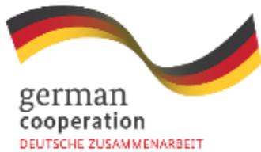
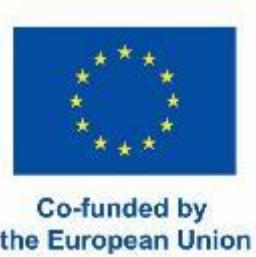
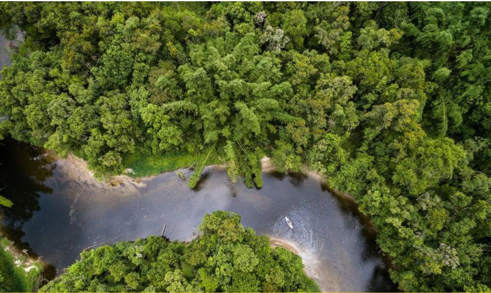
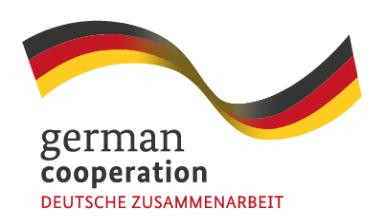
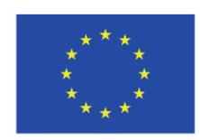

# Cross-Sectoral Analysis and Stakeholder Engagement for EUDR Implementation in Thailand's Palm Oil and Wood Sectors

# **Cross-Sectoral Analysis and Stakeholder Engagement for EUDR Implementation in Thailand's Palm Oil and Wood Sectors**

The "EUDR Engagement" project in Southeast Asia is co-funded by the European Union and the Federal Republic of Germany. GIZ has been commissioned to implement it as part of the BMZ funded global program "Sustainability and Value Added in Agricultural Supply Chains", which is part of the special initiative "Transformation of Agricultural and Food Systems" by the German Federal Ministry for Economic Cooperation and Development.

Disclaimer: This publication was co-funded by the European Union and BMZ. The content of this publication is the sole responsibility of the authors and does not necessarily reflect the views of the EU or the BMZ. The information in this study, or upon which this study is based, has been obtained from sources the authors believe to be reliable and accurate. While reasonable efforts have been made to ensure that the contents of this publication are factually correct, GIZ GmbH does not accept responsibility for the accuracy or completeness of the contents of this publication. The mention of specific companies or products of manufacturers, whether or not these have been patented, does not imply that these have been endorsed or recommended by GIZ GmbH in preference to others of a similar nature that are not mentioned. The views expressed in this information product are those of the author(s) and do not necessarily reflect the views or policies of GIZ GmbH.

## **Table of Contents**

| Table of Contents Executive summary 1. Introduction requirements 1.2 Palm oil and timber sector state 1.3 Analysis objective 2. Methodology 3. Comparative analyses 3.1 Environmental sustainability 3.2 Socioeconomic and labour impacts 3.3 Governance structures and responsibilities 3.5 Land tenure security 3.6 Traceability and supply chain structure 3.7 Pathways to transformation and synergies 4. Stakeholder engagement analysis 4.1 Stakeholder landscape 4.2 Stakeholder influence and interest | 4 7 7 8 10 11 14 14 18 20 22 26 28 30 33 33 36 |
|----------------------------------------------------------------------------------------------------------------------------------------------------------------------------------------------------------------------------------------------------------------------------------------------------------------------------------------------------------------------------------------------------------------------------------------------------------------------------------------------------------------|------------------------------------------------|
| 4.3 Stakeholder alignment with EUDR                                                                                                                                                                                                                                                                                                                                                                                                                                                                            | 40                                             |
| strategies                                                                                                                                                                                                                                                                                                                                                                                                                                                                                                     | 45                                             |
| 5. Conclusion                                                                                                                                                                                                                                                                                                                                                                                                                                                                                                  | 49                                             |
| Annex 1                                                                                                                                                                                                                                                                                                                                                                                                                                                                                                        | 50                                             |

# **Executive summary**

Thailand's palm oil and timber sectors are at a crossroads. As the European Union Deforestation Regulation (EUDR) enters into application, it places a firm obligation on EU Operators of relevant commodities (including palm oil and wood products) to ensure that their supply chains are both deforestation-free and legally compliant. For Thailand, a significant exporter of these products and home to vast networks of smallholders, this regulatory shift implies new, indirect data requirements, which present both a challenge and an opportunity. This study was commissioned to investigate how these sectors can transition to support compliance, and to identify the necessary policy, technical, and stakeholder strategies to do so in an inclusive and coordinated manner.

The primary objective of this study was to support Thailand's alignment with the EUDR by developing a clear understanding of the environmental and social risks facing its palm oil and timber sectors, while identifying promising sector-specific pathways to compliance. At the heart of the analysis was the recognition that legal definitions, land tenure systems, traceability infrastructures, and institutional coordination could require urgent attention and clarifications to meet EUDR standards. Additionally, the study aimed to assess the roles, interests, and influence of key stakeholders (from government bodies to processors, smallholders, NGOs, and certifiers) to map viable engagement strategies and ensure no actors are left behind.

A mixed-methods approach guided the research. Comparative analysis focused on seven EUDR-aligned criteria, including deforestation drivers, environmental impacts, land tenure, labor conditions, supply chain traceability, uptake of sustainability standards, and regulatory enforcement. This analysis was complemented by twenty-two structured interviews with stakeholders from both sectors, and by the construction of an influence-interest matrix to better understand who holds decision-making power, and who requires greater support.

The findings reveal **shared structural challenges across both sectors, most notably in the areas of land tenure uncertainty and traceability**. In the palm oil sector, over 400,000 smallholder households dominate production, yet a significant number lack formal land titles or the means to demonstrate legal land use. Traceability is further compromised by the widespread reliance on informal intermediaries, which obfuscates the origin of fresh fruit bunches (FFB) and could undermine mill-level due diligence. Although certification standards like RSPO exist, uptake remains limited, end of 2024 less than 5% of the total palm oil plantation area as of end-202[4](#page-3-1) 1 [2](#page-3-2) . Separating EUDR-compliant volumes, in the cases EUDR compliant and non-compliant products can share processing and storing facilities, could present a financial and logistical hurdle for processors, especially when faced with the perishability of FFB and the limited time window for processing. Direct engagement between processors and smallholders will be critical to stabilizing supply chains and ensuring legal and traceable sourcing. There could therefore be a critical for more structured cooperatives or farmer organizations to emerge and bring critical "first

1 Roundtable on Sustainable Palm Oil. (2024, October 5). Thailand affirms commitment to developing sustainable palm oil sector. RSPO. [https://rspo.org/thailand-affirms-commitment-to-developing-sustainable-palm-oil](https://rspo.org/thailand-affirms-commitment-to-developing-sustainable-palm-oil-sector/)[sector/](https://rspo.org/thailand-affirms-commitment-to-developing-sustainable-palm-oil-sector/)

2 Roundtable on Sustainable Palm Oil. (2023, June 15). Thailand strengthens shared vision for a sustainable palm oil industry [Press release]. RSPO. [https://rspo.org/press-release-thailand-strengthens-shared-vision-for-a](https://rspo.org/press-release-thailand-strengthens-shared-vision-for-a-sustainable-palm-oil-industry/)[sustainable-palm-oil-industry/](https://rspo.org/press-release-thailand-strengthens-shared-vision-for-a-sustainable-palm-oil-industry/)

mile traceability and transparency", which could incidentally modify supply chain dynamics and burden/benefit sharing arrangements.

The timber sector, by contrast, benefits from a head start in regulatory infrastructure. Through previous engagement with the EU Timber Regulation (EUTR), Thailand has developed the Thai Timber Legality Assurance System (TH-TLAS), a legality verification framework that, while promising, still requires adaptation to meet the EUDR's broader (i.e. deforestation-free) requirements. Plantation-sourced timber, particularly from rubberwood and eucalyptus, offers lower-risk potential supply, yet selfdeclaration systems and informal trade practices continue to obscure origin data. Without due emphasis and capacity building towards public infrastructures or standards for digital traceability systems and better integration of smallholder forestry, compliance will take time. Informal labor arrangements and weak social protections also emerge as plausible vulnerabilities, especially in smaller processing facilities.

The stakeholder analysis highlighted significant disparities in both influence and capacity. Core government agencies such as the Department of Agriculture (DOA), Department of Agricultural Extension (DOAE), and the Forest Economy Office (FEO) hold formal mandates and high influence, positioning them as key actors in the transition. However, the coordination between agencies results in fragmentation and slows progress. Particularly concerning the definition of "forest" and the interpretation of land legality. Meanwhile, industry actors remain cautious, citing uncertainty over compliance costs, traceability infrastructure, and the financial implications of supply chain segregation, were it necessary.

Producers, especially smallholders, demonstrate high interest but limited agency. They face the greatest risk of exclusion if EUDR compliance becomes a gatekeeping mechanism without adequate support. Most lack the resources, training, or digital tools to meet new traceability and land legality standards. NGOs, farmer organizations, the FAO/UNRED[D](#page-4-0)3 , certification bodies, and technical agencies such as RECOFTC could play an important role in bridging these gaps, but they need stronger institutional support to reach scale in a timely fashion.

Looking ahead, the way forward for Thailand must rest on 3 pillars:

- 1. At the national level, the most immediate priority is the harmonization or interoperability of forest definitions and by extension mapping systems across government agencies, particularly through the completion and public integration of the "One Map" system (and clearly identified **zero deforestation meta-polygons**). Clarifying and formalizing land tenure through GPSenabled documentation (especially for the **Sor Por Kor and Nor Sor 3 certificates**) will be vital to enabling legality claims. The recently established National EUDR Committee and its Secretariat are well-positioned to coordinate these efforts and serve as **a platform for government-industry-NGO dialogue**.
- 2. For the palm oil sector, collaboration between mills and smallholders (be it direct or mediated through farmer organizations that would retain stewardship of underlying data) must become standard practice. Only through deeper engagement, such as off-take agreements, **shared investments in mapping, and simplified group certification**, can processors build a stable and

3 See:<https://www.fao.org/redd/news/detail/en/c/1716886/> and [https://openknowledge.fao.org/server/api/core/bitstreams/aa7e4701-232e-4386-ad93-](https://openknowledge.fao.org/server/api/core/bitstreams/aa7e4701-232e-4386-ad93-22c517d3da25/content) [22c517d3da25/content](https://openknowledge.fao.org/server/api/core/bitstreams/aa7e4701-232e-4386-ad93-22c517d3da25/content) : Traceability and transparency in supply chains for agricultural and forest commodities: A review of success factors and enabling conditions

compliant farm base. The promotion of affordable, digital traceability tools will also be key, allowing producers to demonstrate compliance without heavy administrative burdens.

- **3.** For timber, the pathway involves **modernizing TH-TLAS, embedding deforestation-free standards, digitizing self-declarations [QR coding]**, and ensuring that **plantation wood is traceable to its origin.**

Ultimately, Thailand's success in meeting EUDR requirements will depend on its ability to align policy, institutions, and market actors toward a clear, predictable and shared vision. With timely investment, coordinated leadership, and inclusive engagement, the country can move beyond compliance, and establish itself as the regional leader and model in sustainable, deforestation-free commodity production.

# **1. Introduction**

## **1.1 The European Union Deforestation Regulation (EUDR) and its requirements**

The European Union Deforestation Regulation (EUDR) seeks to:

- 1. Mitigate deforestation risks by regulating the trade of commodities and products linked to forest loss, and
- 2. Encourage the trade of deforestation free commodities.

In Thailand, this regulation has notable implications for the rubber, palm oil and wood sectors, necessitating a clear understanding of the diverse stakeholder's circumstances and their interests to support effective implementation in the future. This study highlights the importance of stakeholder engagement and coordination in facilitating the EUDR's application within these sectors.

Nearly 90% of global deforestation is driven by agricultural expansion, with a significant share of agricultural commodities contributing to deforestation and being traded internationally. To address this issue, the European Union (EU) has introduced the EU Regulation on Deforestation-Free Products (EUDR) to reduce its contribution to global deforestation and forest degradation.

Furthermore, the regulation supports the implementation of key global agreements such as the Sustainable Development Goals (SDGs), the Paris Agreement, the Kunming-Montreal Global Biodiversity Framework, and the Glasgow Leaders' Declaration on Forests and Land Use, all of which emphasize the urgent need to protect and restore the world's forests.

Under the EUDR, companies placing relevant products on the EU market or exporting them from the EU must conduct due diligence to ensure that the products are legally produced and do not result from forest conversion or degradation after 2020. The regulation applies to products such as cattle, cocoa, coffee, rubber, oil palm, soy, and wood and their derivatives (listed in Annex I of the regulation). To comply with the EUDR, companies must trace product origins, assess and mitigate deforestation and legal compliance risks, and submit a due diligence statement based on a risk assessment and risk mitigation actions. For now, Thailand has been benchmarked as a low-risk country, meaning only 1% of shipments must be controlled by EUMS Competent Authorities, and risk assessment and risk mitigation (RA/RM) are not required. However, the benchmarking is going to be updated in light of the next FAO FRA, and the RA/RM data may still be required for EUDR commodities that would transit through Thailand from High or Standard risk category countries (e.g. Indonesia or Myanmar).

The EUDR is based on regulated self-reporting. EU Operators must assess their own supply chains and submit a due diligence statement DDS confirming compliance, noting DD is simplified for commodities from low-risk countries. However, they are legally accountable and must retain evidence to support their claims. EU authorities can audit these submissions, and non-compliance can lead to serious penalties, including fines, or product seizures.

The due diligence statement is submitted to an EU-wide Information System managed by the European Commission. This digital platform acts as a central registry and is accessible to EU Member State authorities for monitoring and enforcement purposes. Online training courses are available for thirdparty stakeholders to understand and provide the information that EU Operators need.

For Thailand, a key producer of agricultural commodities in Southeast Asia, including palm oil, rubber, wood and timber the implementation of the applicable requirements set by the EUDR is crucial. It also provides an opportunity to enhance production systems, export practices, and environmental standards in line with global requirements. In this report we will focus on the Palm Oil and wood/timber sectors.

## **1.2 Palm oil and timber sector state**

Thailand's palm oil and wood/timber sectors are key components of the country's agricultural and manufacturing economy. Both sectors are primarily geared toward domestic consumption but are increasingly exposed to expectations of global sustainability, including but not limited to the EU Deforestation Regulation (EUDR).

### **Palm Oil Sector**

Thailand is the world's third-largest producer of palm oil, generating around 3.3 million tons of crude palm oil (CPO) annually. The industry is dominated by an estimated 410.000 smallholder households, who manage about 80% of palm oil cultivation, with the remaining 20% controlled by estates and agroindustrial firms. Palm oil production is concentrated in Southern Thailand in Surat Thani, Krabi, Chumphon and Nakhon Sri Thammarat[.](#page-7-1)4

The primary domestic uses are in cooking oil and biodiesel, with smaller volumes exported to markets such as the EU, Japan, and South Korea. Thai Palm oil exports to the EU have remained relatively stable with just over 5 million kg over 2022, 2023 and 2024 with a slight increase from 2023 to 2024. The largest importer of Palm Oil to the EU in 2022 and 2023 will be The Netherlands whereas in 2024 Italy and Spain imported the majority of Thai palm oil into the EU. Before 2022, Thailand had hardly exported any Palm Oil to the EU[.](#page-7-2)5 EUDR therefore spurred EU imports from a country already assessed by industries as a safe and reliable source of sustainable commodities.

While palm oil prices in Thailand generally track global CPO markets, smallholders often face price volatility due to reliance on intermediaries and limited transparency in fresh fruit bunch (FFB) pricing. Thailand's biodiesel blending mandates aim to stabilize domestic demand and support palm oil prices, but they currently lack sustainability or deforestation-free requirements, allowing non-certified palm oil to be used freely in the blending process. Across Thailand there are roughly 124 millers and 22 refineries processing palm oil.

The sustainability and legality landscape is evolving, driven by international certification schemes such as the Roundtable on Sustainable Palm Oil (RSPO). However, uptake among smallholders remains limited. As of October 2024, only slightly under 5% of Thailand's oil palm production area was RSPO-

4 Bank of Ayudhya Public Company Limited. (2024). Thailand Industry Outlook 2025–2027: Palm Oil Industry. Krungsri Research[. https://www.krungsri.com/en/research/industry/industry-outlook/agriculture/palm](https://www.krungsri.com/en/research/industry/industry-outlook/agriculture/palm-oil/io/plam-oil-industry-2025-2027)[oil/io/plam-oil-industry-2025-2027](https://www.krungsri.com/en/research/industry/industry-outlook/agriculture/palm-oil/io/plam-oil-industry-2025-2027)

5 Statistics (excluding United Kingdom), European Commission, [https://trade.ec.europa.eu/access-to](https://trade.ec.europa.eu/access-to-markets/en/statistics)[markets/en/statistics](https://trade.ec.europa.eu/access-to-markets/en/statistics)

certified, covering approximately 9,062 smallholder farmers6 [.](#page-8-0) This low adoption rate is primarily due to the high costs, technical requirements, and complexity of individual certification processes, which are often beyond the reach of resource-constrained farmers.

To address these challenges, most smallholders in Thailand have achieved RSPO certification through group certification models, which allow multiple farmers to be certified collectively under a shared internal control system7 [.](#page-8-1) This approach reduces per-farmer costs, simplifies monitoring, and enables capacity building at scale. Nonetheless, group certification still requires ongoing support in terms of training, documentation, auditing, and traceability systems, elements that remain barriers for many farmer groups, especially those in more remote areas.

### **Wood and Timber Sector**

Thailand's timber industry is similarly shaped by a strong reliance on plantation-sourced wood, particularly rubberwood, eucalyptus, and teak8 [.](#page-8-2) Due to logging bans in natural forests, harvesting from forest plantations is the main legal source of raw materials. Thailand's plantations consist of approximately 3.9 million hectares of rubber (mainly for latex), 846,708 hectares of eucalyptus, and 68.500 hectares of teak, the latter two primarily dedicated to wood production. Rubberwood (as a byproduct of latex farming and the conversion of rubber plantations to palm plantations) is a major input for furniture and wood panel manufacturing. Eucalyptus wood is mostly used in the pulp and paper industries and to a lesser degree for timber. As hardwood, Teak or Rosewood are used as high-value timber. The wood and timber industry in Thailand is mainly located in the North and Northeastern regions of Thailand (Hardwood species like: Rosewood / teak). Wood from former rubber plantations (which composes most of the legal exported wood supply) originates mainly from the south of Thailand. Fast growing species like Eucalyptus and Acacia are mainly present in North-Eastern Thailand.[9](#page-8-3)

The country's timber products (especially furniture, plywood, and wood-based panels) are in demand in export markets such as China, Japan, the EU, and the U.S. Domestic demand is also significant, driven by the construction, paper, and packaging sectors. Wood or wood products (HS code 44) exports from Thailand to the EU have been increasing rapidly from roughly 15 million kg in 2022 to 147 million kg in 2024. Therefore, making the EU a net importer of wooden products from Thailand since 2023. Before 2023 the EU was a net exporter of wooden products to Thailand (HS code 44). The main importing countries are Belgium, the Netherlands and Germany.[10](#page-8-4)

6 Roundtable on Sustainable Palm Oil. (2024, October 5). Thailand affirms commitment to developing sustainable palm oil sector. RSPO. [https://rspo.org/thailand-affirms-commitment-to-developing-sustainable-palm-oil](https://rspo.org/thailand-affirms-commitment-to-developing-sustainable-palm-oil-sector/)[sector/](https://rspo.org/thailand-affirms-commitment-to-developing-sustainable-palm-oil-sector/)

7 Roundtable on Sustainable Palm Oil. (2021). Smallholder certification: Journey to certification for smallholders. RSPO.<https://rspo.org/as-a-smallholder/journey-to-certification>

8 Forest statistics in 2021. Information provided by FIO,<https://forestinfo.forest.go.th/Content.aspx?id=10408>

9 Bank of Ayudhya Public Company Limited. (2023). EU Deforestation Regulation (EUDR): Implications for Thai Exporters. Krungsri Research.<https://www.krungsri.com/en/research/research-intelligence/eudr-2023>

10 European Commission. (n.d.). Welcome to Access2Markets, Market Access Database for users. Access2Markets. Retrieved May 24, 2025, from [https://trade.ec.europa.eu/access-to](https://trade.ec.europa.eu/access-to-markets/en/content/welcome-access2markets-market-access-database-users)[markets/en/content/welcome-access2markets-market-access-database-users](https://trade.ec.europa.eu/access-to-markets/en/content/welcome-access2markets-market-access-database-users)

Thailand exports a variety of wood products to the European Union, with key species including teak, rubberwood, eucalyptus, and rosewood. Rosewood, although present in Thailand, does not contribute to direct EU import value due to trade restrictions. However, furniture products, which may include rosewood or other hardwoods, were imported from Thailand with a total value of approximately €18 million in 2024. Teak is exported both as part of furniture and as sawn wood, with teak sawnwood imports valued at €4.7 million (mostly by Italy responsible for 3 million EUR of those imports). Eucalyptus, primarily cultivated for the pulp and paper industry, is not exported directly as timber but contributes to paper-related product imports, which totaled around €36 million in 2024. Rubberwood is widely used in the production of furniture and sawnwood; while rubberwood is not separately classified in trade data, sawnwood imports from Thailand were valued at €7.4 million, much of which is likely derived from rubber plantations.10

However, Thai industry operators have an advantage because they are already familiar with the compliance procedures established under the European Union Timber Regulation (EUTR) since 2013. Additionally, authorities such as the Department of Forest play an important role in ensuring the legality of supply chains by overseeing land registration, permits, and export certification. This helps ensure that Thai wood remains legally compliant even as regulations continue to evolve. Thailand is also actively engaging in further timber legality initiatives.

## **1.3 Analysis objective**

This report seeks to identify the key challenges facing EUDR implementation in Thailand's palm oil and timber sectors, and to propose actionable recommendations and next steps to address these issues. This will be done through a:

- Comprehensive understanding of the environmental and social impacts associated with the production of palm oil and timber in Thailand and identify potential challenges.
- Developing Collaborative Strategies: Formulating approaches for effective stakeholder collaboration to ensure compliance with EUDR requirements.

# **2. Methodology**

This chapter outlines the methodology used to assess Thailand's palm oil and timber sectors in relation to the European Union Deforestation Regulation (EUDR). The research aims to identify environmental and social risks, stakeholder dynamics, and strategic responses, ultimately informing sector-specific recommendations and implementation pathways that support EUDR compliance.

The methodology adopts a mixed-methods approach, combining comparative sector analysis with a stakeholder assessment. These are integrated through a structured research framework that ensures alignment with the objectives of this study.

### **Data Collection Methods**

A range of qualitative data collection methods was employed to ensure a comprehensive understanding of the sectors and stakeholder environment.

### *Literature Review*

A systematic literature review was conducted to compile and analyze existing knowledge on:

- Deforestation drivers in Thailand's palm oil and timber sectors.
- Labor and social conditions across value chains.
- National legal frameworks and policy instruments relevant to land use and forest management.
- International trade and sustainability standards (e.g., RSPO, FSC).
- Progress and gaps in traceability and certification schemes.

Sources included peer-reviewed academic literature, government reports, NGO assessments, and international development publications.

### *Semi-Structured Stakeholder Interviews*

To gather contextual and current insights, semi-structured interviews were conducted with 22 stakeholders across sectors and institutional categories. The interviews focused on understanding:

- Stakeholder perspectives on EUDR implementation.
- Operational and policy challenges.
- Existing initiatives related to traceability, certification, and sustainability.
- Readiness and responsiveness to new regulatory demands.

Interview questions are included in the Annex. Interviews were conducted either in person or remotely and typically lasted 60 minutes. Prior to each interview, participants provided informed written and verbal consent. Notes were taken during interviews to capture findings. Table **1** provides an overview of the interviews conducted.

Stakeholders interviewed for Thailand's EUDR readiness reflect distinct biases. Government agencies emphasize policy readiness and digital tools, often downplaying local implementation challenges. Industry actors focus on export continuity and cost-efficient compliance, favoring certification models that suit larger businesses. Smallholders, particularly organized groups, highlight the financial and administrative burden of compliance, though their views may not represent less connected farmers. NGOs promote community-based and rights-focused approaches aligned with donor priorities but may overlook scalability. Recognizing these biases is essential for designing an inclusive EUDR approach that balances regulatory goals with on-the-ground realities across sectors.

### Table **1**, This table gives an overview of the total number of interviewed organizations.

| Stakeholders / Sectors              | Palm Oil | Wood and Timber |
|-------------------------------------|----------|-----------------|
| Producers                           | 3        | 1               |
| Industry & Business Entities        | 1        | 8               |
| Government and Regulators           | 5        | 2               |
| NGO’s/Not -for-Profit Organizations |          | 2               |

### **Comparative Sector Analysis**

This component of the methodology aims to systematically compare the palm oil and timber sectors in terms of environmental, social, and governance-related dimensions, using criteria grounded in the requirements (see Table **2**) of the EUDR too:

- Identify specific challenges and opportunities in each sector.
- Determine areas of overlap or divergence that influence readiness for EUDR compliance.
- Support targeted recommendations for legal, institutional, and supply chain reforms.

### Table **2**, outlining the criteria used to compare the sectors against.

|    | Criteria                                  | Description                                   |
|----|-------------------------------------------|-----------------------------------------------|
| 1. | Deforestation Contribution                | Scale and mechanism through which each sector |
| 2. | Environmental impact                      | Sector specific GHG impacts and impact on     |
| 3. | Land tenure and rights                    | Nature and complexity of land rights, legal   |
| 4. | Labor conditions                          | Employment terms, wage fairness, migrant      |
|    |                                           | workers’ rights and labor law enforcement.    |
| 5. | Supply chain structure and traceability   | Fragmentation, role of intermediaries,        |
| 6. | Adoption of sustainability standards      | Use and impact of RSPO, FSC and other schemes |
| 7. | Enforcement and regulatory effectiveness. | Strength and limitations of government laws,  |

Findings from this comparative analysis are used to understand what is formally required for the EUDR, any complementary information that could be relevant to the EUDR and additional information that could be of interest to either buyers or investors.

### **Stakeholder Assessment and Mapping**

This component evaluates the interests, roles, and influence of stakeholders critical to EUDR implementation. It also supports the identification of collaboration potential, information gaps, and leverage points for engagement.

### *Stakeholder Identification*

Stakeholders were initially identified through a scoping process that included:

- Review of policy documents and government organizational charts.
- Consultation with local experts and development partners.

The stakeholder landscape was then categorized into four broad groups:

- Government and regulatory agencies.
- Industry and business associations.
- Producers (including smallholder groups).
- Civil society and non-governmental organizations.

### *Interest–Influence Matrix*

An interest–influence matrix was used to visualize and classify stakeholders based on:

- Interest: Their motivation or need to engage with EUDR compliance.
- Influence: Their ability to shape policies, enforce compliance, or scale solutions.

Stakeholders were categorized into four quadrants:

- Key Players: High interest, high influence �� should be prioritized for engagement.
- Context Setters: Low interest, high influence �� require sensitization and advocacy.
- Subjects: High interest, low influence �� need capacity-building and representation.
- Crowd: Low interest, low influence �� monitor for changes in role or interest.

This helped to provide recommendations for targeted interventions, partnerships, and communications strategies.

### **Outcome and Use of Findings**

The outputs of this methodological process include:

- A robust comparative overview of EUDR compliance risks and opportunities in Thailand's palm oil and timber sectors.
- Stakeholder maps and engagement strategies grounded in local realities.
- Actionable recommendations to support traceability, legal reform, institutional coordination, and inclusive policymaking.

These results are intended to guide decision-makers, development partners, and industry actors in shaping Thailand's path toward EUDR-aligned and sustainable commodity production.

# **3. Comparative analyses**

In this chapter the results of comparative analyses are shown and discussed based on six (6) thematic topics covering the criteria highlighted in the methodology chapter.

## **3.1 Environmental sustainability**

Thailand has a broad environmental regulatory framework aimed at conserving natural resources, controlling pollution, and promoting sustainable development. Key legislation includes the *Enhancement and Conservation of National Environmental Quality Act (1992)*, which provides the foundation for environmental governance, including environmental impact assessments (EIAs), pollution control, and conservation planning. *The Forest Act (1941)* and the *National Reserved Forest Act (1964)* regulate forest use, conservation zones, and penalties for illegal logging, while the *Wildlife Preservation and Protection Act (2019)* strengthen protections for endangered species and their habitats. The *Factory Act (1992)* addresses industrial pollution and hazardous waste management, and the *Energy Conservation Promotion Act (1992)* promotes energy efficiency and greenhouse gas reduction.

### **Deforestation**

Thai forest cover has remained fairly stable in recent years varying between 32% to 31% of the total land area of Thailand. Which is significantly smaller compared to Indonesia and Malaysia which have a forest cover of 50% and 59% respectively. Despite the already relatively low forest cover in Thailand, it has been declining slowly but steadily from 2018 to 2022 (31.68% to 31.57%).[11](#page-13-2)

The ongoing deforestation has various drivers to which both the timber and palm oil industries contribute. The palm oil industry in Thailand has been and still is on a trajectory of significant expansion. Historically the area allocated for palm oil plantations has increased from 0.04% in 2000 to 6.84% in 2016. It is expected that by 2029 the cultivated palm oil area will have increased to 10 million rai (approximately 9% of the total arable land in Thailand based on World Bank data from 2021).[12](#page-13-3)

Expansion of palm oil cultivation has been driven by government policies as part of its renewable energy strategy in which the use of biodiesel is promoted. This has ensured a stable demand for palm oil, but mixing requirements vary year by year depending on the palm oil price and supply constraints. In addition, domestic demand has also increased, especially due to the recovery of the tourism sector after covid.

Palm oil cultivation area has mostly expanded through the conversion of rice fields and rubber plantations to palm oil. Especially during the 2020s when rubber prices have been declining. The price

11 World Bank. (n.d.). Forest area (% of land area) – Malaysia, Indonesia, and Thailand. Retrieved May 23, 2025, from<https://data.worldbank.org/indicator/AG.LND.FRST.ZS>

12 Thongrak, S., Kongmanee, C., & Kiatpathomchai, S. (2023). Oil palm development in Thailand: Trends and progress of sustainability efforts in palm oil production and procurement. Prince of Songkla University. Retrieved May 23, 2025, fro[m https://rspo.org/wp-content/uploads/Oil-Palm-Development-in-Thailand-](https://rspo.org/wp-content/uploads/Oil-Palm-Development-in-Thailand-Trends-and-Progress-of-Sustainability-Efforts-in-Palm-Oil-Production-and-Procurement.pdf)[Trends-and-Progress-of-Sustainability-Efforts-in-Palm-Oil-Production-and-Procurement.pdf](https://rspo.org/wp-content/uploads/Oil-Palm-Development-in-Thailand-Trends-and-Progress-of-Sustainability-Efforts-in-Palm-Oil-Production-and-Procurement.pdf)

decline combined with the relatively labor-intensive nature of rubber cultivation prompted farmers to change. Although most expansion has occurred on existing agricultural land, some has also taken place in natural areas, particularly in Southern Thailand.[13](#page-14-0)

The Pru Kaching Peat Swamp Forest in Chumphon Province, presents an example of deforestation driven by palm oil expansion. By 2014, nearly one-third of the forest's 4,581-rai area (approximately 1,811 acres) had been converted into oil palm plantations, primarily by smallholder farmers. This peat swamp, a carbon-rich and ecologically sensitive wetland, was cleared and drained to make way for agriculture, undermining its natural function and biodiversity.[14](#page-14-1)

The main driver of this deforestation was the economic incentive discussed earlier: oil palm offered higher and more stable returns than traditional crops like rubber. As demand for palm oil increased, farmers saw opportunity in the relatively undeveloped swamp lands. However, this expansion came at the cost of significant ecological degradation and increased fire risk due to changes in the forest's water levels.31

In response, the Thai government launched a forest reclamation operation to reverse illegal encroachment and restore protected areas. However, enforcement has been uneven, often complicated by unclear land tenure and community dependence on palm cultivation. This case is typical of southern Thailand, where the push for economic development and biofuel production has led to forest loss, particularly in ecologically vulnerable areas such as peat swamps and reserve forests.31

According to PalmWatch CPO mills have also contributed to deforestation, especially again in Southern Thailand. They report a median forest loss per mill of 12.89 km2 in 2022 (Q1 percentile 7.16 km2, and Q3 percentile 33.59 km2). Between 2020 and 2022 a slightly declining trend was reported[15](#page-14-2). Due to increasing demand in recent years (post covid), it is unsure whether this decreasing trend has been continued. What should be highlighted is that PalmWatch tracks deforestation, whether its legal or illegal, it also assigns risks to mills expected to engage in deforestation.

Furthermore, expired government concessions in areas classified as forests also remain challenging in situations where the operator of the plantation has continued to produce. Hence illegal harvesting continues which likely further encroaches on the natural forest areas where the plantation is located. Notably, approximately 3.5% of Thailand's oil palm cultivation areas overlap with designated conservation zones, further complicating environmental preservation efforts.[16](#page-14-3)

The Wood and Timber industry presents its own threats to Thailand's forests. Where the impact of Palm Oil on deforestation is mostly felt in Southern Thailand, for the Wood and Timber industry the impact is

13 Food and Agriculture Organization (FAO). (2022). Thailand: Country report on land use change and agricultural expansion. FAO Regional Office for Asia and the Pacific.<http://www.fao.org/3/cb9870en/cb9870en.pdf>

14 Stokes, D. (2017, March 24). As Thailand ramps up its palm oil sector, peat forests feel the pressure. Mongabay. [https://news.mongabay.com/2017/03/as-thailand-ramps-up-its-palm-oil-sector-peat-forests-feel](https://news.mongabay.com/2017/03/as-thailand-ramps-up-its-palm-oil-sector-peat-forests-feel-the-pressure/)[the-pressure/](https://news.mongabay.com/2017/03/as-thailand-ramps-up-its-palm-oil-sector-peat-forests-feel-the-pressure/)

15 Inclusive Development International. (2024). Thailand – PalmWatch. Retrieved May 23, 2025, from <https://palmwatch.inclusivedevelopment.net/country/Thailand>

16 Thongrak, S., Kongmanee, C., & Kiatpathomchai, S. (2023). Oil palm development in Thailand: Trends and progress of sustainability efforts in palm oil production and procurement. Prince of Songkla University. Retrieved May 23, 2025, fro[m https://rspo.org/wp-content/uploads/Oil-Palm-Development-in-Thailand-](https://rspo.org/wp-content/uploads/Oil-Palm-Development-in-Thailand-Trends-and-Progress-of-Sustainability-Efforts-in-Palm-Oil-Production-and-Procurement.pdf)[Trends-and-Progress-of-Sustainability-Efforts-in-Palm-Oil-Production-and-Procurement.pdf](https://rspo.org/wp-content/uploads/Oil-Palm-Development-in-Thailand-Trends-and-Progress-of-Sustainability-Efforts-in-Palm-Oil-Production-and-Procurement.pdf)

felt in North and Eastern Thailand. Especially in provinces where valuable hardwood species grow like the Siamese Rosewood.

In 2022, the International Union for Conservation of Nature (IUCN) named the Siamese Rosewood as a critically endangered species[17](#page-15-0). Highlighting that 80% of the trees had disappeared within just 3 generations. Due to Thailand's conservation efforts, it now hosts one of the largest remaining Rosewood stocks. These conservation efforts at times even entail the deployment of para-military units due to the violence associated with illegal logging.

Thailand's Department of Forests and the Bangkok Post have reported on numerous cases throughout 2024, 2023 and 2022 of seized volumes of Rosewood across the country (Nakhon Phanom, Prachuap Kiri Khan and Roi Et). Especially national parks located next to border areas with Laos, Cambodia and Myanmar are especially vulnerable. Beyond Rosewood, other hard woods are also targeted like Teak or Ironwood. An example includes the extensive logging in protected areas like Doi Inthanon National Park, where illegal operations have led to the degradation of over 30.000 hectares of forest, negatively impacting a wide range of wildlife.[18](#page-15-1)

Most legally exported wood originates from Southern Thailand from former or existing rubber plantations. A growing source of wood also originates from plantations producing Acacia and Eucalyptus. Production from these plantations is stimulated to relieve the pressure on forests.[19](#page-15-2)

The challenge with these plantations is that they are often planted as part of reforestation programs or previously covered by secondary or degraded forests. Other instances include examples of reforestation projects in areas that were initially never deforested. For example, replacing healthy forests with monoculture plantations. Deforestation linked to rubber peaked in the 1990s during the rubber boom. In 2017 the Thaiger reported roughly 1 million rays of rubber plantations have been associated with forest encroachment.

### **Greenhouse Gas Emissions (GHG)**

In Thailand, the palm oil sector emits approximately 4.34 million tons of CO₂ equivalent annually, accounting for 1.44% of the country's total greenhouse gas (GHG) emissions[20](#page-15-3). The main sources are land conversion (78%), mill wastewater (21%), fertilizer use (6%), and processing and transport (6%)[21](#page-15-4) . Emissions per ton of fresh fruit bunches at the farm level vary from 64 to 225 kg CO₂ equivalent,

17 Barstow, M., Boshier, D., Bountithiponh, C., Changtragoon, S., Gaisberger, H., Hartvig, I., Hung, T. H., Jalonen, R., Kanchanarak, T., MacKay, J., Ping, H., Thammavong, B., Theilade, I., Tran, H. T., Win, P., & Zheng, Y. (2022). Dalbergia cochinchinensis. The IUCN Red List of Threatened Species 2022: e.T215342548A2822125. <https://doi.org/10.2305/IUCN.UK.2022-1.RLTS.T215342548A2822125.en>

18 Stokes, D. (2017, January 4). No let-up in Thailand's relentless, violent Siamese rosewood poaching. Mongabay. [https://news.mongabay.com/2017/01/no-let-up-in-thailands-relentless-violent-siamese](https://news.mongabay.com/2017/01/no-let-up-in-thailands-relentless-violent-siamese-rosewood-poaching/)[rosewood-poaching/](https://news.mongabay.com/2017/01/no-let-up-in-thailands-relentless-violent-siamese-rosewood-poaching/)

19 Food and Agriculture Organization (FAO). (2020). Forest plantations and wood supply in Thailand: Trends and sustainability. FAO Regional Office for Asia and the Pacific. Retrieved from

<http://www.fao.org/3/ca8754en/CA8754EN.pdf>

20 Jun-Jun Ma, Takeshi Fujino, Yiheng Lim, Wilailuk Niyommaneerat and Orathai Chavalparit (2021), Greenhouse Gas Emission from Palm Oil Industry in Thailand and its Countermeasures, International Journal of Earth & Environmental Sciences.

21 Economics climate environment (2022), Carbon Emissions and Palm Oil, Efeca Briefing Note.

depending on practices such as fertilizer use, fuel consumption, and transport. Unauthorized deforestation for palm cultivation further increases emissions.

The wood and timber sector contributes about 21 million tons of CO₂ equivalent annually. Commercial logging is the largest source, responsible for 70% of emissions, followed by processing and manufacturing (10%) and transportation (4%). Logging reduces forest cover and carbon sequestration, while processing activities add to overall emissions.

Thailand's environmental response includes laws such as the *Environmental Quality Promotion Act* and the *Energy Conservation Promotion Act*, both enacted in 1992. These laws support pollution control, environmental protection, and energy efficiency to help address emissions in these sectors.

### **Climate change impacts**

According to the World Bank's Climate Risk Country Profile for Thailand (2021), average annual temperatures have increased by approximately 1°C since the 1960s, with projections of a further 0.95 to 3.23°C rise by 2090 depending on the emission scenario. The estimated temperature increase is expected to be strongest in the southern parts of Thailand. Rainfall changes are characterized by an overall increase in rainfall. This increase is mainly caused by higher intensity rainfall events whereas the number of rainfall events is decreasing. Droughts are mainly driven by the El Nino Southern Oscillation resulting in moderate to severe droughts.[22](#page-16-0)

For the palm oil sector this means heightened exposure to heat stress, as production areas are mainly located in the south. Less and more intense rainfall events will also make palm oil more susceptible to both floods and droughts. As rain with high intensity will drain less quickly, resulting in water-logged conditions. Reduced rainfall events will likely result in longer dry spells. Therefore, putting pressure on palm oil yields.[23](#page-16-1)

An article analyzing climate change impact on tree crop production suitability in Southeast Asia highlights that increasing temperatures could also improve growing conditions. Particularly for robber on mainland Southeast Asia at higher elevations. This area overlaps with Northern Thailand which is also one of the most forested areas of the country. With Chiang Mai province being the most forested province of the nation. Since rubberwood is mostly used in exports, this could complicate future compliance with the EUDR of wood products imported by the European Union.[24](#page-16-2)

22 World Bank Group & Asian Development Bank. (2021). Climate risk country profile: Thailand. Retrieved May 23, 2025, from [https://climateknowledgeportal.worldbank.org/sites/default/files/2021-08/15853-](https://climateknowledgeportal.worldbank.org/sites/default/files/2021-08/15853-WB_Thailand%20Country%20Profile-WEB_0.pdf) [WB\\_Thailand%20Country%20Profile-WEB\\_0.pdf](https://climateknowledgeportal.worldbank.org/sites/default/files/2021-08/15853-WB_Thailand%20Country%20Profile-WEB_0.pdf)

23 Fleiss, S., Hill, J. K., McClean, C., & Lucey, J. M. (2017). Potential impacts of climate change on oil palm cultivation. SEnSOR Programme. Retrieved May 23, 2025, fro[m https://www.sensorproject.net/wp](https://www.sensorproject.net/wp-content/uploads/2018/01/Climate-change-report-FINAL.pdf)[content/uploads/2018/01/Climate-change-report-FINAL.pdf](https://www.sensorproject.net/wp-content/uploads/2018/01/Climate-change-report-FINAL.pdf) 

24 Appelt, J. L., Saphangthong, T., Malek, Ž., Verburg, P. H., & van Vliet, J. (2023). Climate change impacts on tree crop suitability in Southeast Asia. Regional Environmental Change, 23(117). [https://doi.org/10.1007/s10113-](https://doi.org/10.1007/s10113-023-02111-5) [023-02111-5](https://doi.org/10.1007/s10113-023-02111-5)

## **3.2 Socioeconomic and labour impacts**

Thailand has a comprehensive set of labor laws aimed at protecting workers' rights. Key legislation includes the *Labor Protection Act (1998)*, which establishes minimum wages, limits working hours, and ensures basic workplace protections. *The Social Security Act (1990)* offers health insurance and social benefits, while the *Occupational Safety, Health and Environment Act (2011)* address occupational hazards such as exposure to agricultural chemicals. Additionally, the *Workmen's Compensation Act (1994)* provides for compensation in cases of work-related injuries or illnesses, and the *Labor Relations Act (1975)* governs collective bargaining and dispute resolution. *The Royal Decree on Managing the Work of Foreigners (2017)* regulates migrant labor employment to ensure legal compliance. Despite this legal framework, the ILO highlights significant enforcement challenges, especially for migrant and informal agricultural workers, leaving many vulnerable to unsafe working conditions, wage disparities, and limited access to social protections.24

### **Palm Oil Sector:**

A 2021 an ILO study found that migrant workers in Thailand's palm oil sector often earn less than the minimum wage[25](#page-17-1). Two primary wage systems exist: a daily flat rate and a percentage of crop sales. Workers on the sales percentage earn an average of 2,577 baht (approximately US\$78) more monthly than those on flat rates, yet both groups still fall below the minimum wage threshold. Wage deductions are also common, with 43.5% of workers having their wages illegally reduced to cover document costs, including visa fees, work permits, pink cards (work ID), health checkups, health insurance, passports, and history registration fees26 .

The study revealed that 65.4% of migrant workers work seven days a week, with many (69.2%) putting in eight to twelve hours daily, and 11.5% exceeding twelve hours, breaching international labor standards and endangering worker health. Despite this, some stakeholders report no significant labor issues, suggesting wide variability in working conditions across regions or companies26 .

Women in the palm oil sector often work under informal arrangements, receiving lower wages and having less access to social protections compared to their male counterparts. The study also noted that women are more likely to be engaged in tasks perceived as low-skilled, such as collecting loose fruit, which are typically paid less. Additionally, women workers often face limited opportunities for advancement or skills training, and there are fewer mechanisms in place to address gender-based discrimination or harassment in the workplace. These dynamics reinforce gender inequality within palm oil supply chains, where women contribute significantly but remain underrecognized and undercompensated.26

Supporting these findings, the 2022 ILO study Working and Employment Conditions in the Agriculture Sector in Thailand revealed concrete wage disparities between male and female migrant workers in agriculture. Although this study covers a broader range of crops (sugarcane, rubber, oil palm, and maize), it underscores gendered inequalities prevalent in the sector. Specifically, 65.7% of women migrant workers reported earnings below the provincial minimum wage, compared to 50% of men. These figures reflect systemic disadvantages that women (particularly migrant women) face across

25 International Labour Organization (ILO). (2021). Baseline Study on Labour Practices in Thailand's Palm Oil Sector[. https://www.ilo.org/asia/publications/WCMS\\_818992/lang--en/index.htm](https://www.ilo.org/asia/publications/WCMS_818992/lang--en/index.htm)

agricultural value chains, reinforcing the importance of incorporating gender-sensitive approaches in labor policy and enforcement mechanisms in sectors such as palm oil.[26](#page-18-0)

Other than payment, overtime, and gender inequalities, workers are often exposed to large doses of agricultural chemicals as well. According to the 2022 ILO study, Thailand is one of the largest users of agricultural chemicals in the region, and overuse combined with inadequate protective measures puts workers at significant risk of severe health complications, including respiratory issues, skin diseases, and long-term chronic illnesses. This exposure disproportionately affects vulnerable groups such as migrant workers and women, who may have limited access to safety training and personal protective equipment.24

Tools like grievance mechanisms or trade unions usually offer opportunities for these workers to address these issues. However, close to 90% of the migrant workers are not part of these unions or have access to these mechanisms and therefore remain unable to escalate these challenges.

### **Wood and Timber Sector:**

Although a different sector, many of the challenges outlined are also at play in the broader agricultural sector, especially those highlighted in the ILO 2022 report. The key difference is in palm oil generally more chemicals are used therefore exposing workers to high levels of toxic materials. The advantage of the wood and timber sector is the higher degree of formalization through certification schemes and the EUTR, although this is still only valid for the minority of producers.

In contrast, the wood and timber industry, while supporting rural employment and incomes, is marked by historical and structural exclusions. The 1989 logging ban on natural forests and ongoing conservation policies have restricted indigenous and local communities' access to forest areas[27](#page-18-1). These communities often use traditional forest-dependent livelihoods, which are not well recognized in formal law. A high-profile example is the 2021 case of the Bang Kloi Karen community, who attempted to resettle ancestral land in Kaeng Krachan National Park but were accused of illegal encroachment and faced forced eviction[28](#page-18-2). Although a government committee recommended in 2022 that the community be allowed to return, this decision had not been implemented as of 202329 .

The 2019 Community Forest Act represents a step toward participatory forest governance by granting conditional rights to communities to manage forest resources[29](#page-18-3). However, significant limitations remain, especially concerning commercial use and consistent implementation across provinces. These legal gaps leave many marginalized forest communities with limited authority over land they have historically managed30 .

26 International Labour Organization. (2022). Working and employment conditions in the agriculture sector in Thailand: A survey of migrants working on Thai sugarcane, rubber, oil palm and maize farms. Bangkok: ILO Regional Office for Asia and the Pacific. Retrieved from [https://www.ilo.org/sites/default/files/wcmsp5/groups/public/%40asia/%40ro](https://www.ilo.org/sites/default/files/wcmsp5/groups/public/%40asia/%40ro-bangkok/documents/publication/wcms_844317.pdf)[bangkok/documents/publication/wcms\\_844317.pdf](https://www.ilo.org/sites/default/files/wcmsp5/groups/public/%40asia/%40ro-bangkok/documents/publication/wcms_844317.pdf)

27 Forest Trends. (2020). Timber Legality in Thailand: Implementation Challenges and Gaps. [https://www.forest](https://www.forest-trends.org/publications/timber-legality-in-thailand-implementation-challenges-and-gaps)[trends.org/publications/timber-legality-in-thailand-implementation-challenges-and-gaps](https://www.forest-trends.org/publications/timber-legality-in-thailand-implementation-challenges-and-gaps)

28 Human Rights Watch. (2022). Thailand: Indigenous Karen at Risk of Displacement. <https://www.hrw.org/news/2022/01/19/thailand-indigenous-karen-risk-displacement>

29 RECOFTC. (2022). Community Forests in Thailand: Legal Reforms and Local Rights[. https://www.recoftc.org](https://www.recoftc.org/)

While the Thai Labor Department enforces the Labor Protection Act to guarantee minimum wages and safe work environments, enforcement is often inadequate, especially in informal and small-scale timber operations[30](#page-19-1). Many rural furniture workshops, particularly in the Northeast, hire workers without contracts or legal employment status. These workers are typically paid piecemeal or on a daily wage, often below the legal minimum, and lack access to social security, safety protections, or compensation for injuries31 .

Oversight is constrained by the dispersed and informal nature of these operations, which are difficult for authorities to monitor effectively31. Furthermore, the lack of transparency in timber supply chains makes it hard to detect and rectify labor abuse. Nonetheless, private companies can take proactive steps by establishing effective grievance mechanisms to give workers a safe avenue to voice concerns and seek redress31 .

In summary, Thailand's palm oil and wood/timber sectors both exhibit serious labor and social inclusion challenges, though they differ in nature and severity. Palm oil sector concerns revolve around migrant labor conditions and gender inclusion, while timber issues are rooted in land tenure, informal employment, and the marginalization of forest communities. Addressing these challenges requires both regulatory reform and corporate accountability to ensure fair, inclusive, and sustainable labor practices.

## **3.3 Governance structures and responsibilities**

Many of the challenges mentioned in earlier chapters are not new and already on the radar of the various organizations that govern both sectors. Several ministries play key roles in the governance of Thailand's palm oil and wood/timber sectors, reflecting the complexity of managing production, trade, and sustainability across both industries. For both sectors, the Ministry of Commerce regulates domestic and international trade, including the issuance of licenses and conducting international trade negotiations. The Ministry of Industry is also crucial for both sectors, overseeing processing industries such as palm oil mills, refineries, and wood processing plants.

### **Palm Oil sector governance**

In the palm oil sector, the governance structure is based on public and private collaboration. In the sector different state agencies, industry associations, farmer groups collaborate to manage production, pricing and sustainability. The National Oil Palm Policy Committee (NOPPC) serves as the principle coordinating body representing various stakeholders like government agencies, private processors and smallholder organizations. Its main function is to provide strategic direction and price stabilization.9 The Palm Oil board, under the Ministry of Commerce, oversees price regulation and inventory management while the Ministry of Agriculture and Cooperatives (MOAC) leads policy implementation and smallholder development through the Department of Agricultural Extension (DOAE) and Office of Agricultural Economics (OAE).[31](#page-19-2)

30 FAO & RECOFTC. (2021). Forest Tenure Pathways to Gender Equality.

<https://www.fao.org/documents/card/en/c/CB3262EN>

31 Piboonrungroj, P., & Techato, K. (2021). A sustainable palm oil supply chain in Thailand: Status, gaps and policy implications. Energy Science & Engineering, 9(6), 838–855.<https://doi.org/10.1002/ese3.240>

One of the most impactful methods that the government has employed to influence the palm oil market is the biodiesel blending mandate governed by the Ministry of Energy, which specifies the proportion of palm-based biodiesel (such as B7, B10, and B20) to be mixed into diesel fuel. These mandates are part of the country's Alternative Energy Development Plan (AEDP), which aims to reduce fossil fuel dependence while absorbing excess crude palm oil (CPO) from the domestic market. For instance, in 2019, the government increased the B10 mandate to become the standard diesel fuel nationwide, a move that significantly increased CPO demand and helped stabilize falling farm-gate prices during a period of oversupply[32](#page-20-0). This demand-side intervention is coordinated alongside price stabilization efforts by the Ministry of Commerce, which regulates inventories and retail prices through the Palm Oil Policy Board. The Board manages a buffer stock system and licenses exporters to control supply and maintain a stable domestic market[33](#page-20-1) .

During interviews it became clear that coordination challenges arise due to the divergent mandates and objectives of the ministries involved. For example, the Ministry of Commerce prioritizes price stability and consumer protection, while MOAC is more concerned with farmer welfare and increasing agricultural productivity. Compounding this issue is the fact that the NOPPC holds primarily an advisory role, its decisions are not legally binding. As a result, individual ministries retain the authority to act independently, even when such actions conflict with broader strategic objectives. Therefore, highlighting the importance in inter-ministerial coordination through the NOPPC.

### **Wood and Timber sector governance.**

Thailand's timber sector operates under a more centralized and state-dominated governance framework, characterized by extensive regulatory oversight and a complex system of permits and classifications. The Royal Forest Department (RFD), under the Ministry of Natural Resources and Environment (MNRE), is the primary regulatory authority responsible for forest resource management, including the classification of forest lands, issuance of harvesting and transportation permits, oversight of forest plantations, and the enforcement of forestry laws.[34](#page-20-2)

The RFD works alongside several other state agencies. The Department of National Parks, Wildlife and Plant Conservation (DNP) manages national parks, wildlife sanctuaries, and protected areas, particularly concerning conservation and enforcement within overlapping forest zones. The Department of Marine and Coastal Resources (DMCR) oversees mangrove forests. Together, these three departments manage both the Permanent Forest Estates and National Forest Reserves (NFRs), which collectively represent over 23 million hectares of forest area across Thailand.32

Thailand's forest governance operates through a series of legislative instruments, including the Forest Act B.E. 2484 (1941), the National Forest Reserves Act B.E. 2507 (1964), and the Forest Plantation Acts B.E. 2535 (1992) and B.E. 2558 (2015). These laws define permissible forest activities, outline permit procedures, and classify restricted timber species. For example, timber harvesting within NFRs or involving restricted species such as teak (Tectona grandis), yang (Dipterocarpus alatus), and rosewood

32 Ministry of Energy, Thailand. (2018). Alternative Energy Development Plan (AEDP) 2018–2037. Retrieved from <https://policy.asiapacificenergy.org/node/4351>

33 RSPO. (2023). Thailand's Sustainable Pathway: Key Findings of Study on Thai Palm Oil Sector. Retrieved from

<https://rspo.org/thailands-sustainable-pathway-key-findings-of-study-on-thai-palm-oil-sector/> 34 NEPCon. (2017). Timber Legality Risk Assessment: Thailand (Version 1.0). Preferred by Nature. [https://www.preferredbynature.org/sites/default/files/library/2017-06/NEPCon-TIMBER-Thailand-Risk-](https://www.preferredbynature.org/sites/default/files/library/2017-06/NEPCon-TIMBER-Thailand-Risk-Assessment-EN-V1.pdf)[Assessment-EN-V1.pdf](https://www.preferredbynature.org/sites/default/files/library/2017-06/NEPCon-TIMBER-Thailand-Risk-Assessment-EN-V1.pdf)

(Dalbergia spp.) requires a series of approvals and documentation regardless of whether the source is public or private land.32

The governance structure also differentiates between various forest and timber source types, including natural forests, registered plantations (both public and private), and forests inside or outside NFRs. Operators must obtain multiple documents such as plantation certificates (Sor Por 3), harvesting notifications (Sor Por 13), and transport documents (e.g., Sor Por 15 and Removal Passes) depending on the source type and tree species involved. These are verified at designated forest checkpoints operated by the RFD.32

Sor Por Kor land in Thailand is primarily used for timber plantations, especially teak, with some use for rubberwood and eucalyptus. These lands are commonly registered under the Forest Plantation Act to ensure legal timber harvesting. While rubber and palm oil may also be grown, timber species dominate due to legal frameworks and support programs targeting smallholder compliance and sustainable wood production. Thailand's Sor Por Kor land is rarely used for palm oil cultivation.[35](#page-21-1)

The Ministry of Commerce plays a critical role in regulating the trade of timber and wood products, particularly through the Department of Business Development and the enforcement of export and customs regulations. A notable area of inter-agency cooperation has been the development of Thailand's draft Timber Legality Assurance System (TLAS), formulated as part of the country's Forest Law Enforcement, Governance and Trade (FLEGT) Voluntary Partnership Agreement (VPA) negotiations with the European Union. TLAS aims to ensure that all timber and wood products exported from Thailand can be verified as legal, covering key elements such as tenure rights, harvesting permits, tax compliance, and traceability throughout the supply chain. It should be noted that the TLAS system is still only drafted, as the negotiations with the EU have not yet been concluded.

Participatory governance has been gradually introduced to the system, most notably through the Community Forest Act (2019). This legislation allows local communities to legally use and co-manage forest areas for non-commercial purposes, although ownership of forest lands remains with the state. Community forests are still subject to monitoring by forest protection units under the RFD and DNP, which are tasked with controlling illegal logging and enforcing conservation laws.

Commercial forest operations are also conducted by the Forest Industry Organization (FIO), a state enterprise under MNRE. The FIO manages industrial-scale plantations and processes timber from species such as rubberwood and teak. It is also responsible for the sale of confiscated illegal timber through legal channels.

## **3.4 Regulatory framework and compliance mechanism**

For wood and timber, Thailand operates under a centralized, state-led regulatory system shaped by two overarching frameworks: the 20-Year National Strategy (2018–2037) and the 13th National Economic and Social Development Plan (2023–2027). These strategies aim to increase forest cover from

35 Food and Agriculture Organization of the United Nations. (2021, August 30). FAO-EU FLEGT Programme supports Thai smallholders to achieve legal timber harvesting. FAO[. https://www.fao.org/in-action/legal](https://www.fao.org/in-action/legal-sustainable-wood-assurance-programme/fao-eu-flegt-programme-2008-2022/news-events/news-details/en/c/1456311/)[sustainable-wood-assurance-programme/fao-eu-flegt-programme-2008-2022/news-events/news](https://www.fao.org/in-action/legal-sustainable-wood-assurance-programme/fao-eu-flegt-programme-2008-2022/news-events/news-details/en/c/1456311/)[details/en/c/1456311/](https://www.fao.org/in-action/legal-sustainable-wood-assurance-programme/fao-eu-flegt-programme-2008-2022/news-events/news-details/en/c/1456311/)

approximately 31% in 2022 to 40% by 2037 through expanding conservation forests, promoting community and economic forests, and restoring degraded lands via afforestation and reforestation.[36](#page-22-0) A dedicated Forest Restoration Action Plan further supports this by converting land previously used under expiring oil palm and rubber permits back into forest or sustainable land uses. Stronger enforcement of forest protection laws is expected to underpin these ambitions, although implementation challenges persist.

Complementing these broad strategies is a detailed legal framework governing the entire timber supply chain, aimed at ensuring sustainable and legal production. Timber harvesting is tightly controlled as outlined in the previous chapter. Processing and trading facilities must be licensed and maintain detailed inventory systems to track logs, with sawn timber shipments accompanied by official certificates valid for limited periods. Further regulatory layers include the Electric Chainsaw Act, which mandates licenses for operating chainsaws over one horsepower, adding control at the harvesting stage. Import and export regulations incorporate CITES provisions and strict documentation to prevent illegal timber laundering. Together, these laws and policies work to secure sustainable forest management and traceability aligned with Thailand's national forest ambitions.[37](#page-22-1)

### **Understanding the FLEGT and TH-TLAS**

One of the most significant developments in Thailand's forest governance reform is its participation in the EU Forest Law Enforcement, Governance and Trade (FLEGT) initiative. Since 2013, Thailand has engaged in negotiations toward a Voluntary Partnership Agreement (VPA) with the European Union. A central component of this process is the design and rollout of the Thailand Timber Legality Assurance System (TH-TLAS), a national framework to ensure that all timber and wood products are harvested, transported, processed, and exported in compliance with domestic laws[38](#page-22-2) .

TH-TLAS was originally developed to satisfy the EU Timber Regulation (EUTR) by shifting the burden of timber legality assurance from EU importers to Thailand's national system. This effort now provides an opportunity to help align the sector with the more ambitious EU Deforestation Regulation (EUDR), which places stricter requirements on traceability, geolocation, and legal origin for a range of forest-risk commodities, including timber.

### *Key Elements of TH-TLAS*

The TH-TLAS consists of five integrated components:

- Legal Definition: Establishes a nationally agreed definition of "legal timber," including compliance with regulations on forest tenure, harvesting rights, labor standards, and environmental safeguards.
- Supply Chain Controls: Implements traceability systems that monitor timber from origin (forest or plantation) through all processing stages to export. This includes documentation and verification points to prevent entry of illegal timber into supply chains.

36 Office of the National Economic and Social Development Council (NESDC). (2023). 13th National Economic and Social Development Plan (2023–2027). [https://www.nesdc.go.th](https://www.nesdc.go.th/)

37 NEPCon. (2017). Timber Legality Risk Assessment: Thailand (Version 1.0). Preferred by Nature. [https://www.preferredbynature.org/sites/default/files/library/2017-06/NEPCon-TIMBER-Thailand-Risk-](https://www.preferredbynature.org/sites/default/files/library/2017-06/NEPCon-TIMBER-Thailand-Risk-Assessment-EN-V1.pdf)[Assessment-EN-V1.pdf](https://www.preferredbynature.org/sites/default/files/library/2017-06/NEPCon-TIMBER-Thailand-Risk-Assessment-EN-V1.pdf)

38 EFI. (2025). Lessons from the Timber Sector for Natural Rubber in Thailand. European Forest Institute. [https://efi.int/sites/default/files/files/publication-bank/2025/Briefing%20-](https://efi.int/sites/default/files/files/publication-bank/2025/Briefing%20-%20Lessons%20from%20the%20timber%20sector%20for%20natural%20rubber%20in%20Thailand.pdf) [%20Lessons%20from%20the%20timber%20sector%20for%20natural%20rubber%20in%20Thailand.pdf](https://efi.int/sites/default/files/files/publication-bank/2025/Briefing%20-%20Lessons%20from%20the%20timber%20sector%20for%20natural%20rubber%20in%20Thailand.pdf)

- Verification Protocols: Sets up inspection mechanisms and independent audits by both government and third-party bodies.
- Licensing: Will issue FLEGT licenses once the VPA is finalized and ratified.
- Stakeholder Involvement: Encourages participation from civil society, industry, and forest communities in the design and oversight of the system.[39](#page-23-0)

### *Innovations in Traceability: The Role of Self-Declarations*

An innovation within TH-TLAS is the self-declaration (SD) system introduced for timber harvested from private land and Sor Por Kor 4-01 land (agricultural land with legally granted user rights). Following a legal amendment in 2019, smallholders can now harvest and transport timber from such land without prior government authorization. To maintain traceability, they are required to submit a self-declaration form to timber buyers, who verify and retain the information. This information can be traced back to the original producer and reviewed by authorities if needed[40](#page-23-1) .

This approach helps bridge the gap between formal legality and practical realities for smallholders. It avoids creating an overly bureaucratic system while ensuring that traceability and compliance can be demonstrated through documentation and spot-check mechanisms18 .

### **Voluntary standards use.**

At the same time, the palm oil industry does not have the same type of legal safeguards that the wood/timber sector has. Sustainability in the palm oil sector remains primarily driven by voluntary private sector initiatives rather than binding national standards. Major processors and exporters have adopted international certification schemes such as the Roundtable on Sustainable Palm Oil (RSPO), particularly for accessing European and North American markets. However, uptake remains limited among smallholders and domestic-focused producers, where cost, awareness, and lack of incentives hinder broader adoption. Although the Ministry of Agriculture and Cooperatives has promoted Good Agricultural Practices (GAP) for oil palm cultivation, these guidelines are not mandatory and do not include no deforestation requirements (mostly on pesticides, nutrients, etc..), and there is currently no fully operational national sustainability standard specific to palm oil. As a result, while key government policies have improved price and market stability, progress toward sustainability and traceability remains uneven and heavily reliant on export-driven corporate actors.

The Roundtable on Sustainable Palm Oil (RSPO) standard has been promoted in key provinces such as Krabi and Surat Thani, supporting smallholder cooperatives to adopt sustainable practices. RSPO certification mandates the protection of High Conservation Value (HCV) and High Carbon Stock (HCS) areas and ensures transparency through auditing and certification mechanisms. This helps Thailand align with EUDR requirements, especially in terms of traceability and zero-deforestation commitments.[41](#page-23-2) Although it should be noted that deforestation definitions do not completely align between EUDR and RSPO.

39 European Commission. (2023). FLEGT Voluntary Partnership Agreements – Thailand. <https://www.euflegt.efi.int/thailand>

40 EFI. (2025). Lessons from the Timber Sector for Natural Rubber in Thailand, pp. 1–3. [https://efi.int/sites/default/files/files/publication-bank/2025/Briefing%20-](https://efi.int/sites/default/files/files/publication-bank/2025/Briefing%20-%20Lessons%20from%20the%20timber%20sector%20for%20natural%20rubber%20in%20Thailand.pdf)

[%20Lessons%20from%20the%20timber%20sector%20for%20natural%20rubber%20in%20Thailand.pdf](https://efi.int/sites/default/files/files/publication-bank/2025/Briefing%20-%20Lessons%20from%20the%20timber%20sector%20for%20natural%20rubber%20in%20Thailand.pdf) 41 RSPO. (2024). Thailand affirms commitment to developing sustainable palm oil sector. Roundtable on Sustainable Palm Oil[. https://rspo.org/thailand-affirms-commitment-to-developing-sustainable-palm-oil](https://rspo.org/thailand-affirms-commitment-to-developing-sustainable-palm-oil-sector/)[sector/](https://rspo.org/thailand-affirms-commitment-to-developing-sustainable-palm-oil-sector/)

The RSPO and EUDR differ in cutoff dates, scope, and forest types covered. RSPO defines deforestation as the clearing of High Conservation Value (HCV) and High Carbon Stock (HCS) forests after November 2005, focusing specifically on palm oil supply chains. In contrast, EUDR sets a later cutoff date of December 31, 2020, and applies to all forest types and commodities globally. EUDR prohibits conversion of forests even if they are secondary or degraded, whereas RSPO restricts deforestation only in HCV or HCS areas. This broader protection makes the EUDR stricter, requiring due diligence for all forest conversions after 2020 by operators placing products on the EU market.

In addition, the No Deforestation, No Peat, and No Exploitation (NDPE) Implementation Reporting Framework (IRF) offers a structured tool for companies to monitor and report progress toward NDPE commitments. The framework supports supply chain transparency and incentivizes continuous improvement by allowing companies to categorize supplier performance and track progress toward full NDPE compliance.[42](#page-24-0) Though voluntary, NDPE IRF is increasingly adopted by international buyers/brands and can serve as a transitional step for Thai producers aiming to align with EUDR requirements. As the NDPE IRF are more brand focused, smallholders would not be aware of this.

Regarding sustainability it is interesting to note that the earlier-mentioned legislation and policies in the wood/timber sector are mostly geared towards legal compliance, not sustainable production. Sustainable production is supported by use of voluntary standards like the Forest Stewardship Council (FSC) or the PEFC standards as they provide a framework for responsible forest management in the timber sector. While uptake is still limited in Thailand, FSC-certified plantations help ensure legality, traceability, and environmental sustainability. As of recent years, Thailand has made progress in forest certification, with around 3,230 smallholder farmers certified under FSC group schemes and approximately 3,000 hectares certified under the PEFC system since its endorsement in 2019. Despite this growth, overall uptake remains limited, reflecting ongoing challenges in scaling certification across wood plantations. These certification efforts contribute to enhancing legality, traceability, and environmental sustainability in Thailand's forestry sector.[43](#page-24-1) [44](#page-24-2)

Both RSPO and FSC standards, as well as NDPE IRF, complement Thailand's domestic laws by:

- Promoting independent auditing and chain-of-custody tracking,
- Reinforcing deforestation criteria,
- Supporting capacity-building for smallholders and community producers,
- Bridging gaps in land-use transparency and traceability, particularly for exports to markets subject to EUDR.

42 Proforest. (n.d.). NDPE Implementation Reporting Framework (NDPE IRF).<https://www.ndpe-irf.net/>

43 United Nations REDD Programme. (2021). Making certification more accessible for all: Thailand finds way forward for smallholder certification[. https://www.un-redd.org/post/making-certification-more-accessible-all](https://www.un-redd.org/post/making-certification-more-accessible-all-thailand-finds-way-forward-smallholder-certification)[thailand-finds-way-forward-smallholder-certification](https://www.un-redd.org/post/making-certification-more-accessible-all-thailand-finds-way-forward-smallholder-certification)

44 Programme for the Endorsement of Forest Certification. (2019). Public consultation on the Thai Forest Certification System.<https://www.pefc.org/news/public-consultation-thai-forest-certification-system>

## **3.5 Land tenure security**

During the interviews and in chapter on Environmental impact it was repeatedly mentioned that land tenure was especially challenging creating uncertainty in relation to legal compliance. What makes the tenure system so complicated is a combination of various land titles and use certificates that can be issued by a variety of government agencies. Compounded by the overlapping and often unclear land use classifications.

### **Land titles**

At the core of land administration is the Department of Lands, under the Ministry of Interior, which issues the most secure and legally recognized land titles. These include the Chanote (Nor Sor 4 Jor) which is a fully titled deed with precise geospatial boundaries, as well as Nor Sor 3 and Nor Sor 3 Gor, which confer use rights with varying degrees of legal certainty but fall short of full ownership. These documents form the legal backbone of private landownership, especially in more developed rural areas.[45](#page-25-1)

In contrast, the Agricultural Land Reform Office (ALRO), operating under the Ministry of Agriculture and Cooperatives, issues Sor Por Kor 4-01 (ALRO title) documents. These titles allow landless farmers to utilize agricultural land but prohibit sale or transfer (of land) outside of designated beneficiary groups. While serving a social equity function, ALRO documents can overlap with forest zones or other titled lands, especially in areas where land mapping has been inconsistent.21

Meanwhile, the Royal Forest Department (RFD), part of the Ministry of Natural Resources and Environment, plays a pivotal role in designating and managing forest lands. Although it does not issue formal land titles, it grants various forms of forest utilization permits, which often lack clarity and longterm security. These forest lands sometimes intersect with land already allocated for agricultural reform or private ownership, adding further administrative confusion.21

Despite all these various options for land title deeds most farmers often use the Por-Bor-Tor-5 (PBT-5) documents as proof of land possession. This is a document issued by local administrative organizations that do not have the authority to verify land occupation, they only issue tax receipts for landholders. Therefore, or-Bor-Tor-5 (PBT-5) is used as evidence, although its validity is limited.

### **Case study**

In the Haew Pla Kang area of Tambon Mu Si, Pak Chong District, ALRO allocated 2900 rai of land near Khao Yai national park to farmers under its land reform program, issuing Sor Por Kor 4-01 certificates. However, the Department of National Parks, Wildlife and Plant Conservation (DNP) later asserted that these lands fall within the boundaries of Khao Yai National Park, a protected area.[46](#page-25-2)

The DNP accused ALRO officials of encroaching upon protected forest land by marking and distributing plots within the national park. ALRO, on the other hand, maintained that the land allocations were lawful

45 Schmidt, P. (2019). Community land titling in Thailand: A review of policy and implementation approaches. Mekong Region Land Governance (MRLG). [https://www.mrlg.org/wp-content/uploads/2019/06/Community-](https://www.mrlg.org/wp-content/uploads/2019/06/Community-Land-Titling-in-Thailand_Final.pdf)[Land-Titling-in-Thailand\\_Final.pdf](https://www.mrlg.org/wp-content/uploads/2019/06/Community-Land-Titling-in-Thailand_Final.pdf)

46 Nation Thailand. (2024, February 21). Rule of law must prevail to protect parkland from corruption: Srettha. Retrieved fro[m https://www.nationthailand.com/thailand/general/40035801](https://www.nationthailand.com/thailand/general/40035801)

and based on historical agreements and surveys. This disagreement led to tensions between the two agencies, with each presenting differing interpretations of land boundaries.[47](#page-26-0)

The overlapping claims created uncertainty for the farmers who had received land rights from ALRO, as they faced potential eviction and legal challenges. The dispute also highlighted the broader issue of inconsistent land management and the need for clear demarcation of land boundaries to prevent such conflicts. For EUDR compliance this type of uncertainty endangers potential compliance.22

### **Definitions of forest and deforestation**

The unclarity in relation to land boundaries also aligns with observations made during the interviews which highlighted discrepancies between maps indicating whether deforestation occurred or not. This discrepancy is caused by a different legal definition of what a forest constitutes between the different government agencies in Thailand, the legal definition used and the EUDR definition.

Thailand defines forests in the Forest Act (1941) and the National Reserved Forest Act (1964) primarily as legal classification not by physical characteristics, like tree cover or biodiversity. This results in areas being classified as forests that are in reality already degraded, deforested or even cultivated. Especially in situations where permits for cultivation have been approved (or in many cases already expired) of land classified as forests. In contrast the EUDR definition is based on biophysical factors like tree cover and not on legal classification.[48](#page-26-1) [49](#page-26-2)

During interviews it became clear that various agencies in Thailand have adopted an amended version of the legal definition of forest. For example, the Royal Forest Department includes in its definition areas that are designated for conservation but also economic use and aims to align itself with the policy goal of increasing the national forest cover. The department of National Parks, Wildlife and Plant Conservation (DNP) focus their definition on biodiversity and conservation, while excluding areas primarily used for agriculture.[50](#page-26-3) The lack of a unified definition of forest highlights the degree of fragmentation within the Thai government agencies that work on forestry related topics. As a result, the definition of what deforestation actually constitutes also varies and is unclear.

The Thai government established the National Land Policy Committee (NLPC) as the primary policymaking body to systematically address land-related issues. This committee has been established in 2014[51](#page-26-4), but only in 2019 the formal legal framework was enacted for NLPCs operations[52](#page-26-5) .

47 Bangkok Post. (2024, March 6). Khao Yai land dispute stuck on 'buffer zone'. Retrieved from <https://www.bangkokpost.com/thailand/general/2749984/khao-yai-land-dispute-stuck-on-buffer-zone> 48 Kingdom of Thailand. (1941). Forest Act, B.E. 2484 (1941). Retrieved from

<https://www.fao.org/faolex/results/details/en/c/LEX-FAOC070605/>

49 Kingdom of Thailand. (1964). National Reserved Forests Act, B.E. 2507 (1964). Retrieved from <https://www.fao.org/faolex/results/details/en/c/LEX-FAOC053402/>

50 Department of National Parks, Wildlife and Plant Conservation. (n.d.). Department of National Parks, Wildlife and Plant Conservation. Retrieved fro[m https://www.unccd.int/resources/knowledge-sharing](https://www.unccd.int/resources/knowledge-sharing-system/department-national-parks-wildlife-and-plant-conservation)[system/department-national-parks-wildlife-and-plant-conservation](https://www.unccd.int/resources/knowledge-sharing-system/department-national-parks-wildlife-and-plant-conservation)

51 Hayward, D. (2017). Community land titling in Thailand: The legal evolution and piloting of titling policy (Thematic Study Series No. 7). RCSD–Mekong Land Research Forum and Mekong Region Land Governance. [https://www.mrlg.org/wp-content/uploads/2019/06/Community-Land-Titling-in-Thailand\\_Final.pdf](https://www.mrlg.org/wp-content/uploads/2019/06/Community-Land-Titling-in-Thailand_Final.pdf)

52 National Land Policy Commission Act, B.E. 2562 (2019). (2019, April 14). FAOLEX. Food and Agriculture Organization of the United Nations[. https://www.fao.org/faolex/results/details/en/c/LEX-FAOC225883/](https://www.fao.org/faolex/results/details/en/c/LEX-FAOC225883/)

Key results of the National Land Policy Committee's actions include:

- *Integrated Land Mapping*: The committee initiated the One Map project, planning to complete it by 2016. However, it remains unfinished, with recent data revealing 1.22 million rai of overlapping state land.
- *Community Land Allocation*: Between 2015 and 2021, the committee targeted 1,353 areas across 70 provinces for community land use, covering a total of 4.1 million rai. So far, 2.3 million rai of national reserve forest land has been allocated for this purpose .
- *Land Use Permissions*: The goal is to issue land possession permits for approximately 1.589 million rai (about 12% of total disputed land). However, the average annual issuance has only been around 114,534 rai, resulting in 687,000 rai (43% of the target) over six years, benefiting approximately 60,000 individuals. At the current pace, resolving issues for around 1.1 million people could take decades.
- *Land Usufruct Certificate* (ALRO 4-01) Areas Progress: Only about 27% of the target area for land use permits has progressed.
- *Disputed Land Rights*: In the fiscal year 2020, the Land Encroachment Problem Resolution Committee verified 1,252 cases out of 5,011, covering 90,786 rai. Of those verified, 1,133 (89%) were confirmed to have occupied the land before state declaration. This highlights the importance of quickly resolving land rights issues, as the current rate suggests it could take around five years to complete all verifications.

## **3.6 Traceability and supply chain structure**

### **Palm oil**

Palm oil is produced by mainly smallholders and is clustered in Southern Thailand with 85.9% of the harvested area located there (Surat Thani, Krabi and Chumpon). Larger producers tend to invest in their own CPO mills. Smallholders rarely sell directly to mills. Usually, they rely on a dense layer of intermediaries such as collectors and traders. Their role is to consolidate the Fresh Fruit Bunches (FFBs) received from the farms. Many of the intermediaries are unregulated or operate informally. This creates major blind spots in terms of traceability.[53](#page-27-1)

Fresh Fruit Bunches (FFBs) need to be delivered to the mills for processing ideally within 24 hours. Otherwise, the quality will diminish sharply. This forces smallholders to typically sell to the nearest intermediary (trader/collector), this urgency complicates the verification of the origin and legality of the product. As a result of this situation mills have little influence on the origin of their palm oil, therefore they are unable to track changes in their farm-base.[54](#page-27-2)

In Thailand there are 124 mills[55](#page-27-3) that process palm oil, often using a mass balance model. Including those with RSPO certification in place. A mass balance Chain-of-Custody (CoC) system allows for the mixing of

53 [https://rspo.org/wp-content/uploads/Oil-Palm-Development-in-Thailand-Trends-and-Progress-of-](https://rspo.org/wp-content/uploads/Oil-Palm-Development-in-Thailand-Trends-and-Progress-of-Sustainability-Efforts-in-Palm-Oil-Production-and-Procurement.pdf)[Sustainability-Efforts-in-Palm-Oil-Production-and-Procurement.pdf](https://rspo.org/wp-content/uploads/Oil-Palm-Development-in-Thailand-Trends-and-Progress-of-Sustainability-Efforts-in-Palm-Oil-Production-and-Procurement.pdf)

54 of Research in Science, W. A. R. S. E. T. W. A., & E. A Study on the Crop evacuation process of Oil Palm Fresh Fruit bunch (FFB).<https://doi.org/10.30534/IJATCSE/2020/2091.12020>

55 Krungsri Research. (2024). Palm Oil Industry Outlook 2025–2027. Bank of Ayudhya Public Company Limited. [https://www.krungsri.com/en/research/industry/industry-outlook/agriculture/palm-oil/io/plam-oil-industry-](https://www.krungsri.com/en/research/industry/industry-outlook/agriculture/palm-oil/io/plam-oil-industry-2025-2027)

materials received, whether certified or not. In this system the end-product contains at least a proportion of the certified product. Based on this proportion a claim can be made which usually states the CoC model or a blending percentage. EUDR does not allow for a mass balance approach and requires full segregation of non-EUDR compliant material. Meaning either:

- 100% of Thai FFB should be proved legal+ deforestation free (unlikely in the short-medium term) or
- certain intermediaries (trader/collector), and mills should specialize in EUDR FFB, and they should be located so that [sufficiently large] clusters of compliant SH can access them in time. The proportion of such EUDR-ready mills should at least be commensurate to the fraction of PO being exported to the EU, meaning it could start relatively small and localized and could then grow in a stepwise manner.

Current efforts to support sustainability in palm oil like RSPO and the No Deforestation No Peat No Exploitation Implementation Reporting Framework (NDPE IRF), focus mostly on the mill level. NDPE IRF aims to improve traceability in the sector, but farm level traceability is in most cases still too complex to achieve. Even in RSPO the certification unit is the mill level does not farm level, even though several requirements do extend to the farm level (ex. prevention of clearing High Conservation Value/ High Carbon Stock areas, Environmental responsibility, land rights / FPIC and fair labor).[56](#page-28-0)

Furthermore, the intermediary actors in the supply chain are often openly reluctant to share the origin of their sourced raw materials: Too much transparency might lead mills to directly contract with farmers, therefore cutting out the intermediary actors. Making traceability more complicated to maintain. A "just transition" is therefore required for **EUDR farmer organizations and/or mills to internalize and reward** this "first miles" ecosystem fairly.

The final stage of the supply consists of refineries of which there are 22 in Thailand23. They sell their products further downstream to traders or consumer good companies for further processing and sales to the end consumers. Palm oil produced in Thailand is mostly used for domestic use, about 72% is sold to the domestic market in 2024. The majority, 41.8% of the domestically sold volume is used for food and consumer goods. The remainder is used for biodiesel accounting for 30.2%. The excess is used for exports, and a minority is stored in Thailand for future use23 .

### **Wood and timber**

A significant number of smallholders grow these trees on unregistered or informally held lands, reflecting ongoing issues with unclear land legislation. Extraction from natural forests is largely prohibited, especially following the 1989 national logging ban, which sharply restricted commercial logging in forested areas.[57](#page-28-1)

Unprocessed logs are often sold to local traders or middlemen who consolidate them and transport them to sawmills or wood processors. Similarly to the palm oil sector, these intermediaries often operate informally without any registration. In addition, wood from different farms or sources are often mixed, making traceability even more complex. This also means that accurate maintenance of origin

56 Proforest. (n.d.). NDPE Implementation Reporting Framework (NDPE IRF).<https://www.ndpe-irf.net/>

57 Roundtable on Sustainable Palm Oil. (2024). Thailand's Sustainable Pathway: Key Findings of Study on Thai Palm Oil Sector. Retrieved February 10, 2025, fro[m https://rspo.org/thailands-sustainable-pathway-key](https://rspo.org/thailands-sustainable-pathway-key-findings-of-study-on-thai-palm-oil-sector/)[findings-of-study-on-thai-palm-oil-sector/](https://rspo.org/thailands-sustainable-pathway-key-findings-of-study-on-thai-palm-oil-sector/)

records is often not kept. A shift to digital records (based on digital identity) and QR codes would be required to minimize the cost of transparency while preventing fraud and circumvention.

The timber is processed by sawmills and then are sold to furniture manufacturers. These actors usually operate legally and participate in domestic trade and export. Traceability often ends at this stage though, due to the limited visibility of the origins of the wood due (domestic or imported) to the intermediaries involved. It is worth noting that over 90% of Thai exports of processed wood go to China, which is the largest supplier of wood to Europe. From the Thai exports to Europe, the majority 43.6% are paper products.[58](#page-29-1)

Exports already need to prove legal compliance, especially due to regulations in place under the existing European Union Timber Regulations (EUTR). The challenge is that verification is often paper based and therefore prone to fraud.[59](#page-29-2) Furthermore, EUTR implementation has faced similar challenges compared to EUDR. In that sense, there is an opportunity to encourage a transition to paper-less and more reliable digital solutions.

The hardwood supply chain for woods like Teak and Rosewood are slightly different due to the high value obtained for hardwoods and the illegal logging challenges. Since natural logging is prohibited, these woods are produced at plantations but heavily regulated. Although exports tend to be well certified (FSC) there are still challenges in relation to traceability. In some cases, farmers aim to avoid bureaucracy and sell their wood to informal traders. When mixed with wood from other sources it becomes difficult to trace and only a portion is truly verifiable. Again, the intermediaries play a key role when it comes to achieving full traceability.

## **3.7 Pathways to transformation and synergies**

Table **3** summarizes the comparative analysis between Thailand's palm oil and timber sectors, based on the criteria established in this document's methodology. Both sectors face increasing pressure due to the EU Deforestation Regulation (EUDR), yet their readiness and response strategies differ significantly.

### *Common Challenges:*

Both palm oil and timber rely heavily on smallholder producers for raw materials, including plantations of acacia, eucalyptus, rubber, and oil palm. This smallholder dependence creates complexities in traceability and legal compliance. Additionally, land tenure insecurity poses a major barrier, complicating the ability to prove legal origin and meet regulatory demands. Supply chains in both sectors are intricate and rely predominantly on mass-balance chain of custody systems, which present risks of fraud and complicate verification. Furthermore, ambiguous definitions of "forest" and "deforestation" add to uncertainties around compliance requirements.

58 Krungsri Research. (2023). EU Deforestation Regulation (EUDR) coming in 2023: What companies need to

know. Retrieved May 23, 2025, fro[m https://www.krungsri.com/en/research/research-intelligence/eudr-2023](https://www.krungsri.com/en/research/research-intelligence/eudr-2023)

59 European Commission. (2020). EU Timber Regulation (EUTR) – Illegal logging and timber trade. Retrieved from [https://ec.europa.eu/environment/forests/timber\\_regulation.htm](https://ec.europa.eu/environment/forests/timber_regulation.htm)

### *Key Differences:*

Governance structures vary markedly between the two sectors. The timber sector benefits from a more centralized system under fewer ministries, whereas the palm oil sector remains fragmented across multiple governmental bodies, complicating coordinated regulation and support. The timber sector is supported by the Thailand Timber Legality Assurance System (TH-TLAS), a near-ready framework requiring adjustment rather than creation. In contrast, the palm oil sector lacks an equivalent legal assurance system.

Social and labor challenges also diverging palm oil is more vulnerable to exploitation of migrant workers, while timber faces issues of informality and limited local community inclusion. Climate change impacts differ as well. Rubber plantations in northern Thailand may experience improved growing conditions, while palm oil cultivation faces adverse effects.

Finally, the palm oil sector has potential pathways to improve compliance through upscaling group certification schemes, which could make legal certification more accessible and affordable for smallholder farmers. This contrasts with timber, where certification frameworks are more established but face other systemic challenges.

In summary, while both sectors share foundational obstacles related to smallholders, land tenure, supply chain complexity, and regulatory ambiguity, their governance, social dynamics, climate change impact, and governance structures differ substantially. Tailored approaches are therefore required to support each sector's effective adaptation to the EUDR.

**Table 3**, Overview of key differences between sectors according to key comparative criteria.

| CRITERIA | PALM OIL SECTOR WOOD/TIMBER SECTOR                     |
|----------|--------------------------------------------------------|
| 1.       | Deforestation                                          |
|          | Expected expansion could drive                         |
| 2.       | Environmental                                          |
|          | Environmental impact includes                          |
|          | emissions driven by land use                           |
|          | conversions. Processing industry                       |
|          | Carbon emissions seem relatively high                  |
| 3.       | Land tenure and                                        |
|          | documents. Government action is                        |
| 4.       | Labor conditions The key challenge is migrant labor on |
|          | Although migrant labor is likely also                  |
| 5.       | Supply chain                                           |
|          | Also, mostly mass balance chains of custody            |
| 6.       | Sustainability                                         |
|          | TH-TLAS and legal system provides a                    |
|          | implementation. This provides an                       |
| 7.       | Enforcement                                            |
|          | enforcement uneven. Definition                         |

# **4. Stakeholder engagement analysis**

Based on the findings from the comparative analyses, potential pathways forward will be explored as part of the stakeholder engagement analysis.

## **4.1 Stakeholder landscape**

The implementation of the EU Deforestation Regulation (EUDR) in Thailand involves a diverse set of stakeholders from government, industry, civil society, and producer groups. Each plays a distinct role in shaping compliance pathways for the palm oil and timber sectors. This section is mostly based on the 22 stakeholder interviews and outlines the key actors, their responsibilities, aspirations, and interests in the EUDR process.

**Government agencies** in the palm oil sector, government ministries and their specialized departments remain key actors in shaping policy responses to EUDR. The Ministry of Agriculture and Cooperatives (MOAC), alongside its Department of Agricultural Extension (DOAE) and Office of Agricultural Economics (OAE), focuses on supporting producers, especially smallholders, through technical assistance and data management systems that enable traceability. The Ministry of Commerce continues to play a vital role in regulating trade and market stability, while the Ministry of Energy influences demand through biodiesel mandates that affect crude palm oil volumes.

The Royal Forest Department (RFD) and associated agencies maintain a central regulatory and enforcement role. However, in the context of EUDR, the Forest Economy Office (FEO), which oversees the Thai Timber Legality Assurance System (TH-TLAS) and manages relations under the EU FLEGT Voluntary Partnership Agreement, has emerged as a pivotal actor for aligning national timber legality frameworks with international requirements.

Alongside these national agencies, the Department of National Parks, Wildlife and Plant Conservation (DNP) and Department of Marine and Coastal Resources (DMCR) continue to influence conservationfocused enforcement and resource management.

**Provincial agencies** such as the provincial forestry offices and forest protection units serve as the frontline institutions monitoring compliance and supporting local forest users, including community forests operating under the Community Forest Act (2019). These community-managed forests represent important social stakeholders, balancing livelihood needs with conservation mandates.

The Surat Thani Provincial Agriculture Office plays a key role in translating national policy into local action. They are responsible for raising awareness, coordinating capacity-building activities, and assisting with on-the-ground implementation. Their interest lies in building effective communication channels between national agencies and local producers while managing limited institutional resources.

**Industry and business entities** include associations such as the Fast-Growing Tree Business Association, Thai Furniture Association, and the Chamber of Commerce and Board of Trade of Thailand. These groups focus on interpreting and disseminating EUDR requirements, encouraging member compliance, and liaising with both regulators and international buyers. The Forest Industry Organization (FIO) is a stateowned enterprise that helps promote legal timber production and certification. In both the palm oil and wood sectors, private sector companies seek clarity on EUDR requirements, tools for traceability, and mechanisms to reduce initial compliance burdens. Their aspirations include maintaining market access, securing reputational benefits from legal and sustainable sourcing, and minimizing costs associated with regulatory transition.

**Producer groups**, particularly smallholders, are deeply affected by EUDR but often lack the technical capacity or access to compliance systems. They provide crucial insights into feasibility and local implementation. Their needs include tailored training on traceability tools, Thai-language guidance, and user-friendly platforms for geolocation and record-keeping. Many smallholders are concerned about the administrative burden and potential exclusion from markets if they cannot demonstrate compliance. Their aspiration is to be included in the transition without jeopardizing their livelihoods.

**Civil society organizations and NGOs**, including RECOFTC and Preferred by Nature, contribute to outreach, education, and support for community-based forest management. They play a watchdog role while also helping stakeholders (especially in the timber sector) understand and adapt to sustainability standards. Their interest lies in ensuring that EUDR implementation protects forests, promotes social inclusion, and builds capacity at the grassroots level.

**Certification bodies** are also active in Thailand, offering frameworks that partially align with EUDR requirements, such as FSC, PEFC for timber and RSPO for palm oil. While not officially recognized by the EUDR as sufficient for EUDR compliance, these schemes remain important tools for demonstrating legal sourcing and sustainability, particularly in the timber sector.

Overall, the stakeholder landscape in Thailand reveals a high level of engagement across multiple sectors, with broad interest in achieving EUDR alignment. However, coordination gaps, technical challenges, and uneven access to resources remain obstacles that must be addressed to enable inclusive and effective implementation as mentioned in the Comparative analyses. Table **4** gives an overview of these stakeholder groups and the actors that were involved in the interviews conducted.

| Stakeholder Group            | Sectors         | Key Stakeholders - interviewed                         | Activity                                                                   |
|------------------------------|-----------------|--------------------------------------------------------|----------------------------------------------------------------------------|
| Government and Regulators    | Palm Oil        | Department of Agriculture (DOA)                        | ▪ National Policy Framework on EUDR Implementation                         |
|                              |                 |                                                        | ▪ Conduct capacity-building workshops on EUDR compliance for farmers       |
|                              |                 |                                                        | ▪ Establish testing and certification standards for compliance with EUDR.  |
|                              |                 |                                                        | ▪ Support the drafting of policies to monitor deforestation and legal      |
|                              |                 |                                                        | ▪ Develop digital tools and technologies for traceability and supply chain |
| Government and Regulators    | Palm Oil        | Department of Agricultural Extension (DOAE)            |                                                                            |
| Government and Regulators    | Palm Oil        | National Bureau of Agricultural Commodity and Food     |                                                                            |
| Government and Regulators    | Wood            | Forest Economy Office                                  |                                                                            |
| Government and Regulators    | Palm oil / Wood | The National Science and Technology Development Agency |                                                                            |
| Government and Regulators    | Palm Oil        | Surat Thani Provincial Agriculture Office              | ▪ Facilitate local-level awareness and implementation of EUDR              |
| Industry & Business Entities | Wood            | Fast-Growing Tree Business Association                 | ▪ Promote adoption of EUDR-compliant sustainable planting                  |
| Industry & Business Entities | Wood            | Forest Industry Organization - FIO                     | ▪ Support certification schemes aligning with EUDR                         |
| Industry & Business Entities | Palm oil / Wood | Chamber of Commerce and Board of Trade of Thailand     | ▪ National Policy Framework on EUDR Implementation                         |
|                              |                 |                                                        | ▪ Facilitate industry adoption of traceability complying with EUDR.        |
| Industry & Business Entities | Wood            | Thai Furniture Association                             | ▪ Promote adoption of EUDR-compliant                                       |
| Producers                    | Palm Oil        | Smallholder Groups                                     | ▪ Identify gaps and provide feedback.                                      |
| Producers                    | Wood            | Private sector                                         | ▪ Identify gaps and provide feedback.                                      |
| NGOs                         | Wood            | RECOFTC                                                | ▪ Support community-based forest monitoring and certification for          |
| NGOs                         | Wood            | Prefer by Nature                                       | ▪ Conduct awareness campaigns promoting sustainable forest management      |

Table **4** overview of interviewed stakeholders and the groups they belong to.

## **4.2 Stakeholder influence and interest**

Based on the interviews and stakeholder descriptions the following influence-interest scores were provided for the various actors. This was done based on interviewing selected representatives from each stakeholder group. Figure 1 shows the categorized stakeholders.

Figure **1**, overview of the interest-influence matrix

|                                                                 | Stakeholders categorized                                                 |  |
|------------------------------------------------------------------------------|--------------------------------------------------------------------------|---------------|
| Ministry of Agriculture and Cooperatives ( <b>MOAC</b> )                     | National EUDR committee                                                  |               |
| Department Of Agriculture ( <b>DOA</b> )                                     | Chamber of Commerce and board of trade Thailand ( <b>CCBT</b> )          |               |
| Department Of Agriculture Extension ( <b>DOAE</b> )                          | Thai Furniture Association ( <b>TFA</b> )                                |               |
| Office of Agriculture Economics ( <b>OAE</b> )                               | Provincial authority office ( <b>PA</b> )                                |               |
| Royal Forest Department ( <b>RFD</b> )                                       | Certification Bodies ( <b>CBs</b> )                                      |               |
| Forest Economy office ( <b>FEO</b> )                                         | National Science and Technology Development Agency ( <b>NSTDA/MTEC</b> ) |               |
| Department of National Parks, Wildlife and Plant Conservation ( <b>DNP</b> ) | Smallholder groups (palm oil / Timber)                                   |               |
| Department of Marine and Coastal Resources ( <b>DMCR</b> )                   | Industries in palm and wood/timber                                       |               |
| National Bureau of Agricultural Commodity and Food Standards ( <b>ACFS</b> ) | RECOFTC/Preferred by Nature ( <b>NGO</b> )                               |               |
| Department of Lands ( <b>DOL</b> )                                           | National Palm Oil Policy Committee ( <b>NOPPC</b> )                      |               |
| National Land Policy Committee ( <b>NLPC</b> )                               |                                                                          |               |

### **Government Stakeholders**

### *High Influence, High Interest*

The Ministry of Agriculture and Cooperatives (MOAC) holds a central position in the matrix for the palm oil sector, with its sub-agencies like the Department of Agricultural Extension (DOAE) and Office of Agricultural Economics (OAE) actively involved in producer support, land-use data collection, and policy alignment. Their high influence stems from their policymaking authority and control over national agricultural strategies. Their interest in EUDR implementation is driven by the need to ensure continued market access for Thai palm oil and to support smallholders' integration into compliant supply chains.

In the wood and timber sector, the Royal Forest Department (RFD) and Forest Economy Office (FEO) under the Ministry of Natural Resources and Environment (MNRE) are the primary regulatory bodies. The FEO leads the development of Thailand's Timber Legality Assurance System (THA-TLAS), a foundational component for EUDR alignment. These agencies' influence is rooted in their regulatory mandate over forest management and legality assurance, while their interest lies in ensuring the credibility of Thai timber exports.

These government stakeholders can provide essential support through regulatory alignment, data standardization, and capacity-building programs tailored to smallholders and businesses. Their involvement is also vital in establishing interoperable traceability systems.

### *High Influence, Moderate Interest*

The Ministry of Commerce, particularly through its role in trade regulation and inventory control, wields significant influence over both sectors. However, its primary mandate centers on domestic price stability and trade competitiveness, which may sometimes conflict with strict environmental compliance requirements. While not the lead on EUDR, the Ministry's support is critical for coordinating export documentation and ensuring market compliance.

The Ministry of Energy, relevant mainly to the palm oil sector through its biodiesel blending mandates, influences demand for palm oil. While not directly engaged in EUDR discussions, its policies indirectly shape production incentives. Both ministries can support EUDR efforts by adjusting trade and energy policies to favor sustainable and traceable commodities.

### *Moderate Influence, High Interest*

Provincial agricultural and forestry offices, such as the Surat Thani Provincial Agriculture Office, are positioned as critical intermediaries. They have high interest due to their proximity to producers and their responsibility for local implementation, yet their influence is limited by central government directives and resource constraints. Their role in outreach, training, and early-stage monitoring is indispensable, especially for smallholder engagement.

### **Private Sector and Industry Associations**

### *Moderate to High Influence, High Interest*

Private sector actors, including palm oil mills, timber processors, exporters, and industry associations (e.g., Thai Furniture Association, Fast-Growing Tree Business Association), are highly invested in maintaining market access to the EU. Their influence varies by size and market share but is generally significant due to their control over procurement practices and supply chain management.

These stakeholders can provide critical support through investment in traceability systems, adoption of voluntary certification schemes (e.g., RSPO, FSC, PEFC), and capacity building for upstream suppliers. Their role in interpreting EUDR requirements and guiding their networks toward compliance is a key asset in sector-wide implementation.

### *Moderate Influence, Moderate Interest*

State-owned enterprises such as the Forest Industry Organization (FIO) have a moderate level of influence through their management of industrial plantations and processing facilities. Their interest in EUDR compliance is growing, especially in relation to the legality and transparency of government-managed timber supply chains. FIO can serve as a model operator by piloting compliance protocols and promoting legal timber in the domestic and international markets.

### **Producers and Civil Society**

### *Low Influence, High Interest*

Smallholder farmers, who represent the backbone of Thailand's palm oil and some timber production, exhibit high interest due to the potential impact of EUDR on their livelihoods. However, their influence is limited by lack of access to technical resources, formal land titles, and institutional representation. Their inclusion is essential for equitable and effective implementation.

Support mechanisms for smallholders should include tailored training on geolocation mapping, digital tools for record-keeping, and simplified compliance guidance in Thai. Producer organizations can help amplify their voices and coordinate collective responses.

### *Moderate Interest, Moderate Influence*

Civil society organizations (CSOs) and NGOs, such as RECOFTC and Preferred by Nature, occupy a bridging role. While not formal regulators, they hold influence through technical expertise, grassroots networks, and engagement in policy consultations. Their interest lies in ensuring that EUDR implementation protects ecosystems, respects community rights, and promotes social inclusion.

CSOs can provide vital support in capacity building, independent monitoring, and development of participatory governance tools. Their presence enhances transparency and accountability, particularly in sensitive areas such as land tenure and community forest management.

### **Certification Bodies and Multilateral Engagement**

### *Moderate Influence, High Interest*

Certification organizations offering RSPO, FSC, and PEFC standards play an enabling role in the transition to EUDR compliance. While these schemes are not officially recognized as sufficient for compliance, they provide a foundation for legality verification and sustainable sourcing. Their influence depends on market uptake and institutional cooperation.

These bodies can assist stakeholders in understanding EUDR benchmarks, identifying gaps in existing certification systems, and strengthening assurance protocols. In the timber sector, FSC and PEFC frameworks may help demonstrate legality and traceability, especially in export markets.

Finally, the newly established EUDR Coordination Committee serves as a central platform for harmonizing fragmented efforts across sectors. It holds high influence by virtue of its cross-ministerial scope and strategic positioning, and its interest in successful EUDR implementation is intrinsic to its mandate. This committee is expected to play a key convening role, align regulations, and coordinate external engagement with the EU.

A committee such as the NOPPC or the NLPC can play important roles to align initiatives across different stakeholders (NOPPC) and to ensure a consistent approach towards land tenure progress (NLPC) and should therefore be collaborated with to progress on key challenges that the EUDR committee needs to tackle. Due to the advisory role of these committees their influence is limited but their interest relatively high.

## **4.3 Stakeholder alignment with EUDR**

This chapter outlines to what extent the stakeholders are either aligned or misaligned with the EUDR framework. This is done per stakeholder group focusing on the key requirements of the EUDR outlined in the Methodology chapter.

### **Government agencies**

Key challenges that were outlined during the comparative analyses for the government to focus on include the land tenure challenges, the revitalization of the FLEGT / TH-TLAS process. Furthermore, aligning the maps being used through clarifying and aligning definitions of forest and deforestation with EUDR should also be a key priority.

*Misalignment***:** The EUDR differs significantly from Thailand's existing TH-TLAS system in several key areas. While TH-TLAS primarily focuses on verifying legal compliance of timber, the EUDR introduces a nodeforestation requirement, meaning products must not originate from land deforested after 31 December 2020. In addition, the scope of the EUDR is broader, covering not only timber but also other commodities such as palm oil, coffee, cocoa, soy, beef, and rubber.

A fundamental difference lies in the compliance mechanisms. The EUDR operates as a self-reporting framework, requiring EU companies and traders/exporters to submit due diligence statements to demonstrate compliance *based on the data they collect from their suppliers*. This includes collecting geolocation data, possibly assessing and mitigating risks of deforestation and illegality, and maintaining documentation to prove deforestation-free origin. In contrast, TH-TLAS relies on third-party verification systems built into national legality assurance frameworks. These systems confirm that timber complies with national laws and allows products to be placed on the EU market without further due diligence under the older EUTR (EU Timber Regulation).

Another major distinction is in traceability. EUDR requires full supply chain **traceability to the plot of land of production.** Some components of TH-TLAS, such as the Self-Declaration mechanism, may serve as a foundation for improving traceability toward EUDR alignment as producers could report production volumes and sourcing origins. However, additional tools, such as geolocation databases and farmer registration systems, would be needed to meet the EUDR's full requirements.

Similar to the EUTR and TH-TLAS, producers need to be legally compliant. This means producers require land ownership documents as land tenure is part of the national legality. There are several title deeds available in Thailand with different degrees of ownership. The highest form of landownership would be the Chanote (title deed) which grants full legal ownership with GPS data to the Chanote holder. Other documents like the Nor Sor 3 or the Sor Por Kor function more like land use certificates and would require additional documentation or GPS-data in order to align with the EUDR[60](#page-39-1). PBT-5 is a land tax receipt of land use notification document, mostly used in land classified as forests. While it can be used as supporting evidence for land rights, it is not a legal title deed. Hence it is likely to provide compliance challenges. As mentioned in Chapter 3.5 the government is still in the process of resolving and clarifying land right disputes across Thailand.

60 Hayward, D. (2017). Community Land Titling in Thailand: The Legal Evolution and Piloting of Titling Policy. Mekong Region Land Governance (MRLG) Thematic Study Series #7. Chiang Mai and Vientiane: RCSD-Mekong Land Research Forum and MRLG.

**Keynote here is that the Sor Por Kor 4-01 document for land use was especially developed by the Agriculture Land Reform Office (ALRO) for subsistence farmers in Thailand to provide use rights. Often these farmers are found near or in forest designated areas, posing a risk to potential EUDR compliance.** This document did enable farmers to participate in international supply chains since they could demonstrate legal land use.

The final challenge that is clearly in the government sphere of influence is the fragmented approach to defining what a forest is. The definition of forest under the EUDR is based on biophysical criteria like tree length (5 meters) and canopy cover (>10% land covered)[61](#page-40-0). It also specifically states that agricultural use is excluded from this definition. It therefore only includes natural and secondary forests and excludes monoculture plantations.

It therefore follows that the EUDR defines deforestation as the '*conversion of forest to agricultural land use, whether human induced or not*'. To make the deforestation-free claim, forest degradation is also not allowed when it means a '*structural change to forest cover*', which does not allow forests to be converted into plantation forests or wooded land for production.

The EUDR definition is markedly different from those proposed in the Forest Act and the National Reserve Forest Act (based on legal classification), or the amended version of the Royal Forest Department (which includes agriculture). It seems more aligned with the definition from the DNP (which is also based on biophysical characteristics).

Definitions used by the Thai government are at the moment tailored to the responsibilities of each individual department and need to be harmonized. This will help to ensure consistent reporting across agencies and against the EUDR.

*Actions*: The described misalignments provide potential next steps that the government could focus on to progress EUDR compliance.

- Ensure land ownership and land rights issues continue to be resolved, be it at a faster pace, and clearly documented.

For this it can be explored whether GPS tracking could be included in the Nor Sor 3 and the Sor Por Kor land use certificates. In addition, the various initiatives already taken under the National land Policy Committee to clarify land rights and ownership should be reviewed to explore how these initiatives can be amended to ensure a speedier implementation.

- Modernize and align existing assurance systems (TLAS/EUTR) with the EUDR.

This mainly pertains to the TH-TLAS process that is now only applicable to timber. Explore how it can be expanded to other relevant commodities such as Oil Palm or what learnings can be drawn from it to inform EUDR implementation.

- Harmonize forest and deforestation definitions across the Thai government agencies.

61 European Parliament and Council of the European Union. (2023). Regulation (EU) 2023/1115 of 31 May 2023 on the making available on the Union market and the export from the Union of certain commodities and products associated with deforestation and forest degradation and repealing Regulation (EU) No 995/2010. Official Journal of the European Union, L 150, 206–247.<https://eur-lex.europa.eu/eli/reg/2023/1115/oj>

Through the newly established committee focusing on EUDR implementation representing various government agencies, the definitions of forest and deforestation should be harmonized with EUDR. This will ensure an aligned and accurate understanding of the concept resulting in harmonized reporting on deforestation.

In the context of updating these definitions, the EU can be engaged to negotiate on the potential risk level that might be assigned to Thailand, so it can prepare for the risk score implications.

### **Industry and business entities**

Key challenges to tackle include traceability and a greater collaboration across the supply chain with raw material producers. Social and work condition challenges are also key for the private sector to resolve.

*Misalignment*: The EUDR requires companies placing affected commodities or derivatives on the EU market to submit a due diligence statement, confirming that the products are deforestation-free and legally produced. Crucially, this compliance must cover 100% of the specific batch of products sold in the EU. This requirement effectively necessitates a segregated supply chain (or 100% compliant production), where EUDR-compliant materials are kept separate from non-compliant ones throughout the whole supply chain.

As established in the comparative analyses, this presents a particular challenge where supply chains function under a mass balance model. Even within certified palm oil supply chains under the Roundtable on Sustainable Palm Oil (RSPO), the mass balance Chain of Custody model remained the dominant approach, rather than the separation model that the EUDR now effectively mandates.

Another misalignment presents itself in terms of social compliance. Especially in relation to migrant workers employed on farms or in processing factories. According to Thai regulations certain social protections need to be in place which often are not there. The establishment of grievance mechanisms at mill level could support these workers by providing channels to track or escalate these issues and address them in a transparent and timely fashion.

### *Financial implication*:

Another misalignment related to the need to segregate supply chains is not legislation itself but the financial investment necessary to achieve compliance. **In the palm oil supply chain, the millers act as the central hub collecting fresh fruit bunches from various sources**. These include verified and non-verified sources. These volumes are aggregated and often stored as oil in the same storage tanks. This means those millers would either need to specialize (100%EUDR supply) or upgrade their infrastructure which might include:

- Building separate storage tanks and production lines dedicated to EUDR compliant volumes.
- Upgrade general infrastructure like intake and processing to prevent contamination of the product with non-EUDR aligned materials.
- On top of this, supplier registration and geo-mapping systems for each batch are delivered.

This provides millers with 3 choices: Either refuse to export to the EU or refuse non-EUDR compliant materials to ensure 100% of the volume is EUDR compliant, or to the set-up parallel processing and storage infrastructure. As the majority of palm oil is produced for domestic consumption it remains questionable what fraction of producers will be keen to make these investments, and for what returns. Especially smaller millers that might not have the financial means to invest. Furthermore, the government is tightly controlling prices which has resulted in exports bans to protect local consumer prices[62](#page-42-0). This uncertainty might make industry actors more hesitant to make the investment, unless a given fraction is explicitly mandated and supported for EUDR exports.

In the wood and timber sector the industry will face similar pressures. Most wood processing facilities aggregate wood received from various plantations, smallholders and mixed legality sources (including possible imports). Hence EUDR compliance would require here as well:

- Segregated storage and processing for verified legal and deforestation free timber.
- Strict Chain of Custody protocols to prevent illegally harvested wood from entering supply chains.
- Implement digital documentation systems to track wood to its origin.

This again requires additional investments, reconfiguring factory lay-outs and storage facilities. Especially in paper mills (majority of exports to the EU) in which various sources of wood are mixed during the pulping process. Other elements of the wood/timber industry might be impacted through exports to China as the main supplier of wooden products to the EU.

Even though existing voluntary certification programs are often highlighted as useful tools to help enterprises comply with EUDR, it also adds a financial burden. For those companies that already have voluntary standards in place, it is an advantage. For those organizations that do not have these standards in place, they might only offer guidance. The interplay of RSPO next to EUDR could add financial pressure unless a new burden sharing (between government backed data, delocalized farm data and group certification) model and accompanying audit costs are developed and disseminated.

In a report by Profundo, research was done to understand the costs of EUDR compliance for several major companies, like Barry Callebaut, Olenex, AAK and Bunge. The costs for EUDR implementation were estimated at 0.10% of their total revenue [63](#page-42-1). Which seems manageable, side notes have to be made that these are organizations that often buy from mills and do not own them, and they source a variety of raw materials diversifying their revenue streams.

*Potential*: The outlined misalignments provide insights into what the next steps could look like for the private sector to effectively engage with the EUDR.

- *Explore the implementation of digital traceability systems to visualize the supply chain to make compliance easier.*

To achieve this a more hands-on approach towards dealing with suppliers will be needed to foster collaboration. Furthermore, enterprises could explore the adoption of NDPE policies in their businesses and require suppliers to do so as well. Voluntary standards like RSPO/FSC could be interesting to pursue to demonstrate compliance with key social requirements, however it does not offer automatic compliance with EUDR, additional activities are needed.

62 The Nation. (2024, October 30). Thailand bans export of raw palm oil as production takes a hit. The Nation Thailand. <https://www.nationthailand.com/news/general/40042824>

63 Rijk, G., & Kuepper, B. (2024, December). EUDR compliance costs: Economic analysis of EUDR cost implications for companies and consumers. Profundo.

<https://hwkvufmtfxjkrhbrfqkj.supabase.co/storage/v1/object/public/PUB/Report-EUDRCompliance-5Feb2025.pdf>

- *Seize the opportunity to implement effective grievance procedures to track and monitor labor violations in the sourcing area or supply chain, and better, more transparent sharing of any price premium upstream.*

This is relevant for both the Palm oil and wood/timber sector, as labor violations and opaque price setting can be present throughout the sector. The development of a grievance system should also be combined with a review of labor policies and discrepancies in compensation between male and female workers. NGOs can play a role as a neutral party to facilitate this conversation in collaboration with these industries.

- *Promote legal land use and tenure clarity.*

Engage with smallholders to support their pursuit of appropriate land use or ownership documents to be in place. Also ensure this as a requirement to suppliers when procuring raw materials. Avoid activities on land that is classified as forests (PBT-5 documentation for example) to avoid EUDR compliance risks.

### **Producers and NGOs**

Producers face unclear land tenure, making it hard to prove legal land use under the EUDR. Low awareness, weak traceability, limited access to certification, and poor access to finance. Smallholders often lack bargaining power and rely on intermediaries, leaving them poorly equipped to meet EU demands without coordinated support and capacity-building.

*Misalignment*: Also, for producers the unclear land tenure situation is prohibitive for EUDR compliance. Smallholders are often not aware of the exact requirements related to the EUDR and its due diligence requirements. Costs for voluntary certification and GPS location tracking are often too expensive hence external support is needed. Furthermore, the use of middlemen in informal markets without written record keeping further complicates traceability. The group certification option under RSPO for smallholders might help to make progress towards EUDR compliance as it already establishes a framework for collaboration and documentation of group members and production volumes.

The risk for smallholders is that their structural challenges put them at a disadvantage which might result in their exclusion from the market. Unless they receive proper support from their supply chain partners. If smallholders cannot be integrated, they will likely be forced to sell to domestic markets where prices are lower, therefore reinforcing inequalities in the value chain.

The role of NGOs is intertwined with smallholders as they often work to support them and their inclusion into value chains. Their expertise can help prevent misunderstandings of smallholders (and industry) and make sure EUDR is properly implemented.

*Potential*: Potential solutions here are focused on collaborations with other stakeholders to ensure smallholders obtain the support they need to progress on EUDR compliance criteria.

- *Promoting inclusive supply chain partnerships.*

Traders and buyers of raw materials should be encouraged to reach out directly to invest in compliance mechanisms. This includes capacity-building programs for smallholders and exploring group certification options to achieve scale and share costs.

- Cost sharing tools for traceability and mapping.

Develop subsidized or public-private funded programs to support geolocation data collection, satellite mapping, and certification costs. NGOs can facilitate this process and support farm implementation. Deforestation risk mapping (i.e. identifying zero-deforestation polygons in the sense of EUDR) could to a large extent be carried out at governmental level, instead of relying on a proliferation of possibly inconsistent maps and mapping approaches.

## **4.4 Sector-specific engagement pathways and cross-cutting strategies**

Achieving alignment with the European Union Deforestation Regulation (EUDR) presents both a regulatory necessity and a strategic opportunity for Thailand's palm oil and wood/timber sectors. While both sectors face shared challenges, for example, unclear land tenure, inconsistent forest definitions, and fragmented traceability systems, their structural differences require tailored compliance strategies. This chapter outlines concrete pathways for each sector and identifies the roles of key stakeholders to enable coordinated progress toward EUDR compliance. Table 5 at the end of the chapter provides an overview of action and actors.

### **Cross-Sectoral Foundations for EUDR Readiness**

Before sector-specific actions can yield impact, two cross-cutting governance reforms are essential:

- *Harmonize Forest Definitions and Mapping*  A national effort must clarify what constitutes "forest" and "deforestation" across government entities. Thailand currently uses multiple, often conflicting legal and biophysical definitions, resulting in misalignment with EUDR's focus on tree cover, canopy density, and land use change. The National EUDR Committee, together with the Royal Forest Department (RFD), Department of National Parks (DNP), and Agricultural Land Reform Office (ALRO), must agree on a unified national definition and integrate it into the national One Map database.
- *Accelerate and consolidate Land Tenure Documentation* Legal clarity on land use and ownership is fundamental. The government should: o Expand the Sor Por Kor and Nor Sor 3 land documents to include GPS coordinates. o Expedite the resolution of disputed lands via the National Land Policy Committee.

o Ensure smallholders can demonstrate legal land use even in areas classified as forest under older legal regimes.

These foundational reforms should be prioritized and coordinated under the National EUDR Committee, with support from EU institutions if necessary.

### **Palm Oil Sector Pathway to EUDR Compliance**

The palm oil sector's pathway must address the dual challenge of smallholder inclusion and supply chain traceability.

- *Smallholder Engagement and Capacity Building* Due to its small-dominated nature, inclusive compliance mechanisms must be developed: o DOA, DOAE, and provincial agricultural offices should launch training programs on EUDR requirements, in local languages. o NGOs like RECOFTC and Preferred by Nature should support group certification (e.g., RSPO smallholder group schemes) and help deploy affordable GPS mapping tools. o Subsidies or cost-sharing mechanisms (possibly with EU development partners) should support smallholders in upgrading land documentation and traceability tools. Although the main responsibility for deploying traceability tools lies with the processing companies, due to their larger financial resources.
- *Improve Traceability and Separation at the Mill Level OR identify a network of EUDR mills & clusters, proportionate to exports.* Given the complexity of fresh fruit bunch (FFB) collection and aggregation: o Mills should prepare for segregated sourcing, either physically (separate tanks and lines) or temporarily (designated compliant processing windows). The latter could be a lower cost solution in situations where infrastructural investments are too costly. Although this could prove logistically challenging. o Processors and exporters should digitize supplier registration and ensure full geo-mapping of incoming FFB sources. For transparency and ease of access to prepare due diligence statements. o Public-private pilots (e.g., with RSPO or NDPE IRF) should test low-cost traceability platforms suited to smallholders. As supply chain collaboration is likely better established in supply chains with these voluntary certificates in place.

### *Deepen Processor-Smallholder Collaboration*

A stable, traceable, and compliant supply base cannot be achieved without direct collaboration between processors and smallholders:

- Processors must shift from transactional sourcing through intermediaries toward longer-term partnerships with smallholder groups or cooperatives.
- Such collaboration should involve shared investment in GPS mapping, training, and simplified documentation.

Only through closer integration, such as off-take agreements, extension services, or co-funded certification, can processors ensure consistent EUDR-compliant supply, reduce traceability risks, and strengthen smallholder resilience. Given the required investments, it is important for processing companies to have a stable base of supplying farmers. However, in the current context, farmer bases often shift, making it difficult to recoup investments. Or worse, these investments may end up benefiting competitors.

### *Industry Roles and Coordination*

Refineries and exporters must lead in setting clear EUDR-compliance protocols across their supply chains. Apart from the EUDR legislation, the NDPE IRF framework could be an interesting tool to draw inspiration from as it is also a self-reporting tool aimed at improving traceability in the palm sector.

- The Thai Palm Oil Refinery Association should act as a platform for harmonizing traceability tools and engaging international buyers.
- The Chamber of Commerce can coordinate with the National EUDR Committee to reduce compliance costs and explore incentives for compliant volumes.

### **Wood and Timber Sector Pathway to EUDR Compliance**

The timber industry benefits from an existing legal framework (TH-TLAS) and prior engagement with the EUTR, providing a head start in aligning with the EUDR.

### *Strengthen and Expand the TH-TLAS System*

RFD and FEO should update and build on the progress already made in the development of the TH-TLAS framework. These updates should include:

- Geolocation data for all plantation sources.
- Revised due diligence protocols that match EUDR expectations for zero deforestation (not just legality).
- Adapt self-declaration forms to include GPS coordinates, source type (plantation vs. natural), and deforestation-free status.

These policy updates should be aligned with private sector representatives to ensure its practical implementation and NGOs to ensure appropriate inclusion of smallholders in this system.

### *Digital Traceability and Chain of Custody*

- Promote the use of digital systems for documenting origin at each supply chain stage, from plantation to processor.
- Encourage sawmills and paper mills to separate compliant and non-compliant timber or implement production sequencing to enable temporal segregation.
- Industry players can also leverage their existing EUTR due diligence activities and complement them to be used for EUDR compliance.

### *Leverage Certification and Buyer Partnerships*

- Promote uptake of FSC and PEFC standards among plantation operators, particularly in eucalyptus and rubberwood supply chains.
- Incentivize smallholders through simplified certification pathways or state recognition of TH-TLAScompliant plantations.
- Develop partnerships with EU importers to validate supply chains and gain recognition for TH-TLAS under EUDR.

Table **5** provides an overview of key tasks and responsible actors.

| Stakeholder   | Key Responsibilities Coordination Partners |
|---------------|--------------------------------------------|
| National      | EUDR                                       |
| Palm          | oil                                        |
| processors    | &                                          |
| processors    | &                                          |
| EU and donors | Provide technical and financial            |

# **5**. **Conclusion**

Thailand's journey to support EUDR compliance in the palm oil and wood/timber sectors represents a significant opportunity, with some frictions to be anticipated and addressed. While structural issues (such as fragmented supply chains, unclear land tenure, and inconsistent forest definitions) pose barriers to immediate compliance, the country has a solid foundation to build upon. Existing frameworks like TH-TLAS in the timber sector and emerging smallholder certification efforts in the palm oil sector can serve as springboards for further action.

Central to this transformation is the need for **greater coherence in governance and more inclusive engagement at all levels**. Aligning legal definitions, accelerating [digital] land documentation, and modernizing traceability systems are essential cross-sector priorities. At the same time, sector-specific approaches must reflect the unique dynamics of each value chain. For palm oil, this means **empowering smallholders and fostering direct, stable partnerships with processors**. For timber, it means **enhancing the existing legality assurance systems with geo-referenced, deforestation-free verification tools.**

Effective implementation will depend on strong collaboration across government, industry, civil society, and international partners. The newly established National EUDR Committee has a critical role to play in orchestrating these efforts and ensuring that Thailand not only complies with international regulations but also positions itself as a leader in sustainable commodity production. By addressing the gaps with pragmatic, inclusive, and forward-looking strategies, Thailand can meet the demands of global markets while securing environmental integrity and equitable growth at home.

# **Annex 1**

### **Key Question for Stakeholder Engagement Analysis**

### Role and Interest in EUDR Regulation

- 1. What is your organization's specific function within the palm oil or timber supply chain in Thailand, and how does it relate to EUDR compliance?
- 2. How do you think your organization impacts the implementation of the EUDR regulations, and to what extent? How will you assess the degree of their influence over EUDR implementation? (Low, medium, high).
- 3. To what extent and in what ways do you think your organization is interested in the implementation of the EUDR regulations?
- 4. How has your organization adapted its strategies or operations in response to the EUDR requirements?

### Challenges and Compliance

- 1. What are the most significant gaps in knowledge or skills that hinder your organization's ability to meet EUDR requirements?
- 2. What do you or your organization consider as "opportunities" that may arise following your organization's compliance with the EUDR regulations?
- 3. What do you or your organization consider as "risks" that may arise following your organization's compliance with the EUDR regulations?
- 4. What concerns do you have regarding the implementation and support of the EUDR regulations?

### Collaboration and Stakeholder Engagement

- 1. Which stakeholders do you see as critical to achieving compliance (e.g., farmers, government agencies, NGOs)?
- 2. What level of collaboration exists between industries (e.g., palm oil and timber sectors) to address EUDR compliance collectively?
- 3. What initiatives or partnerships have proven effective for capacity building in EUDR compliance within your sector?
- 4. What partnerships have proven effective for capacity building in EUDR compliance within your sector?

### Recommendations and Strategies for Stakeholder Engagement

- 1. What communication strategies can be employed to improve transparency and trust among stakeholders?
- 2. What mechanisms should be introduced to foster cross-sectoral collaboration and information exchange?

### **Imprint**

This document was produced with the financial support of the European Union and the German Federal Ministry for Economic Cooperation and Development (BMZ). Its contents are the sole responsibility of GIZ and do not necessarily reflect the views of the EU or the BMZ.

On behalf of the European Union and the German Federal Ministry for Economic Cooperation and Development (BMZ)

### **Published by**

The Deutsche Gesellschaft für Internationale Zusammenarbeit (GIZ) GmbH

Registered Offices

Bonn and Eschborn, Germany

EUDR Engagement project (Engagement with Indonesia, Malaysia, Laos, Thailand and Vietnam to raise awareness on and to promote better understanding of the EU approach to reducing EU-driven deforestation and forest degradation)

Friedrich-Ebert-Allee 36+40

53113 Bonn, Germany

info@giz.de

[www.giz.de/en](https://www.giz.de/en)

### **As at**

May 2025

### **Photo credits**

© GIZ/PetersonSolution

All rights reserved. Licensed to the European Union and the German Federal Ministry for Economic Cooperation and Development under conditions.

### **Authors**

Peterson Solution Co., Ltd.