## **Training of Trainers (ToT) on the EU Deforestation Regulation**

Slide deck / English and Thai Version

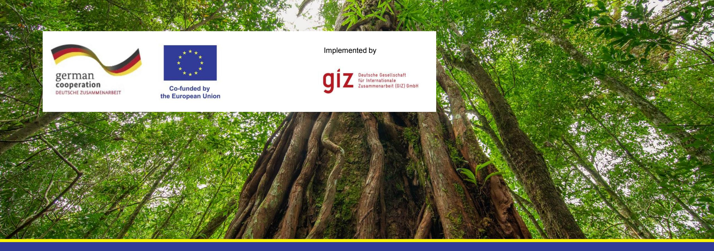

**EUDR ToT Day 1 - Setting the scene**

- Please introduce yourself indicating your name, the organisation you work for (if any), the experience you count on in the agricultural sector and your expectations for the training.
- Please let us know how you are here:

#### **Check-in and introductions**

#### SUNNY

CLEAR TO CLOUDY

UNCOMFORTABLE

STORMY WEATHER

I'm here and everything is fine with me

I still need a moment to arrive

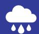

I can't be fully focused today, I have other things on my mind

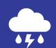

I am fully here and very excited about our training

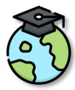

At the end:

✓ You have a clear understanding of the EUDR including relevant terms and definitions. ✓ You are comfortable talking about the EUDR in English and Thai. ✓ You know the implications of the EUDR for smallholder producers and small and mediumsized entities (SMEs) in Thailand. ✓ You are prepared to train smallholder producers and SMEs on these implications. ✓You have your own ideas on how to train smallholders and SMEs on these implications.

### **Objectives of the training**

## **What is the EUDR about**

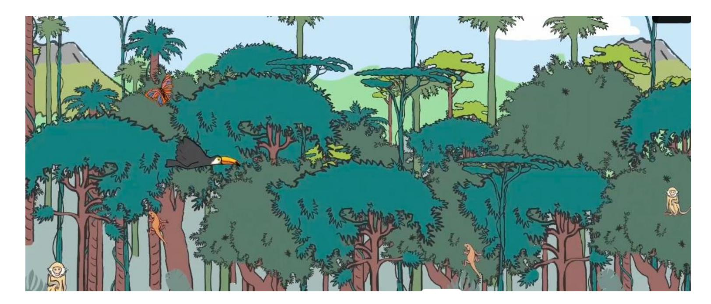

Smallholder Movie by the Team Europe Initiative:

[https://zerodeforestationhub.eu](https://zerodeforestationhub.eu/)

### **Timeline**

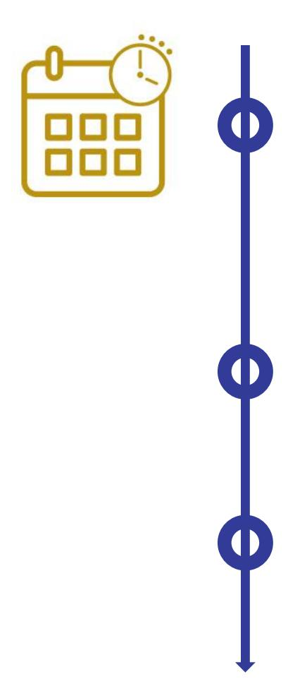

**June 29th, 2023**

EU Deforestation Regulation entered into force

**December 30th, 2025**

Rules begin to apply for medium and large operators and traders

**June 30th, 2026**

Rules begin to apply for micro and small enterprises

### **Objectives of the Regulation**

**Minimise the EU's contribution to deforestation and forest degradation** worldwide

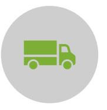

**Minimise the risk** of importing or exporting products/supply chains practices associated **with deforestation or forest degradation from and to the EU market**

**Increase EU demand** and trade in legal and **'deforestation-free commodities** and products.

Reducing global greenhouse gas emissions and biodiversity loss and protect natural carbon sinks

## **The EU Regulation on Deforestation-Free Products (EUDR)**

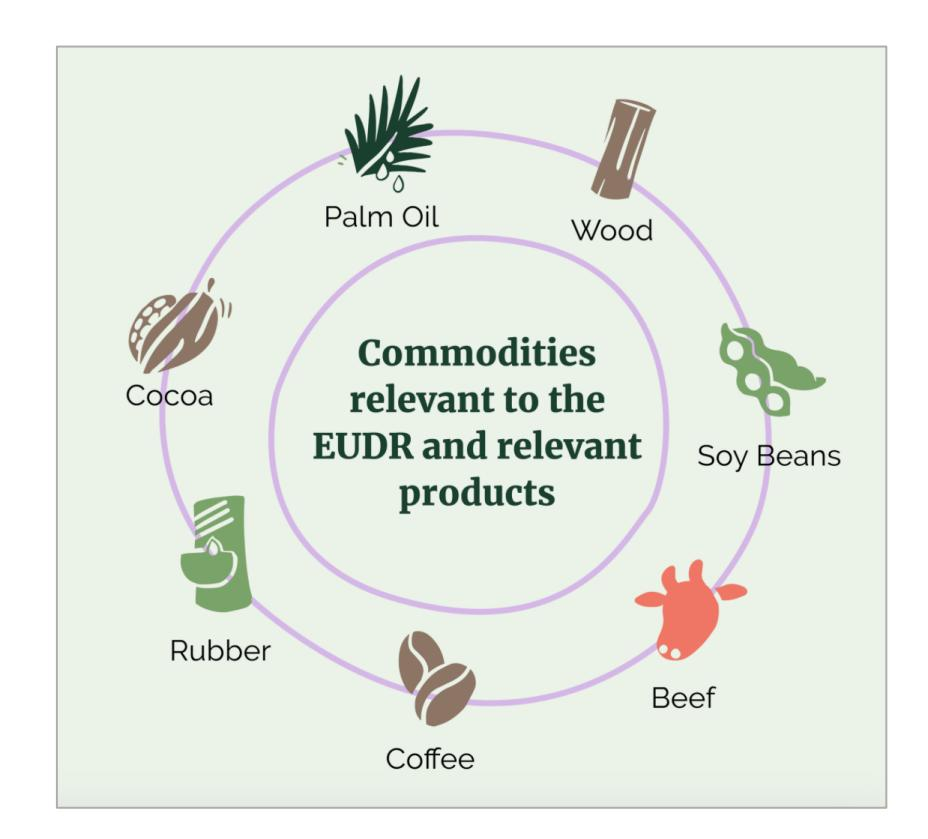

Relevant commodities and products

**Beef and leather, cocoa, coffee, natural rubber, palm oil, soy and wood** and certain derived products (see Annex I)

#### Scope

Applies to all relevant products that are **produced in the EU, imported** to the EU oder **exported** from the EU market (non-discriminatory)

#### Applies to:

**Operators** and **traders** demonstrating **due diligence** for **deforestation-free** and **legal** production of relevant commodities and products, including geocoordinates and traceability to plot of productions

#### **The EUDR explained**

#### **Requirement:**

**Commodities / (derived) products entering or leaving the European market are** 

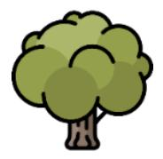

Deforestation-free = no conversion of forests as defined by FAO into agricultural land (agroforestry is considered as agriculture) and, in the case of wood products, no forest degradation after 31st December 2020

Legal according to relevant legislation of the country of production, including land use rights, applicable human and labour rights and free, prior and informed consent (FPIC)

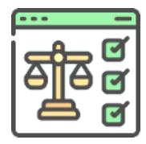

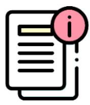

Covered by a due diligence statement (DDS)

#### **Main elements**

**Commodities / products entering or leaving the European market are** 

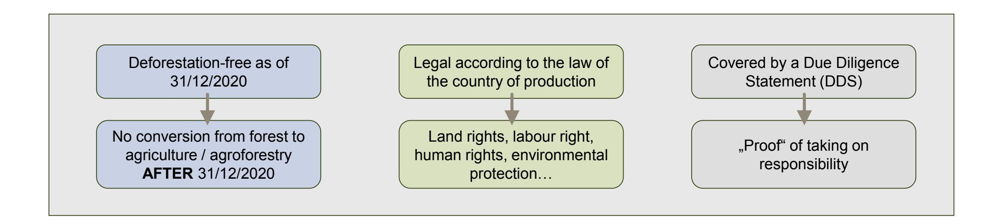

#### **Main elements cont`d**

**Commodities / products entering or leaving the European market are** 

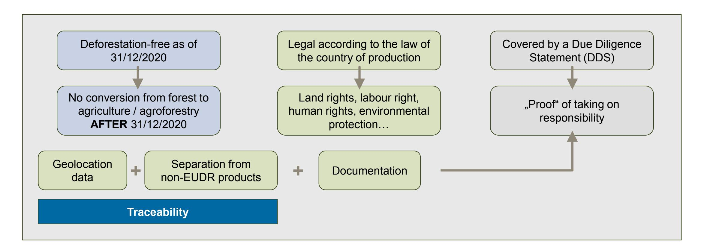

### **The EUDR explained**

#### **Due diligence obligations apply to**

Operators = company that places relevant product on the EU market or exports it from there (in case of products imported into the EU, this is the importing company)

Traders = company that makes available a relevant product within the EU market (further downstream from the operator, always EU established company)

#### **Law enforcement**

Competent authorities of EU Member States check those companies that must fulfill due diligence obligations

There are no checks on producers in third countries or sanctions on producers in third countries (unless the place a relevant product on the EU market themselves).

No direct obligations for producers and SMEs in outside the EU (Unless your are the importer of relevant commodities)

### **Due diligence obligations for companies**

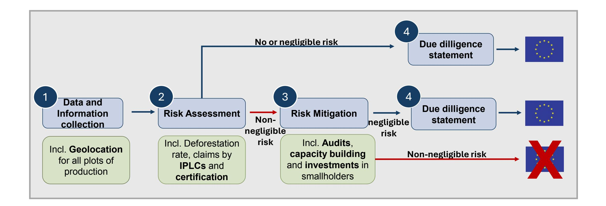

#### **Due diligence obligations**

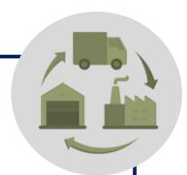

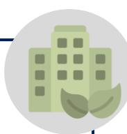

#### **For companies:**

- Data and information collection
- Risk assessment
- Risk mitigation
- Due Diligence Statement
- Take on penalties as applicable

#### **For supply chain actors in producing countries:**

- No direct legal obligations
- No fines or sanctions
- May respond to information requests by supply chain actors (regarding traceability and legal production)

#### **Benchmarking of producing countries**

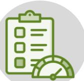

EU will classify all producing countries inside and outside the EU into different **risk categories – depending on the deforestation risks in the country**.

**Consequences** for operators and traders:

- **Low-risk**: simplified due diligence obligations for operators and traders + competent authorities of EU member states will control 1% of operators and traders
- **Standard-risk**: competent authorities of EU member states will control 3 % of operators
- **High-risk**: competent authorities of EU member states will control 9 % of operators ➢ Companies might prioritise sourcing from low-risk countries ➢ Benchmarking has little consequences for producers in third countries as companies must collect relevant information and documents also under simplified due diligence obligations in case of a low-risk country

#### **Law enforcement**

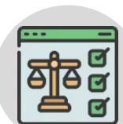

- EU Member States assign **competent authorities** that control operators and traders regarding − their due diligence systems and − whether or not relevant products are produced without deforestation and legally
- Competent authorities can impose significant **sanctions** on operators and traders, including fines of at least 4% of the annual EU-wide turnover in case of repeated infringements o Given the foreseeable significant fines, companies are likely to carefully fullfill their due diligence obligations
- There are no controls by EU competent authorities on producers in third countries.
- The competent authorities of EU Member States cannot impose any sanctions on producers or SMEs in third countries (unless they import a relevant product on the EU market themselves, thereby fulfilling the role of an operator, which is a very unlikely and rare scenario)

## **What does the EUDR mean for smallholders and SMEs outside the EU?**

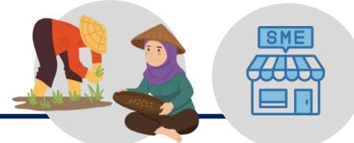

- The EU deforestation puts **requirements on companies** that
  - import relevant commodities and products,
  - sell relevant commodities and products that are produced in the EU on the EU market,
  - export relevant commodities and products from the EU,
  - trade with relevant commodities and products within the EU. ➢ As the EUDR does not prescribe any specific due diligence standard, each company sets up their own due diligence system, potentially resulting in different approaches towards their supplying smallholders and SMEs
- It does not include direct requirements for countries or third country producers.
- Smallholders who do not place relevant products on the EU market themselves are under no direct legal obligations. However, they might be asked by their business partners, for example buyers, to provide information on their production, especially on the land of production.

## **What does the EUDR mean for smallholders and SMEs outside the EU?**

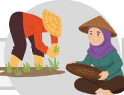

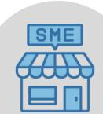

#### **Implications for smallholders Implications for SMEs**

- 1) Ensure that you source only from producers that produce without deforestation and legally
- 2) Collect the geolocation of the plots you source from
- 3) Seperate relevant EUDR compliant commodities from commodities of unknown origin or commodities that are not EUDR compliant at all stages of the supply chain
- 4) Submit relevant information & documents to your buyers

- 1) Do not deforest = do not convert forest into agricultural land, including agroforestry or rubber, palm oil or timber plantations
- 2) Produce legally = respect all relevant national legislation
- 3) Collect the geolocation of your plots where EUDR relevant commodities are produced (collected per plot)
- 4) Be ready to submit relevant information & documents to your buyers

## **When does the EUDR consider the conversion of forest to other land-use as deforestation?**

#### **Cut-off date**

If forest was converted into agricultural use after 31 December 2020 – whether human-induced or not 31 ธันวาคม 2563

There are **no sanctions** for producers and SMEs in third countries (as long as they do not place relevant products on the EU market themselves)

The EUDR is **mandatory legislation** of the European Union.

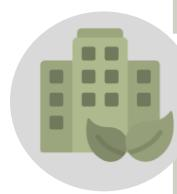

The EU deforestation regulation puts requirements **on companies, not on countries** or **third country producers**: It moves from voluntary action to a regulatory framework by obliging companies placing relevant products on the EU market to conduct **due diligence**.

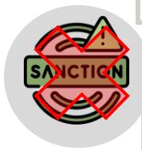

### **The EUDR is not a voluntary standard**

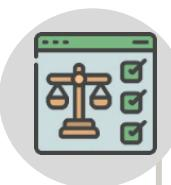

#### **To whom the EUDR applies**

The EU deforestation puts requirements on companies that place relevant products on the EU market, trade them on the EU market or export them from the EU market.

It does not include direct requirements for countries or third country producers.

Smallholders who do not place relevant products on the EU market themselves are under no direct legal obligations. However, they might be asked by their business partners, for example buyers, to provide information on their production, especially on the land of production.

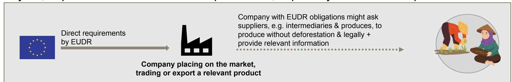

## **Definitions of roles in EUDR**

| Terms in the               |       |          |                         |                                                             |
|----------------------------|-------|----------|-------------------------|-------------------------------------------------------------|
| EUDR Operator ผู้ประกอบการ |       |          | Definition              | Examples Companies that import relevant commodities         |
| ( โรงงานผลิต               | น าเข |          |                         |                                                             |
| Trader จูา หน่าย           | า ้   | ส่งออก ) | them making available…) | (or derived products) into the EU Supermarket chains in the |
| า ผ ผ ้ คู้ ้              |       |          | market                  | EU                                                          |

### **Obligations for supply chain actors**

**Most obligations** are for **upstream operators**  (e.g. an importer of cocoa beans into the EU)

- **Exercise due diligence** and submit a **Due Diligence Statement (DDS)** on our IT platform
- Maintain an internal **due diligence system**
- Ensure traceability and separation of compliant goods from other goods

**Limited obligations** for **traders (e.g. retailer) and downstream operators**:

(e.g. processor, manufacturer when components of their products have already been subject to a DDS):

Important: "traders" in EUDR sense are only companies established in the EU that trade with relevant products on the EU market = not traders in the traditional sense as agricultural traders

#### **EUDR accompanying measures**

**Frequently Asked Questions (FAQ):** Provides information to national authorities, EU operators and other stakeholders for the implementation.

Link.

**Guidance document** on thematic areas in the pipeline (e.g. definition of agricultural use, legality or certification). Link.

**Information system (Article 33):** Digital system to submit Due Diligence Statements. Link and Registration.

**EU Observatory on deforestation and forest degradation**. Link to Map. More information here.

#### **Important definitions**

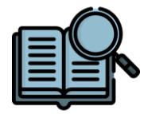

Further explanations are in the Frequently Asked Questions as well as the Guidance document.

The following slides highlight important definitions of the EUDR.

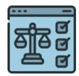

All definitions can be found in the legal text.

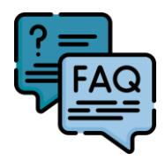

# **Key Definitions from EUDR Legal Text**

### **EUDR Legal Text**

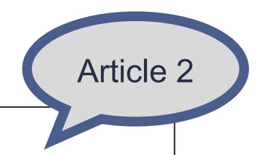

For the purposes of this Regulation, the following definitions apply:

1. (1) 'relevant commodities' means cattle, cocoa, coffee, oil palm, rubber, soya and wood;
2. (2) 'relevant products' means products listed in Annex I that contain, have been fed with or have been made using relevant commodities;
3. (3) 'deforestation' means the conversion of forest to agricultural use, whether human-induced or not;
4. (4) 'forest' means land spanning more than 0.5 hectares with trees higher than 5 metres and a canopy cover of more than 10 %, or trees able to reach those thresholds in situ, excluding land that is predominantly under agricultural or urban land use;
5. (5) 'agricultural use' means the use of land for the purpose of agriculture, including for agricultural plantations and set-aside agricultural areas, and for rearing livestock;
6. (6) 'agricultural plantation' means land with tree stands in agricultural production systems, such as fruit tree plantations, oil palm plantations, olive orchards and agroforestry systems where crops are grown under tree cover; it includes all plantations of relevant commodities other than wood; agricultural plantations are excluded from the definition of 'forest';
7. (7) 'forest degradation' means structural changes to forest cover

#### **Definition: Forest**

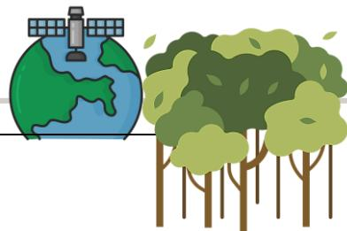

#### **Forest:**

= land spanning > 0.5 ha + trees higher than 5 m + a canopy cover of > 10%

(excludes land that is under agricultural or urban land use)

Forest in FAO's Definition: land spanning more than 0,5 hectares with trees higher than 5 metres and a canopy cover of more than 10 %, or trees able to reach those thresholds in situ, excluding land that is predominantly under agricultural or urban land use

There is no mechanism to recognize national forest definitions. In case there is a national forest definition different to the EUDR's. both definitions apply due to the legality requirement.

"ป่า" หมายถงึ พืน้ ทีด่ นิ ทีม่ ขี นาดไม่ต ่ากวา่ 0.5 เฮกตาร ์ (3.125 ไร่) โดยพืน้ ทีด่ งักล่าวนีม้ ตี นไม้ปกคลุมไม่น้อยกว่าร ้อยละ ้ 10 ของพืน้ ที ่ และตน้ไมด้งักล่าวมคี วามสูงมากกว่า 5 เมตร เมือ่ โตเต ็ มที ่ในสภาพธรรมชาติโดยพืน้ ทีด่ งักล่าวไม่รวมทีด่ นิเพือ่ การเกษตรหรอืพีน้ ที ่ เมอืง

### **Definition: Deforestation**

Deforestation is defined as the conversion of forest to agricultural use, whether human-induced or not.

'agricultural use' means the use of land for the purpose of agriculture, including for agricultural plantations **of natural rubber and palm oil**, set- aside agricultural areas, **agroforestry** and for rearing livestock

**"การท าลายป่ า"** หมายถงึ การแปลงสภาพป่าเป็ นพืน้ ทีก่ ารเกษตร ไม่วา่ เกดิ จากมนุษย์หรือไม่ก็ตาม

"การใชป้ระโยชนเ์พือ่ การเกษตร" หมายถงึ การใชท้ีด่ นิเพือ่ เกษตรกรรม ซึ ่งรวมถงึสวนเกษตร และทีด่ นิ จดั สรรเพือ่ การเกษตร และทีด่ นิเพือ่ การปศสุ ตั ว ์

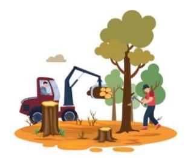

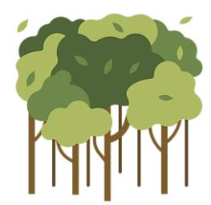

For example, oil palm plantations fall under 'agricultural use' and are not considered a 'forest' under the EUDR. Therefore, conversion of forest into oil palm plantations is considered as deforestation under the EUDR.

### **Definition: Forest Degradation**

The conversion of **primary forests** or **naturally regenerating forests** into plantation forests or into other wooded land; or primary forests into planted forests;

**"การท าใหป้่าเสือ่ มโทรม"** หมายถงึ มกี ารเปลีย่ นแปลงผนื ป่าในรปู แบบของ

ก) ป่าปฐมภูมิหรือป่าที่เกิดใหม่ตามธรรมชาติถูกแปลงเป็นสวนป่าหรือป่าพงรูปแบบต่าง ๆ (other wooded land) หรือ ข) ป่าปฐมภูมิถูกแปลงเป็นป่าปลูก

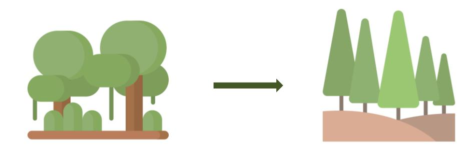

#### **Definition: Agroforestry and EUDR**

Agroforestry systems are not considered as forests, but agricultural land.

- Products from an agroforestry system established after the cut-off date, where forest was converted into agroforestry are **not considered "deforestation-free"** and cannot be placed on EU market.
- Products from an agroforestry system established prior to the cut-off date or from agroforestry systems established on non-forest land after 2020, are **considered as "deforestation-free"** and can be placed on EU market.

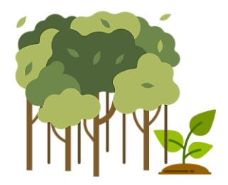

#### **Definition: Deforestation-free**

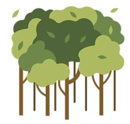

means that the relevant products contain, have been fed with or have been made using, relevant commodities that were produced on land that **has not been subject to deforestation** after 31 December, 2020; and in the case of relevant products that contain or have been made using wood, that the wood has been harvested from the forest **without inducing forest degradation** after 31 December, 2020

ผลิตภัณฑ์"ปลอดการท าลายป่า" หมายถึง

- ผลติ ภณั ฑใ์ดก ็ ตามทีป่ ระกอบดว้ย ถกู เลีย้งดว้ยหรอืผลติโดยใชส้นิ คา้โภคภณั ฑท์ีม่ าจากพืน้ ทีท่ ี ่ไม่มี การท าลายป่าหลงัวนั ที ่ 31 ธันวาคม พ.ศ. 2563 และ
- กรณีของผลติ ภณั ฑท์ีม่ ไีมเ้ป็ นส่วนประกอบหรอืท าดว้ยไม้ไมด้งักล่าวไดม้ าจากป่าโดยปราศจากการ ท าใหเ้กดิ ป่าเสือ่ มโทรมหลงัวนั ที ่ 31 ธันวาคม พ.ศ. 2563

#### **Definition: Legal production**

The laws applicable in the country of production concerning the legal status of the area of production in terms of:

- (a) **land use rights**; สทิ ธกิ ารใชท้ีด่ นิ
- (b) **environmental protection**; การปกป้องสิ ่งแวดลอ้ม
- (c) forest-related rules, including forest management and biodiversity conservation, where directly related to wood harvesting; กฎที ่ เกีย่ วกบั ป่าไม้ซึ ่งรวมถงึการจดั การป่าและความหลากหลายทางชวีภาพดว้ย ซึ ่งทั ้งหมดเกีย่ วขอ้งโดยตรงกบั การไดม้ า ของไม้

(d) third parties' rights; สทิ ธขิ องบคุ คลทีส่ าม

Important to assess what is relevant legislation: Does the law concern the legal status of the area of production? Is the law relevant for the EUDR's objectives = reduction of deforestation, forest degradation, climate change, biodiversity loss

#### **Definition: Legal production**

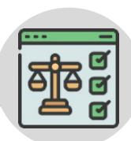

The laws applicable in the country of production concerning the legal status of the area of production in terms of:

- (e) labour rights; สิทธิแรงงาน
- (f) human rights protected under international law; สทิ ธมินุษยชนที ่ไดร้บั การคมุ้ครองภายใตก้ฎหมายระหว่าง ประเทศ
- (g) the principle of free, prior and informed consent (FPIC), including as set out in the UN Declaration on the Rights of Indigenous Peoples;

หลักการยินยอมโดยสมัครใจ (FPIC) รวมถงึตามที ่ระบไุ วใ้นปฏญิ ญาสหประชาชาตวิ่าดว้ยสทิ ธขิ องชนพืนเมือง ้ ;

(h) tax, anti-corruption, trade and customs regulations.; ระเบียบภาษี การต่อต้านการทุจริต กฎข้อบังคับ การค้า และศุลกากร

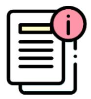

Main obligations applicable to operators\* = companies that place relevant products on the EU market for the first time or export them from the EU market

### **Definition: Due Diligence**

**Information requirements (Art. 9)** Amongst others, geolocation must be collected -> Strict traceability linking the commodity to the plot of land of production. Using geolocation coordinates is simplest and most cost-effective way of obtaining the necessary geographic information.

**Risk assessment (Art. 10)** Criteria amongst others: prevalence of deforestation, reasoned claims by indigenous peoples, risk of circumvention, certification,…

**Risk mitigation (Art. 11)** Amongst others, requiring additional information + supporting suppliers, in particular smallholders, through capacity building and investments

\*also non-SME companies that trade with relevant commodities and products within the EU market must fulfill due diligence, but this is of lesser relevance for stakeholders in Southeast Asia

# **Due Diligence Statement (DDS) in Thai รายงานการตรวจสอบสินค้า**

### **Definition: Geolocation**

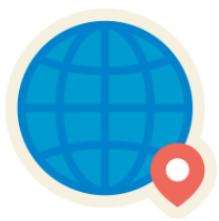

Operators must submit the geolocation of all plots of land where relevant commodities were produced:

- Plots of land with less than 4 ha and cattle establishments: one single geolocation point (latitude and longitude) required
- For plots larger than 4 ha used for commodities other than cattle: polygons outlining the shape of the plot of land are necessary.

**"ตา แหน่งทางภูมศิ าสตรข์ องทีด่ นิ "** หมายถงึ พกิ ดั ทางภมู ศิ าสตรข์องทีด่ นิโดยแสดงละติจูดและลองจิจูด อย่างน้อยอย่างละ 1 จุด และใช ้ทศนิยมอย่างน้อย 6 หลกั ส าหรบั ทีด่ นิ ซึ ่งใชใ้นการผลตสินค้าโภคภัณฑ์ ิ นอกเหนือจากปศสุ ตั ว ์ซึ ่งมขี นาดมากกว่า 25 ไร่ จะตอ้งระบพุ กิ ดั ภมู ศิ าสตรข์องทีด่ นโดยใช ้รูปปิดหลาย ิ เหลีย่ ม ทีม่ จีดุ ละตจิดู และลองจจิดู เพยีงพอเพือ่ ระบขุ อบเขตทีด่ นิ

### **Definition: Geolocation**

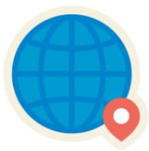

The geographical location of a plot of land described by means of latitude and longitude coordinates corresponding to at least one latitude and one longitude point and using **at least six decimal digits** for plots of land of more than four hectares used for the production of the relevant commodities other than cattle, this shall be provided using polygons with sufficient latitude and longitude points to describe the perimeter of each plot of land;

**"ตา แหน่งทางภูมศิ าสตรข์ องทีด่ นิ "** หมายถงึ พกิ ดั ทางภมู ศิ าสตรข์องทีด่ นิโดยแสดงละติจูดและ ลองจิจูดอย่างน้อยอย่างละ 1 จุด และใช ้ทศนิยมอย่างน้อย 6 หลกั ส าหรบั ทีด่ นิ ซึ ่งใช ้ในการผลิตสินค้า โภคภณั ฑน์อกเหนือจากปศสุ ตั ว ์ซึ ่งมขี นาดมากกว่า 25 ไร่ จะต้องระบุพิกัดภูมิศาสตรข์องทีด่ นิโดยใชร้ปู ปิดหลายเหลีย่ ม ทีม่ จีดุ ละตจิดู และลองจจิดู เพยีงพอเพือ่ ระบุขอบเขตทีด่ นิ

## **Key messages on obligations**

**Smallholders who are not placing products on the EU market are under no direct legal** 

- **obligations Operators are the ones who must fulfill due diligence requirements**
- However, smallholders may be asked to **provide information by their business partners**  such as geolocation of the plots of land, Information on the legal acquisition and possession of the plots of land
- Additionally, the partners may request additional documents or verify the information through surveys or audits.
- No obligations for SME traders except collecting and keeping information and making it available on demand

### **Further readings**

List of products covered under

the EUDR,

definitions are in the EUDR Legal

Text

EUDR Legal Text

Deforestation Regulation implementation

Product coding system

FAQ and Guidance

### **Exercise 1 - What is the EUDR?**

Walk across the room until the bell rings. Find the person closest to you and discuss the EUDR in Thai:

- Explain the EUDR to each other.
- Identify questions that may pop up.

### **Feedback session**

**How did you perceive explaining the EUDR to each other?**

**What was easy/ difficult?**

**Which questions popped up?**

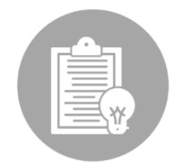

### **Recap: Terms and Definitions**

- Official definitions in English
- Official definitions in Thai
- Explanations of the definitions that can be used for SMEs/ for farmers

### **Wrap up and next steps**

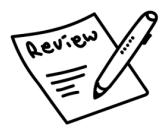

Review: Covered topics and elaborated results

Are there any open questions?

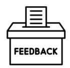

Feedback: From the group to the trainers on Day 1

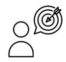

Revisions of expectations: any met already?

Outlook for Day 2

#### **Most important take aways**

- **Smallholders who do not place relevant products on the EU market themselves are under no direct legal obligations**
- **Operators must fulfil due diligence obligations** (= data and information collection, risk assessment, risk mitigation, due diligence statement – see Article 4 and 8 of EUDR)
- Operators may ask smallholders for help in terms of **data and information of the produced product**: − 1. Deforestation-free: Product was not produced on plot of land that was converted from forest as defined by FAO into agricultural land after 31 December 2020.
  - Agroforestry, e.g. of coffee, is considered as agricultural land.
  - You cannot place on the EU market products from land where forest was converted into agroforestry after 2020
  - You can place products on EU market from land which has been agroforest/agricultural land before 31 December 2020

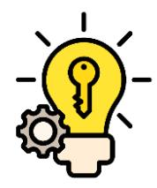

#### **Most important take aways**

- − 2. Produced in accordance with relevant national legislation of the country of production − 3. Traceable to the plot of production (geolocation data) + segregated from non-compliant commodities
  - It is sufficient to collect the data once, unless your production area changes.
  - No personal information is needed to collect geoinformation data

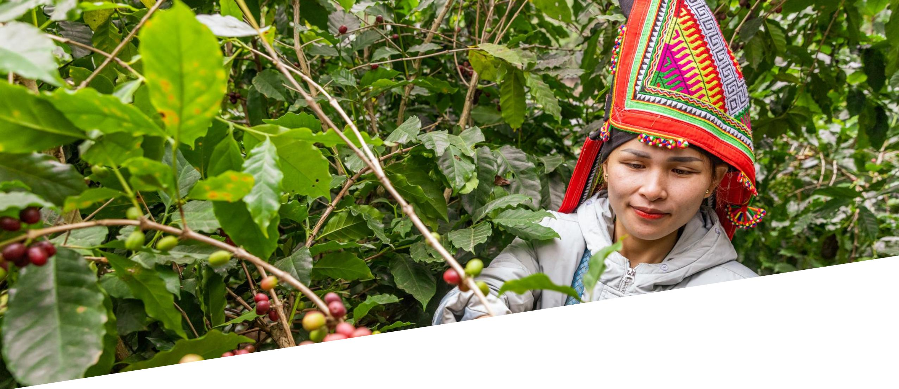

**EUDR ToT Day 2**

## **Check-in on Day**

What are your main takeaways from Day 1?

Any open questions/ comments?

Agenda of the day

#### **Exercise - Potential EUDR benefits for farmers**

In pairs:

- Revise the potential benefit or the keyword you have received.
- Discuss to what extent you agree/disagree with your benefit OR
- Discuss to what extent the keyword could represent a potential benefit.
- Plenary discussion on your findings including a summary on potential benefits.

#### **Potential benefits of EUDR to farmers I**

Owning geolocation data gives smallholders a stronger, more independent position in the value chain which can lead to fairer prices for smallholders as it allows for more direct supply chains.

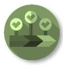

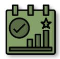

A more transparent and traceable value chain can help smallholders to reach new markets and to focus on the sustainability of their products.

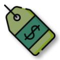

Focusing on sustainable production can also lead to fairer prices for smallholders.

In case of violations of land rights, smallholders or representatives can submit substantiated concerns to companies and EU competent authorities and can thereby defend land rights.

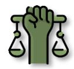

The EU is strengthening the cooperation with partner countries, involving smallholders and promoting their interests.

#### **Potential benefits of EUDR to farmers II**

Smallholders can benefit from technical support or capacity building from business partners who depend on information exchange and who should support smallholders as part of risk mitigation measures.

In their risk assessment, companies must consult and cooperate with indigenous groups and local communities. This could increase marginalised people's voices and outreach and make their claims heard. In case these consultations demonstrate that indigenous groups or local communities are disadvantaged, companies are obliged to undertake risk mitigation measures such as the ones described above.

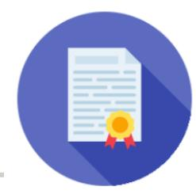

#### **The role of certification schemes I**

- Certified products do not automatically comply with the EUDR. Companies must always fulfill due diligence obligations – no matter if the product is certified or not.
  - The EUDR only says that certification is one of 14 criteria that companies should consider in the risk assessment.
- Nevertheless, certification can support companies with meeting EUDR requirements:
  - Certified products have often a reduced risk of deforestation and illegality (depending also on the certification scheme)
  - Buying certified products supports companies with collecting relevant information that are required to provide under the EUDR.
  - Some certification schemes offer support programs for smallholders whereby they could implicitly get also support with EUDR

Clearing up myths

#### **The role of certification schemes II**

- Certification schemes may offer support to fulfill EUDR requirements on topics such as mapping geolocation data or indicators if you meet certain legality requirements, but they do not replace the responsibility of operators to do their due diligence.
- To receive more specific information, please get in touch with your cooperative or your certification scheme.

## **Role of certification in EUDR**

**Input: Traceability along the supply chain**

## **Definition: Traceability**

"Traceability refers to the ability of an actor to link a product or unit of material with information about its history of locations, owners, and transformations between points in the supply chain, such as from production site to end user.

The information associated with commodities also includes sustainability aspects at the production site, notably forest loss".

(World Resources Institute (2023) - Traceability and Transparency in Supply Chains for Agricultural and Forest Commodities)

## **Example: palm oil supply chain**

### **Traceability (Art. 2 (28) + Art. 9)**

- It is sufficient to collect the data **once**, unless the production area changes.
- National traceability systems and efforts by cooperatives or certification bodies on geolocation data mapping can be used if they meet the requirements.
- If the product is not exported to the EU market directly, the importing business partner needs **to verify and prove that the geolocation is correct**.
- **No personal information** is required for the collection of GPS data.
- To fulfill the EUDR requirements on traceability, **geolocation data** from the plots of land, where the commodities are being produced is necessary **AND** these **commodities may not be mixed with other products** along the whole value chain so each batch can be traced with the relevant geolocations.

#### **Data Ownership**

- Data ownership is the act of having **legal rights** and **complete control** over a single piece or set of data elements. It defines and provides information about the rightful owner of data assets and the acquisition, use and distribution policy implemented by the data owner.
- The data owner has the exclusivity of the right to **read, edit and delete** the data and **responsibility** and **accountability** for it.
- Data tend to be considered a competitive asset, costly to produce and produced by different actors for different purposes. Therefore, data is often not shared but siloed and not accessible and usable by farmers which reflects a **data ownership challenge**.
- Need to ensure that farmers have access to their data so they can benefit from **data ownership and sovereignty**.

### **Data Ownership – specifics in Thailand**

#### Key principles of the PDPA:

- The personal data under the PDPA refers to any information pertaining to a person, which enables the identification of such person, whether directly or indirectly, but not including the information of the deceased persons in particular.
- The **collection of personal data must be limited to the extent necessary**  in relation to the lawful purpose of the data controller.
- The processing of the personal data shall comply with the lawful bases as prescribed in the PDPA, such as **consent, contractual obligation, and legitimate interest**.
- The processing of certain categories of the personal data, i.e., the sensitive personal data, which includes health data and criminal records, shall be subject to more stringent requirements.
- When transferring the personal data to a foreign country, the destination country shall have **adequate personal data protection standards**.
- The data controller and the data processor must provide appropriate **security measures**  in relation to the process of the personal data. *(opendevelopmentmekong.net) (multilaw.com)*

*Personal Data Protection Act B.E. 2562 (2019) (English version) - OD Mekong Datahub* 

*Summary of the Act: Data Protection Guide Thailand* 

#### **Group discussion in plenary**

- Where (at what level/ which actor and in which sectors) do you see it feasible to build traceable supply chains in Thailand? Where would you see challenges arise?
- Who would be necessary stakeholders to support traceability along the supply chain?
- To what extent are current efforts meeting these expectations?
- What is necessary for smallholders and their practices to ensure a fully traceable supply chain (think about intermediaries)?

## **Exercise - Traceability along your supply chain**

Group work (2-3 groups) - Traceability along your supply chain:

- With the provided items build a realistic supply chain.
- For each step in the supply chain indicate where and how EUDR implications become relevant.
- Indicate which type of data is needed to collect from whom and pass on to whom.
- Indicate how to handle the product (specific label? Mixing with other products?)
- Present your results back in plenary.

**Input and exercise collecting geolocation data with farmers**

## **Geolocation and EUDR**

## **Examples latitude - longitude**

**13°45′00.00″ North, 100°31′01.20″ East.**

**13.776551555966883, 100.57397323414897**

**7.19537700558181, 100.58995791835933**

Source: Planet Fact

### **Collecting Geolocation**

- **1. Download app (e.g. Google Earth) on your mobile**
- **2. Registration, allow access to your location**
- **3. Turn on your GPS and walk on the edges of the field** ▪ Recommend a polygon for your plot of land ▪Plan ahead where will you stop, the walking route
- **4. Complete the loop, end at the starting point**
- **5. Export as KML file**

## **Traceability + Forest Monitoring**

**Traceability and mapping of sourcing areas Detailed forest monitoring**

**change - OK**

**Deforestation in sourcing region**

## **Geoinformation for EUDR**

#### **Geolocation data collection**

It's time to test:

- Collect geolocation data with Google Earth.
- Plenary discussion : o How easy / difficult was it to collect the data? o Which questions / challenges popped up? o How could these be overcome?
- Brainstorming: o To what extent would farmers be able to collect this data? o How to organise geolocation data collection as farmer organisation?

#### **Wrap up and next steps**

Review: Covered topics and elaborated results

Are there any open questions?

Feedback: From the group to the trainers on Day 2

Revisions of expectations: any met already?

Outlook for next day

**EUDR ToT Day 3**

### **Check-in on Day**

Any open questions/ comments from yesterday?

How was your experience with collecting geolocation data?

Agenda of the day

#### **Preparation of conducting own trainings: SME training and smallholder training**

(refer here to material in the guidebook as well)

### **Training and facilitation skills**

- Motivate participants.
- Break down topics and sessions according to needs and capacities of participants.
- Plan the flow of the sessions based on circumstances (how much time is available, what are cultural specifics…?).
- Consider a suitable training location (at a production/ processing site, warehouse,…).
- Consider a suitable training approach (practical, theoretical, show-casing…).

### **Different training methods**

Participants learn best when trainers use different methods throughout a training session.

A mix between sharing information through lectures/ inputs, practical exercise and discussing the respective topic among themselves generates the best training results.

Source: Climate change and Vietnamese coffee production – Training Manual, UTZ 2016

#### **Preparation of the trainings**

Agenda/ session-flow, ok?

Who can take on which role?

Who would like to facilitate which session?

Which material is needed? What do we have/ what is left to prepare?

Survey?

### **Wrap up and next steps**

Review: Covered topics and elaborated results

Are there any open questions?

Open feedback round

Individual survey

Evaluation of the training

**EUDR ToT – Recap SME and Smallholder training**

### **Check-in on Day**

What are your main takeaways from the SME training and the farmer field day?

How satisfied are you with your own performance?

Agenda of the day

### **Exercise - World Café**

Four questions on flip chart paper in 4 corners of the room:

- 1. What worked well in the SME training?
- 2. How would you improve the SME training concept?
- 3. What worked well in the farmer training?
- 4. How would you improve the farmer training concept?

### **SME training reflection**

✓ Target group reached? ✓ Timing? ✓ Key messages sufficient? Sufficiently clear? ✓…

### **Farmer training reflection**

✓ Timing? ✓ Geolocation data collection: sufficient care taken to collect good quality-data? ✓ Key messages sufficient? Sufficiently clear? ✓Didactic approaches suitable for target group?

#### **Exercise - Self-reflection**

- For yourself think of how you will go about conducting EUDR trainings. Note down your thoughts.
- Discuss in pairs:
  - Who would you train and how would you approach your training participants?
  - How many participants would you foresee?
  - Where would you train?
  - How would you go about preparing your trainings?
  - Which training material would you need?
  - Which additional support would you need?
  - Where would you turn to for support?
  - What questions to clarify before the actual training?

#### **Thank you for your participation in the Training of Trainers on EUDR**

#### **Design and Photo Credits**

- GIZ / Stella Marraccini
- helfferich | gestaltung
- [Canva 2025,](https://www.canva.com/projects) Images (as used [on slide: 4,28-32,37,38,41-46,48,49,52,53,59,60-62,65,66,69,70,72,74-77,79 and 80-83\)](https://www.flaticon.com/de/)
- Flaticon Images (as used on slide: 6,7,9,12,14-16,20,21,25,34,35,39,42,50,51,62,74 and 75)
- Planet Fact, http://planetfacts.org/latitude/ (September 19, 2025)

This slide deck was co-funded by the European Union and BMZ. The content of this is the sole responsibility of the authors and does not necessarily reflect the views of the EU or the BMZ. The information in this guide, or upon which this guide is based, has been obtained from sources the authors believe to be reliable and accurate. While reasonable efforts have been made to ensure that the contents of this publication are factually correct, GIZ GmbH does not accept responsibility for the accuracy or completeness of the contents of this publication. The mention of specific companies or products of manufacturers, whether or not these have been patented, does not imply that these have been endorsed or recommended by GIZ GmbH in preference to others of a similar nature that are not mentioned. The views expressed in this information product are those of the authors and do not necessarily reflect the views or policies of GIZ GmbH or FAKT GmbH. Unless stated otherwise, all figures used in this report were created by FAKT internally. It is based on the status and information available as per March 2025.

The EU Deforestation Regulation is a key initiative to fight deforestation; the European Union and its Member States are committed to pursue its ambitious objectives.

Based on the available information, the Commission cannot take the risk of disruptions linked to the EUDR IT System which would negatively impact companies and the overall objectives of EUDR.

Despite best efforts to address these issues in time, it did not prove possible to have sufficient guarantees that said system would perform as expected. As of October 2025, the European Commission therefore proposed a postponement by one year of the entry into application of the EUDR, to 2027. By the end of 2025, EU Co-Legislators (the European Council, and European Parliament) will consider the need for additional time and measures to strengthen the IT System, and guarantee the smooth entry into application of EUDR, to minimise uncertainty for authorities and operational difficulties for stakeholders in the EU and in third countries. Please check the latest on: [https://environment.ec.europa.eu/topics/forests/deforestation/regulation-deforestation-free-products\\_en](https://eur01.safelinks.protection.outlook.com/?url=https%3A%2F%2Fenvironment.ec.europa.eu%2Ftopics%2Fforests%2Fdeforestation%2Fregulation-deforestation-free-products_en&data=05%7C02%7Cjoy.heitlinger%40giz.de%7C1517ef67d2334ff9606008de02590bbc%7C5bbab28cdef3460488225e707da8dba8%7C0%7C0%7C638950778636685407%7CUnknown%7CTWFpbGZsb3d8eyJFbXB0eU1hcGkiOnRydWUsIlYiOiIwLjAuMDAwMCIsIlAiOiJXaW4zMiIsIkFOIjoiTWFpbCIsIldUIjoyfQ%3D%3D%7C0%7C%7C%7C&sdata=b8vliWhGmTArtA4IDLY1fVa0MwArvtWMKFB77k3GCN4%3D&reserved=0)

Meanwhile, the EU Delegations will continue our close cooperation and dialogues with third countries and stakeholders outside the EU to best use the time available to support their preparations.

#### **Disclaimer**