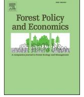
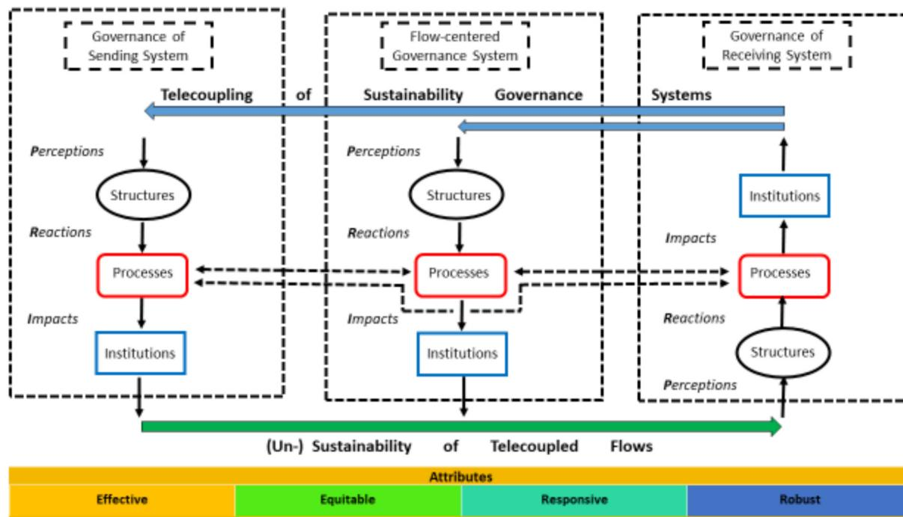
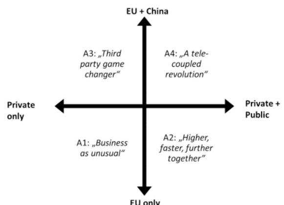

## Telecoupling of governance systems under the EU deforestation regulation: Scenarios for the Brazilian beef and soy value chains

Jochen Dürra,\*, Thomas Dietzb, Jan Börnerc

a University of Bonn, Center for Development Research (ZEF), Germany

b University of Muenster, Institute for Political Science, Germany

c University of Bonn, Center for Development Research (ZEF) / Institute for Food and Resource Economics (ILR), Germany

### ARTICLE INFO

**Keywords:**  
Land use  
Deforestation-free commodities  
Forest conservation  
Brussels effect

### ABSTRACT

Commodity imports by the European Union (EU) are an important driver of land use change in agricultural producer countries. The new EU Deforestation Regulation (EUDR) encompasses seven relevant commodities that can only enter the EU market if they are certified deforestation-free. The EUDR may lead to changes in land use governance and value chain governance of major trading partner countries, which can be described as telecoupling at the policy level. This study develops ‘telecoupling of governance systems’ conceptually and presents a generally applicable framework. The framework is then applied to the EUDR. Based on document analyses and expert interviews, we discuss four possible scenarios of the varying impacts of the EUDR on forest conservation. If only the private sector adapts to EUDR, a ‘business as unusual’ scenario is likely to prevail, which can turn into a ‘higher, faster, further together’ scenario if coupled with public policies. If other countries such as China adopt similar measures, it can lead to a ‘third-party game changer’ or even a ‘telecoupled revolution’ for environmental governance systems in Brazil. However, the experience with the EUDR in Brazil so far is mixed. On the one hand, telecoupling between environmental governance systems can be made difficult through non-participatory processes and domestic and international economic and political situations, which can lead to rejections in producer countries. On the other hand, telecoupling between environmental governance systems can have a significant impact on deforestation if linked to national systems and supported by international cooperation and coordination.

### 1. Introduction

International trade in agricultural and forest commodities continues to be strongly associated with tropical deforestation (Pendrill et al., 2022). Trade agreements, such as the European Union (EU)–Mercosur deal, may exacerbate trade-induced environmental degradation (Arima et al., 2021). The EU is a major importer of forest-risk commodities (EC, 2021a). The EU Deforestation Regulation (EUDR) was approved in June 2023. It is a mandatory due diligence regulation aimed at reducing the EU’s contribution to deforestation-related greenhouse gas emissions and biodiversity loss. It covers seven forest-risk commodities, namely, cattle, cocoa, coffee, oil palm, soya, rubber and wood, as well as many derivatives. These commodities and products are allowed in European markets only if they are deforestation-free, produced in accordance with the relevant legislation of the country of production and covered by a due diligence statement (EU, 2023).

The expansion of land for soy and beef production is a major reason for deforestation in Brazil, mainly in the Amazon and the Cerrado regions, and this is partly driven by EU demand. Such remote socio-economic and environmental relationships between regions connected through trade are described by the concept of ‘telecoupling’ (Liu et al., 2013; Newig et al., 2020). This concept is often illustrated by global commodity chains, such as the soy trade between Brazil and China, the most important importer of Brazilian soy, followed by domestic consumption and EU imports (Yao et al., 2018). Soy plays an important role in indirectly driving deforestation (Trase insights, 2020). This is because although soybean expansion on recently deforested areas in the Amazon has slowed down and most of it has occurred on existing pastures, this conversion is offset by the continued expansion of livestock into existing forests. However, most of the cattle-related deforestation is linked to the domestic market and only 13% to exports (zu Ermgassen et al., 2020).

The EUDR is an attempt to govern such commodity flows to influence

\* Corresponding author.

E-mail addresses: [jduerr@uni-bonn.de](mailto:jduerr@uni-bonn.de) (J. Dürr), [thomas.dietz@uni-muenster.de](mailto:thomas.dietz@uni-muenster.de) (T. Dietz), [jborner@uni-bonn.de](mailto:jborner@uni-bonn.de) (J. Börner).

sustainability outcomes in distant parts of the world, that is, to introduce telecoupled governance systems that can mitigate deforestation worldwide. Telecoupling poses challenges for effective governance responses, such as the lack of knowledge of complex value chain flows (Newig et al., 2020). This has triggered an increased trend towards traceability and transparency in value chain governance (Mol and Oosterveer, 2015). As a demand-side measure, EUDR serves as a response to such complex value chains. However, governing telecoupled systems, such as international commodity trade, is complex (Newig et al., 2019). It involves place- and flow-based governance approaches at different levels, with multiple public and private actors, policy instruments and their interactions (Cotta et al., 2022). Our understanding of how institutions emerge and change in telecoupled systems is very limited (Eakin et al., 2017). In particular, there are few studies on the mechanisms driving environmental policy innovation in telecoupled agri-food governance systems (Sellare et al., 2022).

We fill this research gap in the present study. Our objective is to understand how a change in the EU's environmental governance system, as the 'receiving system' of commodity flows, affects the 'sending system', that is, a producer country such as Brazil. For this purpose, we discuss telecoupled governance systems conceptually and develop a corresponding framework. We focus on the perception of key actors, their reactions and the potential impacts on the sending system. We take the EUDR and the supply chains of beef and soy produced in Brazil as a case study to answer the following research questions (RQs), with each addressing a specific governance dimension within the context of telecoupled systems:

- RQ1 (Perception of political process): How do actors perceive the political process that led to the EUDR?
- RQ2 (Policy perception and evaluation): How do actors assess the EUDR and the main challenges of adapting to it?
- RQ3 (Political reactions): How do actors react in relation to the EUDR and what strategies are they developing in reaction to it?
- RQ4 (Policy impacts): Will the EUDR strengthen deforestation-related policies and reduce deforestation?
- RQ5 (Socio-economic impacts): What are the main expected costs of the EUDR?
- RQ6 (Political reactions of other receiving systems): Will other trading partners adopt legislation similar to that of the EUDR?

We adopt a qualitative empirical approach to identify the mechanism at work in this context. Based on the results, we create four scenarios that indicate how telecoupling of governance systems can affect deforestation in Brazil to varying degrees.

The article is structured as follows. We start by reviewing theoretical perspectives on telecoupled governance systems and develop a generally applicable conceptual framework. The following section introduces how existing governance systems in Brazil have attempted to combat deforestation. The EUDR is introduced as a new externally imposed policy with theoretically plausible alternative outcomes. Section 3 presents the analytical scheme, characterised by perceptions, reactions and impacts (PRIs) and the data used to complete it. In Section 4, we summarise the results and derive four possible scenarios for EUDR impacts. In Section 5, we discuss our results, and in the conclusions, we formulate broader policy implications and state the limitations and areas for future research.

## 2. A conceptual framework of telecoupling of governance systems

interrelations. Connected through global flows of goods, people, material, information and capital, human-environmental processes in one place shape those in other places. The framework of telecoupling has been developed to analyse how these global flows create feedback loops and unintended consequences across distant locations, leading to the emergence of new institutions and socio-technological regimes (Liu et al., 2013). As the telecoupling framework conceptualises globalisation processes as concrete flows between sending and receiving systems, upscaling governance to the global level may not be the only viable option. Environmental impacts caused by cross-border commodity flows may also be directly addressed by territorial regulations coordinated across local, regional or national levels at both ends of telecoupled systems.

Newig et al. (2019) systematically linked the telecoupling framework to the concept of governance. Most importantly, they argued that environmental governance institutions emerge in response to negative environmental externalities caused by telecoupling. Such governance reactions are mostly initiated in the sending system (e.g., producer countries), where environmental degradation occurs. However, governance responses to regulate telecoupled environmental problems are increasingly occurring in receiving systems (e.g., consumer countries). This might happen when social pressures are high enough to incite such governance changes (Eakin et al., 2017). If governance systems in the flow or sending system are insufficient to mitigate negative externalities, regulators might try to fill this gap in the receiving system, for example, by adding sustainability chapters to trade agreements or introducing mandatory supply chain laws. The key point is that these institutional developments in the receiving systems may directly influence the governance arrangements of both the flow and sending systems. Actors in the flow and sending systems will have to adapt their institutions to comply with the new regulations if they want to continue to export to the receiving systems. Ultimately, this means that environmental governance not only responds to telecoupled environmental problems but also reacts to how other governance systems respond to telecoupled problems. We describe such processes as 'telecoupling of governance systems'.

### 2.2. From governance of telecoupled systems to telecoupling of governance systems

To the best of our knowledge, the term and concept of 'telecoupling of governance systems' have not been used in the literature yet. However, a comparable concept has been used in other studies. For example, Eakin et al. (2017) demonstrated in two case studies how telecoupling can lead to new governance mechanisms, depending on the 'distance' of the (sending and receiving) systems, as well as cultural and economic conditions, agency, political and social relations, and actors' networks. Another strand is the Europeanisation theory, which examines the extent to which the EU can spread its institutions beyond its borders and the mechanisms that underlie this diffusion and its limits (Börzel and Risse, 2012). Applying this theory to the EU FLEGT-VPA with Ghana and Cameroon, Carodenuto et al. (2024) demonstrated that the mechanisms that the EU used, such as legal coercion, persuasion and conditionality, had only limited success due to a lack of incentives for decision-makers, limited statehood and democracy and power imbalances in these countries. The so-called 'Brussels effect' was defined by Bradford (2012) as the transfer of norms and standards beyond the competence of the EU borders through market mechanisms and regulatory power. An example of this effect is the convergence of policies of consumer countries. For instance, policy convergence between the EU and China on imported deforestation might happen if China adapts its rules to the EUDR (Vasconcelos et al., 2024).

The topic has also been treated under the name of the 'California effect', which suggests that trade can force stronger environmental standards internationally as richer countries persuade their trading partners to adopt stricter, 'greener' product and process standards to

maintain their export markets. However, this effect is weakened as only a small proportion of global production is exported to countries with strict environmental standards (Vogel, 1997). In this vein, there are studies on regulatory interdependence, for example, on US pesticide standards that were adapted by some Latin American countries (Vogel, 1997); the introduction of an EU fish control system, which has contributed to the introduction of HACCP standards in all major fish exporting countries (Lazer, 2001); and preferential trade agreements, for example, the United States with Central America and Peru, which led to stronger enforcement of national environmental laws in these countries (Jinnah and Lindsay, 2016). Regulations regarding illegal fishing in the United States and EU indicate that governments in exporting countries are taking policy measures, such as regulation, monitoring and enforcement, to avoid serious economic consequences (Bellmann et al., 2016).

Renckens et al. (2017) hypothesised that under certain conditions, the EU can transfer its sustainability standards to other countries via its market and normative power. Some of the conditions are when the market is large and the adjustment costs are reasonable, the EU has the regulatory capacity to enforce these standards and there are groups inside and outside the EU with an interest in establishing these standards. On the other hand, the EU will be less successful in establishing its environmental governance in other countries if its market power undermines its normative power, its standards are considered as being only protectionist and third countries can use their own (market and normative) counter powers.

### 2.3. The concept of telecoupling of governance systems

We define the details of the concept of telecoupling of governance systems as follows. Following Sweet (1999), we broadly understand governance as the processes through which societies adapt their normative systems to new challenges. According to Lemos and Agrawal (2006, p. 298), environmental governance is ‘the set of regulatory processes, mechanisms and organizations through which political actors influence environmental actions and outcomes.’ Following Liu et al. (2013), we distinguish a sending and a receiving system connected by a flow system and focus on the respective governance arrangements of telecoupled systems. Based on Bennet and Satterfield (2018), we differentiate between structures, institutions and processes of governance systems. Structures comprise actors (e.g., decision-making bodies and organisations) and their networks. Institutions comprise laws, policies, rules and norms, while processes include decision-making, policy creation, negotiations and conflict resolution. To be considered as legitimate, these elements of governance should be effective, equitable, responsive and robust.1

Newig et al. (2019) differentiated three different governance perspectives—governance systems that enable (the development of), coordinate (flows of) and respond to (negative consequences of) telecoupling. For the first perspective, trade policies or agreements might serve as an example, which set in motion negative environmental outcomes; for the second, (private) commodity chain governance allows the functioning of these chains; and for the third, environmental policies and multi-stakeholder initiatives react to the negative effects of

telecoupling. The three perspectives follow a logical (not necessarily a temporal) sequence with different functions: enabling, coordinating and responding to telecoupling (Newig et al., 2019). Considering these three perspectives, we add one more, which we refer to as ‘telecoupling of governance systems’. Governance systems not only respond to problems of telecoupling but also can respond to other governance systems of telecoupled problems. This adds another step in the sequence: (insufficient) responses to telecoupling in one system lead to responses in another system, which then lead to changes in the whole polycentric governance system. Changes in the polycentric governance system might then lead to less negative impacts of telecoupling. Thus, telecoupling of governance systems can be defined as a change in one part of the polycentric governance of telecoupled systems that affects other parts of the governance systems to reduce the negative effects of telecoupling.

### 2.4. Conceptual framework

Our framework (Fig. 1) proposes that a change in the governance system of the receiving system can impact the existing structures, processes and institutions in both the governance systems of the flow and the sending system. Policymakers in the receiving system perceive and respond to environmental issues that are derived from unsustainable flows (green arrow at the bottom) between them and the sending system by introducing new environmental institutions (blue arrow at the top), such as EUDR. These new institutions are perceived differently by actors, depending on whether they are considered as effective, equitable, responsive and robust. This then triggers certain reactions that can lead to further processes and institutional developments in both the governance system of the flow and the sending systems. Changes in the flow system occur when value chain actors, such as transnational companies, adapt the governance mechanisms through which materials are traded (value chain governance) to cope with new regulatory requirements. Changes in the sending systems occur when actors start processes that align their institutions with the receiving systems' regulations at the local, regional or national level. This can require establishing new commodity agreements, stronger enforcement of policies, new standards, traceability and certification schemes, and better producer support and capacity-building schemes. Such policies can lower the costs of regulatory compliance (Nepstad et al., 2014) and hence the costs for value chain actors to fulfil the new requirements. The reaction of actors can also lead to processes between the three systems, for example, to political counteractions or negotiations and development cooperation (arrows between ‘Processes’). Under the condition that the new telecoupled governance arrangements across the receiving, flow and sending systems meet the legitimacy criteria of efficacy, equity, responsiveness and robustness, the new governance system may lead to improved sustainability outcomes (green arrow at the bottom). This is again perceived by structures of the receiving system and can lead to the adoption of the original new institutions, for example, to a revision of EUDR or the adoption of similar regulations by other receiving systems outside the EU.

The basic assumption of this study is that the degree of telecoupling between environmental governance systems varies depending on the nature of the PRIs arising and that telecoupling will be more successful when both inputs and expected outcomes are considered by actors as effective, equitable, responsive and robust. We assume that telecoupling between environmental governance systems can be facilitated by participatory processes that lead to positive perceptions and reactions in the sending system, which will enhance willingness to comply with a new regulation. On the contrary, if processes and institutions are considered as non-participatory and unfair, that is, not responding to the needs and realities of the sending system, it can lead to counteractions and rejection in producer countries (Renckens et al., 2017). Moreover, we assume that telecoupling between governance systems can have a significant positive impact on the environment if they are consistent

1 Bennet and Satterfield (2018) defined them as ‘effective: supports maintenance of system integrity and functioning; equitable: employs inclusive processes and produces fair outcomes; responsive: enables adaptation to diverse contexts and changing conditions; robust: ensures functioning institutions persist, maintain performance and cope with perturbations and crises’. These attributes can be given to characteristics, inputs or outcomes of processes. They are further detailed so that effectiveness comprises direction, coordination, capacity, information, accountability and efficiency; equitable includes recognition, participation, fair and just; responsiveness includes learning, anticipatory, adaptive, innovative and flexible; and robust means legitimate, connected, nested and polycentric measures and effects.

Fig. 1. Conceptual framework for telecoupling of governance systems.

Source: Own elaboration based on frameworks in the studies by Eakin et al. (2017), Oberlack et al. (2018), Bennet and Satterfield (2018) and Newig et al. (2019)

with and strengthen national governance systems (Nepstad et al., 2014). Particularly, in telecoupled contexts, policy coherence is a key prerequisite for the functioning of governance systems. Policy coherence must be established both vertically between different levels (local to international) and horizontally between states and policies to align with trade and sustainable development. This is particularly challenging in telecoupled systems as they exhibit a high degree of fragmentation (Newig et al., 2020).

Telecoupling of governance systems is expected to be more effective if supported by international cooperation and coordination to strengthen capacities in producer countries. Finally, we assume that the success or failure of telecoupling of governance systems also depends on specific internal and international economic and political situations that influence the reaction of actors and their willingness to adopt institutions. We assume that the degree of telecoupling between environmental governance systems increases with the importance of the flow systems, as higher economic values are at stake (Renckens et al., 2017). We also hypothesise that the degree of telecoupling between environmental governance systems is influenced by expectations of future similar systems in other important importing countries, as this enhances the motivation to adopt strict governance systems. On the contrary, if there are no expectations of future third-country governance systems, it can demotivate and cause leakage effects, that is, additional exports to those countries.

### 3. Existing and new governance systems related to deforestation

#### 3.1. Governance systems in Brazil and their effectiveness in combating deforestation

The basic law to protect and regulate forest use is the Brazilian Forest Code (Law 12.651/65), which establishes legal forest reserves of 80% in the legal Amazon (35% for the Cerrado biome) and 20% outside the legal Amazon for private lands. Further, there are Permanent Preservation Areas (e.g., slopes and riparian) within private properties. Moreover, there are different types of protected areas, conservation zones and indigenous areas, which comprise nearly half of the Amazon

region (Nepstad et al., 2014). The enforcement of the Forest Code in the Amazon was weak in the early 2000s but has since strengthened through various mechanisms, including higher fines. Since 2008, the ‘Action Plan for the Prevention and Control of Deforestation in the Legal Amazon’ (PPCDAM) amplified enforcement efforts by the federal environmental ministry and federal police, including a credit blacklist for communities with the highest rates of deforestation. Since 2002, the Ecological–Economic Zoning (EEZ) have been strengthening the legal framework to stop deforestation through land use planning, but its implementation depends on the willingness and capacities of public institutions. The same applies to the Rural Environmental Registry (CAR) introduced in 2012 as a record system of rural properties and their land use but with weak state capacities for verification and enforcement (GIZ, 2019). The most important sectoral agreement, the Soy Moratorium (SM), was signed in 2006 by the main actors of the soy trade to prohibit the purchase of soy grown on recently deforested land. With the SM, several enforcement mechanisms (e.g., credit exclusion and blacklisting) for soy-related deforestation have been introduced. Since 2010, the G4 agreement has been set up with similar enforcement mechanisms (e.g., credit exclusion and blacklisting) for cattle-related deforestation. Since 2017, the Cerrado Working Groups have tried to reduce soy-related deforestation in this biome, where preventing the legal conversion of native vegetation is the main challenge (GIZ, 2019).

Waroux et al. (2019) did not find significant effects of regulations in Brazil on soy and pasture expansion, except for the Amazon biome, where pasture expansion decreased due to regulations and intensification measures. European beef imports from areas with stricter deforestation regulations (such as the Amazon) fell between 2001 and 06 and 2007–13, whereas soy imports from such regions increased. Lower beef exports have been compensated by the domestic market, where cattle agreements are more difficult to reach effectively (Waroux et al., 2019). Heilmayr et al. (2020) demonstrated that the SM was able to prevent 18,000 ± 9000 km2 of deforestation in the Amazon within a decade. The success of this private agreement also depended on complementary state measures, such as command-and-control systems. However, Carvalho et al. (2019) reported different mechanisms that value chain actors apply to circumvent the SM and cattle agreement. Moreover, fines

for illegal deforestation are low, late and seldom applied. Even CAR often leads to more deforestation instead of less, as it contributes to legal clearing permits based on self-declared false information, which is not verified. Rajão et al. (2020) calculated that 45% of the properties in the Amazon and 48% in the Cerrado do not comply with the FC, and that approximately 20% of soy and 46% of beef exported from the region to the EU may be from illegally deforested areas. However, only 2% of all properties are responsible for 62% of this illegal deforestation.

### 3.2. The EU regulation on deforestation-free products (EUDR)

The EUDR was adopted in June 2023 ‘to curb deforestation and forest degradation that is provoked by EU consumption and production. This, in turn, is expected to reduce GHG emissions and global biodiversity loss. The initiative aims to minimise consumption of products coming from supply chains associated with deforestation or forest degradation...’ (EC, 2021a, p. 1). It includes seven ‘relevant commodities’, namely, cattle, cocoa, coffee, oil palm, soya, rubber and wood, as well as relevant products made thereof. It also establishes a deforestation-free definition and sets a cut-off date (31st December 2020). Article 3 establishes that commodities and products placed on the market have to be (a) deforestation-free, (b) produced in accordance with the relevant legislation of the country of production and (c) covered by a due diligence statement (EU, 2023).

Article 29 lays out the country assessment (low-standard–high risk), which is mainly based on the (a) rate of deforestation and forest degradation, (b) rate of expansion of agricultural land for relevant commodities and (c) production trends of relevant commodities and products. (EU, 2023). Low-risk countries will have simplified due diligence duties. Article 30 is on partnerships and cooperation of the EU with third countries that ‘will focus on the conservation, restoration and sustainable use of forests, deforestation, forest degradation and the transition to sustainable commodity production, consumption processing and trade methods.’ (EU, 2023).

The regulation recognises that leakage risks exist and offers mitigation measures. For example, the risk of a shift to other commodities or products that are not under the scope of the measures might be mitigated through a progressive scope of products in future revisions of the EUDR. Moreover, the ‘Brussels effect’ can make investments of companies in compliance systems extend to other products. As the EU is a substantial global buyer of certain commodities, the risk of shifting non-deforestation-free exports to other markets outside the EU can be mitigated through the benchmarking system and partnerships and cooperation with producer countries. The risk of a shift to other ecosystems not covered under the deforestation-free definition is currently difficult to prevent, but in future revisions, including other ecosystems, which at the moment ‘would jeopardise implementability’, is possible (EC,

2021b).

### 3.3. Possible impacts of EUDR

The EUDR closes important gaps that existed in previous regulations by providing the relevant EU authorities with better control options and increasing the liability of companies. Moreover, the EU regulation places a burden on companies both inside and outside the EU. Another important general limitation is that the EUDR only applies to goods that enter the EU market (Köthke et al., 2023). Given that in Brazil only 28% of land-use conversion is due to international trade and that more non-forest than forest land is converted for agricultural purposes (Afonso et al., 2025), this may represent a significant limitation on the effectiveness of the EUDR. The impact of the EUDR can also be affected by noncompliance in producer countries and leakage effects. Strong cooperation efforts between the EU and producer countries might be necessary to make the EUDR more effective (Coenen et al., 2025). Garcia and Pauwels (2022) perceive the EU regulation as an opportunity for Latin American countries and their regional cooperation to reduce deforestation by introducing better standards or guidelines on the information obligations of companies in the supply chain (traceability) or incorporating cooperation in customs and the exchange of information into domestic laws, as has already been done with other international agreements. These efforts can be assisted by regional cooperation and its agencies. Schilling-Vacaflor and Lenschow (2023) perceive due diligence as provided for in EUDR as important measures because ‘such regulations would comprehensively regulate global commodity chains with severe negative impacts, like the soy and beef supply chains from Brazil, for the first time, thereby reducing important accountability gaps linked to fragmented and incoherent regulatory design’ (p. 689). However, such standards should be extended to the global level, otherwise trade diversion can occur. Oliveira et al., 2024a constructed a compliance likelihood index to distinguish the readiness of the different commodity sectors to adapt to EUDR, pointing out the specific challenges and necessary support measures for each of the value chains. They perceive the cattle sector as having the greatest challenges in adapting its supply chain to EUDR.

## 4. Methods

### 4.1. Case study

As a new governance system of the receiving system (EU), the EUDR and its possible impacts on value chain governance of soy and beef and on the environmental governance system in Brazil are used as an example for telecoupling of governance systems. Using our conceptual framework, we examined the structures, institutions and processes of

**Table 1**  
Analytical framework for content analysis of PRIs.

| Governance System                     |                                                                                            |                           |                         |                               |                                    |                            |            |                   |
|---------------------------------------|--------------------------------------------------------------------------------------------|---------------------------|-------------------------|-------------------------------|------------------------------------|----------------------------|------------|-------------------|
| Structures                            | Processes                                                                                  |                           |                         | Institutions                  |                                    |                            | Attributes |                   |
| Perceptions, Reactions, Impacts (PRI) |                                                                                            |                           |                         |                               |                                    |                            |            |                   |
|                                       | Perception of processes (RQ 1)                                                             | Reaction of actors (RQ 3) | Impacts on costs (RQ 5) | Perception of outcomes (RQ 2) | Reaction of other countries (RQ 6) | Impacts on policies (RQ 4) | Main codes |                   |
| Public Private Civil Society          | <b>Specific Codes: Direction, Coordination, Capacity, Informed, Accountable, Efficient</b> |                           |                         |                               |                                    |                            |            | <b>Effective</b>  |
|                                       | <b>Specific Codes: Recognition, Participation, Fair, Just</b>                              |                           |                         |                               |                                    |                            |            | <b>Equitable</b>  |
|                                       | <b>Specific codes: Anticipatory, Adaptive, Innovative, Flexible</b>                        |                           |                         |                               |                                    |                            |            | <b>Responsive</b> |
|                                       | <b>Specific Codes: Legitimate, Connected, Nested, Polycentric</b>                          |                           |                         |                               |                                    |                            |            | <b>Robust</b>     |

the place-based and the flow-centred governance system in Brazil. The structure (i.e., actors) of the system comprises decision-making bodies in Brazil (state organisations), different value chain actors (industry and trading companies and exporters) and stakeholders (farmer and industry associations, NGOs and academia) and their networks. The main new institution is the EUDR with its mandatory due diligence requirement. This institution can affect the existing global value chain (Humphrey and Schmitz, 2000; Gereffi et al., 2005) and environmental governance systems (Lemos and Agrawal, 2006) via the reaction of actors, which include processes such as lobbying, information campaigns, discussions, advocacy, coalition building and networking. This might lead to new institutions that should have attributes that point in the right direction, that is, be effective, equitable, responsive and robust.

Based on our framework, we propose a PRI-scheme to answer our six RQs (Table 1). First, we analyse public, private and civil society actors' perceptions of the political processes that led to the regulation (RQ1) and the perception of potential outcomes of the EUDR and challenges in adopting it (RQ2). Second, we investigate the reactions of governance structures in Brazil to the EUDR and the strategies they are developing in reaction to it (RQ3). Third, we assess the possible impacts these processes can have on institutions and, eventually, deforestation (RQ4) and what costs this might entail in the sending system (RQ5). Finally, we look at the reactions of other receiving systems and whether they are likely to adopt regulations similar to the EUDR (RQ6).

#### 4.2. Data collection and analysis

As a starting point of the case study, we analysed the contributions of different Brazilian stakeholders to the consultation process on the EUDR, which happened from September to December 2020 and were published by the EU.2 This gave a first overview of relevant topics and concerns of stakeholders about the EUDR, enabling us to identify organisations that participated and thus likely have an interest in EUDR. Important stakeholders can be identified through this approach. Further, to rely on a diversity of critical stakeholders and actors, other well-known actors in Brazil, that is, NGOs related to the EUDR, private sector organisations of the beef and soy industry and governmental organisations dealing with EUDR, were contacted. They were chosen based on their ecological, economic, political and societal importance in relation to the EUDR.

We conducted semi-structured interviews (face-to-face and online) with the stakeholders to answer our six RQs. In total, we interviewed 17 stakeholders—6 from government and public institutions (GO), 5 from the private sector (PO) and 6 from civil society organisations (NGO). The interviews were carried out from August to October 2023 and lasted around one hour each. The interviewees were assured of anonymity, without even specifying the name of their organisations. Regarding public organisations, we conducted interviews with representatives of different national ministries, one federal state authority and national research centres (GO 1–6). The private organisations included sectoral industry associations and private enterprises (PO 1–5). The civil society comprised environmental NGOs, with most of them working on the traceability of value chains and deforestation in the Amazon region (NGO 1–6).

The responses were analysed qualitatively, which is suitable for this case study (Kohlbacher, 2006). We used a theory-driven approach to text analysis, employing a category system (Mayring, 2014), with the concept of telecoupled governance systems and the associated analytical framework, that is, the PRI system (Table 1), serving as the basis of the categories. Each of the responses of the interviewees was analysed using a matrix that contains the PRIs as the main categories. We utilised the attributes (effective, equitable, responsive and robust) as the main codes

and their specifications as specific codes, following Bennet and Satterfield (2018). A detailed analysis of the interview material related to all RQs and coding is provided in the Supplementary Material Section.

Answers to RQs 2–6 served as the basis for scenario development. We find that two main factors were considered crucial by the interviewees—one internal and the other external. The internal one relates to expectations of the reactions of private or public structures to the EUDR in Brazil, and the external one relates to the expected reactions of other trading partners. Based on these two criteria, that is, the internal and external extent of the telecoupling influence of the EUDR, two axes with four quadrants can be formed. The orthogonal method is often used in scenarios that evaluate environmental changes (Rounsevell and Metzger, 2010). One advantage is that it can generally be used flexibly. A weakness of the orthogonal futures approach is that only two axes, that is, factors, are considered, which can lead to over-simplified results (Wright et al., 2020).

## 5. Results

### 5.1. Research questions

#### 5.1.1. RQ1: how do actors perceive the political process that led to the EUDR?

Across actor groups, the respondents described the process leading up to the EUDR as mainly unilateral, with limited opportunities for participation and dialogue (GO 1 and 4; PO 1, 3 and 4; and NGO 1, 3 and 4). In particular, the private sector and NGO representatives emphasised the need for clarification on many details of the EUDR, including definitions and related means of quantification, formal requirements of the due diligence documentation and implications for the EU–Mercosur trade agreement (GO 1; PO 2 and 5; and NGO 1 and 4). The respondents raised legitimacy issues criticising the EUDR as an inappropriate trade barrier and others emphasised the need to provide substantial support under the EUDR's partnership clause (GO 1, 2 and 4; PO 1; and NGO 1 and 3). Many respondents perceived the EUDR as being poorly aligned with existing national policies for forest conservation (GO 4, 5 and 6; PO 1 and 4; and NGO 5 and 6).

#### 5.1.2. RQ2: how do actors assess the EUDR and the main challenges of adapting to it?

Some NGO representatives welcomed the EUDR as a potential driver for innovation in value chain transparency and suggested expanding the definition of a 'forest' to include other Brazilian biomes, such as the Cerrado (NGO 2, 4 and 5). The NGO sector critiqued the EUDR for 'punishing countries that have historically conserved their forests compared to countries where forests have been cleared before the 2020 cut-off date' (NGO 1). The private sector emphasised technical challenges and uncertainties linked to traceability and legality assessments (PO 1, 2, 3 and 5). There was a concern that farmers and businesses would be affected by the transaction costs and the lack of incentives within EUDR (GO 2 and 3 and NGO 1). The respondents emphasised the need for a public traceability system to address legal risks and equitable access to EU markets but were doubtful about the government's capacity to have such a system ready in time, as the preparation period of the EUDR was considered too short (PO 2 and 5 and NGO 1, 2, 4 and 5).

#### 5.1.3. RQ3: how do actors react in relation to the EUDR?

The public sector respondents were involved in coordinating reactions to the EUDR while working on initiatives such as a digital platform3 to help business actors towards compliance. The private sector is adapting rapidly to meet EUDR requirements because of client

2 [https://ec.europa.eu/info/law/better-regulation/have-your-say/initiatives/12137-Minimising-the-risk-of-deforestation-and-forest-degradation-associated-with-products-placed-on-the-EU-market/public-consultation\\_en](https://ec.europa.eu/info/law/better-regulation/have-your-say/initiatives/12137-Minimising-the-risk-of-deforestation-and-forest-degradation-associated-with-products-placed-on-the-EU-market/public-consultation_en)

3 <https://www.gov.br/agricultura/pt-br/assuntos/noticias/plataforma-agro-brasil-sustentavel-e-apresentada-a-ministerios-e-instituicoes-ligadas-ao-setor-produtivo>

pressure, and industry associations are developing guidelines to inform national policy (PO 1, 2, 3 and 5). NGOs are not only engaging in information sharing and dialogue initiatives on multi-stakeholder platforms but also in advocacy to address the perceived lack of clarity and information disseminated by the private sector (NGO 1–6). Equitableness concerns revolve around perceived unfairness and lack of consultation, making some respondents engage in political debates on counter-reactions, such as open letters from affected producer countries, especially within the Mercosur, or legal action, such as complaints to the WTO (GO 1, 4 and 6 and PO 1, 2 and 4). Public sector respondents emphasised ongoing and intensified public efforts to reduce deforestation under Brazil's new government and dialogue between the private sector and the government (GO 2, 3, 5 and 6). Both the private sector and NGO respondents exert political pressure to provide an EUDR-compatible public traceability system on legal risks and adaptation mechanisms (PO 2, 3 and 5 and NGO 1, 2, 3, 4 and 6). Overall, there's a mix of adaptation, advocacy and dialogue across sectors to navigate the challenges posed by the EUDR. Not all actors engage in actions that are likely to strengthen the EUDR's effectiveness.

#### 5.1.4. RQ4: will the EUDR strengthen deforestation-related policies and reduce deforestation?

Nearly all public sector representatives questioned the effectiveness of the EUDR, highlighting the need for more command-and-control measures to address illegal deforestation rather than relying solely on the EUDR (GO 2–6). Specific concerns include the possibility of demand shifting away from the Amazon, which can increase pressure on other biomes—currently classified as non-forest by the EUDR—or undermining its effect on deforestation when other players, such as China replace the EU as major buyer from the Amazon region (GO 3, 5 and 6). Thus, scepticism remains about whether the EUDR will serve a niche market or significantly impact deforestation trends in Brazil. The private sector representatives downplay EUDR's impact, citing existing traceability systems and the small proportion of exports affected (PO 1–5). Equitableness concerns voiced by the respondents across stakeholder groups focus on potential exclusions of small producers and exacerbation of social and regional inequities, emphasising the need for fair transitions and compensation (GO 2–4; PO 1–4; and NGO 1,3 and 6). The public sector respondents emphasised national environmental policy as the most effective solution to reduce deforestation, but the interviewees also acknowledged the EUDR's role in accelerating traceability discussions (PO 2, 4 and 5). Despite differing views, the EUDR prompts dialogue among stakeholders and enhances the focus on deforestation-free value chains.

#### 5.1.5. RQ5: what are the main expected costs of the EUDR?

Interviewees from the public sector foresee increased costs for both private and public sectors in response to the EUDR, including technology for tracking and animal biometrics. This may lead to higher food prices, affecting consumers globally and potentially exacerbating hunger (GO 3–6). Companies feared fines and sought consultancy for compliance, with large firms being better equipped to bear such costs than SMEs. Logistic reorganisation, particularly in soy segregation, poses challenges and may prompt some exporters to seek alternative markets. NGOs highlighted additional costs for producers, potential exclusion from markets and logistical challenges, emphasising the need for support from the national government or the EU to ease the burden of EUDR compliance on the private sector.

#### 5.1.6. RQ6: will other trading partners adopt legislation similar to that of the EUDR?

An interviewee from the public sector expressed scepticism about other countries adopting similar mandatory due diligence regulation, citing China's focus on food security and reluctance to jeopardise it with regulations (GO 5). While there's no indication that other nations will follow suit, the EUDR can set an example, especially for countries such

as Japan (GO 4). However, uncertainty remains about China's stance, with speculation that it may pursue its own standards. Private sector representatives suggest that if the EUDR succeeds, it can influence other countries, but they anticipate a greater impact from the US initiative due to its collaborative approach with the supply chain (PO 2 and 3). NGOs advocate for global adoption of the EUDR, hoping for EU encouragement of countries such as the United States (NGO 3, 5 and 6). However, concerns persist that EUDR's failure can hinder similar efforts elsewhere (NGO 4). Overall, a significant impact on deforestation hinges on influential players such as China embracing similar regulations.

#### 5.2. Four emerging telecoupling scenarios for the EUDR and related impacts

Through the interviews, two important factors—one internal and one external—affecting EUDR telecoupling on environmental governance were clearly identified. The first is the extent to which the private and/or public institutions in Brazil will change because of the EUDR. The second is whether other countries, such as China, will implement similar regulations. In Fig. 2, the x-axis denotes the internal factor, and the y-axis is the external one. The internal factor describes how far the EUDR will influence the governance system in Brazil, that is, if only the private sector or parts of it will adhere to the EUDR or if private and public governance systems will change simultaneously in the same direction. The external factor describes whether the EU will remain alone with its regulation or whether other states will join in and introduce similar regulations, with China as the main international trading partner of Brazil as the most important example. We developed the storylines of the four scenarios based on the respondents' statements, that is, their general tendency, certainty and plausibility. In addition, we included studies that examined different policies and institutions related to the fight against deforestation in Brazil and may thus shed light on future developments. The four scenarios incorporate a temporal dimension, whereby A1 is considered the most likely scenario for the near future, which A2 could follow in time. However, A2 is subject to greater uncertainty. A3 and A4 are considered very uncertain and are not expected to happen soon, but they might have a big impact in the medium to long term. A1–A4 are described in Fig. 2.

##### 5.2.1. A1: 'Business as unusual'

We consider the first scenario to be the most likely, at least in the near future, that is, until the EUDR comes into force and for some time afterwards. We call it 'business as unusual' because business will continue but in a slightly different way. Many interviewees stated that the private sector will adapt to the EUDR quickly. Both the soy and meat sectors are interested in keeping the EU market because of its price premium. However, some exporters might also seek other opportunities to avoid complicated due diligence procedures. The big meatpackers

Fig. 2. Orthogonal futures of EUDR telecoupling.

and soy exporters already have some traceability systems in place and will not face major challenges in adapting them to the EUDR, whereas smaller enterprises may find this more challenging (Sevilla et al., 2025). The level of investment in traceability systems that will increase costs and prices is not clear yet. A possible reorganisation of logistics in the supply chains can lead to higher transport costs and correspondingly higher GHG emissions (Sellare and Börner, 2022). The traceability system remains a niche solution for the EU export market. Brazil only exports 14% of its soy and 8% of its beef to the EU (Trase, 2020), and as there are sufficient deforestation-free commodities available from other producing regions in Brazil, the impacts on deforestation will be marginal. The agricultural expansion in the Cerrado region will not be stopped (Sevilla et al., 2025); it might even increase strategically in anticipation of future EUDR revisions that may include ‘other wooded lands’. The government continues with its anti-deforestation policy but is not influenced by the EUDR. It has another timeframe and will not follow the EUDR deadline. Thus, the private sector must respond independently and cannot rely solely on the functioning of a national system. As the political climate in Brazil has changed to an anti-European, anti-colonialist discourse (Søndergaard and Dias de Sá, 2023), it will be difficult to seek synergies between public policies and the EUDR. Art 30 of the EUDR, which promotes productive partnerships, will not realise its potential (Muradian et al., 2025). Incentives will be insufficient for small producers to afford the costs of adapting to the traceability systems required by the EUDR (Zhunusova et al., 2022). No other country will follow the EU regulation for the time being. They will wait and watch. The EU would face backlash from some countries, most notably Brazil, which may file a complaint against the EUDR at the World Trade Organization (Gomes and Merida, 2024). This will make other countries even more reluctant to adopt mandatory due diligence.

#### 5.2.2. A2: ‘Higher, faster, further together’

This scenario is less likely than A1 and is not expected to happen very soon, as it mainly depends on the political will to cooperate at eye level, which does not seem to be particularly strong now in either the EU or the Brazilian government. However, with the deadline approaching and the private sector struggling with due diligence requirements, pressure on the government may increase. NGOs are interested in a better integration of the EUDR with national systems and will continue to pursue it. As its goal is to get to zero deforestation in 2030, the government might realise that it can adopt traceability systems required by the EUDR and make them more efficient through public systems (Sevilla et al., 2025). On the other hand, the EU Commission may realise that without enhanced cooperation with producer countries and without recognising their existing systems and efforts to combat deforestation, a constructive dialogue would be impossible and would carry the risk of countermeasures and failure of the EUDR (Muradian et al., 2025). To avoid these risks, the EU will engage in high-level dialogue and actively support fair and effective ways of jointly implementing the EUDR. Here, national policies would be enhanced through the EUDR, and more value chain actors would be encouraged to invest in traceability systems.

National traceability systems are strengthened through interaction and synergies with the EUDR and vice versa. To avoid being classified as a high-risk country, there is an incentive to quickly advance measures to combat deforestation. Control and command policies are strengthened through international cooperation and funding (Sevilla et al., 2025). Combined national and international efforts can lead to faster, higher and further achievements in combating deforestation. However, some organised rural sectors oppose these systems and level the colonialist accusation against the EUDR. As the government has used this argument as well, it will be difficult to ignore it completely. Therefore, it is appropriate to make political concessions, especially with regard to the upcoming elections. Despite this challenge, deforestation rates will further go down, but it will be difficult to disentangle and trace these back to the EUDR. If the EU gets more concretely engaged in productive partnerships with Brazil and supports them by financing the transition of

small farmers and SMEs, the marginalisation of these sectors can be reduced. For the Cerrado region, it will be paramount that public systems and incentives work in favour of halting the soy frontier. If the EU starts early with the discussion on the inclusion of ‘other wooded land’ and makes it clear that the cut-off date will remain 2020, it can help cut perverse incentives for soy expansion in the Cerrado (Søndergaard and Dias de Sá, 2023). For the time being, it is expected that no other important country is following EU regulations. However, if private companies have adapted well to the EUDR, that is, technical problems have been overcome, exports continue without interruption and prices do not rise excessively, other countries might be interested in following a similar approach. On the other hand, if the EUDR fails, other countries may lose interest, and the EU will have to rethink its instrument.

#### 5.2.3. A3: ‘Third party game changer’

This scenario is expected to be more in the distant future than A1 and A2 and is thus even more uncertain. It is expected that if without much help from the government, the private sector in Brazil eventually adapts to the EUDR and establishes a functioning traceability system at a reasonable cost and the system works well for some time, other countries might follow the EU regulation, with China being the most influential one. Even if this is not very likely to happen, some argue that China might use its market power to enforce certain rules in international trade (Vasconcelos et al., 2024). If China enters by copying the EUDR, or at least adopts a similar regulation, this will change the game. As Brazil’s most important trading partner for soy and beef, the private sector will have to extend its EUDR traceability system to almost all its soy and beef supply chains. This means that the systems will no longer be just a niche solution but will apply to most exports. It would be the so-called ‘Brussels effect’ of the EUDR (Vasconcelos et al., 2024). As there are already systems in place, extending similar systems to other suppliers may be easier. However, it might also reveal the problem that although deforestation-free commodities serve the EU market, questionable exports are diverted to other countries. Thus, the adaptation of a much larger segment of soy and beef exports to requirements similar to that of the EUDR will cause much more difficulties and costs than before. This can also lead to augmented pressure from the private sector on the government to establish national, public traceability systems compatible with the EUDR or similar regulations. This will also depend on how public command and control systems have already been effective in combating deforestation, independently of the EUDR. If these measures are well advanced and result in lower deforestation rates, Brazil will be classified as a low-risk country, making business much easier.

#### 5.2.4. A4: ‘A telecoupled revolution’

Scenario A4 can be reached after achieving A2 or A3 and is thus expected to be less likely than these two. It might happen in succession to A3 if, as described above, pressure increases from importing countries that have already introduced a similar regime and public policies adapt and try to look for synergies with the regulation and make the system as efficient as possible. In succession of A2, if public systems that complement the EUDR have already been implemented and make it more efficient, other countries might be induced and incentivised to adopt a regulation similar to the EUDR (Vasconcelos et al., 2024). In both cases, telecoupling mechanisms will positively reinforce the original intention of the EUDR. In such cases, the private sector would transform all its supply chains and those serving the internal market if the existing traceability system persuaded Brazilian consumers to demand deforestation-free products. This would also make segregation unnecessary and allow for efficient logistics. However, as in scenario A3, problems may arise if not all supply chains ca

there will be losers in this scenario (and in the other scenarios), there will be initiatives to weaken conservation policies and prevent them from being implemented effectively. Measures may be needed to compensate losers and avoid negative social impacts from increasing consumer prices.

## 6. Discussion

### 6.1. Research questions

Our results imply that there is considerable potential for telecoupling of governance systems arising from the EUDR. Although the EU is not the most important destination for Brazil's beef and soy exports, the stakeholders we interviewed unanimously agreed that the EU is an important trading partner. The perceptions and reactions of these stakeholders matter for a preliminary assessment of whether and how telecoupling of governance can contribute to conserving forests in Brazil and beyond.

Across Brazilian state, private and other non-state actors, the policy process that led to the EUDR is perceived as unilateral and non-participatory. By introducing the deforestation-free requirement, EUDR is ratcheting up and hardening accountability standards. However, this is considered by producer countries as a unilateral approach (Berning and Sotirov, 2023), and reactions are more heterogeneous. The private sector is pragmatically preparing for EUDR compliance to stay in business with support from NGOs that have a history of promoting value chain traceability. The reaction of many government representatives is mostly defensive, including isolated suggestions to engage in counter-measures. The constellation of private actors and NGOs in Brazil is akin to Yandle's (1983, 2010) idea of 'bootleggers and Baptists' coalitions. Different interests (here economic versus ecological) can lead to similar regulatory demands from private and non-state actors—the 'Baptists' (mainly environmental NGOs) largely support the EUDR for its conservation objectives whereas the 'bootleggers' (private sector) proactively pursue profits and seek state support to lower their costs. Such pressure has contributed to the government's decision to launch a digital traceability platform and thus can be considered an early sign of telecoupled governance despite the otherwise critical position of government representatives.

Both open and hidden opposition among government actors against the EUDR can adversely affect policy adaptation processes in Brazil (Søndergaard and Dias de Sá, 2023). Schilling-Vacaflor and Lenschow (2023) emphasised the importance of involving stakeholders from producer countries in the development of due diligence regulations to promote buy-ins. The authors observed that few Brazilian actors participated in the EUDR-related public consultation process, perhaps because it took place while the country was run by a populist government with an anti-environmentalist agenda (Nunes et al., 2024). Unsurprisingly, Søndergaard and Dias de Sá (2023) reported that various actors linked to the current Brazilian administration complained about the lack of effective consultation during the design phase of the EUDR. This is consistent with the view of Garcia and Pauwels (2022), who argued that the EU regulation is Eurocentric in that it imposes standards without consideration of coherence with domestic forest use regulations. Moreover, there is the perception that the EUDR's main goal is compliant, 'clean' procurement of commodities and not the actual reduction of deforestation (Søndergaard and Dias de Sá, 2023).

The social impacts of the EUDR, such as the exclusion of smallholder farmers, are imminent (Dietz and Batistic, 2024). It appears that traders in the EU view the EUDR's traceability requirements as costly and are reluctant to buy commodities grown by small farmers (O'Brien et al., 2022). If too little attention is paid to the possible social and environmental impacts in third countries, it can lead to a lack of legitimacy. Pursuit of self-interest and lack of policy coherence regarding sustainability can result in insufficient attention being paid to the impacts on sustainable development in producer countries (Häbel and Hakala,

2021). The legitimacy of the regulation is questioned by public and private actors in Brazil, as it would unilaterally enforce extraterritorial environmental requirements and incur significant additional costs that would be imposed on Brazilian producers and exceed the capacity of small producers (Gomes and Merida, 2024).

### 6.2. Scenarios

Policy coherence is a key challenge in the governance of telecoupled systems (Newig et al., 2020). The EUDR contains several provisions that do not coherently align with Brazil's environmental policy regime (Ziegert et al., 2025), limiting the prospects of synergistic telecoupling, as in scenarios A2–A4. For example, Brazil differentiates between legal and illegal deforestation for various types of forests, whereas the EUDR rules out any type of deforestation but excludes many dry forest and savanna ecosystems. Moreover, the EUDR stipulates 2020 as the cut-off year for deforestation, whereas the Brazilian Forest Code and the Amazon Soy Moratorium apply to deforestation after 2008. Such incoherencies leave room for deforestation to spread, for example, from the Amazon to the regions of the Cerrado, where the EUDR does not currently apply. Further, differences in legal cut-off years can encourage political pressure towards aligning domestic policy cut-offs with the EUDR, which would weaken the national governance system (Oliveira et al., 2024b). Such incoherence, along with limited buy-ins at the federal government level, makes our business-as-unusual scenario (A1) with little or no impact on deforestation relatively more likely. This scenario leaves ample scope for deforestation to continue, while the EU imports deforestation-free soy and beef from Brazil's many low-deforestation risk regions, where most forests have been cleared long before 2020 (Sellare and Börner, 2022).

Beyond Brazil, the focus of our case study, it is worth considering other factors that can change this assessment in favour of scenarios A2–A4. First, in the internal politics of the EU, the EUDR is a signal to the opponents of trade deals, such as the EU–Mercosur agreement. A common argument against such agreements is that lax social and environmental standards in agricultural and forest commodity exporting non-EU countries put domestic producers at a competitive disadvantage. If mandatory due diligence regulations increase the support for trade deals in the EU, there would likely be more political support for compliance with the EUDR rules in Brazil and other Mercosur countries. A complementarity of private and public regulations can be expected when there is high private and governmental interest in maintaining exports (van der Ven and Barmes, 2023). These instruments already provide good conditions for implementing a national and public environmental system that can make the most important agricultural supply chains deforestation-free (Rajão et al., 2020).

Policy convergence between the EU and other major import regions, such as China, can be a game-changer for the prospects of mandatory due diligence to effectively reduce tropical deforestation. However, a recent study by Vasconcelos et al. (2024) warned against overoptimistic expectations regarding the Brussels effect in terms of zero deforestation standards to emerge in the short and medium term. Nonetheless, some of our interviewees suggested that Chinese trading companies, especially in the paper and pulp sector, do increasingly signal interest in deforestation-free supply chains. Similarly, Vasconcelos et al. (2024) conceded that the EUDR may enable market-based forces and cooperative mechanisms in favour of reducing deforestation associated with Brazil's agricultural and forest export commodities.

Finally, our considerations regarding possible scenarios are consistent with Theory of Change (ToC) approaches, which anticipate both favorable and inhibiting factors due to the intended pathways of the EUDR and the reactions of the public and private actors (Schulz et al., 2026). Enhancing factors include the future inclusion of other ecosystems and commodities (see our scenario A2), cooperation between the EU and producer countries (A2), and the Brussels effect (A3). Constraining factors include, inter alia, market segregation due to low EU

market shares. This strategy for circumventing the regulation can be used by companies that separate compliant products for the EU market and non-compliant products for other markets (A1). Moreover, leakage effects of production into other biomes (A1) can be expected (Schulz et al., 2026).

## 7. Conclusions and outlook

Although the EUDR has stimulated considerable debate in Brazil, documented and telecoupled action has so far been limited to an acceleration in the development of private and public traceability systems. Limited market leverage of the EU on Brazil's beef and soy production implies ample scope for shifts in sourcing patterns that will allow the EU to import deforestation-free produce without effectively reducing forest loss. Moreover, incoherence between the EUDR and the domestic forest governance system allows for undesirable leakage effects and encourages political pressure that can weaken the existing forest governance system (Ziegert et al., 2025). Future telecoupling scenarios that would favour forest conservation will depend on how public and private actors in other importing regions, such as China, adapt. For due diligence to create incentives for behavioural change at Brazil's agricultural frontier, compliance must be worth the opportunity costs of producing beef and soy without expanding into new forest areas. Targeted measures to reduce these opportunity costs continue to be the first-best choice for investments in forest conservation (Silva et al., 2019). Therefore, cooperation, partnerships and burden-sharing mechanisms to support such measures should be equally high on the EU's agenda to conserve biodiversity and mitigate climate change.

The framework developed in this study is well-suited for exploring the concept of telecoupling of governance systems. The limitations of our study relate to the dynamic environment in which the EUDR occurred, so our results are preliminary. However, the concerns regarding the EUDR outlined here have influenced further political developments. Following opposition from both within and outside the EU, the implementation of the EUDR has already been postponed twice and remains under political pressure. The primary drivers behind the post-ponement and simplification of the regulation have been the concerns of EU member states and interest groups. But, this revised design of the EUDR could also have implications for policymaking outside the EU (i.e., the Brussels effect). Yet, it seems that the simplification of the EUDR does not initially offer any relief to producing countries, although there is still hope in Brazil that better integration of national monitoring and traceability systems is possible.4 Furthermore, the review of a possible extension of the EUDR to other natural ecosystems and other commodities will now only take place in 2030 instead of 2025 (Article 34),5 meaning that the frequently expressed concerns about the exclusion of other ecosystems and commodities will only be addressed with a significant delay. Another shortcoming of our study is that we have only looked at one country and two commodities. Processes, reactions and outcomes might differ strongly in other countries with different commodities. Furthermore, our qualitative approach, based on interviews with purposively selected interviewees, may not fully reflect the wide range of stakeholder processes and responses in Brazil. In general, the effects of EUDR in the short and long term are difficult to project and depend on various factors that are in themselves difficult to foresee, for example, if and to what extent leakage or spillover effects will occur. Further research is needed to gain a better understanding of the governance of telecoupled systems and the telecoupling of governance systems.

## CRediT authorship contribution statement

**Jochen Dürr:** Writing – original draft, Methodology, Investigation, Formal analysis, Data curation, Conceptualization. **Thomas Dietz:** Writing – review & editing, Validation, Methodology. **Jan Börner:** Writing – review & editing, Writing – original draft, Validation, Methodology, Investigation, Conceptualization.

## Funding

The study was supported by the RAINFOREST project funded by the European Union's Horizon Europe research and innovation programme under grant agreement no. 101081744. J. Dürr, T. Dietz, and J. Börner acknowledge additional support by the SABio research project funded by the German Federal Ministry of Food and Agriculture (BMEL), grant number 2219NR144. J. Börner acknowledges additional support by the Deutsche Forschungsgemeinschaft (DFG, German Research Foundation) under Germany's Excellence Strategy—EXC 2070—390732324.

## Declaration of competing interest

The authors declare no conflict of interest.

## Appendix A. Supplementary data

Supplementary data to this article can be found online at <https://doi.org/10.1016/j.forpol.2026.103725>.

## Data availability

The data that has been used is confidential.

## References

Afonso, D.L., Perobelli, F.S., Faria, W.R., Zu Ermgassen, E., 2025. The Role of Domestic and International Markets in the Loss of Nature Across Brazil.

Arima, E., Barreto, P., Taheripour, F., Aguiar, A., 2021. Dynamic Amazonia: the EU–Mercosur trade agreement and deforestation. Land 10 (11), 1243.

Bellmann, C., Tipping, A., Sumaila, U.R., 2016. Global trade in fish and fishery products: an overview. Mar. Policy 69, 181–188.

Bennet, N., Satterfield, T., 2018. Conservation performance of different conservation governance. Conserv. Lett. 7, 1–10.

Berning, L., Sotirov, M., 2023. Hardening corporate accountability in commodity supply chains under the European Union Deforestation Regulation. Regul 17 (4), 870–890.

Börzel, T.A., Risse, T., 2012. From Europeanization to diffusion. Domestic politics and norm diffusion in international relations, p. 290.

Bradford, A., 2012. Exporting standards: the externalization of the EU's regulatory power via markets. Int. Rev. Law Econ. 42, 158–173.

Carodenuto, S., Ziga-Abortta, F.R., Sotirov, M., 2024. External Europeanization through timber trade agreements: tracing causality in environmental governance reform. Polit. Geogr. 109, 103065.

Carvalho, W.D., Mustin, K., Hilário, R.R., Vasconcelos, I.M., Eilers, V., Fearnside, P.M., 2019. Deforestation control in the Brazilian Amazon: a conservation struggle being lost as agreements and regulations are subverted and bypassed. Perspect. Ecol. Conserv. 17 (3), 122–130.

Coenen, J., Persson, M., Angelsen, A., Bastos Lima, M., Berning, L., Thomas, K., Wunder, S., 2025. Conditions for an Effective EU Regulation on Deforestation-free Products. Available at SSRN 5280286.

Cotta, B., Coenen, J., Challies, E., Newig, J., Lenschow, A., Schilling-Vacaflor, A., 2022. Environmental governance in globally telecoupled systems: mapping the terrain towards an integrated research agenda. Earth Syst. Govern. 13, 100142.

Dietz, T., Batistic, P.M., 2024. Implementation of the EU Deforestation Regulation in Mercosur Countries: Achievements and Further Challenges. Iguazú Summit. March 2024.

Eakin, H., Rueda, X., Mahanti, A., 2017. Transforming governance in telecoupled food systems. Ecol. Soc. 22 (4), 32. <https://doi.org/10.5751/ES-09831-220432>.

European Commission, 2021a. Proposal for a REGULATION OF THE EUROPEAN PARLIAMENT AND OF THE COUNCIL on the making available on the Union market as well as export from the Union of certain commodities and products associated with deforestation and forest degradation and repealing regulation (EU) no 995/2010. COM, Brussels (2021) 706 final.

European Commission, 2021b. Commission Staff Working Document Impact Assessment Minimising the Risk of Deforestation and Forest Degradation Associated with Products Placed on the EU Market. SWD, Brussels (2021) 326 final.

European Union, 2023. Regulation (EU) 2023/1115 of the European Parliament and of the Council of 31 may 2023 on THE making available on the Union market and the

4 <https://milare.adv.br/eudr-o-impacto-do-segundo-adiamento-e-o-cenario-para-o-brasil/>

5 <https://data.consilium.europa.eu/doc/document/PE-60-2025-INIT/en/pdf>

export from the Union of certain commodities and products associated with deforestation and forest degradation and repealing regulation (EU) no 995/2010. <https://eur.lex.europa.eu/legal-content/EN/TXT/PDF/?uri=CELEX:32023R1115>.

Garcia, B., Pauwels, L., 2022. The promise of cooperation in Latin America: building deforestation-free supply chains. *AJIL Unbound*. <https://doi.org/10.1017/aju.2022.53>.

Gereffi, G., Humphrey, J., Sturgeon, T., 2005. The governance of global value chains. *Rev. Int. Politic. Econ.* 12 (1), 78–104.

GIZ, 2019. Towards More Sustainability in the Soy Supply Chain: How Can EU Actors Support Zero-deforestation and SDG Efforts? Available at: <https://climatefocus.com/wp-content/uploads/2022/06/20191209-GIZ-Soy-supply-chain-consolidated-study-clean-v.7.0.pdf>. Accessed on 09/05/2023.

Gomes, C.B.A., Merida, C., 2024. Global environmental governance and the reflexes of the European Union anti-deforestation regulation on brazilian agribusiness: governança global Ambiental e os reflexos do Regulamento Antidesmatamento da União Europeia sobre o agronegócio brasileiro. *Concilium* 24 (12), 118–143.

Häbel, S., Hakala, E., 2021. Policy coherence for sustainable development and environmental security: a case study of European Union policies on renewable energy. *Environ. Policy Gov.* 31 (6), 633–646.

Heilmayr, R., Rausch, L.L., Munger, J., Gibbs, H.K., 2020. Brazil's Amazon soy moratorium reduced deforestation. *Nat. Food* 1 (12), 801–810.

Humphrey, J., Schmitz, H., 2000. Governance and Upgrading: Linking Industrial Cluster and Global Value Chain Research, vol. 120. Institute of Development Studies, Brighton, pp. 139–170.

Jinnah, S., Lindsay, A., 2016. Diffusion through issue linkage: environmental norms in US trade agreements. *Global Environ. Politics* 16 (3), 41–61.

Kohlbacher, F., 2006. The use of qualitative content analysis in case study research. *Forum Qualit. Sozialforsch./Forum: Qualit. Soc. Res.* 7 (1), 1–30. Institut für Klinische Sychologie and Gemeindesychologie.

Köthke, M., Lippe, M., Elsasser, P., 2023. Comparing the former EUTR and upcoming EUDR: some implications for private sector and authorities. *Forest Policy Econ.* 157, 103079.

Lazer, D., 2001. Regulatory interdependence and international governance. *J. Eur. Publ. Policy* 8 (3) (Special Issue: 474–492).

Lemos, M.C., Agrawal, A., 2006. Environmental governance. *Annu. Rev. Environ. Resour.* 31, 297–325.

Liu, J., Hull, V., Batistella, M., DeFries, R., Dietz, T., Fu, F., Hertel, T.W., Izaurralde, R.C., Lambin, E.F., Li, S., Martinelli, L.A., McConnell, W.J., Moran, E.F., Naylor, R., Ouyang, Z., Polenske, K.R., Reenberg, A., Miranda Rocha, G., Simmons, C.S., Verburg, P.H., Vitousek, P.M., Zhang, F., Zhu, C., 2013. Framing sustainability in a telecoupled world. *Ecol. Soc.* 18 (2), 26. <https://doi.org/10.5751/ES-05873-180226>.

Mayring, P., 2014. Qualitative content analysis: theoretical foundation, basic procedures and software solution. *Klagenfurt*. <https://nbn-resolving.org/urn:nbn:de:0168-ssoar-395173>.

Mol, A.P.J., Oosterveer, P., 2015. Certification of markets, markets of certificates: tracing sustainability in global agro-food value chains. *Sustainability* 7, 12258–12278. <https://doi.org/10.3390/su70912258>.

Muradian, R., Cahyafitri, R., Ferrando, T., Grottera, C., Jardim-Wanderley, L., Krause, T., Vela-Almeida, D., 2025. Will the EU deforestation-free products regulation (EUDR) reduce tropical forest loss? Insights from three producer countries. *Ecol. Econ.* 227, 108389.

Nepstad, D., McGrath, D., Stickler, C., Alencar, A., Azevedo, A., Swette, B., Hess, L., 2014. Slowing Amazon deforestation through public policy and interventions in beef and soy supply chains. *Science* 344 (6188), 1118–1123.

Newig, J., Lenschow, A., Challies, E., Cotta, B., Schilling-Vacaflor, A., 2019. What is governance in global telecoupling? *Ecol. Soc.* 24 (3).

Newig, J., Challies, E., Cotta, B., Lenschow, A., Schilling-Vacaflor, A., 2020. Governing global telecoupling toward environmental sustainability. *Ecol. Soc.* 25 (4).

Nunes, F.S.M., Soares-Filho, B.S., Oliveira, A.R., Laura, V.S., Veloso, L.V.S., Schmitt, J., Van der Hoff, R., Assis, D.C., Costa, R.P., Börner, J., Ribeiro, S.M.C., Rajão, R.G.L., de Oliveira, U., Azevedo Costa, M., 2024. Lessons from the historical dynamics of environmental law enforcement in the Brazilian Amazon. *Sci. Rep.* 14, 1828. <https://doi.org/10.1038/s41598-024-52180-7>.

Oberlack, C., Boillat, S., Brönnimann, S., Gerber, J.D., Heinimann, A., Speranza, C.I., Wiesmann, U., 2018. Polycentric governance in telecoupled resource systems. *Ecol. Soc.* 23 (1).

O'Brien, L., Cramm, M., Foster, M., Buchholz, F., Wunder, S., Tegegne, Y.T., 2022. Exploring how Commodity Traders' Strategies Can Influence the Forest Conservation Effects of the Proposed EU Regulation on Deforestation Free Products. *Policy brief. European Forest Institute*. <https://doi.org/10.36333/rs3>.

Oliveira, S.E.C., Nakagawa, L., Lopes, G.R., Visentin, J.C., Couto, M., Silva, D.E., West, C., 2024a. The European Union and United Kingdom's deforestation-free supply chains regulations: implications for Brazil. *Ecol. Econ.* 217, 108053.

Oliveira, G., Ziegert, R., Pacheco, A., Berning, L., Sotirov, M., Dürr, J., Braun, D., Nunes, F., Soares-Filho, B., Börner, J., 2024b. Blind spots in the EU's regulation on deforestation-free products. *Nat. Ecol. Evol.* <https://doi.org/10.1038/s41559-024-02465-x>.

Pendrill, F., Gardner, T.A., Meyfroidt, P., Persson, U.M., Adams, J., Azevedo, T., West, C., 2022. Disentangling the numbers behind agriculture-driven tropical deforestation. *Science* 377 (6611), eabm9267.

Rajão, R., Soares-Filho, B., Nunes, F., Börner, J., Machado, L., Assis, D., Figueira, D., 2020. The rotten apples of Brazil's agribusiness. *Science* 369 (6501), 246–248.

Renckens, S., Skogstad, G., Mondou, M., 2017. When normative and market power interact: the European Union and global biofuels governance. *JCMS J. Common Mark. Stud.* 55 (6), 1432–1448.

Rounsevell, M.D., Metzger, M.J., 2010. Developing qualitative scenario storylines for environmental change assessment. *Wiley Interdiscip. Rev. Clim. Chang.* 1 (4), 606–619.

Schilling-Vacaflor, A., Lenschow, A., 2023. Hardening foreign corporate accountability through mandatory due diligence in the European Union? New trends and persisting challenges. *Regul. Govern.* 17 (3), 677–693.

Schulz, D., Coenen, J., Lima, M.B., Berning, L., Börner, J., Cramm, M., Wunder, S., 2026. Not an easy ride: economic research priorities for pro-environmental trade regulation. *Forest Policy Econ.* 182, 103682.

Sellare, J., Börner, J., 2022. r. In: *Agricultural Policies in Debate. Agricultural Policy Dialogue Brazil-Germany. Uni Bonn/ZEF, Bonn.*

Sellare, J., Börner, J., Brugger, F., Garrett, R., Günther, I., Meemken, E.-M., Pelli, E.M., Steinhübel, L., Wuepper, D., 2022. Six research priorities to support corporate due-diligence policies. *Nature* 606 (7916), 861–863. <https://doi.org/10.1038/d41586-022-01718-8>.

Sevilla, M.V., Lucchese, G.P., Krause, T., Alarcon, G.G., 2025. From pastures to plates: the thorny path to achieving deforestation-free cattle from Brazil to European consumers. *Ecol. Econ.* 230, 108524.

Silva, F.D.F., Perrin, R.K., Fulginiti, L.E., 2019. The opportunity cost of preserving the Brazilian Amazon forest. *Agric. Econ.* 50 (2), 219–227.

Søndergaard, N., Dias de Sá, C., 2023. Brazilian stakeholder Assessment of the European deforestation regulation. In: *Agricultural Policies in Debate. Agricultural Policy Dialogue Brazil-Germany.*

Sweet, A.S., 1999. Judicialization and the construction of governance. *Comp. Pol. Stud.* 32 (2), 147–184.

Trase, 2020. Transparency for Sustainable Economies/Data Tools/Soy. Available at: <https://trase.earth/> Accessed on 27/04/2023.

Trase insights, 2020. Indirect Land-use Change Deforestation Linked to Soy Threatens Prospects for Sustainable Intensification in Brazil. Available at: <https://insights.trase.earth/insights/indirect-land-use-change/>. Accessed on 27/04/2023.

Vasconcelos, A.A., Lima, M.G.B., Gardner, T.A., McDermott, C.L., 2024. Prospects and challenges for policy convergence between the EU and China to address imported deforestation. *Forest Policy Econ.* 162, 103183.

van der Ven, H., Barmes, D., 2023. The uneasy marriage of private standards and public policies for sustainable