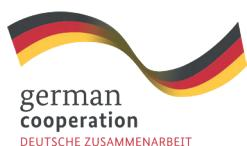

# **Thailand's**

## **Policy Recommendations and Roadmap**

for Due Diligence Readiness under European Union Deforestation Regulation (EUDR)

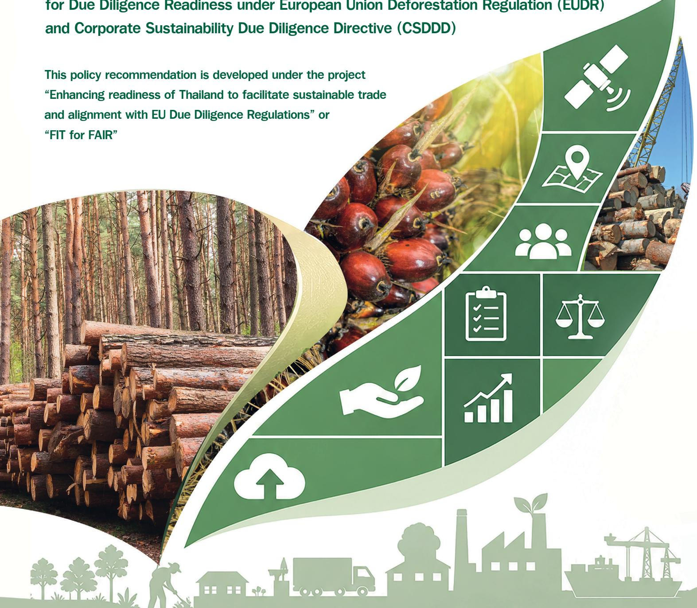

#### **Project Title**

**Enhancing Readiness of Thailand to Facilitate Sustainable Trade and Alignment with EU Due Diligence Regulations (FIT for FAIR project)**

**Funded by**

**Federal Ministry for Economic Cooperation and Development (BMZ)**

**Supported by**

**Deutsche Gesellschaft für Internationale Zusammenarbeit (GIZ)**

**Authours**

**Theeraya Mayakul**

**Aweewan Panyagometh**

**Chomkate Ngamkaiwan**

**Sopon Naruchaikusol**

**Editorial Team**

**Jeeranuch Sakkhamduang**

**Yanisa Ngamsa-ard**

**Implemented by**

**Thailand Environment Institute (TEI)**

## **Thailand's Policy Recommendations and Roadmap**

**This policy recommendation is developed under the "Enhancing readiness of Thailand to facilitate sustainable trade and alignment with EU Due Diligence Regulations" or FIT for FAIR project funded by the Federal Ministry for Economic Cooperation and Development (BMZ) and supported by the Deutsche Gesellschaft für Internationale Zusammenarbeit (GIZ).**

for Due Diligence Readiness under European Union Deforestation Regulation (EUDR) and Corporate Sustainability Due Diligence Directive (CSDDD)

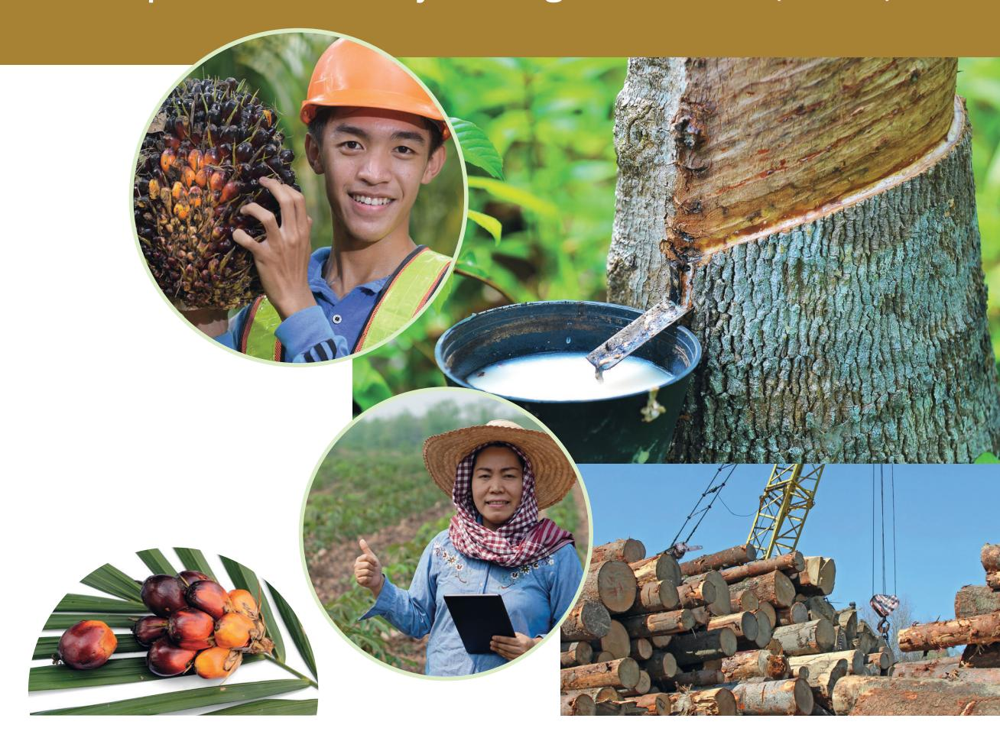

| Executive summary                                                                                                                              | 6  |
|------------------------------------------------------------------------------------------------------------------------------------------------|----|
| Methodology                                                                                                                                    | 9  |
| Policy recommendations for Due diligence                                                                                                       | 11 |
| 1. Digital Traceability platform                                                                                                               | 16 |
| 1.1 Scaling digital infrastructure for Supply Chain Traceability                                                                               | 16 |
| 2. Human Rights Due Diligence                                                                                                                  | 20 |
| 2.1 Promote Human Rights Due Diligence Awareness and Knowledge Sharing                                                                         | 20 |
| 2.2 Establish an Agricultural Workforce Database                                                                                               | 23 |
| 2.3 Establish the Agricultural Worker Registration System                                                                                      | 26 |
| 2.4 Strengthen Farmer Registration Systems                                                                                                     | 29 |
| 2.5 Ensure effective labor protection through strengthened monitoring and enforcement mechanisms                                               | 34 |
| 2.6 Adopt Accessible and Trusted Grievance Mechanisms                                                                                          | 36 |
| 2.7 Ensure the Meaningful Participation and Recognition of Indigenous Peoples and Ethnic communities in Due Diligence Process                  | 39 |
| 3. Environmental Due Diligence                                                                                                                 | 42 |
| 3.1 Encourage and support Eco-industrial practices as a foundation for environmental due diligence preparedness                                | 42 |
| 3.2 Promote SME registration to facilitate access to financial support, training opportunities, advisory services                              | 44 |
| 3.3 Encourage and support Thai business owners to obtain relevance certifications as a foundation for environmental due diligence preparedness | 46 |
| 4. Enhance Competency of key stakeholders                                                                                                      | 48 |
| 4.1 Embed knowledge and digital literacy among smallholder farmers and workers                                                                 | 48 |
| 4.2 Practical Skills for Maintaining Due Diligence Records and Supporting Documentation                                                        | 50 |
| 5. Data repository and supporting platform                                                                                                     | 53 |
| 5.1 Develop a centralized data repository and integrate it with the national traceability system                                               | 53 |
| 5.2 Due Diligence Help Desk                                                                                                                    | 55 |
| National Roadmap for Due Diligence Implementation                                                                                              | 56 |

## Table of content

### **Disclaimer**

This document is developed under the "Enhancing readiness of Thailand to facilitate sustainable trade and alignment with EU Due Diligence Regulations" or FIT for FAIR project funded by Federal Ministry of Economic Cooperation and Development (BMZ) and implemented by the Thailand Environment Institute (TEI) with the support of Deutsche Gesellschaft für Internationale Zusammenarbeit (GIZ) GmbH. The content of this publication is the sole responsibility of the authors and does not necessarily reflect the views of the GIZ GmbH or BMZ. The information in this report, or upon which this study is based, has been obtained from sources the authors believe to be reliable and accurate. Further, the results have been obtained and validated by an inclusive multistakeholder dialogue (see methodology). While reasonable efforts have been made to ensure that the contents of this publication are factually correct, GIZ GmbH does not accept responsibility for the accuracy or completeness of the contents of this publication. The mention of specific companies, initiatives or products of manufacturers, whether or not these have been patented, does not imply that these have been endorsed or recommended by GIZ GmbH in preference to others of a similar nature that are not mentioned.

No claim is made to the completeness or exclusivity of the content. The information provided is no substitute for legal advice. It is non-binding and is not the subject of a legal advice contract. No guarantee is given that the judgments and opinions set out here will be followed in the event of a dispute.

## **Executive summary**

This report presents a comprehensive policy framework and national roadmap to support Thailand's alignment with the European Union's EU Deforestation Regulation (EUDR) and Corporate Sustainability Due Diligence Directive (CSDDD). It outlines strategic interventions to strengthen traceability, environmental governance, and human rights due diligence across key agricultural supply chains, while supporting Thai producers and exporters in meeting evolving EU market requirements

Developed under the "FIT for FAIR" project, the project adopts a multi-stage, participatory policy design methodology, combining analytical assessment with stakeholder engagement and co-creation. The process began with a comprehensive desk review to establish a status quo analysis, which identified critical structural challenges, including fragmented data systems, weak interoperability, unclear institutional roles, land-use overlaps, and limited capacity among smallholders. These findings were validated through stakeholder consultations and further explored via thematic working groups on traceability, environmental due diligence, and human rights due diligence. A Policy Lab workshop applied systems thinking tools to transition from diagnosis to solution design, resulting in draft policy recommendations. These were subsequently refined through a national policy consultation process, ensuring feasibility, inclusiveness, and alignment with stakeholder needs. The final output is an integrated Due Diligence roadmap, structured across short-, medium-, and long-term phases.

### **1. Digital Traceability Platform**

 Establish a unified national system integrating geolocation data, land-use information, and supply chain records to enable robust, verifiable traceability aligned with EU requirements.

### **2. Human Rights Due Diligence (HRDD)**

 Strengthen labor protection through worker registration systems, improved enforcement, accessible grievance mechanisms, and inclusive approaches for vulnerable groups, including migrant workers and Indigenous communities.

### **3. Environmental Due Diligence**

 Promote eco-industrial practices, enhance SME readiness, and leverage relevant certifications as practical supporting information, rather than practical entry points with due diligence requirements. Note that the use of Green Industry (GI) or other relevant certifications does not constitute due diligence but as baseline or supporting evidence

### **4. Capacity Building**

 Improve digital literacy, technical skills, and practical competencies among farmers, SMEs, and exporters, particularly in preparing documentation and information that may support due diligence processes conducted by obligated operators and companies.

### **5. Data Repository and Support Mechanisms**

 Develop a centralized data repository and establish a Due Diligence Help Desk to provide technical guidance, improve data accessibility, and reduce compliance costs for businesses.

The project identified five major areas for policy recommendations:

Overall, this roadmap provides a coordinated, system-wide approach to due diligence, emphasizing inter-agency collaboration, data integration, and stakeholder participation. By implementing these measures, Thailand can enhance transparency, reduce compliance risks, and strengthen the competitiveness of its agricultural exports, while ensuring sustainable and responsible supply chain governance in line with European standards.

### **The proposed national roadmap outlines phased implementation:**

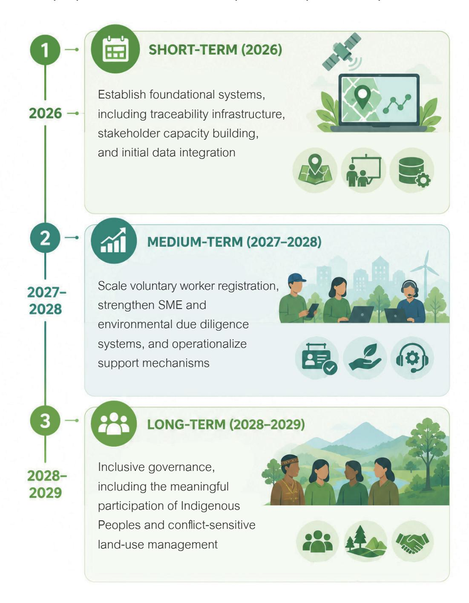

## **Methodology**

The project employs a multi-stage, participatory policy design methodology to develop a national Due Diligence (DD) roadmap aimed at supporting stakeholders in strengthening the legal, policy, and institutional enabling environment for operationalising/preparing for EUDR and CSDDD The process is structured into seven sequential stages to ensure both analytical rigor and practical relevance.

(1) Status Quo Analysis: The research began with a comprehensive assessment of existing systems, including laws, regulations, traceability mechanisms, and institutional arrangements across key commodities. This phase identified critical structural challenges such as fragmented data systems, weak interoperability, unclear institutional responsibilities, overlapping land-use classifications, and limited capacity among supply chain actors, particularly smallholder farmers.

(2) Kick-off Meeting: Preliminary Findings from the Status Quo Analysis were presented to key stakeholders in a kick-off meeting to validate results and gather expert feedback. This participatory validation process nurtured the ongoing status quo analysis, enabling a deeper assessment how Thailand's existing systems and governance arrangements are positioned to respond to due diligence requirements associated with the EUDR and CSDDD. Consequently, participants identified gaps in traceability, environmental compliance, human rights due diligence (HRDD), and institutional coordination. In addition, participants contributed to the compilation of laws and regulations related to EUDR and CSDDD across different commodities.

(3) Thematic Working Groups: A series of working group workshops were conducted to deepen understanding of key dimensions, including 1) Traceability systems (19 Feb 2026), 2) Environmental due diligence (20 Feb 2026), and 3) Human rights due diligence (17 March 2026). Stakeholders engaged in structured discussions on data fragmentation, data standards, technology risks, legal alignment, verification mechanisms, labor risks, and grievance systems. These workshops generated detailed insights into operational constraints and sector-specific risks across the value chain.

Figure 1: Methodology for Developing Due Diligence Recommendations and Roadmap

(4) Policy Lab Workshop (22-23 April 2026): Building on these findings, a Policy Lab was organized to transition from diagnosis to solution design. Systems thinking tools including system mapping, gap matrices, root cause analysis (Iceberg Model), leverage point identification, and the Future Triangle were applied to co-create policy options. Draft policy recommendations were developed using a structured mini policy canvas, ensuring clarity in implementation pathways.

(5) Policy Consultation (5 May 2026): The draft recommendations were then presented to a broader group of stakeholders through a policy consultation workshop to validate feasibility, assess potential impacts, and incorporate diverse perspectives. This step strengthened the robustness, inclusiveness, and practicality of the proposed measures.

(7) Development of the Due Diligence Roadmap: Finally, the validated and prioritized recommendations were synthesized into a comprehensive due diligence roadmap, structured across short-, medium-, and long-term phases. The roadmap provides actionable guidance for Thailand to enhance traceability systems, integrate environmental and human rights due diligence, and establish an enabling ecosystem that supports compliance with emerging EU due diligence requirements and strengthens the competitiveness of Thai agricultural exports to the EU.

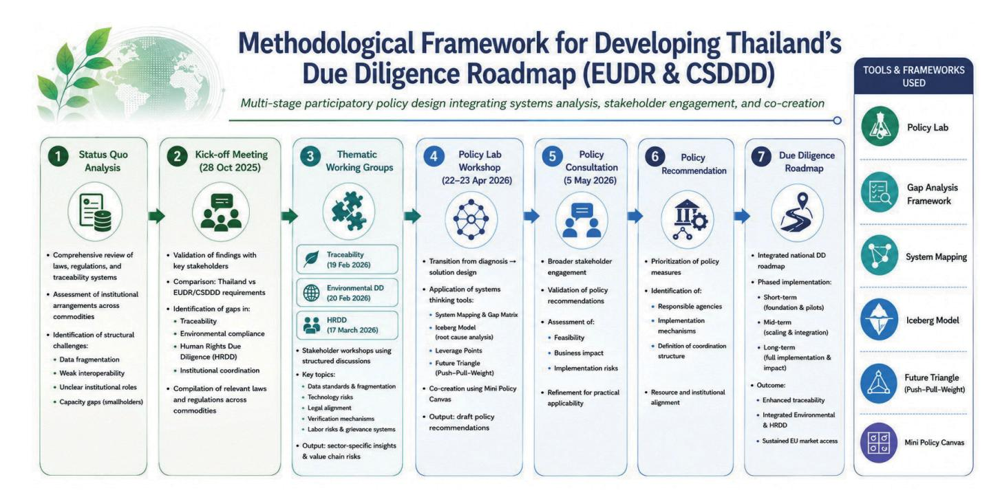

## **Policy recommendations for Due diligence**

Five interrelated policy recommendations are proposed to guide due diligence integration: (1) traceability platforms, (2) human rights due diligence, (3) environmental due diligence, (4) capacity building, and (5) an integrated information and support platform, as summarized in the table below.

### **Table 1: Summary of policy recommendations for Due diligence**

| Issues                                                                                              | Target group                          | Recommended Lead Agency                                                                                                                                                                  | Expected Output                                                                                                                                                                                                                                                              |
|-----------------------------------------------------------------------------------------------------|---------------------------------------|------------------------------------------------------------------------------------------------------------------------------------------------------------------------------------------|------------------------------------------------------------------------------------------------------------------------------------------------------------------------------------------------------------------------------------------------------------------------------|
| <b>1. Traceability and data systems</b>                                                             |                                       |                                                                                                                                                                                          |                                                                                                                                                                                                                                                                              |
| 1.1 Scale a nationwide digital infrastructure to enable comprehensive supply chain traceability     | Famer, business owner, Exporter, SMEs | The Ministry of Agriculture and Cooperatives                                                                                                                                             | National Traceability platform                                                                                                                                                                                                                                               |
| <b>2. Human Rights &amp; Social Safeguards</b>                                                      |                                       |                                                                                                                                                                                          |                                                                                                                                                                                                                                                                              |
| 2.1 Provide awareness-raising and practical HRDD training for stakeholders across the supply chain. | Farmer, worker, business owner, SMEs  | Rubber Authority of Thailand (RAOT)  Office of the Palm Oil Committee  Department of Agricultural Extension (DOAE) under the Ministry of Agriculture and Cooperatives (MOAC) | Increased awareness of labor rights, rievance mechanisms, and responsible business conduct among business operators, farmers, and workers.                                                                                                                                   |
| 2.2 Establish an Agricultural Workforce Database (voluntary system)                                 | Worker in agricultural sector         | Ministry of Agriculture and Cooperatives  Department of Labor Protection and Welfare (DLPW) under the Ministry of Labor                                                            | A centralized agricultural workforce database (covered to informal and seasonal workers/migrants) capable of interfacing with national supply chain traceability and due diligence systems while ensuring data protection and inclusion of informal/migrant/seasonal workers |

| Issues                                                                                                                                         | Target group                  | Recommended Lead Agency                                                                                                       | Expected Output                                                                                                                                                                                                                                                              |
|------------------------------------------------------------------------------------------------------------------------------------------------|-------------------------------|-------------------------------------------------------------------------------------------------------------------------------|------------------------------------------------------------------------------------------------------------------------------------------------------------------------------------------------------------------------------------------------------------------------------|
| 2.3 Establish an agricultural worker registration system (voluntary system)                                                                    | Worker in agricultural sector | Ministry of Agriculture and Cooperatives  Department of Labor Protection and Welfare (DLPW) under the Ministry of Labor | A centralized agricultural workforce database (covered to informal and seasonal workers/migrants) capable of interfacing with national supply chain traceability and due diligence systems while ensuring data protection and inclusion of informal/migrant/seasonal workers |
| 2.4 Maximize farmer registration by strengthening tangible incentives, share value, and deploying targeted communication on available benefits | Farmer in agricultural sector | Department of Agricultural Extension                                                                                          | A strengthened farmer and plantation registration database linked with the farmer registry                                                                                                                                                                                   |
| 2.5 Ensure effective labor protection through strengthened monitoring and enforcement mechanisms                                               | Farmer, worker, employee      | Department of Labor Protection and Welfare (DLPW) under the Ministry of Labor                                                 | Improved labor rights protection and workplace safety                                                                                                                                                                                                                        |
| 2.6 Adopt accessible and trust grievance and remedial mechanism in public and private sector                                                   | Immigrant, worker, employee   | Department of Labor Protection and Welfare (DLPW) under the Ministry of Labor (MOL)                                           | Trusted Grievance Mechanisms                                                                                                                                                                                                                                                 |
| 2.7 Ensure the meaningful participation and recognition of Indigenous Peoples and ethnic communities in due diligence process                  | Immigrant, farmer, worker     | Royal Forest Department (RFD) under the Ministry of Natural Resources and Environment (MONRE)                                 | Improved understanding of community-related risks, land-use overlap, and conflict-sensitive areas in agricultural and forestry sectors                                                                                                                                       |

| Issues                                               | Target group                                                                                                                                                                                               | Recommended Lead Agency                                                                                                                                                                  | Expected Output                                          |                                                                                                                                                                                                                                                                                                                                                                                                                                                                                           |
|------------------------------------------------------|------------------------------------------------------------------------------------------------------------------------------------------------------------------------------------------------------------|------------------------------------------------------------------------------------------------------------------------------------------------------------------------------------------|----------------------------------------------------------|-------------------------------------------------------------------------------------------------------------------------------------------------------------------------------------------------------------------------------------------------------------------------------------------------------------------------------------------------------------------------------------------------------------------------------------------------------------------------------------------|
| <b>3. Environmental Governance &amp; SME Support</b> |                                                                                                                                                                                                            |                                                                                                                                                                                          |                                                          |                                                                                                                                                                                                                                                                                                                                                                                                                                                                                           |
| 3.1                                                  | Encourage and support eco-industrial practices as a foundation for environmental due diligence preparedness                                                                                                | Mid and downstream industry e.g. Primary processing plants e.g. Rubber smoking plants, Block rubber processing plants, Latex concentrate processing plants, Dry rubber processing plants | Department of Industrial Works (DIW)                     | Promote the adoption of green practices across industries and strengthen the capacity of Thai suppliers and exporters to effectively respond to due diligence information requests from EU operators and buyers.                                                                                                                                                                                                                                                                          |
| 3.2                                                  | Promote SME registration to improve access to financial support and training that facilitate the transition toward greener and more sustainable business practices, and strengthen due diligence readiness | Mid and downstream industry                                                                                                                                                              | Office of Small and Medium Enterprises Promotion (OSMEP) | To strengthen capacity to respond to EUDR- and CSDDD-related information requests                                                                                                                                                                                                                                                                                                                                                                                                         |
| 3.3                                                  | Encourage and support Thai business owners to obtain Eco-friendly or relevant environmental protection (sustainability) certifications as a foundation for environmental due diligence preparedness        | Mid and downstream industry                                                                                                                                                              | Department of Industrial Works (DIW)                     | Support the voluntary and context-appropriate use of green practices and relevant certifications as complementary tools for environmental risk assessment and supply chain transparency, while seeking to avoid disproportionate costs or barriers for smallholder farmers and SMEs. Certification alone cannot be considered a substitute for due diligence obligations for operators. * Certification cannot be considered a substitute for due diligence obligations for operators. |

| Issues                                                 | Target group                                                                                                                                                                                                                                                                                         | Recommended Lead Agency  | Expected Output                                                                                       |                                                                                                                                                                                                                                                               |
|--------------------------------------------------------|------------------------------------------------------------------------------------------------------------------------------------------------------------------------------------------------------------------------------------------------------------------------------------------------------|--------------------------|-------------------------------------------------------------------------------------------------------|---------------------------------------------------------------------------------------------------------------------------------------------------------------------------------------------------------------------------------------------------------------|
| <b>4. Capacity Building &amp; Technical Assistance</b> |                                                                                                                                                                                                                                                                                                      |                          |                                                                                                       |                                                                                                                                                                                                                                                               |
| 4.1                                                    | Embed knowledge and digital literacy among smallholder farmers and workers a Rural digital literacy enhancement program with regional workshops and support for farmers to assist farm registration, geolocation mapping, traceability systems, and basic data entry for due diligence requirements. | Farmer / Business owner  | Department of Agriculture (DOA) under the Ministry of Agriculture and Cooperatives (MOAC)             | Thai farmers and business operators gain knowledge, improve readiness, strengthen practical compliance capabilities, build confidence in meeting regulatory requirements, reduce the burden of compliance processes, and minimize the risk of non-compliance. |
| 4.2                                                    | Deliver workshops on documentation and record-keeping rather than evidence of procedure for Thai exporters and suppliers                                                                                                                                                                             | Exporter/ Business owner | Department of Agricultural Extension (DOAE) under the Ministry of Agriculture and Cooperatives (MOAC) | Improved practical competencies relating to due diligence implementation and documentation among business operators, farmers, and relevant stakeholders                                                                                                       |
| <b>5. Data repository and Help Desk</b>                |                                                                                                                                                                                                                                                                                                      |                          |                                                                                                       |                                                                                                                                                                                                                                                               |
| 5.1                                                    | Develop a centralized data repository and integrate it with the national traceability system.                                                                                                                                                                                                        | All stakeholders         | Thailand's National EUDR Committee                                                                    | Data repository showing relevance law/regulations, necessary information for due diligence                                                                                                                                                                    |
| 5.2                                                    | Establish Due Diligence Help Desk for SMEs, Business owner, Exporter                                                                                                                                                                                                                                 | All stakeholders         | Thailand's National EUDR Committee                                                                    | Due Diligence Help Desk c                                                                                                                                                                                                                                     |

\* Thailand's National EUDR Committee is in a formative stage, with ongoing efforts to strengthen inter-agency coordination, data integration, and due diligence support, but still faces challenges related to institutional clarity and system interoperability

### **1. Digital Traceability platform**

### **1.1 Scaling digital infrastructure for Supply Chain Traceability**

To help address challenges related to data fragmentation and the widening digital divide between smallholders and larger enterprises, Thailand could strengthen coordination and interoperability across existing digital systems and consider developing a more unified national digital infrastructure for supply chain traceability. A digital traceability system may support more efficient collection and verification of information relevant to EUDR-related traceability and information requirements. Currently, inefficient data collection and siloed exchange between government agencies severely hinder compliant supply chain traceability. To overcome this, the state must implement standardized geospatial frameworks utilizing the EUDR GeoJSON file description as designated by the National EUDR Committee's criteria for the Thai Business, while deploying targeted support for smallholders to initiate the nationwide collection of standardized geolocation data for agricultural plots. This policy mandates the use of GeoJSON format mapped strictly to the World Geodetic System 1984 (WGS84) standard to ensure plot verification and deforestation-free status. Furthermore, data governance policies under the Digital Government Act will be enforced to achieve seamless data integration, interoperability, and open data initiatives for easy access.

Furthermore, this infrastructure must centralize and facilitate access to critical compliance data, including master maps, and title deeds, and all necessary evidence essential for comprehensive supply chain risk assessment and legal compliance verification under both EUDR and CSDDD frameworks. **While traceability and geolocation data are highly relevant for EUDR compliance, CSDDD focuses more broadly on risk identification, prevention, mitigation, stakeholder engagement, and governance processes across value chains.** To provide accessibility, these verified datasets will be made securely accessible to Thai business actors and support operators for their due diligence processes, strictly governed by global standards of cybersecurity, personal data protection act (PDPA), and data retention required under the EUDR

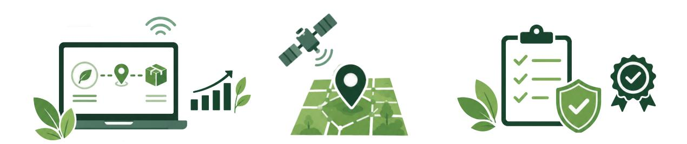

- To scale up digital infrastructure for supply chain traceability To drive forward the nationwide collection of standardized geolocation data To ensure data quality and credibility for compliance verificatio
- •
- •
- •

### **Approach**

The Ministry of Agriculture and Cooperatives is well-positioned to serve as the primary authority responsible for initial upstream agricultural data collection and continuous platform maintenance.

In addition, a dedicated governance mechanism or specialized body could be established to oversee the implementation and continuous improvement of the national supply chain traceability framework. Acting as a National EUDR Single Window, this entity would facilitate data verification, interoperability, and cross-ministerial coordination, while supporting stakeholders in the effective implementation of traceability and due diligence requirements.

### **Recommended Lead Agencies**

Relevant supporting agencies must take active co-ownership within their respective jurisdictions to authorize, manage, and execute secure data exchange across national systems.

Key supporting bodies will serve as vital data-contributing anchors, categorized by their strategic functions as follows:

### **Supporting Agencies**

Upstream & Land-Owning Governance: The Royal Forest Department (RFD), the Department of National Parks, Wildlife and Plant Conservation (DNP), the Department of Lands (DOL), and the Agricultural Land Reform Office (ALRO) responsible for data verifying legal land tenure, and maps. •

To operationalize this cross-system integration, the existence of an EUDR National Committee at the executive governance level is imperative. This centralized mechanism will hold ultimate authority over policy governance, interoperability guidelines, inter-agency coordination, and rigorous monitoring and evaluation.

- Agricultural Product & Smallholder Management: The Rubber Authority of Thailand (RAOT), the Department of Agricultural Extension (DOAE), the Department of Agriculture (DOA) and the Department of Livestock Development (DLD) responsible for farmer registration, crop-specific datasets, and production standards. Industrial Processing & Social Compliance: The Department of Industrial Works (DIW), the Ministry of Labour (MOL), and the Department of Welfare and Labour Protection (DLP) responsible for supply chain processing data, factory regulations, and labor rights verification. Trade Facilitation & Export Regulation: The Customs Department, the Department of International Trade Promotion (DITP), and the Department of Trade Negotiations (DTN) responsible for border enforcement, export clearance, and international trade alignment. Digital Infrastructure, Technology Providers and Research: The Digital Government Development Agency (DGA), the Government Data Center and Cloud service (GDCC), the Geo-Informatics and Space Technology Development Agency (GISTDA), and National Research and innovation sectors responsible for enabling cross-agency data interoperability, securing sovereign cloud infrastructure, and providing advanced satellite/remote-sensing technologies for plot verification.
- •
- •
- •

- Scale Up Existing Platform (ARDA Project): Allocate budget and invest in the high-readiness technology platform (including traceability and geolocation analysis) developed under the ARDA research and innovation project. This allows for the immediate deployment and scaling of the National Traceability platform, accelerating the integration of core government datasets without building from scratch. Activate MOUs and Enforce Data Standards: Coordinate inter-agency MOUs to break bureaucratic silos, while establishing strict data governance and interoperability standards for seamless, secure cross-system data exchange. Drive Small holder Awareness: Launch campaigns to enhance digital literacy among smallholders for geolocation mapping, while securing compliant informed consent under PDPA guidelines. Deploy Comprehensive Capacity Building: Execute platform training, data collection management, data exercise and capability-building programs for government officials, suppliers, and agricultural leaders to ensure effective, long-term data utilization. Institutionalize System Transfer and Public-Private Collaboration: Establish a comprehensive system migration plan to seamlessly transition the finalized platform to designated central authorities for continuous management by 2027. Concurrently, formalize robust collaborations with the private sector (e.g., Thai exporters and trade associations) to ensure commercial viability and long-term compliance.
- •
- •
- •
- •
- •

By scaling this high-readiness platform through a shared national infrastructure and standardized data governance, this centralized traceability system eliminates agency duplication and establishes unequivocal institutional responsibility. Furthermore, by institutionalizing strict data co-ownership and cross-ministerial accountability through structured data exercises with practice guideline, Thailand will dramatically lower compliance costs and support compliance with EU market requirements. This unified traceability framework and platform will support exporters in providing the information needed for downstream due diligence processes, empower smallholders under PDPA, empower smallholders under PDPA, and elevate the global cost-competitiveness of Thai sustainable agricultural products.

#### **Action plan**

### **Outcome**

- Improve understanding of Human Rights Due Diligence (HRDD), labor rights, and responsible business conduct among business operators, farmers, workers, and relevant stakeholders. ·Strengthen practical capacity to identify, prevent, mitigate, and address labor, environmental, and community-related risks within agricultural supply chains. Promote awareness of occupational health and safety, fair labor practices, grievance mechanisms, and the prohibition of child and forced labor in agricultural sectors. Support business operators and producers in understanding emerging due diligence and traceability expectations, including relevant international sustainability standards and regulatory frameworks.
- •
- •
- •

### **Approach**

### **Human Rights Due Diligence**

The recommendations under Section 2 should be implemented using rights-based, gender-responsive, and inclusive approaches that consider the needs and vulnerabilities of women, migrant workers, undocumented workers, Indigenous Peoples, ethnic communities, persons with disabilities, and other marginalized or at-risk groups within agricultural supply chains.

### **2.1 Promote Human Rights Due Diligence Awareness and Knowledge Sharing**

Many business operators, farmers, and workers in agricultural supply chains continue to face challenges in understanding and implementing Human Rights Due Diligence (HRDD), labor protection standards, and emerging sustainability and due diligence requirements. Strengthening practical awareness and knowledge-sharing mechanisms is therefore important to support responsible business conduct, labor protection, and effective implementation of due diligence systems within high-risk agricultural sectors.

- Develop and implement sector-specific capacity-building programs, including training modules, practical toolkits, training-of-trainers schemes, and post-training technical assistance on HRDD, labor rights, occupational safety and health, grievance mechanisms, supply chain traceability, and responsible business conduct for business operators, farmers, and workers in the rubber, timber, and oil palm sectors. Deliver training and outreach activities through local workshops, agricultural extension systems, cooperatives, and community-based learning mechanisms using accessible and context-based materials (e.g., farmer field schools (FFS), cooperative-led training sessions, peer-learning networks, mobile outreach programs, visual toolkits, and local-language guidance materials). Promote inclusive and gender-responsive training approaches by providing multilingual and literacy-appropriate materials, using culturally sensitive and participatory methods, and ensuring the meaningful participation of women, migrant workers, Indigenous Peoples, ethnic communities, and other vulnerable groups. Develop practical tools, guidance materials, templates, and case studies to support implementation of due diligence and labor protection measures within agricultural supply chains. Encourage knowledge-sharing, peer learning, and collaboration among government agencies, businesses, academic institutions, civil society organizations, and sustainability initiatives. Support collaboration and partnership mechanisms, including research collaboration, technical assistance, and joint capacity-building initiatives among relevant stakeholders.
- •
- •
- •
- •
- •
- •

#### **Action Plan**

- Rubber Authority of Thailand (RAOT) Office of the Palm Oil Committee Department of Agricultural Extension (DOAE) under the Ministry of Agriculture and Cooperatives (MOAC)
- •
- •
- •

### **Recommended Lead Agencies**

These agencies are well-positioned to support capacity-building and outreach activities due to their experience in agricultural governance, sustainability initiatives, technical assistance, and stakeholder engagement within agricultural supply chains.

- Department of International Trade Promotion (DITP) under the Ministry of Commerce: Supports outreach relating to export readiness, market access, and sustainability-related trade requirements. Office of Small and Medium Enterprises Promotion (OSMEP): Supports capacity-building and outreach for SMEs and local business operators. National Bureau of Agricultural Commodity and Food Standards (ACFS): Supports technical guidance relating to agricultural standards, traceability, and certification systems. United Nations Global Compact Network Thailand (UNGC Thailand): Supports responsible business conduct awareness and private-sector engagement. Universities and academic institutions: Support research, academic services, training development, and technical expertise in the area of business and human rights (BHR). Relevant civil society organizations and NGOs, including migrant worker support and labor rights organizations: Support community outreach, rights awareness, knowledge-sharing, and engagement with vulnerable workers and local communities.
- •
- •
- •
- •
- •
- •

#### **Supporting Agencies**

- Improved understanding and implementation of human rights and due diligence practices within agricultural supply chains. Increased awareness of labor rights, occupational safety, grievance mechanisms, and responsible business conduct among business operators, farmers, and workers. Strengthened capacity of Thai business operators and producers to respond to sustainability and due diligence expectations in domestic and international markets. Enhanced collaboration, knowledge sharing, and peer learning among government agencies, businesses, civil society organizations, and academic institutions.
- •
- •
- •
- •

### **Outcomes**

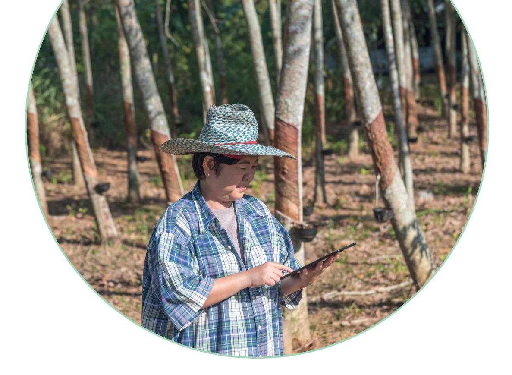

- Improve workforce visibility through voluntary and inclusive mechanisms that encourage participation among informal, seasonal, migrant, and other vulnerable workers. Strengthen workforce visibility to support labor market planning, workforce development, occupational safety and health programs, and social protection initiatives. Enhance coordination and information sharing among relevant government agencies involved in agricultural, labor, and social protection governance. Support evidence-based policymaking and resource allocation relating to labor protection, skills development, and workforce welfare in agricultural sectors.
- •
- •
- •
- •

### **Approach**

### **2.2 Establish an Agricultural Workforce Database**

Limited information on the size, characteristics, and distribution of the agricultural workforce continues to constrain workforce planning, labor protection efforts, occupational safety initiatives, and the delivery of support services in agricultural sectors. These challenges are particularly significant for informal, seasonal, migrant, and other vulnerable workers, who are often underrepresented in official data systems. Strengthening workforce information systems is therefore important to improve workforce visibility, support evidence-based policymaking, and enhance coordination among relevant government agencies.

- Establish an agricultural workforce database by integrating and harmonizing relevant workforce information from existing agricultural, labor, migration, and social protection databases, while incorporating voluntary mechanisms to improve coverage of informal, seasonal, and migrant workers and ensuring appropriate data protection and privacy safeguards. Establish mechanisms for the periodic collection and updating of workforce information through existing administrative systems, agricultural extension services, labor offices, cooperatives, and producer organizations. Pilot the database in selected rubber, timber, and oil palm production areas and assess its effectiveness before broader implementation. Develop appropriate data-sharing, privacy, and data protection protocols to support coordination among relevant government agencies while safeguarding worker rights and confidentiality.
- •
- •
- •
- •

- Ministry of Agriculture and Cooperatives (MOAC) Ministry of Labour
- •
- •

### **Action Plans**

### **Recommended Lead Agencies**

- Department of Employment (DOE): supports and shares official information on internal labor data, Thai overseas labour, and labor migrant data particularly in agricultural sectors. Department of Agricultural Extension (DOAE): Supports data collection and outreach through agricultural extension networks. Department of Labour Protection and Welfare (DLPW): Supports labor-related data management and worker protection initiatives. Social Security Office (SSO): Supports workforce and social protection data integration. Office of the National Economic and Social Development Council (NESDC): Supports labor market planning and workforce policy development.
- •
- •
- •
- •
- •

### **Supporting Agencies**

These agencies are well-positioned to lead workforce information management efforts due to their responsibilities relating to agricultural development, labor administration, workforce planning, and worker protection.

- Improved workforce visibility across agricultural sectors, including informal, seasonal, migrant, and other vulnerable workers. Enhanced evidence base for labor market planning, workforce development, occupational safety and health programs, and social protection initiatives. Strengthened coordination and information sharing among government agencies responsible for agricultural and labor governance. Improved capacity of policymakers to design and implement targeted workforce support measures based on reliable and up-to-date workforce information.
- •
- •
- •
- •

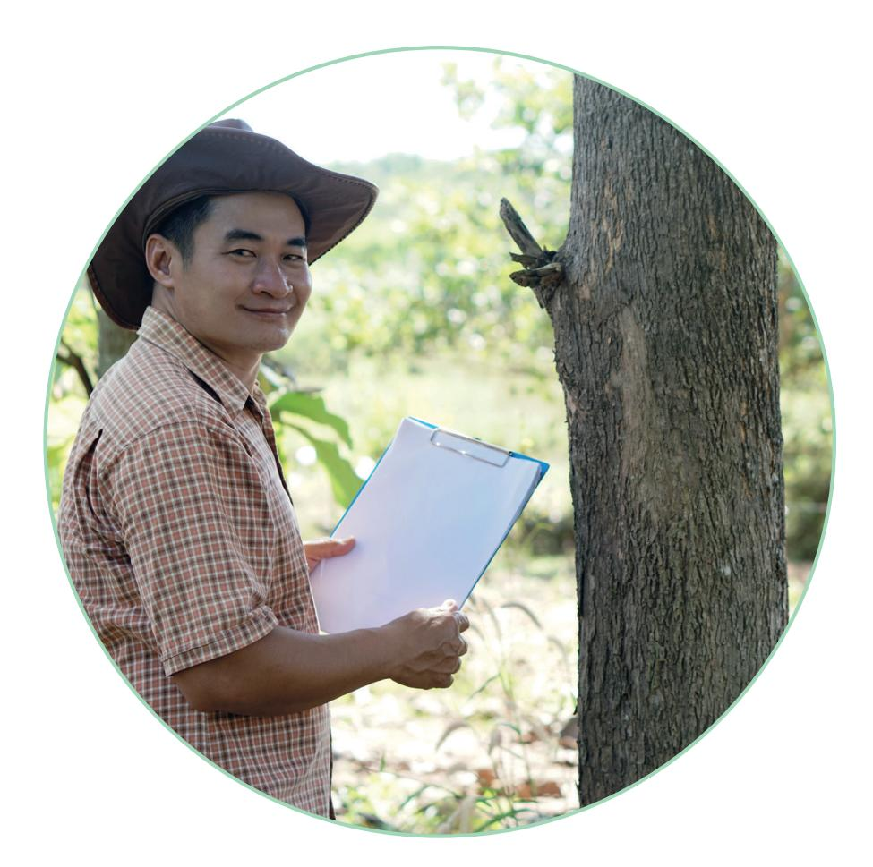

#### **Outcomes**

- National Statistical Office (NSO): Supports data standards, data quality, statistical coordination, and sharing relevant information from the national migration census survey, particularly internal migration. Relevant civil society organizations, worker organizations, and migrant worker support organizations: Support outreach and engagement with vulnerable worker groups.
- •

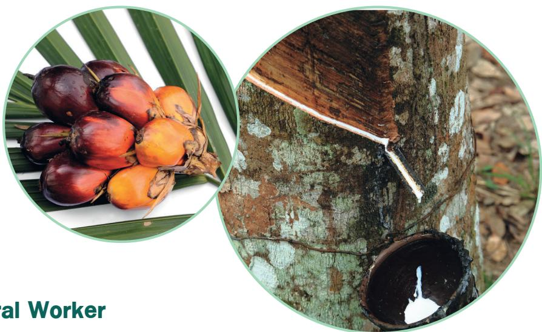

- To recognize the new occupational or professional status of workers along the supply chain, while this agricultural worker registration is on a voluntary basis and follows the 'Do No Harm' principle in workers' decisions. Enable agricultural workers, including seasonal and migrant workers, to access labor protection and social security benefits. Promote safe working practices through occupational safety training. Improve workforce quality through skills development and professional certification. Encourage voluntary labor registration and mitigate informal employment practices in agricultural sectors. Strengthen labor traceability and due diligence systems linked to agricultural supply chains.
- •
- •
- •
- •
- •
- •

The Ministry of Agriculture and Cooperatives (MOAC) is well-positioned to serve as the primary coordinating agency for the implementation of the agricultural worker registration system across the rubber, timber, and oil palm sectors.

### **Approach**

### **Recommended Lead Agency**

### **2.3 Establish the Agricultural Worker Registration System (voluntary system)**

Develop a voluntary worker registration and professional recognition system for workers in high-risk agricultural sectors, particularly rubber, timber/forestry, and oil palm. The system should recognize occupational categories and competencies across EUDR-related commodity supply chains and facilitate access to social security, labor rights, occupational safety and health measures, skills certification, training opportunities, and other workforce support programs. It should also contribute to responsible labor traceability and improved labor governance throughout the supply chain.

- Social Security Office (SSO): Responsible for facilitating worker enrollment into the social security system, particularly voluntary social security schemes under Section 40, and ensuring workers can access entitled benefits and protections Department of Labor Protection and Welfare (DLPW): Responsible for labor rights enforcement, workplace safety standards, labor inspections, and occupational safety compliance Professional Qualification Institute (TPQI): Responsible for developing occupational standards, certification systems, and competency-based training programs for agricultural workers. The Occupational Standards in the Agricultural Sector need to extend to cover relevant workers along the EUDR supply chain Department of Employment (DOE): Responsible for labor registration processes and supporting the regularization of migrant workers to ensure lawful employment status Department of Skill Development (DSD): Responsible for developing new informal short training schemes and certificates to enhance labour skills to labor, particularly to support new occupational or professional job knowledge and skills (e.g. logging workers, etc.), with close collaboration for expertise from relevant agencies. Sector-specific agencies (e.g., Rubber Authority of Thailand, Forest Economics Office Royal Forest Department, Forest Industry Organization, Provincial Office of Natural Resources and Environment, Department of Agriculture): Responsible for coordinating implementation and outreach within each agricultural sector
- •
- •
- •
- •
- •
- •

Implementation requires coordinated collaboration among multiple government agencies:

Develop a voluntary agricultural worker registration system, support the professional recognition system, and encourage participation among workers in high-risk agricultural sectors, especially new and unrecongnized workers including hired, seasonal, migrant, and other vulnerable workers, based on the 'Do No Harm' principle. The system should recognize relevant occupations and competencies across rubber, timber, and oil palm supply chains and facilitate access to training, skills certification, occupational safety and health programs, social protection schemes, and workforce support services.

- Ensure that registration, training, and outreach activities are accessible, inclusive, and genderresponsive by providing multilingual and literacy-appropriate materials, using both online and on-site delivery methods, and addressing barriers faced by women, migrant workers, persons with disabilities, seasonal workers, and other vulnerable groups.
- •

#### **Supporting Agencies**

### **Action plans**

- Workers will gain improved access to occupational safety protection, labor rights, and social security benefits through formal registration and training systems. For unrecognized official occupations, such as workers in the timber harvesting supply chain, particularly workers in upstream activities including fallers/tree fallers, chainsaw operators, buckers, logging equipment operators, and logging workers. Certified skills and training may enhance employability and income opportunities while reducing workplace accidents and health risks. Access to social security and health treatment will also improve long-term economic security and resilience. However, relevant government agencies should initiate some financial and training packages to encourage workers to join the registration program. Plantation operators and agricultural businesses will benefit from a more skilled, legally compliant, professionally trained workforce, and a reputation to support workers' professional status. Improved labor management systems can reduce legal and reputational risks related to labor rights violations, occupational accidents, and supply chain due diligence requirements. A trained workforce may also contribute to improved productivity, operational efficiency, and sustainability performance. Government agencies will gain improved capacity to monitor labor conditions, reduce informal employment, promote equal opportunity to wider occupational labors, and strengthen enforcement of labor protection standards within agricultural sectors. The system can also support national traceability, sustainability, and due diligence frameworks linked to export-oriented agricultural supply chains.
- •
- •
- •

### **Outcomes**

- Integrate sector-specific occupational safety, and health training into registration and workforce development programs, including training on chainsaw operation, tree felling, pesticide and chemical handling, machinery use, harvesting techniques, heat stress prevention, and basic first aid, with support from relevant technical agencies and industry experts. Encourage participation through simplified registration procedures and linkages to skills certification, social protection schemes (including Social Security Section 40), and other workforce support programs, while ensuring that workers who are unable or unwilling to register are not excluded from fundamental labor rights, occupational safety protections, grievance mechanisms, or emergency assistance services.
- •

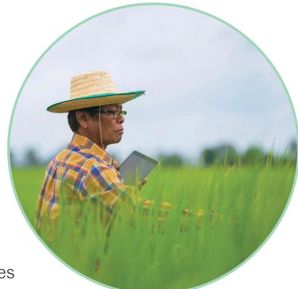

- Improve the accuracy and coverage of farmer and plantation registration systems for key commodities, including rubber, timber, and oil palm, through updated databases, expanded registration of smallholders, digital record management, and regular field verification. Support traceability and supply chain verification by linking farmer registration records with plantation mapping, production data, and supplier records, supported by interoperable databases and regular data verification mechanisms. Either government authorities (e.g. agricultural extension officers) or relevant actors provide necessary support and facilitate smallholder farmers' access to government support programs, agricultural extension services, sustainability certification schemes, and formal market opportunities through simplified registration procedures, targeted outreach, technical assistance, and support for certification and market linkages.
- •
- •
- •

### **Approach**

### **2.4 Strengthen Farmer Registration Systems**

This measure focuses on the registration of farmers and land operators, which is distinct from the worker registration system proposed in Section 2.3. While the worker registration system focuses on labor protection, occupational safety, and social security for hired workers, the farmer registration system focuses on identifying farm operators, mapping crop activities, verifying plantation ownership, tracking production areas, and ensuring supply chain traceability.

Existing fragmented farmer registration systems such as RAOT for rubber, timber registries, and oil palm records, must be strengthened and made interoperable with the centralized Farmer registry by DOAE. To ensure full traceability and access to government support, smallholders and farmers must be incentivized to register through either their crop-specific databases or the centralized national platform. Formal registration will be driven by simplified procedures and targeted incentives, enabling farmers to secure vital government benefits, track assistance eligibility, and obtain the legal crop certification required for global market opportunities.

- The Rubber Authority of Thailand (RAOT) for rubber The Office of the Palm Oil Committee for oil palm The Royal Forest Department (RFD) for timber The Department of Agricultural Extension (DOAE) utilizing the centralized Farm Book system for all remaining commodities.
- •
- •
- •
- •

- System Integration: allow seamless data exchange across relevant agencies, which will effectively expand registry coverage and enhance data accuracy across all target sectors Traceability Linking: Connect farmer registration data with geographic plot locations and production activities. Equitable Support: Deliver extension services, financial subsidies, and capacity building for sustainability certifications
- •
- •
- •

Specific commodities will be managed by their respective designated lead agencies:

The key responsibilities are:

The recommended lead agencies already maintain agricultural databases and sector-specific coordination mechanisms, including the Farm Book system, e-Tree, and commodity registration systems, which can support the expansion and integration of farmer registration and traceability systems.

### **Recommended Lead Agency**

- Strengthen monitoring and oversight of agricultural production areas through regular inspections, compliance audits, inter-agency coordination, accessible reporting mechanisms, and risk-based monitoring of labor, environmental, and due diligence requirements. Facilitate interoperability between farmer and worker registration systems to support labor rights, social protection, workforce planning, and labor due diligence within agricultural supply chains, while maintaining clear distinctions between farm operators and hired workers.
- •
- •

Because these recommended agencies already maintain robust agricultural databases and sector-specific coordination mechanisms. The existing platforms provide a strong, ready-to-use foundation to immediately accelerate the expansion and integration of the national farmer registration and traceability systems.

- Department of Employment (DOE): Supports labor registration and coordination relating to migrant and seasonal workers. Social Security Office (SSO): Supports worker access to social protection and benefit systems. National Bureau of Agricultural Commodity and Food Standards (ACFS): Ensure the integrated database complies with due diligence and EUDR/CSDDD standards Relevant agricultural cooperatives, sector-specific agencies, and local administrative organizations: Support farmer outreach, registration processes, and local coordination.
- •
- •
- •
- •

#### Rubber Sector

- Rubber farmers and plantation operators should be able to register through any convenient or crop-specific platform, while all data remains seamlessly interconnected through an expanded national farmer registry. This integrated system will comprehensively track plantation locations, land use, production capacity, and labor utilization patterns, breaking down data silos to ensure unified traceability and compliance across agencies. The data extends to the timber registry with associated platforms such as e-Tree under RFD to track and verify supply chain compliance when rubber trees are felled, ensuring seamless traceability from cultivation to logging. Large plantations employing hired labor, particularly migrant rubber tappers, should be required to link farmer registration data with worker registration systems to support labor traceability and due diligence requirements. Moreover, Registration systems should also be linked with rubber cooperatives and sustainability certification mechanisms where applicable.
- •
- •
- •

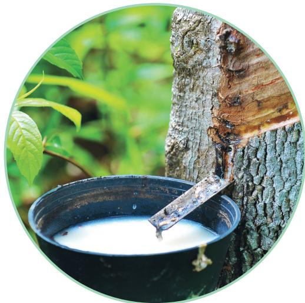

### **Supporting Agencies**

#### **Action plans**

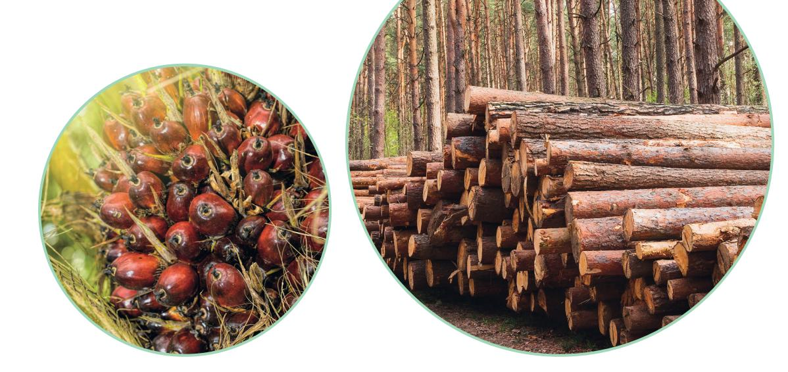

### Oil Palm Sector

### Timber / Forestry Sector

- Oil palm farmers and plantation operators should be systematically registered, with all data integrated through a national farmer registry, including information on plantation size, harvesting activities, and associated labor arrangements. Registration systems should support traceability connections between plantations, collection points, and palm oil mills to strengthen supply chain verification mechanisms. Large plantations and operators employing hired labor should be encouraged to integrate farmer registration records with worker registration systems.
- •
- •

- Registration systems for the timber and forestry sector to address gaps on small-scale plantation operators, smallholder farmers, and land use contract holders for forestry plantations and relevant plantations such as Eucalyptus, Acacia, teak, etc. The existing registration system (e-Tree) is on a voluntary registration basis, which needs to be extended. Registration data can support timber legality verification, supply chain traceability, sustainability monitoring, and compliance with emerging due diligence requirements. Incentive measures can be implemented as follows:
- Simplified registration procedures and mobile registration support for remote areas
- Improved access to agricultural subsidies, technical support, training, low-interest financing, and sustainability programs for registered farmers
- Preferential access to government-supported certification schemes, export opportunities, and market linkage programs
- Strengthen compliance and improve competitiveness in the EU market.
- Reduce costs and administrative burden by synchronizing data across systems, enabling operators to save time and improve efficiency in demonstrating supply chain compliance.
- •
- •

All agricultural registration platforms need to send annual notifications to all users/farmers, with necessary support from relevant actors, to verify and update their registration information, in order to better contribute to the europian operators´s due diligence., such as plantation mapping (points or polygons), farm or plantation size, crop types, production data, etc. It aims to ensure the accuracy and reliability of registration information to cover all changes with a track record over the past years.

- Registered farmers will gain more equitable access to government support programs, agricultural extension services, sustainability initiatives, and technical assistance that can improve productivity and long-term income stability. Registration may also facilitate access to formal financing, cooperatives, and premium markets that increasingly require traceability and due diligence compliance. Although worker registration is addressed separately under Section 2.1, stronger farmer registration systems can indirectly improve labor protection by increasing transparency regarding labor utilization at the plantation level. Better integration between farmer and worker databases can support monitoring of labor conditions, occupational safety, and legal employment practices. Registered plantations and operators will benefit from improved credibility and traceability within domestic and international supply chains. Stronger documentation systems can support compliance with emerging due diligence and sustainability requirements while improving access to buyers, certification systems, and export markets. Government agencies will gain improved oversight of agricultural production areas, labor utilization patterns, and supply chain structures. Integration with the Farmer registry will strengthen policy planning, sustainability monitoring, and national due diligence frameworks while reducing gaps in informal agricultural data systems.
- •
- •
- •
- •

### **Outcomes**

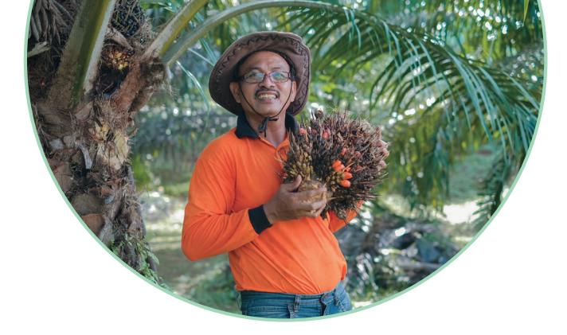

- Strengthen enforcement of labor protection laws and occupational safety standards in agricultural sectors Improve identification and monitoring of high-risk labor practices, including forced labor, child labor, and exploitative recruitment practices Strengthen inter-agency coordination in labor inspections and enforcement processes
- •
- •
- •

- Increase labor inspections in high-risk agricultural sectors, particularly rubber, timber, and oil palm plantations, with priority given to areas with high concentrations of migrant, seasonal, informal, and other vulnerable worker groups. Suggestion: create legal and/or monetary incentives for compliance (Tax reduction?). Develop risk-based inspection, mapping, and monitoring systems that prioritize sectors and geographic areas with elevated risks of forced labor, child labor, debt bondage, occupational accidents, and exploitative recruitment practices. Strengthen monitoring of labor brokers, subcontracting arrangements, recruitment fees, document retention practices, wage deductions, and other indicators of labor exploitation within agricultural supply chains. Enhance occupational safety monitoring relating to chemical exposure, chainsaw and machinery operation, heat stress, harvesting activities, transportation, and forestry-related work in high-risk environments. Improve coordination and information sharing among labor inspectors, agricultural agencies, local authorities, social protection agencies, and relevant civil society organizations in labor protection and enforcement processes.
- •
- •
- •
- •
- •

### **Approach**

### **Action plan**

### **2.5 Ensure effective labor protection through strengthened monitoring and enforcement mechanisms**

Despite existing labor protection mechanisms, labor rights violations, unsafe working conditions, and forced labor risks remain concerning within high-risk agricultural sectors. More risk-based and coordinated labor monitoring and enforcement systems are therefore needed to identify and address labor-related risks within agricultural supply chains.

Promote complaint referral and inspection coordination mechanisms linked to worker registration systems, grievance mechanisms, and labor risk monitoring processes.

- Department of Labor Protection and Welfare (DLPW) under the Ministry of Labor Department of Employment (DOE) under the Ministry of Labor
- •
- •

- Ministry of Agriculture and Cooperatives (MOAC): Supports coordination with agricultural producers, plantation operators, and high-risk agricultural sectors. Social Security Office: Supports worker formalization, social protection coverage, and access to occupational injury and compensation systems. Rubber Authority of Thailand: Supports coordination with rubber producers and plantation operators relating to labor protection, occupational safety, and sector-specific risk monitoring. Office of the Palm Oil Committee: Supports sector-specific coordination relating to labor conditions, occupational safety, and risk monitoring within palm oil supply chains. National Human Rights Commission of Thailand: Supports monitoring of labor rights concerns, vulnerable worker protections, and rights-based safeguards.
- •
- •
- •
- •
- •

These agencies are well-positioned to support labor inspection, labor protection enforcement, migrant labor oversight, and regulation of recruitment and employment practices within agricultural sectors.

Relevant labor rights and migrant worker support organizations: Support worker outreach, labor rights awareness, complaint referrals, and assistance for vulnerable and migrant workers.

### **Recommended Lead Agency**

### **Supporting Agencies**

- Improved labor rights protection and workplace safety Reduced risks of forced labor, labor exploitation, and unsafe working conditions Improved compliance with national labor laws and responsible business conduct expectations in agricultural supply chains
- •
- •
- •

### **Outcomes**

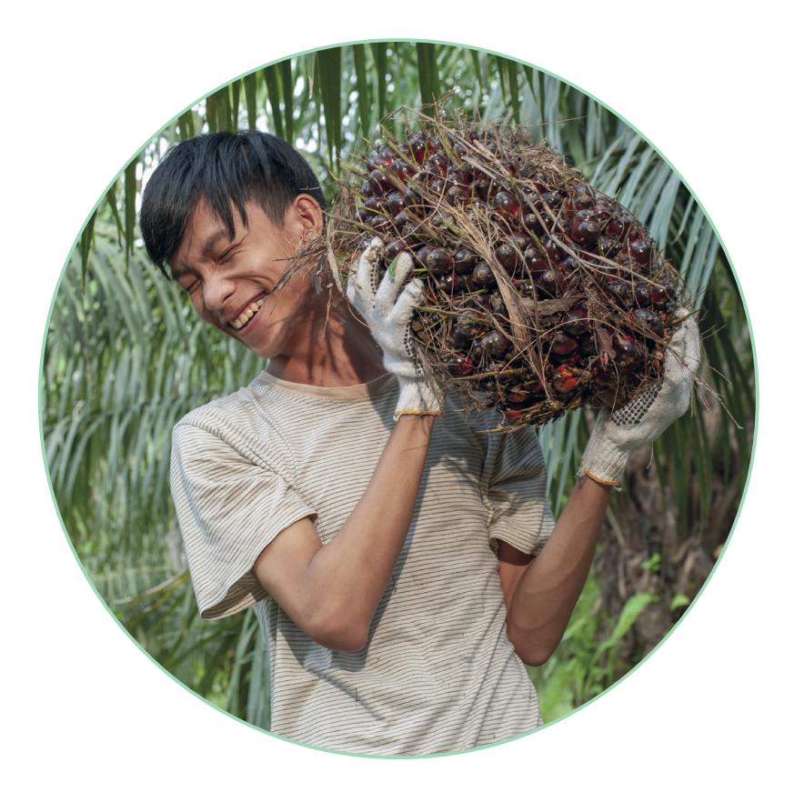

- Improve access to remedy for workers and affected local communities, particularly vulnerable and marginalized groups within agricultural supply chains. Strengthen early detection and resolution of labor rights, land rights, environmental, and occupational safety concerns Increase trust in complaint and remediation systems through independent and confidential reporting channels Promote the effective implementation of human rights and environmental due diligence, responsible business conduct, and non-retaliation practices within agricultural supply chains.
- •
- •
- •
- •

### **Approach**

### **2.6 Adopt Accessible and Trusted Grievance Mechanisms**

Access to remedy for workers and local communities in agricultural sectors remains limited, particularly for migrant and undocumented workers who often face language barriers, fear of retaliation, legal insecurity, restricted mobility, and limited trust in state complaint systems. Strengthening accessible, confidential, and non-retaliatory grievance mechanisms is therefore necessary to improve labor protection and access to remedy within agricultural supply chains.

- Develop sector-specific guidance, practical tools, and training materials on human rights and environmental due diligence (HREDD), responsible business conduct, labor rights, and environmental compliance for businesses, producer groups, cooperatives, and smallholders. Provide technical assistance, capacity-building programs, and advisory services to support the implementation of due diligence measures, risk assessment processes, and responsible sourcing practices across agricultural supply chains. Promote the integration of due diligence expectations into relevant agricultural, forestry, labor, trade, and investment policies, programs, and support schemes. Strengthen traceability, monitoring, and risk-management systems to support the identification, prevention, mitigation, and remediation of labor, environmental, and human rights risks within agricultural supply chains. Establish and strengthen accessible grievance mechanisms through hotlines, digital platforms, local complaint centers, and community-based reporting systems. Ensure grievance mechanisms are gender-responsive, culturally appropriate, multilingual, confidential, and accessible to vulnerable groups, including women, migrant workers, undocumented workers, Indigenous Peoples, and ethnic communities. Implement non-retaliation safeguards and confidential reporting channels to protect workers, complainants, community representatives, and human rights defenders from reprisals, discrimination, or other adverse consequences arising from complaints or participation in due diligence processes. Develop clear referral, investigation, remediation, and follow-up procedures for labor rights violations, forced labor risks, wage disputes, occupational safety and health concerns, land conflicts, and environmental grievances. Strengthen coordination among government agencies, businesses, worker organizations, civil society organizations, and local communities in complaint handling, remediation, and monitoring processes. Build upon and expand existing grievance and worker support mechanisms developed by civil society organizations and relevant stakeholder networks to avoid duplication and leverage established expertise and trust.
- •
- •
- •
- •
- •
- •
- •
- •
- •
- •

#### **Action plans**

- Rights and Liberties Protection Department (RLPD) under the Ministry of Justice: Supports legal protection, access to remedy, victim assistance, and justice-related coordination mechanisms for affected workers and communities. Department of Employment (DOE): Supports coordination relating to migrant workers and labor registration systems. Social Security Office (SSO): Supports access to social protection mechanisms for affected workers. Rubber Authority of Thailand: Supports coordination with rubber plantation operators, cooperatives, and local farming networks in grievance outreach and implementation processes. Office of the Palm Oil Committee: Supports outreach and coordination with palm oil sector stakeholders in grievance handling and remediation processes. Local administrative organizations (LAOs): Support local complaint coordination and community outreach. Issara Institute and relevant civil society organizations: Support worker outreach, trusted reporting channels, and assistance for vulnerable workers and communities.
- •
- •
- •
- •
- •
- •
- •

### **Supporting Agencies**

- Improved access to remedy and legal protection for workers and affected communities Increased trust and transparency in labor governance systems Earlier identification and prevention of labor rights violations and conflicts Strengthened due diligence and responsible business conduct within agricultural supply chains
- •
- •
- •
- •

### **Outcomes**

- Department of Labor Protection and Welfare (DLPW) under the Ministry of Labor (MOL) National Human Rights Commission of Thailand (NHRCT)
- •
- •

These agencies possess existing mandates related to labor protection, complaint handling, and human rights monitoring, while collaboration with NGOs can improve accessibility and trust among vulnerable groups.

### **Recommended Lead Agency**

- Improve the inclusion and participation of Indigenous Peoples and ethnic communities in agricultural, forestry, and land-use governance processes. Strengthen protection of traditional livelihoods, customary land use, cultural rights, and community participation in high-risk agricultural and forestry areas. Reduce risks of land conflicts, exclusion, and social tensions linked to agricultural expansion, forestry operations, and natural resource governance.
- •
- •
- •

- Support voluntary participatory mapping initiatives in agricultural and forestry areas through pilot projects, technical assistance, training on mapping tools and geographic information systems (GIS), and collaboration with local authorities, civil society organizations, and academic institutions. Mapping activities should be conducted with the free, prior, and informed consent of affected communities and should respect customary land rights, data privacy, and community ownership of information. Promote community-led and participatory data collection initiatives, where appropriate, to improve understanding of social, land-use, and livelihood conditions in relevant agricultural and forestry areas. Such initiatives should be voluntary and based on meaningful consultation, informed consent, data protection safeguards, and respect for community rights and ownership of information.
- •
- •

### **Approach**

### **Action plans**

### **2.7 Ensure the Meaningful Participation and Recognition of Indigenous Peoples and Ethnic communities in Due Diligence Process**

Certain agricultural and forestry areas overlap with the livelihoods, customary land use, and cultural practices of Indigenous Peoples and ethnic communities. However, limited participation mechanisms, data gaps, and unclear institutional coordination continue to affect their inclusion in land-use and agricultural governance processes. Strengthening participation, consultation, and rights-based safeguards, including principles related to Free, Prior and Informed Consent (FPIC), is therefore important for reducing conflicts and improving responsible governance in high-risk agricultural and forestry areas.

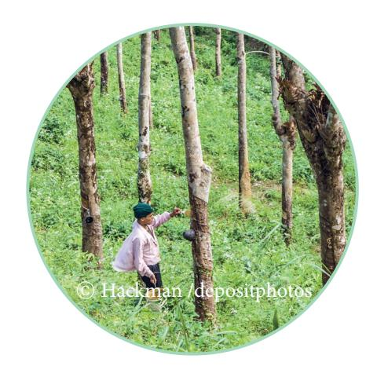

- Royal Forest Department (RFD) under the Ministry of Natural Resources and Environment (MONRE) Department of National Parks, Wildlife and Plant Conservation (DNP) under MONRE Department of Social Development and Welfare (DSDW) under the Ministry of Social Development and Human Security (MSDHS)
- •
- •
- •

- Department of Provincial Administration under the Ministry of Interior (MOI): Supports coordination with provincial and local administrative structures. Department of Agricultural Extension under the Ministry of Agriculture and Cooperatives (MOAC): Supports outreach and coordination with agricultural communities in relevant areas. National Human Rights Commission of Thailand: Supports human rights monitoring and rights-based safeguards. Relevant civil society, community-based, and Indigenous rights organizations: Support community engagement, participation, and trust-building processes.
- •
- •
- •
- •

These agencies are well-positioned to support this effort due to their responsibilities relating to forest governance, protected areas, land-use management, vulnerable communities, community welfare, and participation in areas where agricultural and forestry activities may affect Indigenous Peoples and local communities.

### **Recommended Lead Agency**

### **Supporting Agencies**

- Encourage voluntary community-led assessments and knowledge-sharing initiatives, where appropriate, to inform land-use planning, conflict prevention, and sustainable agricultural and forestry governance. Ensure that agricultural and forestry policies, programs, and decision-making processes consider potential impacts on traditional livelihoods, vulnerable groups, gender equality, social inclusion, and community rights through appropriate consultation and stakeholder engagement mechanisms. Establish clear procedures for stakeholder consultation, information disclosure, and community feedback in agricultural and forestry decision-making processes, including approaches consistent with FPIC where applicable.
- •
- •

- Improved inclusion of vulnerable and historically marginalized communities in governance and decision-making processes Reduced risks of land conflicts and social tensions in agricultural and forestry areas Improved conflict-sensitive and rights-based governance practices Stronger alignment with sustainability, responsible business conduct, and due diligence expectations
- •
- •
- •
- •

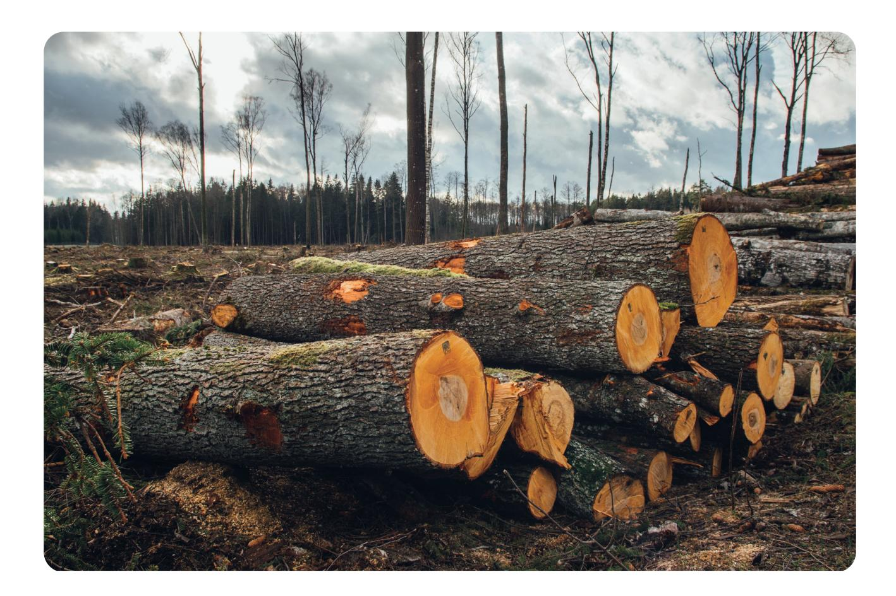

Improved understanding of community-related risks, land-use overlap, and conflict-sensitive areas in agricultural and forestry sectors

#### **Outcomes**

### **Environmental Due Diligence**

### **3.1 Encourage and support Eco-industrial practices as a foundation for environmental due diligence preparedness**

Strengthen eco-industrial practices and environmental governance by enhancing monitoring, verification, enforcement, and compliance mechanisms to ensure adherence to environmental regulations and due diligence expectations. It is recommended that industrial operators achieve at least Green Industry Level 3 (GI3: Green System) as a minimum baseline for environmental due diligence preparedness. At this level, firms establish systematic environmental management practices, including environmental management systems, regular monitoring and reporting of environmental performance, and continuous improvement processes. These internal systems provide a practical foundation for identifying, managing, and mitigating environmental risks across operations and supply chains.

The Department of Industrial Works (DIW) should continue to promote Green Industry training programs and certification schemes to support industry transition toward sustainable production. **While Green Industry certification does neither provide or gurarantee access to EU market under the EUDR nor direct financial incentives, it offers important reputational and market-related benefits,** including enhanced corporate credibility, official government recognition, increased trust among business partners and investors, improved access to international markets, and stronger support for ESG and sustainability reporting. These benefits can help firms strengthen their competitiveness while building capacity to meet emerging due diligence requirements in global value chains.

- To Increase the number of eco-industrial practices and enhance readiness for EUDR and CSDDD requirements To ensure consistent and effective compliance with existing environmental and industrial regulations To establish accountability mechanisms within the industrial sector
- •
- •
- •

#### **Approach**

- Department of Industrial Works (DIW)
- •

- Local industries Local Government Communities TEI/GIZ can act as facilitator to engage stakeholders mentioned above
- •
- •
- •
- •

- DIW should incorporate "due diligence practices" into its strategic framework while supporting industries in progress toward Green Industry (GI). At the provincial level, DIW should organize targeted sessions to communicate, promote, and raise awareness of eco-industrial practices and the requirements for achieving GI.
- •
- •

- Promote the adoption of green practices across industries and strengthen the capacity of Thai suppliers and exporters to effectively respond to due diligence information requests from EU operators and buyers. Industries demonstrate accountability and readiness to develop and implement environmental due diligence practices.
- •
- •

#### **Lead Agency**

#### **Supporting agencies**

#### **Action plans**

#### **Outcomes**

- Promote and facilitate the registration of SMEs through OSMEP by integrating registration processes with existing digital platforms and business licensing systems. OSMEP may consider launching awareness campaign: "SME One ID = Your Business Passport" to ensure SMEs understand the benefits and requirements of registration OSMEP may consider providing budget and support for SMEs to strengthen readiness for due diligence
- •
- •
- •

### **Action plans**

- Establish a comprehensive and up-to-date database of SMEs, especially in mid-stream industries, enabling targeted support, improved traceability, and supporting EU operators in meeting their due diligence obligations under EUDR and CSDDD.
- •

### **Approach**

### **3.2 Promote SME registration to facilitate access to financial support, training opportunities, advisory services**

According to the Office of Small and Medium Enterprises Promotion (OSMEP), as of 2025, a total of 13,321 SMEs operate across sectors relevant to EUDR compliance and due diligence preparedness. These include wooden furniture manufacturing (8,325 enterprises), sawmilling (2,343 enterprises), the manufacture of rubber sheets and blocks (1,555 enterprises), rubber tree cultivation (544 enterprises), oil palm cultivation (441 enterprises), and logging (113 enterprises).

Recognizing the importance of supporting SMEs in accessing government services and compliance related assistance, OSMEP has simplified its business registration procedures and enhanced digital registration platforms. The SME One ID platform serves as a one-stop registration system that enables SMEs to submit their information through a single process, allowing relevant government agencies to access and utilize shared data. This approach reduces administrative duplication, improves data consistency, and facilitates access to government services, financial support, training programs, and capacity-building initiatives.

Despite these improvements, further outreach, communication, and awareness-raising efforts are needed to encourage greater participation among SMEs and to ensure that businesses fully understand the benefits of registration, particularly in the context of due diligence, traceability, and maintaining access to international markets.

- The Office of Small and Medium Enterprises Promotion (OSMEP)
- •

- Ministry of Industry Ministry of Commerce Pollution Control Department (PCD) Bank for Agriculture and Agricultural Cooperatives (BAAC) SME Development Bank EXIM Bank
- •
- •
- •
- •
- •
- •

### **Recommended Lead Agency**

### **Supporting agencies**

- Facilitates compliance with EUDR and CSDDD due diligence requirements by providing verified business information, reduces compliance barriers for SMEs, and strengthens their integration into formal and traceable supply chains. This, in turn, enhances competitiveness and supports access to international markets. Enables businesses to access financing and receive support for business adaptation, as well as to prepare for due diligence implementation.
- •
- •

### **Outcomes**

- OSMEP may consider providing incentives to encourage participation, such as access to training, financial support, and technical assistance. Link SME registration data with national traceability systems and data repositories to support due diligence, monitoring, and reporting. Capacity-building activities and awareness campaigns should be conducted to ensure SMEs understand the benefits and requirements of registration.
- •

- Department of Agriculture National Bureau of Agricultural Commodity and Food Standards
- •
- •

- TEI can act as facilitator to engage stakeholders mentioned above
- •

### **Recommended Lead Agencies**

#### **Supporting agency**

- To enhance SMEs' access to relevant environmental certifications and eco-labels (e.g., GAP, FSC, PEFC, RSPO, Green Label) as enabling mechanisms and processes that can support and prepare businesses for due diligence under frameworks such as EUDR and CSDDD.
- •

### **Approach**

### **3.3 Encourage and support Thai business owners to obtain relevance certifications as a foundation for environmental due diligence preparedness**

Relevant certification schemes and third-party verification may therefore help Thai businesses meet information requests and support operators' due diligence processes. However, **certification alone does not replace EUDR due diligence requirements** and should only be considered supporting evidence within broader risk assessment and compliance systems.

The promotion of certification schemes may also involve significant financial and administrative costs, particularly for smallholders and SMEs, including audit fees, documentation requirements, training, and compliance management. A broad recommendation to pursue certification may therefore unintentionally disadvantage smaller producers or create barriers to market access if not accompanied by adequate support measures and careful assessment of local contexts and actual market needs.

- Initiate communicate and share policy recommendation with relevant organizations such as RAOT, RSPO, DOA (Good Agricultural Practice, GAP), FSC, and DCCE (Green Production Label) to encourage the integration of due diligence requirements into their certification promotion efforts, ensuring that businesses adopt due diligence practices as part of the certification process Promote a Complementary Role for Certification Schemes: Clearly communicate that certifications (e.g., GAP, FSC, RSPO) are not substitutes for due diligence, but can complement due diligence processes by supporting transparency, traceability, and the collection of relevant compliance information. OSMEP could provide targeted training and capacity-building programs to help SMEs translate certification requirements into practical due diligence processes, including record-keeping, geolocation data management, supply chain mapping, risk assessment, and mitigation measures. Provide financial support (e.g. Business Development Service (BDS) program), technical assistance, and simplified procedures to enable SMEs to adopt certifications as a first step toward DD compliance, and support preparation for the due diligence process. Connect certification data with national traceability systems to facilitate verification and reporting for due diligence processes
- •
- •
- •
- •
- •

### **Action plans**

- These certifications can serve as supporting tools that help SMEs strengthen transparency and risk management practices relevant to environmental due diligence.
- •

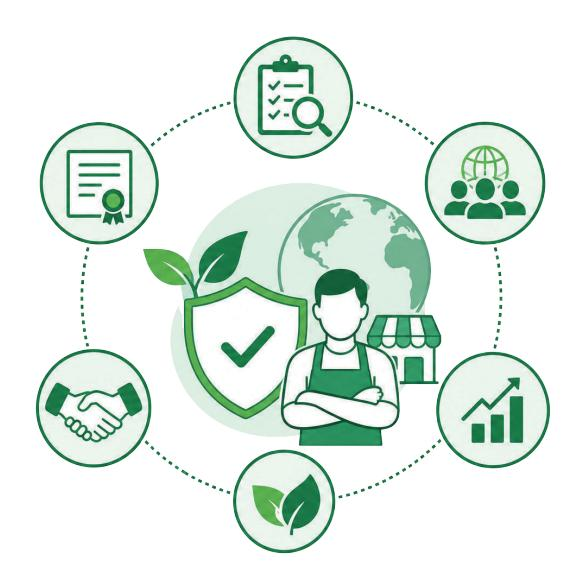

### **Outcome**

- Encourage positive perception, technology acceptance, and operational readiness across the supply chain, ensuring stakeholders perspective the digital traceability platform and related tools. Enhance comprehensive knowledge and digital literacy among all actors—particularly smallholders and SMEs—enabling them to effectively utilize the platform, capture required data, and implement due diligence processes with EUDR/CSDDD requirements. Build robust collaborative networks and peer-learning schemes (such as mentorships led by successful businesses to early adopters) to ensure continuous knowledge transfer, drive meaningful participation, and strengthen responsible business conduct in line with EUDR and CSDDD requirements.
- •
- •
- •

### **Objectives**

### **Enhance Competency of key stakeholders**

### **4.1 Embed knowledge and digital literacy among smallholder farmers and workers**

To foster positive stakeholder perception and demonstrate high feasibility, a comprehensive competency building strategy must be deployed to enhance the knowledge, skills, and attitudes of key actors across the supply chain. This will be achieved by implementing peer-to-peer support programs and mentorship schemes led by early adopters to shift mindsets, enhancing baseline knowledge sharing regarding compliance mandates, and providing targeted technical support to equip farmers and operators with practical capabilities for data collection and due diligence support, collectively driving meaningful participation and responsible business conduct.

**4.** 

- Ministry of Agriculture and Cooperatives (MOAC) specifically driven by the Department of Agriculture (DOA) The National Bureau of Agricultural Commodity and Food Standards (ACFS) to initiate curriculum design, standard formulation, capability-building alignment, and multi-stakeholder network coordination.
- •
- •

- Local Authorities, Universities, and Independent Organizations: Act as regional extension nodes to deploy standardized training curricula, scale up knowledge distribution, and facilitate audit exercises (Data and process) Department of Agricultural Extension (DOAE): Execute on-the-ground, field-level training, focusing on data collection techniques and land plot geolocation mapping. Digital Government Development Agency (DGA) / Ministry of Digital Economy and Society (MDES): Deliver technical expertise to elevate digital literacy and accelerate platform adoption among grassroots stakeholders
- •
- •
- •

### **Recommended Lead Agencies**

### **Supporting agencies**

- ARDA may consider providing funding, in collaboration with the Department of Agriculture (DOA), to establish a learning platform, develop user manuals, and training workshops that support farmers and workers in building digital skills, such as Geolocation mapping, Farmer registration via Farm Book, SMEs registration via SMEs One ID program Develop standardized, practical guidance and training materials that help stakeholders understand relevant EUDR and CSDDD requirements and build capacities in areas such as traceability, data collection, documentation, risk assessment, and access to relevant digital tools and platforms. The program should emphasize hands-on, practical training tailored to real use cases—such as farm registration, geolocation mapping, traceability systems, and basic data entry for due diligence requirements. Scale via Regional Networks: Establish a regional Training of Trainers (ToT) network with key partners to expand outreach and accelerate nationwide knowledge sharing, with the ToT Guidebook developed by the EUDR Engagement Project serving as one of the core training materials. Establish a "Training of Trainers" (ToT) network with regional partners to accelerate nationwide knowledge distribution and conduct mock audit drills. Training delivery should combine in-person sessions with simple digital learning materials.
- •
- •
- •

### **Action plans**

- Thai farmers and business operators gain knowledge, improve readiness, strengthen practical compliance capabilities, build confidence in meeting regulatory requirements, reduce the burden of compliance processes, and minimize the risk of non-compliance.
- •

#### **Outcomes**

- Enhance practical skills relating to documentation, record-keeping, and evidence management within due diligence systems. Improve the ability of business operators, farmers, and relevant stakeholders to demonstrate good-faith efforts and continuous improvement in due diligence implementation. Strengthen practical competencies relating to labor protection, grievance handling, occupational safety, and supply chain traceability documentation.
- •
- •
- •

#### **Approach**

### **4.2 Practical Skills for Maintaining Due Diligence Records and Supporting Documentation**

Many business operators, farmers, and other stakeholders continue to face challenges not only in understanding due diligence requirements and expectations, but also in maintaining accurate records and supporting documentation relevant to supply chain traceability and risk management. Strengthening practical skills in documentation, record-keeping, and information management can help improve transparency, support responsible business practices, and facilitate compliance with buyer, certification, and regulatory requirements.

- Conduct field-level workshops to provide hands-on assistance for farmers in plot boundaries, data collection, and geolocation mapping. Deploy peer-to-peer mentoring led by early adopters to build confidence, share practical experiences, and foster community-wide compliance readiness.
- •

- Develop sector-specific training materials, templates, checklists, and practical guidance on documentation and record-keeping practices for the rubber, timber, and oil palm sectors. Provide hands-on training on maintaining records relating to worker registration, occupational safety training, grievance handling, supplier engagement, and risk mitigation processes. Promote practical understanding of how documented risk-management measures, stakeholder engagement efforts, grievance handling processes, and other relevant records can contribute to due diligence processes and supply chain verification requirements. Develop simplified documentation tools, self-declaration templates, sample record-management systems, and sector-specific case studies suitable for SMEs, farmers, cooperatives, and local operators to facilitate the provision of information relevant to traceability, responsible sourcing, and supply chain verification requirements. Support peer-learning activities, workshops, and technical guidance sessions that allow stakeholders to exchange practical experiences and implementation challenges.
- •
- •
- •
- •
- •

#### **Action plans**

- Department of Agricultural Extension (DOAE) under the Ministry of Agriculture and Cooperatives (MOAC) Rubber Authority of Thailand (RAOT)
- •
- •

These agencies are well-positioned to support technical training, outreach, and practical implementation support relating to due diligence documentation and agricultural supply chain governance.

### **Recommended Lead Agencies**

- Office of the Palm Oil Committee: Supports outreach and coordination within palm oil supply chains. National Bureau of Agricultural Commodity and Food Standards (ACFS): Supports technical guidance relating to agricultural standards, traceability, and documentation systems. Department of International Trade Promotion (DITP) under the Ministry of Commerce: Supports awareness relating to sustainability-related trade and export expectations. Universities and academic institutions: Support technical guidance, training materials, and practical learning activities. Relevant civil society organizations and business associations: Support outreach, peer learning, and stakeholder engagement activities.
- •
- •
- •
- •
- •

### **Supporting agencies**

- Improved practical competencies relating to due diligence implementation and documentation among business operators, farmers, and relevant stakeholders Increased transparency and traceability within agricultural supply chains Reduced compliance burdens and implementation gaps through clearer and more practical guidance tools Stronger alignment with responsible business conduct and emerging due diligence expectations in domestic and international markets.
- •
- •
- •
- •

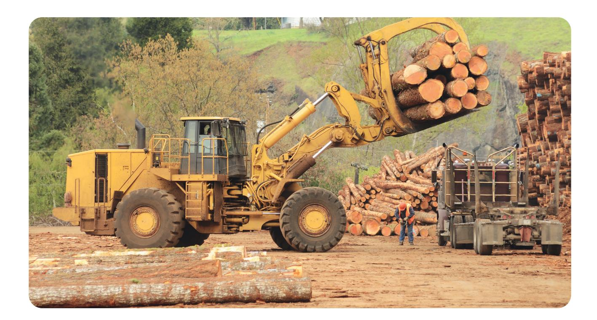

#### **Outcomes**

### **Recommended Lead Agency**

#### **Data repository and supporting platform 5.**

### **5.1 Develop a centralized data repository and integrate it with the national traceability system**

Develop a centralized data repository integrated with the national traceability system. By 2026, provide open access to relevant national laws and regulations on forests, environment, labor, occupational health and safety, data on farmer registration, SMEs, and agricultural workers, as well as other essential information required for due diligence. The information should be made publicly available through a dedicated online platform to support transparency, traceability, and compliance with international due diligence requirements. At present, the EUDR Thailand platform (https://eudrthai.com/) serves as a repository of research outputs funded by the Agricultural Research Development Agency (Public Organization) (ARDA) under the EUDR research program. The platform provides access to studies on traceability systems, geolocation verification, and assessments of Thai forestry and agricultural laws, including analyses of their compatibility with EUDR requirements and the identification of regulatory gaps. It also offers guidance, updates, and practical resources to support stakeholders in preparing for EUDR implementation.

### **Approach**

To establish a centralized and reliable data repository that supports traceability, due diligence, and regulatory compliance by integrating data from relevant agencies and supply chain actors.

- In the short term, each agency should continue to collect, maintain, and manage its own datasets within its area of responsibility. Once the National Single Window platform \* is fully established, these datasets can be integrated through an interoperable system, enabling more efficient data sharing, reducing duplication, and supporting due diligence, traceability, and compliance requirements. In addition, The National Single Window platform should establish a robust data protection framework, as it will collect, process, store, and share data among multiple stakeholders. The Thailand National Single Window is a national digital platform designed to streamline import and export processes by enabling the electronic exchange of data and documents among government agencies and private-sector stakeholders. Through a Single Submission and Single Data Sharing approach, businesses can submit information once and have it accessed by multiple authorized agencies. The system is managed by the Digital Government Development Agency (DGA) in collaboration with relevant trade and customs authorities, with the Customs Department serving as the principal operational agency.
- •
- •

- Reduce data duplication and improve data accuracy, thereby enhancing the efficiency of due diligence reporting. Increase transparency, supportefficient due diligence processes, strengthens risk assessment capabilities, and enable better policy planning and national-level reporting.
- •
- •

#### **Action plans**

### **Outcomes**

- Ministry of Interior (Department of Land) Ministry of Natural Resources and Environment (MONRE) Ministry of Digital Economy and Society (MDES) TEI can act as facilitator to engage stakeholders Agricultural Research Development Agency (Public Organization) (ARDA).
- •
- •
- •
- •
- •

#### **Supporting agencies**

- A National Due Diligence Single Window Committee (which could be integrated with or established as a separate entity from the National EUDR Committee)
- •

### **Recommended Lead Agency**

- Organizations with a mandate in sustainability or development (e.g., TEI, TBCSD) can act as facilitator to engage stakeholders mentioned above European Union Delegation to Thailand
- •
- •

#### **Supporting agency**

To provide practical, hands-on support to businesses especially SMEs and their EU trading partners (operators) in understanding evolving due diligence expectations from international markets and strengthening their capacity to provide relevant traceability, risk-related, and compliance information.

### **Approach**

- Establish a "Due Diligence Help Desk" as a hybrid service platform combining physical advisory sessions and online support. The Help Desk will provide tailored guidance on traceability, geospatial mapping (including Global Forest Cover/GFC2020 data), human rights and environmental due diligence documentation, and reporting requirements. Services may include one-on-one consultations, sector-specific Help Desk (e.g., rubber, timber, palm oil, etc), template provision, and case-based troubleshooting. The Help Desk should be linked to the national data repository and information platform to ensure access to updated regulations, tools, and verified data. In addition, train-the-trainer programs and collaboration with universities can be used to scale expertise and ensure continuity.
- •

### **Action plans**

- Shouldn´t the helpdesk be also a single window for european businesses to get support? The Help Desk provides up-to-date regulatory guidance and reduces uncertainty through direct expert support, while improving the accuracy and credibility of due diligence documentation and accelerating learning and adoption among businesses. It also strengthens supply chain alignment, enhances risk management, and improves the ability of Thai firms particularly SMEs to access and compete in European markets.
- •

### **Outcomes**

## **National Roadmap for Due Diligence Implementation**

This table presents a comprehensive national roadmap for strengthening due diligence implementation in Thailand in response to the EU Deforestation Regulation (EUDR) and the Corporate Sustainability Due Diligence Directive (CSDDD). It outlines a phased approach across short-term (2026), medium-term (2027–2028), and long-term (2028–2029) actions, covering key policy areas including traceability systems, farmer and worker registration, data governance, capacity building, and institutional coordination.

Each recommendation is supported by specific activities, clearly identified target groups, and designated lead agencies to ensure effective implementation. The table also highlights expected outputs and intended outcomes/impacts, emphasizing improvements in traceability, due diligence compliance, cost efficiency, stakeholder capacity, and sustained access to EU markets.

Overall, this roadmap serves as a strategic framework to align national systems, strengthen multi-agency coordination, and support businesses—particularly SMEs and smallholders in meeting international due diligence requirements, while enhancing transparency, accountability, and sustainable supply chain governance (Table 2).

### **Table 2: Roadmap for due diligence implementation**

| Period               | Recommendation                                                                                                                 | Activity                                                                                                                                                                                                                                                                                                                                                                   | Expected output                                                                                                                                                                                           | Outcome/Impact                                                             |
|----------------------|--------------------------------------------------------------------------------------------------------------------------------|----------------------------------------------------------------------------------------------------------------------------------------------------------------------------------------------------------------------------------------------------------------------------------------------------------------------------------------------------------------------------|-----------------------------------------------------------------------------------------------------------------------------------------------------------------------------------------------------------|----------------------------------------------------------------------------|
| Short-term (2026) | 1. Scale a nationwide digital infrastructure to enable comprehensive supply chain traceability.  (National Traceability) | Transition the system to DOAE and scale it nationwide using existing government networks, ensuring data privacy compliance  Integration of Thai standard 'One Map' system is utilized as a basemap to verify and ensure the accuracy of government land boundaries.  Remark: Boundary verification does not certify land rights.                               | A fully operational National Traceability Platform that is seamlessly interoperable with government data repositories, and safeguards data privacy while providing public access for verification by 2026 | Enhance the cost competitiveness and cost efficiency of business operators |
|                      | 2. Provide HRDD workshop for all stakeholders in supply chain                                                                  | DITP together with experts organize HRDD workshop. Participants should be familiar with the following topics: - Human rights due diligence processes - Risk identification and mitigation - Stakeholder engagement - Documentation and evidence of procedures - Grievance and remediation mechanisms - Relevant international frameworks and regulations | Stakeholders understand HRDD                                                                                                                                                                              | Enhanced traceability and due diligence                                    |
|                      | 3. Strengthen farmer registration by providing tangible incentives and deploying targeted communication                        | - DOA and RAOT at the provincial level should organize regular communication sessions with farmers, conducted at least three times per year to promote and facilitate farmer registration, supported by clear incentives, share value, and proactive institutional communication                                                                                           | - Increase number of farmers registration in Farm Book - Universal access for registered farmers to state subsidies, incentives, geolocation data collection, and legally compliant production         | Enhanced traceability and due diligence                                    |

| Period               | Recommendation                                                                                          | Activity                                                                                                                                                                                                          | Expected output                                                                                                                                                                                                                         | Outcome/Impact                                        |                                                          |
|----------------------|---------------------------------------------------------------------------------------------------------|-------------------------------------------------------------------------------------------------------------------------------------------------------------------------------------------------------------------|-----------------------------------------------------------------------------------------------------------------------------------------------------------------------------------------------------------------------------------------|-------------------------------------------------------|----------------------------------------------------------|
| Short-term (2026) | 3. Strengthen farmer registration by providing tangible incentives and deploying targeted communication | - Organize coordination sessions among DOA, RAOT, and RFD to align and integrate the Farm Book, rubber farmer registration, and e-Tree systems for unified data sharing and management.                           | - Enable Thai exporters and suppliers to access farmer data, based on informed consent, to support due diligence requirements under EUDR (including geolocation and land title information).                                            | Enhanced traceability and due diligence               |                                                          |
|                      |                                                                                                         | - DOA should ensure that the Farm Book system envisioned as the primary national farmer registration platform is user-friendly, reliable across both desktop and mobile devices, and free of charge for all users |                                                                                                                                                                                                                                         |                                                       |                                                          |
|                      |                                                                                                         | 4. Ensure effective labor protection through strengthened monitoring and enforcement mechanisms                                                                                                                   | DLPW should strengthen monitoring and inspection systems to identify high-risk labor practices, including forced labor, child labor, exploitative recruitment, excessive working hours, wage violations, and unsafe working conditions. | Improved labor rights protection and workplace safety | Increased awareness of labor rights and workplace safety |
|                      |                                                                                                         |                                                                                                                                                                                                                   | DLPW should improve complaint, referral, and remediation mechanisms to ensure timely protection for affected workers, including migrant workers and vulnerable groups.                                                                  |                                                       |                                                          |
|                      |                                                                                                         |                                                                                                                                                                                                                   | DLPW should publicly disclose data and trends related to labor risk identification and enforcement actions to enhance transparency and support preventive measures.                                                                     |                                                       |                                                          |

| Period            | Recommendation                                                                              | Activity                                                                                                                                                                                                                                                                                                                                                                                                                                                                                                                                                                                                                                                                                                                                                                                                                                                                                                                                                                                                                                                                                                                | Expected output                                                                      | Outcome/Impact                                                                                                                              |
|-------------------|---------------------------------------------------------------------------------------------|-------------------------------------------------------------------------------------------------------------------------------------------------------------------------------------------------------------------------------------------------------------------------------------------------------------------------------------------------------------------------------------------------------------------------------------------------------------------------------------------------------------------------------------------------------------------------------------------------------------------------------------------------------------------------------------------------------------------------------------------------------------------------------------------------------------------------------------------------------------------------------------------------------------------------------------------------------------------------------------------------------------------------------------------------------------------------------------------------------------------------|--------------------------------------------------------------------------------------|---------------------------------------------------------------------------------------------------------------------------------------------|
|                   | 5. Adopt accessible and trust grievance and remedial mechanism in public and private sector | The Department of Labour Protection and Welfare (DLPW) should continuously improve and promote complaint and consultation channels to ensure they are user-friendly, multilingual, and accessible to all workers, including migrant workers and vulnerable groups. Existing channels include: <ul> <li>• Ministry of Labour Hotline: 1506 (press 3) or 1546</li> <li>• Ministry of Labour online grievance system</li> <li>• Online submission (Form Kor.7) through the e-Service system at eservice. labour.go.th</li> <li>• Official LINE account: @prdlpw</li> </ul> 
Relevant agencies should also recognize and collaborate with trusted third-party grievance and worker-support platforms operated by civil society organizations, trade unions, and NGOs, such as the Issara Worker Voice application, which can help workers report concerns more safely and access support services.
 
Relevant agencies and companies should regularly assess the effectiveness and accessibility of grievance mechanisms, including through surveys and stakeholder feedback, to support continuous improvement.
 | Workers and migrant workers are aware of and can access trusted grievance mechanisms | Increased awareness of labor rights, grievance mechanisms, and responsible business conduct among business operators, farmers, and workers. |
| Short-term (2026) |                                                                                             |                                                                                                                                                                                                                                                                                                                                                                                                                                                                                                                                                                                                                                                                                                                                                                                                                                                                                                                                                                                                                                                                                                                         |                                                                                      |                                                                                                                                             |

| Period               | Recommendation                                                                                  | Activity                                                                                                                                                                                                                                                                                                                                                                                          | Expected output                                                                                                                                                                                                                                                                                                                                                                                                                                                                                                                                                                                                                                                                                                          | Outcome/Impact                                                                                |                                                                                                                             |
|----------------------|-------------------------------------------------------------------------------------------------|---------------------------------------------------------------------------------------------------------------------------------------------------------------------------------------------------------------------------------------------------------------------------------------------------------------------------------------------------------------------------------------------------|--------------------------------------------------------------------------------------------------------------------------------------------------------------------------------------------------------------------------------------------------------------------------------------------------------------------------------------------------------------------------------------------------------------------------------------------------------------------------------------------------------------------------------------------------------------------------------------------------------------------------------------------------------------------------------------------------------------------------|-----------------------------------------------------------------------------------------------|-----------------------------------------------------------------------------------------------------------------------------|
| Short-term (2026) | 6. Embed knowledge and digital literacy among smallholder farmers and workers | - ARDA may consider providing funding, in collaboration with the Department of Agriculture (DOA), to establish a learning platform, develop user manuals, and training workshops that support farmers and workers in building digital skills, such as Geolocation mapping, Farmer registration via Farm Book, SMEs registration via SMEs One ID program | - Learning platform - Manuals for the traceability platform                                                                                                                                                                                                                                                                                                                                                                                                                                                                                                                                                                                                                                                     | - Farmers and workers demonstrate a basic understanding of digital literacy |                                                                                                                             |
|                      |                                                                                                 | 7. Practical Skills for Maintaining Due Diligence Records and Supporting Documentation                                                                                                                                                                                                                                                                                             | Relevant government agencies, in collaboration with experts and partner organizations, should organize workshops on "documentation and record-keeping " in due diligence for Thai exporters and suppliers. Participants should become familiar with: • Documentation and record-keeping practices • Risk identification and mitigation procedures • Stakeholder engagement records • Supply chain traceability documentation • Grievance and remediation records • Internal monitoring and reporting processes • Evidence required to demonstrate good-faith due diligence efforts under relevant international frameworks and regulations | Participants understand how to prepare and implement due diligence processes.  | Enhance the capacity and ensure the correct process on due diligence for Thai exporters and suppliers? |

| Period                  | Recommendation                                                                                                                                                                                                       | Activity                                                                                                                                                                                                                                                                                                                                                                 | Expected output                                                                                                                                                                                                                                                                    | Outcome/Impact                                                                                                                                               |
|-------------------------|----------------------------------------------------------------------------------------------------------------------------------------------------------------------------------------------------------------------|--------------------------------------------------------------------------------------------------------------------------------------------------------------------------------------------------------------------------------------------------------------------------------------------------------------------------------------------------------------------------|------------------------------------------------------------------------------------------------------------------------------------------------------------------------------------------------------------------------------------------------------------------------------------|--------------------------------------------------------------------------------------------------------------------------------------------------------------|
|                         | 
8. Develop a centralized data repository and integrate it with the national traceability system.
                                                                                                              | 
- TEI could lead collaboration with the Thailand National EUDR committee* and Big Data Institute by providing existing datasets particularly from the Status Quo Analysis to support the development of a centralized data repository
                                                                                                                             | 
Open access to relevance law/ regulations necessary information for due diligence posted on the website by 2026
                                                                                                                                                             | 
Reduce data duplication and improve data accuracy, thereby enhancing the efficiency of due diligence reporting.
                                       |
|                         | 
9. Establish a voluntary agricultural worker registration system
                                                                                                                                              | 
- MOAC could lead the convening of a multi-agency session bringing together the SSO, DLPW, TPQI, DOE, and DSD to jointly develop a voluntary registration system for workers in the agricultural sector
 
Develop an initial
 
- competency-based training curriculum and certification framework for labor in the timber, rubber, and palm oil sectors
 | 
- Initial action plan to develop registration system and Database for Agricultural Workers by early 2027
 
- Achieve full registration of workers in the agricultural sector by 2028
 
- Competency-based training curriculum and certification framework by 2027
 | 
Ensured the ordinary welfare support system covers to all agricultural workers along the supply chain.
 
Enhanced traceability and due diligence
 |
| Medium term (2027-2028) | 
10. Encourage and support Eco-industrial practices as a foundation for environmental due diligence preparedness (*** Use of GI is not the same as due diligence but use certification as supporting evidence)
 | 
- DIW should incorporate "due diligence practices" into its strategic framework while supporting industries in progress toward Green Industry (GI).
 
- At the provincial level, DIW should organize targeted sessions to communicate, promote, and raise awareness of eco-industrial practices and the requirements for achieving GI.
                       | 
- Increase the number of eco-industrial practices
                                                                                                                                                                                                                           | 
Industries
                                                                                                                                            |

| Period                  | Recommendation                                                                                                                                                                                                                                          | Activity                                                                                                                                                                                                                                                                                                                                                                                          | Expected output                                                                                                                               | Outcome/Impact                                                                                                                   |
|-------------------------|---------------------------------------------------------------------------------------------------------------------------------------------------------------------------------------------------------------------------------------------------------|---------------------------------------------------------------------------------------------------------------------------------------------------------------------------------------------------------------------------------------------------------------------------------------------------------------------------------------------------------------------------------------------------|-----------------------------------------------------------------------------------------------------------------------------------------------|----------------------------------------------------------------------------------------------------------------------------------|
| Medium term (2027-2028) | 11. Establish an Agricultural Workforce Database                                                                                                                                                                                                        | - MOAC should develop a standardized agricultural workforce database by harmonizing workforce information and data standards across relevant agricultural, labor, migration, and social protection agencies                                                                                                                                                                                       | Workforce database                                                                                                                            | Improved workforce visibility across agricultural sectors, including informal, seasonal, migrant, and other vulnerable workers   |
|                         | 12. Promote SME registration to facilitate access to financial support, training opportunities, advisory services                                                                                                                                       | - OSMEP may consider launching awareness campaign: "SME One ID = Your Business Passport" to ensure SMEs understand the benefits and requirements of registration                                                                                                                                                                                                                                  | Increase the number of SMEs registered in the SME One ID program, enabling access to funding and training to support due diligence readiness. | SMEs are ready to develop and implement due diligence practices, ensuring continued access to EU markets                         |
|                         | 13. Encourage and support Thai business owners to obtain relevance certifications as a foundation for environmental due diligence preparedness (*** Use of certification is not the same as due diligence but use certification as supporting evidence) | - TEI could initiate communicate and share policy recommendation with relevant organizations such as RAOT, RSPO, DOA (Good Agricultural Practice, GAP), FSC, and DCCE (Green Production Label)—to encourage the integration of due diligence requirements into their certification promotion efforts, ensuring that businesses adopt due diligence practices as part of the certification process | Increase the number of Thai business owners to obtain sustainability certifications                                                           | Thai business operators demonstrate accountability and readiness to develop and implement environmental due diligence practices. |

| Period                     | Recommendation                                                                                                                | Activity                                                                                                                                                                                                                                                                                                                                                                                                                                                                                                                                                                                   | Expected output                                                                                                                                                                                                                                                                                                                                                                           | Outcome/Impact                                                                                                                                                                                                                                        |
|----------------------------|-------------------------------------------------------------------------------------------------------------------------------|--------------------------------------------------------------------------------------------------------------------------------------------------------------------------------------------------------------------------------------------------------------------------------------------------------------------------------------------------------------------------------------------------------------------------------------------------------------------------------------------------------------------------------------------------------------------------------------------|-------------------------------------------------------------------------------------------------------------------------------------------------------------------------------------------------------------------------------------------------------------------------------------------------------------------------------------------------------------------------------------------|-------------------------------------------------------------------------------------------------------------------------------------------------------------------------------------------------------------------------------------------------------|
|                            | 14.Establish Due Diligence Help Desk for SMEs, Industrial owners, Business owners, Exporters and EU operators                 | - The National EUDR committee* should consider establish Due Diligence Help Desk                                                                                                                                                                                                                                                                                                                                                                                                                                                                                                           | - Initial plan to establish Due Diligence Help Desk by 2027 - Establish Due Diligence Help Desk by 2027                                                                                                                                                                                                                                                                                | Ensure clear and accurate communication to support business owners in properly implementing due diligence and facilitating compliance for EU operators, thereby enhancing supply chain trade readiness, as well as improving cost and time efficiency |
|                            | 15. Ensure the Meaningful Participation and Recognition of Indigenous Peoples and Ethnic communities in Due Diligence Process | - The Royal Forest Department (RFD) and the Department of National Parks, Wildlife and Plant Conservation (DNP) should conduct participatory and community-based mapping, including spatial maps and data-sharing mechanisms identifying potential overlap between agricultural areas, forest areas, and Indigenous and ethnic communities' customary land use areas. - Relevant agencies should develop practical guidance for engaging Indigenous Peoples and ethnic communities using intercultural and conflict-sensitive approaches. Such guidance should establish procedures for | - Spatial maps identifying potential overlap between agricultural expansion areas, forest areas, and Indigenous and ethnic communities' customary land use areas. - Indigenous Peoples and ethnic communities provide informed consent through culturally appropriate and customary decision-making processes before activities affecting their lands and livelihoods are implemented. | - More inclusive and culturally appropriate due diligence processes. - Reduced risk of community conflict - Improved trust and communication between authorities, companies, and Indigenous Peoples and ethnic communities.                     |
| Long term plan (2028-2029) |                                                                                                                               |                                                                                                                                                                                                                                                                                                                                                                                                                                                                                                                                                                                            |                                                                                                                                                                                                                                                                                                                                                                                           |                                                                                                                                                                                                                                                       |

| Period                     | Recommendation | Activity                                                                                                                                                                                                                                                                                                                                                                                                                                                                                                                                                                                                                                                                                                                                                                                                                                                                                                                                                                                                                                                                                                       | Expected output                                                                                                                                                   | Outcome/Impact |
|----------------------------|----------------|----------------------------------------------------------------------------------------------------------------------------------------------------------------------------------------------------------------------------------------------------------------------------------------------------------------------------------------------------------------------------------------------------------------------------------------------------------------------------------------------------------------------------------------------------------------------------------------------------------------------------------------------------------------------------------------------------------------------------------------------------------------------------------------------------------------------------------------------------------------------------------------------------------------------------------------------------------------------------------------------------------------------------------------------------------------------------------------------------------------|-------------------------------------------------------------------------------------------------------------------------------------------------------------------|----------------|
| Long term plan (2028-2029) |                | 
exporters, suppliers, local authorities, and project implementers to identify legitimate and locally recognized representatives and customary authorities, conduct consultations in local languages and culturally appropriate formats, ensure inclusion of women, youth, and marginalized groups, allow sufficient time for internal community decision-making, and avoid consultation practices that may create or reinforce divisions within communities.
 <ul> <li>- Relevant agencies should apply conflict-sensitive safeguards to mapping activities, farm registration, traceability systems, inspections, and land-use processes to prevent unintended harms to Indigenous Peoples and ethnic communities.</li> <li>- Relevant agencies should communicate with Thai exporters and suppliers to raise awareness of the rights of Indigenous Peoples and ethnic communities, including fair consideration of agricultural products and pricing, protection of ethnic livelihood areas, and recognition of their rights within agricultural supply chains and due diligence processes.</li> </ul> | <ul> <li>- Recognition of the rights of Indigenous Peoples and ethnic communities to their agricultural products and livelihoods within supply chains.</li> </ul> |                |

| Period                     | Recommendation | Activity                                                                                                                                                                                                                                                                                                                                                                          | Expected output | Outcome/Impact |
|----------------------------|----------------|-----------------------------------------------------------------------------------------------------------------------------------------------------------------------------------------------------------------------------------------------------------------------------------------------------------------------------------------------------------------------------------|-----------------|----------------|
| Long term plan (2028-2029) |                | <ul> <li>- Relevant agencies may draw upon existing international guidance and tools on Indigenous Peoples' engagement and Free, Prior and Informed Consent (FPIC), while allocating appropriate resources for translation, intercultural facilitation, participatory mapping, repeated consultations, and capacity development for officials and supply-chain actors.</li> </ul> |                 |                |

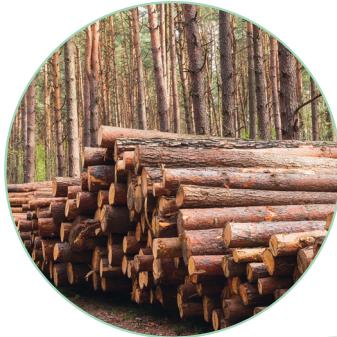

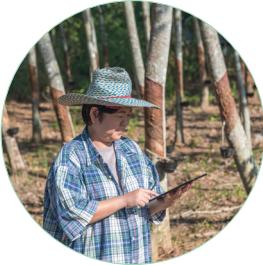

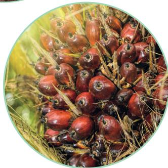

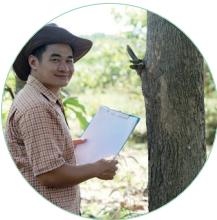

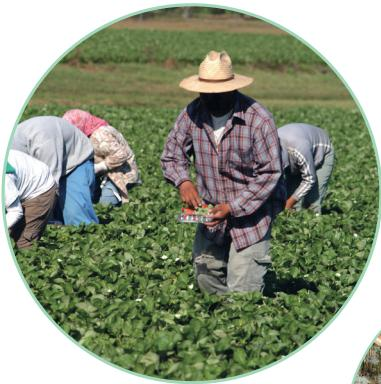

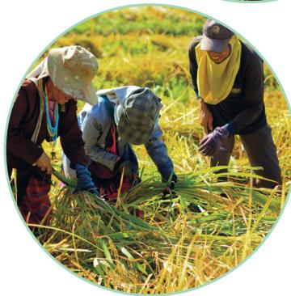

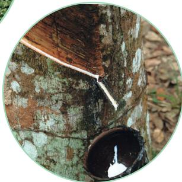

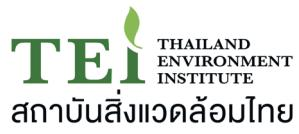

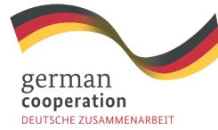