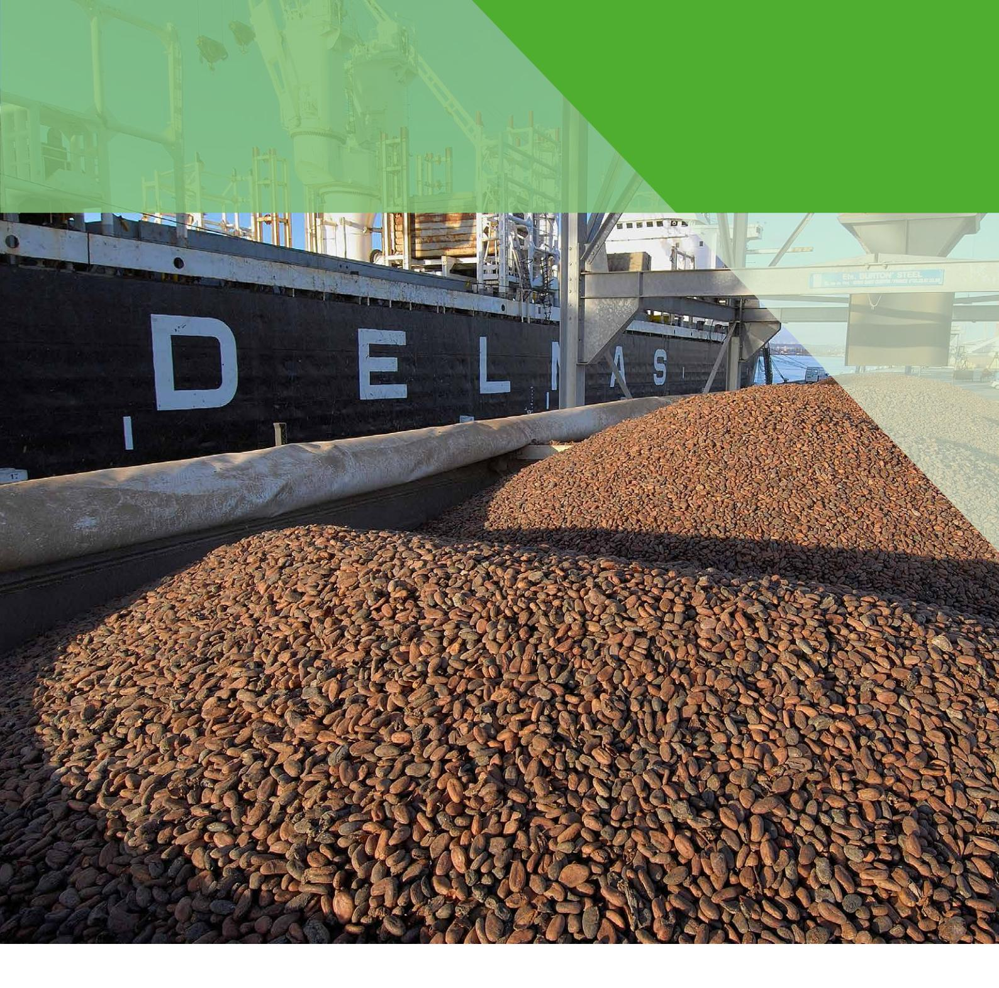

# **Traceability and transparency of cocoa supply chains in Côte d'Ivoire and Ghana**

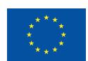

| 1. | Cocoa supply chain description                                    | 5    |
|----|-------------------------------------------------------------------|------|
|    | 1.1 Côte d’Ivoire .                                               | 5    |
|    | Production                                                        | 5    |
|    | National trade .                                                  | . 10 |
|    | Processing and export                                             | 11   |
|    | 1. 2 Ghana                                                        | . 14 |
|    | Production                                                        | 14   |
|    | National trade .                                                  | . 16 |
|    | Processing and export                                             | 20   |
|    | 1. 3 Smuggling between Ghana, Côte d’Ivoire and Liberia .         | . 21 |
|    | 1. 4 Consumer markets                                             | 22   |
|    | Importers and chocolate manufacturers                             | . 22 |
| 2. | Traceability initiatives and trends                               | . 24 |
|    | 2.1 Côte d’Ivoire’s Conseil Café Cacao (CCC) .                    | . 24 |
|    | 2.2 Ghana's Cocobod                                               | . 26 |
|    | Overview of Ghana’s Cocoa Traceability System .                   | . 26 |
|    | Current Cocoa Traceability System in Ghana .                      | . 26 |
|    | Gaps in the current system .                                      | . 32 |
|    | Proposed reforms to cocoa traceability in Ghana                   | 32   |
|    | 2.3 Certifications’ traceability requirements                     | 33   |
|    | 2.4 Private exporters and processors traceability systems .       | . 35 |
| 3. | Traceability challenges: an opportunity to enhance transparency . | 37   |
|    | 3.1 Challenges faced by current traceability schemes              | 37   |
|    | 3. 2 Transparency as a means to improve traceability .            | . 39 |
| 4. | Sources of information to monitor sustainability risk             | . 42 |
| 5. | Conclusion                                                        | . 44 |

## Table of contents

#### **Disclaimer**

This report has been prepared by Nitidae for the EU REDD Facility, with the assistance of the European Union. The contents of this report are the sole responsibility of the authors and can under no circumstances be regarded as reflecting the position of the European Union.

© EU REDD Facility, March 2021.

**Suggested citation:** Nitidae and EFI, Traceability and transparency of cocoa supply chains in Côte d'Ivoire and Ghana, 2021.

## Table of figures

| Figure 1                               | . Comparison of different mapping of cocoa production and             |
|----------------------------------------|-----------------------------------------------------------------------|
| acreage from different sources .       | 5                                                                     |
| Figure 2.                              | Size cocoa trade by department in share of national production,       |
|                                        | average of three seasons 2017/2018 – 2018/2019 – 2019-2020 6          |
| Figure 3. Land cover of Côte d’Ivoire  | 7                                                                     |
| Figure 4.                              | Cocoa farms number by region in Côte d’Ivoire 7                       |
| Figure 5.                              | Land productivity changes NDVI-USGS 2018 . 8                          |
| Figure 6.                              | Geographical distribution of cocoa production in southern             |
| Côte d’Ivoire during 2017 to 2020      | 8                                                                     |
| Figure 7.                              | Snapshot of cocoa acreage and classified forests layers combined      |
| in IMAGE platform .                    | 9                                                                     |
| Figure 8.                              | National cocoa supply chain with estimated shares in 2019/2020 . . 11 |
| Figure 9.                              | Evolution of the market shares of the eight main cocoa                |
| exporters/processors in Côte d’Ivoire  | 11                                                                    |
| Figure 10.                             | Certification and ‘transparency’ initiatives of the main cocoa        |
| exporters of Côte d’Ivoire .           | . 12                                                                  |
| Figure 11.                             | Farm mapping and certified volumes of the main cocoa                  |
| exporters in Côte d’Ivoire .           | . 13                                                                  |
| Figure 12.                             | Extract from the Olam-CFI progress report 2019/2020 . . 13            |
| Figure 13.                             | Cocoa map production by region and chart of the evolution of          |
|                                        | cocoa production by region from 1960/1961 to 2018/2019 . . 15         |
| Figure 14.                             | Land-use map with distinction between full sun cocoa and              |
| agroforestry cocoa in Southern Ghana . | . 16                                                                  |
| Figure 15.                             | List of active LBCs during the 2016/2017 cocoa                        |
| season in Ghana                        | 16                                                                    |
| Figure 16.                             | Snapshot of Cocoa Board Annual reports with traded                    |
| quantities by LBC .                    | . 17                                                                  |
| Figure 17.                             | List of the main LBC during the 2016/2017 cocoa season in Ghana . 18  |
| Figure 18.                             | Share of national trade in cocoa by corporations 19                   |
| Figure 19.                             | Cocoa supply chain in Ghana, based on Cocobod and LBCs data . 20      |
| Figure 20.                             | Processing shares of local processors in Ghana during                 |
| 2016/2017 season .                     | . 20                                                                  |

| Figure 21.                                  | Evolution of share of cocoa beans traded by Côte d’Ivoire and            |
|---------------------------------------------|--------------------------------------------------------------------------|
|                                             | Ghana with price spread between the two countries . . 21                 |
| Figure 22.                                  | Comparison of cocoa beans export price between Ghana,                    |
| Côte d’Ivoire and Liberia                   | 21                                                                       |
| Figure 23.                                  | Ghana cocoa beans and cocoa product imports by main importers . . 22     |
| Figure 24.                                  | Estimation of quantity of beans traded and declared percentage           |
| manufacturers.                              | . 23                                                                     |
| Figure 25.                                  | Screenshot of SYDORE . . 24                                              |
| Figure 26.                                  | Screenshot of CCC web platform to monitor quality, input                 |
|                                             | distribution, export, processing and international sales . 25            |
| Figure 27.                                  | Scheme of CCC’s current monitoring system 25                             |
| Figure 28.                                  | Sample Farmer’s Passbook issued by Cocobod . 27                          |
| Figure 29.                                  | Sample Daily Stock book kept by purchasing clerks at the clerk’s         |
| shed level .                                | . 27                                                                     |
| Figure 30. Bulking Sheet sample             | 28                                                                       |
| Figure 31.                                  | Waybill accompanying cocoa from the purchasing clerk shed                |
| level.                                      | 28                                                                       |
| Figure 32.                                  | Sample warehouse receipt . . 29                                          |
| Figure 33.                                  | ‘Society’ (purchasing clerk shed) detailed report (tally sheet). 30      |
| Figure 34.                                  | Sample material transfer note . 30                                       |
| Figure 35.                                  | Sample siding depot waybill 31                                           |
| Figure 36.                                  | Cocoa supply chain monitoring system in Ghana 31                         |
| Figure 37.                                  | Comparison of the traceability requirements of different                 |
| certification standards                     | . 34                                                                     |
| Figure 38.                                  | List of software used by the main trading companies for traceability. 35 |
| Figure 39.                                  | Challenges to full traceability . . 39                                   |
| Figure 40.                                  | Share of the national production bought by the top six international     |
| of cocoa beans in Ghana and Côte d’Ivoire . | . 39                                                                     |
| Figure 41.                                  | Available data identified during the study 42                            |

### 1.1 Côte d'Ivoire

### **Production**

Cocoa is produced almost everywhere in the southern half of Côte d'Ivoire. Unfortunately, accurate information on the geographical extension of production by region or department is unavailable.

This study could only gather limited information on the number of farmers involved in cocoa production by region from national agriculture surveys (RNA 2014 and 2016). Further, remote sensing data and several maps from different sources, compared below, provide an inaccurate image of cocoa acreage by region (BNETD 2016, Vivid Economics 2017, JRC).

**Figure 1.** Comparison of different mapping of cocoa production and acreage from different sources

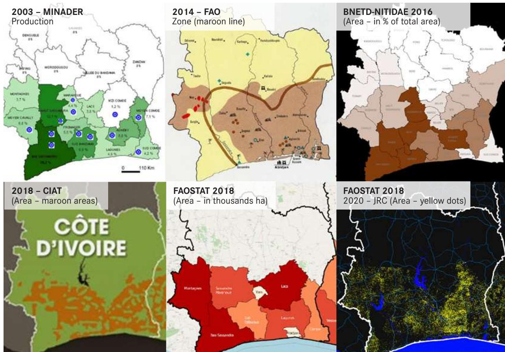

## 1. Cocoa supply chain description

When compared with the cocoa trading data by department provided by the Coffee-Cocoa Board (in French, Conseil du Café et du Cacao or CCC), all these maps seem to be relatively inaccurate.

**Figure 2.** Size of cocoa trade by department in share of national production, average of three seasons 2017/2018 – 2018/2019 – 2019-2020. **Source:** Mapping of CCC data by IED-Nitidae¹

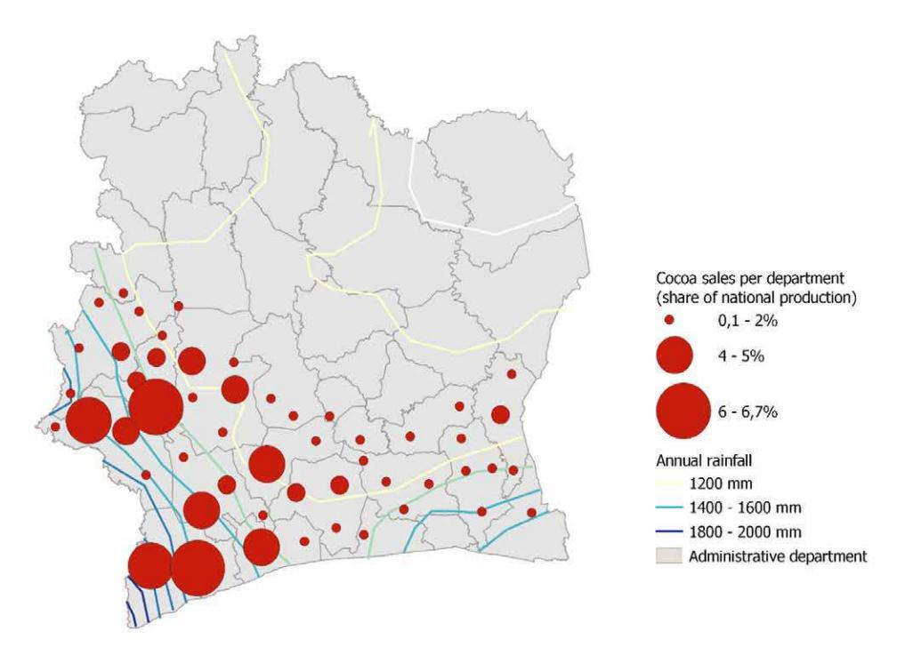

Various reasons can explain the differences between several data sources and this more accurate mapping of production areas:

- **Differences in yields** between older production areas in the east, and younger cocoa production areas in the west. In the west, more cocoa plantations are in their first cycle. The cocoa trees were planted more recently and including in forest areas in the west, taking advantage of post-forest fertility and lower pest pressure. They are also better maintained. Average yields in the east and the centre of the country are probably much lower than in the west. This can explain, in part, the difference between acreage and production data.
- **Shaded cocoa production** in classified forests of the west is harder to detect by remote sensing. Nonetheless, three to four years after planting, most shade trees are dead (either burnt or slowly killed by farmers who cut their bark). Remote sensing should therefore now be able to identify most productive areas.
- **Concerns of Ivorian authorities** and cocoa exporting companies about the increased awareness of other stakeholders (final buyers, retailers, consumers, NGOs, governments) of the higher deforestation risks of the west. In the east and the centre of the country, most forests were converted to cocoa, rubber and palm oil production many years ago.

The recent land use/deforestation mapping carried out by the Ministry of Planning and Development, Vivid Economics and the UK Space Agency in 2017, and updated in November 2020, seems much more accurate, as shown below.

**Figure 3.** Land cover of Côte d'Ivoire. **Source:** Mighty Earth with data from Image (Vivid Economics, UK Space Agency & Ministry of Planning and Development)

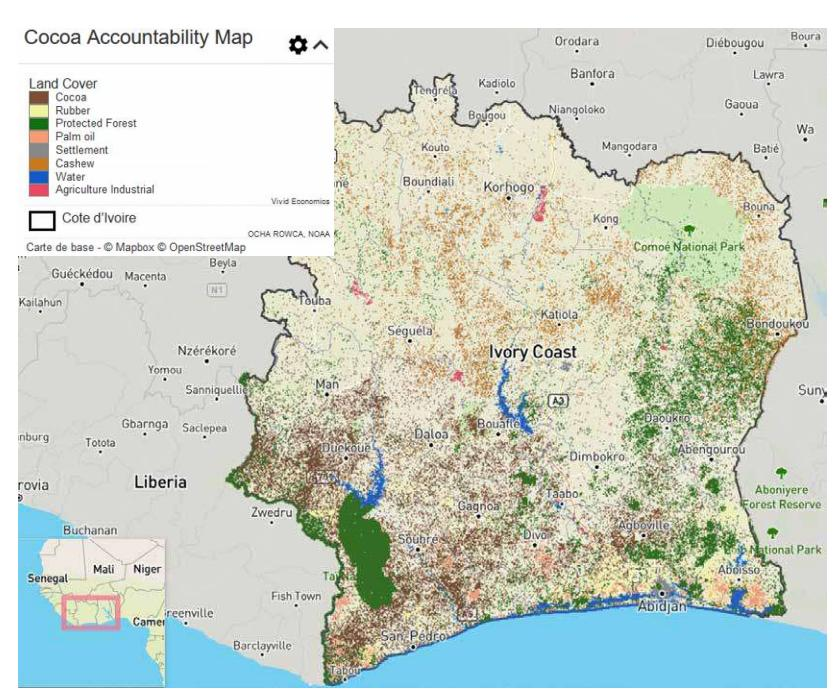

A map from the National Farm Survey report (REEA 2016²) also shows the concentration of cocoa production in the West. This is despite being based on the number of cocoa farms only, and not on production or acreage data.

**Figure 4.** Cocoa farms number by region in Côte d'Ivoire. **Source:** REEA 2016 - FAO

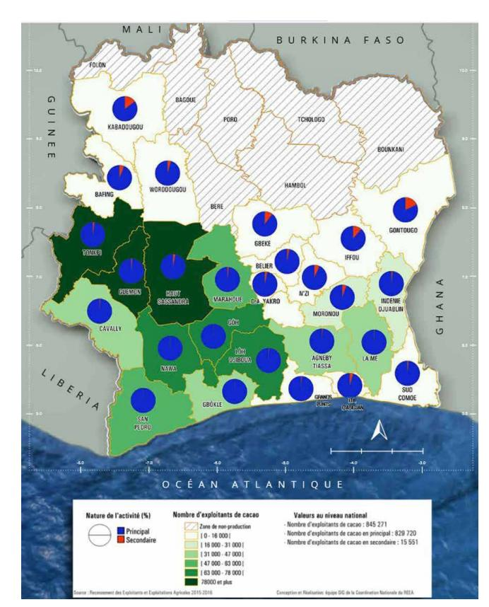

² <http://www.fao.org/3/ca3111fr/CA3111FR.pdf>

The combination of these three maps confirms that nowadays, most cocoa production is concentrated in the west of Côte d'Ivoire. This finding is confirmed by the land productivity dynamics map below, which shows that in southern Côte d'Ivoire, those regions are the ones with the highest decline in productivity.

It can be concluded from the above that around 60% of Côte d'Ivoire's cocoa production - or 37% of global cocoa production - is concentrated in the western regions of the country. Only 8% of the Ivorian output is sourced in the eastern regions.

**Figure 5.** Land productivity changes NDVI-USGS 2018. **Source:** [www.earthmap.org](http://www.earthmap.org)

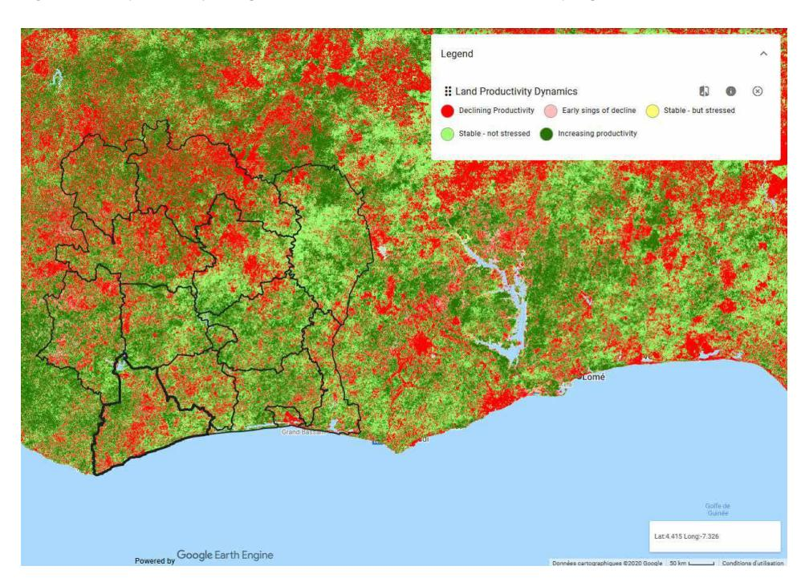

**Figure 6.** Geographical distribution of cocoa production in southern Côte d'Ivoire during 2017 to 2020. **Source:** Nitidae based on CCC data

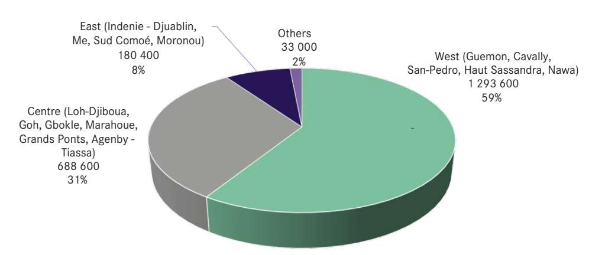

Figure 6 indicates that a large share of the production in the west comes from classified forests. In informal interviews, most stakeholders in the cocoa sector, including cocoa exporters and processors, estimated that at least one third of Ivorian cocoa comes from classified forests. This figure is likely to be slightly inflated. Considering that 25% to 30% of cocoa is produced in these protected areas would be a more accurate estimate. The concentration is particularly high in several classified forests that were (re)categorised as 'agroforests' during the 2019 forest reform (see list below), but also in national parks (see in bold and italic below).

**Figure 7.** Snapshot of cocoa acreage and classified forests layers combined in IMAGE platform. **Source:** Mighty Earth with data from IMAGE (Vivid Economics, UK Space Agency & Ministry of Planning and Development)

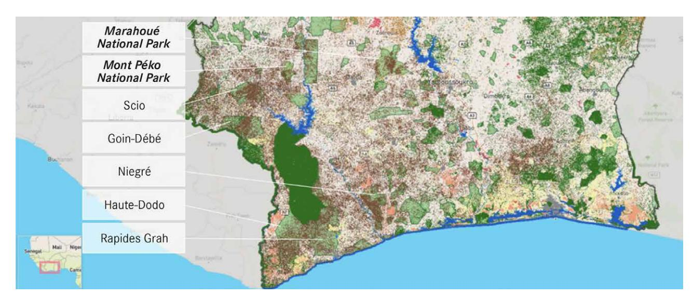

In April 2019, the CCC initiated a national census of cocoa farmers, including georeferencing of all cocoa farm plots. This census is conducted by a team of 800 enumerators and is expected to be completed by March 2021. At the time of writing (December 2020), two point four million hectares had already been georeferenced. CCC estimates these to represent around 60% of the total acreage. In October 2020, CCC's enumerators were georeferencing cocoa plots in classified forests.

The census also covers socioeconomic indicators. These include issues related to the household and its 'leader' (including ID documentation), production factors (inputs, storage capacity, cost of manpower) and presence of swollen shoot virus and other pests affecting cocoa yields.

CCC's medium-term objective is to build a complete identification system of cocoa farmers, with a unique identification number for each farmer and full traceability from plot to port. After the census, unregistered farmers will be required to register in a CCC regional office to be able to sell their production. A CCC officer will geo-reference their cocoa plots during the registration process. In the long term, the CCC intends to use this traceability system to promote the complete digitalisation of payments in the cocoa sector.

CCC contracted a consulting firm to design the architecture of the traceability and payment system. It is in the process of gathering information on the traceability systems developed by the different exporting companies. However, they will propose a new system to replace the multiple and independent traceability systems.

#### **National trade**

A handful of large farms (over 10 ha) sell directly to the local cooperative or to a wholesaler. Otherwise, most cocoa farmers sell their beans to small local traders called 'pisteurs' (literally, 'trackers') and to 'cooperative sections'.

Cooperative sections exist in most villages and even in informal hamlets in former forest areas called 'campements' or camps. Many cooperatives have sections close to, or inside protected area/classified forests as documented in a 2013 report co-authored by GIZ and the Ivorian Agriculture Ministry³.

As a result of the traceability and certification programmes implemented by almost all the cocoa exporting companies during the last decade, cooperatives' market share has grown. Based on our interviews, around 45% of cocoa beans is estimated to have been traded through cooperatives during the last two seasons.

Generally, the cooperative's headquarters is based in a middle-sized city or subprefecture. But the cooperative's supply is spread among several villages, sometimes farther than 100 km from the headquarters, where the cooperative has 'sections' and where the cleaning, grouping and often the storage of the cocoa beans are organised before purchase and transportation.

Most farmers sell their cocoa beans to both local traders and cooperatives. Cooperatives can compete with local traders thanks to the certification premium they can offer, at least for part of the farmers' production. However, they are usually unable to collect their members' entire production for various reasons: their shorter period of activity (they often start buying cocoa beans several weeks after the start of the trading season due to limited funding); higher operational costs in comparison to local traders who trade other commodities than cocoa; and their ability to pay certification premiums only for part of the cocoa beans delivered. Furthermore, local traders can often provide other services to farmers, such as credit, advantages in the sale or purchase of food crops, supply of inputs, more efficiently and consistently than cooperatives. This allows them to keep a good market share.

As explained in a research article by Ruf and al. of 2020⁴, cooperatives have to purchase cocoa beans outside their sections (to small local traders or even large wholesalers) to respect the quality requirement of the exporter or processor to whom they sell certified beans. In parallel, some cooperatives' sections sell their members' production to wholesalers when the payment from the cooperative takes too long, or if those wholesalers can propose a higher certification premium.

Finally, even if the national supply chain could be simplified by referring to a 'cooperative supply chain' and an 'independent trader supply chain', both are interdependent. All exporters interviewed recognised that even if they wanted to increase the share of cooperatives in their supply chain, they would maintain part of their supply from local wholesalers. This is because the latter are more efficient in terms of trading cost and delivery time, less risky in terms of financial embezzlement, and partly or even entirely self-funded. The most ambitious exporters and national processors indicated they could source up to 90% of their cocoa beans through cooperatives in the medium term, but none mentioned a 100% target.

³ Étude de la production de cacao en zone riveraine du Parc national de Taï, février 2013. Auteurs : Frédéric Varlet et Georges Kouame, publication du GIZ en collaboration avec le Ministère ivoirien de l'Agriculture et la Coopération allemande.

⁴ Ruf François, Uribe Leitz Enrique, Gboko Kouamé Casimir et al., « Des certifications inutiles ? Les relations asymétriques entre coopératives, labels et cacaoculteurs en Côte d'Ivoire », Revue internationale des études du développement, 2019/4 (N° 240), p. 31-61. DOI : 10.3917/ried.240.0031. URL: [https://www.cairn-int.info/revue-internationale-des-etudes-du](https://www.cairn-int.info/revue-internationale-des-etudes-du-developpement-2019-4-page-31.html#)[developpement-2019-4-page-31.htm](https://www.cairn-int.info/revue-internationale-des-etudes-du-developpement-2019-4-page-31.html#)

**Figure 8.** National cocoa supply chain with estimated shares in 2019/2020. **Source:** Nitidae

**Figure 9.** Evolution of the market shares of the eight main cocoa exporters/processors in Côte d'Ivoire⁵

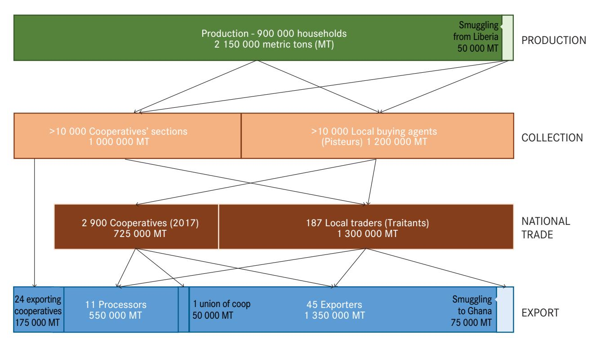

#### **Processing and export**

Available data on processing and export shows that this activity is very concentrated, even if the concentration decreased in comparison to the 2000s.

|                                                                | 2004 / 2005 | 2006 / 2007 | 2016 / 2017 | 2017 / 2018 | 2018 / 2019 | 2019 / 2020 |
|----------------------------------------------------------------|-------------|-------------|-------------|-------------|-------------|-------------|
| Market share of the eighth-largest cocoa exporters /processors | 73%         | 76%         | 59%         | 61%         | 63%         | 62%         |

Furthermore, the main clients (importers) of the Ivorian exporting companies are the sister companies of the top six international trading companies (Barry Callebaut, Olam, Cargill, ECOM, Touton and SUCDEN⁶).

The market share of Ivorian cocoa trade of these six companies is therefore probably greater than what appears in the export statistics of Côte d'Ivoire. Among the top 16 exporters/processors, which represent 78% of the cocoa exports, most are involved in or implementing a certification and traceability scheme (see Figure 10).

⁵ [https://www.scirp.org/html/htmltables/3-2120190Templetes/3-2120190\\_table\\_5.htm](https://www.scirp.org/html/htmltables/3-2120190Templetes/3-2120190_table_5.htm) and customs data processed by Nitidae. ⁶ <https://www.africasourcing.net/our-clients/our-references/>

**Figure 10.** Certification and 'transparency' initiatives of the main cocoa exporters of Côte d'Ivoire. **Source:** Nitidae based on companies' websites. RA= Rainforest Alliance; FLO= Fairtrade

| Rank      | Group name                                     | CTY | Website                         | Name in CI                                      | Market share | UTZ | RA | FLO | Organic | Map of cooperative for direct supply                                                                                                                                                                                                                                              |
|-----------|------------------------------------------------|-----|---------------------------------|-------------------------------------------------|--------------|-----|----|-----|---------|-----------------------------------------------------------------------------------------------------------------------------------------------------------------------------------------------------------------------------------------------------------------------------------|
| <b>1</b>  | <b>CARGILL</b>                                 | US  | www.cargill.com                 | CARGIL WA (beans) & CARGILL COCOA SA (grinding) | 11.9%        | x   | x  | x   |         | <a href="https://www.cargill.com/sustainability/cocoa/partner-cooperatives">https://www.cargill.com/sustainability/cocoa/partner-cooperatives</a>                                                                                                                                 |
| <b>2</b>  | <b>Barry Callebaut</b>                         | CH  | www.barry-callebaut.com         | BCN (beans) + SACO (Process)                    | 11.8%        | x   | x  | x   |         | <a href="https://www.barry-callebaut.com/en/group/forever-chocolate/sustainable-range/transparency-and-traceability-our-cocoa-supply-chain">https://www.barry-callebaut.com/en/group/forever-chocolate/sustainable-range/transparency-and-traceability-our-cocoa-supply-chain</a> |
| <b>3</b>  | <b>Olam</b>                                    | SG  | www.olamgroup.com               | OUTSPAN. + Olam Cocoa Processing + UNICAO       | 10.3%        | x   | x  | x   |         | <a href="https://ofis.olamdigitalcom/#/login">https://ofis.olamdigitalcom/#/login</a> Access restricted to clients                                                                                                                                                             |
| <b>4</b>  | <b>Société Agricole de Café et de Cacao</b>    | CI  | http://sacc-ci.com              | SACC + SAF CACAO + CIPEXICI                     | 7,6%         | x   | x  | x   |         | No website – no data                                                                                                                                                                                                                                                              |
| <b>5</b>  | <b>Touton</b>                                  | FR  | www.touton.com                  | TOUTON NEGOCE CI (TNCI)                         | 6,3%         | x   | x  | x   |         | <a href="https://touton.com/touton-cocoa-sourcing-map-cote-d-ivoire">https://touton.com/touton-cocoa-sourcing-map-cote-d-ivoire</a>                                                                                                                                               |
| <b>6</b>  | <b>Sucre &amp; Denrées</b>                     | FR  | www.sucden.com                  | SUCDEN CÔTE D'IVOIRE                            | 5,8%         | x   | x  | x   |         | Access restricted to clients                                                                                                                                                                                                                                                      |
| <b>7</b>  | <b>S3C</b>                                     | CI  |                                 | S 3 C                                           | 5.4%         | x   | x  | x   |         | No website – no data                                                                                                                                                                                                                                                              |
| <b>8</b>  | <b>Cémoi</b>                                   | FR  | www.cemoi.fr                    | CEMOI TRADING S.A.                              | 3.4%         | x   | x  | x   | x       | <a href="https://www.mightyearth.org/cocoa-accountability">https://www.mightyearth.org/cocoa-accountability</a>                                                                                                                                                                   |
| <b>9</b>  | <b>Africa Sourcing</b>                         | CI  | www.africasourcing.net          | ARMAJARO NEGOCE                                 | 2,9%         | x   |    | x   |         | No data on suppliers                                                                                                                                                                                                                                                              |
| <b>10</b> | <b>ECOM</b>                                    | CH  | www.ecomtrading.com             | ZAMACOM S.A.                                    | 2,7%         | x   |    | x   |         | <a href="http://www.ecomsms.com">www.ecomsms.com</a> Access restricted to clients                                                                                                                                                                                              |
| <b>11</b> | <b>ECOOKIM</b>                                 | CI  | http://ecookim.com              | Union des Sociétés Coopérative Kimbe            | 2,5%         | x   | x  | x   | x       | <a href="http://ecookim.com/notre-reseau/">http://ecookim.com/notre-reseau/</a>                                                                                                                                                                                                   |
| <b>12</b> | <b>EUROFIND</b>                                | CI  |                                 | Ivory Cocoa Product                             | 2.0%         | x   |    | x   |         | No website – no data                                                                                                                                                                                                                                                              |
| <b>13</b> | <b>Tan Mondial</b>                             | SG  | www.tanmondial.com              | TAN IVOIRE SARL                                 | 1,7%         |     | x  |     |         | No data                                                                                                                                                                                                                                                                           |
| <b>14</b> | <b>Société de négoce de matières premières</b> | CI  |                                 | SONEMAT                                         | 1,7%         |     |    |     |         | No website – no data                                                                                                                                                                                                                                                              |
| <b>15</b> | <b>SCAT</b>                                    | CI  |                                 | STE COOP AGRI DE TOUIH                          | 1,6%         |     | x  |     |         | No website – no data                                                                                                                                                                                                                                                              |
| <b>16</b> | <b>CNEK</b>                                    | CI  | https://www.facebook.com/cnekci | COOPÉRATIVE NOUVEL ESPRIT DE KETESSO            | 1,5%         | x   | x  | x   |         | No data                                                                                                                                                                                                                                                                           |

Published data by exporters provides some indication of the size of the certified procurement.

**Figure 11.** Farm mapping and certified volumes of the main cocoa exporters in Côte d'Ivoire. **Source:** Nitidae based on company reports and websites

|      |            | Quantity of cocoa               | Number of plots/             | Quantity certified (all                      |
|------|------------|---------------------------------|------------------------------|----------------------------------------------|
| Rank | Group name | exported/processed in 2019/2020 | farms mapped in CI 2019/2020 | certification, in metric tons, if available) |
| 1    | CARGILL    | 245 835                         | 122 000                      | 105 000                                      |
| 2    | Barry      |                                 |                              |                                              |
|      | Callebaut  | 243 135                         | 87 160                       | 110 000                                      |
| 3    | Olam       | 212 012                         | 76 373                       |                                              |
| 5    | Touton     | 129 254                         | 34 552                       |                                              |
| 6    | Sucre &    |                                 |                              |                                              |
|      | Denrées    | 119 774                         | 17 297                       |                                              |
| 8    | Cémoi      | 70 419                          | 13 984                       |                                              |
| 10   | ECOM       | 56 170                          | 30 000                       |                                              |
|      | Total      | 1 075 600                       | 381 366                      |                                              |

**Figure 12.** Extract from the Olam-CFI progress report 2019/2020

| 76,373 [OVER 60%]                                                                                                                                                                         |  |                                  |
|----------------------------------------------------------------------------------------------------------------------------------------------------------------------------------------------|--|----------------------------------|
| <b>FARMS MAPPED TO ENSURE COCOA                  IS NOT BEING SOURCED FROM FOREST                  LANDS, CLASSIFIED FORESTS, OR                  NATIONAL PARKS OR RESERVES</b> |  |                                  |
| 17,693 BY OLAM COCOA                                                                                                                                                                      |  | 58,680 ON BEHALF OF CUSTOMERS |

A significant challenge is the double reporting of the mapping, certification and other sustainability actions and projects, by the trading/grinding companies and the confectionery companies. Few companies provide financial information on sustainability actions. The Olam-CFI progress report indicates that, these actions are mostly funded by chocolate manufacturers.

Also, as traders do not share and compare their data, many farms/plots are mapped several times by different exporting companies. UTZ/RA in Abidjan is the only organisation to receive most of the mapping/ GPS points from all the companies. It reported that over 20% of the farms registered in their platform are mapped by several exporting companies.

These multiple counts hinder efforts to estimate the number of cocoa plots and farms that have been mapped so far by the numerous sustainability and certification initiatives, programmes or projects. However, it can be asserted that, at present, they amount to less than 50% of all cocoa farms in Côte d'Ivoire and that most cocoa beans are not traced 'from the farm'. In addition, current company commitments under the Cocoa Forest Initiative (CFI)⁷ not to source from national parks and protected areas are limited to their direct supply.

### 1.2 Ghana

### **Production**

Currently, finding up-to-date and accurate information on production data by jurisdiction (cocoa region, cocoa district, etc.) in Ghana is challenging. Information collected is predominantly paper-based and scattered at various points in the value chain. This is in part because the data is currently collected at the local level and its collation into a national database is a very slow process.

The Ghana Statistical Service (GSS) organised the first agricultural census in 33 years in 2018.⁸ ⁹ Although the GSS recently announced the first results,¹⁰ it did not publish any detailed dataset. As for the Ghana Cocoa Board (Cocobod), although it possesses some information for its forecasting and planning, it is usually kept confidential. **&**

Following the liberalisation of cocoa trade in the 1990s, the system established by the Cocobod to monitor the national cocoa beans supply chain has mainly aimed at preserving the quality of Ghana's cocoa. Based on these reforms, the system is still largely paper-based. Data entry of collected forms does not provide detailed statistics on production by locality or district. The only available figures are cocoa production by region, which are published annually on the Cocobod's website¹¹.

This data is mapped in Figure 13 below (based on the 10 administrative regions that existed up to 2019, there are currently 16), which also shows the historical evolution of cocoa trade by region.

⁷ On the sideline of the UN Climate Change Conference in November 2013 in Bonn, the Governments of Côte d'Ivoire and Ghana and the world's leading cocoa and chocolate companies signed agreements to end deforestation and promote forest restoration and protection in the cocoa supply chain. They committed to harmonise their individual sustainability programmes and to work together beyond competition. This partnership is called the Cocoa & Forests Initiative (CFI).

⁸ <https://statsghana.gov.gh/gssmain/fileUpload/pressrelease/Press%20Release%20on%20Agric%20Census.pdf>

⁹ <http://www.fao.org/3/ca6708en/ca6708en.pdf>

¹⁰<https://allafrica.com/stories/202010220253.html>

¹¹<https://cocobod.gh/cocoa-purchases>

**Figure 13.** Cocoa map production by region and chart of the evolution of cocoa production by region from 1960/1961 to 2018/2019. **Source:** Cocobod

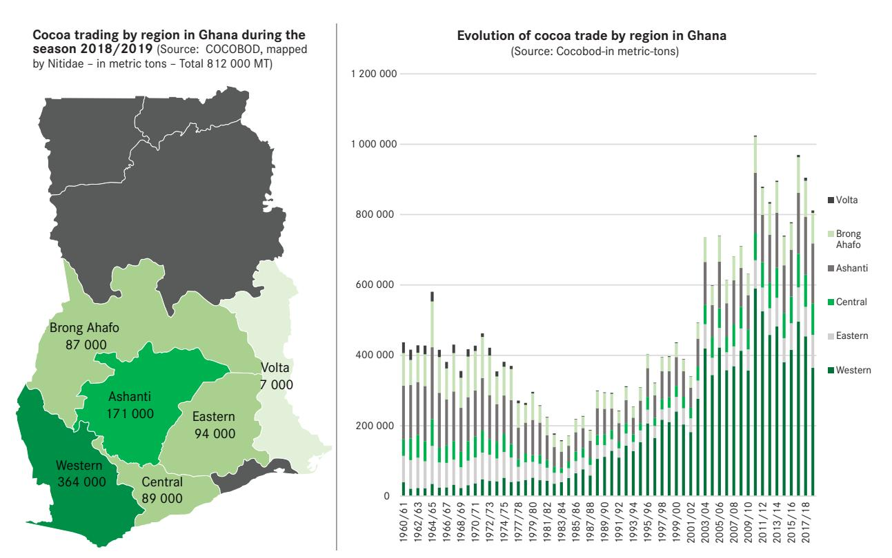

Apart from the ongoing national census, some data on farmers has been collected in a survey led by IFPRI of 2845 farmers over 60 districts in 2011/2012¹². Datasets are available on Harvard University's website¹³.

They provide some information on some socioeconomic aspects of households, age of cocoa plantations, diversification, etc. in each region. However, the datasets' representativeness is limited as they cover a relatively small number of agricultural households compared to the +2.5 million estimated during the recent census. Over the last decade, cocoa companies have collected information on the farmers they source cocoa from. Several efforts have been made to consolidate this data but have faced challenges. First, companies are reluctant to share information due to data privacy laws and the commercial nature of this information. Second, there have been concerns about how this information was collected and the methods used.

Under the Forest 2020 project, work is underway to map cocoa production areas in Ghana. The project's platform features information on cocoa production areas but not on cocoa production at the farm level or on farmers. The potential of improving the platform to offer information on farmers and farms is in the pipeline. The Forest 2020 project is jointly implemented by Ecometrica, the UK Space Agency and the Ghanaian Government.¹⁴

¹²<https://gssp.ifpri.info/gaps/>

¹³<https://dataverse.harvard.edu/dataset.xhtml?persistentId=doi:10.7910/DVN/26623>

¹⁴ More information available at<https://ecometrica.com/forests-2020/>

Raw data from the Forest 2020 project is unavailable, however, the project's map confirms that cocoa plantations have replaced several forest reserves (yellow line polygons) (as indicated by red circles on the map in Figure 14).

**Figure 14.** Land-use map with distinction between full sun cocoa and agroforestry cocoa in Southern Ghana. **Source:** Forest 2020 project, available on Mighty Earth website, amended by the authors

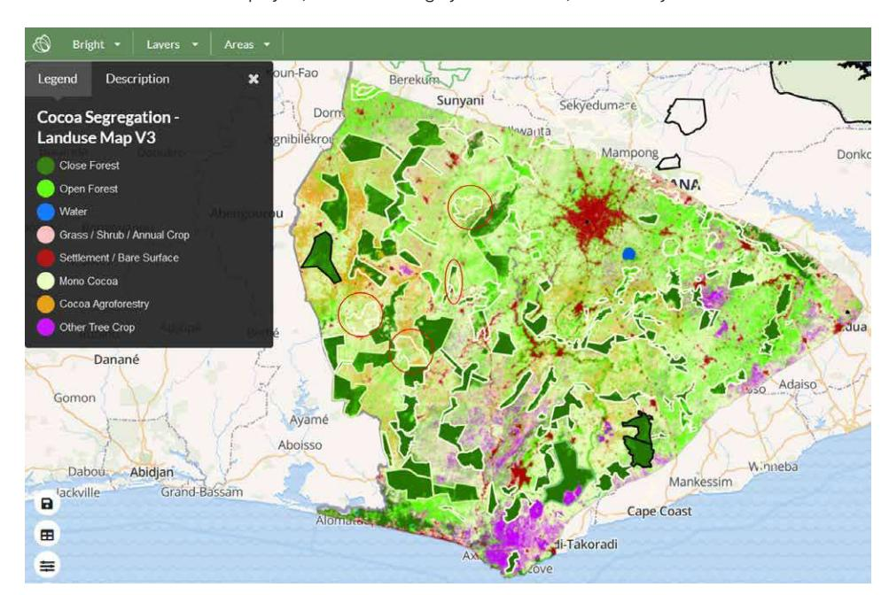

**Figure 15.** List of active LBCs during the 2016/2017 cocoa season in Ghana. **Source:** Cocobod¹⁵

| 1.  | Produce Buying Company      | (PBC)       | 23. | Brosaman Company Ltd.        | (BRCL)     |
|-----|-----------------------------|-------------|-----|------------------------------|------------|
| 2.  | Federated Comodities Ltd.   | (FCL)       | 24. | Nyonkopa Comm. Buyers Ltd.   | (NCBL)     |
| 3.  | Kuapa Kokoo Ltd.            | (KKL)       | 25. | M-Ghazzalli Ghana Ltd.       | (BRCL)     |
| 4.  | Adwumapa Buyers Ltd.        | (ABL)       | 26. | NTHC Commodities Ltd.        | (NTHC)     |
| 5.  | Transroyal Ghana Ltd.       | (TGL)       | 27. | Liberty Commodities Ltd.     | (LCL)      |
| 6.  | Cocoa Merchant Gh. Ltd.     | (CMGL)      | 28. | Edebo Kokoo Company          | (EKC)      |
| 7.  | Olam Ghana Ltd.             | (Olam)      | 29. | Farmers Alliance Co. Ltd.    | (FACL)     |
| 8.  | Armajaro Ghana Ltd.         | (AGL)       | 30. | Hyperlink Company Ltd.       | (HCL)      |
| 9.  | Royal Commodities Ltd       | (RCL)       | 31. | Unicom Commodities Ltd.      | (Unicom)   |
| 10. | Sika Aba Buyers Ltd.        | (SABL)      | 32. | Countryside Investment Ltd.  | (CIL)      |
| 11. | Evadox Ltd.                 | (EVL)       | 33. | Nkwa Dua Ghana Ltd.          | (NDGL)     |
| 12. | Yayra Glover Ltd.           | (YGL)       | 34. | Fludor Ghana Ltd.            | (FGL)      |
| 13. | CDH Commodities Ltd.        | (CDH)       | 35. | Kokoo Aba Buyers Ltd.        | (KABL)     |
| 14. | Universal Co-operative Ltd. | (UCCL)      | 36. | First Sky Company            | (FSL)      |
| 15. | Splendid Business Services  | (SBS)       | 37. | Yemon Ghana Ltd.             | (Yemon)    |
| 16. | Fredako Cocoa Company Ltd.  | (FCCL)      | 38. | Demeter Commodities Ltd.     | (Demeter)  |
| 17. | Farmers Star Ltd.           | (FSL)       | 39. | Akyaamah and Sons            | (AAS)      |
| 18. | Kumankuma Company Ltd.      | (KKL)       | 40. | Doxa Worldwide Movers Ltd    | (Doxa)     |
| 19. | Fortune Tree Company Ltd.   | (FTCL)      | 41. | Five Star Produce Buying Co. | (FSPBC)    |
| 20. | Akuotech Ghana Ltd.         | (AKCL)      | 42. | Sassh Alliance Ltd.          | (Sassh)    |
| 21. | Abrempong Commodities Ltd.  | (Abrempong) | 43. | Adinkafo Company Ltd.        | (Adikanfo) |
| 22. | Nhviya Dua Ghana Ltd.       | (NHDGL)     | 44. | Cargilli Kokoo Soucing Ltd.  | (Cargilli) |

### **National trade**

The national cocoa supply chain in Ghana follows a particular scheme. As Cocobod has a monopoly on exports and supply of processing factories, all cocoa beans go through Cocobod warehouses called "takeover points" located in Kaase (industrial area in Kumasi suburbs), Takoradi or Tema. Cocoa collection and transport to takeover points are managed by approximately 40 licensed buying companies (LBCs).

The list of active LBCs during the 2016/2017 season extracted from the 2017 Annual report of the Cocobod is Figure 15.

¹⁵<https://cocobod.gh/resources/annual-report>

**Figure 16.** Snapshot of Cocoa Board Annual reports with traded quantities by LBCs. **Source:** Cocobod Annual reports

Recently, the market shares of these LBCs have changed as an increasing number of international traders invest in LBCs (known within the sector as sister companies) to be able to build a "direct procurement supply chain" in Ghana and provide surety for beans supply.

As visible below, in its annual report, Cocobod published the quantity of cocoa traded by LBCs which shows a strong concentration within a few companies. Export statistics from Ghana, confirmed that **six companies represent around 75% of Cocobod's sales.**

The main LBC, Produce Buying Company, is a public enterprise whose shares are mainly held by the Social Security & National Insurance Trust and the Ministry of Finance of Ghana. Other major LBCs are a mix of historical local trading companies and sister companies of international traders. Farmer Cooperatives are beginning to appear in Ghana following Cocobod's recent directive to work through cooperatives to reach farmers, but this is a very recent trend. These cooperatives could become LBCs. But at present, only Kuapa Kooko, one of the major LBCs, is owned by a cooperative (see Figure 17).

| LBC ABBRE. PURCHASE                                                   |                                      |         |
|-----------------------------------------------------------------------|--------------------------------------|---------|
| List of licensed buying companies ( LBCs) in good standing during the | Performance of LBCs 2014/2015 season |         |
| LBC ABBRE. PURCHASE                                                   |                                      |         |
|                                                                       | LBC Tonnage LBC                      | Tonnage |

Performance of LBCs - 2016/2017 season

Performance of LBCs - 2015/2016 season

RCL

1.84% UNICOM

1.71%

KLC 1.45% SABL 1.15%

> 27 OTHERS 3,98%

> > PBC 30.88%

OTHERS 6.37%

SABL 1.35% RCL 1.58%

Unicom 1.64% NCBL 8.46%

AGL 14.01%

> Olam 10.66%

> > CMGL 5.74%

TGL 6.18%

ABL 3.09%

KKL 5.30%

FCL 6.45%

PBC 29.15%

FCL KKL 6.46%

6.37%

ABL 4.46%

TGL 7.36%

CMGL 6.92%

OLAM 11.79%

AGL 13.43%

NCBL

2.20% .0

**Figure 17.** List of the main LBC during the 2016/2017 cocoa season in Ghana. **Source:** Cocobod. Note: Cargill sister company was newly created, its market share increased during the last two seasons

| Rank | Company Name   | Acronym | Website                      | Ctry | Kind       | Market Share |
|------|----------------|---------|------------------------------|------|------------|--------------|
| 1    | Product Buying |         |                              |      |            |              |
|      |                | PBC     | https://www.pbcgh.com        | GH   | Public     | 29%          |
| 2    | Armajaro       |         |                              |      |            |              |
|      |                | AGL     | www.ecomtrading.com          | NL   | Sister Cie | 14%          |
| 3    | Olam Ghana     | Olam    | https://www.olamgroup.com    | SG   | Sister Cie | 11%          |
| 4    | Nyonkopa       |         |                              |      |            |              |
|      |                | NCBL    | www.barry-callebaut.com      | CH   | Sister Cie | 8.5%         |
| 5    | Federated      |         |                              |      |            |              |
|      |                | FCL     | https://fedco.com.gh         |      |            |              |
|      |                |         |                              | GH   | Subsidiary | 6.5%         |
| 6    | Transroyal     |         |                              |      |            |              |
|      |                | TGL     | https://transroyalghana.com/ |      |            |              |
|      |                |         |                              | GH   | Subsidiary | 6%           |
| 7    | Cocoa Merchant |         |                              |      |            |              |
|      |                | CMGL    | https://cmlghana.com         |      |            |              |
|      |                |         |                              | GH   | Subsidiary | 5%           |
| 8    | Kuapa          |         |                              |      |            |              |
|      |                | KKL     | https://www.kuapakokoo.com   | GH   | Coop       | 5%           |
| 9    | Adwumapa       |         |                              |      |            |              |
|      |                | ABL     | http://adwumapabuyers.com    | GH   | Private    | 3%           |
| 10   | Unicom         |         |                              |      |            |              |
|      |                | Unicom  | www.ecomtrading.com          | NL   | Sister Cie | 1.5%         |
| 11   | Royal          |         |                              |      |            |              |
|      |                | RCL     | http://royalcommodities.com  |      |            |              |
|      |                |         |                              | GH   | Subsidiary | 1.5%         |
| 12   | Sika Aba       |         |                              |      |            |              |
|      |                | SABL    | www.sikaababuyers.com        | GH   | Private    | 1.5%         |
| 13   | Cargill Kokoo  |         |                              |      |            |              |
|      |                | Cargill | www.cargill.com              | US   | Sister Cie | 1%           |

**Figure 18.** Share of national trade in cocoa by corporations. **Source:** Nitidae research based on Cocobod data

One should note that since Global Haulage owns four subsidiary companies as an LBC and Ecom owns two sister companies, the cocoa procurement market in Ghana is extremely concentrated. This concentration is even more pronounced than in Côte d'Ivoire and is also seen on the international market. Five companies concentrate 85% of the total procurement.

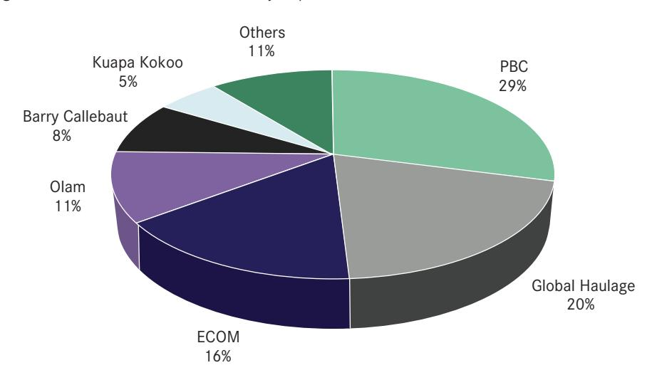

The main international traders who do not own an LBC have strong links with some of them. Cargill recently procured a licence to operate an LBC. Before that, it mainly worked with Global Haulage and Produce Buying Company. Touton, on the other hand, recently partnered with Elihor Company (a new entrant and possibly a sister company) and only purchases a small amount of beans from Produce Buying Company. Cocoanect is mainly working with the Global Haulage group and Kooko Pa, which is linked to a farmers' union in the Ahafo Region of Ghana.

LBCs are represented by a network of purchasing clerks that operate at the local or communal level (these purchasing clerks sheds are known as 'society' in the sector). They purchase and collect beans and organise the transportation to their district warehouses called "depot". All the main LBCs have hundreds of purchasing clerks in more than 50 districts in the country.

**Figure 19.** Cocoa supply chain in Ghana, based on Cocobod and LBCs data. **Source:** Nitidae

**Figure 20.** Processing shares of local processors in Ghana during 2016/2017 season. **Source:** Cocobod

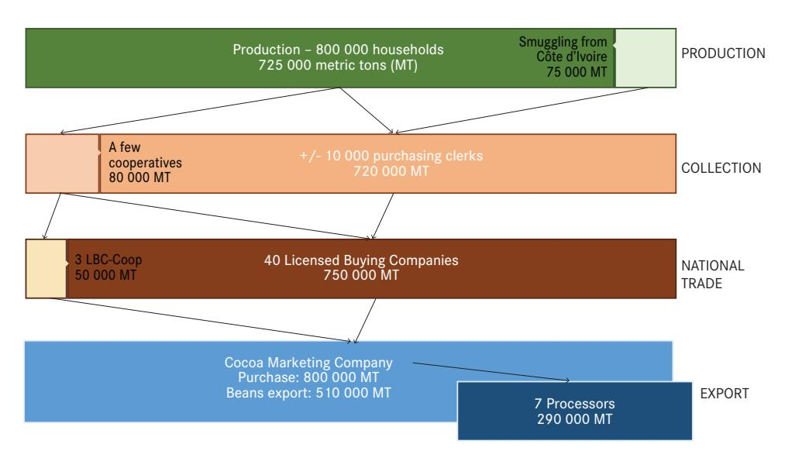

Segregation of cocoa beans: all LBCs can ask for the segregation of the cocoa beans they have bought when they sell them to the Cocoa Marketing Company paying an additional cost to the LBC due to special handling by Cocobod of these beans. This allows importers and processors to build traceability in their supply chain even though all the beans transit through the Cocoa Marketing Company.

### **Processing and export**

Seven companies process cocoa in Ghana. After purchasing the cocoa beans from the Cocoa Marketing Company and processing them, they can freely export processed products at their price.

In contrast, cocoa beans are almost exclusively exported by the Cocoa Marketing Company. The only exception are the beans rejected at the processing level, which can be exported by national processors but in very limited quantities.

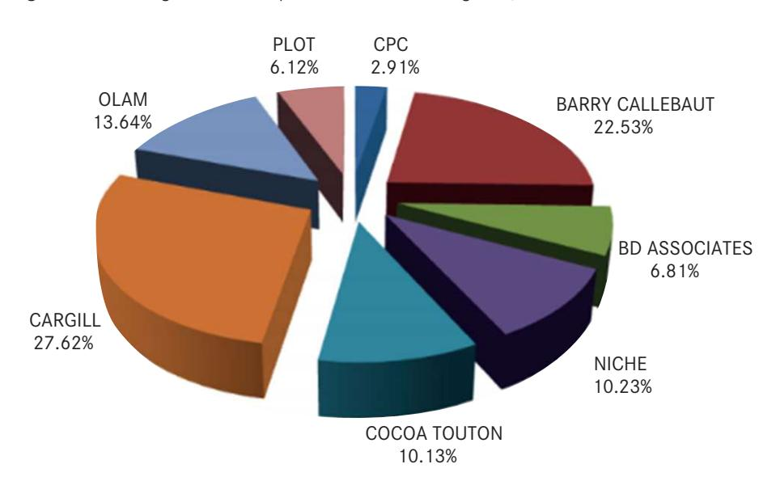

**Figure 21.** Evolution of share of cocoa beans traded by Côte d'Ivoire and Ghana % with price spread between the two countries in USD/kg. **Source:** Nitidae

**Figure 22.** Comparison of cocoa beans export price between Ghana, Côte d'Ivoire and Liberia. **Source:** Trademap

### 1.3 Smuggling between Ghana, Côte d'Ivoire and Liberia

A comparison of farm-gate prices in Côte d'Ivoire and Ghana with the share of total exports of cocoa beans in the two countries (taking into account processed cocoa) could shed some light on potential cocoa smuggled each season (see Figure 21).

This analysis shows that apart from some years, like the season 2010/2011 marked by the Ivorian political crisis, there is little correlation between cocoa prices and the shares of cocoa traded by both countries, which could indicate that smuggling is limited. In the 2014/2015 season, Ghana's market share was at its lowest, at 29%, which was when the price difference in favour of Côte d'Ivoire was the highest. Ghana's highest market share (apart from the 2010/2011 season) was 37% in the 2011/2012 and 2012/2013 seasons, when Ghana priced much higher than Côte d'Ivoire.

With regards to smuggling between Côte d'Ivoire and Liberia, interviews with cocoa traders confirmed that smuggling is happening in both directions. Cocoa beans exported through Monrovia port are generally lower grades ones rejected by Ivorian traders in the West of the country, while good quality Liberian cocoa is sold in Côte d'Ivoire. This explains the lower prices of Liberian cocoa on the international market (see Figure 22).

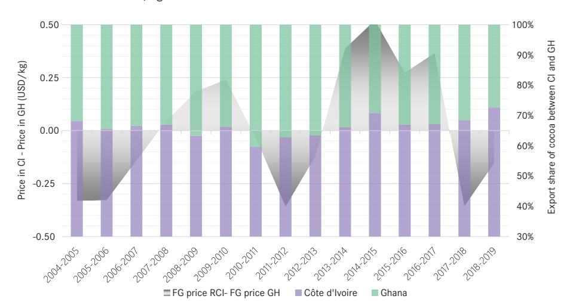

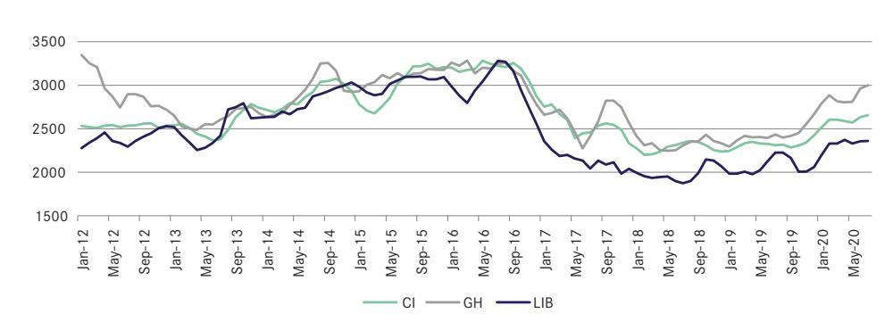

### 1.4 Consumer markets

#### **Importers and chocolate manufacturers**

Data about cocoa importers is unavailable in Côte d'Ivoire as the customs statistics service considers it confidential. Such data is not available in the European Union either for the same reason. Ghanaian customs statistics include importers' names, confirming the concentration of the international trade of cocoa beans.

Six international trading companies control around 74% of the cocoa beans trade and 68% of the cocoa products trade in Ghana. International trade of Ghanaian cocoa seems even more concentrated than Ivorian cocoa.

**Figure 23.** Ghana cocoa beans and cocoa product imports by main importers. **Source:** Nitidae based on customs' data

| Metric Tons                         | Beans   | Processed products | Together |     |         |     |
|-------------------------------------|---------|--------------------|----------|-----|---------|-----|
| Touton                              | 85 363  | 16%                | 35 638   | 14% | 124 564 | 16% |
| CARGILL                             | 58 775  | 11%                | 58 415   | 24% | 123 032 | 14% |
| BC                                  | 61 516  | 12%                | 41 545   | 17% | 107 216 | 14% |
| ECOM                                | 63 450  | 12%                | 17 690   | 7%  | 82 909  | 10% |
| Olam                                | 66 532  | 13%                | 13 061   | 5%  | 80 899  | 10% |
| SUCDEN                              | 46 800  | 9%                 | 1 960    | 1%  | 48 956  | 6%  |
| Others                              | 136 293 |                    | 80 259   |     | 224 578 |     |
| Total                               | 518 729 |                    | 248 568  |     | 792 154 |     |
| Market share of the top six traders |         | 74%                |          | 68% |         | 72% |

A 2019 study of the International Institute for Sustainable Development (IISD)¹⁶ finds that, through their sister companies, which does not always bear the name of the parent company, those six main trading companies concentrate more than 80% of the global bean trade and crushing.

All are members of the Cocoa & Forest Initiative and implement both their own and their clients' sustainability programmes. However, there is no available data on the share of their 'certified' and/or 'sustainable' sourcing. Most communicate mainly on their actions: number of farmers certified and/or monitored in terms of mapping and child labour monitoring and remediation system; number of farmers trained; number of trees distributed; and number, names and location of the headquarters of the cooperatives they work with. Nonetheless, none provide accurate quantities of beans being traced, certified or coming from their 'indirect procurement supply chain'.

Indeed, most of the objectives/indicators they communicate about concern only their 'direct procurement', which is carried out through cooperatives in Côte d'Ivoire and farmers' associations in Ghana.

**Figure 24.** Estimation of quantity of beans traded and declared percentage of 'sustainable' cocoa for main cocoa trading companies and main chocolate manufacturers. **Source:** Global Market report – Cocoa, IISD, 2019

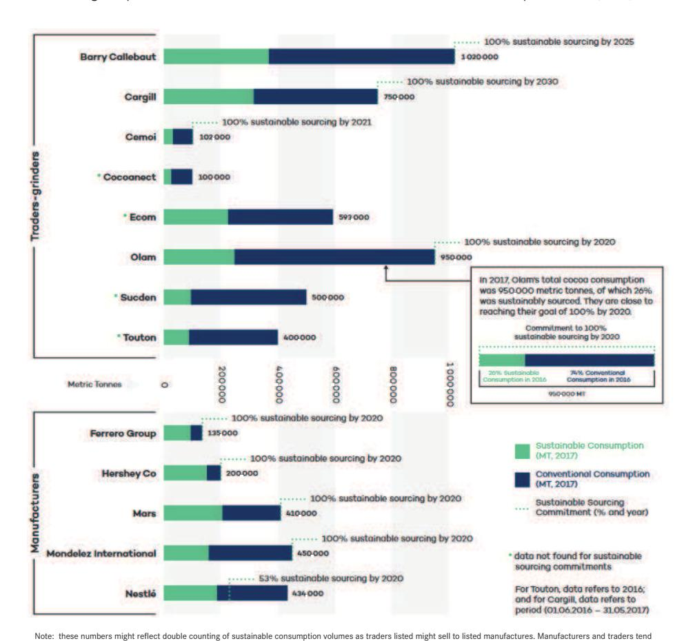

not to disclose to whom/from whom they sell/source sustainable volumes of cocoa due to confindentiality reasons.

Some companies, like Cargill, Barry Callebaut and Cémoi, provide figures about the share of certificated cocoa they trade, which is below 50% of their total volumes.

All the trading companies offer different kinds of 'sustainable products' to their clients, without disclosing which share of their procurement is 'sustainable' or which certification/referential they use to classify cocoa as 'sustainable'.

None of those companies is poised to reach the targets presented in IISD's Global Market report – Cocoa.

Similarly, most chocolate manufacturers label their most famous brands as certified cocoa (mainly UTZ and RFA) but do not provide accurate figures about their entire supply chains.

### 2.1 Côte d'Ivoire's Conseil Café Cacao (CCC)

Cooperatives and local traders register bags and phytosanitary treatment in an online system called **SICOPS** (Système d'Information et de Contrôle des Operations de Distribution des Produits Phytosanitaires et de la Sacherie).

Cocoa sales at the farmer level are registered in three copies of a purchase receipt provided by CCC to cooperatives and traders. These paper-based receipts are not digitalised. However, CCC field agents carry out random controls to check that all farmers have those receipts, and that cooperatives and traders keep them archived.

Since the 2015/2016 season, the CCC has set up an online system called **SYDORE** (Système de Gestion des Données Régionales) to monitor national trading of cocoa and coffee. All cooperatives and national traders ('traitants') must enter in the system the quantity they purchased indicating from which subprefecture the beans are coming from. Cooperatives and traders that have no computer or internet access can do the data entry at the CCC regional office.

After entering the data, cooperatives and traders can print an official document summarising the quantity of a load and its origin called a 'connaissement'. All land transport of cocoa beans must be accompanied by a connaissement.

Cooperatives' sections transporting cocoa beans to the main warehouse of the cooperative must also register in SYDORE. Local traders transporting their production to the warehouse of a wholesaler must do the same. But the system does not include the registration of farmers.

This system allows to track the cocoa beans from the first buyer (local trader or cooperative). It is also to cover subsequent sales among cooperatives and traders.

Below is the main information that must be entered by an operator in the system to be able to print a connaissement.

**Figure 25.** Screenshot of SYDORE. **Source:** SYDORE user guide on CCC website

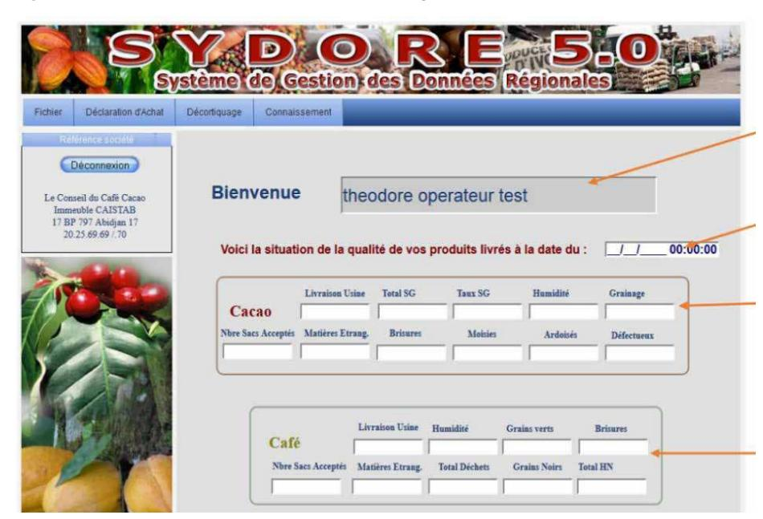

## 2. Traceability initiatives and trends

**Figure 26.** Screenshot of CCC web platform to monitor quality, input distribution, export, processing and international sales. **Source:** CCC website

**Figure 27.** Scheme of CCC's current monitoring system. **Source:** Nitidae

**Farm-gate sales:** -Purchase receipt (paper) -Control sheet (paper)

**Inputs distribution:** -Data entry in SICOPS **Before export:**

-Weight loss and rejection = > SIGEC

-Quality control by authorised company = > eCOqual

**Wholesale trade:**

-Data entry in SYDORE (Digitalised) -Printing of the « Connaissement »

**Port delivery:**

-Check of « Connaissement » by CCC = > SAIGC -Weight control by CCC = > SAIGC (digitalised) -Quality control by authorised company = > SAIGC -Data check by exporter/processor in SAIGC

Cocoa plot

Harvesting Pod breaking Fermentation

Drying Cleaning Bagging Farm-gate sales

Sorting Mixing Re-cleaning Truck loading

Truck unloading Sorting Mixing Cleaning Re-bagging Export of beans

Truck unloading Sorting Crushing Packaging Export of paste, butter and powder

**BUY COCOA**

**COOP SECTION**

Village / Camp Chief town Port town

**Wholesaler 1**

**COOP COCOA**

At port level, cocoa beans' quality and weight are checked before transport to exporters/ processors warehouses. Weight is controlled by CCC officers while quality is controlled by authorised quality control companies (Veritas, ACE, SGS, KMS, Phyto-Ci et CWT). The data from these controls is entered in a system called **SAIGC**. After cleaning and bagging for export, another quality control is done by control companies. This information, required to authorise the export, is entered into another system called **eCoqual**. To justify weight losses and quality differences, exporters must also register the results of their cleaning, sorting and mixing in another dedicated system called **SIGEC**.

Finally, all the export sales are done following the selling orders of the CCC (decided by CCC traders) in a platform called **SIVATC** where authorised importing companies must also register.

SYDORE has a dedicated website, but all the other systems are accessible from the same CCC webpage (see screenshot in Figure 26).

### 2.2 Ghana's Cocobod

#### **Overview of Ghana's Cocoa Traceability System**

Cocobod, formerly the Cocoa Marketing Board, used to be the sole actor in the cocoa sector, giving the Government total control. Through the Cocoa Marketing Board, the Government carried out its purchases and exports of cocoa in Ghana. The Cocoa Marketing Board conducted its activities through its subsidiaries, the Produce Buying Company and the Cocoa Marketing Company. In addition, the Quality Control Division, another subsidiary, was also solely responsible for controlling the quality of cocoa. With support from the World Bank, reforms were carried out in 1984 and 1985 to restructure the Cocoa Marketing Board. Downsizing the number of employees from around 100 000 to 6 000 led to a drastic reduction in the number of quality-control officers who worked at community level to ensure 'Ghana Quality'.

The current system in Ghana to trace beans is focuses mainly on quality and only reaches the company level. There is no legislative requirement to implement traceability within the sector. The push for developing and implementing traceability systems has come from private standards, public control and voluntary actions. Over the last 25 years or so, Cocobod has improved the control system enabling segregation of cocoa by district. It has also built special systems tailored to the needs of a specific quality of cocoa currently being produced in Ghana.

At the district level, cocoa could be traced back to the farmer level with a good level of certainty. However, this is sometimes hindered by the inability of purchasing clerks to keep aggregation/bulking records at the community level. As a result, a bag of cocoa arriving at the district level is a mix of beans from several farms. This impedes the tracking of cocoa coming from specific farms and even illegal sources (smuggled from Côte d'Ivoire or grown in forest reserves).

#### **Current Cocoa Traceability System in Ghana**

The current system implemented by Cocobod through the Quality Control Division is predominantly paper-based. There is physical evidence of chain of custody. However, paper-based documentation could be lost through fire or flood, or tampered or destroyed by any agent in case of controls.

**Farm Level:** Cocoa is prepared for sale at the farm level and sent to the purchasing clerk¹⁷ at the community buying centre. The farmer is in control of the processes at this point, with little or no help from extension officers. The only document kept is the farmer's passbook.

¹⁷ A purchasing clerk is a representative of a Licensed Buying Company who is stationed at the community level to purchase cocoa on behalf of the company. The purchasing clerk is usually a farmer but with entrepreneurial skills and willing to earn extra for his services.

The **farmer's passbook** (see Figure 28) contains information on the farmer and the farm, as well as cocoa sales records. The passbook is usually in the custody of the farmer although sometimes it is kept by the purchasing clerk for safe keeping and timely update. Even with these safe keeping measures, this documentation is usually unreliable since there is no proper verification system in place and usually few controls in the issuance of the booklet to farmers. For example, a farmer with illegal farm(s) could still possess a passbook and sell cocoa through the official channels without any detection by officials.

**Community Buying Point (purchasing clerk shed):** Farmers travel to the purchasing clerk shed to sell their cocoa. Cocoa is weighed and bought at this point. If cocoa supplied by one farmer does not fill the entire bag (64 kilos), the purchasing clerk bulks cocoa from several farmers (recorded on a bulking sheet). The purchasing clerk records all cocoa bean purchases at their sheds (or 'society') on a **daily schedule** (see Figure 29).

**Figure 28.** Sample Farmer's Passbook issued by Cocobod. **Source:** Nitidae

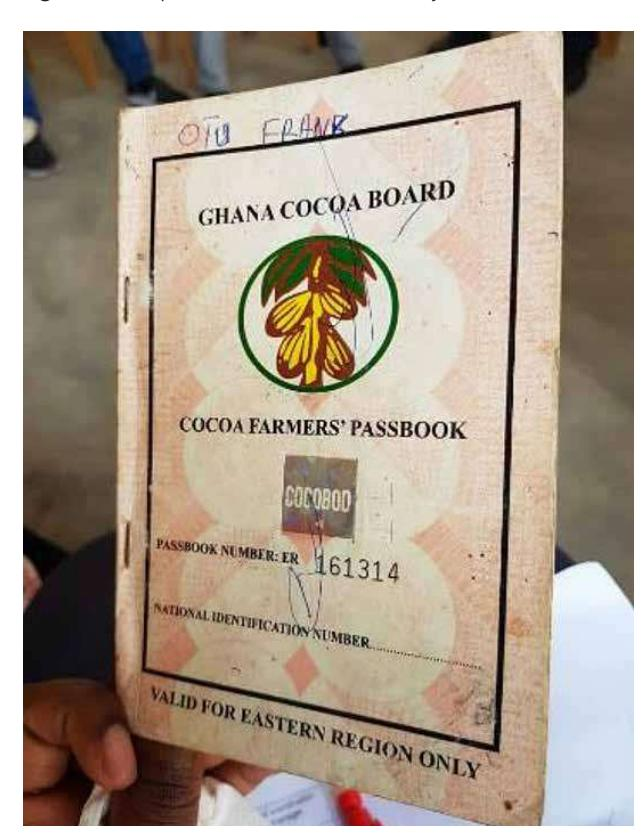

**Figure 29.** Sample Daily Stock book kept by purchasing clerks at the clerk's shed level. **Source:** Nitidae

| Daily Stock Book (To be completed by PC) |                |               |      |             |
|------------------------------------------|----------------|---------------|------|-------------|
| Date of purchase                         | Name of farmer | Qty delivered |      | Amount paid |
|                                          |                | kilos         | bags |             |
|                                          |                |               |      |             |
|                                          |                |               |      |             |
|                                          |                |               |      |             |
|                                          |                |               |      |             |
|                                          |                |               |      |             |
|                                          |                |               |      |             |
|                                          |                |               |      |             |
|                                          |                |               |      |             |
|                                          |                |               |      |             |
|                                          |                |               |      |             |

**Figure 30.** Bulking Sheet sample. **Source:** Nitidae

| BRANCH.....       | ZONE.....         |                   |                 |           |                         |
|-------------------|-------------------|-------------------|-----------------|-----------|-------------------------|
| DISTRICT .....    | SOCIETY: ..... |                   |                 |           |                         |
| SOCIETY MARK..... | WEEK              |                   |                 |           |                         |
| ENDING.....       |                   |                   |                 |           |                         |
| S/N               | Bulking Date      | Name of farmer(s) | Passbook Number | Qty kilos | DROP MARK (No. of bags) |
| 1                 |                   |                   |                 |           |                         |
| 2                 |                   |                   |                 |           |                         |
| 3                 |                   |                   |                 |           |                         |
| 4                 |                   |                   |                 |           |                         |
| 5                 |                   |                   |                 |           |                         |
| 6                 |                   |                   |                 |           |                         |
| Name of PC.....   |                   |                   | Signature ..... |           |                         |

| BRANCH.....       | ZONE.....         |                   |                 |           |                         |
|-------------------|-------------------|-------------------|-----------------|-----------|-------------------------|
| DISTRICT .....    | SOCIETY: ..... |                   |                 |           |                         |
| SOCIETY MARK..... | WEEK              |                   |                 |           |                         |
| ENDING.....       |                   |                   |                 |           |                         |
| S/N               | Bulking Date      | Name of farmer(s) | Passbook Number | Qty kilos | DROP MARK (No. of bags) |
| 1                 |                   |                   |                 |           |                         |
| 2                 |                   |                   |                 |           |                         |
| 3                 |                   |                   |                 |           |                         |
| 4                 |                   |                   |                 |           |                         |
| 5                 |                   |                   |                 |           |                         |
| 6                 |                   |                   |                 |           |                         |
| Name of PC.....   |                   |                   | Signature ..... |           |                         |

**Figure 31.** Waybill accompanying cocoa from the purchasing clerk shed level. **Source:** Nitidae

| Way-bill (WB)                                          |       |                              |                       | DISTRICT: _____      |  |
|--------------------------------------------------------|-------|------------------------------|-----------------------|----------------------|--|
| BRANCH: _____                                          |       | DESPATCHED FROM: _____       |                       | DATE: _____          |  |
| SL. NO.                                                | ITEM  | QUANTITY BAGS                | QUANTITY GROSS WEIGHT | QUANTITY NET WEIGHT  |  |
|                                                        |       |                              |                       |                      |  |
|                                                        |       |                              |                       |                      |  |
|                                                        |       |                              |                       |                      |  |
|                                                        | TOTAL |                              |                       |                      |  |
| P C NAME: _____                                        |       |                              |                       | P C SIGNATURE: _____ |  |
| The above goods checked and received in good condition |       |                              |                       |                      |  |
| VEHICLE NUMBER: _____                                  |       | DRIVER'S NAME: _____         |                       |                      |  |
| STATION MARK: _____                                    |       | DRIVER'S LICENCE NO: _____   |                       |                      |  |
| DRIVER SIGN: _____                                     |       | WAREHOUSE KEEPER SIGN: _____ |                       |                      |  |

Cocoa kept at the purchasing clerk's shed is mixed and further processed to ensure uniformity and quality. After that, the farmer's identity is lost. To be able to keep a semblance of farmer identity, the **bulking sheet** (Figure 30) will list the number of farmers whose cocoa has been bulked and bagged on a specific day and given a code. The last four digits on the drop mark refer to the farmer's numbers. The marks are stamped on the sack before bagging.

Cocoa leaving every purchasing clerk shed is accompanied with a completed waybill duly signed by the purchasing clerk. Normally, the 'society' issues a **waybill to the purchasing clerk** (Figure 31) that is kept in his custody. The bulking sheet duly prepared by the purchasing clerk is also attached.

**Figure 32.** Sample warehouse receipt. **Source:** Nitidae

| <b>WAREHOUSE RECEIPT (WR)</b> |                                | CROP YEAR <u>2251</u> |
|-------------------------------|--------------------------------|-----------------------|
|                               |                                | DATE: _____           |
| BRANCH: _____                 | ZONE: _____                    | DISTRICT: _____       |
| RECEIVED _____                | BAGS OF COCOA AT 62.5 KG / BAG |                       |
| WAYBILL NO. _____             | PC NAME _____                  |                       |
| WAYBILL DATE _____            | PC SIGNATURE: _____            |                       |
| DEPOT KEEPER _____            | SOCIETY _____                  |                       |
| DEPOT KEEPER SIGS _____       | DRIVER'S NAME _____            |                       |
| ESCORT _____                  | DRIVER'S LICENCE _____         |                       |

**District depot:** A depot usually receives cocoa from multiple communities or purchasing clerk sheds ('societies'). For each cocoa bag received at the depot, a receipt (Figure 32) is issued to the purchasing clerk, acknowledging receipt of the consignment. The receipt of the bags is usually done by a depot manager assisted by a bookkeeper and a few casual hands.

The district depot staff arranges weekly transport to carry cocoa from the purchasing clerk sheds to the district depot. This movement is called primary evacuation and is documented by a primary evacuation waybill. The purchasing clerk attaches to this waybill the daily schedule of the 'society' or purchasing clerk shed, which details farmerby-farmer purchases. This schedule is filed at the district office. Bulked cocoa beans arriving at the district depot are graded and sealed by a staff member of the Quality Control Division of Cocobod based on several quality tests. A Certificate of Inspection is issued by the Cocobod Quality Control Company (QCC) to test the cocoa beans before they are handed to the custody of the Cocoa Marketing Company. A copy is retained and filed at the district depot. A mark is stamped on the sack with information on its source and results of the quality test. A random second testing of graded cocoa can be performed by a QCC supervising officer at any time to confirm the grade of sealed sacks before the cocoa leaves the district warehouse to the takeover point. Up to this step in the supply chain, LBCs can segregate certified and conventional beans.

Cocoa from the district depots goes through one of the three takeover points (Kaase, Takoradi or Tema) before arriving at the port. Traceable beans can only be sent to Takoradi and Tema takeover points. Each consignment must be accompanied by four copies of a secondary evacuation waybill. For traceable cocoa beans, the secondary evacuation waybill is marked 'traceable cocoa'. In addition, traceable cocoa is accompanied by a 'society' (purchasing clerk shed) traceable detail report, also referred to as a tally sheet.

At the takeover point, all cocoa arrivals are check-sampled by QCC port staff (moisture, bean count, cut test, bag weight, bag quality). Cocoa of acceptable quality is issued with a QCC purity certificate.

**Port level:** On dispatch to port, the certified stocks are accompanied by the following documents: a 'society' (purchasing clerk shed) traceable detail report/tally sheet (Figure 33); a material transfer note transfer (Figure 34); and a siding depot waybill (Figure 35).

**Figure 33.** 'Society' (purchasing clerk shed) detailed report (tally sheet). **Source:** Nitidae

**SOCIETY TRACEABLE DETAIL REPORT**

**0001**

*Please address the following details:*

District: \_\_\_\_\_

Week Ending: \_\_\_\_\_

Staypole #: \_\_\_\_\_

Clunerity: \_\_\_\_\_

Season: \_\_\_\_\_

Tip: \_\_\_\_\_

Deleted Date: \_\_\_\_\_

Evaluation #: \_\_\_\_\_

Transcorrier: \_\_\_\_\_

Vendor #: \_\_\_\_\_

Driver: \_\_\_\_\_

| CATEGORY |         |              |  |  |  | TOTAL |
|----------|---------|--------------|--|--|--|-------|
| No.      | Society | Society Mark |  |  |  |       |
|          |         |              |  |  |  |       |
|          |         |              |  |  |  |       |
|          |         |              |  |  |  |       |
|          |         |              |  |  |  |       |
|          |         |              |  |  |  |       |
|          |         |              |  |  |  |       |
|          |         |              |  |  |  |       |
|          |         |              |  |  |  |       |
|          |         |              |  |  |  |       |
|          |         |              |  |  |  |       |
|          |         |              |  |  |  |       |
|          |         |              |  |  |  |       |
|          |         |              |  |  |  |       |
|          |         |              |  |  |  |       |
|          |         |              |  |  |  |       |
|          |         |              |  |  |  |       |
|          |         |              |  |  |  |       |
|          |         |              |  |  |  |       |

**Figure 34.** Sample material transfer note. **Source:** Nitidae

| Material Transfer Note - T |                      |                      | BD91                 |
|----------------------------|----------------------|----------------------|----------------------|
| Despatch Branch            | <input type="text"/> | Product              | <input type="text"/> |
| Despatch Warehouse         | <input type="text"/> | Date                 | <input type="text"/> |
| Destination Branch         | <input type="text"/> | Serial No            | <input type="text"/> |
| Destination Warehouse      | <input type="text"/> | Seeing Depot Waybill | <input type="text"/> |
| Transporter                | <input type="text"/> | Vehicle No           | <input type="text"/> |
| Driver's Name              | <input type="text"/> | Evacuation Cert      | <input type="text"/> |
| Quantity (Bags)            | <input type="text"/> | Quantity (MT)        | <input type="text"/> |
| Sending W/ House Incharge  | Signed               | Driver               | OCI                  |
|                            |                      | Signed               | Signed               |

### Mtn - R Details

| Receiving Branch           | <input type="text"/> | Serial No      | <input type="text"/> |
|----------------------------|----------------------|----------------|----------------------|
| Receiving Warehouse        | <input type="text"/> | Date Received  | <input type="text"/> |
| Quantity (Bags)            | <input type="text"/> | Date Offloaded | <input type="text"/> |
| Quantity (Mts)             | <input type="text"/> | Vehicle No     | <input type="text"/> |
| BIN No.                    | <input type="text"/> | Licence No     | <input type="text"/> |
| Freight Payable            | <input type="text"/> | Transporter    | <input type="text"/> |
| Freight Paid               | <input type="text"/> | Accountant     | <input type="text"/> |
| Receiving W/House Incharge | <input type="text"/> | Driver         | <input type="text"/> |

BC

\*This Copy - RORT Freight Copy - TRANSPORTER - BIN Copy - PORTEOTO - Block Printed Copy - BOOK  
\*This Printed Copy - RUMASI OFFICE - Block Printed Copy - BRANCH OFFICE

| Material Transfer Note - T |                      |                      | BD91                 |
|----------------------------|----------------------|----------------------|----------------------|
| Despatch Branch            | <input type="text"/> | Product              | <input type="text"/> |
| Despatch Warehouse         | <input type="text"/> | Date                 | <input type="text"/> |
| Destination Branch         | <input type="text"/> | Serial No            | <input type="text"/> |
| Destination Warehouse      | <input type="text"/> | Seeing Depot Waybill | <input type="text"/> |
| Transporter                | <input type="text"/> | Vehicle No           | <input type="text"/> |
| Driver's Name              | <input type="text"/> | Evacuation Cert      | <input type="text"/> |
| Quantity (Bags)            | <input type="text"/> | Quantity (MT)        | <input type="text"/> |
| Sending W/ House Incharge  | Signed               | Driver               | OCI                  |
|                            |                      | Signed               | Signed               |

### Mtn - R Details

| Receiving Branch           | <input type="text"/> | Serial No      | <input type="text"/> |
|----------------------------|----------------------|----------------|----------------------|
| Receiving Warehouse        | <input type="text"/> | Date Received  | <input type="text"/> |
| Quantity (Bags)            | <input type="text"/> | Date Offloaded | <input type="text"/> |
| Quantity (Mts)             | <input type="text"/> | Vehicle No     | <input type="text"/> |
| BIN No.                    | <input type="text"/> | Licence No     | <input type="text"/> |
| Freight Payable            | <input type="text"/> | Transporter    | <input type="text"/> |
| Freight Paid               | <input type="text"/> | Accountant     | <input type="text"/> |
| Receiving W/House Incharge | <input type="text"/> | Driver         | <input type="text"/> |

BC

\*This Copy - RORT Freight Copy - TRANSPORTER - BIN Copy - PORTEOTO - Block Printed Copy - BOOK  
\*This Printed Copy - RUMASI OFFICE - Block Printed Copy - BRANCH OFFICE

This allows the cocoa to be taken over into port warehouses by Cocobod's trading and export arm, the Cocoa Marketing Company Ghana Ltd. The Cocoa Marketing Company issues a certificate of takeover, which in turn allows the LBC to invoice the Cocoa Marketing Company for the cocoa beans.

**Figure 35.** Sample siding depot waybill. **Source:** Nitidae

| SIDING DEPOT WAY-BILL                                                                                                 |                                                      |                        |
|-----------------------------------------------------------------------------------------------------------------------|------------------------------------------------------|------------------------|
| Shed No. ....                                                                                                         |                                                      |                        |
| Date                                                                                                                  |                                                      |                        |
| C. T. Nos and dates Place of Despatch ..... Crop Year Main' Light ..... Long No. .... Station Marks ..... |                                                      |                        |
| Weight Certificate No. District ..... Destination ..... Driver's Name ..... Licence No. ....              |                                                      |                        |
| Particulars of Goods (Including Weight Grade and Seal Nos)                                                         |                                                      |                        |
| UNIT                                                                                                                  | QUANTITY                                             |                        |
| FIGURES                                                                                                               | WORDS                                                |                        |
| Despatched by <i>Signature and rather Stamps of            Sales/Depot Holder</i>                              | Received allows Counts in good condition.         | Seekers                |
| Driver's Signature or Thunder-Print                                                                                | Signature and rather Stamps of Sales/Depot Holder | Miles                  |
| Missage Destination .....                                                                                             |                                                      |                        |
| *Original-To Sender: *Duplicate - Zonal Officer: *Triplicate - chief Accountant:                                | *Guideduplicate - District copy                      | *Book copy - Book copy |

**Figure 36.** Summary of the Cocobod supply chain monitoring system in Ghana. **Source:** Nitidae

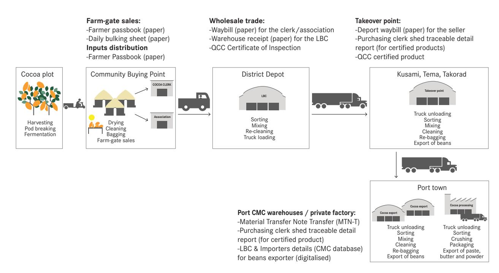

#### **Gaps in the current system**

The main gap in traceability efforts is between the farms and the purchase clerks. Due to the spatial distribution of cocoa farms around the country, collecting and digitalising data between the farms and the purchasing clerk sheds/community buying points level is extremely difficult and resources intensive (requiring both financial means and wellimplemented technological innovations).

#### **Proposed reforms to cocoa traceability in Ghana**

Cocobod is in the process of developing a Cocoa Management System (CMS). The CMS is an integrated cocoa farmer database aimed at managing internal trading operations. Financed by the African Development Bank, the system will collect data on every transaction within the industry with the aim of informing decision making by the Government.

One of the key features of the system is its ability to collect farm data in almost real time with spatial dimensions. It will therefore allow productivity and yield output calculations in comparison to seasonal forecasted yields. This in turn will enable the detection of illegal sourcing. If, throughout a season, a farmer located just outside an area at risk of deforestation is selling significantly more than his forecasted yield output, there is a risk that much of the cocoa sold is illegal. This can be flagged in the system, and remediation measures can be taken. The details of this compliance mechanism are still to be developed. The three-tier quality assurance of Ghana cocoa will be integrated in the CMS, allowing a migration from paper-based documentation to a digital one. Lastly, Cocobod will develop and implement a payment platform, one of the last modules of the system.

The CMS project includes the development of a software and a database, a census of all cocoa farmers in Ghana and a mapping of all cocoa farms. For the first time, there will be an accurate record of the land size, geographic locations, population, and record of cocoa farms and farmers in the country. Cocobod will therefore be able to generate socioeconomic data of all cocoa farmers in Ghana. A national register of cocoa farmers will be developed with separate registers for cocoa found in or outside forest reserves.

The CMS will allow for real time capturing and monitoring of transactions among stakeholders. It will also enable the monitoring of the activities of LBCs and other private service providers, as well as that of compliance with Cocoa Research Institute of Ghana/ Environmental Protection Agency guidelines for handling Cocobod-approved fertilisers, agrochemicals and the provision of services. This in turn is expected to ensure the efficient implementation of good farm practices and increase yields. Cocobod will also carry out forecasts that will allow the system to monitor beans sales timestamping at the point of purchase and link the beans to the farm they come from (in case the farmer has multiple farms).

Cocobod intends to use cooperatives in the delivery of services to farmers through the CMS. They will be recognised and registered in the system, and farmers linked to them. Cooperatives are expected to work on behalf of their members and become eligible for the direct sourcing of Cocobod's assistance, agrochemicals and extension services. They are also to exercise group responsibility in detecting and reporting to local authorities the presence of farms in forest reserves and national parks. Within cooperatives, farmers will be able to sell their beans as deforestation-free and earn a premium. This identity preservation will permit tracing cocoa back to the farmers working within cooperatives.

### 2.3 Certifications' traceability requirements

Certification schemes use various levels of traceability requirements. In contrast with certified cocoa, 'conventional cocoa' is cocoa sourced without conforming to the traceability requirements of 'mass balance', 'segregation', or 'identity preservation'.

The mass balance system administratively monitors the trade (transaction) of certified cocoa throughout the supply chain. It requires a transparent documentation and justification of the origin and quantity of certified cocoa purchased by the first buyer. The mass balance system allows mixing conventional and certified cocoa at subsequent stages of the cocoa value chain (such as transport, storage and processing). The system consists in comparing volume or weight of certified cocoa between stages of the supply chain to check for consistency. For example, the Fairtrade Label Organization, UTZ and the Rainforest Alliance allow 'mass balance'.

Segregation also requires a transparent documentation and justification of the origin and quantity of certified cocoa purchased by the first buyer. In addition, certified cocoa is kept physically separated from conventional cocoa during transport, storage and processing, to avoid mixing. However, segregation allows mixing cocoa from different origins if subject to the same certification requirements.

Identity preservation is the highest traceability type. It does not allow any mixing of the certified cocoa with conventional one, or mixing of cocoa from other origins. However, if the 'single origin' of the cocoa is set at cooperative level or cocoa-producing area, certified cocoa from this broader origin may be mixed.

For example, some fair-trade certification (FFL, Biopartenaires, Small Farmer Producers, etc.) and organic certification require **identity preservation, where cocoa bags are identifiable by means of a unique identifier. The cocoa identification techniques may include paint, tags, QR codes or barcodes**. Both reconciliation methods are supported by documentary or digital evidence that enables the reconciliation.

Identity preservation requires that, throughout the supply chain, a batch of products are clearly identified, localised and segregated from other products. Organic certification requires more stringent segregation as certified products must be stored in separate rooms and transported in separate transport means (trucks, containers, etc.). Such schemes also require the segregation of batches of certified products until the processing factory. The batches must be tracked after processing to allow the product recall in case of subsequent contamination.

**Figure 37.** Comparison of the traceability requirements of different certification standards. **Source:** Nitidae based on certification standards' documents.

| Requirements     | Fairtrade (FLO ) | Fair trade (Others)   | UTZ/RA                     | Organic               |
|------------------|------------------|-----------------------|----------------------------|-----------------------|
| method           | Mass balance     | Identity preservation | Mass balance               | Identity preservation |
| segregation      | Optional         |                       |                            |                       |
| Mapping of plots | Optional         | Optional              |                            |                       |
|                  | Yes              | Yes                   |                            |                       |
| on middlemen     | Optional         | Yes                   | Optional                   | Yes                   |
| on processing    | Optional         | Yes                   | Optional                   | Yes                   |
| on distribution  | Optional         | Yes                   | Optional                   | Yes                   |
|                  | No               | No                    | Yes                        | No                    |
|                  | )                | Fair trade            | UTZ/RA                     | Organic               |
|                  | Mass balance     | Identity              |                            |                       |
|                  |                  |                       | Mass balance               | Identity              |
|                  | Optional         | Partial               |                            |                       |
|                  |                  |                       | Optional                   | Complete              |
| Mapping of plots | Optional         | Optional              | Optional                   |                       |
|                  |                  |                       | (but is a mid-term target) | Compulsory            |
|                  | Yes              | Yes                   | Partial                    |                       |
|                  | Optional         | Yes                   | Optional                   | Yes                   |
|                  | Optional         | Yes                   | Optional                   | Yes                   |
|                  | Optional         | Yes                   | Optional                   | Yes                   |
|                  | No               | No                    | Yes                        | No                    |

In the absence of regulation regarding the control of the supply chain, value chain stakeholders are free to use any software, forms, documentation and internal control methods to set up a traceability system. UTZ certification differs in that it requires stakeholders to register most documentation in a single platform called the Good Inside Portal¹⁸.

In Côte d'Ivoire, UTZ, Rainforest Alliance and Organic certifications rely on the CCC platform SYDORE to check volumes, dates and seller/buyer information. The paper documents given to farmers - Farmer passbook in Ghana and Purchase Receipt in Côte d'Ivoire - are also used to check individual sales to cooperatives during the audits.

**Figure 38.** List of software used by the main trading companies for traceability. **Source:** Nitidae based on companies websites and interviews

| Trader          | App/software          | Software developer   | Links                           |
|-----------------|-----------------------|----------------------|---------------------------------|
| Olam            | At source (customers) |                      |                                 |
|                 | ( OFIS ) (suppliers)  |                      |                                 |
|                 |                       | Internal development | https://www.atsource.io         |
| Barry Callebaut | Katchilè (suppliers)  | SAP (Germany)        | Private app                     |
| Cargill         | Cocoawise (specific   |                      |                                 |
|                 |                       | SAP (Germany)        | Private app                     |
| ECOM            | Sustainability        |                      |                                 |
|                 |                       | Internal development | https://www.ecomsms.com         |
| Touton          | Mergdata (suppliers)  | Farmerline (Ghana)   | Private app                     |
| SUCDEN          | Responsible Cocoa     |                      |                                 |
|                 |                       | Sourcemap            | https://www.sourcemap.com/cocoa |
|                 | Mergdata (suppliers)  | Farmerline (Ghana)   |                                 |
| Cémoi           | MINKA (suppliers)     | Ecotierra            | Private app                     |

### 2.4 Private exporters and processors traceability systems

All the main cocoa trading companies use a software to track cocoa beans from the certified cooperatives or farmers' associations. They either have developed their own software or use one tailored to commodities. Some of these systems use innovative tools, such as blockchain technology, QR codes and barcodes. They are all based on the same structure.

The table below lists the apps and traceability software developers used by the main international trading companies.

In most cases, either because of the mapping costs or the reluctance of farmers to declare their plots, the companies only map one cocoa plot per farmer. In some cases, it is only one GPS point. However, this approach is disappearing and nowadays, most trading companies tend to map the full plot (polygon) declared by the farmer. In addition, some information about the farmer is included in a farmer identification document. The farmer is also asked if he accepts that his name, picture and/or plot location be shared with customers who desire information about the beans' origin.

In most cases, traders are those implementing the traceability systems and provide the apps to the cooperatives. The cocoa is tracked from this point on. When cocoa beans are delivered to the cooperative/farmers association, the names of the farmers and the volume of beans are entered in the app. Then a batch of cocoa beans will be tracked with the list of farmers who provided the content of the load. To be tracked through the whole supply chain, the batch needs to be of a minimum quantity. In most cases, the minimum volume is 10 metric tons to allow batching during the processing step. The batching of beans covered by certain requirements generates additional work at the factory level. Therefore, identity preservation of batches will be limited to a part of the volume sold by the biggest cooperatives that offer 100% traceability to their customers at a premium. The rest of the production will be tracked through mass-balance approach.

There are no cases where batches can be traced back to a single farmer, as very few could produce a big enough batch. The current schemes trace the batches back to a 'list of farmers'.

As detailed below, there are many ways for cooperatives and traders to circumvent these traceability schemes. This is particularly the case during the minor season (March-September) because of quality issues. To be accepted at the port/factory, loads must be of a minimum weight, which means that several batches of beans have to be mixed.

### 3.1 Challenges faced by current traceability schemes

There are many ways for stakeholders to circumvent traceability schemes, as summarised below:

- **Multiple plots:** Most farmers (one third of farmers in Ivory Coast) have several cocoa plots. Some are old (>30 years), in long past deforested areas. Others, more recent, are planted in fallow areas, old cocoa plantation rejuvenation or in forested areas. As most sustainable certification programmes start with awareness and sensitisation actions about deforestation, farmers are well aware that it is in their interest to only mention those plots with no deforestation risks. Many will register production coming from illegal plots, such as those located in classified forests, as production coming from the legal ones (i.e., located in rural domain). This is why most of the cocoa coming from recently-deforested areas can be traded as legal. In addition, many plantations were planted over several years and include trees with very different yields. This hinders the estimation by auditors of the exact yield of a plantation and makes it easy for farmers to exaggerate the production coming from the oldest plots.
- **Land-use rights arrangements:** Various legal arrangements can split land ownership and land-use rights among various people. Many cocoa plots are not managed by the landowner but by a sharecropper, often a migrant worker. Crop sharing varies between 30 and 50% for the landowner. Cocoa from a single plot can therefore be sold by several people. One sharecropper can also manage plots owned by several different people, and a single landowner can have several sharecroppers working on several of his plots. On top of sharecropping, farmers can also set an 'abunu' contract, also called 'plant/share' of 'planter/partager' in French. Under these contracts, the landowner lends his land to a worker, who will clear it and plant cocoa. Once it starts producing, the land (or the plantation only) is divided in two parts: one for the landowner one for the worker. Sometimes, when a landowner dies, the plantation is not divided, and the heirs collectively manage it. Finally, using the land as security is also a very common practice (referred to as the 'mise en garantie' in French). When a landowner needs money, he can 'rent' his plantation for several years. The tenant will work in it and sell cocoa during this period. Because of all these arrangements, it is very hard to link the production from one plot to one single person.
- **Homonymy:** Within a village/community, homonymy is very common in Côte d'Ivoire. Identification of individuals is hindered by the fact that many farmers do not have identity documents, and others have several such documents indicating different identification numbers and dates of birth.
- **Post-harvest mixing:** Cocoa beans are fermented on the plantation, then brought to the farmer's house where they will be cleaned and dried before being bagged in the official jute bags. Often, they are bagged at the coop warehouse when farmers bring their production. During this process, farmers often mix the production of several plots. In some cases, they need to do so to be able to sell an acceptable quality of beans.

## 3. Traceability challenges: an opportunity to enhance transparency

- **Multiple buyers:** Very few farmers deliver all their production to their cooperative. Most cooperatives depend on the funding from the traders they work with. As a result, they are unable to pay beans during the whole season. Also, the quantity of beans which will be sold as certified is always uncertain and varies depending on yearly quotas. There is therefore no incentive for farmers to sell their entire certified production to their cooperative as they will receive a premium only for part of it.
- **Multiple cooperatives:** Many farmers are members of several coops. Most coops are not the result of a process of self-organisation with a strong sense of belonging from their members. Rather, they are initiatives of traders and local leaders aimed at benefiting from certification and sustainability programmes.¹⁹ Farmers consider cooperatives as buyers able to pay a premium and deliver social services. Therefore, in their minds, multiple buyers mean more services and premiums. Certification organisations confirmed that data from the different international traders indicates that many (between 10% and 20%) plots are registered twice by several trading companies. Farmers are also registered various times, but homonymy hinders the identification of double registration.
- **Downstream mixing:** Cocoa beans are often mixed at several downstream steps of the value chain: at the coop, local trader, wholesaler, exporter or processor level. The mixing depending on the quality of the batches of beans received, the state of the packaging, the clients' requirements regarding cleaning, sorting or re-bagging. Mixing of beans homogenises or improves quality, compensates weigh losses and package distinct product qualities.
- **Lack of loyalty from suppliers:** Building sustainable trade relations is lengthy and complex for cooperatives, traders, exporters and processors. Suppliers may be unable to respect their commitments because of significant market-price fluctuations between major and minor cocoa trading seasons, yield variability by region, quality issues, timing of delivery or funding. As a result, exporters and processors are often forced to complete their procurement with new, opportunistic suppliers. In this process, they will likely integrate in their procurement quantities whose origin they have little or no information about. When international prices allow exporters and processors to make additional profits (years of upward trend during or at the end of the main cocoa trading season), all will compete to increase their procurement. Even with stable prices, the same competition will occur if procurement targets are not reached fast enough. This can be caused by the inaccessibility of some production areas, lower than expected yields or an increase in smuggling to neighbouring countries. In this fluctuating market, even the most ambitious trading and grinding companies do not expect to source more than 90% of their beans directly from long-term and well-known suppliers.
- **Diversity of clients:** Even if an increasing number of chocolate manufacturers seek certified or/and traceable cocoa products, some of them will always look for the cheapest product or for the best price/quality ratio without paying a premium for a traceable product. Many chocolate manufacturers also tend to diversify their offer by proposing several categories of products with different requirements. Due to the diversity of clients and final customers, most trading companies need to combine an improvement of their supply chain in terms of sustainability with an opportunistic/ competitive procurement to be able to supply all their clients in all the country where they sell.

¹⁹ Ruf, François, Enrique Uribe Leitz, Kouamé Casimir Gboko, and Aurélie Carimentrand. 2019. « Des certifications inutiles ? Les relations asymétriques entre coopératives, labels et cacaoculteurs en Côte d'Ivoire ». Revue internationale des études du développement 4 (240): 31–61.

The diagram below sums up the challenges to full traceability throughout the supply chain.

### 3.2 Transparency as a means to improve traceability

The period from 2010 to 2020 saw an increase in traceability initiatives. In addition, public cocoa authorities in both Côte d'Ivoire and Ghana are determined to set up more efficient and systematic traceability tools. Nonetheless, the current tracing of cocoa beans remains very limited, covering 30 to 40% of the production in both countries (see Figure 40).

**Figure 39.** Challenges to full traceability. **Source:** Nitidae

**Figure 40.** Share of the national production bought by the top six international trading companies, directly procured, certified, and sold as certified quantities of cocoa beans in Ghana and Côte d'Ivoire. The circles' size is proportional to quantities of each category. **Source:** Nitidae

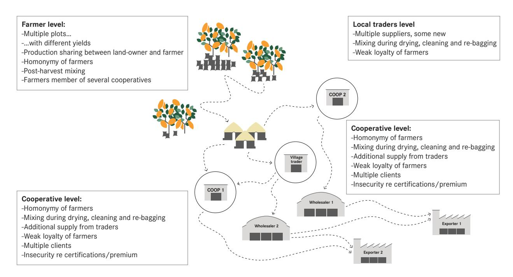

| Côte d’Ivoire Metric Tons                              |                        |             |
|--------------------------------------------------------|------------------------|-------------|
| Ghana                                                  |                        | Metric Tons |
| Production                                             |                        | 850 000     |
| Imported                                               | by top 6*              | 570 000     |
| Directly                                               | sources by top 6*      | 225 000     |
| Certified                                              | by top 6*              | 200 000     |
| Sold                                                   | as certified by top 6* | 100 000     |
| Certfied                                               | by others              | 125 000     |
| Sold *Top 6 international traders are Barry Callebaut, | as certified by others | 60 000      |

Current traceability systems and their planned improvements cannot guarantee the segregation of illegal or sustainable cocoa beans from the rest of the production.

The current cocoa supply chains in both countries are characterised by:

- 1. Complexity and weak formalisation, with a myriad of small players, widely spread geographically, involved in a diversity of trading relationships with a large range of partners.
- 2. Weak governance, in a key sector of the national economies.
- 3. Strong concentration of trade within less than 10 companies with sustainability programmes. While these companies support regulation to mitigate reputational risks, they implement low sustainability requirements.
- 4. Inability of the major trading actors at the end of the supply chain to change their procurement schemes in a liberalised and competitive international market.

The **most efficient way to improve the reliability and efficiency of traceability efforts would be to bring full transparency to the cocoa supply chain. Publishing quantities produced and sold at each point of the supply chain**, with transport documents indicating their origin and destination, from the plot to the final destination (retailers or at least, chocolate manufacturers).

Increased transparency can bring benefits directly to the cocoa supply chain actors and society as a whole.

The direct benefits of increased transparency are the following:

- For **farmer organisations**: Transparency improves trust among their members, employees and boards. It also supports a more integrated governance system, allowing farmers to better control, understand and participate in their organisations.
- For **national traders and farmer organisations**: Transparency facilitates access to loans and grants from local banks and microfinance institutions, decreasing these actors' dependence on exporting and processing companies.
- For **exporting and grinding companies**: Transparency is essential to sustainable and efficient direct supply chains. It supports the uptake of market intelligence tools that can improve their procurement planning and capacity to anticipate and adapt to market changes. Transparency also helps these companies to better communicate their sustainability efforts and their impacts. Finally, it helps reduce corruption in their supply chain.
- For **regulatory authorities**: Transparency lowers information collection and control costs. By reducing corruption, it increases revenue capture.
- For **chocolate manufacturers**: Transparency brings value to their sustainability initiatives, enabling the monitoring of the use by trading companies and NGOs of their sustainability investments. It also supports a better understanding of the cocoa beans' production and supply chain, to anticipate market changes.
- For **the entire value chain**: Transparency increases market efficiency, by reducing information asymmetries; improves governance, procurement planning and logistics; reduces the cost of credit; and makes regulations more adaptive.

To those positive impact of transparency could be added other impacts for indirect stakeholders of the value chain (input suppliers, service providers like transporters, banks, insurances, etc.) as well as for the rest of the society (media, researchers, NGOs, institutions in charge of economic regulation and statistics or even potential investors, etc.).

Due to the significance of the cocoa value chain in the Ivorian and Ghanaian economies, greater **transparency could generate various positive externalities both in terms of economy and governance, which could drive socioeconomic development**.

The TRASE initiative's²⁰ approach to soy beans in Brazil and the [Terpercaya](https://www.euredd.efi.int/publications/search?p_auth=PUHw089i&p_p_id=publicationsearch_WAR_publicationviewerportlet&p_p_lifecycle=1&p_p_state=normal&p_p_col_id=publications__column--2&p_p_col_pos=2&p_p_col_count=14&_publicationsearch_WAR_publicationviewerportlet_tag=terpercaya) initiative²¹ on palm oil in Indonesia are excellent examples of setting transparent approaches which could empower jurisdictional authorities while driving many actions from both public and private sectors.

But the impact of a transparency approach in Côte d'Ivoire and Ghana could be even bigger as both countries have much more informal economies than Brazil or Indonesia, deficient statistical systems as well as much less decentralised governance.

Currently all the main cocoa trading companies are starting transparency initiatives, publishing lists or maps of their suppliers. But without public requirements, they limit this transparency to a very limited quantity of information: only names of cooperative/ farmer associations involved in their 'direct procurement' without any quantity and without contacts.

Many smaller trading companies and chocolate manufacturer like Uncommon Cacao²², Tony's Chocolonely²³ or Ethiquable²⁴ are demonstrating that total transparency about the origin of each ingredient in a chocolate product is possible and commercially successful.

The European Union could take advantage of this trend defining minimum transparency requirement or even setting up a definition of transparency (like it was done recently for fair trade) and pushing Côte d'Ivoire and Ghana to complete transparency about the national supply chain and exportation process. The EU could also show the good example by publishing imports and intra-EU trade details.

The economic literature about the positive impact of economic transparency is growing²⁵ and rooted in old/well-known critics of liberal economies²⁶, sustainability challenges in forest-risk commodities could be a great opportunity to convert the theory into impactful and game-changing policies.

²⁰<https://insights.trase.earth/>

²¹ [https://www.euredd.efi.int/publications/demonstrating-and-promoting-district-level-sustainable-commodity-production](https://www.euredd.efi.int/publications/demonstrating-and-promoting-district-level-sustainable-commo)

²²<https://www.uncommoncacao.com/transparenttrade>

²³<https://tonyschocolonely.com/us/en/our-mission/tonys-impact>

²⁴ [https://www.ethiquable.coop/producteurs?field\\_type\\_de\\_produit\\_tid=51&field\\_adresse\\_country=All](https://www.ethiquable.coop/producteurs?field_type_de_produit_tid=51&field_adresse_country=All) 

²⁵ [https://ash.harvard.edu/files/political\\_econ\\_transparency.pdf](https://ash.harvard.edu/files/political_econ_transparency.pdf) 

²⁶ Akerlof, Spence & Stiglitz won the Nobel Prize in Economics in 2001 demonstrating the negative impacts of information asymmetries, but the first research paper on the topic, Akerlof's study 'The Market for "Lemons", dates from 1970.

## 4. Sources of information to monitor sustainability risk

There is currently very limited information available to monitor sustainability risk in Côte d'Ivoire and Ghana. Below is a list of existing sources that could provide additional data to inform sustainability indicators and information on their accessibility.

| Categories | Data & Information       | Source                                    | Accessibility                 |
|------------|--------------------------|-------------------------------------------|-------------------------------|
|            |                          | ICCO                                      | Public - Published by quarter |
|            |                          | Good Inside Portal                        | Confidential                  |
|            | National prices of cocoa | CCC, Cocobod, Newspaper & Media           | Public                        |
|            |                          | Côte d’Ivoire: INS, national agricultural |                               |
|            |                          | Ghana: Ghana Statistical Service          |                               |
|            |                          |                                           | Côte d’Ivoire: Public – Data  |
|            |                          |                                           | Ghana: Public report          |
|            |                          | IMAGES                                    | Available upon request        |
| Population | Population by region or  |                                           |                               |

**Figure 41.** Available data identified during the study. **Source:** Nitidae

| Categories Data & Information Source Accessibility |                    |
|----------------------------------------------------|--------------------|
| Public report:                                     | https://www.kit.   |
| Data sets:                                         | https://dataverse. |
| Child labour Unregistered children,                |                    |

Furthermore, the indicators below are currently being tested in the Mé and Cavally regions in Côte d'Ivoire.

| Categories   | Indicator      | Method                               | More information on the |
|--------------|----------------|--------------------------------------|-------------------------|
| Biodiversity | Shannon-Wiener |                                      |                         |
|              | Basal area     | Measure of trunk width at 1.3 metres |                         |

²⁷ [https://www.nitidae.org/files/4ec0ad23/an\\_analysis\\_of\\_land\\_use\\_changes\\_and\\_land\\_degradation\\_in\\_mozambique.pdf](https://www.nitidae.org/files/4ec0ad23/an_analysis_of_land_use_changes_and_land_degradation_in_mozam)

²⁸ [https://www.nitidae.org/files/114e90ee/analyse\\_des\\_dynamiques\\_et\\_des\\_facteurs\\_lies\\_a\\_la\\_regeneration\\_forestiere\\_du\\_miombo\\_autour\\_de\\_la\\_reserve\\_](https://www.nitidae.org/files/114e90ee/analyse_des_dynamiques_et_des_facteurs_lies_a_la_regeneration) [nationale\\_de\\_gile\\_au\\_mozambique\\_solene\\_maneau.pdf](https://www.nitidae.org/files/114e90ee/analyse_des_dynamiques_et_des_facteurs_lies_a_la_regeneration) 

²⁹ [https://www.nitidae.org/files/7cfe1a8b/190430\\_pres\\_nitidae\\_optimisation\\_developpement\\_saf\\_cacao\\_cote\\_ivoire.pdf](https://www.nitidae.org/files/7cfe1a8b/190430_pres_nitidae_optimisation_developpement_saf_cacao_cote) 

³⁰ [https://www.nitidae.org/files/0b1d232c/formation\\_theorique\\_sur\\_la\\_surface\\_terriere.pdf](https://www.nitidae.org/files/0b1d232c/formation_theorique_sur_la_surface_terriere.pdf) 

#### **Disclaimer**

This report has been prepared by Nitidae for the EU REDD Facility, with the assistance of the European Union. The contents of this report are the sole responsibility of the authors and can under no circumstances be regarded as reflecting the position of the European Union.

© EU REDD Facility, March 2021.

**Cover photo:** Unloading cacao from Ivory Coast with crane from a ship into a trailer truck on the river Seine in the port of Rouen in France. Credit: Photoagriculture

During the last decade, cocoa sustainability concerns led to the creation of numerous public and private monitoring and traceability initiatives.

Despite their sheer number, these initiatives have not succeeded in fully tracking most of the cocoa production in Ghana and Côte d'Ivoire from production areas, and very scarcely from farmers' plots.

Furthermore, there are significant barriers to access to accurate cocoa production and distribution information in both countries. To carry out the present study, Nitidae had to resort to many informal networks and negotiations to obtain production data. Despite these efforts, it was unable to assess the accuracy of the data received from CCC and Cocobod.

More globally, information on cocoa production and trade in West Africa is scarce. Even such partial and incomplete information is secretly kept by all stakeholders. The present study revealed two elements that can explain such secrecy:

- Traceability and sustainability initiatives cover a very limited share of the production.
- A large part of the production in both countries is directly sourced in recently deforested areas where other sustainability indicators (child labour, wages or poverty of farmers) are likely to be the worst.

Transparency will not solve all the numerous and complex sustainability challenges of the sector. However, increased transparency in the West African cocoa value chain could, at least, make traceability efforts more credible and tangible, allowing more accurate monitoring. It would also help inform decision making at all levels and focus action on the most problematic areas.

## 5. Conclusion