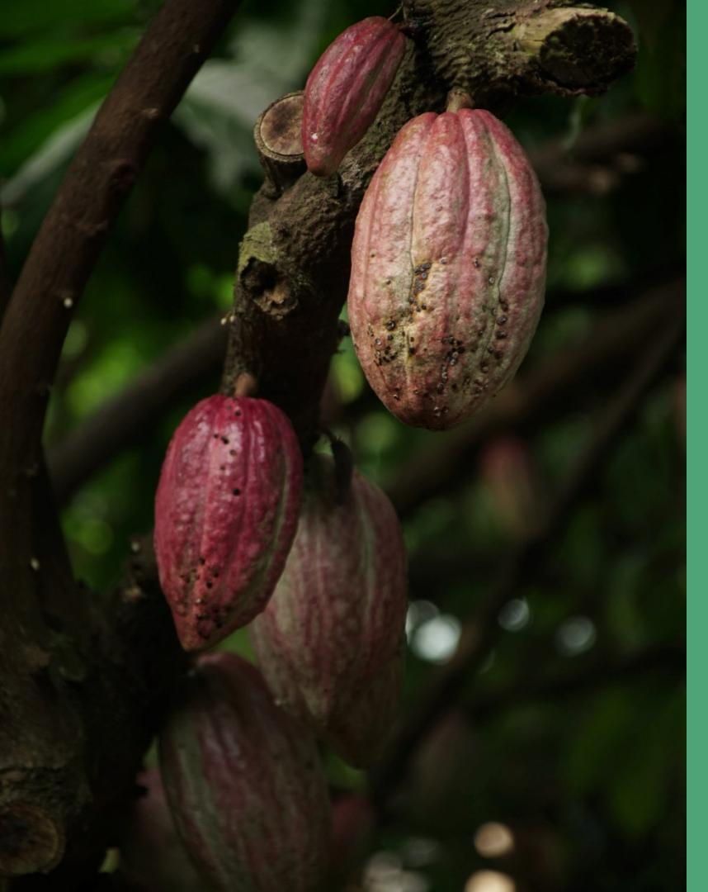

Traceability, transparency and sustainability in the cocoa sector in Cameroon

Thomas FABRE Simon BASSANAGA Ghislain FOMOU NYAMSI Pierre RICAU Elsa SANIAL

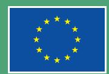

August 2022

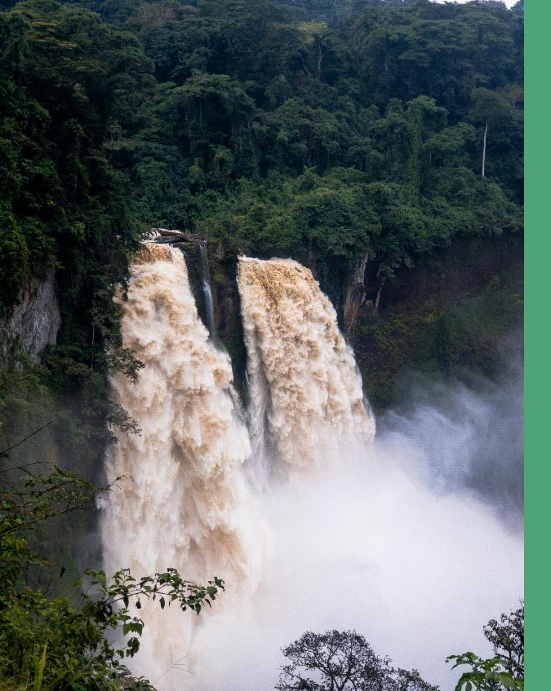

1. Introduction and context

## Growing overlap between the cocoa industry and sustainability issues in Cameroon

#### **Evolution of Cameroonian production and international prices**

(in thousands of tons and in \$/t - source FAOSTAT, ICCO and FXTop)

cocoa producer in the world

# **292k tons**

marketed during the 2020-2021 campaign

#### **Three risks associated with the sector**

**Deforestation:** although Cameroon lost 11% of its forest cover between 1990 and 2020, in 2020 forests still cover 40% of the territory

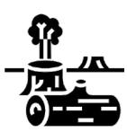

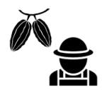

**Producer income:** in 2007, 69% of cocoa farmers lived below the poverty line

**Child labour:** about 40% of children aged 6 to 14 are involved

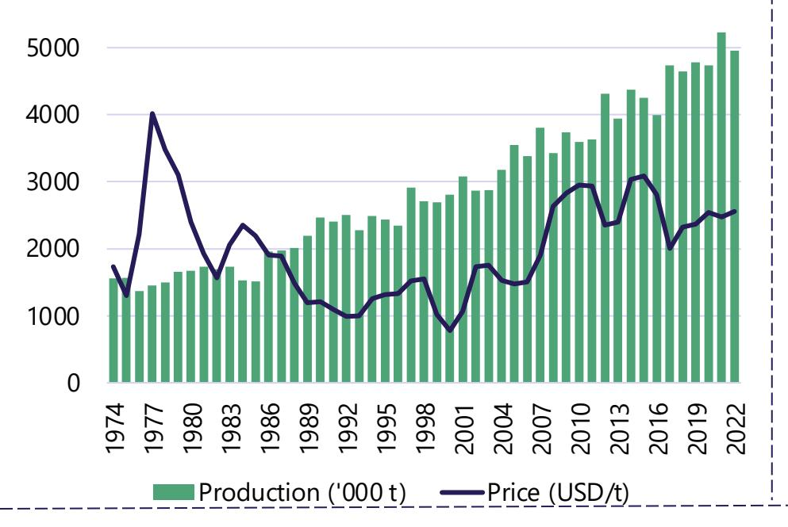

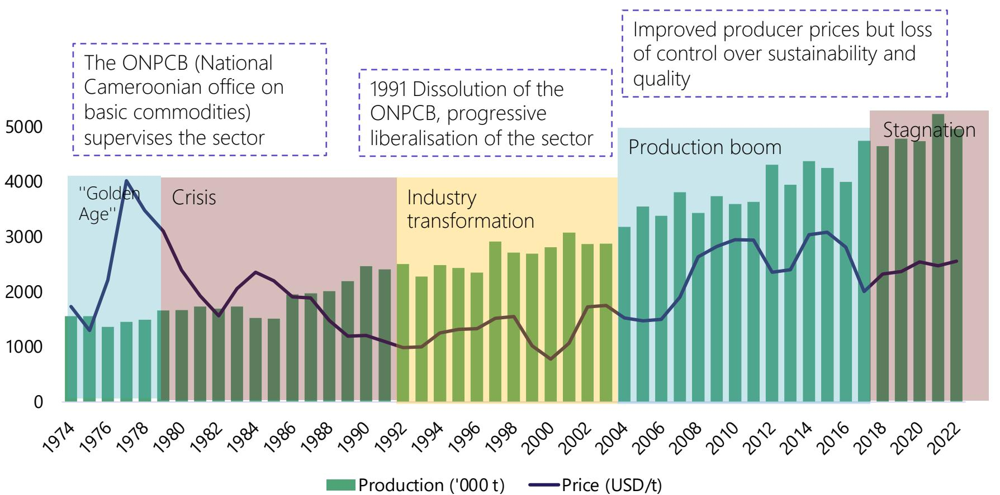

## Supervision/Liberalisation of the sector and evolution of production and price

### The Roadmap to Deforestation-Free Cocoa (RDFC)

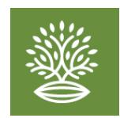

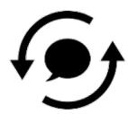

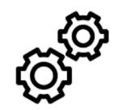

#### **A voluntary initiative supported by IDH**

## **A space for dialogue for the cocoa industry**

## **Commitments on traceability and monitoring of forests**

- RDFC signed in January 2021
- Commitment to "work together technically and financially, and to implement programmes and budgets related to sustainable cocoa production and marketing, forest preservation and rehabilitation, and community inclusion"
- Ambitious goal: 100% traceability by 2025

- Public-private-civil society partnership
- Signatories: institutions, producer organisations, private sector, civil society, research institutions
- The EU is not a signatory but discussions are ongoing on this subject

- Ensure 100% traceability of cocoa supply from farm to warehouse to port by 2025
- Update forest maps of (non) permanent forest estate by end of 2022
- Total elimination of supply from permanent forest estate by end of 2025

## European Union actions to improve the sustainability of the cocoa sector

## **The Sustainable Cocoa Initiative (SCI) targets three major issues associated with cocoa sustainability**

#### **Proposals for European legislation**

The EU no longer wants to contribute to deforestation and wants to increase the consumption of deforestation-free cocoa

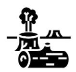

The EU wants to help producers get a decent income

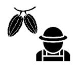

The EU no longer wants to consume products linked to child labour

Environmental issues European Commission's Regulation Proposal (ECRP) against imported deforestation

Economic and social issues Proposal for a directive on corporate sustainability due diligence

Communication from the European Commission on decent work in the world, announcing the preparation of a regulation to effectively ban the entry into the EU market of products derived from forced labour

*Feb. 23, 2022*

*Nov. 17, 2021*

## Key elements of the European Commission's Regulation Proposal (ECRP) on deforestation-free products

Minimise the EU's contribution to global deforestation and forest degradation

Minimise the risk of products from a supply chain associated with deforestation or forest degradation being placed on the EU market

## General objective

Increase demand and trade in the EU for legal and "deforestation-free" raw materials and products

## Specific objectives

Palm oil, soybeans, beef, cocoa, coffee, wood and products derived from these commodities

# Products concerned

(beginning of April 2022) Mandatory due diligence rules for all operators who place goods and products on the EU market or export them from the EU, with traceability systems in place. Data will be audited to ensure the legality of production areas and that the products are not associated with deforestation.

#### Requirements

The European Union still represents the majority of Cameroon's cocoa exports, but its share is steadily decreasing

**99%**

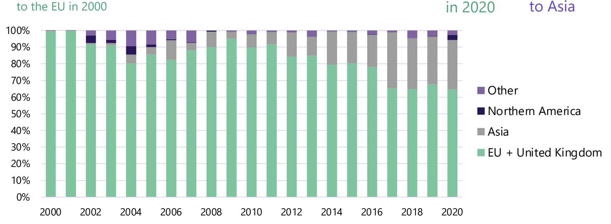

**65%**

**vs. 30%** 

Cocoa exports from Cameroon to the EU as % of total exported tonnage *(Source: UN Comtrade, destination data, 2022)*

#### Comparison of UN Comtrade and ONCC data on export destination

| Source Year or harvesting season/country of import | UN Comtrade 2020 | ONCC 2020-2021 | UN Comtrade 2019 | ONCC 2019-2020 |
|----------------------------------------------------|------------------|----------------|------------------|----------------|
| The Netherlands                                    | 53%              | 66%            | 61%              | 63%            |
| Malaysia                                           | 17%              | 7%             | 14%              | 8%             |
| Singapore                                          | 8%               | ?              | 5%               | 0%             |
| Germany                                            | 8%               | ?              | 3%               | 3%             |
| Indonesia                                          | 5%               | 9%             | 10%              | 6%             |
| United States                                      | 3%               | ?              | 0%               | 0%             |
| Spain                                              | 3%               | ?              | 2%               | 2%             |
| Turkey                                             | 3%               | ?              | 3%               | 0%             |

**The differences can be explained by differences in methodology (port of destination for UN Comtrade, Douala for the ONCC), data entry errors, or by the difference between annual (UN Comtrade) and seasonal (ONCC) data. The yellow boxes below highlight the most significant discrepancies.**

## The cocoa sector is less predominant in Cameroon than in Côte d'Ivoire but remains the country's leading export crop in terms of value

| (in Ha –                   | Country Production 290 2 248 1 047 (in kT during the 2020-2021 campaign, ICCO data) Cultivated area 694 000 4 774 875 1 450 000 FAO Stat) Yield |
|----------------------------|-------------------------------------------------------------------------------------------------------------------------------------------------|
| (in kg / Ha –              | FAO Stat)                                                                                                                                       |
|                            | 417 460 551 Number of farms                                                                                                                     |
| (estimation Nitidæ –       | recent research)                                                                                                                                |
|                            | 500 000 1 000 000 800 000 Value                                                                                                                 |
| (in % of 2020 GDP –        | customs data)                                                                                                                                   |
|                            | 1% 8% 4%                                                                                                                                        |
| Farm gate price -          | max                                                                                                                                             |
| (in FCFA / kg, 2020-2021 – | N’kalô + inquiries )                                                                                                                            |
|                            | 1210 1000 1030                                                                                                                                  |
| Farm gate price -          | min                                                                                                                                             |
| (in FCFA / kg, 2020-2021 – | N’kalô + inquiries)                                                                                                                             |
|                            | 700 750 (even lower in isolated remote locations)                                                                                               |

# A one-month field investigation to interview direct and indirect players in the industry

Literature surveys; remote interviews

Dec. 2021

Institutional interviews

February April 2022

Writing of the report

Field investigations

Yaoundé Cocoa regions Intermediate

presentation

Final report

January, 21 February, 18

#### **Interviews with a wide range of stakeholders in four regions of Cameroon**

NGOs: 4

Trader: 13

TFP: 9

Consultant: 3

Institution: 14 Research: 5

Audit / Certif.: 3

Forest: 1

Cooperative: 16

Cocoa producer: 9

Licence Buying Agents (LBA / coxeur : 2

Field agent: 2

**NB:** Some actors may occupy several functions (cocoa farmers/*coxeurs*,

cocoa

farmers/leaders of cooperatives, etc.).

#### **Objectives of the report**

- **1. Traceability:** to present the general organisation of the sector, review the role of the informal sector, assess the amount of information produced and the key data missing for true traceability
- **2. Sustainability:** to study the impact of the sector on deforestation, child labour and producers' income; take stock of public and private sustainability programmes

#### Field visits and meetings with a wide variety of actors

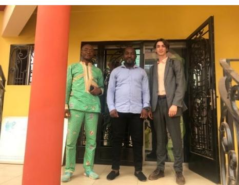

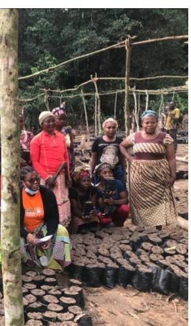

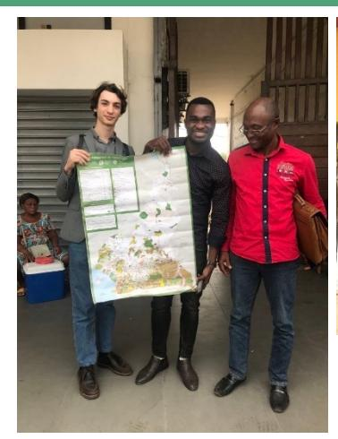

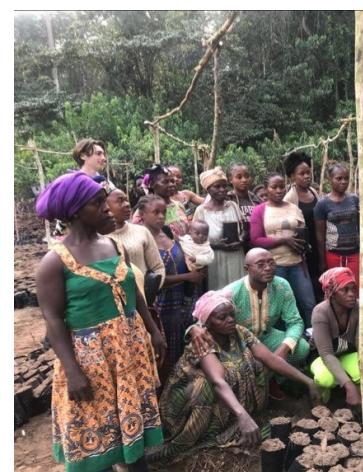

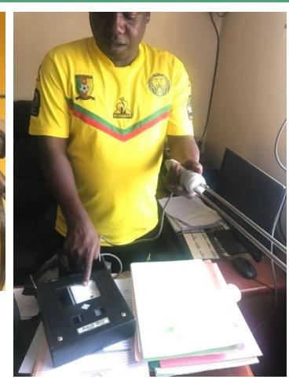

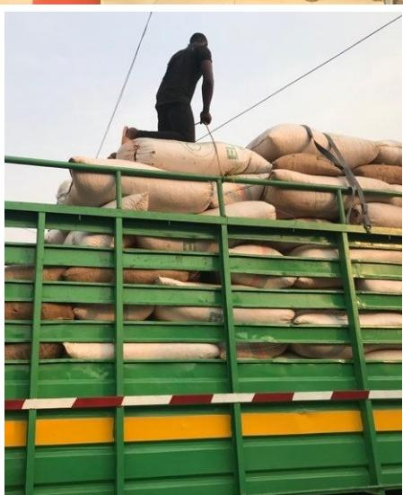

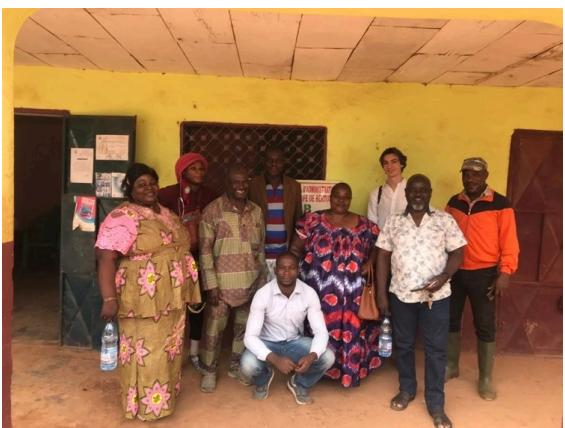

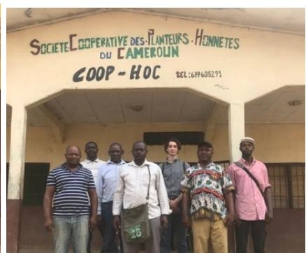

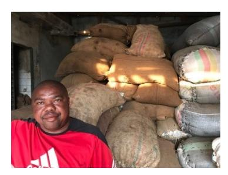

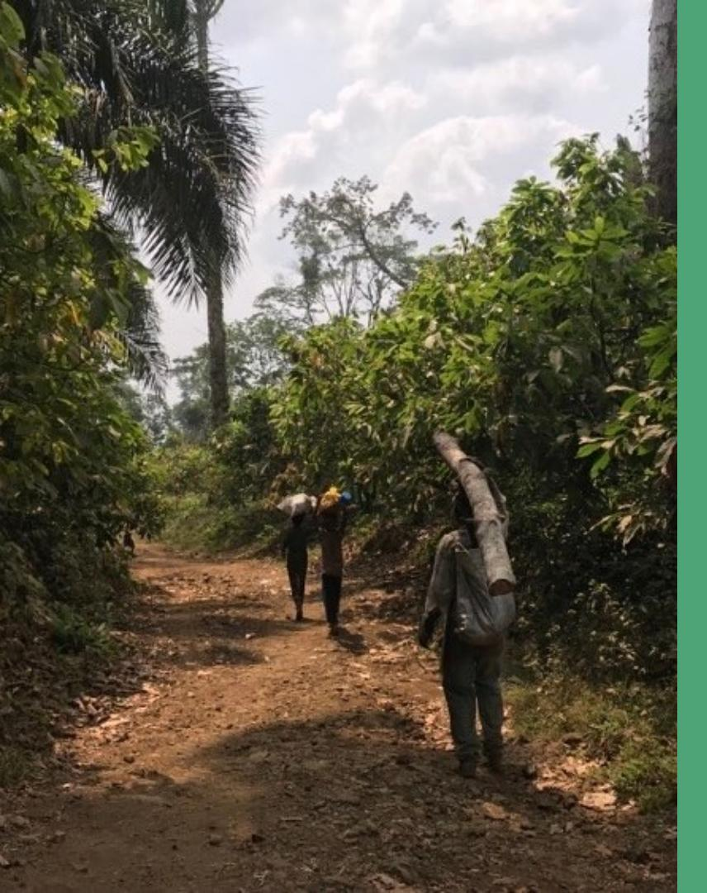

# 2. Traceability

# 2.1. Actors and interactions

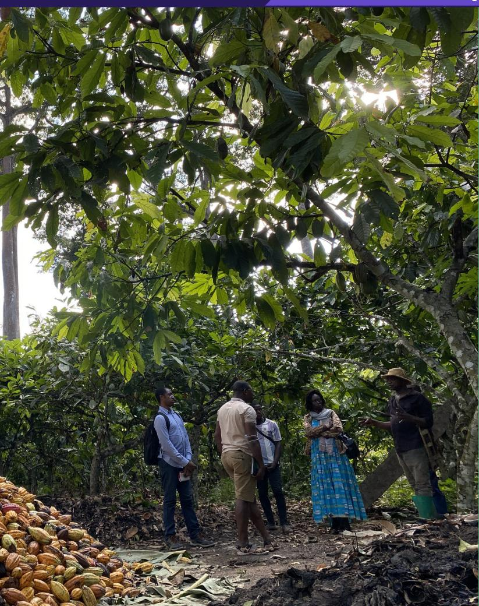

## Main actors in the national value chain

| Actor      | Main activities                          | Definition                                                                         |
|------------|------------------------------------------|------------------------------------------------------------------------------------|
| Coxeur     | Collection and aggregation of cocoa      |                                                                                    |
| and bagger | Cleaning and reconditioning              | Independent companies or subsidiaries of the exporters who carry out the cleaning, |
| Exporter   | Purchase at port stores, export of beans |                                                                                    |

## Definition of the main actors in the **international** value chain

| Actor                  | Main activities                                                                         | Definition                                                                                                                                                                                                                                                                                                                |
|------------------------|-----------------------------------------------------------------------------------------|---------------------------------------------------------------------------------------------------------------------------------------------------------------------------------------------------------------------------------------------------------------------------------------------------------------------------|
| Grinder                | Purchase from factory stores, grinding, export of mass, butter and cocoa powder         | Grinders carry out the primary processing of cocoa. They export most of their processed products directly.                                                                                                                                                                                                                |
| Importer               | Import, grinding and resale of cocoa beans, mass, butter and powder to chocolate makers | Multinationals specialising in the trading of raw materials, including cocoa. They obtain their supplies both from their national export subsidiaries and from independent exporters. This is a highly concentrated sector where 6 players account for about 80% of world trade in beans and primary processing products. |
| Chocolate confectioner | Manufacture of chocolate and chocolate products (confectionery, cookies, etc.).         | Second transformation actors, working the mass, the cocoa butter and/or the cocoa powder. They are marginal in Cameroon.                                                                                                                                                                                                  |

#### **Notes**

• In Cameroon, the term "operator" can refer indiscriminately to various actors in the sector, while the FCRP clearly defines an operator as follows "any natural or legal person who [...] places commodities [...] on the European market." This ambiguity prompts us to avoid the use of this term. • Some multinational trading companies sometimes integrate many stages of the value chain: support to the producer, support to the cooperatives, direct supply to the cooperatives, domestic marketing operations, export, crushing, import and even distribution in Europe.

#### Sector's structure: links and volumes of the cocoa value chain

396 Coop registered at the CICC 45k T

208 LBA 270k T

300 000 producers\* 292k T

Coxing Thousands of coxeurs (+ some LBA / Coop…) 152k T

34 units of grinding (but 4 major ones) 62k T

Plots 375 000 Ha\*

**LBA**

COOP

+/- 40%

+/- 40%

+/- 20%

33 Exporters (but 4 major ones) 210k T

292k T

Communities (land allocation, labour, etc)

> exported incl. 65% to the EU

Resales at the port

Processed cocoa

*Source: ONCC, campaign report, 2020-2021 Flows estimates and simplifications Arrow size proportional to the flow \* Bottom of the estimated ranges*

#### Supply in Cameroon of large multinational cocoa bean traders/grinders (top 6 in 2019-2020, 2020-2021 data unavailable)

| Suppliers Sic Cacaos Telcar Olamcam Camaco AMS Ndongo Essomba Achanyi COTEC SBET | >90% | 66% 14% 3% 9% 8% | 86% 14% | 100% |     |      |
|----------------------------------------------------------------------------------|------|------------------|---------|------|-----|------|
| Producam                                                                         |      |                  |         |      | 95% | 31%  |
| Agri-Trade                                                                       |      |                  |         |      | 5%  |      |
| Cooppracam                                                                       |      |                  |         |      |     | 69%  |
| (incl. ground beans)                                                             |      |                  |         |      |     |      |
|                                                                                  | 21%  | 39%              | 34%     | 5%   | 2%  | 0,1% |

## The coxeurs: a key link that blurs the traceability of cocoa

#### **Provide services to different actors But without official status**

**and providing no traceability**

*No official registration* *No purchase records*

*Supply LBAs from other regions* 

**+/- 40%** of the production

**Which is therefore only traced from the LBA**

Collection in remote and hard-toreach areas

Promises to buy at the beginning of the season

Financial services: input credit, cash, food, etc.

Link with producers in poorly known areas

Diversification of supply regions to "build volume"

Exporter Increase the volume of supply

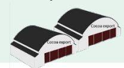

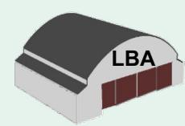

#### Two legal trade constraints that are not always complied with

#### **Two legal constraints on trade**

*Arrêté 36 from Min. Commerce, 2014*

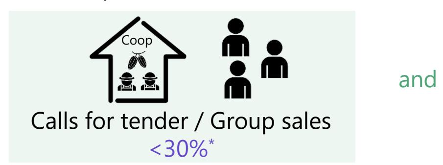

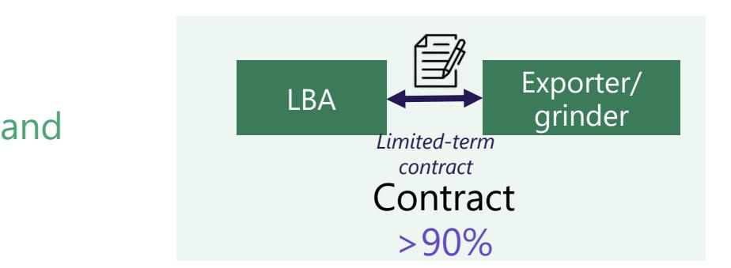

## **The most common informal trading channel**

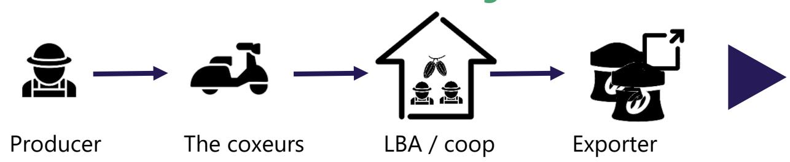

Cocoa often changes department and sometimes region

# Current public and private traceability

|                    | Public Sector                        | Private Sector                           |
|--------------------|--------------------------------------|------------------------------------------|
|                    |                                      | About 150,000 ha georeferenced           |
| Producers          | Last agri census: 2014               |                                          |
|                    |                                      | 2020: +/-50,000 producers (17%) under RA |
| Coxeurs            | No register (activity very rarely or |                                          |
| Exporters/grinders | Detailed customs statistics          |                                          |
|                    |                                      | about 90,000 tons (31%) traced by RA     |
| Importers          | Detailed customs statistics          |                                          |
|                    |                                      | Direct client traceability (but not      |

2.2. Public traceability initiatives

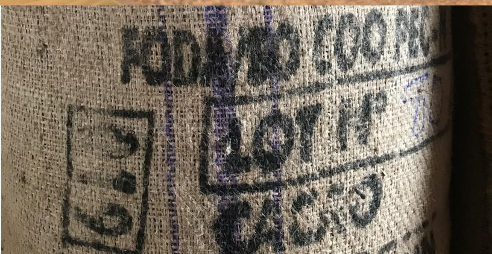

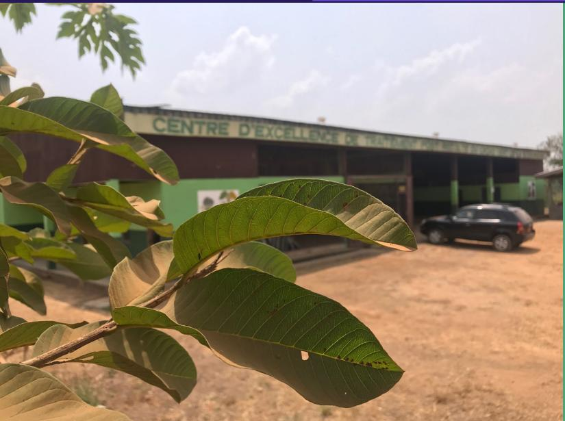

# Cocoa institutions: a fragmentation of traceability initiatives

| Institutions           | ONCC CICC FODECC SODECAO                                                                                                                                                                                |
|------------------------|---------------------------------------------------------------------------------------------------------------------------------------------------------------------------------------------------------|
| Budget (Md XAF/yr)     |                                                                                                                                                                                                         |
|                        | 12 21,5 +management of (incl. 4 on quality and                                                                                                                                                          |
|                        | external funds only 0.5 on monitoring and coordination)                                                                                                                                                 |
| Regulation Mandate     | of the Regulation of relations sector, production of between actors, social Funding for the                                                                                                             |
| statistics             | and quality                                                                                                                                                                                             |
| (in theory)            | industry's programmes Plant distribution and commercial control projects                                                                                                                                |
| Actual services        |                                                                                                                                                                                                         |
|                        | Seize every opportunity Limited distribution, little reporting                                                                                                                                          |
| (in practice)          | (including non-mandated activities) Specifications for                                                                                                                                                  |
| Traceab. role (theory) |                                                                                                                                                                                                         |
| Traceab. role          | Funding solutions Support for the Follow-up of the private tracking + establishment of for traceab/certif. distribution/creation of aggregation of private private tracaeab. initiatives new plots data |
| (in practice)          | Very little coordination among initiatives                                                                                                                                                              |

## The export duty is shared among the different institutions

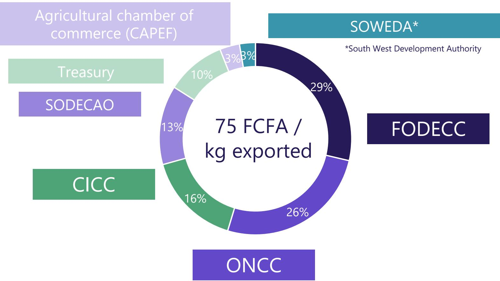

#### Very limited public monitoring upstream of the sector... (example of information flows in the Moungo)

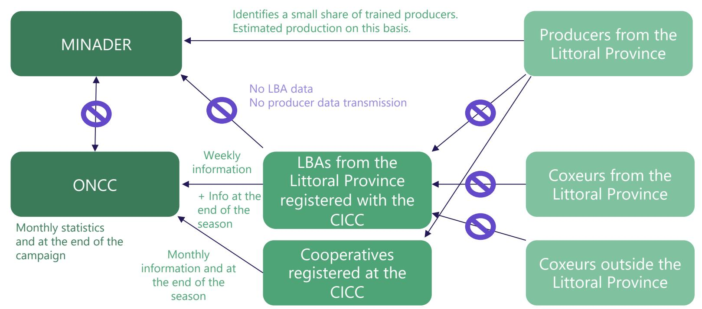

LBAs are key players, but their supply is poorly documented because it is strongly linked to informality and because many LBAs leave the management of their data to their clients (exporters/grinders)

Information flow (different from bean flow)

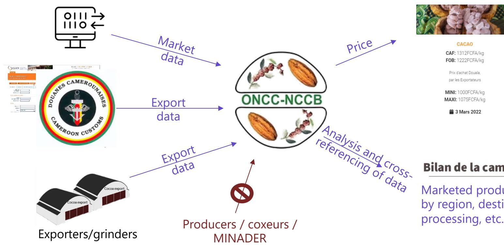

## Bilan de la campagne 2020-2021

#### ... Stronger downstream with the central role played by the ONCC

# **Information received Information produced**

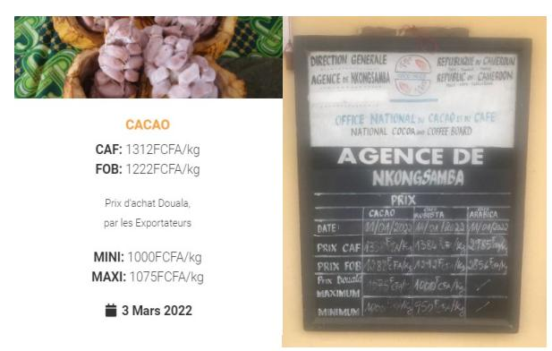

Marketed production, purchases by region, destination, quality,

## The information produced by the ONCC, although imperfect, is published in a fairly transparent manner (1/3)

Price tracking available at ONCC agencies

and on the internet

But a possible confusion between edge-of-field price,

FOB price and LIFFE/NYCE price

The ONCC season reports can be freely

downloaded from its website

#### But :

•

Raw data is not available

•

The reports do not all have the same level of details:

the 2019-2020 report is 57 pages long, compared to

the 2-page summary report for 2020-2021

•

Previous seasons' reports are not readily available

The information available is diverse: list of exporters, grinders, importers, logisticians,

traded and exported production, etc.

But some key information is missing, including

information on production, coxeurs and supply of LBAs

## The information produced by the ONCC, although imperfect, is published in a fairly transparent manner (2/3)

| ONCC season report      | 2017-2018       |                     |            |
|-------------------------|-----------------|---------------------|------------|
|                         | (synoptic view) |                     |            |
|                         |                 | 2018-2019 2019-2020 | 2020-2021  |
| Traded production       | ✓               |                     |            |
|                         |                 | ✓                   | ✓          |
| Purchases by region     | ✓               | ✓                   | ✓          |
| Purchases by exporter   | Ø               | ✓                   | Incomplete |
| Exported production     | ✓               | ✓                   | ✓          |
| Cameroon                | ✓               | ✓                   | Incomplete |
| Importers (customers by |                 |                     |            |
| exporter)               | ✓               | ✓                   | Incomplete |

## The information produced by the ONCC, although imperfect, is published in a fairly transparent manner (3/3)

| ONCC campaign report           | 2017-2018 |           |                     |
|--------------------------------|-----------|-----------|---------------------|
|                                | 2018-2019 | 2019-2020 | 2020-2021           |
| Quality                        | ✓         |           |                     |
|                                |           | ✓         | ✓                   |
| Price evolution                | ✓         | ✓         | ✓                   |
| Transformation                 | ✓         | Detailed  | Global non-detailed |
| Bank performance               | Ø         | ✓         | Global non-detailed |
| Number of stores per region    | Ø         | ✓         | Ø                   |
| Nomber of producers per region | Ø         | Ø         | Ø                   |
| Number of producers per region | Ø         | Ø         | Ø                   |
| LBA supply areas               | Ø         | Ø         | Ø                   |
| Number of coxeurs              | Ø         | Ø         | Ø                   |

#### In recent years, the ONCC has increased its quality control

#### **Production of quality data**

of Grade I in 2020-2021

<5%

of Grade I in 2016-2017 200 to 250 pounds drop in value on the London Stock Exchange for Grade II cocoa

40%

## **Which has contributed to a significant increase in the quality of Cameroonian cocoa**

• Quality control by field agents during group sales • Quality control during potting • Production of quality statistics • End of season quality premiums for Grade I cocoa (however, the last payments were made late: 2 billion FCFA of quality premium for the 2018 to 2020 seasons)

## But this has had no noticeable impact on export prices because of the generalised quality increase on the international market

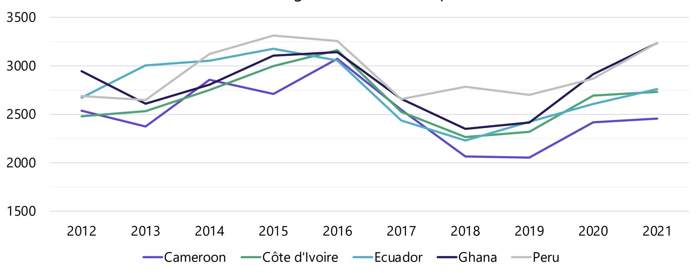

Evolution of the comparative prices of raw beans for five origins (CIF Rotterdam price)

# For the moment, the CICC is only marginally involved in traceability...

As an **inter-branch organisation**, the CICC ensures a **dialogue** among the actors of the sector

| College of                                                  |                                                                  |
|-------------------------------------------------------------|------------------------------------------------------------------|
|                                                             | College of                                                       |
| 40% College of producers and cooperatives (ANPCC) Exporters | 10% College of buyers (LBA) / manufacturers / packers Processors |

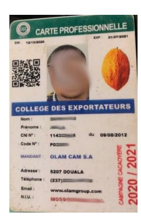

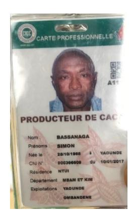

**Registration** of producers, cooperatives, LBAs, exporters and grinders Issuance of **official cards**

*Exporter card Producer card*

*The 4 colleges of the CICC and their voting rights at the General Assembly*

#### But the CICC's contribution to traceability remains **limited**

- Only a minority of producers (+/-10%) are registered
- Available upstream and downstream data from the CICC is rarely compared or put into perspective with ONCC data
- Some supply chain actors remain informal and are not registered (*coxeurs*)

*Source: CICC website*

...but it has initiated quality initiatives that can be built upon

#### **Producer registration and plot geo-referencing launched in 2019 by the CICC**

60 000

Registered producers mainly in the Centre (average of 20 000 / year)

10 000

Producers georeferenced by a sworn land surveyor

# Online platform

Database can be completed with the ONCC, exporters and FODECC data if there is agreement to that end

*Source: Interview with the CICC, Jun. 2022*

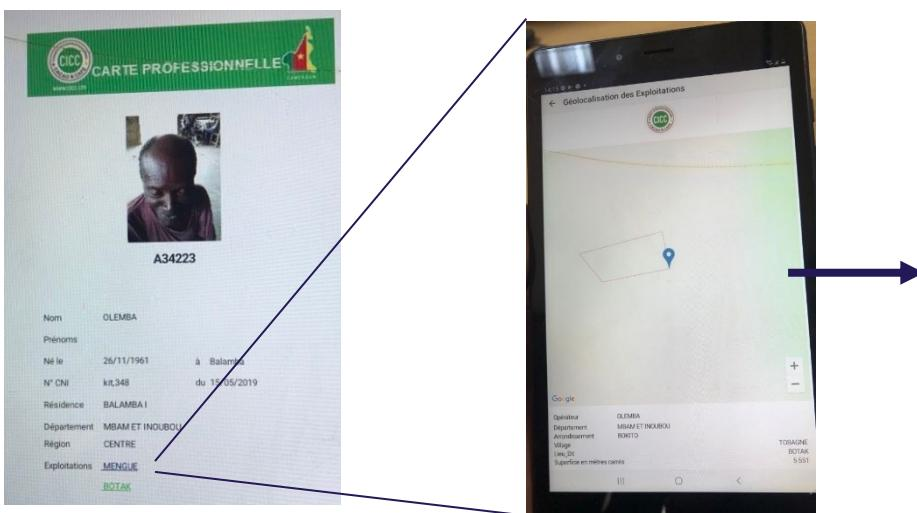

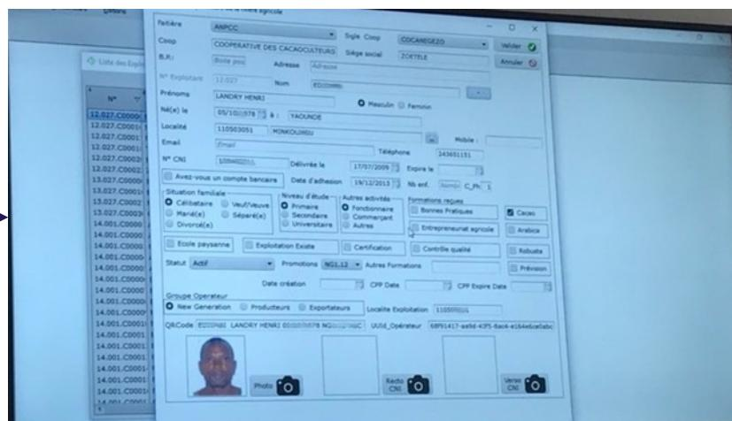

The CICC also provides a framework for the development of centers of excellence A model close to the requirements of the ECRP, but on a very small scale

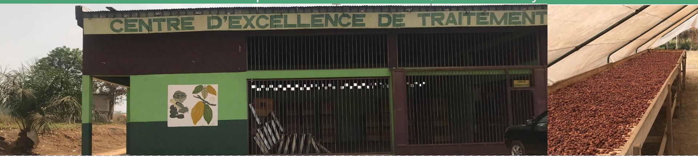

Better prices (+50%) => georeferencing of parcels (prohibition of their extension) + preserved identity (**1 identifier per bag**) + reinforced controls

<1% of the current production promoting niche markets

Niche market scalability?

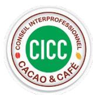

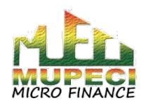

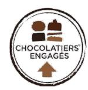

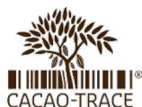

#### **Interesting results… ...But at a limited scale**

# Opportunities and risks associated with FODECC's "Guichet Producteurs"

### **A subsidy programme that could support traceability...**

• FODECC = 1St cocoa institution (in terms of the budget made available to it) • Partial and degressive subsidy of inputs via electronic payment on cell phone: 40% subsidy the first year • In partnership with the company EDENRED specialised in electronic vouchers in rural areas • Requirements: bank account, <10 Ha, selfreferencing • Experience in the Moungo department under technical assistance (important bank account creation announced in the first quarter of 2022) • Goal: 10,000 producers in the first year, 100,000 by 2025

#### **... but which also causes concern among the actors**

|  | 
Risk of bureaucratic burden
 
May not be adapted to the requirements of the agricultural calendar
 
Financial risk because they must contribute for 60% of the inputs price
 
Waiting for proof of effectiveness: "we're waiting to see"
 |
|------------------------------------------------------------------------------------------------------------------------|----------------------------------------------------------------------------------------------------------------------------------------------------------------------------------------------------------------------------------------------------------------|
| 
<b>Other institutions</b>
                                                                                       | 
Serious doubts about the effectiveness of self-referencing
 
Risk of excluding the most isolated and least equipped producers (including those in forest areas)
                                                                                    |
|                                                                                                                        | Doubtful level of data sharing                                                                                                                                                                                                                                 |

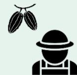

2.3. Private traceability initiatives

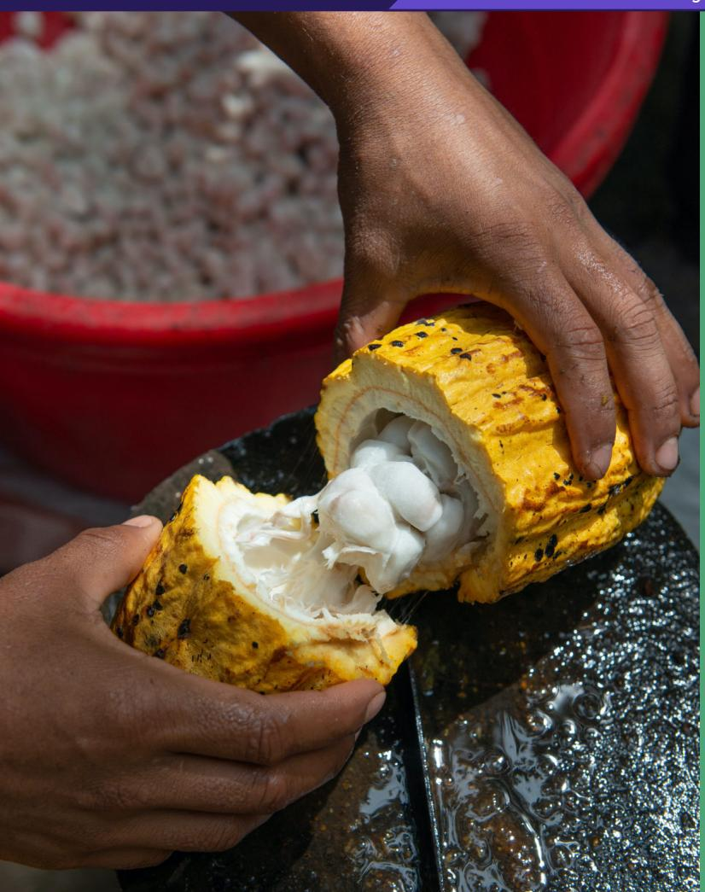

|                   |               |     |                | Method Other sustainability                    |
|-------------------|---------------|-----|----------------|------------------------------------------------|
| Telcar            | (22%) Cargill | +/- | 66%            | +/-25                                          |
| (19%)             | Olam          | +/- | 27%            | +/-22                                          |
|                   |               |     |                | Forest loss risk index                         |
|                   | Callebaut     | +/- | 45%            | +/-30 Cocoa Horizon (producer                  |
| AMS (5%)          | Ecom          | +/- | 90%            | ECOM Sustainability                            |
| (5%)              | Neoindustry   |     | +/- 15         | Responsibility                                 |
| 63% of the market |               |     | 40% on average | (behind Ghana and RCI, Cam less of a priority) |
|                   | Introduction  |     | Traceability   | Sustainability Conclusion and reflections      |

# Traceability in RA certified cooperatives (1/3)

# **Steps Explanations Limits**

Cooperative/LBA and Exporter Memorandum of Understanding

Establishment of a list of producers

The cooperative will only be able to sell certified bags of beans from these producers.

Controlling sales by producer is difficult. A producer can, for example, buy up the production of her/his neighbors (especially co-producers).

A memorandum of understanding is signed at the beginning of the season between the cooperative/LBA and its client (most often an exporter). It specifies the volume, as well as the requirements in terms of quality and durability.

This memorandum of understanding is rarely respected by customers (exporters) who only pay premiums on a portion of the volumes delivered.

# Traceability in RA certified cooperatives (2/3)

Georeferencing of producers

New plots are georeferenced at the beginning of (or during) the campaign. However, new plots of an already registered producer are very rarely added.

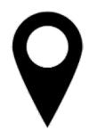

Georeferencing often done via points, more rarely via polygons.

Often only one plot per producer. Attention: 100% of the beans of a producer are not necessarily sold to the cooperative. And 100% of the beans sold by a cooperative are not necessarily certified => the yield/ha controls are often imprecise.

Documentation produced for each transaction

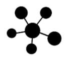

Mention of weight and quality Delivery of a slip i) to the planter and ii) to the coop or LBA.

The information is computerised by the agent in charge of the purchase. When computerisation is not possible at the time of purchase, the paper documents are digitised at the headquarters of the export group afterwards.

It is easy to "clean up" the computerised data from field sales to eliminate any transactions that are questionable in terms of origin or volume.

# Traceability in RA certified cooperatives (3/3)

Audits of certified cooperatives and some of their producers

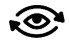

Transport document and shipping control at the port of export

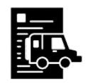

A shipping bill is also established. It must accompany the batch until export and be checked by customs upon shipment.

Each cooperative is audited by independent offices to verify compliance with the Terms of Reference (ToR). A sample of producers is selected for the audit.

Plots established in forests (analysis via Global Forest Watch - GFW)) after 2014 (deadline of the ToR) are excluded

The quality of the audits is limited by the quantity and quality of the data, which is often "cleaned" by the exporters. Plot audits rarely lead to to exclusions.

GFW data are not suitable for the for the audits to be conducted.

The transport notes are not systematically controlled by customs at the time of shipment.

A premium is sent to the producer

The premium is sent at the end of the season. Many producers only receive part of it. Part of it is not paid by the cooperatives/LBA to the members.

Based on documented transactions, the exporter pays premiums to the cooperative and the cooperative pays these premiums to each producer.

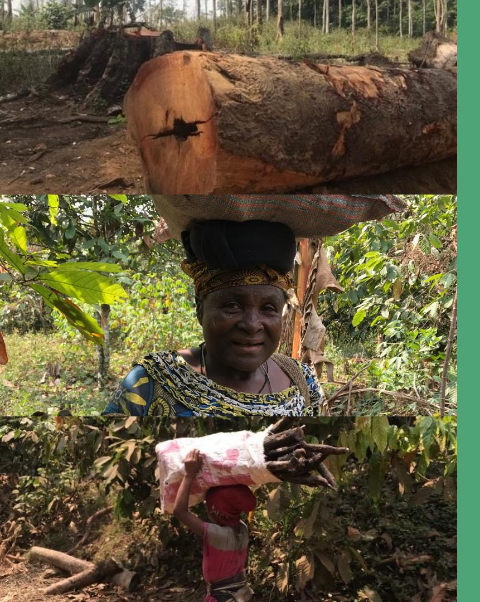

# 3. Sustainability

*Environmental, economic and social*

# 3.1. Deforestation

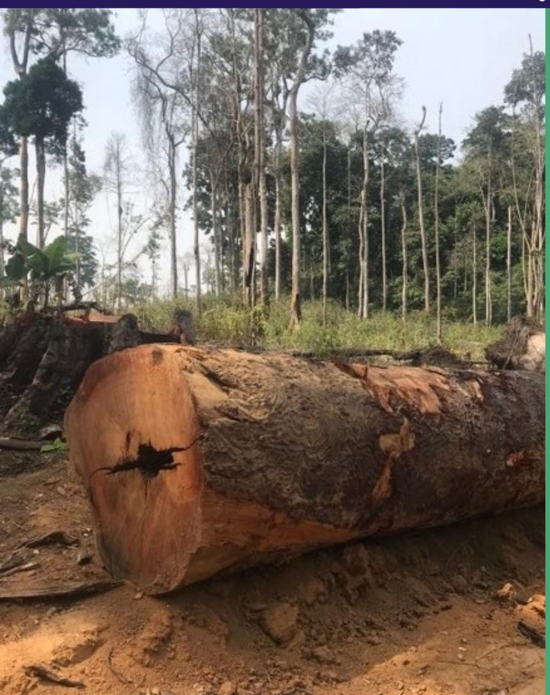

## A perennial increase in production?

#### **Announcements of future growth**

• The national cocoa strategy aims to reach 640,000 tons by 2030 • The establishment of a national traceability system must therefore include new plots each year

#### **To be nuanced**

• Cocoa production growth has been low since 2014 • Attractiveness to the population seems average

(higher input costs than in West Africa and and higher demand for food products)

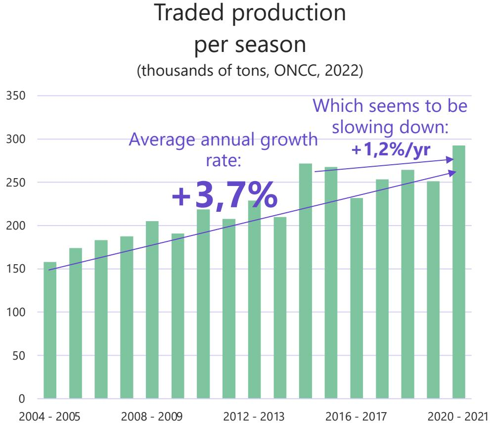

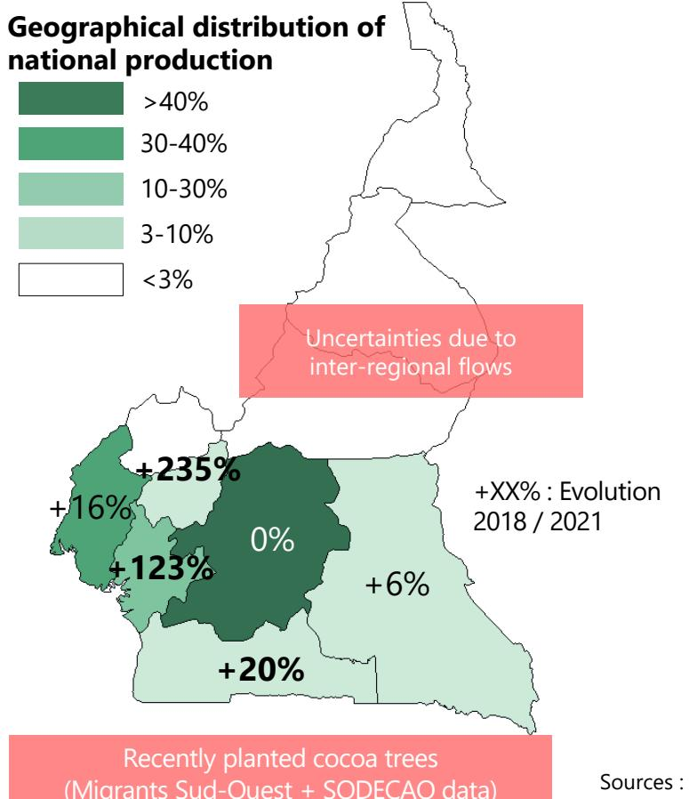

## Cocoa production and deforestation/forest degradation

Sources : ONCC, season reports, Global Forest Watch (\*tree cover loss is not always a sign of deforestation => Maps and figures must be analysed with great care).

(Migrants Sud-Ouest + SODECAO data)

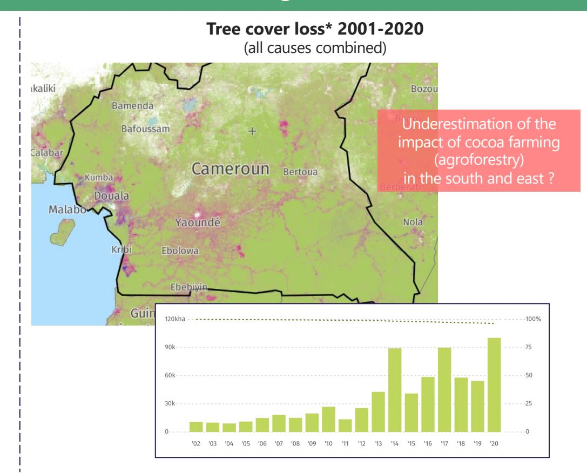

## No operational National Forest Monitoring System (NFMS) yet, but several initiatives underway

#### UOSCF

(Operational Forest Cover Monitoring Unit)

#### DDD Project

(Deforestation & Degradation Drivers – Congo Basin)

#### ONACC

(National Climate Change Observatory)

> Land-use change 2015-2020 and identification of deforestation/degradation drivers

Stakeholders: MINFOF - MINEPDED - WRI

> 2015-2017 update of the ST-REDD+ forest cover loss atlas for 2000-2015

Production of a report on Major Deforestation Events (EMD) in 2019

**Entity with a mandate to provide NFS but demobilised, underequipped unit, non-functional**

EMD = ' Simple'' use of available international data

> Strong underestimation of the deforestation rate

No consideration of the national definition of forests

Stakeholders: ST-REDD+ (MINEPDED) - USFS

#### **Entity having (momentarily?) taken over the mandate of the UOSCF**

(permanent team, well equipped) Ad-hoc methodology (Landsat images) Taking into account the national definition of forests No uncertainty calculation, no data sharing platform

Stakeholders: CAFI – FAO - UOSCF

**Multi-country (Congo Basin) and collaborative project**  (2 UOSCF HR are associated)

Strong FAO expertise (use of the SEPAL platform and its multiple advantages)

Uncertainty on the sustainability of monitoring

## Other agricultural sectors could be stronger drivers of deforestation in Cameroon

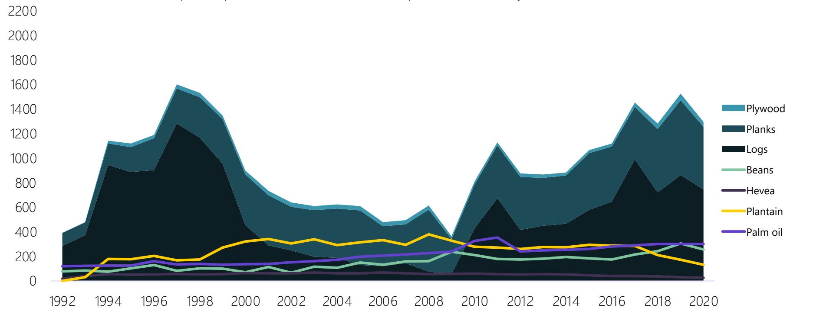

#### Cameroon's forestry and agricultural exports

(Sources: Customs statistics compiled and cleaned by Nitidae, FAO production data) For palm oil, production is considered instead of exports, on the secondary axis - UK

### The Cameroonian situation is obviously different from the Ivorian situation, but until when?

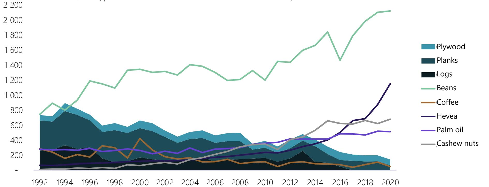

#### Forestry and agricultural exports from Côte d'Ivoire

(Sources: Customs statistics compiled and cleaned by Nitidae,

for palm oil, production is considered instead of exports - Unit: thousand tons)

# Are the deforestation factors of the Ivory Coast present in Cameroon?

| Available forest spaces... Yes Well-preserved forest areas (42% of Cameroon's surface), sources of |                                                      |
|----------------------------------------------------------------------------------------------------|------------------------------------------------------|
| Appropriable land areas East and                                                                   |                                                      |
| And an available workforce In progress?                                                            |                                                      |
| Migration                                                                                          | from the southwest and northwest and strong internal |
| population growth, Central Africa migration                                                        | (a priori marginal)                                  |
| But a labour                                                                                       | force occupied with other activities                 |
| A favourable international                                                                         |                                                      |
| environment Uncertain                                                                              |                                                      |
| Cocoa price volatility                                                                             | remains high + Côte d’Ivoire and Ghana continue      |
| to increase their oversupply                                                                       | + inflation 2021/2022 does not concern               |
| But                                                                                                | : continued growth in international demand           |
| plant cocoa Still weak                                                                             |                                                      |
| Crop perceived as less profitable than palm                                                        | (or some food crops)                                 |
| But                                                                                                | : Changes in logging => open field for clearing?     |

# Map summarising the elements favouring or limiting a possible cocoa boom

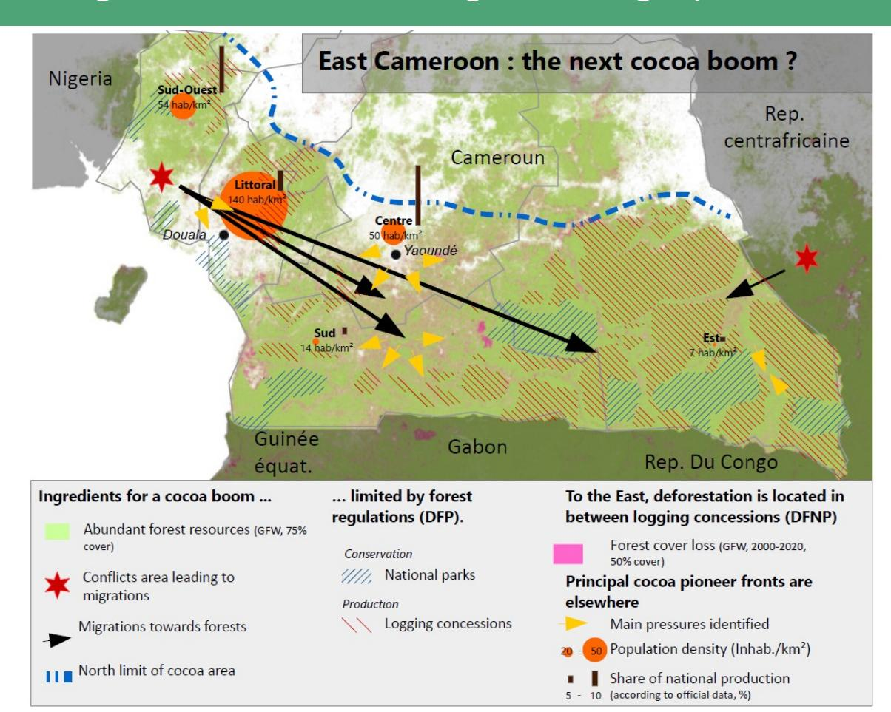

# 3.2. Producer revenue

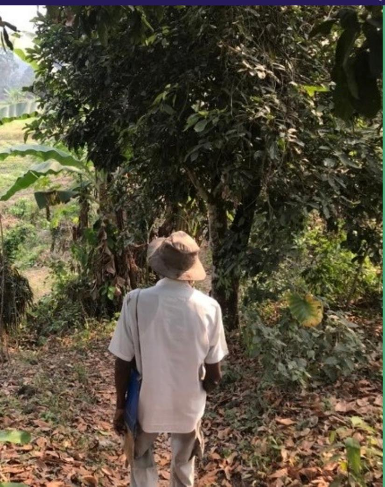

#### No guaranteed producer price but an average farm gate price higher than in West Africa

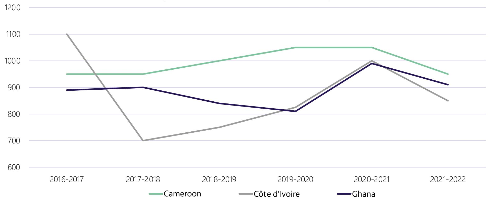

Average cocoa price in Cameroon, Ivory Coast, Ghana per season since 2016-2017 (Units: FCFA. Sources: CCC, ONCC, and Cocobod)

## Cameroonian farms appear on average less profitable but more resilient than Ivorian farms

| Country | Production costs FCFA/kg | Yields Kg/ha Young plantation with high price | Selling price FCFA/kg | Revenues FCFA/ha |
|---------|--------------------------|-----------------------------------------------|-----------------------|------------------|
|         | 400                      | 900                                           | 1000                  | 540 000          |
|         | 400                      | 600                                           | 1100                  | 420 000          |
|         | 550                      | 600                                           | 1000                  | 270 000          |
| CM      | 400                      | 400                                           | 1100                  | 280 000          |
|         | 550                      | 600                                           | 750                   | 120 000          |
| CM      | 400                      | 400                                           | 750                   | 140 000          |

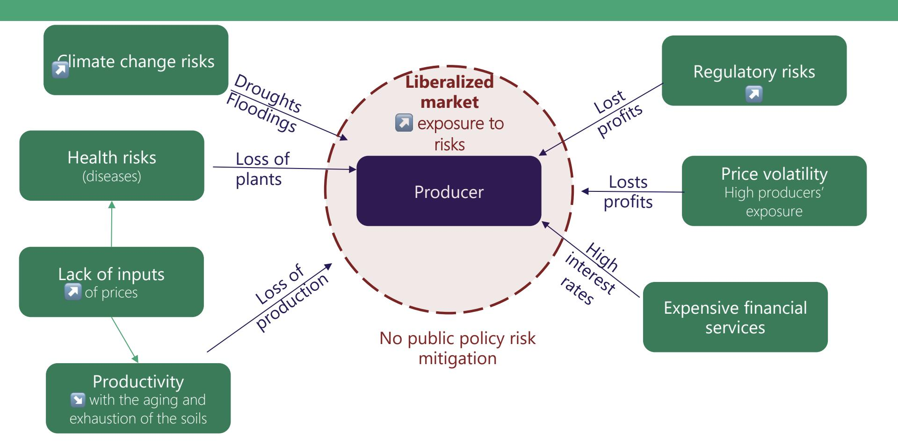

#### Increased risk factors in the liberalised Cameroonian market

| Characteristics                       | 1-Without support | Small producers under shade 2-With support | full sun 3-With support | 4-Medium size producers | 5-Large producers | TOTAL       | Official data (MINADER, ONCC) |
|---------------------------------------|-------------------|--------------------------------------------|-------------------------|-------------------------|-------------------|-------------|-------------------------------|
| Average surface Dry cocoa beans yield | 1,5               | 2,5                                        | 3,0                     | 12,0                    | 25,0              |             |                               |
| (kg/ha/yr)                            | 280               | 600                                        | 500                     | 700                     | 150               |             |                               |
| Number of housholds                   | 200 000           | 45 000                                     | 45 000                  | 3 000                   | 300               | 293 300     | 300-500 000                   |
| Total production surface (ha)         | 300 000           | 112 500                                    | 135 000                 | 36 000                  | 7 500             | 591 000     | 600 000                       |
| Total cocoa beans production          | 84 000 000        | 67 500 000                                 | 67 500 000              | 25 200 000              | 1 125 000         | 245 325 000 | 241 029 519                   |

## Risks that affect small producers more intensely

#### *Types of cocoa farmers according to Lescuyer, 2020*

A significant proportion of unsupported households

A share of households highly exposed to environmental risks

## Risks that affect more strongly isolated regions and forest-savanna transition zones

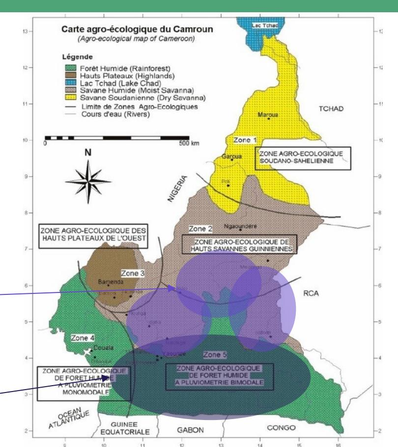

The forest-savanna transition zone is particularly affected by climate change

Eastern (and to a lesser extent southern) forest dwellers have poorer infrastructure and therefore limited access to marketing

| Data from 2010 by geographic area (Source: Folefack, 2010) | Country | South-West | Centre | South  |
|---------------------------------------------------------------|---------|------------|--------|--------|
| Average revenue per person (FCFA/an)                       | 145 933 | 228 263    | 87 257 | 53 504 |
| % of cocoa producers under poverty threshold                  | 69%     | 49%        | 83%    | 91%    |

# 3.3. Child labour

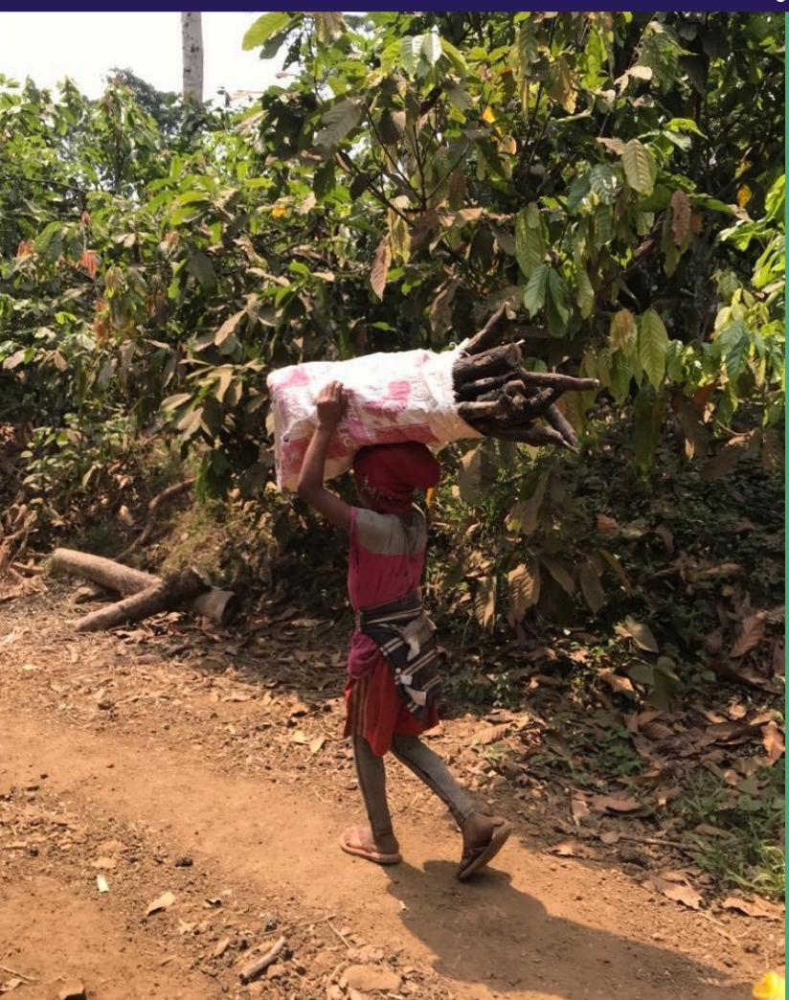

## A standard definition of child labour

The term "child labour" is often defined as work that deprives children of their childhood, potential, and dignity, and damages their physical and mental development.

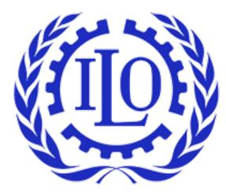

## International Labour Organization

## International Labour Organization

It is work that:

• is mentally, physically, socially, or morally dangerous and harmful to children • interferes with their schooling by depriving them of the opportunity to attend school; requires them to leave school early; or requires them to try to combine school attendance with excessively long and heavy work

## Child labour undeniably exists in the cocoa sector, but less than in other agricultural sectors

Child labour in Cameroun is significant but not very well known

40% of children from 6 to 14 yrs old worked in 2012 (1,7 millions). A rate similar to Côte d'Ivoire and Burkina Faso. 58% of teenagers from 15 to 17 yrs old worked in 2012 (about 700 000).

Child labour is related to the living conditions and the economic model of small producers

37% of Cameroon inhabitants lived in 2014 with less than 931 FCFA per day and per person (= poverty threshold of 2 USD/j/p with the change rate of 2014). Small producers lack the means to buy more efficient equipment and to pay the workforce.

D'autres filières agricoles sont beaucoup plus impactantes sur le travail des enfants

2% of children (6-14 ans)

8% of adults (15-64 ans)

53%

44%

25%

25%

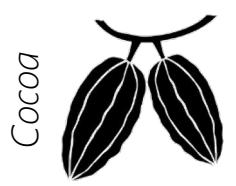

*Cereals*

*Plantains and tubers*

This data is from a household survey and should be treated with caution.

# Child labour is unevenly distributed across Cameroon's regions

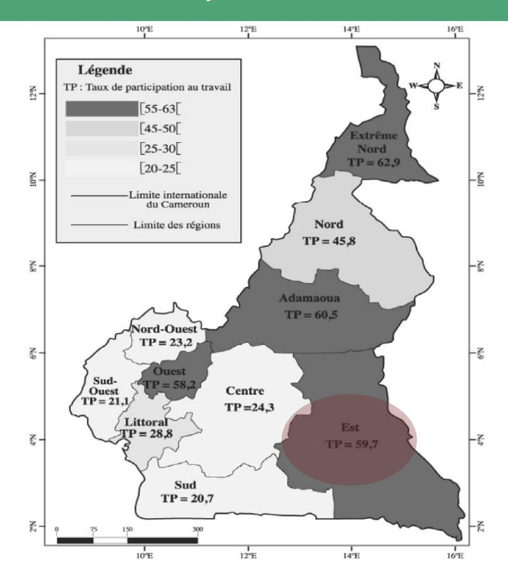

#### Private and public sectors target child labour, but no significant initiatives have been launched

## Private sector: few concrete programmes beyond theoretical commitments and controls

- Sustainability programmes cover the issue, but it is not a priority.
- Monitoring processes are tricky, often considered easy to evade and costly to deploy (ICI's Monitoring and Remediation (M&R) approach criticised in West Africa).

Þ Action is less strong in Cameroon than in West Africa.

## Public sector: no or few public programmes targeting child labour in the cocoa sector

- The issue and its solutions are not widely discussed by stakeholders and no specific programmes were brought to our attention during the study.
- No mention in the RDFC's community engagement and social inclusion component.

# 3.4. Sustainability programmes

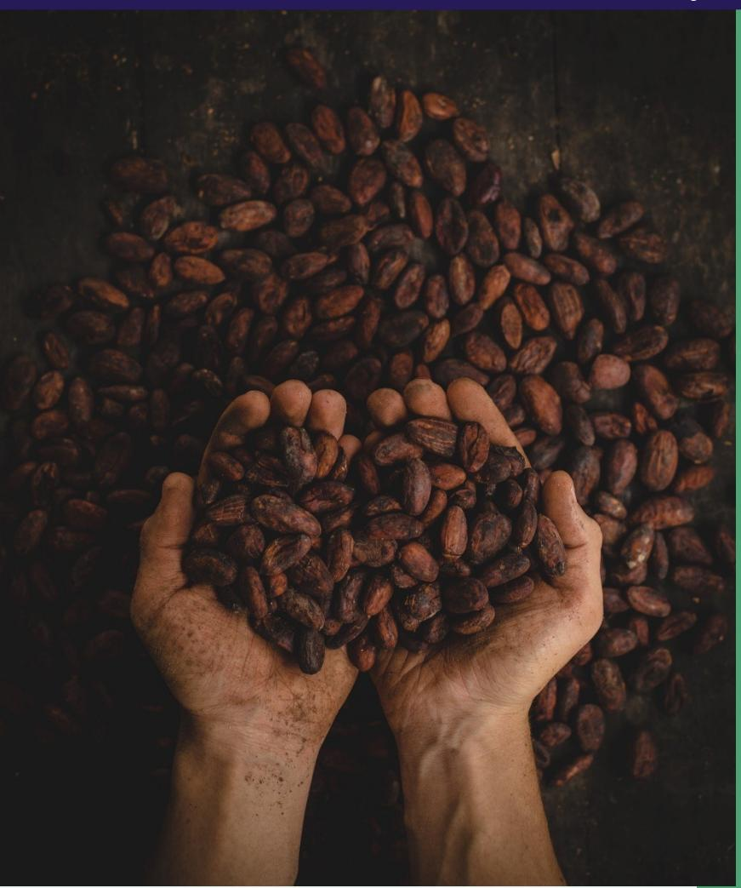

#### Cameroonian agroforestry, a pecularity to be better promoted

#### Agroforestry is already well rooted

A more or less complex agroforestry spontaneously developed by producers

#### …but its development is eneven and tends to decline

#### Few initiatives to value or develop it

- Compared to West Africa, private/public actors carry out few agroforestry activities
- A Cargill-IDH-WWF partnership aims to support producers in adopting more sustainable practices across the Mbangassina territory
- The CICC provides training on selective slaughter and wants to create a school on cocoa farming which could develop these practices (in conjunction with the Club of Committed Chocolate Makers)

The situation is contrasted regarding the age of production and the knowhow of the producers:

- Simplified systems in development on pioneer fronts (cf. Talba)
- (Quite) complex systems around Obala
- Old complex systems (multi-strata) in isolated forest sites (cf. Mintom, Yokadouma

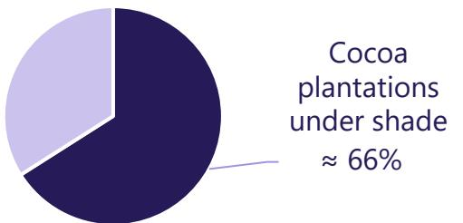

Area estimation cocoa growing under shade

# Sustainability paradigm shifts since 2000s

Certification standards

Internalisation of sustainability requirements for companies

Company-specific sustainability programmes

Participation to multi-actors processes

RDFC and GCLP / Landscape approaches

Demand

Public sector reforms

Influence all around

2000 2022

### The Rainforest Alliance certification is close to the requirements of the ECRP, but the level of control seems to be low

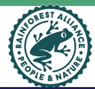

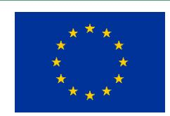

Estimated share of RA certified production in Cameroon

**Requirements** (to be confirmed for the EU)

Cut-off date End of 2020 Beginning of 2014

Deforestation definition

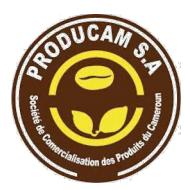

Legal (Cameroon) and physical (FAO)

Legel (Cameroon) and physical (FAO)

Deforestation controls *To be defined* Risk eval.

through GFW

Audits

 BARRY CALLEBAUT*Mandatory (details to be defined)*

Reputed to be not very thorough

The majority of traders use it as the basis of their sustainability programmes

RA-inspired programme for:

32%

## The growing development of private sustainability programmes without common standards: case of the first three traders

| Programme Company Sustainability approach Advancement | in Cameroon        |
|-------------------------------------------------------|--------------------|
| 45%                                                   | of supply          |
| 5209 producers trained                                | to                 |
| improve                                               | their productivity |
| Child labour checks                                   |                    |
| Related                                               | to RA              |
| 27%                                                   | of supply          |
| Related                                               | to RA              |
| 85%                                                   | of supply          |

## The growing development of private sustainability programmes without common standards: the case of 4th and 5th traders

| Programme | Company | Sustainability approach                                  |    | Advancement | in Cameroon |
|-----------|---------|----------------------------------------------------------|----|-------------|-------------|
|           |         | There is no specific sustainability programme, but there | is |             |             |
|           |         | a sustainability department.                             |    |             |             |
|           |         | Beyonds Beans puts forwards the following points:        |    |             |             |

## A significant proportion of Cameroonian cocoa production was Rainforest Alliance certified in 2020-2021

| Cameroon                           | Tons      |
|------------------------------------|-----------|
| Production                         | 292 000   |
| Marketed by exporters from top 6*  | ≈ 216 000 |
| Certified by the top 6             | ≈ 91 000  |
| Sold as certified by top 6         | ≈ 55 000  |
| Certified by other players         | ≈ 5 000   |
| Sold as certified by other players | ≈ 3 000   |

\* In Cameroon: Telcar, OlamCam, Sic Cacaos, AMS, COTEC, Producam.

Source: ONCC, RA, data crossing, 2019 to 2021

But in the absence of sufficiently reliable national and international audits,

the real sustainability of cocoa remains uncertain

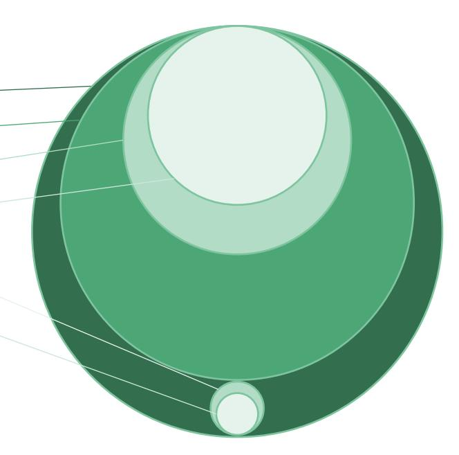

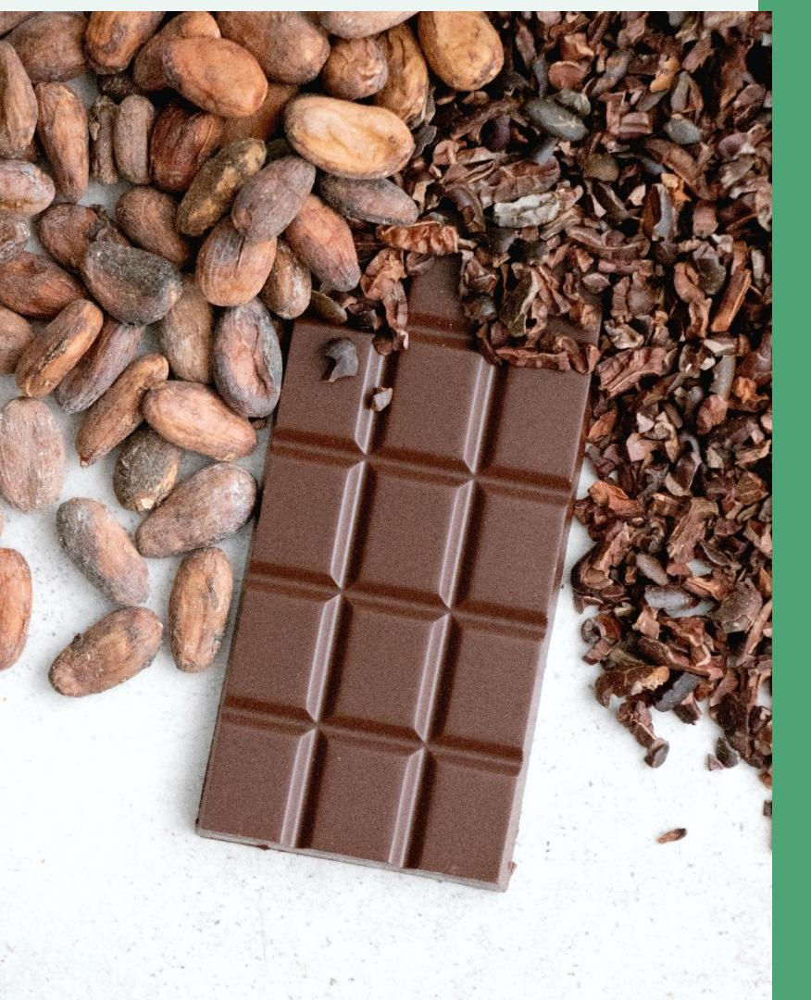

4. Conclusion and food for thought

# 4.1 Conclusion

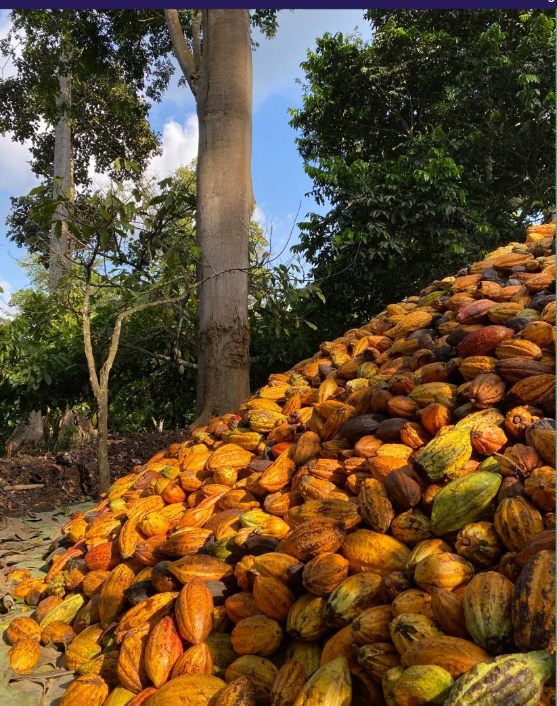

## Traceability: everything remains to be done to go beyond Cooperatives / LBA

**LBA**

COOP

292k T

**Area of high uncertainty**

Incomplete registers

No register No sourcing data

**Missing key point**

> Trustworthy registers

**Missing key point**

Little control over

deforestation Trustworthy

registers

Aucun registre

> Registres incomplets

Trustworthy registers

| Estimated production      |              | 292k T                  |                            |
|---------------------------|--------------|-------------------------|----------------------------|
| Average prices            |              | 700-1210                |                            |
| Transparency              |              | Public campaign reports | Better                     |
| Public traceability       |              |                         | Less controlled            |
| Proportion from coxing    | +/-          | 40%                     | High                       |
| cooperatives              | +/-          | 40%                     | Average but rising         |
| Certification             |              | 33%                     | Stronger on RA             |
| Sustainability programmes | +/-          | 100k                    | Lower                      |
| Introduction              | Traceability | Sustainability          | Conclusion and reflections |

## Traceability / sustainability: Cameroon is rather behind compared to other producing countries (focus on certification)

Production

Marketed by top 6 exporters

Certified by the top 6

Sold as certified by the top 6

Certified by the other actors

Sold as certified by other actors

#### **Legend**

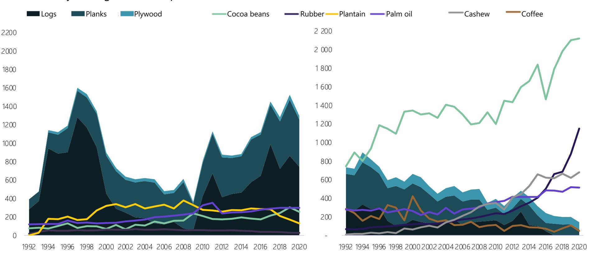

#### Sustainability: cocoa is a much less powerful deforestation factor than in Côte d'Ivoire

#### Forestry and agricultural exports from Cameroon Forestry and agricultural exports from Côte d'Ivoire

# 4.2 Food for thought

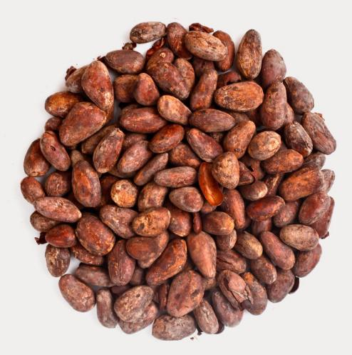

## Traceability: Cameroon can rely on the complementarity of its key organisations

#### NCCO

• Develops the specifications (national minima) for private traceability • Periodically collects traceability information (obligation to transmit) • Controls and sanctions operators who do not respect national traceability minima and do not share their information at the planned periodicity • Publish analyses, strategic notes and other public policy documents based on the data collected and processed (including a baseline of producers' living conditions) •Directs State support to producers on the basis of these analyses

#### CICC

• Organises the formalisation of coxeurs (via LBAs and exporters) with the MINCOMMERCE • Provides a customisable digital traceability system to operators who cannot afford independent development (small exporters, LBA, large coxeurs and coop): documentation, transaction recording tool, cocoa bag tracking procedures •Supports actors (especially small exporters/LBA/coops with less means) to meet future

#### FODECC

• Subsidises downstream players for the deployment of their traceability systems (premium per registered producer) • Targets its funding to registered producers • Supports the creation of new plots only under compliance conditions (sustainability criteria to be negotiated)

#### SODECAO

• Mainly supports the renewal of plots at the end of the cycle and less the creation of new plots

#### **Food for thoughts on the sharing and complementarity of responsibilities**

#### MINADER and MINTRADE

•Strategic orientations, coordination of the action of the various actors, notably within the framework of the "PAD-Cacao" for MINADER

≈ 500 000 producers on 800 000 hectares

cooperatives

# coxeurs

#### Tens of LBA

Tens of exporters

#### Responsibilities / Obligations

- Obtain parcel + journey traceability for 100% of the volumes purchased
- Share certain digital data from their traceability systems with ONCC
- Carry out audits of their traceability system

- Use their customers' traceability applications or have their own traceability solution to meet their customers' specifications

- Formalise their activity, join the CICC
- Use the traceability applications of exporters, LBAs or

- Accept the georeferencing of their plot
- Give their unique producer ID to all their customers (including coxeurs)
- Declare any project to extend or create a new plot with the local office of the ONCC

Information to be transmitted to the ONCC and the CICC (under a common structure)

Volume, Dates of sellings Producer ID Georeferencing of plots Creation/extension of plots (every X years)

Purchases: Volumes/producer/date Sales: volume/client/date Producers records

Purchases: Volumes/producers list/supplier/date Sales: volume/client/date Producers records

Purchases: Volumes/list of producers/suppliers/date Sales: export stats/lot structure/contracts Producer records

#### Link in the chain

#### … but will also have to involve all private actors

#### **Food for thoughts for the sharing and complementarity of responsibilites**

# Traceability: to be operational, the system should prioritise key information

Georeferenced plot *(7-10000 FCFA per plot according to the CICC)*

Deforestation map x

Map of the (non) permanent forest domain

# **Key commercial information** Volume

# **Secondary information** Humidity rate Cocoa quality Certification

## Price and socio-eco data

# **Key geographic information (RDFC, ECRP)**

x

The costs of a traceability system increase proportionally to the amount of information collected. **Focus on the essentials at the beginning and then expand according to the needs and the means available.** • Identifiers (for each category of actors, provide for deaths and transfer of ownership to producers) • Geolocations linked to identifiers (plots, offices or stores) •Extension projects / creation of plots for producers

 Detailed origin of supplies: aggregation of volumes supplied by plot / producer / intermediary

Purchasing volumes by supplier

**Static data (annual update)**

#### **Semi-dynamic data (monthly update)**

**Dynamic data (weekly update)**

# Traceability: data to be provided for sustainable traceability of the sector

## Traceability: services necessary for an efficient system

| Actor                                         | CICC FODECC ONCC Other                                         |
|-----------------------------------------------|----------------------------------------------------------------|
| Formalisation and recording of the coxeurs    | +/- 40% of the volumes but no program initiated regarding them |
| Receipts and records of business transactions | Coop/LBA                                                       |
| Georeferencing                                | Exporters and RA                                               |
| Quality independent audit                     | Auditing firms                                                 |
| Capabilities to verify data                   | MINADER                                                        |

In **dark blue** already achieved programme, in **clear blue** programmes in progress

## Traceability: formalise the coxeurs via two parallel actions

## **2. Raising the registration requirements for LBAs**

#### **1. Registering coxeurs**

**To require from the LBAs the list of the coxeurs** who provide them with mention of their location (store, store or domicile), identification in the commercial register, contact information (phone, e-mail) and area of intervention

• **Create a low-cost coxeur license (≈10,000 FCFA/year)** and registration with CICC and ONCC with the same information > 100 M FCFA of potential revenue • **Risk**: an overly expensive license risks keeping coxeurs in the informal sector • **Inclusion of coxeurs' representatives** in the CICC buyers' college (LBA) • **Integration of coxeurs** in the payment and product traceability scheme ó

The formalisation of their activity would allow them :

• Access to financial institutions • To enhance their essential role as aggregators and service providers to producers •To be officially represented within the sector

A **new mediation service** (in case of dispute with producers or LBAs) could also be offered to them. This service could be provided by the CICC as part of its inter-stakeholder regulation missions.

#### **Multiple interests for coxers**

Sustainability: improving the living conditions of producers should be based on a comprehensive risk mitigation approach

Producer

Improving the bargaining power of producers ONCC and CICC

> Stabilisation/Price Drop Protection Mechanism (LID)

Research for climate change resilient cocoa IRAD

Subsidy input subsidy FODECC

Strengthening the technical support of producers SODECAO, MINADER and CICC

Grant for the renewal of aging orchards (rather than the creation of new parcels) FODECC / SODECAO

> Certifications allowing an increase of the selling price ONCC and CICC

The Living Income Differential (LID) is one instrument among others to improve the living conditions of Cameroonian cocoa farmers

Improvement of the quality and therefore of the unit price ONCC and CICC

## Sustainability: complementary transversal actions to mitigate the risks associated with the sector

**Linking cocoa sector initiatives to regional planning and decentralisation policies**

By relying mainly on spatial planning documents whose elaboration has recently started at 2 levels:

• Regions: Regional Plans for Land Use Planning and Sustainable Development (SRADDT) • Commune : Local Land Use and Sustainable Development Plans (PLADDT)

The objective of the PLADDT being to "to organise the distribution of land at the local level" for a period of 25 years, it is certainly the most appropriate spatial planning tool to address the sustainability issues mentioned above.

### **Regional planning & decentralisation**

**Also look at the sectors that contribute the most to deforestation and that are not (or less and less) linked to the European market**

**Wood:** logging is not a direct factor of deforestation, but the opening of (uncontrolled) trails facilitates the installation of farmers and the creation of new plots. The rise of loggers who are not concerned with the sustainability of their activity can constitute an important indirect factor of deforestation.

**Palm oil:** Since Cameroon's production is destined for the national or subregional market, the EU will not have the commercial leverage that it intends to activate through the current ECRP.

The expansion of palm plantations should therefore certainly be given special attention.

#### **Cross-sectoral reflection**

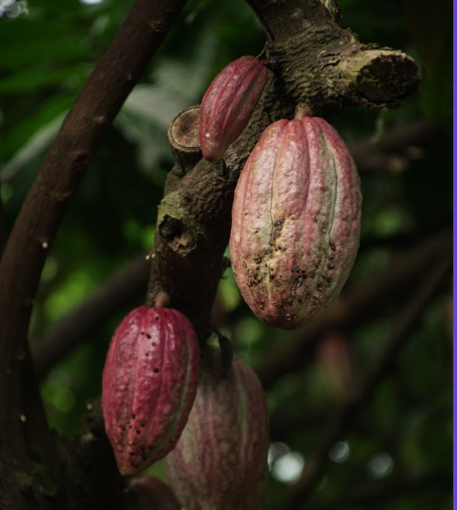

**Disclaimer: this report has been produced by Nitidæ with the financial assistance of the European Union. The contents of this report can under no circumstances be regarded as reflecting the position of funding organisations.** © EFI, 2022