# **Traceability, transparency and sustainability in the cocoa sector in Cameroon**

**August 2022**

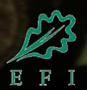

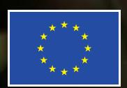

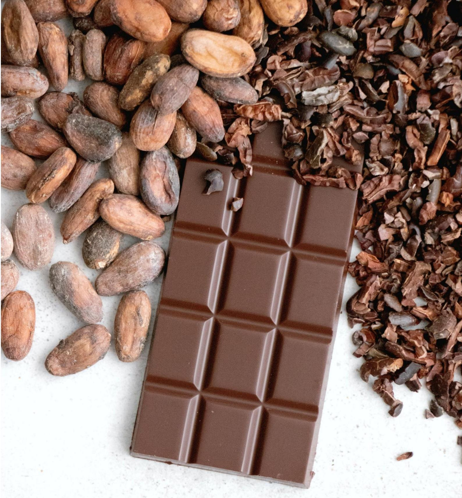

Authors: Thomas Fabre, Simon Bassanaga, Pierre Ricau, Ghislain Fomou, and Elsa Sanial.

Date: May 2022.

Copyright cover photos: Copyright-free photographs by L. Le Minh and T.Bykovets (Unsplash).

Disclaimer: This report has been produced by NitidÊ with the financial assistance of the European Union. The contents of this report can in no way be taken to reflect the views of the funding bodies. © EFI, 2022

# **Table of Contents**

| 1_   | Introduction .................................................................................................................... 7                                           |
|------|-------------------------------------------------------------------------------------------------------------------------------------------------------------------------------|
| 1.1. | General context of the study ................................................................................................................................... 7            |
| 1.2. | Objectives and methodology of the study ........................................................................................................... 8                         |
| 1.3. | The international context: A driver for cocoa sustainability .............................................................................. 9                                 |
| 1.4. | Cameroon could be particularly affected by future sustainability requirements ........................................ 11                                                     |
| 2_   | Traceability: State of play and challenges in Cameroon ....................................... 13                                                                             |
| 2.1. | A still largely informal value chain ......................................................................................................................... 13             |
| 2.2. | A private sector that supplements public traceability with its own solutions .............................................. 25                                                |
| 2.3. | Public initiatives can enhance the traceability of the sector if they are sufficiently coordinated and                                                                        |
| 3_   | Sustainability: what are the main social, economic, and environmental risks in the                                                                                            |
| 3.1. | Cocoa production is growing moderately, but with the potential to accelerate and threaten forests . 35                                                                        |
| 3.2. | Deforestation dynamics related to cocoa and other agricultural production ............................................ 35                                                     |
| 3.3. | No trend towards downgrading of concessions ............................................................................................... 38                                |
| 3.4. | The economic and social sustainability of Cameroonian cocoa .................................................................... 40                                           |
| 4_   | Sustainability programs. Scattered actions towards harmonized governance . 45                                                                                                 |
| 4.1. | Private sustainability programs ............................................................................................................................. 45              |
| 4.2. | Public authorities' approaches to sustainability .................................................................................................. 51                        |
| 5_   | Conclusion and outlook .............................................................................................. 57                                                      |
| 5.1. | On traceability .......................................................................................................................................................... 57 |
| 5.2. | On sustainability ....................................................................................................................................................... 62  |
| 6_   | Bibliography .................................................................................................................. 65                                            |
| 7_   | Annexe: Forest Monitoring systems in Cameroon ................................................. 67                                                                            |

# **Table of figures**

| Figure 1: Trends in cocoa production in Cameroon and the rate of tree cover loss since 2000.....                                                                                                                                                  | 7  |
|---------------------------------------------------------------------------------------------------------------------------------------------------------------------------------------------------------------------------------------------------|----|
| Figure 2: Number of people met by type of stakeholder.....                                                                                                                                                                                        | 9  |
| Figure 3: Key data for the cocoa sector in Cameroon, Côte d'Ivoire and Ghana.....                                                                                                                                                                 | 11 |
| Figure 4: Marketed cocoa production in Cameroon from 2004-2005 to 2020-2021.....                                                                                                                                                                  | 12 |
| Figure 5: Evolution of Cameroon's cocoa exports (beans and grindings) by geographical area of destination.....                                                                                                                                    | 12 |
| Figure 6: Definition of terms used to designate stakeholders in the cocoa supply chain in Cameroon .....                                                                                                                                          | 14 |
| Figure 7: Estimates of cocoa bean flows in Cameroon by commodity chain. Areas in millions of hectares, and flows in thousands of tonnes (kT) (Source: Nitidæ computer graphics based on ONCC data, Lescuyer et al., 2020 and CICC 2022 data)..... | 15 |
| Figure 8: Contract and sales slip of the Coop-CA PROCCAB 1 er La Grâce Divine (Bertoua region).....                                                                                                                                    | 18 |
| Figure 9: Cards issued by the CICC of an exporter's mandated buyer.....                                                                                                                                                                           | 19 |
| Figure 10: Price displayed on the NCCB website and at a territorial agency.....                                                                                                                                                                   | 20 |
| Figure 11: Report by a NCCB field agency and equipment held at agency level.....                                                                                                                                                                  | 20 |
| Figure 12: Concentration of cocoa exports and processing in Cameroon.....                                                                                                                                                                         | 22 |
| Figure 13: Diagram of the main stages in the export of cocoa in Cameroon .....                                                                                                                                                                    | 23 |
| Figure 14: Circulation of information in the Moungo department.....                                                                                                                                                                               | 24 |
| Figure 15: Diagram of data collection and data reliability in the cocoa sector in Cameroon .....                                                                                                                                                  | 24 |
| Figure 16: Diagram of the traceability process for a Rainforest Alliance Certified Cooperative .....                                                                                                                                              | 26 |
| Figure 17: Obstacles to traceability for each stage of the value chain. Source: Nitidae reports, Côte d'Ivoire and Ghana, 2021.....                                                                                                               | 27 |
| Figure 18: Geo-referencing programs of the main exporters and grinders in Cameroon .....                                                                                                                                                          | 28 |
| Figure 19: Three sustainable cocoa pilot sites with their traceability programs .....                                                                                                                                                             | 30 |
| Figure 20: Picture of the SOCOOPEC centre of excellence in Ntui .....                                                                                                                                                                             | 31 |
| Figure 21: Cocoa farmer's card booklet provided by the CICC .....                                                                                                                                                                                 | 31 |
| Figure 22: Georeferencing the CICC: from the producer map to the database .....                                                                                                                                                                   | 32 |
| Figure 23: Services needed for effective traceability in relation to current progra                                                                                                                                                               |    |

| Figure 39: Distribution of certified volumes as a proportion of Cameroonian production and weight of the 6 main multinational bean traders in purchasing and certification ..... | 47 |
|----------------------------------------------------------------------------------------------------------------------------------------------------------------------------------|----|
| Figure 41: Internal sustainability programs of multinational cocoa bean traders operating in Cameroon .....                                                                      | 50 |
| Figure 42: Evolution of cocoa quality between the 2017-2018 and 2020-2021 season.....                                                                                            | 53 |
| Figure 43: Comparative evolution of prices of cocoa beans from Cameroon with 4 other origins.....                                                                                | 54 |
| Figure 44: Export duties and its distribution among the different cocoa institutions .....                                                                                       | 55 |
| Figure 44: Available and missing data for traceability within the Cameroon cocoa supply chain.....                                                                               | 57 |
| Figure 45: Comparison of market concentration and certification shares between Côte d'Ivoire, Ghana and Cameroon .....                                                           | 57 |
| Figure 46: Infographic on the positioning of Cameroon in terms of traceability and sustainability in the cocoa sector .....                                                      | 58 |
| Figure 47: Diagram of possible information and responsibility sharing for a national public-private traceability system in Cameroon.....                                         | 59 |
| Figure 48: Classification of data from private traceability systems to be shared via the ONCC within the sector                                                                  | 59 |
| Figure 49: Update timeline for the national traceability scheme proposed.....                                                                                                    | 60 |
| Figure 50: Proposed strategy to formalized coxeur role within the cocoa supply chain .....                                                                                       | 60 |
| Figure 51: Comparison of the evolutions of timber and agricultural exports of Côte d'Ivoire and Cameroon .....                                                                   | 62 |
| Figure 52: Complex approach of cocoa farming sustainability .....                                                                                                                | 63 |

# **Abbreviations**

| AFD       | French Development Agency                                                     |
|-----------|-------------------------------------------------------------------------------|
| ANPCC     | National Association of Cocoa and Coffee Producers of Cameroon                |
| CAFI      | Central African Forest Initiative                                             |
| CEN       | European Committee for Standardisation                                        |
| CFI       | Cocoa & Forests Initiative                                                    |
| CGIAR     | Consultative Group on International Agricultural Research                     |
| CICC      | Interprofessional Cocoa & Coffee Council                                      |
| CIFOR     | Centre for International Forestry Research                                    |
| CIRAD     | Centre for International Cooperation in Agricultural Research for Development |
| COH       | Cocoa Horizon                                                                 |
| FAO       | Food and Agriculture Organization of the United Nations                       |
| FCFA      | Franc de la CoopÈration FinanciËre en Afrique Centrale                        |
| FODECC    | Cocoa and Coffee Sector Development Fund                                      |
| GEX       | Cocoa & Coffee Exporters Group                                                |
| GIZ       | German International Development Cooperation Agency                           |
| GUCE      | Single Window for Foreign Trade                                               |
| HCS       | High Carbon Stock                                                             |
| HCV       | High Conservation Value                                                       |
| ICRAF     | World Agroforestry                                                            |
| HDI       | Sustainable Trade Initiative                                                  |
| IRAD      | Agricultural Research Institute for Development                               |
| ISO       | International Organization for Standardization                                |
| OHADA     | Organisation for the Harmonisation of Business Law in Africa                  |
| ONCC      | Office National du Cacao et du CafÈ                                           |
| MINADER   | Ministry of Agriculture and Rural Development                                 |
| MINCOM    | Ministry of Trade                                                             |
| MINFI     | Ministry of Finance                                                           |
| MINRESI   | Ministry of Scientific Research and Innovation                                |
| NGO       | Non-Governmental Organisation                                                 |
| PAD-Cacao | Cocoa Development Support Project                                             |
| NTFPS     | Non-timber forest products                                                    |
| PLADDT    | Local land use and sustainable development plans                              |
| PTF       | Technical and Financial Partner                                               |
| ECPR      | European Commission proposal for a regulation against imported deforestation  |
| RIS       | Information strategy for the cocoa and coffee sectors                         |
| SODECAO   | Cocoa Development Company                                                     |
| SRADDT    | Regional planning and sustainable development plans)                          |
| RA        | Rainforest Alliance                                                           |
| REDD +    | Reducing Emissions from Deforestation and Forest Degradation                  |
| TCV-C     | Transparent Collective Voice Consortium                                       |
| EU        | European Union                                                                |
| WCF       | World Cocoa Foundation                                                        |
| WWF       | World Wide Fund                                                               |

## **1\_ Introduction**

#### 1.1.General context of the study

Cameroon exported more than 292,000 metric tons of cocoa during the 2020-2021 season, making it the 4th largest cocoa exporter in the world, and the 3rd largest producer in Africa after Ghana and CÙte d'Ivoire. So far, Cameroon has distinguished itself from these countries by preserving its forest resources. The forest cover of CÙte d'Ivoire has declined by 50%, Ghana by 22% and Cameroon by 11% from 1990 to 2020, yet in 2020, Cameroon still has 40% of its territory covered by forests.

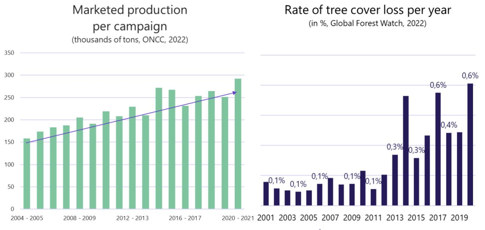

*Figure 1: Trends in cocoa production in Cameroon and the rate of tree cover loss1 since 2000* 

A number of macroeconomic and political factors point toward accelerated growth in Cameroonian production over the next 20 years. There are three major factors driving the global cocoa market: the increasing demand (an average of 3% growth per year over the last 20 years, including 6% growth per year in Asia according to ICCO data2 ), the limits reached by CÙte d'Ivoire and Ghana (land pressure and production stabilization policies) and the Cameroonian government's desire to double national production (in 2025, 640,000 tons are provided as a target in the National Agricultural Investment Plan).

Following these conditions, there is an apparent risk of a cocoa 'booming' in Cameroon, and more generally in Central Africa, based on the model of successive cocoa booming theorized by a CIRAD researcher FranÁois RUF3 . In this case, Cameroon's important "*forest reserve*" could then be threatened.

The rules of international trade are changing, with stricter requirements in terms of supply chain management. The European Union, for instance, targets cocoa as one of six agricultural commodities of priority in the European Commission's Proposal for a Regulation to Limit Imported Deforestation (ECPR).

The purpose of this proposal is to limit the contribution of EU imports to the deforestation through the introduction of a due diligence procedure.

GFW's rate of loss does not equate to a rate of deforestation, as Global Forest Watch points out: ''Loss'' indicates the removal or mortality of tree cover and can be due to a combination of factors (...). As such, 'loss' does not equate to deforestation.

See: https://www.icco.org/statistics/#tab-id-7.

Ruf, FranÁois. Cocoa Booms and Crises: The Dizziness of Brown Gold. Economie and dÈveloppement. Montpellier : Paris: CIRAD-SAR ; Karthala : MinistËre de la coopÈration, 1995.

NitidÊ was commissioned by the European Forest Institute (EFI) to undertake this research on the cocoa sector in Cameroon as part of the European Union's Sustainable Cocoa Initiative. This report analyses the current level of traceability in the Cameroonian cocoa sector, the transparency of data available, the sustainability risks the sector faces, and existing initiatives to improve sustainability both in public and private sectors.

#### 1.2.Objectives and methodology of the study

#### 1.2.1. Objectives

The aim of this study is twofold:

*(i) Traceability analysis. To draw up an inventory of traceability initiatives and tools in the cocoa marketing chain in Cameroon; (ii) Sustainability analysis. Conduct a synthetic diagnosis of sustainability risks and assess the prospects of sustainability programs implemented by the private sector, as well as by public actors.* 

This report addresses both objectives, to closely link traceability thinking to sustainability thinking: product and marketing tracking capabilities are indeed fundamental to initiating effective sustainability programs. Sustainability, however, is more than traceability: it includes rectors such as farmers' incomes, forest monitoring, and social inclusion that go beyond the capability of obtaining reliable data on origin of production.

The first part (I) describes the context, i.e. the development of the ECPR against imported deforestation and the recent transformations of the Cameroonian cocoa sector, concerning the objectives of our survey. The second part, after presenting the texts regulating cocoa marketing, will study the mode of cocoa marketing, detailing the data and documentation produced, step by step. Objective (ii) is divided into two chapters. The first chapter (III) focuses on the diagnosis of sustainability in the sector: the impact on deforestation, its effect on producers' incomes, and social issues (particularly child labour). The second chapter (IV) explores sustainability initiatives in the public sector, with its plural governance, regaining a regulatory role.

A conclusion that summarizes the main lessons learned, formulates the key questions to be addressed during the *Cocoa Talks* (jointly organized between Cameroon and the EU during 2022) and proposes some recommendations to increase the traceability and sustainability of the sector.

#### 1.2.2. Methodology

Prior to the field mission, a review and analysis was carried out:

- *Sustainability reports from the main private groups involved in the international cocoa trade (including the 6 players that account for 75% of the world's cocoa bean grindings and trade);*
- *Articles regulating the trade chain and defining the main players;*
- *ONCC season reviews;*
- *Customs data on international trade (UN Comtrade);*
- *Published research on the cocoa value chain in Cameroon.*

On-site, information was collected through qualitative semi-structured interviews (see Error! Reference source not found.). In addition to key institutional actors and major exporters, old and newly created cooperatives were interviewed in most of the production regions, excluding the South-West due to the security situation.

During the interviews, key quantitative data were collected: these were validated and corrected by our partners during subsequent exchanges. This information was supplemented by site visits for a more detailed understanding of the marketing procedures and the information produced concerning traceability. A map of the itinerary followed is available in the appendix.

The NitidÊ team would like to acknowledge various persons for their valuable contributions to this study, especially: Mr Michael Ndoping and his teams from the ONCC who gave us an interview during the "*Roadmap for deforestation-free cocoa*" meeting; Mr Omer Maledy and his teams from the CICC who patiently presented their perspectives on the cocoa sector and outlined their programs; all the cooperatives who brought their members together to present their point of views on the sector. Mr Omer Maledy and his teams from CICC presented their perspectives on the cocoa sector and outlined their programs; the teams of private companies, exporters and international traders (Barry Callebaut, Cargill, Olam and Producam), who shared some key figures and their strategic vision; the producers who took us on tours of their fields, teaching us about the art of cocoa and its difficulties; and all the traders, field agents and sector consultants who helped make this study more realistic and pragmatic. *Figure 2: Number of people met by type of stakeholder* 

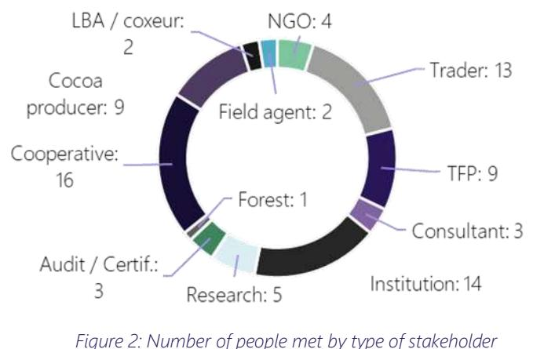

#### 1.3. The international context: A driver for cocoa sustainability

On the producing countries side, in June 2019, CÙte d'Ivoire and Ghana announced a joint initiative to increase the price paid to the cocoa producer.

Both countries have been under increasing pressure for several years from civil society, some cocoa buying companies and several major cocoa consumer countries to reduce the negative externalities of their domestic cocoa sectors, particularly in terms of deforestation, child labour and the living standards of producers.

Their joint initiative, known as the *Côte d'Ivoire-Ghana Cocoa Initiative (*CIGHCI), aims to emphasize the importance of increasing the price of cocoa as both a lever and a counterpart to improving sustainability in the sector4 . One of the outcomes of the CIGHCI is the design of a premium scheme called the Living Income Differential (LID). The objective of the LID, launched in 2020 on the 2020/2021 cocoa export contracts, was to increase the selling price of Ivorian and Ghanaian cocoa on the international market by forcing buyers to pay a premium of USD 400/t in addition to the conventional market price, whose reference quotation is the London Stock Exchange (LIFFE).

In addition to the establishment of the LID, the two countries have also pushed for the development of an African cocoa sustainability standard. This standard is called the 'ARS 1000 African Standard for a Sustainable and Traceable Cocoa' and has been published by the African Organization for Standardization (ARSO)5 . It is divided into three standards:

On the consuming countries side, several processes are underway in the European Union (EU).

- *ARS 1000-1 on sustainable practices for cocoa farmers, cocoa farmer groups and cocoa cooperatives;* 

- *ARS 1000-2 on quality control practices and traceability of the cocoa bean during marketing at the national level;* 

- *ARS 1000-3 which governs cocoa sustainability certification bodies (Rain Forest Alliance and Fairtrade Label Organization in particular). At the beginning of 2022, Cameroon had joined the design of these ARS standards as part of its participation in the ARSO and had also expressed its interest in joining the initiative of CÙte d'Ivoire and Ghana, particularly on LID, through a note of intent.* 

4 <https://www.cighci.org/>

[https://members.wto.org/crnattachments/2020/TBT/GHA/20\\_6088\\_00\\_e.pdf](https://members.wto.org/crnattachments/2020/TBT/GHA/20_6088_00_e.pdf) 

On the one hand, On the one hand, a legislative process is underway to regulate the conditions for placing on the European market commodities associated with deforestation and forest degradation.

In July 2019, the European Commission published a "*Communication*" on the protection and restoration of forests, which identifies certain agricultural products imported by the European Union as major factors contributing to deforestation and recommends measures to address them6 . Following this communication, the European Parliament published in 2020 a "*report containing recommendations to the Commission on an EU legal framework to halt and reverse deforestation for which the EU is responsible for on a global scale*" 7 . It designates several imported agricultural products as priorities. These recommendations from the Parliament to the Commission led to the publication by the European Commission in November 2021 a Proposal for a Regulation (the ECPR) on "*deforestation-free*" imported products8 . This proposed regulation was in May 2022 at the stage first reading by the European Parliament. This legislative process should therefore result in setting high levels of requirements both in terms of traceability and sustainability standards for cocoa and cocoa products to be imported into the EU.

Additionally, other regulatory construction processes are underway concurrently at the European level as well as in member countries, including those related to child labour, respect for human rights and compliance with national legal and fiscal frameworks for products exported to the European Union in producer countries.

Therefore, there is every reason to believe that the process of importing cocoa into the European Union will be subject to a very high traceability and sustainability requirements in a few years, both in terms of its link to deforestation and its social and economic impacts; and even in terms of fiscal contribution of the supply chain.

 &quot;Communication from the Commission to the European Parliament, the Council, the European Economic and Social Committee and the Committee of the Regions - Strengthening EU action to protect and restore the world's forests": [https://eur-lex.europa.eu/legal-](https://eur-lex.europa.eu/legal-content/FR/TXT/?uri=CELEX%3A52019DC0352)

[https://www.europarl.europa.eu/doceo/document/A-9-2020-0179\\_FR.html](https://www.europarl.europa.eu/doceo/document/A-9-2020-0179_FR.html)  The ECRP is available in English at: [https://ec.europa.eu/environment/publications/proposal-regulation-deforestation-free-products\\_fr](https://ec.europa.eu/environment/publications/proposal-regulation-deforestation-free-products_fr)

### 1.4.Cameroon could be particularly affected by future sustainability requirements

Cameroon is the world's fourth largest cocoa producer, behind CÙte d'Ivoire, Ghana and Indonesia, and slightly ahead of Nigeria, with 292,471 metric tons of cocoa produced in the 2020/2021 season. Its production level is still far behind the two West African giants, which produced more than 3 million metric tons (63% of world supply) in the 2020/2021 season.

Despite the 'Plan de Relance des FiliËres Cacao et CafÈ au Cameroun' setting a production target of 600,000 metric tons for 2020, Cameroon is still short of this target. Subsequently this goal has been pushed back to 2025. However, as mentioned above, various factors could point to accelerated growth.

Although cocoa is Cameroon's second most important export after oil, the sector represents only 1% of GDP, compared to 8% in CÙte d'Ivoire and 4% in Ghana.

Cameroon's cocoa production has been on a continuous upward trend since the early 2000s (see Figure 4): from the 2004-2005 season to the 2020-2021 season, production is growing at an average annual rate of 3.7%.

In the 2016-2017 season, the slowdown can be explained by both an exogenous (lower prices in 2017 and 2018) [\(Figure 4\)](#page-11-0), and endogenous factor (political tensions in the South-West region which is the main historical production basin).

| Country Production 290 (in kT in the 2020-2021 season, ICCO data) Cultivated area 694 000 (in Ha - FAO Stat) Yield | 2 248 4 775 000 | 1 0470 1 450 000 |
|--------------------------------------------------------------------------------------------------------------------|-----------------|------------------|
| 417                                                                                                                | 460             | 551              |
| 500 000                                                                                                            | 1 000 000       | 800 000          |
| 1%                                                                                                                 | 8%              | 4%               |
| 1210                                                                                                               | 1000            | 1030             |
| 700                                                                                                                | 250             | 958              |

*Figure 3: Key data for the cocoa sector in Cameroon, CÙte d'Ivoire and Ghana* 

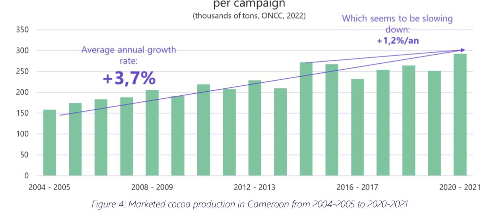

As mentioned earlier, the Cameroonian development strategy foresees a doubling of cocoa production*9* . This target is constantly being pushed back, but it shows the strategic value of the sector. Due to the growth of international demand and increased regulations and controls on the supply chain*,* grinders and chocolate makers are seeking to diversify their sources of supply. Cameroon appears to be a promising basin with great potential for production.

However, the sector is far from being free of sustainability issues. From an environmental point of view, forests still occupy 40% of the territory, which is a considerable proportion. The country and its cocoa sector are therefore likely to be significantly impacted by the ECPR, especially as the European Union represented 65% of Cameroon's cocoa exports in 2020, ahead of Malaysia (17%) and Singapore (8%)10. While Cameroon is gradually expanding its export markets beyond the European Union, the EU remains the largest consumer of Cameroonian cocoa, as shown below.

The European Union still represents the majority of Cameroon's cocoa exports, but its share is steadily decreasing

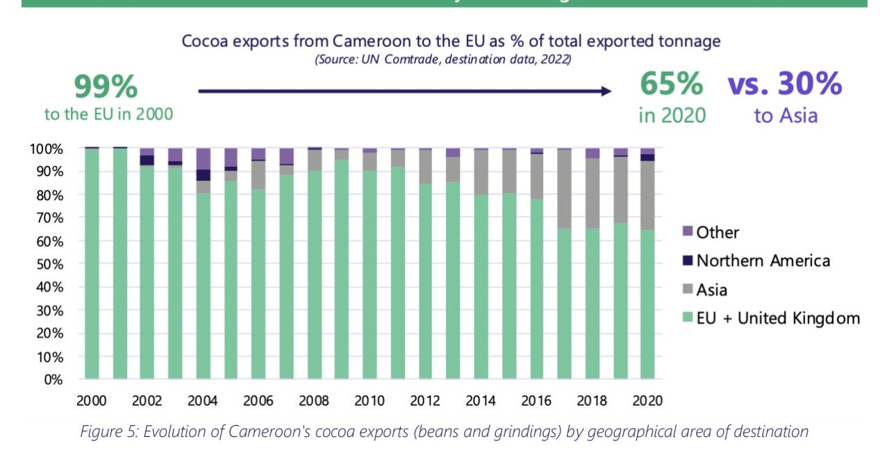

See[: https://www.mays-mouissi.com/wp-content/uploads/2015/05/planCacaoCafe-Cameroun-2015-2020.pdf.](https://www.mays-mouissi.com/wp-content/uploads/2015/05/planCacaoCafe-Cameroun-2015-2020.pdf)

10 Customs data from destination countries processed from the UN Comtrade site.

# **2\_Traceability: State of play and challenges in Cameroon**

#### 2.1.A still largely informal value chain

#### 2.1.1. Regulation of commercial relations in the sector

The regulations (Order 36/MINCOMMERCE of 2 September 2014) provide for two possible modes of marketing:

- *1. The sale of a certain volume of production according to periodic agreements (contracts) (for a week, ten days, a month). The agreement may require that the cocoa meets quality criteria or even sustainability criteria (in the case of Rainforest Alliance (RA) certified production or private sustainability programs). These agreements can be signed between cooperatives and national buyers, between national buyers and exporters and, more rarely, directly between producers (whether or not they are cooperatives) and exporters.*
- *2. Sales via organized markets where producer groups bring together their production: 1,147 markets were organized during the 2019-2020 season (no data communicated for the 2020-2021 season). The cooperatives are responsible for communicating a marketing calendar to the ONCC at the beginning of the season. The calendar sets out the fixed dates on which the producer group (producers belonging to a cooperative, who may be joined by other producers from outside the cooperative) will collect its production and deliver it to an LBA. This calendar is shared with the exporters and their agents (LBA or representative) who can thus plan their commercial activity. The day before the sale, interested buyers call the cooperative to negotiate a price and quantity; the cooperative chooses the best offer(s); the buyer (exporter, LBA or representative) goes there the next day and loads a truck with goods, which he then shops in his own warehouse. From the testimonies, it can be estimated that less than 30% of the production goes through these group sales.*

In practice, the value chain is far from complying with Cameroun's regulations.

After the first stage of production by farmers (harvesting and post-harvesting), cocoa is typically marketed through the traditional system of marketing agricultural commodities, which includes an aggregation stage carried out by small local traders working mainly in the informal sector and commonly known in Cameroon as "*coxeurs*" (comparable to "*pisteurs*" in West Africa).

The following section details the current structure of cocoa marketing in Cameroon and shows the gaps between regulation and practice.

### 2.1.1. Structuring cocoa marketing in Cameroon

Cocoa marketing in Cameroon involves a wide variety of economic operators who are often referred to by several different terms depending on the interlocutors and whether the discourse concerns their activity, the type of structure, their formalization, or their representation within the inter-profession.

For some clarification purposes, the table below proposes a definition of each type of actor based on their main activities and roles in marketing in Cameroon, but also in the destination markets.

| Actor         | Main activities               | Definition                                         |
|---------------|-------------------------------|----------------------------------------------------|
| Coxeur        | Collection and aggregation of |                                                    |
|               |                               | are often referred to as 'buyers' or “wholesalers” |
| Cocoa cleaner | Cleaning and reconditioning.  |                                                    |
| Exporter      | Purchase from port warehouse, |                                                    |

*Figure 6: Definition of terms used to designate stakeholders in the cocoa supply chain in Cameroon*

Figure 7 sums up and simplifies the estimated flows of cocoa in Cameroon, from the plots to the export port via the various intermediaries11 .

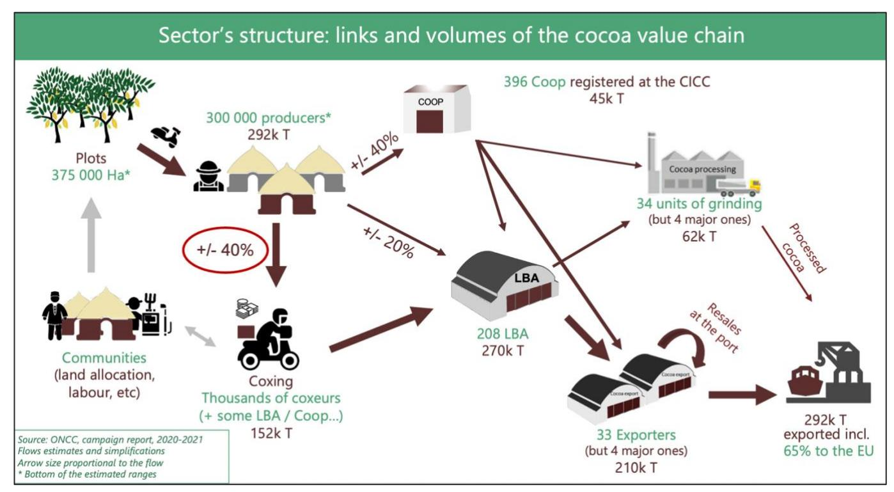

### 2.1.2. Little public information on cocoa farmers, the establishment and management of their plots and farms

Complete traceability of cocoa that integrates the risk of deforestation should start at the plot creation stage, which often corresponds to the clearing of the forest.

Plots of land are obtained i) by inheritance (a father can give portions of his land to one or more of his children), ii) by transfer (usually free of charge) from the head of the family after recommendation by the family council, iii) by an act of customary abandonment by the village chief. For large areas, this is done by iv) direct registration via the vice-prefect, or v) by a request for a concession from the prefect. Another way of extending cocoa farms is simply to extend them progressively around the edges of existing plots.

Thus, for small areas, producers who have recently bought land are very rarely subject to institutional control by national, regional, or departmental authorities; and even more, rarely to registration leading to the issue of a land title; relations are bilateral, between the newly settled producer and the village community represented in many cases by the village chief. The villages generally welcome the arrival of a new producer, since these producers, requiring labour (particularly for clearing), employ young people.

The village can also provide the producer with equipment (herbicide, sprayer, weeder, etc.). These plot purchases are not without potential encroachment on the forest estate. Village chiefs and producers sometimes more or less deliberately ignore the delimitation of protected areas or permanent forest areas, betting on the passivity of the authorities. It would seem, for example, that in the area of Loum (Littoral region) cocoa plots have progressed

*Figure 7: Estimates of cocoa bean flows in Cameroon by commodity chain. Areas in millions of hectares, and flows in thousands of tonnes (kT)* (Source: NitidÊ computer graphics based on ONCC data, Lescuyer et al., 2020 and CICC 2022 data)

11 Due to the angle of the analysis, this is not an exhaustive study of the cocoa marketing chain. For a more detailed study of the sector, please refer to the studies by Guillaume Lescuyer (2020) or to the ONCC's 2019-2020 season report.

by encroaching on such protected areas. Conflicts can also arise between new owners and former owners when village chiefs resell a plot not used by a former owner - a situation that is quite common.

The last General Census of Agriculture and Livestock (RGAE) dates from 1985 to 1986. Some ad hoc statistics have been produced via household surveys, in 2001, 2007 and 2014 by INS Ecam, and figures on rural employment have been provided under the EESI (Employment and Informal Sector Survey, the latest in 2018).

A new agricultural census was planned between 2013 and 2016 before being postponed12. It was finally launched in 2021, in coordination with the 4th "*Recensement gÈnÈral de la population et de l'habitat*" (RGPH), under the coordination of the INS ("*Institut national de la statistique"*), BUCREP ("*Bureau central des recensements et des Ètudes de population"*) and INC ("*Institut national de la cartographie"*) with technical support from FAO13 . Once again, this census seems to have been delayed. Finally, this situation could change in the medium term. A draft law is being prepared by the Ministry of Lands and Land Affairs on the acquisition and management of agricultural land in Cameroon.

Also, because of the lack of institutional control and the few available tools, producers themselves have very limited knowledge of the area of their plots. The geo-referencing of plots revealed a considerable gap between the estimated actual area of plots: in the Yokadouma basin, producers realised that their plots were twice as small as they had thought them. This lack of information is detrimental to the monitoring of the sector and shows that, as far as technical data is concerned, declarative information is rarely reliable. It can also be detrimental to the management of the plots: producers buy and administer a number of inputs that do not correspond to the real needs of their cocoa farms.

An alternative way to monitor the installation of plots is to trace the distribution of seedlings. Since 1986, SODECAO has played a less active role in this process. This is evident by the decline in the number of seedlings made available by SODECAO: 24,455,000 seedlings in 1986 compared to 4,200,000 in 201814. SODECAO has a website15 but at the time of our mission, statistical data and detailed documentation were not accessible.

On the other hand, the institution provides details on the distribution of seedlings to the media. SODECAO has a recovery plan for the period 2020-2027 with an investment of 30 billion CFA francs (4.6 million euros)16. This investment is broken down into five action plans: the production of 500,000 seed pods17 by 2027, 12,500,000 seedlings, support for 100 producers' organizations from 2020, and the opening of 50 kilometres of access roads per year. In 2020, SODECAO's activities covered only 2,000 small producers (less than 1% of them). The need for cocoa seed pods is estimated at 1,000,000, while only 160,000 are available.

2.1.3. From the plot to the LBA/coop, transactions are mostly informal and therefore untraced The sale of cocoa between producers and the first middlemen often bypasses regulatory principles. This is known as coxing. By definition, the coxeurs are the main actors involved in coxing and collect most of the cocoa production. Many producers find group marketing restrictive and risky and prefer to market their cocoa beans in a staggered and individual manner. Informal contracts are sometimes put in place before the harvest begins when the producer needs inputs (herbicides or fertilizers). A coxeur then provides the producers with the

12 See: https://ecomatin.net/statistiques-les-premiers-pas-du-recensement-de-lagriculture-et-de-la-population/.

13 See: https://fr.slideshare.net/ExternalEvents/recensement-gnral-de-lagriculture-et-de-lelevage-rgaecameroun-aquaculture-et-pche

14 See; https://ecomatin.net/la-sodecao-se-dote-dun-plan-strategique-de-30-milliards/.

15 See: http://sodecao.cm.

16 See: https://ecomatin.net/la-sodecao-se-dote-dun-plan-strategique-de-30-milliards/

17 Seed pods are pods selected in seed orchards which are themselves made up of trees selected for their performance (this is known as polyclonal selection where pilot trees cross naturally, the cocoa tree being partially self-incompatible). The beans contained in these pods can be used either for semi-direct or for the establishment of nurseries. The seedlings produced in nurseries are either direct sowing of the beans from the seed pods, or grafted seedlings where the rootstock comes from seed and the scion from the pilot trees.

requested inputs in exchange for financial interest (which is often very high) in the form of a reduced buy-back price for the cocoa in relation to a defined volume that can be delivered throughout the season.

The coxeurs circulate in the villages throughout the marketing year to propose purchase offers to the producers. Some coxeurs have an official warehouse and a "buyer" card provided by the CICC (they are then called LBAs for *Licensed Buying Agents*); they can then resell the cocoa directly to exporters. However, the majority of coxeurs have no official status and therefore resell their production to LBAs with whom they have established a relationship of trust. Some of this coxing is also carried out by producers, cooperatives or LBAs who combine formal and informal activities. The LBAs take advantage of this to '*make volume*' and fulfil a contractual agreement with an exporter. An LBA typically combines volume sourcing, with little or no quality control, with sourcing from reputable producers and cooperatives, where quality monitoring is more closely monitored. The cooperatives around Bertoua, reported that when buying cocoa, LBAs would say: '*Your cocoa is of good quality. I use it to get the rest of the cocoa I buy to pass inspection.'. As a result,* good quality cocoa is diluted with poor quality cocoa (against the regulations in force), therefore losing premiums and is undervalued for export.

According to our surveys, around 40% of the cocoa marketed in Cameroon is bought from producers and aggregated by 'coxing'. Equipped with motorbikes, tricycles, pick-ups or vans, they carry out transactions with producers in their vicinity, sometimes isolated in territories that are difficult to access. Although they buy the beans at a lower price than the LBAs at the group sales, the coxeurs provide services that are rarely available to the producers. Indeed, producers often lack the cash to buy the equipment and especially the inputs (antifungals, herbicide and fertilizer) that a productive cocoa farm requires. They have little access to financial services, including microfinance. They, therefore, depend on tontines (a collective associative saving system over a long period) and pre-financing/credit provided by coxeurs. These finance the purchase of inputs in exchange for a promise to sell (which sometimes includes wet beans).

Also, the coxeurs are probably the actors with the most detailed knowledge of the cocoa production sites. Each of them has a supply network of trusted relationships in each village, carefully selected over time. The cocoa is then delivered directly by them to official buyers (LBA), or stored in small informal warehouses from which the buyers will come to buy. The coxeurs have no official status: the regulations in force do not recognize their role; the CICC does not give them any official card and they are not part of any inter-professional college. The majority of coxeurs do not keep sales records and do not issue purchase slips to producers.

As an informal activity, the 'coxing' is therefore not included in public statistics. The traceability of conventional cocoa does not begin until the first official intermediary actors: the cooperatives and the LBAs. The collection of statistics on the distribution of production is therefore very imperfect.

### 2.1.4. Cooperatives unevenly mature, sometimes instrumentalized, with often deficient management systems

The status of cooperatives is governed by the Uniform Act on the Law of Cooperative Societies18 of 2011 of the OHADA (Organization for the Harmonization of Business Law in Africa)19 ratified by 17 African countries. It authorizes two types of cooperatives: the cooperative society with a board of directors (SCOOP/CA), the simplified cooperative society (SCOOPS) which, as its name indicates, allows the creation of smaller cooperatives with simplified management. In both cases, ownership of the cooperative is collective and power is democratically

18See: https://www.uniafrica.org/wp-content/uploads/2014/09/OHADA\_Acte-uniforme-relatif-au-droit-des-soci%C3%A9t%C3%A9scoop%C3%A9ratives.pdf

19 See: https://www.lavoixdupaysan.net/cameroun-nouvelles-cooperatives-ohada-expliquees-18-questions.

administered in theory. Registration is free, but members are often charged for a membership fee (often around CFAF 5,000) and an annual fee (around CFAF 5,000).

Cooperatives could be a node for information and control of regulations. Through their mediation, producers are in regular collaboration (a meeting between members is usually scheduled at least once a month). The most mature cooperatives (a minority) collect data through a management system, which is sometimes computerized; crop reports are drawn up, and producer services (distribution of seedlings, inputs, and group labour contracts) can be monitored and cross-referenced with the volume of cocoa marketed and the area declared.

During group sales, a sales contract is signed by both parties (the buyer and the cooperative) and a sales slip specifying the quality of the product sold is signed by the various parties involved: the cooperative, the buyer and, when present, an agent of the ONCC [\(Figure 8\)](#page-17-0). These documents are drawn up by the cooperative itself with validation by the ONCC. The sales slip specifies the moisture content, the number of bags, the price per kilo and the total value.

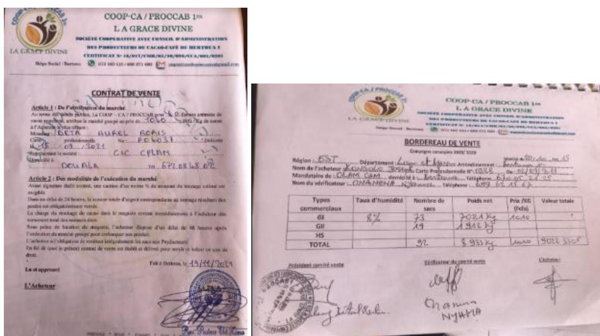

*Figure 8: Contract and sales slip of the Coop-CA PROCCAB 1er La Gr'ce Divine (Bertoua region)* 

Depending on the volume, the batch of cocoa beans purchased is either sent directly to the port for export or transferred to the buyer's storage center to be grouped with other batches for loading into trucks of 35 metric tons payload (usually loaded with 40 metric tons in practice). The buyer often uses daily rented transport. In these sales, because of the variety of actors present and the information passing through (sales volumes, origin by producer, destination by LBA and exporter, rented transport, then, for the most advanced, volumes of inputs distributed, financial services, seedling distributions, etc.), the cooperative is an important source of information for the origin of the beans. Nevertheless, as it can be seen above, the aggregate information on sales contracts and sales slips does not provide information on the origins of either farms (volumes produced per producer) or plots (origin of volumes).

Cooperatives are often instrumentalized to serve private interests, according to some interviews. This situation echoes that of CÙte d'Ivoire. Two recent articles have shown that most Ivorian cooperatives, rather than being managed by the farmers themselves as required by law, serve the interests of local traders or exporters20 . Indeed, obtaining certification premiums requires cooperative status. After the intermediary actor has captured the premiums, they are not transparently or fairly redistributed to the producers. The intermediary actors in Cameroon seem to also profit from an information asymmetry: producers tend to be poorly informed about certifications and the premiums they generate. This information asymmetry is aggravated by the fact that exporters decide on the day itself or even *a posteriori* (based on their own sales of certified products) what part of the production delivered will be rewarded by a certification premium.

Note, there is an unequal distribution of experience in cooperative management across the regions: in the South and East, co-operatives are often young and experience in their management is lacking. Around Yokadouma, the main production area in the East, the cooperatives are often less than 10 years old and have few concrete activities. They do not keep track of the quantities of cocoa marketed or the volumes delivered per member. The cooperatives in the Centre and Littoral, which are better connected to marketing channels, tend to be more mature. However, they suffer from other weaknesses in terms of monitoring a relatively high prevalence of urban owners, most of whom are absent and less involved in cooperative governance and sales monitoring systems.

#### 2.1.5. LBAs: independent traders or traders mandated by exporters, a pivotal point in the value chain

Three types of actors can obtain LBA status (also called 'buyers'): producer groups, CICC-registered traders and local processing units. However, the term most often refers to large CICC-registered traders who may be either independent or subcontractors of an exporter.

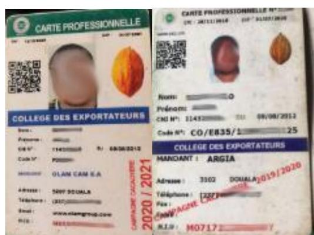

These actors do not necessarily make all their purchases in their regions of origin. Some LBAs, in order to have a stock over a longer period of time, taking advantage of the agroecological diversity of Cameroon, buy from distant regions. LBAs travel long distances to acquire supplies from cooperatives and, above all, from a '*reliable'*  network of coxeurs: one LBA we met in the Moungo department (Littoral region) told us he bought more than half of his production outside his department. He would travel as far as the East and South to continue to obtain supplies throughout the season, consequently losing the geographical origin. Nor is the origin reflected in the records of the LBAs, the pivotal points in the cocoa value chain in Cameroon. *Figure 9: Cards issued by the CICC of an exporter's mandated buyer*

LBAs registered with the CICC must have a card issued annually by the CICC (see Figure 9). These cards contain a chip that allows them to be identified on a database instantly. As part of internal management (monitoring stock, quality, receivables, etc), the actors record their sales using software and documents provided by their exporters, however, the documents are not standardised.

20 Ruf, FranÁois, Enrique Uribe Leitz, KouamÈ Casimir Gboko, and AurÈlie Carimentrand. "Useless certifications? Asymmetrical relations between cooperatives, labels and cocoa farmers in CÙte d'Ivoire". International Journal of Development Studies 240, nᵒ 4 (20 November 2019): 31-61.

#### 2.1.6. Supervision of the ONCC at the level of LBAs, cooperatives and exporters

The territorial agents of the ONCC collect weekly or monthly data registers from LBAs and cooperatives, but without collecting information on the origin of the production.

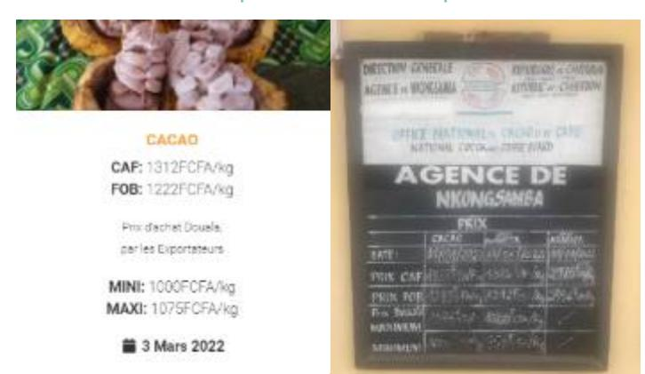

Data are reported monthly at the agency level in Excel spreadsheets and Word documents (see [Figure 10\)](#page-19-0). ONCC staff also carry out quality controls at operators' premises, which have been stepped up since the sector development plan in 2014.

The ONCC branches are equipped with

moisture meters, scales, and sorting tables. Theoretically, ONCC agents should carry out these tests systematically during group sales. However, testimonies from the field suggest that the agents are only present for part of the sales (one sale out of two according to several players, with no impact on the organization of sales).

In addition, the ONCC agents communicate information about prices through their website (minimum and maximum, CIF and FOB prices), displays in their branches (see [Figure 10\)](#page-19-0) or, verbally to group buyers in the presence of an ONCC agent. In the field, it appeared that many producers check the selling price in Cameroon on the internet, with a great deal of confusion between farm-gate prices, prices delivered to the port of Douala and international FOB/CAF prices. The published prices are wholesale prices at port level. In general, coxeurs buy the product with a difference between 50 and 100 FCFA/kg depending on the quantity, quality, isolation of the locality and distance from the port of Douala.

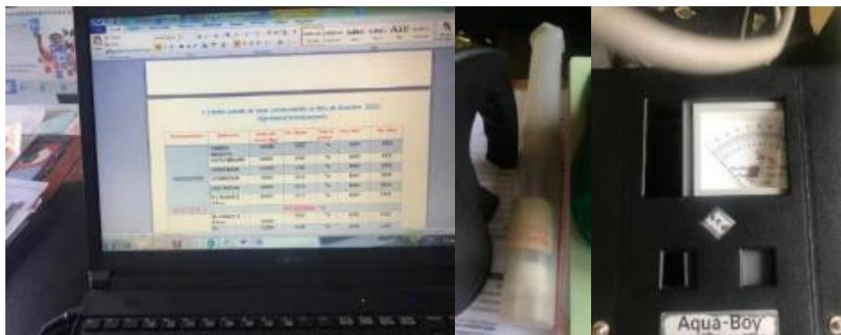

Through the management documents and monitoring carried out by the ONCC agencies, the sector has a high level of information about the wholesale warehouses where the product is grouped before being loaded and shipped to the port of Douala and the crushing plants. Nevertheless, this

information system does not guarantee precise territorial traceability (given the interregional flows that occur at

the LBA supply level), let alone traceability at the plot level.

#### 2.1.7. Exporters and international traders, highly concentrated, highly formalised, have reliable information from export

International trading companies and their domestic bean grinding and export subsidiaries are relatively concentrated. In the 2019-2020 season, the top three operators exported or grounded 66% of cocoa bean production, and the top six 80%. The majority of cocoa export contracts follow the standardized model provided

*Figure 11: Report by a NCCB field agency and equipment held at agency level*

*Figure 10: Price displayed on the NCCB website and at a territorial agency*

by the Cocoa Trade Federation21 ; the quantities and recipients of these export contracts are monitored by the ONCC via the ASYCUDA FOB clearance processing system22 .

Data from this monitoring was published in the 2019-2020 season, but not in the 2020-2021 season23 . The largest exporters are the Cameroonian subsidiaries of large multinational cocoa trading and grinding companies (Telcar, a subsidiary of Cargill; Sic Cacaos, a subsidiary of Barry Callebaut; Olamcam, a subsidiary of Olam; and AMS, a subsidiary of ECOM). In addition to the quantities collected from the LBAs, these companies also occasionally buy back stocks from smaller exporters who, for some reasons of cash flow, logistical capacity or lack of contracts, cannot export them directly. Therefore, there are resales between exporters at port level that must be considered in the traceability schemes. This production is then mixed with the exports of large groups with a lower level of traceability (they keep the name of the supplier at the port but not of the supplier(s) based in the production areas that formed the batch).

As outlined in the ONCC's crop report, Figure 12 shows the trade between the major Cameroonian exporters and the main multinational trading groups that dominate the trade and crushing of beans on a global scale. The majority of these large multinational trading groups obtain their supplies mainly from their Cameroonian exporters.

The Cargill group is an exception. Two-thirds of its production is supplied by its subsidiary, the remaining third is distributed among various national exporters.

In total, on the importer side, Olam and Cargill captured 84% of the cocoa beans exported during the 2019/2020 season through their various import companies.

Barry Callebaut (via Sic Cacaos) has the particularity of processing almost all the cocoa purchased in Cameroon and then exporting it in the form of cocoa mass, butter and powder: in 2019-2020, the Sic Cacaos factory represented 89% of the cocoa processed in Cameroon. These three dominant companies on a global scale (Cargill, Olam and Barry Callebaut) are therefore, also dominant in Cameroon. They each have their own internal traceability/management system. Traceability to the producer, however, only applies to the part of the supply chain that is covered by the sustainability and certification programs, whose functioning is discussed in the chapter following.

21<https://www.cocoafederation.com/>

22<http://www.douanes.cm/douane/index.php/fr/il-s-agit-du-systeme-automatise-qui>

23 See : NCCB, season Review 2019-2020, 2020.

Supply in Cameroon of large multinational cocoa bean traders/grinders (top 6 in 2019-2020, 2020-2021 data not available)

| Suppliers                             | BARRY / CALLEBAUT | Cargill | Olam | ECOM THEOBROMA ..... | S&D SUCDEN | COCOA NECT. |
|---------------------------------------|-------------------|---------|------|----------------------------|------------|----------------|
| Sic Cacaos                            | > 90%             |         |      |                            |            |                |
| Telcar                                |                   | 66%     |      |                            |            |                |
| Olamcam                               |                   |         | 86%  |                            |            |                |
| Camaco                                |                   |         | 14%  |                            |            |                |
| AMS                                   |                   |         |      | 100%                       |            |                |
| Ndongo Essomba                        |                   | 14%     |      |                            |            |                |
| Achanyi                               |                   | 3%      |      |                            |            |                |
| COTEC                                 |                   | 9%      |      |                            |            |                |
| SBET                                  |                   | 8%      |      |                            |            |                |
| Producam                              |                   |         |      |                            | 95%        | 31%            |
| Agri-Trade                            |                   |         |      |                            | 5%         |                |
| Cooppracam                            |                   |         |      |                            |            | 69%            |
| % ofcocoæxported (inclaroundbeans) | 21%               | 39%     | 34%  | 5%                         | 2%         | 0,1%           |

*Figure 12: Concentration of cocoa exports and processing in Cameroon* 

The ONCC also conducts quality control by sample at the time of stuffing containers, in addition to sharing data via ASYCUDA's computer system. These quality controls are an obligation to start the exportation process. Nine quality control companies are approved by the ONCC, including Bureau Veritas Douala, Agrogic and ACE Cameroon.

As some exporters carry out potting directly in the collection areas, it is the decentralised agencies of the ONCC that oversee quality control (see [Figure 11](#page-19-1) for an example of a data file collected from exporters in Nkongsamba). The data from the quality controls are cross-checked with customs statistics to produce the season review.

### 2.1.8. Relatively reliable customs statistics collected on dematerialised platforms

Customs statistics are the most reliable because production is gathered in one place (the export port in Douala), and procedures are rigorous and based on extensive documentation (certificate of origin from the Ministry of Trade, a phytosanitary certificate from the Ministry of Agriculture, a quality certificate from an approved quality control company, etc.).

Customs procedures are now dematerialized through a single window for foreign trade (e-GUCE). A single point of entry for information (called E-Force) is available to exporters, allowing all procedures to be automated and stakeholders to be informed (see Error! Reference source not found.).

Exporting requires numerous documents issued by different structures (Certificate of Origin and Export Declaration from the Ministry of Trade, Phytosanitary Certificate from the Ministry of Agriculture, Quality Control Bulletin from an approved company, Tax Quitus from the Ministry of Finance, etc.).

These documents must then be sent to the Single WIndow office in Douala to obtain the "*Bordereau de taxation*" (BDT). It is at this stage that the payment of exit duties is made to the bank branch opened at the Single Window. Finally, there is the customs declaration on the e-GUCE platform via a forwarding company known as an authorized custom agent (CDA) connected to the automated customs system (Sydonia).

If the documentation is correct, customs will issue the Good to Ship (GTS) and the cocoa shipment can enter the port and handed to a port handling company for loading onto a container ship. The figure 13 summarizes the procedure for exporting cocoa.

## Cocoa export operations

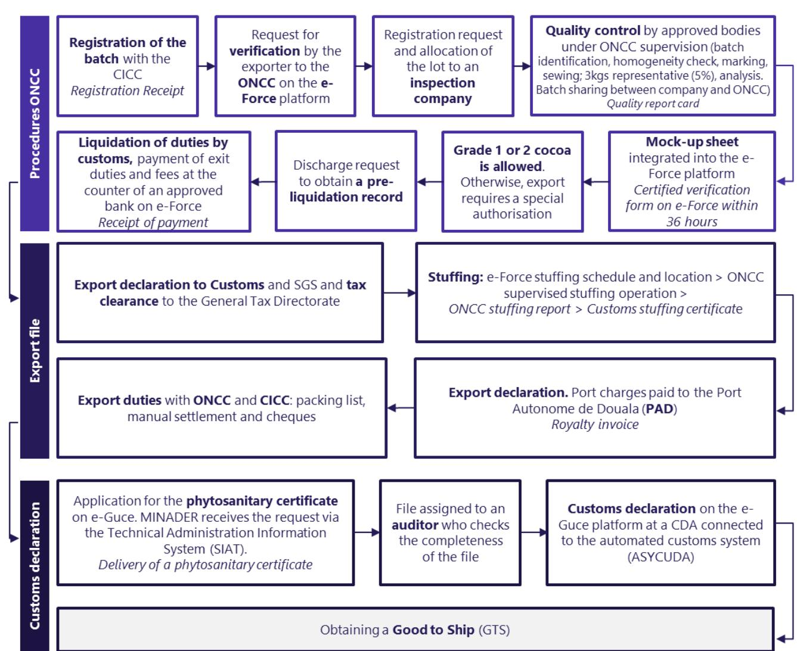

*Figure 13: Diagram of the main stages in the export of cocoa in Cameroon* 

In part, because of this multiplicity of documents and the institutions that issue them, the export process is able to cross-check the information and ensure its reliability, especially for information related to quantities shipped and recipients. The value of exports may be slightly underestimated by multinationals (when they wish to repatriate profits) but customs compare the value declared in contracts with average cocoa prices, which limits the scope for fraud.

### 2.1.9. Everything remains to be done in terms of upstream traceability of LBAs and cooperatives

Finally, Error! Reference source not found. illustrates the information networks established between the economic actors in the sector and the various institutional stakeholders in the Moungo department. As described above, information circulates almost exclusively between the LBAs/cooperatives and the ONCC. The difference here is that the coxeurs do not circulate any information, whether they are based in the department or outside.

Very limited public monitoring upstream of the sector... (example of information flows in the Moungo)

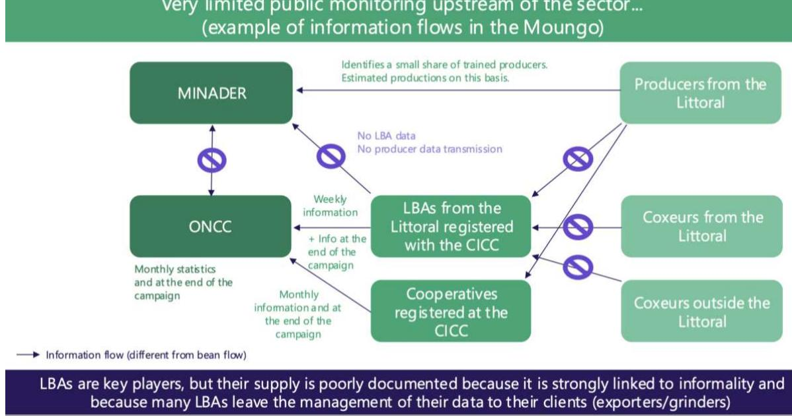

*Figure 14: Circulation of information in the Moungo department*

In Error! Reference source not found., all the information provided thus far is summarized. The green documents indicate that reliable registers are kept and monitored by national institutions (ONCC). The yellow documents indicate that registers exist, but are incomplete either because some actors do not generate information or because some information is missing. Before LBAs and cooperatives, there were no registers to ensure traceability of the plot.

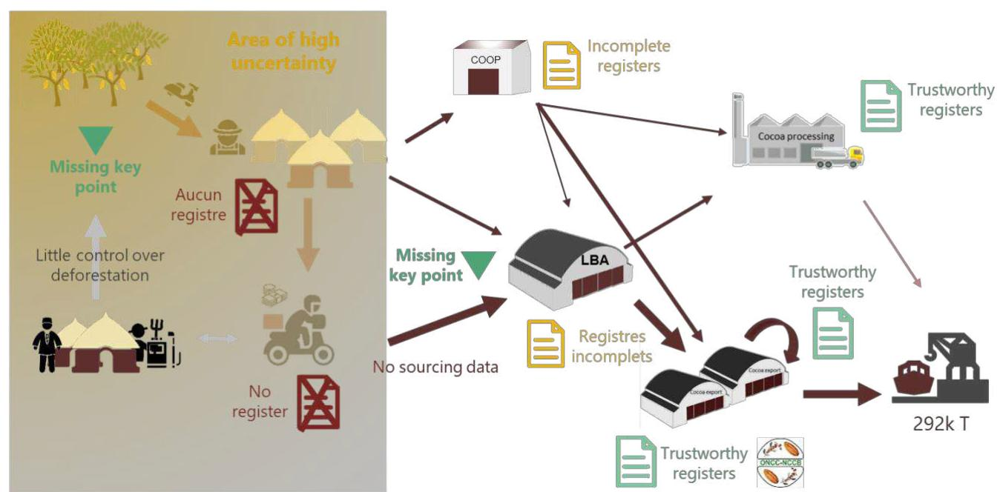

*Figure 15: Diagram of data collection and data reliability in the cocoa sector in Cameroon* 

It should be noted that MINADER is completely outside the information-sharing circuits, apart from the census of the producers it supports. At this stage, the public marketing monitoring system is therefore incomplete and insufficient to help exporters, processors and cooperatives meet future EU requirements*.* 

#### 2.2.1. Private traceability mainly based on Rainforest Alliance certification

Cameroonian exporters and processors and their customers abroad have a particular interest in strengthening the traceability of their supply chain. Traceability makes it possible to protect against reputational risk, to meet the requirements of certain chocolate manufacturers, to know which cocoa basins produce the best quality and the largest quantities. It helps also to identify areas at risk of unsustainability or to develop incentive mechanisms with producers and cooperatives which increase production quality and the sustainability of associated practices.

The traced production is mainly the result of the sustainability programs of subsidiary exporters of multinational cocoa traders, which are mainly based on the RA specifications (resulting from the merger of RA and UTZ in 2017 and the progressive harmonization of their specifications). Apart from these large international groups, whose certification is generally carried out by the parent company or an important subsidiary outside Cameroon, only one independent structure in 2017 was certified in Cameroon according to the RA certificate database24 . This is the Socoprocato cooperative based in Tonga in the Western region25 .

The sustainability requirements of AR are detailed in the third part of this report, but it should be noted at this point that '*sustainable*' production is sold in *segregated* form until export or deliver to Cameroonian mills*26* . After processing and/or export, the sale of AR-certified products is generally done on a *mass balance* basis. This has two notable implications:

*1. The bags contain only 'durable' beans and cannot be associated with a plot;* 

*2. Although it is not clear from which parcel each bean comes, each link in the sustainable value chain is able to identify its sources of supply: the cooperative its producers, the exporter its purchasing cooperatives.* 

Below, information gathered during a visit to the Usicam warehouse in Ntui, is used as a reference to analyse the functioning of cooperatives and exporters' agents working in the framework of AR certification. The key element of AR traceability is the locking of suppliers: the cooperative must announce at the beginning of the season a list of producers from whom it will buy; these must be geo-referenced (currently the requirement is a GPS point for the location of the farm, but in the long term the plots will have to be geo-referenced in the form of polygons) and may be audited. Error! Reference source not found. (next page) represents the documentation used per step.

24 See: https://www.rainforest-alliance.org/fr/business-fr/certification-fr/recherche-de-certificat-et-resumes-publics/.

25 See: htt[p://africertlimited.co.ke/summary/SOCOPROCATO.pdf .](http://africertlimited.co.ke/summary/SOCOPROCATO.pdf)

26 Schematically, three types of traceability can be distinguished: identity preserved, the strongest, where the parcel origin of the product is preserved at all stages of the value chain; segregation, where the parcel identity is not preserved, but where sustainable production is never mixed with conventional production; and mass-balance, where sustainable production is mixed with conventional production, but where the proportion of sustainable products on sale is equal to the proportion on production.

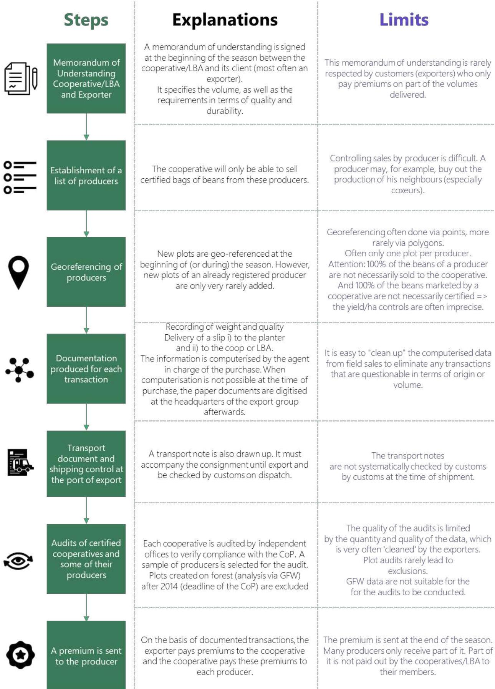

| Steps                                                                      | Explanations                                                                                                                                                                                                                                                                                                                        | Limits                                                                                                                                                                                                                                                                                                                                   |
|----------------------------------------------------------------------------|-------------------------------------------------------------------------------------------------------------------------------------------------------------------------------------------------------------------------------------------------------------------------------------------------------------------------------------|------------------------------------------------------------------------------------------------------------------------------------------------------------------------------------------------------------------------------------------------------------------------------------------------------------------------------------------|
|       | 
A memorandum of understanding is signed at the beginning of the season between the cooperative/LBA and its client (most often an exporter). It specifies the volume, as well as the requirements in terms of quality and durability.
                                                                                         | 
This memorandum of understanding is rarely respected by customers (exporters) who only pay premiums on part of the volumes delivered.
                                                                                                                                                                                             |
|                           | 
The cooperative will only be able to sell certified bags of beans from these producers.
                                                                                                                                                                                                                                      | 
Controlling sales by producer is difficult. A producer may, for example, buy out the production of his neighbours (especially coxeurs).
                                                                                                                                                                                           |
|                                    | 
New plots are geo-referenced at the beginning of (or during) the season. However, new plots of an already registered producer are only very rarely added.
                                                                                                                                                                    | 
Georeferencing often does not provide a point, more rarely via polygons. Often only one plot per producer. Attention: 100% of the beans of a producer are not necessarily sold to the cooperative. And 100% of the beans marketed by a cooperative are not necessarily certified =&gt; the yield/ha controls are often imprecise.
 |
|                    | 
Recording of weight and quality Delivery of a slip i) to the planter and ii) to the coop or LBA. The information is computerised by the agent in charge of the purchase. When computerisation is not possible at the time of purchase, the paper documents are digitised at the headquarters of the export group afterwards.
 | 
It is easy to "clean up" the computerised data from field sales to eliminate any transactions that are questionable in terms of origin or volume.
                                                                                                                                                                                 |
|  | 
A transport note is al
                                                                                                                                                                                                                                                                                                       |                                                                                                                                                                                                                                                                                                                                          |

*Figure 16: Diagram of the traceability process for a Rainforest Alliance Certified Cooperative* 

Studies in other countries have shown that such traceability systems face a multitude of obstacles (see Error! Reference source not found.) 27 .

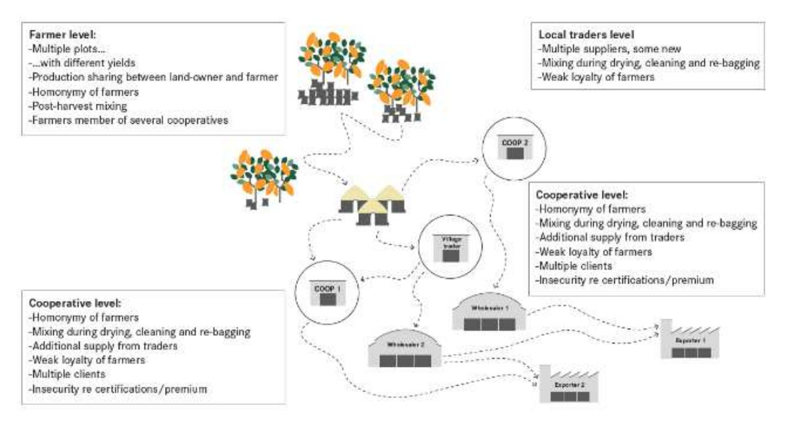

The level of control and the thoroughness of the audits are essential for such a system to guarantee real traceability. It's worth mentioning that this is a traceability system constrained by the market: without a significant increase in market demand, part of the production is destined to remain untraced.

However, one third of the world's RA-certified cocoa production did not find export markets in the 2020-2021 season. Moreover, the traceability systems based on this certification do not provide full transparency: the data remains the sole property of RA, whose interests remain private, as well as that of the downstream actors in the value chain. The control and evaluation capacities thus remain limited.

### 2.2.2. Traceability tools available but still relatively little deployed in Cameroon

To meet the demands of their chocolate customers, cocoa exporters and grinders deploy specialist traceability teams and implement their own tools. These tools are part of their group-wide sustainability programs and often go beyond the cocoa sector.

*Figure 17: Obstacles to traceability for each stage of the value chain. Source: Nitidae reports, CÙte d'Ivoire and Ghana, 2021*

27 See: Nitidae and EFI, Traceability and transparency of cocoa supply chains in CÙte d'Ivoire

and Ghana, 2021. And : Nitidae and EFI, Sustainability initiatives in Ivorian and Ghanaian cocoa supply chains: benchmarking and analysis, 2021.

| Major          | % of marketed |                                                                                                                                     |
|----------------|---------------|-------------------------------------------------------------------------------------------------------------------------------------|
|                |               | Method Other sustainability Traceability agents tools / programs ≈25 Harvest: manual Farmforce: digitisation Forest loss risk index |
| Olam (19%)     | ≈27%          | ≈22 OFIS: producer surveys Axos By compulsory                                                                                       |
| Barry C. (17%) | ≈45%          | ≈30 Cocoa Horizon registration of Producer surveys suppliers and control                                                            |
| AMS (5%)       | ≈90%          | ECOM Sustainability                                                                                                                 |
| (5%)           | ≈15%          | Assumed by suppliers                                                                                                                |

*Figure 18: Geo-referencing programs of the main exporters and grinders in Cameroon* 

The tools used de facto increase the information on the origin of the production. The first three exporters studied here have in common that they rely both on mapping of plots via geo-referenced polygons and on a paperbased verification system for "*first mile traceability*". Each group has traceability agents covering their main supply areas (Figure 18).

Cargill relies on two traceability systems in particular; the first is based upon physical documentation (Harvest, 37,000 growers affected according to data communicated in February 2022), and the second, more recent, is based upon a computer system (Farmforce, 6,000 growers affected).

As for now, these tools are only intended to measure the share of direct supply production, but the group says it is developing a due diligence system to address indirect supply as well. In addition, Cargill launched a range of tools in 2020 in Cameroon, as well as in CÙte d'Ivoire and Ghana, which make up its *CocoaWise* sustainability programme28 . The *CocoaWise* map geo-references the 11 Cargill direct procurement centres integrated into the CocoaWise sustainability program and provides the number of UTZ - RA certified producers.

28 Range of tools to be developed as follows: *eFinance*, mobile payment service; *ProFarm*, decision support for producers; *ProCoop*, support tool for cooperatives to ensure traceability from the plot. See: https://www.idhsustainabletrade.com/uploaded/2021/06/Case-Study-Cargill\_Adjusted.pdf

Barry Callebaut was one of the first stakeholders to adopt RA but the group has gradually developed its own initiative: Cocoa Horizons.

Although the terms of reference are very similar, there is a lower premium than RA (25 FCFA versus 50 FCFA)29 . The socio-economic surveys of producers are more extensive than the Rainforest requires and make it possible to complete the group's database. Thus, 45% of production would be traced.

Olam launched its traceability and monitoring tool for its sustainability programs 'Olam at Source' in Cameroon in 202030 ; this is an internal database with geo-referencing of each producer's plots and associated socioeconomic data. Its traceability program is closely linked to the partnership with RA.

Although georeferencing data is audited by international firms such as KPMG or Deloitte or as required by chocolate clients, the quality remains unclear. It is difficult to test the quality of geo-referencing data in detail and exhaustively, especially without cross-checking the databases of the various stakeholders and thorough field checks.

According to some testimonies, around 20% of the contours taken in the field have georeferencing problems (overlapping polygons in particular). In addition, some cooperatives may have had their members georeferenced several times by different clients and some producers may be registered as members of several cooperatives.

The deployment of these tools involves the creation or support of cooperatives to improve harvesting and postharvest practices of producers and to increase the share of direct supply. In contrast, according to the interviews conducted, the main indirect actor in the supply chain, i.e., the coxeurs, are not listed in any databases and remain untraceable.

The programs deployed by these large groups are modelled on those set up in CÙte d'Ivoire and Ghana, but the proportion of cooperatives and producers involved is often lower in Cameroon (around 30%), as these programs are deployed with a delay. For example, Telcar's *Cooperative Management System* (CMS), implemented in 2018 in Ghana and CÙte d'Ivoire, arrived in 2020 in Cameroon31 . In addition to offering support, cooperatives provide exporters with a pilot site for enhanced traceability.

### 2.2.3. Some examples of enhanced traceability for niche markets

Various initiatives have emerged in Cameroon, often benefiting from the support of clients committed to quality and relying on guaranteed prices that are higher than the conventional market.

These implement more extensive traceability according to varying levels of requirements and methodologies. As shown in Figure 20, they operate in different ways.

29 See: https://www.cocoahorizons.org/.

30 https://www.olamgroup.com/news/all-news/blog/olam-celebrates-its-place-in-cameroon-history.html

31 See: https://www.intracen.org/uploadedFiles/intracenorg/Content/About\_ITC/Corporate\_Documents/Annual\_Report/AR2018.pdf.

|                                                          | Ntui Centre of                                                                                                                 | SOCAEZICA - Support                                                                                                                            |                                                                                                                  |
|----------------------------------------------------------|--------------------------------------------------------------------------------------------------------------------------------|------------------------------------------------------------------------------------------------------------------------------------------------|------------------------------------------------------------------------------------------------------------------|
| Initiative Department /                                  | Excellence SOCOOPEC-N                                                                                                          | from Telcar 32                                                                                                                                 | Pallisco - Eticwood                                                                                              |
| Region                                                   | Mbam-et-Kim, Central                                                                                                           | Obala, Central                                                                                                                                 | Mindourou, Department of Haut-Nyong, East 1250 FCFA/kg dry                                                       |
| Farm-gate price                                          | Producer: 1200 FCFA Cooperative: 440 FCFA                                                                                      | Premium of 50 FCFA / kg for certified cocoa                                                                                                    | equivalent (purchase of fresh product)                                                                           |
| Traceability type Monitoring the                         | Identity Preserved                                                                                                             | Segregated / Mass Balance                                                                                                                      | Identity Preserved/ Producer Batch                                                                               |
| distribution of plant protection products Georeferencing | Yes                                                                                                                            | Not established                                                                                                                                | To come                                                                                                          |
| (polygons) Strengths                                     | Yes Farm-gate price Frequent technical support Closeness to the coop/chocolate maker Quality Niche market with limited volumes | Yes Group cooperative management system Equipment loans Privileged partnership: quasi-exclusivity Technical support (20 training courses/year) | Yes in progress Farm-gate price Frequent technical support Extensive work on quality improvement (drying centre) |
| Weaknesses Key elements of the strategy                  | Majority of beans sold without premium Post-harvest processing centre                                                          | Limited premium Strong follow-up and proximity of the purchasing centre                                                                        | Low volumes Post-harvest processing centre, partnership with forestry operator, identified clients               |

*Figure 19: Three sustainable cocoa pilot sites with their traceability programs* 

The SOCOOPEC cooperative benefits from strong external support under the CICC Centres of Excellence initiative. A strong partnership between the chocolate maker Puratos (a member of the committed chocolate makers), the traceability company Cocoa Trace, the trader Foda Trading and the microfinance bank MUPECI led to this initiative. The Committed Chocolate Makers guarantee a market outlet for excellent cocoa. A key focus in the cooperative's strategy is the post-harvest processing centre (see [Figure 20\)](#page-30-1).

The cooperative takes care of the purchase of the plant protection products and the transport of the beans from the roadside to the centre. The purchase price of the beans is 1640 FCFA/kg: 1200 FCFA/kg for the producer and 440 FCFA/kg for the cooperative (which includes sending shelling brigades to the producers' fields).

Traceability is ensured by preserving identity but faces some difficulties: different bag sizes along the processing chain and changes in the volume of the beans after fermentation and drying. However, each bag has an

32 For a detailed presentation, see: BÈra, Amandine. "Towards traceable cocoa: impacts of existing models on the profitability of smallholder farmers in Cameroon. Montpellier: AgroParisTech, 2021.

identification code that can be associated with one or more producers (but not with the parcel). In addition, apart from the beans sold to committed chocolate makers, it should be noted that the beans are sold without traceability. The cooperative also seeks to combat deforestation by prohibiting the increase of cocoa acreage. By monitoring the distribution of inputs through frequent visits to the plots and community control, the traceability system deployed by the centre can verify the producers' declarations.

The above initiatives are useful to show that full traceability is possible, provided that the customers is willing to pay and accompany the producer organizations in such a process.

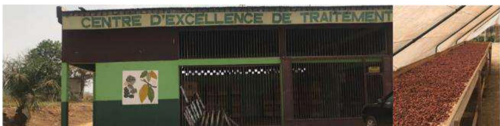

However, they are not sufficient to change practices throughout the sector and are not always representative of the reality experienced by all producers. Therefore, the public cocoa institutions and the inter-profession have initiated programs to strengthen traceability at national level.

### 2.3. Public initiatives can enhance the traceability of the sector if they are sufficiently coordinated and widespread

Several public initiatives are currently being carried out by the ONCC, FODECC and CICC. However, they are all implemented so far in the form of small-scale "*pilot*" programs and projects (thousands of producers).

#### 2.3.1. CICC: registration of producers and georeferencing of their plots by a sworn geometer

A producer registration program was launched by the CICC in September 2019 to improve connectivity between producers on a national and international level. Based on current LBA and cooperative cards, each producer received: a) a card identifying their name, ID number (Issue), place of residence, department, various georeferenced plots, and b) a "*cocoa farmer's booklet*", with historical marketing information (volume of sales, buyers' names, date, price) (see [Figure 21\)](#page-30-2) 33 . The map contains a QR code which, when scanned, gives access to the information contained in the CICC database.

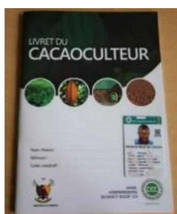

The CICC makes its aid and training conditional on the possession of these documents. Since 2019, 44,000 cards have been issued to producers, mainly in the Centre, and particularly in the departments of LÈkiÈ and Mbam-et-Kim. In addition to the registration of producers, the CICC initiated the georeferencing of 6,000 plots. Several techniques were tried out (GPS pointing via smartphone, routing via smartphone application, referencing by drone with two different companies) before the solution of georeferencing by a sworn geometer was selected.

*Figure 20: Picture of the SOCOOPEC centre of excellence in Ntui*

*Figure 21: Cocoa farmer's card booklet provided by the CICC*

33 See: htt[p://leconomie.cm/le-cicc-distribue-les-premieres-cartes-et-livrets-aux-producteurs-de-cacao/](http://leconomie.cm/le-cicc-distribue-les-premieres-cartes-et-livrets-aux-producteurs-de-cacao/)

The polygons can then be cross-referenced with information on the legal status of the parcel and with the national land categories: National Forest Domain (NFD), Non-Permanent Forest Domain (NPF) (see Figure 22). For the 6,000 plots mentioned above, four months of work were planned (5 to 7 teams mobilized over periods ranging from 2 to 6 days) with an estimated cost between 8,000 and 12,000 FCFA per plot.

Cross-referencing with the databases of private companies is considered before a potential partial merger of information. A data access protocol is being developed in coordination with the National Agency for Information Technology (ANTIC), which regulates the management of personal data in Cameroon34 .

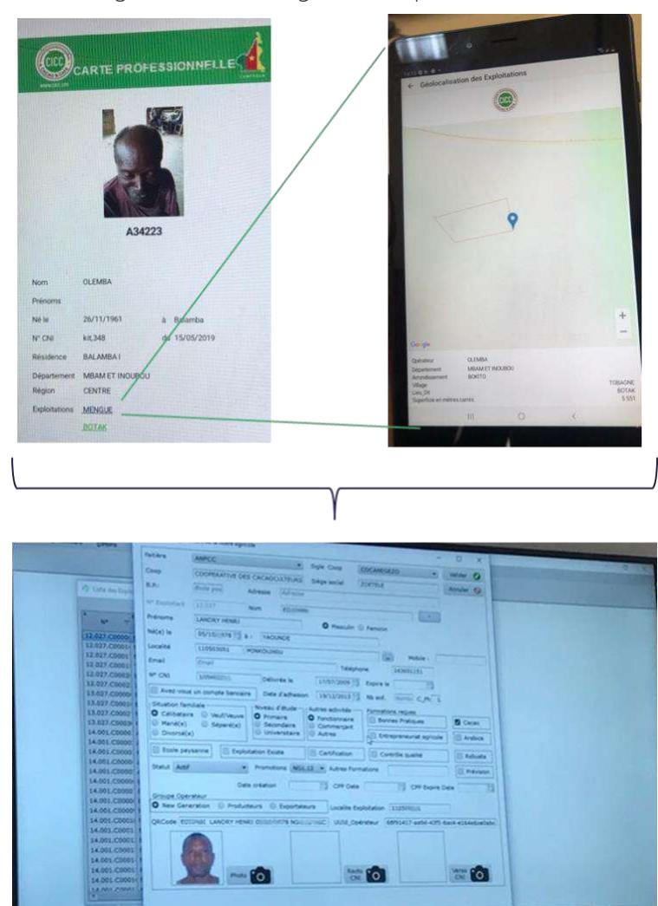

### 2.3.2. The FODECC Producer Window: encouraging registration and geo-referencing of producers

Since August 2021, the FODECC has been piloting a digital subsidy system for farmers as part of the Producer Gateway, in partnership with Agri Edenred. While the primary purpose is to provide farmers with subsidies for the purchase of inputs and equipment using a digital ordering and payment system, it also includes a data collection component.

The distribution of subsidies will be conditional to the creation of a bank account, the size of the plot (< 10 ha) and its geo-referencing. A first phase of deployment of the Producers' Counter began in 2022 in the Moungo region with a target of 10,000 producers reached during the next season, and the self-declaration/georeferencing

*Figure 22: Georeferencing the CICC: from the producer map to the database*

34 See: https://www.antic.cm/index.php/fr/info-tic/textes-du-secteur-des-tic.html.

of producers under the co-supervision of Edenred and FODECC technicians. The FODECC's objective is to reach 100,000 producers by 2025. The FODECC is open to share the data with other stakeholders in the sector and is considering cross-referencing with the geo-referencing data collected by the CICC.

### 2.3.3. Ongoing reflections at the ONCC on the deployment of a national traceability system

Under the supervision of the ONCC and with the support of IDH, the design and budgeting of the national traceability system is currently underway, with the objective of ensuring 100% traceability of cocoa from the plot to the port of export by the end of 2025 (an objective announced in the Roadmap to Deforestation-Free Cocoa - FRCSD35). This work has been entrusted to the TCV-C consortium36 and will be subject to discussions during the next Cocoa Talks which will be held in Cameroon.

### 2.3.4. A need for coordination but above all for clarification of mandates

For now, these three public initiatives are not coordinated, although the merger of the databases is considered in the long term, and the exporters, major stakeholders in traceability, have not yet participated in the production or auditing of the data. However, the potential synergies appear to be numerous. Figure 23 explains the various services necessary for effective traceability and highlights whether they are being provided.

| Traceability: services necessary for an efficient system                                    |                                                                                    |        |      |                  |
|---------------------------------------------------------------------------------------------|------------------------------------------------------------------------------------|--------|------|------------------|
| In <b>dark blue</b> already achieved programme, in <b>clear blue</b> programmes in progress |                                                                                    |        |      |                  |
| Actor                                                                                       | CICC                                                                               | FODECC | ONCC | Other            |
| Unique producer ID                                                                          |                                                                                    |        |      |                  |
| Centralised producers database                                                              |                                                                                    |        |      |                  |
| Formalisation and recording of the coxeurs                                                  | +/- 40% of the volumes but no program initiated regarding them (see next slide) |        |      |                  |
| Formalisation and recording of Coop/LBA                                                     |                                                                                    |        |      |                  |
| Receipts and records of business transactions                                               |                                                                                    |        |      | Coop/LBA         |
| Georeferencing                                                                              |                                                                                    |        |      | Exporters and RA |
| Quality independent audit                                                                   |                                                                                    |        |      | Auditing firms   |
| Capabilities to verify data                                                                 |                                                                                    |        |      | MINADER          |

*Figure 23: Services needed for effective traceability in relation to current programs* 

The current lack of traceability in the cocoa sector in Cameroon is not unrelated to this lack of coordination between public and private actors. It is imperative that the sector coordinate to overcome the main obstacles to complete traceability: the lack of formalization of the coxeurs, through which most cocoa transits; the lack of information collected from cooperatives and LBAs about the origin of production (despite their capability to share such information); and the insufficient auditing of private traceability systems by the public authorities.

35 FRCSD: ´ *Feuille de route pour un cacao durable et sans dÈforestationª* in French

36 See: https://www.cocoa-traceability.com.

Precisely, given the importance of the approaches initiated by the private sector and the CICC, it is not necessarily a question of building a new traceability system *ex nihilo*, but rather developing the capacities for auditing, training, and verification of data in the sector.

|                              | <b>Public sector</b>                                                  | <b>Private initiatives and projects</b>                                                                                     |
|------------------------------|-----------------------------------------------------------------------|-----------------------------------------------------------------------------------------------------------------------------|
| Plots                        | No institutionalized georeferencing, no rural cadastre                | Approximately <b>150,000 ha</b> georeferenced                                                                               |
| Producers                    | Last agri census: 2014 No register, or identifiers                 | 2020: +/- <b>50,000 producers</b> (10%) under RA certification + tens of thousands on sustainability initiatives/programmes |
| Coxeurs                      | No register, same trade register                                      | No initiative to identify and register them                                                                                 |
| Buyers (LBAs) / Cooperatives | <b>Recorded and tracked volumes weekly or monthly and by campaign</b> | Supplier volumes well traced by exporters and processors but origin (region/department) not controlled                      |
| Exporters/transformers       | Detailed customs statistics                                           | About <b>90,000 tonnes (31%)</b> traced (but audit uncertain)                                                               |
| Importers/destination        | Detailed customs statistics                                           | Direct customer traceability, not necessarily re-export                                                                     |

Especially since the costs of a traceability system increase in proportion to the amount of information collected; a system that is too ambitious is likely to have difficulty surviving over time. A more reliable system that first focuses on the essentials (producer identification, contacts, volume, geo-referencing) before increasing the amount of data once the minimum traceability has been consolidated. However, this does not mean that the State should not have at least partial access to private sector databases. On the contrary, access to certain key data would make it possible to control the information produced and to ensure compliance with minima standards of quality and transparency. The more transparent this database is, the more cost-effective the solution will be: both private and public stakeholders can feed and verify it. [Figure 24](#page-33-0) synthesizes traceability initiatives on both the public and private sides, at each stage of the marketing chain.

The implementation of hybrid governance, as recommended by other researchers working on sustainable cocoa in Cameroon37, could promote the advent of complete and controlled traceability. Without prejudging the proposals that will be made to the ONCC by TCV-C, it will be in any case necessary to bring together all the stakeholders so that collective reflection can continue, particularly on the means already available to the actors and the conditions that must be met in order to allow everyone to participate in the project.. More specific recommendations on the distribution of the roles and mandates of these actors are made in the last part of this study.

#### *Figure 24: Public and private sector traceability programs*

*Traceability is a prerequisite for the implementation of effective sustainability programs: it allows to discriminate between sustainable and non-sustainable beans, to sanction cocoa that does not follow the principles and to reward cocoa that excels. However, sustainability is not just about traceability: sustainability is a careful balance between sufficient economic income, equity, social inclusion, and environmental preservation. In the Cameroonian context, where many cocoa farmers live below the poverty line and where the rainforest still occupies a large part of the national territory, this balance is particularly difficult to find.* 

37 See Lescuyer and al, 2020.

# **3\_Sustainability: what are the main social, economic, and environmental risks in the cocoa sector in Cameroon**

### 3.1.Cocoa production is growing moderately, but with the potential to accelerate and threaten forests

#### 3.1.1. Highly uncertain production data hampers sustainability analyses

The available data on production, cultivated areas and yields are less precise than those on cocoa exports. Surveys by the Ministry of Agriculture (MINADER) and the ONCC have resulted in a wide range: between 300,000 and 600,000 households cultivating cocoa for a cultivated area of 375,000 to 600,000 hectares but recent estimates from the CICC, based on their current geo-referencing operations, suggest that the bottom of these ranges should be retained (see Figure 6). The average yield would be like that observed in CÙte d'Ivoire and Ghana and would also be subject to strong regional disparities: it exceeds one ton per hectare in certain plots in the South-West, where processing and harvesting methods are well mastered, while it is on average less than 300 kg/ha in the South or East, where techniques are less mastered. In the Centre region (1st producing region), yields vary between 500 and 700 kg/ha.

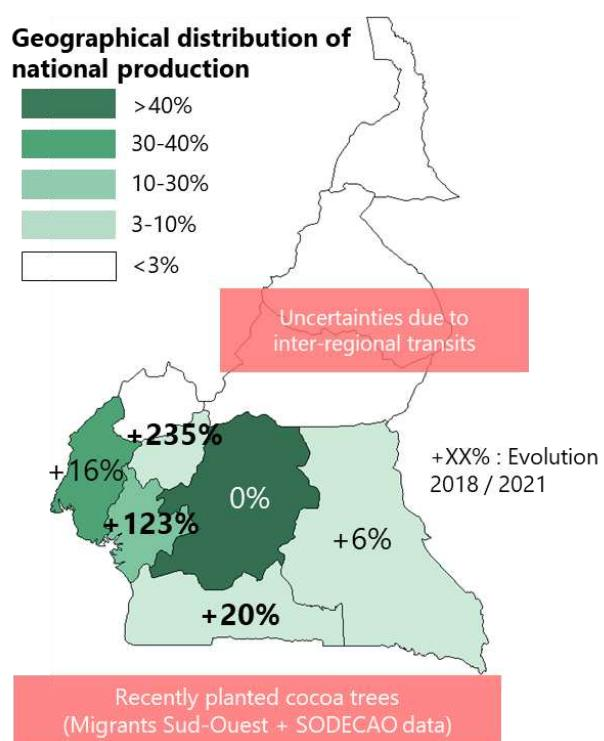

Data is available at a regional level from the annual crop reports of the ONCC. However, as these crop years are based on data collected at the LBA and cooperative level, they do not necessarily reflect regional production levels (see Figure 22). The Centre region appears to be the leading cocoa marketing basin, accounting for more than 40% of national production in the 2020-2021 season, a proportion that has remained very stable since 2017-2018. In 2020-2021, the South-West region accounts for more than 30% of marketed cocoa, ahead of the coast, which accounted for 14%. The coast is the second region with the strongest short-term growth (+123% compared to the 2017-2018 season) after the West region (+235%), but whose contribution to national production remains marginal.

As a result of the conflicts in the West, several hundred thousand people have fled the North-West and the South-West regions for neighboring countries or for other parts of the country38 . The reconfiguration of cocoa production is not yet fully visible.

### 3.2. Deforestation dynamics related to cocoa and other agricultural production

The Forest Law Nº 94-01 of 20 January 1994, which establishes the legal framework for forest management in Cameroon, defines the National Forest Estate (NFE) into a Permanent Forest Estate (PFE) and a Non-Permanent Forest Estate (NPFE). The PFE is intended to remain as forest or wildlife habitat, which must cover 30% of the

*Figure 25: Cocoa production by region and evolution since 2017-2018.* 

38 See: https://reporting.unhcr.org/sites/default/files/gr2019/pdf/GR2019\_French\_Full\_lowres.pdf.

territory (1994 Forest Law). The DFnP consists of forest land that can be converted, subject to a management plan accepted by the State39 .

Compared to West African countries, deforestation has been rather low in Cameroon since the 1990s even if the available data remain largely questionable whether it is the FAO data cited in the introduction or the Global Forest Watch which announces a loss of tree cover of 5% between 2000 and 2020. As such, a summary analysis of forest monitoring initiatives in Cameroon which will also be the subject of future Cocoa Talks is appended.

[Figure 26](#page-35-0) represents the different forests of the PFE that appear to date to be relatively well protected from deforestation. The moderate growth of cocoa production has had only a limited impact on deforestation as a result. It can be seen from the map of the forest estate, most of the forest in the east (the largest forest region in the country) has a status of reserve or forest concession. Cocoa expansion is therefore limited by spatial competition with the forestry sector (see [Figure 26\)](#page-35-0).

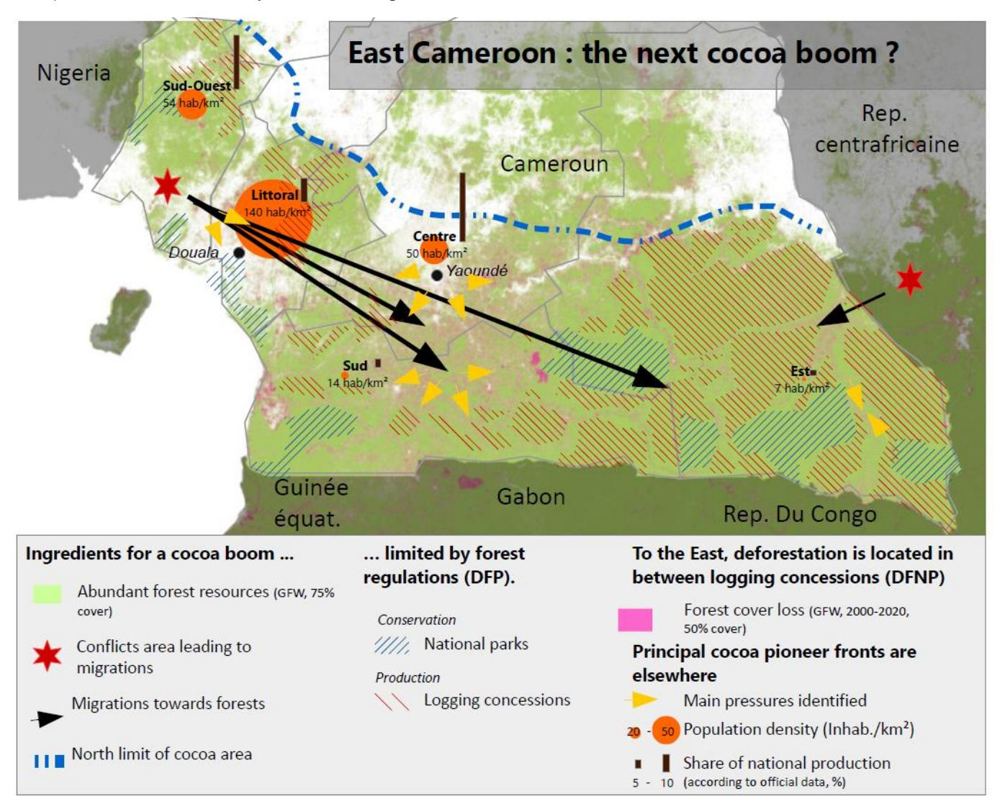

There are, however, signs of potential growth in the future. Cocoa production could be stimulated on the one hand by a risk mitigation strategy from exporters who consider CÙte d'Ivoire and Ghana to be risky and would turn more to Cameroon (and other African countries such as Nigeria, Sierra Leone, Liberia or Congo) to diversify their supply. On the other hand, the increasing worldwide demand for cocoa, particularly with the emergence of

*Figure 26: Map summarising the elements favouring or limiting a possible cocoa boom*

39 See: http://pdf.wri.org/cameroon\_forest\_atlas\_v3\_francais.pdf

new markets (emerging countries)40 could, in the long term, encourage a rise in prices as an incentive to extend cocoa cultivation in Cameroon.

Furthermore, the work of FranÁois Ruf has clearly shown that cocoa-related deforestation proceeds by successive booms and cycles: when certain factors are added together (level of forest fertility, appropriate land, sufficient labour, economic incentives, political will), deforestation can take place extremely out of sudden41 .

Nevertheless, the attractiveness of the sector to producers seems to be much lower than in West Africa. Indeed, the cost of inputs is higher in Cameroon due to limited public sector support, while a sustained demand for food crops and palm oil has so far encouraged producers to turn their investments of time and land towards these crops for the national and sub-regional market more than towards cocoa. The fact that food crops are a more important factor in deforestation than cocoa has been extensively studied, for example, in 2017 a study by the Unique/IIASA/Rainbow consortium42 reviewed this area. Our interviews, particularly in the Moungo department, also confirmed the greater attractiveness of food and cash crops for the national and sub-regional market.

Finally, as presented below, the drivers and trends of cocoa-related deforestation appear to be limited today, but it remains crucial to remember that the risks vary depending on the territory (see Error! Reference source not found.).

| Estimation of deforestation risks by region according to the "forest boom" criteria (Ruf, CIRAD) |                |                           |                   |                        |  |
|--------------------------------------------------------------------------------------------------|----------------|---------------------------|-------------------|------------------------|--|
| Région                                                                                           | Tendance cacao | Level of forest fertility | Appropriable land | Amount of labour force |  |
| Central                                                                                          | +++            | +                         | -                 | ++                     |  |
| South-West                                                                                       | -              | +                         | -                 | -                      |  |
| Littoral                                                                                         | +              | +                         | -                 | +                      |  |
| South                                                                                            | ++             | ++                        | +                 | -                      |  |
| East                                                                                             | ++             | ++                        | +                 | -                      |  |

*Figure 27: Analysis of deforestation risks by region for the main cocoa-producing regions*

Coastal regions are most at risk for deforestation in the medium term due to their strong connection to the market (proximity to the port of Douala), their high forest fertility reserves, and the large flows of internally displaced persons43 from the Southwest. These IDPs have an important tradition and know-how in cocoa farming,

40 See: https://www.globenewswire.com/news-release/2021/12/13/2350863/0/en/Global-Cocoa-Market-Is-Expected-to-Reach-15-5-billion-by-2027- Allied-Market-Research.html

41 See : Ruf, FranÁois. Cocoa Booms and Crises: The Dizziness of Brown Gold. Economie and dÈveloppement. Montpellier : Paris: CIRAD-SAR ; Karthala : MinistËre de la coopÈration, 1995.

42[https://chm.cbd.int/api/v2013/documents/9AC174A3-DA9D-FD8C-764C-](https://chm.cbd.int/api/v2013/documents/9AC174A3-DA9D-FD8C-764C-E2691FA90EE8/attachments/205693/Rapport%20Provisoire%20Moteurs%20DD.pdf)

43 [https://reliefweb.int/sites/reliefweb.int/files/resources/CMR-Stats\\_April\\_2022.pdf](https://reliefweb.int/sites/reliefweb.int/files/resources/CMR-Stats_April_2022.pdf) 

which encourages them to invest rapidly in the establishment of new cocoa plots as soon as the local populations and customary authorities give them access to land.

### 3.3.No trend towards downgrading of concessions

The current forest classification in Cameroon limits the possibilities for expansion of cocoa plantations in a large part of Cameroon's forests, which are currently under the status of Permanent Forest Domain. A medium-term risk is that the profitability of logging concessions may decline related to other activities (cocoa, oil palm, rubber, mining), prompting the government to downgrade some concessions from PFE to PFL. Some accounts seem to indicate that several logging companies are having difficulty making their operations profitable: subsidiaries of the BollorÈ group have been liquidated (for various reasons apart from economic ones)44 , Rougier has gone bankrupt45, Wijma has sold a sawmill46, and Pallisco is reportedly not very profitable.

As for the economic factor, it is difficult to assess the real dynamics of the timber market in Cameroon. According to some stakeholders, companies in the sector have experienced significant difficulties over the past ten years, with parafiscal levies undermining business models, particularly in the East.

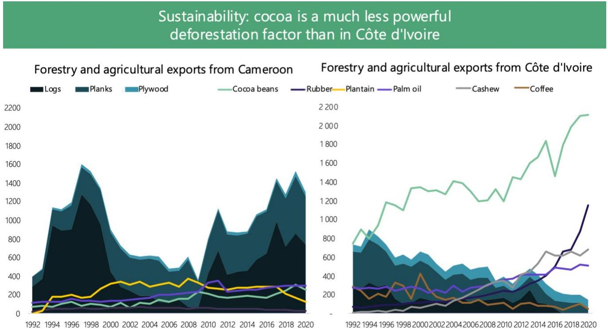

**Sustainability: cocoa is a much less powerful deforestation factor than in Côte d'Ivoire**

In contrast to this evidence, customs data (UN Comtrade) show continuous growth in the sector in recent years (see Error! Reference source not found.). Between 2010 and 2020, timber exports of all categories have increased by a factor of 1.6. While downgrading does not appear to be completely impossible, in the short term the risk of a slowdown in the timber industry seems limited. The interviews did not point to any significant downgrading of concessions.

*Figure 28: Comparison of forestry and agricultural exports from Cameroon and CÙte d'Ivoire in volume since 2000. Note: export data, except for palm oil which is production data (domestic consumption first). Unit: in thousands of tonnes. Sources: UN Comtrade (FAO for palm oil production data).* 

44 See: https://reporterre.net/Bollore-quitte-l-Afrique-apres-avoir-exploite-la-foret.

45 See: https://www.lemonde.fr/afrique/article/2018/07/20/le-negociant-en-bois-rougier-cede-ses-filiales-au-cameroun-et-en-

centrafrique\_5334163\_3212.html.

46 https://www.investiraucameroun.com/foret/2012-11910-l-exploitant-forestier-neerlandais-wijma-ferme-une-de-ses-scieries-au-cameroun

Furthermore, the general pattern of agricultural and forestry exports in Cameroon is very different from that seen in CÙte d'Ivoire. In Côte d'Ivoire, the volume of timber exports has gradually decreased, while the volume of agricultural exports has increased.

In Cameroon, growth in cocoa exports is slow whilst timber exports have continued to grow. However, a trend that may be more worrying for Cameroon's forests is the growth of palm oil production (primarily for domestic consumption).

Finally, in concordance with FranÁois Ruf's analysis of deforestation booms, the infographic below analyzes the presence or absence of key factors that could lead to an acceleration of cocoa-related deforestation in Cameroon.

While the land reserve remains large, there are few economic incentives for cocoa production to expand rapidly. In addition, the availability of labour, although growing, is oriented towards a variety of other activities (commercial food production, mining, migration to the oil-producing countries of the Congo basin). Unlike in CÙte d'Ivoire or Ghana, cocoa does not play a dominant role in deforestation in Cameroon, which is highly multifactorial.

Finally, it should be noted that in CÙte d'Ivoire the expansion of cocoa at the expense of forests is also the result of a strong policy choice by successive governments, linked to a post-colonial trade structure47 . Until now, the Cameroonian government has chosen policy that are much more balanced between promoting cocoa farming, other agricultural sectors, and sustainable forestry.

| Are the deforestation factors of the Ivory Coast present in Cameroon? |                |                                                                                                                                                                                                                                              |
|-----------------------------------------------------------------------|----------------|----------------------------------------------------------------------------------------------------------------------------------------------------------------------------------------------------------------------------------------------|
| Available forest spaces...                                            | Yes            | Well-preserved <b>forest areas</b> (42% of Cameroon's surface), sources of fertility                                                                                                                                                         |
| +                                                                     |                |                                                                                                                                                                                                                                              |
| Appropriable land areas                                               | East and South | East: very low population density (17 inhabitants / km 2 in 2010) ... but areas largely under forest concessions (DFP). South: 15 inhabitants / km 2 and appropriable land                                          |
| +                                                                     |                |                                                                                                                                                                                                                                              |
| And an available workforce                                            | In progress?   | Migration from the southwest and northwest and strong internal population <b>growth</b> , Central Africa migration (a proni marginal) <u>But</u> a labor force occupied with <b>other activities</b>                                      |
| +                                                                     |                |                                                                                                                                                                                                                                              |
| Macroeconomic incentive to plant cocoa                                | Still weak     | <ul> <li>Crop perceived as <b>less profitable</b> than palm (or some food crops)</li> <li><u>But</u> Changes in logging =&gt; open field for clearing?</li> <li>Political will to increase low impact production</li> </ul>                  |
| +                                                                     |                |                                                                                                                                                                                                                                              |
| A favorable international environment                                 | Uncertain      | <ul> <li>Cocoa price <b>volatility</b> remains high + CIV and Ghana continue to increase their <b>oversupply</b> + inflation 2021/2022 does not concern cocoa</li> <li><u>But</u> continued growth in <b>international demand</b></li> </ul> |

The impetus for several REDD+ initiatives48 is the revival of forest carbon markets, as well as the central role played by wood valorisation in the country's forested areas – despite the ambiguity of the national framework.

*Figure 29: Summary of the elements favourable or unfavourable to a deforestation boom due to cocoa in Cameroon*

47 Ongolo, Symphorien, Sylvestre KouamÈ Kouassi, Sadia ChÈrif, and Lukas Giessen. "The Tragedy of Forestland Sustainability in Postcolonial Africa: Land Development, Cocoa, and Politics in CÙte d'Ivoire." Sustainability 10, no. 12 (December 2018): 4611. https://doi.org/10.3390/su10124611.

48 See: https://www.iucn.org/fr/r%C3%A9gions/afrique-centrale-et-occidentale/notre-travail/les-programs-pays-dans-la-zone-du-paco/programmecameroun.

New regulatory (such as the ECPR) and technological tools (detailed remote sensing for fine-grained deforestation monitoring) could further contribute to strengthen this political will.

### 3.4. The economic and social sustainability of Cameroonian cocoa 3.4.1. A relatively higher cocoa price than in West Africa, but an activity considered risky and unprofitable by producers

At first glance, cocoa appears to be a profitable investment for Cameroonian farmers. The price incentive in Cameroon is higher than in other producing countries, with farm-gate prices varying between 700 and 1,210 FCFA in the 2020-2021 season. CÙte d'Ivoire and Ghana have guaranteed prices (1,000 FCFA and 978 FCFA respectively, in 2020-2021), but these guaranteed prices are often far from those in force: a difference of around 200 FCFA/kg in CÙte d'Ivoire during the 2020/2021 season, according to NitidÊ's surveys conducted there.

There is also a difference in Cameroon between the price announced by the ONCC and the price actually paid to the producer. This is around 50 to 100 CFA francs depending on the production region and corresponds to the difference between the price paid at the port of Douala and the farm-gate price. Therefore, why do producers feel that cocoa is not or not very profitable?

An analysis focusing only on prices, however, masks two aspects of the problem.

The first is qualitative: in general, cocoa farming requires considerable work and a significant input of labour, while the risks are also significant49 . Many of these risks apply to all cocoa farmers, regardless of nationality, and are not new: diseases, theft, small rainfall, price volatility, etc. External risk factors tend to be stronger in Cameroon, where the market is more liberalized than elsewhere, and where producers feel the full force of price variations. There are no tools to compensate inter-annual price changes.

The other aspect is structural. William Pokam Mba, a Cameroonian climate expert and one of the scientific editors of the sixth report of the Intergovernmental Panel on Climate Change (IPCC), recalls one of the report's conclusions: rainfall will decrease in the subtropics and extreme events (droughts and floods) will become more frequent50 . Cameroonian producers may already be suffering. Although the association between specific climatic events and global climate change is not always self-evident, extreme climatic events have already had a strong impact on producers: the drought (almost no rain from November 2020 to May 2021) prevented many cocoa flowers from reaching maturity. During the last season, in August 2021, producers in the Central region still had no beans to sell. As a result, farmers lost a significant part of the production and had to take out expensive loans from informal actors. These droughts also make nursery work more difficult and increase the mortality rate of young plants: according to SODECAO, droughts are responsible for a loss of 40 to 50% of plants per year51 .

The fact that plants such as oil palm, rubber or cassava are more resilient to climatic hazards reinforces their comparative advantage over cocoa for producers who have no economic incentive to invest in this production.

Cameroonian producers have therefore developed less profitable but more resilient modes of production (see Figure 30).

49 A work by VÈronique Alary already highlighted this point in 2000: Alary, VÈronique. Les cacaoculteurs camerounais face aux risques. Montreal: L'Harmattan, 2000.

50 See an interview with William Pokam Mba: https://vert.eco/articles/rapport-du-giec-certains-dereglements-climatiques-apparaissent-irreversibles. Executive Summary of the IPCC Sixth Report: Masson-Delmotte, ValÈrie, and al, eds. Summary for policymakers. In Climate Change 2021: The Physical Science Basis. Contribution of Working Group I to the Sixth Assessment Report of the Intergovernmental Panel on Climate Change. Cambridge University Press, 2021.

51 See: https://www.investiraucameroun.com/agriculture/2104-16270-en-raison-des-changements-climatiques-le-cameroun-perd-40-a-50-jeunes-plantsde-cacaoyers-par-an

| Cameroonian farms appear on average less profitable but more resilient than Ivorian farms |                  |        |               |          |
|-------------------------------------------------------------------------------------------|------------------|--------|---------------|----------|
| Country                                                                                   | Production costs | Yields | Selling price | Revenues |
|                                                                                           | FCFA/kg          | Kg/ha  | FCFA/kg       | FCFA/ha  |
| Young plantation with high price                                                          |                  |        |               |          |
| ■                           | 400              | 900    | 1000          | 540 000  |
| *                           | 400              | 600    | 1100          | 420 000  |
| Old plantation with high price                                                            |                  |        |               |          |
| ■                           | 550              | 600    | 1000          | 270 000  |
| *                           | 400              | 400    | 1100          | 280 000  |
| Old plantation with low price                                                             |                  |        |               |          |
| ■                           | 550              | 600    | 750           | 120 000  |
| *                           | 400              | 400    | 750           | 140 000  |

As seen in figure 30, a comparison of 'typical' cocoa farms, the profitability of Cameroonian farms is less affected by price declines than that of Ivorian farms.

However, it should be remembered that higher cocoa prices do not necessarily imply higher profits52 . One third of the costs borne by the producer are for insecticides (8%), fungicides (12%) and fertilizers (15%). While the cost of insecticides and fungicides is decreasing in the long term (with the production of cheaper generics, particularly in China), the cost of fertilizers is increasing and is expected to continue to do so, particularly due to the rise in energy prices.

Poverty reduction strategies in the cocoa sector must therefore be based both on tools for reducing production costs and improving productivity in the long term (organic fertilization, varietal improvement, accident insurance for farm assets) and on stabilizing prices at higher levels than in past decades.53

### 3.4.2. Risks affect small, isolated producers and certain agroecological hotspots more intensely

Guillaume Lescuyer proposes to distinguish five types of farmers (see Figure 31) according to criteria of average area per household, level of external support and type of crop (with or without shade)54 .

Logically, the most affected producers are small producers, and moreover small producers with little external support (200,000 households according to Guillaume Lescuyer).

These farmers do not have the means to buy inputs and irrigate the fields, nor do they have the financial resilience to cope with years of underproduction. Lacking cash, farmers have no choice but to contact informal moneylenders (often coxeurs) to meet living expenses and management costs (including school fees in September).

*Figure 30: Comparison of profitability and resilience of cocoa production between a typical farm in CÙte d'Ivoire and Cameroon* 

52 See the annex for a smallholder shade-grower operating account table with help for understanding a smallholder management account in more detail (from Lescuyer, 2020).

53 For an analysis of producers' management accounts by archetype, see the article: Lescuyer, Guillaume, and Simon Bassanaga. "Positive Influence of Certification on the Financial Performance of Cocoa Production Models in Cameroon." Frontiers in Sustainable Food Systems 5 (2021). https://www.frontiersin.org/article/10.3389/fsufs.2021.743079.

54 Lescuyer, Guillaume, Laurence Boutinot, Pietro Goglio, and Simon Bassanaga. "Analysis of the cocoa value chain in Cameroon. Report for the European Union, DG DEVCO. Value Chain Analysis for Development Project (VCA4D CTR 2016/375-804)." Monograph. CIRAD, 2020. https://agritrop.cirad.fr/595017/.

| Characteristics                  | Small producers   |                |                |            | 4-Medium size producers | 5-Large producers  | TOTAL       | Official data (MINADER, ONCC) |
|----------------------------------|-------------------|----------------|----------------|------------|-------------------------|--------------------|-------------|-------------------------------|
|                                  | under shade       |                | full sun       |            |                         |                    |             |                               |
|                                  | 1-Without support | 2-With support | 3-With support |            |                         |                    |             |                               |
| Average surface                  | 1,5               | 2,5            | 3,0            | 12,0       | 25,0                    |                    |             |                               |
| Dry cocoa beans yield (kg/ha/yr) | 280               | 600            | 500            | 700        | 150                     |                    |             |                               |
| Number of housholds              | 200 000           | 45 000         | 45 000         | 3 000      | 300                     | <b>293 300</b>     | 300-500 000 |                               |
| Total production surface (ha)    | 300 000           | 112 500        | 135 000        | 36 000     | 7 500                   | <b>591 000</b>     | 600 000     |                               |
| Total cocoa beans production     | 84 000 000        | 67 500 000     | 67 500 000     | 25 200 000 | 1 125 000               | <b>245 325 000</b> | 241 029 519 |                               |

In addition to socio-economic distinctions, there is geographical and ecological variability. Firstly, not all areas of Cameroon are equally exposed to climatic risks (see Figure 31). [Figure 32](#page-41-0) shows that the forest-savanna transition zones, the north of the Mbam-et-Kim or the Lom-et-DjÈrem, for example, which are highly affected by both deforestation and climate change, are experiencing forms of land impoverishment55 . Also, the greater the deforestation, the fewer trees able to play their role as climate stabilizers56

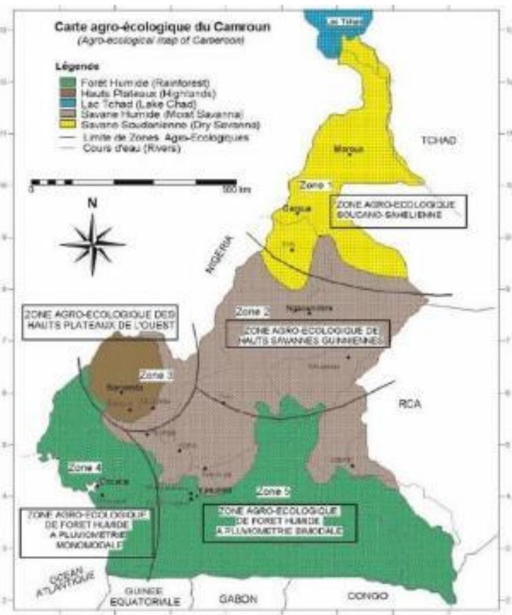

This effect is felt by farmers in Mbam-et-Kim, near YaoundÈ, who report more severe droughts as the forests shrink. Agroforestry, which is better established in Cameroon than in West Africa for both historical and cultural reasons, can help to compensate for climate disruption and preserve the soil57 . The proportion of small-scale, full-sun production is much lower than in West Africa: twothirds of cultivated hectares are under shade58 . Nevertheless, the more insecure producers are, the more they are encouraged to develop full-sun cocoa production, which is more profitable in short term.

The other facet of geographical variability is related to physical infrastructure: producers in the eastern regions (e.g. around Yokadouma) and in the south are often less connected to transport networks; they are more difficult to access and are generally less supported.

*Figure 32: Map of Cameroon's agroecological zones. Source: Source: Ambassa-Kiki, 2000.*

*Figure 31: Archetypes of cocoa farmers according to Lescuyer (2020)* 

55 See : ResearchGate. "Figure 1. Presentation of the Dense Rainforest Zone..." Accessed March 23, 2022. https://www.researchgate.net/figure/Presentationde-la-zone-de-foret-dense-humide-a-pluviometrie-bimodale-du-Cameroun\_fig1\_236212458.

56 See : P. Bernard Tinker, J. S.I. Ingram and S. Struwe (1996). Struwe (1996) "Effect of slash-and-burn agriculture and deforestation on climate change". Agriculture, Ecosystems and Environment. Volume 58, pp. 13-22.

57 See: https://www.cifor.org/knowledge/publication/6867/

58 Lescuyer and al, 2020.

And : Jagoret, P. "Analyse and Èvaluation de systemes agroforestiers complexes sur le long terme: application aux systemes de culture a base de cacacaoyer au Centre Cameroun". These, These doctoral thesis -- Agronomy. Functioning of natural and cultivated ecosystems, 2011. http://publications.cirad.fr/une\_notice.php?dk=560345.

Data from 200759 allows for a comparison (Figure 33) of the top three cocoa-producing regions: the South-West, the Centre and the South (although the situation in the East is probably similar to that in the South). These data highlight the territorial disparities in cocoa farmers' income. On average, cocoa income represented about half (49%) of household income in 2010, followed by food production (21%), off-farm activities (12%) and fruit production (6%).

In 2017, the average income per worker on a cocoa farm was CFAF 145,933 per year, which is above the poverty line in Cameroon. However, nearly 69% of households living from cocoa are below the poverty line (136,236 FCFA). Therefore, there are major disparities between households and between regions. The South-West is comparatively richer because the land is more fertile, and the region has a longer history of cash crops. The marketing network was therefore better established there until the current security crisis.

While some cocoa farms therefore enable producers to escape poverty, many farms remain in a precarious status.

### 3.4.3. Child labour: an important issue, but less worrying in Cameroon than in West Africa

Considering the above economic constraints, we need to understand the prevalence of child labour in Cameroonian agricultural production, and therefore in cocoa production.

In 2012, Understanding Children Work (UCW) estimated that 1.7 million children aged 6-14 were economically active in all sectors. This corresponds to 40% of this age group61. As for adolescents aged 15 to 17, 58% of them are concerned. This data should be seen in the context of Cameroon's poverty level: 37% of Cameroonians live with less than 931 CFA francs per day in 201462 and 90% of this population live in rural areas. Families with low incomes and insufficient social security coverage are structurally dependent on child labour. However, the level of poverty does not explain everything: the 40% rate is higher than one would expect in relation to the country's standard of living: it is like that observed in CÙte d'Ivoire or Burkina Faso, while Cameroon's GDP per capita is higher63 .

It should also be noted that cocoa is far from being the main crop responsible for child labour. Only 8% of agricultural workers say they grow cocoa (352,127), while 2% of children are involved in cocoa farming (31,033)64 . This is a significant figure, but it must be put into perspective with child labour in other agricultural sectors: in 2012, 78% of children worked in cereal, tuber, and banana crops. These data may therefore raise questions about the relevance of a "*child labour*" approach specific to the cocoa sector.

|  | Region                                                   | Camerooon | South West | Centre | South  | East |
|---------------|----------------------------------------------------------|-----------|------------|--------|--------|------|
|  | Average income per person (FCFA/year) 60      | 145 933   | 228 263    | 87 257 | 53 504 | ??   |
|  | of households below the poverty line among cocoa farmers | 69%       | 49%        | 83%    | 91%    | ??   |

*Figure 33: Socio-economic data of cocoa farmers by region* 

59 See: Folefack, Denis. "Poverty and Share Revenue in the Cameroon Cocoa Zone. Tropicultura 28, 1 January 2010.

60 The average household size in Cameroon in 2005 was 5.1. Household size was fairly homogeneous between the different regions: South West: 4.6; Centre: 4.8; South: 4.1; East: 5.2. See: Mbarga, Bernadette. "Socio-demographic situation of ordinary households - 3rd RGPH. BUCREP, 2010.

61 Background Paper: Understanding Child Labour, Cameroon, 2012, https://documents1.worldbank.org/curated/pt/959591541772749154/pdf/WP-FRENCH-PUBLIC-ADD-SERIES-See-73756-travailenfants-Cameroun20130111-151632.pdf.

62 Cameroon Household Survey, National Institute of Statistics, 2018. See: https://afrique.le360.ma/autres-pays/societe/2018/12/15/24301-cameroun-plusde-8-millions-de-personnes-vivent-en-dessous-du-seuil-de-la-pauvrete-24301.

63 Understanding Child Labour, Cameroon, 2012.

64 Understanding Child Labour, Cameroon, 2012, p.41. According to the third Cameroonian Household Survey (ECAM 3), 2007.

Child labor undeniably exists in the cocoa sector, but less than in other agricultural sectors

Child labor in Cameroun is significant but not very well known

**40%** of children from 6 to 14 yo. worked in 2012 (1,7 millions). A ratesimilar to Côte d'Ivoire and Burkina Faso **58%** of teenagers from 15 to 17 yo. worked in 2012 (about 700 000 millions).

Child labor is related to the living conditions and the economic model of small producers 37% of Cameroon inhabitants lived in 2014 with less than 931 FCFA per day and per person (= poverty threshold of 2 USD/j/p with the change rate of 2014) Small producers lack the means to buy a more efficient equipment and to pay the workforce.

*Figure 34: Infographic on child labour in Cameroon in the cocoa and other agricultural sectors* 

The Cameroonian government and civil society currently seem less involved than other sub-Saharan African countries in the fight against child labour65 .

Most of the cocoa exporters' internal programs include child labour, and surveys of the population aim to provide information on the issue and raise awareness among producers. The most significant actions come from international organizations, sometimes partners of exporters (CARE, Plan International, ILO, UNICEF, Horizon Jeunesse, etc.).

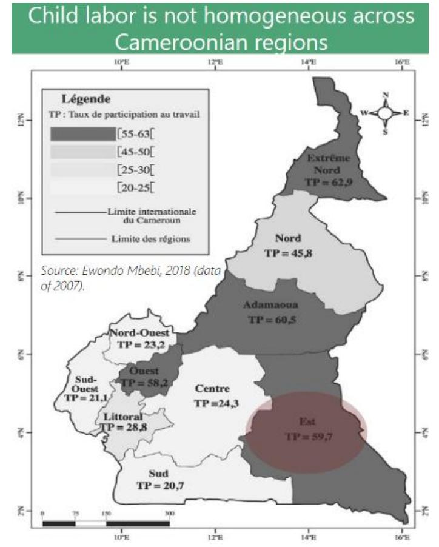

Finally, it should be noted that compared to other sub-Saharan African countries, the Cameroonian school system is very efficient and allows for an extremely high level of primary schooling66 . This high rate largely reduces the risks of the worst forms of child labour and of school drop-out for agricultural work.

In conclusion, although child labour exists in Cameroon (as in the majority of rural areas in the world), the risks of school drop-out and the 'worst forms of child labour' seem to be much lower than in West Africa, and the link with the cocoa sector seems relatively tenuous.

*Figure 35: Mapping rural child labour in Cameroon* 

65 International cocoa initiative, Annex 10.

66<https://www.afd.fr/fr/carte-des-projets/scolarisation-de-tous-les-enfants-camerounais>

# **4\_Sustainability programs. Scattered actions towards harmonized governance**

#### 4.1. Private sustainability programs

The issue of sustainability in cocoa production received little attention in Cameroon until the early 2010s. Deforestation and child labour, which drew attention to the cocoa sector in West Africa in the 2000s, were much less prevalent and urgent in Cameroon. Consequently, sustainability approaches in this country mostly developed through the internal programs of large multinational trading groups and the implementation of certifications of producer cooperatives.

Until 2019, certified producer co-operatives were mainly certified with the UTZ certification67 whose sustainability indicators could be considered relatively low and not very robust. With the merger of UTZ and the Rainforest Alliance, the new common standard, which largely takes over the indicators of the RA certification, promotes an increase in sustainability targets for certified cooperatives and their customers.

#### 4.1.1. Rainforest Alliance certification as a primary sustainability tool

UTZ certification in 2016 covered only 3% of production68 , RA certification was absent from the country as well as Fairtrade and organic farming certification.

The expansion of the sustainability and certification programs of the multinational cocoa bean traders through their export channels has resulted in a significant increase in the number of certified producers and cooperatives over the past 3 years. While UTZ merged with RA in 2017, resulting in the transition of UTZ-certified producers to the RA standard and a major compliance task for the cooperatives, the number of certified cooperatives has increased significantly. By 2020-2021, 27% of Cameroon's production was covered by Rain Forest Alliance certification.

There has been a strong rise in certification programs due to the Cocoa and Forest Initiative, which has caused major multinational traders and chocolate manufacturers to invest heavily in their traceability and sustainability programs.

Since RA certification is the primary tool used by these large groups to implement their sustainability strategies and those of their customers (the chocolate makers), they have invested heavily in this approach. The latest RA standard includes the following obligations (see Figure 36).

67 See in particular on certification: Lescuyer, Guillaume, and Simon Bassanaga. "Positive Influence of Certification on the Financial Performance of Cocoa Production Models in Cameroon. Frontiers in Sustainable Food Systems 5 (2021). https://www.frontiersin.org/article/10.3389/fsufs.2021.743079.

68 See: Nlend Nkott, Anny LucrËce, Syndhia MathÈ, and Ludovic Temple. "Multi-level analysis of the brakes on the adoption of cocoa certification in Cameroon". Rural Economy 370, nᵒ 4 (2019): 81-99.

| Category               | Rainforest Alliance Standard Audit and actions |
|------------------------|------------------------------------------------|
| Child labour           | Prohibition. Obligation to identify and        |
| Deforestation          | No deforestation from 1 er January 2014 (FAO   |
| Agroforestry           | At least 30% shade cover on the farm.          |
| Premium                | Premium of 50 FCFA paid per kg.                |
| Production practices   | Integrated pest management to reduce           |
| Sales and traceability | Physical segregation to the port of export     |
|                        | Mass balance at the processing level           |

*Figure 36: Main sustainability indicators and standards of the RA standard* 

In 2021/2022 season, the certification has provided different specifications depending on the country where the cocoa is produced (CÙte d'Ivoire, Ghana, Cameroon or Nigeria). The objective is to encourage a transition towards sustainable practices and governance. It acknowledges the lead in this area of the two highly producing countries, CÙte d'Ivoire and Ghana. Cameroon and Nigeria are thus entitled to an adapted certification; the challenge is to encourage stakeholders to make a more massive commitment in these two countries. This approach differentiating certification is called "*The Farm and Chain of Custody Certification Policy for Cocoa*" published in April 2020 and revised on 15 December 2021 (see Figure 37) 69

| Obligations (not exhaustive) on Cameroon                                                                                                         | Obligations (not exhaustive) not concerning Cameroon                                                                                              |
|--------------------------------------------------------------------------------------------------------------------------------------------------|---------------------------------------------------------------------------------------------------------------------------------------------------|
| <i>Ensure that no production takes place in protected areas;</i> <i>Accepting visits from RA consultants and following the audit process.</i> | <i>Locate all producers, 30% with polygons;</i> <i>Keep a register of members;</i> <i>Provide information on the risk of deforestation.</i> |

*Figure 37: Specificities of the AR specifications in Cameroon for the 2021-2021 season* 

AR certification still concerns a large proportion of private programs: 27% of Olam's production, 15% for Producam, 85% for Cargill and only 1% for Barry Callebaut. However, not all certified production is sold as certified. In fact, RA is declining globally, as evidenced by a decrease of 25% in certified producers, and by a drop of 8%70 in sales.

69 See: Rainforest Alliance, Farm Certification Policy, 2021: https://www.rainforest-alliance.org/wp-content/uploads/2021/07/POLITIQUE-CONCERNANT-LA-CERTIFICATION-DES-EXPLOITATIONS-AGRICOLES-ET-DE-LA-CHAINE-DE-TRACABILITE-POUR-LE-CACAO.pdf.

70 See: "Cocoa Certification Data Report 2020. Rainforest Alliance and Utz programs. Rainforest Alliance, May 2021. https://www.rainforest-alliance.org/wpcontent/uploads/2021/07/Cocoa-Certification-Data-Report-2020.pdf.

The development of RA certification is hampered by the stagnation of demand/acceptance by chocolate makers to pay certification premiums. As a result, some of the beans that are RA certified do not find a buyer. In Cameroon, this concerns between a third and half of the cocoa beans, which hinders the progress of certification at the field level (see the Error! Reference source not found.).

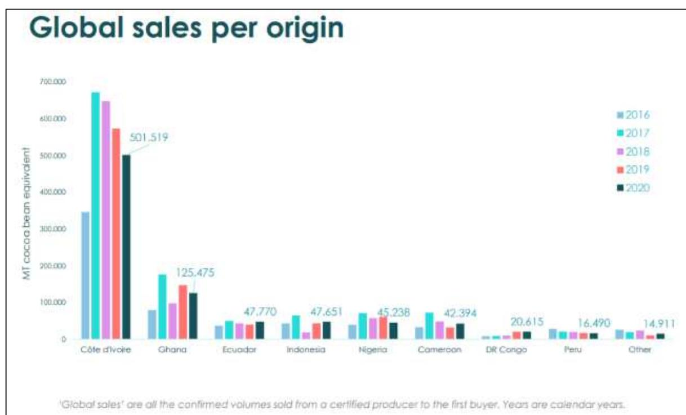

In conclusion, it can be said that the Rainforest Alliance certification is spearheading sustainability programs in Cameroon (as in West Africa). It has made good progress over the past 5 years but is facing a lack of demand on the international market.

As shown in Figure 39, volumes of RA-certified cocoa in Cameroon remain in the minority and are mainly carried out by the 'subsidiary' exporters of the large multinational trading groups that dominate bean trading in the country.

Under these conditions, the potential for growth in PLAR certification in Cameroon today seems relatively limited.

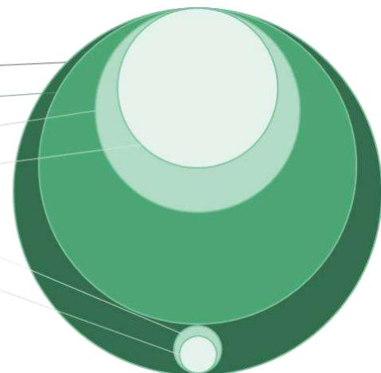

|                                    | Cameroon | Tons      |
|------------------------------------|----------|-----------|
| Production                         |          | 292 000   |
| Marketed by exporters from top 6*  |          | ≈ 216 000 |
| Certified by the top 6             |          | ≈ 91 000  |
| Sold as certified by top 6         |          | ≈ 55 000  |
| Certified by other players         |          | ≈ 5 000   |
| Sold as certified by other players |          | ≈ 3 000   |

\* In Cameroon: Telcar, OlamCam, Sic Cacaos, AMS, COTEC, Producam.

*Figure 39: Distribution of certified volumes as a proportion of Cameroonian production and weight of the 6 main multinational bean traders in purchasing and certification* 

*Figure 38: Sales of cocoa beans by origin. Source: RA Global Report 2020* 

#### 4.1.2. The organic sector: a rare certification in Cameroon

There is also a certified organic cocoa sector in Cameroon, and although it remains marginal, it could become a valuable instrument of sustainability. In the organic sector, identity is of vital importance, and in Cameroon support programs are beginning to blossom for organic farming.

Four cooperatives producing cocoa, among other agricultural products, are already certified organic by Ecocert: BioNatura (Littoral), Cam Value Petitgenet Fabrice (Centre), GIC Sondason (West), and Konafcoop (South-West)71 . Konafcoop has benefited from a partnership with the GIZ ProCisa program, including training on organic standards. At the beginning of 2021, 112 members out of 350 were organic. EcoCert is also supporting two cooperatives to become certified in the next couple of years: Agro Ekiembie SARL (Centre) and Scoop Bioclair (West). It generally takes three years of cultivation transition to move from conventional to organic cocoa. Organic certification must be renewed every year.

Although organic farming certification leads to a substantial improvement in producers' incomes (between 20 and 60% premium over the conventional price), it does not include requirements in terms of fight against deforestation or child labour. However, it provides a high level of traceability, and by combining with other certifications (for example, RA and/or Fair Trade) it can lead to the establishment of more precise sustainability indicators.

#### 4.1.3. Fair trade: an almost non-existent certification in Cameroon

According to the database available on the FloCert website72, there is only one Fair Trade certified cooperative in Cameroon: Konye Area Farmers Cooperative Society Ltd (KonafCoop), in the Southwest region. It has been exporting Fair Trade cocoa since 2011 to GEPA, a German chocolate manufacturer (https://www.lavoixdupaysan.net/cameroun-sud-ouest-la-cooperative-agricole-de-konye-opte-pour-laproduction-du-cacao-bio/). The cooperative of around 350 members has also benefited in recent years from a partnership with the GIZ's Green Innovation Centres for the Agro-Food Sector (ProCISA) project to develop its organic production.

#### 4.1.4. Internal sustainability programs of multinational cocoa traders

The large cocoa trading groups and chocolate manufacturers have developed their own internal specifications, which assist them with deciding on management rules, coordinating the indicators with their own sales and marketing strategies, creating their own database and, finally, determining the amount of premiums to be paid to cocoa producers.

Private sustainability programs are to be understood primarily because of a reputational requirement (in connection with the increasing pressure from consumers and the media) and a commercial requirement (on the part of the chocolate manufacturers). Thus, the commitments of the main chocolate brands (Mars, Hershey, Mondelez, NestlÈ, etc.) are reflected in the sustainability policies of the bean traders (exporters, importers, and millers). The chocolate makers themselves are seeking to improve their image with consumers and, under pressure from NGOs, are seeking to prevent reputational risk. The example of the "*Chocolate Scorecard*" illustrates this positioning issue for the major traders and chocolate makers73 .

Often, the sustainability programs of exporters and processors emphasize the same factors: economics (income of producers), social issues (child labour, inclusion of women) and environmental concerns (fight against

71 See: "Ecocert - Ecocert Directory". Accessed on 18 March 2022. http://certificat.ecocert.com/.

72 <https://www.flocert.net/fr/rencontre-flocert/nos-clients/>

73<https://www.chocolatescorecard.com/>

deforestation and preservation of biodiversity). Each exporter has its own tools (management support, deforestation monitoring), and some programs are used for commodities other than cocoa. Figure 41 shows the main programs of multinational bean traders and their progress in Cameroon, where data has been provided.

Barry Callebaut has shown a willingness to move away from certification programs74 . The group has developed its own sustainability program: Cocoa Horizon (COH), which is largely based on the RA specifications but with a lower premium paid to the producer (25 FCFA). The majority of the program is a *mass balance* approach with options for cocoa segregation (Cocoa Horizons Inside) and segregation with additional income for producers (Cocoa Horizons Plus). In Cameroon, COH covered 45% of production in 2020-2021.

The programs of Cargill, Olam and Theobroma (a subsidiary of the ECOM group) (via AMS) in Cameroon, on the other hand, are largely linked to RA certification (Figure 41).

In total, the production presented as "*sustainable*" in Cameroon is currently estimated at 110,000 metric tons, i.e., more than a third of production, and should increase further if we are to believe the exporters' announcements.

There is also the question of the transparency and reliability of this data. The groups generally share the location of their warehouses and, in the case of Cargill75 and Barry Callebaut76, maps of their supplier cooperatives are published online. The geolocation data of plots or farms is not public, and is considered strategic by exporters. As for the progress of the different sustainability indicators, access to information is uneven: Cameroon-specific indicators are not always public. Finally, sustainability programs are audited by companies that are selected and financed on an institutional level and there is no national or international oversight of these audits. However, investigations by Mighty Earth in CÙte d'Ivoire have shown that so-called sustainable production sites are not always free of deforestation77 .

| Programme Company Approach to sustainability Progress | in Cameroon          |
|-------------------------------------------------------|----------------------|
| and their communities through the                     |                      |
| promotion of sustainable and                          |                      |
| entrepreneurial agriculture, improved                 |                      |
| 45%                                                   | of the supply        |
| 5209                                                  | producers trained in |
| 100% traceability target (on direct supply)           |                      |
| 27%                                                   | of supply            |
| The Cargill Cocoa                                     |                      |
| Commitment to farmers and their                       |                      |
| 85%                                                   | of the supply        |

74 See the Barry Callebaut Cocoa Horizon methodology:

https://www.cocoahorizons.org/sites/www.cocoahorizons.org/files/Cocoa%20Horizons%20Methodology%20Summary.pdf.

75 See: https://www.cargill.com/sustainability/cocoa/partner-cooperatives.

76 See: https://www.barry-callebaut.com/en/group/forever-chocolate/sustainable-range/transparency-and-traceability-our-cocoa-supply-chain.

77 See: https://www.mightyearth.org/2021/02/18/mighty-earths-cocoa-accountability-map-3-0-reveals-47000-hectares-of-deforestation-in-prominentcocoa-growing-regions-of-west-africa/

| ECOM -                                      |                                                                                                                                                                                                                              |
|---------------------------------------------|------------------------------------------------------------------------------------------------------------------------------------------------------------------------------------------------------------------------------|
| Integrated Theobroma programme Beyond Beans | There is no specific sustainability Cocoa client of the centres of programme, but there is a sustainability excellence department. Beyond Beans puts forward the following principles: Dedicated partnership Skilled farmers |
| ETG (Cocoanect) (2020)                      | Resilient communities No information Healthy environment Beyond Beans develops projects adapted to                                                                                                                           |
|                                             | each community (such as access to                                                                                                                                                                                            |
|                                             | microfinance, river preservation, women empowerment).                                                                                                                                                                        |

*Figure 40: Internal sustainability programs of multinational cocoa bean traders operating in Cameroon* 

### 4.1.5. Other initiatives to measure and standardise cocoa sustainability

By signing the roadmap for sustainable cocoa on January 2021, Cameroonian stakeholders are committing to reduce the impact of cocoa farms on the forest. With standardised criteria yet to be defined, the goal is to achieve 100% traceable cocoa production by 2025 and 100% sustainable cocoa production by 2030.

At the continental level, as mentioned in the introduction, at the initiative of CÙte d'Ivoire and Ghana, the African Organization for Standardization (ARSO) has published the "*African ARS 1000 Sustainable and Traceable Cocoa Standard*". During the discussions on the roadmap for sustainable cocoa, the Cameroonian government indicated that it intends to incorporate this standard into its national law. The roadmaps objectives could therefore be standardised based on this norm.

The ECPR against imported deforestation can strengthen the unification of sustainability agendas at the level of consuming countries, at least initially with regard to the environmental dimension.

In the draft regulation, the deforestation criterion is clarified with a single cut-off date (31 December 2020), forests are defined according to FAO standards, and traceability is defined by geo-referencing on a point or polygon this criterion is still being discussed. The European Union has further plans for legislation regarding economics and social matters, which could have a similar effect on private sustainability programs.

At international level, the private standard ISO 34101 has also defined the requirements for sustainable and traceable cocoa. This standard, which was published in 2019, is the result of collaboration between CEN (European Committee for Standardization) and ISO (International Organization for Standardization). Managing cocoa (drying, sorting, and packaging cocoa bean accounts for one part of the standard; performance (environmental, social and economic) accounts for another; and traceability and certification for the third. Depending on the level of progress of the certified group, the standard is divided into three levels of requirement (threshold, high and medium).

Further, proposals have been made to standardize other sustainability criteria. The *Living Income* Initiative aims to set a price for cocoa that will allow producers to meet their basic needs. The methodology proposed by this initiative is to establish a country-specific benchmark. The Global Living Wage Coalition, for example, has estimated it for Cameroon at 155,746 FCFA (\$269) per month, using the Anker Living Income Reference Values methodology78 .

78 See: https://globallivingwage.org/wp-content/uploads/2021/01/Rural-Cameroon-LI-Reference-Value.pdf.

This is an assessment of the income needed, at the national level (with a distinction between rural and urban), to meet basic needs, such as food, water, shelter, education, health care, transportation, clothing and other necessities, as well as provisions for unforeseen events.

Other international initiatives could help accelerate the unification of sustainability programs, while increasing transparency and providing reliable and rigorous monitoring:

- *The NGO Mighty Earth produces cocoa responsibility maps in CÙte d'Ivoire and Ghana, based on data provided by private companies. This initiative does not yet exist in Cameroon;*
- *The VOICE network (a global network of NGOs and trade unions working on sustainability in the cocoa sector) conducts an annual Cocoa Barometer on the state of sustainability in the cocoa sector.*
- *The Australian NGO Be Slavery Free, together with a network of NGOs and independent experts, initiated the Chocolate Scorecard mentioned above, which compares the sustainability programs and transparency levels of the major bean trading and chocolate production groups*
- *In Europe, many private initiatives such as the start-up Yuka79 or public initiatives such as the REVALIM programme80 calculate an "ecoscore" on everyday consumer products, including their environmental impact in the countries of production.*

Numerous initiatives, programs and certifications make it more complex to not only define sustainability, but to measure and monitor it.

### 4.2. Public authorities' approaches to sustainability

Since Cameroon liberalized its cocoa sector in 1994, the country's public policy has focused on stabilising prices (set by the National Commodity Marketing Board (ONCPB) through a compensation fund system), increasing production (distribution of seedlings and inputs) and, to a lesser extent, improving quality. It had limited results due to the use of a single price when purchasing from producers.

The sector went through a major reorganisation after the liberalisation phase between 1988 and 199481, during which a guaranteed minimum price was published but was no longer subject to a stabilisation mechanism, and production support decreased dramatically. The ONCC and CICC took over supervision, and a support fund for the sector was established (FODECC), in addition to the SODECAO state company, which produced and marketed improved seeds and seedlings.

Since 1994, the ONCC's role has been mainly to control and supervise the sector82, including the publication of statistics, the administration of export quality controls, the approval of operators and the carrying out of studies and representation in international sectoral organizations (e.g. ICCO). For its part, the CICC has mainly an interprofessional regulatory role (advice on the approval of LBAs and exporters, mediation in the event of disagreements between players) and the promotion of structuring (cooperatives and professional associations for the other links in the sector). In addition to the Ministry of Agriculture, these two institutions sit on the Board of Directors of both the FODECC (founded in 2004 and which finances projects in the sector) and the SODECAO (which guarantees the production of plants and seeds).

Until the end of the 2000s, the programs carried out by the ONCC and CICC were predominantly focused on promoting cocoa farming (training, facilitating access to SODECAO seeds and seedlings) and structuring producers (awareness-raising and training on structuring producers into cooperatives).

79 [https://yuka.io](https://yuka.io/) 

80<https://www.inrae.fr/actualites/revalim-creation-dun-groupement-dinteret-scientifique-levaluation-environnementale-produits-agricoles-alimentaires> 81 [https://regionetdeveloppement.univ-tln.fr/wp-content/uploads/R4\\_Alary.pdf](https://regionetdeveloppement.univ-tln.fr/wp-content/uploads/R4_Alary.pdf) 

82<https://oncc.cm/mission-and-vision>

#### 4.2.1. The CICC's actions

Mieux structurer les organisations de producteurs à la base pour garantir une meilleure qualité des produits. Organiser les ventes groupées des produits pour plus de revenur aux producteurs. Au bout du compte, la collecte plus assée des statistiques, et un dibut de solution à la problématique de la traçabilité dans la commercialisation. Ainsi se décline toute la noblesse du programme d'appli à l'organisation de la commercialisation interne.

It was not until the 2010s that the CICC began to include ambitions for traceability and sustainability in the coca sector as a result of pressure coming from exporters and grinders affiliated with multinational cocoa traders. Up to now, these approaches have been based on several programs, including AOC, NEWGEN, OC4, BP and CERTIF, which are described below (presentation taken from the CICC website)83 .

Prameuvoir la trajacibité de la filère par l'implication effective des jeunes dans la culture darciciga et du café à travers la formation, la mise à disposition d'instrants et de référents, l'encadrement et l'appui techniques, le parmaigle pour la cintification. Un suivi personnaiste pendant trois ans accorsigant l'insertion des jeunes insus des contres de formation agricoles pour devenir de véritables professionnels dans la culture du cacao et du café. Avec NEW GENERATION, le producteur de demain est jeune, bien formé, bon gestionnaire, aguemi aux bonnes pratiques agricoles , past récolles et commerciales.

These programs are generally local in scope, proceeding through pilot projects and support for specific cooperatives. For example, the *Cocoa New Generation* program initiated in 2012 by the CICC aimed to support the creation of new plantations by young producers. Between 2012 and 2019, the program involved 2,500 hectares and 1,520 young people (including 267 women). Moreover, these programs are an opportunity to spread more virtuous practices for cocoa farming (selection of land, selective felling, etc.).

L'évidence des changements climatiques commande l'élaboration anticipée des-modèles de prévision et de réaction. Avec l'appui technique de FIRAD, le CICC est engagé à déployer dans les basisms de production cacao et café, un rétenu de stations d'observation destinées à capiter les données météorologiques qui permettront de développer des stratégies de régnerse et d'adaptation, de nature à minimem l'impact des perturbations du climat sur la production du cacao et café

Le programme d'appal à la Transformation Locale vive à promouvoir les initiatives locales de transformation de cacao et de café, à travers l'implantation de petites unités de transformation des feves en pâte de cacao et au développement de nouvelles stations de lavage écologiques de café, tant pour l'América que pour le Roburta. Le but ultime étant de générer une plus value sur les produits et augmenter substantiellement les revenus de producteurs.

Le programme APIN vise la création au sein du CICC d'un Fonds de Garantie (FGCICC), destiné à faciliter aux opérateurs l'accès aux financements et aux crédits, pour la développement de leurs activités notamment l'acquisition des équipements, la commercialisation et la production. La priorité était accordée aux organisations des producteurs pour la logistique de groupage des produits.

In 2021, CICC initiated the "*Rural Women in Cocoa Program*" to empower rural women and increase their household income84 . For example, a nursery run by women has been set up near Yokadouma. Seedlings were donated and women were trained to work as nurserymen.

Promouver les filières nationales, promouver la transformation et la consermation domestique, elébrer la contribution des opérateurs (producteurs notamment au développement de l'économie camerounaise, susciter des vocations auprès des jeunes et des investisseurs, faire commaître et rendre populaire les activités des filières, pour gagner progressivement des parts de marchés.

Accrimite significativement et durablement la quantité et la qualité des cafés Arabica et robusta produits au Cameroun à travers le renforcement des capacités des producteurs. Installation du rable des jeunes par la création des oxipotations, la réhabilitation du venger vieillassant, la création de nouveaux vengers, l'amélioration du matériel végétal et l'appui en petit équipements. Les Régions de l'Est, du Littoral et de l'Ouest sont les zones pilotes de ce programme qui s'inscrit dans la durée au CICC.

Programs have been initiated to improve the resilience of the sector to climate risks. The CICC has set up a study in collaboration with IRAD on the consequences of climate change on cocoa and coffee production in the country. The aim is to adapt practices to these upheavals, and to rely on the phrenology of the plant (its growth rate) rather than on the agricultural calendar. Additionally, there is technical, agricultural, and financial support: development of irrigation systems, use of plant auxiliaries for shading and humidity controls, supplies of inputs, financial compensation, etc.

Les bonnes pratiques culturales, post-récolte et commerciales sont aujourd'hui consacrées qu'intelle catalyseur de la productivité. Elles constituent la priorité des besoins d'accompagnement égormés par les organisations des producteurs, l'objectif du CICC est donc de couvrir l'ensemble des bassins cacao et café. L'accroissement des rendements et la qualité des produits en dépendient.

La différentiation était un critérium de la compétitivité, la certification est devenue aujourd'hui le reflèment de boss des producteurs qui aspirent à la performance, au travers du respect scrupuleux des intervaires de production. Avec l'élaboration des Cuides Sectionés d'Autocomptible (CSAC), l'interprétession intagge chaque opérateur à rester pleinement responsable de la qualité totale de son produit, en lui ouvrant par ailleurs l'accès à la certification. Un module d'introduction à la certification a été insérit dans le curriculum des formations du programme Niew Generation à cet effet.

83<https://cicc.cm/wp-content/themes/cicc/img/publications/depliant/depliant-francais-newgeneration.pdf>

84 See: [https://www.investiraucameroun.com/agriculture/0106-16442-l-interprofession-cacao-cafe-lance-une-initiative-pour-procurer-des-revenus-aux](https://www.investiraucameroun.com/agriculture/0106-16442-l-interprofession-cacao-cafe-lance-une-initiative-pour-procurer-des-revenus-aux-femmes-rurales-grace-a-la-cacaoulture)[femmes-rurales-grace-a-la-cacaoulture](https://www.investiraucameroun.com/agriculture/0106-16442-l-interprofession-cacao-cafe-lance-une-initiative-pour-procurer-des-revenus-aux-femmes-rurales-grace-a-la-cacaoulture)

A program of "*Centres of Excellence*" to improve quality, sustainability, and traceability in the cocoa sector in parallel has also been initiated since 2017 by the CICC and has resulted in the establishment of 7 such centres.

Additionally, in 2019, a program aimed at establishing a geographical indication for "*red brick cocoa*" from Cameroon was launched and should help increase the value of some of Cameroon's cocoa on the international market. However, a set of specifications has yet to be developed, which will have to integrate traceability and sustainability.

### 4.2.2. The actions of the ONCC

With the implementation of the Cocoa and Coffee Sector Development Plan, the ONCC provided investments of 600 billion CFA francs in September 2014 through the "*Sanitation of internal cocoa and coffee marketing*" project (PA3C) financed by the FODECC and coordinated by the ONCC. This project has notably increased efforts to improve the quality of cocoa as well as the level of production. In terms of quantity, the results have been mixed, but in terms of quality, they have been much more promising. Less than 5% of cocoa was Grade I (equivalent to the best in fermented cocoa) in the 2017-2018 season, while this total was 40% in the 2021-2022 season (see the [Figure 41\)](#page-52-0). These results were obtained by training ONCC agencies in quality control and equipping them with the appropriate equipment (for example, moisture meters and sorting tables).

Pre-shipment checks have been systematized, and checks are almost always organized during group sales in the cooperatives. An incentive mechanism has encouraged the collaboration of the players: the payment of a quality premium to producers (70 FCFA per kg of grade 1 cocoa). Normally, premiums are paid at the end of the season, but there have been delays. A total of 2 billion CFAF was paid in February 2022 as a lump sum payment of the premiums for the 2018-2020 season,

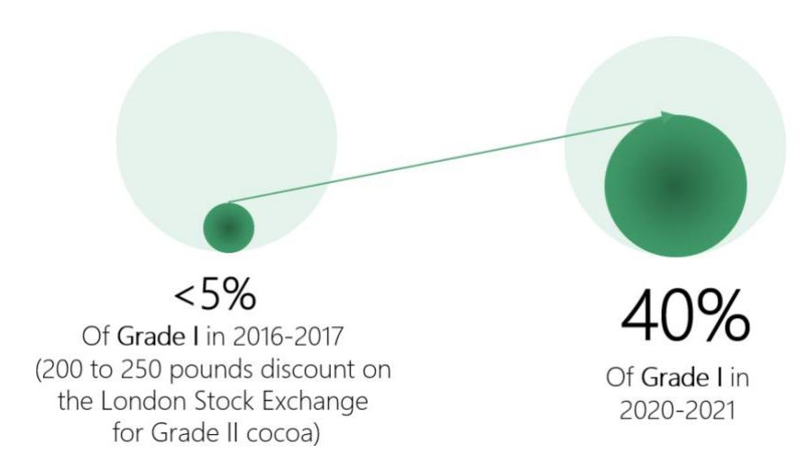

*Figure 41: Evolution of cocoa quality between the 2017-2018 and 2020-2021 season*

Although this policy has had a moderate impact on the improvement of Cameroonian cocoa export prices, other producing countries are also implementing programs to improve quality. Therefore, Cameroonian cocoa continues to suffer a discount on the international market compared to other origins (Figure 43).

*Figure 42: Comparative evolution of prices of cocoa beans from Cameroon with 4 other origins* 

Only recently has the ONCC has begun to consider the establishment of cocoa sustainability programs and standards, particularly in the coordination of the Roadmap for Sustainable Cocoa in partnership with the IDH.

A parallel study has been commissioned by the ONCC and IDH for the implementation of a national traceability system and a goal of achieving complete traceability by 2025 in the Cameroonian cocoa marketing chain. As mentioned above, the ONCC has also positioned itself to transcribe the ARS standard on sustainable cocoa into Cameroonian national law. Thus, the institution intends to play a greater role in implementing national sustainability standards and indicators.

#### 4.2.3. The actions of the Ministry of Agriculture

The Ministry of Agriculture and Rural Development (MINADER) has carried out several programs to support cocoa production with co-financing from the FODECC. The projects described on the FODECC website85 target the improvement of production through plant material, the use of fertilizers, and the use of fungicides. So far, these programs do not seem to consider sustainability indicators in their approaches, apart from improving productivity and producers' income.

In 2020, the Ministry of Agriculture launched a new project co-financed by the FODECC called "*Projet d'Appui au DÈveloppement du Cacao*" (Cocoa Development Support Project, or PAD - CACAO). This program aims to increase cocoa production by accelerating the distribution of improved seedlings, initiating the grafting of cocoa trees, and training several thousand farmers on good agricultural practices.

#### 4.2.4. FODECC actions

The FODECC, a fund for the cocoa sector, has a key role as the main national funder of programs and projects in the cocoa sector. Its projects and programs are mostly coordinated by the Ministry of Trade, the Ministry of Agriculture and to a lesser extent the Ministry of Scientific Research and Innovation. Generally, the programs are

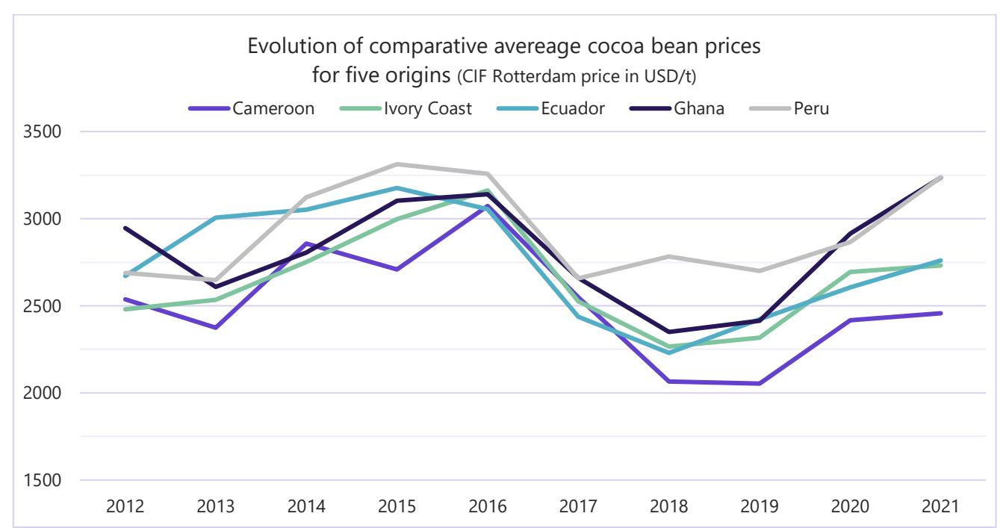

85 [https://www.fodecc.cm/?page\\_id=3712](https://www.fodecc.cm/?page_id=3712) 

mostly financed by the FODECC and the line ministries co-finance a small part of the program (sometimes with additional funding from international donors).

In 2022, the FODECC independently initiated the "*Guichet producteurs programme*". This program targets the purchase costs of agricultural inputs and equipment to relieve producers' management accounts. CFAF 6 billion will be invested over the next few years, divided into three categories: (i) subsidies for agricultural inputs (fertilizers, phytosanitary products, seeds and seedlings), (ii) agricultural equipment and machinery, and (iii) production support infrastructure (notably post-harvest infrastructure).

The subsidy is provided through electronic payment; the vouchers are sent directly to the producer's mobile phone. The subsidy is degressive (40% in the first year, 30% in the second, 20% in the third). Additionally, the program provides assistance communities (in order to develop processing and support production) as well as to production municipalities (particularly in the context of centres of excellence, in consultation with the CICC).

Therefore, the main aim of this program is to improve the economic sustainability of cocoa production. Despite the inclusion of a mechanisms that may improve traceability through self-referencing and a limit on the size of supported farms (maximum of 10 ha), it does not set specific sustainability criteria for selecting supported producers.

### 4.2.5. A diversity of public programs but little coordination so far

A constraint of the sector is the distribution of the export levy among multiple institutional actors, with complementary prerogatives, but with sometimes overlapping projects.

This constraint could also prove to be an asset if good governance mechanisms are put in place. The royalty, set at 150 FCFA per kg of beans exported during the 2014-2015 season (MINCOMMERCE Order No. 071 of 27 November 2014), was halved in 2017 to strengthen the international competitiveness of the sector. It is now 75 CFA francs per kg (MINCOMMERCE Order No. 0249 of 11 August 2017). The cocoa export levy is mainly shared between four institutions (see the table in the appendix for a detailed presentation of the specificities of each institution)86 .

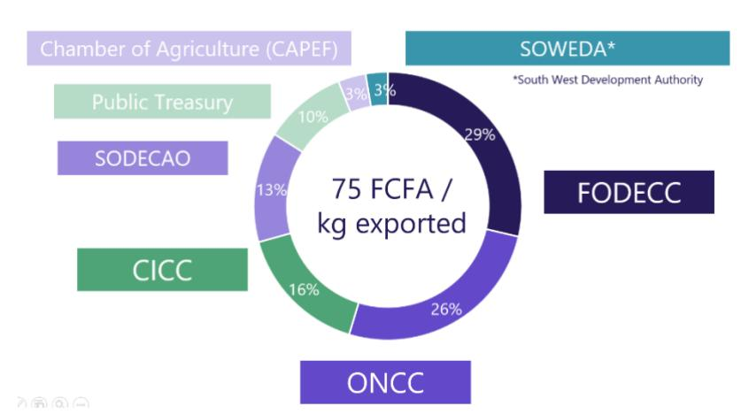

Nevertheless, these institutions seem to be uncoordinated and are running parallel programs, sometimes on similar themes. The case of geo-referencing of producers is significant: each institution has developed its own program without any real coordination until now. Although all the institutions consider transparent data sharing, no cross-referencing has yet taken place and no unified database has been produced.

Yet the objectives set at the creation of each of these institutions could be a clear division of tasks related to sustainability:

*Figure 43: Export duties and its distribution among the different cocoa institutions* 

- *The FODECC, as a development fund, can finance programs and provide incentives for traceability and sustainability;* 

86 See: Ministry of Trade, Order No. 00249 of 11 August 2017 fixing and distributing the cocoa export fee:

https://www.cameroontradeportal.cm/tradeportal/templates/Tip\_accueil/docs/arretes/ARRETE\_REPARTITION\_CACAO.pdf.

- *The CICC, as an interprofessional body, is a place for exchanges between all the categories of actors in the sector with the four colleges (producers, millers, processors and exporters), and can ensure the application and improvement of the rules;*
- *The ONCC is responsible for ensuring that marketing rules are followed and for providing the most accurate marketing statistics possible;*
- *MINCOM and MINADER are responsible for establishing regulations and standards related to sustainability;*
- *Support is provided by SODECAO, which is responsible for supplying plants and equipment, the Chamber of Agriculture (CAPEF), which can help train producers, and IRAD, which can improve plants and production systems and monitor the impact of climate change.*

This multi-stakeholder split could become an advantage in the sector. By encouraging multiple programs and experiments, it can provide the orientations necessary for intervention in the sector, provided that the programs and experiments are monitored and evaluated. A major challenge will be to create a unified database for the sector based on data from a wide range of sources (such as production origin, imported and distributed phytosanitary products, distributed plants, deforestation data, qualitative information from the field by production zone, etc.), for which a clearly defined methodology is needed.

Additionally, the score serves as a control system, provided that governance ensures regular exchanges and monitoring of specific performance indicators (sustainability in the chain, data produced, number of registered actors, cocoa quality, etc.).

The sector has proven that it is capable of effective action, particularly through cocoa quality improvement programs. Further, international partners could contribute to the establishment of virtuous governance to promote sustainability within the cocoa sector.

#### 4.2.6. Projects and programs of international technical and financial partners

An increasing number of projects combining environmental and economic sustainability indicators are being developed in Cameroon in the framework of bilateral and multilateral cooperation.

The "*Green commodity landscape*", for example, involves several national institutions: MINADER, MINCOM and ONCC, and international organisations IDH and WWF. Currently, two pilot projects have been launched, one in the Grand Mbam (Central region) and the other in Djoum-Mintom (South). If these projects prove effective, they will be replicated.

A major advantage of such landscape projects is that they integrate the actors involved without limiting the reflection to a specific sector: cocoa is one of the main objectives but plantains, oil palm and wood also contribute to deforestation in Mbangassina. The challenge is to prevent conflicts between sectors and between stakeholders through concerted planning.

Private actors are also involved in these projects, for example, Cargill-Telcar co-funded a €750,000 project around the village of Ascokyb. The project includes geo-referencing of 3500 producers, training for the adoption of sustainable and more productive practices, support for the adoption of agroforestry, forest mapping with HCV (high conservation value) methodology, monitoring of carbon stocks and orchestration of participatory mapping.

The projects may find innovative financing methods, such as increasing prices on the carbon market, and the development of such projects at a landscape scale could be encouraged by investing in REDD+ projects.

In addition, two other landscape-orientated projects are underway, including the Pallisco and ACEFA pilot project for sustainable cocoa farming in Mindourou, which is financed by the AFD, and the GIZ Golden Cocoa project, which is intended to increase sustainability within cocoa production, within the framework of the PAD-CACAO.

# **5\_Conclusion and outlook**

#### 5.1.On traceability

Traceability in the Cameroonian cocoa sector is relatively good at the level of transactions between export stakeholders (exporters and processors) and their direct suppliers (LBA and cooperatives). However, at the level of transactions between LBA and cooperatives, on the one hand, and their suppliers on the other (coxeurs and farmers), everything remains to be done in terms of traceability. To achieve full traceability from plot to port as announced by Cameroon's Roadmap to Deforestation-Free Cocoa, there is therefore still a long way to go.

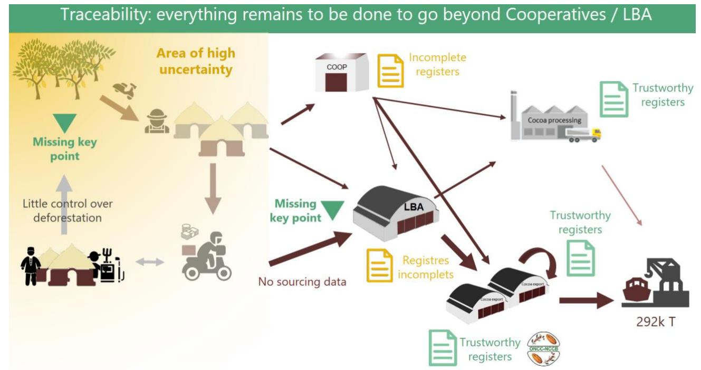

*Figure 44: Available and missing data for traceability within the Cameroon cocoa supply chain* 

As a result of insufficient private and public initiatives, Cameroon falls behind the two West African giants with regards to traceability despite a very concentrated export sector.

Nevertheless, the existing traceability (from cooperatives and LBAs to exporters/grinders and from exporters/grinders to the international market) benefits so far from a level of transparency that is much higher than what can be observed in CÙte d'Ivoire and Ghana. Unlike the Ivorian Conseil CafÈ Cacao (CCC) and the Ghanaian COCOBOD, which publish very little information on the origin and destination of their cocoa, the ONCC produces annual season reports of high quality and transparency.

|                                                                        |                           |                                         |
|-------------------------------------------------------------------------------------|----------------------------------------|------------------------------------------------------|
| Traceability / sustainability : Cameroon is rather behind other producing countries |                                        |                                                      |
| Estimated production                                                                | 292k T 
in 2021-2022
             | 4th in the world                                     |
| Average prices                                                                      | 700-1210 
FCFA / kg in 2020-2021
 | Higher                                               |
| Transparency                                                                        | Public campaign reports                | Better                                               |
| Public traceability                                                                 |                                        | Less controlled                                      |
| Proportion from coxing                                                              | +/- 40%                                | High                                                 |
| Share of organised cooperatives                                                     | +/- 40%                                | Average but rising                                   |
| Certification                                                                       | 33%                                    | Stronger on RA 
Much weaker on FLO and Organic
 |
| Sustainability programmes                                                           | +/- 100k                               | Lower                                                |

*Figure 46: Infographic on the positioning of Cameroon in terms of traceability and sustainability in the cocoa sector* 

In addition, the regulatory bodies in CÙte d'Ivoire and Ghana have digitized and extended their marketing monitoring systems upstream, which were previously active at the point of sale (cooperative / tracker / purchasing clerk). Many stakeholders are now wondering whether and how these public traceability systems can be exploited by cocoa exporters and their auditors to meet potential future EU requirements for due diligence. Consequently, there is a high risk of duplication of investments in these two countries with underused and non-transparent public traceability systems that must be complemented by private traceability systems.

Cameroon could take the opposite approach by setting up coordination and regulation of private traceability rather than a single public traceability system.

Establishing private traceability systems down to the plot level would be the responsibility of exporting companies and cooperatives, as well as intermediaries who wish to do so. The CICC and FODECC window would be able to coordinate, as well as financially support, the efforts of the smallest actors. The CICC could propose a "*default*" traceability software for actors who do not have the resources to pay for the development of such software or who do not wish to depend on the traceability software of their client(s).

Using the ONCC, the State would outline specifications for the information to be collected in the traceability systems, part of which will be transmitted to it on a regular basis (weekly, monthly, annual) including georeferenced areas, volumes per plot, volumes per week and quantities per supplier. By doing so, it will be able to produce and disseminate public statistics on the sector to a far greater extent as well as target its regulatory interventions and public investment.

Below is a simplified diagram of the direct and indirect actors in the cocoa chain, showing the distribution of responsibilities and the information flows that could be put in place to ensure good synchronization of roles and responsibilities.

| <h2 style="text-align: center;">Traceability: Cameroon can rely on the complementarity of its key organisations</h2>                                                                                                                                                                                                                                                                                                                                                                                                                                                                                                                                   |                                                                                                                                                                                                                                                                                                                                                                         |
|--------------------------------------------------------------------------------------------------------------------------------------------------------------------------------------------------------------------------------------------------------------------------------------------------------------------------------------------------------------------------------------------------------------------------------------------------------------------------------------------------------------------------------------------------------------------------------------------------------------------------------------------------------|-------------------------------------------------------------------------------------------------------------------------------------------------------------------------------------------------------------------------------------------------------------------------------------------------------------------------------------------------------------------------|
| <h3 style="text-align: center;">Food for thoughts on the sharing and complementarity of responsibilities</h3>                                                                                                                                                                                                                                                                                                                                                                                                                                                                                                                                          |                                                                                                                                                                                                                                                                                                                                                                         |
| <h2 style="text-align: center;">MINADER and MINTRADE</h2>                                                                                                                                                                                                                                                                                                                                                                                                                                                                                                                                                                                              |                                                                                                                                                                                                                                                                                                                                                                         |
| <ul style="list-style-type: none; padding-left: 0;"> <li>• Strategic orientations, coordination of the action of the various actors, notably within the framework of the "PAD-Cacao" for MINADER</li> </ul>                                                                                                                                                                                                                                                                                                                                                                                                                                            |                                                                                                                                                                                                                                                                                                                                                                         |
| <h3 style="text-align: center;">NCCO</h3>                                                                                                                                                                                                                                                                                                                                                                                                                                                                                                                                                                                                              | <h3 style="text-align: center;">FODECC</h3>                                                                                                                                                                                                                                                                                                                             |
| <ul style="list-style-type: none; padding-left: 0;"> <li>• Develops the specifications (national minima) for private traceability</li> <li>• Periodically collects traceability information (obligation to transmit)</li> <li>• Controls and sanctions operators who do not respect national traceability minima and do not share their information at the planned periodicity</li> <li>• Publish analyses, strategic notes and other public policy documents based on the data collected and processed (including a baseline of producers' living conditions)</li> <li>• Directs State support to producers on the basis of these analyses</li> </ul> | <ul style="list-style-type: none; padding-left: 0;"> <li>• Subsidises downstream players for the deployment of their traceability systems (premium per registered producer)</li> <li>• Targets its funding to registered producers</li> <li>• Supports the creation of new plots only under compliance conditions (sustainability criteria to be negotiated)</li> </ul> |
| <h3 style="text-align: center;">CICC</h3>                                                                                                                                                                                                                                                                                                                                                                                                                                                                                                                                                                                                              | <h3 style="text-align: center;">SODECAO</h3>                                                                                                                                                                                                                                                                                                                            |
| <ul style="list-style-type: none; padding-left: 0;"> <li>• Organises the formalisation of coxeurs (via LBAs and exporters) with the MINCOMMERCE</li> <li>• Provides a customisable digital traceability system to operators who cannot afford independent development (small exporters, LBA, large coxeurs and coop): documentation, transaction recording tool, cocoa ba</li></ul>                                                                                                                                                                                                                                                                    |                                                                                                                                                                                                                                                                                                                                                                         |

*Figure 47: Diagram of possible information and responsibility sharing for a national public-private traceability system in Cameroon* 

More specifically, the structure of the minimum data that should be transmitted to the ONCC and CICC is shown in Figure 48.

| ... but will also have to involve all private actors                                                                                                                                                                                                             |  |                                                                                                                                        |  |
|------------------------------------------------------------------------------------------------------------------------------------------------------------------------------------------------------------------------------------------------------------------|--|----------------------------------------------------------------------------------------------------------------------------------------|--|
| Food for thoughts for the sharing and complementarity of responsibilities                                                                                                                                                                                        |  |                                                                                                                                        |  |
| <b>Responsibilities / Obligations</b>                                                                                                                                                                                                                            |  | <b>Link in the chain</b>                                                                                                               |  |
| <ul> <li>Obtain <b>parcel + journey traceability</b> for 100% of the volumes purchased</li> <li>Share certain <b>digital data</b> from their traceability systems with ONCC</li> <li>Carry out audits of their traceability system</li> </ul>                    |  | 
Tens of exporters
                                                                                                               |  |
| <ul> <li>Use their customers' <b>traceability applications</b> or have their own traceability solution to meet their customers' specifications</li> </ul>                                                                                                        |  | 
Tens of LBA
                                                                                                                     |  |
| <ul> <li>Formalize their activity, join the CICC</li> <li>Use the traceability <b>applications</b> of exporters, LBAs or the default application provided by the CICC</li> </ul>                                                                                 |  | 
Thousands of coxeurs
                                                                                                            |  |
| <ul> <li>Accept the <b>georeferencing</b> of their plot</li> <li>Give their <b>unique producer ID</b> to all their customers (including coxeurs)</li> <li><b>Declare any project to extend</b> or create a new plot with the local office of the ONCC</li> </ul> |  | 
≈ 500 000 producers on 800 000 hectares
                                                                                     |  |
| <b>Information to be transmitted to the ONCC and the CICC (under a common structure)</b>                                                                                                                                                                         |  | 
<b>Purchases:</b> Volumes/list of producers/suppliers/date Sales: export stats/lot structure/contracts Producer records
 |  |
| <ul> <li>Use their customers' <b>traceability applications</b> or have their own traceability solution to meet their customers' specifications</li> </ul>                                                                                                        |  | 
<b>Purchases:</b> Volumes/producers list/supplier/date Sales: volume/client/date Producers records
                      |  |
| <ul> <li>Formalize their activity, join the CICC</li> <li>Use the traceability <b>applications</b> of exporters, LBAs or the default application provided by the CICC</li> </ul>                                                                                 |  | 
<b>Purchases:</b> Volumes/producer/date Sales: volume/client/date Producers records
                                     |  |
| <ul> <li>Accept the <b>georeferencing</b> of their plot</li> <li>Give their <b>unique producer ID</b> to all their customers (including coxeurs)</li> <li><b>Declare any project to extend</b> or create a new plot with the local office of the ONCC</li> </ul> |  | 
<b>Volume, Dates of sellings</b> Producer ID Georeferencing
                                                             |  |

*Figure 48: Classification of data from private traceability systems to be shared via the ONCC within the sector* 

The rate of transmission of information could vary depending on the type of data in order to produce both monthly and annual marketing reports. Below, the data transmission rates from private traceability systems to the ONCC and the CICC are proposed.

![A screenshot of a data table with three columns and two rows. The top row has the text 'Traceability: data to be provided for sustainable traceability of the sector'. The bottom row has the text 'Dynamic data (weekly update)'. The top column contains the text 'Static data (annual update)' and a list of identifiers. The bottom column contains the text 'Semi-dynamic data (monthly update)' and a list of identifiers. The bottom row contains the text 'Dynamic data (weekly update)' and a list of identifiers.]()

| 
<b>Traceability: data to be provided for sustainable traceability of the sector</b>
                                                                                                                                                                    |  |  |
|---------------------------------------------------------------------------------------------------------------------------------------------------------------------------------------------------------------------------------------------------------------|--|--|
| 
<b>Static data (annual update)</b>
                                                                                                                                                                                                                     |  |  |
| <ul> <li>Identifiers (for each category of actors, provide for deaths and transfer of ownership to producers)</li> <li>Geolocations linked to identifiers (plots, offices or stores)</li> <li>Extension projects / creation of plots for producers</li> </ul> |  |  |
| 
<b>Semi-dynamic data (monthly update)</b>
                                                                                                                                                                                                              |  |  |
| <ul> <li>Detailed origin of supplies: aggregation of volumes supplied by plot / producer / intermediary</li> </ul>                                                                                                                                            |  |  |
| 
<b>Dynamic data (weekly update)</b>
                                                                                                                                                                                                                    |  |  |
| <ul> <li>Purchasing volumes by supplier</li> </ul>                                                                                                                                                                                                            |  |  |

*Figure 49: Update timeline for the national traceability scheme proposed* 

Finally, an important project to implement this complete traceability remains the formalization of the profession of cocoa bean aggregator (coxeur) and the integration of these currently informal stakeholders in the traceability scheme. To carry out this complex task, which concerns thousands of individuals across the territory, it is proposed to adopt a dual approach. On the one hand, voluntary individual integration possible via the registration of coxeurs within the college buyers with less expensive registration conditions than those currently in force for large buyers (LBA). On the other hand, a mandatory integration via the downstream of the value chain, which means through the LBAs and exporters who would have to register all their suppliers (representatives as well as independents) and require from them the provision of documentation on the origin of the product (producers and cooperatives with their location).

*Figure 50: Proposed strategy to formalized coxeur role within the cocoa supply chain* 

Transparency is essential for traceability system resilience. To ensure that the system does not lead to an overdependence of producers and intermediaries on their clients (large exporters/grinders), it is important that producer identifiers and geo-referenced plot data are made available to all actors in the chain.

Thus, an operator who has not participated in the identification/georeferencing of a producer and his plots will still be able to buy part of his production and maintain traceability. In this respect, a unique identifier will have to be created for all the links in the chain, including the producers. The ONCC, auditing bodies or civil society actors will thus be able to cross-check the total sales volumes declared by plot and by producer even when the production has been marketed via several buyers.

This transparency will make it possible to increase the number of verifications and controls and to position Cameroon as a *"low deforestation risk*" country during the due diligence *that* will probably be required by the European Union or by certain international chocolate manufacturers.

#### 5.2.On sustainability

In contrast to CÙte d'Ivoire and Ghana, the cocoa sector does not currently appear to be the main vector of deforestation on a national scale in Cameroon. The results of this study confirm that deforestation in Cameroon on a national scale appears to be more multifactorial than linked to the expansion of a large agricultural sector as it is in other countries with tropical humid climates (like CÙte d'Ivoire and Ghana, as well as Brazil, Indonesia and Malaysia).

**Sustainability:** cocoa is a much less powerful deforestation factor than in Côte d'Ivoire

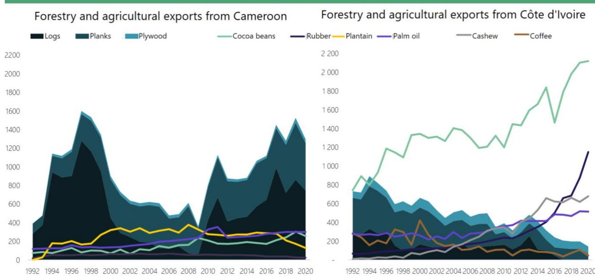

*Figure 51: Comparison of the evolutions of timber and agricultural exports of CÙte d'Ivoire and Cameroon* 

The cocoa industry contributes substantially to deforestation, particularly due to internal displacement of populations (related to the conflict in the South-West region) who have begun opening new plantations in their new settlements, especially in the Littoral region. However, this role must be qualified in relation to indirect deforestation factors, which to date seem to be mainly demographic growth on a national scale and the strong demand for food imports from neighbouring countries (particularly in the palm oil and fruit and vegetable sectors).

Additionally, Cameroon's economy and farms are more diverse than large West African producing countries, so farm income is less dependent on cocoa prices. Though cocoa is often the first or second cash crop of farmers in Cameroon, and these farmers are on average poorer than those in CÙte d'Ivoire and Ghana (at a time when cocoa is relatively expensive), the resilience of Cameroonian farms appears to be much higher than that of West African farms.

Whereas in CÙte d'Ivoire, cocoa producers may suffer a 'downgrading' as soon as the fertility rent of their area of implantation has been exhausted (which must then be compensated for by increasing inputs and labour expenditures). As prices fall internationally, Cameroonian farmers are more likely to be able to allocate their investments strategically among the crops they master in response to long-term market dynamics, so their standard of living is less likely to be affected. In this respect, Cameroonian cocoa production could be described as 'more sustainable' in the sense that it presents fewer economic risks for farmers.

In order to maintain and strengthen this resilience, improving the living conditions of producers should be based on an all-out risk mitigation approach. As explained in the infographic below, it is a question of working both on improving and stabilizing prices but also on the productivity of farms (without increasing production costs too much), resilience to climate change and support for the process of renewing old cocoa farms (renewal being a costly and complicated step for producers).

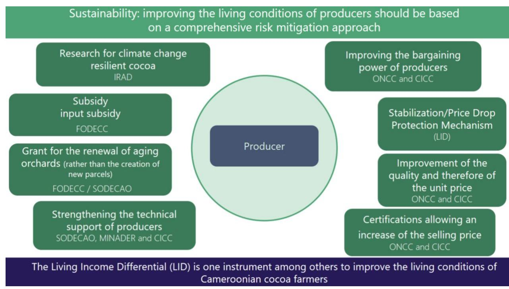

*Figure 52: Complex approach of cocoa farming sustainability* 

Nevertheless, the value of Cameroonian cocoa remains lower than that of many other origins to date. Ghana has a much higher average selling price and CÙte d'Ivoire, which has long suffered from a poor reputation in terms of quality, has made significant progress in recent years and has caught up with Ecuador (see Figure 43).

It is therefore important for the sustainability of the Cameroonian cocoa sector to continue to invest substantially in moving upmarket. Certification and proof of sustainability are therefore necessary criteria, or even minimum requirements, for a move upmarket (premium markets often demand traceability and sustainability proof in addition to the organoleptic quality). Today, there are no exports of organic and fair-trade certified beans from Cameroon, suggesting that the country has not yet sufficiently positioned itself in the premium markets. The geographical indication (GI) project "*red brick cocoa from Cameroon*" is a first step in this direction, as it is supported by cooperatives in organic certification and the initiative of centres of excellence. As an alternative to the "*volume*" strategy, which has long prevailed among West African producers causing regular overproduction, Cameroon should seek to create "*value*". These pilots should become the basis of a national political will to move towards quality cocoa.

The quality of commodities is often a secondary concern when demand is high, but it is the most important criterion when supply is plentiful, which means less will be lost when prices fall. Therefore, investing in sustainability and quality seems to be an attractive strategy for increasing producers' incomes and protecting them against cyclical price declines. While the world's top two producers are slowly turning the corner on sustainability, Cameroon can move forward more quickly and use its environmental advantages as commercial argument (for example, large forests that are better managed than in West Africa, large shares of agroforestry cocoa and more diversified farms). It is nonetheless imperative that they be documented: we encourage the Cameroon cocoa industry to take this step as soon as possible.

This would involve, for example, linking initiatives in the cocoa sector to land use planning and decentralization policies, relying mainly on spatial planning documents whose development has recently started at 2 geographical levels:

- Region: Regional planning and sustainable development plans (SRADDT);

- Municipality: Local land use and sustainable development plans (PLADDT).

The objective of the PLADDT being "*to organize the distribution of land at the local level*" for a period of 25 years, it is certainly the most appropriate spatial planning tool to meet the aforementioned sustainability issues.

More broadly, it could also be relevant to invest in tools for monitoring and improving forest policies and dynamics at the scale of the Congo Basin, like what is supported by the Initiative for Central African forests (CAFI).

Indeed, the high risk of deforestation in Cameroon and in the Congo Basin seems above all to come from developments in the timber market (strong growth in demand, fewer requirements and controls from emerging markets, new operators intervening on national markets with unsustainable extractive approaches). It therefore seems important to deal with the risk of deforestation through the prism of the timber sector as much or even more than with that of the agricultural sectors, many of which are currently focused mainly on national and subregional markets.

# **6\_Bibliography**

Alary, VÈronique. *Les cacaoculteurs camerounais face aux risques*. Montreal: L'Harmattan, 2000. Basse, Iba, et al. Institutional, organisational analysis of public enterprises and establishments in the rural sector". EU-funded AECOM, 24 June 2019. Beckett, Stephen, "Industrial Chocolate Manufacture and Use, Fourth Edition". In *Industrial Chocolate Manufacture and Use: Fourth Edition*, 385408-, 2009. https://doi.org/10.1002/9781444301588.ch17. BÈra, Amandine. "Towards a traceable cocoa: impacts of existing models on the profitability of small producers in Cameroon". Montpellier: AgroParisTech, 2021. "Cocoa Certification Data Report 2020. Rainforest Alliance and Utz programs". Rainforest Alliance, May 2021. https://www.rainforest-alliance.org/wp-content/uploads/2021/07/Cocoa-Certification-Data-Report-2020.pdf. "Ecocert - Ecocert Directory". Accessed 23 March 2022. http://certificat.ecocert.com/. FAO and UNEP. *The State of the World's Forests 2020: Forests, Biodiversity and Human Activity*. The State of the World's Forests (SOFO) 2020. Rome, Italy: FAO and UNEP, 2020. https://doi.org/10.4060/ca8642fr. ResearchGate. "Figure 1. Presentation of the Dense Rainforest Zone..." Accessed March 23, 2022. https://www.researchgate.net/figure/Presentation-de-la-zone-de-foret-dense-humide-a-pluviometriebimodale-du-Cameroun\_fig1\_236212458. Folefack, Denis. "Poverty and Share Revenue in the Cameroon Cocoa Zone. *Tropicultura* 28 (1 January 2010). Jagoret, P. "Analyse et Èvaluation de systemes agroforestiers complexes sur le long terme: application aux systemes de culture a base de cacao au Centre Cameroun". These, These doctoral thesis -- Agronomy. Functioning of natural and cultivated ecosystems, 2011. http://publications.cirad.fr/une\_notice.php?dk=560345. Lescuyer, Guillaume, and Simon Bassanaga. "Positive Influence of Certification on the Financial Performance of Cocoa Production Models in Cameroon." *Frontiers in Sustainable Food Systems* 5 (2021). https://www.frontiersin.org/article/10.3389/fsufs.2021.743079. Lescuyer, Guillaume, Laurence Boutinot, Pietro Goglio, and Simon Bassanaga. "Analysis of the cocoa value chain in Cameroon. Report for the European Union, DG DEVCO. Value Chain Analysis for Development Project (VCA4D CTR 2016/375-804)." Monograph. CIRAD, 2020. https://agritrop.cirad.fr/595017/. Masson-Delmotte, ValÈrie, et al, eds. summary for policymakers. In *Climate Change 2021: The Physical Science Basis. Contribution of Working Group I to the Sixth Assessment Report of the Intergovernmental Panel on Climate Change*. Cambridge University Press, 2021. MathÈ, Syndhia, Eric JoÎl Fofiri Nzossie, and Ludovic Temple. "Characterization of the cocoa sectoral innovation system in Cameroon". *Science, Technologie, DÈveloppement* 1, no 1 (2021). https://doi.org/10.21494/ISTE.OP.2021.0694. Mbarga, Bernadette. "Socio-demographic situation of ordinary households - 3rd RGPH. BUCREP, 2010. Nlend Nkott, Anny LucrËce, Syndhia MathÈ, and Ludovic Temple. "Multi-level analysis of the brakes on the adoption of cocoa certification in Cameroon." *Rural Economy* 370, no 4 (2019): 8199-.

Ongolo, Symphorien, Sylvestre KouamÈ Kouassi, Sadia ChÈrif, and Lukas Giessen. "The Tragedy of Forestland Sustainability in Postcolonial Africa: Land Development, Cocoa, and Politics in CÙte d'Ivoire." *Sustainability* 10, n o 12 (December 2018): 4611. https://doi.org/10.3390/su10124611. "European Parliament and Council Regulation. Brussels: European Commission, 17 November 2021. " Roadmap to Deforestation-Free Cocoa in Cameroon. IDH, MINADER, MINCOM, ONCC, 2021. Ruf, FranÁois. *Cocoa Booms and Crises: The Dizziness of Brown Gold*. Economie et dÈveloppement. Montpellier : Paris: CIRAD-SAR ; Karthala : MinistËre de la coopÈration, 1995. ---. " Why is the world cocoa price so low? Periodical article. CIRAD, 2000. http://publications.cirad.fr/une\_notice.php?dk=477364. Ruf, FranÁois, Enrique Uribe Leitz, KouamÈ Casimir Gboko, and AurÈlie Carimentrand. "Useless certifications? Les relations asymÈtriques entre coopÈratives, labels et cacaoculteurs en CÙte d'Ivoire". *Revue internationale des etudes du developpement* 240, no 4 (20 November 2019): 3161-. Sardan, Jean-Pierre Olivier de. *The rigour of the qualitative: the empirical constraints of socio-anthropological interpretation*. Academia-Bruylant, 2008. Senial, Elsa, "Gaps to legality and sustainability in cocoa commodity chain Cameroon". Montpellier: University Jean Moulin Lyon 3 UMR Environnement, Villes, SociÈtÈs CRGA, CIRAD UMR Innovations et dÈveloppement, 2017. Sonwa, D. J., S. F. Weise, B. A. Nkongmeneck, M. Tchatat, and M. J. J. Janssens. "Profiling Carbon Storage/Stocks of Cocoa Agroforests in the Forest Landscape of Southern Cameroon. CIFOR. Springer, 15 May 2018. https://doi.org/10.1007/978-981-10-7650-3\_30. Sunderlin, William, and Jacques Pokam. "Economic Crisis and Forest Cover Change in Cameroon: The Roles of Migration, Crop Diversification, and Gender Division of Labor. *Economic Development and Cultural Change*  50 (1 February 2002): 581606-. https://doi.org/10.1086/342358.

# **7\_Annexe: Forest Monitoring systems in Cameroon**

Cameroon does not yet have a National Forest Monitoring System (NFMS), but various initiatives have been launched in this regard in recent years, including at the subregional level. The table below aims to summarise them, it being understood that the most important of them (the first three) can be classified into two main categories according to whether they :

- *Validate data from international systems (EMD) at national level;*
- *Deploy their own methods on a national (Atlas of Forest Cover Loss) or sub-regional (DDD Project) scale.*

#### (Inter)national forest monitoring initiatives in Cameroon

| Initiatives  | Stakeholders Brief description Highlights Weaknesses |
|--------------|------------------------------------------------------|
| Operational  | Forest                                               |
| Wildlife     | (MINFOF)                                             |
| Ministry     | of the                                               |
| Environment, | Nature                                               |
| Protection   | and                                                  |
| the          | World Resources                                      |
|              | Unit created by MINFOF order                         |
|              | under-equipped, no maintenance of                    |
|              | Clearly underestimating the rate of                  |
|              | to the studies mentioned in this 2021                |
|              | CIFOR article) . GFW itself states that              |
|              | forest disturbances rather than to                   |
|              | No consideration of the national                     |
|              | with no clear timetable for system                   |
| National     | Climate                                              |
| Change       | Observatory                                          |
| REDD         | Technical                                            |
|              | Observatory created by decree                        |

| Initiatives   | Stakeholders Brief description Highlights Weaknesses |
|---------------|------------------------------------------------------|
| the period    | 2000-                                                |
|               | and the US Forest                                    |
|               | Definition of thematic classes (e.g.                 |
|               | semi-automatic classification using                  |
|               | training, iteration, assessment or                   |
|               | Methodology developed ad-hoc                         |
|               | taking into account the national                     |
|               | Latest publication produced in                       |
|               | free images currently available (e.g.                |
| Estimation    | of                                                   |
| deforestation | and                                                  |
| forest        | degradation                                          |
| current       | and                                                  |
| historical    | direct                                               |
| drivers       | associated                                           |
| with          | these                                                |
|               | Operational Forest                                   |
|               | quantify the direct drivers of                       |
|               | Combining time series analyses to                    |
|               | integrate the multiple satellite                     |
|               | of specific deforestation/degradation                |
|               | Consideration of the national                        |
|               | images, production of mosaics,                       |
|               | multi-temporal analysis systems,                     |
|               | Variou s maps: land use changes,                     |
|               | analysis of deforestation/degradation                |

Although these initiatives reflect a certain willingness on the part of the country to move towards a fully operational NFS, the various weaknesses presented in the previous table prevent Cameroon from having a monitoring tool that allows it to guarantee deforestation-free cocoa production, whether it is a matter of respecting the commitments already made within the framework of the FRCSD or of adapting to future EU requirements.

By involving UOSCF staff on the one hand and relying on robust methodologies/tools on the other, the DDD project certainly has the best potential to develop a forest and cocoa monitoring system, but at this stage, there is no guarantee that this project will be able to continue over time and regularly provide the data that the country will need. If the DDD project is not extended, the question would be how the UOSCF and ONACC could possibly collaborate to resume this work, in conjunction with the FAO, which is currently piloting this work at the sub-regional level. It is to these important questions that the *Cocoa Talks* that will be organised on this subject, among others, could try to answer in the coming months, based on the exchanges already held last year in the framework of the implementation of the FRCSD.

Depending on the requirements of the regulation that will finally be adopted by the EU, it may also be necessary to go beyond the mere production of annual deforestation maps and to engage in remote sensing mapping of all the country's cocoa farms, which will not be without major technical problems given the high proportion of cocoa produced under shade in Cameroon. The same applies if forest degradation attributable to cocoa were to be characterised.

#### Other relevant (inter)national initiatives

The initiatives presented below are not directly dedicated to monitoring forests by remote sensing (via an ad-hoc method covering the entire territory), but can be very complementary to the above-mentioned initiatives. The Interactive Forestry Atlas of Cameroon could thus host the data produced annually by Cameroon, while the initiatives led by Cameroonian civil society (CED and SAILD) could be supported in their desire to ensure forest monitoring (independent observation).

| Initiatives          | Stakeholders           |                 | Description   |     |            | Highlights Weaknesses                  |
|----------------------|------------------------|-----------------|---------------|-----|------------|----------------------------------------|
| Interactive Forestry |                        |                 |               |     |            |                                        |
|                      |                        | that aims       | to strengthen |     | forest     |                                        |
|                      |                        | Integrates      | most of       | the | GFW        |                                        |
|                      |                        | functionalities | (canopy       |     | loss/gain, |                                        |
|                      |                        |                 |               |     |            | Flagship initiative for monitoring the |
|                      |                        |                 |               |     |            | plantations and the whole range of     |
|                      |                        |                 |               |     |            | Map and associated data, updated       |
|                      |                        |                 |               |     |            | quarterly and downloadable here.       |
| Forest Land          |                        |                 |               |     |            |                                        |
| Observatory in       |                        |                 |               |     |            |                                        |
|                      | Centre for Environment |                 |               |     |            |                                        |
|                      | and Development (CED)  |                 |               |     |            |                                        |
|                      | Human Rights (OCDH),   |                 |               |     |            |                                        |
|                      | and Woman (MEFP),      |                 |               |     |            |                                        |

| Initiatives   | Stakeholders Description Highlights Weaknesses |
|---------------|------------------------------------------------|
| Deforestation | and                                            |
| Forest        | Degradation                                    |
| Monitoring    | System                                         |
|               | Services d'Appui aux                           |
|               | Initiatives Locales de                         |
|               | DÈveloppement (SAILD)                          |
|               | Cameroon Living Earth                          |
|               | Interactive Geoportal providing point         |
|               | alerts (top-down approach) and ii)             |
|               | documentation of field observations            |
|               | A network of informants in local               |
|               | Collects information on both                   |