# Unlocking Scalable Financial and Incentive Mechanisms for Smallholders and Producers in Indonesia and Malaysia

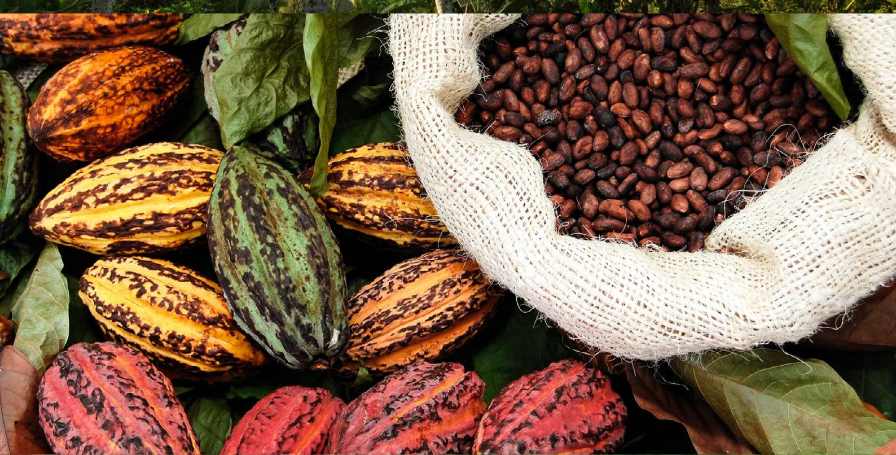

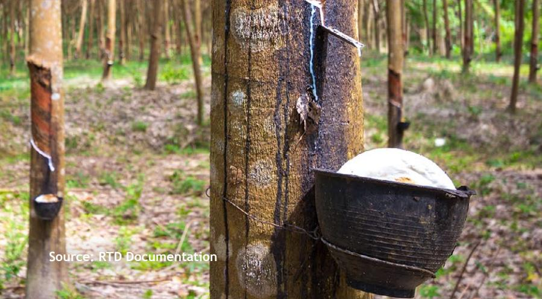

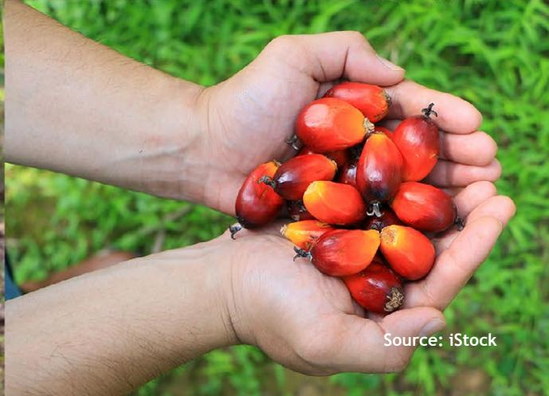

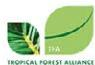

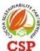

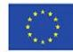

## Glossary

| ADM ACLF       | ADM Capital’s Asia Climate-smart            |                  |                                              |
|----------------|---------------------------------------------|------------------|----------------------------------------------|
| BCA            | Bank Central Asia                           |                  |                                              |
| BNI            | Bank Negara Indonesia                       |                  |                                              |
| BPDP           | Badan Pengelola Dana Perkebunan or the      |                  |                                              |
| BPDPKS         | Badan Pengelola Dana Perkebunan Kelapa      |                  |                                              |
|                | Sawit or the Indonesian Palm Oil Plantation |                  |                                              |
| BPMB           | Bank Pembangunan Malaysia Berhad            |                  |                                              |
| BRI            | Bank Rakyat Indonesia                       |                  |                                              |
| CWLS           | Cash Waqf Linked Sukuk                      |                  |                                              |
| DFIs           | Development Finance Institutions            |                  |                                              |
| Digital AgTech | A program led by Malaysia Digital Economy   |                  |                                              |
| EFI            | European Forest Institute                   |                  |                                              |
| EFTA-MEEPA     | The Malaysia-European Free Trade            |                  |                                              |
| E-MSPO         | Electronic Malaysian Sustainable Palm Oil,  |                  |                                              |
| E-STDB         | Electronic-Surat Tanda Daftar Usaha         |                  |                                              |
| ESG            | Environmental, Social, and Governance.      |                  |                                              |
| EUDR           | The European Union Deforestation-Free       |                  |                                              |
| FIs            | Financial Institutions                      |                  |                                              |
| GGGI           | Global Green Growth Institute               |                  |                                              |
| GITA           | The Green Investment Tax Allowance          |                  |                                              |
| GITE           | Green Income Tax Exemption                  |                  |                                              |
| GTFS           | Green Technology Financing Scheme           |                  |                                              |
| IEU-CEPA       | The Indonesia–EU Comprehensive Economic     |                  |                                              |
| ISPO           | Indonesian Sustainable Palm Oil System      |                  |                                              |
|                |                                             | KKUB             | Kegiatan Usaha Berkelanjutan or              |
|                |                                             | KUR              | Indonesia’s Program Kredit Usaha Rakyat      |
|                |                                             | NDPE             | No Deforestation, No Peat, No Expansion/     |
|                |                                             | MCI              | Mandiri Capital Indonesia                    |
|                |                                             | MDEC             | Malaysia Digital Economy Corporation         |
|                |                                             | MSMEs            | Micro, Small, and Medium Enterprises         |
|                |                                             | MSPO             | Malaysian Sustainable Palm Oil is a national |
|                |                                             | PIL              | Pacific Inter-Link                           |
|                |                                             | ProKlim          | Program Kampung Iklim                        |
|                |                                             | PT SMI           | PT Sarana Multi Infrastruktur                |
|                |                                             | RSPO             | Roundtable on Sustainable Palm Oil           |
|                |                                             | RTD              | Regional Technical Dialogue                  |
|                |                                             | SAFE             | Sustainable Agriculture for Forest           |
|                |                                             | SAWIT-i facility | An EU-funded technical support program       |
|                |                                             | SMEs             | Small and Medium-sized Enterprises           |
|                |                                             | SLF              | Sustainability-Linked Financing              |
|                |                                             | SLLs             | Sustainability-Linked Loans                  |
|                |                                             | SPIRAL program   | Smallholder Partnership for Regeneration,    |
|                |                                             | STDB             | Surat Tanda Daftar Budidaya                  |
|                |                                             | UNSDGs           | United Nation Sustainable Development        |
|                |                                             | TA               | Technical assistance                         |
|                |                                             | TKBI             | Indonesia’s Sustainable Finance Taxonomy     |
|                |                                             | TLFF             | Tropical Landscapes Finance Facility         |
|                |                                             | TSPKS 2.0        | Tanam Semula Pekebun Kecil Sawit or          |
|                |                                             | VBI              | Bank Negara Malaysia’s Value-Based           |

# Executive Summary

This Knowledge Publication, developed for the fifth Regional Technical Dialogue (RTD#5) under the Sustainable Agriculture for Forest Ecosystems (SAFE) initiative, addresses a critical barrier in Southeast Asia's journey toward deforestation-free commodity production: the persistent lack of accessible and scalable financial and incentive mechanisms for smallholders and mid-sized producers.

In Indonesia and Malaysia—where smallholders contribute up to 95% of cocoa, 85% of rubber, and over 40% of palm oil production—financial exclusion remains a systemic challenge. Many producers operate on informally held land, lack credit history, and face high barriers to entry for certification and traceability systems. Banks and financial institutions (FIs), due to limited environmental, social and governance (ESG) capacity and prevailing risk aversion, most banks and financial institutions (FIs) have yet to meaningfully adopt or apply sustainability-linked products. As a result, green lending remains below 5% of total portfolios in Indonesia, and uptake of sustainability-linked loans (SLLs) is low across both countries.

Amid tightening global regulations such as the EU

Deforestation-Free Product Regulation (EUDR), this publication argues that financing linked to traceability, certification and productivity within supply chains not only strengthens compliance but also enhances producers' ability to meet regulatory requirements and achieve broader sustainability impacts. By embedding sustainability into credit origination, procurement, and investment decisions, producers in origin countries initially driven to comply with importer/buyer requirements, have the opportunity to move beyond reactive compliance and embrace proactive transformation—positioning deforestation-free trade as a competitive advantage.

Breakthrough models are already emerging. In Malaysia, Agrobank has partnered with FarmByte1 to support smallholder farmers. Agrobank allocated MYR12 million (USD2.8 million) for FarmByte's Contract Farming Financing Program, which covers farm operational expenses—aiming to provide financial support, digital tools, and market access to smallholder farmers, with guaranteed offtake arrangements to ensure stable income.2 For palm oil smallholders, Agrobank has a Program of Tanam Semula Pekebun Kecil Sawit 2.0 (TSPKS or Easy Financing Program for Oil Palm Smallholders). The Program provides grants and long-tenor financing to help smallholders replant oil palm and purchase agricultural inputs—

1FarmByte is a Johor Corporation agri-digital subsidiary.

2In September 2024, Agrobank and FarmByte announced a strategic partnership at MAHA 2024. Agrobank allocated MYR12 million to support FarmByte's Contract Farming Financing Program, covering farm operational expenses for crops like brinjal, bitter gourd, and chilli.

See [https://www.agrobank.com.my/my/product/program-pembiayaan-mudah-tanam-semula-tspks-dan-input-pertanian](https://www.agrobank.com.my/my/product/program-pembiayaan-mudah-tanam-semula-tspks-dan-input-pertanian-pekebun-kecil-sawit-ippks/)[pekebun-kecil-sawit-ippks/.](https://www.agrobank.com.my/my/product/program-pembiayaan-mudah-tanam-semula-tspks-dan-input-pertanian-pekebun-kecil-sawit-ippks/)

targeting farmers with less than 10 hectares, offering up to MYR18,000 (USD4,575) per hectare with repayment starting only after four years.3

In Indonesia, BPDP has co-financed replanting and certification for thousands of smallholders, disbursing up to IDR60 million (USD3,600) per hectare in grants aligned with ISPO standards. On the capital markets side, Bank Rakyat Indonesia (BRI) issued IDR6 trillion (USD358 million) in green bonds to support sustainable land use and agriculture, while ADM Capital's Asia Climatesmart Landscape Fund (ACLF) mobilizes blended capital for SMEs in agroforestry and sustainable commodities. These examples demonstrate that when finance is linked to traceability, certification, and productivity, it can catalyze inclusive growth, reduce risk, and position Southeast Asia as a global leader in climate-smart commodity production.

Inputs from the discussions at RTD#5, as reÁected in its synthesis and closing remarks, emphasize that affordability (including interest rates), legality (land tenure and Surat Tanda Daftar Budidaya [STDB] registration), and technical assistance are the three pillars without which financing cannot scale. As Rizal Algamar, Southeast Asia TFA Regional Director noted in his closing remarks, "If we have

affordability, legality, but no technical assistance, it won't go far." This triad is now embedded as a guiding framework for recommendations.

In addition to highlighting emerging solutions, this Publication also showcases blended finance, Islamic green instruments, and jurisdictional platforms, while offering actionable recommendations for governments, financial institutions, and supply chain actors. Through coordinated investment, policy alignment, and multi-stakeholder collaboration, Indonesia and Malaysia can unlock inclusive, climate-smart finance that empowers producers, strengthens supply chain resilience, and accelerates the region's leadership in sustainable commodity production.

Furthermore, the RTD#5 synthesis concluded with a collective call to action: "The overall strength of the value chain is determined by its weakest links." Moving forward, blended finance and value-chain approaches must focus on lifting these weakest links—illegal land tenure, fragmented data, and lack of technical assistance—while ensuring affordability, legality, and capacity building are addressed in tandem.

The European Union Deforestation-Free Product Regulation (EUDR) presents both a challenge and an opportunity for Southeast Asia.45 While compliance demands are high—requiring traceability to plot level and legal production—there is growing momentum to use this regulatory shift to modernize supply chains and strengthen sustainability credentials.

Smallholders play a pivotal role in Southeast Asia's commodity production. In **Indonesia**, they account for approximately **41% of palm oil, 95% of cocoa,** and **85% of rubber** production.67 In Malaysia, smallholders contribute around **30–40% of palm oil, 90% of cocoa,**  and **80% of rubber** output.89 Despite their significance, smallholders face systemic barriers: **lack of formal land titles, limited Ànancial literacy,** and high perceived risk by financial institutions. In Indonesia, for instance, many smallholders operate on land without formal titles, especially in forest-adjacent areas.10 Subsequently, this limits their access to formal finance and certification schemes. Smallholders often lack basic financial literacy and familiarity with banking procedures, which hinders their ability to access credit and manage loans effectively.11 Banks and financial institutions perceive smallholders as high-risk borrowers due to lack of collateral, informal operations, and vulnerability to climate and market shocks.12 Furthermore, traditional credit schemes often fail to accommodate the long gestation periods of tree crops or the upfront costs of traceability, certification, and replanting—making compliance with sustainability standards financially out of reach for many.

Small and mid-sized companies or producers in Indonesia and Malaysia—distinct from smallholders are also vital contributors to the palm oil, cocoa,

## Introduction and Context

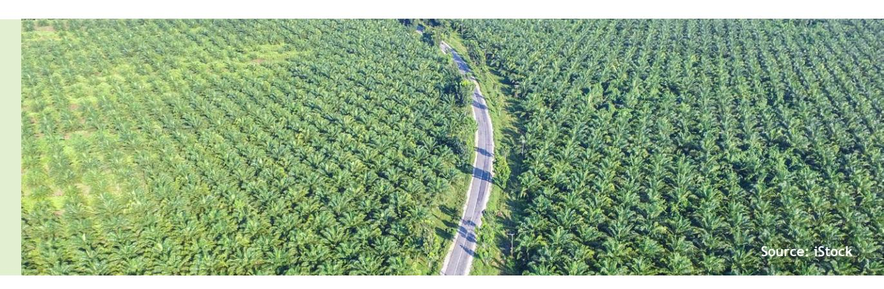

4 EY (2025) – *Seizing the EUDR Compliance Opportunity in Southeast Asia* (see [https://www.ey.com/en\\_vn/insights/sustainability/why](https://www.ey.com/en_vn/insights/sustainability/why-southeast-asia-should-seize-the-eudr-compliance-opportunity)[southeast-asia-should-seize-the-eudr-compliance-opportunity\)](https://www.ey.com/en_vn/insights/sustainability/why-southeast-asia-should-seize-the-eudr-compliance-opportunity). In their publication, EY highlights that the EUDR mandates due diligence for deforestation-free and legally produced commodities, and that Southeast Asian producers—especially in palm oil, cocoa, and rubber—can leverage compliance to gain EU market share and modernize supply chains.

5Eco-Business (2025) – *Technical Knowledge Remains the Biggest Hurdle for Independent Palm Oil Smallholders to Comply with EUDR* (see [https://www.eco-business.com/news/technical-knowledge-remains-the-biggest-hurdle-for-independent-palm-oil-smallholders-to-comply](https://www.eco-business.com/news/technical-knowledge-remains-the-biggest-hurdle-for-independent-palm-oil-smallholders-to-comply-with-eudr/)[with-eudr/\)](https://www.eco-business.com/news/technical-knowledge-remains-the-biggest-hurdle-for-independent-palm-oil-smallholders-to-comply-with-eudr/). This article explains that EUDR compliance requires geolocation data, land legality documents, and traceability systems—posing challenges but also pushing producers toward more transparent and competitive supply chains.

Indonesian Palm Oil Association (GAPKI) (2024) – RSPO Smallholder Strategy.

Cocoa Sustainability Partnership (CSP) (2023) – Indonesia Cocoa Sector Overview.

Malaysian Palm Oil Certification Council (MPOCC) (2022) – MSPO Smallholder Data (also see [https://mspo.org.my/next-generations-of](https://mspo.org.my/next-generations-of-smallholders-in-malaysia/)[smallholders-in-malaysia/](https://mspo.org.my/next-generations-of-smallholders-in-malaysia/)).

Malaysian Rubber Board (LGM) (2024) – *National Commodity Statistics.*

10 CIFOR-ICRAF (2021) – *Current Practices and Innovations in Smallholder Palm Oil Finance in Indonesia and Malaysia* (see [https://www.cifor](https://www.cifor-icraf.org/knowledge/publication/6612/)[icraf.org/knowledge/publication/6612/](https://www.cifor-icraf.org/knowledge/publication/6612/)).

11 RSPO Roundtable RT2025, Eco-Business (2025) – *Palm Smallholders of Malaysia, Indonesia and Thailand Demand Recognition* (see [https://](https://www.eco-business.com/news/palm-smallholders-of-malaysia-indonesia-and-thailand-demand-recognition-as-partners-not-problems-in-palm-oil-industry/) [www.eco-business.com/news/palm-smallholders-of-malaysia-indonesia-and-thailand-demand-recognition-as-partners-not-problems-in-palm](https://www.eco-business.com/news/palm-smallholders-of-malaysia-indonesia-and-thailand-demand-recognition-as-partners-not-problems-in-palm-oil-industry/)[oil-industry/\)](https://www.eco-business.com/news/palm-smallholders-of-malaysia-indonesia-and-thailand-demand-recognition-as-partners-not-problems-in-palm-oil-industry/).

and rubber sectors, yet they face persistent financing challenges that limit their ability to scale and transition toward sustainable production. In both countries, these enterprises operate as regionally anchored processors, cooperatives, and vertically integrated firms that support aggregation, processing, and export. In Malaysia, mid-sized producers account for a substantial share of palm oil and rubber processing, while in Indonesia, they play a key role in cocoa fermentation and rubber sheet production.13 14

Despite their strategic role in supply chain stability and rural employment, many of these companies struggle to access financing for working capital, capital expenditure (capex), and sustainability upgrades. Banks and financial institutions often classify them as high-risk due to limited collateral, volatile commodity prices, and insufficient ESG documentation. Moreover, many operate in semi-formal ecosystems with fragmented data and weak traceability systems, making it difficult to meet loan origination requirements or qualify for sustainability-linked instruments.15 Moreover, the long gestation periods of tree crops and the upfront costs of traceability and certification further deter lenders from offering long-tenor, low-interest products. Without tailored financial mechanisms—such as blended finance, credit guarantees, or group-based ESG onboarding—these producers risk exclusion from regulated markets and miss opportunities to align with deforestation-free trade incentives.

This Knowledge Publication, developed for the fifth Regional Technical Dialogue (RTD#5) under the Sustainable Agriculture for Forest Ecosystems (SAFE) project, builds on insights from earlier dialogues. It aims to catalyse inclusive financing models that support smallholders and producers in achieving deforestationfree, climate-resilient production by exploring financial products such as sustainability-linked credit, blended finance, and incentive frameworks tied to certification and traceability.

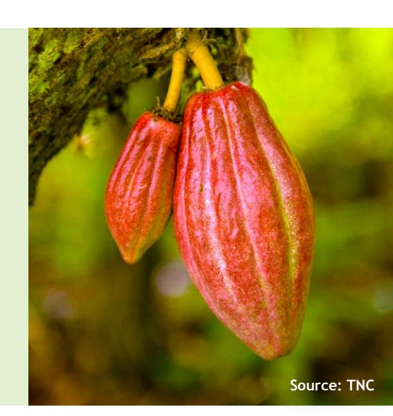

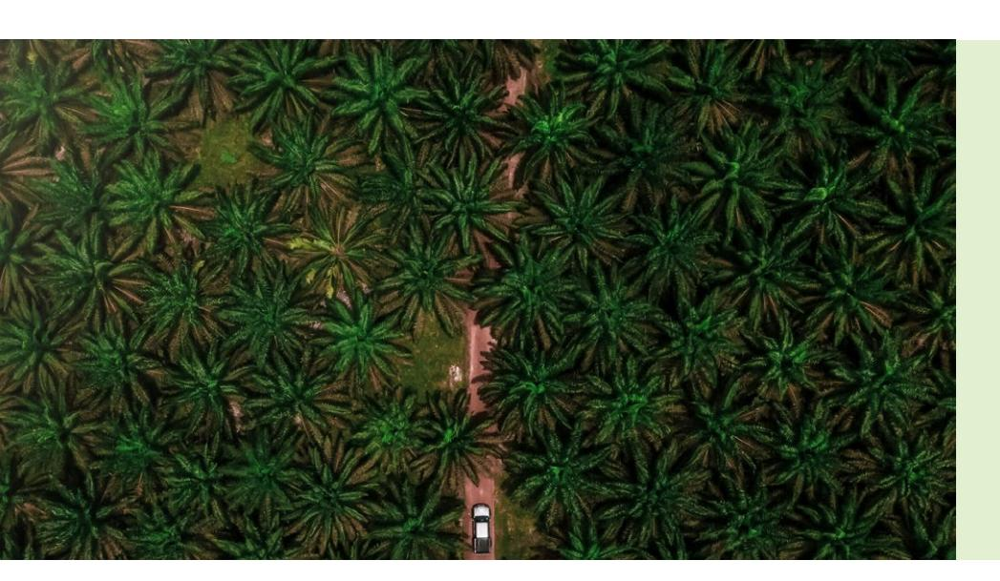

12ECIFOR-ICRAF (2021), *op. cit.*

13ECIFOR-ICRAF (2021), *op. cit.*

14 ASB Working Paper (2024) – *Are Small Farmers Doomed? EUDR's Effect on Palm Oil Supply Chains in Malaysia*

(see <https://asb.edu.my/wp-content/uploads/2024/11/ASB-Working-Paper-Pieter-Asad-20-November-2024-compressed.pdf>).

15 WEF-BFWG Report (2025) – *Banks and Forests Working Group: Sustainable Finance and Land Use in Indonesia*.

# Bottlenecks in Sustainable Finance Across the Supply Chain

Despite growing momentum for deforestation-free trade and sustainability-linked finance, systemic bottlenecks continue to hinder the Áow of capital to smallholders and mid-sized producers in Indonesia and Malaysia's palm oil, cocoa, and rubber sectors.16 Panel discussions at RTD#5 highlighted that stakeholders continue to work in silos. Farmers are repeatedly asked to provide the same traceability data (e.g., STDB) to off-takers, banks, and regulators. This duplication increases transaction costs and erodes trust. A proposed solution is group registration and the establishment of an independent data custodian to manage geo-mapping and traceability securely. In general, these constraints span financial institutions, supply chain actors, and enabling systems—limiting the region's ability to scale inclusive, traceability-linked finance.

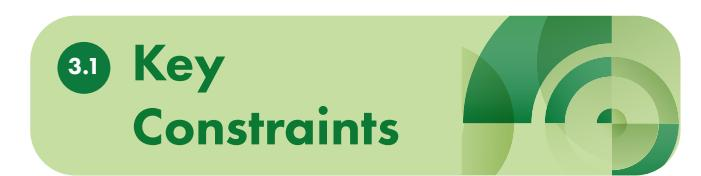

## **Financial institutions (FIs)**

Low green lending (<5% of total portfolios), limited ESG capacity, and risk aversion toward smallholders.

- **• Green lending remains below 5%** of total portfolios in Indonesia: According to the Climate Policy Initiative (CPI) and Bank Indonesia, green lending in Indonesia's banking sector remains under 5%, despite regulatory momentum and the

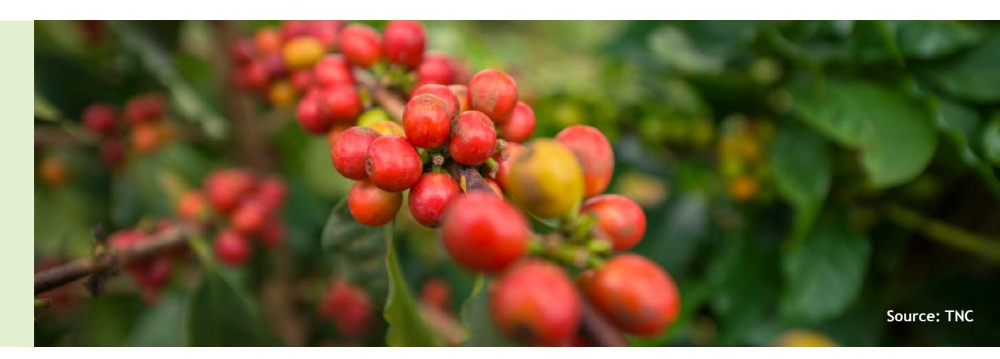

16 Generally, this could also be true to other sectors like coffee, timber.

17 Climate Policy Initiative (CPI) (2024) – *Indonesia's Green Finance Gap.*

18 WEF-BFWG Report (2025), *op. cit.*

19 "High compliance costs" in this context refers to the financial, administrative, and operational burdens that borrowers face when trying to access sustainability-linked products such as SLLs. These include costs related to monitoring and reporting requirements, certification and verification expenses, technology and data infrastructure, capacity building and training, and legal and administrative costs.

20 Bank Mandiri ESG Financing Portal – see <https://www.bankmandiri.co.id/en/esg-financing>.

21 ASB Working Paper (2024), op. cit.

22 Agrobank–FarmByte Strategic Alliance – see [https://www.agrobank.com.my/press-releases/farmbyte-and-agrobank-forge-strategic-alliance](https://www.agrobank.com.my/press-releases/farmbyte-and-agrobank-forge-strategic-alliance-to-strengthen-malaysias-food-security/)[to-strengthen-malaysias-food-security/](https://www.agrobank.com.my/press-releases/farmbyte-and-agrobank-forge-strategic-alliance-to-strengthen-malaysias-food-security/).

23 CIFOR-ICRAF (2021), *op. cit.*

24 BPDPKS Annual Report (2023) – *Replanting and Smallholder Support Programs*.

25 CSP (2023), *op. cit.*

issuance of the Indonesia Green Taxonomy.17

- **• Reluctance to extend long-tenor credit** to smallholders due to **perceived risk, lack of collateral, and limited ESG capacity**: Banks perceive smallholders as high-risk due to informal land tenure and lack of credit history. Smaller banks also struggle with ESG integration due to limited internal capacity.18
- **• Low uptake of sustainability-linked products**  (e.g., sustainability-linked loans [SLLs]): Bank Mandiri, for example, and other institutions have launched SLLs, but uptake remains low due to **high compliance costs**19 and **limited borrower readiness.**20

#### **Supply chain actors**

Traders and buyers often lack mechanisms to cofinance upstream sustainability efforts.

- Traders and buyers **lack mechanisms to co-Ànance upstream sustainability efforts**: Most operate on short-term procurement models, with limited engagement in upstream financing. Exceptions like FarmByte–Agrobank in **Malaysia** show how contract farming and bundled support can work.21
- FarmByte–Agrobank MYR12 million (USD2.8 million) **contract farming initiative**: Agrobank allocated MYR12 million to support FarmByte's contract farming programs, offering financing and market access to small producers.22
- **• Indonesia** has several **emerging models** of upstream **co-Ànancing and contract farming** in agro-commodities, though they remain **fragmented and less institutionalized** than Malaysia's Agrobank–FarmByte approach. In palm oil, the nucleus–plasma scheme pairs large plantations with smallholders, offering input financing and technical support, but can often face criticism over transparency and benefit-sharing.23 In some cases, Badan Pengelola Dana Perkebunan Kelapa Sawit (BPDPKS or the Indonesian Palm Oil Plantation Fund Management Agency) fund supports smallholder replanting, sometimes with mill-led offtake guarantees or pre-financing, though these are not consistently formalized.24 In cocoa, companies like Mars and Nestlé have piloted bundled support programs with cooperatives in

Sulawesi, combining training, input finance, and guaranteed offtake, often backed by platforms like Cocoa Sustainability Partnership (CSP).25 In rubber, processors in Jambi and South Sumatra have experimented with advance payments and input loans tied to certification, but these remain informal and lack scalable financial architecture.

#### **Asset managers and investors** ESG integration remains uneven; biodiversityrelated disclosures are weak.

- ESG integration remains uneven; biodiversityrelated disclosures are weak: The majority of asset managers in Southeast Asia lag in integrating biodiversity into ESG frameworks. The Grantham Institute and the Asia Securities Industry and Financial Markets Association (ASIFMA) note that **nature-related risks are underreported,** and **traceability metrics are rarely embedded** in investment decisions.26 27
- **• Limited alignment with EUDR** and demandside regulations: Without traceability-linked ESG metrics, capital Áows to verified sustainable producers remain constrained, undermining readiness for EUDR.28

#### **Smallholders**

Fragmented data systems, informal land tenure, and limited access to tailored financial products.

- **• Fragmented data** systems, **informal land tenure**, and limited financial literacy: Independent smallholders in Indonesia and Malaysia struggle with land documentation and geolocation data requirements under EUDR.
- **• Exclusion from formal banking channels** and credit origination: Many operate informally and lack the documentation needed for loan origination. Long gestation periods and upfront costs of certification further deter lenders.
- The discussions at RTD#5 and its synthesis notes introduced a "**bankability curve**" categorizing smallholders from Category 0 (illegal/forest-risk) to Category 3 (certified and traceable) (see **Table 1** below).

26 Grantham Institute (2025) – *Sustainability-Linked Finance: Bridging Nature Disclosure Gaps in Southeast Asia.*

27 ASIFMA (2024) – *Navigating Sustainability in Asset Management: A Practitioner's Guide.*

28 Grantham Institute (2025), *op. cit.*

| Farmers operating in                       | illegal areas (e.g. within forest zones or associated |                              |
|--------------------------------------------|-------------------------------------------------------|------------------------------|
| Farmers who may be legally operating (i.e. |                                                       | potentially legal ) but lack |
| Farmers with established                   | land legality who are institutionalized               | (e.g.                        |
| The most ideal stage                       | : farmers are institutionalized                       | , certiÀed , and fully       |
| Category                                   | Description                                           |                              |

**Table 1. Bankability Curve of Smallholders**

#### **Traceability–finance disconnect** Systems like e-Surat Tanda Daftar Budidaya (e-STDB) (Indonesia) and Agrolink (Malaysia) are not yet integrated into credit assessments or loan monitoring:

- While e-STDB and Agrolink are advancing traceability, they are **not yet interoperable with Ànancial institutions' credit scoring** or ESG monitoring systems.29 30 This limits their utility in verifying land legality or productivity for loan origination.

## 3.2 Systemic Gaps

## **Lack of bundled services**

Few financial products combine capital with technical assistance, certification support, and digital onboarding:

- Most financial offerings in Indonesia and Malaysia **remain siloed**. Smallholders often receive credit without accompanying support for certification, traceability, or agronomic training—raising transaction costs and reducing uptake.31 32 33

#### **Absence of group-based verification models**

Financial incentives are rarely tied to group-level compliance:

- While group certification models (e.g., RSPO, MSPO) exist, few financial institutions recognize verified cooperatives as creditworthy anchors. This limits the scalability of traceability-linked finance and ESG performance-based incentives.34 35 36

29 WRI Indonesia (2025) – *Strategic Support Towards Inclusive and Accountable Soft Commodity Supply Chains* (see [https://wri-indonesia.org/](https://wri-indonesia.org/en/initiatives/strategic-support-towards-inclusive-and-accountable-soft-commodity-supply-chain) [en/initiatives/strategic-support-towards-inclusive-and-accountable-soft-commodity-supply-chain\)](https://wri-indonesia.org/en/initiatives/strategic-support-towards-inclusive-and-accountable-soft-commodity-supply-chain)

30 EFI & Terpercaya Initiative (2023) – *Brief on STDB Acceleration and Challenges* (see [https://efi.int/sites/default/files/files/Áegtredd/](https://efi.int/sites/default/files/files/flegtredd/Terpercaya/Other%20resources/Brief_STDB_Acceleration_EN_20231128.pdf) [Terpercaya/Other%20resources/Brief\\_STDB\\_Acceleration\\_EN\\_20231128.pdf\)](https://efi.int/sites/default/files/files/flegtredd/Terpercaya/Other%20resources/Brief_STDB_Acceleration_EN_20231128.pdf).

31 WEF-BFWG Report (2025), *op. cit.*

32 IFC & SECO (2023) – *Legal and Regulatory Review of Crop and Warehouse Receipts in Indonesia.*

33 CIFOR-ICRAF (2021), *op. cit.*

31 WEF-BFWG Report (2025), *op. cit.*

32 IFC & SECO (2023) – *Legal and Regulatory Review of Crop and Warehouse Receipts in Indonesia.*

33 CIFOR-ICRAF (2021), *op. cit.*

# Financial Products and Mechanisms: What Works

Indonesia and Malaysia are advancing a diverse mix of financial instruments to support sustainable financing. Discussions in Malaysia at RTD#5 underscored that smallholders require immediate, tangible financial incentives—such as premium pricing or guaranteed markets—before adopting sustainability practices.37 Market incentives alone are insufficient unless they translate into short-term income gains. Continuous guidance and face-to-face support are also critical for uptake, especially given the aging farmer population and information asymmetry that can also be aligned with efforts to promote deforestation-free, climateresilient commodity production. This section highlights proven mechanisms—from sustainability-linked credit to blended finance and Islamic green instruments that can be scaled to serve smallholders and mid-sized producers in palm oil, cocoa, and rubber sectors.

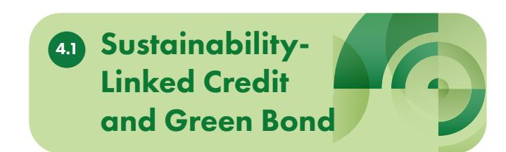

## **Sustainable-linked loans (SLLs)**

As an example, Bank Mandiri has applied sustainabilitylinked finance, offering SLLs that reward borrowers with **interest rate reductions tied to ESG performance**. These loans support clients in carbon-intensive sectors to decarbonize operations, including in sustainable plantations.38 However, uptake remains limited due to high compliance costs, lack of borrower readiness, and weak ESG data integration.39

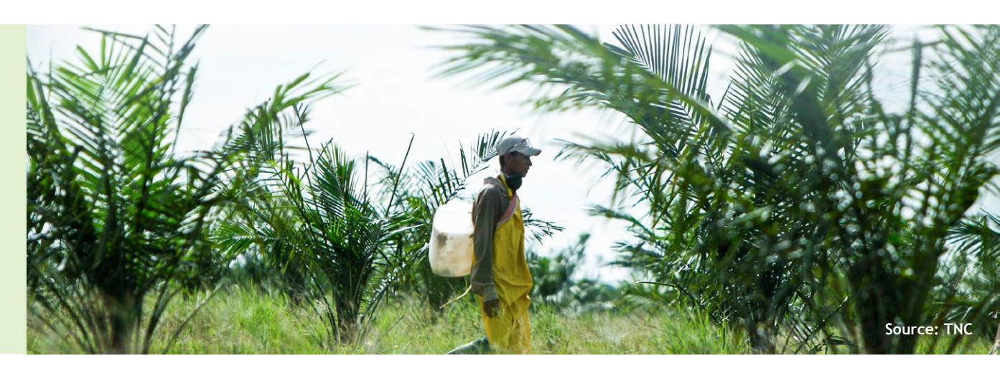

34 RSPO Smallholder Strategy (2024) – *Group Certification and Market Access.*

35 CSP (2023), *op. cit.*

35 ASB Working Paper (2024), *op. cit.*

37There are instances where buyers exclude producers that have converted forest areas, and this exclusion may go beyond the loss of premium pricing to pose substantial market access barriers, hindering producers' ability to sell their products.

38 Bisnis.com (2024) – Bank Mandiri (BMRI) Salurkan Kredit Hijau (Green Loan) Rp130 Triliun (see [https://hijau.bisnis.com/](https://hijau.bisnis.com/read/20240720/653/1783916/bank-mandiri-bmri-salurkan-kredit-hijau-green-loan-rp130-triliun) [read/20240720/653/1783916/bank-mandiri-bmri-salurkan-kredit-hijau-green-loan-rp130-triliun](https://hijau.bisnis.com/read/20240720/653/1783916/bank-mandiri-bmri-salurkan-kredit-hijau-green-loan-rp130-triliun)).

39 Bank Mandiri ESG Financing Portal, *op. cit*.

40 Green bonds are debt instruments where proceeds are earmarked exclusively for projects with environmental benefits. Issuers raise capital from investors, commit to use-of-proceeds reporting, and align with recognized standards (e.g., ASEAN Sustainability Bond Standards), ensuring transparency and accountability in financing climate-aligned initiatives.

41 BRI ESG Sustainable Financing (see *https://www.ir-bri.com/esg/sustainable\_fund.html*).

#### **Green bonds40**

Bank Rakyat Indonesia (BRI) issued IDR6 trillion in green bonds in 2023, aligned with ASEAN Sustainability Bond Standards. Proceeds support renewable energy, sustainable land use, and eco-transport projects, demonstrating how large banks can mobilize capital for climate-aligned development.41

#### **Other SLLs and green bonds**

In addition to Bank Mandiri and BRI, several other banks in Indonesia and Malaysia are expanding their sustainable finance portfolios—including SLLs and/or green bonds—with relevance to palm oil, rubber, and cocoa sectors (please see **Table 2**). Panellists at RTD#5 emphasized that sustainability-linked loans (SLLs) and insurance premium grants can reduce risk and incentivize adoption.

| Bank Central Asia (BCA)                           | has developed an SLL                                   |
|---------------------------------------------------|--------------------------------------------------------|
| support for agriculture and plantation            | clients with                                           |
| traceability and certiÀcation needs.              | 43 44                                                  |
| Bank Negara Indonesia (BNI)                       | has issued green                                       |
| bonds and is active in financing renewable energy |                                                        |
| and sustainable land use.                         | 48 It also supports ESG                               |
| linked lending for agribusiness                   | clients, including                                     |
| palm oil and cocoa processors,                    | though specific                                        |
| volumes are not disclosed publicly.               | 49                                                     |
|                                                   | Maybank has issued both SLLs and Green Sukuk ,         |
|                                                   | guided by its Sustainable Product Framework            |
|                                                   | portfolio. 45 The framework includes financing for     |
|                                                   | NDPE-compliant palm oil clients , renewable            |
|                                                   | energy, and sustainable agriculture                    |
|                                                   | 46 Maybank has                                         |
|                                                   | also committed to supporting traceability-linked       |
|                                                   | lending 47 for certified producers, aligning with its  |
|                                                   | net-zero roadmap and ESG integration strategy.         |
|                                                   | (SLF) including SLLs that rewards clients for meeting  |
|                                                   | pre-agreed Sustainability Performance Targets          |
|                                                   | agribusiness clients). 50 Regarding transition finance |
| Indonesia                                         | Malaysia                                               |

**Table 2. Examples of SLLs and Green Bonds in Indonesia and Malaysia**

42 "Insurance premium grants" are subsidies or financial support provided to cover part of producers' insurance costs. By lowering the expense of risk coverage, these grants reduce financial vulnerability to climate or market shocks and incentivize producers to adopt sustainability-linked practices.

43 BCA – *Sustainable Banking* (see *https://www.bca.co.id/en/tentang-bca/keberlanjutan/perbankan-berkelanjutan*).

44BCA's ESG products are directed mainly at corporate clients, but smallholder farmers benefit indirectly through these companies' supply chain programs, which extend traceability and certification support.

45 Maybank (2023) – *Maybank Group Sustainable Product Framework 2023* (see [https://www.maybank.com/iwov-resources/documents/pdf/](https://www.maybank.com/iwov-resources/documents/pdf/annual-report/2023/Maybank-Group-Sustainable-Product-Framework-2023.pdf) [annual-report/2023/Maybank-Group-Sustainable-Product-Framework-2023.pdf](https://www.maybank.com/iwov-resources/documents/pdf/annual-report/2023/Maybank-Group-Sustainable-Product-Framework-2023.pdf)).

46 Business Today (2024) – *Maybank Ready To Offer Financing For Palm Oil, Power Sector Clients In Achieving Net Zero Targetsn* (see [https://www.](https://www.businesstoday.com.my/2024/05/30/maybank-ready-to-offer-financing-for-palm-oil-power-sector-clients-in-achieving-net-zero-targets/) [businesstoday.com.my/2024/05/30/maybank-ready-to-offer-financing-for-palm-oil-power-sector-clients-in-achieving-net-zero-targets/](https://www.businesstoday.com.my/2024/05/30/maybank-ready-to-offer-financing-for-palm-oil-power-sector-clients-in-achieving-net-zero-targets/)).

47 "Traceability-linked lending" refers to financing models where loan access or terms are tied to the adoption of traceability systems in supply chains. By requiring certified producers to demonstrate transparent tracking of commodities from origin to market, banks reduce ESG risks and incentivize compliance with sustainability standards.

48BNI untuk Indonesia (see [https://www.bni.co.id/id-id/perseroan/bni-esg/bni-untuk-indonesia\)](https://www.bni.co.id/id-id/perseroan/bni-esg/bni-untuk-indonesia).

49CNBC Indonesia (2024) – *Green Economic Forum 2024: Agresif Salurkan Green Financing, BNI Jadi Perusahaan Hijau Terbaik* (see [https://](https://www.cnbcindonesia.com/market/20240529142310-17-542134/agresif-salurkan-green-financing-bni-jadi-perusahaan-hijau-terbaik) [www.cnbcindonesia.com/market/20240529142310-17-542134/agresif-salurkan-green-financing-bni-jadi-perusahaan-hijau-terbaik](https://www.cnbcindonesia.com/market/20240529142310-17-542134/agresif-salurkan-green-financing-bni-jadi-perusahaan-hijau-terbaik)).

50 CIMB – *Sustainability-Linked Financing* (see *https://www.cimb.com.my/en/business/promotions-events/latest-promotions/sustainabilitylinked-financing.html*).

**Bank Syariah Indonesia (BSI)** is exploring Islamic green finance instruments, including **Green Sukuk**  and **Waqf-linked Ànancing**. 52 53 In 2025, BSI signed a strategic partnership with the **Global Green Growth Institute (GGGI)** to advance thematic sukuk development aimed at **mobilizing capital**  for **sustainable agriculture, land restoration, and forestry.**54 These instruments align with Sharia principles and are being piloted for **land restoration**  and **agroforestry**.

#### Blended Finance Structures 4.2

Blended finance in Indonesia and Malaysia is evolving into a powerful mechanism to de-risk and scale sustainable land use investments, particularly in palm oil, rubber, and cocoa. A growing ecosystem of public funds, private capital, and catalytic instruments is enabling long-tenor, traceability-linked, and smallholder-inclusive financing. Below are selected examples of blended finance mechanisms implemented in Indonesia and Malaysia.

**MoU with Wild Asia** in March 2025 to accelerate **sustainable palm oil practices** through the **SPIRAL program**, which supports certification, traceability, and ESG onboarding for smallholders and midsized producers.51 CIMB has also participated in **regional blended Ànance** platforms including **GreenBizReady™**, which supports ESG onboarding for SMEs and agribusinesses. These platforms combine concessional capital, technical assistance, and ESG-linked incentives.

**Agrobank Malaysia**, beyond the SAWIT-i facility, offers **green Ànancing for cocoa and rubber**, including **contract farming models** and **digital traceability pilots**. 55 Its partnership with FarmByte demonstrates bundled support for small producers.

- In Indonesia, the **Tropical Landscapes Finance Facility (TLFF)** (2017-2022) remains a Áagship example, having mobilized **USD95 million** in a **sustainability bond** to **Ànance natural rubber production and ecosystem restoration** in Jambi and East Kalimantan, with the **bond repaid in full**. 56 TLFF, now closed, blended concessional capital from UN Environment and USAID with commercial investment from BNP Paribas and ADM Capital, offering long-tenor loans for landscapescale impact.
- **• BPDPKS (Indonesia's Palm Oil Fund) co-Ànances smallholder replanting and certiÀcation** with **grants** of up to **IDR60 million/ha** (USD3,600/ha)57 and is evolving into a broader **BPDP (Plantation**

51 CIMB (2025) – *CIMB Partners Wild Asia to Accelerate Sustainable Palm Oil for Smallholders* (see [https://www.cimb.com/en/newsroom/2025/](https://www.cimb.com/en/newsroom/2025/cimb-partners-wild-asia-to-accelerate-sustainable-palm-oil-for-smallholders.html)) [cimb-partners-wild-asia-to-accelerate-sustainable-palm-oil-for-smallholders.html\).](https://www.cimb.com/en/newsroom/2025/cimb-partners-wild-asia-to-accelerate-sustainable-palm-oil-for-smallholders.html))

52 BSI (2025) – *Sustainability Sukuk Report January 2025*

(see<https://www.bankbsi.co.id/storage/reports/iSF17M7T7UowNq9qOi8oF9QAnHFZIysHxxc9RQ9t.pdf>).

53 Detik Finance (2025) – *BSI Berencana Terbitkan Sukuk hingga Rp 4 T, Tepatkah?* (see [https://finance.detik.com/bursa-dan-valas/d-7880734/](https://finance.detik.com/bursa-dan-valas/d-7880734/bsi-berencana-terbitkan-sukuk-hingga-rp-4-t-tepatkah) [bsi-berencana-terbitkan-sukuk-hingga-rp-4-t-tepatkah](https://finance.detik.com/bursa-dan-valas/d-7880734/bsi-berencana-terbitkan-sukuk-hingga-rp-4-t-tepatkah)).

54GGGI (2025) – **Global Green Growth Institute and PT Bank Syariah Indonesia Tbk Establish Strategic Partnership to Advance Sustainable Finance Ecosystem Through Thematic Sukuk Development** (see [https://gggi.org/global-green-growth-institute-and-pt-bank-syariah](https://gggi.org/global-green-growth-institute-and-pt-bank-syariah-indonesia-tbk-establish-strategic-partnership-to-advance-sustainable-finance-ecosystem-through-thematic-sukuk-development/)[indonesia-tbk-establish-strategic-partnership-to-advance-sustainable-finance-ecosystem-through-thematic-sukuk-development/](https://gggi.org/global-green-growth-institute-and-pt-bank-syariah-indonesia-tbk-establish-strategic-partnership-to-advance-sustainable-finance-ecosystem-through-thematic-sukuk-development/)).

55 Agrobank–FarmByte Strategic Alliance, *op. cit.*

- **Fund)** platform that could extend support to **cocoa** and **coconut** through traceability-linked incentives and ESG-linked co-financing.58
- The Indonesia Environment Fund (BPDLH) plays a critical role in de-risking and co-investing in traceability and certification programs, collaborating with donors and other financial institutions, and supporting climate-smart agriculture and forest-positive supply chains.
  - **De-risking and co-investment role:** BPDLH is mandated to manage environmental financing instruments, including grants, revolving funds, and de-risking schemes. It plays a catalytic role in co-investing in traceability and certification programs, particularly in forestry, circular economy, and sustainable agriculture sectors.59
  - **Collaboration with UNDP and donors:** In May 2025, BPDLH and UNDP Indonesia launched new financing instruments under the Revolving Fund Facility (FDB) to support inclusive green economy initiatives. These include Sharia-based and catalytic funding schemes targeting forestry and circular economy sectors.60
  - **Support for climate-smart agriculture and forest-positive supply chains:** BPDLH has partnered with multiple stakeholders—including bilateral donors, investors, banks/FIs and NGOs—to fund programs that promote climatesmart agriculture, reduce deforestation, and strengthen community-based forest management.61 It also supports Program Kampung Iklim (ProKlim) and jurisdictional approaches in Kalimantan and Sumatra.
- Private capital is also entering the space. The **Indonesia Impact Fund**, launched by Mandiri Capital Indonesia (MCI) in partnership with UNDP Indonesia, is designed to **support startups and SMEs** that deliver measurable environmental and social impact. The fund targets sectors such as renewable energy, **sustainable agriculture, Ànancial inclusion**, and health tech, and aligns with the UN Sustainable Development Goals (SDGs). It leverages blended capital and ESG screening to catalyse early-stage innovation with scalable impact.
- Another example from private capital is the **Asia Climatesmart Landscape Fund (ACLF)**, launched by ADM Capital in 2023, builds on this model by targeting **USD200 million** in blended capital to **support SMEs** in **sustainable agriculture, agroforestry,** and aquaculture.65 ACLF provides medium-term senior secured loans (USD5–10 million) and is backed by catalytic investors such as the Packard Foundation, Ceniarth, and RS Group. The Fund has extended financing to two enterprises: one specializing in the processing and export of **organic coconut sugar**, and another engaged in **sustainable wood product** manufacturing.66
- Malaysia's blended finance initiatives are increasingly geared toward supporting sustainable agriculture and climate-resilient MSMEs, and these can be used to especially support sectors like palm oil, cocoa, and rubber. For instance, **Bank Pembangunan Malaysia Berhad (BPMB)** offers a dedicated **Blended Finance Programme** that **combines equity and debt** to support high-impact projects that may not qualify for conventional financing.67 Through BPMB Dana Sdn Bhd, the program **targets SMEs and mid-cap companies** with strong operational track records, offering investments between **MYR5 million** to **MYR30 million** (USD1.2–7.2 million) per project. These funds are particularly relevant for **agribusinesses** expanding across the value chain or entering new markets, including **sustainable palm oil, rubber, and cocoa.** The program emphasizes preferential rights and applies BPMB's MIND framework to assess ESG and development impact.68
- For palm oil smallholders, **Agrobank** has a **Program of**  *Tanam Semula Pekebun Kecil Sawit 2.0* **(TSPKS or Easy Financing Program for Oil Palm Smallholders)**. The Program provides grants and long-tenor financing to help smallholders replant oil palm and purchase agricultural inputs—targeting farmers with less than 10 hectares, offering up to **MYR18,000** (USD4,575) per hectare with repayment starting only after four years.69 70
- For **other crops**, **Agrobank** has partnered with **FarmByte**71 to support smallholder farmers. Agrobank allocated **MYR12 million** (USD2.8 million) for **FarmByte's Contract Farming Financing Program**, which covers farm operational expenses—aiming to provide financial support, digital tools, and market access to smallholder farmers, with guaranteed offtake arrangements to

56 ADM Capital (2022) – *TLFF I Sustainability Bond for Natural Rubber Company Repaid in Full* (see [https://www.admcapital.com/tlff-i](https://www.admcapital.com/tlff-i-sustainability-bond-for-natural-rubber-company-repaid-in-full/)[sustainability-bond-for-natural-rubber-company-repaid-in-full/](https://www.admcapital.com/tlff-i-sustainability-bond-for-natural-rubber-company-repaid-in-full/)).The TLFF I sustainability bond was issued to finance PT Royal Lestari Utama (RLU), a joint venture between Michelin and Barito Pacific. RLU repaid the bond in full at maturity, marking the successful closure of the facility.

57 BPDP – *Peremajaan Sawit* Rakyat (see<https://www-ng.bpdp.or.id/id/content/sektor-hulu-sawit-i>).

58 BPDP – *Selayang Pandang* (see [https://www-ng.bpdp.or.id/id/content/selayang-pandang\)](https://www-ng.bpdp.or.id/id/content/selayang-pandang).

59 UNDP (2025) – *Advancing Inclusive Finance For a Green Economy: UNDP Indonesia and BPDLH Develop De-risking Schemes, Sharia Revolving Funds, and Catalytic Funding* (see [https://www.undp.org/indonesia/press-releases/advancing-inclusive-finance-green-economy-undp](https://www.undp.org/indonesia/press-releases/advancing-inclusive-finance-green-economy-undp-indonesia-and-bpdlh-develop-de-risking-schemes-sharia-revolving-funds-and)[indonesia-and-bpdlh-develop-de-risking-schemes-sharia-revolving-funds-and\)](https://www.undp.org/indonesia/press-releases/advancing-inclusive-finance-green-economy-undp-indonesia-and-bpdlh-develop-de-risking-schemes-sharia-revolving-funds-and).

ensure stable income.72

- From the discussions at RTD#5, farmers reported that **certiÀcation (RSPO/ISPO) improved yields and reduced costs**, showing that sustainability itself can be an economic incentive. However, upfront costs remain a barrier, requiring **blended Ànance and other types of Ànancial and technical support.**

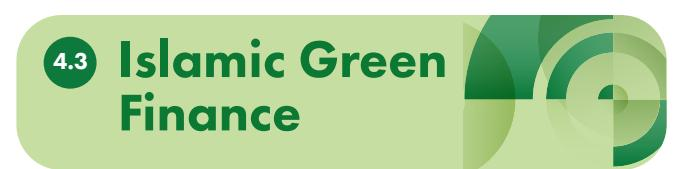

Development

Finance Institutions

4.4

## **Green Sukuk and Waqf Instruments**

#### Used to mobilize climate-aligned capital for agriculture and forest protection.

- Indonesia has pioneered the use of Green Sukuk and Waqf Instruments to mobilize climate-aligned capital for agriculture and forest protection, **blending Islamic Ànance with sustainability goals**. Since 2018, the government has issued over **USD9.6 billion** in Green Sukuk to fund projects in renewable energy, **climate-resilient agriculture**, and **forest conservation**, including **peatland restoration** and **sustainable irrigation**. In parallel, the **Cash Waqf Linked Sukuk (CWLS)** channels philanthropic capital into social infrastructure and environmental programs, allowing waqf funds to support **reforestation**, **agroforestry**, and **community-based land use** initiatives.74 75

These instruments appeal to both ESG-focused and Shariah-compliant investors, enabling Indonesia to expand its climate finance toolkit while reinforcing its commitment to the SDGs.

- Malaysia is earlier exploring Islamic finance innovations such as Green Sukuk and Waqf-linked instruments to mobilize climate-aligned capital for **sustainable agriculture and forest protection**. The government has issued Green Sukuk since 2017, raising over **MYR4.5 billion** (USD1 billion) to fund renewable energy, **reforestation**, and **Áood mitigation projects**, with potential applications in **climate-smart agriculture**. 76 In Johor, the **Waqf Land Development Blueprint** integrates waqf assets into **agroforestry** and **food security** initiatives, enabling blended structures that combine philanthropic capital, concessional loans, and private investment.77 These instruments align with **Malaysia's Maqasid Shariah** principles and SDG targets, offering scalable models for financing inclusive, low-carbon rural development.

Development Finance Institutions (DFIs) in Indonesia and Malaysia play a catalytic role in advancing sustainable palm oil, cocoa, and rubber by de-risking investments, supporting smallholders, and aligning capital with ESG and deforestation-free goals.

61 BPDLH Official Website (see <https://bpdlh.kemenkeu.go.id/>).

62 ProKlim (Program Kampung Iklim) is Indonesia's national climate village program, led by the Ministry of Environment and Forestry. It supports community-level initiatives to reduce greenhouse gas emissions and strengthen climate resilience through sustainable land use, energy efficiency, waste management, and adaptation practices.

63 CPI (2020) – *Indonesia Environment Fund: Bridging the Financing Gap in Environmental Programs* (see [https://www.climatepolicyinitiative.](https://www.climatepolicyinitiative.org/publication/indonesia-environment-fund-bridging-the-financing-gap-in-environmental-programs/) [org/publication/indonesia-environment-fund-bridging-the-financing-gap-in-environmental-programs/](https://www.climatepolicyinitiative.org/publication/indonesia-environment-fund-bridging-the-financing-gap-in-environmental-programs/)).

64 Mandiri Capital – *Enhancing Synergy Between Economic, Environment, and Social Facets* (see [https://www.srv.mandiri-capital.co.id/](https://www.srv.mandiri-capital.co.id/portfolio/funding/3) [portfolio/funding/3](https://www.srv.mandiri-capital.co.id/portfolio/funding/3)).

65 ADM Capital (2023) – *ADM Capital Launches First Impact Fund: The Asia Climate-smart Landscape Fund ("ACLF")* (see [https://www.](https://www.admcapital.com/adm-capital-launches-first-impact-fund/) [admcapital.com/adm-capital-launches-first-impact-fund/](https://www.admcapital.com/adm-capital-launches-first-impact-fund/)).

66 Agriculture Investment Marketplace (2025) – *ADM Capital Invests in the World's Largest and Most Sustainable Nira Supply Chain* (see [https://](https://investinag.com/2024/10/29/adm-capital-invests-in-the-worlds-largest-and-most-sustainable-nira-supply-chain/) [investinag.com/2024/10/29/adm-capital-invests-in-the-worlds-largest-and-most-sustainable-nira-supply-chain/\)](https://investinag.com/2024/10/29/adm-capital-invests-in-the-worlds-largest-and-most-sustainable-nira-supply-chain/).

67 Bank Pembangunan Malaysia – *Blended Finance Programme* (see <https://www.bpmb.com.my/programmes/blended-finance/#Programme>).

68 BPMB's Measuring Impact on National Development (MIND) framework integrates ESG criteria into project evaluation, emphasizing climate resilience and sustainable commodity practices. While deforestation risks are indirectly addressed through certification and sustainability standards, explicit biodiversity targets are not yet systematically embedded in the framework.

69 See [https://www.agrobank.com.my/my/product/program-pembiayaan-mudah-tanam-semula-tspks-dan-input-pertanian-pekebun-kecil](https://www.agrobank.com.my/my/product/program-pembiayaan-mudah-tanam-semula-tspks-dan-input-pertanian-pekebun-kecil-sawit-ippks/)[sawit-ippks/.](https://www.agrobank.com.my/my/product/program-pembiayaan-mudah-tanam-semula-tspks-dan-input-pertanian-pekebun-kecil-sawit-ippks/)

70The financing structure consists of a 50% grant and a 50% loan. Loan amounts are set at MYR14,000 per hectare in Peninsular Malaysia and MYR18,000 per hectare in Sabah and Sarawak, with a repayment tenor of up to 12 years.

- In Indonesia, DFIs such as **PT Sarana Multi Infrastruktur (PT SMI)** have begun integrating sustainability-linked financing into their portfolios. PT SMI, under the Ministry of Finance, has supported climate-resilient infrastructure and is exploring blended finance models for sustainable land use, including replanting and traceability in palm oil and rubber. BPDPKS (and now known as **BPDP**), while not a DFI per se, operates with public finance principles and has disbursed over **IDR7 trillion** (USD418 million) for **smallholder replanting**, **certiÀcation**, and biodiesel subsidies—effectively acting as a sector-specific development financier.78 International DFIs such as the Nederlandse Financierings-Maatschappij voor Ontwikkelingslanden N.V. (FMO or Dutch entrepreneurial development bank) have also invested in NDPE-compliant palm oil companies and landscape programs, often in collaboration with different companies and NGOs.
- In Malaysia, as explained in Sub-section 4.2, **BPMB**  leads with its Blended Finance Programme, offering MYR5–30 million (USD1.2–7.2 million) in equity and

debt to mid-sized agribusinesses aligned with ESG goals, including sustainable palm oil and rubber processors. *Agrobank*, another key DFI, deploys a **Program of TSPKS (Easy Financing Program for Oil Palm Smallholders)**, providing grants and long-tenor financing to help smallholders replant oil palm and purchase agricultural inputs—targeting farmers with less than 10 hectares, offering up to **MYR18,000** (USD4,575) per hectare with repayment starting only after four years.8081 Additionally, **Malaysia's Green Technology Financing Scheme (GTFS)**, managed and overseen by the **Malaysian Green Technology and Climate Change Corporation (MGTC)** with banks as financing partners and companies can access financing through participating financial institutions, supports **sustainable agriculture and agroforestry ventures**. These initiatives are increasingly aligned with the **Malaysian Sustainable Palm Oil (MSPO)** certification and the MSPO Impact Alliance, which brings together DFIs, FMCGs, and civil society to strengthen sustainability across the value chain.82

71 FarmByte is a Johor Corporation agri-digital subsidiary.

72 In September 2024, Agrobank and FarmByte announced a strategic partnership at MAHA 2024. Agrobank allocated MYR12 million to support FarmByte's Contract Farming Financing Program, covering farm operational expenses for crops like brinjal, bitter gourd, and chilli.

73 Khairunna Musari (2022) – *Integrating Green Sukuk and Cash Waqf Linked Sukuk, the Blended Islamic Finance of Fiscal Instruments in Indonesia: A Proposed Model for Fighting Climate Change, IJIK Journal on Green Sukuk and CWLS* (see [https://journal.uinsgd.ac.id/index.](https://journal.uinsgd.ac.id/index.php/ijik/article/download/17750/7313) [php/ijik/article/download/17750/7313\)](https://journal.uinsgd.ac.id/index.php/ijik/article/download/17750/7313).

74 Annisa Nur Salam and Iskandar (2021) – *Integration of Green Sukuk and Cash Waqf Linked Sukuk for Financing Agriculture Sustainable, Asy-Syariah Journal* (see [https://www.researchgate.net/publication/369227417\\_INTEGRATION\\_OF\\_GREEN\\_SUKUK\\_AND\\_CASH\\_WAQF\\_LINKED\\_](https://www.researchgate.net/publication/369227417_INTEGRATION_OF_GREEN_SUKUK_AND_CASH_WAQF_LINKED_SUKUK_FOR_FINANCING_AGRICULTURE_SUSTAINABLE) [SUKUK\\_FOR\\_FINANCING\\_AGRICULTURE\\_SUSTAINABLE](https://www.researchgate.net/publication/369227417_INTEGRATION_OF_GREEN_SUKUK_AND_CASH_WAQF_LINKED_SUKUK_FOR_FINANCING_AGRICULTURE_SUSTAINABLE)).

75 James Guild (2025) – *How Indonesia Is Using Its Green Sukuk, The Diplomat* (see [https://thediplomat.com/2025/07/how-indonesia-is-using](https://thediplomat.com/2025/07/how-indonesia-is-using-its-green-sukuk/)[its-green-sukuk/\)](https://thediplomat.com/2025/07/how-indonesia-is-using-its-green-sukuk/).

76 Azmi & Associates – *Initiatives and Incentives of Green Sukuk in Malaysia* (see [https://amcham.com.my/wp-content/uploads/2025-04-24-](https://amcham.com.my/wp-content/uploads/2025-04-24-Initiatives-and-Incentives-of-Green-Sukuk-in-Malaysia.pdf) [Initiatives-and-Incentives-of-Green-Sukuk-in-Malaysia.pdf\)](https://amcham.com.my/wp-content/uploads/2025-04-24-Initiatives-and-Incentives-of-Green-Sukuk-in-Malaysia.pdf).

77 Ishak et al. (2025) – *The Critical Success Factors of Waqf Land Development for Sustainable Agriculture, Journal of Social Sciences & Humanities Open* (see <https://www.sciencedirect.com/science/article/pii/S2590291124004418>).

78 Warta Ekonomi (2025) – *BPDP Lakukan Efisiensi, Anggaran 2025 Terpangkas Rp2 Triliun* (see [https://wartaekonomi.co.id/read558142/bpdp](https://wartaekonomi.co.id/read558142/bpdp-lakukan-efisiensi-anggaran-2025-terpangkas-rp2-triliun)[lakukan-efisiensi-anggaran-2025-terpangkas-rp2-triliun](https://wartaekonomi.co.id/read558142/bpdp-lakukan-efisiensi-anggaran-2025-terpangkas-rp2-triliun)).

79 FMO – *Stichting And.Green Fund* (see [https://www.fmo.nl/project-detail/58826\)](https://www.fmo.nl/project-detail/58826).

80 See [https://www.agrobank.com.my/my/product/program-pembiayaan-mudah-tanam-semula-tspks-dan-input-pertanian-pekebun-kecil](https://www.agrobank.com.my/my/product/program-pembiayaan-mudah-tanam-semula-tspks-dan-input-pertanian-pekebun-kecil-sawit-ippks/)[sawit-ippks/.](https://www.agrobank.com.my/my/product/program-pembiayaan-mudah-tanam-semula-tspks-dan-input-pertanian-pekebun-kecil-sawit-ippks/)

81 The financing structure consists of a 50% grant and a 50% loan. Loan amounts are set at MYR14,000 per hectare in Peninsular Malaysia and MYR18,000 per hectare in Sabah and Sarawak, with a repayment tenor of up to 12 years.

82 MSPO – *About Us* (see [https://mspo.org.my/about-us/\)](https://mspo.org.my/about-us/).

# Linking Finance to Traceability and Compliance

In Indonesia and Malaysia, the integration of finance with traceability and compliance systems is emerging as a critical enabler for sustainable palm oil, cocoa, and rubber production.83 As global markets tighten due diligence requirements—through regulations like the EUDR and voluntary NDPE commitments—access to finance is increasingly contingent on producers' ability to demonstrate legal land use, transparent supply chains, and verified sustainability practices. Banks and FIs, in turn, are under growing pressure to align portfolios with ESG and climate risk frameworks, prompting a shift toward traceability-linked credit, bundled incentives, and group-based verification models. This section explores how innovative financial mechanisms are being designed to reward compliance, reduce transaction costs, and de-risk investments in smallholder-inclusive supply chains, while highlighting persistent gaps in data infrastructure, interoperability, and institutional coordination.

#### **e-STDB (Indonesia) and Digital Agtech (Malaysia)**

Registration can serve as a proxy for land legality and creditworthiness.

- In both Indonesia and Malaysia, digital smallholder registration systems—namely e-STDB and Digital AgTech (enhanced by Agrolink)—are increasingly recognized as foundational tools for enhancing traceability, land legality verification, and financial inclusion. In Indonesia, the e-STDB

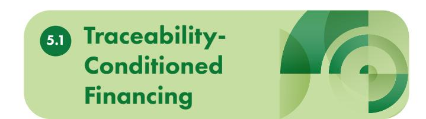

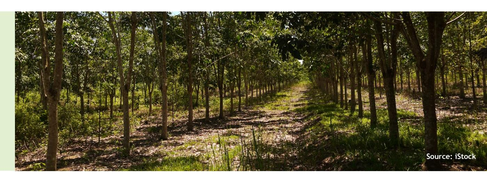

83 In emerging blended finance models, credit is both used to help producers adopt traceability tools and increasingly conditioned on demonstrating traceability capacity, making it both an enabler and a precondition for sustainable commodity financing. In some cases, loans or blended finance can include funding for the tools, training, and systems needed to meet sustainability requirements.

84 Ministry of Agriculture – *e-STDB Official Portal* (see <https://stdb.ditjenbun.pertanian.go.id/beranda>).

85 MDEC – *What is Digital AgTech?* (see<https://mdec.my/digitalagtech>). 86 KAMI (2023) – *Smallholder Registration (STD-B): Challenges and Strategies for Acceleration* (see [https://efi.int/sites/default/files/files/](https://efi.int/sites/default/files/files/flegtredd/Terpercaya/Other%20resources/Brief_STDB_Acceleration_EN_20231128.pdf) [Áegtredd/Terpercaya/Other%20resources/Brief\\_STDB\\_Acceleration\\_EN\\_20231128.pdf](https://efi.int/sites/default/files/files/flegtredd/Terpercaya/Other%20resources/Brief_STDB_Acceleration_EN_20231128.pdf)).

87 JA Hub (2023) – *Smallholder Registration (STD-B) – Challenges and Strategies for Acceleration* (see [https://jaresourcehub.org/publications/](https://jaresourcehub.org/publications/smallholder-registration-std-b-challenges-and-strategies-for-acceleration/) [smallholder-registration-std-b-challenges-and-strategies-for-acceleration/\)](https://jaresourcehub.org/publications/smallholder-registration-std-b-challenges-and-strategies-for-acceleration/).

system, managed by the Directorate General of Plantations, enables smallholders to register their plantation plots, including geospatial boundaries, land tenure status, and crop details. While not a formal land title, the issuance of an e-STDB certificate provides administrative recognition of land use and is being positioned as a proxy for land legality, particularly for smallholders cultivating less than 25 hectares.84 This data, when verified and integrated with spatial and productivity information, can support financial institutions in assessing creditworthiness, especially for sustainability-linked lending.

- Malaysia does have official farmer registration and digitalisation initiatives, but they are not consolidated into a single statutory system like Indonesia's e‑STDB. Instead, Malaysia's government promotes digitalisation through programs such as Digital AgTech (led by Malaysia Digital Economy Corporation [MDEC]) and sectoral schemes under the Ministry of Agriculture and Food Security.85 These initiatives focus on farmer profiling, digital tools, and traceability, often linked to certification systems like MSPO (Malaysian Sustainable Palm Oil). In addition to the government's initiatives, private platforms like Malaysia's Agrolink (its functions—digital farmer registration, legality checks, and traceability—are consistent with the Ministry of Agriculture and Food Security's push for digitalization and sustainable agriculture) digitize farmer profiles, land use, and production data to facilitate access to government support and financing schemes. By linking these registries with ESG compliance indicators and financial services, both systems hold potential to reduce due diligence costs, enhance risk assessment, and unlock inclusive finance for smallholders in palm oil, cocoa, and rubber sectors.86 87

## **Conditional Disbursement Models**

Conditional disbursement models in Indonesia and Malaysia are increasingly linking financing to traceability milestones—such as plot registration, group verification, and compliance documentation—to de-risk investments and incentivize sustainable practices in palm oil, cocoa, and rubber sectors.

- In Indonesia, initiatives like the **Terpercaya program and ISPO-RSPO harmonization** efforts have highlighted the potential of **tying Ànancial support to veriÀed land legality and supply chain transparency**, especially for smallholders who often lack formal documentation.88 89 Building on Terpercaya, the government has institutionalized the framework as *Indikator Yurisdiksi Berkelanjutan*  (Sustainable Jurisdiction Indicators or IYB), which provides jurisdictional sustainability indicators to measure and verify compliance at district and provincial levels—further strengthening the link between traceability, finance, and market access.90 Furthermore, access to replanting subsidies or ESG-linked credit may be contingent on e-STDB registration and group-level verification, enabling financial institutions to assess risk and monitor compliance more effectively. In Malaysia, similar approaches are emerging under the MSPO91, where conditional financing is used to promote data collection, geolocation mapping, and farmer group formalization. These models align with the EUDR, which requires geospatial traceability and legality proof for commodity exports, thereby pushing both governments and financial actors to integrate traceability into disbursement protocols.92 By embedding traceability milestones into financing workÁows, these models not only reduce due diligence costs for the buying companies but also catalyse inclusive compliance and long-term sustainability.

88 KAMI – *Strengthening the Collection of Palm Oil Supply Chain Traceability Information in Indonesia* (see [https://efi.int/sites/default/files/](https://efi.int/sites/default/files/files/flegtredd/Terpercaya/Briefings/Traceability_Regulations.pdf) [files/Áegtredd/Terpercaya/Briefings/Traceability\\_Regulations.pdf](https://efi.int/sites/default/files/files/flegtredd/Terpercaya/Briefings/Traceability_Regulations.pdf)).

89 CIPS (2023) – *Achieving Indonesian Palm Oil Farm-to-Table Traceability through ISPO-RSPO Harmonization* (see [https://repository.cips](https://repository.cips-indonesia.org/media/publications/560227-achieving-indonesian-palm-oil-farm-to-ta-895dbce4.pdf)[indonesia.org/media/publications/560227-achieving-indonesian-palm-oil-farm-to-ta-895dbce4.pdf\)](https://repository.cips-indonesia.org/media/publications/560227-achieving-indonesian-palm-oil-farm-to-ta-895dbce4.pdf).

90EFI – *Sejarah Pendekatan Yurisdiksi Berkelanjutan* (see [https://efi.int/sites/default/files/files/Áegtredd/Terpercaya/Other%20resources/](https://efi.int/sites/default/files/files/flegtredd/Terpercaya/Other%20resources/History%20of%20SJI_BI%20%28A4%29%20-%20SCREEN.pdf) [History%20of%20SJI\\_BI%20%28A4%29%20-%20SCREEN.pdf\)](https://efi.int/sites/default/files/files/flegtredd/Terpercaya/Other%20resources/History%20of%20SJI_BI%20%28A4%29%20-%20SCREEN.pdf).

91 FACT Dialogue – *Malaysia's Palm Oil Traceability* (see [https://www.cifor-icraf.org/publications/project-pdf/FACT/Case-Studies/FACT-](https://www.cifor-icraf.org/publications/project-pdf/FACT/Case-Studies/FACT-CaseStudies-Malaysia-en.pdf)[CaseStudies-Malaysia-en.pdf](https://www.cifor-icraf.org/publications/project-pdf/FACT/Case-Studies/FACT-CaseStudies-Malaysia-en.pdf)).

92 Peterson Solutions (2025) – *EUDR 2025: Opportunities and Challenges for Indonesian Commodities Under the EU's Green Trade Agenda* (see [https://www.petersonindonesia.com/post/eudr-2025-opportunities-and-challenges-for-indonesian-commodities-under-the-eu-s-green-trade](https://www.petersonindonesia.com/post/eudr-2025-opportunities-and-challenges-for-indonesian-commodities-under-the-eu-s-green-trade-agenda)[agenda](https://www.petersonindonesia.com/post/eudr-2025-opportunities-and-challenges-for-indonesian-commodities-under-the-eu-s-green-trade-agenda)).

- Group Verification and MRV Integration 5.2
- Banks and FIs in Indonesia and Malaysia can i**ntegrate geolocation, legality, and sustainability metrics into loan origination and monitoring** for palm oil, cocoa, and rubber sectors.93 In Indonesia, platforms like e-STDB and ISPO certification systems provide geospatial and administrative data that can be used to assess land legality and sustainability compliance. Banks and FIs can incorporate these datasets into credit scoring models, enabling more accurate risk profiling and ESG-aligned lending. For example, group verification mechanisms where smallholders are organized into formal clusters—allow financial institutions to monitor collective compliance and productivity, reducing transaction costs and improving loan performance. In Malaysia, the MSPO 2.0 standard, complemented by digital agri-tech platforms such as Agrolink, can support the integration of traceability data into financial workÁows—especially for smallholder clusters in cocoa and rubber sectors. These efforts align with broader climate finance and blended finance strategies that prioritize data-driven monitoring, reporting, and verification (MRV) to ensure environmental and social safeguards.
- There is growing potential **for interoperable systems between traceability platforms and Ànancial databases** in both countries, which could significantly enhance transparency, reduce due diligence costs94, and unlock inclusive finance. In Indonesia, the Terpercaya initiative and European Forest Institute (EFI)'s traceability pilots have explored how ISPO, e-STDB, and NDPE-aligned platforms can be linked with financial systems to support conditional disbursement and ESG-linked credit. The integration of traceability data such as plot geolocation, land legality status, and group verification—into banking systems enables automated compliance checks and realtime monitoring.95 In Malaysia, the government's push for a unified traceability backbone under MSPO, complemented by private digital agri-tech platforms such as Agrolink, creates opportunities for interoperability with financial institutions especially in palm oil as well as other crops (e.g., cocoa and rubber) where traceability remains less mature.96 Such systems could allow banks to verify farmer and/or cooperative eligibility, monitor sustainability milestones, and align disbursements with compliance progress, thereby operationalizing MRV frameworks and strengthening climate-smart finance.

93 Certain banks in Indonesia (names withheld for confidentiality) incorporate geolocation data as part of their loan case review process.

94 Due diligence costs are generally borne not only by buyer companies conducting risk assessments and compliance checks, but also by producer companies that must generate and supply detailed data, implement traceability systems, and maintain compliance records. This dual burden reÁects the regulation's requirement for transparent, deforestation-free supply chains.

95 *Ibid.*

96 EFI (2025) – *EFI and MSPO Partner to Boost Sustainability, Traceability and Credibility of Malaysian Sustainable Palm Oil* (see [https://efi.int/](https://efi.int/news/efi-and-mspo-partner-boost-sustainability-traceability-and-credibility-malaysian-sustainable) [news/efi-and-mspo-partner-boost-sustainability-traceability-and-credibility-malaysian-sustainable](https://efi.int/news/efi-and-mspo-partner-boost-sustainability-traceability-and-credibility-malaysian-sustainable)).

## Incentive Structures for Verified Sustainable Production

In Indonesia and Malaysia, incentive structures are playing a pivotal role in accelerating the adoption of verified sustainable practices across palm oil, cocoa, and rubber sectors. As global buyers and regulators demand traceable, deforestation-free commodities, producers are increasingly responding to marketbased signals and policy-driven rewards. In particular, the EUDR has raised the bar by requiring geolocationbased traceability and legality proof for commodity exports, effectively making verified sustainable production a prerequisite for continued access to EU markets. This regulatory shift is reshaping incentives: from tariff reductions and preferential trade terms to long-term offtake agreements tied to sustainability performance. Fiscal and financial incentives are also key to accelerate sustainable production. This section explores how financial and commercial levers are being deployed to reward verified production, reduce risk, and align supply chains with evolving ESG and trade requirements.

## **Preferential Market-Access Mechanisms**

Certified, traceable commodities in Indonesia and Malaysia are increasingly benefiting from preferential market-access mechanisms, particularly in the palm oil sector. In Malaysia, the MSPO certification has become a prerequisite for accessing reduced import tariffs under the Malaysia-European Free Trade Association (EFTA) Economic Partnership Agreement (MEEPA). This agreement enables certified exporters to benefit from tariff reductions ranging from 20% to 40%, depending on the product category.97 98 Similarly, Indonesia is

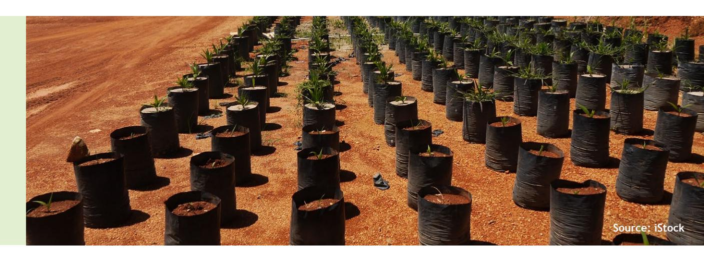

97 MSPO (2025) – *Malaysia Secures Preferential Market Access for Sustainable Palm Oil* (see [https://mspo.org.my/announcement/malaysia](https://mspo.org.my/announcement/malaysia-secures-eu-efta-market-access/)[secures-eu-efta-market-access/](https://mspo.org.my/announcement/malaysia-secures-eu-efta-market-access/)).

98 Bernama (2025) – *Malaysia Gains Preferential Palm Oil Market Access through MEEPA* (see [https://www.bernama.com/en/news.](https://www.bernama.com/en/news.php?id=2438277) [php?id=2438277](https://www.bernama.com/en/news.php?id=2438277)).

99 CGTN (2025) – *Indonesian Palm Oil, Cocoa, and Rubber Likely to Get Zero or Near-Zero Tariffs from U.S.: Chief Tariff Negotiator* (see [https://](https://news.cgtn.com/news/2025-08-26/news-1G9zXnJJy80/p.html) [news.cgtn.com/news/2025-08-26/news-1G9zXnJJy80/p.html](https://news.cgtn.com/news/2025-08-26/news-1G9zXnJJy80/p.html)).

100 Tempo.co. (2025) – *Indonesia's CPO Exports to EU Hit with 0% Tariffs Following IEU-CEPA Deal* (see [https://en.tempo.co/read/2034753/](https://en.tempo.co/read/2034753/indonesias-cpo-exports-to-eu-hit-with-0-tariffs-following-ieu-cepa-deal) [indonesias-cpo-exports-to-eu-hit-with-0-tariffs-following-ieu-cepa-deal](https://en.tempo.co/read/2034753/indonesias-cpo-exports-to-eu-hit-with-0-tariffs-following-ieu-cepa-deal)).

negotiating preferential trade terms with the United States that could result in zero or near-zero tariffs for certified palm oil, cocoa, and rubber exports.99 In parallel, the Indonesia–EU Comprehensive Economic Partnership Agreement (IEU-CEPA) is expected to eliminate import tariffs on palm oil—previously ranging from 5% to 11%—thereby enhancing Indonesia's competitive position in the European market.100 These market-access (or trade) incentives strengthen the competitiveness of verified sustainable production, ensuring that compliant producers gain secure access to high-value markets while meeting traceability and environmental standards. For smallholders and mid-sized producers, this creates a tangible financial rationale for investing in certification and traceability systems, especially as global buyers increasingly demand deforestation-free and legally sourced commodities.

## **Offtake Agreements**

Long-term contracts tied to sustainability performance are emerging as a powerful tool to **de-risk investments and incentivize veriÀed production** in Indonesia and Malaysia. In the palm oil sector, major buyers and processors are entering into multi-year offtake agreements with producer groups and cooperatives that commit to NDPE compliance and traceability milestones. These **agreements often include technical assistance, price Áoors, and volume guarantees**, providing producers with market certainty and financial stability. For instance, in Indonesia, initiatives supported by development partners and corporate buyers have piloted offtake-linked financing models for certified smallholder groups, particularly in jurisdictions aligned with ISPO and RSPO standards.101 In Malaysia, similar arrangements are being explored under the MSPO 2.0 framework and cocoa sustainability programs, where buyers commit to sourcing from traceable, certified producers in exchange for longterm supply security. These contracts not only align incentives across the supply chain but also serve as collateral or risk mitigation instruments for accessing blended finance and ESG-linked credit.

## **Interest Subsidies**

In both Indonesia and Malaysia, interest subsidies are increasingly being linked to ESG milestones or sustainability certification status to encourage responsible production in the agriculture sector including for palm oil, cocoa, and rubber. In Indonesia, pilot projects and blended finance initiatives are seeking to align the government's **Kredit Usaha Rakyat (KUR)** scheme with sustainability programs, aiming to extend **lower interest rates for smallholders and cooperatives that are ISPO-certiÀed** or engaged in traceability pilots, particularly in palm oil-producing regions like Riau and West Kalimantan. These supports are designed to reduce the cost of capital for producers who invest in sustainable practices such as replanting with certified seedlings, adopting agroforestry, or participating in group verification schemes.102 In Malaysia, **Bank Negara Malaysia's Value-Based Intermediation (VBI) framework** encourages financial institutions to offer **concessional Ànancing** to certified producers under the MSPO and Malaysian Cocoa Board's sustainability programs. Some banks have piloted ESG-linked loans with interest rebates triggered by milestones such as geolocation mapping, zero-burning compliance, or group-level MSPO certification.103 These mechanisms not only lower financial barriers but also embed sustainability into credit risk assessments.

#### **Tax Waivers**

Fiscal incentives such as tax exemptions or deductions are still being explored to reward cooperatives and producer groups that adopt deforestation-free practices in Indonesia and Malaysia. In Indonesia, the Ministry of Finance has issued regulations allowing for income tax deductions for cooperatives engaged in environmental protection and sustainable land use,

Fiscal and Financial Incentives

6.2

101 CIFOR-ICRAF – *Achieving Sustainability in the Palm Oil Sector: Challenges and Key Interventions for Indonesia and Malaysia* (see [https://efi.](https://efi.int/sites/default/files/files/flegtredd/KAMI/Resources/CIFOR%203%20policy%20brief.pdf) [int/sites/default/files/files/Áegtredd/KAMI/Resources/CIFOR%203%20policy%20brief.pdf](https://efi.int/sites/default/files/files/flegtredd/KAMI/Resources/CIFOR%203%20policy%20brief.pdf)).

102KAMI (2022) – *Sustainability Certifications, Approaches, and Tools for Oil Palm in Indonesia and Malaysia* (see [https://efi.int/sites/default/](https://efi.int/sites/default/files/files/flegtredd/KAMI/Resources/Sustainability%20certifications%2C%20approaches%2C%20and%20tools%20for%20oil%20palm%20in%20Indonesia%20and%20Malaysia%20report.pdf) [files/files/Áegtredd/KAMI/Resources/Sustainability%20certifications%2C%20approaches%2C%20and%20tools%20for%20oil%20palm%20in%20](https://efi.int/sites/default/files/files/flegtredd/KAMI/Resources/Sustainability%20certifications%2C%20approaches%2C%20and%20tools%20for%20oil%20palm%20in%20Indonesia%20and%20Malaysia%20report.pdf) [Indonesia%20and%20Malaysia%20report.pdf](https://efi.int/sites/default/files/files/flegtredd/KAMI/Resources/Sustainability%20certifications%2C%20approaches%2C%20and%20tools%20for%20oil%20palm%20in%20Indonesia%20and%20Malaysia%20report.pdf)).

particularly those aligned with national certification schemes like ISPO or participating in jurisdictional sustainability programs. While implementation remains uneven, pilot initiatives in Central Kalimantan and Jambi have demonstrated how tax relief can incentivize group-level compliance and reinvestment in traceability infrastructure.104 In Malaysia, the government has introduced tax incentives under **the Green Investment Tax Allowance (GITA)** and **Green Income Tax Exemption (GITE)** schemes, which can be accessed by agribusinesses—including palm oil and rubber cooperatives—that invest in certified sustainable production, renewable energy, or traceability systems. These waivers are part of a broader fiscal strategy to align national commodity sectors with global ESG expectations and reduce the compliance cost burden on smallholders and cooperatives.

- **• Combining Ànance with technical assistance, certiÀcation support, and digital tools**—can be proven essential to reduce transaction costs and improve uptake of sustainability practices in Indonesia and Malaysia's palm oil, cocoa, and rubber sectors:

- In Indonesia, initiatives such as the **GIZ-GRASS** project and **Koltiva's traceability programs** have demonstrated how **bundling Ànancial access with certiÀcation support and digital farm management** tools can accelerate smallholder inclusion. For example,

Koltiva's multi-commodity platform integrates geolocation mapping, ISPO/RSPO certification guidance, and credit facilitation, enabling smallholders to meet traceability requirements while accessing working capital and agronomic advice.106 Similarly, the Ministry of Agriculture's ISPO strengthening strategy under Presidential Regulation No. 16/2025 emphasizes bundled support—linking certification with digital traceability and financial incentives—to scale verified sustainable production.107

- In Malaysia in 2021, **HSBC Amanah** launched **Malaysia's Àrst green trade Ànancing facility**, enabling Guan Chong Berhad to procure certified cocoa beans under agroforestry systems by **bundling concessional Ànance with sustainability certiÀcation and supply chain traceability**.

- For palm oil, through **TSPKS (Easy Financing Program for Oil Palm Smallholders)**, smallholders can obtain grants and long-tenor financing to help smallholders replant oil palm and purchase agricultural inputs, and this can be complemented by training and certification support to meet MSPO standards as well as integrated with digital monitoring platforms like **e‑MSPO**, enhancing traceability and ensuring compliance across the supply chain.

- Referring to Table 1 on bankability curve of smallholders, bundled service models that combine blended finance and different supports for smallholders can be designed to move farmers progressively along this curve, with government intervention at Category 0–1, blended finance at Category 2, and commercial banks at Category 3. See Table 3 below.

103 MSPO (2025) – About Us (see <https://mspo.org.my/about-us/>).

104 CIFOR-ICRAF, *op. cit.*

105 MPSO (2025), *op. cit.*

106 Koltiva – *Closing the Market Access Gap in Indonesia's Palm Oil Sector]* (see [https://www.koltiva.com/post/closing-the-market-access-gap-](https://www.koltiva.com/post/closing-the-market-access-gap-in-indonesia-s-palm-oil-sector-through-certification)

[in-indonesia-s-palm-oil-sector-through-certification](https://www.koltiva.com/post/closing-the-market-access-gap-in-indonesia-s-palm-oil-sector-through-certification)).

107 Palm Oil Magazine (2025) – *Indonesia Strengthens ISPO Certification Across the Palm Oil Value Chain* (see [https://www.palmoilmagazine.](https://www.palmoilmagazine.com/headlines/2025/06/05/indonesia-strengthens-ispo-certification-across-the-palm-oil-value-chain-for-sustainability/) [com/headlines/2025/06/05/indonesia-strengthens-ispo-certification-across-the-palm-oil-value-chain-for-sustainability/](https://www.palmoilmagazine.com/headlines/2025/06/05/indonesia-strengthens-ispo-certification-across-the-palm-oil-value-chain-for-sustainability/)).

108 See<https://theedgemalaysia.com/node/576110>.

|          | Farmers operating in     | illegal areas (e.g.                  |
|----------|--------------------------|--------------------------------------|
| (i.e.    | potentially legal        | ) but lack formal                    |
|          | Farmers with established | land legality                        |
| who      | are                      | institutionalized (e.g.              |
| The      | most ideal stage         | : farmers are                        |
|          | institutionalized ,      | certiÀed , and fully                 |
|          |                          | Still primarily public institutions. |
|          |                          | Technical assistance (TA) and        |
|          |                          | grant financing (working with the    |
|          |                          | commercial. Requires blended         |
|          |                          | repayment schedules (e.g., longer    |
| Category | Description              | Financing Access & Role              |

**Table 3. Bankability Curve of Smallholders**

# Collaborative Platforms and Multi-Stakeholder Models

Achieving sustainable, traceable, and inclusive commodity production in Indonesia and Malaysia requires more than isolated interventions—it demands coordinated action across public, private, and philanthropic actors. In the palm oil, cocoa, and rubber sectors, collaborative platforms and multi-stakeholder models are emerging as critical vehicles for aligning incentives, pooling resources, and scaling impact. These models enable co-financing of traceability systems, jurisdictional approaches to sustainability, and shared accountability frameworks that bridge producers, buyers, financiers, and regulators. By fostering trust, reducing duplication, and embedding sustainability into procurement and finance, such partnerships are helping to operationalize ESG commitments and regulatory compliance—while ensuring that smallholders and local communities are not left behind in the transition to deforestation-free and climate-resilient value chains.

## **BPDP–BPDLH–Donor Coalitions**

In Indonesia, BPDP and BPDLH are increasingly partnering with donor coalitions to co-finance traceability and replanting initiatives. As mentioned in Sub-section 4.4, BPDP, funded through export levies, has disbursed over IDR 7 trillion to support smallholder replanting, certification, and biodiesel blending. BPDLH complements this by channelling climate and biodiversity-linked grants toward jurisdictional traceability pilots and forest-positive commodity programs. These agencies have begun collaborating

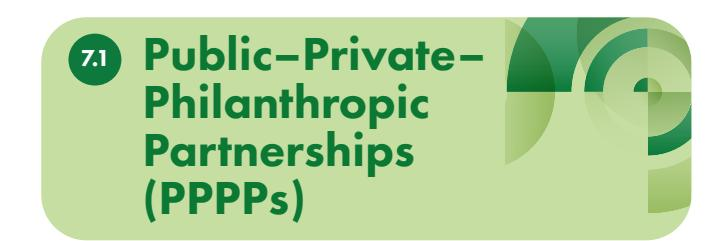

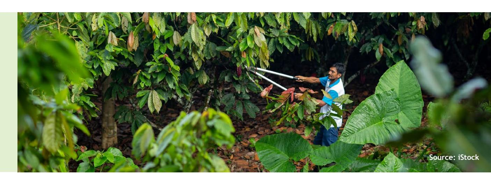

109 GAPKI (2024) – *GAPKI Welcomes BPDP, but Demands Palm Fund Well-Kept* (see https://gapki.id/en/news/2024/10/30/gapki-welcomes-bpdpbut-demands-palm-fund-well-kept/).

110 Indonesia Palm Oil (2024) – *Indonesia Takes Initiative with National Dashboard* (see [https://www.indonesiapalmoilfacts.com/indonesia](https://www.indonesiapalmoilfacts.com/indonesia-takes-initiative-with-national-dashboard/)[takes-initiative-with-national-dashboard/\)](https://www.indonesiapalmoilfacts.com/indonesia-takes-initiative-with-national-dashboard/).

111 The Rimba Collective and Landscape Finance Lab are distinct but complementary jurisdictional finance platforms: the Rimba Collective, facilitated by Lestari Capital, channels corporate-backed payments into forest restoration and traceability-linked interventions, while the Landscape Finance Lab designs and supports blended public–private–philanthropic finance structures for sustainable commodity production at the landscape level.

with development partners such as GIZ and the EU to align public subsidies with donor-funded technical assistance, particularly in provinces like Jambi and Central Kalimantan. This blended finance approach reduces the cost of compliance for smallholders and enables scalable traceability systems for palm oil, cocoa, and rubber.109 110

### **Rimba Collective and Landscape Finance Lab111**

The Rimba Collective and Landscape Finance Lab represent pioneering jurisdictional finance platforms that align corporate sourcing commitments with longterm conservation and community development goals. The Rimba Collective, backed by global brands and facilitated by Lestari Capital, channels upfront and performance-based payments into forest restoration and traceability-linked interventions across Southeast Asia—including Indonesia and Malaysia.112 Landscape Finance Lab, meanwhile, supports multi-stakeholder landscape programs that blend public, private, and philanthropic capital to finance sustainable commodity production. These platforms enable buyers to fulfil NDPE and EUDR obligations while supporting local governments and producer groups in achieving verified sustainability outcomes. Their jurisdictional scope allows for coordinated investment in traceability infrastructure, MRV systems, and inclusive finance.113

Without these, PPPPs risk fragmentation and distrust.

#### Inputs from panellists at RTD#5 stressed that effective PPPPs require five pillars:

**Communication across silos**

**Governance structures for data and knowledge sharing**

**People capacity at all levels (farmers, local government, private sector)**

**Ongoing development and continuation of understanding of both knowledge products and business models.**

**Landscape/jurisdictional speciÀcity**

#### **Co-investment in upstream sustainability**

(e.g., pre-financing, shared risk)

Buyers and traders are increasingly co-investing in upstream sustainability through mechanisms such as pre-financing, shared risk arrangements, and technical support. In Indonesia, corporate farming models and supply chain finance pilots have enabled traders to provide working capital and agronomic support to smallholder groups committed to traceability and certification.114 These arrangements can often include risk-sharing clauses that protect producers from market volatility while ensuring compliance with NDPE and ISPO standards. In Malaysia115, similar models are emerging, where buyers collaborate with cooperatives to finance digital traceability tools and sustainability training. This co-investment reduces the burden on producers and aligns commercial incentives with ESG outcomes.116

Role of Buyers

and Traders

7.2

112 Rimba Collective – *Collective Action to Deliver Individual Corporate Sustainability Commitment* (see <https://rimbacollective.com/>).

 113 Green Finance Institute – *Rimba Collective* (see [https://hive.greenfinanceinstitute.com/gfihive/revenues-for-nature/case-studies/rimba](https://hive.greenfinanceinstitute.com/gfihive/revenues-for-nature/case-studies/rimba-collective/)[collective/\)](https://hive.greenfinanceinstitute.com/gfihive/revenues-for-nature/case-studies/rimba-collective/).

114 Witjaksono et al. (2024) – *Corporate Farming Model for Sustainable Supply Chain Crude Palm Oil of Independent Smallholder Farmers, Frontier Sustainable Food System* (see [https://www.frontiersin.org/journals/sustainable-food-systems/articles/10.3389/fsufs.2024.1418732/](https://www.frontiersin.org/journals/sustainable-food-systems/articles/10.3389/fsufs.2024.1418732/full) [full\)](https://www.frontiersin.org/journals/sustainable-food-systems/articles/10.3389/fsufs.2024.1418732/full).

115 WEF (2024) – *How Malaysia is Embracing Digital Transformation to Achieve Sustainability* (see [https://www.weforum.org/stories/2024/08/](https://www.weforum.org/stories/2024/08/malaysia-digital-transformation-sustainable-progress/) [malaysia-digital-transformation-sustainable-progress/\)](https://www.weforum.org/stories/2024/08/malaysia-digital-transformation-sustainable-progress/).

#### **Embedding sustainability into sourcing contracts and procurement policies**

Major buyers and processors are embedding sustainability criteria into sourcing contracts and procurement policies to enforce traceability and environmental compliance. In Malaysia, companies like **PaciÀc Inter-Link (PIL)** have adopted NDPE-aligned sourcing policies that require suppliers to demonstrate legality, zero-burning practices, and certification under MSPO or RSPO.117 In Indonesia, procurement frameworks increasingly reference ISPO certification and traceability milestones as prerequisites for supplier engagement. These contractual mechanisms serve as enforcement tools for sustainability commitments and create market pressure for verified production across palm oil, cocoa, and rubber supply chains. They also enable downstream actors to meet regulatory obligations under frameworks like the EUDR and corporate ESG disclosures.118 Malaysiaspecific discussions at RTD#5 highlighted the need to regulate middlemen/dealers in palm oil supply chains, ensuring they are MSPO-certified to prevent leakage and exclusion. Neutral organizations are needed to coordinate fragmented smallholders and ensure compliance.

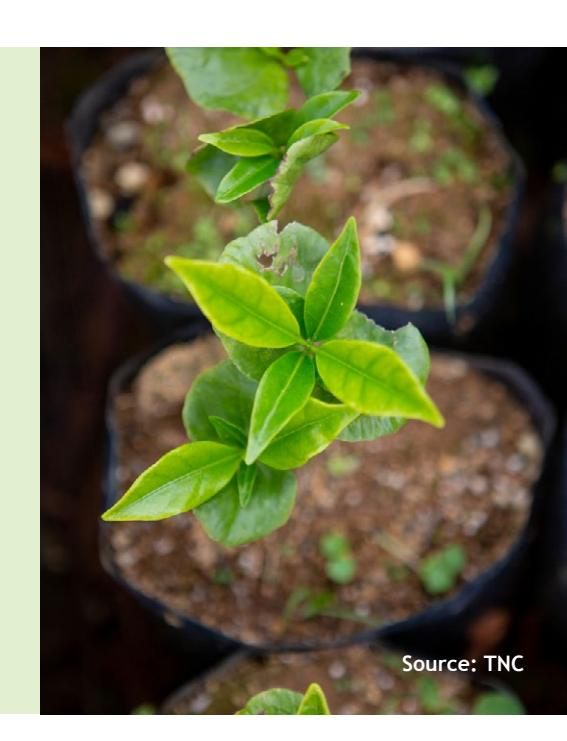

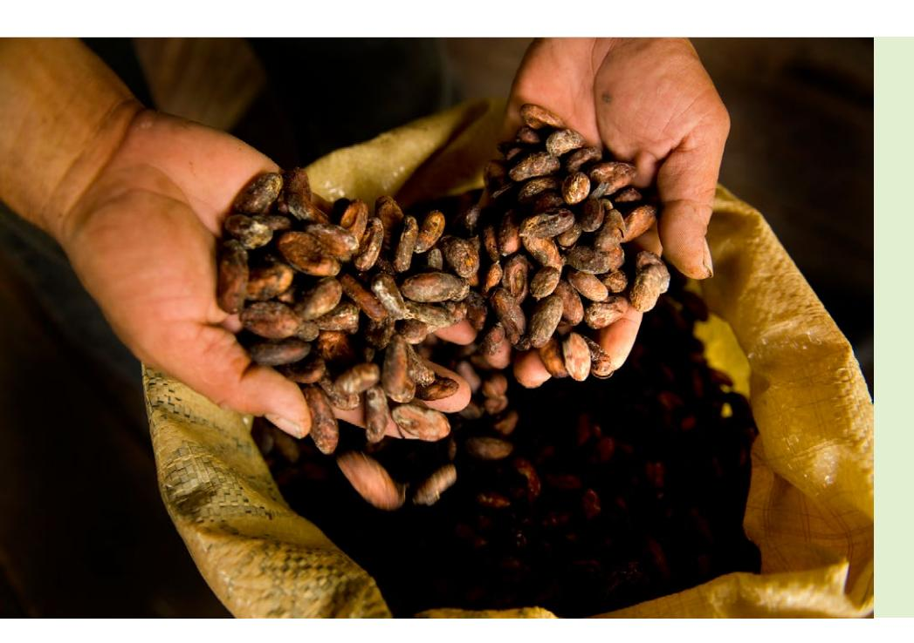

116 Purnomo et al. (2023) – *Green Consumer Behaviour InÁuences Indonesian Palm Oil Sustainability, International Forestry Review* (see [https://www.cifor-icraf.org/publications/pdf\\_files/articles/APurnomo2302.pdf](https://www.cifor-icraf.org/publications/pdf_files/articles/APurnomo2302.pdf)).

117 PIL Group (2022) – Pacific Inter-Link Group Sustainable Palm Oil Sourcing Policy (see [https://www.pilgroup.com/assets/pdf/Sustainable%20](https://www.pilgroup.com/assets/pdf/Sustainable%20Palm%20Oil%20Sourcing%20Policy.pdf) [Palm%20Oil%20Sourcing%20Policy.pdf](https://www.pilgroup.com/assets/pdf/Sustainable%20Palm%20Oil%20Sourcing%20Policy.pdf)).

118 ITOCHU – S*ustainable Procurement: Policies and Initiatives by Product Type* (see [https://www.itochu.co.jp/en/csr/society/value\\_chain/](https://www.itochu.co.jp/en/csr/society/value_chain/activity/index.html) [activity/index.html\)](https://www.itochu.co.jp/en/csr/society/value_chain/activity/index.html).

# Recommendations for Policy, Investment, and Implementation

To unlock scalable, inclusive finance for sustainable palm oil, cocoa, and rubber production in Indonesia and Malaysia, coordinated action is needed across governments, financial institutions, and supply chain actors. This section outlines practical, evidence-based recommendations to address persistent bottlenecks ranging from credit risk and ESG capacity gaps to traceability-finance disconnects. By expanding derisking tools, embedding sustainability into credit and procurement systems, and fostering multi-stakeholder collaboration, these interventions can accelerate compliance with global standards and regulations like the EUDR while driving rural prosperity and climate resilience.

## **Expand national credit guarantee schemes and de-risking facilities**

Governments in Indonesia and Malaysia should scale up credit guarantee schemes and de-risking instruments to unlock financing for smallholders and mid-sized producers in palm oil, cocoa, and rubber sectors. In Indonesia, **BPDLH and BPDP** have begun deploying revolving funds and grants to support traceability and

For Governments

and Regulators

8.1

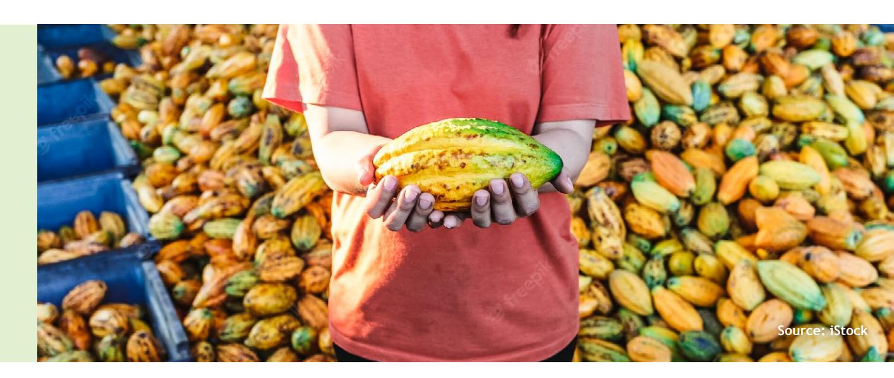

119 BPDP has integrated traceability measures into the scope of its Grant Riset Sawit (Palm Oil Research Br program, reinforcing sustainability and compliance objectives across the palm oil value chain; please see Tatang H Soerawidjaja (2024) – *Grant Riset Sawit 2024: Fokus, Kiat & Peluangnya* (see [https://penelitian.ugm.ac.id/wp-content/uploads/sites/295/2024/03/Grant-Riset-Sawit-UGM-26-Februari-2024-1.pdf\)](https://penelitian.ugm.ac.id/wp-content/uploads/sites/295/2024/03/Grant-Riset-Sawit-UGM-26-Februari-2024-1.pdf). 120 BPDLH deploys revolving funds and grants—including Sharia-based and catalytic financing schemes—to support smallholder, community or forest-dependent replanting (and sometimes connected to traceability systems), reducing compliance costs and de-risking investments. It also partners with commercial banks and other organizations such as BNI and UNDP to channel these funds more broadly, integrating sustainability and legality verification into mainstream financial workÁows. Please see [https://money.kompas.com/read/2024/10/02/183705426/gandeng](https://money.kompas.com/read/2024/10/02/183705426/gandeng-bpdlh-bni-salurkan-dana-bantuan-untuk-program-lingkungan-hidup)[bpdlh-bni-salurkan-dana-bantuan-untuk-program-lingkungan-hidup.](https://money.kompas.com/read/2024/10/02/183705426/gandeng-bpdlh-bni-salurkan-dana-bantuan-untuk-program-lingkungan-hidup)

#### **Develop traceability-linked loan products and ESG scoring systems**

Banks and financial institutions should design loan products that integrate traceability data—such as geolocation, legality status, and certification—into credit origination and ESG scoring. Platforms like e-STDB (Indonesia) and Agrolink (Malaysia) offer foundational data but are not yet interoperable with financial systems. By embedding these metrics into loan workÁows, institutions can reduce due diligence costs and reward verified producers with better terms.

### **Scale group-based lending and cooperative financing models**

Group verification and cooperative lending models offer scalable pathways to finance smallholders in palm oil, cocoa, and rubber sectors. RSPO and MSPO group certification schemes exist, but few banks recognize verified cooperatives as creditworthy anchors. Banks and FIs should pilot group-based ESG onboarding and pooled risk-sharing mechanisms to extend credit to producer clusters, thereby improving compliance and repayment rates.

## **Invest in ESG capacity building and digital onboarding tools**

Limited ESG capacity within banks and FIs especially smaller institutions—hinders the rollout of sustainability-linked finance. Investments in ESG training, digital onboarding platforms, and traceability integration are essential. Programs like CIMB's SPIRAL and Koltiva's farm management tools demonstrate how digital solutions can support ESG scoring and certification. Scaling such tools across financial institutions will improve borrower readiness and expand access to green finance.

replanting, but broader coverage and integration with commercial banks are needed.119 120 **Malaysia's Green Technology Financing Scheme (GTFS) and Agrobank's SAWIT-i** facility offer concessional loans, yet uptake remains limited due to risk perceptions and collateral constraints. Expanding these mechanisms can reduce lender hesitation and catalyze inclusive, climatesmart finance.

#### **Mainstream sustainability-linked incentives into public credit programs**

Public credit programs such as **Indonesia's KUR and Malaysia's VBI framework** should embed sustainabilitylinked incentives—like interest subsidies tied to certification or traceability milestones. In Riau and West Kalimantan, KUR has piloted reduced interest rates for ISPO-certified smallholders. Similarly, Malaysia's VBI encourages banks to offer ESG-linked rebates for MSPO-certified producers. Institutionalizing these incentives within national credit programs can accelerate verified production and reduce compliance costs

#### **Align TKBI (Indonesia's Sustainable Finance Taxonomy) with EUDR and ASEAN frameworks**

Indonesia's TKBI must be harmonized with the EUDR and ASEAN Sustainable Finance principles to ensure that domestic financial Áows support deforestationfree commodity production. Currently, green lending in Indonesia remains below 5% of total portfolios.121By aligning TKBI with traceability, legality, and biodiversity metrics required under EUDR, regulators can guide banks toward financing verified sustainable palm oil, cocoa, and rubber—while positioning Indonesia for preferential market access.

121 While green lending in Indonesia is reported to remain below 5% of total portfolios, there is no disaggregated figure available that isolates sustainable lending specifically within the agricultural sector.

#### **Offer price premiums and long-term contracts for verified production**

Buyers and traders should offer price premiums and multi-year offtake agreements to producers who meet traceability and sustainability standards. In Malaysia, MSPO-certified exporters benefit from reduced tariffs under MEEPA, while Indonesia is negotiating similar terms with the US. These incentives create financial rationale for producers to invest in compliance and certification.

#### **Support producer onboarding into traceability and certification systems**

Buyers must actively support smallholders and mid-sized producers in adopting traceability and certification systems. This includes funding digital

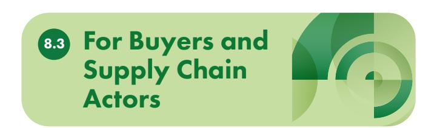

tools, providing technical assistance, and co-financing onboarding costs. Initiatives like FarmByte–Agrobank and Mars–CSP in Sulawesi show how bundled support can accelerate verified production.

### **Participate in blended finance platforms and jurisdictional initiatives**

Corporate actors should engage in jurisdictional finance platforms like the Rimba Collective and Landscape Finance Lab, which align buyer capital with government and donor funding for traceability and forest-positive outcomes. Participation in these platforms enables buyers to fulfil NDPE and EUDR obligations while supporting inclusive, landscape-scale transformation.

Furthermore, the RTD#5 synthesis concluded with a collective call to action: "The overall strength of the value chain is determined by its weakest links." Moving forward, blended finance and value-chain approaches must focus on lifting these weakest links—illegal land tenure, fragmented data, and lack of technical assistance—while ensuring affordability, legality, and capacity building are addressed in tandem.

119 BPDP has integrated traceability measures into the scope of its Grant Riset Sawit (Palm Oil Research Br program, reinforcing sustainability and compliance objectives across the palm oil value chain; please see Tatang H Soerawidjaja (2024) – *Grant Riset Sawit 2024: Fokus, Kiat & Peluangnya* (see<https://penelitian.ugm.ac.id/wp-content/uploads/sites/295/2024/03/Grant-Riset-Sawit-UGM-26-Februari-2024-1.pdf>).

120 BPDLH deploys revolving funds and grants—including Sharia-based and catalytic financing schemes—to support smallholder, community or forest-dependent replanting (and sometimes connected to traceability systems), reducing compliance costs and de-risking investments. It also partners with commercial banks and other organizations such as BNI and UNDP to channel these funds more broadly, integrating sustainability and legality verification into mainstream financial workÁows. Please see [https://money.kompas.com/read/2024/10/02/183705426/gandeng](https://money.kompas.com/read/2024/10/02/183705426/gandeng-bpdlh-bni-salurkan-dana-bantuan-untuk-program-lingkungan-hidup)[bpdlh-bni-salurkan-dana-bantuan-untuk-program-lingkungan-hidup.](https://money.kompas.com/read/2024/10/02/183705426/gandeng-bpdlh-bni-salurkan-dana-bantuan-untuk-program-lingkungan-hidup)

121 While green lending in Indonesia is reported to remain below 5% of total portfolios, there is no disaggregated figure available that isolates sustainable lending specifically within the agricultural sector.

122 Agrobank–FarmByte Strategic Alliance, *op. cit.*

123 BPDP – Peremajaan Sawit Rakyat, *op. cit.*

124 BRI ESG Sustainable Financing, *op. cit.*

125 Agrobank–FarmByte Strategic Alliance, *op. cit.*

# Case Studies and Replication Models

To demonstrate the viability and scalability of inclusive financial mechanisms for sustainable commodity production, this section highlights four operational models from Indonesia and Malaysia that combine finance, traceability, and sustainability incentives. These case studies offer practical insights into how targeted financial instruments—ranging from concessional loans to green bonds—can be deployed to support smallholders and mid-sized producers in palm oil, cocoa, and rubber sectors. Each model showcases a different pathway for replication: public–private lending schemes, co-financing platforms, and capital market instruments aligned with ESG goals.

| (Agrobank) | 122                            |
|------------|--------------------------------|
| Finance    | 123                            |
| Bonds      | 124                            |
| Farming    | 125                            |
|            | loans for oil palm             |
|            | Grant-based replanting         |
|            | support bundled with           |
|            | certification and              |
|            | Bundled finance,               |
|            | training, and digital          |
|            | access for small               |
|            | MYR12 million deployed via     |
|            | FarmByte; increased uptake of  |
|            | MSPO certification and digital |
|            | Thousands of smallholders      |
|            | ha disbursed for ISPO-aligned  |
|            | Funds directed to renewable    |
|            | Improved market access,        |
| Model      | Country Mechanism Outcome      |

**Table 4. Case Studies in Indonesia and Malaysia**

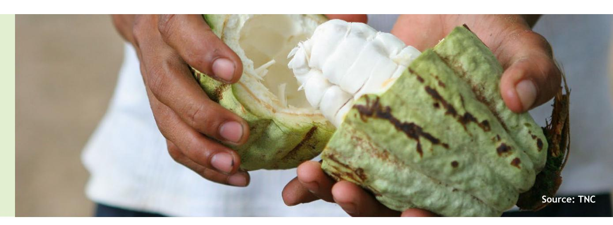

# Conclusion

Indonesia and Malaysia stand at a pivotal juncture in their transition toward deforestation-free, climateresilient commodity production. As global regulations like the EUDR reshape market access and sustainability expectations, the region's palm oil, cocoa, and rubber sectors must evolve from fragmented, reactive compliance to integrated, proactive transformation. This Knowledge Publication underscores that scalable financial and incentive mechanisms—anchored in traceability, certification, and productivity—are essential to unlock inclusion and resilience for smallholders and mid-sized producers. By addressing systemic bottlenecks such as limited ESG capacity, traceability–finance disconnects, and the absence of bundled services, stakeholders can build a more equitable and competitive landscape.

The path forward requires coordinated action across governments, financial institutions, buyers, and philanthropic actors. Expanding de-risking tools, embedding sustainability-linked incentives into public and private finance, and investing in digital onboarding and group-based verification are not just policy options—they are strategic imperatives. Replicable models such as SAWIT-i, BPDPKS co-financing, and FarmByte's bundled contract farming demonstrate that inclusive finance is achievable when aligned with traceability and market incentives. With the right mix of regulatory alignment, financial innovation, and multi-stakeholder collaboration, Southeast Asia can position its commodity sectors as global leaders in sustainable production and rural prosperity.

#### **Inclusive Ànance is not a peripheral issue—it is a precondition for successful transformation.**

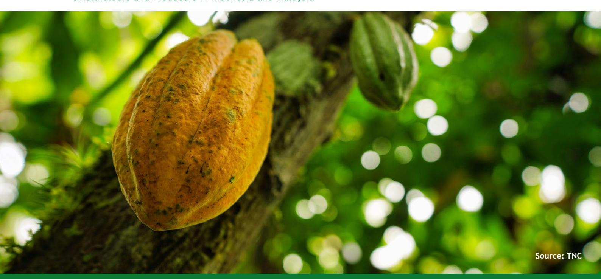