# **REPORT**

ASSESSMENT ON THE CURRENT STATUS OF EUDR PREPAREDNESS AND POTENTIAL CO-BENEFITS FOR SELECTED SUPPLY CHAIN ACTORS IN VIET NAM'S COFFEE, RUBBER, AND TIMBER VALUE CHAINS

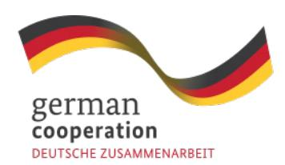

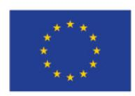

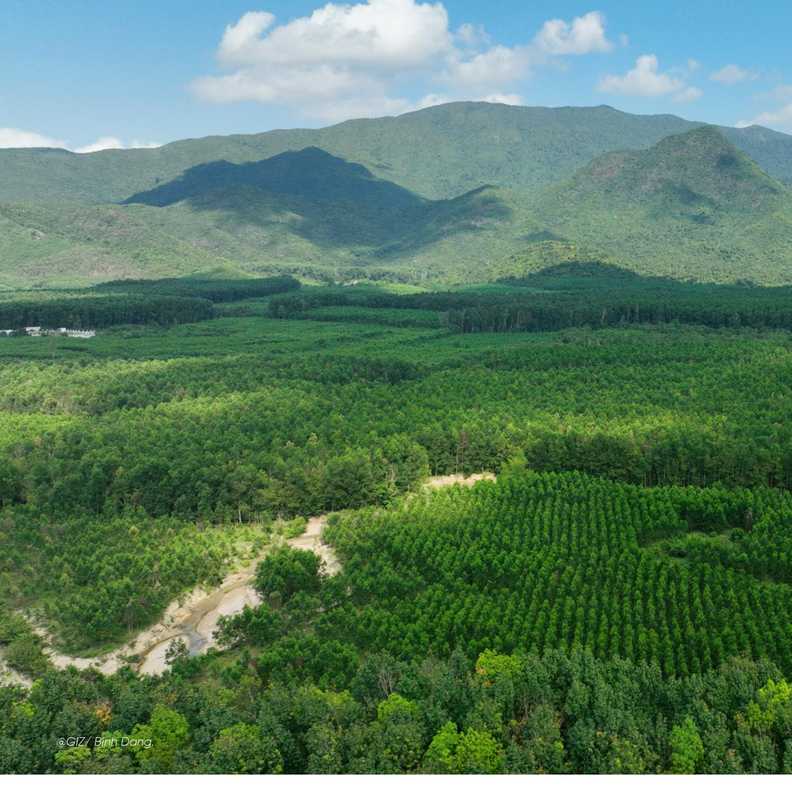

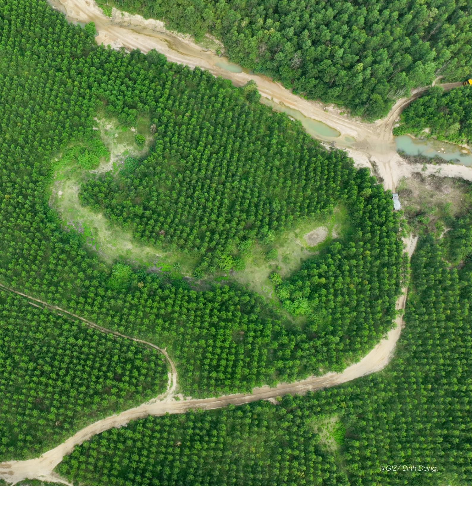

*Disclaimer: This publication was co-funded by the European Union and BMZ. The content of this publication is the sole responsibility of the authors and does not necessarily reflect the views of the EU or BMZ. The information in this study, or upon which this study is based, has been obtained from sources the authors believe to be reliable and accurate. While reasonable eorts have been made to ensure that the contents of this publication are factually correct, GIZ does not accept responsibility for the accuracy or completeness of the contents of this publication. The mention of specific companies or products of manufacturers, whether or not these have been patented, does not imply that they have been endorsed or recommended by GIZ in preference to others of a similar nature that are not mentioned. The views expressed in this information product are those of the author(s) and do not necessarily reflect the views or policies of GIZ.* 

# **TABLE OF CONTENTS**

|      | ABBREVIATION 04                                                                                                                                                                              |
|------|----------------------------------------------------------------------------------------------------------------------------------------------------------------------------------------------|
| 01.  | EXECUTIVE SUMMARY 05                                                                                                                                                                         |
| 02.  | INTRODUCTION 09                                                                                                                                                                              |
| 2.1. | Background and context                                                                                                                                                                       |
| 2.2. | Objectives of the study                                                                                                                                                                      |
| 2.3. | Scope and focus                                                                                                                                                                              |
| 2.4. | Limits of the study                                                                                                                                                                          |
| 03.  | METHODOLOGY 14                                                                                                                                                                               |
| 3.1. | Study design and approach                                                                                                                                                                    |
| 3.2. | Analytical framework                                                                                                                                                                         |
| 3.3. | Data collection methods 04. OVERVIEW OF THE EUDR AND ITS RELEVANCE FOR VIET NAM 05. OVERVIEW OF COFFEE, RUBBER, TIMBER AND THE KEY VALUE CHAIN ACTORS 06. META-ANALYSIS OF EXISTING RESEARCH |
| 07.  | FIELD FINDINGS 44                                                                                                                                                                            |
| 7.1. | Coee sector                                                                                                                                                                                 |
| 7.2  | Rubber sector                                                                                                                                                                                |
| 7.3. | Timber sector                                                                                                                                                                                |
| 6.1. | Synthesis of existing studies                                                                                                                                                                |
| 6.2. | Readiness assessment                                                                                                                                                                         |

| 8. 8.1. 8.2. 8.3. 09. | IMPLICATIONS FOR EUDR IMPLEMENTATION Readiness Potential Co-benefits Potential risks GENDER EQUALITY AND INCLUSIVENESS | 62 63 64 65 66 |
|-----------------------|------------------------------------------------------------------------------------------------------------------------|----------------|
| 10.                   | RECOMMENDATIONS                                                                                                        | 68             |
| 11.                   | CONCLUSION                                                                                                             | 76             |
| 12.                   | ANNEXES                                                                                                                | 78             |

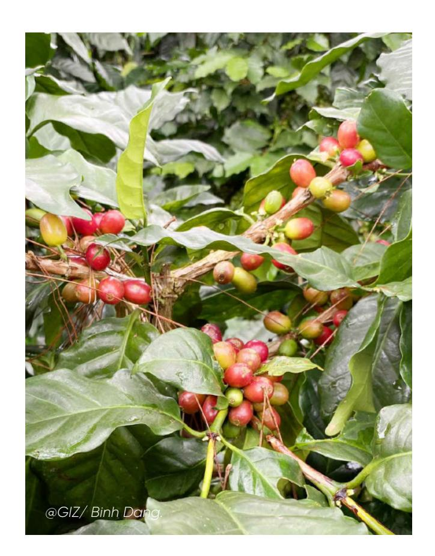

# **ABBREVIATION**

| API      | Application Programming Interface                                           |
|----------|-----------------------------------------------------------------------------|
| CPC      | Commune People’s Committee                                                  |
| CoC      | Chain of Custody                                                            |
| DAE      | Department of Agriculture and Environment (provincial)                      |
| DARD     | Department of Agriculture and Rural Development (former provincial)         |
| DoNRE    | Department of Natural Resources and Environment (provincial)                |
| EUDR     | EU Regulation on Deforestation-Free Products                                |
| EFI      | European Forest Institute                                                   |
| ERP      | Enterprise Resource Planning                                                |
| FGD      | Focus Group Discussion                                                      |
| FLEGT    | Forest Law Enforcement, Governance and Trade                                |
| FPIC     | Free, Prior and Informed Consent                                            |
| FRMS     | Forest Resource Monitoring System (national forest information platform)    |
| FSC      | Forest Stewardship Council                                                  |
| GDC      | General Department of Customs (under MOF)                                   |
| GIZ      | Deutsche Gesellschaft für Internationale Zusammenarbeit (German Development |
| GIS      | Geographic Information System                                               |
| GPS      | Global Positioning System                                                   |
| HAWA     | Handicraft and Wood Industry Association of Ho Chi Minh City                |
| IDAT     | Illegality & Deforestation Assessment Tool (Forest Trends)                  |
| IDH      | The Sustainable Trade Initiative                                            |
| KII      | Key Informant Interview                                                     |
| LURC     | Land Use Right Certificate                                                  |
| MARD     | Ministry of Agriculture and Rural Development                               |
| MIC      | Ministry of Information and Communications                                  |
| MOF      | Ministry of Finance                                                         |
| MOIT     | Ministry of Industry and Trade                                              |
| MONRE    | Ministry of Natural Resources and Environment                               |
| NGO      | Non-Governmental Organization                                               |
| QA       | Quality Assurance                                                           |
| RBP      | Results-Based Payment                                                       |
| SME      | Small and Medium-sized Enterprise                                           |
| SOP      | Standard Operating Procedure                                                |
| SRD      | Centre for Sustainable Rural Development                                    |
| UNDP     | United Nations Development Programme                                        |
| VCCB     | Vietnam Coee Coordination Board                                            |
| VICOFA   | Viet Nam Coee – Cocoa Association                                          |
| VINACAFE | Viet Nam National Coee Corporation (used in sector coordination)           |
| VNTLAS   | Viet Nam Timber Legality Assurance System                                   |
| VPA      | Voluntary Partnership Agreement (EU–Viet Nam FLEGT)                         |
| VRA      | Viet Nam Rubber Association                                                 |
| VSS      | Voluntary Standards System                                                  |
| VIFORES  | Viet Nam Timber and Forest Product Association                              |
| VNFOREST | Viet Nam Administration of Forestry (under MARD)                            |

# **EXECUTIVE SUMMARY**

# **EXECUTIVE SUMMARY**

The European Union Deforestation Regulation (EUDR) requires relevant products placed on the EU market or exported from there to be both deforestation-free and legally produced. This includes plot-level geolocation, production information, and legal production according to national legislation in producing countries, all feeding into a mandatory risk-assessment and mitigation process for companies placing the products on the EU market for the first time.

For Vietnam's coee, rubber, and timber sectors, implementation of traceability systems shifts from paper attestations to end-to-end digital proof in the EUDR implementation context. While providing the information required poses clear technical and financial challenges—especially for smallholders and collectors—it also supports Vietnam's broader goals

on digital transformation, transparency, and sustainable production, oering co-benefits to dierent supply chain actors such as reduced supply chain risks, increased resilience and more secure access to high-value markets.

With the objective to assess the current state of EUDR readiness of key supply chain actors in Viet Nam's coee, rubber and timber chains and identifies potential co-benefits, this study synthesised existing research and provided additional field evidence from the provinces of Lâm Đồng and Đắk Lắk (coee), Đồng Nai (rubber) and Gia Lai (timber). Our methods combined desk reviews, key informant interviews, focus groups and on-site observations to assess readiness in terms of traceability, legality, technical capacity and financial capacity, with gender and digital literacy serving as cross-cutting lenses.

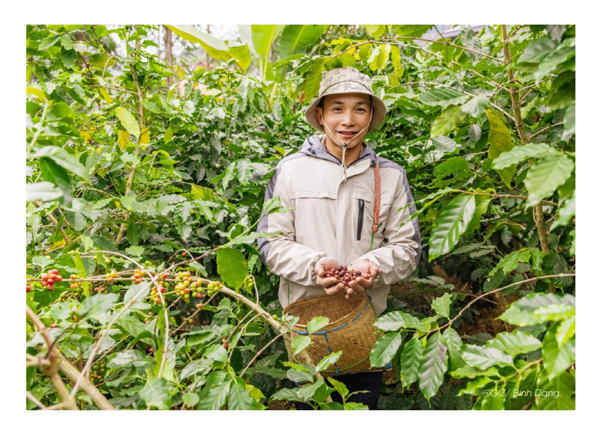

# **Key findings: readiness and potential co-benefits by sector.**

**The Coee sector** shows the widest upstream readiness gap: smallholders and local collectors still rely on mixed lots and partial geodata, meaning EUDR-relevant data often drops out before reaching exporters. However, where exporters run segregated product lines and pilot digital due diligence systems, sometimes building on existing certification programs such as 4C, Rainforest Alliance or Fairtrade, co-benefits for smallholders such as faster payments, potential premiums and better risk management appear quickly. Scaling up simple oine apps and barcoded receipts can transfer farmer ID, plot geolocation/polygon and dated consignment data to operators, unlocking finance and service bundles (e.g. e-wallets and advisory services) for farmers. Concrete examples include: (i) barcoded purchase tickets used by several exporters to shorten payment cycles to 24–48 hours; (ii) MoMo/VNPay-linked payments in traceability pilots, which help farmers build digital transaction histories for micro-credit scoring; and (iii) advisory modules embedded in traceability apps that provide weather alerts, fertiliser recommendations and document reminders.

**The Rubber sector's** production is polarised. Large processors and estates running traceability systems are relatively advanced, but the first mile (smallholders and multi-tier dealers) remains the bottleneck for end-to-end traceability along the chain of custody due to daily small-lot mixing and weak documentation. When processors fund collector onboarding and pay for complete required data package, including plot geolocation (or polygons) and legal documentation (such as Land Use Rights Certificates), collectors become more professional, payments speed up and smallholders receive a more predictable income. This demonstrates that incentives can convert implementation into livelihood gains.

**The Timber sector** can build on the foundations established through VNTLAS and existing certification schemes such as FSC and PEFC. Smallholders and actors working in community woodlots are generally familiar with permit and harvesting procedures but still need support to complete geo/polygon-based mapping and prepare standardised legality documentation. Once ocial/legal reference data are integrated with factory traceability systems, companies report fewer audit findings, clearer tenure verification, and reduced long-term transaction and compliance costs.

# **Cross commodity co-benefits**

- **• Digital traceability delivers concrete co-benefits**  and certification costs.
- **• EUDR can catalyse broader systemic and economic gains.** Beyond EU market access, EUDR compliance supports formalization, clearer land rights, and more predictable and stable orders. Verified, geolocated plots enable better planning, open access to PES, carbon markets, and diversified income streams. Formalized land rights make investments in more sustainable practices more likely.
- **• Sustainable practices and digital solutions reinforce resilience and inclusion.** Agroforestry and digitized records enhance ecological resilience, productivity, and income stability. Robust data enables targeted extension services, unlocks climate finance, and strengthens the inclusion of smallholders, women, and minorities in compliant supply chains.

**for smallholders.** Digital tools reduce audit risks and improve data access and continuity for farmers like price and weather alerts. Aggregated, plot-level data strengthens market access, also to markets like Japan and South Korea, pricing transparency, and bargaining power, while lowering per-household verification **There are systemic challenges:** These include first-mile fragmentation (i.e. mixing and non-standard SOPs), the absence of a single spatial service exposing national forest/land layers via API by 31 December 2020, inconsistent provincial data and definitions, non-standard legality documentation and high onboarding costs. Barriers to inclusion (in terms of time, language and digital skills) mean that women and ethnic minorities are under-represented in data capture and decision-making roles.

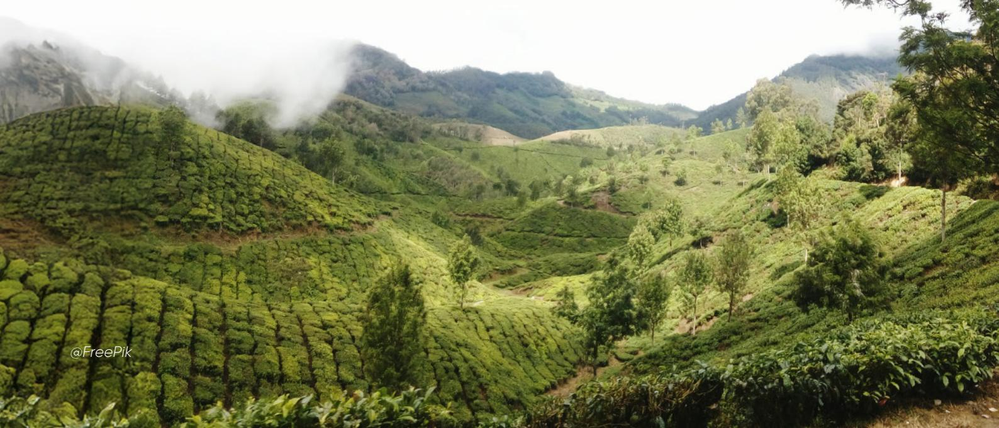

### **Recommendations:**

- Strengthen first-mile discipline: Scale up simple, oine-capable tools and barcoded receipts to ensure that required EUDR data consistently travel with each lot., with exporters, cooperatives, local authorities, and development partners jointly supporting deployment and farmer onboarding.
- Provide operator-ready public infrastructure: Publish ocial, national cut-o and land-status layers and a standardised EUDR documentation package (linking plot geolocation, land-use rights, harvest/transport permits and transaction records) through national APIs aligned with enterprise systems, with the government taking the lead on data provision, interoperability, and the legal framework.
- Invest in inclusive finance and skills: Enable pooled mapping, concessional credit, and results-based payments or premiums, alongside bilingual village-level training (in Vietnamese and local languages) with childcare and travel support, supported by clear gender and ethnicity KPIs.

### **Policy messages:**

- The government should set up an API-served spatial service and provide orientation on the relevant national legislative framework in the EUDR to reduce transaction costs and minimise the risk of exclusion.
- The private sector should adopt interoperable traceability aligned to national APIs/EU templates, publish pre-competitive dealer toolkits and reward the provision of complete geo-legal data.
- Government agencies, industry associations and development partners jointly, target women and ethnic minorities with localised training and incentives to increase compliance and participation.

**02.INTRODUCTION**

# **02. INTRODUCTION**

# **2.1 Background and context**

With the EUDR, the EU aims to minimize the EU's contribution to legal and illegal deforestation and forest degradation worldwide and thereby shows its commitment to mitigate climate change, reduce greenhouse gas emissions and biodiversity loss. The EUDR obliges companies to ensure through due diligence that relevant commodities and products placed on the EU market or exported from there are produced without deforestation and, in the case of timber products, without forest degradation after 2020 and in with relevant legislation of the country of production. It applies to cattle, cocoa, coee, oil palm, rubber, soy and wood as well as certain derived products. For Viet Nam—an important supplier of coee, rubber, and timber—these requirements shift market access away from paper-based attestations toward verifiable, digital, plot-linked traceability and risk-assessment systems. This study examines the current status of preparations for EUDR application by selected Vietnamese supply chain actors on the ground, what support is required, and what potential co-benefits may emerge from strengthened legality, traceability, and data governance.

Over the past two years, Viet Nam's policy and research community (EU Delegation, GIZ/EFI, Forest Trends, SRD, Tropenbos, among others) has produced scoping notes, preparedness checks and sector briefs that converge on: (i) fragmented traceability at the first mile, (ii) uneven, not-yet-operator-ready spatial layers for the 31-Dec-2020 cut-o, (iii) gaps in tenure/legality documentation for smallholders, and (iv) significant onboarding and implementation costs for SMEs and collector networks (Aldinger et al., 2024; Đặng et al., 2025; Le et al., 2024; Nguyễn et al., 2025a; Nguyễn et al., 2025b). While a lot of studies and policy recommendations are available, the challenges lie in making them quickly accessible for target groups in Viet Nam and beyond, as well as checking on potential gaps and updates since the studies were finalized, given the current eorts by Vietnamese supply chain actors to enhance their preparedness for EUDR application.

This study responds to those gaps by consolidating existing, up-to-date evidence and adding fresh field insight on smallholders, collectors and local traders, with attention to gender and ethnic minorities and to digital literacy constraints that shape participation.

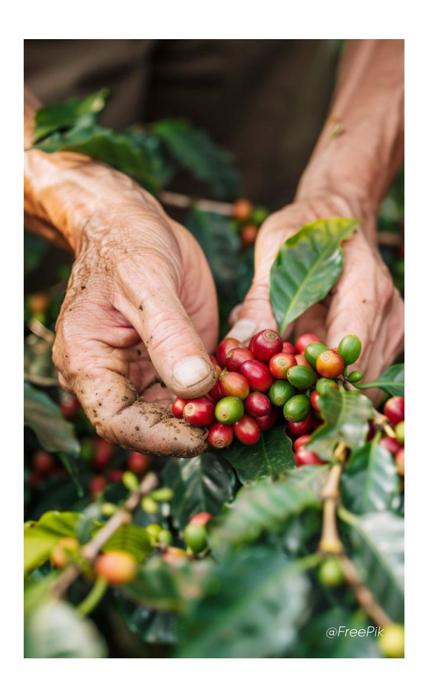

# **2.2 Objectives of the study**

The overall objective of the study is to provide a consolidated, up-to-date assessment of how selected actors in Viet Nam's coee, rubber and timber value chains are preparing for the EUDR by end-2025 and identify potential co-benefits arising from that preparation.

The specific objectives include: (1) Conduct a meta-analysis across major studies to produce a single, comparable picture of readiness; (2) document steps taken and costs incurred by smallholders, collectors and traders; (3) examine potential arising co-benefits (e.g., improved traceability, market access, resilience); (4) propose practical, tailored recommendations for government and private stakeholders.

# **2.3 Scope and focus**

In terms of geographic coverage, the fieldwork is centred on three production hubs that were selected for their sector representativeness and data accessibility: Lâm Đồng/Đắk Lắk (coee), Đồng Nai (rubber) and Gia Lai (timber plantations). These provinces were chosen due to their significant contribution to Viet Nam's export value chains and the presence of diverse stakeholders across dierent segments of the supply chain.

Within each province, the research team prioritized the selection of key stakeholders, including smallholder farmers, local collectors, and processing/exporting enterprises and other relevant actors, ensuring that dierent levels of the supply chain are represented.

Given the limited timeframe, the study focused on two main types of supply chain models in each sector:

## **Key research questions:**

- Steps taken so for adapting to requirements regarding traceability and documentation of legality
- Costs that have been incurred until now for these steps
- Incentives and technical support for traceability (e.g., market accessibility and GPS location collection) provided so far and expected additional support
- Participation in trainings related to preparing for EUDR readiness and options for increasing participation with a focus on requirements to increase participation of ethnic minorities and women
  - Assessment of (potential) specific requirements to reach ethnic minorities and women with activities related to EUDR relevant information and knowledge (especially regarding financing and traceability)
  - Assessment of strength and weakness regarding digital literacy in the respective stakeholder group.

- **• Group 1 Low-risk chains/certified chains:**  Linked to large, export-oriented companies with established traceability and VSS systems (Voluntary Standards System).
- **• Group 2 High-risk chains/non-certified chains:** Linked to smaller companies, or large companies focusing on other markets than EU, or informal buyers with limited readiness for EUDR implementation.

This approach allows the study to capture a comparative and more granular picture of readiness, challenges, and potential co-benefits across varying levels of risk and capacity for the three commodity sectors in Viet Nam.

For the analytical lens, readiness is assessed against four standardised dimensions:

All interviews and observations capture gender/ethnicity/social safeguard and digital literacy factors that may aect participation or cost burdens.

- **• Traceability:** the availability and quality of plot geolocation (points/polygons), chain transparency (mixing/segregation) and the use of digital capture and identifiers from farm to operator.
- **• Legality:** the status and geo-linkage of tenure (LURC/alternatives), harvest/transport permits, other issues such as environmental protection, labour rights and human rights, FPIC, and deforestation reduction.
- **• Technical capacity:** is assessed in terms of awareness of EUDR tasks, the existence and use of SOPs (GPS/polygon, batch coding and clean-line handling), data governance and QA practices, and oine and low-connectivity solutions.
- **• Financial capacity:** one-o vs. recurring costs of compliance; access to suitable finance/incentives; and risks of exclusion for vulnerable groups.

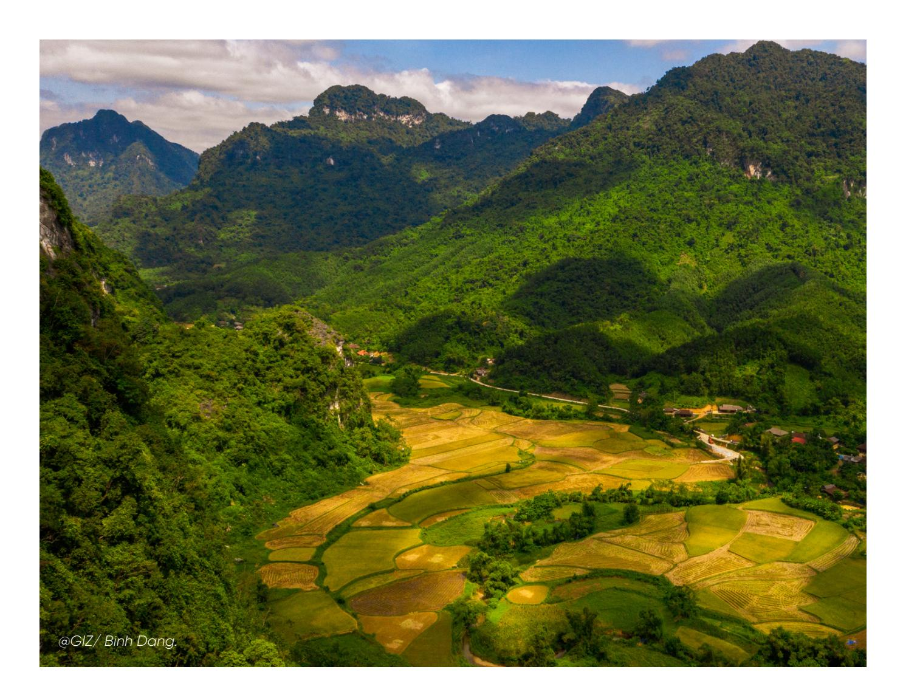

# **2.4. Limits of the study**

- The study was conducted within tight time constraints given the wide geographic distribution of production areas and the large number of stakeholders involved in the coee, rubber and timber value chains. Consequently, fieldwork could only cover a subset of provinces and supply chain actors, which may not fully capture nationwide diversity of practices.
- While the interviews, focus group discussions and site visits were carefully selected, the number remains limited in relation to the size and heterogeneity of each sector. Therefore, the views collected may not be fully representative of all stakeholders, particularly in regions with distinct governance structures, production conditions, or market dynamics.
- Private sector participants, particularly exporters, processors and traders, were sometimes reluctant to share sensitive information relating to sourcing practices, traceability systems, commercial data and internal compliance processes. Concerns about confidentiality and competition between firms may have limited the depth of insights obtained.
- The study is based on self-reported information from stakeholders, which may be subject to bias, incomplete recall or selective disclosure. Where possible, verification was undertaken, but not all information could be independently validated within the study timeframe.
- The assessment partly relied on secondary data and existing studies, some of which are outdated or use dierent methodologies. Variations in definitions, measurement approaches and data quality across sources may influence the comparability of the findings.
- The dynamic nature of policy reforms, particularly those relating to land governance, the digitalisation of public datasets and EUDR requirements, means that some conditions may evolve rapidly after this study is completed. The report therefore reflects the situation at the time of data collection in early November 2025.
- The complexity and informality of first-mile transactions make it dicult to obtain an entirely accurate picture of traceability practices, mixing behaviour and tenure documentation at farm and collector levels. These structural complexities could not be fully captured through rapid field surveys.
- Due to time constraints and the small sample size, the study's findings are primarily qualitative in nature, and the quantitative figures would require further in-depth research.
- With regard to the legality requirements under the EUDR, stakeholders have largely focused on land-use rights; therefore, issues such as environmental protection, labour rights and human rights, FPIC, and even deforestation reduction have not been extensively addressed.

Together, these limitations should be taken into consideration when interpreting the conclusions and recommendations presented in this report.

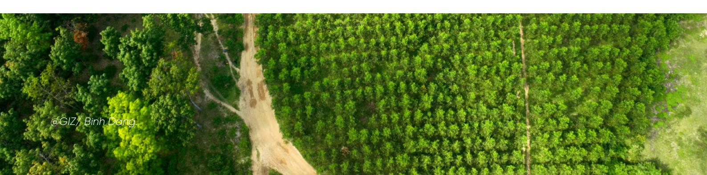

**03.METHODOLOGY**

# **03. METHODOLOGY**

# **3.1. Study design and approach**

The study adopts a mixed-methods design that integrates both qualitative evidence and participatory discussions to ensure a comprehensive and triangulated understanding of EUDR preparedness and co-benefits among smallholders, collectors, and traders in Viet Nam's coee, rubber, and timber value chains.

The design builds on three main pillars:

This approach reflects the principles of participatory research, gender and social inclusion, and evidence-based analysis, aligning with GIZ's emphasis on equitable participation and sustainability.

- Desk-based meta-analysis of existing studies and secondary data to consolidate and compare readiness levels across sectors.
- Participatory fieldwork, including Key Informant Interviews (KIIs) and Focus Group Discussions (FGDs), to capture the practical experiences, adaptation measures, and perceptions of stakeholders.
- Triangulation and synthesis, where findings from desk reviews, interviews, and FGDs are cross-validated to ensure consistency, inclusivity, and reliability of evidence.

The study applies a Readiness and Co-Benefit Assessment Framework integrating four readiness dimensions and two cross-cutting criteria.

**Triangulation:** Cross-comparison between desk and field data will verify consistency and highlight sectoral dierences.

# **3.2. Analytical framework**

|                        | Dimension                                                 | Key Indicators                           | Methods of Assessment |
|------------------------|-----------------------------------------------------------|------------------------------------------|-----------------------|
| Traceability readiness | • % plots geo-referenced                                  | Meta-analysis, KIIs, FGDs, case studies, |                       |
|                        | • Existence of digital tools                              | observations, validations                |                       |
|                        | • Incurred investment                                     |                                          |                       |
|                        | • Chain of custody documentation                          |                                          |                       |
| Legality readiness     | • Land/harvest legality documentation                     | Meta-analysis, KIIs, FGDs, case studies, |                       |
|                        | • Compliance with national relevant national legislation: | observations, validations                |                       |
|                        | • Incurred investment                                     |                                          |                       |
|                        | • Awareness of EUDR                                       | Meta-analysis, KIIs, FGDs, case studies, |                       |
| Technical capacity     | • Incurred investment                                     | observations, validations                |                       |
|                        | • Access to training/extension                            |                                          |                       |
|                        | • Application of sustainable practices                    |                                          |                       |
|                        | • Access to affordable loans                              | Meta-analysis, KIIs, FGDs, case studies, |                       |
| Financial capacity     | • Use of financial instruments                            | observations, validations                |                       |
|                        | • Risk of exclusion                                       |                                          |                       |
|                        | • Representation in producer/trader groups                | Meta-analysis, KIIs, FGDs, case studies, |                       |
| Gender & inclusion     | • Access to training, finance, digital tools              | observations, validations                |                       |
|                        | • Access to smartphone/internet                           | Meta-analysis, KIIs, FGDs, case studies, |                       |
|                        | • Incurred investment                                     | observations, validations                |                       |
| (cross-cutting)        | • Use of apps, GPS tools                                  |                                          |                       |
|                        | • Comfort with digital data input                         |                                          |                       |
|                        | • Market access, price premiums                           | Meta-analysis, KIIs, FGDs, case studies, |                       |
| (cross-cutting)        | • Resilience, sustainability, empowerment                 | observations, validations                |                       |

# **3.3 Data collection methods**

The study combines secondary data analysis and primary data collection as follows:

The team reviewed and systematized existing literature and reports from GIZ, SRD, EFI, Tropenbos, Forest Trends, and other relevant sources. Key outputs include:

# **3.3.1. Desk review and Meta-analysis**

KIIs targeted following stakeholders, including:

Interviews explored stakeholders' perceptions, readiness gaps, costs of adaptation, support mechanisms, and policy implications. Semi-structured questionnaires ensure comparability across sectors.

# **3.3.2. Key Informant Interviews (KIIs)**

Each sector has conducted FGDs with smallholders and with collectors/traders.

Semi-structured questionnaires were used for the FGDs in order to:

# **3.3.3. Focus Group Discussions (FGDs)**

- A consolidated readiness matrix comparing findings across the four EUDR readiness dimensions: traceability, legality, technical capacity, and financial capacity.
- dentification of knowledge and evidence gaps to guide primary data collection.
- Preliminary mapping of potential co-benefits, challenges, and emerging trends in each sector.

- Government agencies: National Agriculture Extension Centre, Department of Agriculture and Environment, Sub-Departments of Extension, Forest Protection Departments.
- Private sector and associations: exporters, processors, cooperatives, business associations (e.g., VICOFA, Vietnam Rubber Association, VIFORES, Vietnam Coee Coordination Board).
- Development partners and NGOs: organizations active in EUDR preparedness, certification, and traceability support.

- Document adaptation steps already taken in response to the EUDR requirements , including early actions on traceability (basic recordkeeping and batch tracking), legality documentation, GPS point/polygon collection, and participation in EUDR-related trainings.
- Assess incurred costs, received support, and remaining capacity needs.
- Explore co-benefits (market access, price incentives, digital literacy).
- Highlight gender and inclusion aspects particularly barriers faced by women and ethnic minority participants. *See Annex 2 for field trip agendas and the questionnaires.*

During field missions, experts also recorded observational data (e.g., use of digital tools, traceability workflows, certification materials at buying points and plants) and collect relevant documentation (SOPs, training manuals, compliance checklists, contracts/invoices) to strengthen the qualitative evidence base.

In addition, the experts also drew on hands-on sector experience and professional networks with smallholders, collectors/dealers, cooperatives, processors/exporters, associations, and regulators to validate claims, access hard-to-obtain materials, and triangulate reported practices with what actually occurs on the ground.

# **3.3.4. Desk review and Meta-analysis**

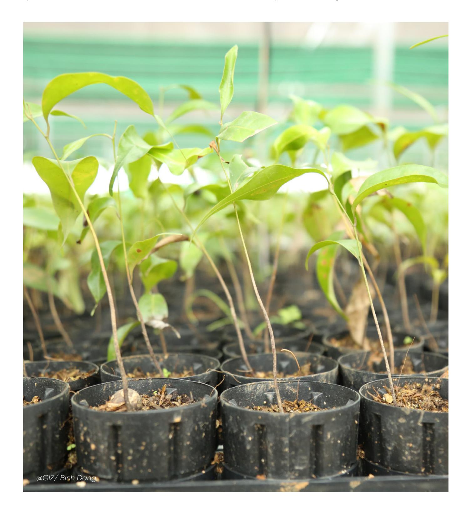

# **OVERVIEW OF THE EUDR AND ITS RELEVANCE 04. FOR VIET NAM**

# **04. OVERVIEW OF THE EUDR AND ITS RELEVANCE FOR VIET NAM**

The EU Deforestation Regulation (EUDR) entered into force in 2023 as a mandatory regulation for the EU and its member states and stipulates that, inter alia, coee, rubber, and wood products placed on the EU market must be deforestation-free (i.e. no deforestation after 31 December 2020), legally produced in the country of origin, and covered by a due diligence statement (DDS). To ensure that relevant commodities and products placed on or exported from the EU market are produced without deforestation or forest degradation, transparency regarding their origin is imperative. Under the EUDR, operators, being the companies that place products on the EU market or exporting them from there need to fulfil their due diligence obligations to ensure deforestation-free and legal production and are responsible for submitting the geolocation with their due diligence statement. In the case of products from countries outside the EU, the operator is usually the importer. While producing countries, third parties and producer not directly exporting to the EU market do not have any obligations under the EUDR, it is in their interest to provide information that will be asked for by their buyers and business partners. For their due diligence process, operators must not only collect information but also assess risks and mitigate any significant risks of non-compliance before placing relevant products on the EU market. In order to submit the due diligence statement, operators must compile and pass on information required in the Due diligence statement, containing plot geolocation information (ideally in the form of a polygon linked to an owner/parcel ID). They must assess the risk, consider the EU's country/area benchmarking, and mitigate any significant risk before placing relevant products on the EU market. The statement itself is filed electronically in the EU system, but the supporting evidence can be either digital or in paper form. In the case of timber products, FLEGT licences are recognized as a proof for the EUDR legality requirement.

The EUDR will enter into application on 30 December 2026 for large and medium operators and 30 June 2027 for micro and small enterprises. For micro and small operators already covered by the EU Timber Regulation (EUTR), the entry into application will be 30 December 2026. The bottom line for Vietnam is that market access is shifting from self-declarations to verifiable, plot-linked evidence supported by recognised documents. Where Vietnamese supply chains actors can consistently provide geolocation, dates, and proof of legality throughout the supply chain, EU trade should continue with fewer issues; where they cannot, especially in smallholder supply chains, there is a risk of delays, discounts, or exclusion from EU market access in the short term.

The relevance to Vietnam varies by commodity. For coee, for example, the EU is the most important market, accounting for around 46% of Vietnam's coee exports, so EUDR readiness is mission-critical for this sector. In contrast, the EU absorbs less than 4% of timber exports and around 7% of rubber exports*01*. Therefore, EUDR obligations only apply to consignments destined for the EU, not to entire sectors. Being a leading global exporter of wood products does not trigger EUDR compliance in itself — only shipments 'placed on the EU market' do. Nevertheless, EU buyers and financiers often cascade due diligence expectations across global supply chains, so aligning systems can have wider benefits (EFI, 2024- EUDR Preparedness Check for the Coee and Commercial Forestry Sectors). Where Vietnamese supply chain actors can provide evidence linked to specific plots (geo-location/ polygon, production date, legality), trade should continue with fewer issues and potentially better terms.

*01&quot;Households in the Coee, Rubber and Timber value chains" – FOREST TRENDS:* 

*https://mkresourcesgovernance.org/wp-content/uploads/2025/11/20251105-Bao-cao-tieu-dien.pdf* 

Where they cannot, the risks are discounts, cancelled orders or exclusion from EU channels. TAnd the smallholder-dominated sectors will be more prone to those consequences because of the traceability issues faced in the first mile.

In practice, especially for timber, which already operates under Viet Nam's VNTLAS, paper attestations (such as permits, transport notes and contracts) are still necessary to demonstrate deforestation-free origin and legal production. The EUDR shifts market access from self-declarations to verifiable, plot-linked evidence, which is backed by legally recognised documentation.

Vietnam has a valuable starting point for alignment. The Vietnam Timber Legality Assurance System (VNTLAS), established by Decree 102/2020/NĐ-CP in 2020, and the country's VPA-FLEGT process with the EU, provide an institutional and legal basis for ensuring the legality of timber and facilitating its trade*02*. Together with MAE/VNFOREST's forest datasets and provincial cadastral records, these instruments can be operationalised for EUDR, provided there is data interoperability and uptake across the sector. Public agencies and partners are now working to assemble operator-ready 'cut-o' layers (forest/land status as of 31 December 2020), define the relevant national legislative framework and test interoperability, ensuring that essential EUDR relevant information (geolocation data, date of production and consignment ID) travel end-to-end from plot to EU operator.

In the private sector, leading exporters and processors are piloting segregated processing streams, tightening chain of custody and onboarding suppliers using simple data capture apps*03*. Donors and industry initiatives (e.g. IDH-supported plantation/coee-forest databases; UNDP/EFI; GIZ; and Forest Trends and its partners) have launched pilots that demonstrate practical options for geolocation

and registries. However, many of these initiatives are still in the early stages or are facing provincial budget and administrative constraints. Recent studies and policy notes converge on similar findings: large, certified firms (FSC/VFCS, Voluntary standards, PEFC, QMS/ERP with GPS) are closest to EUDR readiness. In contrast, smallholders, collectors, and local traders often lack coordinated geolocation records and clarity on legality documentation problems that reflect two linked gaps: (i) a structural gap, where producers often farm long-standing plots without complete or formally recognized LURCs or equivalent tenure papers; and (ii) a procedural gap, where there is no standardized guidance on exactly what data or which acceptable alternatives (e.g., simplified commune certifications) must be provided for EUDR adaptation. They also lack access to technical and financial support, which makes them a potential risk of exclusion.

At the same time, implementation is complex because it requires multi-agency coordination: MAE/VNFOREST is responsible for forest data and sector guidance, while the land administration is responsible for cadastral/parcel status and definitions (forest vs. agroforestry). Other agencies involved include MOIT and Customs, who are responsible for trade/import screening, and MIC, who are responsible for data-sharing and API standards. Sector associations, VIFORES/HAWA (wood), VICOFA/VINACAFE (coee) and VRA (rubber), are pivotal in mobilising members, harmonising SOPs and providing first-mile support. By taking coordinated action to publish national spatial layers, standardise legal documentation set (the collection of permits, contracts, transport notes, LURC links, etc.) and fund inclusive onboarding, Vietnam can transform its existing assets into EUDR implementation systems that cover the entire supply chain.

*02EUDR Scoping paper on deforestation Vietnam*

*03Forest Trend and Rubber Association 2025-Tai lieu huong dan thu thap thong tin cao su (Guidelines for Collecting data and information for Rubber to be preprepared for EUDR)*

**OVERVIEW OF COFFEE, RUBBER, TIMBER AND THE 05. KEY VALUE CHAIN ACTORS**

# **05. OVERVIEW OF COFFEE, RUBBER, TIMBER AND THE KEY VALUE CHAIN ACTORS**

This section provides an overview of Viet Nam's coee, rubber, and timber sectors and maps the key actors involved in each value chain. It highlights production structures, market orientation, and roles across the first mile to export, setting the foundation for assessing traceability, legality, and EUDR readiness.

Vietnam has approximately 720,000 hectares of coee plantations with an average total production of about 1.8 million tons. Of this, Robusta coee accounts for about 93%, equivalent to about 670,000 hectares, with a total production of approximately 1.75-1.8 million tons. Arabica coee cultivation is relatively modest, with a total area of about 50,000 hectares and an average total production of about 70,000 tons of green beans (GIZ report 2025 and ForestTrend report 2025).

The coee sector in Viet Nam is characterized by a large smallholder base, a fragmented first mile, and a high degree of export orientation, particularly toward the European Union (46% of export). Production is dominated by smallholder farmers cultivating plots typically below 2 hectares, with significant participation of ethnic minority groups in the Central Highlands and the Northwest. Coee supply chains are therefore geographically dispersed and socially diverse.

The sector has prior exposure to sustainability requirements through voluntary certification schemes such as 4C, Rainforest Alliance, and Fairtrade. These schemes have introduced basic elements of traceability, legality documentation, and internal control systems. However, EUDR introduces more stringent, legally binding requirements, notably plot-level geolocation linked to deforestation cut-o dates andcomprehensive legality verification

As a result, the coee sector faces a transition from programme-based compliance to regulatory compliance, requiring more standardized, interoperable, and verifiable data systems across all levels of the chain.

The Robusta and Arabica coee value chains in Viet Nam dier significantly in terms of production structure, market organization, and alignment with

# **5.1. Coee**

# **Overview of Vietnam's coee sector**

According to estimates over the past 10 years:

- Approximately 12% of total coee production is processed and consumed domestically;
- Approximately 88% of total coee production is exported. Of which:
  - 85% of the total production is exported as green coee beans, after preliminary processing to remove impurities, equalize moisture content, and sort by bean size.
  - 2% of the total production is exported in processed form as coee powder;
  - 1% of the total production is exported as roasted and ground coee products.

*04https://mkresourcesgovernance.org/wp-content/uploads/2025/11/20251105-Bao-cao-tieu-dien.pdf* 

sustainability and transparency requirements. Robusta coee dominates national production and is mainly concentrated in the Central Highlands. Its value chain is characterized by large volumes, a highly fragmented first mile, and strong reliance on local collectors. Value addition occurs primarily at the green-bean export stage, while systematic lot segregation and traceability are still limited outside pilot programmes. In contrast, Arabica coee is produced on a much smaller scale in specific agro-ecological zones such as the Northwest and parts of Lam Dong Province. Although volumes are lower, the Arabica value chain is more specialized and typically shows stronger linkages between farmers, cooperatives, and exporters or roasters. Arabica production is more closely connected to dierentiated and quality-driven markets, which require early-stage lot separation, origin documentation, and quality control. As a result, Arabica supply chains tend to be better positioned to adopt plot-level traceability and data transparency, although transaction costs per unit are generally higher than in Robusta chains.

# **Definition and roles of key actors in the coee value chain**

**Smallholder Farmers:** are responsible for primary production and are the original source of key information such as plot location, land-use status and harvest data. Their engagement in traceability and legality processes is strongly influenced by access to buyer programmes, project support and local institutions. Constraints include limited digital literacy, time availability, and administrative capacity, particularly in remote and ethnic minority areas.

**Collectors / Middlemen/ Local traders:** aggregate coee from multiple households and represent a critical interface between producers and downstream actors. They play an important role in recording purchase transactions and maintaining batch integrity. In practice, many collectors operate with limited formalisation, relying on paper records or basic spreadsheets, which makes them a key bottleneck for consistent data transfer along the supply chain.

**Traders / Roasters/ Exporters:** placing coee on the EU market are responsible for conducting due-diligence processes under the EUDR framework. They generally have stronger technical and financial capacities and have invested in digital purchasing, traceability and risk-screening systems. Their eectiveness, however, depends on the quality and consistency of information received from upstream actors and on access to authoritative public reference data.

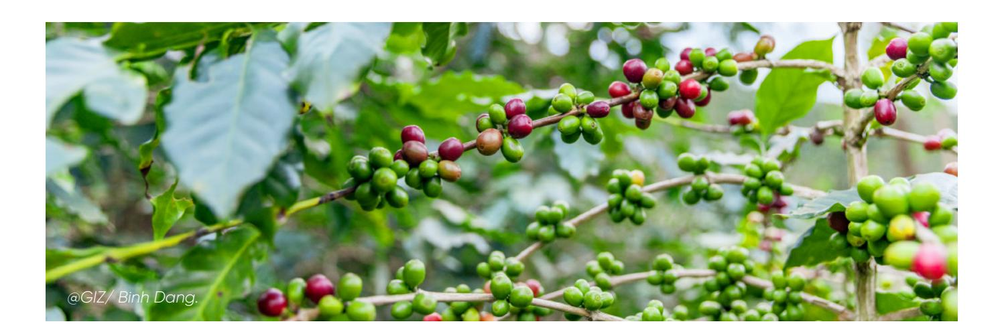

# **Overview of Vietnam's rubber sector**

# **5.2. Rubber**

Vietnam's rubber sector is a major export-oriented industry, structured around a dual production system combining large-scale estate plantations with a highly fragmented smallholder base. As of 2023–24, the country had around 911,000 hectares of rubber plantations, 54% of which (approximately 490,000 hectares) are managed by smallholders. These smallholder farms, cultivated by around 264,000–265,000 households, contribute an estimated 63% of the nation's raw rubber supply, highlighting their pivotal position in the production process*05*. The comparatively higher yields observed among smallholders can be attributed to the fact that many large estates have recently undergone replanting, whereas a substantial share of smallholder plantations currently consist of trees in their peak tapping phase and are managed under more intensive tapping regimes. The remaining 46% of the plantation area is owned by state-owned, private and foreign-invested enterprises, most notably members of the Vietnam Rubber Group (VRG) (GIZ report 2025 and ForestTrend report 2025).

In Vietnam, rubber harvesting is conducted manually by making controlled incisions on mature rubber trees to collect latex in cups. Tapping typically begins when trees reach six to seven years of age and continues for two decades or more. In smallholder systems, latex is often coagulated on the farm and sold as cup-lump, whereas estate plantations may supply fresher latex directly to processors.

The supply chain is characterized by a high level of intermediary actors: over 95% of smallholder latex

passes through local traders or middlemen before reaching processing factories. While these intermediaries play a crucial role in linking the market, they introduce risks in terms of traceability, legality verification and EUDR compliance, since transactions are mostly informal, involve mixed batches and rely on manual record-keeping.

Downstream, processors, traders, and exporters particularly export-oriented companies—are the most EUDR-ready actors. Many already operate certified systems (e.g. PEFC/VFCS, ISO standards), maintain digital transaction records, and are accustomed to buyer-driven compliance requirements. However, their dependence on upstream actors with weak documentation of EUDR relevant information creates systemic risks under EUDR.

Overall, the rubber sector is not deforestation-driven in intent, but faces compliance risks due to historical land-use complexity, the prevalence of rubber on former forestry land, informal labor practices, and fragmented data flows rather than active forest conversion.

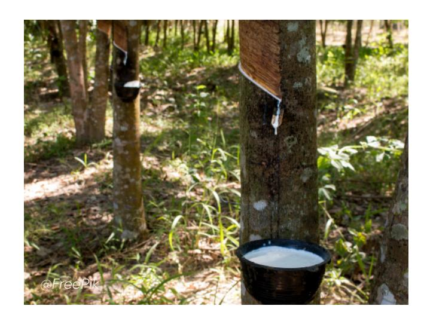

*05The figures (54% of land vs. 63% of production) are validated by the latest sector reports. This "yield gap" reflects structural dierences rather than biological potential: large estates have substantial areas that are immature or recently replanted and therefore non-tapping, while smallholders maintain a much higher share of trees in their peak tapping stage (88% of area) and apply more intensive harvesting frequencies.*

# **Definition and roles of key actors in the rubber value chain**

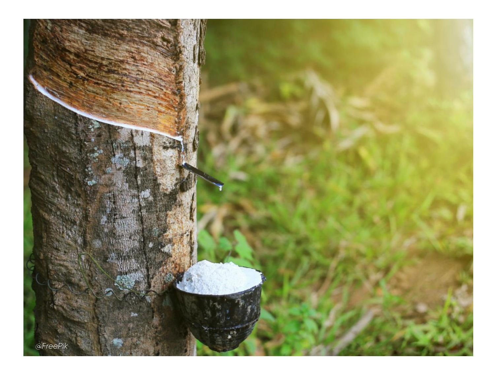

**Smallholder Farmers:** are land users or landholders responsible for latex production. They primarily focus on tapping and selling raw latex, with minimal engagement in record-keeping or compliance documentation. While many possess Land Use Rights Certificates (Red or Green Books), legality status varies by location, especially in areas where rubber is planted on forestry land. Farmers typically lack formal labor contracts, digital tools, and awareness of EUDR beyond basic explanations from buyers.

**Collectors / Middlemen:** act as intermediaries who purchase latex from multiple smallholders and sell to processors. They manage high-frequency, low-volume transactions on a daily basis and are essential for supply continuity. Most collectors are registered businesses but operate informally with respect to contracts, labor arrangements, and transaction documentationnot systematically collecting or transferring EUDR relevant data during their business operations, particularly regarding traceability and legality requirements.

**Processors / Traders / Exporters:** These actors purchase latex, process it into semi-finished or finished products, and sell to domestic or international markets. Export-oriented processors are the primary drivers of EUDR preparedness, investing in traceability systems, due diligence processes, sta training, and supplier engagement. They increasingly invest in geolocation collection, training and data collection creating both leverage and financial pressure.

# **Overview of Vietnam's timber sector**

# **5.3. Timber**

Viet Nam's timber sector is strongly anchored in plantation forestry and is characterised by the dominant role of smallholder households in timber production and supply. The total plantation forest area nationwide is approximately 4.73 million hectares, of which around 1.821 million hectares are managed by about 1.1 million households (Nguyen, 2024; Tô & Lương, 2023). Plantation forests are distributed across most provinces, with the largest concentration in the Central region (about 40% of total plantation area) and the Northern midlands and mountainous region (approximately 36%). Timber smallholders play a critical role in Viet Nam's plantation timber supply chain, operating on a small scale but contributing substantially to overall production. On average, each household manages about 1.3 hectares, typically divided into two to three separate plots (Tô & Lương, 2023). At the sector level, smallholders manage approximately 300,000 hectares of forests in certification programs, accounting for around 15% of total plantation forest area in 2024, within an estimated 600,000 hectares of plantation forests linked to small-scale production (Nguyen et al., 2025). Due to fragmented landholdings and limited individual capacity, group certification schemes are the most common approach for smallholders to access certification and formal markets.

Plantation timber, particularly that produced by households, plays a critical role in supporting Viet Nam's export-oriented wood processing industry. Timber from household plantations is used to produce a wide range of products, including furniture, wood-based panels, woodchips, and wood pellets, with the majority destined for export markets. In 2024, timber from plantation forests contributed an estimated 23.3 million cubic metres of roundwood, of

which household-sourced timber accounted for roughly 60%. The remaining supply was sourced from imports (approximately 25%) and forest companies, including cooperatives (around 15%) (Nguyen et al., 2025).

The supply chain for plantation timber is highly intermediated. The timing of tree sales varies depending on smallholders' needs, but trees are typically sold around the fifth or sixth year of growth. Smallholders usually sell standing timber directly to collectors (middlemen), with buyers responsible for harvesting; only a small number of households hire labour to harvest timber before sale (Nguyen et al., 2025; Tô & Lương, 2023). Some households sell directly to factories or purchasing companies, but indirect sales through collectors remain dominant, and timber may pass through multiple traders before reaching processing facilities. Larger-diameter logs are channelled into furniture and solid wood processing, while smaller-diameter timber and processing residues are supplied to enterprises producing veneer, plywood, woodchips, and wood pellets, largely for export (Nguyen et al., 2025; Tô & Lương, 2023). Only a small share of plantation timber from households is used for the domestic market, mainly for furniture and panel products. It is estimated that 4% of timber products is exported to the EU market (Nguyen et al., 2025).

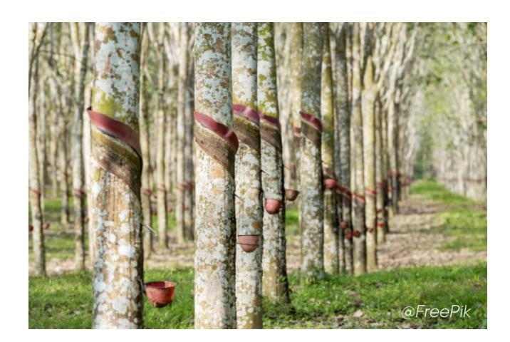

# **Definition and roles of key actors in the timber value chain**

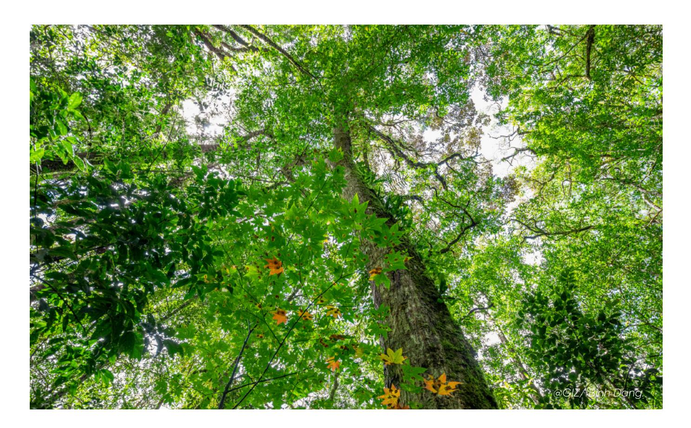

**Smallholder Farmers** are individual households or family-based producers who own, manage, or harvest timber from small forest plots or tree plantations. They typically operate multiple small parcels of land, often combining titled (red book) and untitled land. Smallholders usually rely on manual or informal record-keeping and have limited capacity to meet digital traceability, geolocation, and legality documentation requirements without external support.

**Collectors /Middlemen,** also referred to as middlemen or local traders, purchase timber from multiple smallholders and aggregate volumes for sale to processors or forest enterprises. They play a critical role in linking small-scale producers to markets but generally rely on paper-based purchase logs and informal contracts. Collectors rarely maintain structured geolocation or legality records, making them a key bottleneck in supply-chain traceability.

**Forest companies** are organized entities that manage forest plantations or natural forests at a commercial scale. They may operate under state-owned, private, or joint-venture arrangements and often manage large, contiguous areas of forest land. Forest companies typically have higher technical and administrative capacity, including GPS mapping, legality documentation, and digital forest resource management systems. Certified forest companies (e.g., FSC or PEFC) are generally the most prepared to meet EUDR requirements.

**Exporters** are enterprises that process and/or trade timber and wood products for international markets, including the EU. They are responsible for meeting market and regulatory requirements, such as due diligence under the EUDR. Exporters often rely on complex supply chains involving forest companies, collectors, and smallholders, and their compliance depends heavily on the quality and completeness of upstream traceability and legality documentation.

# **META-ANALYSIS OF 06. EXISTING RESEARCH**

# **06. META-ANALYSIS OF EXISTING RESEARCH**

# **6.1. Synthesis of existing studies**

The desk review of literature on coee, rubber and timber reveals a consistent picture: Vietnam is a major supplier with smallholder-dominated upstream segments and fragmented, only partially interoperable traceability 'islands'. Although certification/programme streams, enterprise chain-of-custody tools and public databases (e.g. FRMS) exist, they do not yet form a single operator-grade record containing all EUDR-required information from plot to operator.

The sector snapshots are consistent: coee is the world's second-largest crop by volume, with around 700,000 smallholders (approximately 95% of whom grow robusta), and long chains involving over 3,000 middlemen. Rubber remains a top export, supplied by more than 260,000 smallholders, as well as estates and processors. Timber places Vietnam among the world's leading producers, with around 1.1 million smallholders managing planted forests and community woodlots*06*.

Studies demonstrate similar gaps across the three sectors. They also emphasise the importance of inclusive, oine-capable traceability tools with clearly defined responsibilities, such as determining who captures which data and at what point in the supply chain. Certified/programme streams and leading exporters are closest to delivering this, while the uncertified majority (around 70% in coee, 80% in rubber and 85% in timber*07*), which trades via mobile collectors, remains the hardest to link to operator-ready data.

- Traceability: In the coee, rubber and timber sectors, first-mile transactions are frequent, small and multi-tiered. Mixing and re-bagging, especially in coee and rubber, break lot history before the factory. Smallholder plots are often unmapped. Furthermore, first-mile notes (whether paper or phone-based) often omit critical EUDR information, such as farmer ID, plot geolocation, dated consignment and consignment ID. Processors' digital systems are rarely linked to public/legal reference data, meaning geo/legal checks are either not performed or have to be re-typed manually. The sharpest loss of identity in the first mile occurs in the rubber industry: approximately 63% of raw rubber comes from smallholders, and more than 95% of that latex passes through multiple intermediaries where re-bagging is common*08*. Although timber chains are more document-heavy and formal, geolocation mapping and seamless plot-to-batch linkages remain incomplete*09*.
- A cross-cutting bottleneck is the absence of a single-window spatial service that is ready for operators and provides national forest boundaries and land-status layers aligned to the 31 December 2020 cut-o. While not required under the EUDR, provision of this information in the Vietnamese context via APIs and consistence available across provinces would significantly improve the basis of information for deforestation risk assessments. Without this,

*06https://mkresourcesgovernance.org/wp-content/uploads/2025/11/20251105-Bao-cao-tieu-dien.pdf* 

*07EUDR Preparedness for Coee, Rubber and Timber*

*08GIZ (2025) - An analysis of synergies between national regulations, appliedcertification, and traceability for the rubber industry in Viet Nam with the EUDR*

- Awareness and technical capacity: Large, certified enterprises and some cooperatives have made the most progress towards EUDR readiness: they have segregated 'clean lines', barcode-enabled intake and supplier dashboards*10*. By contrast, many SMEs, collectors and smallholders have a limited understanding of EUDR requirements and weak incentives, and lack clear SOPs for GPS/polygoning, barcode/receipt workflows, daily syncing and QA (GIZ' EUDR study. 2025). The literature agrees on simple, role-specific solutions, such as oine apps with wizard-style prompts, barcoded receipts carrying farmer ID, plot reference, date and volume, one-page legality checklists and dealer scorecards.
- Finance: Costs occur at every level of the supply chain but are most significant upstream. Smallholders and micro-collector/dealers incur costs for phones/GPS, mapping, document regularisation, data collection and documentation. Collectors require working capital to hold segregated, verified stock and avoid contamination. SMEs and mills must upgrade IT systems, intake and storage facilities to maintain segregated lines, The studies highlight that, without pooled mapping and onboarding, cost-sharing between buyers and concessional finance, scaling up beyond pilot schemes will be slow and the risk of exclusion will rise.
- Digital literacy (cross-cutting): Although Vietnam has high smartphone penetration and widespread 4G coverage, which creates favourable conditions for app-based data collection, capability gaps remain a significant
- companies cannot automate 'deforestationfree' checks, and uneven risk assessments and costly rework result from provincial variability.
- Legality: Viet Nam's VNTLAS framework provides the basis for legal production in the timber sector, including import due diligence, enterprise classification and statutory chain of custody. However, the EUDR requires three data elements to persist unchanged and be linkable from farm to final operator: (i) plot geolocation, (ii) production/harvest date, and (iii) evidence of legality. To meet this higher requirement, legality documentation must must cover relevant policy fields related to social and environmental regulations . These include LURC/parcel IDs or commune confirmations, harvesting/transport notes with dates and volumes, invoices/ contracts that tie back to the same plot reference, other aspects such as environmental protection, labour rights and human rights, FPIC, and forest/biodiversity regulations.
- While larger certified firms generally maintain complete files and pass VNTLAS checks when complying with national regulations, smallholders and collectors often hold partial or non-geo-linked papers, creating reconciliation gaps. Awareness of legal requirements varies while exporters and processors can list the required documents and timelines, many first-mile actors, particularly in rubber and timber sectors, are unsure which documents, formats or alternatives (e.g. simplified commune attestations) are acceptable to provide information on legal production under the EUDR.

*09GIZ (2025) - EUDR study on traceability tools for coee and timber products in Vietnam*

*10GIZ (2025)- Study on traceability tools for products of coee and timber in Viet Nam*

• constraint in the initial stage. Many smallholders and a significant proportion of collectors still face barriers relating to limited access to smartphones or stable internet connections, the additional investment required for basic devices, low familiarity with apps and GPS tools, and reluctance to enter data digitally. Consequently, many struggle to reliably capture geolocations, take geotagged photos or manage barcoded receipts. This underlines the importance of ultra-simple, oine-capable tools and short, hands-on training sessions.

- Gender and inclusion (cross-cutting): Although women and ethnic minorities participate in production, collection and administration, they are under-represented in traceability and technical tasks that require documentation and digital skills. Time poverty, language barriers and lower digital confidence limit attendance at full-day training sessions and participation in field mapping. Evidence suggests that bilingual coaching, peer mentoring through women-led groups/cooperatives, village-level modules and visual job aids could improve the quality of first-mile data and reduce dropout rates (FERN/SRD/IDH (2023).

The studies broadly agree on a practical pathway:

In summary, although Vietnam's traceability assets are mature, they are siloed. Legality scaolding exists, but plot-level, end-to-end data persistence is not yet routine. Capacity and finance are uneven, and inclusion gaps risk leaving smallholders and micro-dealers behind. Therefore, addressing first-mile data loss, spatial interoperability and inclusion is the key to achieving EUDR readiness.

*See Annex 3 for more detail findings of the desk review for each sector.*

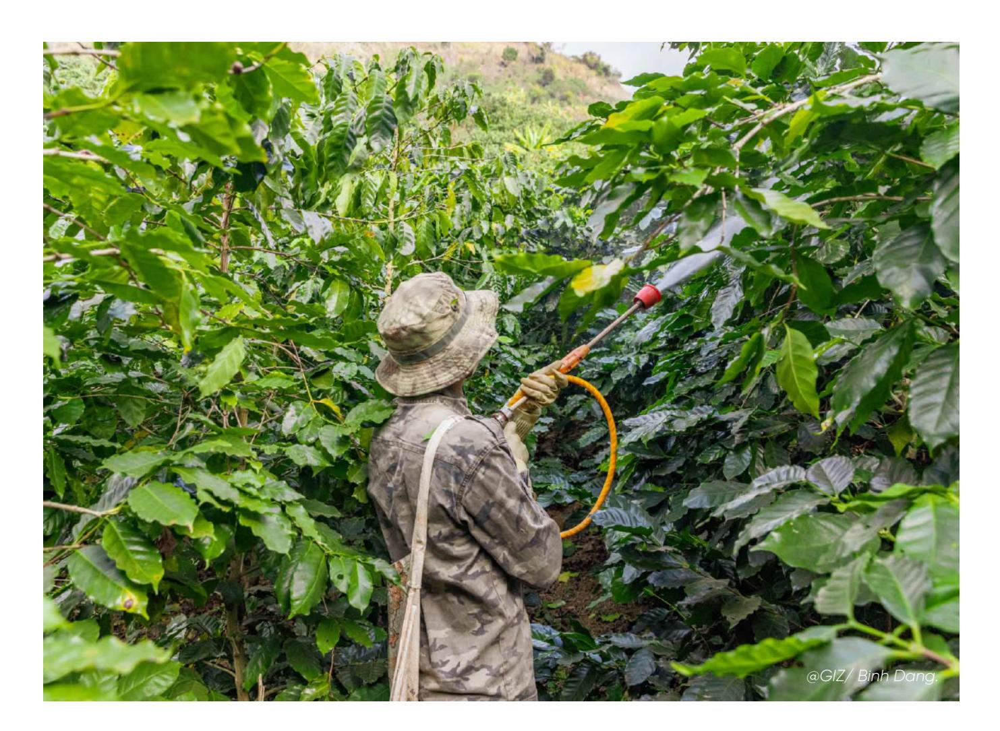

- I.
- II.
- III. publish operator-usable cut-o/land status layers via stable APIs so that private systems can automate plot checks; standardise a simple 'legality document bundle' by actor type and provide one-page SOPs that maintain the link between farmer ID, plot polygon, dated consignment and legality reference at every handover; enable first-mile execution with oine apps, barcoded receipts, dealer toolkits and short, bilingual training sessions; reduce the risk of adoption by pooling mapping and onboarding resources and using blended finance. intensify awareness-raising on EUDR requirements and systematically clarify open questions through targeted guidance, FAQs and dialogue platforms for enterprises, cooperatives, collectors and smallholders
- IV. V.

| Moderate (can compile      |                        |
|----------------------------|------------------------|
|                            | High (setting up       |
|                            | High (capex available) |
| Sector/Actors Traceability |                        |
| Low–Moderate               | (LURC                  |
|                            | Low (onboarding        |
| Low (mixing; limited       |                        |
|                            | Low–Moderate (thin     |

# **6.2. Readiness assessment**

The available studies do not provide a complete picture of EUDR readiness; they mainly describe current practices and emerging actions to meet the requirements. Building on those descriptions, we have compiled a provisional readiness assessment by sector and actor (smallholders, collectors/dealers, processors/exporters), across four dimensions (traceability, legality, technical capacity, and financial capacity) with digital literacy and gender and social inclusion as cross-cutting dimensions based on the fact that under the EUDR, only operators have obligations, not smallholders or other supply chain actors in third countries who do not directly place their products on the EU market.

The suggestions below reflects the fact that supply chain actors might nevertheless have the interest to provide EUDR-relevant information to their business partners when providing products for the EU market as well as feedback from interviews on the ground. It needs to be stressed that this assessment represents the status quo in early November and is not a comprehensive overview over the whole situation of all stakeholders in the value chains of the three sectors covered. It is meant to provide a rough picture, not detailed interpretation of the actors and categories covered.

# The table below presents an overview of the readiness assessment across the three sectors:

| Moderate (estate                                                               |                                       |
|--------------------------------------------------------------------------------|---------------------------------------|
| High                                                                           | (IT/quality                           |
|                                                                                | High (capex,                          |
| Moderate (experience                                                           |                                       |
| Moderate (familiar with                                                        |                                       |
| Low – Moderate                                                                 | (due                                  |
|                                                                                | Low on boarding cost                  |
| Moderate (CoC                                                                  |                                       |
|                                                                                | Low – Moderate (low                   |
| High                                                                           | (IT/quality teams                     |
|                                                                                | High (capex,                          |
| Low (low geo                                                                   |                                       |
| Low–Moderate (tenure                                                           |                                       |
| Maintain permits/transport papers ; participate in                             | FSC/VFCS groups; join pilots for      |
| Organize document bundles (source contracts, transport docs) and improve       | origin                                |
| segregation before mill intake; prepare for VNTLAS                             | checks.                               |
| Map workflows to EUDR Arts. 9–11 , link FRMS/land data to enterprise CoC where |                                       |
| possible, and keep records ; some firms extend                                 | import screening for at-risk sources. |
| Low                                                                            | (little                               |
|                                                                                | Low (on boarding cost                 |
| Low (mixing; limited                                                           |                                       |
|                                                                                | Low–Moderate (low                     |

| <b>A</b> | <b>Note:</b> 
<b>L</b>    •   Across all three sectors, these steps are more advanced in organized/certified supply streams;
 
<b>L</b>    •   The smallholders and local collectors/dealers remain the hardest place to operationalize plot-linked geo, legality and data that travels end-to-end to the operator;
 
  •   Many SMEs have not yet started or are struggling without external support; costs are significant but unquantified in the reports.
 |
|----------|-------------------------------------------------------------------------------------------------------------------------------------------------------------------------------------------------------------------------------------------------------------------------------------------------------------------------------------------------------------------------------------------------------------------------------------------------------------------------------|
|----------|-------------------------------------------------------------------------------------------------------------------------------------------------------------------------------------------------------------------------------------------------------------------------------------------------------------------------------------------------------------------------------------------------------------------------------------------------------------------------------|

## *Note: definitions of readiness levels:*

- *• Low indicates minimal systems, fragmented records, and high reliance on informal practices.*
- *• Moderate reflects partial adoption of tools, documentation, and procedures, often limited to pilots or specific streams.*
- *• High denotes established, standardized systems with consistent data capture, segregation, and resources sucient to meet EUDR requirements at scale.*

# **6.2.1. Traceability**

# **Coee:**

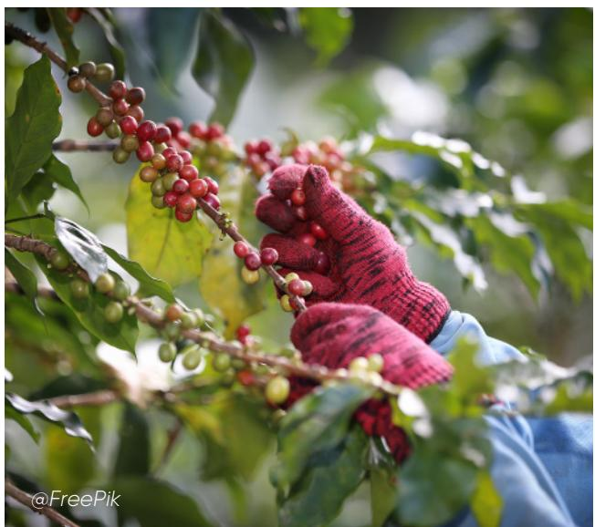

- **Smallholder farmers:** show low to moderate traceability readiness. Many farmers have more than one plots, each plot geolocation is often partial and limited to single GPS points, and long, multi-tier supply chains lead to frequent mixing before first aggregation. Most farmers do not maintain structured transaction records. Participation in buyer-led pilots, cooperatives, or certification schemes has enabled some farmers to begin recording plot location and sales through simple logs or mobile applications, but coverage remains uneven. **Collectors/Dealers:** represent a critical traceability bottleneck. Transactions are frequent and high-volume, yet records often omit farmer identity, plot coordinates, and collection dates. Mixing at purchase points and warehouses is common. Some collectors have started using basic forms or mobile sheets to record farmer ID, plot coordinates, and collection dates, and to introduce rudimentary segregation, but practices are not yet standardized. **Processors/Exporters:** demonstrate moderate to high traceability readiness. Most operate enterprise traceability systems and segregated lines for certified or program coee. However, traceability is only robust for organized supply streams. Companies are tightening chain-of-custody controls, requesting geolocation and legality information from suppliers, and testing API-based system upgrades to ensure EUDR-required data remains linked to each lot.
- **a.**
- **b. c.**

# **Rubber:**

# **Timber:**

- **Smallholder farmers:** have very low traceability readiness. Geolocation coverage is minimal, and latex from smallholders is routinely mixed with other domestic and imported material. Record-keeping is informal and rarely plot-linked. Where guidance exists, farmers are encouraged to capture GPS points of planted areas, retain simple production logs or photo evidence, and participate in organized farmer groups. **Collectors/Dealers:** dominate first-mile aggregation but operate with weak traceability controls, hence, show low readiness. Mixing and re-bagging across multiple tiers is widespread, breaking lot identity early. Records are usually
- **a.**
- **b.**

paper-based and omit key EUDR information. Step-by-step data capture tools—covering farmer ID, plot geolocation/polygon, collection date, volume, and consignment ID—are being piloted.

- **Processors/Exporters:** are relatively advanced, hence, moderate to high readiness, with enterprise systems capable of segregating compliant products. However, traceability risks remain high due to upstream gaps and cross-border sourcing. Companies are operating clean lines, onboarding dealers to provide EUDR-relevant data, and screening imports from Cambodia and Laos.
- **c.**

- **Smallholder farmers / community woodlots:** have moderate traceability readiness, benefiting from experience with forestry records under VNTLAS. However, plot mapping often relies on centroids rather than polygons, and links between plots and land titles are incomplete. Participation in FSC/VFCS group certification and pilot polygon mapping initiatives is helping to close these gaps. **Collectors/Traders:** generally maintain basic chain-of-custody documentation and are familiar with transport papers. Nevertheless, aggregation stages still rely heavily on paper records, and origin segregation before mill intake is inconsistent. Improved document bundling and segregation practices are emerging in preparation for VNTLAS and EUDR requirements.
- **a.**
- **b.**

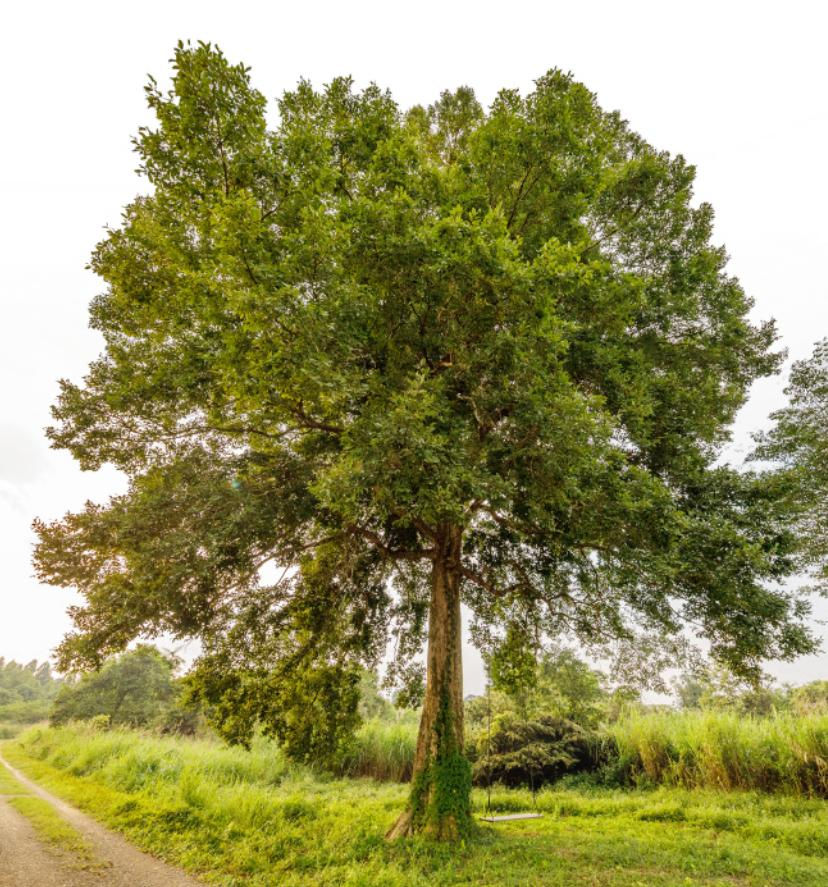

**Processors/Exporters:** exhibit moderate to high traceability readiness, with established CoC systems. The main constraint is limited interoperability with public spatial datasets. Leading firms are mapping workflows to EUDR Articles 9–11 and attempting to link FRMS and

land data to enterprise systems.

**c.**

# **6.2.2. Legality**

# **Coee:**

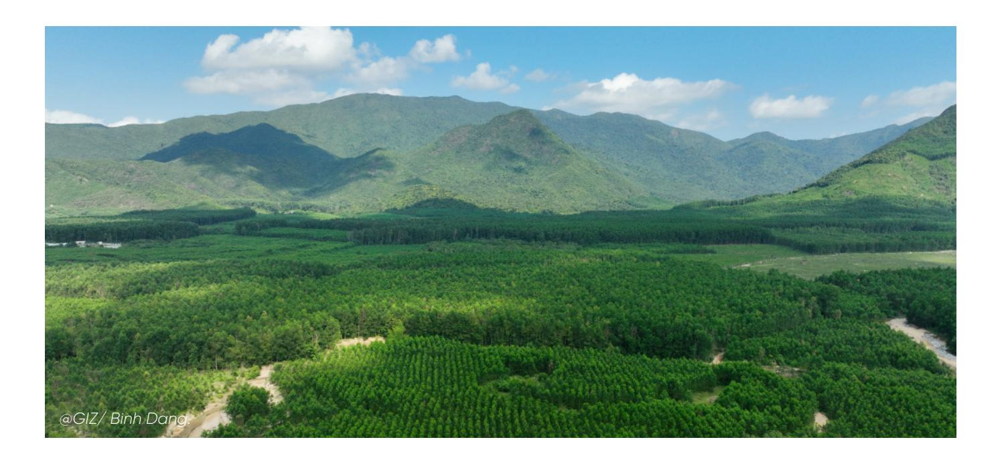

- **Smallholder farmers:** face low to moderate legality readiness due to gaps in land-use right certificates and environmental compliance documentation. These gaps are most acute near forest land. **Collectors/Dealers:** show low to moderate readiness and operate without formal purchasing contracts and maintain partial information on legality of production. Documentation rarely links transactions to plot-
- **a.**
- **b.**

level land-use rights or environmental compliance, and labour and human rights considerations are not systematically recorded.

- **Processors/Exporters:** exhibit moderate legality readiness and have the capacity to compile core legality evidence for due diligence, including land tenure and basic environmental compliance. However, weak upstream records limit verification of labour conditions, community consent, and plot-level deforestation status.
- **c.**

# **Rubber:**

- **Smallholder farmers:** exhibit low to moderate legality readiness. Tenure documentation is uneven, and many farms lack geo-linked proof of lawful land use. —Particularly in cases where rubber is planted on former forest land itis dicult to demonstrate legal production without harmonised land-status maps. Labour arrangements are typically informal, with limited documentation of worker rights or safety conditions. **Collectors/Dealers:** show low to moderate readiness, hold basic business documentation but show limited awareness of the broader legality requirements under the EUDR. Environmental and labour considerations are not systematically assessed, and FPIC is generally absent from purchasing decisions. **Processors/Exporters:** show moderate readiness, sourcing from estates are relatively well positioned in terms of land tenure and environmental requirements. However, cross-border imports from Cambodia and Laos significantly elevate legality risks related to labour standards and community rights.
- **a.**
- **b. c.**

# **Timber:**

# **6.2.3. Technical capacity**

# **Coee:**

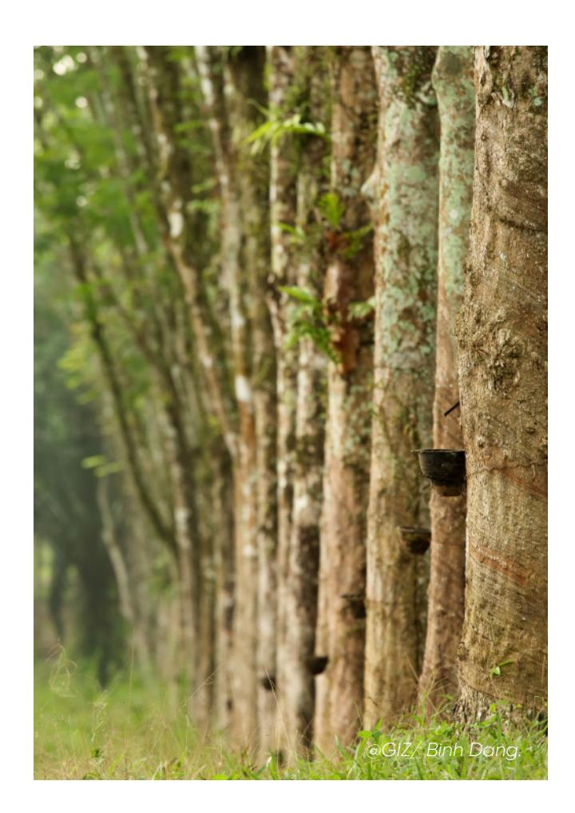

- **Smallholder farmers:** show moderate readiness, generally understand permit requirements and legal harvesting rules under VNTLAS. Nevertheless, plot-level geo-referenced evidence and consistent land titles are often lacking. While environmental safeguards are better established than in coee or rubber, documentation of labour practices and FPIC—particularly for community-managed forests—remains uneven and largely informal. **Collectors/Traders:** show moderate readiness, legality documentation flows, including harvest
- **a.**
- **b.**

and transport permits, but rely heavily on manual systems. Labour and human rights considerations are rarely documented beyond basic compliance with national laws, and FPIC-related evidence is not systematically captured.

- **Processors/Exporters:** exhibit moderate to high readiness, demonstrate strong legality capacity under VNTLAS, including compliance with national environmental and forest protection regulations. However, imported timber introduces elevated risks related to labour conditions and human rights in sourcing countries.
- **c.**

- **Smallholder farmers:** show low to moderate technical capacity. Although smartphone ownership is common in some regions, many farmers lack the skills to use GPS tools, geolocation/ polygon mapping applications and digital records consistently. Plot data are often limited to single points, multiple plots are rarely linked to one farmer ID, and awareness of EUDR technical requirements remains low. **Collectors/Dealers:** have low to moderate technical capacity. High-frequency purchasing relies largely on handwritten notes or basic phone logs, and SOPs for digital capture, batch coding and segregation are not standardised. While some collectors use simple digital forms, data quality varies. Time pressure and limited familiarity with digital tools constrain uptake, highlighting the need for simplified, oine-capable applications and clear SOPs. **Processors/Exporters:** demonstrate high technical capacity, with enterprise traceability systems, barcode-enabled intake and segregated processing lines widely in place. However, limited interoperability between public
- **a.**
- **b. c.**

spatial datasets and enterprise CoC or ERP systems restricts automation of EUDR related checks, requiring continued manual data reconciliation.

# **Rubber:**

# **Timber:**

- **Smallholder farmers:** have low to moderate technical capacity. Experience with VNTLAS and certification provides a stronger baseline than in coee or rubber, but many households still lack skills in geolocation/polygon mapping, digital file management and linking geospatial data to land titles. **Collectors/Traders:** show moderate technical capacity, with familiarity in CoC documentation. However, practices remain largely paper-based,
- **a.**
- **b. c** digital uptake is uneven, and SOPs for consistent data capture and batch linkage are not systematically applied. **Processors/Exporters:** demonstrate high technical capacity, operating digital forest management systems and electronic CoC. The main constraint is interoperability: public forest and land-status datasets are not fully integrated with enterprise systems, increasing manual verification and compliance workload.

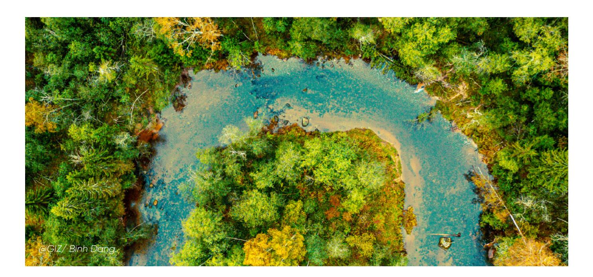

- **Smallholder farmers:** face very low technical capacity. Many lack suitable smartphones and have minimal familiarity with GPS or digital documentation. Daily tapping routines leave little time for record-keeping, and awareness of EUDR processes is extremely limited. Technical engagement therefore depends almost entirely on dealer- or processor-led initiatives. **Collectors/Dealers:** have low to moderate technical capacity. Although toolkits and SOPs exist, adoption depends on processor support and enforcement. Understanding of key technical requirements—such as persistent IDs, geolocation/polygon mapping and consignment -level data—is limited, and high transaction frequency discourages manual digital entry unless tools are highly streamlined. **Processors/Exporters:** generally have high technical capacity, supported by enterprise traceability systems, segregated storage and internal compliance teams. Nonetheless, upstream data gaps and limited access to authoritative public spatial data constrain full system integration, particularly where imported latex is involved.
- **a.**
- **b. c.**

# **6.2.4. Financial capacity**

# **Coee:**

# **Rubber:**

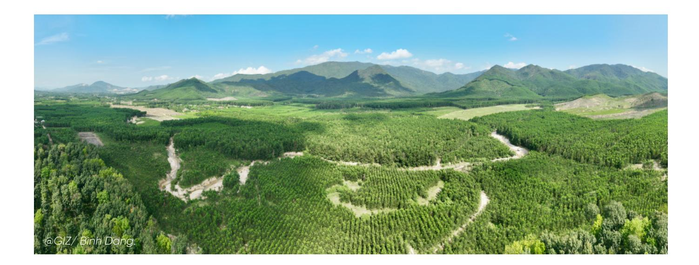

- **Smallholder farmers:** face low financial capacity to absorb EUDR-related costs. Upfront expenses include GPS or smartphone purchase, plot mapping, document regularisation, data plans, and time spent on training and record-keeping. These costs often outweigh short-term benefits, especially where price premiums are absent. **Collectors/Dealers:** operate on thin margins and have low to moderate financial capacity. EUDR preparedness requires additional working capital to segregate compliant and non-compliant lots, invest in basic digital tools, and maintain records. Holding segregated inventory can delay cash in readiness. **Processors/Exporters:** generally have high financial capacity. They are able to invest in IT upgrades, traceability systems, segregated storage, and sta. However, costs increase significantly when companies must co-finance upstream mapping, training, and onboarding. These expenditures are recurring and not always recoverable through price premiums, particularly in competitive markets.
- **a.**
- **b.**
- **c.**

flow, creating liquidity risks. Limited access to concessional credit further constrains investment

- **Smallholder farmers:** have very low financial capacity. Mapping, documentation, device purchase, travel to administrative oces, and time spent on data entry represent substantial burdens. Many farmers are unwilling or unable to bear these costs without direct financial support or clear economic incentives. **Collectors/Dealers:** face low to moderate financial capacity. Segregating EUDR-eligible latex requires additional storage, labeling, and working capital. Margins in latex trading are often insucient to absorb these costs, making adaptations dependent on processor support or price incentives. **Processors/Exporters:** typically have high financial capacity, supported by capital reserves and partnerships. Nonetheless, operating clean lines, onboarding dealers, and screening imported material tie up working capital and increase operational risk. Without cost-sharing from buyers or blended finance mechanisms, these investments may limit scale-up.
- **a.**
- **b. c.**

# **6.2.5. Digital literacy (cross-cutting)**

# **Timber:**

- **Smallholder farmers / community woodlots:** face low financial capacity similar to other sectors. Costs related to geolocation/polygon mapping, documentation, devices, and training are significant relative to household income. Group certification and donor-supported programmes help reduce individual costs but are not universally available. **Collectors/Traders:** have low to moderate financial capacity. While basic documentation is already part of operations, EUDR preparations
- **a.**
- **b.**

increases costs related to data management, segregation, and verification. Limited margins constrain willingness to invest in digital upgrades without external support.

- **Processors/Exporters:** generally have high financial capacity. They can fund IT upgrades, monitoring, and due-diligence systems. However, preparation costs rise sharply for firms sourcing from smallholders or importing timber from higher-risk origins, requiring sustained investment in screening and verification.
- **c.**

**Coee:** Digital uptake in the coee sector remains uneven. While smartphone penetration is relatively high in the Central Highlands, many smallholders—particularly ethnic minority households—struggle with using GPS tools, mobile applications, and digital receipt systems. Collectors, who mediate most first-mile transactions, often resist digital tools due to the speed required in daily purchasing and concerns about formalization or tax exposure. As a result, critical EUDR data information such as geolocation, timestamps, and consignment IDs are inconsistently captured. Eective solutions must therefore be ultra-simple, oine-capable, and supported by repeated field-based coaching that builds confidence and routine use.

**Rubber:** Rubber exhibits the lowest digital literacy of the three sectors. Most smallholders lack smartphones capable of reliably capturing geolocation or date-stamped records. Collectors/ Dealers—who handle over 95% of smallholder latex before it reaches processors—rely heavily on hand-written notebooks or basic phone notes, neither of which capture required EUDR relevant data. High-frequency daily transactions make digital entry burdensome without automated or semi-automated tools. As a result, persistent IDs and traceability are routinely lost at the first mile. Improving digital literacy will require simplified dealer applications, hands-on demonstrations, and targeted support to encourage habitual digital data entry.

**Timber:** Digital literacy in the timber sector is comparatively stronger, especially among enterprises accustomed to VNTLAS, FSC, or PEFC systems. Many processors already use digital forest management tools and electronic chain of custody systems. However, smallholder plantation owners—who operate dispersed woodlots—still face challenges capturing geolocation/polygon boundaries, linking coordinates to LURCs, and managing digital legality documents. Without targeted training and simplified geo-mapping workflows, these bottlenecks limit the sector's ability to meet EUDR requirements for plot-linked evidence. Still, timber's stronger baseline provides a foundation for scaling digital traceability more rapidly than in coee or rubber.

# **6.2.6. Gender and Inclusion (cross-cutting)**

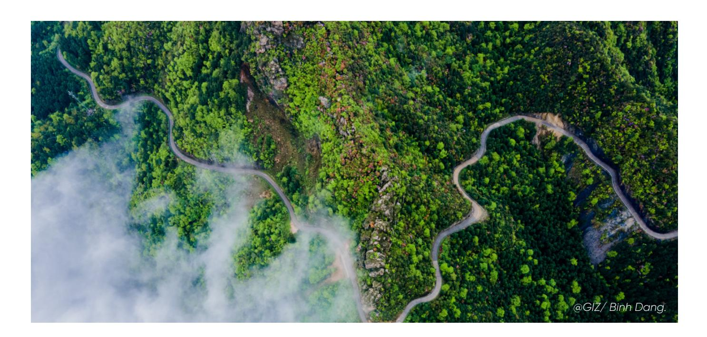

**Coee:** Women and ethnic minority groups are central to coee production yet remain underrepresented in tasks requiring documentation, digital skills, or interaction with regulatory and traceability systems. Time poverty, limited literacy, and lower digital confidence reduce their participation in training sessions and traceability workflows. These gaps increase the risk of exclusion under EUDR , which demand accurate geolocation and legality information at the household level. Bilingual coaching, shorter modular trainings, peer-to-peer mentoring, and visual job aids are essential approaches for ensuring women and minority farmers can contribute meaningfully to EUDR-aligned data collection.

**Rubber:** Gender and inclusion challenges are most pronounced in the rubber sector. Women play a major role in latex tapping and household management but are largely excluded from documentation, digital traceability, and preparedness-related decision-making. Land-use certificates are typically issued in men's names, limiting women's ability to validate farm information for EUDR purposes. Ethnic minority households face additional barriers due to language constraints and limited exposure to regulatory requirements. Daily harvesting and rapid sales cycles further shift digital and legality-related tasks to male household members or dealers. Targeted measures—such as bilingual, village-level training and deliberate inclusion of women in data collection—are essential to prevent exclusion under EUDR.

**Timber:** Timber shows comparatively better gender representation in administrative and recordkeeping tasks, reflecting women's roles in cooperative management and enterprise oces. However, field-based mapping, harvesting supervision, and technical verification remain male-dominated, and ethnic minority households face similar language and access barriers as in the other sectors. Women's strong presence in administrative functions presents an opportunity: training women sta and cooperative leaders in digital evidence collection and EUDR workflows is likely to generate high returns for sector-wide compliance. Inclusion will depend on ensuring training materials are accessible, modular, and available in minority languages.

# **07. FIELD FINDINGS**

# **07. FIELD FINDINGS**

The field findings complement the meta-analysis by examining how EUDR requirements are interpreted and implemented by key stakeholders. Rather than introducing new themes, the fieldwork revisits core readiness issues identified in earlier studies to validate, refine and contextualise them using empirical evidence. This approach explains the partial overlap with the meta-analysis and confirms whether documented gaps persist in practice. Additionally, the field findings expand upon existing literature by evaluating the costs incurred by various stakeholder groups and identifying the potential co-benefits of EUDR adoption — dimensions that have only been addressed to a limited extent in previous research.

# **7.1. Coee sector**

# **7.1.1 Overall observations**

Vietnam's coee supply chain shows moderate but uneven readiness for EUDR implementation, with downstream actors significantly more prepared than those at the farm and collection levels. Exporters and processors are the most advanced due to earlier investments in digital systems and segregated sourcing, while collectors have only partially adopted first-mile documentation, and smallholders remain the least ready. Overall progress is strongest in districts where major programmes and companies have already piloted digital purchasing and farm mapping, notably in: Chư Prông, Chư Sê and Ia Grai (Gia Lai), Krông Năng and Cư M'gar (Đắk Lắk), and Mai Sơn and Thuận Châu (Sơn La). These areas benefited from earlier interventions by exporters and development partners, resulting in higher rates of geolocation coverage and more consistent data transfer.

Traceability and legality readiness remain uneven across the coee chain across the coee chain remain uneven. Geolocation coverage has reached roughly 80–85% of plots; most smallholdings fall under 4 hectares, so point coordinates are acceptable under the EU Deforestation Regulation, but these points are not yet consistently linked to farmer identity or land-tenure documents. As shared by CPC leaders and DAE sta during the interviews about 80% of farms hold formal land-use right certificates, while the remainder rely on commune confirmations or pending paperwork, creating delays in verifying batches from those households. These cases disproportionately aect women-headed households and ethnic minority farmers, who face greater barriers in completing paperwork and accessing cadastral services—creating delays in verifying batches sourced from these groups. Exporters operate semi- or fully digital systems (ERP/QMS, QR/blockchain pilots), but maintaining segregated EUDR-compliant flows is still dicult when first-mile data are incomplete. Integration with national or provincial forest and land-status layers for the 31 December 2020 cut-o, and consistent transfer of required EUDR information along the chain, is not yet universal.

Collectors and cooperatives are transitional but pivotal: as traders noted during interviews roughly a quarter of collectors keep farmer lists or purchase ledgers, usually on paper or Excel, and few run structured mobile workflows. Their capital base and IT capacity are modest, so they depend on exporters for templates, training and the cash flow required to hold segregated inventories. Without structured onboarding processes (e.g. ID capture, plot geo-location, date/volume, consignment IDs) at buying points, batch histories are lost before reaching mills.

Cross-cutting constraints include:

Implications for next steps where support could focus on:

- the absence of a single-window, operator-ready spatial service (cutting o forest/land layers with APIs) to automate plot checks;
- fragmented data governance across agricultural, land and forest systems;
- non-standard first-mile SOPs/tools (oine and smallholder-friendly) for capturing EUDR-required information;
- limited provincial budgets for public functions needed to support EUDR readiness—such as updating forest and land-status layers, verifying legal documents, training commune-level sta, and coordinating data sharing across departments, meaning adaptation relies heavily on donor and buyer pilots (IDH, GIZ, EFI) or support from large buyers such as Nestle', JDE Peet's…, which risks patchy coverage.
- Opportunities and alignment: Vietnam's Sustainable Coee Development Strategy (digital farm data, certifications and stronger farmer organisations) creates a foundation for actors to align with EUDR requirements. Prioritizing collector onboarding, accelerating the formalisation of land-tenure rights of the remaining 20% of plots, and establishing a national API-based data platform will be critical to rapidly increasing data transfer rates. If implemented eectively, these investments will also reduce internal verification eorts, strengthen risk management, and secure more stable EU market access for compliant supply chains.

Exporting companies—who are considered operators under the EU Deforestation Regulation because they place Vietnamese coee directly onto the EU market, reported IT setup costs of approximately VND 2–5 billion (USD 75,000 – 190,000) and operational and maintenance costs of approximately VND 0.5–1 billion (USD 19,000 – 38,000) per year. Indicative per-tonne compliance costs are approximately USD 17–20 (some firms report USD 50+). Collectors face VND 5–10 million (around USD 200- 300) per year for basic administration and applications. For smallholders, expenditure on phones/GPS, mapping time and document regularisation is high relative to income, so participation depends on project/buyer co-financing. While these expenditures are real, they are unevenly quantified in existing studies, underscoring the need for a standardised costing framework*11* .

- I. first-mile capture: standard templates, barcoded receipts and oine apps;
- II. national/provincial cut-o layers accessible via APIs;
- III. financing instruments: micro-grants, concessional credit and results-based payments, to prevent the exclusion of smallholders and collectors;
- IV. a investment in digital public infrastructure and interoperable traceability systems to align MAE/VNFOREST cadastral–forest data with enterprise systems and sector associations (e.g. VICOFA) for scaled rollout.

*11The reported compliance costs are indicative estimates derived from focus group discussions and interviews with supply-chain actors, rather than from a full bottom-up cost accounting exercise. As such, they reflect how actors themselves experience compliance costs at this stage of EUDR preparation. While this approach does not provide precise or fully standardized cost figures, it is dependable in capturing relative cost ranges, key cost drivers, and dierences across actor groups. The estimates are therefore best interpreted as order-of-magnitude benchmarks rather than exact financial calculations. Their reliability is strongest for identifying where costs concentrate, how they evolve over time, and which actors are most exposed, rather than for determining exact per-unit compliance costs.*

# **7.1.2. Preparedness and adaptation steps**

Vietnam has been proactive in preparing for EUDR implementation. Since mid-2023, the coee supply chain has moved from pilot testing to practical roll-out: exporters have defined concrete steps to meet Due Diligence requirements, collectors have begun capturing first-mile data, and farm mapping has expanded across priority districts. However, progress remains uneven across dierent actor groups.

All surveyed firms have upgraded or deployed digital traceability (ERP/QMS integrations, GPS-based farm registries, QR/barcode intake; some blockchain pilots). These systems usually build on certification infrastructures (4C, Rainforest Alliance, Fairtrade) and now include EUDR-oriented workflows: supplier onboarding, deforestation screening against base maps, risk assessment and mitigation files, and internal audit trails. Large exporters (e.g., SIMEXCO, DAKMAN, NKG, ACOM, Sucden, OFI) are running pilots at scale and can segregate compliant lots through "clean lines" in milling and storage.

According to exporters interviewed, only about a quarter of collectors have begun documenting their supplier networks using Excel or basic mobile appsmostly through IDH/GCP-supported pilots funded by exporters. Adoption remains uneven, with common gaps in standardized templates, clear SOPs linking farmer ID to plot coordinates, collection date/volume, and consignment IDs, as well as warehouse segregation procedures. Working-capital requirements also increase when clean-line purchasing is enforced.

Farm-level adaptation is driven primarily by project interventions and buyer requirements, rather than by autonomous farmer uptake. In IDH-supported PPI (Production, Protection & Inclusion) Compact areas in Lâm Đồng and Đắk Lắk, and within sustainability programs of major roasters such as Nestlé, JDE Peet's, and Tchibo, many farms have been GPS-mapped and introduced to basic record-keeping. Outside these zones, however, most households still rely on paper receipts. Around 80% report having formal LURCs or cadastral extracts, while the remainder depend on commune confirmations or pending applications, and geo-linking of these documents to mapped plots remains inconsistent.

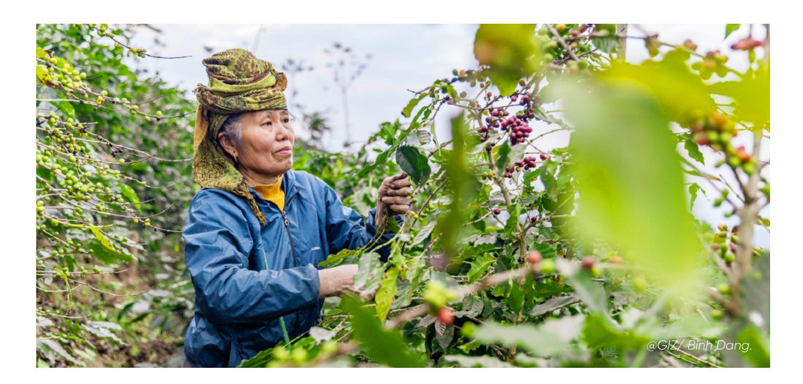

# **Costs incurred to date:**

- *• Smallholders:* Typical outlays include GPS/polygon capture (often subsidized but valued around USD 10–20/ha), travel and time for document checks, and occasional cooperative fees—material relative to farm income.
- *• Collectors:* Costs generally range from **USD 300–800** to establish basic digital records, purchase smartphones, and adopt traceability applications. In addition, collectors require **higher working capital** to hold segregated, EUDR-compliant stock— particularly when they buy from multiple farmers.
- *• Exporters/processors:* Software, integration, sta training, supplier mapping and audits. Indicative reported compliance costs range USD 17–20/ton of green coee for several FDI firms, with some companies citing USD 50+/ton depending on segregation depth and onboarding scope.

IDH's PPI Compacts have funded GPS mapping and deforestation-risk screening; GIZ and EFI have trained government and exporters on EUDR-aligned traceability; private programs (e.g., Nescafé Plan, JDE Peet's) bundle agronomy support, partial GPS collection and in-kind incentives. These initiatives show that market-linked rewards plus technical assistance mobilize participation eectively. However, conversations with stakeholders reveals

potential needs, including: (i) Co-financing to scale first-mile onboarding (mapping, apps, barcoded receipts, segregation); (ii) A national, interoperable integration mechanism linking enterprise platforms to national cadastral/forest datasets via open APIs; (iii) Targeted digital-literacy and inclusion programs for women, ethnic minorities and youth.

Participation in EUDR-related trainings is rising but skews toward exporters and ocials. Women and ethnic minorities attend but are under-represented in documentation roles, due to language barriers, time constraints and lower confidence with GPS/apps. Interviews with the dierent groups reveal that eective options include village-level short modules, local-language facilitation, women-friendly scheduling/child-care support, visual job-aids and peer-trainer models through women-led groups.

Smartphone access is high, but polygon mapping and structured data entry remain major hurdles for farmers and collectors. Oine-capable, wizard-style apps with built-in quality checks can significantly reduce errors, making simple tools, standard templates, and local-language support essential for full EUDR readiness. In addition, organizer capacity and information dissemination eorts are still limited, further constraining uptake.

# **7.1.3. Analysis of potential co-benefits**

Early pilots of digital traceability and farm-mapping systems—implemented by IDH's PPI Compacts, GIZ/EFI training programmes, and company-led sustainability schemes such as those of Nestlé, JDE Peet's and Tchibo in Viet Nam show that digital traceability—originally developed for EUDR compliance—can also generate practical co-benefits for farmers, collectors, and buyers when simple tools and first-mile data capture are in place.

Overall, these early experiences suggest that EUDR-aligned traceability can evolve into a broader service platform, but most benefits are still in the pilot or preparation stage and require continued investment to scale.

- **• Emerging financial inclusion opportunities:** The growing use of mobile money (MoMo, VNPay, ViettelPay) has created initial pilots where traceability-linked farmer IDs support faster and more secure payments. Exporter-led trials in Lâm Đồng and Đắk Lắk indicate that farmers are more willing to register when digital IDs are tied to predictable payments or small incentives.
- **• Early bundled-service models:** In IDH PPI Compact areas and company programmes (e.g., Nestlé, JDE Peet's), farmers who submit geolocation data gain access to agronomy advice, weather alerts, or input discounts through the same digital channel. These pilots suggest that participation increases when compliance activities visibly support productivity or reduce risk.
- **• Market access and dierentiation:** Verified "deforestation-free" lots now help exporters secure or maintain contracts with EU buyers and early movers in Japan and Korea. Reported premiums remain modest and inconsistent, but buyers already signal a preference for suppliers with credible traceability systems, encouraging more stable partnerships.
- **• Strengthening risk management:** Pilot mapping and screening exercises in Di Linh and Krông Năng show that plot-level geodata helps local authorities and companies detect potential encroachment risks and resolve boundary or documentation issues more quickly.
- **• Inclusion benefits where training is targeted:** Short, village-based training sessions conducted in IDH/GIZ pilot areas show higher uptake among women and ethnic minority farmers when local-language materials and simplified apps are used.

# **7.2 Rubber sector**

# **7.2.1. Overall observations**

The readiness of Vietnam's rubber chain is polarised: processors and large estates are far ahead, while smallholders and first-mile collectors remain the systemic bottleneck preventing the full EUDR data set (plot geo, harvest date and legality) from being passed end-to-end. The assessment is based on the findings from the sampled smallholders and collectors who were interviewed during the field trip. These individuals were selected to be representative of the low-readiness tier in the sector. Therefore, the description refers to the general population of first-mile actors who exhibit these characteristics, with the scores reflecting the readiness level observed in the interviewed sample.

**Smallholder farmers:** At the low-readiness tier, smallholders (who provide around 63% of the total domestic raw material (latex/coagulum) harvested in Vietnam) and the numerous collectors who aggregate latex continue to be the systemic bottleneck*12*. Smallholders' readiness for EUDR implementation remains very low, rearming the findings of the meta-analysis. The core problem is a breakdown in traceability in the first mile: multi-tier, high-volume, small-lot transactions. These trades are often cash-based and recorded manually, which facilitates frequent mixing and re-bagging, thus rendering plot histories untraceable before the rubber reaches the mill. Most smallholder plots are not mapped using polygons or linked to farmer IDs/LURCs, and sale notes are made on paper or via phone without timestamps or consignment IDs. The issue described relates to the complete absence of required geo-localization and robust transaction records, regardless of plot size. Where farms lie on or near land designated for forestry, demonstrating that no deforestation has occurred since 31 December 2020 is a slow and uncertain process (based on field interviews with smallholders and local ocials). Up-front costs (phones, GPS, mapping time, document fees and travel) are high relative to income, so participation usually depends on support from buyers or projects.

**Collectors/Dealers:** The collector is fragmented and often cash-reliant, leading to inconsistent records and high volumes of commingled, untraceable rubber. For suppliers of EU-committed processors, adopting digital tools is required, but the high operational and financial costs often lead to resistance or incomplete data submission. Collectors are only just starting to adopt apps provided by processors. In order to maintain segregated 'EUDR-compliant' stock, they require additional working capital, which increases friction and cash flow risk. These upstream constraints are mirrored by persistent hurdles faced by downstream processors/exporters: (i) onboarding and coaching large dealer networks, (ii) screening cross-border inputs from Cambodia and Laos with weak provenance, and (iii) sustaining the recurring capital and operating expenditure (software, sta, audits) required to maintain compliant inventories. Those challenges faced by processors are the consequences and systemic constraints that directly influence the readiness and viability of collectors.

Institutional and policy bottlenecks: Vietnam does not yet have a unified spatial service with authoritative forest and land-status layers, nor an operational national traceability system including an API for operators to access and exchange these datasets. In other words, the absence of a single national spatial service also means there is no API that operators can connect to for automated EUDR checks. Provincial data access, definitions (forest vs. agroforestry) and retrieval procedures remain inconsistent. Similarly, there is **no standardisation of** standard legality documentation set for smallholder latex — LURC/parcel linkages, harvest/transport papers and dealer invoices are rarely bundled or geo-linked on a large scale. Furthermore, cross-border inputs (cup-lump/latex) often arrive with missing origin or legal documentation, forcing mills to segregate or reject consignments.

Implications for next steps: EUDR compliance hinges on the first mile. Without dealer-level digital capture (farmer ID (Who sold it) → plot polygon (Where it was grown) → dated consignment (When and how much were sold) and **authoritative**, API-served cut-o layers, the required data will not persist for operators. Priorities are to:

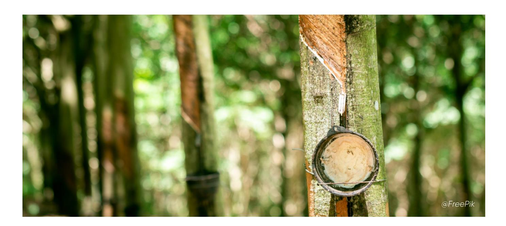

- I. scale processor-funded onboarding of dealers and smallholders using simple oine apps and barcoded receipts. Processors are the only actors with sucient capital, technical capacity and commercial leverage to deploy digital tools and train thousands of upstream collectors and dealers.
- II. publish harmonised cut-o/land status layers and a standard EUDR documentation template; and
- III. deploy financing and incentives, such as premiums, pooled mapping and concessional credit, so that upstream actors can maintain segregated, EUDR-eligible flows at a sustainable cost.

**Processors/exporters:** Medium- to large processors and estate producers show high readiness for EUDR, largely due to sourcing from their own plantations or controlled PEFC/FSC streams. Interviewed companies' self-assessments and system documents further confirm this. The evidence includes existing certifications, technological investment, control over inputs from "company-owned material. These firms are investing proactively in due diligence systems (DDS), geographic information system (GIS) integrations, and upgraded digital chain-of-custody systems. Their challenge lies less in complying than in scaling up: financing expansion, onboarding thousands of suppliers, and integrating non-compliant batches from smallholder flows.

# **7.2.2. Preparedness and adaptation steps**

Large processors and exporters are not just "supporting" but the primary actors driving and implementing the traceability technology and data collection on the ground for EUDR adaptation. They are investing in proprietary traceability solutions that link intake records to plot geo-coordinates, enforce clean-line segregation and store evidence of legality. To compensate for limited first-mile capacity, processors (or authorised agents) have taken on the task of data collection — capturing polygons/coordinates and scanning LURC copies from farmers — while issuing standardised mobile apps/SOPs for dealers to record geo-linked transactions (farmer ID, plot polygon, date/volume, consignment ID). To secure the supply chain, some firms pay premiums or extra payments for complete geo-legal data.

Processors face cost for EUDR application in practice: Capital expenditure (CapEx) for GIS/IT integration and recurring operating expenditure (OpEx) for dealer training, stang and external audits (reported fixed outlays of around 1 billion VND (~US\$39,400) per year for larger mills, plus variable costs). Upstream costs for devices, mapping and admin fees are subsidised or reimbursed through processor programmes, which reduces the immediate financial

pressure on smallholders and collectors but increases the operating burden on processors.

Incentives and technical support are proving eective based on the interviewed processors. In a context of data-privacy concerns, financial incentives are proving the most eective lever. Processors pair payments with free training and user-friendly apps to professionalise first-mile interactions and reduce errors. This combination increases cooperation and shortens onboarding cycles, though uptake still varies by locality and buyer influence.

In certified and organised streams, women's participation is notable, accounting for around 47% of the workforce and 42% of management and technical roles, according to company reports. Internal EUDR working groups include women (with approx.30% participation). Firms report social safeguards, such as flexible hours and housing support, and community engagement to avoid the exclusion of ethnic minority producers. Nevertheless, participation outside certified channels remains lower, and continued localisation of outreach is required.

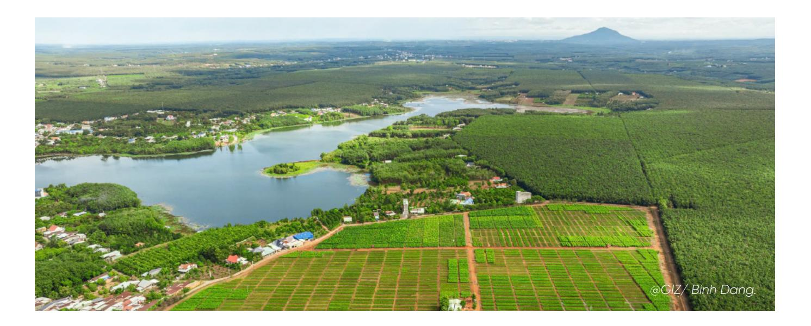

Processors/exporters have strong IT/GIS capacity to deploy traceability solutions and validations but integrating with thousands of low-literacy dealers creates high operational friction. Smallholders and collectors are willing to participate when incentivised and provided with simple tools. However, very low digital literacy and a lack of standardised procedures, combined with long-standing informal purchasing behaviours, prevent them from independently recording data in accordance with EUDR.

Provincial and commune agencies are raising awareness, but they face structural constraints. For example, forest and land use maps are incomplete or out of date in some areas, and the level of detail is insucient for robust checks on the EUDR cut-o date of 31 December 2020. Knowledge of the EUDR is also uneven at the district and commune levels responsible for issuing and verifying LURC. These issues are compounded by insucient budget allocation, low inter-departmental cooperation, and limited technical capacity at the local level.

Adaptation is processor-led and financing-intensive. The decisive next step is to scale up the onboarding of dealers and smallholders using simple oine apps, barcoded receipts and **clear standard legality documentation set**, while improving public spatial data services and local administrative pathways to enable swift, geo-linked tenure verification.

- **• Processor strategy:** Companies adopt a two-pronged approach: (1) securing low-risk flows from estates and certified suppliers, and (2) reducing the risks associated with sourcing from smallholders by providing them with traceability /mapping support, training and premiums. They are calling for clearer tenure verification pathways, as incomplete or slow LURC processes, especially for plots of land designated for forestry, could result in exclusions that threaten the security of the raw material.
- **• Smallholders' reality:** Most farmers act as passive data providers, granting access to map plots and sharing LUR documents, but rarely collecting coordinates themselves due to low digital literacy, a lack of devices and unfamiliarity with software. Trust barriers around sharing sensitive
- identity and land documents persist, slowing data acquisition. Record-keeping is basic and often omits EUDR-critical fields (precise polygon and dated lot linkage).
- **• The collectors' bottleneck:** First-mile dealers are the operational bottleneck. A growing number of them working with EUDR-focused processors now use apps supplied by processors, shifting the data workload from farmers to dealers. However, their business model — high-volume, small-lot, daily trades, often verbal — creates friction when converting to detailed, geo-linked digital entries. Data lag and mixing risks can undermine chain-of-custody integrity. Long-standing informal relationships and the absence of formal contracts also make it dicult to enforce documentation requirements.

# **7.2.3 Analysis of potential co-benefits**

The shift toward preparing for EUDR is not only a risk-management exercise; it is also generating measurable upside across Vietnam's rubber supply chain. Based on the practices observed and the field interviews, the drive toward EUDR adaptation is generating immediate co-benefits. Processors are actively implementing 'clean-line' workflows – separate purchasing, storage, and processing streams for compliant products – and issuing standardized dealer toolkits (often simple mobile apps or forms) with mandatory fields for key data such as Farmer ID, plot polygon/coordinates, collection date, volume, and consignment ID. To secure this compliant supply, many are oering concrete premiums or supplementary payments (typically 100 – 300 VNĐ/kg – approx. EUR 0.003 – 0.01/kg) for the provision of complete geo-legal data. Furthermore, gender-responsive training in certified and organized streams is increasing inclusion by prioritizing women's access to digital tools and documentation training, recognizing their central role in household documentation and finance.

**Faster payments and improved cash flow:** Across both Thuan Loi and Minh Duc communes, collectors and smallholders explained that manual notes often lead to disputes over weight, timing and accumulated volumes. Processor-supported mobile apps and barcoded receipts – already introduced by several companies – create time-stamped, verifiable records that immediately reduce disagreements. Collectors interviewed noted that when processors input data on their behalf, payment cycles become faster and more predictable. Over time, these verified datasets help smallholders demonstrate reliability and can support loan applications or advance payments, especially in communes where farmers currently struggle to provide formal financial records.

**Stronger market positioning and incentive alignment:** Large processors visited during fieldwork are already maintaining segregated lines and oering bonuses for suppliers who provide complete geo-legal information. Several processors reported that paying extra for mapped plots helps secure supply during peak periods. For smallholders, this turns data provision into a source of additional income rather than a cost. Transparent incentive schemes – such as rewarding dealers who meet minimum data requirements– help structure behaviour in currently informal chains and reduce the burden on processors who would otherwise have to input all data manually. **Clearer tenure information and reduced dispute risk:**  Plot-level mapping helps clarify land status in communes with complex land-use patterns. In Thuan Loi commune, most farmers have clear LUR documents, but in Minh Duc, where a significant share of rubber is on forestry land, producers often rely on long-term occupation rather than formal certificates. Mapping and documentation exercises introduced by processors help households compile or update evidence of legitimate use, which reduces uncertainty and strengthens their standing with local authorities. With polygons and dated lot histories, factories can isolate problem batches more quickly and verify origin when buyers request due-diligence evidence.

**Better alignment with sustainability and labour safeguards:** Processors trained under earlier sustainability programmes (e.g., FSC, VFCS/PEFC, ISO systems) are now integrating EUDR requirements into existing workflows. Field interviews show that internal compliance teams are adding safeguards on documentation, labour practices and record-keeping. Companies with structured internal systems – especially those in Group 1 (Low-risk chains/certified chains) – reported improved interaction between departments (purchasing, QA, sustainability), which reduces audit friction and strengthens buyer trust.

**More ecient operations and cleaner data flows:**  Digital traceability tools are motivating companies to streamline warehouse segregation, standardise SOPs and introduce mandatory fields for weighbridge tickets. In Viet Sing and Dong Phu, sta demonstrated how QR-linked evidence cuts down reconciliation time between factory gate receipts and production records. Collectors also described fewer errors when processors provided them with simple forms or oine apps. These gains apply beyond EUDR shipments: even non-EU buyers benefit from cleaner documentation and quicker response times.

**Enhanced gender and inclusion outcomes:** Although smallholder women often manage household finances and documents, they are rarely the target of training. Interviews in both communes showed strong interest from women in understanding EUDR requirements once information was delivered in accessible formats. Company-led programmes increasingly make space for women in training sessions and internal working groups. Flexible working arrangements and housing support – reported at several companies – help ensure women and ethnic minority workers can participate in capacity building processes without being disadvantaged. By bringing informal household documentation into a structured system, EUDR preparation is also making women's role in record-keeping more visible.

**System-wide improvements in governance and professionalism:** The drive toward EUDR adaptation is creating broader, sector-wide benefits: clearer plot records for local authorities, more consistent dealer operations, and more reliable datasets for public-private dialogue. Commune-level authorities in Thuan Loi and Minh Duc highlighted that increased requests for land-use verification are prompting them to review records and strengthen coordination between forestry, land administration and agriculture units. Over time, these improvements build a more resilient and finance-ready rubber sector, capable of meeting both EUDR and emerging sustainability requirements from other markets.

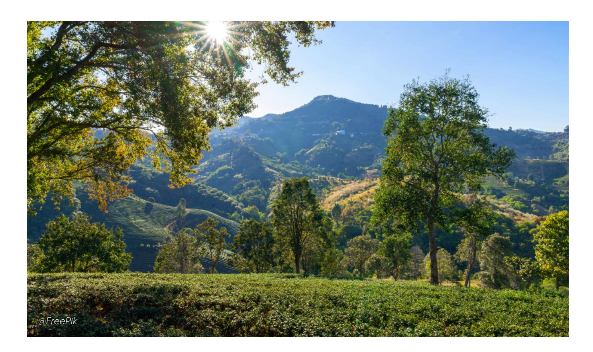

# **7.3. Timber sector**

# **7.3.1. Overall observations**

# *Traceability*

Interviews show that smallholders, traders, and enterprises face significant challenges in preparing for EUDR application. Most operators operate with limited digital capacity for traceability (geolocations, application use, etc.), fragmented records (refers to information that is incomplete, inconsistent, scattered across dierent sources, or not maintained in a unified system), and inconsistent land documentation. Households typically manage multiple small plots (ranging from 1 to 10 land plots with an average area of 1.3 ha/plot) with both titled and untitled land that do not often have geolocation files or digital production records. Traders (middlemen/collectors) and enterprises mainly make use of paper-based traceability systems that often lack the linkage with real-time information related to geolocation and legal requirements. These technical constraints translate directly into financial burdens, including mapping costs, upgrading record-keeping systems, third-party verification, and additional labour time.

# *Legality*

Legality challenges extend beyond land titles and geolocation, reflecting a limited understanding among many actors of the full scope of legality required under the EUDR. Field evidence indicates that preparing eorts largely focus on basic proof of land use rights, while other mandatory legal elements, such as adherence to land-use planning restrictions, harvesting regulations, environmental protection requirements, labour rights, occupational safety, and obligations related to FPIC, particularly in ethnic minority areas, are less consistently documented or verified. At the household and collector levels, legality checks rarely go beyond land ownership or contracts, with limited records on labour

conditions, use of hired workers, or environmental safeguards, and low awareness of FPIC where customary or informal land arrangements prevail. Institutionally, legality verification responsibilities are fragmented across forestry, land, labour, and environmental authorities, and existing systems under VNTLAS and the FLEGT-VPA provide limited operational guidance for addressing the broader social and environmental legality dimensions now emphasised by the EUDR. Therefore, preparedness remains uneven, favouring larger forestry companies with greater capacity while exposing smallholders and local traders to higher legality risks.

# *Gender and digital literacy*

There are significant discrepancies among actors and groups regarding digital literacy. Forestry companies received support from SFM projects, and it was estimated that from 70% to 100% of sta can apply digital devices (GPS, smart phones, satellite images etc.) to trace and verify information related to timber products. However, there were less than 10% local ocers who could use digital tools to monitor forest resources and trace timber products. The results of this study indicated that women and ethnic minority groups are faced with significant barriers, including limited access to training venues, limited roles in mapping and legality verification, and higher reliance on paper documents. Women make up at

# *Institutional readiness*

Institutional and policy bottlenecks further slowdown adaptation to the EUDR. Provincial working groups lack operating budgets, while guidance is fragmented, and no national implementing circular exists. Agencies also struggle with incomplete or non-interoperable data systems: land registries, plantation databases, forest resource maps, and company traceability records do not yet align.. This creates an uneven readiness landscape where large and certified companies progress faster, while small actors lag behind.

least 20% of management roles, 70% of sales and marketing positions, and about 50% of household-level labour. Yet their access to training and digital tools remains limited. Interview data also shows that ethnic minority groups have restricted access to information and traceability systems required under the EUDR. These gaps increase the risk of unequal exclusion from supply chains.

# *Opportunities and risks*

Despite these constraints, the EUDR oers clear opportunities for the timber sector. Viet Nam already has strong foundational systems including VNTLAS, the FLEGT-VPA, and FSC/PEFC certification. The timber sector is piloting the iTwood tool that can support traceability. Where donors have piloted plantation databases or Forest Resource Monitoring System (FRMS) tools, participants benefit from more accurate maps, clearer production records, and stronger management.

At the same time, several emerging opportunities can strengthen the position of small actors. Improved geolocation and legal documents can enhance the ability of actors to meet the requirements of other customers beyond the EU market. Enhanced competitiveness becomes possible for actors who can meet EUDR thresholds: certified forest owners already report stronger market access, more stable orders, and better technical capacity. Over the longer term, better traceability can attract buyers seeking reliable, low-risk sources and open pathways to diversified markets.

The potential risks are substantial. Smallholders and local traders may face the lack of coordinates, legal documents, or traceability data. Collectors risk being bypassed as enterprises shift to certified forestry companies with complete documentation. SMEs without certification or digital capacity face the risks of lacking geolocation and production dates from upstream actors.

# **7.3.2. Preparedness and adaptation steps**

# *Current readiness levels*

Readiness levels varied sharply by actors in the timber sector. Forestry companies show the highest relative readiness with geolocation information, legal documents, and production dates for traceability, especially those holding FSC/PEFC certification. Exporters demonstrate moderate readiness because they have to rely on input from suppliers. Finally, smallholders and collectors show very low relative readiness due to limited digital capacity, incomplete legality documents, and minimal structured records.

# *Steps taken*

Government agencies, enterprises and forest management units have begun taking initial steps to align with EUDR requirements to a varying degree. Forestry companies with existing FSC or PEFC certificates have mapped forest plots, documented legality, and organized traceability records following VNTLAS requirements. Many of them have adopted FRMS tools, MapInfo, QGIS, and handheld GPS devices to capture coordinates at the plot level. Following forestry companies, exporters used geotagged smartphone photos, GeoJSON files, and paper-based documents to support traceability.

# *Costs incurred*

Costs have already risen across the supply chain:

Provincial working groups have been established under decisions issued by the Provincial People's Committees, and agencies have studied Ocial Letter 7126 to guide preliminary adaptation. Similar to previous interviews, the iTwood and plantation database development have provided additional technical pathways, though many remain at early stages or stalled due to administrative obstacles. At the household level, smallholders record minimal information, usually relying on smartphone photos and red book copies, with little systematic traceability.

- Certified forestry companies reported a 10–20% increase in operating costs tied to verification, mapping, administrative upgrades, and maintaining digital systems. Annual third-party assessments for certification can cost around VND 250 million VND (~ USD10,000) for operations over 1,300 hectares. Enterprises also incur increased labour, procurement, and data-entry costs; several must hire external trainers or consultants because legal and technical requirements remain unclear.
- Small collectors and enterprises also report higher material costs and added expenses for documentation, contracts, or certified product lists.
- Households faces costs in preparing for EUDR readiness, as smallholders and collectors reported that timber selling prices would need to increase by from 5% to 15% to compensate for the activities required to meet EUDR requirements.
- Provincial agencies lack operating budgets for coordinating activities to support value chain actors meeting the requirements of the EUDR.

# *Support received and needs identified*

Support so far has been uneven and dependent on international projects. Enterprises involved in sustainable forest management (SFM project funded by BMZ and implemented by GIZ) received training, GPS equipment, computers, and software. Several firms note that certification systems (PEFC/FSC) indirectly help them meet EUDR requirements by strengthening legal documentation. Plantation database pilots funded by IDH are intended to reduce traceability costs once operational. However, local government budgets do not currently provide financial incentives for mapping or legality verification, and ocers lack support allowances. Agencies and actors expected to receive additional support related to geolocation data collection, standardized software, technical guidance, legal templates, and a clear national-level EUDR circular. Households express interest in price stability but see little direct incentive yet for traceability investment.

# *Participation, inclusion and capacity needs*

Participation patterns show that managers and technical sta who are mostly men attend EUDR-related workshops organized by GIZ, the Department of Forestry, the Forest Certificate Oce, and the National Training Centre (50% – 80% of men). At the household and workshop, the rate of participation is equal between males and females, and accessing information related to the EUDR is still fragmented for both gender groups. Ethnic minority participation remains low (around 20%), and women participate mainly in procurement and accounting roles within enterprises. Small household producers and local traders often lack opportunities or invitations to attend training. To increase participation, organizers can introduce quotas for women and ethnic minority representatives, provide travel stipends and per diems, and coordinate selection through Farmers' Unions, Women's Unions, and commune leaders. Delivering practical, field-based sessions on GPS use, mapping, and legality documents can also lower entry barriers. Materials presented in local languages and simplified formats would help households understand the relevance of EUDR compliance.

Reaching ethnic minority groups requires direct community-level engagement due to limited access

to formal training venues, language barriers, and inconsistent flow of ocial information. Women often hold roles in procurement or accounting but have less field exposure to mapping, forest monitoring, and technical traceability tasks.

Digital literacy varies widely. Interviewed forestry companies supported by SFM projects demonstrate strong capacity with from 70% to 100% of sta members who can use GPS devices, satellite imagery, FRMS software, or mapping tools. Some interviewed companies use drones and digitized maps as part of routine operations. In contrast, interviewed governmental agency reported that district ocials, rangers, and commune-level sta often lack digital skills, with less than 10% able to use forest monitoring tools in some areas. Interviewed enterprises still rely on paper-based documentation and basic oce software. Interviewed households use smartphones but mainly for photos and simple geotagging, without structured data storage or file formats required for EUDR. Interviewed collectors and traders also depend on paper lists, making coordinated traceability dicult. These gaps highlight a critical need for step-by-step digital training, simple mobile workflows, and interoperable systems that match the on-the-ground capacity of local actor.

# **7.3.3. Analysis of potential co-benefits**

# *Digital traceability tools as a source of co-benefits for smallholders (country context)*

# *Broader co-benefits of the EUDR for smallholders, collectors and local traders*

Field interviews demonstrate that digital traceability tools can generate emerging co-benefits for smallholders beyond compliance. Interviewed actors stated that:

- Mobile data capture, simple plot mapping, and date-stamped transaction records reduce reliance on fragmented paper files and lower audit risks, improving data continuity from farm to fork.
- Plot-level mapping and digitised records can link land status to harvested timber.
- Aggregated group-level data improves market access, also to other markets like Japan and South Korea, reduces exclusion risks, and supports clearer pricing and timely payments.
- Traceability platforms can push tailored agronomic advice, pest alerts, and market prices.
- Verified land plots aggregated by collectors or cooperatives increase negotiation power with exporters and enable group contracting or group certification, lowering per-household verification costs.
- Traceability tools strengthen information flows among stakeholders across the supply chain.

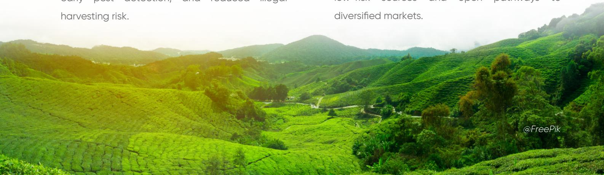

- Field interviews demonstrate that the regulation can catalyse systemic improvements that extend beyond EU market access.
- Actors meeting EUDR reported potential for stable EU orders, and this can translate into more predictable demand and improved cash flow.
- Field data show certified plantations already command better access and sometimes price advantages.
- The push for documentation (red books, coordinates) encourages formalization, and households with clearer land rights are more likely to invest in sustainable practices and have better collateral for credit.
- Geolocated plots and digital monitoring support improved planning (rotation, species selection), early pest detection, and reduced illegal
- Verified, geolocated plots make smallholder areas eligible for payment for environmental services (PES), carbon projects or other environmental payments, diversifying incomes beyond timber.
- At the same time, several emerging opportunities can strengthen the position of small actors. Improved geolocation, land-use rights, legal documents can enhance the ability of actors to meet the requirements of the EUDR. Enhanced competitiveness becomes possible for actors who can meet EUDR requirements: certified forest owners already report stronger market access, more stable orders, and better technical capacity. Over the longer term, better traceability can attract buyers seeking reliable, low-risk sources and open pathways to

# *Role of sustainable production practices and digital solutions in generating positive change*

- Interview results demonstrated that under the EUDR agroforestry systems increase ecological resilience and income stability. Digital tools can document species, tree age and management practices required by buyers or certification, facilitating market recognition for diversified systems.
- Interviewees reported that digitized plot records enable targeted extension (where yields lag or pests emerge), improving productivity and reducing losses. Bundled oers (mapping + seedlings + advisory) significantly increase household uptake.
- Respondents stated that robust geolocated data is a prerequisite for carbon projects and PES, and digital records can thus unlock new revenue streams while promoting sustainable land use.
- Adherence to producer-country regulations supports social and environmental safeguards and can improve the inclusion and voice of smallholders, women, and ethnic minorities in the timber sector.

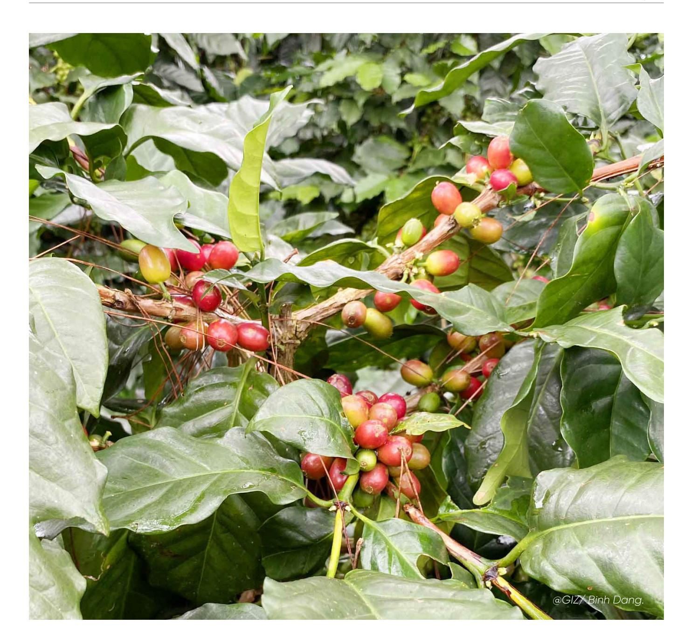

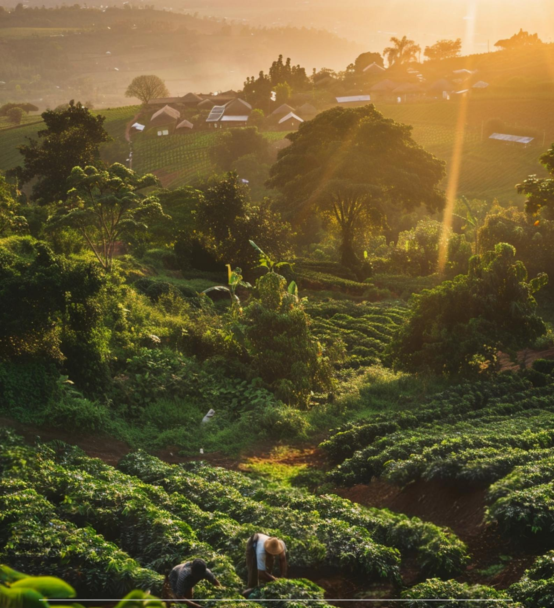

# **IMPLICATIONS FOR 08. EUDR IMPLEMENTATION**

# **08. IMPLICATIONS FOR EUDR IMPLEMENTATION**

# **8.1. Readiness**

Readiness is uneven across the chain for all three commodities: exporters/processors have the strongest systems, while first-mile actors (smallholders and collectors/dealers) remain the least prepared for passing a complete **EUDR data set** (plot geo, date and legality) end-to-end. Public spatial layers for the 31 December 2020 cut-o date are not yet packaged in a form that is ready for operators and accessible via an API. Digital literacy is low at the farm/collector level, and SOPs for GPS/polygoning, batch coding and clean-line handling are not standard. Financing at the first mile is limited, so the costs of onboarding, mapping and segregation risk excluding smallholders. The gender impact is moderate: while women participate widely in production and administrative roles, they are under-represented in technical traceability tasks.

This varies by commodity:

There are dierentiated impacts by actor group. Smallholders face upfront costs (devices, mapping and document fees) and time burdens, while collectors require working capital and simple tools to maintain segregated lines and record IDs, dates and volumes. SMEs incur IT upgrades, document stang and operation costs. Exporters can invest, but they still depend on the quality of upstream data. Women and ethnic minority producers can participate, but they need targeted training to enter geo/SOP roles.

Comparative cost picture and support mechanisms*13*.

- **• Coee:** Traceability is closest to being scaled up: exporters run ERP/QMS and QR/blockchain pilots, and around 80–85% of the plots sampled have GPS points. However, templates and dealer pass-through remain inconsistent. Around 80% of plots have LURC/cadastral extracts; the remainder require commune confirmations or geo-linking. Per-tonne compliance commonly costs USD 17–20 (though some cost USD 50+).
- **• Rubber:** The first mile dominates risk, with manual records, frequent mixing and complicated legality checks regarding where rubber is grown. Processors are investing in segregated 'clean lines' and dealer
- onboarding, but a reliable farm-to-factory supply chain is not yet universal. The typical factory spends around VND 1 billion per year on software and support (plus sta and audits).
- **• Timber:** Organised/certified chains (FSC/VFCS) demonstrate workable mill-level traceability and comprehensive legality documentation under VNTLAS. The main issue is the lack of interoperability with public data and SME digital intake. Certification maintenance costs around VND 250 million per year for an area of around 1,300 hectares, plus 5–10% operating expenses for compliance.

*13See Annex 5 for more detailed information on what is included in the dierent sub-categories of costs*

# **8.2. Potential Co-benefits**

Although EUDR preparedness incurs initial and ongoing costs (mapping, IT, segregation and training), the three sectors share a similar set of benefits.

Cross-cutting support. Set up a single-window spatial service incorporating cut-o layers and APIs, mandate the passing through of EUDR-required data elements, fund first-mile onboarding via subsidies, concessional credit or results-based payments, and roll out inclusive digital training with sector associations coordinating uptake.

- **• Coee:** Exporters' IT setup: VND 2–5 billion (~ USD 08 - 2 million), O&M: VND 0.5–1 billion/year (~ USD 20,000 – 40,000); collectors' admin: VND 5–10 million/year; per-tonne compliance: USD 17–20 (up to USD 50+). Priorities include dealer onboarding, accelerating the processing of the ~20% of pending plots and establishing a national API platform.
- **• Rubber:** factory software and support costs around VND 1 billion per year (~USD 40,000), with
- first-mile costs largely unfunded. Priorities include authoritative cut-o layers to distinguish between forestry and agricultural land, simple oine apps and SOPs, and clear alternative tenure pathways.
- **• Timber:** VND 250 million (~ USD 10,000) for 1300ha per year plus 5–10% operating expenses. Need for pooled SME services for digitisation, standardised legality/transaction templates and public APIs.

- market continuity and risk insulation, such as maintaining access to EU buyers, avoiding shipment holds and discounts, and reducing contract risk;
- price and contract advantages, such as better negotiating power for verified plots, longer-term otake and faster supplier onboarding with clients who require due diligence;
- operational eciency, such as cleaner chain-of-custody and digitised records, which cut rework, disputes and audit time and create reusable data for certification, ESG reporting and domestic compliance;
- access to finance and services, such as traceable, legally verified supply, which improves eligibility for working capital lines, sustainability-linked finance and insurer/buyer programmes;
- productivity and resilience spillovers, such as training and field coaching (GPS/SOPs and record keeping), which enhance farm and factory management, support quality control and create a foundation for climate and deforestation risk monitoring that benefits non-EU sales as well.

# **8.3. Potential risks**

However, the study also identifies potential risks for smallholders:

Sector-Specific Exclusion Risks: Rubber faces the most severe risk of first-mile exclusion. The reliance on multi-tier collectors and the high volume of unverified cross-border imports from Laos/Cambodia creates a systemic non-compliance risk, potentially forcing processors to cut o thousands of small suppliers who cannot be quickly mapped.

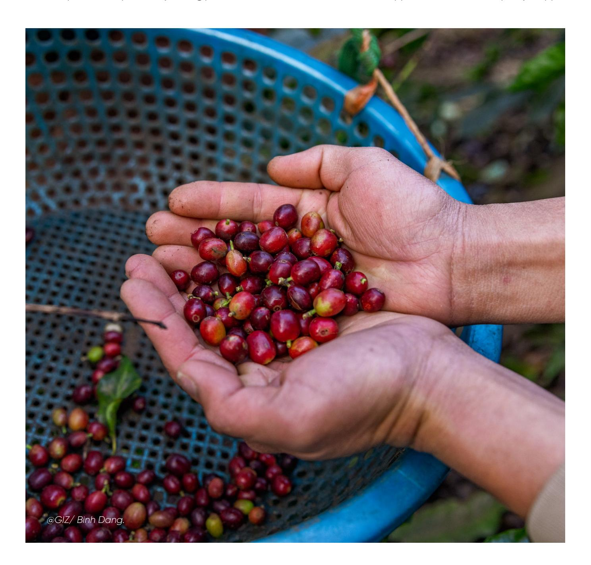

- Market exclusion: buyers avoid non-mapped/ undocumented plots and purchases shift to easier, organised sources.
- Up-front cost burden: phones/GPS, mapping time, document fees and travel costs, without a guaranteed increase in price.
- Documentation load: added paperwork and increase time away from farm work.

# **GENDER EQUALITY AND 09. INCLUSIVENESS**

This study examines the connection between EUDR preparation and social inclusion in the coee, rubber and timber supply chains in Vietnam. Findings combine desk review with field interviews and FGDs across the provinces. Overall, the strongest inclusiveness of women and marginalized groups is found in the rubber sector, followed by coee, and the weakest inclusion is found in the timber sector. This is important for readiness because women and ethnic minority producers are often excluded, and they need to record plot details, dates, and legality for traceability purposes.

Barriers to information and training are similar across sectors. Women and minority farmers struggle to attend long training sessions during busy seasons; travel time and "opportunity" costs make this more dicult. Additionally, training materials are often not available in local languages, and many participants lack confidence in using digital tools such as GPS or apps. In the coee sector, women assist with production and paperwork. However, collector-led buying and long supply chains mean that training sessions rarely reach them at the right time or place. Consequently, records remain on paper or phones, resulting in the loss of key EUDR details. In the rubber industry, inclusion improves when processors onboard collectors and farmer groups, providing women with more opportunities to participate in training sessions and perform basic data entry tasks at commune-level training events. In the timber sector, large, certified companies train their own sta, but community smallholders and collectors, especially ethnic minorities, have few opportunities to learn about mapping or managing legality files.

These barriers have dierent impacts on women and minority groups. Across all three sectors, these groups remain under-represented in technical tasks such as GPS mapping and assembling legal folders. This slows down the capture of data and increases the likelihood of dropout. In the coee sector, the fast and informal nature of buying, coupled with male-led price negotiations, pushes women out of record-keeping. Consequently, plot, date and ID details do not accompany the product. In the rubber industry, inclusion improves when processors provide clear forms and simple tools. However, legality checks are more dicult where rubber is grown on forestry land, which can disproportionately aect minority households. In the timber sector, certified companies employ women in oce roles, but smallholders are excluded from digital mapping and related operational work.

Therefore, support needs are practical and directly related to readiness. Simple oine apps with step-by-step prompts should capture core information such as farmer ID, plot PGS and dated consignment, while barcoded receipts ensure the data travels with each lot. Training should be short, local and bilingual, supported by visual job aids, and accompanied by small travel or childcare stipends. Legality support should include plain-language checklists and sample forms, as well as quick commune verification for plots near forestry land in rubber and timber production areas. Small grants or fee waivers could oset the costs of mapping and documentation, and e-wallet payments could establish transaction histories for micro-credit. Finally, support programmes should track inclusion through basic gender and ethnicity indicators, such as attendance, completion and active app use, and maintain open channels for feedback.

# **09. GENDER EQUALITY AND INCLUSIVENESS**

# **10. RECOMMENDATIONS**

# **10. RECOMMENDATIONS**

# **10.1. For government agencies**

# *Central level:*

# *Provincial/commune level:*

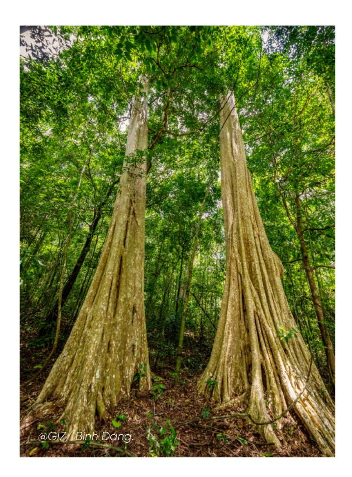

- **• Publish operator-ready spatial evidence:** Release a single, national geospatial dataset showing forest/land status as of 31 December 2020, with public APIs. Align forest/agroforestry definitions with the EUDR and the national land classification system, enabling operators to automate cut-o checks.
- **• Clarify and standardise the legality documentation bundle:** Issue a national circular that consolidates all relevant Vietnamese legal provisions into a unified "EUDR documentation set." This should clearly outline the required legality documents, define acceptable equivalent papers (including simplified commune-level certifications where appropriate), and provide step-by-step guidance for smallholders, collectors, dealers and SMEs. The circular should

• also standardise procedures for cases where formal land-use rights documents are incomplete or under verification, ensuring consistency, legal certainty and nationwide alignment for EUDR compliance.

- **• Interoperability by design:** Connect cadastral, forestry and agricultural databases via a unified digital backbone comprising APIs, a data model and governance, to enable machineto-machine exchange with enterprise CoC/ERP systems.
- **• Control cross-border inputs:** Establish Lao PDR/Cambodian cooperation with a minimum import data package (plot geolocation, harvest date, legality references and consignment IDs), and require the segregation or exclusion of unverifiable lots.

- Legalise and standardise land records: Accelerate the verification or completion of LURCs/land allocation decisions and issue standardised rubber, coee and woodland maps (including rubber on forestry land), as well as providing quick confirmation routes for lawful plots.
- Enable first-mile: Run commune/village training sessions and set up help desks for firms, dealers and households. Roll out simple oine apps (GPS, photo and barcode receipts) and job aids to capture farmer ID, plot polygon, date, volume and consignment ID.
- Provide inclusive support: Provide co-financing for mapping, onboarding and certification; link apps to e-wallet payments and pooled data for group certification; and provide micro-incentives and targeted training for women and ethnic minorities.

# **10.2. For the value chain actors**

# **10.2.1. Coee**

# *Direct Exporters should:*

# *Collectors/Midlemen should:*

- Ensure their digital systems can link plot-level geolocation, legality data, and transaction records across all supply-chain actors.
- Provide shared tools, training, and financial support for mapping and data collection is essential to close first-mile gaps.
- Dierentiate low-risk, EUDR-ready suppliers from higher-risk ones and apply targeted support or exclusion measures accordingly.
- Prepare robust due diligence statements (DDS for risk assessment, mitigation, and documentation should be formalised and regularly updated in line with EUDR Article 10.
- Work through industry platforms to advocate for ocial 2020 forest baseline maps, national databases, and interoperable data standards.

- Use harmonised purchase templates (paper or digital) capturing farmer ID, plot reference, volume, and date to ensure consistent data transfer.
- Keep separate verified supply from non-verified supply to reduce compliance risks for exporters.
- Gradually shift from handwritten logs to simple Excel files or mobile applications provided by exporters or projects.
- Support farmers in submitting GPS data, legality documents, and updates, serving as a critical bridge between smallholders and exporters.
- Improved business registration, tax compliance, and basic labour documentation will reduce legality risks under EUDR.

# **10.2.2. Rubber**

# *Direct Exporters should:*

# *Smallholder farmers should:*

- Define and enforce minimum data requirements for suppliers, including geolocation, legality documentation, transaction logs, and batch-segregation protocols.
- Develop or upgrade traceability systems that can track latex from plot to factory intake, aligned with national production code frameworks and forthcoming authoritative land-use/forest baseline maps.
- Provide technical and financial support to upstream actors, covering farmer mapping,

• digital tools for collectors, and structured capacity-building on due diligence workflows. • Implement strict intake and segregation

procedures, ensuring that EUDR-compliant and non-compliant latex are not mixed and that all high-risk batches undergo additional scrutiny. • Conduct systematic risk assessments of all

suppliers, integrating geospatial analysis and legality verification into procurement decisions and ensuring full compliance before submitting

due diligence statements.

- Participate in GPS or polygon mapping of all coee plots and ensure these are consistently linked to their identity and land-use documents to provide EUDR relevant data
- Actively work with commune authorities and buyer programmes to obtain recognised alternative documents or complete administrative procedures where Land Use Right Certificates (LURCs) are missing or pending.
- Keep simple, standardised records of harvest volumes, sales dates, and buyers, even in paper
- form, to support transaction traceability.
- Participate in cooperatives, sustainability schemes, or exporter-supported programmes to reduce individual preparation costs and receiveaccess to training, mapping support, and data tools.
- Attend training sessions provided by exporters, local authorities, or projects to better understand deforestation cut-o dates, legality requirements, and the importance of accurate data.

# *Collectors/Midlemen should:*

- Apply standardised transaction documentation, recording farmer identity, plot geolocation, purchase date, volume, and batch identifiers in a consistent and verifiable manner.
- Minimise mixing of latex from dierent sources, keeping household production separate and consistent to preserve batch integrity and reduce traceability risks.
- Maintain updated legality dossiers for each supplier, including copies of LURCs or alternative land-use confirmations, to support downstream due diligence.
- Adopt simple digital tools—such as mobile applications proposed in the national recommendations—to capture real-time purchase information and improve data accuracy.
- Engage in training provided by processors and development partners, focusing on traceability requirements, legality verification, and risk identification associated with mixed or undocumented sources.

- Adopt supplier segmentation and risk-based sourcing, prioritising suppliers with basic geolocation and legality documentation while providing transition pathways for smallholders and collectors.
- Standardise minimum data requirements (e.g. plot coordinates, production dates, legality documents) using simple, interoperable templates aligned with VNTLAS.
- Share compliance costs and incentives by co-financing mapping, traceability onboarding,

• and data collection for upstream suppliers instead of transferring costs downstream.

- Strengthen contractual arrangements to clearly allocate responsibilities for legality, traceability, and data provision, including clauses that protect smallholder participation.
- Engage proactively with provincial authorities and donor programmes to align enterprise systems with plantation databases and emerging national guidance.

# *Smallholder farmers should:*

# **10.2.3. Timber**

# *Direct Exporters should:*

# *Forestry companies should:*

- Undertake plot-level geolocation mapping, using simple GPS tools and associating coordinates with household land-use documentation to facilitate verification of deforestation-free production.
- Maintain basic production and sales records, documenting tapping dates, harvested volumes,

- and buyers, thereby contributing essential information for downstream traceability systems.
- Participate in organised household groups or enterprise-linked partnership models, which provide opportunities for training, mapping support, and more transparent and stable market linkages

- Leverage existing certification systems (FSC/PEFC) to streamline EUDR due diligence and reduce duplication between certification, VNTLAS, and EUDR requirements.
- Expand digital traceability beyond company-managed forests by supporting adjacent smallholder suppliers with mapping, geolocation capture, and legality documentation.
- Promote group-based approaches (group certification, shared audits, joint mapping) to lower per-hectare and per-household adaptation costs.
- Invest in sta capacity and internal data quality controls, ensuring consistency between field conditions, maps, and ocial records.

- Demonstrate inclusive practices, including targeted training for women and ethnic minority sta involved in procurement, documentation, and monitoring.

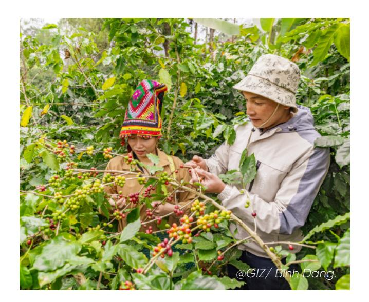

- *@FreePik*
- Maintain and organise basic documentation (red books, contracts, harvesting records) and retain geotagged photos linked to specific plots.
- Participate in group-based traceability or certification schemes where available, as individual adaptation and preparation is often cost-prohibitive.
- Engage in training opportunities on GPS use, legality documentation, and simple digital record -keeping, especially where support or stipends are provided.
- Work with collectors, cooperatives, or forest companies that oer support for mapping and adaptation rather than selling through informal channels.
- Recognise traceability as a pathway to longer-term benefits, including more stable buyers, improved land security, and potential access to ecosystem service payments.

# *Collectors /Middlemen should:*

# *Smallholder farmes should:*

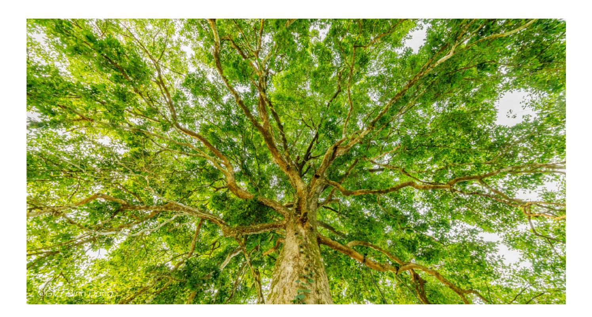

- Transition from paper-based logs to simple digital purchase records, capturing seller identity, plot location, species, and transaction dates.
- Act as aggregation and service hubs by supporting smallholders with basic documentation and geolocation, rather than being bypassed in EUDR-compliant supply chains.
- Participate in training and pilot programmes focused on traceability, legality documentation, and basic digital skills.
- Formalise relationships with suppliers and buyers through clearer contracts that define traceability responsibilities and reduce legal risk.
- Collaborate with cooperatives or producer groups to improve bargaining power and lower adaptation costs.

- **• Co-finance public goods:** Support the development of the national API platform, operator-ready cut-o layers and standardised the legality documentation bundle while helping provinces digitise land and forest records. In parallel, assist Viet Nam in integrating agricultural, forestry and cadastral databases through open APIs and shared data standards, enabling seamless machine-to-machine exchange with enterprise traceability and resource planning system.
- **• Reduce onboarding costs:** Fund pooled mapping and onboarding services, as well as blended
- finance lines (concessional credit and results-based payments), and device bundles for first-mile actors.
- **• Promote inclusive capability building:** Provide village-level bilingual training with childcare and travel stipends and embed gender and ethnicity KPIs and grievance mechanisms. Pilot e-wallet and digital token incentives to accelerate data registration.
- **• Monitor outcomes:** Track the adoption and pass-through of EUDR data fields, exclusion risks and the eects on prices and premiums to provide adaptive support.

# **10.3. For development partners and NGOs**

# **11. CONCLUSION**

Across Vietnam's three value chains, larger estates, processors and exporters have the strongest capacity and EUDR readiness. They can operate segregated 'clean lines' and run due diligence software. The weak point is the first mile. Small, frequent purchases from many smallholders — often through mobile dealers — cause lots to be mixed and their histories to be lost before they reach a mill. This is most significant in the coee sector, where only around a third of the supply is certified and almost half of exports go to the EU, making it far more exposed than the rubber and timber sectors. The rubber and timber sectors still face challenges, particularly where smallholder and imported raw material flows enter the chain, but they are less dependent on the EU in the short term.

The missing pieces are now clear. Firstly, operators require a single, reliable set of national map layers, served through stable APIs, that display forest and land status as of 31 December 2020, to enable automated cut-o checks. Secondly, everyone should use the same concise guidance (a standardised EUDR documentation package including linking plot geolocation, land-use rights, harvest/transport permits and transaction records) for each type of actor, detailing which documents to collect, what to do when LURCs are pending and how to reference a plot on every form. Thirdly, receipts issued by dealers must always carry the farmer's ID, the plot reference, the transaction date and the volume, so that these data travel with the lot. Finally, first-mile tools must be simple and work oine, involving a barcode on every receipt and a few guided steps in the app, as well as short village training sessions, so that people can actually carry out the task.

Over the next coming months, this approach is practical. National agencies can publish cut-o and land status layers, accessible via APIs, and circulate one-page legality checklists. Modest, results-based grants could be used to map plots and issue dated receipts on a large scale. Companies can adopt a 'no data, no weigh-in' intake policy, connect their ERP/QMS to the national API to automatically flag risky lots and provide dealers with a basic toolkit (app, labels and SOP card), while rewarding the submission of complete and timely data. Collectors/dealers can keep lots separate from pickup to plant, print barcode receipts on the spot, arrange visits to mapped farmers in batches, and avoid mixing material of unknown origin. Farmers can map their plots, maintain a simple notebook or photographic record of receipts, ax a QR/ID sticker to each sale and designate a household 'data keeper' to ensure these steps become routine.

Inclusion is not a side issue; it is central to performance. While women and ethnic minority producers play an active role in production, they are under-represented in mapping and record-keeping. Bilingual village sessions, visual app prompts and e-wallet payouts can make participation easier, improve data quality and reduce drop-os at the first mile.

The payo is real. The same records that satisfy the EUDR requirements also speed up payments, reduce due-diligence friction, cut shipment risk and unlock finance. Converting these simple first-mile habits into standard practice is the fastest and most aordable way to protect EU access, especially for coee, while building more resilient, transparent and competitive supply chains for Vietnam.

# **11. CONCLUSION**

**12.ANNEXES**

# **12. ANNEXES**

- *• Annex 1: List of reviewed documents.*
- *• Annex 2: Methodology details and data collection tools (questionnaires and focus group discussion guides).*
- *• Annex 3: Matrix of desk review findings from three sectors.*
- *• Annex 4: Matrix of findings from the field trip across three sectors.*

# **Annex 1 - List of reviewed documents and references**

- **• Aldinger, P., Nguyen, T. V., Pham, D. T., & Nguyen, T. C.** (2024). EUDR Preparedness Check for the Commercial Forestry Sector in Viet Nam. (Report).
- **• Dang Hai Mai (VNU).** (2024). Impacts of the European Union Deforestation Regulation on Vietnam's coee supply chains.
- **• Đặng, Đ. C., Đỗ, X. H., & Tô, X. P.** (2025). Ngành cà phê Việt Nam: Thực trạng và một số khía cạnh chính sách. Hà Nội. https://mkresourcesgovernance.org/wp-content/uploads/2025/04/20250410-Bao-cao-thuctrang-va-chinh-sach-ho-tro-nganh-ca-phe-Viet-Nam-FINAL.pdf
- **• Deutsche Gesellschaft für Internationale Zusammenarbeit (GIZ) GmbH.** (2025). Report on Gap Analysis of Rubber Value Chain with the EUDR.
- **• EFI The Sustainable Trade Initiative; MARD; JDE Peet's & partners.** (2024, December). EUDR Preparedness Check for the Coee and Commercial Forestry Sectors in Viet Nam.
- **• European Forest Institute (EFI) & partners.** (2024, July). EUDR Preparedness Check for Coee and Timber in Vietnam.
- **• EU** (21.10.2025). Proposal for a Regulation of the European Parliament and of the Council: amending Regulation (EU) 2023/1115 as regards certain obligations of operators and traders.
- **• FERN; SRD (Vietnam); IDH.** (2023, June). How to ensure Vietnamese smallholder coee farmers are ready for the EUDR: Opportunities and obstacles. (Brief/presentation).
- **• Forest Trend and Rubber Association** (9.2025)-Tai lieu huong dan thu thap thong tin cao su (Guidelines for Collecting data and information for Rubber to be preprepared for EUDR)
- **• GIZ** (2025) An analysis of synergies between national regulations, appliedcertification, and traceability for the rubber industry in Viet Nam with the EUDR
- **• GIZ** (2025). Study on available traceability systems and tools in the Lao context.
- **• GIZ** (2025). Study on traceability tools for products of coee and timber in Viet Nam.
- **• Le, V. D., Huong, L., Pham, D. T., Nguyen, T. C., & Riano, C.** (2024). EUDR Preparedness Check for the Coee Sector in Viet Nam. (Report).
- **• Nguyen, Q. T.** (2024). Decision No. 816/QĐ-BNN-KL on the declaration of the current status of forests in 2023. Ha Noi: Ministry of Agriculture and Environment. Retrieved from https://thuvienphapluat.vn/van-ban/Tainguyen-Moi-truong/Quyet-dinh-816-QD-BNN-KL-2024-cong-bo-hien-trang-rung-toan-quoc-604807.aspx
- **• Nguyễn, V. Q., Tô, X. P., & Phan, T. H. V.** (2025a). Chuỗi cung cao su tiểu iền: Thực trạng và khả năng áp ứng EUDR. Hà Nội. https://www.vra.com.vn/tin-tuc/bao-cao-chuoi-cung-cao-su-tieu-dien-thuc-trangva-kha-nang-dap-ung-eudr.16332.html

- **• Nguyễn, V. T., Tô, X. P., Lương, K. A., & Nguyễn, V. Q.** (2025b). Nông hộ trong chuỗi cung cà phê, cao su và gỗ rừng trồng: Vai trò và khả năng áp ứng EUDR. https://mkresourcesgovernance.org/wp-content/uploads /2025/11/20251105-Bao-cao-tieu-dien.pdf
- **• Phan, T. H. V., & Tô, X. P. (2025c).** Việt Nam xuất khẩu cao su sang EU: Thực trạng và khả năng áp ứng EUDR. https://www.vra.com.vn/tin-tuc/bao-cao-viet-nam-xuat-khau-cao-su-sang-eu-thuc-trang-vakha-nang-dap-ung-eudr.16563.html
- **• RECOFTC. (2024).** Potential impacts of the EUDR on smallholders in Thailand and Indonesia: Case studies on rubber, timber and coee. Bangkok.
- **• Rijk, G., & Kuepper, B. (2025).** EUDR Compliance Costs: Economic analysis of EUDR cost implications for companies and consumers. Profundo.
- **• Tô, X. P., & Lương, K. A. (2023).** Chuẩn bị ể thích ứng với Quy ịnh chống phá rừng của EU: Đáp ứng yêu cầu về truy xuất nguồn gốc sản phẩm. Retrieved from Ha Noi: https://hawa.vn/wp-content/uploads/2023/11/ Dap-ung-yeu-cau-ve-truy-xuat-nguon-goc-nong-lam-san.pdf
- **• Tropenbos Vietnam.** (2024/2025). Achieving Deforestation-Free Supply Chains (main report; includes coee case studies).
- **• Tropenbos Vietnam.** The likely impacts of the EUDR on small coee farmers in the Central Highlands, Vietnam. (Policy brief).
- **• UNDP & national partners.** (2024). EUDR Preparedness Check Coee and Commercial Forestry Sectors (Vietnam). (Workshop/report).

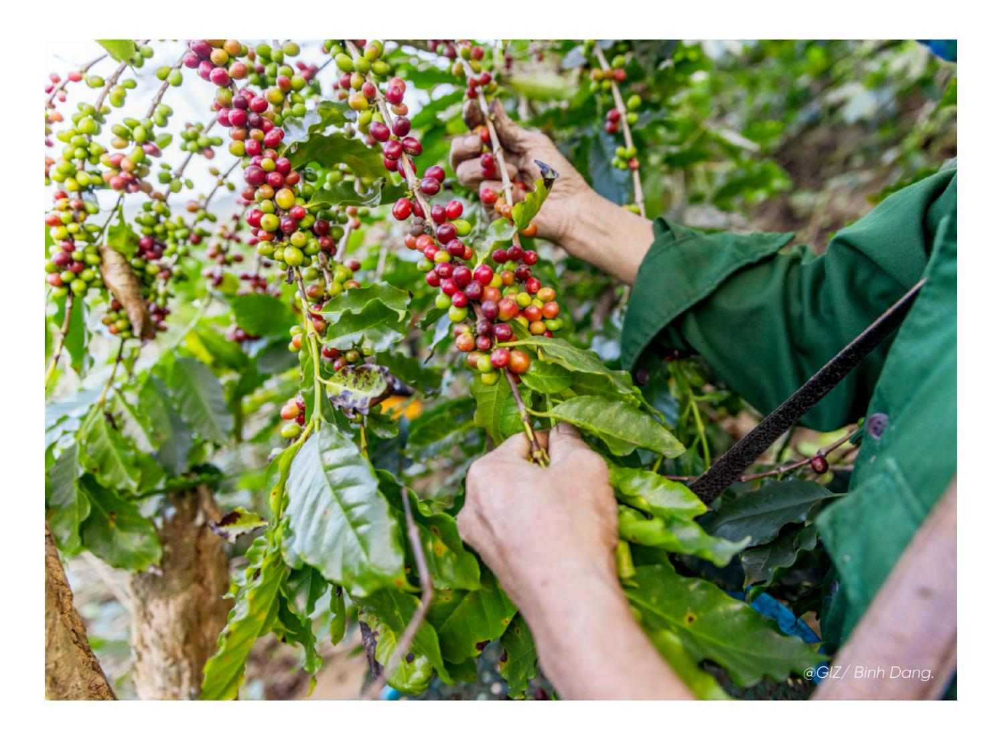

# **Annex 2: Methodology details and data collection tools (questionnaires and focus group discussion guides)**

# **1. Coee sector in Dak Lak and Lam Dong**

# **Questionnaire for Coee Smallholders**

# 1. Background Information

# 2. Steps Taken for Traceability & Legality

- 1. Name (optional):
- 2. Gender: Male Female
- 3. Ethnicity:
- 4. Farm size (ha):
- 5. Years in coee farming:
- 6. Are you a member of a cooperative or farmer group? Yes No

7. Have you heard about the **European Union Deforestation Regulation (EUDR)?**

Yes No

- If yes: What do you understand about it?

8. Have you taken any **steps to trace or record your farm location and coee origin** (e.g., GPS mapping, land

documents, farm code)?

Yes No

- If yes, please describe what you've done.

# 9. Do you have **land ownership or land use documents?**

Yes No

◦ If no, what documents or proof do you use instead?

# 3. Costs Incurred

10. Have you spent **money or time** for these traceability steps (e.g., GPS mapping, paperwork)?

Yes No

◦ If yes, please estimate or describe the main costs.

# 4. Incentives & Technical Support

11. Have you received any **support or assistance** (training, equipment, funding, GPS data collection) from buyers, cooperatives, or projects?

Yes No

- If yes, what kind of support?

# 5. Training Participation

13. Have you attended any **training or meeting** on sustainable coee, traceability, or EUDR?

Yes No

- If yes, who organized it? Was it useful?

14. What could be done to help **more farmers (especially women and ethnic minorities)** join such training?

# 6. Inclusion of Women and Ethnic Minorities

15. Who in your household usually deals with buyers, recordkeeping, or trainings?

Husband Wife Both Other

16. What **challenges** do women or ethnic minority farmers face in getting information or support for EUDR?

# 7. Digital Literacy

17. Do you use a **smartphone**?

Yes No

◦ If yes: Do you use it for farming, recordkeeping, or communication with buyers?

18. How easy or dicult is it for you to use apps or digital tools (like GPS or data forms)?

Easy Somewhat dicult Very dicult

19. What kind of **training or help** would improve your digital skills?

# 8. Final Reflection

20. What do you think will be the **main benefits or challenges** of the EUDR for small coee farmers like you?

# **Questionnaire for Coee Collectors / Agents**

# 1. Background Information

- 1. Name (optional):
- 2. Gender: Male Female
- 3. Years in business:
- 4. Approx. number of farmers you buy from:
- 5. Do you sell to exporters, processors, or cooperatives?

# 2. Steps Taken for Traceability & Legality

- If yes, what do you understand about it?

- 7. Do you record or track where your coee comes from (farm or village level)? Yes No
  - If yes, how do you record it? (e.g., farmer lists, GPS, receipts, photos)
- 8. Do you check whether your suppliers have legal land or documents?

Always Sometimes Never

# 3. Costs Incurred

9. Have you spent money, time, or sta eort to collect more data or trace coee origin?

Yes No

◦ If yes, what were the main costs or diculties?

# 4. Incentives & Technical Support

10. Have you received any **support or training** from buyers, exporters, or projects to prepare for EUDR or improve

traceability?

Yes No

◦ If yes, what kind of support (equipment, software, training, funding)?

11. What kind of **incentive or assistance** would motivate you to comply with EUDR?

(e.g., better price, access to market, partnership with exporter)

# 5. Training Participation

12. Have you or your sta attended any training on **traceability or sustainability**?

Yes No

- If yes, who organized it?
- What was useful and what was missing?

# 6. Inclusion of Women and Ethnic Minorities

13. Are there women or ethnic minority sta or suppliers in your network?

Yes No

14. What barriers do they face in participating in trainings or complying with traceability requirements?

15. What could be done to **better involve women or ethnic minorities** in EUDR-related activities?

# 7. Digital Literacy

- 17. How confident are you in using digital tools for traceability? Very confident Somewhat confident Not confident
- 18. What kind of **support or training** would make digital traceability easier for you?
- 8. Final Reflection
- 19. What do you see as the **main risks or opportunities** of the EUDR for your business?
- 20. What support do you think **government, exporters, or the EU** should provide to make compliance easier?

# 1. Company profile:

3. How familiar is your company with the EUDR requirements? Very familiar Somewhat familiar Not yet familiar

4. What **specific steps** have you taken to align with EUDR requirements, particularly regarding:

◦ **Traceability:** mapping suppliers, digital tracking systems, supplier databases

◦ **Legality:** ensuring land legality, sourcing documentation, due diligence processes

5. What **traceability systems or tools** are currently in use (e.g., internal ERP, third-party systems, blockchain, GPS

mapping)?

# **Questionnaire for Coee Traders/exporters**

# 3. Steps Taken to Adapt to EUDR Traceability and Legality Requirements

- Name of company:
- Position of respondent:
- Year of establishment:
- Main sourcing regions:
- Approximate annual coee volume (tons):
- Main export destinations:
- Share (%) of exports to EU market:

# 2. Value chain structure:

- Describe your main suppliers (e.g., smallholders, cooperatives, collectors).
- Approximately how many farmers or intermediaries are in your supply network?
- Do you have direct sourcing programs with farmers or rely on intermediaries?

- 7. What types of **costs** has your company incurred to date for EUDR readiness? (e.g., system development, sta training, supplier mapping, audits, certification)
- 8. Please estimate the **approximate magnitude** of these costs (as % of operating costs or in USD if possible).
- 9. How are these costs currently **financed** (internal budget, donor projects, partner programs)?
- 10. What types of **future costs** do you anticipate once the EUDR is fully enforced?

# 4. Costs Incurred for EUDR-Related Steps

- 11. Have you received any **technical or financial support** (from EU programs, government agencies, NGOs, or industry associations) for EUDR preparation or traceability improvement?
  - If yes, please specify by whom and in what form.
- 12. What **incentives** or benefits (actual or expected) does your company perceive from improving EUDR compliance? (e.g., market access, buyer trust, price premium, brand reputation, financing)
- 13. What **additional support** would be most useful to strengthen your compliance readiness (e.g., training, digital tools, data sharing mechanisms, financing)?

# 5. Incentives and Technical Support

- 14. Have your sta or suppliers participated in any **training or awareness programs** related to EUDR, traceability, or sustainability standards?
  - If yes, what topics were covered, and who organized them?
  - Were they found useful? Why or why not?
- 15. How does your company plan to **engage and train suppliers** (especially smallholders) on EUDR requirements?
- 16. What measures could increase participation of **ethnic minorities and women** in your supplier training or traceability initiatives? (e.g., training timing, communication methods, local language, gender-sensitive facilitation)

# 6. Participation in Trainings and Inclusion

- 17. In your experience, what **barriers** do women and ethnic minority smallholders face in complying with EUDR (traceability, legality proof, financing)?
- 18. What targeted **support measures** (from your company, government, or partners) could make compliance more accessible to these groups?

# 7. Inclusion and Accessibility

- 19. Does your company collect **sex- or ethnicity-disaggregated data** on your suppliers? Yes No
  - If yes, how is it used to inform your sourcing or training strategy?

20. What is your company's **digital readiness level** for EUDR compliance (traceability systems, data collection,

analysis, reporting)?

 High  Moderate  Low

21. How would you describe the **digital literacy** of your suppliers (farmers, collectors, cooperatives)?

22. What strategies are in place or planned to **strengthen digital literacy** and technology adoption along your supply chain?

23. Are there **data-sharing or interoperability issues** between your system and your buyers' or suppliers' systems?

How could this be improved?

# 8. Digital Literacy and System Capacity

24. What do you see as the **main risks and opportunities** of EUDR for your company and the broader coee sector?

25. What **policy recommendations** would you oer to:

- The **Government of Vietnam**
- The **European Union**
- **Development partners** or **industry associations**

# 9. Concluding Reflections

# A. Proposed interview list

to make EUDR compliance more practical and beneficial for the sector?

- 1. National Agricultural Extension Center (NAEC), 16 Thuy Khue, Tay Ho, Ha Noi
- 2. Departments of Agriculture and Environment of Dak Lak and Lam Dong Provinces, in Buon Ma Thuot City and Da Lat City
- 3. Provincial Agricultural Extension Centers of Dak Lak and Lam Dong, in Buon Ma Thuot City and Da Lat City
- 4. People's Committee of Gung Ré Commune, Di Linh District, Lam Dong (now Di Linh Commune), 41 Tran Hung Dao, Di Linh, Lam Dong
- 5. Viet Nam Coee and Cacao Association (VICOFA), 05 Tan Da, Buon Ma Thuot, Dak Lak
- 6. Buon Ma Thuot Coee Association, 15A Truong Chinh, Thanh Cong Ward, Buon Ma Thuot, Dak Lak
- 7. Binh Minh Agriculture & Services Cooperative, Hamlet 3, Quang Phu Commune, Dak Lak
- 8. Ea Tu Fairtrade Agriculture Services Cooperative, 22 KT Street, Ko Tam Village, Tan An Ward, Dak Lak
- 9. Dak Lak 2-9 Import-Export One-Member Co., Ltd. (SIMEXCO), 23 Ngo Quyen, Buon Ma Thuot, Dak Lak

- 10. Sucden Coee Vietnam Co., Ltd., Tan An Industrial Park, Tan An Ward, Dak Lak
- 11. NKG Vietnam, Dak Lak Branch, 11 Tran Hung Dao, Thanh Cong Ward, Buon Ma Thuot, Dak Lak
- 12. Louis Dreyfus Company Vietnam LLC, 73 Ybih Aleo, Buon Ma Thuot, Dak Lak
- 13. DAKMAN Vietnam Co., Ltd., Km7, National Highway 26, Dak Lak
- 14. Atlantic Vietnam Trading & Processing Co., Ltd. (ACOM), Loc Son Industrial Zone, B'Lao Ward, Lam Dong
- 15. OLAM Vietnam Co., Ltd., Lam Dong Branch, Hamlet 7, Gia Hiep, Di Linh, Lam Dong
- 16. Sucafina Vietnam Co., Ltd., Lam Dong Branch, Residential Group 4, Di Linh, Lam Dong
- 17. Coee dealers operating in Ea Tu (Dak Lak) and Di Linh (Lam Dong)
- 18. Coee-producing households in Dak Lak and Lam Dong (Ea Tu, Dak Lak; Gung Ré, Di Linh, Lam Dong)

# B. Tentative agenda:

*From 01 to 06 November, 2025*

| No | Organizations / Individuals                   | Date      | Sample Size | Participants                                                                 | Interview Method    |
|----|-----------------------------------------------|-----------|-------------|------------------------------------------------------------------------------|---------------------|
| 1  | National Agricultural Extension Center (NAEC) | 03/11     | 1           | Center leadership / Head of Training & Communications Division               | Online              |
| 2  | Department of Agriculture & Environment       | 03/11     | 1           | Department leadership / Sub-department of Crop Production & Plant Protection | In-person interview |
| 3  | Provincial Extension Center                   | 03/11     | 1           | Director of the Center                                                       | In-person interview |
| 4  | VICOFA                                        | 03/11     | 1           | Vice President of VICOFA                                                     | In-person interview |
| 5  | Buôn Ma Thuột Coffee Association              | 01–03 /11 | 1           | Chairperson / Vice Chairperson of the Association                            | In-person interview |
| 6  | Bình Minh Agricultural & Service Cooperative  | 01–03 /11 | 3           | Cooperative leadership & Executive Board                                     | In-person interview |
| 7  | Ea Tu Agricultural & Service Cooperative      | 01–03 /11 | 3           | Cooperative leadership & Executive Board                                     | In-person interview |
| 8  | SIMEXCO Đắk Lắk                               | 01–03 /11 | 2           | Company leadership & Sustainability Department                               | In-person interview |
| 9  | Sucden Coffee                                 | 01–03 /11 | 1           | Management / Sustainability Department                                       | In-person interview |
| 10 | NKG Vietnam                                   | 01–03 /11 | 1           | Management / Sustainability Department                                       | In-person interview |
| 11 | LDC Vietnam                                   | 01–03 /11 | 1           | Management / Sustainability Department                                       | In-person interview |
| 12 | DAKMAN Vietnam Co., Ltd.                      | 01–03 /11 | 1           | Management / Sustainability Department                                       | In-person interview |

# **GROUP OF RUBBER SMALLHOLDERS**

# I. General information and background of smallholders

- 1. Can you briefly introduce the household: number of members, rubber planting year, area, average annual yield?
- 2. Do you have any other sources of income besides rubber (livestock, other crops, hired labor, etc.)?
- 3. Who is household latex usually sold to? (traders, cooperatives, factories, dealers...).
- 4. Is the sale of latex carried out under contracts, verbal agreements or through intermediaries?
- 5. Have you heard of the new European Union regulations on " deforestation-free products" (EUDR)? If so, what is your understanding of this requirement?
  - When did the household start planting rubber, did the clones and planting methods change over time?

# IV. Legality

- 1. Do you have a land use right certificate (LURC) for the rubber growing area?
- 2. If not, what are the reasons (leased land, reclaimed land, disputes, costs, etc.)?
- 3. When selling latex, does the buyer request to provide or confirm legal documents related to land use rights?
- 4. Are there any agencies, projects, or organizations that assist you in completing your land records?

# II. Supply chain and relationship with other actors

- 1. Who do you sell latex to? Are there many buyers or just a fixed buyer?
- 2. How is price negotiation done? Who decides the price?
- 3. Are there contracts or transaction documents, or are they verbal transactions?
- 4. Has the buyer ever asked the household to provide more information about the growing area, yield, or clones?
  - Is the relationship between households and dealers/factories long-term? Does it depend on the time of harvest?
  - When market prices fluctuate, are households able to re-negotiate prices?
  - Can you receive technical support, supplies, or training from dealers/buyers?

# III. Traceability

- 1. Do you record or store information about rubber plantations, production, and buyers? If yes, in what form (notebook, phone, application, GPS, etc.)?
- 2. Who is the person in the household responsible for recording and storing this information?
- 3. Do you know how to determine or store the GPS coordinates of your plantation?
- 4. If there is a request to determine the geolocation of the plantation or the area where the raw materials are supplied, can you do it?
- 5. When selling latex, does anyone ask you to provide information about the origin or location?
  - Where is the plantation data (area, year of planting, clone, yield) currently stored?
  - Has anyone trained you in how to take notes or use the traceability application?
  - Do you have trouble using your smartphone, internet, or navigation device?
  - In your opinion, to implement traceability well, what support is needed (equipment, training, specific instructions, etc.)?

# **GROUP OF LATEX COLLECTION DEALERS**

# I. General information and background

# V. Technical, financial, and gender competence

- 1. Have you (or anyone in your household) ever participated in a training course on traceability, sustainable farming, or EUDR?
- 2. When implementing new requirements (records, GPS, documentation, etc.), what diculties do households face in terms of skills or costs?
- 3. Do you receive any financial, credit, or technical support from the business, association, or government?
- 4. If it is necessary to invest in additional equipment or traceability software, can the household aord to pay for it themselves?
- 5. In the household, who is primarily responsible for the sale of latex, recording information, and contacting buyers?
  - Are women in the household involved in the decision-making of latex production or sale?
  - Are there any dierences between men and women in access to information, technology, or training opportunities?
  - What kind of support would you like to be most useful: training, equipment, or credit?

# VI. Co-benefits, challenges and recommendations

- 1. In your opinion, what benefits can compliance with traceability and sustainability requirements bring (better prices, long-term contracts, environment, reputation, etc.)?
- 2. Do you have any concerns when you must meet the new regulations (increased costs, loss of customers, ineligibility, etc.)?
- 3. What are the biggest barriers for smallholders when implementing EUDR (land, technology, cost, information, etc.)?
- 4. If you could propose, what would you like the government, associations, or businesses to support to help smallholders participate in sustainable supply chains?
  - What channels do households wish to receive information or training (farmers' associations, telephones, cooperatives, etc.)?
  - Are you willing to participate in a new pilot program or traceability model?

- 1. Can you briefly introduce your procurement activities: size, years of experience, main procurement areas, average monthly volume?
- 2. How many dierent households or sources do you usually buy from (smallholders, cooperatives, companies, farms)?
- 3. What are the main types of products (latex, cup lump...)?
- 4. Who do you usually resell to (processing factories, large agents, export companies, etc.)?
- 5. Does the purchase or sale have a contract or written agreement, or is it mainly a verbal transaction?
  - Do you have a long-term, stable relationship with the buyer or seller?
  - Have there been any recent changes in the procurement process due to new requests from businesses or customers?
  - Is the payment to smallholders made in cash, bank transfer or other forms?

# II. Supply chain and relationship with other actors

- 1. Do you buy directly from smallholders or through other intermediaries?
- 2. Is there a system to record the list of suppliers, locations, volumes, and transaction dates?
- 3. When delivering products to a factory or business, is it necessary to provide a list or details of the source of products?
- 4. Do you cooperate or exchange information regularly with local authorities, associations or supporting organizations?
  - When there is a price fluctuation, do you have any information or re-negotiate with the seller?
  - Does the factory or purchasing company ever ask for confirmation of the growing area or certificate of origin?
  - Are there any exclusive or binding contracts with processing enterprises?

# IV. Legality

- 1. When purchasing, do you request or check the land use right certificate of the smallholders?
- 2. Are there any instructions from factories, associations, or government agencies on verifying the legality of the source of products?
- 3. In your opinion, is it necessary to verify the legal source of natural rubber? If so, how do you do it now?
- 4. Has there ever been a case of a product being rejected for "unknown origin"?
  - If you must prove a legitimate source, do you have enough information or documents to do so?
  - Does the factory or buyer have clear instructions on the criteria of "legal"?
  - What support is needed to ensure that products can be recognized as legal according to market requirements?

# III. Traceability

- 1. How do you currently store information about the origin of products? (notebooks, Excel files, applications, electronic systems, etc.)
- 2. Do you save the seller's name, location, or shipment code?
- 3. When delivering products, do you provide identification codes, receipts or documents confirming the source of products to the factory?
- 4. Has the buyer (processing or exporting enterprise) ever asked to verify the origin of the products to each smallholder household level?
- 5. In your opinion, is it feasible to request traceability to the household level? If not, what's the cause?
  - Have you received instruction or training on how to record, store, or manage traceability information?
  - What are the diculties in recording information manually or electronically (lack of time, human resources, tools, etc.)?
  - If there is an electronic system or traceability application, are you willing to use it? What support is needed to do it?

# V. Technical and financial capacity

- 1. What technical tools do you use to manage procurement activities (phones, GPS, applications, accounting software, etc.)?
- 2. What are the diculties in applying technical tools (lack of equipment, unfamiliar use, high cost, etc.)?
- 3. Have you received any support or training on traceability, EUDR regulations, or data management?
- 4. Do you have to invest any additional costs (equipment, human resources, storage, etc.) due to new requirements from the factory or EUDR?
- 5. Is the current business capital enough to maintain operations when costs increase?
  - Are there any programs or organizations that provide financial assistance or technology to dealers?
  - If there is an opportunity to access preferential credit to invest in a traceability system, would you be willing to participate?
  - Is there a need for training in digital skills or electronic data management?

# VI. Gender and social inclusion

- 1. In your facility, are there women or ethnic minorities participating (working as accountants, procurement, drivers, labors, etc.)?
- 2. Do men and women in the facility take on dierent roles? Who oversees information management, who is responsible for transactions?
- 3. In your opinion, are there any barriers that prevent women or ethnic minorities from participating in purchasing activities?
- 4. Have any programs or projects ever supported this group in trading rubber in the local area?

# VII. Co-benefits, challenges and recommendations

- 1. In your opinion, what benefits can comply with traceability regulations and EUDR bring to dealers (e.g., better prices, stable contracts, reputation, etc.)?
- 2. Are there any risks that small dealers could be excluded from the supply chain due to new requirements?
- 3. What are you most worried about when the EUDR is ocially applied (lack of information, high costs, loss of supply, etc.)?
- 4. What support or changes from processors, associations, or governments can help you maintain your role in the supply chain?
- 5. If you could propose, what specific aspects would you like to receive support in (training, finance, technology, policy)?
  - Do you see the EUDR as an opportunity to professionalize your procurement?
  - What additional guidance or channels of information are needed to better understand the EUDR requirement?
  - In your experience, what are the factors that help small dealers to "stay" in the supply chain when EUDR is implemented?

# **GROUP OF RUBBER PROCESSING/EXPORTING ENTERPRISES**

# I. General information and context

- 1. Can you briefly introduce the business: year of establishment, workforce size, processing capacity, main products?
- 2. Which markets do you mainly export to (Asia, Europe, USA, domestic)?
- 3. What percentage of total revenue does exports to the EU account for?
- 4. From which sources do enterprises buy raw materials (smallholders, dealers, rubber companies)?
- 5. How many regular providers are there? What regions are they in?
  - Is the current supply chain stable?
  - Are there any changes in the supplier list due to new EU customer requirements or due to traceability costs?
  - Do you have your own sustainability, certification, or EUDR unit or department?

# II. Supply chain and contract mechanism

- 1. Do businesses sign formal contracts with suppliers or are based on agreements?
- 2. In the contract, are there any clauses related to the traceability or legality of raw materials?
- 3. Does the business have a process for assessing, selecting, or monitoring suppliers?
- 4. Is there any support mechanism (guidance, training, cost sharing) for dealers or smallholders in the supply chain?
  - Is the monitoring of raw material quality and origin carried out periodically or at the request of customers?
  - Does the business cooperate with the association or local authorities to verify the growing area?
  - Are there any diculties in maintaining relationships with small dealers or scattered smallholders?

# III. Traceability

- 1. What traceability system do you currently use (FSC/PEFC, ISO, or company's own software)?
- 2. At what level is traceability data collected (households, dealers, raw material areas, direct suppliers)?
- 3. What information is stored: supplier name, location, quantity, GPS coordinates, certification, etc.?
- 4. Is there a process for cross-checking or verifying data accuracy?
- 5. When an EU customer requests information about the growing area, how long can you provide it?
  - Who does the data collection and update (purchasing department, technical department, sustainability department)?
  - Is the data fully digitized or is it still recorded manually?
  - Have you ever tried to connect the traceability system with the regulatory body or association?
  - What are the biggest diculties in the process of managing traceability (cost, reliability, coordination with dealers, etc.)?
  - How do enterprises assess their ability to meet the current EUDR requirements?

# IV. Legality

- 1. Does the enterprise have a process for checking or verifying the legality of materials input?
- 2. When purchasing, what documents are required to be submitted by the supplier proving the land use rights or legal sources?
- 3. Is the verification of legal origin done for the entire supply chain or only for key suppliers?
- 4. Are there any specific guidelines from the regulatory body or association on proving a "legitimate source" for the EUDR?
- 5. Have you ever encountered a case of products being rejected or at risk because of a lack of legal documents?
  - What are the diculties in requesting land certificates from smallholders or dealers?
  - Does the business classify risks (low/high) between regions or suppliers?
  - If the businesses can receive support, what level of legal guidance do businesses want (policies, forms, training, etc.)?

# VI. Gender and social inclusion

- 1. In the business, what percentage of women in managerial or technical positions is there?
- 2. Are women involved in traceability, quality control or procurement?
- 3. Do businesses have policies to encourage gender equality or support disadvantaged groups in the supply chain?
- 4. Are there special training programs or career opportunities for female or ethnic minority workers?
  - When working with smallholders, do businesses notice dierences in gender roles in production and trading?
  - Are there any internal regulations or commitments on corporate social responsibility (CSR) related to gender equality?

# V. Technical and financial capacity

- 1. Do you invest in any equipment or software for EUDR traceability and compliance?
- 2. Is there a dedicated department or personnel for data, GIS, or sustainability reporting?
- 3. What percentage of annual management costs account for the total cost of investment or operation of the traceability system?
- 4. Is financial or technical support received from international organizations, associations, or government programs or projects?
- 5. If the EUDR requires the extension of the traceability system to the smallholders, does the enterprise have the capacity to do so?
  - Is the existing software compatible with the requirements of the EUDR (especially for GPS coordinate data)?
  - Are there any plans to upgrade the system or train personnel in the near future?
  - What costs are considered the biggest barriers: equipment, personnel, audits, or data collection from stallholders?
  - Does the enterprise have a policy to share costs or support suppliers (dealers, smallholders)?

# VII. Co-benefits, challenges and recommendations

- 1. According to businesses, what benefits can comply with EUDR requirements bring (improving reputation, expanding markets, better selling prices, etc.)?
- 2. Is EUDR considered an opportunity or a burden for businesses?
- 3. What are the main challenges in preparing to meet the EUDR (lack of guidance, costs, data, workforce, etc.)?
- 4. What support do businesses need from the government, associations, or international organizations to implement the EUDR eectively?
- 5. If you could propose, what do you think are the 3 most priority actions to be taken at the industry level to meet the EUDR?
  - Is there a need for a national database of rubber growing regions?
  - Are you interested in participating in the EUDR pilot project or sustainability certification program?
  - What incentive mechanisms are needed to maintain compliance incentives (tax incentives, green credits, certificate recognition, etc.)?

# **GROUP OF GOVERNMENT AGENCIES (DEPARTMENT OF AGRICULTURE AND ENVIRONMENT, COMMUNE PEOPLE'S COMMITTEE)**

# I. General information and context

- 1. How much rubber growing area is in the locality? In which communes are mainly distributed?
- 2. How many rubber smallholders and large companies/farms are there in the locality?
- 3. Has there been any significant change in rubber plantations in the last 5-10 years (expansion, crop conversion, set-aside, etc.)?
- 4. Does the locality have a planning or orientation for the development of the rubber industry?
- 5. Is there a unit or working group in charge of monitoring, statistics, or supporting the rubber industry?
  - Is the local rubber area integrated in the land use planning or forestry map?
  - Are there a database or regularly updated reports on the area, yield, and rubber growing area?
  - Are the types of rubber plantations (state-owned, private, smallholding) managed separately?

# II. Supply chain and coordination with actors

- 1. Does the agency coordinate with enterprises, associations, or dealers in managing and collecting data about rubber production?
- 2. Is there a mechanism or process for sharing information between the Department of Agriculture and Environment and Forest Protection Department on growing areas and land use change?
- 3. Does the locality support or guide smallholders, dealers, and enterprises on the requirements for traceability and legalization?
- 4. Do processing/exporting enterprises in the area periodically report on the supply of raw materials to the Department?
  - Does the agency have a multi-sectoral coordination mechanism (Agriculture & Environment, Finance, Industry and Trade) in the management of the rubber chain?
  - When there is a request for origin, which unit is mainly responsible?
  - Are there any diculties in monitoring dealers, small collecting facilities, or informal transaction chains?

# III. Traceability and data management

- 1. Does the agency currently have a data system or digital map of rubber growing areas?
- 2. From what source is this data updated (business reports, local statistics, satellite imagery, projects, etc.)?
- 3. Do you use GIS tools or integrated databases (e.g. OneMap, VnForest FMS, VnSAT...)?
- 4. Can the unit determine the specific boundaries of the rubber growing area to comply with the EUDR requirement?
- 5. Are there any regulations or guidelines for collecting GPS coordinates of rubber plantations?
  - When there is a request from a business or association for growing area data, what is the information sharing process?
  - Is the data on rubber stored uniformly at the provincial level, or is it distributed between dierent agencies?
  - Is there a lack of workforce or technical tools to update and manage growing area data?
  - In your opinion, is it feasible to build a national traceability system (shared for localities)?

# IV. Legality and land management

- 1. Does the locality have a process to confirm the legality of rubber plantation areas?
- 2. When converting land-use to rubber plantation, is there a requirement for forest assessment or community consultation?
- 3. Is there any rubber area located on protected forest land or disputed land?
- 4. Does the Commune People's Committee keep records, maps, or lists of smallholders with land use certificates?
- 5. Will it coordinate with the Department of Natural Resources and Environment or Forest Protection Department to determine that rubber areas are not subject to deforestation?
  - Do localities have diculties in updating the boundaries of agricultural land forestry land?
  - Are there any tools or software to track forest land change (e.g., Global Forest Watch, satellite maps)?
  - Is there a need for uniform guidance at the national level on the concept of "legitimate land" under the EUDR?

# V. Technical, financial and human resources capacity

- 1. Does the unit have enough full-time human resources to monitor and manage rubber data?
- 2. Is workforce trained in EUDR, traceability, or data systems?
- 3. Is there a separate budget source for the inspection, collection and management of information on the rubber industry?
- 4. Does the agency plan to upgrade equipment (GPS, computers, software) to serve the monitoring of growing areas?
- 5. Are there any technical assistance or international cooperation projects related to EUDR, FLEGT, or sustainable supply chains?
  - If assigned the task of coordinating the implementation of the EUDR, does the locality have the capacity?
  - What additional resources are needed to ensure good implementation (budget, training, software, professional guidance, etc.)?

# VI. Gender and social inclusion

- 1. When implementing agricultural development programs or supporting rubber smallholders, are gender factors integrated?
- 2. Does the locality have any programs to encourage women or ethnic minorities to participate in rubber production?
- 3. Do women or disadvantaged groups have diculty accessing land, credit, or technical training?
- 4. Can female ocials participate in training or hold managerial positions in rubber-related programs?
  - Are there gender-segregated data or statistics on rubber production?
  - When implementing sector development projects, is there a requirement to report on gender equality?

# VII. Co-benefits, challenges and recommendations

- 1. In your opinion, what benefits can the implementation of EUDR bring to localities (better land management, investment attraction, supply chain transparency, etc.)?
- 2. What are the biggest diculties when localities implement or support businesses/households to meet the EUDR?
- 3. Has the agency received any ocial guidance from Ministry of Agriculture and Environment or associations on EUDR?
- 4. What specific support is needed for localities to participate more actively (databases, training, budgets, inter-sectoral coordination, etc.)?
- 5. In your opinion, which level should be the focal point for coordinating the implementation of EUDR (Central, Provincial, or Sectoral)?
  - Are there any local initiatives or pilot models that you would like to propose to support rubber traceability?
  - In your opinion, what is the most important factor to help the locality meet the EUDR requirements successfully?

### **Proposed interviewed list**

# **Government agencies, enterprises, dealers, and rubber smallholders in Bình Phước (Đồng Nai)**

# **Participants:**

- **• Department of Agriculture and Environment, Đồng Nai Province**
- Address: 518 Đồng Khởi Street, Biên Hòa Ward, Đồng Nai Province.
- **• People's Committee of Thuận Lợi Commune, Đồng Nai Province**
- Address: DT 741 Road, Hamlet 1, Thuận Lợi Commune, Đồng Nai Province.
- **• Thuận Lợi Rubber Co., Ltd.**
- Address: DT 741 Road, Thuận Hòa Hamlet, Thuận Lợi Commune, Đồng Nai Province.
- **• People's Committee of Minh Đức Commune, Đồng Nai Province**
- Address: DT 752 Road, Group 6, Hamlet 2, Minh Đức Commune, Đồng Nai Province.
- **• Việt Sing Joint Stock Company**
- Address: Group 2, Hamlet 7, Minh Đức Commune, Đồng Nai Province.
- **• Within-company chain:** 2 purchasing agents and 6 smallholder households from the supply chains of Thuận Lợi Rubber Co., Ltd. and Việt Sing JSC (1 agent and 3 households per company).
- **• Outside-company chain:** 2 purchasing agents and 6 smallholder households selected in Thuận Lợi and Minh Đức communes.

## **Tentative Agenda**

From 04 to 07 November 2025

| No | Organization/Individual                           | Time              | Expected participants | Notes                                                                                               |
|----|---------------------------------------------------|-------------------|-----------------------|-----------------------------------------------------------------------------------------------------|
| 1  | Department of Agriculture & Environment, Đồng Nai | Morning, 04 Nov   | 3                     | Representatives of the Department and the Sub-Department of Crop Production & Plant Protection.     |
| 2  | People's Committee of Thuận Lợi Commune, Đồng Nai | Afternoon, 04 Nov | 5                     | Commune leaders, administrative/economic officers; 1 purchasing agent and 3 smallholder households. |
| 3  | Thuận Lợi Rubber Co., Ltd.                        | Morning, 05 Nov   | 2                     | Company leadership and staff in charge of sustainable development or procurement /purchasing.       |
| 4  | One purchasing agent + three smallholders         | Afternoon, 05 Nov | 4                     | Agent and smallholders within the supply chain of Thuận Lợi Rubber Co., Ltd.                        |
| 5  | People's Committee of Minh Đức Commune, Đồng Nai  | Morning, 06 Nov   | 5                     | Commune leaders, administrative/economic officers; 1 purchasing agent and 3 smallholder households. |
| 6  | One purchasing agent + three smallholders         | Afternoon, 06 Nov | 4                     | Agent and smallholders within the supply chain of Việt Sing JSC.                                    |
| 7  | Việt Sing Joint Stock Company                     | Morning, 07 Nov   | 2                     | Company leadership and staff in charge of sustainable development or procurement /purchasing.       |

# **3. Timber sector in Gia Lai**

# Information collection framework for timber sector

In line with the Terms of Reference, which calls for a comprehensive and evidence-based assessment of EUDR preparedness among actors in the timber value chain, this study applies an information collection framework rather than a set of interview questions. The timber sector involves a wide range of stakeholders, from forestry households, cooperatives, and traders to forestry companies, exporters, and local authorities, each operating under dierent systems of legality verification, traceability, and compliance. A rigid questionnaire would limit flexibility and risk producing fragmented or inconsistent data across these groups. The framework approach, by contrast, provides a structured matrix defining the key information to be collected, including traceability practices, legality documentation, compliance costs, gender and ethnic participation, and technical capacity, while allowing the field researcher to adapt his discussions and probing techniques to context. This ensures consistency and comparability across sites and actor groups while maintaining the depth and narrative quality needed for qualitative analysis. Moreover, the framework integrates cross-cutting dimensions such as digital literacy, gender equality, and social inclusion within each thematic area, reflecting GIZ's gender and safeguard requirements. It also supports triangulation of findings from key informant interviews, focus group discussions, and secondary sources, enabling the consolidation of results into a coherent, analytical assessment of timber sector readiness. Overall, the use of an information collection framework ensures that field data can be systematically captured, analyzed, and synthesized into policy-relevant evidence on challenges, co-benefits, and readiness for EUDR implementation.

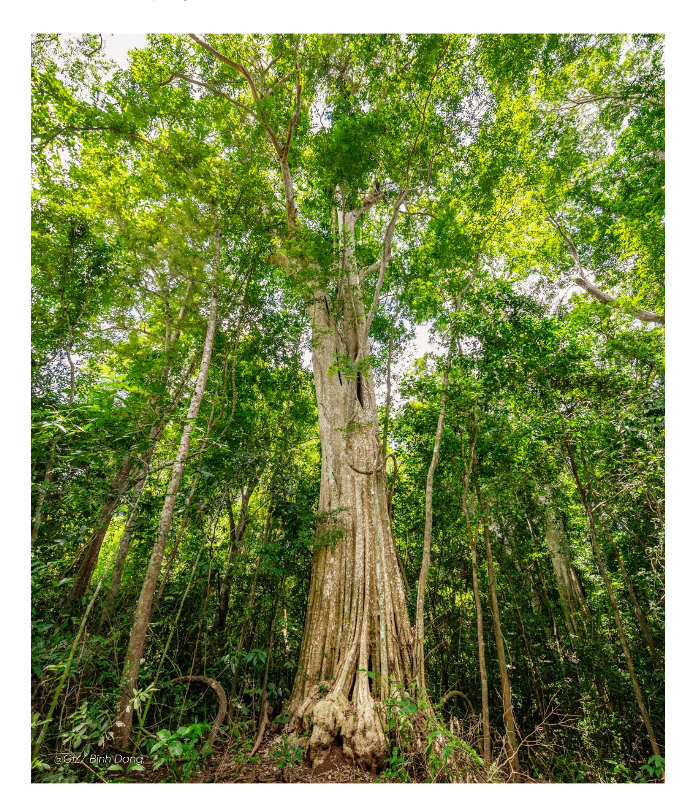

# A. Governmental agencies

| Thematic Area 1. Steps Taken                                                 | Information to Collect                                              | Data Source / Type of Guiding Questions Respondent Data                                                                                              |
|------------------------------------------------------------------------------|---------------------------------------------------------------------|------------------------------------------------------------------------------------------------------------------------------------------------------|
| Existing for Adapting                                                        | national                                                            | or DARD, FPD, Qualitative                                                                                                                            |
| provincial                                                                   | policies                                                            | and                                                                                                                                                  |
| Integration                                                                  | of                                                                  | EUDR or                                                                                                                                              |
| related                                                                      | requirements                                                        | into                                                                                                                                                 |
| local                                                                        | forest                                                              | management,                                                                                                                                          |
| legality                                                                     | verification                                                        | (e.g.,                                                                                                                                               |
| among                                                                        |                                                                     | agencies,                                                                                                                                            |
| enterprises,                                                                 | and                                                                 | forest                                                                                                                                               |
| Budget                                                                       | and                                                                 | resource                                                                                                                                             |
| allocation                                                                   | for                                                                 | activities                                                                                                                                           |
| Source                                                                       | of                                                                  | funding                                                                                                                                              |
| mechanisms                                                                   | to                                                                  | promote                                                                                                                                              |
| certification,                                                               | access                                                              | to                                                                                                                                                   |
| to                                                                           | enterprises,                                                        | forestry                                                                                                                                             |
| companies,                                                                   | or                                                                  | smallholders                                                                                                                                         |
| to EUDR                                                                      |                                                                     | has your agency DONRE, (policy                                                                                                                       |
| Requirements                                                                 |                                                                     | implemented to support District PCs, review,                                                                                                         |
|                                                                              |                                                                     | compliance with EUDR VIFORES,MARD interview)                                                                                                         |
|                                                                              |                                                                     | requirements (e.g., legality provincial reps                                                                                                         |
| VNTLAS/FLEGT).                                                               |                                                                     | local forestry or trade policies? prepare for EUDR?                                                                                                  |
| owners.                                                                      |                                                                     | What are the main                                                                                                                                    |
| 2. Costs Incurred and                                                        | institutional readiness.                                            | institutional or regulatory Provincial Quantitative                                                                                                  |
| Resource Allocation private sector). 3. Incentives and Technical Support for | legality documentation. to EUDR- related tasks. for implementation. | associated with supporting DARD finance +Qualitative unit, project oces, donor program time)? records contribution)? DARD/FPD Qualitative technical |
| Traceability                                                                 |                                                                     | traceability and legal divisions, NGO project assurance?                                                                                             |
| records).                                                                    | markets, recognition).                                              | Are there incentive coordinators, donor programs (e.g., GIZ, WWF, FAO)                                                                               |
|                                                                              | programs and NGOs.                                                  | stakeholders (enterprises,                                                                                                                           |

| 4. Training and Capacity Building for EUDR   | or traceability systems.   | DARD Quantitative Extension + Center, FPD Qualitative has been conducted so far?                                 |
|----------------------------------------------|----------------------------|------------------------------------------------------------------------------------------------------------------|
| (companies,                                  |                            | smallholders,                                                                                                    |
| Topics                                       | covered                    | and                                                                                                              |
| Existing                                     | strategies                 | or                                                                                                               |
|                                              | Communication              | and                                                                                                              |
| needs,                                       | barriers,                  | or                                                                                                               |
| software,                                    | and                        | data                                                                                                             |
| forestry                                     | databases                  | (e.g.,                                                                                                           |
| VNFIS,                                       | eFLEGT,                    | VNForest                                                                                                         |
| Readiness                                    |                            | Who participated Training Units,                                                                                 |
|                                              |                            | (enterprises, cooperatives, NGOs, Women’s women, ethnic groups)?                                                 |
|                                              | women, ethnic minorities). | How are participants Union, Ethnic Aairs Dept. selected and supported?                                          |
| 5. Inclusion of Ethnic Minorities and        | eectiveness of training.  | What barriers limit inclusion be improved? Women’s Qualitative Union, DARD                                       |
| Women                                        |                            | women are included in Social Divisions EUDR-related initiatives?                                                 |
| processes. 6. Digital Literacy and Technical | - Sta skills in digital   | groups face in accessing resources? DARD/FPD IT Quantitative units, GIS +                                        |
| Capacity infrastructure.                     | online data management.    | data collection and divisions, Qualitative project IT traceability monitoring? support teams are currently used? |
|                                              |                            | resources, equipment, or software?                                                                               |
| platforms).                                  |                            | What types of digital                                                                                            |
| upskilling.                                  |                            | training would strengthen your readiness for EUDR?                                                               |

| Thematic Area 1. Steps Taken                                         | Information to Collect                  | Data Source / Type of Guiding Questions Respondent Data                                                             |
|----------------------------------------------------------------------|-----------------------------------------|---------------------------------------------------------------------------------------------------------------------|
| Actions                                                              | or                                      | measures                                                                                                            |
| related                                                              | to                                      | upgrading                                                                                                           |
| traceability                                                         | and                                     | legality                                                                                                            |
| systems                                                              | (e.g.,                                  | technology,                                                                                                         |
|                                                                      | Investment                              | in IT                                                                                                               |
| for Adapting to EUDR Requirements based). and traceability. 2. Costs |                                         | What steps has your Company Qualitative management, + compliance Quantitative ocers, export managers requirements? |
| Incurred for                                                         |                                         | What costs has your Company Quantitative                                                                            |
| Adapting to Traceability and Legality                                |                                         | company incurred to accountants, + financial Qualitative departments legality verification?                         |
|                                                                      | documentation). or supplier monitoring. | operating costs does this represent? support programs)?                                                             |
|                                                                      |                                         | Are there ongoing or                                                                                                |
|                                                                      |                                         | expected future costs to comply with EUDR?                                                                          |

| 7. Overall                               |                                                          |                                                                                                       |
|------------------------------------------|----------------------------------------------------------|-------------------------------------------------------------------------------------------------------|
| Coordination Readiness                   | structure                                                | Qualitative Provincial EUDR - How eectively do provincial                                            |
| agencies, enterprises,                   | and                                                      |                                                                                                       |
| Strengths,                               | weaknesses,                                              |                                                                                                       |
| opportunities,                           | and threats                                              |                                                                                                       |
| and Coordination communities. Assessment | agencies among provincial and district                   | coordinate on coordination committees, EUDR-related activities? DARD/FPD - What are the key strengths |
|                                          | and - Policy alignment between national (MARD) and local | weaknesses in the leadership current system?                                                          |
| implementation.                          |                                                          | What inter-agency coordination mechanisms are                                                         |
|                                          | needed (SWOT) in adapting to EUDR.                       | to enhance compliance?                                                                                |

# B. Enterprises/companies

| 3. Incentives and Technical                                               |                                                                      | Enterprise Qualitative                                                                               |
|---------------------------------------------------------------------------|----------------------------------------------------------------------|------------------------------------------------------------------------------------------------------|
| mapping,                                                                  | digital                                                              | platform                                                                                             |
| received                                                                  | from                                                                 | projects,                                                                                            |
| Expected                                                                  | additional                                                           |                                                                                                      |
| support                                                                   | to meet                                                              | EUDR                                                                                                 |
| duration,                                                                 | organizer,                                                           |                                                                                                      |
| Departments                                                               | or                                                                   | sta                                                                                                  |
| involved                                                                  | (management,                                                         |                                                                                                      |
| Awareness                                                                 |                                                                      | and                                                                                                  |
| understanding                                                             | of                                                                   | EUDR                                                                                                 |
| Barriers                                                                  | to                                                                   | training                                                                                             |
| minorities                                                                | in production,                                                       |                                                                                                      |
| procurement,                                                              |                                                                      | and                                                                                                  |
| Access                                                                    | to information,                                                      |                                                                                                      |
| training,                                                                 | and decision                                                        |                                                                                                      |
| Company                                                                   | policies                                                             | or                                                                                                   |
| Identified                                                                | needs                                                                | for                                                                                                  |
| Support                                                                   |                                                                      | any incentives or support management,                                                                |
| compliance.                                                               | government, or buyers.                                               | related to traceability or technical sta, donor/project legality compliance? reports WWF)? market)? |
| Participation in                                                          |                                                                      | accessing current support mechanisms? Compliance Quantitative sta, training +                       |
| participants). EUDR-Related Trainings and Capacity Building requirements. |                                                                      | on EUDR, FLEGT, or records Qualitative traceability? participated? minority participants?            |
|                                                                           |                                                                      | sta from joining such                                                                                |
| participation.                                                            |                                                                      | trainings (time, cost, awareness)?                                                                   |
| 5. Inclusion of Ethnic Minorities and Women in EUDR Adaptation            | compliance processes.                                                | What training formats CSR ocers, Qualitative women/ minority representatives EUDR-related work?     |
|                                                                           | making opportunities. equality and inclusion. targeted EUDR support. | ensure equal access to ethnic minorities?                                                            |

| 6. Assessment of                                                        |               | Supply chain Qualitative                                                              |
|-------------------------------------------------------------------------|---------------|---------------------------------------------------------------------------------------|
| or channels for reaching Requirements                                   |               | ocers                                                                                |
| Cultural, language,                                                     | or            |                                                                                       |
| Potential actions                                                       | to            |                                                                                       |
| barcoding, GPS, digital                                                 |               |                                                                                       |
| of readiness for                                                        | EUDR          |                                                                                       |
| Key strengths                                                           | and           |                                                                                       |
| weaknesses in legality                                                  |               |                                                                                       |
| underrepresented groups. to Reach Ethnic                                | requirements  | to ethnic                                                                             |
| Minorities and minority suppliers. Women                                |               | Are there language or cultural barriers?                                              |
| improve outreach. 7. Digital                                            | understanding | and compliance?                                                                       |
| Literacy and                                                            |               | What digital tools or Production Quantitative                                         |
| Technical                                                               | systems       | are used for managers +                                                               |
| Capacity databases). and software systems. for sta at dierent levels. | traceability  | (ERP, barcode, Qualitative GPS, etc.)? sta’s digital literacy? traceability systems? |
| digital skills.                                                         |               | What types of digital                                                                 |
| 8. Overall Readiness                                                    | training      | or support would improve EUDR readiness? Senior Qualitative                           |
| and Future                                                              | company’s     | readiness for management,                                                             |
| compliance. Needs                                                       | EUDR          | compliance (high, compliance and export medium, low)?                                 |
| governance. for compliance.                                             |               | What are the main departments systems?                                                |
|                                                                         | additional    | investment or support? EUDR implementation?                                           |

# C. Collectors/Middlemen

| Thematic Area 1. Steps Taken for        | Information to Collect - Current traceability and                                                                                                                          | Data Source / Type of Guiding Questions Respondent Data Collectors, Qualitative - Are you aware of the EUDR                                                                                                                   |
|-----------------------------------------|----------------------------------------------------------------------------------------------------------------------------------------------------------------------------|-------------------------------------------------------------------------------------------------------------------------------------------------------------------------------------------------------------------------------|
| legality                                | documentation                                                                                                                                                              |                                                                                                                                                                                                                               |
| requirements.                           | Measures                                                                                                                                                                   |                                                                                                                                                                                                                               |
| timber                                  | purchased                                                                                                                                                                  | from                                                                                                                                                                                                                          |
| Coordination                            |                                                                                                                                                                            | with                                                                                                                                                                                                                          |
| enterprises                             | or                                                                                                                                                                         | forestry                                                                                                                                                                                                                      |
| costs                                   | associated                                                                                                                                                                 | with                                                                                                                                                                                                                          |
| documents,                              | or                                                                                                                                                                         | meeting                                                                                                                                                                                                                       |
| Expected                                | or                                                                                                                                                                         | needed                                                                                                                                                                                                                        |
| additional                              | support                                                                                                                                                                    | for                                                                                                                                                                                                                           |
| Adapting to EUDR Requirements           | record-keeping practices. - Knowledge of EUDR and adopted to verify sources of                                                                                             | and its requirements for traders, + purchasing Quantitative traceability and legality? agents - What steps have you taken to record or verify where your timber comes from?                                                   |
| verification. 2. Costs Incurred for     | farmers or suppliers. companies for supply chain - Financial or time-related                                                                                               | Do you collect any documents from farmers (e.g., land use right certificates, harvesting permits)? - How do you communicate or report legality information to buyers? Collectors/tra Quantitative - Have you spent additional |
| Traceability                            |                                                                                                                                                                            | money or time to meet ders; financial +                                                                                                                                                                                       |
| and Legality Compliance                 | verifying sources, preparing buyers’ requirements.                                                                                                                         | traceability or legality or business Qualitative records if requirements? available - What are the main cost                                                                                                                  |
|                                         | - Investments in transport, documentation, or storage                                                                                                                      | components (documents, transport, sta, digital tools)?                                                                                                                                                                       |
| 3. Incentives and Technical Support for | facilities for traceability. - Any additional expenses arising from compliance with EUDR or buyer demands. - Access to incentives (better prices, stable contracts, easier | How have these costs aected your profit margin? - Are these costs shared with suppliers or buyers? Collectors, Qualitative - Have you received any association support or incentives (e.g.,                                  |
| Traceability                            | market access) for maintaining legality and traceability. - Technical support received (e.g., GPS mapping, record                                                         | higher prices, training) for representatives , project keeping records or ensuring ocers legal timber? - Who provided the support                                                                                            |
| NGOs. compliance.                       | keeping, mobile apps). - External assistance from enterprises, government, or                                                                                              | (enterprise, local authority, project, NGO)? - What additional assistance would help you improve your record-keeping and compliance? - Are there any challenges in accessing support?                                         |

| 4. Participation in EUDR-Related                                                 |                            | Collectors, Quantitative local forestry + extension Qualitative traceability, or EUDR?                                                                              |
|----------------------------------------------------------------------------------|----------------------------|---------------------------------------------------------------------------------------------------------------------------------------------------------------------|
| available                                                                        |                            | training                                                                                                                                                            |
| (distance,                                                                       | time,                      | cost,                                                                                                                                                               |
| Gender                                                                           | and                        | ethnic                                                                                                                                                              |
| composition                                                                      | of                         | collector                                                                                                                                                           |
| of women                                                                         | and                        | ethnic                                                                                                                                                              |
| Challenges                                                                       | faced                      | by                                                                                                                                                                  |
|                                                                                  | Accessibility              | of                                                                                                                                                                  |
| in local                                                                         | languages                  | or                                                                                                                                                                  |
| Trainings and opportunities. Capacity Building online, on-site). 5. Inclusion of |                            | Who organized these ocers were covered? joining more trainings?                                                                                                    |
| Ethnic Minorities and Women                                                      |                            | Are women or ethnic Collectors Qualitative (male/female, Kinh/ethnic your trading activities? minorities), Women’s Union, local negotiator)? ethnic representatives |
| or formal trade. their participation Requirements                                |                            | How could training or needs? Collectors, Qualitative                                                                                                                |
| to Reach                                                                         |                            | information about new community                                                                                                                                     |
| Ethnic Minorities and Women                                                      | materials related to EUDR. | regulations or buyer leaders, ethnic representatives requirements?                                                                                                  |
| simplified formats.                                                              | aecting participation.    | understandable and in your group?                                                                                                                                   |
| eorts.                                                                          |                            | What communication                                                                                                                                                  |
|                                                                                  |                            | help women and minority better?                                                                                                                                     |

| 7. Digital Literacy and                  |               | Collectors Quantitative                                    |
|------------------------------------------|---------------|------------------------------------------------------------|
| digital tools Technical                  | (e.g.,        | +                                                          |
| smartphone apps, Capacity online forms). | GPS,          | Qualitative origin or transactions?                        |
| Interest and capacity                    | to            |                                                            |
| Self-assessment                          | of            |                                                            |
| EUDR traceability                        |               |                                                            |
| Strengths (e.g., strong                  |               |                                                            |
| weaknesses (e.g., limited                |               |                                                            |
| Main support                             | needs         |                                                            |
| (technical, financial,                   |               |                                                            |
|                                          | smartphone    | or internet                                                |
| tools.                                   | connection?   | How                                                        |
|                                          | digital       | tools for                                                  |
| traceability. 8. Overall Readiness       | documentation | or GPS tracking? Collectors, Qualitative                   |
| and Future Needs requirements.           | meet          | EUDR traceability cooperative leaders, local traders low)? |
|                                          |               | What are your main                                         |
|                                          | strengths     | in legality and                                            |
| documentation).                          | traceability  | (e.g., trusted                                             |
| informational).                          |               | What are your main                                         |
|                                          | would         | help you most in                                           |

# D. Forestry companies

| Thematic Objective Area 1. Steps To assess                                                                                         | Potential Type of Guiding Questions for Data Key Indicators / Data Sources/ Data / Collection Sub-Criteria Respondents Evidence Company Qualitative                                                                                                                                                        |
|------------------------------------------------------------------------------------------------------------------------------------|------------------------------------------------------------------------------------------------------------------------------------------------------------------------------------------------------------------------------------------------------------------------------------------------------------|
| taken for existing adapting systems and to progress and ownership traceabili made by the ty and company procedures legality toward | What traceability - Traceability systems in management mechanisms are currently place (manual or digital) , compliance used to track timber origin - Record of legal origin ocers, and legality? traceability - What changes have been Chain-of-custody sta, forest made recently to align with managers |
|                                                                                                                                    | Are suppliers and                                                                                                                                                                                                                                                                                          |
|                                                                                                                                    | incurred so far for                                                                                                                                                                                                                                                                                        |
|                                                                                                                                    | traceability and legality                                                                                                                                                                                                                                                                                  |
|                                                                                                                                    | What are the most                                                                                                                                                                                                                                                                                          |
|                                                                                                                                    | resource- intensive                                                                                                                                                                                                                                                                                        |
|                                                                                                                                    | Have costs aected                                                                                                                                                                                                                                                                                         |
|                                                                                                                                    | What technical or                                                                                                                                                                                                                                                                                          |
|                                                                                                                                    | company received for                                                                                                                                                                                                                                                                                       |
|                                                                                                                                    | What additional                                                                                                                                                                                                                                                                                            |
| Internal documen meeting EUDR                                                                                                      | audits or EUDR?                                                                                                                                                                                                                                                                                            |
| monitoring tation traceability and legality / FLEGT requirements. 2. Costs To identify                                             | systems - How is information recorded, verified, and stored? Compliance with VNTLAS contractors integrated into this system? Finance and Qualitative                                                                                                                                                       |
| Direct incurred financial and for administrative                                                                                   | costs - What costs have been administration (equipment, GPS, digital departments                                                                                                                                                                                                                           |
| systems, complian costs related certification) ce steps to EUDR adaptation                                                         | training, , project documentation? reports, - Indirect costs (time, budgets                                                                                                                                                                                                                                |
| sta, and their burden) burden on company                                                                                          | administrative activities? Cost-sharing                                                                                                                                                                                                                                                                    |
| mechanisms operations. vs. external funding) To understand                                                                         | (company production or profitability? - Who covers these costs (company, partners, donors)? Company Qualitative                                                                                                                                                                                            |
| Technical Incentives what external                                                                                                 | support directors,                                                                                                                                                                                                                                                                                         |
| received and support and technical enabling                                                                                        | (from GIZ, financial support has the technical NGOs, or government) departments                                                                                                                                                                                                                            |
| Financial support conditions are received available and sharing) or still needed to                                                | assistance traceability? , partner - From which partners or (credit, subsidies, cost project sta projects?                                                                                                                                                                                                |
| Market expected promote EUDR                                                                                                       | incentives - How eective was this                                                                                                                                                                                                                                                                         |
| (export readiness. premium buyers)                                                                                                 | opportunities, support?                                                                                                                                                                                                                                                                                    |
| Expected support                                                                                                                   | future assistance is needed to achieve compliance?                                                                                                                                                                                                                                                         |

| 4.                                                                                                                                                                                             |                                                  | HR and                                    |
|------------------------------------------------------------------------------------------------------------------------------------------------------------------------------------------------|--------------------------------------------------|-------------------------------------------|
|                                                                                                                                                                                                |                                                  | r e c o r d s ,                           |
|                                                                                                                                                                                                |                                                  | t r a i n i n g                           |
|                                                                                                                                                                                                |                                                  | r e p o r t s ,                           |
| Has To assess Participat company training attended ion in                                                                                                                                      | the                                              | company Attendance training units, gender |
| or participation EUDR-rel in training and participation ated                                                                                                                                   | awareness                                        | activities focal points, participants     |
| What                                                                                                                                                                                           | factors                                          | limit                                     |
| ensure                                                                                                                                                                                         | they                                             | understand                                |
| EUDR                                                                                                                                                                                           | and                                              | traceability                              |
| What                                                                                                                                                                                           | barriers                                         | exist                                     |
| (language,                                                                                                                                                                                     |                                                  | knowledge,                                |
| approaches                                                                                                                                                                                     |                                                  | would make                                |
| What                                                                                                                                                                                           | digital                                          | tools or                                  |
| What                                                                                                                                                                                           | are                                              | the main                                  |
| challenges                                                                                                                                                                                     |                                                  | (skills, cost,                            |
| Gender and ethnic awareness trainings                                                                                                                                                          | traceability?                                    | interviews                                |
| composition of activities, and and                                                                                                                                                             |                                                  |                                           |
| participants Internal identify inclusiven inclusion gaps. ess outcomes                                                                                                                         | position, ethnicity)? internally? participation? | Local                                     |
| Representation of To assess Requirem                                                                                                                                                           |                                                  | Qualitative community                     |
| women and ethnic barriers and ents to enabling reach measures for local communities ethnic inclusion of Communication minorities                                                               | or communities?                                  | representati ves                          |
| channels and women and and ethnic accessibility women in minorities in EUDR forestry barriers related operations activities and EUDR for outreach adaptation. 6. Digital To evaluate literacy | requirements?                                    | IT sta, Qualitative forest               |
| forest inventory, GPS the company’s and digital capacity capabilities in managing data management                                                                                              | documentation?                                   | inventory team, management , training     |
| ICT infrastructure traceability and legality (devices, internet)                                                                                                                               | connectivity)?                                   | records                                   |
| Existing data documentation. high)? systems (e.g., eFLEGT)                                                                                                                                     |                                                  |                                           |

| 7. Overall                                                                                                                                                                                                                                                                            |                                                                          | Company                                          |
|---------------------------------------------------------------------------------------------------------------------------------------------------------------------------------------------------------------------------------------------------------------------------------------|--------------------------------------------------------------------------|--------------------------------------------------|
| To summarize                                                                                                                                                                                                                                                                          |                                                                          | Qualitative                                      |
| How                                                                                                                                                                                                                                                                                   | ready is                                                                 | your                                             |
| opportunities                                                                                                                                                                                                                                                                         | for                                                                      | your                                             |
| What                                                                                                                                                                                                                                                                                  | support                                                                  | or                                               |
| coordination                                                                                                                                                                                                                                                                          | from                                                                     | the                                              |
| government                                                                                                                                                                                                                                                                            | or projects                                                              |                                                  |
| Overall readiness assessme the company’s perception nt of perceived requirements? - Opportunities and risks readiness readiness, - Institutional coordination and challenges, with state agencies outlook and business? - Future action plans expectations regarding EUDR compliance. | company to meet EUDR - What are the key risks and would be most helpful? | leadership, compliance and technical departments |

# E. Smallholders

| Main Objective Key Indicators / Category Sub-Criteria 1. Assess                                                                                                      |          | Data Source Data Key Questions /Respondent Type Individual                              |
|----------------------------------------------------------------------------------------------------------------------------------------------------------------------|----------|-----------------------------------------------------------------------------------------|
| Current practices Adaptatio progress in land and timber origin n Steps EUDR documentation; for preparation                                                           | on       | Qualitative smallholders; & community quantitative forest                               |
| awareness of Traceability and identify                                                                                                                               | legality | transaction receipts) groups                                                            |
| requirements; and gaps in taken toward traceability Legality documentation /traceability compliance. 2. Costs Evaluate Financial, labor, and time Incurred financial | actions  | and trade documentation? cooperatives, government)? Individual Qualitative smallholders |
| investments for burden and                                                                                                                                           | for      | &                                                                                       |
| traceability and legality Adaptation identify areas needing                                                                                                          |          | keeping, mapping, or quantitative                                                       |
| financial or policy support.                                                                                                                                         |          | certificates, training costs, data collection tools)? or companies?                     |

| 3. Identify                                                                                                                          |                            |                | Smallholders                                                           |
|--------------------------------------------------------------------------------------------------------------------------------------|----------------------------|----------------|------------------------------------------------------------------------|
| Access to incentives                                                                                                                 |                            |                |                                                                        |
| market-related) to                                                                                                                   |                            |                |                                                                        |
| of training, and                                                                                                                     |                            |                |                                                                        |
| Extent to which                                                                                                                      |                            |                |                                                                        |
| smallholders from                                                                                                                    |                            |                |                                                                        |
| access EUDR-related                                                                                                                  |                            |                |                                                                        |
| Have Incentives eectiveness and of incentive Technical programs and Support design future support tailored to smallholders.         | you digital tools)?        | received       | any Qualitative ; local & cooperatives quantitative ; support programs |
| you Assess current Participati awareness on in level and inclusiveness Trainings training on EUDR accessibility Readiness to improve | expect what did you learn? | from           | the Smallholders Qualitative ; training & organizers quantitative      |
| What outreach and inclusivity. 5. Gender Identify social and barriers and                                                            | time, distance)?           | barriers       | prevent Qualitative Smallholders (men,                                 |
| to Ethnic design Minority inclusive                                                                                                  | support                    | or information | women, minority                                                        |
| How Inclusion interventions opportunities in EUDR readiness.                                                                         | do traceability?           | ethnic         | minority households); community leaders                                |
| ethnic                                                                                                                               | minority inclusiveness?    | or             | women                                                                  |

| 6. Digital Assess Literacy                                                  | Individual Access to and use digital - Do you use any digital tools Qualitative smallholders                                                                                                                                                                                                                                                         |
|-----------------------------------------------------------------------------|------------------------------------------------------------------------------------------------------------------------------------------------------------------------------------------------------------------------------------------------------------------------------------------------------------------------------------------------------|
| tools readiness for and                                                     | (smartphones, to record farm or timber data &                                                                                                                                                                                                                                                                                                        |
| and                                                                         | perceived                                                                                                                                                                                                                                                                                                                                            |
| opportunities                                                               | under                                                                                                                                                                                                                                                                                                                                                |
| digital apps, GPS, etc.) Accessibili traceability ty systems and            | (e.g., mobile apps, GPS, quantitative digital logbooks)? - What challenges do you face                                                                                                                                                                                                                                                               |
| inform capacity-buil ding programs. Understand Expected motivation Future   | in using these tools (connectivity, knowledge, cost)? - How comfortable are you with using smartphones or computers for reporting or registering data? - What type of training or support would help improve your digital skills? Qualitative Smallholders Smallholders’ expectations - What benefits do you ; expect from meeting EUDR cooperatives |
| and align Support                                                           | requirements (e.g., better                                                                                                                                                                                                                                                                                                                           |
| future EUDR and interventions Opportuni with ties smallholder expectations. | prices, market access, sustainable practices)? - What kind of assistance would make it easier for you to comply with (financial,                                                                                                                                                                                                                     |
|                                                                             | technical, cooperative based)?                                                                                                                                                                                                                                                                                                                      |

### **Proposed interviewed List**

**Wood companies and forestry enterprises to be interviewed in Gia Lai (Binh Dinh)**

## **Participants**

- **• Department of Agriculture and Environment, Gia Lai Province and the Gia Lai Provincial Forest Protection Sub-Department.**
- **• Thắng Lợi Enterprise, Phú Tài JSC Address:** Provincial Road 638, Bình An hamlet, Phước Thành commune, Tuy Phước district, Binh Dinh (≈13 km from Quy Nhơn).
- **• Sông Kôn Forestry Company Address:** 56 Nguyễn Trung Tín, Định An quarter, Vĩnh Thạnh town, Vĩnh Thạnh district, Binh Dinh (≈74.4 km from Quy Nhơn).
- **• Three buyers** within the supply chain of Sông Kôn Forestry Company.
- **• Five households** located in the area of Sông Kôn Forestry Company.
- **• Hà Thanh Forestry Company Address:** 483 Quang Trung, Thịnh Văn 2 quarter, Vân Canh town, Vân Canh district, Binh Dinh (≈38.4 km from Quy Nhơn).
- **• Quy Nhon Forestry Co., Ltd. Address:** 1134 Hùng Vương, Quy Nhơn Bắc Ward, Gia Lai Province.
- **• Quy Nhon Wood Processing Company** (address not provided).

### **Tentative Agenda**

From 04 to 07 November 2025

| No Time Organization/ Expected Individual participants 4 1 Morning, Department of 4 Nov |                |     | Notes |        |        |            |
|-----------------------------------------------------------------------------------------|----------------|-----|-------|--------|--------|------------|
| Ltd. + two buyers in                                                                    |                |     |       |        |        |            |
| Five households linked                                                                  |                |     |       |        |        |            |
| Sub-Department Afternoon, 4 Nov Phú Tài JSC                                             | representative | of  | the   | Forest |        | Protection |
| Company Morning, 5 Nov Sông Kôn’s chain Five households Afternoon, 5 Nov Sông Kôn       | leader         | and | sta   | in     | charge | of         |
| Company Morning, 6 Nov Ltd. Afternoon, 6 Nov                                            | leader         | and | sta   | in     | charge | of         |
| Company Morning, 7 Nov Ltd. Quy Nhon Wood Afternoon, 7 Nov                              | leader         | and | sta   | in     | charge | of         |

# **Annex 3: Matrix of desk review findings from three sectors.**

**Synthesis of existing studies (see list of references in Annex 1)**

| Coee Sector                |                    | Timber           | Rubber                                        |
|-----------------------------|--------------------|------------------|-----------------------------------------------|
| streams, enterprise CoC     |                    |                  |                                               |
| grade end-to-end. Most      |                    |                  |                                               |
| collectors where mixing is  |                    |                  |                                               |
| tied to farmer ID/LURC),    |                    |                  |                                               |
| production/collection date, |                    |                  |                                               |
| legality references, and    |                    |                  |                                               |
| -friendly) and clear role   |                    |                  |                                               |
| Program/certified streams   |                    |                  |                                               |
| and leading exporters are   |                    |                  |                                               |
| timber                      | /                  | wood             | & wood                                        |
| products                    | with               | 1.2              | million                                       |
| Viet                        | Nam’s              |                  | VNTLAS/FLEGT                                  |
| process                     | gives              | a                | legality                                      |
| enterprise                  |                    | classification), | but                                           |
|                             | geolocation,       |                  | production/                                   |
| -move                       |                    | end-to-end       | to the                                        |
| ready                       | spatial            | layers           | (forest                                       |
| snapshot                    |                    |                  | Vietnam is the world’s #4                     |
| ~1.3 ha).                   |                    |                  | rubber (approx 260k                           |
| Traceability                | managing 1–5 ha.   |                  | latex passes via multiple low record-keeping. |
| readiness                   |                    |                  | Supply is dominated by                        |
|                             |                    |                  | smallholders (≈63% of raw                     |
|                             |                    |                  | >95% of smallholder latex                     |
| common.                     |                    |                  | are common—breaking lot                       |
|                             | single record set. |                  | inputs (≈40–45% in recent origin proof        |
|                             |                    |                  | coordinates or polygons;                      |

| hardest            | to               | link           | to information needs.                            |
|--------------------|------------------|----------------|--------------------------------------------------|
| maps               | 23 legality      | indicators     |                                                  |
| third-party,       |                  | trade/customs) |                                                  |
| where              | farms            | are            | in/near                                          |
| designated         | forest           | or             | in                                               |
| definitions        | (VN              | vs             | EUDR)                                            |
| checks             | against          |                | the                                              |
| usable             | spatial          | layers         | and                                              |
|                    |                  |                | challenges persist (import                       |
|                    |                  |                | documents to EUDR                                |
|                    |                  |                | VN forest definitions and                        |
|                    |                  |                | agroforestry treatment                           |
|                    |                  |                | harmonized, authoritative                        |
|                    |                  |                | The high-risk status of                          |
|                    |                  |                | imported material is                             |
|                    |                  |                | national traceability                            |
| Legality readiness |                  |                | framework in key supplier Vietnamese processors. |
|                    |                  |                | Vietnamese government to                         |
|                    |                  |                | forest classification and a                      |
|                    | harmonized maps. |                | Many smallholders have                           |
| plots.             |                  |                | layers that are unevenly accessible.             |
|                    |                  |                | —forcing processors to                           |

|                             |                   | due-diligence.                        |
|-----------------------------|-------------------|---------------------------------------|
| Leading exporters/          |                   |                                       |
| cooperatives already run    |                   |                                       |
| support; public forest      |                   |                                       |
| information systems (e.g.,  |                   |                                       |
| FRMS) provide a base for    |                   |                                       |
| actors need SOPs for        |                   |                                       |
| GPS/polygoning, batch       |                   |                                       |
| and sync via APIs with      |                   |                                       |
| Single-window, operator    |                   |                                       |
| ready spatial services for  |                   |                                       |
| forest/land status at       |                   |                                       |
| fields reliably pass to the |                   |                                       |
| Many SMEs/community         |                   |                                       |
| polygon mapping,            | data              |                                       |
|                             |                   | Guidance exists to map                |
|                             | EUDR              | due-diligence, but                    |
|                             | operator-ready    | “legality                             |
|                             | harvest/transport | permits, standardized at scale.       |
| Technical capacity          |                   | Large SOE/FDI mills can               |
|                             | however,          | many plants still IDs and timestamps. |
| spatial verification.       | have              | sucient technical                    |
|                             | literacy          | for mapping by                        |
|                             | oine-capable     | apps to                               |
|                             | capture           | farmer ID, plot                       |
|                             | polygons,         | collection dates,                     |
| enterprise systems.         | the               | national dealer toolkit workflows.    |
|                             | service           | (forest boundary/                     |
| operator.                   | between           | public data and yet in place.         |

| Financial                    |                                     |                                                     |
|------------------------------|-------------------------------------|-----------------------------------------------------|
| /GPS, polygon mapping,       |                                     |                                                     |
| plans, training time), while |                                     |                                                     |
| Collectors/exporters need    |                                     |                                                     |
| checks. Current instruments  |                                     |                                                     |
| results-based payments,      |                                     |                                                     |
| services) are limited,       |                                     |                                                     |
| GIS/IT                       | upgrades,                           | digitized                                           |
| CoC,                         | segregation                         | controls,                                           |
| and                          | recurring                           | audit/                                              |
| pre-competitive              |                                     | shared                                              |
| services                     | (pooled                             | mapping/                                            |
| adaptation                   | measures                            | (GIS                                                |
| Accessing                    |                                     | authoritative                                       |
| training                     | to operationalize                   |                                                     |
| “deforestation-free”         |                                     | checks                                              |
| adds                         | non-trivial                         | per-firm                                            |
| for common                   | services                            | and                                                 |
| modernization                |                                     | and data                                            |
| capacity                     |                                     | Smallholders/dealers face                           |
| data entry.                  |                                     | without targeted subsidies,                         |
|                              | costs are duplicated. surveys, IT); | pooled mapping services, at scale is dicult. EUDR. |
|                              |                                     | Processors need working                             |
| increasing exclusion risk.   |                                     | train/onboard dealers, and                          |
|                              | targeted instruments.               | pre-competitive shared exclusion risks.             |
|                              |                                     | oering extra payments or                           |
|                              | workflows.                          | (geo-coordinates, LURC),                            |
|                              |                                     | cover the farmers' implicit adaptation costs.       |
|                              |                                     | Large firms can finance                             |
|                              |                                     | mapping, IT, and dealer                             |
|                              |                                     | and financial support to                            |
|                              |                                     | operationalize adaptation measures.                 |

# **Key bottlenecks identified**

# **Cross-cutting enabling conditions (all three sectors)**

- **1. Single-window spatial data & APIs:** operator-ready forest boundary (cut-o), protected status, and land-class layers with programmatic access.
- **2. Interoperability & roles:** a national data model and governance so EUDR relevant data (plot geo + ID link, date, legality refs, consignment IDs) move end-to-end to the operator.
- **3. SME onboarding & finance:** pre-competitive shared services (e.g., pooled mapping/onboarding) and targeted instruments (subsidies, concessional credit, results-based payments).
- **4. CoC discipline:** no mixing of unknown origin and audit-ready records across nodes.

Posssible critical gaps in awareness, technical capacity, resources, and access to information that may hinder preparedness:

| Coee Traceability         |          | Timber Rubber                                                             |
|----------------------------|----------|---------------------------------------------------------------------------|
| Public, private            | and      |                                                                           |
| fields (farm geolocation,  |          |                                                                           |
| production date, legality  |          |                                                                           |
| certified/program channels |          |                                                                           |
| via mobile collectors,     | with     |                                                                           |
| routine mixing at          | first    |                                                                           |
| Most smallholders          | lack     |                                                                           |
| only a single point,       | not      |                                                                           |
| used to check              | the      |                                                                           |
| 31-Dec-2020 cut-o          | are      |                                                                           |
| readiness                  |          | FRMS, certification (FSC/                                                 |
|                            | single   | record set to the                                                         |
|                            | recorded | as centroids or                                                           |
|                            | paper    | maps, not polygon                                                         |
|                            |          | Access to authoritative                                                   |
|                            | layers   | (forest boundary/                                                         |
|                            | land-use | status as of                                                              |
|                            | API,     | so operators can’t                                                        |
|                            |          | Aggregation yards and                                                     |
|                            |          | polygon-mapped and consignments.                                          |
| records.                   |          | Cup-lump/latex passes for each consignment.                               |
| linkable to lots.          |          | routine pooling and before the processor. shipment documents.             |
|                            |          | fields (farm geo, harvest/                                                |
|                            |          | to record the transaction,                                                |
|                            |          | Dec-2020 forest/land-status                                               |
|                            |          | layers is uneven and not automate plot checks. for smallholder suppliers. |

automated plot verification and batch segregation unreliable.

• First-mile actors lack oine-capable apps and clear SOPs to capture farmer ID, plot geo, and consignment details, which prevents clean pass-through and forces downstream re-verification.

# **Commons accrossed 3 sectors:**

- **• Fragmented platforms** (public, private, certification/enterprise) prevent end-to end visibility and do not consistently transmit required EUDR fields.
- **• Critical data gaps** persist at multiple nodes—geolocation, production date, and legality evidence are not reliably captured or passed to operators.
- **• Non-standard provincial/district data practices** hinder consistent aggregation and verification.

origin/date is not consistently enforced, so batch histories break before reaching mills. • Government datasets (FRMS, land/forest status) are not machine-linked to private CoC systems, so geo and date fields must be re-entered or reconciled manually, increasing errors and preventing reliable pass-through to the operator.

• A large share of raw rubber is sourced via Cambodia/Laos intermediaries with weak traceability/legal proof, forcing processors to segregate or exclude volumes that cannot be verified as EUDR-compliant.

**Legality readiness** • Operator-ready layers for 31-Dec-2020 forest/land status are not harmonized, so coee plots in/near "designated forest" or agroforestry zones can't be verified quickly

against the EUDR cut-o.

• Many smallholders, up to 40%, lack valid LURCs or hold alternative papers; owner/plot records aren't digitized or tied to exact plot coordinates, making "geolocation → legal

title" checks unreliable.

• The legal basis spans multiple laws/provincial procedures, and there is no unified, operator-oriented legality bundle mapping Viet Nam documents to EUDR

• Viet Nam's legal notions of forest, forest degradation, and agroforestry/production forest do not map cleanly to EUDR terms, creating ambiguity when proving "deforestation-free" and land legality at plot level; a formal bridging guide is required to translate VN documents to

EUDR tests.

• Provinces lack a harmonized, authoritative 31-Dec-2020 forest/land-status layer (incl. protected areas) that is publicly accessible and geo-linkable to LURCs/parcel IDs, harvest permissions, and

transport papers.

• Provincial retrieval processes are manual and inconsistent (formats, fees, timelines), and

• Lack of a unified, publicly recognized map harmonizing national forest definitions (which may include rubber) with the strict EUDR deforestation criteria as of the 31-Dec-2020

cut-o date.

• Provinces dier in data access; there's no national mechanism to link farmer ID, plot geolocation, land tenure, harvest/transport documents, and dealer invoices. This makes all actors in supply chain face diculties in proving

their legality.

• Many smallholders lack valid or coordinate-linked LURCs; scattered plots and paper records prevent tying farmer ID → plot geolocation → legal title.

| often record points (not                                                                   |                              |                         |
|--------------------------------------------------------------------------------------------|------------------------------|-------------------------|
| rarely time-stamp batches;                                                                 |                              |                         |
| polygoning, digital receipts,                                                              |                              |                         |
| don’t generate a single,                                                                   |                              |                         |
| farmer ID/LURC link,                                                                       |                              |                         |
| production/collection date,                                                                |                              |                         |
| consignment ID). First                                                                     |                              |                         |
| -2020 forest/land-status                                                                   |                              |                         |
| parcel IDs/LURCs, so                                                                       | mills                        |                         |
| attach geo-evidence                                                                        | to                           |                         |
| re-enter geo/date                                                                          | fields                       |                         |
| manually, and                                                                              | first                        |                         |
| aggregation points                                                                         | lack                         |                         |
| SOPs/barcoding to                                                                          | carry                        |                         |
|                                                                                            |                              | Smallholders and many   |
|                                                                                            | necessary                    | devices/software        |
|                                                                                            | (GPS,                        | oine apps) to          |
|                                                                                            | independently                | capture or              |
|                                                                                            | maintain                     | the mandatory           |
|                                                                                            | geo-location                 | and time               |
|                                                                                            | to                           | capture farmer ID, plot |
|                                                                                            | date,                        | volume, and             |
|                                                                                            | consignment                  | ID plus                 |
|                                                                                            | mixing                       | and enable              |
|                                                                                            | and                          | processing batches.     |
| Authoritative, operator-usable spatial evidence is limited:                                | lack of a single, up-to-date |                         |
| Document access and standardization issues: provincial practices for issuing/sharing land, |                              |                         |
| Smallholder inclusion risks: weak or missing tenure documents and costly regularization    |                              |                         |
| records aren’t digitized                                                                   | or                           |                         |
| bundled, preventing                                                                        | a                            |                         |
| standard operator legality                                                                 |                              |                         |
| harvest/transport permits,                                                                 |                              |                         |
| and supply contracts                                                                       | for                          |                         |
|                                                                                            |                              | Significant volumes via |
|                                                                                            | requiring                    | segregation or          |
|                                                                                            | exclusion                    | until compliant         |

**Financial capacity**

• Smallholders/collectors lack cash for plot polygoning & geo files, LURC/document regularization fees, smartphones/ GPS, data plans, and training time; while cooperatives lack budget for data entry/QA. Without micro-grants, pooled mapping services, or concessional loans/ resultsbased payments, indirect suppliers cannot be onboarded at scale. • Collectors/exporters need extra working capital to keep EUDR-eligible coee segregated, pay farmers promptly while holding clean inventories, and upgrade IT for data passthrough. With limited buyer co-financing/premiums, these recurring costs risk a return to mixing and non-compliant

• Smaller mills and traders lack funds for GIS/IT upgrades, digitized CoC, batch segregation hardware, and sta time to produce EUDR Arts. 9–10 documentation; recurring verification costs further strain margins and

cash flow.

• High transaction costs without shared services. Paying for authoritative spatial data/consulting, sta training, and verification is expensive per firm; with no pooled, pre-competitive tools or data services, SMEs duplicate investments instead of using a common, API-ready

platform.

• Smallholders/dealers can't cover phones/GPS, polygon mapping, data plans, LURC/ admin fees, travel, and training time to collect EUDR data. Scaling requires pooled geo-mapping services and targeted support (micro-grants or concessional microloans via

processors/ associations).

• Processors need cash to run clean lines (separate tanks/ storage, labeling, batch coding), onboard dealers, and verify imported origins (supplier checks, cross-border docs). Without buyer cost-sharing/ premiums or results-based payments, inventories tie up capital and discourage

adaptation measures.

# **Commons accrossed 3 sectors:**

- **• Operator-ready spatial data & APIs:** No single-window service for 31-Dec-2020 forest/land status and weak interoperability with enterprise CoC/ERP.
- **• End-to-end data pass-through:** EUDR fields (plot polygon + ID link, date, legality refs, consignment ID) aren't packaged and delivered to the operator consistently.
- **• Uneven first-mile capture:** Provinces/actors collect geo & docs dierently—partial polygons, missing timestamps, weak links to farmer ID/LURC.
- **• Tools & SOPs not deployment-ready:** Need interoperable, smallholder-friendly, oine apps plus clear SOPs for ID, GPS/polygoning, batch coding, and clean-line handling.
- **• SME/community capability gap:** Limited GIS/IT, data governance, and standardized templates/QA to produce EUDR Arts. 9–10 deliverables.
- **• Gap in Digital Literacy:** The majority of smallholders and collectors lack the technical literacy required to consistently capture, validate, and transfer the mandatory geo-location and time-stamped consignment data to the next tier.

and clean EUDR lines are not consistently implemented. • No operator-ready spatial service (cut-o layers + APIs); public datasets don't sync with enterprise CoC/ERP.

# **Commons accrossed 3 sectors:**

- **• High adaptation costs upstream:** farmers/dealers face devices, mapping, data and admin fees; processors incur segregation/verification expenses, with added working-capital tied up in clean inventory lines.
- **• Weak economics at the base:** upfront outlays (hardware, geo-mapping, training/sta time) often exceed near-term benefits for farms, dealers, and SMEs.
- **• Limited financing instruments:** few subsidies, concessional loans, results-based payments, or pre-competitive shared services (e.g., pooled mapping/onboarding).
- **• Cost burden shifts upstream:** minimal buyer cost-sharing pushes adaptation expenses onto small suppliers, raising exclusion risk.
- **• Fragmented funding/standards:** multiple platforms and audits create duplicated spending instead of one interoperable investment pathway.

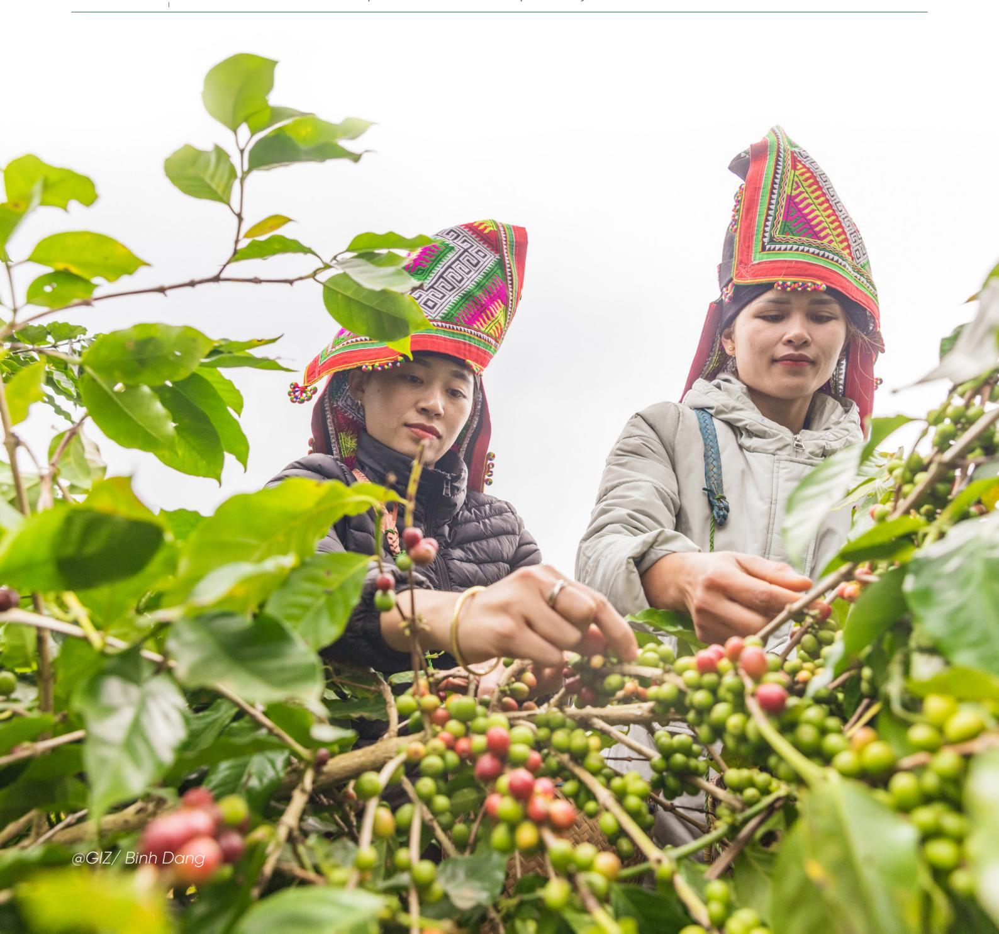

# **Annex 4. Summary on EUDR readiness and co-benefits assessment in Viet Nam based on the Field Trips**

# **Cross-Sector readiness summary matrix**

| Dimension Coee Sector Traceability                                                                                                       | Rubber Sector                                                                                                   | Timber Sector                                                                                                                                                                                |
|-------------------------------------------------------------------------------------------------------------------------------------------|-----------------------------------------------------------------------------------------------------------------|----------------------------------------------------------------------------------------------------------------------------------------------------------------------------------------------|
| collectors and farmers                                                                                                                    |                                                                                                                 |                                                                                                                                                                                              |
| phone logs, resulting in                                                                                                                  |                                                                                                                 |                                                                                                                                                                                              |
| data hand-os remain                                                                                                                      |                                                                                                                 |                                                                                                                                                                                              |
| coordinates, farmer IDs,                                                                                                                  |                                                                                                                 |                                                                                                                                                                                              |
| Investment: exporters report IT                                                                                                           |                                                                                                                 |                                                                                                                                                                                              |
| and operational and                                                                                                                       |                                                                                                                 |                                                                                                                                                                                              |
| collectors costs VND 5–10                                                                                                                 |                                                                                                                 |                                                                                                                                                                                              |
| filing systems and public                                                                                                                 |                                                                                                                 |                                                                                                                                                                                              |
| mapping is supported via                                                                                                                  |                                                                                                                 |                                                                                                                                                                                              |
| Large Exporters operate digital or Readiness                                                                                              | companies                                                                                                       | use Supply chains remain heavily                                                                                                                                                             |
| FSC/PEFC, semi-digital systems (such as                                                                                                   | GPS                                                                                                             | plot focused on the first mile:                                                                                                                                                              |
| mapping ERP and QMS) and QR or                                                                                                            | and                                                                                                             | iTwood/ transactions are mostly still                                                                                                                                                        |
| through                                                                                                                                   | to the                                                                                                          | mill is                                                                                                                                                                                      |
| For                                                                                                                                       | collectors                                                                                                      | and                                                                                                                                                                                          |
| weak.                                                                                                                                     | Household                                                                                                       | records                                                                                                                                                                                      |
| coordinates),                                                                                                                             | and                                                                                                             | data                                                                                                                                                                                         |
| often                                                                                                                                     | needs                                                                                                           | to be                                                                                                                                                                                        |
| Investment:                                                                                                                               | Certified                                                                                                       | firms                                                                                                                                                                                        |
| operating                                                                                                                                 | expenses                                                                                                        | for                                                                                                                                                                                          |
| adaptation                                                                                                                                |                                                                                                                 | measures                                                                                                                                                                                     |
| and                                                                                                                                       | maintenance                                                                                                     | of                                                                                                                                                                                           |
| certification                                                                                                                             | (approximately                                                                                                  |                                                                                                                                                                                              |
| blockchain pilots, whereas                                                                                                                | GeoSon pilots, as well as                                                                                       | logged on paper or by                                                                                                                                                                        |
| largely rely on paper or                                                                                                                  | lot-level dossiers. Traceability workable in organised chains.                                                  | phone, and mixing and re-bagging before mill intake are common.                                                                                                                              |
| uneven pass-through. GPS points exist for roughly but collector templates and uneven. Vietnam still lacks a unified, API-enabled national | smallholders, invoices and contract information exist, but digital pass-through is are informal (photos, ad hoc | Although processors are building end-to-end systems (geo + transaction + legality) and operating segregated 'clean lines', reliable pass through from farm to factory is not yet universal. |
| traceability platform; as a                                                                                                               |                                                                                                                 | Investment: Factories invest in                                                                                                                                                              |
| result, the links between plot land-tenure documents, and                                                                                 | reconstructed by buyers.                                                                                        | data-collection software,                                                                                                                                                                    |
| production/harvest data are patchy and inconsistent. 0.5–1 billion per year. system, million per year. app onboarding costs. projects.    | hectares per year). forests (donor-funded).                                                                     | and Excel spreadsheets to GPS capture during pilots systems                                                                                                                                  |

| Legality                                                                                      |                                                                                                                                  |                                                                                                                           |
|-----------------------------------------------------------------------------------------------|----------------------------------------------------------------------------------------------------------------------------------|---------------------------------------------------------------------------------------------------------------------------|
| have LURC/cadastral                                                                           |                                                                                                                                  |                                                                                                                           |
| and operators require                                                                         |                                                                                                                                  |                                                                                                                           |
| authoritative forest/ land                                                                    |                                                                                                                                  |                                                                                                                           |
| Investment: households self                                                                  |                                                                                                                                  |                                                                                                                           |
| and established basic due                                                                     |                                                                                                                                  |                                                                                                                           |
| (SOPs) for GPS/polygoning,                                                                    |                                                                                                                                  |                                                                                                                           |
| Investment: Exporters funded                                                                  |                                                                                                                                  |                                                                                                                           |
| and buyer audits, while                                                                       |                                                                                                                                  |                                                                                                                           |
| Enterprises: Readiness                                                                        |                                                                                                                                  | EUDR Tenure evidence ranges from                                                                                          |
| Books/leases                                                                                  | and                                                                                                                              | harvest                                                                                                                   |
| and                                                                                           | transport                                                                                                                        | documents)                                                                                                                |
| are                                                                                           | available                                                                                                                        | and are                                                                                                                   |
| while                                                                                         | others                                                                                                                           | rely on                                                                                                                   |
| Invesment:                                                                                    | households                                                                                                                       | are                                                                                                                       |
| bearing                                                                                       | the                                                                                                                              | costs of                                                                                                                  |
| SOPs                                                                                          | for digital                                                                                                                      | intake,                                                                                                                   |
| Government                                                                                    | sta                                                                                                                             | can                                                                                                                       |
| but                                                                                           | they                                                                                                                             | require                                                                                                                   |
|                                                                                               | standardised tools                                                                                                               | and                                                                                                                       |
| Investment:                                                                                   | required                                                                                                                         | for                                                                                                                       |
| traceability                                                                                  | training                                                                                                                         | for                                                                                                                       |
| company                                                                                       | and                                                                                                                              | government                                                                                                                |
| practical                                                                                     | templates                                                                                                                        | and                                                                                                                       |
|                                                                                               | documentation packs (Red                                                                                                         | LURCs/leases to commune confirmations, and rubber on                                                                      |
| pending or require commune confirmation. The integration of land legality                     | routinely checked under CoC.                                                                                                     | forestry land is the most dicult to verify quickly. Processors align with labour,                                        |
| and plot geo is still in progress, layers by 31 December 2020.                                | Households: tenure is mixed — some hold Red Books, forest-land lease contracts.                                                  | tax and environmental legislation, but written labour contracts are still uncommon at the first mile.                     |
|                                                                                               | Geo-linkage to parcels is                                                                                                        | Investment: Households are                                                                                                |
| supporting documentation Technical Enterprises have trained sta Capacity                     | uneven, creating a backlog of plots to be verified. for land tenure documents. There is high capacity within                     | incurring fees and time for case-by-case basis. Processors: dedicated EUDR                                                |
| diligence workflows. However, collectors and farmers still need standard operating procedures | state and large companies with regard to familiarity with GIS/QGIS, GPS and FRMS. However, local SME traders and collectors lack | teams and online traceability. Need to finish geo-batch linking inside the ERP/MES system. First mile: limited ability to |
| batch coding and clean-line                                                                   |                                                                                                                                  | capture polygons/                                                                                                         |
| handling, and request a national EUDR information portal.                                     | batch IDs and API use. provide plot geolocations,                                                                                | coordinates and maintain consignment IDs; high daily volumes constrain data entry.                                        |
|                                                                                               |                                                                                                                                  | Public sector: EUDR                                                                                                       |
|                                                                                               | guidance that are aligned                                                                                                        | awareness is uneven at commune level and further                                                                          |
|                                                                                               | with EUDR requirements.                                                                                                          | guidance and tools are required.                                                                                          |
| not itemised).                                                                                | multiple rounds of EUDR/                                                                                                         | Investment: recurring sta time                                                                                           |
| low-cost tools.                                                                               |                                                                                                                                  | devices provided in some pilots.                                                                                          |

| Financial                                         |                                       |                                            |
|---------------------------------------------------|---------------------------------------|--------------------------------------------|
| maintain clean lines of                           |                                       |                                            |
| documentation; upstream                           |                                       |                                            |
| ~USD 17–20/tonne (some                            |                                       |                                            |
| Smallholders face costs                           |                                       |                                            |
| Investments include firm-level                    |                                       |                                            |
| as well as household                              |                                       |                                            |
| Investment is required:                           |                                       |                                            |
| Collectors' annual admin                          |                                       |                                            |
| and most lack dedicated                           |                                       |                                            |
| peoples) are active in                            |                                       |                                            |
| invested in financing                             |                                       |                                            |
| inclusive training sessions                       |                                       |                                            |
| Investment: No disaggregated                      |                                       |                                            |
| Certified Capacity                                | supply absorb recurring certification | chains                                     |
| SMEs                                              | face                                  | cash flow                                  |
| IT                                                | upgrades                              | and                                        |
| documentation                                     |                                       | stang,                                    |
| while                                             | collectors                            | have                                       |
| minimal                                           | budgets                               | for                                        |
| Investment:                                       | required                              | for                                        |
| certification                                     | maintenance                           |                                            |
| an                                                | additional                            | 5–10%                                      |
| organisations                                     | have                                  | limited                                    |
| Women                                             | are                                   | visible in                                 |
| administrative                                    |                                       | and                                        |
| procurement                                       |                                       | roles, but                                 |
| training.                                         | Ethnic                                | minorities                                 |
| Investment:                                       | ad hoc inclusive                      |                                            |
| training;                                         | no province-level                     |                                            |
|                                                   | and adaptation costs.                 | platforms and provide                      |
| estimate costs of ~USD 50+).                      |                                       | costs for onboarding, and segregation.     |
|                                                   | digitalisation.                       | Smallholders and dealers mapping and apps. |
| on donor projects.                                |                                       | Investment: Factories report               |
|                                                   |                                       | per year on software and                   |
| the first mile. 5–10 million. supported. Gender & | on donor projects.                    | support (plus sta and external help       |
| Inclusion                                         |                                       | Women are visible in                       |
|                                                   |                                       | plantation companies,                      |
|                                                   |                                       | including in technical and                 |
| the surveyed chains.                              |                                       | at the first mile. Ethnic                  |
|                                                   |                                       | minorities are present but                 |
| mixed-gender groups).                             | and technical roles. participation.   | underserved by targeted outreach.          |

| Digital                                                      |                          |                                                       |
|--------------------------------------------------------------|--------------------------|-------------------------------------------------------|
| Although smartphone Literacy                                 |                          |                                                       |
| whereas exporters have                                       |                          |                                                       |
| Investment has gone into                                     |                          |                                                       |
| onboarding, and projects                                     |                          |                                                       |
| were not systematically                                      |                          |                                                       |
| EU segments, better risk                                     |                          |                                                       |
| management and                                               |                          |                                                       |
| to sustainable farming in                                    |                          |                                                       |
| areas where programmes                                       |                          |                                                       |
| Digital traceability can                                     |                          |                                                       |
| and enables future                                           |                          |                                                       |
| platform integrating 31                                      |                          |                                                       |
| Standardised first-mile                                      |                          |                                                       |
| legality references) and                                     |                          |                                                       |
| informal                                                     | traders                  | and                                                   |
| non-project                                                  |                          | smallholders                                          |
| (who                                                         | use phone                | photos                                                |
| Investment:                                                  | companies fund           |                                                       |
| software                                                     | and                      | hardware.                                             |
| confidence,                                                  |                          | processors                                            |
| adaptation                                                   |                          | measures,                                             |
| improved                                                     | internal                 | control                                               |
| potential                                                    | price                    | uplift for                                            |
| Operator-ready                                               |                          | spatial                                               |
| package                                                      | (31-Dec-2020             |                                                       |
| forest/                                                      | land                     | status) with                                          |
| First-mile                                                   | tooling:                 | simple,                                               |
| oine-capable                                                |                          | apps for                                              |
| standardized                                                 |                          | EUDR                                                  |
| intermediate–high skills.                                    |                          | skills), but high at the                              |
|                                                              |                          | p r o d u c t i o n p r o c e s s                     |
| are barriers. quantified. Co                                |                          | digitisation is still incomplete.                     |
| Benefits Identified                                          |                          | Market continuity for EU buyers readiness             |
|                                                              |                          | Potential price/contract                              |
| are active. bundled input services. Key Gaps / Support Needs |                          | advantages for compliant product streams at factories |
| status with open APIs.                                       |                          | 2020 that distinguishes                               |
|                                                              | across provinces.        | rubber on forestry vs. APIs for operator checks.      |
|                                                              |                          | First-mile tooling: simple,                           |
| dealer onboarding.                                           | documentation templates. | oine-capable apps and                                |
|                                                              |                          | ID, plot polygons, dates,                             |

| Accelerating the legal      |            |                           |
|-----------------------------|------------|---------------------------|
| collectors, oering digital |            |                           |
| Provide targeted, low-cost  |            |                           |
| pooled services) for        |            |                           |
| Strengthen last-mile        |            |                           |
| outreach and training in    |            |                           |
| SME                         | onboarding | finance:                  |
| reduce                      | duplicated | IT/                       |
| credit                      | or         | results-based             |
| ethnicity                   | training   | targets                   |
| and                         | dedicated  | seats;                    |
|                             |            | Legality pathway: provide |
|                             |            | as maintaining factory    |
|                             |            | investments in sta and   |

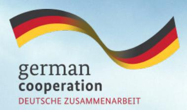

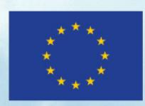

## **Published by the:**

Deutsche Gesellschaft für Internationale Zusammenarbeit (GIZ) GmbH

# **Registered oces:**

BONN AND ESCHBORN, FEDERAL REPUBLIC OF GERMANY Friedrich-Ebert-Allee 36+40 53113 Bonn, Germany

### **Imprint**

This publication was produced with the financial support of the European Union and the German Federal Ministry for Economic Cooperation and Development (BMZ). Its contents are the sole responsibility of GIZ and do not necessarily reflect the views of the EU or the BMZ.

**As at:** December 2025

# **Photo credits:**

@GIZ/ Binh Dang , @FreePik

All rights reserved. Licensed to the European Union and the German Federal Ministry for Economic Cooperation and Development under conditions.

# **Authors:**

Nguyen Lam Giang - Do Thanh Chung - Phan Tran Hong Van - Nguyen Van Toai