# **REPORT**

USE OF NATIONAL AND GLOBAL FOREST COVER MAPS TO ASSESS DEFORESTATION RISKS IN THE CONTEXT OF THE EUDR. A CASE STUDY FROM VIETNAM

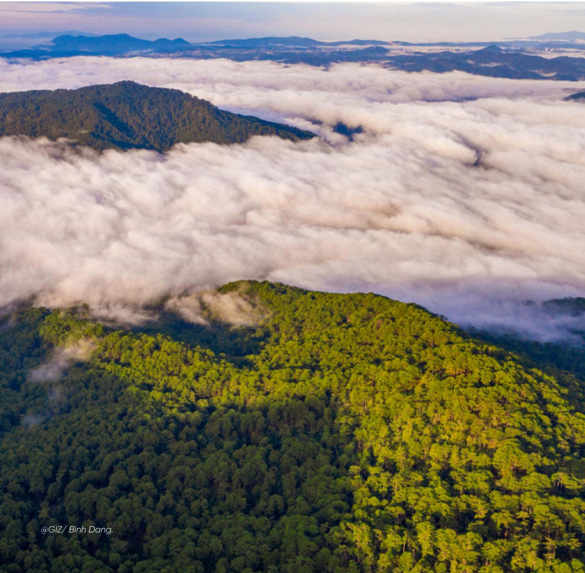

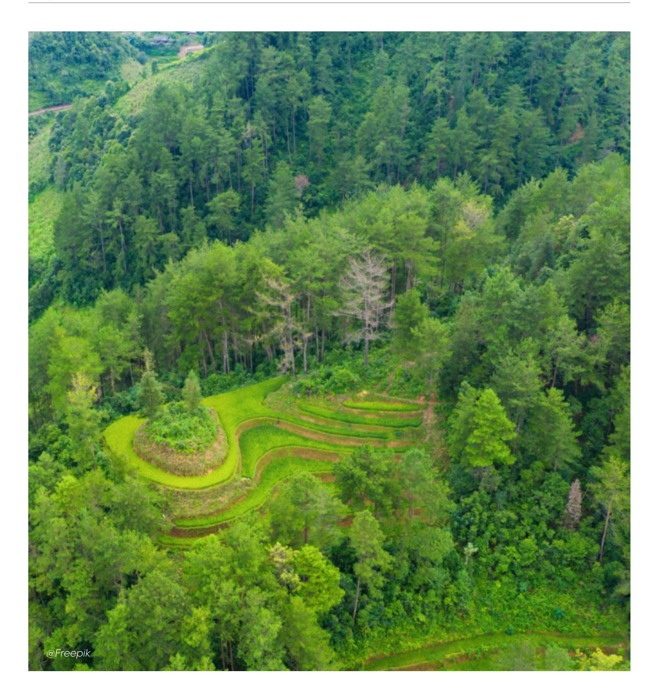

*Disclaimer: This publication was co-funded by the European Union and BMZ. The content of this publication is the sole responsibility of the authors and does not necessarily reflect the views of the EU or BMZ. The information in this study, or upon which this study is based, has been obtained from sources the authors believe to be reliable and accurate. While reasonable eorts have been made to ensure that the contents of this publication are factually correct, GIZ does not accept responsibility for the accuracy or completeness of the contents of this publication. The mention of specific companies or products of manufacturers, whether or not these have been patented, does not imply that they have been endorsed or recommended by GIZ in preference to others of a similar nature that are not mentioned. The views expressed in this information product are those of the author(s) and do not necessarily reflect the views or policies of GIZ.* 

# **TABLE OF CONTENTS**

**[LIST OF FIGURES](#page-3-0)** 04

#### **[REFERENCES](#page-45-0)** 46

**[LIST OF TABLES](#page-3-0)** 04

**[EXECUTIVE SUMMARY](#page-4-0)** 05

**[01. INTRODUCTION](#page-7-0)** 08

09 10

11

11 12

[1.1. Background on the EUDR main aspects](#page-8-0)

[1.2. Global forest cover 2020 map](#page-8-0)

(GFC 2020)

[1.3. Vietnam's forest resource database](#page-10-0)

and map system

1.4. Objectives

[1.5. Scope of the study](#page-11-0)

#### **[04. CONCLUSION AND](#page-42-0) RECOMMENDATIONS**

43

44 45

[4.1. Conclusion](#page-43-0)

[4.2. Recommendations](#page-44-0)

#### **[02. METHODOLOGY](#page-13-0)** 14

15 17 18

19

*19*

*21*

*21*

*23 23*

*23*

[2.1. Overall approach](#page-14-0)

[2.2. Collecting and standardising forest data](#page-16-0) [2.3. Assessing the forest area detected by](#page-17-0) GFC2020 v2 compared to Vietnam's

forest area

2.4. Assessing the classification accuracy of GFC 2020v2 compared to Vietnam's forest data in 04 pilot communes

*[2.4.1. Standardizing current forest status maps](#page-18-0)  of areas according to the EUDR forest* 

 *definition*

*[2.4.2. Assessing accuracy using statistical](#page-20-0)* 

 *indicators*

*2.4.2.1. Data collection and design of the theoretical assessment sample 2.4.2.2. Field-based accuracy assessment*

 *[a. Comparing area by case scenarios for](#page-22-0)* 

 *pilot communes*

 *b. Accuracy assessment using field* 

 *verification points*

| 03. RESULTS AND DISCUSSION | 25                                         |
|----------------------------|--------------------------------------------|
| 3.1.                       | Forest data of the four pilot communes     |
| 3.1.1.                     | Forest classification                      |
| 3.1.2.                     | Forest origin classification               |
| 3.2.                       | Preliminary comparison of the 2020         |
| 3.3.                       | Results of standardizing the 2020 forest   |
| 3.3.1.                     | Adjustments applied during boundary        |
| 3.3.2.                     | Standardized results of forest boundary    |
| 3.4.                       | Assessing the theoretical accuracy of the  |
| 3.5.                       | Assessing GFC2020 v2 accuracy in the field |
| 3.6.                       | Discussion                                 |

# **LIST OF FIGURES**

| Figure 1  | Location of the 04 pilot communes in the study                                                                                                                       | 12 |
|-----------|----------------------------------------------------------------------------------------------------------------------------------------------------------------------|----|
| Figure 2  | Diagram of theoretical verification points                                                                                                                           | 21 |
| Figure 3  | Location of 162 field verification points                                                                                                                            | 24 |
| Figure 4  | Overlay of the 2020 forest change status map and the GFC 2020 v2 dataset                                                                                             | 28 |
| Figure 5  | Area of regenerating trees (< 5m)                                                                                                                                    | 29 |
| Figure 6  | Agricultural cultivation area from before 2020 until now                                                                                                             | 29 |
| Figure 7  | Related to household garden area before 2020                                                                                                                         | 30 |
| Figure 8  | Chart showing the overlay results of the 2020 forest change map and the GFC 2020 v2 map                                                                              | 31 |
| Figure 9  | Area of omission in the 2020 forest change map, mistakenly classified as forest and requiring adjustment                                                             | 33 |
| Figure 10 | Area belonging to plantation forest harvested cyclically                                                                                                             | 34 |
| Figure 11 | Correcting errors during the 2020 forest map construction process in the pilot commune                                                                               | 35 |
| Figure 12 | Standardized 2020 forest boundary map for 04 pilot communes                                                                                                          | 36 |
| Figure 13 | Chart showing the comparison results of the pilot map with GFC 2020 v2 and the standardized forest boundary data of 04 communes                                      | 38 |
| Figure 14 | Examples where GFC 2020 v2 data (blue) classified as forest, but field verified as industrial crops, cassava, or regenerating trees not meeting the forest criteria. | 41 |

| Figure 1  | Location of the 04 pilot communes in the study                                                                                                                       | 12 |
|-----------|----------------------------------------------------------------------------------------------------------------------------------------------------------------------|----|
| Figure 2  | Diagram of theoretical verification points                                                                                                                           | 21 |
| Figure 3  | Location of 162 field verification points                                                                                                                            | 24 |
| Figure 4  | Overlay of the 2020 forest change status map and the GFC 2020 v2 dataset                                                                                             | 28 |
| Figure 5  | Area of regenerating trees (< 5m)                                                                                                                                    | 29 |
| Figure 6  | Agricultural cultivation area from before 2020 until now                                                                                                             | 29 |
| Figure 7  | Related to household garden area before 2020                                                                                                                         | 30 |
| Figure 8  | Chart showing the overlay results of the 2020 forest change map and the GFC 2020 v2 map                                                                              | 31 |
| Figure 9  | Area of omission in the 2020 forest change map, mistakenly classified as forest and requiring adjustment                                                             | 33 |
| Figure 10 | Area belonging to plantation forest harvested cyclically                                                                                                             | 34 |
| Figure 11 | Correcting errors during the 2020 forest map construction process in the pilot commune                                                                               | 35 |
| Figure 12 | Standardized 2020 forest boundary map for 04 pilot communes                                                                                                          | 36 |
| Figure 13 | Chart showing the comparison results of the pilot map with GFC 2020 v2 and the standardized forest boundary data of 04 communes                                      | 38 |
| Figure 14 | Examples where GFC 2020 v2 data (blue) classified as forest, but field verified as industrial crops, cassava, or regenerating trees not meeting the forest criteria. | 41 |

# **LIST OF TABLES**

| Table 1  | Assessment of forest definitions between EUDR and Vietnam's forest definition                                                                         | 19 |
|----------|-------------------------------------------------------------------------------------------------------------------------------------------------------|----|
| Table 2  | Current status of Forestry Planning Land of 04 pilot communes in 2020                                                                                 | 26 |
| Table 3  | Current forest status in the Forestry Planning Land of 04 pilot communes in 2020                                                                      | 27 |
| Table 4  | Overlay results of GFC 2020 v2 map and 2020 forest map (before forest boundary adjustment)                                                            | 30 |
| Table 5  | Summary of forest change in 2020 classified as forest needing adjustment                                                                              | 31 |
| Table 6  | Summary of forest change in 2020 classified as forest needing adjustment                                                                              | 34 |
| Table 7  | Summary of forest boundary area after adjustment                                                                                                      | 36 |
| Table 8  | Accuracy matrix of GFC forest classification results for 04 pilot communes                                                                            | 37 |
| Table 9  | Summary of general results comparing the pilot map with GFC 2020 v2 and forest boundaries after field correction in 04 pilot communes                 | 38 |
| Table 10 | Summary of detailed results by forest origin comparing the pilot map with GFC 2020 v2 and post-standardization forest boundaries in 04 pilot communes | 39 |
| Table 11 | Field point verification results                                                                                                                      | 40 |

| Table 1  | Assessment of forest definitions between EUDR and Vietnam's forest definition                                                                         | 19 |
|----------|-------------------------------------------------------------------------------------------------------------------------------------------------------|----|
| Table 2  | Current status of Forestry Planning Land of 04 pilot communes in 2020                                                                                 | 26 |
| Table 3  | Current forest status in the Forestry Planning Land of 04 pilot communes in 2020                                                                      | 27 |
| Table 4  | Overlay results of GFC 2020 v2 map and 2020 forest map (before forest boundary adjustment)                                                            | 30 |
| Table 5  | Summary of forest change in 2020 classified as forest needing adjustment                                                                              | 31 |
| Table 6  | Summary of forest change in 2020 classified as forest needing adjustment                                                                              | 34 |
| Table 7  | Summary of forest boundary area after adjustment                                                                                                      | 36 |
| Table 8  | Accuracy matrix of GFC forest classification results for 04 pilot communes                                                                            | 37 |
| Table 9  | Summary of general results comparing the pilot map with GFC 2020 v2 and forest boundaries after field correction in 04 pilot communes                 | 38 |
| Table 10 | Summary of detailed results by forest origin comparing the pilot map with GFC 2020 v2 and post-standardization forest boundaries in 04 pilot communes | 39 |
| Table 11 | Field point verification results                                                                                                                      | 40 |

# **EXECUTIVE SUMMARY**

# **EXECUTIVE SUMMARY**

The EU Deforestation Regulation (EUDR, Regulation (EU) 2023/1115) requires operators as defined by the EUDR to conduct due diligence, including geolocation of production areas and assessment of potential deforestation or forest degradation after 31 December 2020. In this context, the Global Forest Cover 2020 v3 (GFC2020 v3) map provides an important source of information for assessing the risk associated with the production of a commodity or product sourced from areas subject to deforestation or forest degradation after 2020 as a non-mandatory, non-exclusive and non-legally binding tool for risk assessment in the context of the EUDR. At the same time, Vietnam maintains a

annually through the FRMS/FORMIS platform, with field verification, high-resolution imagery and locally adapted classification rules. Further data and maps at national level are also available, with other, sometimes more accurate data at local level. In this context, the report oers guidance to operators on utilizing available forest cover maps for the year 2020 to perform an initial risk assessment for EUDR due diligence.

This study develops an EUDR-aligned 2020 forest boundary map for 4 pilot communes in Quang Trị province and compares it with GFC2020 v2, a global map of forest cover 2020.

#### **Key conclusions:**

In the framework of the EUDR, forest maps for the year 2020 can represent a key source of information for assessing the risk that a relevant commodity or a derived product was produced in areas that have been subject to deforestation after 2020, in particular in the absence of alternative more accurate sources of information. The comparative analysis conducted highlights some of the main challenges attached to using global or national forest maps for conducting due diligence, in particular by underscoring the need to assess each data source carefully in order to ensure alignment with the forest definition and to evaluate their accuracy.

While there is no obligation for stakeholders to use thematic maps, the analysis shows that the combination of dierent complementary sources of data, in this case, dierent forest maps, can provide useful information for an initial assessment of the risks of EUDR non-compliance.

#### **Key findings:**

- After standardisation, 52,320 ha (74% of forestry planning land) meets the EUDR forest definition. GFC2020 v2 detects 42,843 ha of forest, with 33,965 ha (≈65%) consistently mapped as forest by both datasets. Agreement is high in natural forest areas with stable canopy structure (Huong Phung, Khe Sanh) but lower in mixed production landscapes dominated by acacia, rubber and agricultural mosaics (Cam Lo, Hieu Giang).
- Accuracy assessments demonstrate that GFC2020 v2 achieves an Overall Accuracy of approximately 65% in the pilot area, with >80% accuracy in natural forest but substantially lower accuracy (≈20%) in fragmented or short-rotation plantation areas. These discrepancies arise from dierences of key technical definitions, the misclassification of industrial crops or other nonuses as forest, technical issues related to satellite imagery (including image striping and seamline or edge-matching artifacts), land-use
- heterogeneity, and the inherent limitations of interpreting mixed agroforestry and regenerating stands at 10 m resolution.
- While the 02 datasets yield dierent area estimates, their combined use provides important added value for operators in the context of their deforestation risk assessments. Areas where both datasets align oer higher confidence for due diligence assessments, whereas zones of disagreement highlight locations where additional evidence or targeted verification may be required. The national map demonstrates higher accuracy at national level than the GFC2020 v2 map. Dierent levels of risk can be attributed depending on the presence of forest in the combined map, the national map, or the global one. In case of higher risk of non-compliance, additional steps should be conducted with more detailed spatial data or other sources of information.

The study recommends using both data sets for assessing deforestation risks in which GFC2020 v2 serves as a global baseline and Vietnam's national forest status map functions as the local reference. Enhanced data sharing, harmonised metadata, and expanded piloting in additional regions would allow further cross-validation, improving the robustness of forest classification in Viet Nam and supporting EUDR risk assessment.

# **01. INTRODUCTION**

# **01. INTRODUCTION**

### **1.1. Background on the EUDR main aspects**

Almost 90% of worldwide deforestation is the result of agricultural expansion. A significant share of the agricultural commodities driving deforestation and traded internationally. Therefore, the EU has adopted the EU Deforestation Regulation (EUDR) to minimize the EU's contribution to deforestation and forest degradation worldwide. According to the regulation, companies placing relevant products on the EU market or exporting them from there must ensure through due diligence that they are produced in accordance with the relevant legislation of the country of production (Art. 3b) and without deforestation or forest degradation after 31st December 2020 (Art. 3a). It applies to cattle, cocoa, coee, oil palm, rubber, soy and wood as well as certain derived product, entered into force in 2023 and will be applicable for operators by December 2026, and for SMEs by mid-2027.

To ensure that relevant commodities and products placed on or exported from the EU market are produced without deforestation or forest degradation, transparency regarding their origin is imperative. Under the EUDR, operators, being the companies that place products on the EU market or exporting them from there need to fulfil their due diligence obligations to ensure deforestation-free and legal production and are responsible for submitting the geolocation with their due diligence statement. Due diligence means that these operators must collect relevant information and documents (Art. 9), conduct a risk assessment on the basis thereof (Art. 10) and – in case of a non-negligible risk of non-compliances – they must implement risk mitigation measures (Art. 11). In addition, they must submit a so-called due diligence statement confirming that the due diligence was fulfilled and no or only a negligible risk of non-compliance was found (Art. 3).

For collecting evidence and ensure deforestation risk assessments, the EUDR does not prescribe any specific sources for operators. Maps providing forest cover data aligned with the FAO forest definition used in the EUDR at the 2020 cut-o date can however be a very helpful tool for an initial assessment of the risks of EUDR non-compliance. Available maps at national or global level may be used by operators to verify the absence of forest at the cut-o date inside the plots of land they are sourcing from, and in the case of the presence of forest in some of the plots to conduct a more robust risk assessment from more detailed spatial information or other sources of data. In this regard, the Global forest cover map 2020 provided by JRC might be a helpful tool, but not the only one.

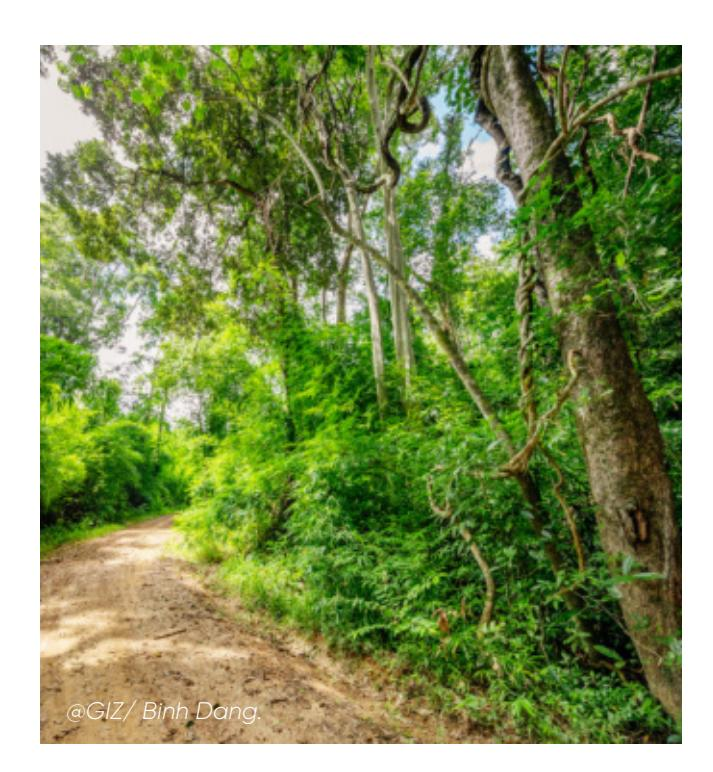

# **1.2. Global forest cover 2020 map (GFC 2020)**

The Global Forest Cover 2020 Map (GFC2020) is a harmonized global forest/non-forest layer produced by the Joint Research Centre (JRC) to support risk assessment under the EUDR. The dataset represents the presence or absence of forest at a 10-meter resolution as of 31 December 2020, applying EUDR forest definition criteria, including tree height ≥ 5 m, canopy cover ≥ 10%, a minimum area of 0.5 ha, and the exclusion of agricultural and urban land uses. Although its use is not mandatory, legally binding or the only tool for deforestation risk assessment under the EUDR, the map provides a consistent and globally comparable reference layer for assessing potential deforestation within supply areas.

GFC2020 reflects a global and standardized methodology. Version 1 (v1), released in December 2023 and version 2 (v2) released in December 2024. GFC2020 was generated by combining several global datasets—ESA WorldCover, WRI Tropical Tree Cover, UMD global land cover, Global Mangrove Watch, and JRC Tropical Moist Forests—followed by rule-based filtering to align with EUDR definitions. GFC2020 v3*01*, was released at the end of 2025. It integrates additional canopy height information and updated land-use layers to improve discrimination between natural forests and agricultural tree crops, including cacao, coee, rubber and oil palm. The revised methodology reduces omission and commission errors present in v1, particularly in plantation-dominated and peri-urban areas. GFC2020 v2, estimates the global forest area at 4,562 million hectares, with regional distributions including Africa (760 million ha), Asia (658 million ha), Europe (231 million ha), North and Central America (830 million ha), South America (931 million ha), Oceania (204 million ha) and Russia (948 million ha).

The construction of GFC2020 v2 involves two main steps: (i) assembling a composite "total tree cover" layer from multiple global products (ESA WorldCover 2020/2021, WRI Tropical Tree Cover 2020, UMD 2019, Global Mangrove Watch 2020, and JRC Tropical Moist Forests); and (ii) applying the EUDR forest definition through sequential filtering using dominant cover classes, cultivated land, built-up areas, land-use change and water bodies. Although not a legally binding dataset, GFC2020 v2 represents an important spatial reference for organizations conducting due diligence under the EUDR and will continue to be updated as new data and user feedback become available.

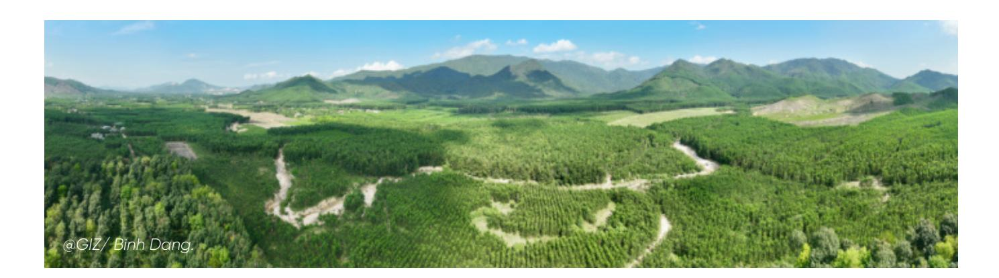

*01This study used GFC2020 v2, which was the most recent version available at the time of analysis. A subsequent update (GFC2020 v3) has since been released by JRC.*

*Source: https://data.jrc.ec.europa.eu/dataset/e554d6fb-6340-45d5-9309-332337e5bc26* 

# **1.3. Vietnam's forest resource database and map system**

Vietnam maintains a comprehensive national forest resource database that constitutes the authoritative reference for forest status and forest change monitoring across administrative levels. The 2013–2016 national forest inventory established a digital database linking forest area, timber volume and detailed forest status classes. Annual forest change monitoring has been implemented since 2019 under Circular No. 33/2018/TT-BNNPTNT, subsequently updated by Circular No. 16/2023/TT-BNNPTNT, providing the regulatory framework for nationwide forest inventory, statistical reporting and digital map maintenance.

Since 2016, the FORMIS/FRMS system has enabled continuous updates of forest-change information. District Forest Protection Units collect, verify and input field-based observations from commune level using FRMS desktop and mobile tools, ensuring coherence between ground data and digital records. Forest information is also integrated into national planning instruments, including the 2021–2030 land use planning (vision 2050), the Socio -Economic Development Plan and the National Forestry Planning adopted in 2024. Ongoing inventory eorts in key provinces continue to refine the accuracy of forest status data.

While Vietnam's mapping system provides consistent and management-oriented information, dierences in certain physical parameters between the national forest definition and the EUDR forest definition (such as minimum area and tree height thresholds) may result in spatial discrepancies when compared with global datasets such as the GFC2020 v2. Assessing the compatibility and potential combined use of national and global forest maps can contribute to improving forest boundary delineation, detecting deforestation patterns and informing risk assessments in export-oriented supply chains. Although Vietnam, as a third country, is not required to provide additional information to operators under the EUDR, government stakeholders have expressed interest in enhancing the enabling environment to support enterprises preparing for EUDR implementation. Improved interoperability and accessibility of forest information may facilitate operators' due diligence processes and contribute to smoother market access.

# **1.4. Objectives**

The study aims to provide information and guidance for individuals, organizations, and commercial entities in assessing the risk of deforestation and forest degradation in the context of the EUDR. The study focuses on following objectives:

- Developing a pilot forest map for 2020 in 04 communes of Quang Tri province, aligning with EUDR definitions and requirements.
- Compare the pilot map with GFC 2020 v2 to identify the potential of a combined use to assess deforestation risk in the EUDR context. Based on this, to develop methodologies for standardizing Vietnamese forest databases for broader application in other districts and provinces.

#### **1.5. Scope of the study**

The study is conducted in 04 communes belonging to 02 former districts in Quang Tri Province, Viet Nam:

# **Rationale for the selection of pilot sites**

The selected communes represent diverse and typical land-use patterns in Quang Tri province that are highly relevant for EUDR implementation due to the coexistence of natural forests, planted forests, and agricultural production systems associated with deforestation risks.

- Hieu Giang commune (former Cam Lo district)
- Cam Lo commune (former Cam Lo district)
- Khe Sanh commune (former Huong Hoa district)
- Huong Phung commune (former Huong Hoa district)

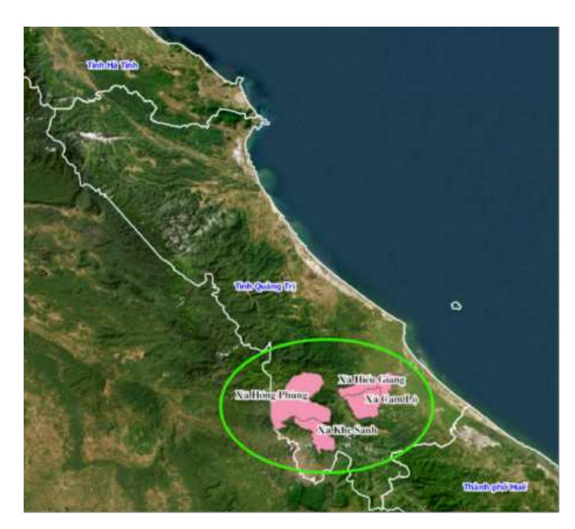

- Huong Phung and Khe Sanh communes (former Huong Hoa district): This region is the main Arabica coee production zone of Quang Tri, with approximately 3,700 ha of coee cultivation as of 2024. It also contains large areas of natural forest (around 24,000 ha) and planted timber forests (approximately 6,000 ha) adjacent to household agricultural plots. The mosaic of perennial crops, short-cycle agriculture, and regenerating vegetation creates conditions where misclassification may occur in global forest datasets such as GFC2020 v2, making it an ideal test case.
- Hieu Giang and Cam Lo communes (former Cam Lo district): Characterized by extensive rubber and acacia plantations (around 17,000 ha) and more than 1,000 ha of natural forest, the area is representative of typical production landscapes in central Viet Nam. The intermixing of plantation forests with smallholder agricultural lands and fallow cycles of 5–7 years presents complexities for distinguishing forest from agricultural tree crops proved challenging for global datasets.

*Figure 1. Location of the 04 pilot communes in the study Source: Consultant team, map generated using QGIS*

Collectively, the 04 communes provide a diverse ecological and land-use setting that is suitable for evaluating the reliability, limitations, and applicability of GFC2020 v2, while assessing how global datasets can complement local forest/land-use maps for EUDR-aligned due diligence. The findings from these pilot areas will inform the development of a scalable methodology to support broader replication across Viet Nam.

## **Box 1: Key terms and definitions used in this report**

#### **Forestry Planning Land (FPL)**

"Forestry planning land" refers to land areas, with or without forest cover, designated by a competent State authority under Viet Nam's forestry planning framework for forestry purposes, including protection, special-use and production forest functions, in accordance with the Law on Forestry (2017).

In this report, FPL represents the ocial forestry planning boundary within which forest status and forest-related land uses are monitored and managed. Land outside this boundary is classified as "Outside FPL" and typically comprises non-forestry land uses.

#### **Protection forests**

According to the Law on Forestry of Viet Nam (2017), "Protection forests" shall be mainly used to protect water resources and soil, prevent erosion/landslides/floods, combat desertification, limit disasters, regulate climate, contribute to protect the environment and national security associated with ecotourism, hospitality and entertainment; provide forest environmental services; and are classified according to their importance includng:

(a) Watershed protection forests; forests protecting water resources for communities; bordering protection forests; (b) Wind/sand shielding protection forests; protection forests for tide shielding or sea encroachment prevention.

#### **Special-use forests**

According to the Law on Forestry of Viet Nam (2017), "Special-use forests" shall forests mainly used to conserve natural forest ecosystems, forest biodiversity and genetic resources; conduct scientific research; protect historical and cultural relics, belief sites and scenic landscapes; and provide forest environmental services. Special-use forests may be associated with ecotourism, resort and recreation activities, except for strictly protected sub-zones.

#### **Production forests**

According to the Law on Forestry of Viet Nam (2017), "Production forests "shall be primarily used for provision of forest products; combined forestry-agricultural-fishery production and trade; ecotourism, hospitality and entertainment; and provision of forest entertainment services.

# **02.METHODOLOGY**

# **02. METHODOLOGY**

# **2.1. Overall approach**

The implementation approach consists of a sequence of technical activities designed to harmonise nationally available datasets, comparing forest classifications and validating agreements and discrepancies through targeted field verification.

#### **Activity 1. Compilation of input datasets**

All relevant spatial datasets for the pilot communes were collected and prepared, including:

- 1. the 2020 national forest status map (as of 31 December 2020);
- 2. the JRC Global Forest Cover 2020 v2 (GFC2020 v2); and
- 3. satellite imagery from late 2020 (PlanetScope, Landsat-8, Sentinel-2) to support visual interpretation and field planning.

#### **Activity 2. Preparation of the 2020 national forest status map**

The national forest map was standardised through reprojection, format harmonisation and data quality checks. Errors detected during topology and attribute inspection were corrected before using the dataset as a reference layer. The resulting harmonised dataset was ready for alignment with EUDR forest definitions.

#### **Activity 3. Processing and standardisation of GFC2020 v2**

GFC2020 v2 data were accessed through the EU Forest Observatory portal. Raster layers were reprojected and converted into vector formats where necessary to facilitate overlay analysis. The dataset was clipped to the boundaries of the pilot communes and compared with the national 2020 map under a unified coordinate system.

#### **Activity 4. Acquisition of ancillary satellite imagery**

Sentinel-2 scenes for the reference period were downloaded from the Copernicus Data Space platform. These images supported visual inspection of forest boundaries and land-use conditions relevant to the classification comparison.

#### **Activity 5. Accuracy assessment of GFC2020 v2**

A classification accuracy assessment was conducted for the four communes using standard confusion-matrix indicators: Overall Accuracy (OA), Producer's Accuracy (PA), User's Accuracy (UA) and F1-score. This assessment focuses on the accuracy level of GFC2020 v2 at local level and does not constitute a national accuracy assessment of the Vietnamese forest map, which is derived from a long-standing, institutionally validated forest inventory and annual update process and is therefore recognized as the national reference dataset in this study.

#### **Activity 6. Spatial comparison of forest area**

A pixel-level overlay of GFC2020 v2 and the national map enabled classification into four cases:

- Case 1: GFC forest detected outside ocial forestry - planning land boundaries.
- Case 2: Forest identified by both datasets (agreement).
- Case 3: Forest detected by GFC only (1–0 mismatch).
- Case 4: Forest detected by the national map only (0–1 mismatch). Area statistics were compiled for each case to quantify dierences in forest detection.

#### **Activity 7. Field verification and refinement of forest boundaries**

Field verification was conducted for selected locations, focusing on areas of inconsistencies between the standardised forest maps and observed field conditions relevant for EUDR risk assessment, including:

- harvested or recently replanted plantations.

- areas where forests have been converted to agriculture or other uses.
- degraded natural forest areas aected by illegal logging.

Verification results were used to interpret and explain classification dierences, and to provide qualitative evidence on forest conditions in complex land-use settings relevant for EUDR risk assessments.

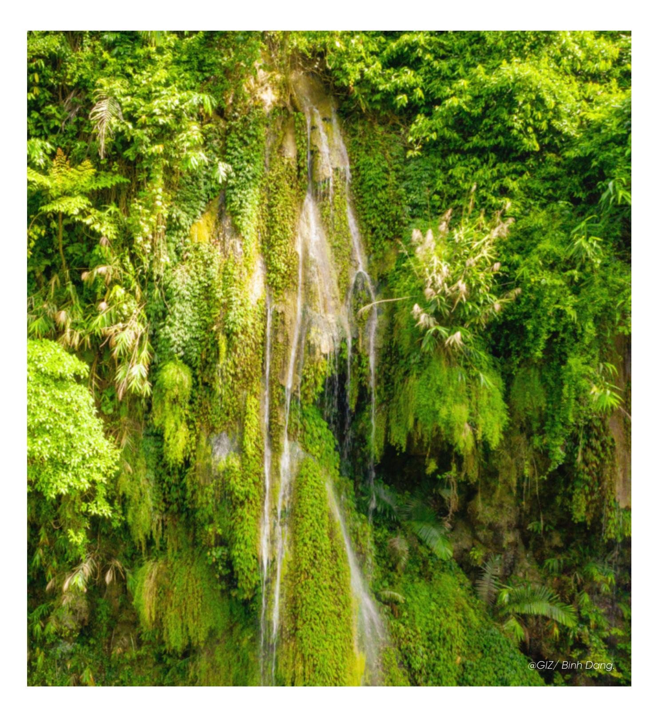

# **2.2. Collecting and standardising forest data**

The analysis relies on two primary sources of forest information: the JRC Global Forest Cover 2020 v2 (GFC2020 v2) dataset and the ocial 2020 national forest status maps of Viet Nam. Both datasets were collected and prepared to enable a consistent comparison based on the EUDR forest definition.

Both datasets were harmonised in terms of projection, spatial extent and data structure. The national forest status map was prepared as a vector dataset with polygon attributes describing forest type and status, while the GFC2020 v2 layer remained in raster format. Standardisation ensured that subsequent spatial overlay, pixel-level comparison and accuracy assessment were conducted under a unified technical framework.

- GFC2020 v2 dataset: GFC2020 is provided as a global 10 m GEOTIFF raster layer, with binary values indicating forest (1) and non-forest (0) as of 31 December 2020. The subset covering Viet Nam was downloaded from the EU Forest Observatory and reprojected to a common coordinate system (WGS84 / VN-2000), ensuring spatial compatibility with national administrative boundaries and forest status maps. No thematic reclassification was applied, and the dataset was used as published by JRC.
- Vietnamese 2020 forest status data: The Vietnamese national forest status map for 2020 represents the ocially validated forest extent as of 31 December 2020. It is built upon the National Forest Inventory and Statistics Project (2013–2016), which established a reliable baseline on forest extent, stock and condition at the level of forest compartments and plots.
- Since 2016, forest data have been continuously updated through the national forest monitoring information system (FORMIS/FRMS) in accordance with national regulations (Circular No. 33/2018/TT-BNNPTNT, as amended by Circular No. 16/2023/TT-BNNPTNT). District-level Forest Protection Units collect annual forest change information from the commune level, conduct field verification and administrative cross-checks, and update forest changes on a
- harmonised national digital map, supported by satellite imagery and ground observations.
- The period from 2016 to 2020 is bridged through a cumulative and standardised forest change updating process, in which changes such as deforestation, land-use conversion, forest recovery or new planting are recorded only after field verification and administrative validation. This represents a continuous update of a single baseline dataset rather than interpolation or the reconstruction of independent maps for individual years, ensuring continuity and traceability of the status of forest at the 2020 reference date
- The national forest status map represents the ocially validated forest extent of Viet Nam as of 31 December 2020. This dataset was published by MARD under Decision No. 1558/QĐ-BNN-TCLN (13 April 2021) and forms part of the national forest resource monitoring system (FORMIS/FRMS). For the 04 pilot communes, Hieu Giang, Cam Lo, Khe Sanh and Huong Phung, the corresponding 2020 forest status layers were extracted from the FRMS database maintained by the Quang Tri Provincial Forest Protection Department. These digital maps are harmonized within the national FORMIS system and provide the ocial reference for local forest classification.

# **2.3. Assessing the forest area detected by GFC2020 v2 compared to Vietnam's forest area**

The comparison between GFC2020 v2 and Viet Nam's 2020 forest status data requires a clear understanding of the forest definitions applied in each system. The EUDR definition classifies forest as land with an area ≥ 0.5 ha, canopy cover ≥ 10 %, and trees reaching or capable of reaching 5 m height. Viet Nam's national definition includes similar structural criteria but allows a minimum area of 0.3 ha and adopts flexible height thresholds depending on ecological site conditions (e.g. 1–5 m for rocky, wetland or sandy areas).

In the pilot communes of Huong Phung and Khe Sanh, natural forests on earthen hills commonly exceed 5 m in height, meaning that both the EUDR and Vietnamese forest definition criteria converge for most forest areas. In contrast, parts of western Cam Lo contain rocky mountain ecosystems where Vietnamese regulations permit recognition of forest at lower tree heights. These ecological dierences partially explain the expected discrepancies in forest area between GFC2020 v2 and the national map.

To quantify these dierences, forest area calculations were performed using both datasets under consistent spatial boundaries. GFC2020 v2 was accessed through the Google Earth Engine (GEE) platform, where the forest rasters were clipped to the administrative boundaries of the four communes. Forest extent was calculated using ee.Image.pixelArea(), providing area statistics for each commune. The platform also allows export of clipped rasters or vectorised versions for further processing in desktop GIS environments.

The national 2020 forest status map was processed using equivalent spatial boundaries to ensure comparability. Area statistics were generated in QGIS using standard geoprocessing tools (clip, dissolve, raster-to-vector conversion where needed).

The discrepancy between the forest areas detected by GFC2020 v2 and by the ocial Vietnamese 2020 forest status dataset (Decision No. 1558/QĐ-BNN-TCLN) was then computed for each commune. This comparison forms the basis for evaluating alignment between the two reference systems, identifying areas of systematic divergence, strengths and weaknesses of both data sets and assessing the suitability of GFC2020 v2 for local-scale EUDR risk assessment.

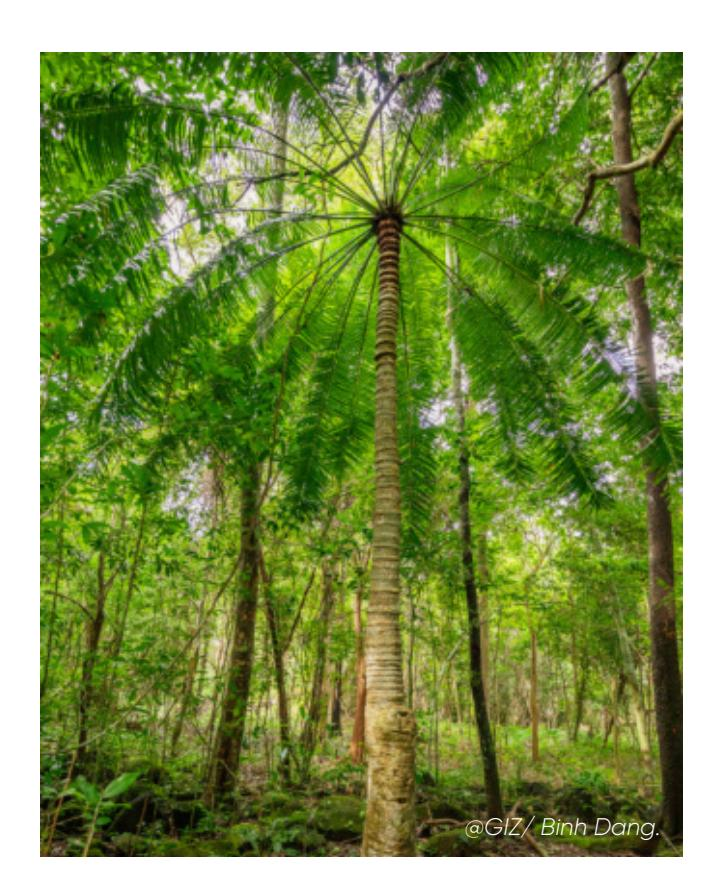

# **2.4. Assessing the classification accuracy of GFC 2020v2 compared to Vietnam's forest data in 04 pilot communes**

#### **2.4.1. Standardizing current forest status maps of areas according to the EUDR forest definition**

Given that the Vietnamese 2020 forest status map originates from the National Forest Inventory and Statistics Project (2013–2016), based on SPOT-5 imagery (2.5 m resolution) and rigorous field validation, it provides a reliable reference dataset for local-scale comparison. Its methodological basis, defined in Decision No. 594/QĐ-TTg (2013) and Decision No. 3183/QĐ-BNN-TCLN (2012), ensures consistency and scientific robustness. For this study, the 2020 forest status data of Hieu Giang, Cam Lo, Huong Phung and Khe Sanh were standardised to align with the EUDR definition. The workflow included:

- Extracting forest polygons and merging them into a unified layer.
- Splitting non-contiguous areas into individual polygons.
- Removing polygons < 0.5 ha.
- Excluding non-forest land uses (agriculture, transport, water bodies) based on map interpretation, satellite imagery and field observations.

• Converting the harmonised forest map to a 10 m binary raster (1 = forest; 0 = non-forest).

This produces an EUDR-comparable reference dataset suitable for pixel-level comparison with GFC2020 v2.

*Table 1.* Assessment of forest definitions between EUDR and Vietnam's forest definition

| Criteria EUDR definition                 | Vietnam definition                                 | Assessment of similarity                                                                                                                           |
|------------------------------------------|----------------------------------------------------|----------------------------------------------------------------------------------------------------------------------------------------------------|
| Cover / Canopy                           |                                                    |                                                                                                                                                    |
| reforestation, areas                     |                                                    |                                                                                                                                                    |
| temporarily lacking trees                |                                                    |                                                                                                                                                    |
| but expected to                          |                                                    |                                                                                                                                                    |
| Minimum cover                            | 10% higher) for both natural and planted forests.  | (0.1 or Completely Similar.                                                                                                                        |
| Minimum                                  | 0.3                                                | ha                                                                                                                                                 |
| Very                                     | flexible                                           | depending                                                                                                                                          |
| Clearly                                  | divided                                            | into                                                                                                                                               |
| Natural                                  | Forest                                             | and                                                                                                                                                |
| Minimum Area Minimum 0.5 ha. Tree Height | (contiguous area) for both types of forest.        | Similar in principle, dierent in value. Vietnam sets a lower threshold to align with practical reality. Major Dierence. Vietnam’s                |
| criterion applied generally).            | on forest type and site                            | criteria are adjusted to                                                                                                                           |
| 5.0 m). Included Objects                 | conditions (from 1.0 m to Planted Forest. Includes | recognize specific ecosystems that do not reach the 5-meter height. High Similarity. Both cover regenerating areas, but Vietnam classifies them in |
| regenerate. harvest.                     | regenerating forests after                         | more detail for management purposes.                                                                                                               |

| Exclusions (Land         |             |                          |
|--------------------------|-------------|--------------------------|
| Planted forest &         |             |                          |
| Agricultural tree        |             |                          |
| Explicitly excludes land |             |                          |
| primarily used for       |             |                          |
| agriculture or urban     |             |                          |
| forests established      |             |                          |
| through planting or      |             |                          |
| deliberate seeding,      |             |                          |
| provided that planted    |             |                          |
| trees constitute the     |             |                          |
| planted forest that is   |             |                          |
| intensively managed,     |             |                          |
| spacing, and includes    |             |                          |
| Agroforestry systems are |             |                          |
| used for agricultural    |             |                          |
| production, even if      |             |                          |
| Forests                  | established | by                       |
| land,                    |             | through                  |
| improvement              |             | of natural               |
| forests,                 | or          | through                  |
| replanting               |             | or                       |
| regeneration             |             | after                    |
| harvesting               | of          | planted                  |
| forests,                 |             | including                |
| production,              |             | protection               |
| Generally                | classified  | as                       |
| agricultural             |             | land; not                |
|                          |             | Completely Similar. In   |
|                          |             | terms of practical       |
|                          |             | count agricultural and   |
|                          |             | Similar in principle;    |
|                          |             | versus management        |
|                          |             | systems exclude          |
|                          |             | classification, though   |
|                          |             | implementation may       |
|                          |             | Completely similar.      |
|                          |             | Dierences arise mainly  |
|                          |             | rather than definitional |

Overall, Vietnam's definition is broader due to its adaptive height threshold and smaller minimum mapping unit, particularly for special ecological site types. These definitional dierences explain part of the spatial discrepancies observed when comparing GFC2020 v2 with the national dataset.

#### **2.4.2. Assessing accuracy using statistical indicators**

#### **2.4.2.1. Data collection and design of the theoretical assessment sample**

To assess the level of agreement of data from GFC2020 v2 and the 2020 national forest map, a theoretical sampling framework was established for 04 pilot communes. A systematic grid of 500 m × 500 m was generated across the study area, and one verification point was placed per grid cell, maintaining a minimum spacing of 500 m between points. Points falling within forestry planning land were retained, covering both forest and non-forest classes (e.g., agricultural land, shrub/bare land). A total of 3,811 theoretical points were created*02*:

- Huong Phung: 1,730 points
- Khe Sanh: 584 points
- Hieu Giang: 743 points
- Cam Lo: 754 points

A systematic grid of 500 m × 500 m was generated across the study area, and one verification point was placed at the centre of each grid cell, ensuring a minimum spacing of 500 m between points. Points falling within the forestry planning land were retained, covering both forest and non-forest classes, including agricultural land, shrubland and bare land. This design ensures a balanced and spatially representative theoretical sample across dierent land-use and forest conditions within the pilot communes.

The spatial distribution of these points is illustrated in Figure 2 below.

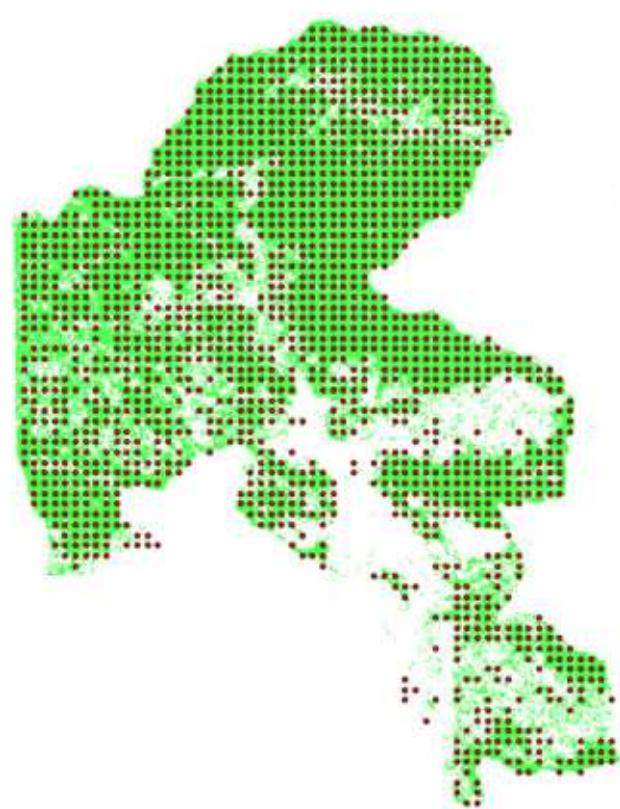

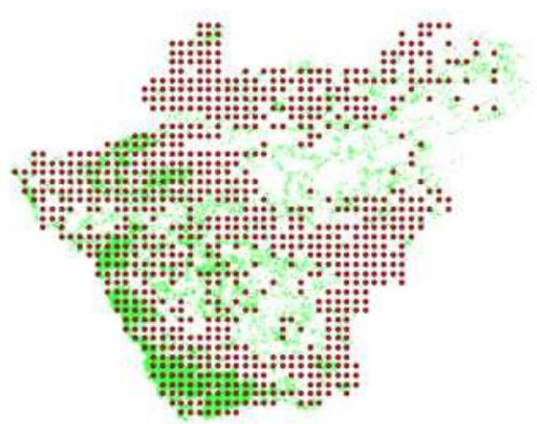

*Figure 2. Diagram of theoretical verification points Source: Consultant team, map generated using QGIS*

*02 In this study, a "theoretical point" refers to a systematically generated sampling point derived from a regular spatial grid and used exclusively for desk-based, map-to-map comparison. These points do not represent ground truth observations and are not intended to validate the GFC2020 v2 product in absolute terms. Instead, they serve as reference locations to quantify spatial agreement and disagreement between the two forest datasets under a consistent spatial framework* 

This theoretical sample is not intended to validate the global GFC2020 v2 product but rather to quantify local spatial discrepancies in forest and non-forest classification between GFC2020 v2 and the national 2020 forest dataset. In this context,

**a. Overall Accuracy (OA)** is the percentage of sample points accurately classified relative to the total number of samples. OA represents the general accuracy of the classification map.

**b. Producer's Accuracy (PA)** is the ratio of points belonging to class \$i\$ in reality that are correctly classified by the map. PA reflects the extent to which the map does not omit points belonging to class i

$$OA = \frac{\sum_{i=1}^k n_i}{N}$$

$$PA_i = \frac{n_i}{\sum_{j=1}^k n_{ij}}$$
 Where:  $i, n_i$  is the number of correctly classified points.

**c. User's Accuracy (UA)** is the ratio of points classified into class \$i\$ on the map that actually belong to that class in reality. UA reflects the reliability when users rely on the map.

$$UA_i = \frac{n_{ii}}{\sum_{j=1}^k n_{ji}}$$

**d. F1-score** is an indicator assessing the balance between the ability to detect correctly (PA) and the reliability of the classification (UA). A high F1-score means good classification performance both technically and practically. The F1-score is the harmonic mean between PA and UA for classification class i.

$$F_{1j} = 2x \frac{PA_i \times UA_i}{PA_i + UA_i}$$

These indicators collectively describe the overlap of GFC2020 v2 classification relative to the national reference dataset in the four communes.

these dierences are assessed at an aggregate level and expressed through standard accuracy metrics. A confusion matrix (2 × 2) was used to compare forest (1) and non-forest (0) classifications, from which four standard accuracy metrics were derived:

#### **2.4.2.2. Field-based accuracy assessment**

#### **a. Comparing area by case scenarios for pilot communes**

Comparisons between GFC2020 v2 and the 2020 national forest map were classified into 04 cases

- Case 1: Area detected as forest by GFC but located outside Vietnam's Forestry Planning Land.
- Case 2: GFC detects forest (1); Current status map shows forest (1) match.
- Case 3: GFC detects forest (1); Current status map shows non-forest (0) mismatch.
- Case 4: GFC detects non-forest (0); Current status map shows forest (1) mismatch.

The area comparison results will allow calculation of the accuracy rate of GFC 2020v2 compared to the current forest status data of the pilot areas. This is also the basis for assessing the reliability level of GFC 2020v2 forest classification results in these areas.

#### **b. Accuracy assessment using field verification points**

Field verification was carried out to assess the overlap of the "forest / non-forest" classification between GFC2020 v2 and the harmonised 2020 national forest map. A total of 162 verification points were selected in the two pilot districts, with support from district Forest Protection Departments. Points were stratified to represent locations where the two datasets disagreed, specifically:

- (1–0) GFC2020 v2 identifies forest while the national map indicates non-forest.
- (0–1) GFC2020 v2 identifies non-forest while the national map indicates forest.

These locations are critical for understanding the nature of misclassification in both datasets and for documenting typical sources of divergence, such as harvested or recently replanted plantations, land converted to agriculture after 2020 or degraded

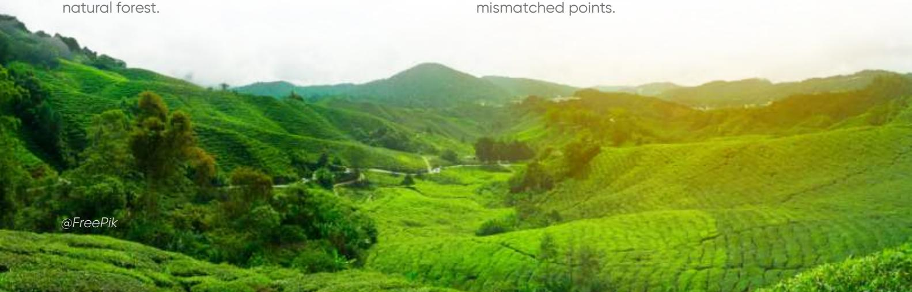

At each verification point, field observations were used to confirm the actual land cover status and assess whether the classification assigned by each dataset was correct. The results were summarised through a confusion matrix, enabling the calculation of standard accuracy metrics- Overall Accuracy (OA), Producer's Accuracy (PA), User's Accuracy (UA) and F1-score. These indicators provide a transparent and quantitative basis for evaluating the reliability of each dataset in the ecological and land-use conditions found in the pilot communes.

To complement the field verification, the accuracy of the national 2020 forest status map was also examined by comparing field observations with the mapped classification. Errors were computed at the class level and as an overall error rate using standard formulas based on the proportion of mismatched points.

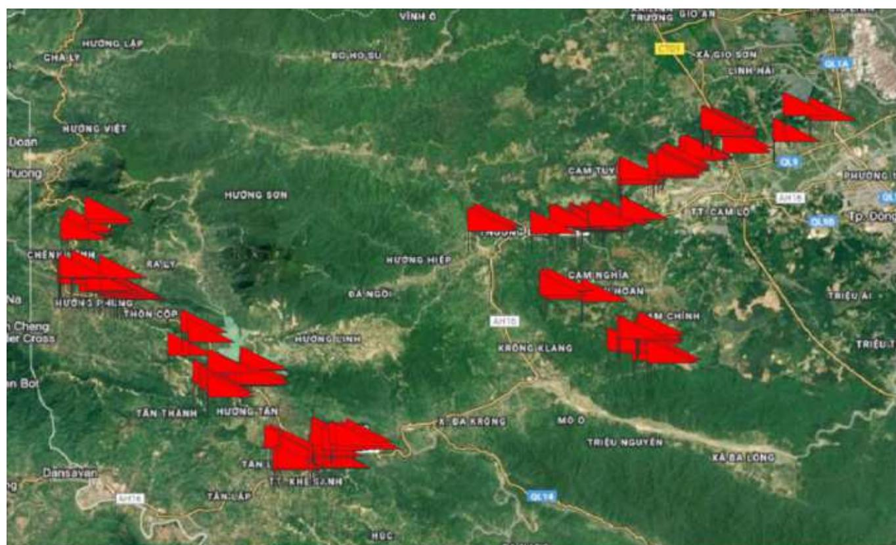

*Figure 3. Location of 162 field verification points Source: Google Earth imagery (2020), analysed by the consultant team*

Together, these assessments allow a robust evaluation of the classification performance of GFC2020 v2 and the national dataset at local scale and help identify the conditions under which discrepancies are most likely to occur.

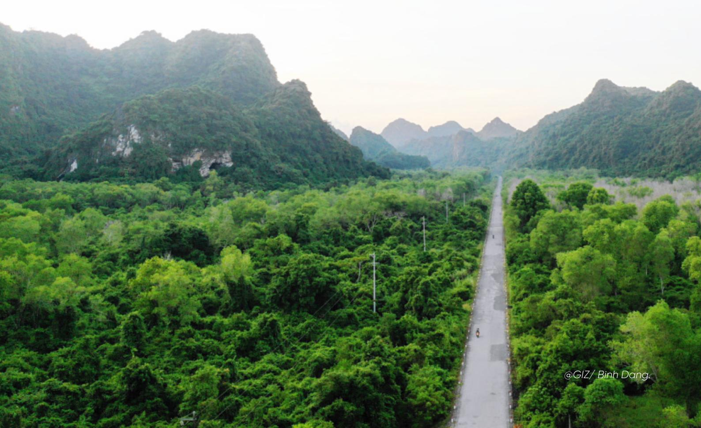

# **RESULTS AND 03.DISCUSSION**

# **03. RESULTS AND DISCUSSION**

# **3.1. Forest data of the four pilot communes extracted from FRMS (2020)**

#### **3.1.1. Forest classification**

Based on Article 5 of the 2017 Forestry Law, the forest status data of the 04 communes were standardised through attribute harmonisation, correction of geometric inconsistencies, and incorporation of natural forest areas previously located outside the ocial FPL. All areas were recalculated using the VN2000 projection (central meridian 106°).

The total FPL area in the four communes is 70,472.16 ha, representing 97.5% of the area included in the 2020 forest change monitoring map; 1,773.72 ha lie outside the FPL boundary.

The distribution by forest type is as follows:

- **Protection forest***03*: 20,165.08 ha (28.61%)
- **Special-use forests***04*: 11,210.75 ha (15.91%)
- **Production forest***05*: 38,882.24 ha (55.48%)

*Table 2. Current status of Forestry Planning Land of 04 pilot communes in 2020 (Unit: ha)*

|    | Commune     | Total     | Within Forest Planning Land |             |            |           | Outside FPL O |
|----|-------------|-----------|-----------------------------|-------------|------------|-----------|--------------------------|
| No |             |           | Protection                  | Special-use | Production | Total     |                          |
|    |             |           | Forest                      | forests     | Forest     |           |                          |
| 1  | Cam Lo      | 10.902,10 | 1.614,33                    | 131,19      | 8.659,85   | 10.405,37 | 496,73                   |
| 2  | Hieu Giang  | 11.793,54 | 21,98                       | 524,44      | 10.926,02  | 11.472,44 | 321,10                   |
| 3  | Huong Phung | 39.524,85 | 14.920,78                   | 10.556,02   | 13.386,86  | 38.863,66 | 661,19                   |
| 4  | Khe Sanh    | 10.025,39 | 3.607,99                    |             | 6.122,70   | 9.730,69  | 294,70                   |
|    | Total       | 72.245,88 | 20.165,08                   | 11.211,65   | 39.095,43  | 70.472,16 | 1.773,72                 |

*Source: Data from FRMS, Quang Tri Forest Protection Department, 2020*

Under Viet Nam's Forestry Law (2017), forestry planning land is classified into three management categories: protection forest, special-use forests, and production forest. These categories reflect national forest management objectives and land-use planning priorities. While they are not part of the EUDR forest definition, which is based on biophysical criteria rather than management purpose, they provide important contextual information on forest distribution and management regimes within the pilot communes. In the EUDR context, all three categories may qualify as forests if they meet the applicable biophysical criteria at the 2020 cut-o date.

*03 According to the Law on Forestry of Viet Nam (2017 for the legal classification of forest types, refer to Box 1: Key terms and definitions used in this report.*

*04 According to the Law on Forestry of Viet Nam (2017) for the legal classification of forest types, refer to Box 1: Key terms and definitions used in this report*

*05 According to the Law on Forestry of Viet Nam (2017), for the legal classification of foresttypes, refer to Box 1:* 

*Key terms and definitions used in this report.*

*06 According to the Law on Forestry of Viet Nam (2017), refer to Box 1: Key terms and definitions used in this report.*

#### **3.1.2. Forest origin classification**

Within the forestry planning land, 49,849.72 ha (71%) meet forest definition criteria, while 20,622.44 ha (29%) are classified as non-forest. Forest areas include both natural forests and planted forests, with commune-level distribution summarised in Table 3.

# **3.2. Preliminary comparison of the 2020 national forest map and GFC2020 v2**

A preliminary overlay between the national 2020 forest status map (before boundary adjustment) and the GFC2020 v2 dataset reveals several key patterns.

- Total overlapping area: both data sources indicate forest, accounting for 47% of the total forestry planning land. This percentage represents the spatial intersection where both the national forest map and the GFC2020 v2 dataset consistently identify forest, rather than the total forest extent indicated by either dataset individually. It therefore provides an initial indication of areas of agreement between the 02 data sources.

*Table 3. Current forest status in the Forestry Planning Land of 04 pilot communes in 2020 (Unit: ha)*

|    | Commune      | Total            | Area with Forest | Non-Forest       |
|----|--------------|------------------|------------------|------------------|
| No | Commune      | Total            | Natural Forest   | Planted Forest   |
| 1  | Hieu Giang   | <b>10.405,37</b> | 9.184,37         | 7.547,13         |
| 2  | Huong Phung  | <b>11.472,44</b> | 9.954,64         | 9.846,66         |
| 3  | Khe Sanh     | <b>38.863,66</b> | 26.240,74        | 4.694,31         |
| 4  | Hieu Giang   | <b>9.730,69</b>  | 4.469,97         | 1.778,37         |
|    | <b>Total</b> | <b>70.472,16</b> | <b>49.849,72</b> | <b>23.866,47</b> |

*Source: Data from FRMS, Quang Tri Forest Protection Department, 2020*

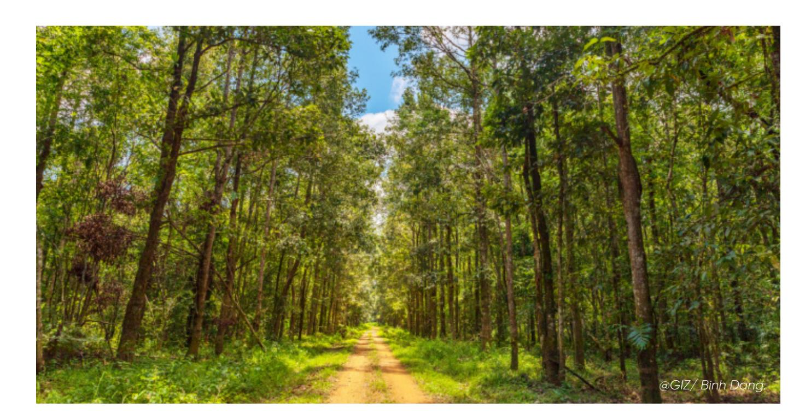

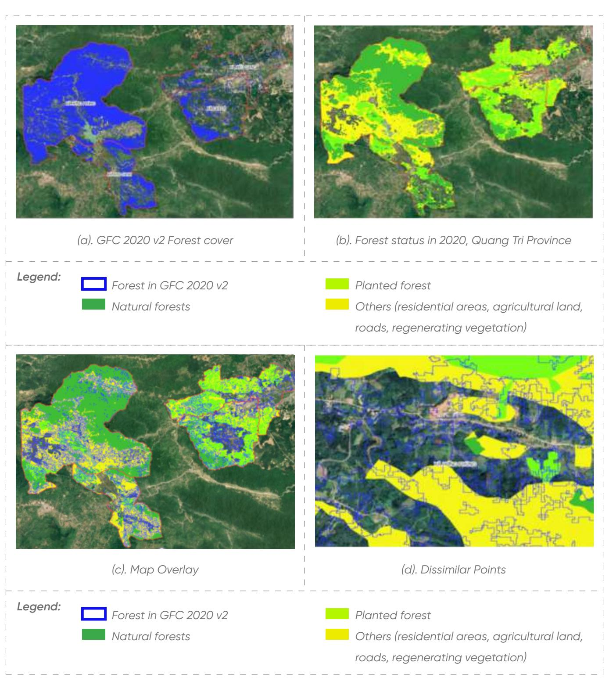

*Figure 4. Overlay of the 2020 forest change status map and the GFC 2020 v2 dataset Source: Consultant team, map generated using QGIS*

- Total area where forest change data (DBR) shows forest, but JRC shows non-forest, accounts for 24% of the total forestry planning land.
- Total area where only JRC data shows forest, but forest change data shows non-forest, accounts for 6% of the total forestry planning land. + 3% belongs to the regenerating tree status group (< 5 m);

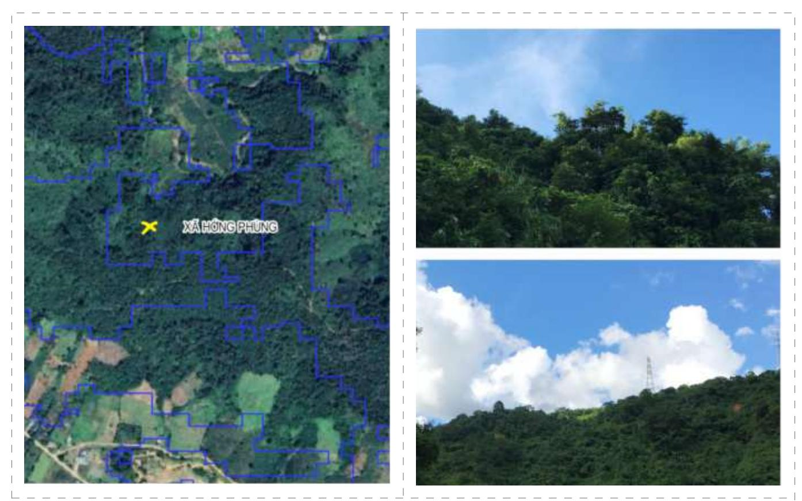

*Legend: Forest in GFC 2020 v2* 

*Legend:*

*Figure 5. Area of regenerating trees (< 5m) Source: Consultant team, map generated using QGIS*

*Figure 6. Agricultural cultivation area from before 2020 until now Source: Consultant team, map generated using QGIS*

+ 2% is agricultural cultivation (including rice, cassava, corn, coee) before 2020;

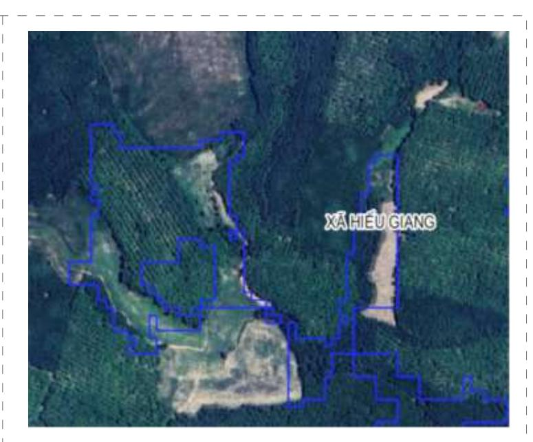

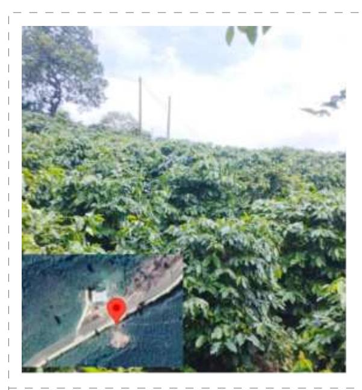

*Forest in GFC 2020 v2* 

*Legend:*

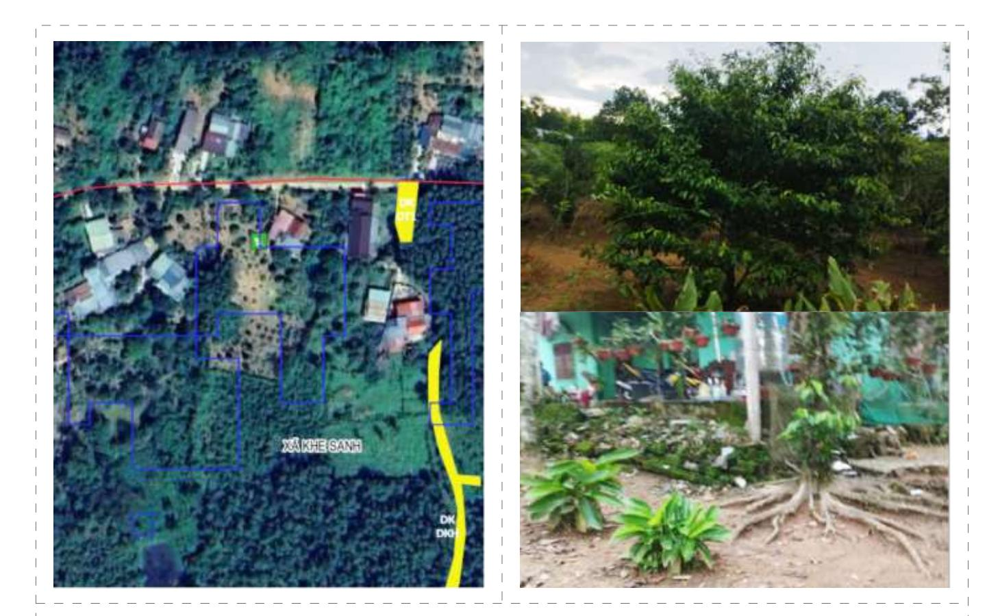

*Figure 7. Related to household garden area before 2020 Source: Consultant team, map generated using QGIS*

*Table 4. Overlay results of GFC 2020 v2 map and 2020 forest map (before forest boundary adjustment) (Unit: ha)*

- Total area where both data sources indicate non-forest accounts for 23%.
- Area outside the forestry planning land is 1,773.72 ha, which was removed during the forest boundary delineation process. This area does not include industrial tree crops, such as coee or rubber plantations.

Details for the pilot communes are in the following table:

|    |              |                  | Within Forestry Planning Land |                     |                     |                     |                 |
|----|--------------|------------------|-------------------------------|---------------------|---------------------|---------------------|-----------------|
| No | Commune      | Total            | Overlapping Area              | Only map has forest | Only GFC has forest | Both are non-forest | Outside FPL     |
| 1  | Cam Lo       | 10.405,37        | 2.585,39                      | 6.598,98            | 56,80               | 1.164,20            | 496,73          |
| 2  | Hieu Giang   | 11.472,44        | 1.113,31                      | 8.841,33            | 23,94               | 1.493,86            | 321,10          |
| 3  | Huong Phung  | 38.863,66        | 25.273,05                     | 967,69              | 4.148,67            | 8.474,25            | 661,19          |
| 4  | Khe Sanh     | 9.730,69         | 3.875,57                      | 594,40              | 327,59              | 4.933,13            | 294,70          |
|    | <b>Total</b> | <b>70.472,16</b> | <b>32.847,32</b>              | <b>17.002,40</b>    | <b>4.557,00</b>     | <b>16.065,44</b>    | <b>1.773,72</b> |

*Forest in GFC 2020 v2* 

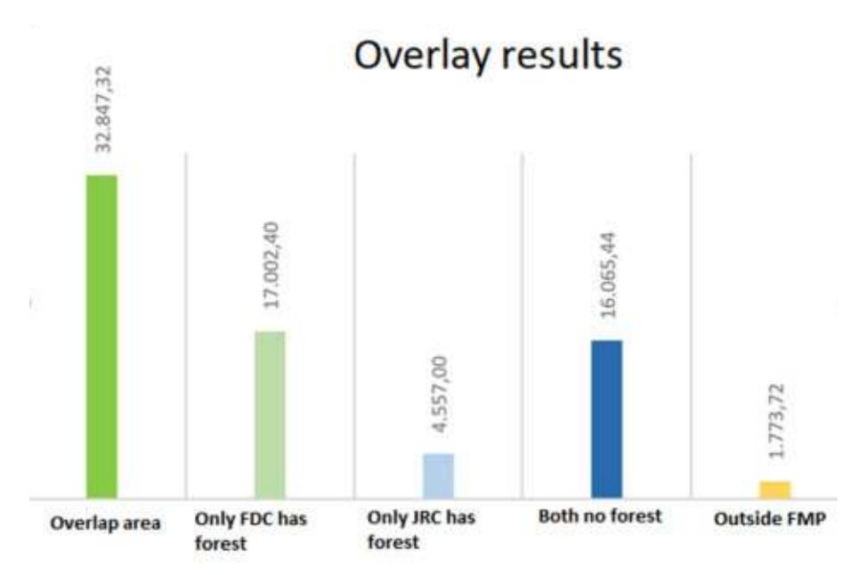

*Figure 8. Chart showing the overlay results of the 2020 forest change map and the GFC 2020 v2 map*

# **3.3. Results of standardizing the 2020 forest boundary in 04 pilot communes**

#### **3.3.1. Adjustments applied during boundary delineation**

Adjustments during boundary delineation through the overlay process on satellite imagery, the 2024 forest change data, and field verification results, some areas need adjustment as follows:

(1) Adjusting current forest status to another status:

Total area requiring adjustment reduction from forest area to other land types is 192.06 ha; consisting of 189.08 ha of planted forest and 2.98 ha of natural forest:

- Other land (with construction works): 100.3 ha (52.2%)
- Transport land: 53.18 ha (27.7%)
- Water bodies: 22.91 ha (11.9%)
- Annual agricultural cultivation: 15.67 ha (8.2%)

*Table 5. Summary of forest change in 2020 classified as forest needing adjustment (Unit: ha)*

| No | Commune      | Other land   | Transportation | Water surface | Agriculture  | Total         |
|----|--------------|--------------|----------------|---------------|--------------|---------------|
|    |              |              |                |               |              |               |
| 1  | Cam Lo       | 62,77        | 4,24           | 7,49          | 6,31         | 80,81         |
| 2  | Hieu Giang   | 34,75        | 33,87          | 9,16          | 1,19         | 78,97         |
| 3  | Huong Phung  | 2,08         | 5,48           | 4,97          | 7,51         | 20,04         |
| 4  | Khe Sanh     | 0,7          | 9,59           | 1,29          | 0,66         | 12,24         |
|    | <b>Total</b> | <b>100,3</b> | <b>53,18</b>   | <b>22,91</b>  | <b>15,67</b> | <b>192,06</b> |

In total, 192.06 ha were reclassified from forest to other land-use categories. This represents approximately 0.39% of the total forest area before standardisation and 0.37% after standardisation across the four pilot communes, indicating that the overall level of misclassification in the original 2020 forest boundary was very limited.

Of the total adjusted area, 189.08 ha (98.4%) correspond to planted forest and only 2.98 ha (1.6%) to natural forest, confirming that misclassification predominantly aected plantation areas locate in

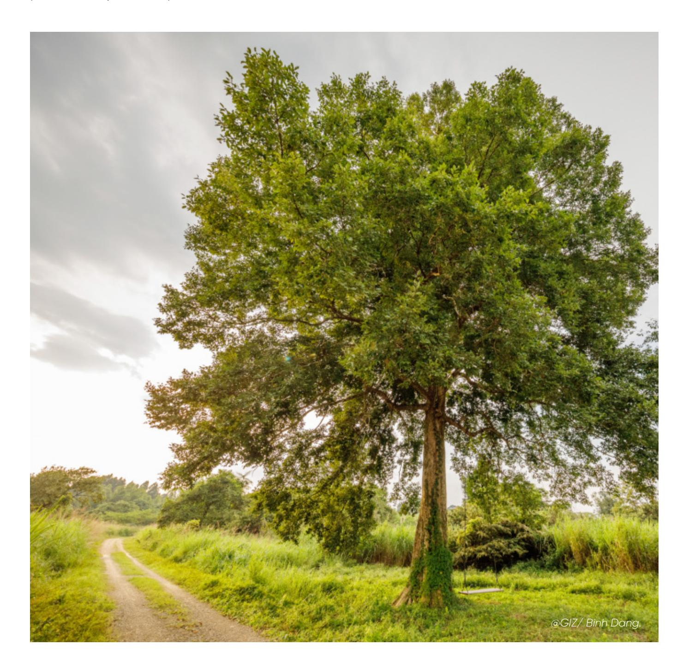

heterogeneous or infrastructure-dominated landscapes.

Importantly, field verification and interpretation of multi-temporal satellite imagery confirm that these land-use conversions occurred before 2020, prior to the EUDR cut-o date. Consequently, they do not constitute deforestation under the EUDR but rather reflect inaccuracies in the initial forest/non-forest delineation of the 2020 map.

*Forest area converted to other land (with construction works, water bodies) before 2020*

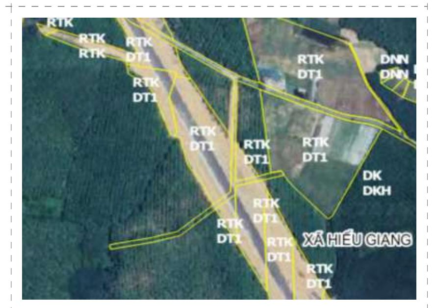

*Forest area converted to transport status before 2020*

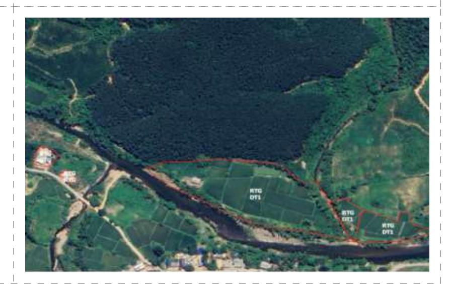

*Forest area converted to agricultural cultivation status (rice) before 2020*

*Figure 9. Area of omission in the 2020 forest change map, mistakenly classified as forest and requiring adjustment Source: Google Earth imagery (2020), analysed by the consultant team*

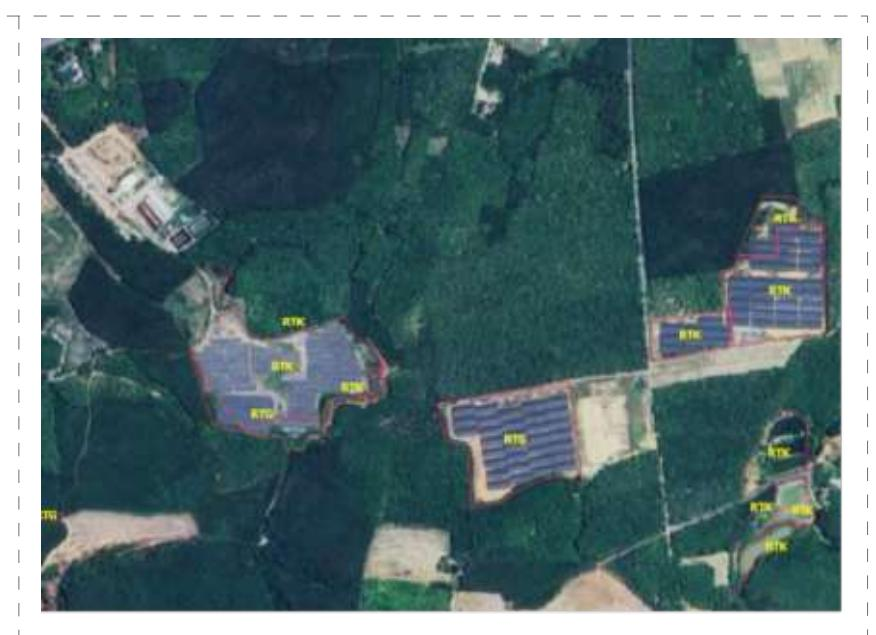

(2) Adjusting current status to align with management reality:

*Table 6. Summary of forest change in 2020 classified as forest needing adjustment (Unit: ha)*

| No | Commune      | Planted forest after harvest | Natural forest due to discrepancy | Planted forest converted to natural forest |           |
|----|--------------|------------------------------|-----------------------------------|--------------------------------------------|-----------|
| 1  | Cam Lo       | 511,55                       | 0,30                              | 3,39                                       | 1,65      |
| 2  | Hieu Giang   | 421,92                       |                                   |                                            |           |
| 3  | Huong Phung  | 1.366,51                     | 149,52                            |                                            | 28,74     |
| 4  | Khe Sanh     | 197,69                       | 14,92                             |                                            | 15,61     |
|    | <b>Total</b> | <b>2.497,67</b>              | <b>164,74</b>                     | <b>3,39</b>                                | <b>46</b> |

The data show that, compared to the original 2020 forest change dataset, a total area of 2,662.41 ha was adjusted, corresponding to approximately 5.1% of the total forest area after standardisation in the 04 pilot communes.

This adjusted area is dominated by planted forests after harvest, accounting for 2,497.67 ha (93.8%), which represent plantation areas temporarily lacking tree cover in 2020 but already replanted or expected to regenerate as part of the normal forest management cycle. The remaining 164.74 ha (6.2%) correspond to natural forest areas aected by minor discrepancies in the original classification.

Importantly, all these adjustments relate to situations that occurred before the EUDR cut-o date. As such, they do not constitute deforestation or aorestation under the EUDR but solely represent misclassification in the original 2020 forest boundary map, which was corrected during the standardisation process.

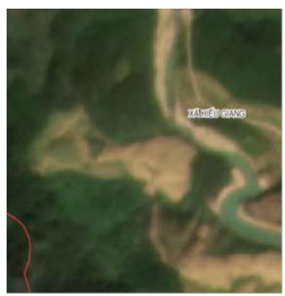

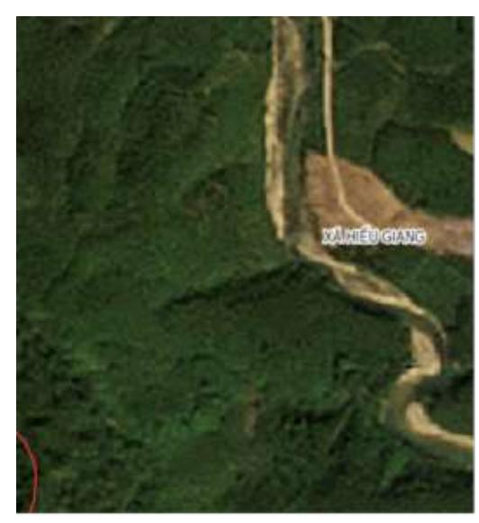

In addition, correcting omissions during the 2020 map construction process required adjusting 3.39 ha from planted forest to natural forest (0.13%) and 46 ha from natural forest to planted forest (1.73%). The results were consulted with the management agency, Cam Lo-Dong Ha Forest Protection Department.

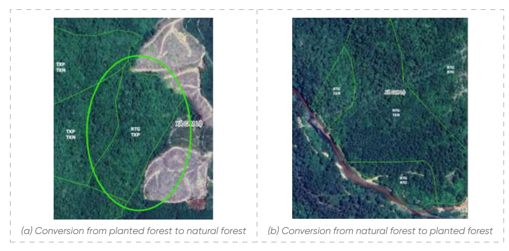

*Figure 11. Correcting errors during the 2020 forest map construction process in the pilot commune Source: Google Earth imagery (2020), analysed by the consultant team*

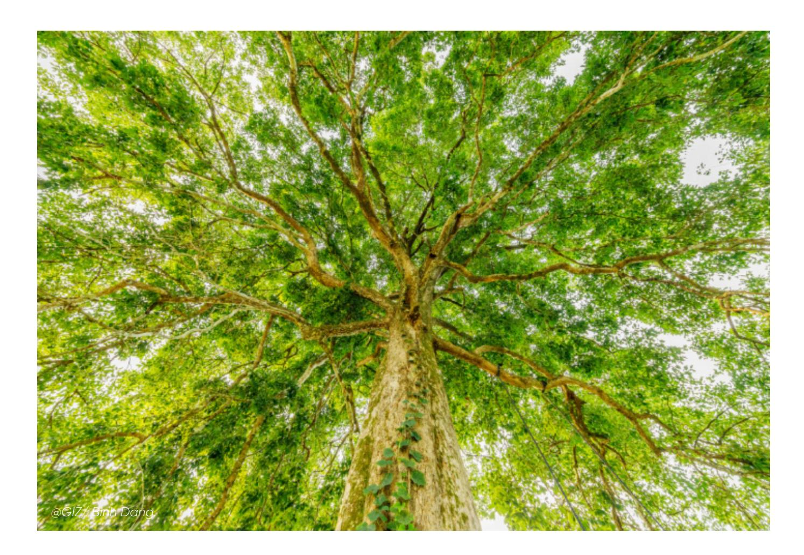

The forest boundary delineation results show that the area with forest is 52,213.71 ha, an increase of **2,470.35 ha** compared to only using the 2020 forest boundary.

- The aggregated data table shows: The total area with forest within the forestry planning land of the 04 pilot communes is: 52,320.07 ha, accounting for 74% of the forestry planning land area in the 04 pilot communes.
- Specifically: + Natural forest area is: 26,102.40 ha, accounting for 37% of the total forestry planning land; + Planted forest area is: 26,217.67 ha, accounting for 37% of the total forestry planning land.
- The non-forest area planned for forestry is 18,152.09 ha, accounting for 26%. Thus, after standardization, the total forest boundary area increased by 2,470.35 ha compared to only using the 2020 forest boundary.

*Table 7. Summary of forest boundary area after adjustment (Unit: ha)*

*Figure 12. Standardized 2020 forest boundary map for 04 pilot communes Source: Consultant team, map generated using QGIS*

|                        | Forest origin / forest Cam Lo Hieu Giang Huong Phung Khe Sanh Total type Total 10.405,37 11.472,44 38.863,66 9.730,69 70.472,16 |
|------------------------|---------------------------------------------------------------------------------------------------------------------------------|
| I.                     | Forested areas                                                                                                                  |
| 1.                     | Natural forest Protection forest Special-use forest Production forest                                                           |
| 2.                     | Planted forest Protection forest Special-use forest Production forest                                                           |
| II. Non-forested areas | Protection forest Special-use forest Production forest                                                                          |

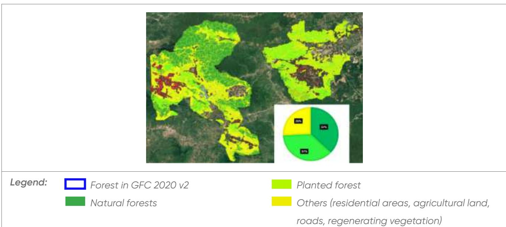

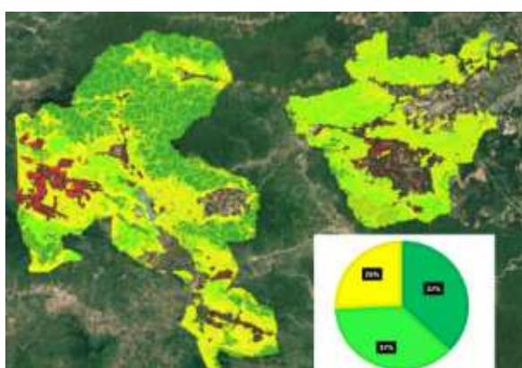

The theoretical accuracy of the GFC2020 v2 forest classification was assessed against the standardised 2020 forest map, representing forest conditions as of the EUDR cut-o date (31 December 2020), using 3,811 theoretical verification points.

The results show an overall accuracy (OA) of 65.67%, indicating a moderate level of agreement between GFC2020 v2 and the local reference map. The

Agroforestry systems are classified as non-forest in the reference dataset, in line with both national regulations and the EUDR forest definition. Consequently, misclassification related to agroforestry plots is included within the reported commission and omission errors.

The observed discrepancies are mainly associated with heterogeneous land-cover conditions, particularly short-rotation plantation forests under harvest or early regrowth, fragmented plantation–agriculture mosaics, and agroforestry or perennial crop systems with dense canopy cover. Under these conditions, global satellite-based

# **3.4. Assessing the theoretical accuracy of the GFC map compared to the 2020 forest map of the 04 pilot communes.**

*Table 8. Accuracy matrix of GFC forest classification results for 04 pilot communes*

| 04 Pilot Communes       | GFC has forest | GFC has no forest | Total | Producer's Accuracy (%)                                 |
|-------------------------|----------------|-------------------|-------|---------------------------------------------------------|
| Local map has forest    | 1.273          | 828               | 2.101 | 60,6                                                    |
| Local map has no forest | 480            | 1.230             | 1.710 | 71,9                                                    |
| Total                   | 1.753          | 2.058             | 3.811 |                                                         |
| User's Accuracy (%)     | 72,62          | 59,77             |       | OA: 65,67% PA: 60,60% UA: 72,62% F1-score: 66% |

Producer's Accuracy (PA) for forest is 60.60%, reflecting a relatively high omission error, while the User's Accuracy (UA) reaches 72.62%, corresponding to a commission error of 27.38% where areas classified as forest by GFC are non-forest in the reference dataset. The resulting F1-score of 66% indicates a balanced but imperfect classification performance. Details are in the table below:

products such as GFC2020 v2 face inherent limitations in consistently distinguishing forest from non-forest.

All dierences identified in this assessment reflect classification inconsistencies for forest status in 2020 and do not indicate deforestation, forest gain, or land-use change after the EUDR cut-o date.

After finalizing the forest boundary delineation, a spatial comparison was conducted to assess the strengths and weaknesses between the 04 pilot communes' forest boundary map and the GFC 2020 v2 map. The results are as follows:

The results show that the forest area detected by GFC 2020v2 in the 04 pilot communes is 42,842.88 ha. The area with forest after boundary adjustment is 52,320.07 ha. Thus, the area detected by GFC is about 9,477.19 ha lower than the forest area of the 04

# **3.5. Assessing GFC2020 v2 accuracy in the field**

#### **a. Comparing area by case scenarios for pilot communes**

*Table 9. Summary of general results comparing the pilot map with GFC 2020 v2 and forest boundaries after field correction in 04 pilot communes (Unit: ha)*

*Figure 13. Chart showing the comparison results of the pilot map with GFC 2020 v2 and the standardized forest boundary data of 04 communes*

|    |             | Forest area in | Total forest area according to JRC | Forest area according to JRC | Outside FPL (%)     |             |
|----|-------------|----------------|------------------------------------|------------------------------|---------------------|-------------|
| No | Commune     | forest         | dynamics map                       | area                         | Only JRC has forest | Cam Lo      |
| 1  | Cam Lo      | 9.615,41       | 3.983,90                           | 2.643,03                     | 39,25               | 9.615,41    |
| 2  | Hieu Giang  | 10.297,59      | 1.820,41                           | 1.162,40                     | 22,71               | Hieu Giang  |
| 3  | Huong Phung | 27.736,73      | 32.343,05                          | 26.264,75                    | 3.602,23            | Huong Phung |
| 4  | Khe Sanh    | 4.670,34       | 4.695,52                           | 3.894,57                     | 307,83              | Khe Sanh    |
|    | Total       | 52.320,07      | 42.842,88                          | 33.964,75                    | 3.972,02            | Total       |

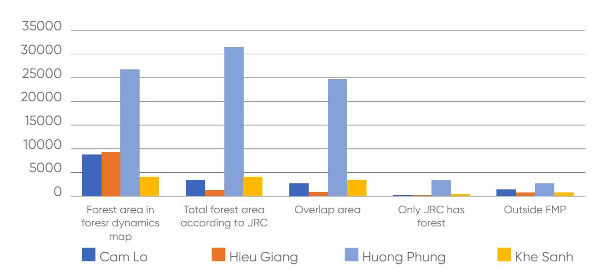

pilot communes. This dierence reflects systematic classification dierences between a global product and a locally standardised forest map representing forest conditions in 2020, and does not indicate forest loss or gain after the EUDR cut-o date

A detailed breakdown for comparison of GFC 2020 v2 forest area with the forest map area of the 04 communes after standardization, based on specific cases, is shown in the table below:

This result shows that, in terms of the ratio of forest area detected by GFC compared to Vietnam's current forest status in the 04 communes (Hieu Giang, Cam Lo, Huong Phung, and Khe Sanh), it reached about 33,964.75 ha, accounting for 65% of the forest area in the 04 pilot communes. This level of agreement varies substantially between communes, specifically:

- Cam Lo Commune: 27.49%
- Hieu Giang Commune: 11.29%
- Huong Phung Commune: 94.69%
- Khe Sanh Commune: 83.39%

The comparative analysis by forest origin further clarifies the observed spatial patterns. The results show that GFC2020 v2 achieves very high accuracy for natural forest, with a detection rate of 98.5% across the 04 pilot communes. In contrast, detection accuracy for planted forests varies substantially depending on spatial structure and management

*Table 10. Summary of detailed results by forest origin comparing the pilot map with GFC 2020 v2 and post-standardization forest boundaries in 04 pilot communes*

|    | Commune     | Total forest area (ha) | Overlap area (ha) | Percentage (%) |                |
|----|-------------|------------------------|-------------------|----------------|----------------|
| No | Cam Lo      | Natural forest         | Planted forest    | Natural forest | Planted forest |
| 1  | Hieu Giang  | 1.639,28               | 7,976,13          | 1.618,66       | 99             |
| 2  | Huong Phung | 10,79,89               | 10.189,70         | 10,67,7        | 100            |
| 3  | Huong Phung | 21.664,84              | 6.071,89          | 21.640,42      | 100            |
| 4  | Khe Sanh    | 2.690,39               | 1.979,95          | 2.566,14       | 95             |
|    | Total       | 26.102,40              | 26.217,67         | 25.932,89      | 98,5           |
|    |             |                        |                   |                |                |

regime. In communes characterised by small, scattered plantations which are mainly managed by households, such as Cam Lo and Hieu Giang, the detection rate reaches only around 12%. By comparison, in Huong Phung and Khe Sanh, where plantation forests are larger, more spatially continuous and managed by the Southern Quang Tri Protective Forest Management Board, detection accuracy improves markedly to approximately 70%.

These dierences reflect the influence of plantation size, spatial continuity and management structure on the detectability of forest in global datasets. In contrast, the national forest map benefits from annual updates and, in some cases, manual GIS-based corrections, allowing it to capture fragmented and scattered plantation forests more accurately. Detailed results by commune and forest origin are presented in the table below.

To complement the spatial comparison, 162 field verification points were selected for on-the-ground validation, including 90 points classified as forest and 72 points classified as non-forest in GFC2020 v2. These points were verified against actual land-cover conditions and the local 2020 forest status.

The verification results show that the overall accuracy is 64.94% for GFC2020 v2. While non-forest areas show a relatively high accuracy (72.55%), the accuracy for forest areas is lower (47.75%), resulting in a misclassification rate of 52.25% for forest points.

These misclassifications are primarily associated with industrial tree crops, cassava cultivation, and regenerating vegetation that does not meet the applicable forest definition criteria, as illustrated in Figure 14. Such land-cover types may exhibit canopy characteristics like forest in satellite imagery yet are explicitly excluded from the forest category under both Viet Nam's national regulations and the EUDR forest definition.

The field verification results are consistent with the theoretical accuracy assessment, showing that GFC2020 v2 performs reliably in areas dominated by stable, contiguous natural forest, while its performance decreases in fragmented plantation landscapes, agroforestry systems and regenerating vegetation, particularly in heterogeneous land-use contexts.

#### **b. Assessing classification accuracy for field points**

*Table 11. Field point verification results*

|              | Status              | Forest in JRC | No forest in JRC | Total | Accuracy (%) | Misclassification (%) |
|--------------|---------------------|---------------|------------------|-------|--------------|-----------------------|
|              | Actually forest     | 53            | 58               | 111   | 47,75        | 52,25                 |
|              | Actually non-forest | 37            | 14               | 51    | 72,55        | 27,45                 |
| Total        | 90                  | 72            | 162              |       |              |                       |
| Accuracy (%) | 58,89               | 80,56         |                  |       | <b>64,94</b> |                       |

Essentially, all discrepancies identified through field verification relate to classification dierences for forest status in 2020 and do not represent deforestation, forest gain, or land-use change after the EUDR cut-o date.

Detailed field verification points attached as in the Appendix.

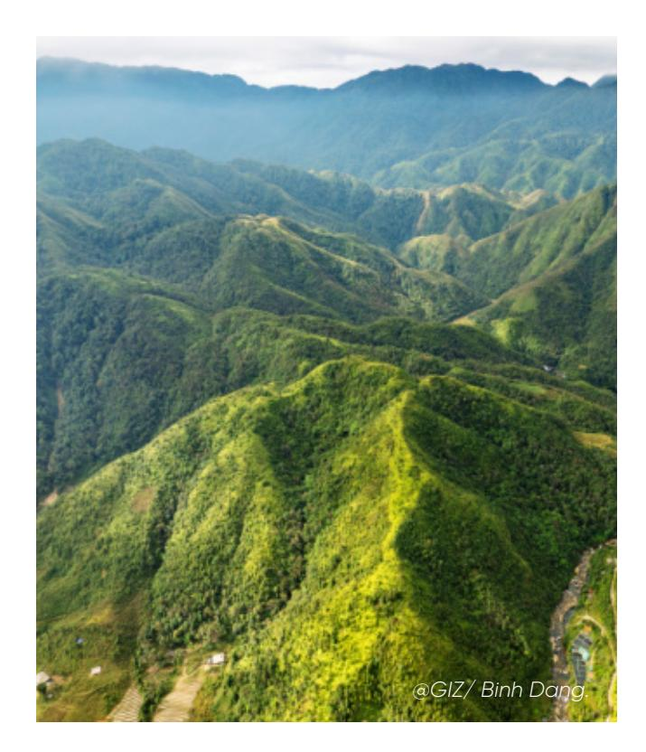

Vietnam's 2020 forest status map for the 04 pilot communes, derived from the FRMS system, high-resolution SPOT imagery and consistent annually updates, provides a detailed and management-oriented representation of forest conditions at commune and parcel level. The high level of field verification and integration of local knowledge contributes to strong internal consistency and suitability for sub-national forest monitoring and planning.

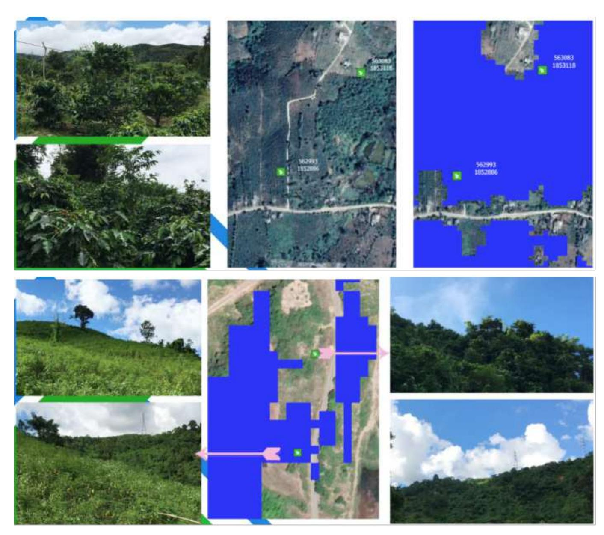

*Figure 14. Examples where GFC 2020 v2 data (blue) classified as forest, but field verified as industrial crops, cassava, or regenerating trees not meeting the forest criteria. Source: Consultant team, map generated using QGIS*

### **3.6. Discussion**

The comparison with GFC2020 v2 data reveals expected structural dierences between a global product designed for general, first-step risk assessment and a national dataset tailored to local management needs. GFC2020 v2 performs well in areas of continuous natural forest, where canopy structure and height meet EUDR criteria. However, classification accuracy decreases in mixed production landscapes where short-rotation acacia plantation, and regenerating stands remain below

5m height or display sparse canopy cover. These conditions are not part of the EUDR definition and therefore tend to be mapped as non-forest in GFC2020, despite being recognised as planted forest within Vietnam's national system. Small or narrow polygons and complex land-use mosaics further contribute to discrepancies, particularly where agricultural and forestry uses are interwoven. This includes agroforestry systems and perennial crops such as coee, rubber or mixed household plantations, which may exhibit forest-like spectral signatures but are classified as agricultural land under both national regulations and the EUDR forest definition. At a 10 m spatial resolution, such fine-scale and fragmented land-use patterns pose inherent challenges for global, rule-based classification approaches.

The standardisation of the 2020 forest boundary and field verification at 162 locations confirmed that national data captures management realities more accurately in these heterogeneous landscapes. Conversely, GFC2020 v2 provides a consistent, globally comparable binary forest/non-forest layer that is valuable for identifying broad patterns, highlighting areas of uncertainty and supporting EUDR-aligned risk assessment when combined with local datasets. While the use of more than one data

set can support deforestation-risk assessment, ground truthing or further data collection for spots identified as potential areas of deforestation risk, is needed.

The pilot results show that convergence between the two datasets provides high confidence for classification of existing forest and non-forest areas as of 2020, rather than indicating deforestation or forest gain. At the same time, systematic dierences between the two datasets constitute valuable inputs for decision-making, as they help identify locations requiring additional review, targeted verification or complementary evidence. This combined-use approach supports a more robust assessment framework, ensuring both alignment with EUDR requirements and accurate reflection of local forest dynamics.

Overall, the study confirms that Vietnam's national forest maps remain essential for operational management and fine-scale assessment, while GFC2020 v2 acts as a reference layer for cross-country comparability. Rather than full interoperability, a complementary use of the the two systems, through standardised definitions, metadata documentation and improved update procedures will enhance the enabling environment for risk assessment and due diligence under the EUDR.

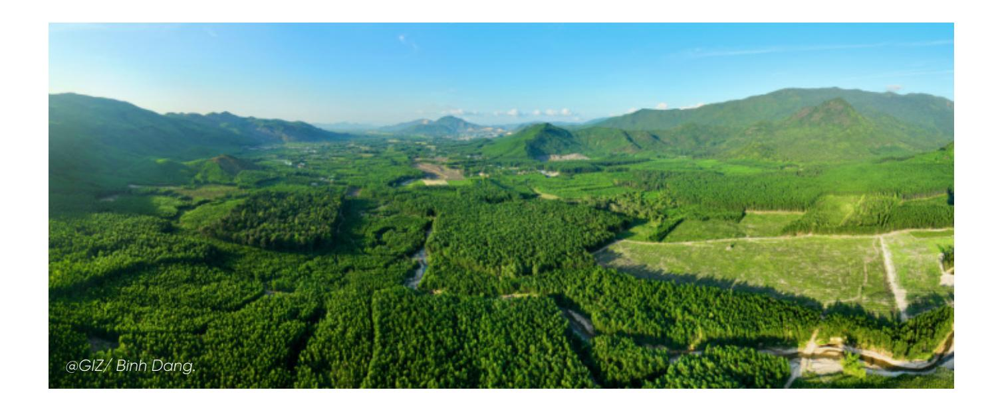

# **CONCLUSION AND 04. RECOMMENDATIONS**

# **04. CONCLUSION AND RECOMMENDATIONS**

### **4.1. Conclusion**

Across the four pilot communes, 52,320.07 ha (74% of forestry planning land) meet the forest definition after standardisation. The spatial comparison indicates that 33,964.75 ha (approximately 65%) are consistently classified as forest by both datasets, with higher agreement in areas dominated by large, contiguous natural forest areas (Huong Phung, Khe Sanh) and lower agreement in communes characterised by short-rotation production forests and fragmented land-use patterns (Cam Lo, Hieu Giang).

The accuracy assessment confirms an overall accuracy of 65% for GFC2020 v2 within the pilot area. Classification reliability is high in stable natural forest ecosystems (>80%) but decreases markedly in mixed-use or mosaic landscapes where canopy height and density vary seasonally or across management cycles. Key drivers of discrepancies include the presence of fragmented acacia/rubber plantations, regenerating stands below 5m height, mixed agroforestry systems, and the influence of 10 m spatial resolution in heterogeneous terrain.

All results presented in this study relate to the classification of existing forest and non-forest areas as of the reference year 2020, following boundary

standardisation, and do not indicate deforestation, forest gain or land-use change after the EUDR cut-o date.

These findings underline the complementarity of the 02 datasets. In the Vietnamese context, the national forest map should be regarded as the primary and more accurate spatial reference data set for forest status assessment, while the GFC2020 map provides complementary information:

- GFC2020 v2 provides a harmonised, globally consistent baseline aligned with the FAO/EUDR definition and supports initial screening and the identification of areas of uncertainty or potential risks.
- Vietnam's national forest map provides higher thematic and spatial accuracy for local assessment and management.

A combined-use approach, in which global datasets are applied as complementary screening layers rather than exclusionary tools, enhances the reliability of forest-status information and strengthens the enabling environment for risk assessment for EUDR.

# **4.2. Recommendations**

#### **(1) Promote a convergence-of-evidence approach using multiple data layers**

Rather than relying on a single or strictly dual dataset, it is recommended to adopt a convergence-of-evidence approach, integrating multiple spatial data layers, including Viet Nam's forest status map, land-use maps, crop and plantation maps, and global datasets such as GFC2020 v2, as well as complementary sources (e.g. platforms integrating data via Whisp.org). In this framework, Viet Nam's national forest map remains the ocial national dataset, while global products serve as reference layers for screening, comparison and risk prioritisation. In plantation-dominated and fragmented landscapes, global forest cover maps should not be used as exclusionary tools for risk assessment, as this may generate false flags; instead, they should be applied to trigger further, proportionate verification steps. Structured information exchange, particularly on classification rules, field verification methods and local land-use dynamics, would support with improving dataset alignment.

#### **(2) Technical exchange between MAE and JRC**

Engage in exchange and dialogue, on metadata structures and geospatial requirements in line with the FAO/EUDR forest definition and cut-o date and provide feedback for further updates for refining the global data set of the JRC map.

#### **(3) Strengthen the standardisation of national forest boundaries**

- The 2020 forest boundary should continue to be refined using:
- verified plantation boundaries and forest management records,
- multi-source satellite imagery (Sentinel-2, PlanetScope, Google Earth, UAV data),
- transparent procedures for documenting adjustments and validation steps.

#### **(4) Enhance accessibility and transparency of forest data**

Publish simplified, non-sensitive versions of forest boundary datasets on shared online platforms, such as WHISP, to support operators, traders and competent authorities in meeting due diligence obligations. Mobile and web-based tools enabling feedback from local stakeholders would further improve data quality.

#### **(5) Expand the methodology to additional provinces**

Replicating the standardized workflow in other districts will help establish a coherent, scalable approach to forest boundary delineation and contribute to a more accurate risk assessment framework at national level.

# **REFERENCES**

- 1. C. Bourgoin, Ameztoy, I., Verhegghen, A., Desclée, B.,Carboni, S., Bastin, J., Beuchle, R., Brink, A., Defourny, P.,Delhez, B., Fritz, S., Gond, V., Herold, M., Lamarche, C.,Mansuy, N., Mollicone, D., Oom, D., Peedell, S., SanMiguel, J., Colditz, R., Achard, F (2024). Mapping Global Forest Cover of the Year 2020 to Support the EU Regulation on Deforestation-free Supply Chains.
- 2. R. Colditz, Verhegghen, A., Carboni, S., Bourgoin, C., Duerauer, M., Mansuy, N., De Marzo, T., Beuchle, R., Janouskova, K., Armada Bras, T., Desclée, B., Orlowski, K., Mutendeudzi, M., Ameztoy Aramendi, I., Fritz, S., Lesiv, M., Oom, D., Carreiras, J., San-Miguel, J., Herold, M., Berger, K., Nepomshina, O., Gond, V., Defourny, P., Lamarche, C., Bos, A., Collet, T., Delhez, B., Mollicone, D., Bastin, J.-F., De Haulleville, T., Brink, A., Lupi, A., Tsendbazar, N.E., Stehman, S.V., Achard, F. (2025). Accuracy Assessment of the Global Forest Cover Map for the Year 2020: Assessment Protocol and Analysis.
- 3. Russell G. Congalton (1991). A Review of Assessing the Accuracy of Classifications of Remotely Sensed Data. REMOTE SENS. ENVIRON.
- 4. FAO (2020). Definitions of Forest, other land uses, and Trees outside forests.
- 5. National Assembly (2017). Law on Forestry dated 15 November 2017.
- 6. JRC https://forobs.jrc.ec.europa.eu/.
- 7. Ministry of Agriculture and Rural Development (2021). Decision No. 1558/QĐ-BNN-TCLN dated 13 April 2021 of the Minister of Agriculture and Rural Development on the publication of the national forest status in 2020 ..

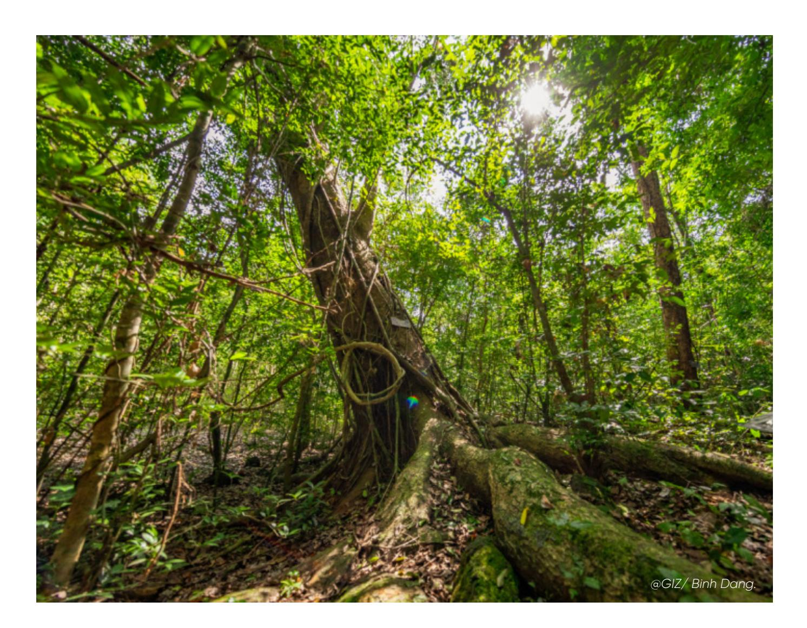

# **APPENDIX RESULTS OF GROUND VERIFICATION POINTS**

| No | Image          | Commune | FSC O8 | Forest owner         | X      | Y       | Status | Species                 |
|----|----------------|---------|-------------------|----------------------|--------|---------|--------|-------------------------|
|    | interpretation |         |                   |                      |        |         |        |                         |
| 1  | MKA_CL_1       | Cam Lo  | 786               | Nghia An Prison      | 602508 | 1847101 | TG     | Acacia                  |
| 2  | MKA_CL_2       | Cam Lo  | 786               | Nghia An Prison      | 602355 | 1847071 | TXP    | Lithocarpus             |
| 3  | MKA_CL_7       | Cam Lo  | NTK5              | Household, Cam Lo    | 598716 | 1851356 | TG     | Acacia                  |
| 4  | MKA_CL_8       | Cam Lo  | NTK5              | Household, Cam Nghia | 598769 | 1851372 | DK     |                         |
| 5  | MKA_CL_9       | Cam Lo  | NTK33             | Household, Cam Chinh | 602573 | 1848340 | TG     | Hevea brasiliensis      |
| 6  | MKA_CL_11      | Cam Lo  | NTK8              | Household, Cam Lo    | 598624 | 1856481 | TG     | Pinus spp.              |
| 7  | MKA_CL_12      | Cam Lo  | NTK8              | Household, Cam Thanh | 598740 | 1856510 | TG     | Pinus spp.              |
| 8  | MKA_CL_13      | Cam Lo  | NTK8              | Household, Cam Lo    | 598750 | 1856915 | TG     | Acacia                  |
| 9  | MKA_CL_14      | Cam Lo  | NTK8              | Household, Cam Lo    |        |         | DTR    | Acacia                  |
| 10 | MKA_CL_15      | Cam Lo  | 784               | Nghia An Prison      | 603892 | 1847169 | TG     | Acacia                  |
| 11 | MKA_CL_16      | Cam Lo  | 784               | Nghia An Prison      | 603684 | 1846989 | DTR    | Acacia                  |
| 12 | MKA_CL_17      | Cam Lo  | 786               | Household, Cam Chinh | 603426 | 1846915 | TG     | Acacia                  |
| 13 | MKA_CL_18      | Cam Lo  | NTK33             | Household, Cam Chinh | 602598 | 1848552 | TG     | Hevea brasiliensis      |
| 14 | MKA_CL_19      | Cam Lo  | 784               | Nghia An Prison      | 602687 | 1848663 | DTR    | Acacia                  |
| 15 | MKA_CL_20      | Cam Lo  | NTK33             | Household, Cam Chinh | 602644 | 1848677 | TG     | Acacia                  |
| 16 | MKA_CL_21      | Cam Lo  | 784               | Household, Cam Chinh | 602822 | 1848939 | DTR    | Acacia                  |
| 17 | MKA_CL_22      | Cam Lo  | NTK33             | Household, Cam Lo    | 601263 | 1848642 | TG     | Hevea brasiliensis      |
| 18 | MKA_CL_23      | Cam Lo  | NTK               | People's Committee   | 601644 | 1849042 | TG     | Acacia                  |
| 19 | MKA_CL_25      | Cam Lo  | NTK5              | Household, Cam Lo    | 596359 | 1852108 | DTR    | Acacia                  |
| 20 | MKA_CL_26      | Cam Lo  | NTK8              | Household, Cam Thanh | 598324 | 1856549 | DTK    | School                  |
| 21 | MKA_CL_27      | Cam Lo  | NTK8              | Household, Cam Lo    | 597974 | 1856764 | DKH    | Housing+Banana          |
| 22 | MKA_CL_28      | Cam Lo  | NTK8              | Household, Cam Lo    | 598097 | 1856751 | NN     | Guava, lemon, banana |
| 23 | MKA_CL_29      | Cam Lo  | NTK8              | Household, Cam Lo    | 598161 | 1856642 | DTR    | Acacia                  |
| 24 | MKA_CL_30      | Cam Lo  | NTK8              | Household, Cam Lo    | 596938 | 1856722 | TG     | Acacia                  |
| 25 | MKA_CL_31      | Cam Lo  | N                 |                      |        |         |        |                         |

*08 Forest Sub-compartment*

| 30 | MKA_CL_38 | Cam Lo     | NTK8  | Household, Cam Lo     | 601541 | 1857332 | TG  | Hevea brasiliensis   |
|----|-----------|------------|-------|-----------------------|--------|---------|-----|----------------------|
| 31 | MKA_CL_39 | Cam Lo     | NTK8  | Household, Cam Lo     | 599229 | 1856951 | DKH | Banana, jackfruit    |
| 32 | MKA_CL_40 | Cam Lo     | NTK8  | Household, Cam Lo     | 599340 | 1857032 | DTR | Acacia               |
| 33 | MKA_CL_41 | Cam Lo     | NTK8  | Household, Cam Lo     | 599253 | 1856884 | DKH | Lychee               |
| 34 | MKA_HG_42 | Hieu Giang | NTK6  | People's Committee    | 612128 | 1863090 | TG  | Melaleuca, Acacia |
| 35 | MKA_HG_43 | Hieu Giang | NTK6  | People's Committee    | 612204 | 1863069 | TG  | Melaleuca            |
| 36 | MKA_HG_44 | Hieu Giang | NTK7  | Household, Hieu Giang | 608720 | 1862366 | TG  | Hevea brasiliensis   |
| 37 | MKA_HG_45 | Hieu Giang | NTK7  | Household, Hieu Giang | 608859 | 1862588 | TG  | Acacia               |
| 38 | MKA_HG_46 | Hieu Giang | NTK7  | Household, Hieu Giang | 608625 | 1862221 | TG  | Acacia               |
| 39 | MKA_HG_47 | Hieu Giang | NTK7  | Household, Hieu Giang | 607881 | 1863587 | TG  | Hevea brasiliensis   |
| 40 | MKA_HG_48 | Hieu Giang | NTK7  | Household, Hieu Giang | 607864 | 1863466 | TG  | Hevea brasiliensis   |
| 41 | MKA_HG_49 | Hieu Giang | NTK7  | Household, Hieu Giang | 607879 | 1863925 | TG  | Hevea brasiliensis   |
| 42 | MKA_HG_50 | Hieu Giang | NTK9  | Household, Cam Tuyen  | 605539 | 1861622 | TG  | Acacia               |
| 43 | MKA_HG_51 | Hieu Giang | 764   | Household, Cam Tuyen  | 605707 | 1861865 | TG  | Acacia               |
| 44 | MKA_HG_52 | Hieu Giang | 764   | Household, Cam Tuyen  | 606194 | 1861828 | TG  | Acacia               |
| 45 | MKA_HG_53 | Hieu Giang | NTK9  | Household, Hieu Giang | 601258 | 1859885 | TG  | Hevea brasiliensis   |
| 46 | MKA_HG_54 | Hieu Giang | NTK22 | Household, Cam An     | 614621 | 1864729 | TG  | Acacia               |
| 47 | MKA_HG_55 | Hieu Giang | NTK22 | Household, Cam An     | 614711 | 1864609 | TG  | Acacia               |
| 48 | MKA_HG_56 | Hieu Giang | 764   | Household, Cam Tuyen  | 606052 | 1861868 | TG  | Acacia               |
| 49 | MKA_HG_57 | Hieu Giang | 764   | Household, Cam Tuyen  | 605988 | 1861862 | TG  | Acacia               |
| 50 | MKA_HG_58 | Hieu Giang | NTK9  | Household, Hieu Giang | 604357 | 1860913 | DTR | Acacia               |
| 51 | MKA_HG_59 | Hieu Giang | NTK9  | Household, Hieu Giang | 604392 | 1860996 | TG  | Acacia               |
| 52 | MKA_HG_60 | Hieu Giang | NTK9  | Household, Hieu Giang | 604365 | 1861127 | DTR | Acacia               |
| 53 | MKA_HG_61 | Hieu Giang | NTK9  | Household, Cam Tuyen  | 604520 | 1851627 | D   |                      |

| 68 | MKA_HG_76 | Hieu Giang  | NTK9  | People's Committee                                           | 607780 | 1863500 | TG   | Acacia                                       |
|----|-----------|-------------|-------|--------------------------------------------------------------|--------|---------|------|----------------------------------------------|
| 69 | MKA_HG_77 | Hieu Giang  | NTK7  | Household, Hieu Giang                                        | 607738 | 1863745 | TG   | Acacia                                       |
| 70 | MKA_HG_78 | Hieu Giang  | NTK9  | Household, Hieu Giang                                        | 607169 | 1863994 | TG   | Hevea brasiliensis                           |
| 71 | MKA_HG_79 | Hieu Giang  | NTK9  | Household, Hieu Giang                                        | 607220 | 1864024 | DTR  | Acacia                                       |
| 72 | MKA_HG_80 | Hieu Giang  | NTK9  | Household, Hieu Giang                                        | 607111 | 1863977 | TG   | Hevea brasiliensis                           |
| 73 | MKA_HG_81 | Hieu Giang  | NTK9  | Household, Hieu Giang                                        | 607090 | 1863923 | TG   | Acacia                                       |
| 74 | MKA_HG_82 | Hieu Giang  | NTK22 | Household, Hieu Giang                                        | 612894 | 1864986 | TG   | Acacia                                       |
| 75 | MKA_HG_83 | Hieu Giang  | NTK22 | Household, Hieu Giang                                        | 612803 | 1864939 | TG   | Acacia                                       |
| 76 | MKA_HG_84 | Hieu Giang  | NTK22 | People's Committee                                           | 612898 | 1864954 | TG   | Acacia                                       |
| 77 | MKA_HP_85 | Huong Phung | 676   | Huong Hoa – Dakrong Protection forest management board | 573840 | 1845561 | TG   | Vernicia montana                             |
| 78 | MKA_HP_86 | Huong Phung | 676   | Huong Hoa – Dakrong Protection forest management board | 513259 | 1845932 | TG   | Vernicia montana, Acacia                  |
| 79 | MKA_HP_87 | Huong Phung | 676   | Huong Hoa – Dakrong Protection forest management board |        |         | TG   | Acacia                                       |
| 80 | MKA_HP_89 | Huong Phung | 676   | Huong Hoa – Dakrong Protection forest management board | 570715 | 1849048 | TXN  | Liquidambar formosana                     |
| 81 | MKA_HP_90 | Huong Phung | 652B  | People's Committee                                           | 562654 | 1856202 | DTR  | Acacia                                       |
| 82 | MKA_HP_91 | Huong Phung | 652B  | Chenh Venh Community                                         | 562783 | 1856348 | DTTS | Cratoxylum formosum                       |
| 83 | MKA_HP_92 | Huong Phung | 652B  | Bac Huong Hoa Nature Reserve Management Board          | 564190 | 1856881 | HG   | Machilus bonii Lecomte, Bambusa nutans |
| 84 | MKA_HP_93 | Huong Phung | 652A  | Bac Huong Hoa Nature Reserve Management Board          | 563993 | 1857174 | HG   | Bamboo                                       |
| 85 | MKA_HP_94 | Huong Phung | 652B  | People's Committee                                           | 562333 | 1855768 | DTK  |                                              |
| 86 | MKA_HP_95 | Huong Phung | 676   | Huong Hoa – Dakrong Protection forest management board | 571632 | 1845298 | TG   | Pinus spp., Vernicia montana              |
| 87 | MKA_HP_96 | Huong Phung | 676   | Huong Hoa – Dakrong Protection forest management board | 571996 | 1844854 | TXK  | Syzygium cumini (L.) Skeels               |
| 88 | MK        |             |       |                                                              |        |         |      |                                              |

| 91  | MKA_HP_100 | Huong Phung | 676 | Huong Hoa – Dakrong Protection forest management board | 574013 | 1845372 | TG  | Acacia, native tree                  |
|-----|------------|-------------|-----|--------------------------------------------------------------|--------|---------|-----|-----------------------------------------|
| 92  | MKA_HP_101 | Huong Phung | 676 | Huong Hoa – Dakrong Protection forest management board | 574268 | 185113  | TG  | Acacia                                  |
| 93  | MKA_HP_102 | Huong Phung | 676 | Household, Huong Phung                                       | 575017 | 1845464 | TG  | Acacia –2023                            |
| 94  | MKA_HP_103 | Huong Phung | 676 | Household, Huong Phung                                       | 575094 | 1845364 | TG  | Acacia                                  |
| 95  | MKA_HP_104 | Huong Phung | 676 | Household, Huong Phung                                       | 574871 | 1845626 | TG  | Acacia                                  |
| 96  | MKA_HP_105 | Huong Phung | 676 | Household, Huong Phung                                       | 574876 | 1845665 | TG  | Acacia                                  |
| 97  | MKA_HP_106 | Huong Phung | 677 | Household, Huong Phung                                       | 574925 | 1846328 | TG  | Acacia                                  |
| 98  | MKA_HP_107 | Huong Phung | 677 | Household, Huong Phung                                       | 574985 | 1846331 | TG  | Acacia                                  |
| 99  | MKA_HP_108 | Huong Phung | 677 | Household, Huong Phung                                       | 574928 | 1846326 | TG  | Acacia                                  |
| 100 | MKA_HP_109 | Huong Phung | 676 | Huong Hoa – Dakrong Protection forest management board | 571313 | 1848302 | TG  | Acacia                                  |
| 101 | MKA_HP_110 | Huong Phung | 676 | Household, Huong Phung                                       | 574745 | 1845149 | TG  | Acacia                                  |
| 102 | MKA_HP_111 | Huong Phung | 676 | Household, Huong Phung                                       | 574619 | 1845190 | DTR | Vernicia montana, liana              |
| 103 | MKA_HP_112 | Huong Phung | 676 | Household, Huong Phung                                       | 574923 | 1845223 | TG  | Acacia                                  |
| 104 | MKA_HP_113 | Huong Phung | 676 | Huong Hoa – Dakrong Protection forest management board |        |         | DTR | Vernicia montana                        |
| 105 | MKA_HP_114 | Huong Phung | 671 | Household, Huong Phung                                       | 556494 | 1851380 | DTK | Coffee, tea                             |
| 106 | MKA_HP_115 | Huong Phung | 671 | Household, Huong Phung                                       | 566230 | 1851422 | DTK | Thysanolaena latifolia, Raspberry |
| 107 | MKA_HP_116 | Huong Phung | 671 | Household, Huong Phung                                       | 565818 | 1851607 | NN  | Coffee                                  |
| 108 | MKA_HP_117 | Huong Phung | 671 | Household, Huong Phung                                       | 566022 | 185155  | DTK |                                         |
| 109 | MKA_HP_118 | Huong Phung | 654 | Household, Huong Phung hamlet                             | 565133 | 1851734 | NN  | Coffee                                  |
| 110 | MKA_HP_119 | Huong Phung | 654 | People's Committee                                           | 564616 | 1851813 | NN  | Coffee, jackfruit                       |
| 111 | MKA_HP_120 | Huong Phung | 654 | People's Committee                                           | 563653 | 1851920 | DTK | Coffee                                  |
| 112 | MKA_HP_121 | Huong Phung | 654 | People's Committee                                           | 563626 | 1851969 | NN  | Coffee                                  |
| 113 | MKA_HP_122 |             |     |                                                              |        |         |     |                                         |

| 116 | MKA_HP_125 | Huong Phung | 654  | Household, Huong Phung                                       | 563075 | 1853117 | NN  | Coffee                                    |
|-----|------------|-------------|------|--------------------------------------------------------------|--------|---------|-----|-------------------------------------------|
| 117 | MKA_HP_126 | Huong Phung | 654  | Household, Huong Phung                                       | 563176 | 1853270 | NN  | Coffee                                    |
| 118 | MKA_HP_127 | Huong Phung | 654  | People's Committee                                           |        |         | NN  | Manihot esculenta                         |
| 119 | MKA_HP_128 | Huong Phung | 654  | People's Committee                                           | 565063 | 1852958 | DTK | Coffee                                    |
| 120 | MKA_HP_129 | Huong Phung | 654  | People's Committee                                           | 562227 | 1852932 | TG  | Nauclea orientalis (L.) L.             |
| 121 | MKA_HP_130 | Huong Phung | 654  | People's Committee                                           | 562341 | 1853003 | DTK | Coffee, Stachyphrynium placentarium |
| 122 | MKA_KS_131 | Khe Sanh    | 761H | Huong Hoa – Dakrong Protection forest management board | 579898 | 1839421 | TG  | Pinus spp., Vernicia montana           |
| 123 | MKA_KS_132 | Khe Sanh    | 761H | Huong Hoa – Dakrong Protection forest management board | 579897 | 1832921 | TG  |                                           |
| 124 | MKA_KS_133 | Khe Sanh    | 691H | People's Committee                                           | 580349 | 1834929 | DT  |                                           |
| 125 | MKA_KS_134 | Khe Sanh    | 691H | Huong Hoa – Dakrong Protection forest management board | 580816 | 1839138 | TG  | Pinus spp.                                |
| 126 | MKA_KS_135 | Khe Sanh    | 691H | Household, Khe Sanh                                          | 581488 | 1840609 | TG  | Acacia                                    |
| 127 | MKA_KS_136 | Khe Sanh    | 691H | Household, Khe Sanh                                          | 581311 | 1840845 | TXP | Lagerstroemia speciosa                 |
| 128 | MKA_KS_137 | Khe Sanh    | 691H | Household, Khe Sanh                                          | 581078 | 1840821 | DT1 |                                           |
| 129 | MKA_KS_138 | Khe Sanh    | 691H | Household, Khe Sanh                                          | 580207 | 1840430 | TG  |                                           |
| 130 | MKA_KS_139 | Khe Sanh    | 691H | Household, Khe Sanh                                          | 580055 | 1840515 | DT1 |                                           |
| 131 | MKA_KS_140 | Khe Sanh    | 761S | Huong Hoa – Dakrong Protection forest management board | 577647 | 1840183 | TG  | Pinus spp., Vernicia montana           |
| 132 | MKA_KS_141 | Khe Sanh    | 761S | Huong Hoa – Dakrong Protection forest management board | 577411 | 1840285 | DTK | Jackfruit                                 |
| 133 | MKA_KS_142 | Khe Sanh    | 761S | People's Committee                                           | 576970 | 1840632 | TG  | Acacia                                    |
| 134 | MKA_KS_143 | Khe Sanh    | 761S | Huong Hoa – Dakrong Protection forest management board | 576648 | 1840548 | TG  | Pinus spp.                                |
| 135 | MKA_KS_144 | Khe Sanh    | 692  | Huong Hoa – Dakrong Protection forest management board |        |         | TXK | Liquidambar formosana                  |

| 136 | MKA_KS_145 | Khe Sanh | 692  | Huong Hoa – Dakrong | 52600  | 1844653 | TXP  |                   |
|-----|------------|----------|------|---------------------|--------|---------|------|-------------------|
|     |            |          |      | Protection forest   |        |         |      |                   |
|     |            |          |      | management board    |        |         |      |                   |
| 137 | MKA_KS_146 | Khe Sanh | 692  | Huong Hoa – Dakrong |        |         | TG   | Pinus spp.        |
|     |            |          |      | Protection forest   |        |         |      |                   |
|     |            |          |      | management board    |        |         |      |                   |
| 138 | MKA_KS_147 | Khe Sanh | 761S | Household, Khe Sanh | 577670 | 1840238 | DTK  |                   |
| 139 | MKA_KS_148 | Khe Sanh | 761S | Huong Hoa – Dakrong | 577971 | 1840222 | TG   | Pinus spp.,       |
|     |            |          |      | Protection forest   |        |         |      |                   |
|     |            |          |      | management board    |        |         |      |                   |
| 140 | MKA_KS_149 | Khe Sanh | 761S | Huong Hoa – Dakrong | 577742 | 1839912 | DTR  | Acacia            |
|     |            |          |      | Protection forest   |        |         |      |                   |
|     |            |          |      | management board    |        |         |      |                   |
| 141 | MKA_KS_150 | Khe Sanh | 761S | Household, Khe Sanh | 577793 | 1839838 | DTR  | Acacia            |
| 142 | MKA_KS_151 | Khe Sanh | 761S | Household, Khe Sanh | 577347 | 1839083 | NN   | Acacia            |
| 143 | MKA_KS_152 | Khe Sanh | 761S | Household, Khe Sanh | 577248 | 1839032 | DTK  | Lychee, Longan,   |
|     |            |          |      | Mango               |        |         |      |                   |
| 144 | MKA_KS_153 | Khe Sanh | 761S | Household, Khe Sanh | 577533 | 1839097 | TG   | Acacia            |
| 145 | MKA_KS_154 | Khe Sanh | 691H | Huong Hoa – Dakrong |        |         | TG   | Pinus spp.,       |
|     |            |          |      | Protection forest   |        |         |      | Vernicia montanda |
|     |            |          |      | management board    |        |         |      |                   |
| 146 | MKA_KS_155 | Khe Sanh | 691H | People's Committee  | 580710 | 1839201 | TG   | Acacia            |
| 147 | MKA_KS_156 | Khe Sanh | 761H | Household           | 579710 | 1839903 | DTR  | Acacia            |
| 148 | MKA_KS_157 | Khe Sanh | 691H | Household, Khe Sanh | 581922 | 1840889 | NN   | Banana            |
| 149 | MKA_KS_158 | Khe Sanh | 691H | Household           | 579972 | 1841073 | TXP  | Mallotus apelta   |
| 150 | MKA_KS_159 | Khe Sanh | 691H | Ta Du Community     | 579981 | 1841285 | TXP  |                   |
| 151 | MKA_KS_160 | Khe Sanh | 691H | Household, Khe Sanh | 579949 | 1841164 | NN   | Manihot esculenta |
| 152 | MKA_KS_161 | Khe Sanh | 691H | Household           | 580056 | 1840082 | TG   | Acacia            |
| 153 | MKA_KS_162 | Khe Sanh | 691H | Household           | 580296 | 1840052 | TG   | Acacia, Melia     |
|     |            |          |      | azedarach           |        |         |      |                   |
| 154 | MKA_KS_163 | Khe Sanh | 691H | Household, Khe Sanh | 579940 | 1840808 | TG   | Acacia            |
| 155 | MKA_KS_164 | Khe Sanh | 691H | Household, Khe Sanh | 580932 | 1840696 | DTK  |                   |
| 156 | MKA_KS_165 | Khe Sanh | 691H | Household, Khe Sanh | 581281 | 184089  | NN   |                   |
| 157 | MKA_KS_166 | Khe Sanh | 691H | Household, Khe Sanh | 581392 | 1840638 | NN   |                   |
| 158 | MKA_KS_167 | Khe Sanh | 691H | Household, Khe Sanh | 582340 | 1841106 | DTTS |                   |
| 159 | MKA_KS_168 | Khe Sanh | 691H | People's C          |        |         |      |                   |

#### **Published by the:**

Deutsche Gesellschaft für Internationale Zusammenarbeit (GIZ) GmbH

#### **Registered oces:**

BONN AND ESCHBORN, FEDERAL REPUBLIC OF GERMANY Friedrich-Ebert-Allee 36+40 53113 Bonn, Germany

#### **Imprint**

This publication was produced with the financial support of the European Union and the German Federal Ministry for Economic Cooperation and Development (BMZ). Its contents are the sole responsibility of GIZ and do not necessarily reflect the views of the EU or the BMZ.

**As at:** December 2025

#### **Photo credits:**

@GIZ/ Binh Dang, @FreePik

All rights reserved. Licensed to the European Union and the German Federal Ministry for Economic Cooperation and Development under conditions.