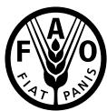

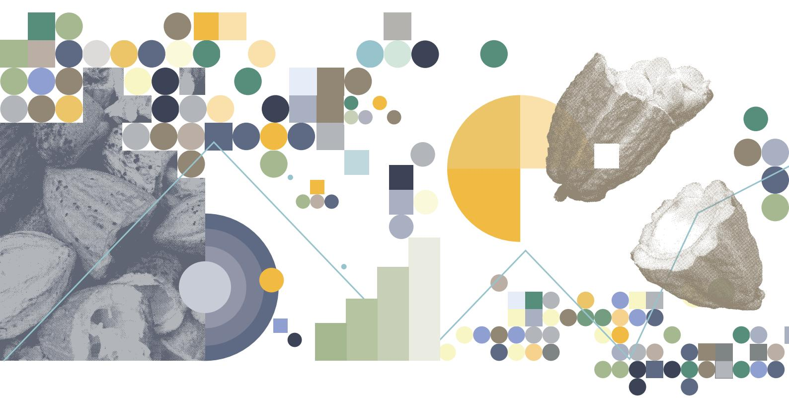

Côte d'Ivoire is the world's leading producer and processor of cocoa beans. Its processing capacity now surpasses that of the Kingdom of the Netherlands, which until recently had held the top position. The government is continuing to encourage investment in local cocoa bean processing, which could account for 70 to 80 percent of national production by 2030. This study examines the prospects for investment in primary cocoa processing and the financing needs this objective entails.

To address these questions, we draw on information obtained through interviews conducted online and in person in Abidjan and San Pedro with around 30 institutions and stakeholders in processing, trading, collection, and financing, as well as with the regulator, the Coffee and Cocoa Council (Conseil Café-Cacao, CCC), between December 2024 and May 2025. Access to plant data, anonymized for confidentiality reasons, enabled us to supplement the first-hand information essential for assessing capital expenditure (CAPEX) and operating expenses (OPEX), and to simulate the financing needs of the sector under different farm gate price scenarios.

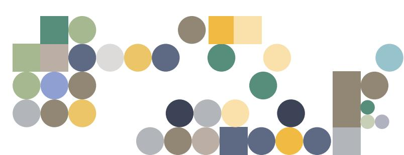

The main finding of this study is that the strategic priorit y lays in financing the working c apital requirements (WCR) of the cocoa sector, especially in processing, rather than in making additional CAPEX investments. Financing WCR (the funds tied up by a company to sustain its operating cycle) is a structural factor for the viability of primary cocoa processing in Côte d'Ivoire. This applies in the short term, given the sharp rise in cocoa prices, and in the medium term, in view of the strong growth in processing capacity and the preference of financial institutions for financing cocoa bean exports. We therefore recommend the rapid establishment of dedicated "cocoa" credit lines by development finance institutions to meet WCR at the peak of demand, expected at the start of the 2025/26 season and beyond.

## FINANCING OPPORTUNITIES FOR COCOA PROCESSING IN CÔTE D'IVOIRE

Cécile Huertas, Alexandre Kaufmann, Didier Nedelec, Claude Side, Tancrède Voituriez, Mahama Zoungrana

# CÔTE D'IVOIRE, NEW STRONGHOLD IN COCOA PROCESSING

Côte d'Ivoire is the world's leading exporter of cocoa beans and primary processed products, also known as semi-finished products, such as cocoa mass, also referred to as "liquor" or "paste", butter, cake, and powder. This study does not cover secondary processed products, such as couverture chocolate and confectionery chocolate.

Exports of cocoa beans and primary processed products fluctuate in value according to the bean prices set on the London and New York exchanges and the ratios that determine the prices of semi-finished products. To indicate scale, the total value of Ivorian exports of cocoa beans and semi-finished products amounted to EUR 4.6 billion in 2023, accounting for 22 percent of the country's total goods exports and 6 percent of Ivorian gross domestic product (GDP). In value terms, in 2023 cocoa beans accounted for twothirds of Côte d'Ivoire's total cocoa exports (cocoa beans and semi-finished products), followed by mass (17 percent) and butter (14 percent). Cocoa powder accounted for only 1.3 percent of the country's cocoa exports. Côte d'Ivoire remains a leading player in the export of cocoa beans, accounting for about 40 percent of global exports, with its share in global exports of processed cocoa products at around 12 percent. Europe is the leading destination market for Ivorian cocoa beans; one out of every two beans imported into Europe comes from the ports of Abidjan or San Pedro. They are primarily ground in the Kingdom of the Netherlands (20 percent of Ivorian beans exported worldwide), Belgium (10 percent), Germany (approximately 7 percent), and Spain and Italy (4 percent each). Outside Europe, the main bean importers are Malaysia (11 percent), the United States o f A m e r i c a ( 1 0 p e r c e n t ) , C a n a d a ( a b o u t 6 percent), Türkiye (5 percent), and Indonesia (about 3 percent). Ivorian cocoa butter is exported almost exclusively to the Kingdom of the Netherlands and Germany, while 60 percent of Ivorian cocoa mass goes to Europe. Under the Interim Economic Partnership Agreement (iEPA) with the European Union, Côte d'Ivoire and Ghana benefit from duty- and quota-free access to the European market.

The quantity of cocoa beans processed in Côte d'Ivoire grew at an average annual rate of 5 percent between 2013 and 2022 (Figure 1) due to the expansion of capacity by long-established international groups engaged in cocoa processing and trading in Côte d'Ivoire, such as Barry Callebaut, Cargill, and Olam Food Ingredients, as well as the creation of new plants. These included the Malaysian group Guan Chong Berhad Cocoa and Ivorian-owned plants such as Ivory Cocoa Products, Compagnie Cacaoyère du Bandama, and Ivory Cocoa Waste Products, among others.

For the Ivorian government, the motivations behind the industrialization project through the processing of agricultural export products are primarily economic, with the generation of foreign currency as well as the creation of added value and jobs. For industrialists, the main motivation lies in access to the Ivorian cocoa bean, which is key to the financial viability of processing (see the box on page 3).

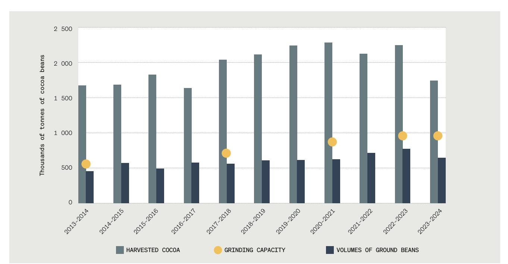

SOURCES: Authors' own elaboration based on interviews and on data from the Government of Côte d'Ivoire, Abidjan. [Cited 25 Feb 2025]. https://www.gouv.ci/accueil

Investment in local processing, whether direct or through an off-take agreement with a processor established in the country, strengthens access to Ivorian cocoa beans. Transporting semi-finished products is also more efficient, since raw cocoa beans are exported with their shell, which makes up about 5 percent of the bean's weight, with limited commercial prospects. Interviews also highlighted the benefit of stronger value chain traceability compared with plants sourcing from multiple origins, particularly from countries where national traceability systems are less developed. Additionally, at times, Ivorian authorities have introduced tax exemptions and incentive measures – notably in 2017 with the adoption of a differentiated single export duty (droit unique de sortie - DUS), favourable to semi-finished products. Reduced rates were set at 13.2 percent for cocoa mass exports, 11 percent for butter, 9.6 percent for powder, and 0 percent for chocolate, while cocoa bean exports were taxed at the base rate of 14.6 percent. This measure helped attract certain investors in local processing before being discontinued in 2023, when a uniform single export duty of 14.6 percent was applied to both cocoa beans and semi-finished products.

A processing plant's profitability varies with fluctuations in both cocoa bean and semi-finished product prices, which are not perfectly correlated. In addition to the high volatility of butter/bean and powder/bean ratios, several success factors for a processing plant also emerged. These include: securing a stable supply of cocoa beans (directly tied to the company's financing capacity); maintaining robust utilization rates of industrial facilities (as a plant must operate continuously over the twelve-month year); managing market risk (particularly through the ability to hedge or to pass this risk on to buyers); achieving economies of scale (with the internal rate of return rising as plant size increases, provided bean supply keeps pace with this growth); and the ability to meet the specifications of chocolate manufacturers in terms of quality and food safety (powder and cocoa butter are ingredients and not commodities).

### THE VIABILITY OF PROCESSING DEPENDS ON THE AVAILABILITY AND QUALITY OF THE BEANS

In addition to accounting for 40 to 45 percent of world cocoa production, depending on the year, Ivorian beans (along with Ghanaian beans) play a key role in the production of couverture chocolate by their balance and quality.

The Ivorian regulator now prioritizes cocoa processors established in Côte d'Ivoire when allocating cocoa beans from the mid-crop cycle (April to August), which accounts for between 20 and 30 percent of annual production. In 2023/24, the mid-crop amounted to about 400  000 tonnes. This measure aims to ensure the continuity of processing activity beyond the main crop (between October and March), against a backdrop of declining national production.

In the future, cocoa bean exports should serve as an adjustment variable in an Ivorian context marked by a relative decline in cocoa production and an increase in processing capacity. Only cocoa beans not used by local processors may be exported.

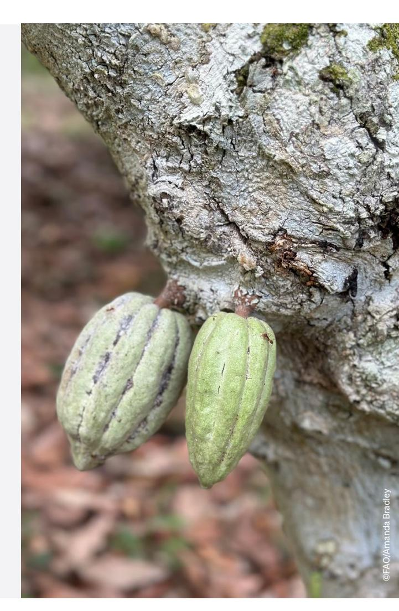

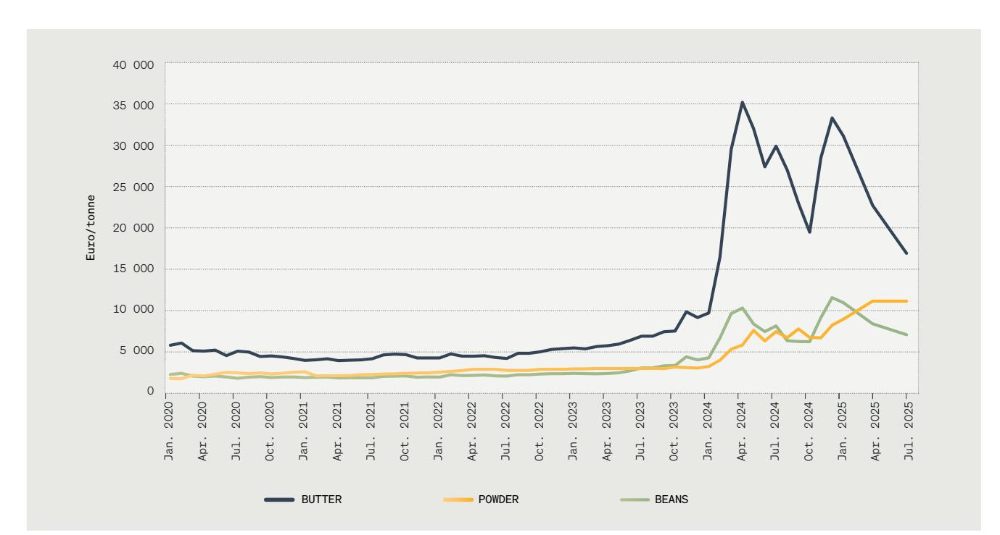

Figure 2 Evolution of CIF\* Europe price of butter, cocoa powder, and cocoa beans

\*The CIF price (cost, insurance, and freight) includes the cost of insurance and freight to the destination port, in addition to the price of the product itself.

SOURCES: Authors' own elaboration based on: First Grade International Ltd.2025. Cocoa Market Report. Bromsgrove (United Kingdom). https://www.fg-int.co.uk/reports/cocoa-market-report-may-2025; Panamir. 2025. Cocoa Market Reports. Tallinn. https://panamir.com/cocoa-market-trends-may-2025; ICCO. 2025. Cocoa Market Reports. Abidjan. https://www.icco.org/icco-documentation/cocoa-market-review/

# INSTALLED CAPACITY CLOSE TO 1.4 MILLION TONNES BY 2027/28

In 2024, Côte d'Ivoire had 15 active cocoa bean processing companies, with a combined capacity of some 990 000 tonnes of mass, butter, cake and/or powder, according to CCC data corroborated by interviews with in d u s tr y o p e r a to r s , to w h i c h a re a d d e d th e 50,000 tonnes from the Transcao plant inaugurated in June 2025 (expandable to 110 000 tonnes). Before this new plant, the utilized capacity could reach approximately 750 000 tonnes, or 75 percent of total capacity (the peak was reached in 2023). Looking ahead, the projects currently underway could add between 180 000 and 344 000 tonnes of capacity by 2025, bringing the total ins talled ba se to bet ween 1.1 and 1.3 million tonnes. Some of these projects are already well advanced, while others remain at the planning stage. Reflecting on these developments, in June 2024 the Minister of Agriculture announced a forecast capacity of 1.176 million tonnes, based on plants already installed or under construction.

Assuming cocoa production remains steady at 1.8 million tonnes (the level estimated for the 2023/24 season), Côte d'Ivoire's operational processing capacity could reach a historic 74 percent in 2025/26 if the upper end of current estimates is reached. Installed capacity could rise to as much as 1.4 million tonnes by 2027/28. Unless there is a significant and sustained increase in bean production in Côte d'Ivoire, however, the need for further CAPEX in new plants or plant extensions beyond those already planned appears very limited. Added to this is the requirement to build security stocks at the end of each harvest (both main and mid-crop) to ensure processing continuity.

In 2025, the average cocoa processing plant in Côte d'Ivoire had a capacity of just under 60 000 tonnes (simple average). Plant sizes range from 5 000 to 170 000 tonnes, with a median of 45 000 tonnes, and capacity expansions typically occur in increments of 15 000 or, more often, 30 000 tonnes. Two out of three processors are majorityowned by Ivorian shareholders, with the line between national and international actors remaining very porous in a globalized sec tor with numerous commercial, financial, and strategic partnerships. In 2024/25, subsidiaries of international companies accounted for 74 percent of the country's processing capacity (Barry Callebaut, Cargill, Cémoi, GCB Cocoa, Olam Food Ingredients, and Nederland). Notably, however, most new investment projects are being undertaken by Ivorian-owned companies.

The threat of new US customs tariffs, which would hit Côte d'Ivoire harder than some of the Latin American cocoa-producing countries, poses constraints. Yet processing opportunities in Latin America remain limited, as beans from other origins must be imported for blending purposes, whether for quality (Ecuador) or for quantity (Brazil). In Europe, processing capacity has remained unchanged over the past five years.

# THE BUSINESS CASE FOR COCOA PROCESSING IN CÔTE D'IVOIRE

Without going as far back as Mesoamerica in the second millennium BC, when cocoa was ground by hand and roasted over a flame, or even to the first hydraulic presses of late eighteenth-century Europe, thanks to which a chocolate bar, famously evoked by Victor Hugo in the novel 1793, found its way into the pocket of the Marquis de Lantenac, it is worth recalling the main steps leading up to grinding, as well as grinding per se, where most innovation has taken place.

Harvesting and fermentation: The first stage of cocoa bean processing is the harvesting of the cocoa fruit (the pod), which contains the beans. Once removed from the pod, the beans are fermented.

Drying and sorting: After fermentation, the beans are spread out on racks to dry in the sun or in mechanical drying facilities. The aim is to reduce their moisture content by 90 percent to ensure preservation. Once dried, the beans are prepared to export standards before being exported or processed into semi-finished products. The next step is roasting.

Roasting: This crucial step develops the flavours and aromatic compounds of the beans while removing excess moisture. It is also the most important food safety step, as pathogens are destroyed by heat. Since no further destruction is possible in later stages, buyers pay a premium to the most professional plants.

Grinding: The beans are then passed between heated steel jaws and ground into a paste, known as cocoa mass or liquor, which contains both cocoa solids and cocoa butter. All processing plants carry out grinding, though some stop at this stage. Others continue with subsequent processing steps. They are therefore not simply "grinders", a generic term often misused to refer indiscriminately to producers of mass or liquor as well as to those producing butter and powder by pressing.

Pressing: Pressing the mass separates the solids (the cake, which, once sifted, yields the powder) from a liquid oil, which, once agglomerated, becomes cocoa butter.

The technologies used in primary processing ( ro a s t i n g , g r i n d i n g , p re s s i n g ) a re re l a t i ve l y homogeneous across plants, particularly those built more recently. The choice of machinery and industrial equipment is not as strategic as in other sectors; in cashew processing, for example, technology is evolving very rapidly. Cocoa processing plants are purchased on a turnkey basis. The main equipment suppliers are primarily European: Dutch (Royal Duyvis Wiener), Swiss (Bühler), German (Sollich), and Italian (Tropical Food Machinery, GSR Cocoa Machinery).

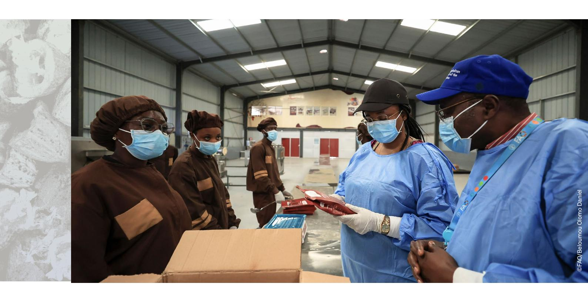

| INVESTMENT EXPENDITURE  | EUR |
|-------------------------|-----|
| miscellaneous equipment | 24  |
| Infrastructure          | 26  |
| TOTAL CAPEX             | 50  |

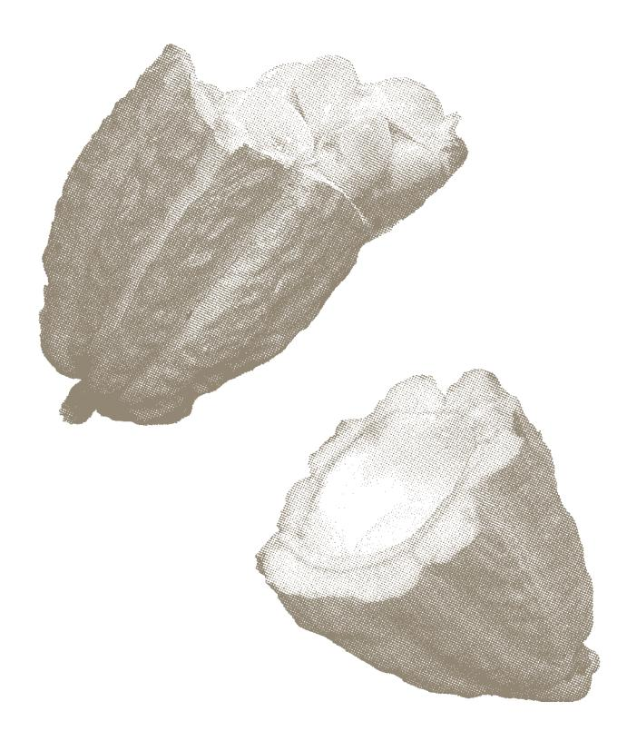

Table 1 CAPEX for a 30 000-tonne processing plant designed with the option of doubling its capacity.

SOURCE: Authors, based on interviews.

## THE OPEX FOR ONE YEAR OF OPERATION IS TWICE THE CAPEX

We modelled the investment and operating costs of a processing unit with a capacity of 30 000 tonnes, a size considered minimal to generate an acceptable profitability for investors. We assumed that this model 30 000-tonne plant was designed with the option of doubling its capacity, as is the case for most recent plants. Planning an extension at the construction stage allows for future economies of scale. This results in higher CAPEX for infrastructure (foundations and buildings) than for a plant designed without an extension. We also selected a plant that is representative of the most recently established plants, in terms of location and the costs of connecting to networks (roads, electricity, water).

With these assumptions, we estimate the CAPEX of a 30 000-tonne plant today to amount to around EUR 50 million (Table 1). Doubling capacity requires a smaller additional investment of EUR 12 million. The average cost of a 60 000-tonne plant is therefore approximately EUR 1 million per 1 000 tonnes of capacity. The processing capacity already installed in the country thus represents more than EUR 1 billion in CAPEX undertaken in Côte d'Ivoire. This reflects the success of the Ivorian authorities' industrial policy in the sector.

Marginal CAPEX requirements decrease as plant size increases. The cost structure shows that doubling capacity from 30 000 to 60 000 tonnes, and again from 60 000 to 120 000 tonnes, is less CAPEX-intensive than the initial investment. Processing lines (roasting, grinding, pressing) account for the bulk of CAPEX during an expansion. For an increase from 30 000 to 60 000 tonnes, they account for between 20 and 25 percent of the initial CAPEX.

Just over 85 percent of annual OPEX, estimated based on the prevailing bean price during the 2024/25 season, is allocated to bean purchases, with the remainder covering salaries and energy, particularly electricity. It is not so much the level of electricity expenditure (about 5 percent of annual OPEX for a factory operating at full capacity) that determines plant viability, but rather the continuity of supply and the stability of voltage throughout the year.

The annual OPEX of a 30 000-tonne plant, based on farm gate price levels for the 2024/25 season, is estimated at about EUR 90 million. To give an order of magnitude, the OPEX for one year of operation of a new 30 000-tonne plant is therefore roughly twice the amount of the initial CAPEX.

## A CLOSE TO EUR 4 BILLION WCR

The relative importance of OPEX compared with CAPEX, and the dominant share of cocoa bean purchases within OPEX, make the financing of the bean supply a central element in both the economic model of a processing plant and the functioning of the sector.

A processor must satisfy almost 65 percent of its cocoa bean requirements over a four-month period, from October to January, corresponding to the production peak of the main crop (Figure 3). The need for financing is therefore particularly acute at this time of year. Added to this is the length of the financing cycle itself, that is the gap between the cash outflow to finance bean purchases (cash-out) and payment by the buyer (cash-in). The financing cycle for cocoa bean processing lasts about three months, from pre-financing in production areas through milling, delivery to port, and customs clearance procedures. This cycle can be shortened, but only marginally. The financing cycle for cocoa bean exports is more flexible; it consists of half a month in production areas (pre-financing), half a month for fermentation, drying, and sorting, and between one and two months for administrative management and procedures (customs clearance, etc.), depending on the operator. It can therefore last up to three months but is generally shorter. For calculation purposes, we assume a three-month financing cycle for the cocoa WCR (bean exports and processing).

We base our analysis on a flow of monthly bean deliveries to ports and processing plants, similar to that observed during the 2023/24 season. Assuming a three-month financing cycle and applying monthly delivery data from 2023/24, we estimate the WCR of Ivorian processors and exporters under different farm gate price scenarios (Figure 4). A price of 1 000 XOF/kg (EUR 1 525/tonne) corresponds to the 2023/24 main crop; 1 500 XOF/kg (EUR 2 285/tonne) to the 2023/24 mid-crop; and 1 800 XOF/kg (EUR 2 745/tonne) to the 2024/25 main crop. Prices of 2 500, 3 000, 3 500 and 4 000 XOF/kg are hypothetical. With the farm gate price set at 60 percent of the CIF (cost, insurance, and freight) value for northern Europe, they correspond to CIF sales prices of EUR 6 350/tonne (2 500 XOF/kg), EUR 7 620/tonne (3 000 XOF/kg), EUR 8 890/tonne (3 500 XOF/kg), and EUR 10 160/tonne (4 000 XOF/kg). All these price scenarios are plausible in light of current cocoa price volatility, although their likelihood diminishes as the price level used for illustration rises. For comparison, in April 2025, the CCC set the farm gate price for the mid-season campaign at 2 200 XOF/kg (3 350 EUR/tonne farm gate price). A few months later, in October 2025, the farm gate price for the main 2025/26 campaign was set at 2 800 XOF/kg (4 270 EUR/ tonne farm gate price), a new record. According to our calculations, the sector's peak WCR in December 2025 and January 2026 could be close to EUR 4.3 billion, based on the new farm gate price of 2 800 XOF/kg. This would almost triple the EUR 1.5 billion peak recorded during the 2023/24 season and be over EUR 1.5 billion higher than our estimated peak for 2024/25.

To provide an order of magnitude, Côte d'Ivoire's GDP in 2023 amounted to some EUR 73 billion. The peak WCR of cocoa processors and exporters, that is, the cash circulating mainly between production areas, plants, and ports at the end of the year, could therefore temporarily account for more than 5 percent of annual Ivorian GDP. At this price of 2 800 XOF/kg, the cargo of a single 35-tonne truck of bean sacks is now worth nearly 150 000 euros. The cost of the bean supply in the cocoa sector is placing unprecedented pressure on the funding of the Ivorian economy.

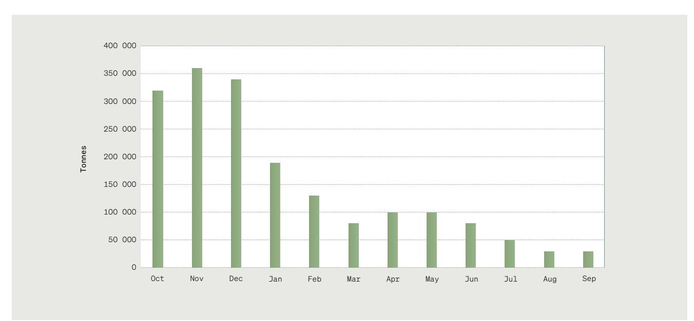

Figure 3

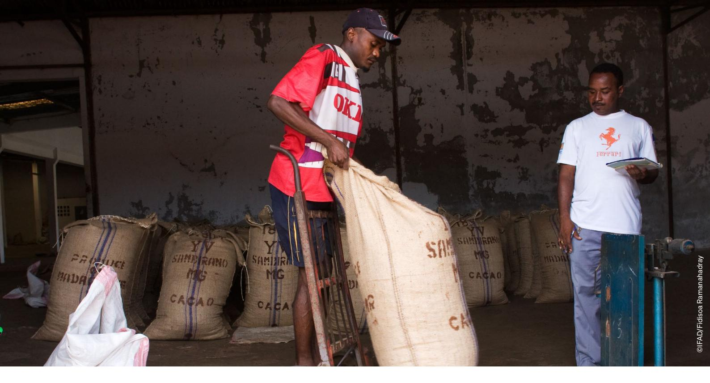

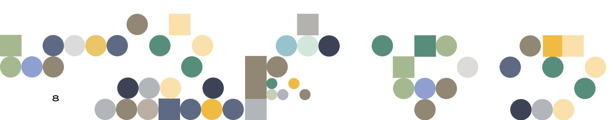

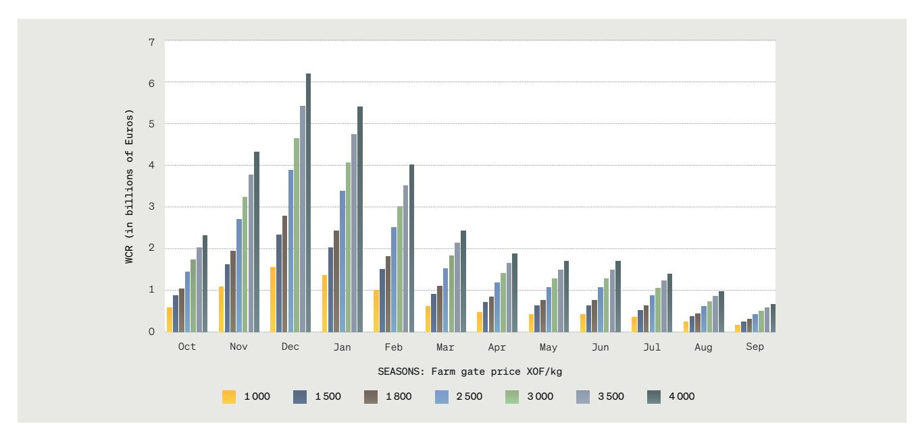

Figure 4

Estimation of the working capital requirements of cocoa bean processors and exporters under different price scenarios, based on the seasonality of bean deliveries recorded in 2023-2024 for a crop of 1.8 million tonnes

NOTE: The WCR for a given month corresponds to the financing of deliveries over the previous three months. Thus, the WCR for October corresponds to the financing of port deliveries in August, September, and October, while the WCR for November corresponds to the financing of port deliveries in September, October, and November, and so forth. SOURCE: Authors' own elaboration based on data collected from exporters.

With processing capacity accounting for around 50 percent of annual bean production, processing would represent half of the sector's total WCR. According to our

calculations, the peak WCR of Ivorian processors alone could be around EUR 2 billion in December 2025, based on the farm gate price of 2 800 XOF/kg.

## FINANCING WCR

How can WCR be financed? First, it should be noted that many banks are extremely active in financing cocoa. One bank we interviewed reported, for example, that the sector accounted for 8 percent of its loan portfolio, with this allocation readjusted each season.

Banks use two types of financing lines to cover the cocoa sector's WCR: spot credit lines and advances on pledged goods. Spot credit lines are used to purchase cocoa in production areas before it is prepared for processing. The advances on pledged goods are designed to finance inventories. They are granted in exchange for the storage and pledging of goods, whose value must be verified on behalf of the bank. When cocoa is packaged for storage, it is pledged against a fixed value, the ex-warehouse price, which corresponds to cocoa cleaned to export standards and ready for export or processing. The beans are then dehulled before processing. Semi-finished products may be pledged a second time, but in most cases, these are purchased quickly by customers and do not require stock financing. Given the pressure on their WCR, processors in Côte d'Ivoire have every interest in selling their semi-finished products as quickly as possible.

The cost of financing WCR varies according to the bank, the borrower, and policy rates, with a maximum of 8 percent (excluding tax) set by the CCC in its schedule. This corresponds to data collected from commercial banks in Côte d'Ivoire, which would apply interest rates ranging from 6 to 8 percent (excluding taxes) for WCR financing. The 80 percent increase in the farm gate price in October 2024 compared with the previous main crop season (from 1 000 XOF/kg to 1 800 XOF/kg) had already led to an unprecedented rise in the WCR of operators in the sector, to which Ivorian banks were able to respond only marginally. One bank we met reported that it had increased its exposure to the sector by 12 percent. In addition, a 2024/25 main crop that fell short of expectations led operators to concentrate their purchases, and therefore their financing needs, into an even shorter period than usual.

At least three factors account for the shortage of bank credit allocated to cocoa processing in the current context of historically high prices.

The first factor is the banks' own access to liquidity. Financial institutions can draw on several instruments to meet rising financing needs: mobilizing local savings, requesting a liquidity injection from the Central Bank of West African States (BCEAO), refinancing on the interbank market, or securing lines of credit from international financial institutions, primarily development banks. In an emergency, a liquidity injection from the BCEAO is theoretically the quickest option. Yet in the last quarter of 2024, owing to the exceptional concentration of bean purchases described above, the sums requested by Ivorian banks were so large that the interbank market stopped functioning, and even the BCEAO struggled to meet demand.

The second factor is the banks' prudential risk management. Like all financial institutions, Ivorian

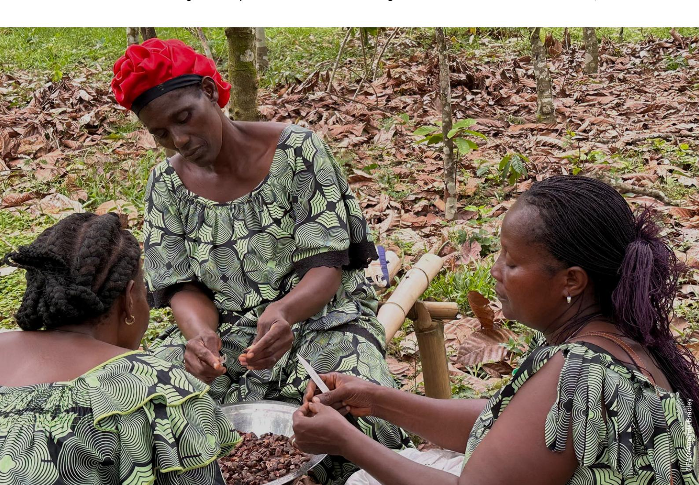

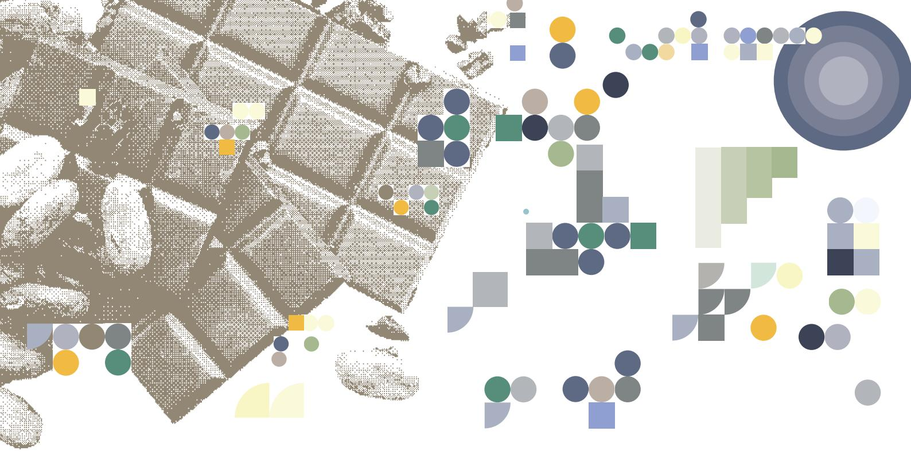

banks must comply with certain ratios, either imposed by the BCEAO (maximum exposure per borrower, capital adequacy, liquidity, etc.) or defined within each bank's own risk framework (such as maximum concentration by sector). They still have in mind the 2017 collapse of a local exporter that accounted for up to 10 percent of the country's cocoa bean shipments. That bankruptcy is estimated to have cost the country's financial institutions more than EUR 220 million (Aboa, 2018). Even so, some Ivorian banks have since developed a greater appetite for cocoa and a deeper understanding of the sector than others and view its growth as a major financing opportunity.

The third factor concerns tax and regulatory provisions that shape demand for financing from national banks. The recent introduction by Ivorian authorities of a 1 percent levy on intragroup pre-financing for sourcing beans has mechanically shifted part of international groups' financing needs onto the local banking sector. This has intensified competition for liquidity just as overall needs have risen in response to higher farm gate prices.

Our interviews show that banks regard financing cocoa bean export activities, which account for more than half of the value of cocoa product exports, as more attractive than financing processing. This greater appetite can be explained by several factors: limited knowledge of semi-finished product markets, the lower transparency of those markets, the difficulty of calculating a processor's margins compared with those of a bean exporter, and the lower liquidity of semi-finished product stocks. In addition, the financing cycle for cocoa bean exports is shorter than that for semi-finished products, allowing banks to recycle credit lines for bean exports more frequently. In the competition for access to finance, the main rival of cocoa processing plants is cocoa itself. Not to mention the cotton and cashew seasons, which are likely to suffer from the increased financing needs of the cocoa sector.

Faced with the banking sector's constraints on financing the working capital needs of the entire cocoa value chain, and processing in particular, processors have several options. They may obtain intra-group financing in the case of international companies, or rely on a principal buyer (an "off-taker") who undertakes to purchase a certain volume of products and may finance part of a given supplier's working capital (an off-take contract with a reputable counterparty generally facilitates access to loans from local banks), or seek financing from development finance institutions or international financial institutions (DFIs or IFIs). Another option is to defer payment to suppliers, although this jeopardizes access to beans and, therefore, the operation of processing facilities and company profitability. Limited access to WCR is, therefore, a factor that widens inequalities among processors.

We have not included the cost of hedging against market risk in estimating the financing needs of plants and of the sector as a whole. This cost is significant for cocoa bean exports and also for semi-finished products, given the volatility of mass, butter, and powder prices, and is usually borne by the processor or exporter's parent company or its off-taker. No Ivorian financial institution currently offers such hedging services. The cost of hedging is therefore incurred outside the country and can be substantial. For a processor or bean exporter, the amounts tied up by margin calls during periods of high volatility and sharp price increases, as has been the case since 2023, are comparable to its WCR.

# KNOWN UNKNOWNS

Opportunities to finance cocoa processing in Côte d'Ivoire focus mainly on WCR rather than CAPEX. The needs estimates and the financing recommendations we propose must be considered in the light of certain "known unknowns". These could either heighten the scale and urgency of financing needs or, by spreading them over a longer period, somewhat reduce their importance. These "known unknowns" are as follows.

Trends in world's cocoa demand. Consumption of chocolate, the ultimate "comfort" product, has shown strong resilience even during economic crises (Cougard, 2025). A one-off quadrupling of cocoa prices, which topped EUR 10 000/tonne several times in the past two years, has only marginally affected short-term consumption. Grindings are expected to fall by 2 percent in Europe and the United States in the 2024 calendar year compared with the previous year, with forecasts of a 4 percent decline for the 2024/25 season compared with the previous season. This surge has not "destroyed" demand as much, or as quickly, as some operators had anticipated. Low short-term price elasticity, however, does not shed light on the longterm growth prospects for global demand for cocoa beans and semi-finished products. The main outlets for semi-finished cocoa products remain Europe and the United States, long-established markets where per capita chocolate consumption is the highest in the world. The growth in consumption that Asia or Africa could represent is slow to take over. The few available estimates suggest that per capita chocolate consumption is around 8 kg in Switzerland and Germany, compared with less than 300 g in China (Dunn, 2023).

Trends in cocoa bean production in Côte d'Ivoire. Ivorian orchards are ageing. Episodes of swollen shoot – a disease that can only be treated by uprooting the trees – are reducing yields, while climate change is increasing exposure to disease and disrupting both the distribution and intensity of rainfall. A business-asusual scenario could lead to a structural flattening of production at around 1.8 million tonnes, which was the level recorded in the 2023/24 season. This would constrain the bean supply for processing plants, in a context of likely high prices, given Côte d'Ivoire's dominant share of world cocoa production. Conversely, active orchard management, combining higher yields, tree renewal, greater use of inputs, the deployment of hybrids, and farming practices such as agroforestry that enhance the resilience of cocoa trees, could ease this supply constraint by increasing the availability of beans throughout the year.

Trends in cocoa bean production in other geographies. The decline in cocoa production over the past three years in Côte d'Ivoire and Ghana, which together account for between 55 and 60 percent of world output, combined with the concomitant rise in prices, has spurred investment in cocoa plantations elsewhere. This is particularly true of Brazil and Ecuador, which are promoting a production model described as "high tech" (Teixeira, 2025), based mainly on large plantations of high-yield hybrids grown in full sun, mechanized, irrigated, and heavily input-dependent. A cocoa tree generally takes three to five years to produce its first fruit. Over the coming years, it will become clear whether these ambitious plans translate into a significant and enduring increase in production in these countries. However, the history of cocoa shows that a major producing country can see its orchards decimated by an insect or fungus in just a few years, as with "witch's broom", which ravaged Brazil's plantations last century. Exposure to climate change and the diseases that accompany it affects the entire intertropical belt and all cocoa-producing countries without distinction. This could make the large-plantation model, with its cloned monotypes all reacting identically to an aggressor in the absence of genetic diversity, particularly vulnerable (Teixeira, 2025).

Trends in regulatory and fiscal provisions in Côte d'Ivoire. Depending on the year and the level of cocoa bean production in Côte d'Ivoire, plants are permitted to store only part of the main crop. In a scenario where production remains low and the risk of temporary surpluses in processing capacity becomes real, such storage constraints could affect plant utilization rates and, consequently, their economic viability. Another provision concerns the tax on intragroup pre-financing of purchases introduced during the 2023/24 season. As a result of this tax, international companies established in Côte d'Ivoire have increasingly turned to local banks, thereby intensifying pressure and competition for access to liquidity.

The BCEAO's response capacity to the timely liquidity needs of Ivorian banks. Requests by Ivorian banks for liquidity injections to finance the peak WCR of the cocoa sector between October and January can reach very important levels. In the current context of high prices and concentrated seasonal purchases, it is important to alert the monetary authorities to the specific needs of Ivorian banks financing cocoa, so that the BCEAO is prepared to anticipate a possible increase in such liquidity injection requests during the last quarter of each season.

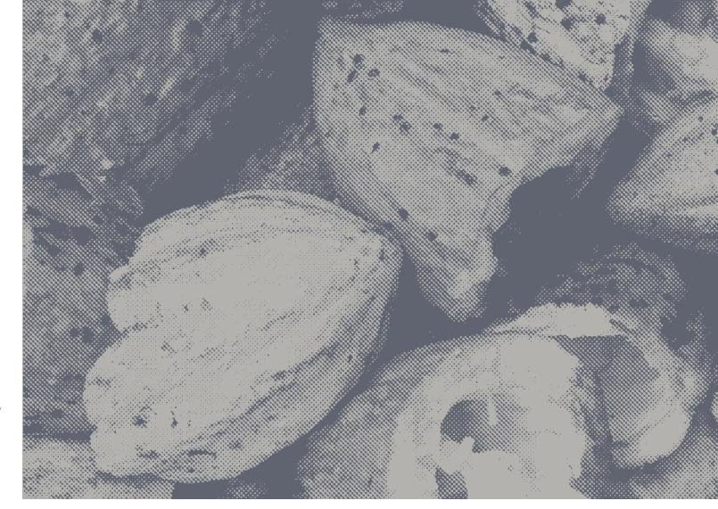

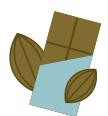

A priority for development finance institutions (DFIs) and international financial institutions (IFIs) interested in the development of the Ivorian cocoa sector could be to inject more liquidity to improve the financing of WCR in the sector in general, and in processing in particular.

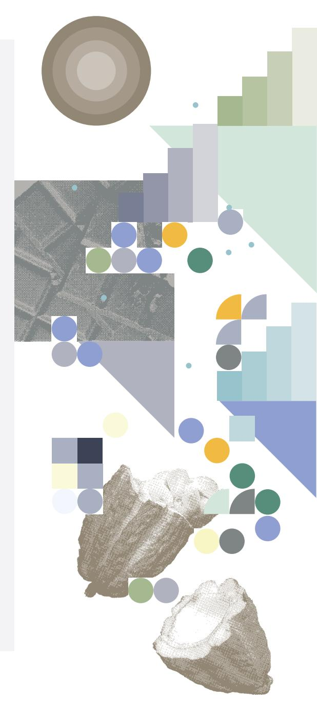

Côte d'Ivoire has successfully convinced national and international companies to invest hundreds of millions of euros in processing plants, making it the world's leading processor in terms of capacities. The objective of the Ivorian authorities is to consolidate this position. Regular and predictable access to good-quality cocoa beans is one of the key success factors in processing. It determines the financial viability of processing plants and, therefore, the sustainability of their jobs. Improving this access requires, in particular, better financing of the sector's WCR.

It can be broken down as follows:

Creation of cocoa-specific credit lines by DFIs and IFIs, channelled through Ivorian banks and then allocated to processors, exporters, and their suppliers (including cooperatives). Direct financing of the WCR of cocoa bean processors and exporters by DFIs, IFIs, and investment funds. While DFIs and IFIs often prefer to finance CAPEX investments, they should systematically add a WCR credit line when financing processors' CAPEX, so that such financing also reaches further upstream in the value chain. Financing the international buyers of Ivorian beans and semi-finished products by DFIs and IFIs, to extend this financing upstream through the value chain. Capital injection into investment funds equipped to finance the WCR of processors or exporters of cocoa beans, their suppliers (cooperatives), or their off-takers. The creation of an ad hoc investment fund dedicated to financing the Ivorian cocoa sector, and particularly its WCR, could also be considered. Support for building expertise within the Ivorian banking sector in cocoa processing and its financing. Capital without human capital cannot meet its demand. Provision of technical assistance to accelerate the digitalization of financial transactions in the Ivorian cocoa sector, in line with CCC initiatives such as the introduction of the producer's card. Bean purchases in production areas are still carried out mainly in cash. Digitalizing these purchases could help reduce the risk of liquidity crises, build investor confidence, improve traceability in the sector (notably in the context of EU regulations on deforestation), and enhance the physical security of producers and bean transporters.

Some rights reserved. This work is made available under the Creative Commons Attribution - 4.0 International licence (CC BY 4.0). Some rights reserved. This work is made available under the Creative Commons Attribution - 4.0 International licence (CC BY 4.0).

#### REFERENCES

Aboa, A. 2018. Ivory Coast banks struggle with fallout from 2016/17 cocoa crisis. Reuters, 5 June 2018. [Cited 29 October 2025]. [https://www.reuters.com/article/business](https://www.reuters.com/article/business%20ivory-coast-banks-struggle-with-fallout-from-201617-cocoa-crisis-idUSKCN1J11V0/)  [ivory-coast-banks-struggle-with-fallout-from-201617-cocoa](https://www.reuters.com/article/business%20ivory-coast-banks-struggle-with-fallout-from-201617-cocoa-crisis-idUSKCN1J11V0/)[crisis-idUSKCN1J11V0/](https://www.reuters.com/article/business%20ivory-coast-banks-struggle-with-fallout-from-201617-cocoa-crisis-idUSKCN1J11V0/)

Cougard, M.J. 2025. Chocolat, Redbull et Ricard: les champions des supermarchés en 2024. Les Échos, 9 février 2025. Paris. [Cited 23 july 2025]. [https://www.lesechos.fr/industrie-ser](https://www.lesechos.fr/industrie-services/conso-distribution/chocolat-redbull-et-ricard-les-champions-des-supermarches-en-2024-2142819)[vices/conso-distribution/](https://www.lesechos.fr/industrie-services/conso-distribution/chocolat-redbull-et-ricard-les-champions-des-supermarches-en-2024-2142819) [chocolat-redbull-et-ricard-les-champions-des-super](https://www.lesechos.fr/industrie-services/conso-distribution/chocolat-redbull-et-ricard-les-champions-des-supermarches-en-2024-2142819)[marches-en-2024-2142819](https://www.lesechos.fr/industrie-services/conso-distribution/chocolat-redbull-et-ricard-les-champions-des-supermarches-en-2024-2142819)

Dunn, R. 2023. Chocolate consumption per capita around the world. Dans: ERND. Payson (États-Unis). [Cited 23 July 2025]. [erndsnacks.com/blogs/news/](https://www.erndsnacks.com/blogs/news/chocolate-consumption-per-capita-around-the-world) [chocolate-consumption-per-capita-around-the-world](https://www.erndsnacks.com/blogs/news/chocolate-consumption-per-capita-around-the-world) 

First Grade International Ltd. Cocoa Market Report. Bromsgrove. [Cited 24 May 2025]. [https://www.fg-int.co.uk/reports/](https://www.fg-int.co.uk/reports/cocoa-market-report-may-2025/) [cocoa-market-report-may-2025/](https://www.fg-int.co.uk/reports/cocoa-market-report-may-2025/)

Gouvernement de Côte d'Ivoire. Statistiques du portail officiel. Abidjan. ([Cited 25 April 2025]. [www.gouv.ci](https://www.gouv.ci/) 

ICCO. Cocoa Market Report. Abidjan. [Cited 24 May 2025]. [https://](https://www.icco.org/icco-documentation/cocoa-market-review/) [www.icco.org/icco-documentation/cocoa-market-review/](https://www.icco.org/icco-documentation/cocoa-market-review/)

Panamir. Cocoa Market Reports. Tallinn. [Cited 24 May 2025]. <https://panamir.com/cocoa-market-trends-may-2025/>

Teixeira, M. 2025. Brazil's would-be cocoa king aims to revolutionize industry with giant farm. Reuters, 22 avril 2025. [Cited 25 May 2025]. [/www.reuters.com/markets/commodities/](https://www.reuters.com/markets/commodities/brazils-would-be-cocoa-king-aims-revolutionize-industry-with-giant-farm-2025-04-22/) [brazils-would-be-cocoa-king-aims-revolutionize-industry](https://www.reuters.com/markets/commodities/brazils-would-be-cocoa-king-aims-revolutionize-industry-with-giant-farm-2025-04-22/)[with-giant-farm-2025-04-22/](https://www.reuters.com/markets/commodities/brazils-would-be-cocoa-king-aims-revolutionize-industry-with-giant-farm-2025-04-22/)

The designations employed and the presentation of material in this information product do not imply the expression of any opinion whatsoever on the part of the Food and Agriculture Organization of the United Nations (FAO) concerning the legal or development status of any country, territory, city or area or of its authorities, or concerning the delimitation of its frontiers or boundaries.

#### ABBREVIATIONS

| ASPG  | Wavance sur produits gagés             |
|-------|----------------------------------------|
| BCEAO | Central Bank of West African States    |
| CAPEX | capital expenditure                    |
| CCC   | Coffee and Cocoa Council               |
| CIF   | cost, insurance, and freight           |
| DFI   | development finance institution        |
| GDP   | gross domestic product                 |
| iEPA  | Interim Economic Partnership Agreement |
| IFI   | international financial institution    |
| OPEX  | operating expenses                     |
| WCR   | working capital requirements           |
| XOF   | CFA franc                              |

#### ACKNOWLEDGEMENTS

The authors would like to thank Regis Meritan, Directorate-General for International Partnerships of the European Commission, for his comments and support in publishing this study. They would also like to thank the numerous reviewers and industry professionals for their valuable remarks and suggestions.

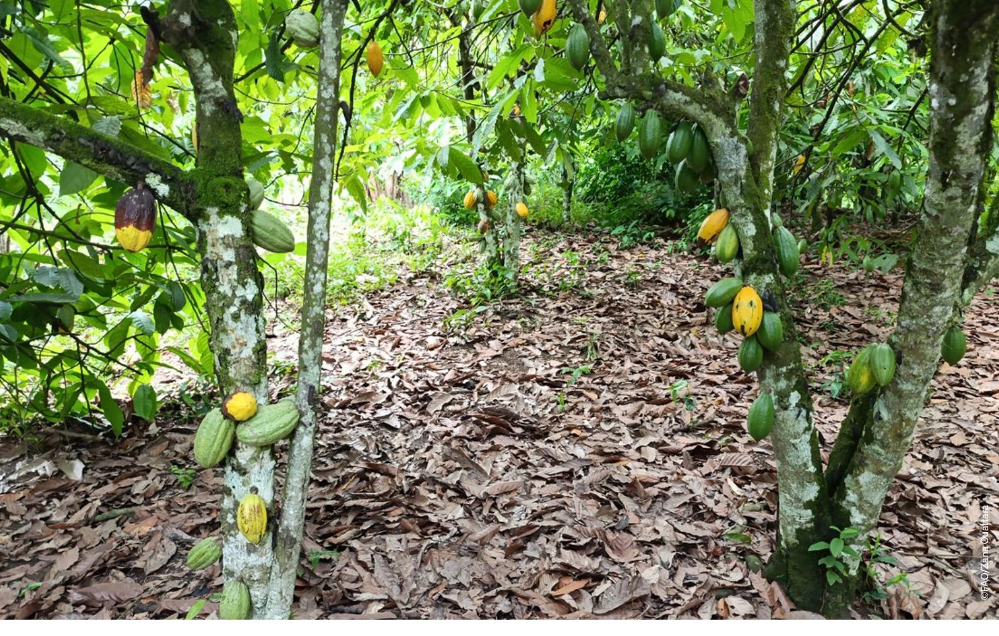