# **EU Compliant Soy with Impact:** Guiding companies through the guidelines

Version 2.2, May 2025

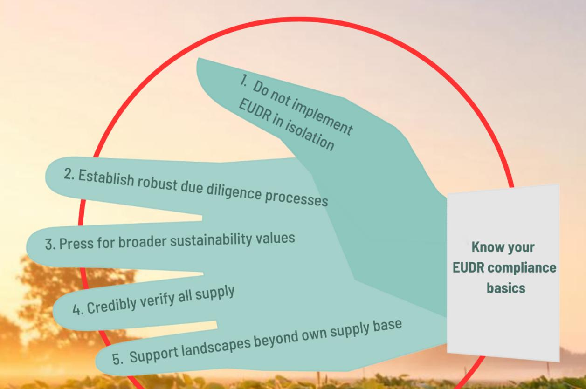

**Version 2.2**

**Including insights in the latest EUDR Guidance and a list of useful tools to support compliance**

### **Table of contents**

| Summary of advice for compliance with impact:                                                                                                                                                       | ................................................................................................................7                                                   |
|-----------------------------------------------------------------------------------------------------------------------------------------------------------------------------------------------------|---------------------------------------------------------------------------------------------------------------------------------------------------------------------|
| 0.                                                                                                                                                                                                  | Know your EUDR compliance basics..................................................................................................................................8 |
| 1.                                                                                                                                                                                                  | Rule of thumb: to be future proof, do not implement EUDR in isolation...............................................................12                              |
| 2.                                                                                                                                                                                                  | Laying your finger on the weak spots: implement solid due diligence processes for all sustainability                                                                |
| 3.                                                                                                                                                                                                  | Pressing for full sustainability: choose for sustainably physically certified soy to assure-and mix into                                                           |
| 4.                                                                                                                                                                                                  | As the devil is in the detail; use credible traceability, DCF and legality verification mechanisms for your                                                         |
| entire business                                                                                                                                                                                     | 22                                                                                                                                                                  |
| 5.                                                                                                                                                                                                  | Cherish the relation: to have local effect on conservation where it counts, engage with conversion                                                                 |
| risk, high biodiversity landscapes                                                                                                                                                                  | – also beyond your own supply base.............................................................. 27                                                                 |
| Summary of advice for compliance with impact:                                                                                                                                                       | 31                                                                                                                                                                  |
| chain.............................................................................................................................................................................................. | 32                                                                                                                                                                  |

**The Collaborative Soy Initiative is a collaborative framework with the vision of 100% conversion-free, sustainable soy production and market uptake, on a global scale. Our mission is to create synergies, inform about actions and add value through activities such as webinars, meta-meetings between soy initiatives and experts, an information hub with documentation, and overall guidance on soy policy to steer on impact. Front-running companies, member associations, sustainability standards and civil society organizations in the soy supply chain join hands in CSIs activities. Building on thorough dialogue between soy initiatives, CSI promotes the use of multiple instruments to tackle the sustainability challenges linked to soy production.**

**Reference: CSI (2025) EU Compliant Soy with Impact: Guiding companies through the guidelines. The Collaborative Soy Initiative, Version 2.2, May 2025.** 

## **Introduction**

**The new E[U Regulation on deforestation-free products](https://eur-lex.europa.eu/legal-content/EN/TXT/?uri=CELEX%3A32023R1115&qid=1687867231461) or EUDR has been created by the European Commission to bring down greenhouse gas emissions and biodiversity loss. It promotes the consumption of deforestation-free products and the reduction of the EU's trade related impact on global deforestation and forest degradation.**

[The Regulation](https://eur-lex.europa.eu/legal-content/EN/TXT/?uri=CELEX%3A32023R1115&qid=1687867231461) is part of a broader plan of actions to tackle deforestation and forest degradation first outlined in the [2019 Commission Communication on Stepping up EU Action to Protect and Restore](https://eur-lex.europa.eu/legal-content/EN/TXT/?qid=1565272554103&uri=CELEX:52019DC0352)  [the World's Forests](https://eur-lex.europa.eu/legal-content/EN/TXT/?qid=1565272554103&uri=CELEX:52019DC0352). This commitment was later confirmed by the [European Green Deal,](https://ec.europa.eu/info/strategy/priorities-2019-2024/european-green-deal_en) th[e EU](https://environment.ec.europa.eu/strategy/biodiversity-strategy-2030_en)  [Biodiversity Strategy for 2030](https://environment.ec.europa.eu/strategy/biodiversity-strategy-2030_en) and th[e Farm to Fork Strategy](https://ec.europa.eu/food/horizontal-topics/farm-fork-strategy_en)1 [.](#page-3-2)

Soy is one of the seven commodities covered by this European Regulation on Deforestation-free Products (EUDR[\)](#page-3-3)2 . As of 30 December 2025 several soy products imported to, produced and traded in, as well as exported from the European Union need to be traceable to plot level of production, need to be produced in line with national legal requirements in producing countries and need to have a negligible risk to have contributed to deforestation.

Annex 1 of EUDR lists all products in scope. For soy, the HS-codes 1201, 1208 10, 1507 and 2304 are included. Traders and operators making available these products to -or exporting them from- the European Union, need to exercise or ascertain Due Diligence and the issuance of a Due Diligence Statement. This Due Diligence Statement contains all polygons of the plots from where the soy sold is harvested, and declare that there is negligible risk of non-compliance with the EUDR.

Also on its turn, the EUDR is part of a broader legislative environment in the EU, alongside a broader EU Corporate Sustainable Due Diligence Directive and requirements such as the Corporate Sustainability Reporting Directive.

**Building on and referring to the work of many others, this CSI guidance helps companies prepare for the EUDR and other EU legislation, implementing solid policies and procedures to address deforestation, ecosystem conversion and broader sustainability challenges, and have genuine impact on the ground.** 

### **The Collaborative Soy Initiative (CSI) vision on the topic**

Stakeholders in CSI share the goal of 100% conversion-free, sustainable soy production and market uptake, on a global scale. CSI is convinced that a mix of measures is needed to achieve this goal, including supply chain tools and supplier policies, legislation and landscape programs. Mandatory *and* voluntary measures are both needed in tailor-made combinations to achieve scale and impact with conversion-free sustainable soy.

The EUDR is not a Superman law diving into the crisis solving all deforestation problems, as is it sometimes viewed, and therefore provokingly portrayed in earlier CSI webinars on the topic. EUDR in the case of soy is – and needs to be- part of a package of many already existing and also new, complementary, measures in producing and consuming countries towards good governance of soy supply chains and landscapes.

The experience and tools of current voluntary soy sustainability initiatives and robust standards can support and supplement mandatory company due diligence and can have an increased effect if synergies are created among them. In return, strong legal frameworks and their compliance are

1 [https://environment.ec.europa.eu/topics/forests/deforestation/regulation-deforestation-free-products\\_en](https://environment.ec.europa.eu/topics/forests/deforestation/regulation-deforestation-free-products_en)

2 Please find the full text here:<https://eur-lex.europa.eu/legal-content/EN/TXT/PDF/?uri=CELEX:32023R1115>

important for voluntary initiatives to succeed and scale up as otherwise they are not backed sufficiently by a level playing field. The recognition of the value of *combining tools* is key. The European Commission also has other laws in place, such as the Corporate Sustainability Due Diligence Directive (CSDDD), that require due diligence in which this combination of tools will turn out to be key. However, even if the EC has recognized the need for a "smart mix of measures", despite the many meetings, Frequently Asked Questions, private sector will have to lead the way in making this a practical reality. We try to lend a hand with this guidance.

## EU Regulation on deforestation-free products

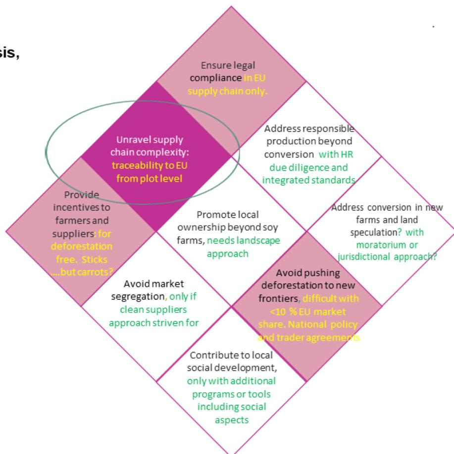

**Magicube, dialogue tool**  
**Potential output of gap analysis,**  
**Disclaimer: Just a quick scan**

Figure 1: the EUDR can only cover some aspects of what is needed to achieve sustainable land use and forest protection. Remarks are made in italic on what complementary measures would be needed to support impact.

The EUDR can help lead to forest protection, deforestation free soy value chains and production areas, if implemented well. Expectations differ on what leverage effect EUDR can have, for example to effectuate a broader use of national and international traceability and verification systems in producing countries, something which would help avoid market segregation EU/ non-EU. The EUDR offers such opportunities, but also entails risks for adverse effects such as abandoning responsible producers in forest frontier areas, difficult landscapes and smaller suppliers. It concentrates on traceability to plot for the EU, potentially leading to separate streams and split markets. This would mean: cleaning EU supply chains rather than implementing a broad range of sustainability criteria on the ground.

For CSI it is key that these impact issues are addressed, for the EUDR to play a meaningful role for forest and ecosystem protection and sustainable land use. To create positive impact in producing countries EUDR should strengthen local governance and for that it can be combined with groundwork done by voluntary initiatives over the past 20 years.

The Frequently Asked Questions and EUDR Guidance issued on October 5, 2024 clearly state that robust third party verification systems and third party verified certification can help with compliance3 [.](#page-5-1)In our earlier CSI 'Magicube' mode[l](#page-5-2)4 , six different approaches- developed in the voluntary sphere - were distinguished. These are: robust certification systems, biome specific moratoria, clean supplier approaches, landscape projects, carbon foot printing and multi-stakeholder cooperation. European Union legislation could stimulate the uptake of such measures but also can marginalize them further as their value for the EUDR as such is not formally recognized by the European Commission. It is for instance likely that robust certification - which controls on deforestation and broad aspects of legality of physical commodity volumes to the origin – helps meet the due diligence requirements of traders and operators under the EUDR. Direct supplier engagement is key to arrange for EUDR compliance but also to achieve stronger company-wide deforestation and conversion-free policies. In addition, biome-wide measures such as the Amazon Moratorium, and credible landscape initiatives in Cerrado, Chaco and elsewhere will be needed to make a sustainable impact in risk-landscapes. Government to government engagement between EU Member States and producing countries is also key for the EUDR to strengthen national land governance.

### **About this guidance**

CSI convened many earlier meetings on the topic of EUDR and combining measures for impact throughout 2022-202[4](#page-5-3) . CSI enabled dialogue between various soy initiatives and experts. This guide seeks to build on these insights and translate the earlier CSI "Magicube" view of multiple solutions into a vision and tangible recommendations within the new EU Regulatory framework. The very recent Strategic Framework for International Cooperation on EUDR by the EC, accompanying the EC guidance and new FAQ, also supports a more integrated view on tools.

Connected with the thought-work of many initiatives, CSI seeks to guide on EUDR implementation as a leverage to create positive impact on biodiversity conservation –including but beyond forests and land use change- as well as human rights and social concerns.

In order to do that, the EUDR should not be viewed in isolation by any actor. We collectively need to embrace a broader view on forest and ecosystem protection and sustainable land use while implementing the EUDR. This guidance provides key recommendations for business leaders who seek to comply with EUDR, with upcoming European Union rules but also steer on impact -rather than just ticking boxes in the paperwork for Competent Authorities. We realize this is much easier said than done; that is why CSI tries to lend a hand.

**Notification: This guide remains a living document. As best as we can we refer to all relevant EUDR guidance presented by the European Commission up to the date of publication (May 2025). We refer to our** 

3 [c-2024-7027-1-en-guidance-on-eu-deforestation-regulation.pdf \(thecollaborativesoyinitiative.info\)](https://thecollaborativesoyinitiative.info/storage/files/c-2024-7027-1-en-guidance-on-eu-deforestation-regulation.pdf) 4 CSI & Proforest (2021), [Multiple routes to responsible sourcing,](about:blank) [https://thecollaborativesoyinitiative.info/storage/files/csi](https://thecollaborativesoyinitiative.info/storage/files/csi-and-proforest-2021the-multiple-routes-to-sustainable-sourcing-nov-18-20211.pdf)[and-proforest-2021the-multiple-routes-to-sustainable-sourcing-nov-18-20211.pdf](https://thecollaborativesoyinitiative.info/storage/files/csi-and-proforest-2021the-multiple-routes-to-sustainable-sourcing-nov-18-20211.pdf)

5 See all public events done so far:<https://thecollaborativesoyinitiative.info/what-we-do/upcoming-and-past-events/past>

**new Annex with tools for traceability and verification of EUDR compliance which was not there in our guidance 1.0 and 1.1. The text of the guidance and annex were checked for necessary updates in May 2025.** 

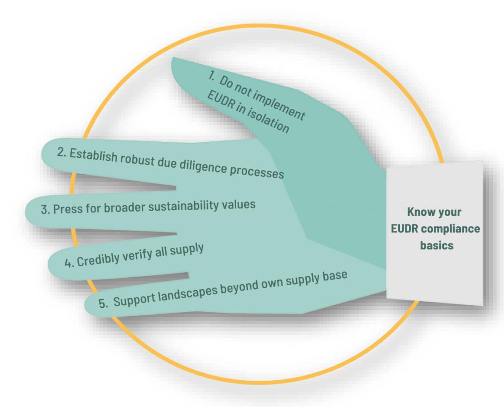

Figure 2. CSI lending a hand(s) on EUDR compliance with impact

### **Summary of advice for compliance with impact:**

- Know your EUDR compliance basics and prepare as soon as possible. When products produced after the day the EUDR entered into force (29 June 2023) enter the market after 30 December 2025 they need to be accompanied with proof of no-deforestation and legal compliance in line with EUDR requirements. Especially for products that can be stored for a while this will become a factor.
- Implement solid due diligence structures for compliance with EUDR, the Due Diligence legislation (EU CSDDD) and other legislation. The EUDR should not be viewed in splendid isolation, especially not in view of impact.
- "Other wooded lands" may be included as well. Don't wait for the Commission to include these and other ecosystems, but rather work towards no conversion of natural ecosystems such as in the Cerrado, Gran Chaco, Pantanal or Pampas from the start.
- Recognize existing cut-off dates and don't stimulate supply chain partners to let go of them and relax them to 31 December 2020 as this would mean a set-back. Build strong relations with suppliers to address this and forthcoming challenges in the supply chain.
- In addition, and in support of the above mentioned topics, invest in sustainable soy production via robust certification and landscape approaches and their combinations. EUDR compliance is the minimum in physical trade flows; sustainability however also requires

conversion free, sustainable agricultural practices including chemicals management, as well as targeted conservation and nature restoration support at landscape scales. Use of certification schemes that exclude land conversion can help with EUDR compliance and help to protect these landscapes. Third party verified certification is mentioned as useful in FAQs and EC guidance to help with compliance

- Conversion free responsible production with landscape impact often requires financial or other incentives for producers in terms of premiums, longer term contracts, sustainability linked loans etc. Again, a combination of tools will be needed.

### **0.Know your EUDR compliance basics**

The EUDR was published on 9 June 2023 in the Official Journal of the European Union. There are links to the full texts available in English, Spanish and Portuguese.[6](#page-7-1)

As of 30 December 2025, all products defined in EUDR Annex 1 need to be backed by a Due Diligence Statement guaranteeing legal compliance and no deforestation after 31 December 202[0](#page-7-2)7 . This Due Diligence Statement has to be entered into the Deforestation Due Diligence Registry8 [,](#page-7-3) a special IT system of the European Commission. This has to be done by the trader/operator for shipments for imports (customs procedure 'release for free circulation'), exports (customs procedure 'export') and the consignment for transactions within the Union market.

For soy knowing your EUDR compliance basics means in practice:

- Annex 1 of the EUDR is key. The soy products as defined under HS-codes 1201, 1208 10, 1507 and 2304 shall not be placed or made available on the EU market or exported, unless all the following conditions are fulfilled: all geolocation data of the respective soy volume are known,, is deforestation-free, it has been produced in accordance with the relevant legislation of the country of production and is covered by a Due Diligence Statement.
- The law has entered into force since the publication of the legal text 29 June 2023 and all products entering or leaving the European Union market from 30 December 2025 onwards need to comply. This is irrespective of the production date. That means that products that are produced today but imported, traded domestically on the union market or exported after 30 December 2025 need to comply.
- Connect to your member association to hear about the latest insights about practical EUDR implementation. For example, FEDIOL and COCERAL have prepared a technical support guide on the EUDR basics9 [,](#page-7-4) which will also be updated. In many countries, member associations are the first contact point for the national government and the competent authorities that have to control compliance.

6 <https://thecollaborativesoyinitiative.info/storage/files/st-16298-2022-init-en.pdf> <https://thecollaborativesoyinitiative.info/storage/files/spaanse-versie-wetstekst-pe-82-2022-init-es.pdf> <https://thecollaborativesoyinitiative.info/storage/files/portuguese-version-eudr-celex-32023r1115-pt-txt.pdf>

7 There is a FAQ by the Commission services that helps clarify a couple of concepts. The first (June 2023) FAQ is available here: [https://environment.ec.europa.eu/system/files/2023-06/FAQ%20-%20Deforestation%20Regulation\\_1.pdf](https://environment.ec.europa.eu/system/files/2023-06/FAQ%20-%20Deforestation%20Regulation_1.pdf) 8 [The Deforestation Due Diligence Registry -](https://green-business.ec.europa.eu/deforestation-regulation-implementation/deforestation-due-diligence-registry_en) European Commission (europa.eu)

9 COCERAL and FEDIOL Common Practices and Recommendations on Implementation of the EU Deforestation-free

Regulation (2024), [https://www.fediol.eu/data/24ENV360%20EUDR%20common%20practices%20and%20recommendations%2020%20Septe](https://www.fediol.eu/data/24ENV360%20EUDR%20common%20practices%20and%20recommendations%2020%20September%202024rev.pdf) [mber%202024rev.pdf](https://www.fediol.eu/data/24ENV360%20EUDR%20common%20practices%20and%20recommendations%2020%20September%202024rev.pdf)

- In the due diligence statement the operator or trader confirms that thorough due diligence was carried out and that no, or only a negligible, risk was found that the relevant products are not deforestation-free and not produced in accordance with relevant national legislation. o The cut-off date for deforestation is 31 December 2020. o Important, as so far often overlooked: relevant applicable laws referred to by EUDR text include o land use rights, o environmental protection, o forest-related rules, o third parties' rights, o labor rights, o human rights protected under international law, o the principle of free, prior and informed consent (FPIC), including as set out in the UN Declaration on the Rights of Indigenous Peoples, o tax, anti-corruption, trade, and customs regulations. o Note that, according to article 9, relevant actors need to collect information, documents, and data that demonstrate "adequately conclusive and verifiable information" for both deforestation-free and legal compliance. The focus will be on those laws impacting the legal status of the area of production, deforestation, and forest degradation.
- In each due diligence statement, either the polygons of all production plots on which the soy was (potentially) produced need to be present, or a reference to due diligence statements that contain the information must be added. It can be one GPS code in case of a plot of less than 4 ha. The word potentially was added above because there can be "declaration in excess": one Due Diligence Statement can cover multiple batches, multiple harvests (within one year), and even needs to include at least 200 % of a large silo's capacity. This is because of the bulk trade character of a community such as soy. A silo for example is hardly ever completely empty. The declaration in excess, however, should be within reasonable limits: for example, not a whole municipality, region, or biome, but well-controllable by companies and competent authorities. Please see the FAQs, the EUDR Guidance, and consult your member association or competent authorities on this important matter for soy to be sure.
- All soy in the physical supply chain needs to be EUDR compliant and cannot be mixed in any stage with soy that is not produced in line with the EUDR requirements. Certified and noncertified soy can be mixed as long as all is EUDR compliant. This is not the same as the Mass Balance in which part of the physical flow is of unknown origin and potentially incompliant. All of the physical flow to, in and from EU should be EUDR compliant.
- All due diligence statements need to be uploaded in the Due Diligence Registry of the European Commission. Once the due diligence statement of one or multiple batch(es) is uploaded to it, actors receive a unique Due Diligence reference and verification number.
- This Due Diligence reference number may be transmitted to the next company in the supply chain, for example the feed or tofu manufacturer. All those who are trading or processing soy products with the HS codes 1201, 1208 10, 1507, and 2304 further downstream need to know the Due Diligence reference numbers related to the soy they work with.
- Large operators further down the supply chain may refer to due diligence performed earlier in the supply chain by including the relevant reference number. However, they are still obliged to ascertain that due diligence was indeed carried out and they retain legal responsibility in the event of a breach of the Regulation.
- The due diligence obligation ends as soon the products are turned into a product that is not on Annex 1 anymore. For instance, companies buying soy protein concentrate (HS 2106 10)

do not have to prove compliance to the EUDR so far, nor do companies buying pork or chicken that was fed with soy.

- While setting-up an internal information collection system, realize that EUDR may be expanded towards more ecosystems, starting with "other wooded land". Anticipate these developments by already including sources of information that report about other ecosystems as well. For instance MapBiomas Chaco[10](#page-9-0) and TerraBrasilis Cerrado[11](#page-9-1) show conversion of two important biomes/ ecosystems that are not yet (fully) covered by the EUDR but are very important in the non-conversion commitments of companies and for biodiversity conservation. Also, in these places, most reliable mappings detect land use changes precisely, but do not fully separate forests from the other natural ecosystems, as these are intricately mixed and in progressive transitions among one another, for example from Amazon to Cerrado, or from the relatively moist to drier Chaco. This may make it even more practical to detect conversion as such than to detect deforestation alone.

Although not explicitly requiring physical segregation*,* enforcing the EUDR may require segregated supply chains, as for each due diligence statement all (potential) polygons of origin must be known. Even with declaration in excess, as explained above, this could require logistical changes as compared to the current situation in the soy supply chain. However, this is not the case if *all*  potential sources of a trader/operator are verified deforestation (and conversion-) free and legally compliant, for example through a unified MRV system or a similar assurance mechanism.

Good assurance and verification systems are crucial, and they are among the core competences of robust certification[12](#page-9-2) . – in this case providing useful information to ensure a physical supply of EUDR compliant, conversion free, sustainable soy. This is, as long as their systems or the specific modules applied are aligned with EUDR requirements. See chapter 3 and annex for details on certification.

**Three types of platforms participating in CSI dialogues that help members with EUDR compliance:**

#### *Grains, oils and feed*

Member associations FEFAC (for feed manufactures), FEDIOL (for the oils and fats sector), COCERAL (for grain traders) reach out to their members on the finer technical details of the EUDR compliance needs. They have developed a technical guidance, which is also publicly available[13](#page-9-3)

They are in touch with producing country trade associations such as ABIOVE in Brazil. <https://abiove.org.br/> or the VISEC initiative in Argentina [https://www.visec.com.ar/en/.](https://www.visec.com.ar/en/) We refer to the Annex for more detail.

*Food & retail* 

10 <https://chaco.mapbiomas.org/en/>

11 <http://terrabrasilis.dpi.inpe.br/en/home-page/>

12 ISEAL provides quality criteria for standard systems. [https://www.isealalliance.org/defining-credible](https://www.isealalliance.org/defining-credible-practice/iseal-codes-good-practice)[practice/iseal-codes-good-practice](https://www.isealalliance.org/defining-credible-practice/iseal-codes-good-practice)

13 [172684259724ENV360 EUDR common practices and recommendations 20 September 2024.pdf](https://www.coceral.com/data/172684259724ENV360%20EUDR%20common%20practices%20and%20recommendations%2020%20September%202024.pdf)  [\(coceral.com\)](https://www.coceral.com/data/172684259724ENV360%20EUDR%20common%20practices%20and%20recommendations%2020%20September%202024.pdf) Refer also t[o https://www.fediol.eu/,](https://www.fediol.eu/)<https://fefac.eu/> an[d http://www.coceral.com/](http://www.coceral.com/).

Many tools can help monitor deforestation and conversion e.g. by satellite monitoring, maps and registrations by producing country government. On legality however, which is the most complex topic for compliance, ground control may be needed, and robust standards and their field auditors can most likely play a useful role[15](#page-10-0) .

Last basic requirement for EUDR compliance, and certainly not least, it is a basic EUDR requirement for traders/operators to have a proper due diligence policy overall. We will go into that and more in the recommendations below.

The Annex provides useful tools.

Retailers and food manufacturers can join an initiative that helps implement commitments, for instance in the area of eliminating deforestation and land conversion.

One source is the Retail Soy Group and their DCF Principles [https://www.retailsoygroup.org/wp](https://www.retailsoygroup.org/wp-content/uploads/2021/10/Deforestation-free-principles_final.pdf)[content/uploads/2021/10/Deforestation-free-principles\\_final.pdf](https://www.retailsoygroup.org/wp-content/uploads/2021/10/Deforestation-free-principles_final.pdf)

The Forest Positive Coalition provides consumer goods companies with tools to establish sustainable soy. Their SoyRoadmap is not focused on EUDR and does not require full source verification but can help guide downstream companies in their sustainability ambitions. <https://www.theconsumergoodsforum.com/environmental-sustainability/forest-positive/>

#### *Multi-stakeholder National Soy Initiatives*

You can also make use of a multi-stakeholder National Soy Initiative in your country to discuss and learn about complying with relevant legislation while also implementing a more comprehensive sustainability strategy. The Secretariat of ENSI has convened various European national soy and deforestation risk platforms over the past few years. The secretariat supported us with this CSI guidance and Annex. For info: <https://www.ensi-platform.org/>

*Multi-stakeholder certification standards (zero deforestation zero conversion)* Self-evidently the soy multi-stakeholder standards such as RTRS[14](#page-10-1), Donau Soja and ProTerra provide information on EUDR compliance.

14 RTRS is a global multistakeholder platform on soy promoting the growth of production, trade, and use of responsible soy. ProTerra and Donau Soja also have platform functions for their members, promoting non GM sustainable soy.

15 A practical tool we have seen is made by Preferred for Nature, translating all legality topics mentioned in the EUDR into auditable, certifiable indicators under their Sustainability Framework.

## **1. Rule of thumb: to be future proof, do not implement EUDR in isolation**

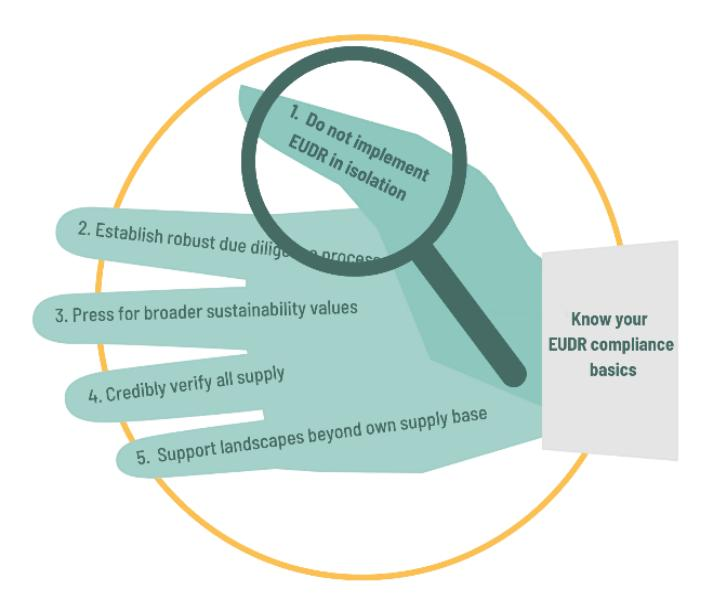

Not dealing with (current) EUDR in isolation is key not only for reasons of impact, but also for practical company policy development. The EUDR may be expanded to "other wooded lands" (think Cerrado), and possibly to other ecosystems (think wetlands, peatlands, high biodiversity grasslands). Also new HS codes of products may be added. Furthermore EUDR it is not a stand-alone piece of EU legislation and even if the most strict in terms of procedures and potential fines, it is part of a broader legal package

To successfully prepare for the EUDR cater for a broader legislative context where also the Corporate Sustainability Due Diligence Directive (CSDDD)[16](#page-11-1), the Forced Labour Regulation (forthcoming)[17](#page-11-2) and the Corporate Sustainability Reporting Directive (CSRD)[18](#page-11-3), among others, are to be implemented. The new regulations and directives require companies to know their supply chains, assess their (material) impact on people and the environment, implement procedures to mitigate adverse social and environmental impacts and provide access to remedy.

The EUDR forms part of the EU Green Deal ambition to become climate neutral by 2050. Many retailers' and industry agreements go far beyond EUDR compliance and have committed to conversion-free and sustainably certified/verified soy. Financial institutions are also increasingly demanding serious policies in the areas of climate, biodiversity, human and Indigenous Peoples' rights. In view of international conventions on climate change and biodiversity protection, business as usual without proper measure to address these concerns is not acceptable anymore. This also applies to companies in the soy sector. Companies should therefore not focus on implementing the current EUDR in splendid isolation.

#### *Practical advice:*

Start a conversation with your suppliers about the combined need for traceability, deforestation free, legal, sustainable production practices and human rights concerns in supply chains and producing landscapes. Be clear what you exactly require from them and why, and get clear what they need from you in return. Search for( combinations of) tools that can cover all these aspects. See the following chapters and the new annex.

16 European Commission (2022), [https://commission.europa.eu/business-economy-euro/doing-business-eu/corporate](https://commission.europa.eu/business-economy-euro/doing-business-eu/corporate-sustainability-due-diligence_en)[sustainability-due-diligence\\_en](https://commission.europa.eu/business-economy-euro/doing-business-eu/corporate-sustainability-due-diligence_en)

17 European Commission (2022), [https://ec.europa.eu/commission/presscorner/detail/en/ip\\_22\\_5415](https://ec.europa.eu/commission/presscorner/detail/en/ip_22_5415)

18 European Commission (2023), [https://finance.ec.europa.eu/capital-markets-union-and-financial-markets/company](https://finance.ec.europa.eu/capital-markets-union-and-financial-markets/company-reporting-and-auditing/company-reporting/corporate-sustainability-reporting_en)[reporting-and-auditing/company-reporting/corporate-sustainability-reporting\\_en](https://finance.ec.europa.eu/capital-markets-union-and-financial-markets/company-reporting-and-auditing/company-reporting/corporate-sustainability-reporting_en)

We also refer to guidance by the Accountability Framework iInitiative here [19](#page-12-0), with the remark that as CSI we promotes sustainability compliance beyond deforestation and conversion and human rights, and promote companies to engage in biodiverse landscapes at risk, (possibly) beyond their own

company sourcing areas - if this is what is needed for impact (see chapter 5).

Photo: by Julio César García via pixabay

#### *Extra reflections on costs and alternatives*

As costs always come up as an issue: companies can educate and involve customers downstream about minimal sustainability requirements and cost-sharing approaches for them to be able to buy sustainable products. Nothing can sustain itself for free and this should be understood better along the value chain until final consumer levels.

Reflecting on future proof business from a broader perspective is key, too. Soy is an amazingly efficient protein feed for livestock so replacing it can be inefficient. However, maybe innovative protein such as insects or more circular solutions such as protein from rest streams are available as well for the protein mix. Furthermore certain soy varieties are very suitable for direct human consumption, which can add more economic value to producers, processors and retailers, while lowering the environmental impact linked to producing animal based protein. If also this soy is sustainably produced, self-evidently.

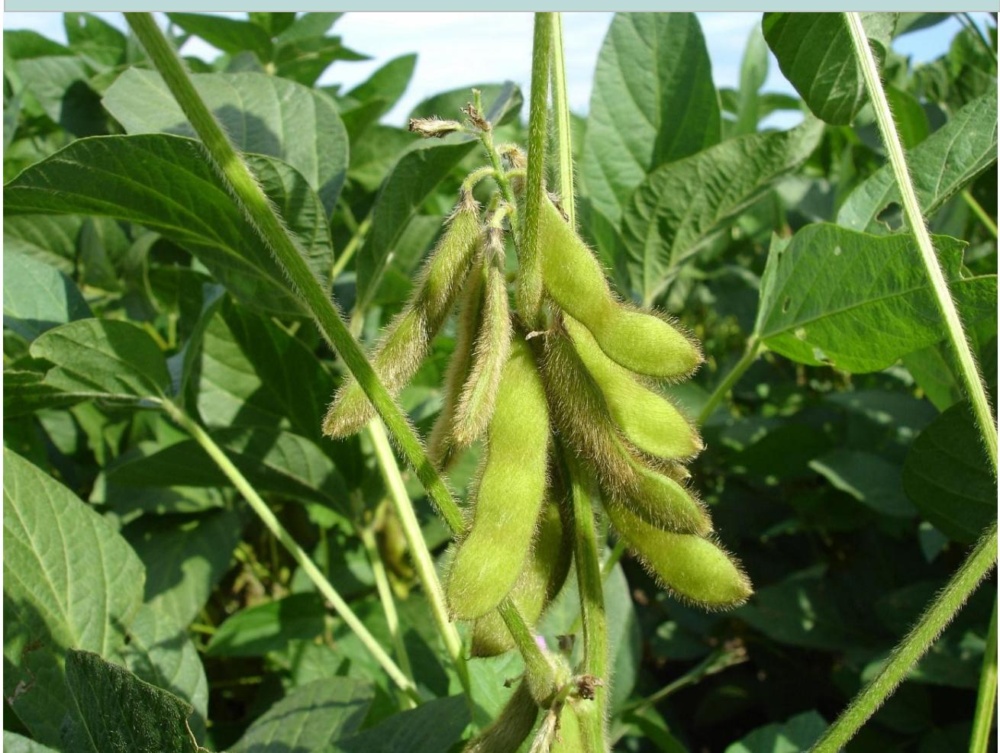

19 <https://accountability-framework.org/use-the-accountability-framework/core-principles/>

## **2. Laying your finger on the weak spots: implement solid due diligence processes for all sustainability topics and commodities**

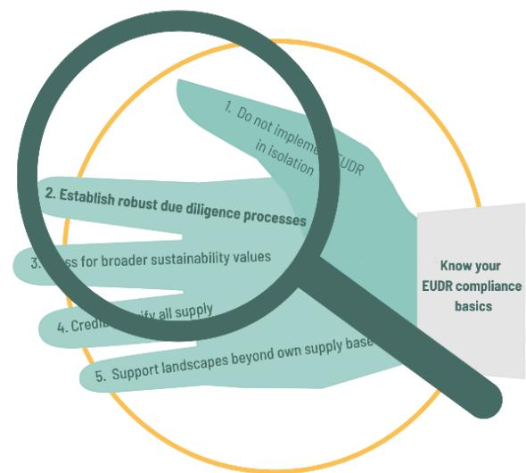

Article 8, 9, 10, 11, 12 and 13 of the EUDR require companies to execute a due diligence process to make the risk of deforestation and non-legal compliance negligible (although no max percentage is given by EUDR). The broader due diligence legislation EU CSDDD will require companies to implement the six due diligence steps (see figure 1) as introduced by the OECD[20](#page-13-1). Companies are suggested to strongly embed the six steps in their internal procedures as soon as possible, including but beyond soy alone.

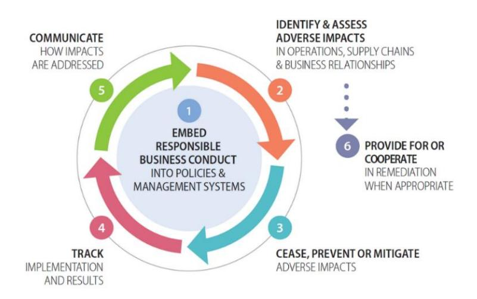

Figure 3: the six steps of the due diligence cycle

#### *Practical advice:*

- There is guidance available on the six due diligence steps as depicted in figure 3. See for instance the UN Guiding Principles for Responsible Business Conduct[21](#page-13-2) and the OECD-FAO joint work[22](#page-13-3) on due diligence in the agrifood sector and for eliminating deforestation[23](#page-13-4) . Almost all countries have [a National Contact Point for the OECD Guidelines](https://mneguidelines.oecd.org/ncps/)[24](#page-13-5) , to reach out to for advice.

20 <https://www.oecdguidelines.nl/oecd-guidelines/due-diligence>

21 [https://www.ohchr.org/sites/default/files/documents/publications/guidingprinciplesbusinesshr\\_en.pdf](https://www.ohchr.org/sites/default/files/documents/publications/guidingprinciplesbusinesshr_en.pdf)

22 <http://mneguidelines.oecd.org/oecd-fao-guidance-responsible-agricultural-supply-chains.htm>

23 [https://www.oecd-ilibrary.org/docserver/c0d4bca7-](https://www.oecd-ilibrary.org/docserver/c0d4bca7-en.pdf?expires=1691593524&id=id&accname=guest&checksum=15B6A90C540F807F87F1E70EA12150DD)

[en.pdf?expires=1691593524&id=id&accname=guest&checksum=15B6A90C540F807F87F1E70EA12150DD](https://www.oecd-ilibrary.org/docserver/c0d4bca7-en.pdf?expires=1691593524&id=id&accname=guest&checksum=15B6A90C540F807F87F1E70EA12150DD) 24 [https://mneguidelines.oecd.org//ncps/](https://mneguidelines.oecd.org/ncps/) gives all OECD contact points.

- **Step 1** is about embedding due diligence in your company's (sustainability) policy. It is important that there is a clear commitment of the top management to implementing these 6 steps and addressing sustainability challenges in a meaningful manner.
- Harmonized definitions can help here to give shape to commitments and policies to avoid ecosystem conversion and human rights infringements. Civil society organizations and knowledge institutions have worked hard to introduce aligned definitions, target setting frameworks and procedures. Examples are: o The Accountability Framework Initiative (AFi)[25](#page-14-0), that supports companies with clear definitions, guidance and best practices towards sustainable and ethical supply chains, focusing on DCF. o The Science Based Targets Initiative (SBTI)[26](#page-14-1), which helps companies set sciencebased targets for avoiding deforestation and land conversion. o The Science Based Targets Network (SBTN)[27](#page-14-2), which helps companies set sciencebased targets for land use, nature and water – amongst others. o The Global Reporting Initiative (GRI)[28](#page-14-3) is one of the initiatives to streamline sustainability reporting by companies. These initiatives have helped to make commitments measurable, comparable and smart.
- **Step 2** is about mapping supply chains and understanding the risks of human rights violations and environmental damage. There is a quite some publicly available information out there that can be used in the risk-assessment. One can think about global indicators on topics like corruption or legal compliance, NGO reports, satellite monitoring systems and sector-based risk information. Quite some (potential) risks are known about soy: deforestation and conversion, risk of chemical pollution or chemicals related health issues, labor rights and land rights infringements. Mitigating them is key.
- The Guidance document on EUDR by The European Commission specifies the possible role of third party verified certification systems in the due diligence process in more detail[29](#page-14-4) . Robust sustainability standards, when applied to physical volumes, are recognized as an important supplier of trustworthy information.
- Companies should proactively engage with suppliers, monitor and address risks in all their supply chains. This means, in all of their EU supply (certified or not), but also in their supply to other markets.
- **Step 3** which may be the most crucial- is about addressing the sustainability risks in the supply chain. Although in the due diligence cycle a prioritization based on likelihood and severity is suggested, in soy there are many solutions out there that can address different already well- known sector risks at once, especially if combined. These include sector-wide monitoring and verification, robust sustainability standards that cover crucial issues such as the ones mentioned above, and landscape approaches that include the promotion of legal compliance and landscape wide forest conservation.
- **Step 4** is about monitoring progress, both of the internal policies and of the actual impact on the identified risks.
- **Step 5** is about communication about sustainability impact. Increasingly companies are required to transparently report about their impacts and actions to reduce these impacts.

25 <https://accountability-framework.org/>

26 <https://sciencebasedtargets.org/>

27 <https://sciencebasedtargetsnetwork.org/>

28 <https://www.globalreporting.org/>

29 Europeam Commission (2024), https://green-business.ec.europa.eu/publications/guidance-eu-deforestationregulation\_en

The CSRD in the European Union helps companies prepare a sustainability report that is transparent and allows for comparisons between the years and between similar organizations.

- **Step 6** is about access to remedy. This allows workers, affected communities and other stakeholders to get in touch, express their concerns and request remedy if they are victimized by actions of the company.
- Implementing these six steps will help with EUDR compliance but also with other regulations, because your company has implemented the right procedures and has involved the right people internally to take onboard new legal or customer requirements in the supply chain.

More on the role of certification in chapter 3, on the role of full supply monitoring and verification in chapter 4, and on landscape engagement in chapter 5.

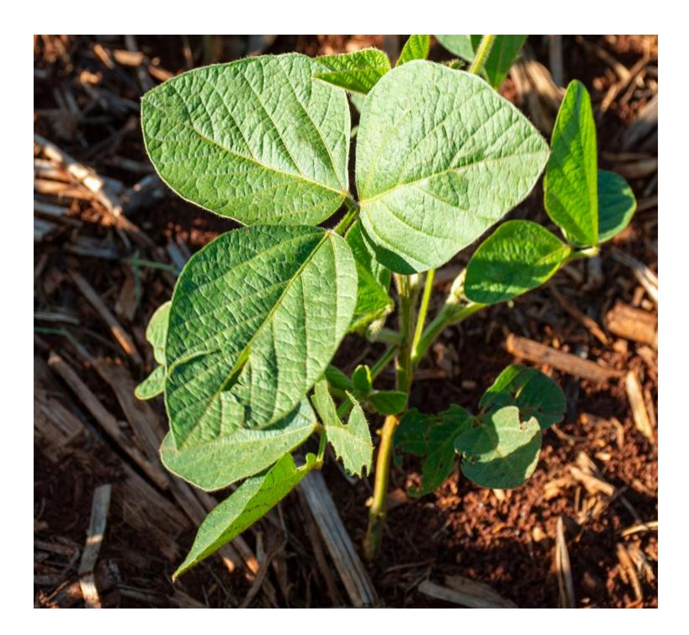

## **3.Pressing for full sustainability: choose for sustainably physically certified soy to assure-and mix into- EUDR compliant soy supply**

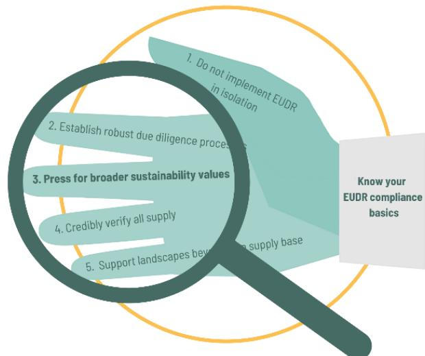

The European Commission elaborates on the role of third party verified standards in its new guidance document on EUDR implementation (Oct 2024, pg 22-26). Robust standards cannot substitute the trader/operator's own responsibility regarding due diligence. . However, the new Guidance document clearly acknowledges the potential role of third-party verification or certification systems to help comply with the EUDR. It clearly mentions that selfdeclaration is less credible. In that sense the EUDR offers an opportunity for scaling robust physical certification after all. As long as due diligence for EUDR compliance is exerted to the full supply chain, and negligible risk is achieved, certified and non-certified soy can also be mixed. This is not the same as the earlier Mass Balance, in which certified soy could be mixed with soy from unknown origin. Under the EUDR all origin in the physical supply chain should be known, and negligible risk of deforestation or illegal production should be there in the full supply chain. The EC Guidance lists a number of potential weaknesses of third party verified systems. These weaknesses of course also – or even much more so- apply to the non-certified or non- third party verified (parts of ) supply chains, but they are worthwhile to screen for any due diligence tool/system you chose.

#### **Standards for full sustainability.**

Robust certification systems offer potential tools for EUDR compliance, but much more than that. In many European countries there is a national multi-stakeholder initiative for sustainable soy, joining forces under the flag of ENSI[30](#page-16-1). All these initiatives have adopted more ambitious and more holistic visions for soy sustainability beyond legal and deforestation-free production. Robust standards can play a key role in achieving this. Sustainable soy is not only deforestation-free but also free of conversion of other ecosystems, produced according to best agricultural practices, including for example responsible chemicals management, while fully respecting human rights. Many voluntary certification schemes include conversion under their indicators of mandatory compliance, this means they require zero deforestation *and* zero conversion, and they often have more ambitious cut-off dates compared to the EUDR

Your company can show added value, and in the meantime be prepared for broader market and legal requirements - such as the US forest Act[31](#page-16-2) and the broader EU legislative context - by applying sustainability and deforestation- and conversion-free criteria in all your operations, independent from any specific market, and using robust physical certification as tool in your due diligence toolbox.

30 <https://ensi-platform.org/>

31 <https://www.whitecase.com/insight-alert/us-congress-reintroduces-bill-restrict-imports-linked-illegal-deforestation>

**CSI acknowledges that it may not be easy to organize a EUDR compliant soy stream, but explicitly sends the message that ambitions for soy sustainability beyond deforestation-free requirements should be scaled rather than lowered.** 

**Progress made with soy sustainability standards in EU.** In 2005 the groundwork for soy certification was already laid by NGOs in dialogue with companies, resulting in ProTerra, RTRS and standards such as Donau Soja, which have been improving step by step over the years. Many soy buyers in the European Union –especially in Northwestern member states- since then have committed to sustainability according to the extensive environmental and social criteria of such standards. The last European Soy Monitor of 2021 indicated that 40 % of European soy use was covered by a sustainability standard recognized by the European feed manufactures association FEFAC (IDH et al 2023) . This could be in the form of segregation, Mass Balance or Credits supporting responsible soy production. This is significant, even if these standards strongly differ in quality of criteria and control requirements. Because of FEFACs developments, and through societal pressure, most of the soy standards recognized by FEFAC by 2023 have conversion free production among their requirements. What is more, *de facto* robust standards form the majority of currently EU certified sourcing[32](#page-17-0) .

This did not mean that large portions of certified Latin American soy were segregated for European ports; a significant proportion of the European soy footprint has been covered by credit buying or Mass Balance models. This is not considered EUDR compliant and is something else than having certified soy in (a mix of) EUDR compliant physical streams. The 40 % certified soy that was achieved *does* mean however that European business has been supporting responsible soy production in individual farms from a broader perspective than what the EUDR currently requires. Certification has been rewarding farmers to some extent for applying good agricultural practices and responsible management. Often this certification process, by ProTerra and RTRS and others, with a considerable uptake also in critical biomes, has led to better management of farms, in terms of legal compliance, labor conditions, chemicals handling or other good agricultural practices. The impacts of these approaches on the ground are however limited to individual farms so far and could not halt the overall soy-related deforestation/conversion rates in South America, that continued to grow steadily.

#### **Towards serving the EUDR.**

Robust standards however *do* have protocols to carry out on-the-ground quality *control* on legality and deforestation and conversion free production. How can these values and such tools be "clicked in" the new EU mandatory due diligence setting in a useful and acceptable way?

The EUDR will *certainly* add significant value by pushing for traceability -something which has been hard to achieve in the sector -in part for commercial reasons of competition among traders. Traceability can also improve compliance on other topics than deforestation and conversion. It may certainly serve to effectively curb soy-related deforestation and conversion, through identification and possible exclusion of non-compliant farms, in any case to Europe, but it is not necessarily leading to improvement on the ground towards sustainable production. For this it would be important to go for deforestation and conversion-free *sustainable* soy in all markets by having a consistent company policy (see next paragraph).

Self-evidently, robust control is more key than ever due to the mandatory character of EUDR requirements and the fines that can result from to non-compliance. Robust standards already have

32 Profundo benchmarks: Setting the (new) bar for deforestation free soy 2019

[https://www.profundo.nl/download/iucn1906\)](https://www.profundo.nl/download/iucn1906) and 2023 [\(https://www.iucn.nl/app/uploads/2023/08/Setting-a-new-Bar](https://www.iucn.nl/app/uploads/2023/08/Setting-a-new-Bar-for-Conversion-free-Soy-in-Europe_August-2023.pdf)[for-Conversion-free-Soy-in-Europe\\_August-2023.pdf\)](https://www.iucn.nl/app/uploads/2023/08/Setting-a-new-Bar-for-Conversion-free-Soy-in-Europe_August-2023.pdf) combined with European Soy Monitor of 2021 (IDH et al 2023): <https://www.idhsustainabletrade.com/publication/european-soy-monitor-2021/>

deforestation and conversion-free production but also legality covered in their criteria and can control on most- if not all -of the criteria required by EUDR (see Annex for specifcs).

Credible soy standards have contacts with farmers, have auditing procedures, have stakeholder involvement in the production regions, and have the administrative and physical infrastructure in place to guarantee that no deforestation nor conversion took place after a certain cut-off date (often already way before 2020 (e.g. Donau Soja and Europe Soya use 2008, ProTerra and RTRS 2009/2015). This, in addition to guaranteeing overall legality and sustainable production practices.

The EUDR has certain requirements that some soy standards have had to adapt to, or have to provide special modules for. These may include full traceability to plot, extra documentation to show certain aspects of legal compliance, or the storage of such data for 5 years. Some standards have been, or are currently, adapting some criteria or details of their control systems in order to deliver EUDR compliant, responsible and sustainable soy. They seek to be ready before the phase of EUDR implementation.

#### *Summary of benefits of robust certification[33](#page-18-0)*

- Assist with proving legality and no-deforestation and conversion of soy production.
- Guarantee that agriculture production at plot level meets integrated sustainability requirements according to the standard at stake.
- Effectuating improvements in farming or administrative practices in the process towards certification.
- Security that farmers and companies in the value chain are audited by accredited independent thirdparties.
- Presence of documented proof of responsible practices and information needed for traceability.
- (Most often) payment of premiums / incentives to farmers who implement responsible production practices.

As an example, for the European market, Donau Soja/ Europe Soya offers deforestation- and conversion-free soy with a cut-off date of 2008, compliance with national legislation and traceability to plot with geolocation data. RTRS Chain of Custody certification already offers deforestation & conversion free soy with cutoff dates of 2009 & 2016 respectively, as well as compliance with national legislation and respect for human rights and indigenous people. RTRS offers a module that lists the requirements for EUDR as add-on to its CoC certification. It also offers an RTRS EUDR mix, which means partly certified/ partly non-certified; the non-certified part being controlled on its due diligence system to verify EUDR criteria. In the Annex we provide more detail.

ProTerra, beside its full-fledged non GM standard with a cutoff date of 2008, has developed an MRVstandard[34](#page-18-1) among others to support the preparation towards EUDR compliance. Together with Norwegian and Brazilian companies, and CSOs, they have given an early example of this with three producers in Brazil, sourcing fully conversion-free (GMO and non GMO) soy, which was independently verified.

Because of expected standard developments, but also due to questions that were not yet solved in the EU requirements, the Profundo soy standard benchmark (2023[35](#page-18-2)) was meant to have an update on probable EUDR readiness of soy sustainability standards in 2024. However this update has not

33 See among others[: https://www.proterrafoundation.org/wp-content/uploads/2021/07/The-role-of-ProTerra](https://www.proterrafoundation.org/wp-content/uploads/2021/07/The-role-of-ProTerra-certification-in-a-sustainable-soy-strategy-ok.pdf)[certification-in-a-sustainable-soy-strategy-ok.pdf](https://www.proterrafoundation.org/wp-content/uploads/2021/07/The-role-of-ProTerra-certification-in-a-sustainable-soy-strategy-ok.pdf)

34 <https://www.proterrafoundation.org/news/launch-of-proterra-mrv-standard-v1-0/>

35 See footnote 23.

(yet) seen the light which hopefully is the case in 2025. As an alternative for now, we listed some adaptations of standards to EUDR requirements, above as well as in the new Annex on potential tools.

Others, such as the German QS Scheme will certainly keep track of developments towards EUDR compliance of the Chain of Custody certification standards which they benchmark and allow from 2025 onwards.

#### **Towards models serving broader EU legislation**

On many criteria standards require more than EUDR. Therefore CSI proposes a model in which fully physically certified sustainable and EUDR compliant soy is promoted, or is mixed with (verified) EUDR compliant soy in the supply chain (for example from Brazil, Argentina or Paraguay). In that way, *all* soy meets the EUDR requirements and a portion of the soy in the mix also meets broader sustainability requirements. The percentage of sustainably certified soy in this mix should then increase over time.

Complementary systems of incentives can be added to this "mixing" approach in company policies. The credit system is a system of incentives that allows direct support to specific producers and/or regions which still can be an accelerator of responsibly produced physical sustainable soy. Then, supporting certified responsible production by means of credit adoption can be an important policy or program element among others, such as ecosystem restoration and training. We will come back to that under paragraph 5 where we also give some tangible examples of landscape programs to support.

#### **Dealing with risk landscapes and earlier cut off dates**

If may be that companies search risk averse strategies, e.g. by sourcing from areas already deforested long ago, and showing little legality risks. However in so-called low-risk areas for deforestation there may be human-rights violations or social and environmental legal compliance risks, as well as species extinction risks, that need thorough monitoring and can be independently verified (in part) by robust certification schemes. Company policy impact on climate and biodiversity can also be improved by supporting certification and other program elements in areas at risk of ecosystem conversion or with other environmental or social concerns.

What is important is that most robust soy standards, but also certain national legislations (for example the Paraguayan and Brazilian Atlantic Forest, Amazon) have much earlier cut-off dates for deforestation and conversion than what the EUDR requires. Leaving this early cut-off date and other sustainability commitments aside would be a great loss and not fair to farmers and suppliers who have done major efforts to comply with these requirements over the past decade. Yet, we all should acknowledge that we must make scale- and fast - in nature protection, combining such commitments with full EUDR and DCF legal production in other soy areas.

*Practical advice to summarize the above:* 

- Choose for robust physical certification as one of the instruments to prove no deforestation and legal compliance, but also to support sustainable practices at the farm and supply chain level. Robust sustainability standards for soy, such as ISEAL standards[36](#page-19-0) have vast experience in certifying practices at the farm level and providing trustworthy assurance of these

36 <https://www.isealalliance.org/>

- practices. These standards or specific modules of them- will fully integrate EUDR requirements for instance about collecting polygons and storing relevant data for 5 years..
- EUDR compliant soy needs to be kept segregated from non-EUDR compliant soy. This is a challenge given the current logistics of the soy supply chain in Latin America. However, this logistic challenge can be reduced significantly if all soy sources are verified deforestationand conversion free and made compliant with the EUDR, and if the non-compliant sources are detected at an early stage. Also the option to work with 'declaration in excess' helps the soy chain pragmatically organize some scale through its large silos. It should be noted however, that in this case an operator/trader assumes responsibility for all polygons listed in the Due Diligence statement, also if not directly connected to a particular batch.
- It is also possible to contribute to sustainable production by mixing physically certified soy in the fully EUDR compliant soy supply. Furthermore, on top of fully EUDR compliant physical streams, a company could support responsible production by buying credits or supporting other incentives to farmers[37](#page-20-0) for example from smallholders or farmers in high-risk regions. This, to promote a broader sustainability agenda and facilitate a recognized and rewarded mixing-in of certified soy in physical streams over time.
- Don't water down earlier commitments to sustainable soy and reward them. Continue to invest in farmers that produce in a sustainable manner and respect initiatives with an earlier cut-off date. The EUDR is not referring to existing cut-off dates such as the one of the Amazon Moratorium[38](#page-20-1) – but businesses can do so for sure.
- If it is in your company's power, work together with local actors to implement nonconversion after a cut-off date of 2020 for *all soy and other supply chains*, also if not destined to Europe. A powerful example of a coalition of actors that has done this, is the salmon supply chain[39](#page-20-2). Three Brazilian traders adopt a non-conversion approach with a cut-off date of 2020 for all soy they sell, no matter what the final destination is. We will dive further into that "clean supply" approach in the next paragraph.

CSI is convinced that robust soy certification standards can play a very useful role among other tools in organizing EUDR compliant physical streams and in promoting and controlling sustainable soy. The percentages of certified soy in your EUDR compliant physical stream can increase over time.

37 For example[, Protein partnerships -](https://www.donausoja.org/agriculture/protein-partnership/) Donau Soja

38 <https://forestsolutions.panda.org/case-studies/brazils-amazon-soy-moratorium>

39 [https://www.proterrafoundation.org/news/soy-vendors-to-the-salmon-industry-end-trade-of-deforestation-linked-soy](https://www.proterrafoundation.org/news/soy-vendors-to-the-salmon-industry-end-trade-of-deforestation-linked-soy-in-brazil/)[in-brazil/](https://www.proterrafoundation.org/news/soy-vendors-to-the-salmon-industry-end-trade-of-deforestation-linked-soy-in-brazil/)

## **4. As the devil is in the detail; use credible traceability, DCF and legality verification mechanisms for your entire business**

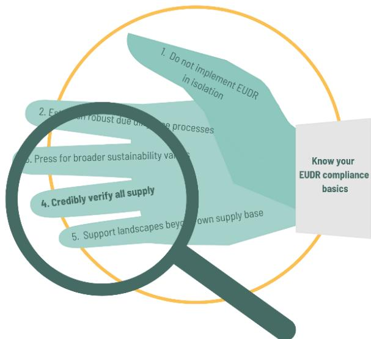

For the part of the soy that cannot (yet) be certified, companies should make use of credible traceability and verification mechanisms to prove at least no deforestation and legal compliance, in order to comply with the EUDR. We strongly recommend to already anticipate on no-conversion, for practical and ecological reasons (protection of Cerrado and Chaco vegetation but also wetlands in the Pantanal and Pampa).

#### **Creating leverage**

Applying DCF legal supply for your company's entire business can create real impact beyond the (10- 20 %) supply that goes to the EU. It is also useful to anticipate future requirements from other key markets (UK, US, China) and to simplify your logistics. This means verification of compliance also for the supply that goes to other- possibly currently less demanding - markets.

Expectations may differ in that sense on what leverage role EUDR can play for good land governance in producing countries.

For example, traders in Argentina have developed a traceability mechanism of deforestation free soy and beef through the VISEC platform, validated by the Argentine government[40](#page-21-1). It is at this moment unclear to what extent such aggregated approaches are accepted in the EU to prove compliance with EUDR. It would be good if such broadly applicable national efforts were at least supported, combined with other tools to check on specific aspects of legality and additional sustainability concerns (also on the ground). If VISEC and robust control on legal compliance are also applied to *other* markets, this would help avoid market segregation EU vs non-EU in Argentina. The country is already used to delivering soy as biofuels according to different market demands, including the EU, but total physical segregation towards the EU is potentially avoidable this way.

In Brazil, the CAR (land) registration and especially its validation by government must be speeded up for traders to be able to prove compliance with the national Forest Code as a requisite for EUDR[41](#page-21-2) . The Brazilian government (in some states, and at federal level) is developing MRV systems for all commodities and territory, on the basis of CAR, PRODES and other public databases.

These "leverage" impacts of EUDR on local governance in producing countries are yet unknown and depend on many factors and actors. Your company can *help* support the leverage role of EUDR. For example by supporting traceability and control on legal compliance in Argentina to *any* market, or by

40 <https://www.visec.com.ar/en/>

41 See recent study of TRASE and ICV on EUDR readiness on the aspect of Forest Code compliance in Brazil. <https://resources.trase.earth/documents/Briefings/soy-and-legal-compliance-in-brazil-report.pdf>

supporting an independently verified National MRV system or company designed DCF verification system that are applied to all markets. Needless to say that CSI promotes application of holistic sustainability criteria on top of this.

In addition, in cooperation programmes with local government, faster CAR validation in Brazil can be promoted. This all could serve any market and thus have a broad positive impact on local and national land governance.

The next section provides information on assessing the risk of deforestation and on demonstrating a negligible risk of violation of laws in producing countries. The last section addresses guidance offered by the Accountability Framework initiative on ethical and clean supply chains and clarifies what CSI seeks to promote.

#### *Control on deforestation- and conversion-free production in EUDR context*

- The Due Diligence Statement that needs to be uploaded must include all the polygons of all plots on which the soy in the particular batch placed on the EU market was (potentially) produced. This is full traceability, it means that it is known where all soy in the physical supply chain was produced.
- Proving that no-deforestation took place on all these plots after 31 December 2020, or that the risk of deforestation is very low, can be done in different ways but the best is to provide solid, third-party verified proof.
- A tool that cannot be left unmentioned when talking about traceability and chains of custody, is the ISO standard on this matter. Companies and initiatives working towards EUDR compliance or beyond, can benefit from the work as captured in ISO standard number 22095: 2020 on chain of custody. The fact that this ISO standard introduces a harmonized terminology is a big advantage. In addition, it includes general requirements for different chain of custody models and provides a generic approach to the design, implementation, and management of chains of custody. Sustainability standards can use the norm to sharpen their chain of custody approach.
- As said earlier, we may expect that "other wooded lands' and possibly also other ecosystems will be included in the scope of the EUDR within a few years, so it is wise to have checks done on broader ecosystem conversion in the same effort. Already including other wooded lands in the Cerrado and Chaco has also a pragmatic aspect. From satellite images it is not always easy to distinguish forest from savannah in Cerrado or between Chaco forest and more shrub like Chaco vegetation, as these zones slowly change from one area to the other. And last but not least: the need to include these biomes is clear for the biodiversity and climate goals in your broader sustainability agenda.
- Free publicly available information such as offered by Trase[42](#page-22-0), Global Forest Watch[43](#page-22-1) , MapBiomas Chaco[44](#page-22-2), MapBiomas Brazil[45](#page-22-3) (and specifically MapBiomas Amazonia[46](#page-22-4)) and TerraBrasilis[47](#page-22-5) can provide insight into historical deforestation, other land ecosystem conversion and forest fires. They can be supportive knowledge tools for your full due diligence. Most of these tools allow for a selection of a time frame and hence can provide an

42 <https://www.trase.earth/>

43 <https://www.globalforestwatch.org/>

44 <https://chaco.mapbiomas.org/>

45 <https://brasil.mapbiomas.org/en/>

46 <https://amazonia.mapbiomas.org/en>

47 <http://terrabrasilis.dpi.inpe.br/en/home-page/>

insight into the regions where conversion and deforestation took place after 31 December 2020. Also the European Commission has recently launched its European Forest Observatory[48](#page-23-0) which can be used as an indication in the due diligence, even if further

- information will often have to be obtained.
- See our Annex for potential support tools. It is impossible to benchmark all on their credibility; for now it is up to business themselves to judge whether these are fit for their purposes*.*

#### **MapBiomas**

MapBiomas is a collaboration between NGOs, universities and technology startups that use science to monitor transformations of land use in various territories. The initiative makes information about deforestation, land conversion, forest fires and surface water availability accessible to a broad public. The initiative started in Brazil but has since then expanded to other countries and biomes, such as the Gran Chaco and Pampa and therefore is useful for Argentina and Paraguay as well. Mapbiomas also recently started in Indonesia. The different versions of MapBiomas can be a great tool in the risk-assessment for the EUDR.

- In addition to these publicly available tools, there are many companies specialized in using remote sensing technologies to analyze current - and predict future - deforestation and conversion. These companies often combine the use of satellite images with local visits to the area of plantation to help companies eliminate deforestation from their supply chains. Satelligence and other examples are mentioned in the new Annex.
- Agrosatelite works with ABIOVE[49](#page-23-1) in Brazil to monitor the Amazon Moratorium and analyze soy-related conversion in the Cerrado. The company worked with the Soft Commodities Forum to identify municipalities in the Cerrado with a risk of future land conversion[50](#page-23-2) .

#### *Control on legal compliance under the EUDR*

- In addition to showing maximum due diligence effort to address all risks of deforestation, traders/operators must be able to demonstrate that the soy was produced according to relevant national legislation.
- The EUDR mentions the following legality topics: o land use rights o environmental protection o forest-related rules, including forest management and biodiversity conservation, where directly related to wood harvesting o third parties' rights o labor rights o human rights protected under international law o the principle of free, prior and informed consent (FPIC), including as set out in the UN Declaration on the Rights of Indigenous Peoples o tax, anti-corruption, trade and customs regulations
- There now is guidance from the EC on how to demonstrate legal compliance, and it is likely that this will be organized in the contracts between the soy supplier and soy buyer. Here particularly, certification systems and their national interpretations may come in as a

48 <https://forest-observatory.ec.europa.eu/forest>

49 <https://abiove.org.br/sustentabilidade/>

50 <https://www.wbcsd.org/contentwbc/download/15457/225401/1>

support. Do check if they indeed can cover the required legality items and if not (yet) fully, what extra info is needed that they -or somebody else -have to have at hand or provide to Competent Authorities upon request.

- The EC Guidance mentions that "only the applicable laws concerning the legal status of the area of production constitute relevant legislation" and legislation "that is also relevant if its contents can be linked to halting deforestation", hence focusing on (land) rights "for the purposes of the production of the relevant commodity" and environmental protection.
- The laws must be read "in the light of the objectives of the EUDR (…), meaning that legislation is also relevant if its contents can be linked to halting deforestation and forest degradation in the context of the Union's commitment to address climate change and biodiversity loss".
- Legality further on in the value chain, such as labor conditions in processing, shipping etc, are not included. It does mention labor on the farm, but in our view the Guidance is also not conclusive as to which labor laws are included or not.
- It should be taken into account that the Guidance is supportive and the text of the EUDR legislation itself is leading. Especially in case of low risk countries- a label based first and foremost on risk of deforestation and forest degradation and some other general features- it is not 100 % clear which legal documents should be available at all times. Risk assessment in low risk countries should take place in case of substantiated concerns, but if the documentation then is not in order, one may still be incompliant due to insufficient due diligence. This means proper documentation on legality is recommendable at all times – in general, but also for the EUDR. Auditors might know best what kind of documents can be seen as proof for which topic.
- Demonstrating legality is a challenge, even if it concerns just the legality of land use, especially in countries with complex and very detailed legislation and low levels of enforcement. For example, first assessments by Trase showed that part of the farmers in Brazil are not yet meeting the requirements from the Forest Code, or – because of lack of validation of their CAR registration, it is hard to prove they do[51](#page-24-0). Supporting CAR registration in a particular landscape context is a useful investment, which can be done e.g. through the Brazilian NGO IPAM (add footnote) or through the Brazilian Produce Conserve and Include Compacts in Maranhão or Balsas (see suggested action in paragraph 5).
- Third party verification systems are promoted, but not obligatory in the EU Guidance document, nor those company owned, nor those multi stakeholder or government owned. It goes without explanation that CSI recommends third party verification. To have local impact on good governance, it is also key that national or regional government-backed systems for traceability and verification developed in countries like Brazil, Argentina, or Paraguay are strengthened to have impact on all producers, operators and markets. They then should include all producers. Such national or regional systems can be combined with certification or other verification information on broader issues.
- Companies need clarity on what competent authorities expect them to deliver in terms of proof of compliance. To be safe: have all legality items checked by a third party, for all polygons: deforestation free – and as much as possible – conversion-free production and on all legality topics mentioned above. As mentioned above, robust certification systems that are well aware of EUDR requirements may come in useful as sources of information.

51 <https://resources.trase.earth/documents/Briefings/soy-and-legal-compliance-in-brazil-report.pdf>

#### *Clean supplier approach*

The Accountability Framework highlights the importance of three levels of action: (1) product volume, (2) supplier level policy to address entire business with a DCF policy- particularly relevant with shifting supply bases. And (3) sourcing area level. AFI recommends the full production unit to be verified DCF. This is a production unit may include certain plots with soy, corn or other crops for rotation. Addressing this full production unit is useful especially because plots within a production unit shift over the years and this would require repeated controls, and non-compliance in certain plots may involve fines and reputational risks. AFI furthermore already includes no conversion. It also includes human rights.

What are additional current CSI recommendations?

1) In terms of legality it is important to pay attention to all legality topics that the EUDR mentions, including but not limited to human rights. Again, we advise to check these legality topics in full, to be both EUDR compliant and do proper due diligence as required by EUCSDDD.

2) CSI promotes sustainable production beyond DCF and human rights including responsible agricultural production such as with handling chemicals (herbicides and pesticides) which for soy is a key environmental and health issue. Robust standards and their qualified auditors are experts in onthe-ground control and CSI promotes the use of a mere 15-20 years of experience here instead of reinventing wheel with a mushrooming (!) offer of control mechanisms and consultancy expertise. Consider building the volume of fully -or if needed partly- certified soy as outlined under recommendation 3.

3) On the topic of sourcing area engagement CSI promotes engagement with risk landscapes that may go beyond or even be different than the own physical sourcing areas. This is also what the Consumer Goods Forum Landscape Strategy acknowledges and promotes. This is key for European companies to create impact and help recover our collective decade long footprint on natural resources, for the case of soy especially in Latin America. We foresee a shift to already long term deforested areas to supply Europe but that does not necessarily solve the problems. On the contrary: risk landscapes need government *and* business committed to sustainability- and including this support in your policy is a key element.

4) Also long term deforested and converted landscapes may show high risks related to unsolved past illegalities, land conflicts and human rights abuses, as well as species extinction risks related to the highly reduced and fragmented vegetation remnants. This means also in "low risk" areas verification of compliance at the farm level remains important.

► **Our message is: go for clean, EUDR compliant/ Deforestation and Conversion Free certified physical supply and a clean supplier policy, setting time-bound improvement targets with suppliers. In addition, support forest and ecosystem frontier areas in their efforts to achieve legal, DCF and responsible soy production in crucial zones. Here credits and other types of incentives for producers can play a useful, additional role.** 

See the next and last chapter 5.

## **5. Cherish the relation: to have local effect on conservation where it counts, engage with conversion-risk, high biodiversity landscapes – also beyond your own supply base**

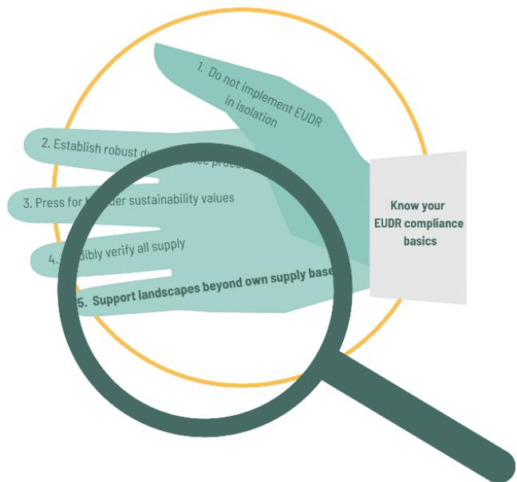

Deforestation and ecosystem conversion are driven by complex variables and actors. Therefore, landscape initiatives with multiple tools and commodities have been gaining momentum. In these so called landscape, or jurisdictional approaches -targeting a certain jurisdiction such as a municipality or region- local stakeholders work together on an action plan for an entire landscape including targets and metrics[52](#page-26-1) for improved production, nature conservation protection and social inclusion. This means solutions for different types of farmers should be found: those already certified, those who need support for that, for example capacity building, or options for producers to becoming legally compliant (again) by taking corrective actions.

Over the past 5-10 years many serious private sector players from the European Union have been involved in dialogue, projects and investment in high-risk regions to make a positive impact, for instance via the acquisition of targeted sustainability credits, attractive loans for above-legal conservation or other projects on the ground. If the EUDR would have as an unforeseen effect that engagement with high-risk landscapes disappears, it would be very damaging and a serious loss of capital invested both by EU actors as well as producing countries and farmers themselves over the past decade. The very recent EC Strategic Framework for International Cooperation on the EUDR recognizes a more integrated view, and promotes the engagement on both EUDR implementation and flanking measures particularly in countries (that are going to be) classified as high risk. This will not be easy as the EUDR itself is strict.

For the EUDR, all polygons should be submitted per batch delivered to EU market, but a certain "declaration in excess"' is allowed (several shipments or harvests within one year) or even required (with silos that are never empty). However, if one polygon of the Due Diligence Statement is associated to deforestation after 2020, or with illegality, the whole batch is non-compliant.

Still it is key to make space for landscape/ jurisdictional approaches in your sustainability policy, to have impact where it counts, because just excluding farmers and areas with risks will most probably not solve local problems -nor have sufficient impact on forests and climate. Actually, article 11 of the EUDR states that risk mitigation may also include supporting compliance with the Regulation of suppliers, in particular smallholders, through capacity building and investments.

52 See the main targets and metrics for impact at landscape level, co-developed by Soft Commodities Forum and Forest Positive Coalition[, https://www.wbcsd.org/contentwbc/download/16578/235715/1](https://www.wbcsd.org/contentwbc/download/16578/235715/1)

Therefore, CSI recommends companies to stay or become more connected to risk landscapes via landscape programs as we will discuss. This way (even) a risk averse sourcing strategy and strengthening local governance in risk areas can go hand in hand.

#### **Avoiding high risk origins?**

Within the EC, a country benchmark is being made distinguishing low, standard and high-risk countries and/or regions. For low-risk countries a slightly simpler due diligence process for companies and a less intensive control regime for national competent authorities in Member States will be implemented -even if 100 % compliance with EUDR is expected in all cases. This, and the general rules and potential fines of the EUDR are expected to incentivize companies to source from low-risk countries and areas and stay away from high-risk origins. This does not mean that those origins are better off, as producers will not automatically chose to abandon the areas and leave all their land for wildlife to thrive; possibly on the contrary.

Without interested engagement of sustainability oriented market parties and donors, such areas may be subject to neglect, their producers may feel resentment, and other less demanding markets may be keen to take over. CSI alongside many others therefore have argued over the past years for a meaningful dialogue and tangible support measures for producer country conversion risk areas, especially in highly biodiverse areas. Proforest and IDH shared a vision for integrating the landscape dimension in EUDR[53](#page-27-0) .

Only since October 2024 there is an EUDR strategic framework for dialogue with producing countries, and some financial support by EU countries to give shape to EUDR's article 30. A Team Europe Initiative hub was started to inform on current and new initiatives, and do outreach to producing countries. Apart from several specific dialogues among EC and producing countries, much will in practice come down to good coordination among existing donors and programs to support such areas. Companies can actively contribute with their policies as we will discuss.

**To keep it simple and create impact at this moment we advise: join existing landscape initiatives in countries where you source or where you wish to have a positive impact on sustainable land use, and actively add to their quality and scale.** 

A strong multi stakeholder basis may be already be there in "Produce Conserve and Include compacts" such as in Sorriso or Maranhão, Brazil. In the Argentine Chaco or Paraguayan Atlantic zone or Chaco, engagement with producers is being done and needs to be built further over times to come.

Companies downstream can contribute to for example farmer training, reforestation/restoration, the implementation of better technologies, support to local communities to produce food (e.g. cassava and vegetables), support to farmers' land registration (CAR or other), traceability pilots, and last not least by targeted certification and credit buying from within the area of the landscape initiative to support the application and recognition of responsible and DCF soy production.

The landscape/jurisdictional programs downstream companies support can, but need not necessarily, match their physical sourcing. Soy being a commodity your supply may come from many different regions, depending on price, timing, availability, risks, but your company can select and support 1-2 risk areas for support. Risk averse sourcing under EUDR thus may be well matched by support to genuine conversion (or otherwise high-) risk areas. Also, in the overall soy sourcing regions, due to legality and human rights issues, as well as growing species extinction risks, there may not be de facto any "low risk" areas for companies. Traceability is needed everywhere.

53 [IDH\\_Forest\\_Positive\\_Options\\_Policypaper.pdf \(proforest.net\)](https://www.proforest.net/fileadmin/uploads/proforest/Photos/Publications/IDH_Forest_Positive_Options_Policypaper.pdf)

Regardless of sourcing from a high risk area or not, of that targeted landscape support in expansion frontiers may be even needed extra in the new EUDR context. In the textbox below we give examples of initiatives or interventions to support.

**Examples of targeted credit buying and other landscape and producer support to enable responsible sourcing and conservation in (risk) landscapes.** 

In the soy sector, landscape approaches are currently implemented in the Cerrado by IDH & partners[54](#page-28-0), and the Soft Commodities Forum[55](#page-28-1) and in the Gran Chaco by IUCN NL and partners in Argentina[56](#page-28-2) as well as by PPPP, Proyungas [57](#page-28-3) and in Eastern Europe by Donau Soja[58](#page-28-4). For downstream companies, supporting such landscape initiatives play meaningful roles to add tangible sustainability value in particular locations. Especially in combination with broader conversion free company sourcing from the whole Cerrado and Gran Chaco biomes.

#### **Cerrado examples**

In Sorriso municipality in Mato Grosso Brazil, IDH and RTRS work together with the producer association CAT and local government to achieve multiple goals[59](#page-28-5) .

In Maranhão, particularly Balsas region (comprising 12 municipalities), producers have been expanding RTRS certification up to levels that soon may enable physical sourcing of RTRS supply from that area. This has been made possible because of year-long direct, targeted, support via the adoption of RTRS Credits that are supporting responsible soy production, through endured support and promotion by local NGO FAPCEN Research Foundation as well as by end buyers committing to longer term support. Lately, IDH and FAPCEN agreed on a Regional Pact to expand the achievements in the region.

Beside the application of EUDR+ RTRS, other landscape elements are added together with IDH and others to enhance local impact[60](#page-28-6). These two and other landscape approaches – or "compacts", that include agreements with the government (eg. on enhanced CAR validation), feature on the SourceUp platform[61](#page-28-7) .

#### **Gran Chaco example**

Another example, in the Gran Chaco (Argentina/ Paraguay/Bolivia), is the Soy Chaco initiative of IUCN NL and multiple partners, including Solidaridad, Fundación Vida Silvestre Argentina, Cefetra and the Dutch dairy sector[62](#page-28-8). It uses the targeted credit trade model in the 4 Chaco provinces in Northern Argentina. Soy Chaco promotes the credit sale from RTRS certified farmers and has enabled farmer support for compliance with RTRS or CRS. Soy Chaco also promotes the regeneration of a natural corridor belonging to a larger scale conservation vision of the Gran

54 <https://sourceup.org/>

55 [https://www.wbcsd.org/Programs/Food-and-Nature/Food-Land-Use/Soft-Commodities-Forum/News/The-Soft-](https://www.wbcsd.org/Programs/Food-and-Nature/Food-Land-Use/Soft-Commodities-Forum/News/The-Soft-Commodities-Forum-invites-investment-in-a-new-financial-model-to-eliminate-soy-driven-deforestation-and-native-vegetation-conversion-in-Brazil-s-Cerrado)[Commodities-Forum-invites-investment-in-a-new-financial-model-to-eliminate-soy-driven-deforestation-and-native](https://www.wbcsd.org/Programs/Food-and-Nature/Food-Land-Use/Soft-Commodities-Forum/News/The-Soft-Commodities-Forum-invites-investment-in-a-new-financial-model-to-eliminate-soy-driven-deforestation-and-native-vegetation-conversion-in-Brazil-s-Cerrado)[vegetation-conversion-in-Brazil-s-Cerrado](https://www.wbcsd.org/Programs/Food-and-Nature/Food-Land-Use/Soft-Commodities-Forum/News/The-Soft-Commodities-Forum-invites-investment-in-a-new-financial-model-to-eliminate-soy-driven-deforestation-and-native-vegetation-conversion-in-Brazil-s-Cerrado)

56 [https://www.iucn.nl/en/news/soychaco-a-dutch-pilot-project-to-add-conservation-value-to-soy-sourcing-in-the](https://www.iucn.nl/en/news/soychaco-a-dutch-pilot-project-to-add-conservation-value-to-soy-sourcing-in-the-argentine-chaco/)[argentine-chaco/](https://www.iucn.nl/en/news/soychaco-a-dutch-pilot-project-to-add-conservation-value-to-soy-sourcing-in-the-argentine-chaco/)

57 <https://proyungas.org.ar/proyect/ppp-acercando-la-produccion-a-la-naturaleza/>

58 [https://www.donausoja.org/wp-content/uploads/2022/10/Protein\\_Partnership\\_Brochure\\_2022-1.pdf](https://www.donausoja.org/wp-content/uploads/2022/10/Protein_Partnership_Brochure_2022-1.pdf)

59 <https://sourceup.org/compacts/sorriso>

60 <https://sourceup.org/compacts/balsas-region/updates>

61 <https://sourceup.org/>

62 [https://www.iucn.nl/en/news/soychaco-a-dutch-pilot-project-to-add-conservation-value-to-soy-sourcing-in-the](https://www.iucn.nl/en/news/soychaco-a-dutch-pilot-project-to-add-conservation-value-to-soy-sourcing-in-the-argentine-chaco/)[argentine-chaco/](https://www.iucn.nl/en/news/soychaco-a-dutch-pilot-project-to-add-conservation-value-to-soy-sourcing-in-the-argentine-chaco/)

Chaco; it entails a tangible 20.000 ha forest regeneration plan which recently started with a pilot. The has connected with buyers having clear links with Argentina and buyers that have an interest in supporting areas in clear need of responsible DCF production. Connections of certified soy with physical sourcing are promoted in this area by traders such as Bunge or Cefetra. The level playing field that trader initiative VISEC seeks to achieve on traceability by the collective mechanism they are developing should make EUDR compliance *plus* responsible production more feasible in the near future[63](#page-29-0) .

#### **Farmer incentive packages.**

Tailor-made financial and other incentive packages for producers are key. EU market exclusion may be a "stick" but Europe is just 10 % of the global soy market. Incentives are needed to engage sufficient producers to embrace the DCF and responsible soy agendas. Especially with high soy prices, the opportunity costs for not using suitable (forested) land for soy cultivation in Latin America are high. Hardly any downstream company is willing to pay all these costs upfront, but there are good combinations of Payments for Ecosystem Services that can be made.

- Apart from, or combined with targeted credit buying this can include:
- Support for land rent or tax exemptions for forested areas to lower it being a cost factor for the producer
- Attractive loans for giving up deforestation permits in Brazil as done by Responsible Commodities Facility in Brazil[64](#page-29-1) .
- Support for above legal nature regeneration in crucial wildlife corridors.
- Cost reductions and extra financial stimuli from combining multiple credits for regenerative practices. This could include e.g. a premium for being certified with a soy standard, plus carbon credits, plus biodiversity credits. These practices may include a more responsible (precision) use of chemicals, management of soil carbon, cover crops to manage weeds, rotation of soy with other crops or cattle ranching.

#### **Example in Europe**

Donau Soja supports farmers in Eastern European countries, such as Serbia, Moldova and Ukraine, to produce deforestation- and conversion-free non-GM soy in a sustainable manner. With its Protein Partnerships[65](#page-29-2), Donau Soja organizes educational activities for farmers, including workshops and training, which focus on best practice in soy cultivation and cover topics ranging from choice of variety to plant protection. Donau Soja covers the certification costs for both farmers and primary collectors. This guarantees the first step in the physical flow of sustainably produced soya, ensuring that traders and processors — and therefore the market — have easy access to certified beans. In 2022, the Protein Partnerships produced 700,000 tons of sustainably certified European soy for the European market.

63 <https://www.visec.com.ar/en/>

64 <https://sim.finance/responsible-commodities-facility/>

65 [https://www.donausoja.org/wp-content/uploads/2022/10/Protein\\_Partnership\\_Brochure\\_2022-1.pdf](https://www.donausoja.org/wp-content/uploads/2022/10/Protein_Partnership_Brochure_2022-1.pdf)

### **Summary of advice for compliance with impact:**

- Know your EUDR compliance basics and prepare as soon as possible. When products produced after the day the EUDR entered into force (29 June 2023) enter the market after 30 December 2025 they need to be accompanied with proof of no-deforestation and legality in line with EUDR requirements. Especially for products that can be stored for a while this will become a factor.
- Implement solid due diligence structures for compliance with EUDR and for Due Diligence legislation (EU CSDDD) and other legislation. The EUDR should not be viewed in splendid isolation. Other wooded lands will probably be included as well. Don't wait for the Commission to include these and other ecosystems, but work towards no conversion of natural ecosystems such as in the Cerrado and Gran Chaco from the start.
- Recognize existing cut-off dates and don't stimulate supply chain partners to let go of them and relax them to 31 December 2020. Build strong relations with suppliers to address this and forthcoming challenges in the supply chain.
- In addition, and in support of the above mentioned topics, invest in sustainable soy production via robust certification and landscape approaches and their combinations. EUDR compliance is the minimum in physical trade flows; sustainability however also requires conversion free, sustainable agricultural practices, as well as targeted conservation and nature restoration support at landscape scales. This often requires financial or other incentives for producers in terms of premiums, longer term contracts, sustainability linked loans etc.

**We wish you the best in the steps to come and hope to contribute by facilitating collective dialogue, search for and guidance for solutions.** 

**Do check the updated annex after this page!**

**[https:///thecollaborativesoyinitiative.info](https://thecollaborativesoyinitiative.info/)**

**Create synergies for impact Join us as a contributing partner**

**[coordinator@thecollaborativesoyinitiative.info](mailto:coordinator@thecollaborativesoyinitiative.info)**

### **Annex: Tools for traceability and verification of EUDR and sustainability compliance in the soybean supply chain.**

**Annex belonging to CSI Guidance EU Compliant Soy with Impact 2.2 (May 2025).** 

The Collaborative Soy Initiative (CSI) earlier published: "EU Compliant Soy with Impact, a Guide through the Guidances" in Oct 2023 and March 2024. We did this in anticipation of the EUDR, other EU legislation, but also to address other well-known and pressing sustainability priorities for soy such as chemicals management and genuine landscape conservation impact.

Since then, tools for traceability and verification of EUDR compliance have been updated, and new tools have been released. Furthermore, on the 15th of April 2025, the European Commission shared its updated Frequently Asked Questions, and an EUDR Guidance document as well as its Strategic Framework for International Cooperation (see references below). Since the 2.1 version of our Guidance document, new information has been shared. In January 2025, a new document was published by the European Commission 'EUDR compliance, understanding your company's position in beef, cocoa, coffee, palm oil, rubber, soy, and wood supply chains. In addition, the Information System can now be accessed and tested.

Therefore, we updated our version 2.1 with additional information into version 2.2

The spirit and messages of the earlier CSI guidance have remained the same. However, this updated annex, or new *tools section,* provides an overview of essential documents, traceability and verification tools that can help with compliance for EUDR and beyond.

#### **Disclaimer:**

CSI did not benchmark the tools available but– according to our best knowledge and understandingwill give some information on what EUDR- related and other sustainability requirements the tools can help cover.

**Vision:** As written in the text of the full CSI guidance, CSI advises a *combination* of tools for EUDR compliance in order to have conservation and sustainable land use impact. This includes applying robust, EUDR aligned sustainability standards, to verify EUDR, deforestation-free, legal, conversionfree production criteria, and other important sustainability criteria, on-the-ground. The guide also promotes strong due diligence systems and sustainability requirements in place for *all* markets to avoid isolated EU silos and have field impact at scale. Furthermore, it promotes tailor-made landscape support to responsible producers and nature conservation. CSI also acknowledges the importance of (new) public options to scale up traceability and basic EUDR verification in soy-producing countries themselves -such as VISEC in Argentina and Selo Verde in Brazil. Where possible, the information such systems gather can be combined with certification information to cover the full spectrum of sustainability requirements.

**Advice for importing and downstream companies:** Contact the responsibl[e competent authority](https://circabc.europa.eu/ui/group/34861680-e799-4d7c-bbad-da83c45da458/library/f044a917-4640-4169-ad0a-d63609cfca55/details) in your country for more guidance on your home market and information material in your language.

### **1. Guidance from the Commission**

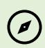

The European Commission has made the following support available:

[Guidance](https://environment.ec.europa.eu/document/5dc7aa19-e58f-42a3-bbbe-f0eb2e5a1d3a_en) (last update: April 2025) by the European Commission. The Guidance document is not legally binding but is a detailed document supporting national authorities and companies with their EUDR implementation. In 11 chapters the document details definitions and key concepts. In the annex to the guidance, various scenarios are presented that help to understand the practical implications of the EUDR for different roles (operator/trader) and different company sizes (SME/non-SME).

[The](https://circabc.europa.eu/ui/group/34861680-e799-4d7c-bbad-da83c45da458/library/e126f816-844b-41a9-89ef-cb2a33b6aa56/details) fourth edition of FAQs. The new April 2025 version of the Frequently Asked Questions lists new questions and additions to some of the old answers. For soy, especially the guidance on 'declaration in excess' is relevant.

Strategic Framework for Cooperation. As introduced in the Regulation, the European Commission introduced a strategic framework for cooperation. This document details how different initiatives, such as SAFE and Team Europe Initiative, contribute to cooperation with and support to producer countries.

[EUDR Compliance,](https://op.europa.eu/en/publication-detail/-/publication/1a2e1648-f007-11ef-981b-01aa75ed71a1/language-en) Understanding your company's position in beef, cocoa, coffee, palm oil, rubber, soy and wood supply chains. Providing more commodity-specific insights.

[Factsheet for Smallholders.](https://op.europa.eu/en/publication-detail/-/publication/13116422-7869-11ee-99ba-01aa75ed71a1) The factsheet outlines which principles to follow and gives an overview of collection of geolocation data and opportunities for smallholders.

[Mythbuster.](https://green-business.ec.europa.eu/eudr-myth-buster_en) A special website aims to "debunk" the main "myths" about the EUDR.

### **2. Tools to help understand the EUDR**

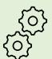

Various organizations offer clear information about the EUDR itself.

We highlight the tools that offer clear insights into *what needs to be done by whom*.

- **[FEDIOL/COCERAL guidance](https://www.coceral.com/data/172684259724ENV360%20EUDR%20common%20practices%20and%20recommendations%2020%20September%202024.pdf)** on EUDR Compliance FEDIOL and COCERAL released a detailed and comprehensive guidance (September 2024). It provides clear, detailed, and relevant suggestions for preparing for EUDR compliance.
- **ITC** [EUDR tools and solutions](https://intracen.org/file/eudr-tools-and-solutions-checklist-draft3-august-2024rev-6-augustfinalpdf) The International Trade Center offers six handbooks about EUDR with practical guidance on EUDR implementation. The handbooks include very clear visuals of supply chains subject to EUDR. Also, for companies in producing countries, the handbooks provide very useful insights.
- **WWF** [EUDR step-by-step guide for Business](https://forestsforward.panda.org/resources/responsible_sourcing/) The guidance provided by WWF helps companies understand the EUDR, identify what needs to be done to comply with the EUDR, and support a more ambitious sustainability agenda.

- **Preferred by Nature** [EUDR Scoping tool V 3.0](https://survey.alchemer.com/s3/7864734/EUDR-Scoping-Tool-V2) an[d Due Diligence Toolkit](https://www.preferredbynature.org/preferred-by-nature-due-diligence-toolkit) The tools by *Preferred by Nature* help companies with the preparation for and implementation of EUDR requirements. The scoping tool supports a company to identify whether it is a trader or operator and whether the product is in the scope of the regulation, and is regularly updated to incorporate new information as provided in the FAQs. The Due Diligence Toolkit offers comprehensive guidance as well as templates to allow compliance with the EUDR and to document processes and measures taken.

## **3. Sustainability standards**

Sustainability standards are already verifying the legality of production on the ground, as well as the no deforestation and (often) no conversion of other ecosystems. Most standards have a national interpretation in which they identify the applicable laws and regulations for the auditor to check.

Below, we highlight the multistakeholder standards for soy. A benchmark, including aspects of EUDR readiness, was done by Profundo with info up to Q1 2023. This benchmark is updated between April- September/October 2025.

There are currently no real up-to-date overviews of "EUDR preparedness" of soy standards; so please verify with the standard owners themselves to see what they can do with their latest tools. Below is what *we* know about the most recent updates and EUDR alignments.

#### **RTRS** – [Sustainability standard and chain of custody](https://responsiblesoy.org/rtrs-presents-advances-chain-of-custody-standard-alignment-eudr?lang=en)

RTRS offers a sustainability certification program that verifies legality, deforestation, and conversionfree soy while also verifying many other sustainability topics. It has revised its CoC standard and has developed an add-on nr IV with information to assure EUDR compliance. Both "CoC standard version 3.0" and the add-on "Chain of Custody Model IV: Requirements for Alignment with the EUDR" are recently approved by the General Assembly end of November 2024.

The combination of RTRS standard + add-on IV EUDR allows for

- a) an EUDR-compliant segregated supply of responsible soy
- b) the mixing of RTRS-certified with non-certified EUDR-compliant soy (RTRS EUDR mix). The latter option requires the EUDR add-on to be applied to the certified soy, while the non-certified soy is controlled for the application of a due diligence system suitable for EUDR compliance. Then there is also the option for:
- c) the acquisition of credits (book and claim) to support responsible conversion-free soy production on top of the (otherwise verified) EUDR-compliant physical stream. One can choose to support specific regions.

#### **ProTerra** – [Sustainability Standard](https://eur04.safelinks.protection.outlook.com/?url=https%3A%2F%2Fwww.proterrafoundation.org%2Fthe-proterra-standard%2F&data=05%7C02%7Cheleen.vandenhombergh%40iucn.nl%7Ca2c9530bd3be4714706e08dcd71ad758%7Cac192bb67089415fa6f6caa448d23eb2%7C0%7C0%7C638621757553917767%7CUnknown%7CTWFpbGZsb3d8eyJWIjoiMC4wLjAwMDAiLCJQIjoiV2luMzIiLCJBTiI6Ik1haWwiLCJXVCI6Mn0%3D%7C0%7C%7C%7C&sdata=Dq7VhTlQ4ej2csufi8kJ7v1%2FBm9M1qwdguupw6fQIJ4%3D&reserved=0) v5.0.

The ProTerra Standard offers an independent comprehensive sustainability certification program that includes legality, deforestation, and conversion-free non-GMO agricultural crops, while also covering many other sustainability topics. During its last revision, several alignments were made to support companies in the preparation for EUDR compliance.

In addition, ProTerra offers an MRV Standard to verify a company's management system in order to guarantee legal, deforestation, and conversion-free sourcing for any crop, worldwide.

#### **Donau Soja & Europe Soya** –– [sustainability standard,](https://www.donausoja.org/eudr-infoprocess/) [Soy standards](https://www.donausoja.org/certification-inspection/)

Donau Soja offers two sustainability certification programs, Donau Soja and Europe Soya, that verify legality, deforestation, and conversion-free non-GMO soy while also verifying many other sustainability topics. The standards are applied in Europe. Donau Soja has revised its standard to anticipate compliance with EUDR (such as polygons, and storing data for 5 years). In addition to the two standards, Donau Soja introduces *Crop Insights.* This is a software tool that helps companies ensure deforestation-free supply chains in line with EUDR. The software tool covers the different steps in line with EUDR, from geo-data collection to the submission of a due diligence statement in the European Information System. Crop Insights can be applied to Donau Soja and Europe Soycertified material, but can also be used for non-certified soy.

#### **More sustainability standards** – [FEFAC SSG compliant standards](https://standardsmap.org/en/identify?client=FEFAC)

There are many other sustainability standards for soy, such as the company owned system CRS from trader Cefetra, rolled out among others in Argentina and Paraguay, or Aapresid (Agricultura Sustentable Certificada) applied in Argentina. The FEFAC tool in the ITC Sustainability Map allows for identifying those standards that collect polygons from the producers. It is a starting point for identifying standards that can support you with your EUDR compliance.

Most FEFAC SSG compliant standards control the conversion-free nature of soy besides deforestation-free production. Some of these systems have credit systems that directly support sustainable production on the ground. This allows support to producers in specific regions on top of the (otherwise verified) EUDR-compliant physical stream and allows for growth of local area and volume of responsible soy. These include RTRS book and claim, CRS credits and Donau Soja's Protein Partnerships.

| Name          | Traceability | Verifying |                |     |         |
|---------------|--------------|-----------|----------------|-----|---------|
|               | yes          | yes       | yes            | yes | yes     |
| RTRS EUDR mix | yes          | For RTRS  |                |     |         |
|               |              |           | only – or with |     |         |
| RTRS credits  | No           | yes       | yes            | yes | yes     |
|               | yes          | yes       | yes            | yes | Yes but |
|               | yes          | yes       | yes            | yes | yes     |
|               | yes          | yes       | yes            | yes | yes     |

### **4. National traceability and legal verification systems**

In various producing countries, national or regional systems for traceability and for verifying compliance are in place, or being developed. Below is our first overview of the ones relevant for soy.

#### **VISEC** - [VISEC](https://www.visec.com.ar/en/home/)

VISEC is a trader-led traceability system for soy and beef in Argentina, with intending to support a similar tool in Paraguay. It documents geolocations, controls on EUDR-compliant deforestation-free production since 31-12-2020, and no illegal deforestation before 31-12 2020. Argentina has a 3 colored land use zoning system: red (no go), yellow (more analysis needed) and green (suitable for agriculture) . Legality of soy supply is validated by VISEC by asking for legal authorizations in case of deforestation done in the green zone between 2008 (Argentina's forest law entry into force) and 2020. Deforestation in the yellow or red zone after 2008, or in other protected areas is considered illegal. VISEC also controls production capacity per unit and transport permits. It gives out a Deforestation Free Certificate issued by an auditor, but does not cover all legality aspects and does not require ground control on legality and sustainability. This information should be added separately (eg about a plot being certified or not). Having started in the Chaco, VISEC's ambition is to cover all soy in Argentina in all directions and, as said also have impact in Paraguay - [VISEC](https://www.visec.com.ar/en/home/)

#### **AgroBrasil+ Sustentavel**

AgroBrasil+ Sustentavel is a Brazilian national transparency platform that aims to qualify agricultural products and rural properties regarding socio-environmental and legal aspects. The platform is under development and will include a traceability system. It is not clear whether the platform may be used for European market purposes, but it is relevant to follow its developments as it concerns national level governance which would apply to all markets.

| Name  | Traceability | Verifying |    |        |        |
|-------|--------------|-----------|----|--------|--------|
| VISEC | yes          | yes       | no | partly | no     |
|       | yes          | yes       | no | partly | partly |

### **5. Subnational systems traceability and legal verification systems**

There are also some regional developments to follow in Brazil.

#### **Selo Verde** – [Pará](https://seloverde.info/en/#:~:text=SeloVerde%20subsidizes%20the%20monitoring%20and,Rural%20Environmental%20Registry%20(CAR).) in Brasil

SeloVerde Pará helps with the monitoring and evaluation of sustainable agricultural development policies and the combat of illegal deforestation and production in the State of Pará. Labor and human rights criteria are also included in the system. The platform provides data on agricultural production and environmental suitability for rural properties registered in the Rural Environmental Registry (CAR). SeloVerde integrates public data from state and federal agencies to come up with insights supporting traceability and transparency. The SeloVerde platform is used to assess the compliance of rural properties with the Forest Code, provide transparent traceability of direct and indirect livestock suppliers and soybean producers, integrate updated geospatial information and data from SEMAS, ITERPA, ADEPARÁ, IBAMA, ICMbio, INCRA, FUNAI, MMA, and other federal agencies, and assist with environmental and land regularization. However, the site itself says that

the estimates and maps on this website are available exclusively for scientific-informative purposes and do not represent official statements, audit reports, certificates, conclusive opinions or similar instruments to attest to the environmental and legal compliance of rural properties in the state of Pará.

#### **Selo Verde** –[Minas Gerais](https://seloverde.meioambiente.mg.gov.br/en/home-english/) in Brasil

Similar to Selo Verde Pará, Selo Verde Minas Gerais is a tool using publicly available information to provide insights into traceability and transparency for different commodities. A joint project with [Al-](https://alinvest-verde.eu/en_gb/brasil-selo-verde/)[Invest Verde](https://alinvest-verde.eu/en_gb/brasil-selo-verde/) helps the state implement the system and use it to support the verification of compliance with the requirements for EUDR.

#### **SIFMA – SeloVerde** – Maranhão in Brazil

SIFMA - SeloVerde is a traceability system for soy, based on a methodology and data similar to the SeloVerde, and applied in the entire Maranhão State. It was originally designed for tax purposes which could also enable coupling to other data such as on CAR. No link available yet.

#### **AgroPlus** - [AgroPlus](https://agroplusbrasil.com.br/en/)

AgroPlus, previously known as Soja Plus, is a voluntary program for farmers in several Brazilian states to "support them in producing efficiently and sustainably". In addition to the economic and social concerns, Agro Plus helps producers comply with the NR-31 norm and the Brazilian Forest Code, avoiding fines for failing to comply with Brazil's current social and environmental regulations.

| Name     | Traceability | Verifying |    |     |    |
|----------|--------------|-----------|----|-----|----|
|          | yes          | yes       | no | yes | no |
| AgroPlus | no           | no        | no | yes | no |

### **6. Software tools**

There is a fast growth in the number of software solutions that help verify compliance with EUDR and other regulations. Some focus more on deforestation, others on traceability and legal compliance. Some are using Artificial intelligence to execute first checks using publicly available data, others use a combination of satellite images, remote sensing, and checks on the ground.

There are also software solutions that have a broader scope, including CSDDD and CSRD the requirements of the Corporate Sustainability Directive (CSDDD) and the Corporate Sustainability Reporting Directive (CSRD). They support companies with automatically generated supplier surveys, the option to collect documentation in a structured way, and to assess a broader range of sustainability risks using indices and other publicly available data.

**Disclaimer: CSI is not linked to any of the systems mentioned, nor involved in detail in their technical functioning. We recommend companies to verify for themselves -and in detail – if these tools are suitable and if so which ones. It should be kept in mind that operators/traders have the responsibility to execute due diligence. This responsibility cannot be delegated to a particular IT or AI system. Also, the software systems have to be completely integrated in own sourcing/ production/ sales processes and supplier management to unfold their potential to assist EUDR compliance. Over time, we hope to have more information about the working of these systems for compliance purposes.** 

#### **Satelligence** – [EUDR tools and solutions](https://satelligence.com/eudr/)

Satelligence is an expert in monitoring the sourcing of forest risk commodities. They combine a very large global plot database with detailed ground-truthed forest and commodity maps, deforestation and legality checks, for compliance statements and online dispute resolution. Offices in countries such as Brazil and Indonesia ensure local verification. Their solution allows an automated risk assessment, case tracker, supply chain manager and EUDR reporting for stakeholders. The analysis covers the identification of deforestation, overlaps with indigenous territories and protected areas as well as grievances, with legality aspects being continuously integrated in the solution. Working with many leading traders and brands, Satelligence promotes advancing industry consensus on methodologies and collective action on deforestation. Satelligence supports companies with EUDR as part of simplifying NDPE, CSRD and TNFD reporting with real-time data.

#### **Nadar** – [deforestation module](https://www.nadar.earth/eudr-compliance)

Nadar is a company that combines earth observation, forestry sciences, and software development. The company offers, amongst others, an EUDR module. In this module, companies can upload their polygons which are then automatically checked for quality and mistakes (overlapping, intersecting, in oceans) and verified for being deforestation-free with high-quality satellite images based on open source data and proprietary machine learning models. The custom-built algorithms developed by Nadar reduce false deforestation alerts and improve the accuracy of open-source data used. Legal compliance is also checked, based on publicly available data. No verification on the ground is included. At the end of the process, a due diligence statement is generated which companies can submit or they can enable Nadar as an authorized representative.

#### **Sourcemap** – [Sourcemap EUDR Solution](https://www.sourcemap.com/solutions/eudr?utm_term=eudr%20regulation&utm_campaign=WFX-EUDR&utm_source=adwords&utm_medium=ppc&hsa_acc=2015392227&hsa_cam=21586034303&hsa_grp=164458981085&hsa_ad=709665070269&hsa_src=g&hsa_tgt=kwd-2174939128265&hsa_kw=eudr%20regulation&hsa_mt=p&hsa_net=adwords&hsa_ver=3&gad_source=1&gclid=EAIaIQobChMIxdGngYK-iAMVDWtBAh2pwQKQEAAYAyAAEgJqBfD_BwE)

[Sourcemap](https://www.sourcemap.com/) is a tech company that helps companies map their supply chains and the sustainability risks within them. [Sourcemap](https://www.sourcemap.com/solutions/eudr)'s EUDR solution allows companies to combine farm mapping and monitoring with shipment-level traceability. It allows the handling of bulk data and offers support in bulk data cleaning. Based on the geolocation data and polygons, the deforestation-free status is identified by analyzing satellite imagery and historical land use data. Additionally, EUDR legality criteria is assessed and a real-time "watchlist monitoring" is offered to ensure supplier compliance; software that crawls public sources to detect any reported links between listed suppliers and issues such as human rights violations.

The company supports all steps – from the verification of polygons up to the creation and submission of due diligence statements and reporting. Additionally, international service teams offer support for suppliers with the implementation of EUDR.

#### **Source intelligence** – [EUDR t](https://www.sourceintelligence.com/solution/eudr#:~:text=Source%20Intelligence%20delivers%20a%20comprehensive%20solution%20to%20the%20challenges%20of)ools

Source Intelligence offers software and services within the context of product compliance, responsible sourcing, and sustainability management. The EUDR solution enables product tracing, the collection and analysis of supplier information, and offers the automatic submission of due diligence statements as well as aggregated information for customers and reporting. The risk assessment covers legality and deforestation-free criteria (e.g. through satellite-based assessment). Additionally, managed services are offered to cover the collection and validation of data from suppliers by dedicated teams of Source Intelligence.

Apart from its EUDR solution, Source Intelligence provides customized services for sector initiatives and sustainability standards through its ChainPoint platform. ChainPoint offers flexible software solutions to help these initiatives track, manage, and analyze upstream supply chain data – from origin to consumer. The platform supports on-site and remote audit management as well as realtime analytics and monitoring to enhance collaboration and transparency across the supply chain.

#### **osapiens** – [EUDR tools](https://osapiens.com/esg-solutions/eudr/)

osapiens is an ESG platform that helps companies comply with different ESG regulations. The EUDR solution helps with all steps of EUDR compliance. The solution offers an end-to-end approach: Starting from a supplier interface to collect data, over to automated analyses of deforestation and legality risks, up to case management, due diligence statement submission and customer portals and reporting. Artificial Intelligence algorithms analyze satellite imagery, verifying no deforestation of polygons. Legal compliance is assessed, using publicly available and supplier-specific information. The platform also facilitates supplier engagement and organized documentation. Different options are offered for SME and non-SME actors.

*Note that the authors have not followed demos from all systems mentioned above.* 

*Contact these and other suppliers to learn more. This list is also not exhaustive. Other tools are*  [FarmForce,](https://farmforce.com/) [Whisp,](https://whisp.earthmap.org/login) [Ucropit,](https://ucrop.it/en/home/) [PreWave,](https://www.prewave.com/solutions/eudr) [Global Traceability,](https://www.global-traceability.com/) [Optel,](https://www.optelgroup.com/en/) [Supply Shift,](https://www.supplyshift.net/) [IntegrityNext,](https://www.integritynext.com/de/esg-loesungen/eu-entwaldungsverordnung-eudr) [Transparency One,](https://www.transparency-one.com/) [Xylene,](https://xylene.io/) [Global Traceability,](https://www.global-traceability.com/de/) [Xylem technologies,](https://www.xylem-technologies.com/) [TraceX,](https://tracextech.com/) [Farmerline](https://farmerline.co/digitization-revolutionizes-agriculture-how-farmerlines-mergdata-traceability-tool-saves-the-environment/)[, Double](https://www.doublehelixtracking.com/project-management)  [Helix Tracking.](https://www.doublehelixtracking.com/project-management) *See for a longer list of tools, without further description, in the FEDIOL and COCERAL Guidance document on pages 45 and 46 or in the [letter](https://www.oc.eco.br/wp-content/uploads/2024/05/Every-second-counts-Letter-to-UVDL-on-EUDR.pdf) of civil society organizations to Ursula von der Leyen.* 

### **7. Data sources/reference maps**

On pages 45 and 46 of the FEDIOL and COCERAL guidance, a list of reference maps can be found. Civil society organizations sent a letter to Ursula van der Leyen also mentioning that many tools are already available. [Page 2 of the document](https://www.oc.eco.br/wp-content/uploads/2024/05/Every-second-counts-Letter-to-UVDL-on-EUDR.pdf) lists data sources that can be used, various of which are already mentioned in this Guidance document. We explicitly mention the following systems: [MapBiomas,](https://brasil.mapbiomas.org/en/) [TerrasBrasilis,](https://terrabrasilis.dpi.inpe.br/en/home-page/) [Trase,](https://trase.earth/) [Global Forest Watch,](https://www.globalforestwatch.org/) [Global Map of Forest Cover,](https://forest-observatory.ec.europa.eu/forest/gfc2020) [Open Foris](https://openforis.org/) [tools,](https://openforis.org/) [Ground,](https://openforis.org/solutions/ground/) [Earth Map](https://openforis.org/solutions/earth-map/) and [Global canopy Height map.](https://sustainability.fb.com/blog/2024/04/22/using-artificial-intelligence-to-map-the-earths-forests/)

**This annex was Published by the Collaborative Soy Initiative on 30 October 2024.** We hope the list above is useful and intend to revise it, resources allowing, in due time. Feedback and additional information please send to:

Contact[: coordinator@thecollaborativesoyinitiative.info](mailto:coordinator@thecollaborativesoyinitiative.info)

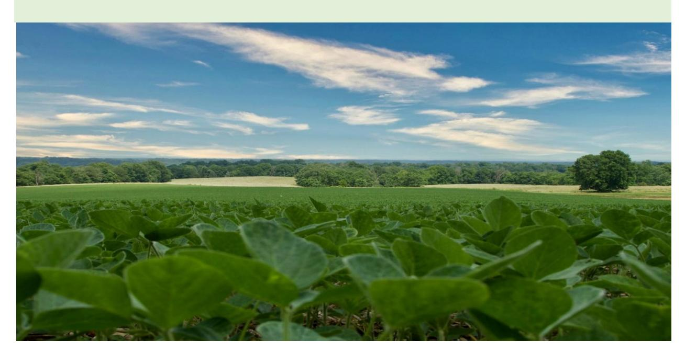

Photo b[y Braden Egli o](https://unsplash.com/@bradenegli?utm_content=creditCopyText&utm_medium=referral&utm_source=unsplash)[n Unsplash](https://unsplash.com/photos/green-plants-on-green-grass-field-under-blue-sky-during-daytime-UIz_4PMK8xI?utm_content=creditCopyText&utm_medium=referral&utm_source=unsplash)