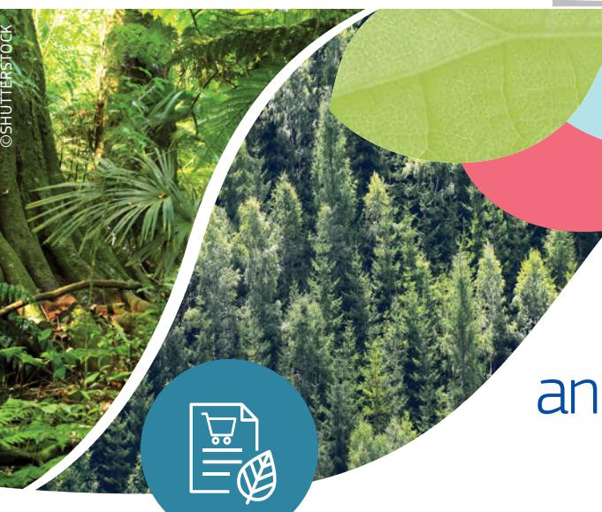

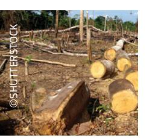

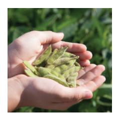

## **EU Deforestation Regulation:** an opportunity for smallholders

November 2023 #EUGreenDeal

*"Smallholders can play an important role in promoting fair and eco-friendly farming. By ensuring that their products are deforestationfree, smallholders can protect the natural environment, which is oen their livelihood. Moreover, there is a growing demand for deforestation-free and sustainably produced products around the world. Smallholders can reap the benefits of these business opportunities."* 

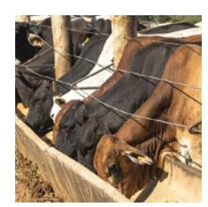

## **Virginijus Sinkevičius,**

EU Commissioner for Environment, Oceans and Fisheries

Under the [EU Deforestation](https://eur-lex.europa.eu/legal-content/EN/TXT/?uri=CELEX%3A32023R1115&qid=1689595765300)  [Regulation](https://eur-lex.europa.eu/legal-content/EN/TXT/?uri=CELEX%3A32023R1115&qid=1689595765300), only products that are **legal** in the country of production and **not linked to deforestation** and forestdegradation **aer 31 December 2020** can be placed on the EU market.

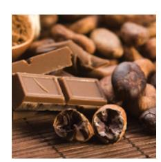

Smallholders producing **cattle, cocoa, coffee, palm oil, rubber, soya and wood** for the EU market should produce on **deforestation-free land** and **follow national laws**.

Smallholders who do not place these products on the EU market themselves are under **no direct legal obligations**. However, they might be asked by their business partners, for example buyers, to provide information on their production, especially on the land of production. Business partners need this information to fulfil their own obligations under the regulation.

Smallholders should keep the following principles in mind:

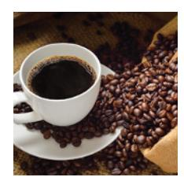

Make sure not to produce on land that was deforested aer 2020

Collect information, especially GPS data of the production area

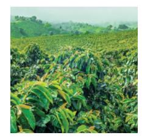

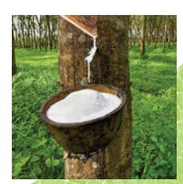

Communicate with business partners and pass

Respect land use rights and labour rights

EU Defore

station Re

gulation

©SHUTTERSTOCK

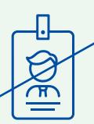

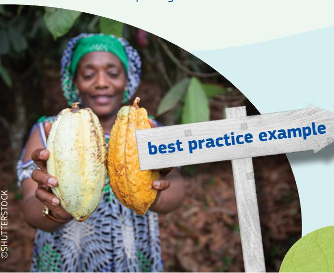

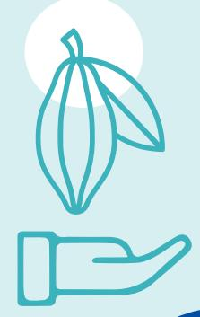

## **How can smallholders collect geolocation data?**

GPS coordinates of production areas can be **generated easily and for free,** for example, among others, via mobile phones and widespread digital applications like Geographic Information Systems (GIS)

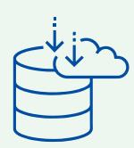

Unless the production area changes, it is sufficient to **collect the data once**

**No personal information** is required

Smallholders can lean on **existing national initiatives,** provided that the information supplied meets the requirements set out in Article 9 of the Regulation, as well **efforts by cooperatives** on traceability and geolocation Owning geolocation data gives smallholders a **stronger, more independent position in the value chain** which can lead to fairer prices for smallholders as it allows for more direct supply chains. A **more transparent and traceable value chain** can help smallholders to reach new markets and to focus on the sustainability of their products Focusing on sustainable production can also lead to **fairer prices for smallholders** Smallholders can benefit from **technical support or capacity building** from business partners who depend on information exchange The EU is **strengthening the cooperation with partner countries**, involving smallholders and promoting their interests

## **The EU Sustainable Cocoa Initiative**

- **•** supports the **sustainability transition** of the cocoa sector in the main cocoa producing countries in West Africa – **Cote d'Ivoire, Ghana and Cameroon**
- **•** under the initiative, the **Cocoa Talks** bring together actors from around the cocoa supply chain with a focus on **traceability and stakeholders' participation**