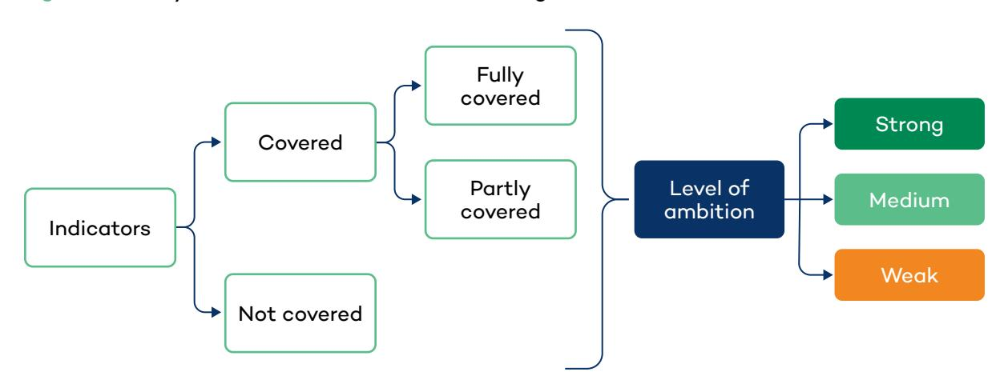
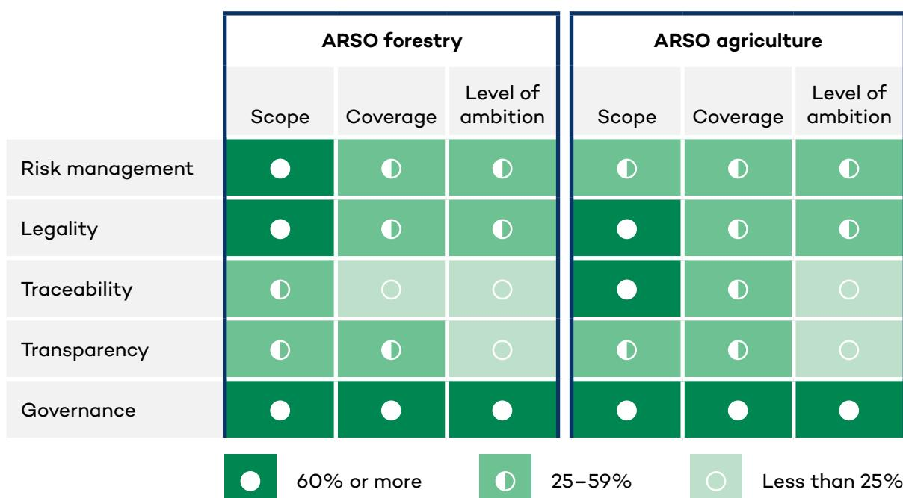

Rupal Verma

 IISD  
International Institute for  
Sustainable Development

# **Supporting EUDR Compliance Through Regional Sustainability Standards**

**Insights from the African Organization for Standardisation agriculture and forestry standards** 

**SSI REPORT**

© 2026 International Institute for Sustainable Development Published by the International Institute for Sustainable Development This publication is licensed under a Creative Commons Attribution-NonCommercial-ShareAlike 4.0 International License.

#### **International Institute for Sustainable Development**

The International Institute for Sustainable Development (IISD) is a globally recognized think tank with 3 decades of experience working to solve the world's most pressing sustainable development challenges. We combine deep expertise in a wide range of issues with a collaborative approach to research, policy advice, and hands-on support to ensure these solutions are brought to life. Headquartered in Winnipeg, Manitoba, we are a diverse team of over 300 professionals working from oces in Canada, Switzerland, and other locations around the world.

IISD's headquarters in Winnipeg are situated on Treaty 1 Territory—the ancestral lands of the Anishinaabe (Ojibwe), Ininiw (Cree), Anisininew (Ojibwe Cree), Dene, and Dakota Nations, and the homeland of the Red River Métis Nation.

IISD is a registered charitable organization in Canada and has 501(c)(3) status in the United States. IISD receives core operating support from the Province of Manitoba and project funding from governments inside and outside Canada, United Nations agencies, foundations, the private sector, and individuals.

#### **Supporting EUDR Compliance Through Regional Sustainability Standards: Insights from the African Organization for Standardisation agriculture and forestry standards**

March 2026

Written by Rupal Verma

Photo: iStock

#### **Acknowledgements**

This work forms part of IISD's State of Sustainability Initiatives (SSI) team's collaboration with the ARSO to support the strengthening of its standards. The author extends sincere thanks to the ARSO team for sharing information on their standards. Special appreciation is extended to Florencia Sarmiento and Cristina Larrea for their thoughtful feedback on earlier drafts of the report. The author would also like to acknowledge support from Steany Bermudez and Erika Luna.

#### **Head Office**

111 Lombard Avenue, Suite 325 Winnipeg, Manitoba Canada R3B 0T4 **iisd.org**

## **Executive Summary**

The European Union Deforestation Regulation (EUDR) introduces strict requirements for operators placing selected agricultural and forest-based commodities on the EU market. To comply, operators must demonstrate that their products are deforestation-free, legally produced, traceable to the plot level, and supported by a risk assessment and risk mitigation system, if necessary.

National and regional voluntary sustainability standards (VSSs) can help producers, especially smallholders, meet these requirements by providing structured and locally relevant assurance systems, traceability frameworks, and verification processes. However, to perform this role eectively, these VSSs must be reliable and closely aligned with EUDR requirements.

This paper presents the results of the International Institute for Sustainable Development's (IISD's) benchmarking of the African Organization for Standardisation (ARSO) agricultural and forestry standards, which are regional standards developed for use across countries and commodities in Africa, against the requirements of EUDR. It identifies the areas where ARSO standards already align with EUDR expectations, the gaps that remain, and the recommendations needed to strengthen ARSO as a reliable regional VSS supporting EUDR compliance.

## **Table of Contents**

| 1.0 Introduction....................................................................................................................................................................              | 1  |
|---------------------------------------------------------------------------------------------------------------------------------------------------------------------------------------------------|----|
| 1.2 The Role of VSSs in Supporting EUDR Compliance.........................................................................................                                                       | 2  |
| 1.3 ARSO’s Role in the Evolving EUDR Landscape....................................................................................................                                                | 2  |
| 3.3 Deforestation-Free Requirements ..............................................................................................................................11                              |    |
| 3.5 Transparency................................................................................................................................................................................  | 14 |
| 3.6 Governance................................................................................................................................................................................... | 16 |
| 4.1 Cross-Cutting Recommendations for Both Standards ..........................................................................                                                                   | 18 |
| References ............................................................................................................................................................................21         |    |

#### **List of Figures**

#### **List of Tables**

| Table 1. Risk management coverage for ARSO agriculture and forestry standards                                                                                                                                          | ..............................7 |
|------------------------------------------------------------------------------------------------------------------------------------------------------------------------------------------------------------------------|---------------------------------|
| standards ..........................................................................................................................................................................................................12 |                                 |
| Table 6. Governance coverage for ARSO agriculture and forestry standards..........................................                                                                                                     | 17                              |

## **1.0 Introduction**

### **1.1 The EUDR and Its Implications for Producers**

The [EUDR](https://eur-lex.europa.eu/legal-content/EN/TXT/PDF/?uri=CELEX:32023R1115) requires that operators placing cocoa, coee, cattle, soy, palm oil, rubber, or timber on the EU market demonstrate that1

- **the product is deforestation-free,** meaning it was not produced on land subject to deforestation or forest degradation after December 31, 2020;
- **the products have been produced in accordance with the relevant legislation of the country of production;**
- **the product is covered by a due diligence statement,** containing information on the products and their supply chains, geolocation data of all plots of land where the commodities were produced, and evidence of a risk assessment and, where applicable, risk mitigation measures.

Although the core requirements mentioned above remain unchanged, the implementation timeline and compliance obligations have recently shifted. In December 2025, the European Parliament and Council reached a provisional political agreement on a targeted revision of the EUDR, aimed at simplifying implementation and delaying the application dates of the EUDR to allow operators, traders, competent authorities, and third countries more time to prepare (Council of the European Union and European Parliament, 2025). Under the current provisional agreement,

- medium and large operators would need to comply by **30 December 2026**;
- micro and small operators would have until **30 June 2027**;
- certain printed products (such as books, newspapers, and printed pictures) have been removed from the scope of the regulation.

The co-legislators also agreed on measures to reduce administrative burden, such as clarifying simplified declarations for micro and small primary operators and refining responsibilities for due diligence statements along the supply chain (Council of the European Union and European Parliament, Press Release 1035/25, 2025). Further, the European Commission would present an EUDR simplification package by the end of April 2026, which will not change the core text of the regulation but will have a delegated act with amendments to the products that fall in the scope of the regulation (Manzanaro, 2026).

This evolving policy landscape introduces both uncertainty and opportunity: uncertainty because the final form of the regulation may change, and opportunity because the extended timeline allows producer countries and supply-chain actors to strengthen data systems, improve supply chain mapping and traceability, and align existing national and regional sustainability standards and frameworks with EUDR expectations.

1 As per the Regulation (EU) 2023/1115 on deforestation-free products, available at: [https://eur-lex.europa.eu/](https://eur-lex.europa.eu/legal-content/EN/TXT/PDF/?uri=CELEX:32023R1115) [legal-content/EN/TXT/PDF/?uri=CELEX:32023R1115](https://eur-lex.europa.eu/legal-content/EN/TXT/PDF/?uri=CELEX:32023R1115)

### **1.2 The Role of VSSs in Supporting EUDR Compliance**

VSSs are "standards specifying requirements that producers, traders, manufacturers, retailers or service providers may be asked to meet, relating to a wide range of sustainability metrics, including respect for basic human rights, worker health and safety, environmental impacts, land-use planning, and others" (United Nations Forum on Sustainability Standards, 2013, p. 4). Even though they are voluntary, they remain central in supporting producers, especially smallholders. The EUDR regulation references "certification or other third-party schemes" as a source of complementary information for risk assessment, provided that the schemes are credible (Council of the European Union and European Parliament, 2025; International Trade Centre, 2025). The guidance document published for compliance with the EUDR further stresses that **these standards cannot replace the due diligence obligations.**

However, even though VSSs cannot be used as a "green lane" for compliance, they can help producers and small and medium-sized enterprises meet the requirements set forth by the EUDR and support compliance with the regulation by providing (International Trade Centre, 2025; Sarmiento, 2025):

- verifiable documentation on legality and sustainability
- chain-of-custody and traceability systems
- audit-based verification of compliant practices
- data relevant to risk assessments.

National and regional VSSs can also support compliance with the EUDR by oering locally relevant, cost-eective assurance systems, grounded in domestic legal and production contexts. They can reflect domestic governance frameworks and reduce costs for producers who may not be able to access international certification.

### **1.3 ARSO's Role in the Evolving EUDR Landscape**

Africa's agrifood sector is expanding, supported by growing domestic demand, advancing regional integration, and increasing participation in global value chains. Agricultural and food markets are projected to reach USD 1 trillion by 2030, while the African Continental Free Trade Area is expected to further facilitate intra-African trade in agrifood commodities (Food and Agriculture Organization of the United Nations & African Union Commission , 2021; World Bank, 2013).

However, despite steady growth in exports, Africa continues to account for a relatively small share of global agricultural trade. Like most countries, the integration of African countries into the world trading system will depend on their ability to meet the demands of that system, which can include compliance with regulations, quality and safety standards, and competitive prices (Henson & Loader, 2001; Melo & Nicita, 2018; Santeramo & Lamonaca, 2018). Strengthening the continent's capacity to comply with such standards is therefore crucial to enhancing competitiveness and facilitating more inclusive and resilient integration into regional and global value chains. This capacity is also critical in the context of emerging

regulatory frameworks such as the EUDR, which sets expectations for traceability, due diligence, and sustainability in selected forest value chains.

ARSO can play a strategic role in addressing these challenges. ARSO is the continent's intergovernmental standard-setting body, established in 1977 to harmonize standards across the continent and support the development of a coherent African quality infrastructure. ARSO's mandate is to facilitate intra-African trade, enhance the competitiveness of African products, and ensure that African producers can meet international market requirements. Its core mandate is to promote harmonized African Standards (ARS) for goods and services that support trade, regional integration, and sustainable development across the continent.2

Working closely with national standards bodies, regional economic communities, continental institutions such as the African Continental Free Trade Area Secretariat, and international partners, ARSO facilitates the development, adoption, and implementation of continental standards across priority sectors. These include

- agriculture and agrifood (e.g., coee, cocoa, horticulture, aquaculture, and cereals);
- forestry and forest products (including sustainable forest management and chain-ofcustody standards);
- sustainability and environmental management (such as soil health, water use, and organic agriculture);
- quality and safety standards for processed products;
- trade-enabling standards such as conformity assessment and labelling requirements.

ARSO's agriculture and forestry sustainability standards therefore represent Africa's regional approach to aligning production systems with global market requirements, supporting harmonized practices and enhancing export competitiveness. Through these standards, ARSO contributes to building the quality infrastructure necessary for African producers to meet evolving sustainability expectations in regional and global markets, including those embedded in regulations such as the EUDR.

This paper assesses whether selected ARSO agriculture and forestry standards can meaningfully support EUDR compliance by benchmarking ARSO standards against EUDR requirements and highlighting actionable technical and policy advice to (a) identify the gaps for EUDR readiness, (b) propose standard revisions and governance/measures, and (c) suggest practical steps for ARSO to support producers and small and medium-sized enterprises to comply with EUDR. In doing so, the paper aims to contribute to a coordinated African response that strengthens market access, supports sustainable production, and ensures that EUDR implementation is inclusive and feasible.

2 For more information on ARSO, see: <https://www.arso-oran.org/>

## **2.0 Methodology**

The benchmarking assessed the following ARSO standards:

- **ARS AES 1–2014:** Agriculture Sustainability and Ecolabelling (ARSO Agriculture)
- **ARS AES 3–2014:** Forestry Sustainability and Ecolabelling (ARSO Forestry)
- **ARSO Conformity Assessment System (ACAP 1-1 to 1-4, 2023)**

The benchmarking focused exclusively on the [EUDR regulation](https://www.oecd.org/content/dam/oecd/en/publications/reports/2018/02/oecd-due-diligence-guidance-for-responsible-business-conduct_c669bd57/15f5f4b3-en.pdf) and the [guidance](https://www.oecd.org/content/dam/oecd/en/publications/reports/2018/02/oecd-due-diligence-guidance-for-responsible-business-conduct_c669bd57/15f5f4b3-en.pdf) issued by the EU for compliance, based on which an assessment framework was developed, consisting of 47 indicators in the following themes:

- 1. **Risk management:** Measures around collecting information, assessing risk of noncompliance with deforestation-free and legal requirements, and implementing mitigation (e.g., audits, additional data collection).
- 2. **Legality:** Ensuring products comply with all relevant laws in the country of production.
- 3. **Deforestation-free requirements:** Ensuring products are from land not subject to deforestation after 31 December 2020, and definitions align with those in the EUDR.
- 4. **Traceability:** Ensuring the commodity can be traced to its land-plot of origin, with identity preservation and required documentation.
- 5. **Transparency:** Public availability of standard requirements that must be met for compliance, audit methodologies, conformity assessment body information, certification status, and governance disclosures.
- 6. **Governance:** The internal structure, decision-making processes, stakeholder representation, alignment with international norms, and continuous improvement mechanisms of the standard-setting and certification system.

For each EUDR requirement, ARSO standards' requirements were benchmarked by applying a structured three-step evaluation, as shown in Figure 1.

**Figure 1.** Analysis framework for benchmarking

The first step was to assess whether the EUDR-relevant requirement represented by a set of indicators appears at all in the ARSO standard requirements. This is where each indicator in our framework was mapped against ARSO requirements under the following two categories:

- **covered:** clearly aligned with EUDR expectations
- **not covered:** missing or insucient for EUDR purposes.

For indicators marked as covered, we then evaluated the scope, that is, how completely the requirement of the indicator is addressed, as either

- **fully covered:** indicator is addressed comprehensively, including its essential operational components (e.g., explicit requirement for 5-year record retention)
- **partially covered:** indicator is mentioned, but details are missing, incomplete, or optional (e.g., geolocation referenced but without polygon requirements).

For all indicators with some degree of coverage, we then assessed the strength of the requirement or the level of ambition, compared with EUDR expectations, as per the following categories:

- **strong ambition:** requirement closely mirrors EUDR requirements or aligns with best practice in sustainability assurance
- **medium ambition:** requirement is included, but at a lower level of rigour or detail
- **weak ambition:** requirement is nominal, generic, or insucient to support due diligence.

To synthesize indicator-level benchmarking results, the assessment generated three summary scores for each thematic area:

- **coverage score,** representing the percentage of indicators that are addressed ("covered") by the standard.
- **scope score,** representing the share of covered indicators that are fully aligned with the EUDR requirement ("fully covered").
- **level of ambition score,** representing the percentage of indicators rated as strong or medium in terms of the robustness and ambition of the requirement.

Together, these three scores provide a structured way to assess the links between ARSO forestry and ARSO agriculture standards and EUDR, highlighting their alignment strengths and weaknesses. However, it must be noted that the benchmarking does not cover the practices of the standard and its implementation on the ground. The results, therefore, indicate an initial view of whether EUDR alignment exists within the standards.

## **3.0 Findings and Analysis**

The benchmarking of the ARSO forestry and agriculture sustainability standards indicated that, while on some aspects, such as governance, the standards have strong alignment, there are areas, like traceability and transparency, where the standards can be strengthened.

**Figure 2.** Heatmap of alignment scores for ARSO forestry and ARSO agriculture standards (% of indicators covered)

|                 |       | ARSO forestry |          |        | ARSO agriculture |               |
|-----------------|-------|---------------|----------|--------|------------------|---------------|
|                 | Scope | Coverage      |          |        |                  |               |
|                 |       |               | ambition | Scope  | Coverage         |               |
| Risk management | ⚪     | ◐             | ◐        | ◐      | ◐                | ◐             |
| Legality        | ⚪     | ◐             | ◐        | ⚪      | ◐                | ◐             |
| Traceability    | ◐     | ⚪             | ⚪        | ⚪      | ◐                | ⚪             |
| Transparency    | ◐     | ◐             | ⚪        | ◐      | ◐                | ⚪             |
| Governance      | ⚪     | ⚪             | ⚪        | ⚪      | ⚪                | ⚪             |
|                 | ⚪     | 60% or more   | ◐        | 25–59% | ⚪                | Less than 25% |

Note: Indicator-level results across the three dimensions were aggregated into three scores per theme: Coverage score – % of indicators "covered"; Scope score – % of covered indicators that were "fully covered"; Level of ambition score – % of indicators rated strong or medium

Source: Author.

### **3.1 Risk Management**

Under Article 10 of the EUDR, operators are required to carry out a risk assessment, taking into account a defined set of risk criteria related to legality, deforestation and forest degradation, supply-chain complexity, and broader country- and context-specific risks. Where a non-negligible risk is identified, operators must apply risk mitigation measures proportionate to the level of risk (Articles 10 and 11).

Across both agriculture and forestry standards, ARSO includes elements that support aspects of risk identification, traceability, and post-harvest controls, but neither standard establishes a structured, ex ante risk assessment framework aligned with the full set of risk criteria specified in Article 10(2) of the EUDR. Both standards contain strong provisions on conformity assessment and third-party audits, including independent certification bodies, audit frequency, and corrective action procedures. These elements support risk mitigation as required under Article 11, particularly once a risk has been identified.

However, neither standard explicitly links risk mitigation measures to deforestation-specific non-compliance, nor do they define graduated responses based on risk severity. Corrective action procedures (e.g., major non-conformance provisions and suspension mechanisms) could be more explicitly aligned with Article 24, including remedies for environmental and social harm and clearer consequences for placing non-compliant products on the market.

**Table 1.** Risk management coverage for ARSO agriculture and forestry standards

| Covered                                   | Partially covered Not covered NA Not applicable |
|-------------------------------------------|-------------------------------------------------|
| Indicator                                 | EUDR reference                                  |
| (b) Presence of forests                   | Art. 10(2)(b)                                   |
| (c) Presence of Indigenous Peoples        | Art. 10(2)(c)                                   |
| (e) Existence of land claims              | Art. 10(2)(e)                                   |
| (i) Supply-chain complexity               | Art. 10(2)(i)                                   |
| (j) Risk of circumvention or mixing       | Art. 10(2)(j)                                   |
|                                           | Art. 10(2)(k) NA NA                             |
| (l) Substantiated concerns (Art. 31)      | Art. 10(2)(l), Art.                             |
|                                           | 31 NA NA                                        |
| (m) Other information indicating risk     | Art. 10(2)(m)                                   |
| Use of technology for risk identification | Art. 10(2)                                      |

|                                                                                       | ARSO ARSO                           |
|---------------------------------------------------------------------------------------|-------------------------------------|
| Indicator Risk mitigation                                                             | EUDR reference agriculture forestry |
| Adequate measures for risk mitigation                                                 | Art. 10(2), Art. 11                 |
| Audit system exists                                                                   | Art. 11                             |
| Independent, impartial audits                                                         | Art. 11                             |
| Provisions for non-compliance Audit effectiveness (frequency, sampling, group audits) | Art. 3, Art. 11 Art. 11             |
| Grievance mechanism                                                                   | Art. 31 (indirect)                  |
| Corrective action for deforestation                                                   | Art. 24                             |

Note: "Covered" indicates that the standard explicitly addresses the indicator; "Partially covered" indicates indirect or incomplete coverage; "Not applicable" indicates it is not applicable given the scope of VSSs.

Source: Author.

### ARSO Agriculture Standard

The ARSO agriculture standard contains a limited number of provisions that indirectly relate to risk management. Notably, requirements 6.14.1 (Handling of certified products) and 6.14.2 (Segregation of certified and non-certified products) establish controls to prevent mixing and ensure traceability at post-harvest and supply-chain stages. These provisions demonstrate strong alignment with EUDR risk criteria related to supply-chain complexity and traceability and the risk of circumvention or mixing (Article 10(2)(i)–(j)).

Limited environmental risk considerations are also present in the standard's requirement 6.6.1.8, which requires operators to assess ecosystem impacts of new plant introductions. While relevant, this provision is narrow in scope and does not address deforestation or forestdegradation risk at the landscape or country level, as envisaged under EUDR Article 10(2)(f). More broadly, the agriculture standard does not address several EUDR risk elements required under Article 10(2), as indicated in Table 1. Notably, unlike some international VSSs, the ARSO agriculture standard does not yet have provisions or technological solutions to support or enable the use of geospatial or risk-mapping tools to assess deforestation risk.

### ARSO Forestry Standard

The ARSO forestry standard exhibits moderate alignment across several risk-related indicators, particularly in relation to supply-chain complexity and traceability. Requirement 6.4.3 (Documentation for chain of custody) establishes record-keeping and documentation obligations that partially fulfill EUDR risk assessment elements related to Article 10(2)(i) and (j). Compared to the agriculture standard, forestry includes more explicit provisions related

to legal compliance (Principle 6.1) and community tenure and customary rights (Principle 6.7), which are relevant to Article 10(2)(g) and, to a limited extent, Articles 10(2)(c)–(e). The forestry standard also provides a more structured grievance mechanism (requirement 6.8.6), contributing indirectly to risk mitigation.

Nevertheless, similar to the agriculture standard, the forestry standard does not require a systematic risk assessment process covering the full set of Article 10(2) criteria. In particular, it lacks explicit requirements to assess the prevalence of deforestation or forest degradation (Article 10(2)(f)), consider governance and conflict-related risks (Article 10(2)(h)), integrate external risk information such as substantiated concerns or commission expert group conclusions (Articles 10(2)(k)–(l)), or use georeferenced, plot-level mapping to link products to land of production.

#### **What this means for supporting EUDR compliance**

For EUDR readiness, this means that ARSO standards currently provide stronger support for risk mitigation than for ex ante risk assessment. Targeted strengthening, particularly in relation to country- and context-specific risk analysis, land tenure and Indigenous Peoples' rights, and deforestation-risk mapping, would be required for the ARSO standards to effectively support operators in meeting EUDR Article 10 requirements.

### **3.2 Legality**

Under the EUDR, operators must demonstrate that relevant commodities are legally produced, meaning that they comply with all applicable laws of the country of production as defined in Article 2(40) and required under Article 3(b). Information demonstrating legal compliance must be collected and retained as part of the due diligence system (Article 9) and assessed as part of the overall risk assessment (Article 10(2)(g)).

Across both agriculture and forestry standards, ARSO includes strong baseline requirements on legal compliance, requiring operators to comply with applicable national laws and regulations in the country of production. These provisions broadly align with the EUDR's legality requirement and cover multiple categories of law, including land tenure, environmental protection, forest-related regulations, labour rights, and, to a more limited extent, human rights. However, while both standards require compliance with national law as a general principle, neither explicitly covers the full set of legal categories listed in Article 2(40) of the EUDR.

#### **Table 2.** Legality coverage for ARSO agriculture and forestry standards

| Covered                                | Partially covered Not covered NA Not applicable |
|----------------------------------------|-------------------------------------------------|
| Indicator                              | EUDR reference                                  |
| National laws related to land rights   | Art. 2(40)(a),(f)                               |
| National laws related to human rights  | Art. 2(40)(e)                                   |
| Third parties’ rights                  | Art. 2(40)(f)                                   |
| National laws related to labour rights | Art. 2(40)(e)                                   |

Note: "Covered" indicates that the standard explicitly addresses the indicator; "Partially covered" indicates indirect or incomplete coverage; "Not applicable" indicates it is not applicable given the scope of VSSs.

Source: Author.

### ARSO Agriculture Standard

The ARSO agriculture standard establishes a general obligation to comply with applicable national laws, including those related to land tenure, environmental protection, forest regulations, labour rights, and human rights. In particular, requirement 6.3.2.6 on land tenure provides relatively strong alignment with EUDR legality expectations by requiring operators to demonstrate legitimate land-use rights or the absence of significant disputes.

However, most legality-related requirements are framed in general terms, without explicitly referencing the full scope of legal categories set out in EUDR Article 2(40). Coverage of FPIC and Indigenous Peoples' rights remains weak and indirect, limited to water rights provisions, and the standard does not explicitly require documented FPIC procedures. In addition, the agriculture standard does not address legal requirements related to anti-corruption, tax, trade, or customs, which are explicitly included in the EUDR definition of legality.

#### ARSO Forestry Standard

The ARSO forestry standard demonstrates stronger and more detailed alignment with EUDR legality requirements. Principle 6.1 (Legal compliance) requires compliance with applicable national laws and international agreements and is supported by detailed indicators covering land tenure, environmental regulation, forest management, labour rights, and human rights. The standard also includes mechanisms for tracking legal changes and addressing noncompliance, which strengthens its alignment with Articles 3(b) and 9 of the EUDR.

Forestry also performs better on third-party and community rights, with explicit recognition of customary tenure and community land-use rights (Principle 6.7). However, similar to the agriculture standard, coverage of FPIC remains indirect, and anti-corruption, tax, and customs laws are not explicitly addressed.

#### **What this means for supporting EUDR compliance**

The ARSO standards provide a solid legal compliance baseline, particularly in the forestry standard. However, to fully support EUDR legality requirements, ARSO would need to explicitly map all legal categories listed under Article 2(40), strengthen provisions on FPIC and Indigenous Peoples' rights, and incorporate requirements related to anti-corruption, tax, and customs laws. Without these clarifications, ARSO standards cannot fully support operators' EUDR due diligence obligations.

### **3.3 Deforestation-Free Requirements**

Under the EUDR, products must be deforestation-free, meaning they must not be produced on land that has been subject to deforestation or forest degradation after December 31, 2020 (Article 3(a)), as defined in Article 2(3) and Article 2(13). Compliance must be demonstrated through plot-level geolocation data and supporting evidence (Article 9). Across both ARSO standards, alignment with this requirement is weak.

**Table 3.** Deforestation-free requirements coverage for ARSO agriculture and forestry standards

| ✔ Covered                             | ✔ Partially covered                                                                     | ✖ Not covered            | NA Not applicable   |                  |
|---------------------------------------|-----------------------------------------------------------------------------------------|--------------------------|---------------------|------------------|
|                                       |                                                                                         |                          |                     |                  |
| Subtheme                              | Indicator (from IISD framework)                                                      | EUDR reference        | ARSO agriculture | ARSO forestry |
| Deforestation- free requirement | Cut-off date of December 31, 2020                                                    | Art. 3(a); Art. 2(13) | ✖                   | ✔                |
|                                       | No exemptions for conversion after cut-off date                                      | Art. 3(a)                | ✖                   | ✔                |
|                                       | Alignment with EUDR definitions of forest deforestation and forest degradation | Art. 2(3), 2(13)      | ✖                   | ✔                |

Note: "Covered" indicates that the standard explicitly addresses the indicator; "Partially covered" indicates indirect or incomplete coverage; "Not applicable" indicates it is not applicable given the scope of VSSs. Source: Author.

### ARSO Agriculture

The ARSO agriculture standard does not include a cut-o date aligned with the EUDR's deforestation-free requirement and allows no explicit prohibition on forest conversion after December 31, 2020. It also does not define deforestation or forest degradation in a manner consistent with EUDR Articles 2(3) and 2(13). As a result, products certified under the agriculture standard may originate from land converted after the EUDR cut-o date, rendering them ineligible for placement on the EU market.

### ARSO Forestry

The ARSO forestry standard includes provisions limiting forest conversion (requirement 6.5.11), but allows exceptions, including a threshold permitting conversion of up to 5% of productive forest area and conversion under certain conservation justifications. These provisions are incompatible with Article 3(a) of the EUDR, which allows no exceptions to the deforestation-free requirement after December 31, 2020. The forestry standard's definitions of forest, deforestation, and forest degradation do not fully align with the EUDR definitions, particularly with respect to forest degradation resulting from the conversion of primary or naturally regenerating forests into plantations.

#### **What this means for supporting EUDR compliance**

Neither ARSO standard currently aligns with the EUDR's deforestation-free requirement. To support EUDR compliance, ARSO would need to adopt the EUDR cut-off date without exceptions, remove conversion thresholds, and fully align definitions of forest, deforestation, and forest degradation with EUDR Articles 2(3) and 2(13).

### **3.4 Traceability**

Under the EUDR, traceability is a core requirement to ensure that relevant commodities and products can be linked to the plot of land where they were produced, enabling verification of both legality and deforestation-free status. Operators must collect and retain specific information, including geolocation data, supply-chain documentation, and records demonstrating identity preservation, in line with Articles 9, 10, 13, and 16 of the EUDR. Traceability systems must prevent the mixing of compliant and non-compliant products and support eective due diligence across the value chain.

Across both agriculture and forestry standards, ARSO includes mandatory traceability and chain-of-custody requirements that support record-keeping and post-harvest controls. However, neither standard fully aligns with EUDR expectations on plot-level geolocation, identity preservation models, or the explicit use of traceability data to verify deforestationfree production. As a result, ARSO standards currently support downstream traceability and segregation, but provide limited assurance at the land-use and deforestation-risk level required under the EUDR.

**Table 4.** Traceability requirements coverage for ARSO agriculture and forestry standards

| Covered     | Partially covered Not covered | NA | Not applicable |
|-------------|-------------------------------|----|----------------|
| Geolocation | Geolocation of all plots of   |    |                |
|             | transactions kept for ≥ 5     |    |                |

Note: "Covered" indicates that the standard explicitly addresses the indicator; "Partially covered" indicates indirect or incomplete coverage; "Not applicable" indicates it is not applicable given the scope of VSSs. Source: Author.

#### ARSO Agriculture Standard

The ARSO agriculture standard has basic traceability and segregation measures, primarily through post-harvest and supply-chain requirements. Provisions under 6.14.1 (Handling of certified products) and 6.14.2 (Segregation of certified and uncertified products) require operators to maintain records of inputs, sales, and deliveries, ensure certified products are clearly identified, and prevent mixing with non-certified products, aligning with EUDR requirements related to identity preservation and the risk of circumvention or mixing (Article 10(2)(j)).

However, the agriculture standard does not require the collection or reporting of geolocation data at plot level, as required under Article 9(1)(d) and Article 2(28) of the EUDR. Traceability is therefore limited to transaction-level and facility-level controls rather than land-use verification. In addition, while record-keeping requirements exist, the standard does not explicitly require records to be retained for the minimum 5-year period specified under the EUDR, nor does it require traceability information to be used to verify deforestation-free status.

### ARSO Forestry Standard

The ARSO forestry standard includes a more structured approach to traceability through its chain-of-custody requirements (6.4.3), which require documentation enabling certified bodies to trace forest products from origin through the supply chain. These provisions support monitoring, auditing, and product tracking, and partially align with EUDR requirements on traceability and identity preservation.

The forestry standard also includes clearer record-keeping obligations related to forest management operations and payments of fees and dues. However, similar to the agriculture standard, it does not require polygon-level geolocation data for all forest plots supplying certified products, nor does it require traceability data to be explicitly linked to deforestationfree verification. Exceptions allowing limited forest conversion further weaken the standard's ability to support EUDR-compliant traceability.

#### **What this means for supporting EUDR compliance**

ARSO standards currently support traceability at the transaction and supply-chain level, but not traceability to land-use outcomes. Strengthening requirements on plotlevel geolocation, identity-preserved or segregated chain-of-custody models, and the use of traceability data to verify deforestation-free production would be essential for ARSO standards to meaningfully support EUDR compliance.

### **3.5 Transparency**

Under the EUDR, transparency is operationalized primarily through the due diligence statement, which must contain information demonstrating that products are legal and deforestation-free, supported by verifiable documentation (Articles 9 and 10). Transparency is therefore closely linked to the availability of information on standards, certification requirements, audit processes, and grievance outcomes, enabling operators, authorities, and stakeholders to assess compliance and credibility.

Across both the ARSO agriculture and forestry standards, transparency requirements have limited coverage. In 2025, ARSO launched an online platform3 to provide access to its standards, allowing users to register and obtain the relevant documents. This represents an important step toward improving accessibility. However, access remains conditional on account registration, which may create practical barriers for smaller operators and external stakeholders and limits the extent to which standards information is openly and proactively available. Another platform4 launched by ARSO makes available information on the relevant conformity assessment bodies, but information on conformity assessment procedures, audit methodologies, audit outcomes, or grievance and complaints procedures is not publicly available. As a result, the standards provide limited support for EUDR-relevant transparency expectations. Strengthening transparency, particularly around audit outcomes and grievance handling, would significantly enhance the credibility and usability of ARSO standards for operators seeking to demonstrate compliance.

Separate agriculture and forestry sections are not presented for transparency, as these dimensions primarily relate to ARSO's role and practices as a standard-setting organization, rather than to commodity-specific compliance requirements within individual standards.

**Table 5.** Transparency coverage for ARSO agriculture and forestry standard

| ✔ Covered    | — Partially covered                                                    | ✗ Not covered         | NA Not applicable   |                  |
|--------------|------------------------------------------------------------------------|-----------------------|---------------------|------------------|
| Subtheme     | Indicator (from IISD framework)                                     | EUDR reference     | ARSO agriculture | ARSO forestry |
| Transparency | Standard requirements are publicly available                           | Art. 9                | ✗                   | ✗                |
|              | Requirements for conformity assessment bodies are publicly available   | Art. 9                | —                   | ✗                |
|              | Outcomes of complaints and grievance mechanisms are publicly available | Art. 31 (indirect) | ✗                   | ✗                |
|              | Audit information (methodology, findings) is publicly available        | Art. 9                | —                   | ✗                |

Note: "Covered" indicates that the standard explicitly addresses the indicator; "Partially covered" indicates indirect or incomplete coverage; "Not applicable" indicates it is not applicable given the scope of VSSs. Source: Author.

3 See the link to the ARSO standards library here: [https://library.arso-oran.org/.](https://library.arso-oran.org/)

4 The platform for conformity assessment services information is available at [https://database.arso-oran.org/.](https://database.arso-oran.org/)

#### **What this means for supporting EUDR compliance**

Without increased and easy public access to certification, audit, and grievance information, ARSO standards provide limited support for operators' transparency obligations under the EUDR and reduce the potential reliance value of certificationrelated information in due diligence processes.

#### **3.6 Governance**

Eective governance underpins the credibility, consistency, and enforceability of sustainability standards. While the EUDR does not prescribe governance structures for voluntary standards, EU guidance and due diligence expectations emphasize the importance of robust governance, stakeholder participation, independence, and continuous improvement to support reliable risk management and the selection of VSSs that can support compliance.

ARSO demonstrates strong performance on governance-related indicators across both agriculture and forestry standards. ARSO has an established governance structure, ensures stakeholder participation and balanced decision-making, and aligns its certification system with international conformity assessment norms, including ISO/IEC 17065 and ISO/ IEC 17021-1. These elements support institutional credibility and are consistent with international good practice referenced in EUDR guidance. In addition, ARSO maintains procedures for continuous improvement of its standards and certification systems, including mechanisms for updating requirements and national interpretations. While these governance strengths do not in themselves ensure EUDR compliance at the operator level, they provide a solid institutional foundation on which more EUDR-specific technical and transparency requirements can be built.

Separate agriculture and forestry sections are not presented for transparency, as these dimensions primarily relate to ARSO's role and practices as a standard-setting organization, rather than to commodity-specific compliance requirements within individual standards.

#### **Table 6.** Governance coverage for ARSO agriculture and forestry standards

| ✔ Covered  | ✔ Partially covered                          | ✘ Not covered     | NA Not applicable |               |
|------------|----------------------------------------------|-------------------|-------------------|---------------|
| Subtheme   | Indicator (from IISD framework)              | EUDR reference    | ARSO agriculture  | ARSO forestry |
| Governance | Established governance structure             | EUDR guidance     | ✔ ✓               | ✔ ✓           |
|            | Multistakeholder representation              | EUDR guidance     | ✔ ✓               | ✔ ✓           |
|            | Alignment with international standards (ISO) | Art. 9 (indirect) | ✔ −               | ✔ −           |
|            | Continuous improvement framework             | EUDR guidance     | ✔ ✓               | ✔ ✓           |

Note: "Covered" indicates that the standard explicitly addresses the indicator; "Partially covered" indicates indirect or incomplete coverage; "Not applicable" indicates it is not applicable given the scope of VSSs. Source: Author.

#### **What this means for supporting EUDR compliance**

ARSO's governance arrangements are a comparative strength and provide a credible basis for further alignment with EUDR requirements. Targeted improvements, particularly around transparency, traceability, and deforestation-specific requirements, could be integrated into existing governance and revision processes without requiring structural reform at the governance level.

## **4.0 Conclusions and Recommendations**

The analysis shows that ARSO's agriculture and forestry standards provide an important regional foundation for promoting responsible production and could play a meaningful role in supporting EUDR-aligned due diligence. ARSO's governance framework is strong and broadly aligned with international good practice for standard-setting organizations. However, several core technical elements required under the EUDR, particularly those related to risk assessment, traceability, legality, and transparency, are only partially addressed or remain implicit within the current standards. As a result, while ARSO standards can support elements of EUDR compliance, they do not yet provide a comprehensive or systematic framework that operators and value chain actors could leverage to support compliance with EUDR obligations.

ARSO is well positioned to be a continental enabler for supporting EUDR compliance, but only if its standards and conformity systems are revised to align with the EUDR's technical requirements (risk protocol, geolocation, chain of custody, cut-o date, explicit legal coverage, and transparency). A targeted update of ARSO standards, combined with national capacity-building and support for producers to comply, can turn the EUDR from a potential trade barrier into an opportunity for Africa to demonstrate credible, continentally led sustainability credentials and keep its high-value agricultural and forestry exports flowing. The recommendations below outline priority areas for improvement across the forestry and agriculture standards, with distinctions noted where the two systems diverge in their current level of alignment.

### **4.1 Cross-Cutting Recommendations for Both Standards**

#### Risk Management

- 1. Develop a structured risk assessment protocol aligned with Article 10 of the EUDR, such that the standard requires operators to conduct risk assessment on the risk of noncompliance with deforestation-free and legal requirements, where needed, particularly for high-risk countries or regions.
- 2. Embed forest degradation considerations into risk assessment procedures, explicitly referencing high-risk geographies or commodity supply chains prone to deforestation.
- 3. Operators must demonstrate that the products comply with all applicable laws of the country of production to fulfill Article 10(2)(g).
- 4. Make risk assessment results publicly available (e.g., summaries, dashboards, or on a request basis).
- 5. ARSO can revise the standards to require certified operators to use georeferenced mapping tools (such as Satelligence, Global Forest Watch, or similar platforms) to identify, monitor, and report deforestation and forest-degradation risks within their sourcing areas.

- 6. As the standard-setting body, ARSO can also identify and/or partner with technology tools and provide guidance or minimum technical specifications to ensure consistency in risk assessment across operators.
- 7. Publish audit summaries and compliance outcomes to improve transparency and credibility. ARSO could make audit reports and others publicly available. Some standards, like Malaysian Sustainable Palm Oil standard, also share this information in summary form on their website.5
- 8. Develop formal provisions within the standard to define the implications and corrective actions for non-compliance with deforestation-free and legality requirements, including potential suspension or public disclosure of non-compliance.
- 9. The grievance system can also be mentioned in the standard document or on the website. It should cover all potentially aected parties, including communities, Indigenous groups, and other supply chain actors and define what a conflict resolution mechanism would look like.

#### Legality

- 1. The wording can be strengthened to indicate exactly what is included as per the EUDR. Specify relevant legal requirements as per EUDR Article 2(40), including laws related to labour, human rights, land use, environmental protection, and anti-corruption.
- 2. ARSO could also provide guidance for resolving conflicts between standard requirements and national laws (currently only mentions documenting them, not how to address them).
- 3. The ARSO standard could also have a section like "Ethical Conduct" to include the requirements, like prohibiting bribery and corruption, ensuring transparency, upholding responsible conduct, and performing due diligence on business partners.

#### Deforestation-Free Requirements

- 1. Prohibit all conversions after December 31, 2020, regardless of conservation trade-os or location. Forest conversion after that date should make the product ineligible for certification.
- 2. Define deforestation and forest degradation: adopt EUDR Article 2(3) language, which is also aligned with the Food and Agriculture Organization of the United Nations: Deforestation ("The conversion of forest to agricultural use, whether human-induced or not"). Forest Degradation ("Structural changes to forest cover, taking the form of the conversion of: Primary forests or naturally regenerating forests into plantation forests or into other wooded land; or Primary forests into planted forests"). This would include conversion from forest to cropland.

5 See for example audit summaries of certified entities available here: <https://emspo.org.my/public/entity>

#### Traceability

- 1. Define and standardize chain of custody procedures to ensure supply chain traceability. (Note: Mass balance system is not allowed as per EUDR).
- 2. Establish clear guidelines on how traceability information is used to verify that products have not contributed to deforestation, incorporating regular audits or third-party reviews if necessary.
- 3. Request polygon location for land >4ha for certification. This information must also be stored for 5 years. ARSO can also provide farmers with training on how to collect this data.
- 4. Integrate digital traceability tools (e.g., geographic information system, satellite-linked databases) to enable verification of products back to plot-level origins, in line with EUDR traceability and geolocation requirements.

#### Transparency

- 1. Make all standard documents, like the list of requirements to comply and audit requirements, publicly available with minimum administrative burdens, so even the smallholders can access them.
- 2. Certification data and all related forest management information should be retained for at least 5 years.
- 3. ARSO can develop a section on the ARSO website to share information on its standards' alignment with EUDR and make it available publicly.
- 4. ARSO can also develop a voluntary guideline or modules, similar to what is being done by other international standards, to clarify how existing ARSO requirements map to EUDR obligations and to address EUDR-specific elements that are not yet embedded in the standards (e.g., polygon geolocation, deforestation-free cut-o enforcement, and due diligence documentation).

## **References**

Council of the European Union & European Parliament (2025). *EU deforestation law: Council and Parliament reach a deal on targeted revision* (Press release 1035/25). [https://www.](https://www.consilium.europa.eu/en/press/press-releases/2025/12/04/eu-deforestation-law-council-and-parliament-reach-a-deal-on-targeted-revision/pdf/) [consilium.europa.eu/en/press/press-releases/2025/12/04/eu-deforestation-law-council-and](https://www.consilium.europa.eu/en/press/press-releases/2025/12/04/eu-deforestation-law-council-and-parliament-reach-a-deal-on-targeted-revision/pdf/)[parliament-reach-a-deal-on-targeted-revision/pdf/](https://www.consilium.europa.eu/en/press/press-releases/2025/12/04/eu-deforestation-law-council-and-parliament-reach-a-deal-on-targeted-revision/pdf/) Food and Agriculture Organization of the United Nations & African Union Commission. (2021). *Framework for boosting intra-African trade in agricultural commodities and services.* <https://doi.org/10.4060/cb3172en> Henson, S., & Loader, R. (2001). Barriers to agricultural exports from developing countries: The role of sanitary and phytosanitary requirements. *World Development, 29*(1), 85–102. [https://doi.org/10.1016/S0305-750X\(00\)00085-1](https://doi.org/10.1016/S0305-750X(00)00085-1) International Trade Centre. (2025). *Deforestation-free value chains: Navigating EUDR due diligence obligations* (Handbook 9: Voluntary sustainability standards). [https://www.intracen.](https://www.intracen.org/file/eudr-handbook-module-9-voluntary-sustainability-standardspdf) [org/file/eudr-handbook-module-9-voluntary-sustainability-standardspdf](https://www.intracen.org/file/eudr-handbook-module-9-voluntary-sustainability-standardspdf) Manzanaro, S. S. (2026, February 10). *Exclusive: EU to tweak product list under deforestation rules without reopening text.* Euractiv. [https://www.euractiv.com/news/exclusive-eu-to-tweak](https://www.euractiv.com/news/exclusive-eu-to-tweak-product-list-under-deforestation-rules-without-reopening-text/)[product-list-under-deforestation-rules-without-reopening-text/](https://www.euractiv.com/news/exclusive-eu-to-tweak-product-list-under-deforestation-rules-without-reopening-text/) Melo, J. de, & Nicita, A. (2018). Non-tari measures: Scope and overview. In United Nations Conference on Trade and Development, *Non-tari measures: Economic assessment and policy options for development.* [https://unctad.org/system/files/ocial-document/ditctab2018d3\\_](https://unctad.org/system/files/official-document/ditctab2018d3_en.pdf) [en.pdf](https://unctad.org/system/files/official-document/ditctab2018d3_en.pdf) Santeramo, F. G., & Lamonaca, E. (2018). *On the impact of non-tari measures on trade performances of African agri-food sector.* Munich Personal RePEc Archive. [https://mpra.](https://mpra.ub.uni-muenchen.de/91206/1/MPRA_paper_91206.pdf) [ub.uni-muenchen.de/91206/1/MPRA\\_paper\\_91206.pdf](https://mpra.ub.uni-muenchen.de/91206/1/MPRA_paper_91206.pdf) Sarmiento, F. (2025). *Unpacking the European Union Deforestation Regulation: An overview of the requirements for operators and small and medium-sized enterprises.* International Institute for Sustainable Development. [https://www.iisd.org/system/files/2025-04/unpacking-european](https://www.iisd.org/system/files/2025-04/unpacking-european-union-deforestation-regulation.pdf)[union-deforestation-regulation.pdf](https://www.iisd.org/system/files/2025-04/unpacking-european-union-deforestation-regulation.pdf) United Nations Forum on Sustainability Standards. (2013). *Voluntary sustainability standards: Today's landscape of issues and initiatives to achieve public policy objectives*. [https://unfss.org/](https://unfss.org/wp-content/uploads/2012/05/unfss-report-issues-1_draft_lores.pdf) [wp-content/uploads/2012/05/unfss-report-issues-1\\_draft\\_lores.pdf](https://unfss.org/wp-content/uploads/2012/05/unfss-report-issues-1_draft_lores.pdf) World Bank. (2013). *Growing Africa: Unlocking the potential of agribusiness.* [https://documents1.](https://documents1.worldbank.org/curated/en/327811467990084951/pdf/756630v10REPLA0frica0pub03011013web.pdf) [worldbank.org/curated/en/327811467990084951/pdf/756630v10REPLA0frica0pub03011](https://documents1.worldbank.org/curated/en/327811467990084951/pdf/756630v10REPLA0frica0pub03011013web.pdf) [013web.pdf](https://documents1.worldbank.org/curated/en/327811467990084951/pdf/756630v10REPLA0frica0pub03011013web.pdf)

©2026 International Institute for Sustainable Development Published by the International Institute for Sustainable Development

**Head Office**

111 Lombard Avenue, Suite 325

Winnipeg, Manitoba

Canada R3B 0T4

**[iisd.org](http://iisd.org)**

With the support of the Swedish government

