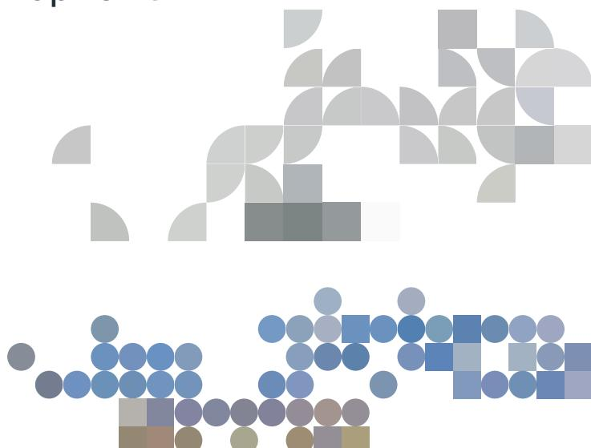
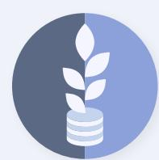
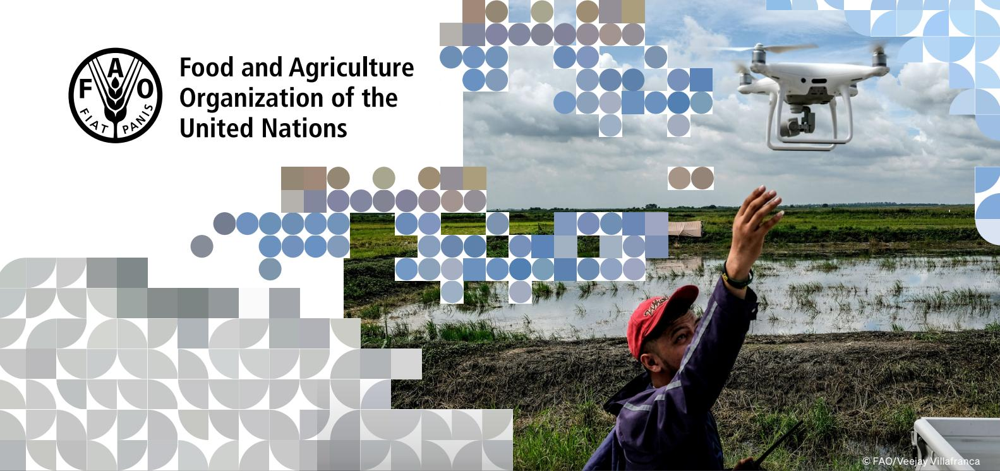
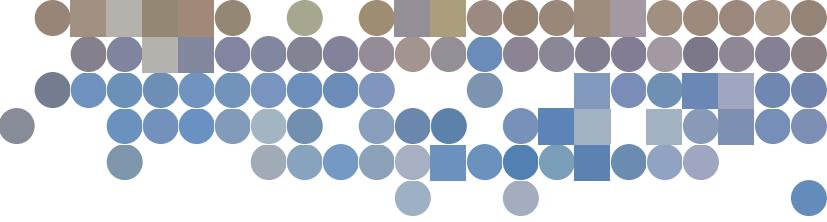

# SUPPORTING DEVELOPMENT FINANCE INSTITUTIONS FINANCING PRIVATE AGRIFOOD INVESTMENTS

Since 1964, the Investment Centre of the Food and Agriculture Organization of the United Nations (FAO) has helped design and implement investment projects to reduce poverty, hunger and malnutrition and advance sustainable development.

The Investment Centre acts as a bridge between countries and financing partners to create the enabling conditions for greater public and private investment to accelerate the transformation to more sustainable agrifood systems. It works in around 120 countries with an ever-expanding network of financing institutions, including the World Bank, the European Bank for Reconstruction and Development (EBRD), the International Fund for Agricultural Development (IFAD), the European Investment Bank (EIB) and the European Commission. Its growing multidisciplinary team draws from FAO's vast technical, policy and analytical expertise to provide countries with tailored, innovative and scalable investment and finance solutions.

INNOVATION AND KNOWLEDGE FOR INVESTMENT

#### EVIDENCE-BASED STRATEGY AND ADVISORY SERVICES

The Centre advises governments, development banks and partners on agrifood strategic orientations. Leveraging FAO's expertise and commitment to evidence-based approaches, the Centre offers guidance on dynamic agricultural topics that require a balanced and fact-based approach. These areas encompass food security, green finance, climate-smart agriculture, animal welfare, livestock, aquaculture, natural resources and biodiversity.

20 years of support to the definition of EBRD's agribusiness strategy (EUR 3.3 billion agribusiness portfolio, as of 2024).

# SECTOR STUDIES

The Centre produces joint studies with the World Bank, EBRD, IFAD and the European Commission on specific countries and value chains, regions and themes, including climate issues linked to the agrifood sector. The goal is to inform better investment decision-making.

Examples of recent sector studies:

- Can smallholder farmers in Honduras and Guatemala export deforestation-free coffee to the European Union?
- Modernizing irrigation in Central Asia
- Investing in carbon neutrality: utopia or the new green wave?

Production of more than 50 national food systems assessments to inform specific investment planning.

2

#### PROJECT PREPARATION, FROM DESIGN TO DUE DILIGENCE AND APPRAISAL

The Centre supports development finance institutions and impact funds that are contemplating private investments in value chains, countries or sectors where they lack expertise. This includes feasibility studies, value chain mapping, assessments of local financial institutions' agrifood strategies and portfolio composition.

Support to EIB in assessing the agrifood lending portfolios, activities and strategies of local banks in Africa.

## SUPPORT TO PROJECT IMPLEMENTATION

The Centre offers technical assistance services to support local financial institutions benefiting from financing from development banks and partners. It provides support throughout all phases of implementation, including supervision, monitoring and evaluation. This follows the model of the Centre's implementation support to ongoing World Bank projects, which amounts to more than USD 43 billion (in 2023).

Support to the Uganda Development Bank to grow its agrifood portfolio, strengthen environmental policies and develop innovative on-lending projects via FinTechs to reach smallholder farmers.

4

3

# INNOVATIVE FINANCE

The Centre provides support from the early design stages of new blended funds and facilities, including: developing the investment and impact strategy; defining objectives and priorities; reviewing business model and cost structure, aligning interests between key stakeholders (public and private investors, fund managers); structuring the technical assistance facility; and participating in investment committees as advisers.

Assessment of more than 270 private investment proposals submitted to the investment committees of four impact funds backed by the European Commission.

5

#### TARGETED AGRIFOOD PIPELINE DEVELOPMENT

The Centre supports development banks, donors, financial institutions and funds to identify a pipeline of private and/or public agrifood investment projects meeting their investment criteria, especially in challenging areas, building on FAO's local knowledge and networks.

Identification of a pipeline of 25 agri small and medium enterprises and microfinance institutions for an impact fund.

### POLICY DIALOGUE

As part of a UN agency, the Centre acts as a neutral broker and facilitates policy dialogue to inform policymakers and enhance regulations to unlock private investment in selected countries and boost the impact of specific private investment operations.

Reducing policy distortions for greater private sector participation in strategic supply chains and derisking grain trade in Egypt.

7

## CAPACITY DEVELOPMENT

The Centre provides training to the staff of development banks, donors and local financial institutions on topics related to agrifood financing. Training themes include agrifood investments, credit analysis, environmental and social safeguards and climate finance.

Training of more than 50 African microfinance institutions and banks on agricultural and rural finance.

8

#### KNOWLEDGE AND LEARNING

Through its Innovation and Knowledge for Investment (IK4I) publication series, the Centre disseminates lessons learned and best practices based on its experience. This includes co-publications with development banks and donors.

Recent IK4I publications:

- Bioinputs: Investment Opportunities in Latin America
- Digital technologies in the grain sector of Ukraine
- Tea sector reviews in Azerbaijan and Georgia
- Expanding Morocco's olive oil market. The role of consumers and industry response

9

The designations employed and the presentation of material in this information product do not imply the expression of any opinion whatsoever on the part of the Food and Agriculture Organization of the United Nations (FAO) concerning the legal or development status of any country, territory, city or area or of its authorities, or concerning the delimitation of its frontiers or boundaries.