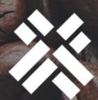

The EU Deforestation-free Products Regulation (EUDR) concerns **all exports from and imports to the EU market** relating to the following **seven commodities: cattle, soy, palm oil, wood, coffee, cocoa, and natural rubber, as well as products derived from these commodities, such as leather, chocolate or furniture.**

The **operator**, i.e. the company placing these products on the EU market or exporting from it, are legally obliged to self-certify that the goods are not linked to deforestation and were produced in compliance with the national regulations in the production country **(the products are deforestation-free and legal**).

To support their statement, operators **need to provide the exact geolocation of the production site** to EU authorities.

**For coffee, the production site refers to the plot of land** where the coffee was grown and applies to green coffee beans, as well as roasted coffee. Instant coffee is not part of the scope.

The operators are further required to crosscheck their compliance through a **due diligence process.** This means that they are expected to analyze their supply chain for observance of regulatory standards (e.g. are labour rights exercised, i.e. do all employees have contracts at the farm). **Suppliers to the EU market are not legally responsible under the EUDR**, since the import is conducted by their buyers.

However, the suppliers will be approached by their buyers about production details to show the deforestation-free and legal nature of their operations.

# **EUDR Requirements for the Coffee Sector**

**Essentials guide**

# **What is the EUDR?**

**Cocoa**

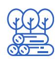

The EUDR is an environmental regulation with trade implications. It is a **market access requirement for the EU Market**.

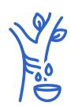

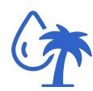

EUDR readiness may also provide a **competitive advantage** when it comes to sustainable practices required by new buyers.

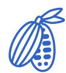

## **Why is the EUDR important?**

# **Commodities affected by EUDR**

The regulation came into force on June 29, 2023 and **will be applied from December 30, 2025.**

**Palm oil**

**Soya**

**Rubber**

### **1 Understand EUDR Data Requirements**

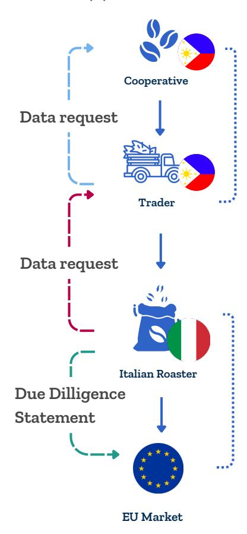

Identify the data needed for EUDR compliance, including product origin (geolocation), and production practices.

# **Practical steps around EUDR data requests**

A coffee cooperative sells green coffee beans to a local trader. The trader sells the beans on to a roaster in Italy. The Italian Roaster imports the green coffee beans to the EU, roasts them and sells them on. This means, they place them on the EU market.

> In this scenario, **none of the organizations in the Philippines, (including the cooperative and local trader) have obligations under the EUDR,** because they are not the ones selling products in the EU.

> This means, the **Italian roaster** is considered an operator and must provide certain information to EU authorities when importing.

> The **information needed** includes where the coffee beans were grown , such as, the **geolocation of the production site** (the field or plantation) and a declaration confirming that checks have been conducted to ensure the coffee beans have been produced in a **deforestation-free and legally compliant manner.** This is referred to as a due diligence process.

> To meet this requirement, the Italian **roaster will need to ask its supplier for details** about where the coffee beans came from and if they follow Philippine laws. Usually, this information comes from the original producers, cooperatives, and others involved in the supply chain.

### **Land plot**

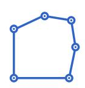

### **Company Information**

### **Documents**

**Producer Information**: Basic details about the farmer, producer or cooperative, such as name or identifier, which can be anonymized if needed. **Product Details**: Information about the type, quantity, and harvesting date of the commodity.

**Supporting documentation on Legality**: Evidence that the production followed the national legality framework. For example official registration documents, certification or documented practices.

**Product Origin**: The geolocation where the product was grown, including geolocation data (e.g. GPS coordinates or mapped boundaries).

| Fundamental data collection             | Integrated data collection                      |
|-----------------------------------------|-------------------------------------------------|
|                                         | management solution with buyer                  |
| your computer, cloud, or phone.         |                                                 |
| GEOJSON for polygon mapping, though     |                                                 |
| ensure accurate boundaries. Data can be |                                                 |
|                                         | customization for additional information.       |
|                                         | INATrace is a digital traceability solution for |
|                                         | agricultural raw materials — from               |
|                                         | production to the final product . INATrace      |

| Cost responsibility : Identify |                                 |
|--------------------------------|---------------------------------|
| Ownership : Users control data |                                 |
| Interoperability               | : Ensure EU                     |
| Confidentiality                | : Secure hosting                |
|                                | Exportability : Data in usable, |
|                                | Risk Mitigation : Support due   |

Selecting the methods and tools you will use for data collection is important. While doing so, try to keep the following key considerations in mind:

Many tools are designed to EUDR requirements, below are selected publicly available options.

Michaela Summerer International Trade Centre Email: [msummerer@intracen.org](mailto:msummerer@intracen.org)

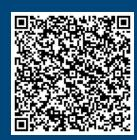

**Collect and manage data from multiple producers, ensuring it's compliant with EUDR standards and ready for international markets.**

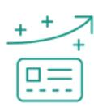

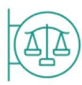

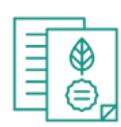

**Get listed on the DFTG registry, making your cooperative more visible to EU buyers looking for deforestation-free products.**

**Assess your situation with a deforestation risk analysis**

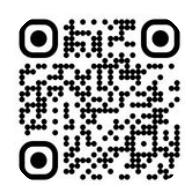

**Conveniently export EU Information System (IS) compatible data**

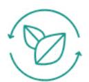

Manage the data which you collected and gain visibility with buyers through the United Nations platform **ITC Deforestation Free Trade Gateway** (DFTG). Data collected through the Excel template above can be imported in the DFTG easily, or data collected via the FAO ground App can be pushed to the DFTG.

The DFTG is a free platform that helps producers collect, control, and share deforestation-free data, ensuring compliance with the EU Deforestation Regulation (EUDR).

**Access the Deforestation-free Trade Gateway at [dftg.intracen.org](http://dftg.intracen.org/) or scan the QR Code :**

# **The Climate Competitiveness Project**

The International Trade Centre (ITC), implements the **Climate Competitiveness Project, a project funded by the EU.** The project works with a range of partner countries, including the Philippines, to strengthen engagement in the **discussions around trade and environment** issues at the World Trade Organization (WTO).

Based on an analysis of the role of trade in supporting climate change mitigation and adaptation objectives, it strengthens small business awareness around trade related climate measures and green transition market opportunities. The EUDR Guide was developed as part of this initiative.